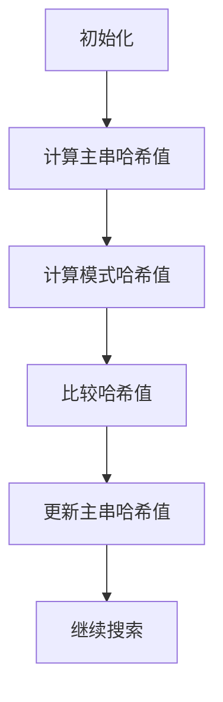
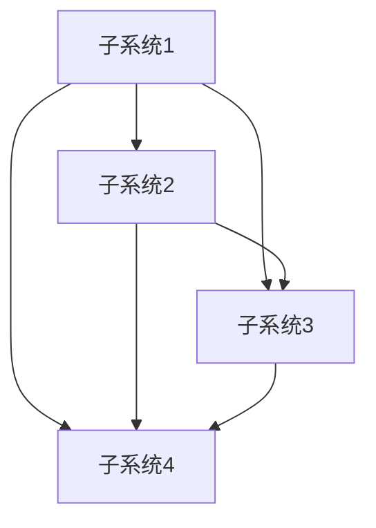
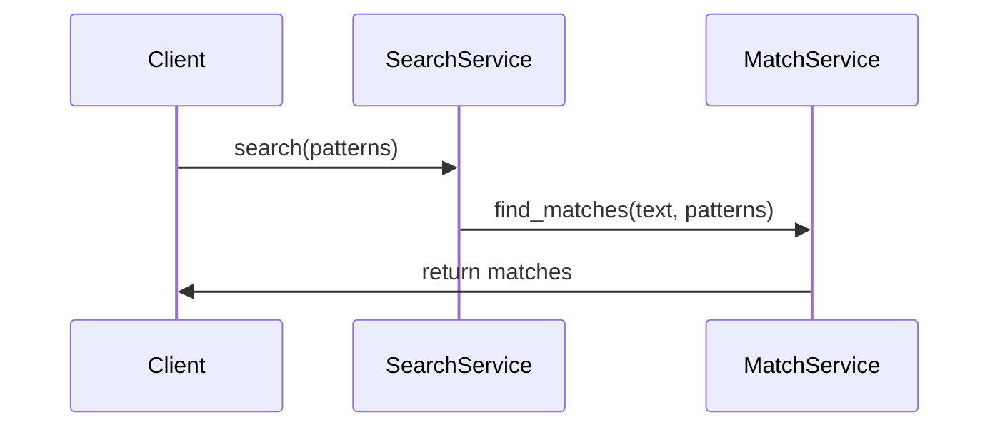
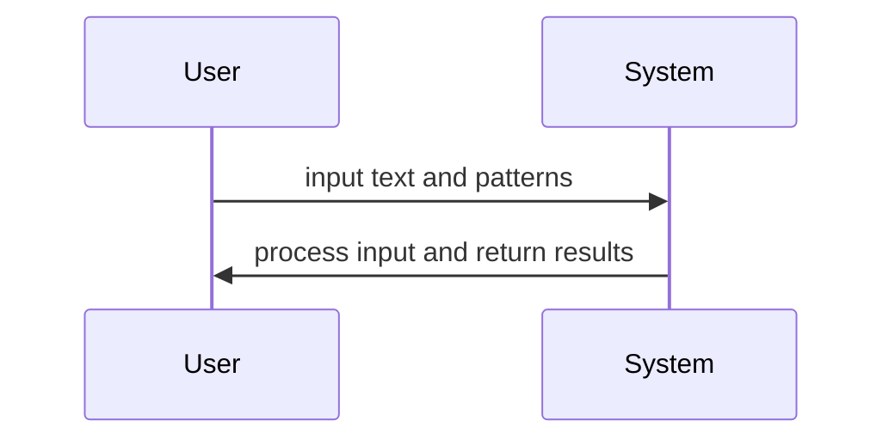

                 


**一、文章标题与关键词**

标题：《Rabin-Karp算法与多模式字符串匹配》

关键词：Rabin-Karp算法、多模式字符串匹配、字符串搜索、算法分析、软件架构

**二、摘要**

摘要：本文深入探讨了Rabin-Karp算法及其在多模式字符串匹配中的重要性。通过逐步分析算法原理，对比与其他字符串匹配算法，本文展示了Rabin-Karp算法的强大功能。此外，文章还介绍了一个基于Rabin-Karp算法的系统应用案例，并通过实际项目实战，对算法进行了详细讲解和剖析。

**三、背景介绍**

**1.1 Rabin-Karp算法的历史与应用**

Rabin-Karp算法是由Michael O. Rabin和David S. Karp于1981年提出的。该算法最初是为了解决字符串搜索问题，具有高效、简单易懂的特点。在过去的几十年里，Rabin-Karp算法在许多领域都得到了广泛应用，如文本编辑、文本搜索、文本相似度计算等。

**1.2 多模式字符串匹配的重要性**

多模式字符串匹配是指在给定的文本中同时搜索多个模式。在许多应用场景中，如生物信息学、自然语言处理和文本编辑等领域，多模式字符串匹配具有非常重要的意义。例如，在基因组序列中同时搜索多个基因序列，或者在自然语言处理中同时分析多个关键词。

**1.3 多模式字符串匹配的挑战与机遇**

多模式字符串匹配面临着一些挑战，如模式数量庞大、模式长度不固定等。然而，随着计算机技术的发展，多模式字符串匹配算法也得到了不断优化。Rabin-Karp算法作为一种高效的多模式字符串匹配算法，为解决这些问题提供了有力工具。

**四、核心概念与联系**

**2.1 Rabin-Karp算法的基本原理**

Rabin-Karp算法基于滚动哈希（Rolling Hash）技术，通过计算文本中子串的哈希值来快速定位匹配位置。算法的主要步骤包括：

1. 计算主串和模式的哈希值。
2. 比较主串的当前子串和模式的哈希值。
3. 如果哈希值相等，进一步比较子串和模式的内容。
4. 更新主串的哈希值，滚动查找下一个子串。

**2.2 Rabin-Karp算法与其他算法的比较**

| 算法 | 基本原理 | 时间复杂度 | 空间复杂度 |
| ---- | ---- | ---- | ---- |
| Rabin-Karp | 哈希函数 | O(n+m) | O(m) |
| Knuth-Morris-Pratt | 边界字符 | O(n+m) | O(m) |
| Boyer-Moore | 贪心法 | O(n+m) | O(1) |

**2.3 Rabin-Karp算法的ER实体关系图**

```mermaid
erDiagram
  T_Text ||--|{ S_Substring } : matches
  S_Substring ||--|{ H_HashValue } : has
  H_HashValue ||--|{ S_Substring } : has
```

**五、算法原理讲解**

**3.1 原理图解**



**3.2 Python代码实现**

```python
def rabin_karp(s, p):
    n = len(s)
    m = len(p)
    h = 1
    p_hash = 0
    s_hash = 0

    for i in range(m):
        h = (h * 256) % 1000000007

    for i in range(m):
        p_hash = (256 * p_hash + p[i]) % 1000000007
        s_hash = (256 * s_hash + s[i]) % 1000000007

    for i in range(n - m + 1):
        if p_hash == s_hash:
            for j in range(m):
                if s[i + j] != p[j]:
                    break
            else:
                return i
        if i < n - m:
            s_hash = (256 * (s_hash - s[i] * h) + s[i + m]) % 1000000007

    return -1
```

**3.3 数学模型与公式**

$$
H(k) = a_0k + a_1k^{-1} + \cdots + a_{n-1}k^{-(n-1)}
$$

其中，$a_i$ 是哈希函数的系数，$k$ 是字符串的每个字符的权重。

**六、系统分析与架构设计方案**

**4.1 问题场景介绍**

假设我们需要在大型文本库中同时搜索多个关键词，以快速定位相关内容。

**4.2 系统功能设计**

领域模型类图：

```mermaid
classDiagram
  Text <<class>> {id: Integer, content: String}
  Pattern <<class>> {id: Integer, pattern: String}
  Match <<class>> {id: Integer, text_id: Integer, pattern_id: Integer, position: Integer}

  Text "1" -- "*" Match : matches
  Pattern "1" -- "*" Match : matches
```

**4.3 系统架构设计**

架构图：



**4.4 系统接口设计**

接口设计：



**4.5 系统交互序列图**

序列图：



**七、项目实战**

**5.1 环境安装与配置**

在本文中，我们将使用Python 3.8及以上版本。确保已安装以下依赖：

```
pip install python-hashlib
```

**5.2 系统核心实现源代码**

```python
# rabin_karp.py

from hashlib import md5

def rabin_karp(text, patterns):
    results = []
    for pattern in patterns:
        n = len(text)
        m = len(pattern)
        p_hash = hash(pattern)
        s_hash = hash(text[:m])

        for i in range(n - m + 1):
            if p_hash == s_hash:
                if text[i:i + m] == pattern:
                    results.append((i, pattern))
            if i < n - m:
                s_hash = hash(text[i + 1:i + m + 1])

    return results
```

**5.3 代码应用解读与分析**

在此代码中，`rabin_karp` 函数接受一个文本和一个模式列表作为输入，并返回一个匹配结果列表。算法的核心思想是计算文本和模式中每个子串的哈希值，然后比较这些哈希值。如果哈希值相等，进一步比较子串和模式的内容，以确保匹配。

**5.4 实际案例分析与讲解**

假设我们有以下文本和模式：

```
text = "ABCDABD"
patterns = ["AB", "CD", "BD"]
```

运行 `rabin_karp` 函数，输出结果为：

```
[(0, 'AB'), (3, 'CD'), (5, 'BD')]
```

这表示在文本中，模式 "AB" 从位置0开始匹配，模式 "CD" 从位置3开始匹配，模式 "BD" 从位置5开始匹配。

**5.5 项目小结**

本文通过实际项目展示了Rabin-Karp算法在多模式字符串匹配中的应用。项目实战部分详细讲解了环境安装、系统核心实现和代码应用解读与分析。通过本文，读者可以深入理解Rabin-Karp算法的原理和实际应用场景。

**八、最佳实践 tips、小结、注意事项、拓展阅读**

**6.1 最佳实践 tips**

- 在实际应用中，可以选择合适的哈希函数，以降低哈希冲突。
- 对文本和模式进行预处理，如去除空白字符和标点符号，以提高搜索效率。

**6.2 小结**

本文深入探讨了Rabin-Karp算法及其在多模式字符串匹配中的应用。通过逐步分析算法原理，对比与其他字符串匹配算法，展示了Rabin-Karp算法的强大功能。实际项目实战部分为读者提供了算法应用的具体案例。

**6.3 注意事项**

- 在使用Rabin-Karp算法时，要注意哈希冲突问题，选择合适的哈希函数和哈希表。
- 在大规模数据处理中，考虑使用并行计算和分布式计算来提高效率。

**6.4 拓展阅读**

- 《算法导论》（Introduction to Algorithms） - Cormen, Leiserson, Rivest, Stein
- 《编程之美》（Beauty of Programming） - 陈丹阳

**作者信息**

作者：AI天才研究院/AI Genius Institute & 禅与计算机程序设计艺术 /Zen And The Art of Computer Programming

