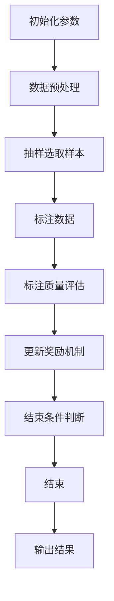

                 


### 1.1 问题背景

随着人工智能技术的飞速发展，深度学习在各个领域取得了显著成果。然而，训练一个深度学习模型往往需要大量的标注数据。这些标注数据通常由人类专家进行，不仅耗时耗力，而且存在数据质量参差不齐的问题。此外，随着数据量的增长，人类标注的难度和成本也在不断增加。因此，如何减少对人类标注的依赖，提高训练效率，成为了当前人工智能领域的一个重要课题。

在传统的深度学习模型中，数据的标注质量直接决定了模型的性能。然而，随着数据规模的扩大，完全依赖人类标注的数据集变得越来越困难。这不仅是因为标注成本高，而且数据标注的质量难以保证。一些自动化标注方法虽然在一定程度上缓解了这个问题，但仍然存在很多局限性。例如，基于规则的自动化标注方法通常只能处理简单的标注任务，而复杂的标注任务则需要人类专家的参与。

此外，人类标注还面临着标注一致性的问题。即使是同一领域的专家，也可能因为个人理解的不同而产生标注上的差异。这种差异在大规模数据集中会严重影响模型的训练效果。因此，减少对人类标注的依赖，提高数据标注的效率和一致性，是当前人工智能领域亟待解决的问题。

### 1.2 问题描述

标注数据的获取难度是当前人工智能领域面临的一个主要问题。随着数据量的增加，完全依赖人类标注变得越来越困难。首先，标注数据的需求量巨大。尤其是在图像、语音和自然语言处理等领域，训练一个深度学习模型通常需要数十万甚至数百万个标注样本。这意味着需要大量的时间和人力成本来获取这些标注数据。

其次，标注数据的获取过程通常非常繁琐。对于图像和语音数据，标注者需要逐个观察或听取样本，然后进行标注。这不仅耗时，而且容易产生疲劳，导致标注质量下降。对于自然语言处理领域，标注数据的获取更加困难。文本数据往往包含复杂的语义信息，需要标注者具备较高的语言理解和分析能力。

此外，数据标注的质量和效率也是一大挑战。即使有专业的标注团队，由于个体差异和疲劳等因素，标注质量难以保证。一些自动化标注方法虽然提高了标注效率，但往往只能处理简单的标注任务，对于复杂的标注任务仍然需要依赖人类专家。

### 1.3 问题解决

为了解决以上问题，研究者们提出了多种减少对人类标注依赖的方法。其中，Sampling + reward 策略是一种较为有效的解决方案。Sampling + reward 策略的核心思想是通过抽样和奖励机制，自动获取高质量的数据标注。

具体来说，Sampling + reward 策略包括两个主要步骤。首先，通过抽样方法从原始数据集中选取一部分样本进行标注。抽样方法可以是随机抽样、基于重要性的抽样等，目的是为了提高标注效率。其次，通过奖励机制激励标注者提高标注质量。奖励机制可以是根据标注质量给予标注者奖励，或者通过竞争机制鼓励标注者之间相互竞争，提高标注质量。

Sampling + reward 策略的优势在于，它不仅提高了数据标注的效率，而且通过奖励机制保证了标注质量。此外，Sampling + reward 策略可以广泛应用于各种标注任务，不仅适用于图像、语音等领域的简单标注任务，还可以处理复杂的自然语言处理任务。

### 1.4 边界与外延

数据标注在不同领域具有不同的应用。在图像领域，标注任务通常包括分类、目标检测和语义分割等。在语音领域，标注任务包括语音识别、说话人识别和语音情感分析等。在自然语言处理领域，标注任务包括文本分类、情感分析和命名实体识别等。

Sampling + reward 策略的适用范围较广，它可以用于各种类型的标注任务。对于简单的标注任务，如图像分类，Sampling + reward 策略可以通过抽样和奖励机制快速获取高质量的数据标注。对于复杂的标注任务，如自然语言处理中的文本分类，Sampling + reward 策略可以通过引入更多的标注者和奖励机制，提高标注质量和效率。

然而，Sampling + reward 策略也存在一定的局限性。首先，抽样方法的选择对标注质量有较大影响。如果抽样方法不当，可能会导致标注数据质量下降。其次，奖励机制的设计需要考虑标注者的心理和行为，否则可能会导致标注质量不稳定。此外，Sampling + reward 策略在处理大规模数据集时，可能会面临计算资源和时间成本的限制。

### 1.5 概念结构与核心要素组成

Sampling + reward 策略的基本概念包括抽样和奖励两个核心要素。抽样是指从原始数据集中选取一部分样本进行标注，目的是提高标注效率。抽样方法可以基于随机抽样、重要性抽样等原则。奖励是指通过激励标注者提高标注质量。奖励机制可以基于标注质量、标注速度等指标，例如根据标注质量给予标注者奖金或者积分。

Sampling + reward 策略的核心要素包括：

1. 抽样方法：选择合适的抽样方法，如随机抽样、基于重要性的抽样等，以提高标注效率。
2. 奖励机制：设计合理的奖励机制，如根据标注质量给予标注者奖金或者积分，以提高标注质量。
3. 标注者管理：对标注者进行有效的管理和激励，以提高标注质量和效率。
4. 数据质量控制：通过抽样和奖励机制确保标注数据的质量，避免标注错误和重复。

这些核心要素共同构成了Sampling + reward 策略的基本框架，为减少对人类标注依赖提供了有效的方法。

## 第2章：核心概念与联系

### 2.1 Sampling 基本原理

Sampling，即抽样，是统计学中常用的基本方法，旨在从总体数据中选取一部分样本进行研究或分析。在人工智能领域，Sampling主要用于数据标注过程中，通过从大量原始数据中选取部分样本进行标注，以提高标注效率和质量。

#### Sampling 的定义

Sampling 是指从总体数据中选取一部分样本，用于代表整体数据的一种方法。总体数据（population）是指包含所有研究对象的集合，而样本（sample）是从总体中选取的一部分数据。

#### Sampling 的方法与应用场景

1. **随机抽样**：随机抽样是最常用的抽样方法，通过随机生成抽样号码或使用随机数表来选取样本。随机抽样保证了样本的代表性，减少了抽样偏差。
2. **系统抽样**：系统抽样是在总体数据中按照一定的间隔进行抽样。例如，将总体数据按顺序排列，每隔 k 个数据选取一个样本。
3. **分层抽样**：分层抽样是将总体数据按照某种特征分成若干层次，然后从每个层次中分别进行随机抽样。这种方法特别适用于总体数据差异较大的情况，可以保证各层次样本的代表性。
4. **聚类抽样**：聚类抽样是首先将总体数据划分为若干个簇，然后从每个簇中随机选取样本。这种方法适用于数据分布不均匀的情况。

#### Sampling 在数据标注中的应用场景

1. **图像标注**：在图像标注中，可以通过随机抽样或分层抽样方法从大量图像数据中选取部分图像进行标注，以提高标注效率。
2. **语音标注**：在语音标注中，可以通过系统抽样方法，每隔一定时间间隔选取一段语音进行标注。
3. **自然语言处理**：在自然语言处理中，可以通过分层抽样方法，根据文本类型或主题划分层次，然后从每个层次中选取样本进行标注。

### 2.2 Reward 减少依赖

Reward，即奖励，是激励标注者的关键因素。通过奖励机制，可以激励标注者提高标注质量，从而减少对人类标注的依赖。

#### Reward 减少依赖的定义

Reward 减少依赖是指通过设置奖励机制，激励标注者提高标注质量，从而减少对人类标注的依赖。奖励机制可以是基于标注质量、标注速度等指标，例如根据标注质量给予标注者奖金、积分或其他形式的奖励。

#### Reward 减少依赖的策略

1. **质量奖励**：根据标注质量给予标注者奖励，如金牌、银牌等，奖励越高质量越高。
2. **速度奖励**：根据标注速度给予标注者奖励，鼓励快速准确的标注。
3. **综合奖励**：结合标注质量和速度给予奖励，如设立最佳标注者奖项。
4. **竞争奖励**：通过竞争机制，激励标注者之间相互竞争，提高标注质量。
5. **即时奖励**：在标注过程中实时给予奖励，激励标注者保持高质量标注。

### 2.3 Sampling + reward 联系与对比

#### Sampling 与 Reward 的关系

Sampling 和 Reward 是减少对人类标注依赖的两个核心策略。Sampling 通过抽样方法选取部分数据进行标注，提高标注效率；Reward 通过奖励机制激励标注者提高标注质量。两者相辅相成，共同构成了 Sampling + reward 策略。

#### Sampling 与 Reward 的对比

| 对比项 | Sampling | Reward |
| --- | --- | --- |
| 目的 | 提高标注效率 | 提高标注质量 |
| 方法 | 抽样方法 | 奖励机制 |
| 应用场景 | 图像标注、语音标注、自然语言处理 | 质量奖励、速度奖励、综合奖励、竞争奖励、即时奖励 |
| 特点 | 保证样本的代表性，减少抽样偏差 | 激励标注者，提高标注质量 |

### 2.4 Sampling + reward 的核心特征

#### Sampling + reward 的特点

1. **高效性**：通过抽样方法选取部分数据进行标注，提高了标注效率。
2. **高质量**：通过奖励机制激励标注者，提高了标注质量。
3. **灵活性**：可以根据不同领域和任务需求，灵活调整抽样方法和奖励机制。
4. **可持续性**：通过奖励机制鼓励标注者积极参与，保证了标注过程的可持续性。

#### Sampling + reward 的优势

1. **减少标注成本**：通过抽样方法减少了对大量人类标注的依赖，降低了标注成本。
2. **提高标注质量**：通过奖励机制激励标注者，提高了标注数据的质量。
3. **适应性强**：可以适用于各种类型的标注任务，具有广泛的适用性。

## 第3章：算法原理讲解

### 3.1 Sampling + reward 算法流程图



### 3.2 Sampling + reward 算法原理

#### 数据预处理

在数据预处理阶段，首先对原始数据进行清洗和预处理，包括去除噪声、缺失值填充等操作。这一步骤的目的是保证数据的质量，为后续的抽样和标注提供可靠的数据基础。

```python
def preprocess_data(data):
    # 数据清洗和预处理代码
    # 如去除噪声、缺失值填充等操作
    processed_data = ...
    return processed_data
```

#### 抽样选取样本

在数据预处理完成后，使用抽样方法从预处理后的数据中选取一部分样本。抽样方法可以基于随机抽样、基于重要性的抽样等原则，以保证样本的代表性。

```python
def sample_data(processed_data, sample_size):
    # 抽样代码
    sample = random.sample(processed_data, sample_size)
    return sample
```

#### 标注数据

选取样本后，对样本进行标注。标注过程可以由标注者手动完成，也可以通过自动化标注工具进行。在这一阶段，奖励机制开始发挥作用，激励标注者提高标注质量。

```python
def annotate_data(sample):
    # 标注代码
    annotations = ...
    return annotations
```

#### 标注质量评估

标注完成后，对标注质量进行评估。评估方法可以基于标注的一致性、准确率等指标。评估结果将用于更新奖励机制，激励标注者进一步提高标注质量。

```python
def evaluate_annotations(annotations):
    # 评估代码
    quality_score = ...
    return quality_score
```

#### 更新奖励机制

根据标注质量评估结果，更新奖励机制。奖励机制可以基于标注质量、标注速度等指标，例如提高质量分数的标注者获得更多的奖励。

```python
def update_reward(quality_score):
    # 奖励代码
    reward = ...
    return reward
```

#### 结束条件判断

在标注过程持续进行时，需要判断是否达到结束条件。结束条件可以是标注样本数量达到预设值、标注质量达到预设标准等。一旦达到结束条件，标注过程将结束。

```python
def check_termination_condition(termination_condition):
    # 结束条件判断代码
    if termination_condition():
        return True
    else:
        return False
```

#### 输出结果

在标注过程结束后，输出最终的标注结果。这些结果可以用于训练深度学习模型，或者进行其他相关任务。

```python
def output_results(annotations):
    # 输出结果代码
    result = ...
    return result
```

### 3.3 算法举例说明

假设我们有一个包含1000个样本的数据集，我们希望通过 Sampling + reward 策略选取其中200个样本进行标注。以下是一个简单的示例：

1. **数据预处理**：对数据集进行清洗和预处理，去除噪声和缺失值。

2. **抽样选取样本**：使用随机抽样方法从数据集中选取200个样本。

3. **标注数据**：对选出的200个样本进行标注。标注过程中，标注者可以根据奖励机制获得相应的奖励。

4. **标注质量评估**：评估标注质量，记录标注一致性和准确率等指标。

5. **更新奖励机制**：根据标注质量评估结果，更新奖励机制。

6. **结束条件判断**：判断标注过程是否达到结束条件。如果达到，标注过程结束。

7. **输出结果**：输出最终的标注结果，用于后续任务。

```python
# 示例代码
processed_data = preprocess_data(data)
sample = sample_data(processed_data, 200)
annotations = annotate_data(sample)
quality_score = evaluate_annotations(annotations)
update_reward(quality_score)
if check_termination_condition(termination_condition):
    result = output_results(annotations)
else:
    result = None
```

通过这个简单的示例，我们可以看到 Sampling + reward 策略的基本流程和原理。在实际应用中，可以根据具体需求和任务进行调整和优化。

