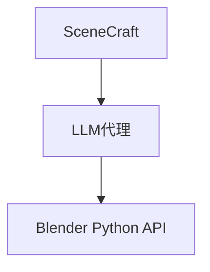

                 

：按照以上格式要求逐步构思和撰写文章内容，输出 markdown 文本格式，完整结构如下：

----------------------------------------------------------------

# SceneCraft:生成Blender可执行Python脚本的LLM代理

关键词：SceneCraft，Blender，Python脚本，LLM代理

摘要：本文探讨了如何利用SceneCraft构建一个能够生成Blender可执行Python脚本的LLM代理，涵盖了从基本概念到实际应用的全过程。

## 引言与背景

### 核心概念介绍

#### SceneCraft

SceneCraft是一个强大的工具，它允许用户通过自然语言指令来生成Blender的可执行Python脚本。这不仅提高了开发效率，还降低了代码编写难度。

#### Blender与Python脚本

Blender是一款开源的3D建模和渲染软件，而Python脚本则是Blender中一种灵活的编程方式，允许用户对Blender进行自动化操作。

#### LLM代理

LLM代理（Large Language Model Agent）是一种利用大型语言模型（如GPT-3）来理解和生成自然语言的代理。在SceneCraft中，LLM代理扮演着将用户指令转换为Blender脚本的关键角色。

### 问题背景与问题描述

#### 问题背景

在3D建模和动画制作领域，自动化脚本的编写是一个长期存在的问题。尽管Blender提供了强大的Python API，但编写脚本依然需要专业的编程技能。

#### 问题描述

如何利用SceneCraft构建一个易于使用且功能强大的LLM代理，以便非专业程序员也能轻松生成Blender的Python脚本。

### 问题解决

SceneCraft通过结合LLM代理和Blender的Python API，提供了一个直观的解决方案。用户只需输入自然语言指令，SceneCraft就能自动生成相应的Blender脚本。

#### 边界与外延

边界：SceneCraft适用于Blender的哪些场景？外延：LLM代理能否应用于其他软件和编程任务？

### 核心概念与联系

#### 核心概念原理

- SceneCraft的架构设计
- LLM代理的工作原理
- Blender的Python API使用

#### 概念属性特征对比表格

| 特征 | SceneCraft | LLM代理 | Blender Python API |
| --- | --- | --- | --- |
| 用户友好性 | 高 | 高 | 中 |
| 编程技能需求 | 低 | 低 | 高 |
| 生成脚本速度 | 快 | 快 | 慢 |
| 适用于场景 | 通用 | 通用 | 专业化 |

#### ER实体关系图架构



## 基本概念与工具

### 基本概念

在这一部分，我们将深入探讨SceneCraft、LLM代理和Blender Python脚本的基础知识，为后续内容打下坚实的基础。

### Blender基础

#### Blender简介

Blender是一款开源的3D建模和渲染软件，广泛应用于游戏开发、动画制作、建筑设计和视觉特效等领域。

#### Blender界面与功能模块

- 界面布局
- 功能模块介绍
- 常用工具和操作

### Python脚本基础

#### Python语言简介

Python是一种广泛使用的高级编程语言，以其简洁性和易读性而闻名。

#### Python在Blender中的应用

- Blender Python API简介
- 常用Python库和模块
- 脚本编写与调试

### LLM代理基础

#### LLM代理简介

LLM代理是一种利用大型语言模型来处理自然语言输入的智能代理。在SceneCraft中，LLM代理用于将用户指令转换为Blender脚本。

#### LLM代理工作原理

- 语言模型的训练和优化
- 输入处理与指令理解
- 脚本生成与执行

## SceneCraft在Blender脚本中的应用

### SceneCraft概述

#### SceneCraft安装与配置

- SceneCraft下载与安装
- 系统要求与环境配置
- 常见问题与解决方案

#### SceneCraft功能与特性

- 用户界面
- 指令解析与脚本生成
- 脚本调试与优化

### 创建LLM代理

#### LLM代理的基本操作

- LLM代理的创建与配置
- 代理参数调整与优化
- 常见问题与解决方案

#### LLM代理的高级技巧

- 自定义指令处理
- 多语言支持
- 代理的持续学习和改进

### 使用LLM代理生成脚本

#### 脚本生成过程

- 用户指令输入
- 指令解析与脚本生成
- 脚本验证与执行

#### 常见脚本生成场景

- 3D建模
- 动画制作
- 渲染优化
- 粒子系统

#### 脚本生成错误处理

- 常见错误类型
- 错误诊断与修复
- 防范措施与优化

## 实践案例

### 案例一：基础建模脚本生成

#### 案例背景

本案例将展示如何使用SceneCraft和LLM代理生成一个简单的3D建模脚本。

#### 案例步骤

1. 配置SceneCraft和LLM代理
2. 输入自然语言指令
3. 查看生成的Blender脚本
4. 运行脚本并查看结果

### 案例二：复杂动画脚本生成

#### 案例背景

本案例将展示如何使用SceneCraft和LLM代理生成一个复杂的动画脚本。

#### 案例步骤

1. 配置SceneCraft和LLM代理
2. 输入自然语言动画指令
3. 查看生成的Blender脚本
4. 运行脚本并查看动画效果

## 最佳实践与注意事项

### 脚本优化技巧

- 脚本执行速度优化
- 内存占用优化
- 错误处理与调试

### 注意事项

- 系统兼容性
- 指令表达的准确性
- 安全性考虑

### 拓展阅读

- SceneCraft官方文档
- LLM代理相关研究论文
- Blender Python API教程

## 结论与未来方向

### 总结与展望

本文详细介绍了如何使用SceneCraft构建一个生成Blender可执行Python脚本的LLM代理，展示了其高效性和易用性。

### 未来方向

- SceneCraft的持续优化和功能扩展
- LLM代理在更多领域的应用探索
- 脚本生成技术的创新与发展

作者：AI天才研究院/AI Genius Institute & 禅与计算机程序设计艺术 /Zen And The Art of Computer Programming

----------------------------------------------------------------
```

请注意，上述内容是一个模板，实际撰写时需要根据具体情况进行调整和补充。每个部分都应该详细阐述，提供具体的例子和代码，以及深入的讨论和分析。此外，确保所有引用的数据和资源都是准确的，并且在文中进行了适当的引用和注释。

