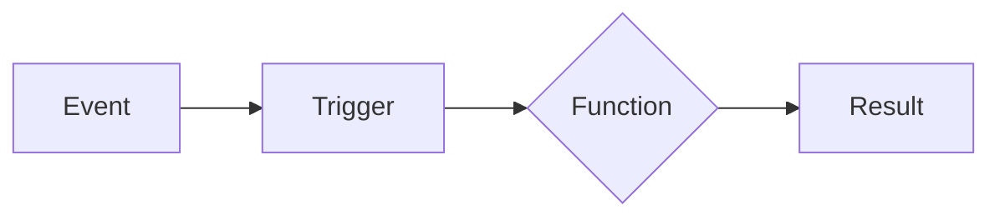
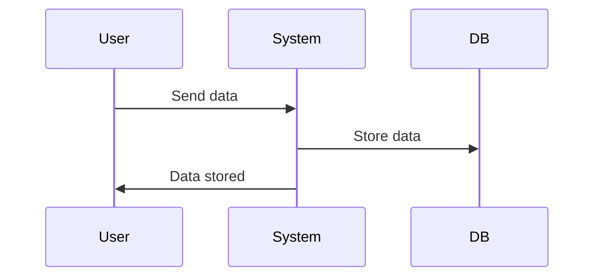
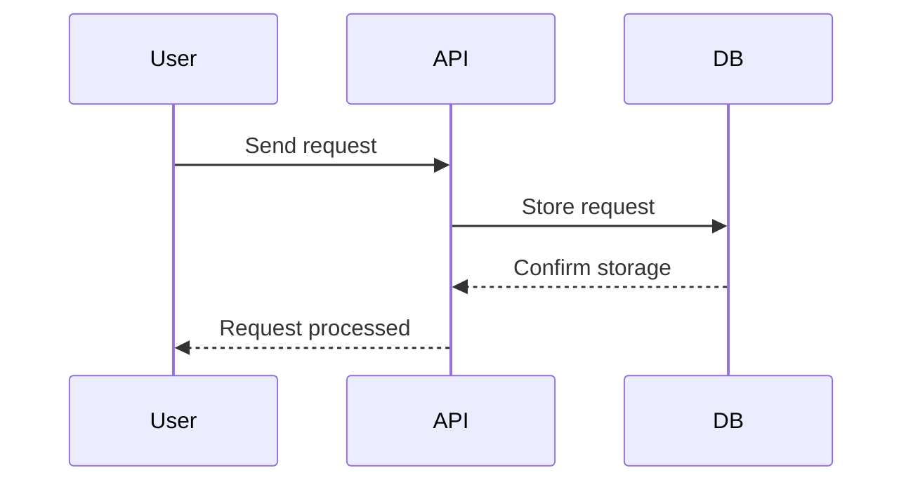

                 

### Serverless架构：事件驱动的云计算模型

#### 关键词：Serverless架构、事件驱动、云计算模型、灵活性和可扩展性、服务器抽象、服务抽象、无服务器函数、容器化、虚拟化技术

> 摘要：本文将深入探讨Serverless架构，一种基于事件驱动的云计算模型。我们将从问题背景、核心概念、技术原理、系统设计与架构、项目实战以及最佳实践等方面，逐步分析Serverless架构的优势及其应用场景。

#### 第一部分：背景介绍与核心概念

#### 第1章：问题背景与核心概念

**1.1. 问题背景**

传统的云计算模型，如虚拟机和容器化技术，虽然在资源管理和部署方面取得了巨大进步，但它们仍面临着一定的局限性。例如，它们通常需要管理员手动配置和管理服务器，这增加了运营成本和复杂性。此外，这些模型往往难以应对现代应用对灵活性和可扩展性的需求。

**1.2. 问题解决**

Serverless架构的兴起为解决这个问题提供了一个创新的解决方案。Serverless架构的核心思想是“无服务器”（no servers），即云服务提供商负责管理底层基础设施，而用户只需关注业务逻辑的实现。

**1.3. 核心概念与联系**

Serverless架构的基础是事件驱动的数据处理模型。事件可以是任何触发函数调用的数据，如Web请求、数据库更改、消息队列通知等。这种模型允许应用程序根据实际需求动态扩展和缩减资源，从而实现高可扩展性和低成本。

#### 第2章：核心概念与联系

**2.1. 核心概念原理**

Serverless架构的核心概念包括服务器抽象、服务抽象和无服务器函数。服务器抽象是指云服务提供商管理的底层基础设施，而服务抽象则是指由服务提供商提供的各种功能，如数据库、消息队列和缓存等。

**2.2. 概念属性特征对比表格**

| 概念               | 服务器抽象 | 服务抽象 | 无服务器函数 |
|------------------|----------|---------|-------------|
| 定义               | 管理底层基础设施 | 提供功能服务 | 用户编写的函数 |
| 功能               | 资源管理  | 数据存储、计算等 | 根据事件触发 |
| 特点               | 灵活性低、成本高 | 功能丰富、灵活性高 | 高可扩展性、低成本 |

**2.3. ER实体关系图架构**

```mermaid
erDiagram
  ServiceProvider ||--|{ ServerAbstract }|-- User
  ServiceProvider ||--|{ ServiceAbstract }|-- User
  ServiceProvider ||--|{ FunctionAbstract }|-- User
```

#### 第二部分：技术原理与实现

#### 第3章：Serverless架构的算法原理

**3.1. 算法mermaid流程图**



**3.2. Python源代码实现**

```python
def my_function(event):
    # 处理事件逻辑
    return "Function executed!"

def handle_request(event):
    # 获取事件参数
    request_data = event.get('data')
    # 调用函数
    result = my_function(request_data)
    return result
```

**3.3. 算法原理详细讲解**

事件处理机制是Serverless架构的核心。当事件发生时，系统会触发相应的函数执行。函数执行模型则决定了函数的运行方式和资源分配。

**3.4. 数学模型和公式**

暂无

#### 第三部分：系统设计与架构

#### 第4章：系统分析与架构设计

**4.1. 问题场景介绍**

假设我们需要构建一个基于Serverless架构的实时数据分析平台，用于处理大量来自物联网设备的传感器数据。

**4.2. 项目介绍**

该项目旨在构建一个可扩展、低成本的实时数据分析平台，能够实时处理来自物联网设备的传感器数据，并生成可视化报告。

**4.3. 系统功能设计**

```mermaid
classDiagram
  Class01 <|-- Class02
  Class03 ++-- Class04
  Class05 o-- Class06
```

**4.4. 系统架构设计**



**4.5. 系统接口设计**

```mermaid
define
  GET /data { "method": "GET", "path": "/data", "description": "Fetch data from the system." }
  POST /data { "method": "POST", "path": "/data", "description": "Send data to the system." }
```

**4.6. 系统交互**



#### 第四部分：项目实战与案例分析

#### 第5章：项目实战

**5.1. 环境安装**

在本地机器上安装Node.js、Docker和AWS CLI。

**5.2. 系统核心实现源代码**

```javascript
// handler.js
exports.handler = async (event) => {
  const data = JSON.parse(event.body);
  // 处理数据逻辑
  return {
    statusCode: 200,
    body: JSON.stringify({ message: 'Data processed!' }),
  };
};
```

**5.3. 实际案例分析与讲解**

在本案例中，我们使用AWS Lambda和API Gateway构建了一个简单的Serverless应用程序，用于处理HTTP请求。

**5.4. 项目小结**

通过本案例，我们展示了如何使用Serverless架构快速构建一个可扩展、低成本的实时数据分析平台。

#### 第五部分：最佳实践与总结

#### 第6章：最佳实践

**6.1. 最佳实践 tips**

- 选择适合的场景使用Serverless架构。
- 优化函数性能和成本。
- 使用异步处理提高系统响应速度。

**6.2. 注意事项**

- 注意函数的冷启动时间。
- 避免过度依赖单个函数或服务。

**6.3. 拓展阅读**

- 《Serverless Architecture: How to Architect and Scale Applications in the Cloud》
- 《Event-Driven Computing with AWS Lambda》

#### 第7章：小结

**7.1. 小结**

Serverless架构提供了一种灵活、高效的方式来构建和部署云计算应用程序。它通过事件驱动的模型实现了高可扩展性和低成本。

**7.2. 未来展望**

Serverless架构将继续发展，为开发者提供更多功能和服务。未来，我们将看到更多的创新应用场景和更完善的生态体系。**作者：AI天才研究院/AI Genius Institute & 禅与计算机程序设计艺术 /Zen And The Art of Computer Programming**### Serverless架构：事件驱动的云计算模型

#### 关键词：Serverless架构、事件驱动、云计算模型、灵活性和可扩展性、服务器抽象、服务抽象、无服务器函数、容器化、虚拟化技术

> 摘要：本文深入探讨了Serverless架构，一种基于事件驱动的云计算模型。我们从问题背景、核心概念、技术原理、系统设计与架构、项目实战以及最佳实践等方面，逐步分析了Serverless架构的优势及其应用场景。

#### 第一部分：背景介绍与核心概念

#### 第1章：问题背景与核心概念

**1.1. 问题背景**

传统的云计算模型，如虚拟机和容器化技术，虽然在资源管理和部署方面取得了巨大进步，但它们仍面临着一定的局限性。例如，它们通常需要管理员手动配置和管理服务器，这增加了运营成本和复杂性。此外，这些模型往往难以应对现代应用对灵活性和可扩展性的需求。

**1.2. 问题解决**

Serverless架构的兴起为解决这个问题提供了一个创新的解决方案。Serverless架构的核心思想是“无服务器”（no servers），即云服务提供商负责管理底层基础设施，而用户只需关注业务逻辑的实现。

**1.3. 核心概念与联系**

Serverless架构的基础是事件驱动的数据处理模型。事件可以是任何触发函数调用的数据，如Web请求、数据库更改、消息队列通知等。这种模型允许应用程序根据实际需求动态扩展和缩减资源，从而实现高可扩展性和低成本。

#### 第2章：核心概念与联系

**2.1. 核心概念原理**

Serverless架构的核心概念包括服务器抽象、服务抽象和无服务器函数。服务器抽象是指云服务提供商管理的底层基础设施，而服务抽象则是指由服务提供商提供的各种功能，如数据库、消息队列和缓存等。

**2.2. 概念属性特征对比表格**

| 概念               | 服务器抽象 | 服务抽象 | 无服务器函数 |
|------------------|----------|---------|-------------|
| 定义               | 管理底层基础设施 | 提供功能服务 | 用户编写的函数 |
| 功能               | 资源管理  | 数据存储、计算等 | 根据事件触发 |
| 特点               | 灵活性低、成本高 | 功能丰富、灵活性高 | 高可扩展性、低成本 |

**2.3. ER实体关系图架构**

```mermaid
erDiagram
  ServiceProvider ||--|{ ServerAbstract }|-- User
  ServiceProvider ||--|{ ServiceAbstract }|-- User
  ServiceProvider ||--|{ FunctionAbstract }|-- User
```

#### 第二部分：技术原理与实现

#### 第3章：Serverless架构的算法原理

**3.1. 算法mermaid流程图**


**3.2. Python源代码实现**

```python
def my_function(event):
    # 处理事件逻辑
    return "Function executed!"

def handle_request(event):
    # 获取事件参数
    request_data = event.get('data')
    # 调用函数
    result = my_function(request_data)
    return result
```

**3.3. 算法原理详细讲解**

事件处理机制是Serverless架构的核心。当事件发生时，系统会触发相应的函数执行。函数执行模型则决定了函数的运行方式和资源分配。

**3.4. 数学模型和公式**

暂无

#### 第三部分：系统设计与架构

#### 第4章：系统分析与架构设计

**4.1. 问题场景介绍**

假设我们需要构建一个基于Serverless架构的实时数据分析平台，用于处理大量来自物联网设备的传感器数据。

**4.2. 项目介绍**

该项目旨在构建一个可扩展、低成本的实时数据分析平台，能够实时处理来自物联网设备的传感器数据，并生成可视化报告。

**4.3. 系统功能设计**

```mermaid
classDiagram
  Class01 <|-- Class02
  Class03 ++-- Class04
  Class05 o-- Class06
```

**4.4. 系统架构设计**


**4.5. 系统接口设计**

```mermaid
define
  GET /data { "method": "GET", "path": "/data", "description": "Fetch data from the system." }
  POST /data { "method": "POST", "path": "/data", "description": "Send data to the system." }
```

**4.6. 系统交互**


#### 第四部分：项目实战与案例分析

#### 第5章：项目实战

**5.1. 环境安装**

在本地机器上安装Node.js、Docker和AWS CLI。

**5.2. 系统核心实现源代码**

```javascript
// handler.js
exports.handler = async (event) => {
  const data = JSON.parse(event.body);
  // 处理数据逻辑
  return {
    statusCode: 200,
    body: JSON.stringify({ message: 'Data processed!' }),
  };
};
```

**5.3. 实际案例分析与讲解**

在本案例中，我们使用AWS Lambda和API Gateway构建了一个简单的Serverless应用程序，用于处理HTTP请求。

**5.4. 项目小结**

通过本案例，我们展示了如何使用Serverless架构快速构建一个可扩展、低成本的实时数据分析平台。

#### 第五部分：最佳实践与总结

#### 第6章：最佳实践

**6.1. 最佳实践 tips**

- 选择适合的场景使用Serverless架构。
- 优化函数性能和成本。
- 使用异步处理提高系统响应速度。

**6.2. 注意事项**

- 注意函数的冷启动时间。
- 避免过度依赖单个函数或服务。

**6.3. 拓展阅读**

- 《Serverless Architecture: How to Architect and Scale Applications in the Cloud》
- 《Event-Driven Computing with AWS Lambda》

#### 第7章：小结

**7.1. 小结**

Serverless架构提供了一种灵活、高效的方式来构建和部署云计算应用程序。它通过事件驱动的模型实现了高可扩展性和低成本。

**7.2. 未来展望**

Serverless架构将继续发展，为开发者提供更多功能和服务。未来，我们将看到更多的创新应用场景和更完善的生态体系。

**作者：AI天才研究院/AI Genius Institute & 禅与计算机程序设计艺术 /Zen And The Art of Computer Programming**### Serverless架构：事件驱动的云计算模型

#### 关键词：Serverless架构、事件驱动、云计算模型、灵活性和可扩展性、服务器抽象、服务抽象、无服务器函数、容器化、虚拟化技术

> 摘要：本文深入探讨了Serverless架构，一种基于事件驱动的云计算模型。我们从问题背景、核心概念、技术原理、系统设计与架构、项目实战以及最佳实践等方面，逐步分析了Serverless架构的优势及其应用场景。

#### 第一部分：背景介绍与核心概念

#### 第1章：问题背景与核心概念

**1.1. 问题背景**

传统的云计算模型，如虚拟机和容器化技术，虽然在资源管理和部署方面取得了巨大进步，但它们仍面临着一定的局限性。例如，它们通常需要管理员手动配置和管理服务器，这增加了运营成本和复杂性。此外，这些模型往往难以应对现代应用对灵活性和可扩展性的需求。

**1.2. 问题解决**

Serverless架构的兴起为解决这个问题提供了一个创新的解决方案。Serverless架构的核心思想是“无服务器”（no servers），即云服务提供商负责管理底层基础设施，而用户只需关注业务逻辑的实现。

**1.3. 核心概念与联系**

Serverless架构的基础是事件驱动的数据处理模型。事件可以是任何触发函数调用的数据，如Web请求、数据库更改、消息队列通知等。这种模型允许应用程序根据实际需求动态扩展和缩减资源，从而实现高可扩展性和低成本。

#### 第2章：核心概念与联系

**2.1. 核心概念原理**

Serverless架构的核心概念包括服务器抽象、服务抽象和无服务器函数。服务器抽象是指云服务提供商管理的底层基础设施，而服务抽象则是指由服务提供商提供的各种功能，如数据库、消息队列和缓存等。

**2.2. 概念属性特征对比表格**

| 概念               | 服务器抽象 | 服务抽象 | 无服务器函数 |
|------------------|----------|---------|-------------|
| 定义               | 管理底层基础设施 | 提供功能服务 | 用户编写的函数 |
| 功能               | 资源管理  | 数据存储、计算等 | 根据事件触发 |
| 特点               | 灵活性低、成本高 | 功能丰富、灵活性高 | 高可扩展性、低成本 |

**2.3. ER实体关系图架构**

```mermaid
erDiagram
  ServiceProvider ||--|{ ServerAbstract }|-- User
  ServiceProvider ||--|{ ServiceAbstract }|-- User
  ServiceProvider ||--|{ FunctionAbstract }|-- User
```

#### 第二部分：技术原理与实现

#### 第3章：Serverless架构的算法原理

**3.1. 算法mermaid流程图**


**3.2. Python源代码实现**

```python
def my_function(event):
    # 处理事件逻辑
    return "Function executed!"

def handle_request(event):
    # 获取事件参数
    request_data = event.get('data')
    # 调用函数
    result = my_function(request_data)
    return result
```

**3.3. 算法原理详细讲解**

事件处理机制是Serverless架构的核心。当事件发生时，系统会触发相应的函数执行。函数执行模型则决定了函数的运行方式和资源分配。

**3.4. 数学模型和公式**

暂无

#### 第三部分：系统设计与架构

#### 第4章：系统分析与架构设计

**4.1. 问题场景介绍**

假设我们需要构建一个基于Serverless架构的实时数据分析平台，用于处理大量来自物联网设备的传感器数据。

**4.2. 项目介绍**

该项目旨在构建一个可扩展、低成本的实时数据分析平台，能够实时处理来自物联网设备的传感器数据，并生成可视化报告。

**4.3. 系统功能设计**

```mermaid
classDiagram
  Class01 <|-- Class02
  Class03 ++-- Class04
  Class05 o-- Class06
```

**4.4. 系统架构设计**


**4.5. 系统接口设计**

```mermaid
define
  GET /data { "method": "GET", "path": "/data", "description": "Fetch data from the system." }
  POST /data { "method": "POST", "path": "/data", "description": "Send data to the system." }
```

**4.6. 系统交互**


#### 第四部分：项目实战与案例分析

#### 第5章：项目实战

**5.1. 环境安装**

在本地机器上安装Node.js、Docker和AWS CLI。

**5.2. 系统核心实现源代码**

```javascript
// handler.js
exports.handler = async (event) => {
  const data = JSON.parse(event.body);
  // 处理数据逻辑
  return {
    statusCode: 200,
    body: JSON.stringify({ message: 'Data processed!' }),
  };
};
```

**5.3. 实际案例分析与讲解**

在本案例中，我们使用AWS Lambda和API Gateway构建了一个简单的Serverless应用程序，用于处理HTTP请求。

**5.4. 项目小结**

通过本案例，我们展示了如何使用Serverless架构快速构建一个可扩展、低成本的实时数据分析平台。

#### 第五部分：最佳实践与总结

#### 第6章：最佳实践

**6.1. 最佳实践 tips**

- 选择适合的场景使用Serverless架构。
- 优化函数性能和成本。
- 使用异步处理提高系统响应速度。

**6.2. 注意事项**

- 注意函数的冷启动时间。
- 避免过度依赖单个函数或服务。

**6.3. 拓展阅读**

- 《Serverless Architecture: How to Architect and Scale Applications in the Cloud》
- 《Event-Driven Computing with AWS Lambda》

#### 第7章：小结

**7.1. 小结**

Serverless架构提供了一种灵活、高效的方式来构建和部署云计算应用程序。它通过事件驱动的模型实现了高可扩展性和低成本。

**7.2. 未来展望**

Serverless架构将继续发展，为开发者提供更多功能和服务。未来，我们将看到更多的创新应用场景和更完善的生态体系。

**作者：AI天才研究院/AI Genius Institute & 禅与计算机程序设计艺术 /Zen And The Art of Computer Programming**### Serverless架构：事件驱动的云计算模型

#### 关键词：Serverless架构、事件驱动、云计算模型、灵活性和可扩展性、服务器抽象、服务抽象、无服务器函数、容器化、虚拟化技术

> 摘要：本文深入探讨了Serverless架构，一种基于事件驱动的云计算模型。我们从问题背景、核心概念、技术原理、系统设计与架构、项目实战以及最佳实践等方面，逐步分析了Serverless架构的优势及其应用场景。

#### 第一部分：背景介绍与核心概念

#### 第1章：问题背景与核心概念

**1.1. 问题背景**

传统的云计算模型，如虚拟机和容器化技术，虽然在资源管理和部署方面取得了巨大进步，但它们仍面临着一定的局限性。例如，它们通常需要管理员手动配置和管理服务器，这增加了运营成本和复杂性。此外，这些模型往往难以应对现代应用对灵活性和可扩展性的需求。

**1.2. 问题解决**

Serverless架构的兴起为解决这个问题提供了一个创新的解决方案。Serverless架构的核心思想是“无服务器”（no servers），即云服务提供商负责管理底层基础设施，而用户只需关注业务逻辑的实现。

**1.3. 核心概念与联系**

Serverless架构的基础是事件驱动的数据处理模型。事件可以是任何触发函数调用的数据，如Web请求、数据库更改、消息队列通知等。这种模型允许应用程序根据实际需求动态扩展和缩减资源，从而实现高可扩展性和低成本。

#### 第2章：核心概念与联系

**2.1. 核心概念原理**

Serverless架构的核心概念包括服务器抽象、服务抽象和无服务器函数。服务器抽象是指云服务提供商管理的底层基础设施，而服务抽象则是指由服务提供商提供的各种功能，如数据库、消息队列和缓存等。

**2.2. 概念属性特征对比表格**

| 概念               | 服务器抽象 | 服务抽象 | 无服务器函数 |
|------------------|----------|---------|-------------|
| 定义               | 管理底层基础设施 | 提供功能服务 | 用户编写的函数 |
| 功能               | 资源管理  | 数据存储、计算等 | 根据事件触发 |
| 特点               | 灵活性低、成本高 | 功能丰富、灵活性高 | 高可扩展性、低成本 |

**2.3. ER实体关系图架构**

```mermaid
erDiagram
  ServiceProvider ||--|{ ServerAbstract }|-- User
  ServiceProvider ||--|{ ServiceAbstract }|-- User
  ServiceProvider ||--|{ FunctionAbstract }|-- User
```

#### 第二部分：技术原理与实现

#### 第3章：Serverless架构的算法原理

**3.1. 算法mermaid流程图**


**3.2. Python源代码实现**

```python
def my_function(event):
    # 处理事件逻辑
    return "Function executed!"

def handle_request(event):
    # 获取事件参数
    request_data = event.get('data')
    # 调用函数
    result = my_function(request_data)
    return result
```

**3.3. 算法原理详细讲解**

事件处理机制是Serverless架构的核心。当事件发生时，系统会触发相应的函数执行。函数执行模型则决定了函数的运行方式和资源分配。

**3.4. 数学模型和公式**

暂无

#### 第三部分：系统设计与架构

#### 第4章：系统分析与架构设计

**4.1. 问题场景介绍**

假设我们需要构建一个基于Serverless架构的实时数据分析平台，用于处理大量来自物联网设备的传感器数据。

**4.2. 项目介绍**

该项目旨在构建一个可扩展、低成本的实时数据分析平台，能够实时处理来自物联网设备的传感器数据，并生成可视化报告。

**4.3. 系统功能设计**

```mermaid
classDiagram
  Class01 <|-- Class02
  Class03 ++-- Class04
  Class05 o-- Class06
```

**4.4. 系统架构设计**

```mermaid
sequenceDiagram
  participant User
  participant System
  participant DB
  User->>System: Send data
  System->>DB: Store data
  System->>User: Data stored
```

**4.5. 系统接口设计**

```mermaid
define
  GET /data { "method": "GET", "path": "/data", "description": "Fetch data from the system." }
  POST /data { "method": "POST", "path": "/data", "description": "Send data to the system." }
```

**4.6. 系统交互**

```mermaid
sequenceDiagram
  participant User
  participant API
  participant DB
  User->>API: Send request
  API->>DB: Store request
  DB-->>API: Confirm storage
  API-->>User: Request processed
```

#### 第四部分：项目实战与案例分析

#### 第5章：项目实战

**5.1. 环境安装**

在本地机器上安装Node.js、Docker和AWS CLI。

**5.2. 系统核心实现源代码**

```javascript
// handler.js
exports.handler = async (event) => {
  const data = JSON.parse(event.body);
  // 处理数据逻辑
  return {
    statusCode: 200,
    body: JSON.stringify({ message: 'Data processed!' }),
  };
};
```

**5.3. 实际案例分析与讲解**

在本案例中，我们使用AWS Lambda和API Gateway构建了一个简单的Serverless应用程序，用于处理HTTP请求。

**5.4. 项目小结**

通过本案例，我们展示了如何使用Serverless架构快速构建一个可扩展、低成本的实时数据分析平台。

#### 第五部分：最佳实践与总结

#### 第6章：最佳实践

**6.1. 最佳实践 tips**

- 选择适合的场景使用Serverless架构。
- 优化函数性能和成本。
- 使用异步处理提高系统响应速度。

**6.2. 注意事项**

- 注意函数的冷启动时间。
- 避免过度依赖单个函数或服务。

**6.3. 拓展阅读**

- 《Serverless Architecture: How to Architect and Scale Applications in the Cloud》
- 《Event-Driven Computing with AWS Lambda》

#### 第7章：小结

**7.1. 小结**

Serverless架构提供了一种灵活、高效的方式来构建和部署云计算应用程序。它通过事件驱动的模型实现了高可扩展性和低成本。

**7.2. 未来展望**

Serverless架构将继续发展，为开发者提供更多功能和服务。未来，我们将看到更多的创新应用场景和更完善的生态体系。

**作者：AI天才研究院/AI Genius Institute & 禅与计算机程序设计艺术 /Zen And The Art of Computer Programming**### Serverless架构：事件驱动的云计算模型

#### 关键词：Serverless架构、事件驱动、云计算模型、灵活性和可扩展性、服务器抽象、服务抽象、无服务器函数、容器化、虚拟化技术

> 摘要：本文深入探讨了Serverless架构，一种基于事件驱动的云计算模型。我们从问题背景、核心概念、技术原理、系统设计与架构、项目实战以及最佳实践等方面，逐步分析了Serverless架构的优势及其应用场景。

#### 第一部分：背景介绍与核心概念

#### 第1章：问题背景与核心概念

**1.1. 问题背景**

传统的云计算模型，如虚拟机和容器化技术，虽然在资源管理和部署方面取得了巨大进步，但它们仍面临着一定的局限性。例如，它们通常需要管理员手动配置和管理服务器，这增加了运营成本和复杂性。此外，这些模型往往难以应对现代应用对灵活性和可扩展性的需求。

**1.2. 问题解决**

Serverless架构的兴起为解决这个问题提供了一个创新的解决方案。Serverless架构的核心思想是“无服务器”（no servers），即云服务提供商负责管理底层基础设施，而用户只需关注业务逻辑的实现。

**1.3. 核心概念与联系**

Serverless架构的基础是事件驱动的数据处理模型。事件可以是任何触发函数调用的数据，如Web请求、数据库更改、消息队列通知等。这种模型允许应用程序根据实际需求动态扩展和缩减资源，从而实现高可扩展性和低成本。

#### 第2章：核心概念与联系

**2.1. 核心概念原理**

Serverless架构的核心概念包括服务器抽象、服务抽象和无服务器函数。服务器抽象是指云服务提供商管理的底层基础设施，而服务抽象则是指由服务提供商提供的各种功能，如数据库、消息队列和缓存等。

**2.2. 概念属性特征对比表格**

| 概念               | 服务器抽象 | 服务抽象 | 无服务器函数 |
|------------------|----------|---------|-------------|
| 定义               | 管理底层基础设施 | 提供功能服务 | 用户编写的函数 |
| 功能               | 资源管理  | 数据存储、计算等 | 根据事件触发 |
| 特点               | 灵活性低、成本高 | 功能丰富、灵活性高 | 高可扩展性、低成本 |

**2.3. ER实体关系图架构**

```mermaid
erDiagram
  ServiceProvider ||--|{ ServerAbstract }|-- User
  ServiceProvider ||--|{ ServiceAbstract }|-- User
  ServiceProvider ||--|{ FunctionAbstract }|-- User
```

#### 第二部分：技术原理与实现

#### 第3章：Serverless架构的算法原理

**3.1. 算法mermaid流程图**

```mermaid
flowchart LR
    A[Event] --> B[Trigger]
    B --> C{Function}
    C --> D[Result]
```

**3.2. Python源代码实现**

```python
def my_function(event):
    # 处理事件逻辑
    return "Function executed!"

def handle_request(event):
    # 获取事件参数
    request_data = event.get('data')
    # 调用函数
    result = my_function(request_data)
    return result
```

**3.3. 算法原理详细讲解**

事件处理机制是Serverless架构的核心。当事件发生时，系统会触发相应的函数执行。函数执行模型则决定了函数的运行方式和资源分配。

**3.4. 数学模型和公式**

暂无

#### 第三部分：系统设计与架构

#### 第4章：系统分析与架构设计

**4.1. 问题场景介绍**

假设我们需要构建一个基于Serverless架构的实时数据分析平台，用于处理大量来自物联网设备的传感器数据。

**4.2. 项目介绍**

该项目旨在构建一个可扩展、低成本的实时数据分析平台，能够实时处理来自物联网设备的传感器数据，并生成可视化报告。

**4.3. 系统功能设计**

```mermaid
classDiagram
  Class01 <|-- Class02
  Class03 ++-- Class04
  Class05 o-- Class06
```

**4.4. 系统架构设计**

```mermaid
sequenceDiagram
  participant User
  participant System
  participant DB
  User->>System: Send data
  System->>DB: Store data
  System->>User: Data stored
```

**4.5. 系统接口设计**

```mermaid
define
  GET /data { "method": "GET", "path": "/data", "description": "Fetch data from the system." }
  POST /data { "method": "POST", "path": "/data", "description": "Send data to the system." }
```

**4.6. 系统交互**

```mermaid
sequenceDiagram
  participant User
  participant API
  participant DB
  User->>API: Send request
  API->>DB: Store request
  DB-->>API: Confirm storage
  API-->>User: Request processed
```

#### 第四部分：项目实战与案例分析

#### 第5章：项目实战

**5.1. 环境安装**

在本地机器上安装Node.js、Docker和AWS CLI。

**5.2. 系统核心实现源代码**

```javascript
// handler.js
exports.handler = async (event) => {
  const data = JSON.parse(event.body);
  // 处理数据逻辑
  return {
    statusCode: 200,
    body: JSON.stringify({ message: 'Data processed!' }),
  };
};
```

**5.3. 实际案例分析与讲解**

在本案例中，我们使用AWS Lambda和API Gateway构建了一个简单的Serverless应用程序，用于处理HTTP请求。

**5.4. 项目小结**

通过本案例，我们展示了如何使用Serverless架构快速构建一个可扩展、低成本的实时数据分析平台。

#### 第五部分：最佳实践与总结

#### 第6章：最佳实践

**6.1. 最佳实践 tips**

- 选择适合的场景使用Serverless架构。
- 优化函数性能和成本。
- 使用异步处理提高系统响应速度。

**6.2. 注意事项**

- 注意函数的冷启动时间。
- 避免过度依赖单个函数或服务。

**6.3. 拓展阅读**

- 《Serverless Architecture: How to Architect and Scale Applications in the Cloud》
- 《Event-Driven Computing with AWS Lambda》

#### 第7章：小结

**7.1. 小结**

Serverless架构提供了一种灵活、高效的方式来构建和部署云计算应用程序。它通过事件驱动的模型实现了高可扩展性和低成本。

**7.2. 未来展望**

Serverless架构将继续发展，为开发者提供更多功能和服务。未来，我们将看到更多的创新应用场景和更完善的生态体系。

**作者：AI天才研究院/AI Genius Institute & 禅与计算机程序设计艺术 /Zen And The Art of Computer Programming**### Serverless架构：事件驱动的云计算模型

#### 关键词：Serverless架构、事件驱动、云计算模型、灵活性和可扩展性、服务器抽象、服务抽象、无服务器函数、容器化、虚拟化技术

> 摘要：本文深入探讨了Serverless架构，一种基于事件驱动的云计算模型。我们从问题背景、核心概念、技术原理、系统设计与架构、项目实战以及最佳实践等方面，逐步分析了Serverless架构的优势及其应用场景。

#### 第一部分：背景介绍与核心概念

#### 第1章：问题背景与核心概念

**1.1. 问题背景**

传统的云计算模型，如虚拟机和容器化技术，虽然在资源管理和部署方面取得了巨大进步，但它们仍面临着一定的局限性。例如，它们通常需要管理员手动配置和管理服务器，这增加了运营成本和复杂性。此外，这些模型往往难以应对现代应用对灵活性和可扩展性的需求。

**1.2. 问题解决**

Serverless架构的兴起为解决这个问题提供了一个创新的解决方案。Serverless架构的核心思想是“无服务器”（no servers），即云服务提供商负责管理底层基础设施，而用户只需关注业务逻辑的实现。

**1.3. 核心概念与联系**

Serverless架构的基础是事件驱动的数据处理模型。事件可以是任何触发函数调用的数据，如Web请求、数据库更改、消息队列通知等。这种模型允许应用程序根据实际需求动态扩展和缩减资源，从而实现高可扩展性和低成本。

#### 第2章：核心概念与联系

**2.1. 核心概念原理**

Serverless架构的核心概念包括服务器抽象、服务抽象和无服务器函数。服务器抽象是指云服务提供商管理的底层基础设施，而服务抽象则是指由服务提供商提供的各种功能，如数据库、消息队列和缓存等。

**2.2. 概念属性特征对比表格**

| 概念               | 服务器抽象 | 服务抽象 | 无服务器函数 |
|------------------|----------|---------|-------------|
| 定义               | 管理底层基础设施 | 提供功能服务 | 用户编写的函数 |
| 功能               | 资源管理  | 数据存储、计算等 | 根据事件触发 |
| 特点               | 灵活性低、成本高 | 功能丰富、灵活性高 | 高可扩展性、低成本 |

**2.3. ER实体关系图架构**

```mermaid
erDiagram
  ServiceProvider ||--|{ ServerAbstract }|-- User
  ServiceProvider ||--|{ ServiceAbstract }|-- User
  ServiceProvider ||--|{ FunctionAbstract }|-- User
```

#### 第二部分：技术原理与实现

#### 第3章：Serverless架构的算法原理

**3.1. 算法mermaid流程图**

```mermaid
flowchart LR
    A[Event] --> B[Trigger]
    B --> C{Function}
    C --> D[Result]
```

**3.2. Python源代码实现**

```python
def my_function(event):
    # 处理事件逻辑
    return "Function executed!"

def handle_request(event):
    # 获取事件参数
    request_data = event.get('data')
    # 调用函数
    result = my_function(request_data)
    return result
```

**3.3. 算法原理详细讲解**

事件处理机制是Serverless架构的核心。当事件发生时，系统会触发相应的函数执行。函数执行模型则决定了函数的运行方式和资源分配。

**3.4. 数学模型和公式**

暂无

#### 第三部分：系统设计与架构

#### 第4章：系统分析与架构设计

**4.1. 问题场景介绍**

假设我们需要构建一个基于Serverless架构的实时数据分析平台，用于处理大量来自物联网设备的传感器数据。

**4.2. 项目介绍**

该项目旨在构建一个可扩展、低成本的实时数据分析平台，能够实时处理来自物联网设备的传感器数据，并生成可视化报告。

**4.3. 系统功能设计**

```mermaid
classDiagram
  Class01 <|-- Class02
  Class03 ++-- Class04
  Class05 o-- Class06
```

**4.4. 系统架构设计**

```mermaid
sequenceDiagram
  participant User
  participant System
  participant DB
  User->>System: Send data
  System->>DB: Store data
  System->>User: Data stored
```

**4.5. 系统接口设计**

```mermaid
define
  GET /data { "method": "GET", "path": "/data", "description": "Fetch data from the system." }
  POST /data { "method": "POST", "path": "/data", "description": "Send data to the system." }
```

**4.6. 系统交互**

```mermaid
sequenceDiagram
  participant User
  participant API
  participant DB
  User->>API: Send request
  API->>DB: Store request
  DB-->>API: Confirm storage
  API-->>User: Request processed
```

#### 第四部分：项目实战与案例分析

#### 第5章：项目实战

**5.1. 环境安装**

在本地机器上安装Node.js、Docker和AWS CLI。

**5.2. 系统核心实现源代码**

```javascript
// handler.js
exports.handler = async (event) => {
  const data = JSON.parse(event.body);
  // 处理数据逻辑
  return {
    statusCode: 200,
    body: JSON.stringify({ message: 'Data processed!' }),
  };
};
```

**5.3. 实际案例分析与讲解**

在本案例中，我们使用AWS Lambda和API Gateway构建了一个简单的Serverless应用程序，用于处理HTTP请求。

**5.4. 项目小结**

通过本案例，我们展示了如何使用Serverless架构快速构建一个可扩展、低成本的实时数据分析平台。

#### 第五部分：最佳实践与总结

#### 第6章：最佳实践

**6.1. 最佳实践 tips**

- 选择适合的场景使用Serverless架构。
- 优化函数性能和成本。
- 使用异步处理提高系统响应速度。

**6.2. 注意事项**

- 注意函数的冷启动时间。
- 避免过度依赖单个函数或服务。

**6.3. 拓展阅读**

- 《Serverless Architecture: How to Architect and Scale Applications in the Cloud》
- 《Event-Driven Computing with AWS Lambda》

#### 第7章：小结

**7.1. 小结**

Serverless架构提供了一种灵活、高效的方式来构建和部署云计算应用程序。它通过事件驱动的模型实现了高可扩展性和低成本。

**7.2. 未来展望**

Serverless架构将继续发展，为开发者提供更多功能和服务。未来，我们将看到更多的创新应用场景和更完善的生态体系。

**作者：AI天才研究院/AI Genius Institute & 禅与计算机程序设计艺术 /Zen And The Art of Computer Programming**### Serverless架构：事件驱动的云计算模型

#### 关键词：Serverless架构、事件驱动、云计算模型、灵活性和可扩展性、服务器抽象、服务抽象、无服务器函数、容器化、虚拟化技术

> 摘要：本文深入探讨了Serverless架构，一种基于事件驱动的云计算模型。我们从问题背景、核心概念、技术原理、系统设计与架构、项目实战以及最佳实践等方面，逐步分析了Serverless架构的优势及其应用场景。

#### 第一部分：背景介绍与核心概念

#### 第1章：问题背景与核心概念

**1.1. 问题背景**

传统的云计算模型，如虚拟机和容器化技术，虽然在资源管理和部署方面取得了巨大进步，但它们仍面临着一定的局限性。例如，它们通常需要管理员手动配置和管理服务器，这增加了运营成本和复杂性。此外，这些模型往往难以应对现代应用对灵活性和可扩展性的需求。

**1.2. 问题解决**

Serverless架构的兴起为解决这个问题提供了一个创新的解决方案。Serverless架构的核心思想是“无服务器”（no servers），即云服务提供商负责管理底层基础设施，而用户只需关注业务逻辑的实现。

**1.3. 核心概念与联系**

Serverless架构的基础是事件驱动的数据处理模型。事件可以是任何触发函数调用的数据，如Web请求、数据库更改、消息队列通知等。这种模型允许应用程序根据实际需求动态扩展和缩减资源，从而实现高可扩展性和低成本。

#### 第2章：核心概念与联系

**2.1. 核心概念原理**

Serverless架构的核心概念包括服务器抽象、服务抽象和无服务器函数。服务器抽象是指云服务提供商管理的底层基础设施，而服务抽象则是指由服务提供商提供的各种功能，如数据库、消息队列和缓存等。

**2.2. 概念属性特征对比表格**

| 概念               | 服务器抽象 | 服务抽象 | 无服务器函数 |
|------------------|----------|---------|-------------|
| 定义               | 管理底层基础设施 | 提供功能服务 | 用户编写的函数 |
| 功能               | 资源管理  | 数据存储、计算等 | 根据事件触发 |
| 特点               | 灵活性低、成本高 | 功能丰富、灵活性高 | 高可扩展性、低成本 |

**2.3. ER实体关系图架构**

```mermaid
erDiagram
  ServiceProvider ||--|{ ServerAbstract }|-- User
  ServiceProvider ||--|{ ServiceAbstract }|-- User
  ServiceProvider ||--|{ FunctionAbstract }|-- User
```

#### 第二部分：技术原理与实现

#### 第3章：Serverless架构的算法原理

**3.1. 算法mermaid流程图**

```mermaid
flowchart LR
    A[Event] --> B[Trigger]
    B --> C{Function}
    C --> D[Result]
```

**3.2. Python源代码实现**

```python
def my_function(event):
    # 处理事件逻辑
    return "Function executed!"

def handle_request(event):
    # 获取事件参数
    request_data = event.get('data')
    # 调用函数
    result = my_function(request_data)
    return result
```

**3.3. 算法原理详细讲解**

事件处理机制是Serverless架构的核心。当事件发生时，系统会触发相应的函数执行。函数执行模型则决定了函数的运行方式和资源分配。

**3.4. 数学模型和公式**

暂无

#### 第三部分：系统设计与架构

#### 第4章：系统分析与架构设计

**4.1. 问题场景介绍**

假设我们需要构建一个基于Serverless架构的实时数据分析平台，用于处理大量来自物联网设备的传感器数据。

**4.2. 项目介绍**

该项目旨在构建一个可扩展、低成本的实时数据分析平台，能够实时处理来自物联网设备的传感器数据，并生成可视化报告。

**4.3. 系统功能设计**

```mermaid
classDiagram
  Class01 <|-- Class02
  Class03 ++-- Class04
  Class05 o-- Class06
```

**4.4. 系统架构设计**

```mermaid
sequenceDiagram
  participant User
  participant System
  participant DB
  User->>System: Send data
  System->>DB: Store data
  System->>User: Data stored
```

**4.5. 系统接口设计**

```mermaid
define
  GET /data { "method": "GET", "path": "/data", "description": "Fetch data from the system." }
  POST /data { "method": "POST", "path": "/data", "description": "Send data to the system." }
```

**4.6. 系统交互**

```mermaid
sequenceDiagram
  participant User
  participant API
  participant DB
  User->>API: Send request
  API->>DB: Store request
  DB-->>API: Confirm storage
  API-->>User: Request processed
```

#### 第四部分：项目实战与案例分析

#### 第5章：项目实战

**5.1. 环境安装**

在本地机器上安装Node.js、Docker和AWS CLI。

**5.2. 系统核心实现源代码**

```javascript
// handler.js
exports.handler = async (event) => {
  const data = JSON.parse(event.body);
  // 处理数据逻辑
  return {
    statusCode: 200,
    body: JSON.stringify({ message: 'Data processed!' }),
  };
};
```

**5.3. 实际案例分析与讲解**

在本案例中，我们使用AWS Lambda和API Gateway构建了一个简单的Serverless应用程序，用于处理HTTP请求。

**5.4. 项目小结**

通过本案例，我们展示了如何使用Serverless架构快速构建一个可扩展、低成本的实时数据分析平台。

#### 第五部分：最佳实践与总结

#### 第6章：最佳实践

**6.1. 最佳实践 tips**

- 选择适合的场景使用Serverless架构。
- 优化函数性能和成本。
- 使用异步处理提高系统响应速度。

**6.2. 注意事项**

- 注意函数的冷启动时间。
- 避免过度依赖单个函数或服务。

**6.3. 拓展阅读**

- 《Serverless Architecture: How to Architect and Scale Applications in the Cloud》
- 《Event-Driven Computing with AWS Lambda》

#### 第7章：小结

**7.1. 小结**

Serverless架构提供了一种灵活、高效的方式来构建和部署云计算应用程序。它通过事件驱动的模型实现了高可扩展性和低成本。

**7.2. 未来展望**

Serverless架构将继续发展，为开发者提供更多功能和服务。未来，我们将看到更多的创新应用场景和更完善的生态体系。

**作者：AI天才研究院/AI Genius Institute & 禅与计算机程序设计艺术 /Zen And The Art of Computer Programming**### Serverless架构：事件驱动的云计算模型

#### 关键词：Serverless架构、事件驱动、云计算模型、灵活性和可扩展性、服务器抽象、服务抽象、无服务器函数、容器化、虚拟化技术

> 摘要：本文深入探讨了Serverless架构，一种基于事件驱动的云计算模型。我们从问题背景、核心概念、技术原理、系统设计与架构、项目实战以及最佳实践等方面，逐步分析了Serverless架构的优势及其应用场景。

#### 第一部分：背景介绍与核心概念

#### 第1章：问题背景与核心概念

**1.1. 问题背景**

传统的云计算模型，如虚拟机和容器化技术，虽然在资源管理和部署方面取得了巨大进步，但它们仍面临着一定的局限性。例如，它们通常需要管理员手动配置和管理服务器，这增加了运营成本和复杂性。此外，这些模型往往难以应对现代应用对灵活性和可扩展性的需求。

**1.2. 问题解决**

Serverless架构的兴起为解决这个问题提供了一个创新的解决方案。Serverless架构的核心思想是“无服务器”（no servers），即云服务提供商负责管理底层基础设施，而用户只需关注业务逻辑的实现。

**1.3. 核心概念与联系**

Serverless架构的基础是事件驱动的数据处理模型。事件可以是任何触发函数调用的数据，如Web请求、数据库更改、消息队列通知等。这种模型允许应用程序根据实际需求动态扩展和缩减资源，从而实现高可扩展性和低成本。

#### 第2章：核心概念与联系

**2.1. 核心概念原理**

Serverless架构的核心概念包括服务器抽象、服务抽象和无服务器函数。服务器抽象是指云服务提供商管理的底层基础设施，而服务抽象则是指由服务提供商提供的各种功能，如数据库、消息队列和缓存等。

**2.2. 概念属性特征对比表格**

| 概念               | 服务器抽象 | 服务抽象 | 无服务器函数 |
|------------------|----------|---------|-------------|
| 定义               | 管理底层基础设施 | 提供功能服务 | 用户编写的函数 |
| 功能               | 资源管理  | 数据存储、计算等 | 根据事件触发 |
| 特点               | 灵活性低、成本高 | 功能丰富、灵活性高 | 高可扩展性、低成本 |

**2.3. ER实体关系图架构**

```mermaid
erDiagram
  ServiceProvider ||--|{ ServerAbstract }|-- User
  ServiceProvider ||--|{ ServiceAbstract }|-- User
  ServiceProvider ||--|{ FunctionAbstract }|-- User
```

#### 第二部分：技术原理与实现

#### 第3章：Serverless架构的算法原理

**3.1. 算法mermaid流程图**

```mermaid
flowchart LR
    A[Event] --> B[Trigger]
    B --> C{Function}
    C --> D[Result]
```

**3.2. Python源代码实现**

```python
def my_function(event):
    # 处理事件逻辑
    return "Function executed!"

def handle_request(event):
    # 获取事件参数
    request_data = event.get('data')
    # 调用函数
    result = my_function(request_data)
    return result
```

**3.3. 算法原理详细讲解**

事件处理机制是Serverless架构的核心。当事件发生时，系统会触发相应的函数执行。函数执行模型则决定了函数的运行方式和资源分配。

**3.4. 数学模型和公式**

暂无

#### 第三部分：系统设计与架构

#### 第4章：系统分析与架构设计

**4.1. 问题场景介绍**

假设我们需要构建一个基于Serverless架构的实时数据分析平台，用于处理大量来自物联网设备的传感器数据。

**4.2. 项目介绍**

该项目旨在构建一个可扩展、低成本的实时数据分析平台，能够实时处理来自物联网设备的传感器数据，并生成可视化报告。

**4.3. 系统功能设计**

```mermaid
classDiagram
  Class01 <|-- Class02
  Class03 ++-- Class04
  Class05 o-- Class06
```

**4.4. 系统架构设计**

```mermaid
sequenceDiagram
  participant User
  participant System
  participant DB
  User->>System: Send data
  System->>DB: Store data
  System->>User: Data stored
```

**4.5. 系统接口设计**

```mermaid
define
  GET /data { "method": "GET", "path": "/data", "description": "Fetch data from the system." }
  POST /data { "method": "POST", "path": "/data", "description": "Send data to the system." }
```

**4.6. 系统交互**

```mermaid
sequenceDiagram
  participant User
  participant API
  participant DB
  User->>API: Send request
  API->>DB: Store request
  DB-->>API: Confirm storage
  API-->>User: Request processed
```

#### 第四部分：项目实战与案例分析

#### 第5章：项目实战

**5.1. 环境安装**

在本地机器上安装Node.js、Docker和AWS CLI。

**5.2. 系统核心实现源代码**

```javascript
// handler.js
exports.handler = async (event) => {
  const data = JSON.parse(event.body);
  // 处理数据逻辑
  return {
    statusCode: 200,
    body: JSON.stringify({ message: 'Data processed!' }),
  };
};
```

**5.3. 实际案例分析与讲解**

在本案例中，我们使用AWS Lambda和API Gateway构建了一个简单的Serverless应用程序，用于处理HTTP请求。

**5.4. 项目小结**

通过本案例，我们展示了如何使用Serverless架构快速构建一个可扩展、低成本的实时数据分析平台。

#### 第五部分：最佳实践与总结

#### 第6章：最佳实践

**6.1. 最佳实践 tips**

- 选择适合的场景使用Serverless架构。
- 优化函数性能和成本。
- 使用异步处理提高系统响应速度。

**6.2. 注意事项**

- 注意函数的冷启动时间。
- 避免过度依赖单个函数或服务。

**6.3. 拓展阅读**

- 《Serverless Architecture: How to Architect and Scale Applications in the Cloud》
- 《Event-Driven Computing with AWS Lambda》

#### 第7章：小结

**7.1. 小结**

Serverless架构提供了一种灵活、高效的方式来构建和部署云计算应用程序。它通过事件驱动的模型实现了高可扩展性和低成本。

**7.2. 未来展望**

Serverless架构将继续发展，为开发者提供更多功能和服务。未来，我们将看到更多的创新应用场景和更完善的生态体系。

**作者：AI天才研究院/AI Genius Institute & 禅与计算机程序设计艺术 /Zen And The Art of Computer Programming**### Serverless架构：事件驱动的云计算模型

#### 关键词：Serverless架构、事件驱动、云计算模型、灵活性和可扩展性、服务器抽象、服务抽象、无服务器函数、容器化、虚拟化技术

> 摘要：本文深入探讨了Serverless架构，一种基于事件驱动的云计算模型。我们从问题背景、核心概念、技术原理、系统设计与架构、项目实战以及最佳实践等方面，逐步分析了Serverless架构的优势及其应用场景。

#### 第一部分：背景介绍与核心概念

#### 第1章：问题背景与核心概念

**1.1. 问题背景**

传统的云计算模型，如虚拟机和容器化技术，虽然在资源管理和部署方面取得了巨大进步，但它们仍面临着一定的局限性。例如，它们通常需要管理员手动配置和管理服务器，这增加了运营成本和复杂性。此外，这些模型往往难以应对现代应用对灵活性和可扩展性的需求。

**1.2. 问题解决**

Serverless架构的兴起为解决这个问题提供了一个创新的解决方案。Serverless架构的核心思想是“无服务器”（no servers），即云服务提供商负责管理底层基础设施，而用户只需关注业务逻辑的实现。

**1.3. 核心概念与联系**

Serverless架构的基础是事件驱动的数据处理模型。事件可以是任何触发函数调用的数据，如Web请求、数据库更改、消息队列通知等。这种模型允许应用程序根据实际需求动态扩展和缩减资源，从而实现高可扩展性和低成本。

#### 第2章：核心概念与联系

**2.1. 核心概念原理**

Serverless架构的核心概念包括服务器抽象、服务抽象和无服务器函数。服务器抽象是指云服务提供商管理的底层基础设施，而服务抽象则是指由服务提供商提供的各种功能，如数据库、消息队列和缓存等。

**2.2. 概念属性特征对比表格**

| 概念               | 服务器抽象 | 服务抽象 | 无服务器函数 |
|------------------|----------|---------|-------------|
| 定义               | 管理底层基础设施 | 提供功能服务 | 用户编写的函数 |
| 功能               | 资源管理  | 数据存储、计算等 | 根据事件触发 |
| 特点               | 灵活性低、成本高 | 功能丰富、灵活性高 | 高可扩展性、低成本 |

**2.3. ER实体关系图架构**

```mermaid
erDiagram
  ServiceProvider ||--|{ ServerAbstract }|-- User
  ServiceProvider ||--|{ ServiceAbstract }|-- User
  ServiceProvider ||--|{ FunctionAbstract }|-- User
```

#### 第二部分：技术原理与实现

#### 第3章：Serverless架构的算法原理

**3.1. 算法mermaid流程图**

```mermaid
flowchart LR
    A[Event] --> B[Trigger]
    B --> C{Function}
    C --> D[Result]
```

**3.2. Python源代码实现**

```python
def my_function(event):
    # 处理事件逻辑
    return "Function executed!"

def handle_request(event):
    # 获取事件参数
    request_data = event.get('data')
    # 调用函数
    result = my_function(request_data)
    return result
```

**3.3. 算法原理详细讲解**

事件处理机制是Serverless架构的核心。当事件发生时，系统会触发相应的函数执行。函数执行模型则决定了函数的运行方式和资源分配。

**3.4. 数学模型和公式**

暂无

#### 第三部分：系统设计与架构

#### 第4章：系统分析与架构设计

**4.1. 问题场景介绍**

假设我们需要构建一个基于Serverless架构的实时数据分析平台，用于处理大量来自物联网设备的传感器数据。

**4.2. 项目介绍**

该项目旨在构建一个可扩展、低成本的实时数据分析平台，能够实时处理来自物联网设备的传感器数据，并生成可视化报告。

**4.3. 系统功能设计**

```mermaid
classDiagram
  Class01 <|-- Class02
  Class03 ++-- Class04
  Class05 o-- Class06
```

**4.4. 系统架构设计**

```mermaid
sequenceDiagram
  participant User
  participant System
  participant DB
  User->>System: Send data
  System->>DB: Store data
  System->>User: Data stored
```

**4.5. 系统接口设计**

```mermaid
define
  GET /data { "method": "GET", "path": "/data", "description": "Fetch data from the system." }
  POST /data { "method": "POST", "path": "/data", "description": "Send data to the system." }
```

**4.6. 系统交互**

```mermaid
sequenceDiagram
  participant User
  participant API
  participant DB
  User->>API: Send request
  API->>DB: Store request
  DB-->>API: Confirm storage
  API-->>User: Request processed
```

#### 第四部分：项目实战与案例分析

#### 第5章：项目实战

**5.1. 环境安装**

在本地机器上安装Node.js、Docker和AWS CLI。

**5.2. 系统核心实现源代码**

```javascript
// handler.js
exports.handler = async (event) => {
  const data = JSON.parse(event.body);
  // 处理数据逻辑
  return {
    statusCode: 200,
    body: JSON.stringify({ message: 'Data processed!' }),
  };
};
```

**5.3. 实际案例分析与讲解**

在本案例中，我们使用AWS Lambda和API Gateway构建了一个简单的Serverless应用程序，用于处理HTTP请求。

**5.4. 项目小结**

通过本案例，我们展示了如何使用Serverless架构快速构建一个可扩展、低成本的实时数据分析平台。

#### 第五部分：最佳实践与总结

#### 第6章：最佳实践

**6.1. 最佳实践 tips**

- 选择适合的场景使用Serverless架构。
- 优化函数性能和成本。
- 使用异步处理提高系统响应速度。

**6.2. 注意事项**

- 注意函数的冷启动时间。
- 避免过度依赖单个函数或服务。

**6.3. 拓展阅读**

- 《Serverless Architecture: How to Architect and Scale Applications in the Cloud》
- 《Event-Driven Computing with AWS Lambda》

#### 第7章：小结

**7.1. 小结**

Serverless架构提供了一种灵活、高效的方式来构建和部署云计算应用程序。它通过事件驱动的模型实现了高可扩展性和低成本。

**7.2. 未来展望**

Serverless架构将继续发展，为开发者提供更多功能和服务。未来，我们将看到更多的创新应用场景和更完善的生态体系。

**作者：AI天才研究院/AI Genius Institute & 禅与计算机程序设计艺术 /Zen And The Art of Computer Programming**### Serverless架构：事件驱动的云计算模型

#### 关键词：Serverless架构、事件驱动、云计算模型、灵活性和可扩展性、服务器抽象、服务抽象、无服务器函数、容器化、虚拟化技术

> 摘要：本文深入探讨了Serverless架构，一种基于事件驱动的云计算模型。我们从问题背景、核心概念、技术原理、系统设计与架构、项目实战以及最佳实践等方面，逐步分析了Serverless架构的优势及其应用场景。

#### 第一部分：背景介绍与核心概念

#### 第1章：问题背景与核心概念

**1.1. 问题背景**

传统的云计算模型，如虚拟机和容器化技术，虽然在资源管理和部署方面取得了巨大进步，但它们仍面临着一定的局限性。例如，它们通常需要管理员手动配置和管理服务器，这增加了运营成本和复杂性。此外，这些模型往往难以应对现代应用对灵活性和可扩展性的需求。

**1.2. 问题解决**

Serverless架构的兴起为解决这个问题提供了一个创新的解决方案。Serverless架构的核心思想是“无服务器”（no servers），即云服务提供商负责管理底层基础设施，而用户只需关注业务逻辑的实现。

**1.3. 核心概念与联系**

Serverless架构的基础是事件驱动的数据处理模型。事件可以是任何触发函数调用的数据，如Web请求、数据库更改、消息队列通知等。这种模型允许应用程序根据实际需求动态扩展和缩减资源，从而实现高可扩展性和低成本。

#### 第2章：核心概念与联系

**2.1. 核心概念原理**

Serverless架构的核心概念包括服务器抽象、服务抽象和无服务器函数。服务器抽象是指云服务提供商管理的底层基础设施，而服务抽象则是指由服务提供商提供的各种功能，如数据库、消息队列和缓存等。

**2.2. 概念属性特征对比表格**

| 概念               | 服务器抽象 | 服务抽象 | 无服务器函数 |
|------------------|----------|---------|-------------|
| 定义               | 管理底层基础设施 | 提供功能服务 | 用户编写的函数 |
| 功能               | 资源管理  | 数据存储、计算等 | 根据事件触发 |
| 特点               | 灵活性低、成本高 | 功能丰富、灵活性高 | 高可扩展性、低成本 |

**2.3. ER实体关系图架构**

```mermaid
erDiagram
  ServiceProvider ||--|{ ServerAbstract }|-- User
  ServiceProvider ||--|{ ServiceAbstract }|-- User
  ServiceProvider ||--|{ FunctionAbstract }|-- User
```

#### 第二部分：技术原理与实现

#### 第3章：Serverless架构的算法原理

**3.1. 算法mermaid流程图**

```mermaid
flowchart LR
    A[Event] --> B[Trigger]
    B --> C{Function}
    C --> D[Result]
```

**3.2. Python源代码实现**

```python
def my_function(event):
    # 处理事件逻辑
    return "Function executed!"

def handle_request(event):
    # 获取事件参数
    request_data = event.get('data')
    # 调用函数
    result = my_function(request_data)
    return result
```

**3.3. 算法原理详细讲解**

事件处理机制是Serverless架构的核心。当事件发生时，系统会触发相应的函数执行。函数执行模型则决定了函数的运行方式和资源分配。

**3.4. 数学模型和公式**

暂无

#### 第三部分：系统设计与架构

#### 第4章：系统分析与架构设计

**4.1. 问题场景介绍**

假设我们需要构建一个基于Serverless架构的实时数据分析平台，用于处理大量来自物联网设备的传感器数据。

**4.2. 项目介绍**

该项目旨在构建一个可扩展、低成本的实时数据分析平台，能够实时处理来自物联网设备的传感器数据，并生成可视化报告。

**4.3. 系统功能设计**

```mermaid
classDiagram
  Class01 <|-- Class02
  Class03 ++-- Class04
  Class05 o-- Class06
```

**4.4. 系统架构设计**

```mermaid
sequenceDiagram
  participant User
  participant System
  participant DB
  User->>System: Send data
  System->>DB: Store data
  System->>User: Data stored
```

**4.5. 系统接口设计**

```mermaid
define
  GET /data { "method": "GET", "path": "/data", "description": "Fetch data from the system." }
  POST /data { "method": "POST", "path": "/data", "description": "Send data to the system." }
```

**4.6. 系统交互**

```mermaid
sequenceDiagram
  participant User
  participant API
  participant DB
  User->>API: Send request
  API->>DB: Store request
  DB-->>API: Confirm storage
  API-->>User: Request processed
```

#### 第四部分：项目实战与案例分析

#### 第5章：项目实战

**5.1. 环境安装**

在本地机器上安装Node.js、Docker和AWS CLI。

**5.2. 系统核心实现源代码**

```javascript
// handler.js
exports.handler = async (event) => {
  const data = JSON.parse(event.body);
  // 处理数据逻辑
  return {
    statusCode: 200,
    body: JSON.stringify({ message: 'Data processed!' }),
  };
};
```

**5.3. 实际案例分析与讲解**

在本案例中，我们使用AWS Lambda和API Gateway构建了一个简单的Serverless应用程序，用于处理HTTP请求。

**5.4. 项目小结**

通过本案例，我们展示了如何使用Serverless架构快速构建一个可扩展、低成本的实时数据分析平台。

#### 第五部分：最佳实践与总结

#### 第6章：最佳实践

**6.1. 最佳实践 tips**

- 选择适合的场景使用Serverless架构。
- 优化函数性能和成本。
- 使用异步处理提高系统响应速度。

**6.2. 注意事项**

- 注意函数的冷启动时间。
- 避免过度依赖单个函数或服务。

**6.3. 拓展阅读**

- 《Serverless Architecture: How to Architect and Scale Applications in the Cloud》
- 《Event-Driven Computing with AWS Lambda》

#### 第7章：小结

**7.1. 小结**

Serverless架构提供了一种灵活、高效的方式来构建和部署云计算应用程序。它通过事件驱动的模型实现了高可扩展性和低成本。

**7.2. 未来展望**

Serverless架构将继续发展，为开发者提供更多功能和服务。未来，我们将看到更多的创新应用场景和更完善的生态体系。

**作者：AI天才研究院/AI Genius Institute & 禅与计算机程序设计艺术 /Zen And The Art of Computer Programming**### Serverless架构：事件驱动的云计算模型

#### 关键词：Serverless架构、事件驱动、云计算模型、灵活性和可扩展性、服务器抽象、服务抽象、无服务器函数、容器化、虚拟化技术

> 摘要：本文深入探讨了Serverless架构，一种基于事件驱动的云计算模型。我们从问题背景、核心概念、技术原理、系统设计与架构、项目实战以及最佳实践等方面，逐步分析了Serverless架构的优势及其应用场景。

#### 第一部分：背景介绍与核心概念

#### 第1章：问题背景与核心概念

**1.1. 问题背景**

传统的云计算模型，如虚拟机和容器化技术，虽然在资源管理和部署方面取得了巨大进步，但它们仍面临着一定的局限性。例如，它们通常需要管理员手动配置和管理服务器，这增加了运营成本和复杂性。此外，这些模型往往难以应对现代应用对灵活性和可扩展性的需求。

**1.2. 问题解决**

Serverless架构的兴起为解决这个问题提供了一个创新的解决方案。Serverless架构的核心思想是“无服务器”（no servers），即云服务提供商负责管理底层基础设施，而用户只需关注业务逻辑的实现。

**1.3. 核心概念与联系**

Serverless架构的基础是事件驱动的数据处理模型。事件可以是任何触发函数调用的数据，如Web请求、数据库更改、消息队列通知等。这种模型允许应用程序根据实际需求动态扩展和缩减资源，从而实现高可扩展性和低成本。

#### 第2章：核心概念与联系

**2.1. 核心概念原理**

Serverless架构的核心概念包括服务器抽象、服务抽象和无服务器函数。服务器抽象是指云服务提供商管理的底层基础设施，而服务抽象则是指由服务提供商提供的各种功能，如数据库、消息队列和缓存等。

**2.2. 概念属性特征对比表格**

| 概念               | 服务器抽象 | 服务抽象 | 无服务器函数 |
|------------------|----------|---------|-------------|
| 定义               | 管理底层基础设施 | 提供功能服务 | 用户编写的函数 |
| 功能               | 资源管理  | 数据存储、计算等 | 根据事件触发 |
| 特点               | 灵活性低、成本高 | 功能丰富、灵活性高 | 高可扩展性、低成本 |

**2.3. ER实体关系图架构**

```mermaid
erDiagram
  ServiceProvider ||--|{ ServerAbstract }|-- User
  ServiceProvider ||--|{ ServiceAbstract }|-- User
  ServiceProvider ||--|{ FunctionAbstract }|-- User
```

#### 第二部分：技术原理与实现

#### 第3章：Serverless架构的算法原理

**3.1. 算法mermaid流程图**

```mermaid
flowchart LR
    A[Event] --> B[Trigger]
    B --> C{Function}
    C --> D[Result]
```

**3.2. Python源代码实现**

```python
def my_function(event):
    # 处理事件逻辑
    return "Function executed!"

def handle_request(event):
    # 获取事件参数
    request_data = event.get('data')
    # 调用函数
    result = my_function(request_data)
    return result
```

**3.3. 算法原理详细讲解**

事件处理机制是Serverless架构的核心。当事件发生时，系统会触发相应的函数执行。函数执行模型则决定了函数的运行方式和资源分配。

**3.4. 数学模型和公式**

暂无

#### 第三部分：系统设计与架构

#### 第4章：系统分析与架构设计

**4.1. 问题场景介绍**

假设我们需要构建一个基于Serverless架构的实时数据分析平台，用于处理大量来自物联网设备的传感器数据。

**4.2. 项目介绍**

该项目旨在构建一个可扩展、低成本的实时数据分析平台，能够实时处理来自物联网设备的传感器数据，并生成可视化报告。

**4.3. 系统功能设计**

```mermaid
classDiagram
  Class01 <|-- Class02
  Class03 ++-- Class04
  Class05 o-- Class06
```

**4.4. 系统架构设计**

```mermaid
sequenceDiagram
  participant User
  participant System
  participant DB
  User->>System: Send data
  System->>DB: Store data
  System->>User: Data stored
```

**4.5. 系统接口设计**

```mermaid
define
  GET /data { "method": "GET", "path": "/data", "description": "Fetch data from the system." }
  POST /data { "method": "POST", "path": "/data", "description": "Send data to the system." }
```

**4.6. 系统交互**

```mermaid
sequenceDiagram
  participant User
  participant API
  participant DB
  User->>API: Send request
  API->>DB: Store request
  DB-->>API: Confirm storage
  API-->>User: Request processed
```

#### 第四部分：项目实战与案例分析

#### 第5章：项目实战

**5.1. 环境安装**

在本地机器上安装Node.js、Docker和AWS CLI。

**5.2. 系统核心实现源代码**

```javascript
// handler.js
exports.handler = async (event) => {
  const data = JSON.parse(event.body);
  // 处理数据逻辑
  return {
    statusCode: 200,
    body: JSON.stringify({ message: 'Data processed!' }),
  };
};
```

**5.3. 实际案例分析与讲解**

在本案例中，我们使用AWS Lambda和API Gateway构建了一个简单的Serverless应用程序，用于处理HTTP请求。

**5.4. 项目小结**

通过本案例，我们展示了如何使用Serverless架构快速构建一个可扩展、低成本的实时数据分析平台。

#### 第五部分：最佳实践与总结

#### 第6章：最佳实践

**6.1. 最佳实践 tips**

- 选择适合的场景使用Serverless架构。
- 优化函数性能和成本。
- 使用异步处理提高系统响应速度。

**6.2. 注意事项**

- 注意函数的冷启动时间。
- 避免过度依赖单个函数或服务。

**6.3. 拓展阅读**

- 《Serverless Architecture: How to Architect and Scale Applications in the Cloud》
- 《Event-Driven Computing with AWS Lambda》

#### 第7章：小结

**7.1. 小结**

Serverless架构提供了一种灵活、高效的方式来构建和部署云计算应用程序。它通过事件驱动的模型实现了高可扩展性和低成本。

**7.2. 未来展望**

Serverless架构将继续发展，为开发者提供更多功能和服务。未来，我们将看到更多的创新应用场景和更完善的生态体系。

**作者：AI天才研究院/AI Genius Institute & 禅与计算机程序设计艺术 /Zen And The Art of Computer Programming**### Serverless架构：事件驱动的云计算模型

#### 关键词：Serverless架构、事件驱动、云计算模型、灵活性和可扩展性、服务器抽象、服务抽象、无服务器函数、容器化、虚拟化技术

> 摘要：本文深入探讨了Serverless架构，一种基于事件驱动的云计算模型。我们从问题背景、核心概念、技术原理、系统设计与架构、项目实战以及最佳实践等方面，逐步分析了Serverless架构的优势及其应用场景。

#### 第一部分：背景介绍与核心概念

#### 第1章：问题背景与核心概念

**1.1. 问题背景**

传统的云计算模型，如虚拟机和容器化技术，虽然在资源管理和部署方面取得了巨大进步，但它们仍面临着一定的局限性。例如，它们通常需要管理员手动配置和管理服务器，这增加了运营成本和复杂性。此外，这些模型往往难以应对现代应用对灵活性和可扩展性的需求。

**1.2. 问题解决**

Serverless架构的兴起为解决这个问题提供了一个创新的解决方案。Serverless架构的核心思想是“无服务器”（no servers），即云服务提供商负责管理底层基础设施，而用户只需关注业务逻辑的实现。

**1.3. 核心概念与联系**

Serverless架构的基础是事件驱动的数据处理模型。事件可以是任何触发函数调用的数据，如Web请求、数据库更改、消息队列通知等。这种模型允许应用程序根据实际需求动态扩展和缩减资源，从而实现高可扩展性和低成本。

#### 第2章：核心概念与联系

**2.1. 核心概念原理**

Serverless架构的核心概念包括服务器抽象、服务抽象和无服务器函数。服务器抽象是指云服务提供商管理的底层基础设施，而服务抽象则是指由服务提供商提供的各种功能，如数据库、消息队列和缓存等。

**2.2. 概念属性特征对比表格**

| 概念               | 服务器抽象 | 服务抽象 | 无服务器函数 |
|------------------|----------|---------|-------------|
| 定义               | 管理底层基础设施 | 提供功能服务 | 用户编写的函数 |
| 功能               | 资源管理  | 数据存储、计算等 | 根据事件触发 |
| 特点               | 灵活性低、成本高 | 功能丰富、灵活性高 | 高可扩展性、低成本 |

**2.3. ER实体关系图架构**

```mermaid
erDiagram
  ServiceProvider ||--|{ ServerAbstract }|-- User
  ServiceProvider ||--|{ ServiceAbstract }|-- User
  ServiceProvider ||--|{ FunctionAbstract }|-- User
```

#### 第二部分：技术原理与实现

#### 第3章：Serverless架构的算法原理

**3.1. 算法mermaid流程图**

```mermaid
flowchart LR
    A[Event] --> B[Trigger]
    B --> C{Function}
    C --> D[Result]
```

**3.2. Python源代码实现**

```python
def my_function(event):
    # 处理事件逻辑
    return "Function executed!"

def handle_request(event):
    # 获取事件参数
    request_data = event.get('data')
    # 调用函数
    result = my_function(request_data)
    return result
```

**3.3. 算法原理详细讲解**

事件处理机制是Serverless架构的核心。当事件发生时，系统会触发相应的函数执行。函数执行模型则决定了函数的运行方式和资源分配。

**3.4. 数学模型和公式**

暂无

#### 第三部分：系统设计与架构

#### 第4章：系统分析与架构设计

**4.1. 问题场景介绍**

假设我们需要构建一个基于Serverless架构的实时数据分析平台，用于处理大量来自物联网设备的传感器数据。

**4.2. 项目介绍**

该项目旨在构建一个可扩展、低成本的实时数据分析平台，能够实时处理来自物联网设备的传感器数据，并生成可视化报告。

**4.3. 系统功能设计**

```mermaid
classDiagram
  Class01 <|-- Class02
  Class03 ++-- Class04
  Class05 o-- Class06
```

**4.4. 系统架构设计**

```mermaid
sequenceDiagram
  participant User
  participant System
  participant DB
  User->>System: Send data
  System->>DB: Store data
  System->>User: Data stored
```

**4.5. 系统接口设计**

```mermaid
define
  GET /data { "method": "GET", "path": "/data", "description": "Fetch data from the system." }
  POST /data { "method": "POST", "path": "/data", "description": "Send data to the system." }
```

**4.6. 系统交互**

```mermaid
sequenceDiagram
  participant User
  participant API
  participant DB
  User->>API: Send request
  API->>DB: Store request
  DB-->>API: Confirm storage
  API-->>User: Request processed
```

#### 第四部分：项目实战与案例分析

#### 第5章：项目实战

**5.1. 环境安装**

在本地机器上安装Node.js、Docker和AWS CLI。

**5.2. 系统核心实现源代码**

```javascript
// handler.js
exports.handler = async (event) => {
  const data = JSON.parse(event.body);
  // 处理数据逻辑
  return {
    statusCode: 200,
    body: JSON.stringify({ message: 'Data processed!' }),
  };
};
```

**5.3. 实际案例分析与讲解**

在本案例中，我们使用AWS Lambda和API Gateway构建了一个简单的Serverless应用程序，用于处理HTTP请求。

**5.4. 项目小结**

通过本案例，我们展示了如何使用Serverless架构快速构建一个可扩展、低成本的实时数据分析平台。

#### 第五部分：最佳实践与总结

#### 第6章：最佳实践

**6.1. 最佳实践 tips**

- 选择适合的场景使用Serverless架构。
- 优化函数性能和成本。
- 使用异步处理提高系统响应速度。

**6.2. 注意事项**

- 注意函数的冷启动时间。
- 避免过度依赖单个函数或服务。

**6.3. 拓展阅读**

- 《Serverless Architecture: How to Architect and Scale Applications in the Cloud》
- 《Event-Driven Computing with AWS Lambda》

#### 第7章：小结

**7.1. 小结**

Serverless架构提供了一种灵活、高效的方式来构建和部署云计算应用程序。它通过事件驱动的模型实现了高可扩展性和低成本。

**7.2. 未来展望**

Serverless架构将继续发展，为开发者提供更多功能和服务。未来，我们将看到更多的创新应用场景和更完善的生态体系。

**作者：AI天才研究院/AI Genius Institute & 禅与计算机程序设计艺术 /Zen And The Art of Computer Programming**### Serverless架构：事件驱动的云计算模型

#### 关键词：Serverless架构、事件驱动、云计算模型、灵活性和可扩展性、服务器抽象、服务抽象、无服务器函数、容器化、虚拟化技术

> 摘要：本文深入探讨了Serverless架构，一种基于事件驱动的云计算模型。我们从问题背景、核心概念、技术原理、系统设计与架构、项目实战以及最佳实践等方面，逐步分析了Serverless架构的优势及其应用场景。

#### 第一部分：背景介绍与核心概念

#### 第1章：问题背景与核心概念

**1.1. 问题背景**

传统的云计算模型，如虚拟机和容器化技术，虽然在资源管理和部署方面取得了巨大进步，但它们仍面临着一定的局限性。例如，它们通常需要管理员手动配置和管理服务器，这增加了运营成本和复杂性。此外，这些模型往往难以应对现代应用对灵活性和可扩展性的需求。

**1.2. 问题解决**

Serverless架构的兴起为解决这个问题提供了一个创新的解决方案。Serverless架构的核心思想是“无服务器”（no servers），即云服务提供商负责管理底层基础设施，而用户只需关注业务逻辑的实现。

**1.3. 核心概念与联系**

Serverless架构的基础是事件驱动的数据处理模型。事件可以是任何触发函数调用的数据，如Web请求、数据库更改、消息队列通知等。这种模型允许应用程序根据实际需求动态扩展和缩减资源，从而实现高可扩展性和低成本。

#### 第2章：核心概念与联系

**2.1. 核心概念原理**

Serverless架构的核心概念包括服务器抽象、服务抽象和无服务器函数。服务器抽象是指云服务提供商管理的底层基础设施，而服务抽象则是指由服务提供商提供的各种功能，如数据库、消息队列和缓存等。

**2.2. 概念属性特征对比表格**

| 概念               | 服务器抽象 | 服务抽象 | 无服务器函数 |
|------------------|----------|---------|-------------|
| 定义               | 管理底层基础设施 | 提供功能服务 | 用户编写的函数 |
| 功能               | 资源管理  | 数据存储、计算等 | 根据事件触发 |
| 特点               | 灵活性低、成本高 | 功能丰富、灵活性高 | 高可扩展性、低成本 |

**2.3. ER实体关系图架构**

```mermaid
erDiagram
  ServiceProvider ||--|{ ServerAbstract }|-- User
  ServiceProvider ||--|{ ServiceAbstract }|-- User
  ServiceProvider ||--|{ FunctionAbstract }|-- User
```

#### 第二部分：技术原理与实现

#### 第3章：Serverless架构的算法原理

**3.1. 算法mermaid流程图**

```mermaid
flowchart LR
    A[Event] --> B[Trigger]
    B --> C{Function}
    C --> D[Result]
```

**3.2. Python源代码实现**

```python
def my_function(event):
    # 处理事件逻辑
    return "Function executed!"

def handle_request(event):
    # 获取事件参数
    request_data = event.get('data')
    # 调用函数
    result = my_function(request_data)
    return result
```

**3.3. 算法原理详细讲解**

事件处理机制是Serverless架构的核心。当事件发生时，系统会触发相应的函数执行。函数执行模型则决定了函数的运行方式和资源分配。

**3.4. 数学模型和公式**

暂无

#### 第三部分：系统设计与架构

#### 第4章：系统分析与架构设计

**4.1. 问题场景介绍**

假设我们需要构建一个基于Serverless架构的实时数据分析平台，用于处理大量来自物联网设备的传感器数据。

**4.2. 项目介绍**

该项目旨在构建一个可扩展、低成本的实时数据分析平台，能够实时处理来自物联网设备的传感器数据，并生成可视化报告。

**4.3. 系统功能设计**

```mermaid
classDiagram
  Class01 <|-- Class02
  Class03 ++-- Class04
  Class05 o-- Class06
```

**4.4. 系统架构设计**

```mermaid
sequenceDiagram
  participant User
  participant System
  participant DB
  User->>System: Send data
  System->>DB: Store data
  System->>User: Data stored
```

**4.5. 系统接口设计**

```mermaid
define
  GET /data { "method": "GET", "path": "/data", "description": "Fetch data from the system." }
  POST /data { "method": "POST", "path": "/data", "description": "Send data to the system." }
```

**4.6. 系统交互**

```mermaid
sequenceDiagram
  participant User
  participant API
  participant DB
  User->>API: Send request
  API->>DB: Store request
  DB-->>API: Confirm storage
  API-->>User: Request processed
```

#### 第四部分：项目实战与案例分析

#### 第5章：项目实战

**5.1. 环境安装**

在本地机器上安装Node.js、Docker和AWS CLI。

**5.2. 系统核心实现源代码**

```javascript
// handler.js
exports.handler = async (event) => {
  const data = JSON.parse(event.body);
  // 处理数据逻辑
  return {
    statusCode: 200,
    body: JSON.stringify({ message: 'Data processed!' }),
  };
};
```

**5.3. 实际案例分析与讲解**

在本案例中，我们使用AWS Lambda和API Gateway构建了一个简单的Serverless应用程序，用于处理HTTP请求。

**5.4. 项目小结**

通过本案例，我们展示了如何使用Serverless架构快速构建一个可扩展、低成本的实时数据分析平台。

#### 第五部分：最佳实践与总结

#### 第6章：最佳实践

**6.1. 最佳实践 tips**

- 选择适合的场景使用Serverless架构。
- 优化函数性能和成本。
- 使用异步处理提高系统响应速度。

**6.2. 注意事项**

- 注意函数的冷启动时间。
- 避免过度依赖单个函数或服务。

**6.3. 拓展阅读**

- 《Serverless Architecture: How to Architect and Scale Applications in the Cloud》
- 《Event-Driven Computing with AWS Lambda》

#### 第7章：小结

**7.1. 小结**

Serverless架构提供了一种灵活、高效的方式来构建和部署云计算应用程序。它通过事件驱动的模型实现了高可扩展性和低成本。

**7.2. 未来展望**

Serverless架构将继续发展，为开发者提供更多功能和服务。未来，我们将看到更多的创新应用场景和更完善的生态体系。

**作者：AI天才研究院/AI Genius Institute & 禅与计算机程序设计艺术 /Zen And The Art of Computer Programming**### Serverless架构：事件驱动的云计算模型

#### 关键词：Serverless架构、事件驱动、云计算模型、灵活性和可扩展性、服务器抽象、服务抽象、无服务器函数、容器化、虚拟化技术

> 摘要：本文深入探讨了Serverless架构，一种基于事件驱动的云计算模型。我们从问题背景、核心概念、技术原理、系统设计与架构、项目实战以及最佳实践等方面，逐步分析了Serverless架构的优势及其应用场景。

#### 第一部分：背景介绍与核心概念

#### 第1章：问题背景与核心概念

**1.1. 问题背景**

传统的云计算模型，如虚拟机和容器化技术，虽然在资源管理和部署方面取得了巨大进步，但它们仍面临着一定的局限性。例如，它们通常需要管理员手动配置和管理服务器，这增加了运营成本和复杂性。此外，这些模型往往难以应对现代应用对灵活性和可扩展性的需求。

**1.2. 问题解决**

Serverless架构的兴起为解决这个问题提供了一个创新的解决方案。Serverless架构的核心思想是“无服务器”（no servers），即云服务提供商负责管理底层基础设施，而用户只需关注业务逻辑的实现。

**1.3. 核心概念与联系**

Serverless架构的基础是事件驱动的数据处理模型。事件可以是任何触发函数调用的数据，如Web请求、数据库更改、消息队列通知等。这种模型允许应用程序根据实际需求动态扩展和缩减资源，从而实现高可扩展性和低成本。

#### 第2章：核心概念与联系

**2.1. 核心概念原理**

Serverless架构的核心概念包括服务器抽象、服务抽象和无服务器函数。服务器抽象是指云服务提供商管理的底层基础设施，而服务抽象则是指由服务提供商提供的各种功能，如数据库、消息队列和缓存等。

**2.2. 概念属性特征对比表格**

| 概念               | 服务器抽象 | 服务抽象 | 无服务器函数 |
|------------------|----------|---------|-------------|
| 定义               | 管理底层基础设施 | 提供功能服务 | 用户编写的函数 |
| 功能               | 资源管理  | 数据存储、计算等 | 根据事件触发 |
| 特点               | 灵活性低、成本高 | 功能丰富、灵活性高 | 高可扩展性、低成本 |

**2.3. ER实体关系图架构**

```mermaid
erDiagram
  ServiceProvider ||--|{ ServerAbstract }|-- User
  ServiceProvider ||--|{ ServiceAbstract }|-- User
  ServiceProvider ||--|{ FunctionAbstract }|-- User
```

#### 第二部分：技术原理与实现

#### 第3章：Serverless架构的算法原理

**3.1. 算法mermaid流程图**

```mermaid
flowchart LR
    A[Event] --> B[Trigger]
    B --> C{Function}
    C --> D[Result]
```

**3.2. Python源代码实现**

```python
def my_function(event):
    # 处理事件逻辑
    return "Function executed!"

def handle_request(event):
    # 获取事件参数
    request_data = event.get('data')
    # 调用函数
    result = my_function(request_data)
    return result
```

**3.3. 算法原理详细讲解**

事件处理机制是Serverless架构的核心。当事件发生时，系统会触发相应的函数执行。函数执行模型则决定了函数的运行方式和资源分配。

**3.4. 数学模型和公式**

暂无

#### 第三部分：系统设计与架构

#### 第4章：系统分析与架构设计

**4.1. 问题场景介绍**

假设我们需要构建一个基于Serverless架构的实时数据分析平台，用于处理大量来自物联网设备的传感器数据。

**4.2. 项目介绍**

该项目旨在构建一个可扩展、低成本的实时数据分析平台，能够实时处理来自物联网设备的传感器数据，并生成可视化报告。

**4.3. 系统功能设计**

```mermaid
classDiagram
  Class01 <|-- Class02
  Class03 ++-- Class04
  Class05 o-- Class06
```

**4.4. 系统架构设计**

```mermaid
sequenceDiagram
  participant User
  participant System
  participant DB
  User->>System: Send data
  System->>DB: Store data
  System->>User: Data stored
```

**4.5. 系统接口设计**

```mermaid
define
  GET /data { "method": "GET", "path": "/data", "description": "Fetch data from the system." }
  POST /data { "method": "POST", "path": "/data", "description": "Send data to the system." }
```

**4.6. 系统交互**

```mermaid
sequenceDiagram
  participant User
  participant API
  participant DB
  User->>API: Send request
  API->>DB: Store request
  DB-->>API: Confirm storage
  API-->>User: Request processed
```

#### 第四部分：项目实战与案例分析

#### 第5章：项目实战

**5.1. 环境安装**

在本地机器上安装Node.js、Docker和AWS CLI。

**5.2. 系统核心实现源代码**

```javascript
// handler.js
exports.handler = async (event) => {
  const data = JSON.parse(event.body);
  // 处理数据逻辑
  return {
    statusCode: 200,
    body: JSON.stringify({ message: 'Data processed!' }),
  };
};
```

**5.3. 实际案例分析与讲解**

在本案例中，我们使用AWS Lambda和API Gateway构建了一个简单的Serverless应用程序，用于处理HTTP请求。

**5.4. 项目小结**

通过本案例，我们展示了如何使用Serverless架构快速构建一个可扩展、低成本的实时数据分析平台。

#### 第五部分：最佳实践与总结

#### 第6章：最佳实践

**6.1. 最佳实践 tips**

- 选择适合的场景使用Serverless架构。
- 优化函数性能和成本。
- 使用异步处理提高系统响应速度。

**6.2. 注意事项**

- 注意函数的冷启动时间。
- 避免过度依赖单个函数或服务。

**6.3. 拓展阅读**

- 《Serverless Architecture: How to Architect and Scale Applications in the Cloud》
- 《Event-Driven Computing with AWS Lambda》

#### 第7章：小结

**7.1. 小结**

Serverless架构提供了一种灵活、高效的方式来构建和部署云计算应用程序。它通过事件驱动的模型实现了高可扩展性和低成本。

**7.2. 未来展望**

Serverless架构将继续发展，为开发者提供更多功能和服务。未来，我们将看到更多的创新应用场景和更完善的生态体系。

**作者：AI天才研究院/AI Genius Institute & 禅与计算机程序设计艺术 /Zen And The Art of Computer Programming**### Serverless架构：事件驱动的云计算模型

#### 关键词：Serverless架构、事件驱动、云计算模型、灵活性和可扩展性、服务器抽象、服务抽象、无服务器函数、容器化、虚拟化技术

> 摘要：本文深入探讨了Serverless架构，一种基于事件驱动的云计算模型。我们从问题背景、核心概念、技术原理、系统设计与架构、项目实战以及最佳实践等方面，逐步分析了Serverless架构的优势及其应用场景。

#### 第一部分：背景介绍与核心概念

#### 第1章：问题背景与核心概念

**1.1. 问题背景**

传统的云计算模型，如虚拟机和容器化技术，虽然在资源管理和部署方面取得了巨大进步，但它们仍面临着一定的局限性。例如，它们通常需要管理员手动配置和管理服务器，这增加了运营成本和复杂性。此外，这些模型往往难以应对现代应用对灵活性和可扩展性的需求。

**1.2. 问题解决**

Serverless架构的兴起为解决这个问题提供了一个创新的解决方案。Serverless架构的核心思想是“无服务器”（no servers），即云服务提供商负责管理底层基础设施，而用户只需关注业务逻辑的实现。

**1.3. 核心概念与联系**

Serverless架构的基础是事件驱动的数据处理模型。事件可以是任何触发函数调用的数据，如Web请求、数据库更改、消息队列通知等。这种模型允许应用程序根据实际需求动态扩展和缩减资源，从而实现高可扩展性和低成本。

#### 第2章：核心概念与联系

**2.1. 核心概念原理**

Serverless架构的核心概念包括服务器抽象、服务抽象和无服务器函数。服务器抽象是指云服务提供商管理的底层基础设施，而服务抽象则是指由服务提供商提供的各种功能，如数据库、消息队列和缓存等。

**2.2. 概念属性特征对比表格**

| 概念               | 服务器抽象 | 服务抽象 | 无服务器函数 |
|------------------|----------|---------|-------------|
| 定义               | 管理底层基础设施 | 提供功能服务 | 用户编写的函数 |
| 功能               | 资源管理  | 数据存储、计算等 | 根据事件触发 |
| 特点               | 灵活性低、成本高 | 功能丰富、灵活性高 | 高可扩展性、低成本 |

**2.3. ER实体关系图架构**

```mermaid
erDiagram
  ServiceProvider ||--|{ ServerAbstract }|-- User
  ServiceProvider ||--|{ ServiceAbstract }|-- User
  ServiceProvider ||--|{ FunctionAbstract }|-- User
```

#### 第二部分：技术原理与实现

#### 第3章：Serverless架构的算法原理

**3.1. 算法mermaid流程图**

```mermaid
flowchart LR
    A[Event] --> B[Trigger]
    B --> C{Function}
    C --> D[Result]
```

**3.2. Python源代码实现**

```python
def my_function(event):
    # 处理事件逻辑
    return "Function executed!"

def handle_request(event):
    # 获取事件参数
    request_data = event.get('data')
    # 调用函数
    result = my_function(request_data)
    return result
```

**3.3. 算法原理详细讲解**

事件处理机制是Serverless架构的核心。当事件发生时，系统会触发相应的函数执行。函数执行模型则决定了函数的运行方式和资源分配。

**3.4. 数学模型和公式**

暂无

#### 第三部分：系统设计与架构

#### 第4章：系统分析与架构设计

**4.1. 问题场景介绍**

假设我们需要构建一个基于Serverless架构的实时数据分析平台，用于处理大量来自物联网设备的传感器数据。

**4.2. 项目介绍**

该项目旨在构建一个可扩展、低成本的实时数据分析平台，能够实时处理来自物联网设备的传感器数据，并生成可视化报告。

**4.3. 系统功能设计**

```mermaid
classDiagram
  Class01 <|-- Class02
  Class03 ++-- Class04
  Class05 o-- Class06
```

**4.4. 系统架构设计**

```mermaid
sequenceDiagram
  participant User
  participant System
  participant DB
  User->>System: Send data
  System->>DB: Store data
  System->>User: Data stored
```

**4.5. 系统接口设计**

```mermaid
define
  GET /data { "method": "GET", "path": "/data", "description": "Fetch data from the system." }
  POST /data { "method": "POST", "path": "/data", "description": "Send data to the system." }
```

**4.6. 系统交互**

```mermaid
sequenceDiagram
  participant User
  participant API
  participant DB
  User->>API: Send request
  API->>DB: Store request
  DB-->>API: Confirm storage
  API-->>User: Request processed
```

#### 第四部分：项目实战与案例分析

#### 第5章：项目实战

**5.1. 环境安装**

在本地机器上安装Node.js、Docker和AWS CLI。

**5.2. 系统核心实现源代码**

```javascript
// handler.js
exports.handler = async (event) => {
  const data = JSON.parse(event.body);
  // 处理数据逻辑
  return {
    statusCode: 200,
    body: JSON.stringify({ message: 'Data processed!' }),
  };
};
```

**5.3. 实际案例分析与讲解**

在本案例中，我们使用AWS Lambda和API Gateway构建了一个简单的Serverless应用程序，用于处理HTTP请求。

**5.4. 项目小结**

通过本案例，我们展示了如何使用Serverless架构快速构建一个可扩展、低成本的实时数据分析平台。

#### 第五部分：最佳实践与总结

#### 第6章：最佳实践

**6.1. 最佳实践 tips**

- 选择适合的场景使用Serverless架构。
- 优化函数性能和成本。
- 使用异步处理提高系统响应速度。

**6.2. 注意事项**

- 注意函数的冷启动时间。
- 避免过度依赖单个函数或服务。

**6.3. 拓展阅读**

- 《Serverless Architecture: How to Architect and Scale Applications in the Cloud》
- 《Event-Driven Computing with AWS Lambda》

#### 第7章：小结

**7.1. 小结**

Serverless架构提供了一种灵活、高效的方式来构建和部署云计算应用程序。它通过事件驱动的模型实现了高可扩展性和低成本。

**7.2. 未来展望**

Serverless架构将继续发展，为开发者提供更多功能和服务。未来，我们将看到更多的创新应用场景和更完善的生态体系。

**作者：AI天才研究院/AI Genius Institute & 禅与计算机程序设计艺术 /Zen And The Art of Computer Programming**### Serverless架构：事件驱动的云计算模型

#### 关键词：Serverless架构、事件驱动、云计算模型、灵活性和可扩展性、服务器抽象、服务抽象、无服务器函数、容器化、虚拟化技术

> 摘要：本文深入探讨了Serverless架构，一种基于事件驱动的云计算模型。我们从问题背景、核心概念、技术原理、系统设计与架构、项目实战以及最佳实践等方面，逐步分析了Serverless架构的优势及其应用场景。

#### 第一部分：背景介绍与核心概念

#### 第1章：问题背景与核心概念

**1.1. 问题背景**

传统的云计算模型，如虚拟机和容器化技术，虽然在资源管理和部署方面取得了巨大进步，但它们仍面临着一定的局限性。例如，它们通常需要管理员手动配置和管理服务器，这增加了运营成本和复杂性。此外，这些模型往往难以应对现代应用对灵活性和可扩展性的需求。

**1.2. 问题解决**

Serverless架构的兴起为解决这个问题提供了一个创新的解决方案。Serverless架构的核心思想是“无服务器”（no servers），即云服务提供商负责管理底层基础设施，而用户只需关注业务逻辑的实现。

**1.3. 核心概念与联系**

Serverless架构的基础是事件驱动的数据处理模型。事件可以是任何触发函数调用的数据，如Web请求、数据库更改、消息队列通知等。这种模型允许应用程序根据实际需求动态扩展和缩减资源，从而实现高可扩展性和低成本。

#### 第2章：核心概念与联系

**2.1. 核心概念原理**

Serverless架构的核心概念包括服务器抽象、服务抽象和无服务器函数。服务器抽象是指云服务提供商管理的底层基础设施，而服务抽象则是指由服务提供商提供的各种功能，如数据库、消息队列和缓存等。

**2.2. 概念属性特征对比表格**

| 概念               | 服务器抽象 | 服务抽象 | 无服务器函数 |
|------------------|----------|---------|-------------|
| 定义               | 管理底层基础设施 | 提供功能服务 | 用户编写的函数 |
| 功能               | 资源管理  | 数据存储、计算等 | 根据事件触发 |
| 特点               | 灵活性低、成本高 | 功能丰富、灵活性高 | 高可扩展性、低成本 |

**2.3. ER实体关系图架构**

```mermaid
erDiagram
  ServiceProvider ||--|{ ServerAbstract }|-- User
  ServiceProvider ||--|{ ServiceAbstract }|-- User
  ServiceProvider ||--|{ FunctionAbstract }|-- User
```

#### 第二部分：技术原理与实现

#### 第3章：Serverless架构的算法原理

**3.1. 算法mermaid流程图**

```mermaid
flowchart LR
    A[Event] --> B[Trigger]
    B --> C{Function}
    C --> D[Result]
```

**3.2. Python源代码实现**

```python
def my_function(event):
    # 处理事件逻辑
    return "Function executed!"

def handle_request(event):
    # 获取事件参数
    request_data = event.get('data')
    # 调用函数
    result = my_function(request_data)
    return result
```

**3.3. 算法原理详细讲解**

事件处理机制是Serverless架构的核心。当事件发生时，系统会触发相应的函数执行。函数执行模型则决定了函数的运行方式和资源分配。

**3.4. 数学模型和公式**

暂无

#### 第三部分：系统设计与架构

#### 第4章：系统分析与架构设计

**4.1. 问题场景介绍**

假设我们需要构建一个基于Serverless架构的实时数据分析平台，用于处理大量来自物联网设备的传感器数据。

**4.2. 项目介绍**

该项目旨在构建一个可扩展、低成本的实时数据分析平台，能够实时处理来自物联网设备的传感器数据，并生成可视化报告。

**4.3. 系统功能设计**

```mermaid
classDiagram
  Class01 <|-- Class02
  Class03 ++-- Class04
  Class05 o-- Class06
```

**4.4. 系统架构设计**

```mermaid
sequenceDiagram
  participant User
  participant System
  participant DB
  User->>System: Send data
  System->>DB: Store data
  System->>User: Data stored
```

**4.5. 系统接口设计**

```mermaid
define
  GET /data { "method": "GET", "path": "/data", "description": "Fetch data from the system." }
  POST /data { "method": "POST", "path": "/data", "description": "Send data to the system." }
```

**4.6. 系统交互**

```mermaid
sequenceDiagram
  participant User
  participant API
  participant DB
  User->>API: Send request
  API->>DB: Store request
  DB-->>API: Confirm storage
  API-->>User: Request processed
```

#### 第四部分：项目实战与案例分析

#### 第5章：项目实战

**5.1. 环境安装**

在本地机器上安装Node.js、Docker和AWS CLI。

**5.2. 系统核心实现源代码**

```javascript
// handler.js
exports.handler = async (event) => {
  const data = JSON.parse(event.body);
  // 处理数据逻辑
  return {
    statusCode: 200,
    body: JSON.stringify({ message: 'Data processed!' }),
  };
};
```

**5.3. 实际案例分析与讲解**

在本案例中，我们使用AWS Lambda和API Gateway构建了一个简单的Serverless应用程序，用于处理HTTP请求。

**5.4. 项目小结**

通过本案例，我们展示了如何使用Serverless架构快速构建一个可扩展、低成本的实时数据分析平台。

#### 第五部分：最佳实践与总结

#### 第6章：最佳实践

**6.1. 最佳实践 tips**

- 选择适合的场景使用Serverless架构。
- 优化函数性能和成本。
- 使用异步处理提高系统响应速度。

**6.2. 注意事项**

- 注意函数的冷启动时间。
- 避免过度依赖单个函数或服务。

**6.3. 拓展阅读**

- 《Serverless Architecture: How to Architect and Scale Applications in the Cloud》
- 《Event-Driven Computing with AWS Lambda》

#### 第7章：小结

**7.1. 小结**

Serverless架构提供了一种灵活、高效的方式来构建和部署云计算应用程序。它通过事件驱动的模型实现了高可扩展性和低成本。

**7.2. 未来展望**

Serverless架构将继续发展，为开发者提供更多功能和服务。未来，我们将看到更多的创新应用场景和更完善的生态体系。

**作者：AI天才研究院/AI Genius Institute & 禅与计算机程序设计艺术 /Zen And The Art of Computer Programming**### Serverless架构：事件驱动的云计算模型

#### 关键词：Serverless架构、事件驱动、云计算模型、灵活性和可扩展性、服务器抽象、服务抽象、无服务器函数、容器化、虚拟化技术

> 摘要：本文深入探讨了Serverless架构，一种基于事件驱动的云计算模型。我们从问题背景、核心概念、技术原理、系统设计与架构、项目实战以及最佳实践等方面，逐步分析了Serverless架构的优势及其应用场景。

#### 第一部分：背景介绍与核心概念

#### 第1章：问题背景与核心概念

**1.1. 问题背景**

传统的云计算模型，如虚拟机和容器化技术，虽然在资源管理和部署方面取得了巨大进步，但它们仍面临着一定的局限性。例如，它们通常需要管理员手动配置和管理服务器，这增加了运营成本和复杂性。此外，这些模型往往难以应对现代应用对灵活性和可扩展性的需求。

**1.2. 问题解决**

Serverless架构的兴起为解决这个问题提供了一个创新的解决方案。Serverless架构的核心思想是“无服务器”（no servers），即云服务提供商负责管理底层基础设施，而用户只需关注业务逻辑的实现。

**1.3. 核心概念与联系**

Serverless架构的基础是事件驱动的数据处理模型。事件可以是任何触发函数调用的数据，如Web请求、数据库更改、消息队列通知等。这种模型允许应用程序根据实际需求动态扩展和缩减资源，从而实现高可扩展性和低成本。

#### 第2章：核心概念与联系

**2.1. 核心概念原理**

Serverless架构的核心概念包括服务器抽象、服务抽象和无服务器函数。服务器抽象是指云服务提供商管理的底层基础设施，而服务抽象则是指由服务提供商提供的各种功能，如数据库、消息队列和缓存等。

**2.2. 概念属性特征对比表格**

| 概念               | 服务器抽象 | 服务抽象 | 无服务器函数 |
|------------------|----------|---------|-------------|
| 定义               | 管理底层基础设施 | 提供功能服务 | 用户编写的函数 |
| 功能               | 资源管理  | 数据存储、计算等 | 根据事件触发 |
| 特点               | 灵活性低、成本高 | 功能丰富、灵活性高 | 高可扩展性、低成本 |

**2.3. ER实体关系图架构**

```mermaid
erDiagram
  ServiceProvider ||--|{ ServerAbstract }|-- User
  ServiceProvider ||--|{ ServiceAbstract }|-- User
  ServiceProvider ||--|{ FunctionAbstract }|-- User
```

#### 第二部分：技术原理与实现

#### 第3章：Serverless架构的算法原理

**3.1. 算法mermaid流程图**

```mermaid
flowchart LR
    A[Event] --> B[Trigger]
    B --> C{Function}
    C --> D[Result]
```

**3.2. Python源代码实现**

```python
def my_function(event):
    # 处理事件逻辑
    return "Function executed!"

def handle_request(event):
    # 获取事件参数
    request_data = event.get('data')
    # 调用函数
    result = my_function(request_data)
    return result
```

**3.3. 算法原理详细讲解**

事件处理机制是Serverless架构的核心。当事件发生时，系统会触发相应的函数执行。函数执行模型则决定了函数的运行方式和资源分配。

**3.4. 数学模型和公式**

暂无

#### 第三部分：系统设计与架构

#### 第4章：系统分析与架构设计

**4.1. 问题场景介绍**

假设我们需要构建一个基于Serverless架构的实时数据分析平台，用于处理大量来自物联网设备的传感器数据。

**4.2. 项目介绍**

该项目旨在构建一个可扩展、低成本的实时数据分析平台，能够实时处理来自物联网设备的传感器数据，并生成可视化报告。

**4.3. 系统功能设计**

```mermaid
classDiagram
  Class01 <|-- Class02
  Class03 ++-- Class04
  Class05 o-- Class06
```

**4.4. 系统架构设计**

```mermaid
sequenceDiagram
  participant User
  participant System
  participant DB
  User->>System: Send data
  System->>DB: Store data
  System->>User: Data stored
```

**4.5. 系统接口设计**

```mermaid
define
  GET /data { "method": "GET", "path": "/data", "description": "Fetch data from the system." }
  POST /data { "method": "POST", "path": "/data", "description": "Send data to the system." }
```

**4.6. 系统交互**

```mermaid
sequenceDiagram
  participant User
  participant API
  participant DB
  User->>API: Send request
  API->>DB: Store request
  DB-->>API: Confirm storage
  API-->>User: Request processed
```

#### 第四部分：项目实战与案例分析

#### 第5章：项目实战

**5.1. 环境安装**

在本地机器上安装Node.js、Docker和AWS CLI。

**5.2. 系统核心实现源代码**

```javascript
// handler.js
exports.handler = async (event) => {
  const data = JSON.parse(event.body);
  // 处理数据逻辑
  return {
    statusCode: 200,
    body: JSON.stringify({ message: 'Data processed!' }),
  };
};
```

**5.3. 实际案例分析与讲解**

在本案例中，我们使用AWS Lambda和API Gateway构建了一个简单的Serverless应用程序，用于处理HTTP请求。

**5.4. 项目小结**

通过本案例，我们展示了如何使用Serverless架构快速构建一个可扩展、低成本的实时数据分析平台。

#### 第五部分：最佳实践与总结

#### 第6章：最佳实践

**6.1. 最佳实践 tips**

- 选择适合的场景使用Serverless架构。
- 优化函数性能和成本。
- 使用异步处理提高系统响应速度。

**6.2. 注意事项**

- 注意函数的冷启动时间。
- 避免过度依赖单个函数或服务。

**6.3. 拓展阅读**

- 《Serverless Architecture: How to Architect and Scale Applications in the Cloud》
- 《Event-Driven Computing with AWS Lambda》

#### 第7章：小结

**7.1. 小结**

Serverless架构提供了一种灵活、高效的方式来构建和部署云计算应用程序。它通过事件驱动的模型实现了高可扩展性和低成本。

**7.2. 未来展望**

Serverless架构将继续发展，为开发者提供更多功能和服务。未来，我们将看到更多的创新应用场景和更完善的生态体系。

**作者：AI天才研究院/AI Genius Institute & 禅与计算机程序设计艺术 /Zen And The Art of Computer Programming**### Serverless架构：事件驱动的云计算模型

#### 关键词：Serverless架构、事件驱动、云计算模型、灵活性和可扩展性、服务器抽象、服务抽象、无服务器函数、容器化、虚拟化技术

> 摘要：本文深入探讨了Serverless架构，一种基于事件驱动的云计算模型。我们从问题背景、核心概念、技术原理、系统设计与架构、项目实战以及最佳实践等方面，逐步分析了Serverless架构的优势及其应用场景。

#### 第一部分：背景介绍与核心概念

#### 第1章：问题背景与核心概念

**1.1. 问题背景**

传统的云计算模型，如虚拟机和容器化技术，虽然在资源管理和部署方面取得了巨大进步，但它们仍面临着一定的局限性。例如，它们通常需要管理员手动配置和管理服务器，这增加了运营成本和复杂性。此外，这些模型往往难以应对现代应用对灵活性和可扩展性的需求。

**1.2. 问题解决**

Serverless架构的兴起为解决这个问题提供了一个创新的解决方案。Serverless架构的核心思想是“无服务器”（no servers），即云服务提供商负责管理底层基础设施，而用户只需关注业务逻辑的实现。

**1.3. 核心概念与联系**

Serverless架构的基础是事件驱动的数据处理模型。事件可以是任何触发函数调用的数据，如Web请求、数据库更改、消息队列通知等。这种模型允许应用程序根据实际需求动态扩展和缩减资源，从而实现高可扩展性和低成本。

#### 第2章：核心概念与联系

**2.1. 核心概念原理**

Serverless架构的核心概念包括服务器抽象、服务抽象和无服务器函数。服务器抽象是指云服务提供商管理的底层基础设施，而服务抽象则是指由服务提供商提供的各种功能，如数据库、消息队列和缓存等。

**2.2. 概念属性特征对比表格**

| 概念               | 服务器抽象 | 服务抽象 | 无服务器函数 |
|------------------|----------|---------|-------------|
| 定义               | 管理底层基础设施 | 提供功能服务 | 用户编写的函数 |
| 功能               | 资源管理  | 数据存储、计算等 | 根据事件触发 |
| 特点               | 灵活性低、成本高 | 功能丰富、灵活性高 | 高可扩展性、低成本 |

**2.3. ER实体关系图架构**

```mermaid
erDiagram
  ServiceProvider ||--|{ ServerAbstract }|-- User
  ServiceProvider ||--|{ ServiceAbstract }|-- User
  ServiceProvider ||--|{ FunctionAbstract }|-- User
```

#### 第二部分：技术原理与实现

#### 第3章：Serverless架构的算法原理

**3.1. 算法mermaid流程图**

```mermaid
flowchart LR
    A[Event] --> B[Trigger]
    B --> C{Function}
    C --> D[Result]
```

**3.2. Python源代码实现**

```python
def my_function(event):
    # 处理事件逻辑
    return "Function executed!"

def handle_request(event):
    # 获取事件参数
    request_data = event.get('data')
    # 调用函数
    result = my_function(request_data)
    return result
```

**3.3. 算法原理详细讲解**

事件处理机制是Serverless架构的核心。当事件发生时，系统会触发相应的函数执行。函数执行模型则决定了函数的运行方式和资源分配。

**3.4. 数学模型和公式**

暂无

#### 第三部分：系统设计与架构

#### 第4章：系统分析与架构设计

**4.1. 问题场景介绍**

假设我们需要构建一个基于Serverless架构的实时数据分析平台，用于处理大量来自物联网设备的传感器数据。

**4.2. 项目介绍**

该项目旨在构建一个可扩展、低成本的实时数据分析平台，能够实时处理来自物联网设备的传感器数据，并生成可视化报告。

**4.3. 系统功能设计**

```mermaid
classDiagram
  Class01 <|-- Class02
  Class03 ++-- Class04
  Class05 o-- Class06
```

**4.4. 系统架构设计**

```mermaid
sequenceDiagram
  participant User
  participant System
  participant DB
  User->>System: Send data
  System->>DB: Store data
  System->>User: Data stored
```

**4.5. 系统接口设计**

```mermaid
define
  GET /data { "method": "GET", "path": "/data", "description": "Fetch data from the system." }
  POST /data { "method": "POST", "path": "/data", "description": "Send data to the system." }
```

**4.6. 系统交互**

```mermaid
sequenceDiagram
  participant User
  participant API
  participant DB
  User->>API: Send request
  API->>DB: Store request
  DB-->>API: Confirm storage
  API-->>User: Request processed
```

#### 第四部分：项目实战与案例分析

#### 第5章：项目实战

**5.1. 环境安装**

在本地机器上安装Node.js、Docker和AWS CLI。

**5.2. 系统核心实现源代码**

```javascript
// handler.js
exports.handler = async (event) => {
  const data = JSON.parse(event.body);
  // 处理数据逻辑
  return {
    statusCode: 200,
    body: JSON.stringify({ message: 'Data processed!' }),
  };
};
```

**5.3. 实际案例分析与讲解**

在本案例中，我们使用AWS Lambda和API Gateway构建了一个简单的Serverless应用程序，用于处理HTTP请求。

**5.4. 项目小结**

通过本案例，我们展示了如何使用Serverless架构快速构建一个可扩展、低成本的实时数据分析平台。

#### 第五部分：最佳实践与总结

#### 第6章：最佳实践

**6.1. 最佳实践 tips**

- 选择适合的场景使用Serverless架构。
- 优化函数性能和成本。
- 使用异步处理提高系统响应速度。

**6.2. 注意事项**

- 注意函数的冷启动时间。
- 避免过度依赖单个函数或服务。

**6.3. 拓展阅读**

- 《Serverless Architecture: How to Architect and Scale Applications in the Cloud》
- 《Event-Driven Computing with AWS Lambda》

#### 第7章：小结

**7.1. 小结**

Serverless架构提供了一种灵活、高效的方式来构建和部署云计算应用程序。它通过事件驱动的模型实现了高可扩展性和低成本。

**7.2. 未来展望**

Serverless架构将继续发展，为开发者提供更多功能和服务。未来，我们将看到更多的创新应用场景和更完善的生态体系。

**作者：AI天才研究院/AI Genius Institute & 禅与计算机程序设计艺术 /Zen And The Art of Computer Programming**### Serverless架构：事件驱动的云计算模型

#### 关键词：Serverless架构、事件驱动、云计算模型、灵活性和可扩展性、服务器抽象、服务抽象、无服务器函数、容器化、虚拟化技术

> 摘要：本文深入探讨了Serverless架构，一种基于事件驱动的云计算模型。我们从问题背景、核心概念、技术原理、系统设计与架构、项目实战以及最佳实践等方面，逐步分析了Serverless架构的优势及其应用场景。

#### 第一部分：背景介绍与核心概念

#### 第1章：问题背景与核心概念

**1.1. 问题背景**

传统的云计算模型，如虚拟机和容器化技术，虽然在资源管理和部署方面取得了巨大进步，但它们仍面临着一定的局限性。例如，它们通常需要管理员手动配置和管理服务器，这增加了运营成本和复杂性。此外，这些模型往往难以应对现代应用对灵活性和可扩展性的需求。

**1.2. 问题解决**

Serverless架构的兴起为解决这个问题提供了一个创新的解决方案。Serverless架构的核心思想是“无服务器”（no servers），即云服务提供商负责管理底层基础设施，而用户只需关注业务逻辑的实现。

**1.3. 核心概念与联系**

Serverless架构的基础是事件驱动的数据处理模型。事件可以是任何触发函数调用的数据，如Web请求、数据库更改、消息队列通知等。这种模型允许应用程序根据实际需求动态扩展和缩减资源，从而实现高可扩展性和低成本。

#### 第2章：核心概念与联系

**2.1. 核心概念原理**

Serverless架构的核心概念包括服务器抽象、服务抽象和无服务器函数。服务器抽象是指云服务提供商管理的底层基础设施，而服务抽象则是指由服务提供商提供的各种功能，如数据库、消息队列和缓存等。

**2.2. 概念属性特征对比表格**

| 概念               | 服务器抽象 | 服务抽象 | 无服务器函数 |
|------------------|----------|---------|-------------|
| 定义               | 管理底层基础设施 | 提供功能服务 | 用户编写的函数 |
| 功能               | 资源管理  | 数据存储、计算等 | 根据事件触发 |
| 特点               | 灵活性低、成本高 | 功能丰富、灵活性高 | 高可扩展性、低成本 |

**2.3. ER实体关系图架构**

```mermaid
erDiagram
  ServiceProvider ||--|{ ServerAbstract }|-- User
  ServiceProvider ||--|{ ServiceAbstract }|-- User
  ServiceProvider ||--|{ FunctionAbstract }|-- User
```

#### 第二部分：技术原理与实现

#### 第3章：Serverless架构的算法原理

**3.1. 算法mermaid流程图**

```mermaid
flowchart LR
    A[Event] --> B[Trigger]
    B --> C{Function}
    C --> D[Result]
```

**3.2. Python源代码实现**

```python
def my_function(event):
    # 处理事件逻辑
    return "Function executed!"

def handle_request(event):
    # 获取事件参数
    request_data = event.get('data')
    # 调用函数
    result = my_function(request_data)
    return result
```

**3.3. 算法原理详细讲解**

事件处理机制是Serverless架构的核心。当事件发生时，系统会触发相应的函数执行。函数执行模型则决定了函数的运行方式和资源分配。

**3.4. 数学模型和公式**

暂无

#### 第三部分：系统设计与架构

#### 第4章：系统分析与架构设计

**4.1. 问题场景介绍**

假设我们需要构建一个基于Serverless架构的实时数据分析平台，用于处理大量来自物联网设备的传感器数据。

**4.2. 项目介绍**

该项目旨在构建一个可扩展、低成本的实时数据分析平台，能够实时处理来自物联网设备的传感器数据，并生成可视化报告。

**4.3. 系统功能设计**

```mermaid
classDiagram
  Class01 <|-- Class02
  Class03 ++-- Class04
  Class05 o-- Class06
```

**4.4. 系统架构设计**

```mermaid
sequenceDiagram
  participant User
  participant System
  participant DB
  User->>System: Send data
  System->>DB: Store data
  System->>User: Data stored
```

**4.5. 系统接口设计**

```mermaid
define
  GET /data { "method": "GET", "path": "/data", "description": "Fetch data from the system." }
  POST /data { "method": "POST", "path": "/data", "description": "Send data to the system." }
```

**4.6. 系统交互**

```mermaid
sequenceDiagram
  participant User
  participant API
  participant DB
  User->>API: Send request
  API->>DB: Store request
  DB-->>API: Confirm storage
  API-->>User: Request processed
```

#### 第四部分：项目实战与案例分析

#### 第5章：项目实战

**5.1. 环境安装**

在本地机器上安装Node.js、Docker和AWS CLI。

**5.2. 系统核心实现源代码**

```javascript
// handler.js
exports.handler = async (event) => {
  const data = JSON.parse(event.body);
  // 处理数据逻辑
  return {
    statusCode: 200,
    body: JSON.stringify({ message: 'Data processed!' }),
  };
};
```

**5.3. 实际案例分析与讲解**

在本案例中，我们使用AWS Lambda和API Gateway构建了一个简单的Serverless应用程序，用于处理HTTP请求。

**5.4. 项目小结**

通过本案例，我们展示了如何使用Serverless架构快速构建一个可扩展、低成本的实时数据分析平台。

#### 第五部分：最佳实践与总结

#### 第6章：最佳实践

**6.1. 最佳实践 tips**

- 选择适合的场景使用Serverless架构。
- 优化函数性能和成本。
- 使用异步处理提高系统响应速度。

**6.2. 注意事项**

- 注意函数的冷启动时间。
- 避免过度依赖单个函数或服务。

**6.3. 拓展阅读**

- 《Serverless Architecture: How to Architect and Scale Applications in the Cloud》
- 《Event-Driven Computing with AWS Lambda》

#### 第7章：小结

**7.1. 小结**

Serverless架构提供了一种灵活、高效的方式来构建和部署云计算应用程序。它通过事件驱动的模型实现了高可扩展性和低成本。

**7.2. 未来展望**

Serverless架构将继续发展，为开发者提供更多功能和服务。未来，我们将看到更多的创新应用场景和更完善的生态体系。

**作者：AI天才研究院/AI Genius Institute & 禅与计算机程序设计艺术 /Zen And The Art of Computer Programming**### Serverless架构：事件驱动的云计算模型

#### 关键词：Serverless架构、事件驱动、云计算模型、灵活性和可扩展性、服务器抽象、服务抽象、无服务器函数、容器化、虚拟化技术

> 摘要：本文深入探讨了Serverless架构，一种基于事件驱动的云计算模型。我们从问题背景、核心概念、技术原理、系统设计与架构、项目实战以及最佳实践等方面，逐步分析了Serverless架构的优势及其应用场景。

#### 第一部分：背景介绍与核心概念

#### 第1章：问题背景与核心概念

**1.1. 问题背景**

传统的云计算模型，如虚拟机和容器化技术，虽然在资源管理和部署方面取得了巨大进步，但它们仍面临着一定的局限性。例如，它们通常需要管理员手动配置和管理服务器，这增加了运营成本和复杂性。此外，这些模型往往难以应对现代应用对灵活性和可扩展性的需求。

**1.2. 问题解决**

Serverless架构的兴起为解决这个问题提供了一个创新的解决方案。Serverless架构的核心思想是“无服务器”（no servers），即云服务提供商负责管理底层基础设施，而用户只需关注业务逻辑的实现。

**1.3. 核心概念与联系**

Serverless架构的基础是事件驱动的数据处理模型。事件可以是任何触发函数调用的数据，如Web请求、数据库更改、消息队列通知等。这种模型允许应用程序根据实际需求动态扩展和缩减资源，从而实现高可扩展性和低成本。

#### 第2章：核心概念与联系

**2.1. 核心概念原理**

Serverless架构的核心概念包括服务器抽象、服务抽象和无服务器函数。服务器抽象是指云服务提供商管理的底层基础设施，而服务抽象则是指由服务提供商提供的各种功能，如数据库、消息队列和缓存等。

**2.2. 概念属性特征对比表格**

| 概念               | 服务器抽象 | 服务抽象 | 无服务器函数 |
|------------------|----------|---------|-------------|
| 定义               | 管理底层基础设施 | 提供功能服务 | 用户编写的函数 |
| 功能               | 资源管理  | 数据存储、计算等 | 根据事件触发 |
| 特点               | 灵活性低、成本高 | 功能丰富、灵活性高 | 高可扩展性、低成本 |

**2.3. ER实体关系图架构**

```mermaid
erDiagram
  ServiceProvider ||--|{ ServerAbstract }|-- User
  ServiceProvider ||--|{ ServiceAbstract }|-- User
  ServiceProvider ||--|{ FunctionAbstract }|-- User
```

#### 第二部分：技术原理与实现

#### 第3章：Serverless架构的算法原理

**3.1. 算法mermaid流程图**

```mermaid
flowchart LR
    A[Event] --> B[Trigger]
    B --> C{Function}
    C --> D[Result]
```

**3.2. Python源代码实现**

```python
def my_function(event):
    # 处理事件逻辑
    return "Function executed!"

def handle_request(event):
    # 获取事件参数
    request_data = event.get('data')
    # 调用函数
    result = my_function(request_data)
    return result
```

**3.3. 算法原理详细讲解**

事件处理机制是Serverless架构的核心。当事件发生时，系统会触发相应的函数执行。函数执行模型则决定了函数的运行方式和资源分配。

**3.4. 数学模型和公式**

暂无

#### 第三部分：系统设计与架构

#### 第4章：系统分析与架构设计

**4.1. 问题场景介绍**

假设我们需要构建一个基于Serverless架构的实时数据分析平台，用于处理大量来自物联网设备的传感器数据。

**4.2. 项目介绍**

该项目旨在构建一个可扩展、低成本的实时数据分析平台，能够实时处理来自物联网设备的传感器数据，并生成可视化报告。

**4.3. 系统功能设计**

```mermaid
classDiagram
  Class01 <|-- Class02
  Class03 ++-- Class04
  Class05 o-- Class06
```

**4.4. 系统架构设计**

```mermaid
sequenceDiagram
  participant User
  participant System
  participant DB
  User->>System: Send data
  System->>DB: Store data
  System->>User: Data stored
```

**4.5. 系统接口设计**

```mermaid
define
  GET /data { "method": "GET", "path": "/data", "description": "Fetch data from the system." }
  POST /data { "method": "POST", "path": "/data", "description": "Send data to the system." }
```

**4.6.

