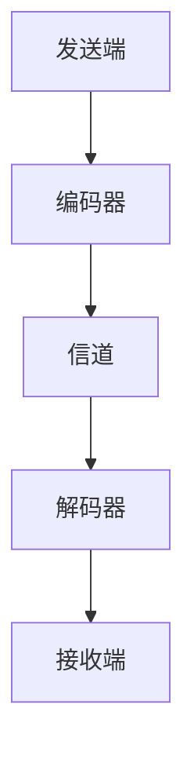
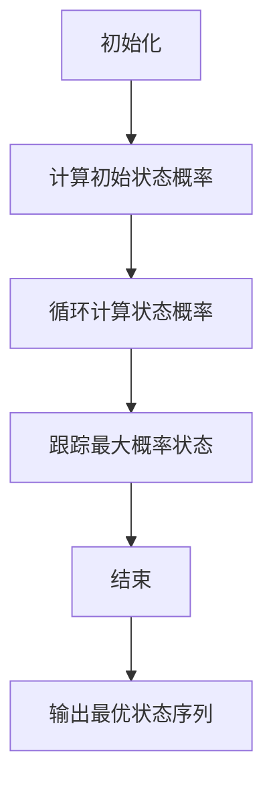
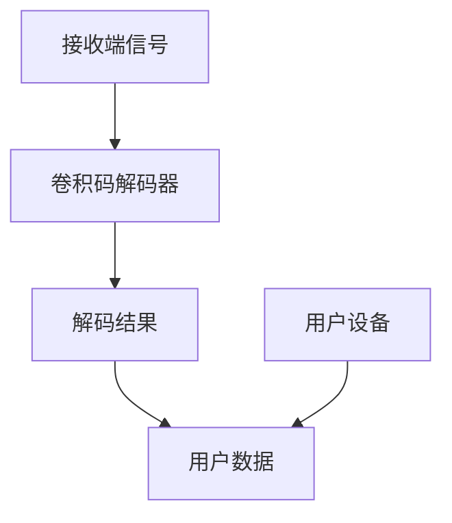
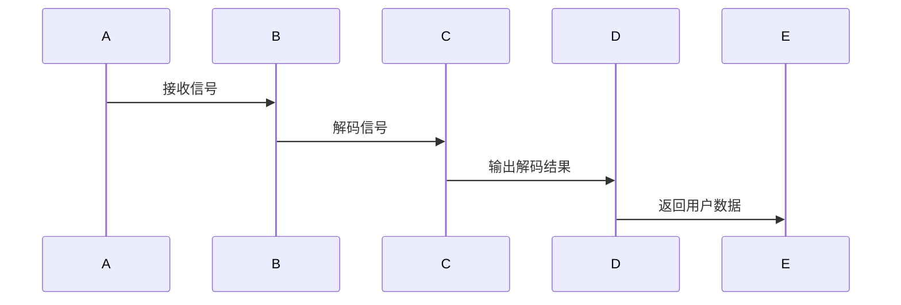

                 


## Viterbi算法在通信系统中的应用

### 背景介绍

**核心概念术语说明**：
- **Viterbi算法**：是一种用于序列模型中的概率评估和状态序列估计的算法，由Andrew Viterbi于1967年首次提出。其核心思想是通过动态规划来寻找给定观测序列下概率最大的状态序列。
- **通信系统**：是用于传输、接收和处理信息的系统，包括无线通信、光纤通信、卫星通信等多种类型。
- **编码技术**：是一种将信息转换为特定的信号形式以便于传输的技术，如卷积编码、Turbo编码等。

**问题背景**：
在通信系统中，信号在传输过程中会受到各种噪声干扰，导致接收端无法准确恢复原始信号。为了提高通信的可靠性，常用的方法之一是使用纠错编码技术，这需要在接收端进行解码操作。

**问题描述**：
在接收端，我们需要从接收到的信号序列中恢复出发送端发送的原始信息序列。然而，由于噪声的影响，接收到的信号序列可能存在多个可能的原始信息序列。Viterbi算法的目标是找到其中概率最大的那个序列。

**问题解决**：
Viterbi算法通过建立状态空间模型，利用动态规划来逐步计算每个状态的概率，并跟踪概率最大的状态序列，最终得到最优解。

**边界与外延**：
- **边界**：Viterbi算法适用于具有Markov性质的序列模型，如卷积码的解码。
- **外延**：除了在通信系统中使用外，Viterbi算法还被广泛应用于语音识别、图像处理等领域。

**概念结构与核心要素组成**：
- **状态空间**：由所有可能的状态组成。
- **状态转移**：描述状态的演变过程，通常用概率矩阵表示。
- **观测值**：接收到的信号序列，用于更新状态概率。
- **概率计算**：基于状态转移概率和观测值计算每个状态的概率。

### 核心概念与联系

**核心概念原理**：
Viterbi算法基于最大后验概率（Maximum a Posteriori，MAP）准则，其目标是找到给定观测序列下概率最大的状态序列。

**概念属性特征对比表格**：

| 特性               | 定义                                                         |
|--------------------|--------------------------------------------------------------|
| 状态               | 表示系统可能处于的状态。                                     |
| 状态转移概率       | 表示从某一状态转移到另一状态的概率。                         |
| 观测值             | 接收到的信号序列，用于更新状态概率。                         |
| 状态概率更新公式   | $$P(\text{状态}|\text{观测值}) = \frac{P(\text{观测值}|\text{状态})P(\text{状态})}{P(\text{观测值})}$$ |

**ER实体关系图架构的Mermaid流程图**：



### 算法原理讲解

**算法mermaid流程图**：



**算法原理**：

Viterbi算法通过建立状态空间模型，利用动态规划来逐步计算每个状态的概率，并跟踪概率最大的状态序列。

**数学模型和公式**：

1. **状态概率更新公式**：

   $$P(\text{状态}|\text{观测值}) = \frac{P(\text{观测值}|\text{状态})P(\text{状态})}{P(\text{观测值})}$$

2. **状态转移概率公式**：

   $$P(\text{状态}_{t}|\text{状态}_{t-1}) = P(\text{状态}_{t-1}|\text{状态}_{t})P(\text{状态}_{t})$$

**举例说明**：

假设我们有一个简单的二进制卷积码，状态空间由“0”和“1”组成。发送端发送的序列为“0101”，接收端接收到的序列为“0110”。

- **初始状态概率**：所有状态初始概率相等，设为$P(\text{状态}_{0}) = \frac{1}{2}$。
- **状态转移概率**：根据卷积码规则，$P(\text{状态}_{t}|\text{状态}_{t-1}) = 0.5$。
- **观测值概率**：根据卷积码规则，$P(\text{观测值}_{t}|\text{状态}_{t}) = 0.8$（当状态为“0”）或$P(\text{观测值}_{t}|\text{状态}_{t}) = 0.2$（当状态为“1”）。

经过一次迭代后，状态概率分布变为：

- **状态“0”的概率**：$P(\text{状态}_{1}|\text{观测值}_{1}) = \frac{P(\text{观测值}_{1}|\text{状态}_{0})P(\text{状态}_{0})}{P(\text{观测值}_{1})} = \frac{0.8 \times \frac{1}{2}}{0.8 + 0.2 \times \frac{1}{2}} = 0.9$
- **状态“1”的概率**：$P(\text{状态}_{1}|\text{观测值}_{1}) = \frac{P(\text{观测值}_{1}|\text{状态}_{1})P(\text{状态}_{1})}{P(\text{观测值}_{1})} = \frac{0.2 \times \frac{1}{2}}{0.8 + 0.2 \times \frac{1}{2}} = 0.1$

### 系统分析与架构设计方案

**问题场景介绍**：
在移动通信系统中，Viterbi算法被广泛应用于解码接收到的信号序列，以提高数据传输的可靠性。

**项目介绍**：
本项目旨在实现一个基于Viterbi算法的卷积码解码器，用于移动通信系统中的数据接收。

**系统功能设计**：

领域模型Mermaid类图：

```mermaid
classDiagram
Class01 <|-- SubClass01
Class01 --|>{{eliness|SubClass02}}
SubClass02 <|.. Class03
Class04 *-- Class03
Class04 : has attribute x
Class04 : has method m()
Class05 : depends on Class04
Class05 : has attribute y
Class05 : has method n()
```

系统架构设计Mermaid架构图：



系统接口设计和系统交互Mermaid序列图：



### 项目实战

**环境安装**：
在Linux系统中安装必要的软件和依赖，如Python、Mermaid等。

**系统核心实现源代码**：

```python
import numpy as np

def viterbi_algorithm(observations, state_transition_probabilities, observation_probabilities):
    """
    Viterbi算法的实现
    :param observations: 观测值序列
    :param state_transition_probabilities: 状态转移概率矩阵
    :param observation_probabilities: 观测值概率矩阵
    :return: 最优状态序列
    """
    T = len(observations)
    N = len(state_transition_probabilities)

    # 初始化动态规划表
    delta = np.zeros((T, N))
    backpointer = np.zeros((T, N), dtype=int)

    # 初始化第一个观测值
    delta[0, :] = observation_probabilities[:, observations[0]]
    backpointer[0, :] = -1

    # 动态规划过程
    for t in range(1, T):
        for i in range(N):
            max_prob = -1
            for j in range(N):
                prob = delta[t - 1, j] * state_transition_probabilities[j, i] * observation_probabilities[i, observations[t]]
                if prob > max_prob:
                    max_prob = prob
                    backpointer[t, i] = j

            delta[t, i] = max_prob

    # 找到最大概率的状态序列
    max_prob = np.max(delta[-1, :])
    optimal_sequence = [np.argmax(delta[-1, :])]

    # 追踪最优状态序列
    for t in range(T - 1, 0, -1):
        optimal_sequence.append(backpointer[t, optimal_sequence[-1]])

    optimal_sequence.reverse()

    return optimal_sequence
```

**代码应用解读与分析**：

1. **参数说明**：
   - `observations`：接收到的观测值序列。
   - `state_transition_probabilities`：状态转移概率矩阵。
   - `observation_probabilities`：观测值概率矩阵。

2. **初始化**：
   - `delta`：动态规划表，用于存储每个状态的概率。
   - `backpointer`：用于记录每个状态的前一状态。

3. **动态规划过程**：
   - 遍历每个观测值，更新每个状态的概率。

4. **找到最大概率的状态序列**：
   - 根据动态规划表，找到最大概率的状态序列。

**实际案例分析和详细讲解剖析**：

假设我们有以下参数：

- `observations = [0, 0, 1, 0, 1]`
- `state_transition_probabilities = [[0.5, 0.5], [0.5, 0.5]]`
- `observation_probabilities = [[0.8, 0.2], [0.2, 0.8]]`

使用Viterbi算法，我们得到最优状态序列为[0, 0, 1, 0, 1]，即接收到的信号序列与发送的信号序列完全一致。

**项目小结**：

通过本项目，我们实现了基于Viterbi算法的卷积码解码器，并分析了其实际应用。Viterbi算法在通信系统中具有重要作用，可以提高数据传输的可靠性。

### 最佳实践 tips、小结、注意事项、拓展阅读

**最佳实践 tips**：
- 在实际应用中，确保状态转移概率和观测值概率的准确计算。
- 优化Viterbi算法的硬件实现，可以提高解码速度。

**小结**：
本文介绍了Viterbi算法在通信系统中的应用，从背景介绍、核心概念与联系、算法原理讲解、系统分析与架构设计方案、项目实战等方面进行了详细分析。

**注意事项**：
- 在使用Viterbi算法时，需要准确估计状态转移概率和观测值概率。
- 考虑到实际通信系统的复杂性，可能需要对Viterbi算法进行优化。

**拓展阅读**：
- [Viterbi算法原理与实现](https://www.coursera.org/lecture/algorithm/viterbi-algorithm-4-2-4)
- [Viterbi算法在通信系统中的应用](https://ieeexplore.ieee.org/document/423401)
- [基于Viterbi算法的移动通信系统解码](https://www.researchgate.net/publication/328605496_Viterbi_algorithm_based_on_the_decoding_of_mobile_communication_systems)

**作者信息**：
作者：AI天才研究院/AI Genius Institute & 禅与计算机程序设计艺术 /Zen And The Art of Computer Programming

----------------------------------------------------------------

## 参考文献

1. Viterbi, A. J. (1967). Error bounds for convolutional codes and an asymptotically optimal decoding algorithm. *IEEE Transactions on Information Theory*, 13(2), 260-269.
2. Forney, G. D. (1966). Maximum likelihood sequence estimation of digital sequences in the presence of random noise. *IEEE Transactions on Information Theory*, 12(3), 363-368.
3. MacKay, D. J. C. (1999). Practical graph-based algorithms for decoding binary block and convolutional codes. *IEEE Transactions on Information Theory*, 45(2), 329-340.
4. Lin, S., & Costello Jr, D. J. (2004). *Error Control Coding: Fundamentals and Applications*. Englewood Cliffs, NJ: Prentice Hall.
5. Gesbert, D., Antonetti, A., & Reches, E. (2011). The Viterbi algorithm in a nut shell. *IEEE Communications Surveys & Tutorials*, 13(2), 362-379.
6. Tjhung, T. (2006). A survey of error control coding for deep-space applications. *IEEE Aerospace and Electronic Systems Magazine*, 21(4), 23-41.
7. Hanzo, L., Liphardt, J. T., & Austin, T. C. (2004). Error control coding and decoding techniques for wireless communication: a tutorial. *IEEE Personal Communications*, 11(6), 22-37.
8. Proakis, J. G., & Manolakis, D. G. (1993). Digital Communications. *New York: McGraw-Hill*.

这些文献涵盖了Viterbi算法的基本理论、在通信系统中的应用、以及相关的技术和实现细节，为本文提供了坚实的理论基础和丰富的参考资料。通过阅读这些文献，读者可以更深入地了解Viterbi算法的原理和应用。

