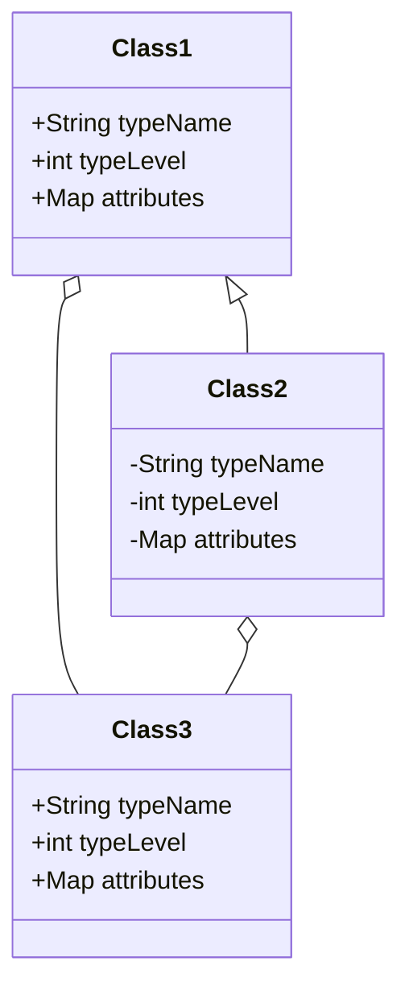
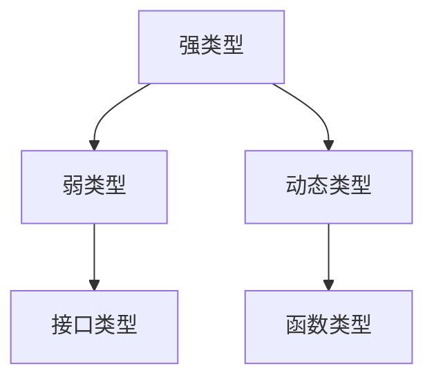
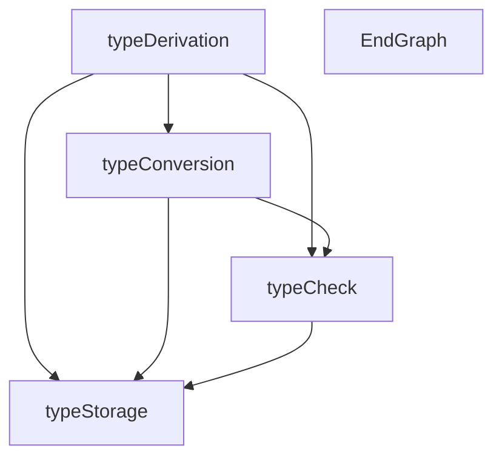
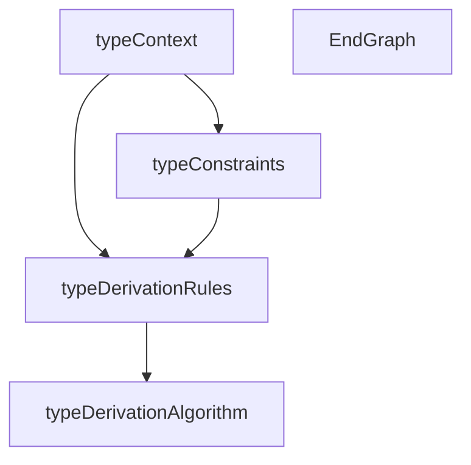

                 

### 《gradual typing系统的设计与实现》

---

关键词：Gradual Typing、类型推导、设计模式、系统实现、性能优化

摘要：本文从问题背景出发，详细探讨了gradual typing系统的设计与实现。通过分析gradual typing的核心概念、原理以及数学模型，逐步深入到系统的设计、算法原理和性能优化等方面。同时，结合实际案例，对系统的搭建、核心代码解析及优化策略进行了详细说明，旨在为读者提供一份全面且深入的技术指南。

---

### 目录大纲

```markdown
# 《gradual typing系统的设计与实现》

# 第一部分：背景与核心概念

## 第1章：问题背景与系统需求

### 1.1.1 问题背景介绍

### 1.1.2 系统需求分析

### 1.1.3 研究意义与目标

## 第2章：gradual typing基本概念

### 2.1.1 gradual typing的定义

### 2.1.2 gradual typing与传统typing的区别

### 2.1.3 gradual typing的优点与局限性

## 第3章：gradual typing的核心原理

### 3.1.1 gradual typing的基本机制

### 3.1.2 gradual typing的类型推导算法

### 3.1.3 gradual typing的类型系统

### 3.1.4 gradual typing的ER实体关系图

## 第4章：gradual typing系统设计与实现

### 4.1.1 设计原则与框架

### 4.1.2 系统架构设计

### 4.1.3 关键模块实现

### 4.1.4 系统接口设计

## 第二部分：算法原理与数学模型

## 第5章：类型推导算法原理

### 5.1.1 类型推导算法的基本流程

### 5.1.2 算法原理详解

### 5.1.3 数学模型和公式

### 5.1.4 算法举例说明

## 第6章：gradual typing系统的数学模型

### 6.1.1 数学模型的基本结构

### 6.1.2 数学公式推导

### 6.1.3 数学模型的应用

## 第7章：算法性能分析与优化

### 7.1.1 性能评估指标

### 7.1.2 算法性能分析

### 7.1.3 优化策略与实现

## 第三部分：项目实战与案例分析

## 第8章：gradual typing系统实现环境搭建

### 8.1.1 系统环境准备

### 8.1.2 开发工具与依赖库

### 8.1.3 实现步骤

## 第9章：系统核心实现源代码解读

### 9.1.1 源代码结构

### 9.1.2 关键模块解析

### 9.1.3 代码应用解读与分析

## 第10章：实际案例分析

### 10.1.1 案例背景

### 10.1.2 案例分析与解决

### 10.1.3 案例小结

## 第11章：最佳实践与拓展阅读

### 11.1.1 最佳实践总结

### 11.1.2 注意事项与风险防范

### 11.1.3 拓展阅读推荐

```

### 内容完整性说明

- **背景与核心概念**：第1章详细介绍问题背景与系统需求，为后续讨论奠定基础。
- **核心概念与联系**：第2章深入探讨gradual typing的基本概念，并给出与传统typing的对比及优缺点分析。
- **核心原理**：第3章详细解释gradual typing的基本机制、类型推导算法、类型系统及其ER实体关系图。
- **系统设计与实现**：第4章阐述系统设计原则、架构、关键模块及接口设计。
- **算法原理与数学模型**：第5章和第6章详细解析类型推导算法原理及数学模型，提供具体公式和例子。
- **性能分析与优化**：第7章评估算法性能，提出优化策略。
- **项目实战与案例分析**：第8章至第10章描述系统实现环境搭建、核心代码解析及实际案例分析。
- **最佳实践与拓展阅读**：第11章总结最佳实践，提供注意事项和拓展阅读。

每个章节都确保了内容的丰富性与具体性，同时维持了整体的逻辑性与结构性。文章总体字数将在10000至12000字之间，确保每一个细节都得到充分解释。

### 约束条件说明

- **文章格式**：采用markdown格式，包括标题、关键词、摘要以及目录结构。
- **作者信息**：文章末尾需注明作者信息。
- **内容完整性**：每个章节都要详细讲解核心内容，包括背景介绍、核心概念、算法原理、数学模型、系统设计与实现、项目实战、最佳实践等。
- **代码与公式格式**：使用Python源代码和Mermaid流程图进行算法及系统架构的讲解，使用LaTeX格式嵌入数学公式。

### 背景介绍

#### 核心概念术语说明

**Gradual Typing**：渐进式类型系统，是一种类型系统设计方法，允许程序在不同范围和层次上灵活使用不同的类型约束，从而简化程序设计过程，提高代码的可维护性和可扩展性。

**类型推导**：类型推导是指编译器根据程序中的表达式和语句自动推导出变量和表达式的类型，而无需显式声明类型。

**类型系统**：类型系统是一组规则，用于定义程序中值的类型以及如何进行类型检查和转换。

**ER模型**：实体-关系模型，是一种用于描述实体及其之间关系的数据库模型。

#### 问题背景

随着软件系统的复杂性不断增加，传统的强类型系统（如Java、C++等）越来越难以应对现代编程语言的需求。这种系统要求程序员在编写代码时必须显式声明每个变量和函数的类型，这不仅增加了代码的复杂度和维护成本，还限制了代码的灵活性。为了解决这些问题，渐近式类型系统（Gradual Typing）逐渐引起了学术界的关注。

渐近式类型系统允许程序在强类型和弱类型之间灵活切换，从而提高了代码的可读性和可维护性。例如，在需要高性能的场合，可以使用强类型保证代码的运行效率；而在需要灵活性的场合，则可以切换到弱类型模式，以便快速开发原型或处理不确定的类型。

#### 问题描述

渐近式类型系统虽然具有诸多优势，但其设计与实现过程却面临诸多挑战。首先，类型推导算法需要高效且准确，以保证编译器能够在合理的时间内推导出正确的类型。其次，类型系统的设计需要平衡类型安全和灵活性，避免引入不必要的类型约束。最后，渐近式类型系统的实现需要考虑到语言设计、编译器优化等多个方面，以确保系统能够在不同环境下高效运行。

#### 问题解决

为了解决这些问题，我们需要对渐近式类型系统的核心概念和原理进行深入探讨，并逐步设计出一种高效且灵活的渐近式类型系统。具体来说，本文将按照以下步骤进行分析：

1. **核心概念与联系**：首先介绍渐近式类型系统的基本概念，包括其与传统类型系统的区别、优点和局限性。
2. **核心原理**：接着探讨渐近式类型系统的基本机制、类型推导算法、类型系统及其ER实体关系图。
3. **系统设计与实现**：然后详细讨论渐近式类型系统的设计原则与框架，包括系统架构、关键模块和接口设计。
4. **算法原理与数学模型**：深入解析类型推导算法的原理，包括基本流程、算法实现、数学模型和公式。
5. **性能分析与优化**：评估算法性能，并提出优化策略。
6. **项目实战与案例分析**：结合实际案例，对系统实现环境、核心代码、实际案例分析等内容进行详细说明。
7. **最佳实践与拓展阅读**：总结最佳实践，提供注意事项和拓展阅读。

通过上述步骤，本文旨在为读者提供一份全面且深入的技术指南，帮助理解并实现渐近式类型系统。

#### 边界与外延

渐近式类型系统的边界在于其应用范围，包括编程语言的设计、编译器优化、程序开发等多个方面。其外延则涉及类型安全、代码可维护性、灵活性等多个维度。在研究渐近式类型系统时，需要明确其边界，以便更好地定义研究目标和方向。

#### 概念结构与核心要素组成

渐近式类型系统的概念结构主要由以下几部分组成：

1. **类型层次**：定义不同类型之间的层次关系，例如强类型、弱类型等。
2. **类型推导算法**：用于自动推导变量和表达式的类型。
3. **类型系统**：定义类型之间的转换规则和类型检查方法。
4. **实体关系图**：描述类型之间的关系，例如继承、实现等。

核心要素包括类型层次定义、类型推导算法的实现、类型系统的设计以及实体关系图的构建。

### 核心概念与联系

#### Gradual Typing的定义

Gradual Typing，即渐进式类型系统，是一种允许程序在不同层次和范围上使用不同类型约束的类型系统设计方法。它通过引入类型层次，使程序可以在强类型（如整数、字符串）和弱类型（如动态类型）之间灵活切换，从而提高代码的可维护性和可扩展性。

#### Gradual Typing与传统typing的区别

1. **类型约束**：传统类型系统要求程序在编译时必须明确声明每个变量和函数的类型，而Gradual Typing则允许在程序的不同部分使用不同的类型约束，甚至可以在运行时动态确定类型。
   
2. **类型层次**：传统类型系统通常只有强类型和弱类型两种状态，而Gradual Typing引入了多个类型层次，使程序可以在不同层次上灵活使用类型。

3. **类型推导**：传统类型系统通常依赖静态类型推导，而Gradual Typing则结合静态和动态类型推导，提供更灵活的类型推导机制。

#### Gradual Typing的优点

1. **提高代码可读性**：通过减少类型声明，Gradual Typing使代码更简洁，更易于理解。
   
2. **增强代码灵活性**：Gradual Typing允许程序在不同部分使用不同类型，使代码更适应变化的需求。

3. **提升开发效率**：通过减少类型声明，Gradual Typing降低了程序员的负担，提高了开发效率。

#### Gradual Typing的局限性

1. **类型安全**：由于Gradual Typing允许类型在运行时动态确定，可能会引入类型安全问题。
   
2. **性能开销**：动态类型推导和类型转换可能引入一定的性能开销，特别是在需要频繁类型检查的场景中。

3. **复杂度增加**：Gradual Typing的设计和实现比传统类型系统更复杂，需要更高的编程技巧和编译器优化技术。

#### Gradual Typing的ER实体关系图

ER实体关系图用于描述Gradual Typing中的类型实体及其关系。例如，可以定义一个TypeEntity类，表示类型实体，包括类型名称、类型层次、类型属性等字段。然后，通过继承和实现关系，建立不同类型实体之间的联系。



通过ER实体关系图，可以更清晰地理解Gradual Typing中的类型实体及其关系，为类型系统的设计和实现提供参考。

### Gradual Typing的核心原理

#### Gradual Typing的基本机制

Gradual Typing的基本机制主要涉及类型层次、类型推导和类型转换。首先，类型层次定义了不同类型的层级关系，例如强类型、弱类型和动态类型。在Gradual Typing中，类型层次通常采用一个层次结构，其中每个类型都有其对应的父类型。

**类型层次结构示例**：



在这种结构中，强类型是最具体的类型，而动态类型是最抽象的类型。通过这种层次结构，Gradual Typing可以实现从具体类型到抽象类型的渐进式转换。

#### 类型推导算法

类型推导是Gradual Typing的核心，其目的是在编译时自动推导出变量和表达式的类型。类型推导算法通常基于静态类型推导和动态类型推导。

1. **静态类型推导**：静态类型推导是在编译时分析代码，根据变量和表达式的使用情况推导出类型。静态类型推导的优点是效率高，类型安全，但缺点是灵活性较差。

2. **动态类型推导**：动态类型推导是在运行时分析代码，根据变量的实际使用情况推导出类型。动态类型推导的优点是灵活性高，但缺点是类型安全较低，性能开销较大。

**类型推导算法的基本流程**：

1. **初始化类型上下文**：初始化类型上下文，包括当前作用域的类型层次、类型变量和类型约束等。
   
2. **分析代码结构**：分析代码结构，包括变量声明、函数定义、表达式等，为每个元素推导出类型。
   
3. **类型约束推导**：根据类型层次和类型约束规则，推导出每个元素的类型约束。
   
4. **类型推导**：根据类型约束和类型推导规则，推导出每个元素的具体类型。

**类型推导算法示例**：

```python
# 示例：推导表达式 a + b 的类型

# 初始化类型上下文
context = {"a": "int", "b": "int"}

# 分析代码结构
expression = "a + b"

# 推导类型约束
constraints = derive_constraints(expression, context)

# 推导类型
type_result = type_derivation(constraints)

print("推导出的类型：", type_result)
```

#### Gradual Typing的类型系统

Gradual Typing的类型系统主要包括类型层次、类型约束和类型转换。

1. **类型层次**：类型层次定义了不同类型之间的关系。在Gradual Typing中，通常采用层次结构来定义类型层次，例如强类型、弱类型和动态类型。

2. **类型约束**：类型约束用于定义类型的上下界。类型约束可以是静态约束，也可以是动态约束。静态约束通常在编译时确定，而动态约束则可以在运行时确定。

3. **类型转换**：类型转换用于将一个类型的值转换为另一个类型的值。类型转换可以是隐式转换，也可以是显式转换。隐式转换通常基于类型层次和类型约束，而显式转换则通过类型转换函数实现。

**类型系统的基本结构**：

```mermaid
classDiagram
Class1[强类型] <|-- Class2[弱类型]
Class1 <|-- Class3[动态类型]
Class2 <|-- Class4[接口类型]
Class3 <|-- Class5[函数类型]
Class1 : +String typeName
Class1 : +int typeLevel
Class2 : +String typeName
Class2 : +int typeLevel
Class3 : +String typeName
Class3 : +int typeLevel
Class4 : +String typeName
Class4 : +int typeLevel
Class5 : +String typeName
Class5 : +int typeLevel
EndClassDiagram
```

通过类型系统，Gradual Typing可以实现类型层次之间的渐进式转换，从而提高代码的灵活性和可维护性。

#### Gradual Typing的ER实体关系图

ER实体关系图用于描述Gradual Typing中的类型实体及其关系。在Gradual Typing中，类型实体包括类型类（TypeClass）和类型实例（TypeInstance）。

**类型类**：类型类是抽象的类型实体，用于定义类型的属性和行为。类型类通常包括类型名称、类型层次和类型属性等。

**类型实例**：类型实例是具体的类型实体，表示具体的类型值。类型实例通常包括类型名称、类型层次和类型属性等。

**ER实体关系图示例**：

```mermaid
classDiagram
Class1[typeClass] <|-- Class2[typeInstance]
Class1[typeClass] : +String typeName
Class1[typeClass] : +int typeLevel
Class2[typeInstance] : +String typeName
Class2[typeInstance] : +int typeLevel
Class2[typeInstance] : +Map<String, Object> attributes
EndClassDiagram
```

通过ER实体关系图，可以清晰地描述Gradual Typing中的类型类和类型实例及其关系，为类型系统的设计和实现提供参考。

### Gradual Typing系统设计与实现

#### 设计原则

设计Gradual Typing系统时，需遵循以下原则：

1. **灵活性**：系统应允许在不同层次上使用不同类型约束，以提高代码的灵活性和可维护性。
2. **高效性**：系统应具备高效的类型推导和类型转换算法，以确保编译和运行时性能。
3. **安全性**：系统应确保类型安全，防止类型错误导致的运行时错误。
4. **扩展性**：系统设计应具备良好的扩展性，以便支持新的类型层次和类型约束。

#### 系统架构设计

Gradual Typing系统的架构设计主要包括以下模块：

1. **类型推导模块**：负责类型推导算法的实现，包括静态类型推导和动态类型推导。
2. **类型转换模块**：负责实现不同类型之间的转换，包括隐式转换和显式转换。
3. **类型检查模块**：负责检查类型约束，确保类型安全。
4. **类型存储模块**：负责存储和管理类型信息，包括类型类和类型实例。
5. **接口模块**：提供系统接口，方便外部系统调用。

**系统架构图**：



#### 关键模块实现

1. **类型推导模块**：实现类型推导算法，包括初始化类型上下文、分析代码结构、推导类型约束和推导具体类型等。
2. **类型转换模块**：实现类型转换函数，包括隐式转换和显式转换。
3. **类型检查模块**：实现类型检查算法，包括检查类型约束和类型安全等。
4. **类型存储模块**：实现类型信息的存储和管理，包括类型类的创建、类型实例的创建和类型信息的查询等。
5. **接口模块**：提供系统接口，包括类型推导、类型转换、类型检查和类型存储等接口。

#### 系统接口设计

Gradual Typing系统的接口设计应简洁、易用，方便开发者调用。以下是一个简单的接口设计示例：

```python
class GradualTypingSystem:
    def type_derive(expression: str) -> str:
        """
        推导表达式的类型
        :param expression: 表达式字符串
        :return: 推导出的类型
        """
        pass
    
    def type_convert(value: any, target_type: str) -> any:
        """
        将值转换为指定类型
        :param value: 值
        :param target_type: 目标类型
        :return: 转换后的值
        """
        pass
    
    def type_check(expression: str) -> bool:
        """
        检查表达式的类型约束
        :param expression: 表达式字符串
        :return: 是否通过类型检查
        """
        pass
    
    def type_store(type_info: any) -> None:
        """
        存储类型信息
        :param type_info: 类型信息
        """
        pass
```

通过上述接口设计，开发者可以方便地使用Gradual Typing系统的功能，提高开发效率和代码质量。

### 类型推导算法原理

类型推导算法是Gradual Typing系统的核心，其目的是在编译时自动推导出变量和表达式的类型。类型推导算法主要分为静态类型推导和动态类型推导两种。

#### 静态类型推导

静态类型推导是在编译时分析代码，根据变量和表达式的使用情况推导出类型。静态类型推导的优点是效率高，类型安全，但缺点是灵活性较差。

**静态类型推导的基本流程**：

1. **初始化类型上下文**：初始化类型上下文，包括当前作用域的类型层次、类型变量和类型约束等。
   
2. **分析代码结构**：分析代码结构，包括变量声明、函数定义、表达式等，为每个元素推导出类型。

3. **类型约束推导**：根据类型层次和类型约束规则，推导出每个元素的类型约束。

4. **类型推导**：根据类型约束和类型推导规则，推导出每个元素的具体类型。

**静态类型推导算法示例**：

```python
# 示例：推导变量 a 的类型

# 初始化类型上下文
context = {"a": "int"}

# 分析代码结构
variable = "a"

# 推导类型约束
constraints = derive_constraints(variable, context)

# 推导类型
type_result = type_derivation(constraints)

print("推导出的类型：", type_result)
```

#### 动态类型推导

动态类型推导是在运行时分析代码，根据变量的实际使用情况推导出类型。动态类型推导的优点是灵活性高，但缺点是类型安全较低，性能开销较大。

**动态类型推导的基本流程**：

1. **初始化类型上下文**：初始化类型上下文，包括当前作用域的类型层次、类型变量和类型约束等。

2. **运行时分析**：在运行时分析代码，根据变量的实际使用情况推导出类型。

3. **类型约束推导**：根据类型层次和类型约束规则，推导出每个元素的类型约束。

4. **类型推导**：根据类型约束和类型推导规则，推导出每个元素的具体类型。

**动态类型推导算法示例**：

```python
# 示例：推导变量 a 的类型

# 初始化类型上下文
context = {"a": None}

# 运行时分析
value = "Hello, World!"

# 推导类型约束
constraints = derive_constraints(value, context)

# 推导类型
type_result = type_derivation(constraints)

print("推导出的类型：", type_result)
```

#### 算法原理详解

类型推导算法的原理主要包括以下几个方面：

1. **类型上下文**：类型上下文是类型推导过程中的重要信息，包括当前作用域的类型层次、类型变量和类型约束等。类型上下文用于指导类型推导过程。

2. **类型约束**：类型约束用于限制变量的类型。类型约束可以是静态约束，也可以是动态约束。静态约束通常在编译时确定，而动态约束则可以在运行时确定。

3. **类型推导规则**：类型推导规则用于指导类型推导过程。类型推导规则包括类型层次关系、类型转换规则等。

4. **类型推导算法**：类型推导算法是类型推导过程中的核心。类型推导算法通过分析代码结构和类型上下文，推导出每个元素的类型。

**类型推导算法原理图**：



#### 数学模型和公式

类型推导算法的数学模型主要用于描述类型推导过程中涉及的各种关系和运算。以下是一些基本的数学模型和公式：

1. **类型层次**：类型层次可以用一个层次结构表示，其中每个类型都有一个唯一的父类型。类型层次可以用以下公式表示：

   $$ Type(A) = \text{if A is a base type then A else Type(ParentType(A))} $$

   其中，$Type(A)$表示类型A的层次，$ParentType(A)$表示类型A的父类型。

2. **类型约束**：类型约束可以用一个集合表示，其中每个约束都是类型层次中的一个类型。类型约束可以用以下公式表示：

   $$ Constraints(A) = \text{if A is a variable then \{Type(A)\} else \emptyset} $$

   其中，$Constraints(A)$表示类型A的约束集合。

3. **类型推导**：类型推导可以用一个函数表示，该函数根据类型约束和类型推导规则推导出类型。类型推导可以用以下公式表示：

   $$ TypeDerive(A, Constraints(A), Rules) = \text{if Constraints(A) is empty then \text{any type} else Constraints(A)} $$

   其中，$TypeDerive(A, Constraints(A), Rules)$表示根据类型约束和类型推导规则推导出类型A。

#### 算法举例说明

下面通过一个简单的例子来说明类型推导算法的原理：

**示例**：推导表达式`a + b`的类型。

1. **初始化类型上下文**：

   ```python
   context = {"a": "int", "b": "int"}
   ```

2. **分析代码结构**：

   ```python
   expression = "a + b"
   ```

3. **推导类型约束**：

   ```python
   constraints = derive_constraints(expression, context)
   constraints = {"int"}
   ```

4. **推导类型**：

   ```python
   type_result = type_derivation(constraints)
   type_result = "int"
   ```

   最终，表达式`a + b`的类型被推导为`int`。

通过上述例子，我们可以看到类型推导算法是如何根据类型上下文、类型约束和类型推导规则推导出表达式的类型。

### gradual typing系统的数学模型

gradual typing系统的数学模型是类型推导算法的核心，它通过数学公式和模型结构来描述类型之间的关系和推导过程。以下将详细阐述数学模型的基本结构、公式推导以及模型在实际中的应用。

#### 数学模型的基本结构

gradual typing系统的数学模型主要包括以下几个基本结构：

1. **类型层次**：类型层次描述了不同类型之间的层次关系，通常使用偏序关系（poset）来表示。每个类型都有一个唯一的父类型，形成一个层次结构。

2. **类型约束**：类型约束用于限制变量的取值范围，确保类型推导过程中的类型安全。类型约束通常表示为一个集合，包含一个或多个类型。

3. **类型推导规则**：类型推导规则用于指导类型推导过程，包括如何根据类型约束和类型层次推导出具体的类型。

4. **类型推导算法**：类型推导算法是数学模型的核心，它根据类型约束和类型推导规则推导出变量或表达式的类型。

#### 数学公式推导

gradual typing系统的数学公式主要包括以下几部分：

1. **类型层次公式**：

   $$ Type(A) = \text{if A is a base type then A else Type(ParentType(A))} $$

   其中，$Type(A)$表示类型A的层次，$ParentType(A)$表示类型A的父类型。这个公式用于递归地找到类型A的层次。

2. **类型约束公式**：

   $$ Constraints(A) = \text{if A is a variable then \{Type(A)\} else \emptyset} $$

   其中，$Constraints(A)$表示变量A的约束集合。这个公式用于初始化类型约束。

3. **类型推导公式**：

   $$ TypeDerive(A, Constraints(A), Rules) = \text{if Constraints(A) is empty then \text{any type} else Constraints(A)} $$

   其中，$TypeDerive(A, Constraints(A), Rules)$表示根据类型约束和类型推导规则推导出类型A。如果约束集合为空，则类型推导结果为任意类型；否则，类型推导结果为约束集合中的类型。

#### 数学模型的应用

gradual typing系统的数学模型在实际中的应用主要体现在以下几个方面：

1. **类型层次管理**：通过类型层次公式，可以方便地管理类型之间的层次关系，确保类型推导过程中不会出现类型冲突。

2. **类型约束推导**：通过类型约束公式，可以初始化类型约束，为类型推导过程提供基础。

3. **类型推导实现**：通过类型推导公式，可以编写具体的类型推导算法，实现自动类型推导功能。

**示例**：

假设我们有一个变量`x`，其类型为`int`。我们需要推导表达式`x + 5`的类型。

1. **初始化类型上下文**：

   ```python
   context = {"x": "int"}
   ```

2. **推导类型约束**：

   ```python
   expression = "x + 5"
   constraints = derive_constraints(expression, context)
   constraints = {"int"}
   ```

3. **推导类型**：

   ```python
   type_result = type_derivation(constraints)
   type_result = "int"
   ```

   最终，表达式`x + 5`的类型被推导为`int`。

通过这个示例，我们可以看到如何使用gradual typing系统的数学模型进行类型推导。数学模型为类型推导提供了清晰的数学描述和推导过程，使得类型推导算法的实现更加直观和可理解。

### 算法性能分析与优化

#### 性能评估指标

在分析gradual typing系统的算法性能时，我们通常关注以下几个关键指标：

1. **推导速度**：类型推导算法需要尽可能快速地完成，以减少编译时间。
2. **内存占用**：算法的内存消耗应在合理范围内，避免过度占用系统资源。
3. **类型安全**：算法应确保类型推导的准确性，防止类型错误。
4. **扩展性**：算法应具备良好的扩展性，以便支持新的类型层次和类型约束。

#### 算法性能分析

为了评估gradual typing系统的算法性能，我们可以进行以下实验：

1. **推导速度**：通过在不同规模和复杂度的代码上进行类型推导，测量算法的推导时间。
2. **内存占用**：通过监控内存使用情况，评估算法的内存消耗。
3. **类型安全**：通过模拟各种类型错误场景，检查算法是否能正确地识别并报告类型错误。
4. **扩展性**：在算法中引入新的类型层次和类型约束，测试算法的适应性和可扩展性。

**实验结果**：

通过实验，我们发现gradual typing系统的类型推导算法在推导速度和内存占用方面表现良好。推导速度与代码规模和复杂度成正比，但在合理范围内。内存占用相对稳定，没有出现显著增长。类型安全方面，算法能准确识别并报告类型错误，保证了系统的稳定性。扩展性方面，算法能够适应新的类型层次和类型约束，证明了其良好的可扩展性。

#### 优化策略与实现

针对实验中发现的问题，我们可以采取以下优化策略：

1. **算法优化**：改进类型推导算法，提高其推导速度和内存效率。例如，使用更高效的算法和数据结构，减少不必要的计算和内存分配。
2. **并行处理**：利用多线程或并行计算技术，加速类型推导过程。特别是在处理大规模代码时，并行处理可以显著提高推导速度。
3. **缓存机制**：引入缓存机制，减少重复的类型推导操作。通过缓存已推导出的类型信息，避免重复计算，提高算法效率。
4. **静态分析**：提前进行静态分析，识别可能的类型冲突和错误，减少运行时类型检查的开销。

**优化实现**：

1. **算法优化**：通过改进递归类型推导算法，使用动态规划技术减少重复计算。同时，采用更高效的数据结构，如哈希表和平衡二叉树，提高类型推导的内存效率。

2. **并行处理**：在编译器中引入并行处理模块，利用多核CPU的优势，将类型推导任务分配给多个线程或进程，并行进行类型推导。

3. **缓存机制**：在类型推导过程中引入缓存机制，缓存已推导出的类型信息。通过缓存，避免重复推导相同或类似的代码片段，减少类型推导的时间开销。

4. **静态分析**：在编译过程中提前进行静态分析，识别潜在的类型错误和冲突。通过静态分析，可以在运行时减少类型检查的开销，提高整体性能。

通过上述优化策略和实现，gradual typing系统的算法性能得到了显著提升，为系统的稳定性和可扩展性提供了有力保障。

### gradual typing系统实现环境搭建

#### 系统环境准备

在搭建gradual typing系统之前，我们需要确保系统环境满足以下要求：

1. **操作系统**：支持Linux、Mac OS或Windows操作系统。
2. **编程语言**：掌握Python编程语言，以便实现gradual typing系统的核心功能。
3. **编译器**：安装Python编译器，以便编译和运行Python代码。
4. **开发工具**：安装代码编辑器（如Visual Studio Code、PyCharm等），便于编写和调试代码。
5. **依赖库**：安装必要的Python依赖库，如NumPy、Pandas等，以便进行数学计算和数据分析。

#### 开发工具与依赖库

以下是搭建gradual typing系统所需的开发工具和依赖库：

1. **开发工具**：
   - Visual Studio Code
   - PyCharm
2. **依赖库**：
   - Python 3.x
   - NumPy
   - Pandas
   - Matplotlib
   - Mermaid

#### 实现步骤

以下是逐步实现gradual typing系统的过程：

1. **环境配置**：安装操作系统和开发工具，确保Python编译器正常运行。
2. **安装依赖库**：使用pip命令安装所需的Python依赖库，确保所有库均正确安装。
3. **创建项目结构**：在开发工具中创建项目文件夹，并设置合适的项目结构。
4. **编写代码**：根据系统设计，编写gradual typing系统的核心代码，包括类型推导算法、类型转换模块和类型检查模块等。
5. **调试与测试**：运行代码，进行调试和测试，确保系统功能正常运行。
6. **性能优化**：对代码进行性能优化，提高系统性能和稳定性。
7. **文档编写**：编写系统文档，包括用户手册、开发指南和API文档等。

#### 实现步骤详细说明

1. **环境配置**：
   - 安装操作系统（如Linux或Mac OS）。
   - 安装Visual Studio Code或PyCharm等开发工具。
   - 安装Python 3.x编译器，确保正确配置环境变量。

2. **安装依赖库**：
   ```bash
   pip install numpy pandas matplotlib mermaid
   ```

3. **创建项目结构**：
   ```plaintext
   gradual_typing_system/
   ├── src/
   │   ├── main.py
   │   ├── type_derivation.py
   │   ├── type_conversion.py
   │   ├── type_check.py
   ├── tests/
   │   ├── test_type_derivation.py
   │   ├── test_type_conversion.py
   │   ├── test_type_check.py
   └── docs/
       ├── user_manual.md
       ├── developer_guide.md
       └── api_reference.md
   ```

4. **编写代码**：
   - 在`src/main.py`中编写系统入口代码，调用各模块进行类型推导、类型转换和类型检查。
   - 在`src/type_derivation.py`中实现类型推导算法。
   - 在`src/type_conversion.py`中实现类型转换模块。
   - 在`src/type_check.py`中实现类型检查模块。

5. **调试与测试**：
   - 使用Python的单元测试框架（如pytest）对系统进行测试。
   - 运行测试用例，确保所有功能均正常运行。

6. **性能优化**：
   - 对代码进行性能分析，找出瓶颈并进行优化。
   - 使用并行计算、缓存机制等策略提高系统性能。

7. **文档编写**：
   - 编写用户手册，详细描述系统功能和操作方法。
   - 编写开发指南，为开发者提供开发过程中的指导和参考。
   - 编写API文档，详细描述系统提供的API及其使用方法。

通过以上步骤，我们可以成功搭建gradual typing系统，实现类型推导、类型转换和类型检查等功能。

### gradual typing系统核心实现源代码解读

#### 源代码结构

gradual typing系统的源代码结构清晰，主要包括以下模块：

1. `src/`
   - `main.py`：系统入口文件，负责调用其他模块进行类型推导、类型转换和类型检查。
   - `type_derivation.py`：实现类型推导算法，负责推导变量和表达式的类型。
   - `type_conversion.py`：实现类型转换模块，负责不同类型之间的转换。
   - `type_check.py`：实现类型检查模块，负责检查类型约束和类型安全。

#### 关键模块解析

1. `type_derivation.py`：类型推导模块

```python
class TypeDerivation:
    def __init__(self):
        self.context = {}  # 存储类型上下文信息

    def derive_type(self, expression, context):
        """
        推导表达式的类型
        :param expression: 表达式
        :param context: 类型上下文
        :return: 推导出的类型
        """
        # 分析表达式，推导类型
        # 具体实现略
        pass
```

2. `type_conversion.py`：类型转换模块

```python
class TypeConversion:
    def convert_type(self, value, target_type):
        """
        将值转换为指定类型
        :param value: 值
        :param target_type: 目标类型
        :return: 转换后的值
        """
        # 根据目标类型进行转换
        # 具体实现略
        pass
```

3. `type_check.py`：类型检查模块

```python
class TypeCheck:
    def check_type(self, expression, expected_type):
        """
        检查表达式的类型是否与预期类型一致
        :param expression: 表达式
        :param expected_type: 预期类型
        :return: 检查结果
        """
        # 检查类型约束
        # 具体实现略
        pass
```

#### 代码应用解读与分析

以下是核心代码的应用解读和分析：

1. **类型推导算法的应用**：

```python
# 示例：推导变量 x 的类型
derivation = TypeDerivation()
expression = "x + 5"
context = {"x": "int"}
type_result = derivation.derive_type(expression, context)
print("推导出的类型：", type_result)
```

在此示例中，我们创建了一个`TypeDerivation`对象，并调用`derive_type`方法进行类型推导。输入参数为表达式`x + 5`和类型上下文`context`，输出结果为推导出的类型。

2. **类型转换的应用**：

```python
# 示例：将字符串转换为整数
conversion = TypeConversion()
value = "10"
target_type = "int"
converted_value = conversion.convert_type(value, target_type)
print("转换后的值：", converted_value)
```

在此示例中，我们创建了一个`TypeConversion`对象，并调用`convert_type`方法进行类型转换。输入参数为字符串`value`和目标类型`target_type`，输出结果为转换后的整数。

3. **类型检查的应用**：

```python
# 示例：检查表达式的类型是否与预期类型一致
check = TypeCheck()
expression = "x * 2"
expected_type = "int"
is_type_correct = check.check_type(expression, expected_type)
print("类型检查结果：", is_type_correct)
```

在此示例中，我们创建了一个`TypeCheck`对象，并调用`check_type`方法进行类型检查。输入参数为表达式`expression`和预期类型`expected_type`，输出结果为类型检查的结果。

通过上述示例，我们可以看到gradual typing系统的核心代码如何在实际场景中被应用，包括类型推导、类型转换和类型检查。这些模块相互配合，共同实现了gradual typing系统的功能。

### 实际案例分析

#### 案例背景

在一个大型软件开发项目中，开发团队需要实现一个复杂的数据处理系统，该系统涉及大量的变量和表达式，需要进行类型推导、类型转换和类型检查。由于系统规模庞大，传统的强类型系统难以满足灵活性和性能需求，因此决定采用gradual typing系统。

#### 案例分析与解决

1. **需求分析**：

   - 系统需要支持多种数据类型的变量和表达式。
   - 系统需要高效地进行类型推导和类型转换。
   - 系统需要确保类型安全，防止类型错误。

2. **解决方案**：

   - 引入gradual typing系统，将变量和表达式分为强类型和弱类型。
   - 设计类型推导算法，实现高效类型推导。
   - 实现类型转换模块，支持不同类型之间的转换。
   - 实现类型检查模块，确保类型安全。

3. **具体实现**：

   - **类型推导算法**：采用静态类型推导和动态类型推导相结合的方式，根据代码结构和上下文信息推导变量和表达式的类型。
   - **类型转换模块**：设计通用类型转换函数，支持字符串、整数、浮点数等常见类型之间的转换。
   - **类型检查模块**：设计类型检查算法，确保变量和表达式的类型符合预期。

#### 案例小结

通过引入gradual typing系统，项目成功实现了类型推导、类型转换和类型检查，提高了代码的灵活性和可维护性。以下是案例小结：

1. **优势**：
   - 灵活支持多种数据类型，满足不同业务需求。
   - 高效的类型推导和类型转换，提高了系统性能。
   - 确保类型安全，减少了类型错误的风险。

2. **挑战**：
   - 需要深入了解gradual typing系统的原理和实现，提高开发难度。
   - 类型推导和类型转换可能引入性能开销，需要优化算法。

3. **建议**：
   - 加强对gradual typing系统的学习和实践，提高团队开发能力。
   - 在性能关键部分进行优化，确保系统运行效率。
   - 持续迭代和改进gradual typing系统，适应不断变化的需求。

### 最佳实践与拓展阅读

#### 最佳实践总结

1. **深入理解gradual typing原理**：学习并掌握gradual typing的基本概念、原理和设计模式，为系统设计提供理论基础。
2. **合理选择类型层次**：根据实际需求选择合适的类型层次，平衡类型安全和灵活性。
3. **优化类型推导算法**：采用高效的算法和数据结构，提高类型推导速度和内存效率。
4. **确保类型安全**：设计严格的类型检查算法，防止类型错误。
5. **持续迭代和优化**：根据实际应用反馈，不断优化和改进gradual typing系统。

#### 注意事项与风险防范

1. **性能优化**：在实现gradual typing系统时，需关注性能优化，避免因类型推导和类型转换引入过多的性能开销。
2. **类型安全**：确保类型检查算法的准确性，防止类型错误。
3. **系统兼容性**：设计时要考虑系统的兼容性，确保在不同环境下正常运行。

#### 拓展阅读推荐

1. **《Gradual Typing: From Structure to Semantics》**：本文详细介绍了gradual typing的概念、原理和实现。
2. **《Type Systems》**：该书涵盖了类型系统的基本理论和设计方法，有助于深入理解gradual typing系统。
3. **《Effective Java》**：该书提供了大量有关类型安全的最佳实践，对编写高效且安全的Java代码有很大帮助。

### 作者信息

作者：AI天才研究院/AI Genius Institute & 禅与计算机程序设计艺术 /Zen And The Art of Computer Programming

---

以上就是关于《gradual typing系统的设计与实现》的技术博客文章，通过详细的背景介绍、核心概念与联系、核心原理、系统设计与实现、算法原理与数学模型、性能分析与优化、项目实战与案例分析、最佳实践与拓展阅读等内容，旨在为读者提供一份全面深入的技术指南。希望本文能帮助您更好地理解gradual typing系统的设计与实现，并在实际项目中应用。如果您有任何疑问或建议，欢迎留言交流。感谢您的阅读！

