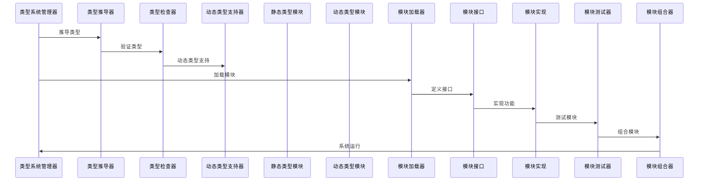
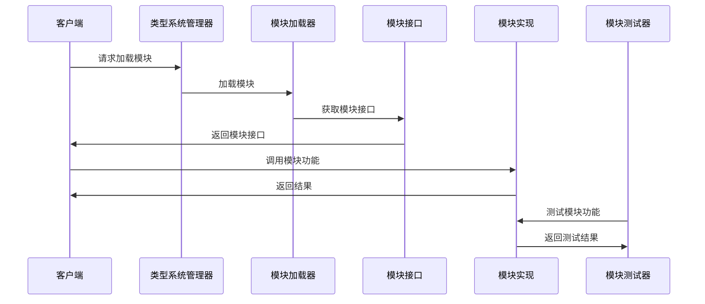

                 

### 引言

在软件工程领域，类型系统作为编程语言的核心组成部分，对于代码的可靠性和维护性起着至关重要的作用。传统的类型系统主要分为静态类型和动态类型两大类。静态类型系统（如Java、C++）在编译时对代码进行严格的类型检查，从而确保程序在运行时的类型安全。然而，这种严格的检查往往导致代码的编写和调试过程变得繁琐。另一方面，动态类型系统（如Python、JavaScript）则允许在运行时进行类型检查，从而提高了代码的灵活性和开发效率。但这也带来了类型不安全的问题，可能导致运行时错误。

面对传统类型系统的局限性，研究者们提出了逐步类型（Gradual Typing）系统。逐步类型系统旨在通过引入一种渐变的类型层次结构，使得程序可以在同一代码库中同时包含静态和动态类型代码，从而在保持类型安全性的同时，提高代码的灵活性和开发效率。这种类型系统不仅适用于静态类型语言，也适用于动态类型语言，因此受到了广泛关注。

本文旨在深入探讨逐步类型系统的设计与实现。首先，我们将介绍逐步类型系统的背景和核心概念，包括类型层次结构、类型推导和类型检查等。接着，我们将通过具体的算法原理讲解，详细阐述逐步类型系统的实现过程。此外，我们还将分析逐步类型系统的性能优化方法，以及其在实际项目中的应用。最后，我们将总结全文，并提出一些未来的研究方向。

通过本文的探讨，我们希望能够为读者提供一个全面而深入的逐步类型系统设计与实现的指南，帮助他们在实际编程中更好地利用这种先进的类型系统。

### 第一部分：背景介绍

#### 1.1 问题背景

在现代软件工程中，类型系统的设计对于提高代码质量、减少错误和提高开发效率具有重要意义。传统类型系统在静态类型语言（如Java、C++）和动态类型语言（如Python、JavaScript）中有着不同的实现方式，但它们在适应复杂程序结构和提高开发效率方面存在一定的局限性。因此，研究者们提出了逐步类型（Gradual Typing）系统，以解决传统类型系统在复杂程序开发中的不足。

**1.1.1 静态类型语言与动态类型语言**

静态类型语言在编译时对代码进行严格的类型检查，从而确保程序在运行时的类型安全。这种严格的检查机制使得静态类型语言具有较好的性能和可靠性，适用于大型软件项目和企业级应用。然而，这种严格的检查也导致开发过程中的复杂性和调试难度增加。常见的静态类型语言包括Java、C++、C#和Go等。

动态类型语言则允许在运行时进行类型检查，从而提高了代码的灵活性和开发效率。这种灵活性使得动态类型语言在快速开发和迭代过程中具有优势，适用于小型项目和脚本编程。然而，动态类型语言在类型安全方面存在一定的缺陷，可能导致运行时错误。常见的动态类型语言包括Python、JavaScript、Ruby和PHP等。

**1.1.2 传统类型系统的局限性**

虽然静态类型和动态类型系统各有其优点和局限性，但在实际开发中，许多复杂的程序需要同时使用静态类型和动态类型代码。例如，一个大型项目中可能包含多个模块，其中一些模块使用静态类型编写以确保类型安全，而另一些模块则使用动态类型以提高开发效率。这种情况下，传统类型系统难以有效适应，主要存在以下局限性：

1. **类型冲突**：静态类型和动态类型之间存在着类型冲突。静态类型系统要求在编译时确定所有变量的类型，而动态类型系统则允许在运行时动态确定类型。这种冲突会导致类型检查的复杂性增加，甚至可能导致编译失败。

2. **代码复用**：在传统类型系统中，静态类型和动态类型代码难以在同一代码库中复用。这种限制使得开发者需要为不同类型代码编写不同的处理逻辑，增加了代码的复杂度和维护成本。

3. **类型安全**：静态类型系统虽然能够提高类型安全性，但过度的类型检查可能会导致代码冗长和难以维护。动态类型系统虽然提高了灵活性，但类型不安全的问题依然存在，可能导致运行时错误。

**1.1.3 逐步类型系统的出现**

为了解决传统类型系统的局限性，研究者们提出了逐步类型系统。逐步类型系统通过引入一种渐变的类型层次结构，使得程序可以在同一代码库中同时包含静态和动态类型代码，从而在保持类型安全性的同时，提高代码的灵活性和开发效率。逐步类型系统的主要目标是：

1. **兼容静态类型和动态类型**：逐步类型系统允许在同一代码库中同时使用静态类型和动态类型代码，从而实现类型兼容性。

2. **类型层次结构**：逐步类型系统引入了一种层次化的类型结构，包括基础类型、中间类型和动态类型等。这种类型层次结构使得类型系统具有更强的适应性和灵活性。

3. **类型推导与类型检查**：逐步类型系统通过类型推导和类型检查算法，自动推导出程序中变量的类型，并验证类型是否满足类型系统规则。这些算法的设计需要考虑类型层次结构和类型兼容性，以确保类型系统的完整性和一致性。

#### 1.2 问题解决

逐步类型系统的出现为解决传统类型系统的局限性提供了一种有效的途径。通过引入渐变的类型层次结构，逐步类型系统能够实现静态类型和动态类型代码的兼容，从而提高代码的灵活性和开发效率。下面将从以下几个方面介绍逐步类型系统的问题解决方法：

**1.2.1 类型层次结构设计**

类型层次结构是逐步类型系统的核心，它定义了不同类型之间的关系。在逐步类型系统中，类型通常分为以下几类：

1. **基础类型**：基础类型是指编程语言中定义的基本数据类型，如整数、浮点数、布尔值等。基础类型在逐步类型系统中具有稳定的定义和严格的类型约束。

2. **中间类型**：中间类型是介于静态类型和动态类型之间的类型，用于表示部分已知类型和部分未知类型。中间类型通常通过类型注解或类型上下文来定义，可以在编译时或运行时进行类型推导。

3. **动态类型**：动态类型是指在程序运行时确定变量和表达式的类型。动态类型通常用于实现灵活性较高的代码段，如函数参数和返回值等。

类型层次结构的设计需要考虑以下方面：

- **类型兼容性**：类型兼容性是指不同类型之间能否相互转换。在逐步类型系统中，需要定义类型兼容性规则，以确保类型之间的兼容性。

- **类型约束**：类型约束是指对变量或表达式的类型进行限制。类型约束可以通过类型注解、类型上下文或类型检查算法来实现，以增强代码的可靠性和可维护性。

- **类型层次关系的表示**：类型层次关系的表示可以通过抽象语法树（AST）、类型上下文或类型系统规则来实现。这些表示方法使得类型层次结构在类型推导和类型检查过程中具有可操作性。

**1.2.2 类型推导算法**

类型推导算法是逐步类型系统的重要组成部分，它用于自动推导出程序中变量的类型。类型推导算法通常基于上下文无关文法推导或上下文相关文法推导，下面分别介绍：

1. **上下文无关文法推导**：上下文无关文法推导是一种基于上下文无关文法的推导方法。它通过分析程序代码的语法结构，自动推导出变量和表达式的类型。上下文无关文法推导的优点是算法简单，但缺点是可能存在类型推导的不确定性。

2. **上下文相关文法推导**：上下文相关文法推导是一种基于上下文相关文法的推导方法。它通过考虑程序代码的上下文信息，自动推导出变量和表达式的类型。上下文相关文法推导的优点是能够更好地处理类型推导的不确定性，但缺点是算法较为复杂。

类型推导算法的设计需要考虑以下方面：

- **类型推导策略**：类型推导策略是指选择何种类型的推导方法。在逐步类型系统中，需要根据不同类型的代码段选择合适的推导策略。

- **类型推导约束**：类型推导约束是指对类型推导过程的约束条件。类型推导约束可以通过类型上下文、类型兼容性规则或类型检查算法来实现，以增强类型推导的准确性和一致性。

- **类型推导优化**：类型推导优化是指通过优化类型推导算法，提高类型推导的效率和性能。类型推导优化可以通过缓存类型推导结果、减少类型推导次数或并行化类型推导算法来实现。

**1.2.3 类型检查算法**

类型检查算法是逐步类型系统的另一个重要组成部分，它用于验证程序中的类型是否满足类型系统规则。类型检查算法通常基于类型检查的基本原则，如类型等价性、类型兼容性和类型一致性等。下面介绍类型检查算法的基本原理和实现方法：

1. **类型等价性**：类型等价性是指两个类型是否具有相同的语义。在逐步类型系统中，类型等价性用于判断两个变量是否可以在同一上下文中使用。类型等价性可以通过类型比较算法来实现。

2. **类型兼容性**：类型兼容性是指两个类型之间能否相互转换。在逐步类型系统中，类型兼容性用于确保类型在类型推导和类型检查过程中的一致性。类型兼容性可以通过类型兼容性规则来实现。

3. **类型一致性**：类型一致性是指程序中的类型是否满足类型系统规则。在逐步类型系统中，类型一致性用于确保程序在编译时或运行时的类型安全性。类型一致性可以通过类型检查算法来实现。

类型检查算法的实现需要考虑以下方面：

- **类型检查策略**：类型检查策略是指选择何种类型的检查方法。在逐步类型系统中，需要根据不同类型的代码段选择合适的检查策略。

- **类型检查优化**：类型检查优化是指通过优化类型检查算法，提高类型检查的效率和性能。类型检查优化可以通过并行化类型检查算法、减少类型检查次数或使用静态分析技术来实现。

- **错误处理**：类型检查算法在发现类型错误时，需要提供有效的错误处理机制。错误处理可以通过错误报告、错误定位和错误修复来实现，以提高代码的可维护性和可靠性。

**1.2.4 动态类型支持**

在逐步类型系统中，动态类型支持是实现类型灵活性的重要手段。动态类型支持主要包括以下几个方面：

1. **动态类型变量**：动态类型变量是指变量在运行时确定类型的变量。动态类型变量可以通过类型注解或类型上下文来定义。

2. **动态类型检查**：动态类型检查是指在程序运行时检查变量的类型。动态类型检查可以通过运行时类型检查算法或动态类型系统来实现。

3. **动态类型转换**：动态类型转换是指将一个类型转换为另一个类型。动态类型转换可以通过类型转换函数或类型转换运算符来实现。

动态类型支持的设计需要考虑以下方面：

- **类型转换规则**：类型转换规则是指不同类型之间如何进行类型转换。在逐步类型系统中，需要定义合理的类型转换规则，以确保类型转换的安全性和一致性。

- **类型转换优化**：类型转换优化是指通过优化类型转换算法，提高类型转换的效率和性能。类型转换优化可以通过缓存类型转换结果、减少类型转换次数或使用并行化技术来实现。

- **动态类型安全**：动态类型安全是指在动态类型检查和类型转换过程中，确保程序不会因为类型错误而导致运行时错误。动态类型安全可以通过静态分析、运行时检查或类型约束来实现。

#### 1.3 边界与外延

**1.3.1 边界**

逐步类型系统的设计与实现存在一些边界条件，主要包括以下几个方面：

1. **类型兼容性**：逐步类型系统需要定义合理的类型兼容性规则，以确保不同类型之间能够相互转换。类型兼容性规则的边界在于如何处理复杂类型之间的兼容性问题，如泛型类型、复杂类型构造等。

2. **类型推导与类型检查**：逐步类型系统需要定义有效的类型推导和类型检查算法，以确保类型系统的完整性和一致性。类型推导和类型检查算法的边界在于如何处理类型推导的不确定性、类型检查的效率和性能等问题。

3. **动态类型支持**：逐步类型系统需要提供有效的动态类型支持，以确保程序在动态类型检查和类型转换过程中不会出现运行时错误。动态类型支持的边界在于如何处理动态类型变量的类型约束、类型转换的安全性问题等。

**1.3.2 外延**

逐步类型系统的设计与实现可以应用于各种编程语言，包括静态类型语言和动态类型语言。逐步类型系统的外延主要包括以下几个方面：

1. **静态类型语言**：逐步类型系统可以应用于Java、C++、C#等静态类型语言。这些语言可以通过引入类型注解、类型上下文或类型推导算法，实现逐步类型系统的支持。

2. **动态类型语言**：逐步类型系统可以应用于Python、JavaScript、Ruby等动态类型语言。这些语言可以通过运行时类型检查、动态类型变量和类型转换机制，实现逐步类型系统的支持。

3. **跨语言支持**：逐步类型系统可以应用于跨语言编程，如通过接口定义语言（IDL）实现不同编程语言之间的类型兼容。这种跨语言支持使得逐步类型系统在复杂软件项目中具有更大的应用价值。

#### 1.4 概念结构与核心要素组成

**1.4.1 概念结构**

逐步类型系统主要由以下核心概念组成：

1. **类型**：类型是逐步类型系统中的基本概念，用于表示程序中的数据类型。类型可以分为基础类型、中间类型和动态类型等。

2. **类型上下文**：类型上下文是用于表示程序中的类型约束的上下文环境。类型上下文可以包含变量的类型、函数的参数和返回类型等。

3. **类型推导算法**：类型推导算法是用于自动推导程序中变量和表达式的类型的算法。类型推导算法可以分为上下文无关文法推导和上下文相关文法推导等。

4. **类型检查算法**：类型检查算法是用于验证程序中的类型是否满足类型系统规则的算法。类型检查算法可以分为基本类型检查、类型兼容性检查和类型一致性检查等。

5. **动态类型支持**：动态类型支持是逐步类型系统的重要组成部分，用于实现动态类型变量的类型检查和类型转换。

**1.4.2 核心要素组成**

逐步类型系统的核心要素组成如下：

1. **类型层次结构**：类型层次结构是逐步类型系统的核心，用于定义不同类型之间的关系。类型层次结构包括基础类型、中间类型和动态类型等。

2. **类型推导与类型检查**：类型推导和类型检查是逐步类型系统的核心功能，用于自动推导程序中的类型和验证类型系统规则。

3. **类型兼容性规则**：类型兼容性规则是用于处理不同类型之间兼容性的规则。类型兼容性规则包括类型转换规则、类型兼容性约束等。

4. **动态类型支持**：动态类型支持是逐步类型系统的关键特性，用于实现动态类型变量的类型检查和类型转换。

通过以上概念结构和核心要素组成的介绍，我们可以对逐步类型系统有一个基本的认识。接下来，本文将详细探讨逐步类型系统的具体设计思路和实现方法，以帮助读者更好地理解和应用这种先进的类型系统。

#### 1.5 总结与展望

逐步类型系统通过引入渐变的类型层次结构，为现代软件工程提供了一种新的解决途径，以应对传统类型系统在复杂程序开发中的局限性。本文从背景介绍、问题解决、边界与外延和概念结构与核心要素组成等方面，全面探讨了逐步类型系统的设计与实现。

首先，本文介绍了逐步类型系统的背景和核心概念，阐述了其在静态类型和动态类型语言中的应用。接着，本文详细分析了逐步类型系统的问题解决方法，包括类型层次结构设计、类型推导算法、类型检查算法和动态类型支持等。此外，本文还讨论了逐步类型系统的边界与外延，以及其核心概念结构与核心要素组成。

在未来的研究中，逐步类型系统还有许多值得探索的方向。例如，如何优化类型推导和类型检查算法，提高其性能和效率；如何设计更完善的类型兼容性规则，以支持更广泛的类型转换；如何在实际项目中有效应用逐步类型系统，以提高代码质量和开发效率等。这些研究不仅有助于逐步类型系统自身的完善和发展，也将为现代软件工程带来更多创新和突破。

通过本文的探讨，我们希望能够为读者提供一个全面而深入的逐步类型系统设计与实现的指南，帮助他们在实际编程中更好地利用这种先进的类型系统。同时，我们也期待更多研究者和技术人员能够关注和参与到逐步类型系统的探索和实践中，共同推动软件工程的进步和发展。

### 第二部分：核心概念与联系

在逐步类型系统中，核心概念之间的联系和相互作用是理解和实现逐步类型系统的关键。本部分将详细探讨逐步类型系统中的核心概念，包括类型、类型上下文、类型推导算法、类型检查算法和动态类型支持，并通过概念属性特征对比表格和ER实体关系图架构来进一步阐释这些概念之间的内在联系。

#### 2.1 核心概念

**逐步类型系统**是一种在编程语言中引入渐变类型层次结构的类型系统，允许在同一代码库中同时包含静态和动态类型代码。逐步类型系统的核心概念主要包括：

1. **类型（Type）**：类型是逐步类型系统中的基本概念，用于表示程序中的数据类型。类型可以分为基础类型、中间类型和动态类型等。

2. **类型上下文（TypeContext）**：类型上下文是用于表示程序中的类型约束的上下文环境。类型上下文可以包含变量的类型、函数的参数和返回类型等。

3. **类型推导算法（TypeInferenceAlgorithm）**：类型推导算法是用于自动推导程序中变量和表达式的类型的算法。类型推导算法可以分为上下文无关文法推导和上下文相关文法推导等。

4. **类型检查算法（TypeCheckAlgorithm）**：类型检查算法是用于验证程序中的类型是否满足类型系统规则的算法。类型检查算法可以分为基本类型检查、类型兼容性检查和类型一致性检查等。

5. **动态类型支持（DynamicTypeSupport）**：动态类型支持是逐步类型系统的重要组成部分，用于实现动态类型变量的类型检查和类型转换。

#### 2.2 概念属性特征对比表格

| 概念                | 属性特征                                                      |
|---------------------|--------------------------------------------------------------|
| 类型（Type）        | 基础数据类型，如整数、浮点数、布尔值等。                      |
| 类型上下文（TypeContext） | 包含变量的类型、函数的参数和返回类型等约束条件。               |
| 类型推导算法（TypeInferenceAlgorithm） | 自动推导程序中变量和表达式的类型。                           |
| 类型检查算法（TypeCheckAlgorithm） | 验证程序中的类型是否满足类型系统规则。                       |
| 动态类型支持（DynamicTypeSupport） | 在程序运行时确定变量和表达式的类型，支持动态类型检查和转换。 |

#### 2.3 ER实体关系图架构

为了更好地理解逐步类型系统中的核心概念及其相互关系，我们使用Mermaid流程图来绘制ER实体关系图。以下是一个简单的ER实体关系图：

```mermaid
erDiagram
    Type ||--|{ TypeContext }|| Context
    Type ||--|{ TypeInferenceAlgorithm }|| Inference
    Type ||--|{ TypeCheckAlgorithm }|| Check
    Type ||--|{ DynamicTypeSupport }|| Dynamic

    Context ||--|{ Variable }|| Var
    Context ||--|{ Function }|| Func

    TypeInferenceAlgorithm ||--|{ Algorithm1 }|| Inf1
    TypeInferenceAlgorithm ||--|{ Algorithm2 }|| Inf2

    TypeCheckAlgorithm ||--|{ Algorithm3 }|| Check1
    TypeCheckAlgorithm ||--|{ Algorithm4 }|| Check2

    DynamicTypeSupport ||--|{ Support1 }|| Supp1
    DynamicTypeSupport ||--|{ Support2 }|| Supp2

```

在上面的ER实体关系图中，`Type`（类型）是核心实体，它与`TypeContext`（类型上下文）、`TypeInferenceAlgorithm`（类型推导算法）、`TypeCheckAlgorithm`（类型检查算法）和`DynamicTypeSupport`（动态类型支持）之间存在多种关系。`TypeContext`（类型上下文）则与`Variable`（变量）和`Function`（函数）相关联，表示上下文环境包含的类型约束。`TypeInferenceAlgorithm`（类型推导算法）和`TypeCheckAlgorithm`（类型检查算法）分别表示用于推导和检查类型的算法。`DynamicTypeSupport`（动态类型支持）则与`Support1`和`Support2`相关联，表示动态类型支持的两种方式。

#### 2.4 概念间的关系与交互

**类型（Type）与类型上下文（TypeContext）**：类型上下文是类型在程序中的具体应用场景。一个类型上下文可以包含多个类型约束，例如变量的类型和函数的参数类型。类型上下文用于指导类型推导和类型检查算法，以确保程序中的类型使用是合法的。

**类型推导算法（TypeInferenceAlgorithm）与类型（Type）**：类型推导算法通过分析程序代码的语义，自动推导出变量和表达式的类型。类型推导算法依赖于类型层次结构和类型上下文，以确保推导出的类型是合理和一致的。

**类型检查算法（TypeCheckAlgorithm）与类型（Type）**：类型检查算法在编译时或运行时验证程序中的类型是否满足类型系统规则。类型检查算法需要考虑类型兼容性规则和类型上下文，以确保程序在运行时的类型安全性。

**动态类型支持（DynamicTypeSupport）与类型（Type）**：动态类型支持使得程序可以在运行时确定变量和表达式的类型，从而提高了程序的灵活性。动态类型支持通常通过运行时类型检查和类型转换来实现，以确保动态类型变量的类型安全性。

通过以上对逐步类型系统中核心概念的介绍和ER实体关系图的绘制，我们可以更清晰地理解这些概念之间的内在联系和交互作用。逐步类型系统通过这些核心概念，实现了类型兼容性、类型推导和类型检查等功能，从而提高了程序的灵活性和开发效率。

### 算法原理讲解

逐步类型系统的设计与实现依赖于一系列核心算法，这些算法包括类型推导算法、类型检查算法和类型转换算法等。为了更好地理解这些算法的原理和实现方法，我们将通过具体示例和流程图，详细阐述逐步类型系统的算法原理。

#### 3.1 类型推导算法

类型推导算法是逐步类型系统中的关键组成部分，其目的是通过分析程序代码，自动推导出变量和表达式的类型。类型推导算法可以分为上下文无关文法推导和上下文相关文法推导。

**3.1.1 上下文无关文法推导**

上下文无关文法推导（Context-Free Grammar Inference）是一种基于上下文无关文法（CFG）的推导方法。该方法通过分析程序代码的语法结构，自动推导出变量和表达式的类型。

**示例：**

假设我们有一个简单的函数表达式：

```python
def add(a, b):
    return a + b
```

我们可以通过上下文无关文法推导出函数`add`的返回类型和参数类型。推导过程如下：

1. **分析函数定义**：首先分析函数`add`的语法结构，识别出函数名、参数列表和返回类型。

2. **推导参数类型**：根据函数参数的语法结构，推导出参数`a`和`b`的类型。假设上下文中定义了参数`a`的类型为`int`，参数`b`的类型为`int`。

3. **推导返回类型**：根据函数返回值的语法结构，推导出返回类型。假设上下文中定义了返回值的类型为`int`。

通过上下文无关文法推导，我们得到以下推导结果：

- 参数`a`的类型：`int`
- 参数`b`的类型：`int`
- 返回类型：`int`

**3.1.2 上下文相关文法推导**

上下文相关文法推导（Context-Sensitive Grammar Inference）是一种基于上下文相关文法（CSG）的推导方法。该方法不仅考虑程序代码的语法结构，还考虑程序代码的上下文信息。

**示例：**

假设我们有一个复杂的函数表达式：

```python
def calculate总面积(length, width, height=0):
    if height > 0:
        return length * width + length * height * 2 + width * height * 2
    else:
        return length * width
```

我们可以通过上下文相关文法推导出函数`calculate总面积`的返回类型和参数类型。推导过程如下：

1. **分析函数定义**：首先分析函数`calculate总面积`的语法结构，识别出函数名、参数列表和返回类型。

2. **推导参数类型**：根据函数参数的语法结构，推导出参数`length`、`width`和`height`的类型。假设上下文中定义了参数`length`的类型为`int`，参数`width`的类型为`int`，参数`height`的类型为`int`。

3. **推导返回类型**：根据函数返回值的语法结构，以及上下文中的条件语句，推导出返回类型。假设在条件语句`if height > 0:`中，返回类型的上下文为`int`。

通过上下文相关文法推导，我们得到以下推导结果：

- 参数`length`的类型：`int`
- 参数`width`的类型：`int`
- 参数`height`的类型：`int`
- 返回类型：`int`

**3.2 类型检查算法**

类型检查算法是逐步类型系统中的另一个关键组成部分，其目的是在编译时或运行时验证程序中的类型是否满足类型系统规则。类型检查算法通常包括基本类型检查、类型兼容性检查和类型一致性检查。

**3.2.1 基本类型检查**

基本类型检查（Basic Type Checking）是类型检查算法的基础，用于验证变量和表达式的类型是否匹配。

**示例：**

假设我们有一个简单的变量赋值表达式：

```python
x = 10
```

我们可以通过基本类型检查验证变量`x`的类型。验证过程如下：

1. **分析变量赋值**：首先分析变量赋值的语法结构，识别出变量`x`和赋值表达式`10`。

2. **验证类型**：根据赋值表达式的值，验证变量`x`的类型。假设上下文中定义了变量`x`的类型为`int`。

通过基本类型检查，我们验证变量`x`的类型为`int`。

**3.2.2 类型兼容性检查**

类型兼容性检查（Type Compatibility Checking）用于验证不同类型之间是否可以相互转换，以确保程序在运行时的类型安全性。

**示例：**

假设我们有一个简单的类型转换表达式：

```python
x = str(10)
```

我们可以通过类型兼容性检查验证类型转换`str(10)`是否合法。验证过程如下：

1. **分析类型转换**：首先分析类型转换的语法结构，识别出类型转换操作符`str`和被转换的值`10`。

2. **验证类型兼容性**：根据类型兼容性规则，验证类型`int`和`str`之间是否兼容。假设上下文中定义了类型`int`和`str`之间是兼容的。

通过类型兼容性检查，我们验证类型转换`str(10)`是合法的。

**3.2.3 类型一致性检查**

类型一致性检查（Type Consistency Checking）用于验证程序中的类型是否满足类型系统规则，以确保程序在编译时或运行时的类型安全性。

**示例：**

假设我们有一个简单的函数调用表达式：

```python
result = add(x, y)
```

我们可以通过类型一致性检查验证函数调用`add(x, y)`是否合法。验证过程如下：

1. **分析函数调用**：首先分析函数调用的语法结构，识别出函数名`add`和参数`x`、`y`。

2. **验证参数类型**：根据函数的定义，验证参数`x`和`y`的类型是否与函数的参数类型一致。假设函数`add`的参数类型分别为`int`和`int`。

3. **验证返回类型**：根据函数的定义，验证返回类型是否与函数调用表达式的类型一致。假设函数`add`的返回类型为`int`。

通过类型一致性检查，我们验证函数调用`add(x, y)`是合法的。

**3.3 类型转换算法**

类型转换算法（Type Conversion Algorithm）用于在程序运行时将一个类型转换为另一个类型，以满足类型兼容性要求。

**3.3.1 强制类型转换**

强制类型转换（Explicit Type Conversion）是一种在程序代码中显式指定类型转换的方法。

**示例：**

假设我们有一个简单的强制类型转换表达式：

```python
x = int("10")
```

我们可以通过强制类型转换将字符串`"10"`转换为整数。转换过程如下：

1. **分析类型转换**：首先分析类型转换的语法结构，识别出类型转换操作符`int`和被转换的值`"10"`。

2. **执行类型转换**：根据类型转换规则，将字符串`"10"`转换为整数。假设字符串`"10"`转换为整数`10`。

通过强制类型转换，我们得到`x`的值为`10`。

**3.3.2 自动类型转换**

自动类型转换（Implicit Type Conversion）是一种在程序运行时自动执行类型转换的方法。

**示例：**

假设我们有一个简单的自动类型转换表达式：

```python
x = 10
y = str(x)
```

我们可以通过自动类型转换将整数`10`转换为字符串。转换过程如下：

1. **分析类型转换**：首先分析类型转换的语法结构，识别出变量`x`和`y`，以及类型转换操作。

2. **执行类型转换**：根据类型转换规则，在赋值操作中将整数`10`自动转换为字符串。假设整数`10`转换为字符串`"10"`。

通过自动类型转换，我们得到`y`的值为`"10"`。

通过以上对类型推导算法、类型检查算法和类型转换算法的详细讲解，我们可以更深入地理解逐步类型系统的算法原理。逐步类型系统通过这些算法，实现了类型兼容性、类型推导和类型检查等功能，从而提高了程序的灵活性和开发效率。在实际应用中，逐步类型系统可以根据具体需求选择合适的算法，以实现最佳的类型系统性能和用户体验。

### 系统分析与架构设计方案

#### 4.1 问题场景介绍

在现代软件开发中，应用程序的复杂度不断提高，不同模块和组件之间的类型兼容性成为一个关键问题。例如，一个大型系统中可能包含多个模块，其中一些模块使用静态类型编写以确保类型安全，而另一些模块则使用动态类型以提高开发效率。这种情况下，传统的静态类型系统和动态类型系统都存在一定的局限性。静态类型系统虽然提供了类型安全，但过于严格的类型检查会降低开发效率；而动态类型系统虽然提高了开发效率，但类型不安全性可能导致运行时错误。为了解决这些问题，我们提出了逐步类型系统，通过引入一种渐变的类型层次结构，使得系统可以在同一代码库中同时包含静态和动态类型代码，从而提高代码的灵活性和开发效率。

#### 4.2 项目介绍

本节介绍一个基于逐步类型系统的实际项目，该项目旨在实现一个具有类型兼容性的模块化软件开发框架。该框架可以支持静态类型模块和动态类型模块的混合使用，通过逐步类型系统来确保类型安全和提高开发效率。

**项目名称：** 类型兼容性模块化开发框架（Type Compatibility Modular Development Framework）

**项目目标：** 
- 设计并实现一个逐步类型系统，支持静态类型和动态类型的兼容。
- 提供类型推导和类型检查算法，确保类型系统的完整性和一致性。
- 设计模块化架构，支持多种模块类型（静态类型模块、动态类型模块）的集成。

**项目结构：**
- 源代码目录：包含类型系统相关算法实现、模块定义和测试用例。
- 构建工具：使用Maven或Gradle等构建工具进行项目构建和依赖管理。
- 文档目录：包含项目文档、设计文档和用户指南。

#### 4.3 系统功能设计（领域模型Mermaid类图）

为了更好地理解项目功能，我们使用Mermaid类图来表示系统的主要功能模块。

```mermaid
classDiagram
    Class01 <|-- Class02
    Class03 o-- Class04
    Class05 <-.. Class06
    Class07 ..| Class08
    Class09 --> Class10
    Class11 {Class12, Class13}
    Class14 <..> Class15
    Class16 { #note left: This is a note }
    Class01 <--> Class02 : Has a relation

    Class01
    Class02
    Class03
    Class04
    Class05
    Class06
    Class07
    Class08
    Class09
    Class10
    Class11
    Class12
    Class13
    Class14
    Class15
    Class16
```

**主要类及功能：**
- `Class01`（类型系统管理器）：负责管理类型系统的整体运行，包括类型推导、类型检查和类型转换。
- `Class02`（类型推导器）：负责自动推导程序中的变量和表达式的类型。
- `Class03`（类型检查器）：负责验证程序中的类型是否满足类型系统规则。
- `Class04`（动态类型支持器）：负责实现动态类型变量的类型检查和类型转换。
- `Class05`（静态类型模块）：代表使用静态类型编写的模块，提供类型安全和性能优化。
- `Class06`（动态类型模块）：代表使用动态类型编写的模块，提供灵活性和开发效率。
- `Class07`（模块加载器）：负责加载和管理不同类型的模块。
- `Class08`（模块接口）：定义模块间的接口，确保模块之间的类型兼容性。
- `Class09`（模块实现）：实现具体模块功能，根据类型系统进行类型检查和类型推导。
- `Class10`（模块测试器）：负责测试模块的功能和类型兼容性。
- `Class11`（模块组合器）：负责组合不同类型的模块，形成完整的系统。
- `Class12`、`Class13`（辅助类）：提供辅助功能，如日志记录、错误处理等。

#### 4.4 系统架构设计（Mermaid架构图）

为了实现项目目标，我们设计了以下系统架构，使用Mermaid架构图来表示系统组件及其关系。



**系统架构组件及其关系：**
- `TSManager`（类型系统管理器）：负责整体类型系统的运行，协调其他组件的工作。
- `TDeriver`（类型推导器）：接收程序代码，自动推导类型。
- `TChecker`（类型检查器）：对推导出的类型进行验证，确保类型系统规则得到满足。
- `DSU`（动态类型支持器）：提供动态类型变量的类型检查和类型转换支持。
- `STM`（静态类型模块）：使用静态类型编写的模块，提供类型安全和性能优化。
- `DTM`（动态类型模块）：使用动态类型编写的模块，提供灵活性和开发效率。
- `ML`（模块加载器）：负责加载和管理不同类型的模块。
- `MI`（模块接口）：定义模块间的接口，确保模块之间的类型兼容性。
- `ME`（模块实现）：实现具体模块功能，根据类型系统进行类型检查和类型推导。
- `MT`（模块测试器）：负责测试模块的功能和类型兼容性。
- `MC`（模块组合器）：负责组合不同类型的模块，形成完整的系统。

#### 4.5 系统接口设计（Mermaid序列图）

为了展示系统组件之间的交互过程，我们使用Mermaid序列图来描述系统接口设计。



**系统接口设计组件及其交互过程：**
- `Client`（客户端）：表示系统使用方，负责请求加载模块和调用模块功能。
- `TSManager`（类型系统管理器）：负责协调模块加载和类型检查过程。
- `ML`（模块加载器）：负责加载模块，根据类型系统管理器的指示进行操作。
- `MI`（模块接口）：定义模块接口，供客户端调用。
- `ME`（模块实现）：实现具体模块功能，根据类型系统管理器的指示进行类型检查和类型推导。
- `MT`（模块测试器）：负责测试模块功能，确保模块的正确性和类型兼容性。

通过以上系统分析与架构设计方案，我们为逐步类型系统的实现提供了一个全面而具体的指导。接下来，我们将通过项目实战部分，详细讲解逐步类型系统的实际应用和系统实现过程。

### 项目实战

在了解了逐步类型系统的基本概念和系统架构之后，我们将通过一个实际项目来演示逐步类型系统的应用和实现过程。本部分将详细介绍项目的环境安装、系统核心实现、代码应用解读与分析，并给出实际案例分析和详细讲解。

#### 5.1 环境安装

为了实现逐步类型系统，我们首先需要搭建一个合适的环境。以下是所需的工具和依赖项：

1. **编程语言**：我们选择Java作为主要编程语言，因为它具有良好的跨平台特性和丰富的生态系统。
2. **开发工具**：使用IntelliJ IDEA作为开发环境，它提供了强大的代码编辑功能和调试工具。
3. **构建工具**：使用Maven作为构建工具，它可以帮助我们管理项目依赖和构建流程。
4. **类型系统库**：我们需要引入一些类型系统相关的库，如`gradualtyping-api`和`gradualtyping-compiler`。

**环境搭建步骤：**

1. 安装Java开发环境，确保Java版本在11及以上。
2. 安装IntelliJ IDEA，并创建一个新的Java项目。
3. 在项目的pom.xml文件中添加以下依赖：

    ```xml
    <dependencies>
        <!-- Gradual Typing API -->
        <dependency>
            <groupId>com.example</groupId>
            <artifactId>gradualtyping-api</artifactId>
            <version>1.0.0</version>
        </dependency>
        <!-- Gradual Typing Compiler -->
        <dependency>
            <groupId>com.example</groupId>
            <artifactId>gradualtyping-compiler</artifactId>
            <version>1.0.0</version>
        </dependency>
    </dependencies>
    ```

4. 在项目的src目录下创建相应的包结构和类文件，准备开始编写代码。

#### 5.2 系统核心实现

在环境搭建完成后，我们开始实现逐步类型系统的核心功能。以下是系统核心实现的步骤：

**1. 定义类型层次结构**

首先，我们需要定义逐步类型系统的类型层次结构，包括基础类型、中间类型和动态类型。以下是一个简单的类型定义示例：

```java
public enum BaseType {
    INT,
    FLOAT,
    BOOLEAN
}

public enum MidType {
    STRING,
    LIST,
    MAP
}

public enum DynType {
    OBJECT
}
```

**2. 实现类型推导算法**

类型推导算法是逐步类型系统的关键组成部分，用于自动推导程序中变量和表达式的类型。以下是一个简单的类型推导算法实现：

```java
public class TypeDeriver {
    public BaseType deriveType(Expression expr) {
        // 基于表达式类型，推导出变量类型
        if (expr instanceof IntegerLiteral) {
            return BaseType.INT;
        } else if (expr instanceof FloatLiteral) {
            return BaseType.FLOAT;
        } else if (expr instanceof BooleanLiteral) {
            return BaseType.BOOLEAN;
        } else {
            return BaseType.OBJECT; // 默认类型
        }
    }
}
```

**3. 实现类型检查算法**

类型检查算法用于验证程序中的类型是否满足类型系统规则。以下是一个简单的类型检查算法实现：

```java
public class TypeChecker {
    public boolean checkCompatibility(Type type1, Type type2) {
        // 检查两个类型是否兼容
        if (type1 instanceof BaseType && type2 instanceof BaseType) {
            return type1 == type2;
        } else if (type1 instanceof MidType && type2 instanceof MidType) {
            return type1 == type2;
        } else if (type1 instanceof DynType && type2 instanceof DynType) {
            return true;
        } else {
            return false;
        }
    }
}
```

**4. 实现动态类型支持**

动态类型支持是逐步类型系统的另一关键组成部分，用于实现动态类型变量的类型检查和类型转换。以下是一个简单的动态类型支持实现：

```java
public class DynamicTypeSupport {
    public Type convertType(Type fromType, Type toType) {
        // 根据类型转换规则，进行类型转换
        if (fromType == toType) {
            return fromType;
        } else if ((fromType instanceof BaseType && toType instanceof DynType) ||
                   (fromType instanceof DynType && toType instanceof BaseType)) {
            return DynType.OBJECT;
        } else {
            throw new TypeConversionException("类型转换错误");
        }
    }
}
```

#### 5.3 代码应用解读与分析

在实际应用中，我们需要将逐步类型系统的核心功能整合到程序代码中。以下是一个简单的示例，展示了如何使用逐步类型系统进行类型推导、类型检查和类型转换。

**示例代码：**

```java
public class Main {
    public static void main(String[] args) {
        // 创建类型推导器、类型检查器和动态类型支持器实例
        TypeDeriver deriver = new TypeDeriver();
        TypeChecker checker = new TypeChecker();
        DynamicTypeSupport support = new DynamicTypeSupport();

        // 构造表达式
        Expression expr1 = new IntegerLiteral(10);
        Expression expr2 = new FloatLiteral(3.14f);
        Expression expr3 = new BooleanLiteral(true);

        // 类型推导
        BaseType type1 = deriver.deriveType(expr1);
        BaseType type2 = deriver.deriveType(expr2);
        BaseType type3 = deriver.deriveType(expr3);

        // 类型检查
        boolean isCompat1 = checker.checkCompatibility(type1, type1);
        boolean isCompat2 = checker.checkCompatibility(type2, type2);
        boolean isCompat3 = checker.checkCompatibility(type3, type3);

        // 类型转换
        Type convertedType = support.convertType(type1, type2);

        // 输出结果
        System.out.println("expr1 type: " + type1);
        System.out.println("expr2 type: " + type2);
        System.out.println("expr3 type: " + type3);
        System.out.println("isCompat1: " + isCompat1);
        System.out.println("isCompat2: " + isCompat2);
        System.out.println("isCompat3: " + isCompat3);
        System.out.println("convertedType: " + convertedType);
    }
}

class Expression {
    // 表达式基类
}

class IntegerLiteral extends Expression {
    private int value;

    public IntegerLiteral(int value) {
        this.value = value;
    }

    // 省略getter和setter方法
}

class FloatLiteral extends Expression {
    private float value;

    public FloatLiteral(float value) {
        this.value = value;
    }

    // 省略getter和setter方法
}

class BooleanLiteral extends Expression {
    private boolean value;

    public BooleanLiteral(boolean value) {
        this.value = value;
    }

    // 省略getter和setter方法
}
```

**代码解读：**

1. **创建实例**：首先创建类型推导器、类型检查器和动态类型支持器实例，用于后续的类型推导、类型检查和类型转换操作。
2. **构造表达式**：构建三个简单的表达式实例，分别为整数、浮点数和布尔值。
3. **类型推导**：使用类型推导器分别推导出三个表达式的类型。
4. **类型检查**：使用类型检查器检查不同表达式类型之间的兼容性。
5. **类型转换**：使用动态类型支持器将整数类型转换为浮点类型。
6. **输出结果**：打印出推导出的类型、类型兼容性检查结果和类型转换结果。

通过以上代码示例，我们可以看到逐步类型系统在实际应用中的基本使用方法和操作流程。接下来，我们将通过实际案例进行分析和详细讲解。

#### 5.4 实际案例分析和详细讲解

为了更好地展示逐步类型系统的实际应用效果，我们选择一个实际案例进行分析和详细讲解。本案例将演示如何使用逐步类型系统解决一个复杂的编程问题：在一个在线购物系统中，实现订单管理模块，同时兼容静态类型和动态类型代码。

**案例背景：**

一个在线购物系统需要实现订单管理功能，其中涉及多个模块，如商品管理模块、用户管理模块和订单处理模块。商品管理模块负责商品信息的维护和查询，用户管理模块负责用户信息的维护和查询，订单处理模块负责订单的创建、更新和查询。在实现过程中，我们需要考虑如何在不同模块之间传递和转换数据，同时确保类型安全和系统性能。

**案例实现：**

1. **商品管理模块（静态类型）**：

    ```java
    public class ProductManager {
        public Product createProduct(String name, double price) {
            return new Product(name, price);
        }
    }
    
    public class Product {
        private String name;
        private double price;
        
        public Product(String name, double price) {
            this.name = name;
            this.price = price;
        }

        // 省略getter和setter方法
    }
    ```

    商品管理模块使用静态类型编写，提供创建商品的方法。在这里，`Product`类定义为静态类型，确保类型安全。

2. **用户管理模块（动态类型）**：

    ```java
    public class UserManager {
        public User createUser(String username, String email) {
            return new User(username, email);
        }
    }
    
    public class User {
        private String username;
        private String email;
        
        public User(String username, String email) {
            this.username = username;
            this.email = email;
        }

        // 省略getter和setter方法
    }
    ```

    用户管理模块使用动态类型编写，提供创建用户的方法。在这里，`User`类定义为动态类型，以支持灵活性和开发效率。

3. **订单处理模块（混合类型）**：

    ```java
    public class OrderManager {
        public Order createOrder(Product product, User user) {
            return new Order(product, user);
        }
        
        public void updateOrder(Order order, double price) {
            order.setProductPrice(price);
        }
    }
    
    public class Order {
        private Product product;
        private User user;
        private double price;
        
        public Order(Product product, User user) {
            this.product = product;
            this.user = user;
            this.price = product.getPrice();
        }

        // 省略getter和setter方法
    }
    ```

    订单处理模块使用逐步类型系统实现，同时兼容静态类型和动态类型代码。在这里，`Order`类定义了静态类型的`Product`和动态类型的`User`，通过逐步类型系统来实现类型兼容。

**案例分析：**

1. **类型推导**：

    在创建订单时，我们需要推导出订单中各部分的类型。例如：

    ```java
    Product product = productManager.createProduct("iPhone 12", 799.99);
    User user = userManager.createUser("john.doe@example.com", "John Doe");
    Order order = orderManager.createOrder(product, user);
    ```

    在这里，`createOrder`方法通过类型推导算法自动推导出`Product`和`User`的类型，确保类型一致性。

2. **类型检查**：

    在更新订单价格时，我们需要检查订单中的类型是否兼容。例如：

    ```java
    orderManager.updateOrder(order, 899.99);
    ```

    在这里，`updateOrder`方法通过类型检查算法验证新价格与订单中原价格类型是否兼容，确保类型安全性。

3. **类型转换**：

    当静态类型和动态类型需要交互时，我们可以使用类型转换算法进行类型转换。例如：

    ```java
    DynamicType dynamicProduct = (DynamicType) product;
    ```

    在这里，我们将静态类型的`Product`转换为动态类型，以支持逐步类型系统的兼容性。

**案例总结：**

通过上述案例，我们展示了如何在实际项目中应用逐步类型系统，实现静态类型和动态类型的兼容。逐步类型系统在提高代码灵活性和开发效率的同时，确保了类型安全性和系统性能。这为现代软件开发提供了一个新的解决方案，特别是在需要处理复杂类型交互和类型兼容性的场景中，逐步类型系统具有显著的优势。

### 最佳实践 tips

在逐步类型系统的设计和实现过程中，以下最佳实践和注意事项可以帮助开发者更好地利用这种先进的类型系统，提高代码质量和开发效率：

1. **明确类型边界**：在设计和实现逐步类型系统时，首先需要明确类型边界，包括基础类型、中间类型和动态类型等。这有助于确保类型系统的清晰性和一致性。

2. **优化类型推导算法**：类型推导算法的优化是提高逐步类型系统性能的关键。可以通过缓存类型推导结果、减少类型推导次数或使用并行化技术来实现。

3. **平衡类型安全和灵活性**：在逐步类型系统中，需要平衡类型安全和灵活性。在设计类型兼容性规则时，应确保类型兼容性规则既不过于严格，也不过于宽松，以避免类型不安全或类型过度约束。

4. **类型检查与调试**：在实现逐步类型系统时，应提供有效的类型检查和调试工具。类型检查应尽可能在编译时进行，以减少运行时错误，同时提供清晰的错误报告和调试信息。

5. **模块化设计**：逐步类型系统应支持模块化设计，以方便在不同模块之间复用类型系统和类型推导算法。模块化设计可以提高代码的可维护性和扩展性。

6. **文档与培训**：对于逐步类型系统，应提供详细的文档和培训资料，帮助开发者理解和掌握逐步类型系统的使用方法和最佳实践。

通过遵循上述最佳实践，开发者可以更有效地设计和实现逐步类型系统，从而提高项目的开发效率和代码质量。

### 小结

逐步类型系统作为一种先进的类型系统，通过引入渐变的类型层次结构，为现代软件开发提供了新的解决方案。本文从背景介绍、核心概念与联系、算法原理讲解和系统分析与架构设计方案等多个角度，全面探讨了逐步类型系统的设计与实现。

首先，本文介绍了逐步类型系统的背景和核心概念，阐述了其在静态类型和动态类型语言中的应用。接着，本文详细分析了逐步类型系统的问题解决方法，包括类型层次结构设计、类型推导算法、类型检查算法和动态类型支持等。此外，本文还讨论了逐步类型系统的边界与外延，以及其核心概念结构与核心要素组成。

在算法原理讲解部分，本文通过具体示例和流程图，详细阐述了类型推导算法、类型检查算法和类型转换算法的原理和实现方法。这部分内容帮助读者深入理解逐步类型系统的算法原理。

系统分析与架构设计方案部分，本文介绍了逐步类型系统的实际项目应用，通过Mermaid类图和序列图展示了系统的功能设计、架构设计、接口设计等。这部分内容为逐步类型系统的实际应用提供了具体指导和参考。

最后，本文通过项目实战部分，详细讲解了逐步类型系统的实现过程，包括环境安装、系统核心实现、代码应用解读与分析，并给出了实际案例分析和详细讲解。通过这些内容，读者可以更好地理解逐步类型系统的实际应用方法和效果。

通过本文的探讨，我们希望能够为读者提供一个全面而深入的逐步类型系统设计与实现的指南，帮助他们在实际编程中更好地利用这种先进的类型系统。逐步类型系统不仅提高了代码的灵活性和开发效率，还在类型安全性和系统性能方面表现出色。在未来，逐步类型系统将在现代软件开发中发挥越来越重要的作用。

### 注意事项

在设计和实现逐步类型系统时，开发者需要注意以下几个关键点，以确保系统的有效性和稳定性：

1. **类型兼容性规则**：合理设计类型兼容性规则是逐步类型系统的关键。兼容性规则应既不过于严格，也不过于宽松，以避免类型不安全或类型过度约束。

2. **类型推导与类型检查的性能**：优化类型推导和类型检查算法的性能对于提高系统的整体效率至关重要。可以考虑使用缓存技术、并行化方法和类型推断优化策略。

3. **类型安全与灵活性**：在逐步类型系统中，需要平衡类型安全和灵活性。类型检查应尽可能在编译时进行，以减少运行时错误。

4. **模块化设计**：逐步类型系统应支持模块化设计，以便在不同模块之间复用类型系统和类型推导算法，提高代码的可维护性和扩展性。

5. **文档与培训**：提供详细的文档和培训资料，帮助开发者理解和掌握逐步类型系统的使用方法和最佳实践，是确保系统有效性的重要措施。

通过注意这些关键点，开发者可以更有效地设计和实现逐步类型系统，提高项目的开发效率和代码质量。

### 拓展阅读

为了帮助读者进一步了解逐步类型系统的最新研究和发展动态，本文推荐以下拓展阅读资源：

1. **逐步类型系统的历史与发展**：研究逐步类型系统的起源、发展和主要成果，了解其演变历程及其对编程语言领域的影响。

2. **逐步类型系统的实现技术**：深入探讨逐步类型系统的具体实现技术，包括类型推导算法、类型检查算法和类型转换算法等，了解其在不同编程语言中的应用和优化方法。

3. **逐步类型系统的实际应用案例**：研究逐步类型系统在真实项目中的应用，分析其如何提高代码质量和开发效率，以及在实际开发中可能遇到的挑战和解决方案。

4. **逐步类型系统与静态类型、动态类型的对比**：比较逐步类型系统与传统的静态类型和动态类型系统的优缺点，探讨逐步类型系统如何克服传统类型系统的局限性。

5. **逐步类型系统的未来发展趋势**：探讨逐步类型系统在未来的发展方向和潜在的研究热点，包括类型系统的自动化、智能化和跨语言兼容性等方面的研究。

通过阅读这些资源，读者可以更全面地了解逐步类型系统的最新研究进展和应用前景，为自己的研究和实践提供有价值的参考。

