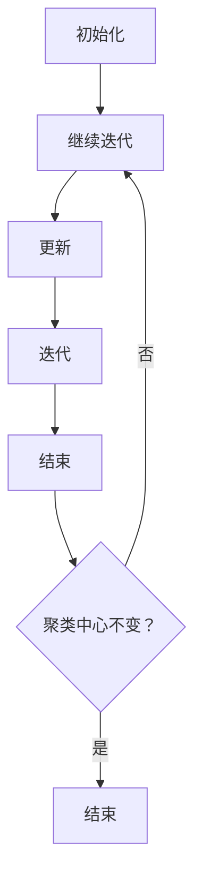
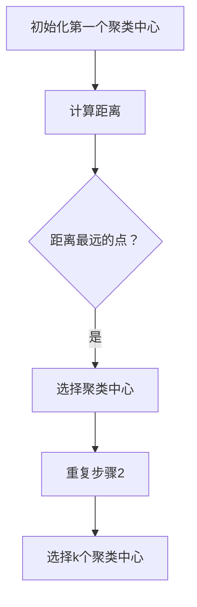

                 

### 前言

#### 目的介绍

《k-means算法与数据聚类分析》旨在为读者提供深入理解和掌握k-means算法以及数据聚类分析的专业技术知识。通过本篇文章，我们将逐步解析k-means算法的原理、实现方法、评估指标、改进措施及其在机器学习和商业分析中的应用，帮助读者构建起全面而扎实的知识体系。

文章不仅适用于数据分析、机器学习从业者，也适合计算机科学专业的学生和技术爱好者。在深度剖析k-means算法的同时，我们还将探讨其在不同领域的实际应用，为读者提供实际操作的经验和思路。

#### 读者对象

本篇文章面向有志于深入了解和掌握k-means算法以及数据聚类分析的技术人员，包括：

- 数据分析师与机器学习工程师
- 计算机科学专业的学生与研究人员
- 对人工智能和数据科学有浓厚兴趣的技术爱好者

无论您是新手还是专业人士，相信本文都将为您带来新的见解和实用的技能，帮助您在数据分析和机器学习领域取得更大的进展。

### 第1章 k-means算法概述

#### 1.1 问题背景与描述

数据聚类是数据分析中的一项重要任务，旨在将相似的数据点归为同一组，从而揭示数据内部的隐藏模式和结构。聚类分析在多种领域中都有广泛应用，如市场细分、图像分割、社交网络分析等。

k-means算法是一种经典的聚类算法，其主要目标是找到数据集中的k个簇（Cluster），使得每个簇内的数据点尽可能接近，而簇与簇之间的数据点尽可能远。这一目标可以通过优化目标函数来实现，具体来说，即最小化簇内距离之和。

在实际应用中，数据聚类分析可以帮助我们更好地理解数据的分布特征，发现潜在的规律和关联，从而为数据挖掘、模式识别和预测建模提供有力的支持。

#### 1.2 k-means算法的基本原理

k-means算法的基本原理可以通过以下几个步骤来概括：

1. **初始化**：随机选择k个数据点作为初始聚类中心。
2. **分配**：对于每个数据点，计算其到各个聚类中心的距离，并将其分配到最近的聚类中心。
3. **更新**：重新计算每个聚类中心的位置，即每个簇的均值。
4. **迭代**：重复步骤2和步骤3，直到聚类中心不再发生变化或达到预设的迭代次数。

算法流程可以用Mermaid图示表示如下：



k-means算法的核心在于如何定义簇之间的相似度和距离。在数学上，通常使用欧几里得距离来计算数据点与聚类中心之间的距离。具体来说，给定一个数据点\( x \)和一个聚类中心\( \mu_i \)，它们之间的距离可以表示为：

\[ d(x, \mu_i) = \sqrt{\sum_{j=1}^{d} (x_j - \mu_{ij})^2} \]

其中，\( d \)是数据的维度，\( x_j \)和\( \mu_{ij} \)分别是数据点\( x \)和聚类中心\( \mu_i \)的第\( j \)个维度。

为了最小化簇内距离之和，k-means算法的目标函数可以表示为：

\[ \min_{x_1, x_2, ..., x_n} \sum_{i=1}^{k} \sum_{j=1}^{n} ||x_j - \mu_i||^2 \]

其中，\( x_1, x_2, ..., x_n \)是数据集中的所有数据点。

#### 1.3 k-means与其他聚类算法的对比

在聚类算法领域，k-means因其简单易实现和良好的性能而备受关注。然而，与其他聚类算法相比，k-means也具有一定的局限性。以下是k-means与其他一些常见聚类算法的对比：

| 聚类算法 | 优点 | 缺点 |  
| --- | --- | --- |  
| k-means | 实现简单、计算速度快、对初始聚类中心敏感 | 无法处理簇形状不规则、对噪声敏感、需要事先指定簇数k |  
| 层次聚类 | 自动确定簇数、能够处理复杂结构 | 计算复杂度较高、对初始聚类中心敏感、聚类结果依赖于距离度量 |  
| DBSCAN | 能够处理簇形状不规则、对噪声不敏感 | 计算复杂度较高、需要事先指定邻域参数ε和最小簇大小minPoints |  
| 密度聚类 | 能够自适应地确定簇数、对噪声不敏感 | 计算复杂度较高、对参数敏感、需要处理数据的高维性 |

#### 1.4 k-means算法的应用场景

k-means算法在实际应用中具有广泛的应用场景，以下是一些典型的例子：

- **图像聚类**：k-means算法常用于图像分割，通过将图像中的像素点聚类为不同的颜色类别，实现图像的分割和分类。
- **文本聚类**：在自然语言处理领域，k-means算法可以用于文本聚类，帮助我们将相似的文本归为同一类，从而实现文档分类和信息检索。
- **客户细分**：在市场营销中，k-means算法可以用于客户细分，通过分析客户的购买行为和特征，将客户分为不同的群体，从而制定更精准的营销策略。

#### 1.5 本章小结

本章对k-means算法进行了概述，详细介绍了算法的基本原理、流程和目标函数，并对比了k-means与其他聚类算法的优缺点。通过本章的学习，读者可以初步了解k-means算法的核心概念和应用场景，为进一步深入学习打下基础。

### 第2章 数据聚类中的评估指标

#### 2.1 内部评估指标

内部评估指标主要用于衡量聚类结果内部结构的质量，即簇内的紧密度和簇间的分离度。以下是几种常见的内部评估指标：

##### 轮廓系数（Silhouette Coefficient）

轮廓系数是一种衡量簇内部紧密度和簇间分离度的指标。对于每个数据点，轮廓系数可以通过以下公式计算：

\[ s(i) = \frac{(b(i) - a(i))}{\max(a(i), b(i))} \]

其中，\( a(i) \)表示数据点\( i \)与其所在簇内其他数据点的平均距离，\( b(i) \)表示数据点\( i \)与其最近簇（非当前簇）的平均距离。轮廓系数的取值范围为[-1, 1]，越接近1表示数据点聚类效果越好。

轮廓系数的计算过程可以用以下Mermaid图示来解释：

```mermaid
graph TB
    A[数据点i] --> B[计算a(i)]
    B --> C[计算b(i)]
    C --> D[计算s(i)]
    E[所有数据点的s(i)取平均值]
```

##### 聚类有效性指数（V-measure）

聚类有效性指数（V-measure）是另一个衡量聚类质量的重要指标，它综合考虑了簇内紧密度和簇间分离度。V-measure的定义公式为：

\[ V = \frac{1}{N} \sum_{i=1}^{K} \frac{n_i \cdot |C_i \cap R_i|}{n_i \cdot |C_i| + |R_i|} \]

其中，\( N \)是数据点的总数，\( K \)是簇的总数，\( n_i \)是第\( i \)个簇中的数据点数量，\( C_i \)是实际簇标签，\( R_i \)是预测簇标签。

#### 2.2 外部评估指标

外部评估指标通常需要与已知的真实标签进行对比，从而评估聚类结果的质量。以下是几种常见的外部评估指标：

##### 调整兰德指数（Adjusted Rand Index, ARI）

调整兰德指数（Adjusted Rand Index, ARI）是一种衡量聚类结果一致性的指标。ARI的计算公式为：

\[ ARI = 1 - \frac{2 \cdot (n_{00} + n_{11}) - n_{10} \cdot n_{01}}{(k^2 - k) \cdot N} \]

其中，\( n_{ij} \)表示真实簇\( i \)和预测簇\( j \)中共同的数据点数量，\( k \)是真实簇的数量，\( N \)是数据点的总数。

##### 同质性指数（Homogeneity Score）

同质性指数（Homogeneity Score）用于衡量聚类结果与真实标签的一致性。其计算公式为：

\[ Homogeneity = \frac{2 \cdot (n_{00} + n_{11})}{N} \]

其中，\( n_{ij} \)的计算与ARI相同。

#### 2.3 评估指标的选择与应用

选择评估指标时，需要考虑数据的特点和聚类任务的具体需求。以下是几种常见情况下的选择依据：

- **对于无监督聚类**：通常使用内部评估指标如轮廓系数和V-measure。
- **对于有监督聚类**：通常使用外部评估指标如ARI和同质性指数。
- **对于图像聚类**：轮廓系数和V-measure是较好的选择，因为它们可以很好地衡量簇内紧密度和簇间分离度。
- **对于文本聚类**：ARI和同质性指数可能更为合适，因为文本聚类通常涉及已知真实标签。

在实际应用中，评估指标的选择和计算需要结合具体任务和数据特点。以下是一个实际案例：

##### 案例一：文本聚类评估

假设我们使用k-means算法对一组文本文档进行聚类，已知这些文档的真实标签。为了评估聚类效果，我们可以计算以下评估指标：

- **轮廓系数**：计算每个文本文档的轮廓系数，并取平均值。
- **V-measure**：计算V-measure指标。
- **ARI**：计算ARI指标。
- **同质性指数**：计算同质性指数。

通过这些评估指标，我们可以全面了解文本聚类的质量，并据此调整算法参数或选择更合适的聚类算法。

#### 2.4 本章小结

本章介绍了数据聚类中的内部和外部评估指标，包括轮廓系数、V-measure、调整兰德指数（ARI）和同质性指数。通过这些评估指标，我们可以定量地衡量聚类结果的质量，从而指导算法的选择和参数调整。本章内容为后续章节深入讨论k-means算法的改进和应用提供了基础。

### 第3章 k-means算法的改进方法

#### 3.1 k-means的变体

k-means算法虽然简单有效，但在处理复杂数据集时可能存在一些局限性。为了克服这些局限性，研究者们提出了多种k-means的变体，以下介绍两种常用的变体：k-means++和层次聚类。

##### k-means++

k-means++是一种改进的k-means初始化方法，旨在提高聚类效果。传统的k-means初始化方法通常随机选择k个初始聚类中心，而k-means++则采用以下步骤：

1. **初始化第一个聚类中心**：随机选择一个数据点作为第一个聚类中心。
2. **选择下一个聚类中心**：对于每个未被分配的数据点，计算其与已有聚类中心的距离，选择距离最远的点作为下一个聚类中心。
3. **重复步骤2**，直到选择出k个聚类中心。

k-means++的改进点在于，它通过选择距离较远的点作为新的聚类中心，使得初始聚类中心分布更加均匀，从而有助于减少局部最优的问题。使用Mermaid图示可以更直观地展示k-means++的流程：



##### 层次聚类

层次聚类（Hierarchical Clustering）是一种通过构建树形结构来进行数据聚类的算法。层次聚类可以分为两种类型：凝聚层次聚类（Agglomerative Clustering）和分裂层次聚类（Divisive Clustering）。以下是凝聚层次聚类的基本步骤：

1. **初始化**：将每个数据点视为一个初始簇。
2. **合并**：计算相邻簇之间的距离，选择距离最近的两个簇合并为一个簇。
3. **重复步骤2**，直到合并到所需的簇数。

层次聚类通过逐步合并或分裂簇，构建出一个层次结构，每个簇都可以在树形结构中找到其祖先簇。这种结构有助于我们理解数据的层次关系和聚类过程。

#### 3.2 调整距离度量方法

距离度量是k-means算法中一个关键的部分，常用的距离度量方法包括欧氏距离、曼哈顿距离和切比雪夫距离等。以下介绍这些距离度量方法及其在k-means算法中的应用。

##### 欧氏距离

欧氏距离（Euclidean Distance）是最常见的距离度量方法，适用于度量二维和三维空间中点的距离。欧氏距离的公式为：

\[ d(x, y) = \sqrt{\sum_{i=1}^{n} (x_i - y_i)^2} \]

在k-means算法中，欧氏距离用于计算数据点与聚类中心之间的距离，从而决定数据点的归属。

##### 曼哈顿距离

曼哈顿距离（Manhattan Distance）适用于一维和二维空间，其公式为：

\[ d(x, y) = \sum_{i=1}^{n} |x_i - y_i| \]

曼哈顿距离在计算过程中不考虑方向，只考虑绝对值，因此在某些情况下可能比欧氏距离更适用。

##### 切比雪夫距离

切比雪夫距离（Chebyshev Distance）适用于多维空间，其公式为：

\[ d(x, y) = \max_{1 \leq i \leq n} |x_i - y_i| \]

切比雪夫距离计算的是数据点与聚类中心之间各个维度上的最大距离，因此在某些情况下可以更好地反映数据点的相对位置。

#### 3.3 结合其他算法

k-means算法可以通过与其他算法的结合，进一步改进其性能和应用范围。以下介绍两种常见的结合方法：混合聚类和深度学习。

##### 混合聚类

混合聚类（Mixed Clustering）将k-means与其他聚类算法结合，以克服单一算法的局限性。例如，可以将k-means与层次聚类结合，首先使用层次聚类确定簇的初始位置，然后使用k-means进行进一步的细化。这种方法可以提高聚类的准确性和鲁棒性。

##### 深度学习

深度学习（Deep Learning）在聚类任务中也取得了显著成果。深度聚类算法（如深度自动编码器（Deep Autoencoder））利用深度神经网络来学习数据的潜在表示，从而实现高效聚类。深度学习结合k-means可以处理高维数据和复杂数据结构，提高聚类的性能和灵活性。

#### 3.4 实际案例分析

以下介绍两个实际案例，展示k-means算法的改进方法和应用效果。

##### 案例一：图像聚类

在图像聚类中，k-means算法常用于图像分割和颜色分类。通过改进k-means算法，例如使用k-means++初始化和结合深度学习，可以显著提高图像聚类的效果。在实际应用中，我们可以在图像预处理后，使用k-means++进行初步聚类，然后使用深度自动编码器进行进一步优化，从而获得更精确的图像分割结果。

##### 案例二：文本聚类

在文本聚类中，k-means算法可以用于文档分类和信息检索。通过结合k-means++和深度学习，我们可以提高文本聚类的效果。例如，首先使用k-means++进行初始聚类，然后使用深度自动编码器对文本进行降维和特征提取，从而实现高效且准确的文本聚类。

#### 3.5 本章小结

本章介绍了k-means算法的改进方法，包括k-means++、层次聚类、调整距离度量方法、结合其他算法等。通过这些改进方法，k-means算法在处理复杂数据集和实现高效聚类方面表现出更强的能力。本章内容为读者提供了丰富的实际案例，有助于理解和应用k-means算法及其改进方法。

### 第4章 k-means算法在机器学习中的应用

#### 4.1 数据预处理

在应用k-means算法进行机器学习任务之前，数据预处理是一个关键步骤。数据预处理包括数据标准化、缺失值处理和异常值检测等，这些步骤对于算法的性能和结果的可靠性至关重要。

##### 数据标准化

数据标准化是将数据转换为相同尺度或范围的常用技术，这样可以避免不同特征之间的尺度差异对算法的影响。常见的标准化方法包括：

1. **Z-Score标准化**：计算每个特征的平均值和标准差，然后对数据进行标准化，使其均值为0，标准差为1。
   \[ z = \frac{x - \mu}{\sigma} \]
   其中，\( x \)为原始数据，\( \mu \)为平均值，\( \sigma \)为标准差。

2. **Min-Max标准化**：将数据缩放到[0, 1]之间。
   \[ x_{\text{norm}} = \frac{x - \min(x)}{\max(x) - \min(x)} \]

##### 缺失值处理

缺失值处理是数据预处理的重要环节，常用的方法包括：

1. **删除缺失值**：直接删除含有缺失值的样本或特征。
2. **填充缺失值**：使用平均值、中位数、众数或插值等方法填充缺失值。
3. **多重插补**：生成多个完整的数据集，然后对每个数据集进行建模，最后取结果的平均。

##### 异常值检测

异常值检测是指识别和去除数据集中的异常值。常用的异常值检测方法包括：

1. **Z-Score方法**：计算每个特征的标准分数，去除标准分数高于3或低于-3的异常值。
2. **IQR方法**：计算每个特征的四分位距（IQR），去除IQR范围内外的异常值。

通过以上预处理步骤，我们可以确保数据的质量和一致性，从而提高k-means算法的收敛速度和聚类效果。

#### 4.2 特征选择

特征选择是数据预处理后的重要步骤，旨在从原始特征中挑选出对聚类任务最有贡献的特征。有效的特征选择可以减少数据维度、提高算法性能并降低计算复杂度。

##### 特征重要性

在k-means算法中，特征重要性可以通过以下方法评估：

1. **簇中心距离**：计算每个特征在簇中心之间的差异程度，差异越大表示该特征对聚类结果的重要性越高。
2. **轮廓系数**：通过计算每个数据点的轮廓系数，评估特征对聚类结果的质量影响。

##### 主成分分析（PCA）

主成分分析（PCA）是一种常用的特征选择方法，通过将数据投影到新的坐标系中，保留最重要的特征，从而降低数据维度。PCA的基本步骤如下：

1. **计算协方差矩阵**：计算数据集的协方差矩阵，找出特征之间的相关性。
2. **计算特征值和特征向量**：对协方差矩阵进行特征分解，得到特征值和特征向量。
3. **选择主成分**：选择特征值最大的前k个特征向量，构成新的特征空间。

通过PCA，我们可以将高维数据映射到低维空间，同时保留大部分信息，从而提高k-means算法的聚类效果。

#### 4.3 模型训练与评估

k-means算法的训练和评估过程相对简单，但需要注意一些细节和技巧。

##### 模型训练

k-means的训练过程主要包括以下几个步骤：

1. **初始化聚类中心**：选择初始聚类中心，可以使用随机初始化或k-means++等方法。
2. **分配数据点**：计算每个数据点到聚类中心的距离，将其分配到最近的聚类中心。
3. **更新聚类中心**：计算每个簇的数据点的均值，更新聚类中心。
4. **迭代**：重复步骤2和步骤3，直到聚类中心不再发生变化或达到预设的迭代次数。

##### 模型评估

k-means算法的评估可以通过以下方法进行：

1. **内部评估指标**：使用轮廓系数、V-measure等内部评估指标来评估聚类结果的质量。
2. **外部评估指标**：如果已知真实标签，可以使用调整兰德指数（ARI）和同质性指数来评估聚类结果。
3. **交叉验证**：使用交叉验证方法评估模型的泛化能力。

在实际应用中，我们通常需要调整算法的参数，如簇数k、距离度量方法等，以获得最佳的聚类效果。以下是一个简单的示例代码，展示了k-means的训练和评估过程：

```python
from sklearn.cluster import KMeans
from sklearn.metrics import silhouette_score
import numpy as np

# 数据加载
X = np.array([[1, 2], [1, 4], [1, 0],
              [10, 2], [10, 4], [10, 0]])

# 初始化k-means模型
kmeans = KMeans(n_clusters=2, init='k-means++', max_iter=100, n_init=10)

# 训练模型
kmeans.fit(X)

# 分配数据点
labels = kmeans.predict(X)

# 更新聚类中心
centroids = kmeans.cluster_centers_

# 计算轮廓系数
silhouette_avg = silhouette_score(X, labels)

# 输出结果
print(f"聚类中心: {centroids}")
print(f"轮廓系数: {silhouette_avg}")
```

#### 4.4 实际应用案例

以下介绍两个实际案例，展示k-means算法在机器学习任务中的应用。

##### 案例一：客户细分

在市场营销中，客户细分是制定个性化营销策略的关键。使用k-means算法，我们可以将客户划分为不同的群体，从而实现精准营销。以下是一个简单的客户细分案例：

1. **数据加载**：加载客户数据，包括年龄、收入、购买行为等特征。
2. **特征选择**：使用PCA对特征进行降维，保留最重要的特征。
3. **模型训练**：使用k-means算法对客户数据进行聚类，确定簇数。
4. **模型评估**：使用轮廓系数评估聚类效果，调整簇数以获得最佳结果。
5. **结果应用**：根据聚类结果，将客户划分为不同的群体，制定相应的营销策略。

##### 案例二：图像分割

在计算机视觉领域，图像分割是将图像划分为不同区域的过程。k-means算法可以用于图像分割，通过将像素点聚类为不同的颜色类别，实现图像的分割。以下是一个简单的图像分割案例：

1. **数据加载**：加载图像数据，将其转换为像素点表示。
2. **特征提取**：使用颜色特征表示像素点，如RGB值。
3. **模型训练**：使用k-means算法对像素点进行聚类，确定合适的簇数。
4. **模型评估**：使用内部评估指标评估聚类效果，调整参数以获得最佳结果。
5. **结果应用**：将聚类结果应用于图像分割，生成分割图像。

#### 4.5 本章小结

本章介绍了k-means算法在机器学习中的应用，包括数据预处理、特征选择、模型训练与评估，以及实际应用案例。通过这些内容，读者可以了解如何有效地应用k-means算法进行数据聚类和机器学习任务，提高模型的性能和实际应用价值。

### 第5章 k-means算法在商业分析中的应用

#### 5.1 客户行为分析

在商业分析中，客户行为分析是一项至关重要的任务，它可以帮助企业了解客户的需求、行为模式和偏好，从而制定更精准的营销策略和商业决策。k-means算法作为一种有效的聚类工具，可以用于对大量客户数据进行分析，实现客户细分。

##### 客户细分

客户细分是指将大量客户根据其行为、需求和偏好划分为不同的群体。通过k-means算法，我们可以根据客户的购买历史、浏览行为、社交网络互动等特征，将客户划分为具有相似特征的群体。这种细分方式可以帮助企业更好地理解不同客户群体的需求，从而制定个性化的营销策略。

以下是客户细分的基本步骤：

1. **数据收集**：收集客户的购买记录、浏览行为、社交网络互动等数据。
2. **数据预处理**：对收集到的数据进行清洗和标准化处理，确保数据的质量和一致性。
3. **特征选择**：选择对客户细分最有意义的特征，如购买金额、购买频率、浏览时间等。
4. **模型训练**：使用k-means算法对预处理后的数据集进行聚类，确定合适的簇数。
5. **结果分析**：分析聚类结果，识别不同客户群体的特征和需求。
6. **策略制定**：根据不同客户群体的特征，制定个性化的营销策略，如优惠活动、推广策略等。

##### 消费行为分析

消费行为分析是客户行为分析的重要组成部分，它旨在通过分析客户的购买行为，了解客户的消费习惯、偏好和市场趋势。k-means算法可以用于对消费行为进行分析，帮助企业发现客户的消费模式。

以下是消费行为分析的基本步骤：

1. **数据收集**：收集客户的购买记录、支付方式、购买时间等数据。
2. **数据预处理**：对收集到的数据进行清洗和标准化处理，确保数据的质量和一致性。
3. **特征选择**：选择对消费行为分析最有意义的特征，如购买金额、购买频率、购买时间等。
4. **模型训练**：使用k-means算法对预处理后的数据集进行聚类，确定合适的簇数。
5. **结果分析**：分析聚类结果，识别不同客户群体的消费模式。
6. **市场预测**：根据聚类结果，预测不同客户群体的消费趋势和市场潜力。

通过消费行为分析，企业可以更好地了解客户的需求和市场趋势，从而制定更具针对性的市场策略和营销方案。

#### 5.2 市场营销策略

在商业分析中，市场营销策略是企业获取市场份额、提高销售额和客户忠诚度的重要手段。k-means算法可以帮助企业制定个性化的市场营销策略，提高营销效果。

##### 个性化营销

个性化营销是指根据客户的特征和行为，为客户提供定制化的营销内容和优惠活动。通过k-means算法，企业可以识别出具有相似特征和行为的客户群体，从而实现个性化营销。

以下是个性化营销的基本步骤：

1. **数据收集**：收集客户的个人信息、购买记录、浏览行为等数据。
2. **数据预处理**：对收集到的数据进行清洗和标准化处理，确保数据的质量和一致性。
3. **特征选择**：选择对个性化营销最有意义的特征，如购买金额、购买频率、浏览时间等。
4. **模型训练**：使用k-means算法对预处理后的数据集进行聚类，确定合适的簇数。
5. **结果分析**：分析聚类结果，识别不同客户群体的特征和需求。
6. **内容定制**：根据不同客户群体的特征，制定个性化的营销内容和优惠活动。
7. **效果评估**：通过跟踪营销活动的效果，评估个性化营销的策略效果，并进行优化。

##### 营销策略优化

营销策略优化是指根据市场数据和客户反馈，不断调整和优化营销策略，以提高营销效果和客户满意度。通过k-means算法，企业可以识别出对营销策略有积极影响的客户群体，从而实现营销策略的优化。

以下是营销策略优化的基本步骤：

1. **数据收集**：收集客户的购买记录、互动行为、投诉反馈等数据。
2. **数据预处理**：对收集到的数据进行清洗和标准化处理，确保数据的质量和一致性。
3. **特征选择**：选择对营销策略优化最有意义的特征，如购买金额、购买频率、投诉率等。
4. **模型训练**：使用k-means算法对预处理后的数据集进行聚类，确定合适的簇数。
5. **结果分析**：分析聚类结果，识别对营销策略有积极影响的客户群体。
6. **策略调整**：根据聚类结果，调整和优化营销策略，如增加优惠力度、调整推广内容等。
7. **效果评估**：通过跟踪营销活动的效果，评估策略调整的效果，并进行持续优化。

通过上述步骤，企业可以不断完善和优化市场营销策略，提高营销效果和客户满意度，从而在激烈的市场竞争中取得优势。

#### 5.3 客户关系管理

客户关系管理（CRM）是商业分析中的重要领域，旨在通过建立和维护良好的客户关系，提高客户满意度和忠诚度，从而促进企业长期发展。k-means算法可以用于客户关系管理，帮助识别和分类客户，制定个性化的客户关系管理策略。

##### 客户分类

客户分类是指根据客户的特征和行为，将客户划分为不同的群体。通过k-means算法，企业可以识别出具有相似特征和行为的客户群体，从而实现精准的客户分类。

以下是客户分类的基本步骤：

1. **数据收集**：收集客户的个人信息、购买记录、互动行为等数据。
2. **数据预处理**：对收集到的数据进行清洗和标准化处理，确保数据的质量和一致性。
3. **特征选择**：选择对客户分类最有意义的特征，如购买金额、购买频率、互动时间等。
4. **模型训练**：使用k-means算法对预处理后的数据集进行聚类，确定合适的簇数。
5. **结果分析**：分析聚类结果，识别不同客户群体的特征和需求。
6. **分类应用**：根据聚类结果，将客户划分为不同的群体，为每个群体制定相应的客户关系管理策略。

##### 客户忠诚度分析

客户忠诚度分析是客户关系管理中的重要环节，旨在通过分析客户的行为和互动，识别高忠诚度客户和潜在流失客户，从而采取相应措施提高客户忠诚度。

以下是客户忠诚度分析的基本步骤：

1. **数据收集**：收集客户的购买记录、互动行为、投诉反馈等数据。
2. **数据预处理**：对收集到的数据进行清洗和标准化处理，确保数据的质量和一致性。
3. **特征选择**：选择对客户忠诚度分析最有意义的特征，如购买金额、购买频率、互动时间等。
4. **模型训练**：使用k-means算法对预处理后的数据集进行聚类，确定合适的簇数。
5. **结果分析**：分析聚类结果，识别高忠诚度客户和潜在流失客户。
6. **忠诚度提升**：根据聚类结果，针对高忠诚度客户制定忠诚度提升策略，如增加优惠、提供个性化服务；针对潜在流失客户，制定挽回策略，如改善客户体验、提供定制化服务。

通过上述分析和管理策略，企业可以更好地理解和满足客户需求，提高客户满意度和忠诚度，从而实现长期稳定的发展。

### 5.4 本章小结

本章介绍了k-means算法在商业分析中的应用，包括客户行为分析、市场营销策略和客户关系管理。通过这些应用，企业可以更深入地了解客户需求，制定个性化营销策略，提高客户满意度和忠诚度。k-means算法为商业分析提供了强大的工具，帮助企业实现精准营销和持续优化，从而在激烈的市场竞争中脱颖而出。

