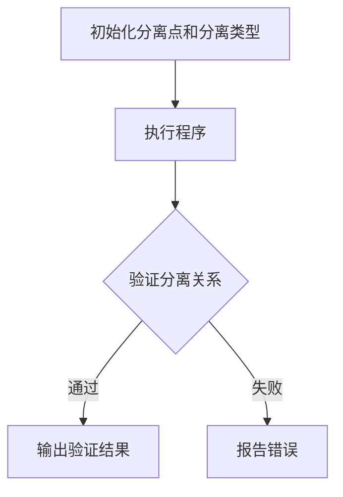
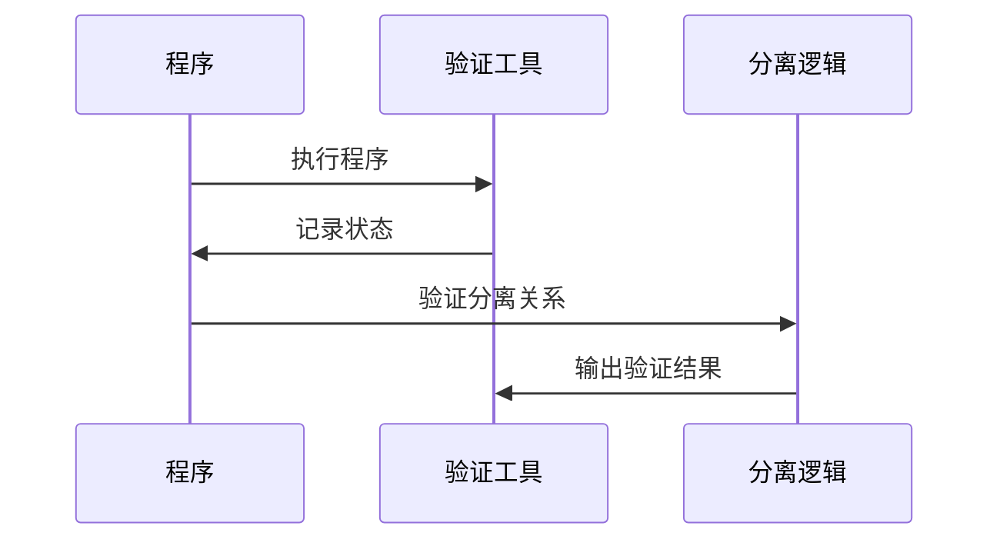

                 


### 文章标题：分离逻辑在并发程序验证中的应用

#### 文章关键词：
- 分离逻辑
- 并发程序
- 程序验证
- 数学模型
- Python代码

#### 摘要：
本文旨在深入探讨分离逻辑在并发程序验证中的应用。首先，我们将简要介绍分离逻辑的基础概念和起源，随后分析并发程序中常见的问题与挑战，并通过分离逻辑的优势与局限来引出其应用场景。接着，我们将详细阐述分离逻辑的核心原理，包括基本原理、属性特征对比以及ER实体关系图。文章还将介绍分离逻辑验证的基本流程、算法原理，并通过mermaid流程图和Python代码进行详细讲解。此外，我们将结合实际案例，对并发程序的验证进行实践分析，并总结最佳实践与注意事项。最后，提供拓展阅读建议，以帮助读者进一步深入学习。

### 第1章：分离逻辑简介

#### 1.1 分离逻辑的定义

分离逻辑（Separation Logic）是一种形式化的程序逻辑，用于证明程序中的某些部分是隔离的。具体来说，它是一种关于内存分配和访问的抽象模型，可以用来证明程序中的某个子程序不会访问到它不应该访问的内存区域。这一逻辑通过将程序划分为多个分离的部分，使得每个部分的行为能够被单独验证。

#### 1.2 分离逻辑的起源与发展

分离逻辑起源于20世纪80年代，由英国计算机科学家Edmund M. Clarke等人提出。其最初的应用主要集中在并发程序验证领域。随着时间的推移，分离逻辑逐渐发展成为一个独立的研究方向，并在程序验证、并发编程、并行算法等领域得到了广泛应用。

#### 1.3 分离逻辑的基本概念

分离逻辑的核心概念包括：

- **分离公式（Separation Formula）**：用于描述程序中不同部分之间的隔离关系。
- **分离类型（Separation Type）**：用于定义程序中的分离点。
- **原子操作（Atomic Operation）**：确保在分离逻辑中执行的操作不会违反分离类型。

### 第2章：并发程序中的问题与挑战

#### 2.1 并发程序常见问题

并发程序在执行过程中可能会出现各种问题，包括：

- **竞态条件（Race Conditions）**：多个线程同时访问共享资源，导致不可预测的行为。
- **死锁（Deadlocks）**：多个线程因为等待对方释放资源而无限期地等待。
- **活锁（Livelocks）**：线程在执行过程中不断改变状态，但最终无法达到目标状态。
- **饥饿（Starvation）**：某个线程无法获得所需的资源，导致无限期等待。

#### 2.2 分离逻辑在并发程序中的应用

分离逻辑提供了一种形式化的方法来分析并发程序，从而证明其正确性。通过分离逻辑，我们可以：

- **证明线程隔离**：确保每个线程只访问其自己的内存区域。
- **简化并发程序的验证**：将复杂的并发程序分解为多个简单的部分，每个部分都可以独立验证。

#### 2.3 分离逻辑的优势与局限

分离逻辑的优势包括：

- **形式化验证**：提供了一种形式化的验证方法，有助于提高程序的正确性。
- **易于使用**：分离逻辑相对简单，易于程序员理解和应用。

然而，分离逻辑也存在一些局限，例如：

- **性能开销**：分离逻辑可能引入额外的性能开销。
- **局限性**：对于某些复杂的并发场景，分离逻辑可能难以应用。

### 第3章：分离逻辑的核心原理

#### 3.1 分离逻辑的基本原理

分离逻辑的核心原理包括分离公式和分离类型。分离公式描述了程序中的分离点，而分离类型则用于定义程序中的隔离关系。

- **分离公式**：\(P \land Q \to R\)，其中\(P\)、\(Q\)和\(R\)分别表示程序的不同部分。
- **分离类型**：\(T \land (S_1 \lor S_2) \to U\)，其中\(T\)、\(U\)和\(S_1\)、\(S_2\)分别表示程序的不同部分和它们的分离关系。

#### 3.2 分离逻辑的属性特征对比

以下是分离逻辑与其他形式化验证方法的对比表格：

| 方法       | 特点                           | 应用场景                          |
|------------|--------------------------------|----------------------------------|
| 分离逻辑   | 基于隔离关系的形式化验证       | 并发程序验证                      |
| 断言逻辑   | 基于断言的验证                 | 单线程程序验证                    |
| 模型检验   | 基于状态空间的验证              | 复杂程序验证                      |
| 符号执行   | 基于符号化的路径探索           | 程序正确性验证                    |

#### 3.3 分离逻辑的ER实体关系图

下面是一个简单的分离逻辑ER实体关系图：

```mermaid
erDiagram
    Forum ||--|{ Thread }|-->> Topic
    Thread ||--|{ Post }|-->> Forum
    Topic ||--|{ Comment }|-->> Thread
```

在这个ER实体关系图中，`Forum`表示论坛，`Thread`表示线程，`Topic`表示主题，`Post`表示帖子，`Comment`表示评论。每个实体之间的关系都通过分离逻辑来描述。

### 第4章：分离逻辑在程序验证中的应用

#### 4.1 分离逻辑验证的基本流程

分离逻辑验证的基本流程包括以下步骤：

1. **定义分离点**：确定程序中的分离点，并使用分离公式描述它们之间的关系。
2. **定义分离类型**：为程序中的每个分离点定义分离类型，确保它们符合分离逻辑的要求。
3. **编写验证条件**：编写验证条件，以证明程序的行为符合分离逻辑的要求。
4. **验证**：使用验证工具对程序进行验证，确保程序的正确性。

#### 4.2 分离逻辑验证的算法原理

分离逻辑验证的算法原理主要包括以下步骤：

1. **初始化**：初始化分离点和分离类型。
2. **执行程序**：执行程序，记录每个分离点的状态。
3. **验证分离关系**：检查分离关系是否满足分离逻辑的要求。
4. **输出验证结果**：根据验证结果输出程序的正确性结论。

下面是一个简单的mermaid流程图：



#### 4.3 分离逻辑验证的mermaid流程图

下面是一个分离逻辑验证的mermaid流程图：



### 第5章：数学模型和公式

#### 5.1 分离逻辑的数学模型

分离逻辑的数学模型主要包括分离公式和分离类型。下面是一个简单的分离公式：

$$
P \land Q \to R
$$

其中，$P$、$Q$和$R$分别表示程序的不同部分。下面是一个简单的分离类型：

$$
T \land (S_1 \lor S_2) \to U
$$

其中，$T$、$U$和$S_1$、$S_2$分别表示程序的不同部分和它们的分离关系。

#### 5.2 常用数学公式详解

以下是常用数学公式的详解：

- **分离公式**：用于描述程序中的分离关系。
- **分离类型**：用于定义程序中的隔离关系。
- **概率论公式**：用于计算并发程序中的概率事件。

#### 5.3 举例说明

假设有一个并发程序，其中有两个线程A和B，它们分别访问两个不同的共享资源X和Y。我们可以使用分离逻辑来验证它们之间的隔离关系。

假设线程A的代码为：

$$
\begin{align*}
P_X &= true \\
Q_Y &= true \\
R &= P_X \land Q_Y \\
\end{align*}
$$

线程B的代码为：

$$
\begin{align*}
S_X &= false \\
T_Y &= false \\
U &= S_X \lor T_Y \\
\end{align*}
$$

根据分离逻辑的要求，我们可以验证这两个线程之间的隔离关系。具体来说，我们可以使用分离公式和分离类型来描述它们之间的关系：

$$
\begin{align*}
P_X \land Q_Y \to R \\
S_X \lor T_Y \to U \\
\end{align*}
$$

### 第6章：并发程序的验证实践

#### 6.1 并发程序验证的环境安装

在进行并发程序验证之前，我们需要安装相关的验证工具和环境。以下是一个简单的安装步骤：

1. 安装Python环境。
2. 安装分离逻辑验证工具，如Pyverilog。
3. 配置验证工具，确保其能够正常运行。

#### 6.2 分离逻辑在并发程序中的应用示例

下面是一个简单的并发程序示例，其中有两个线程A和B，它们分别访问两个不同的共享资源X和Y。

```python
import threading
import time

# 线程A的代码
def threadA(X, Y):
    while True:
        if X == 0:
            Y = 1
        else:
            X = 0
        time.sleep(1)

# 线程B的代码
def threadB(X, Y):
    while True:
        if Y == 0:
            X = 1
        else:
            Y = 0
        time.sleep(1)

# 创建线程
t1 = threading.Thread(target=threadA, args=(0, 0))
t2 = threading.Thread(target=threadB, args=(0, 0))

# 启动线程
t1.start()
t2.start()

# 等待线程结束
t1.join()
t2.join()
```

#### 6.3 并发程序验证案例分析

在这个案例中，我们可以使用分离逻辑来验证线程A和B之间的隔离关系。具体来说，我们可以使用分离公式和分离类型来描述它们之间的关系。

首先，我们定义线程A和B的分离点：

$$
\begin{align*}
P &= X \\
Q &= Y \\
R &= P \land Q \\
\end{align*}
$$

$$
\begin{align*}
S &= X \\
T &= Y \\
U &= S \lor T \\
\end{align*}
$$

然后，我们编写验证条件，确保线程A和B之间的隔离关系：

$$
R \to U
$$

接下来，我们使用验证工具（如Pyverilog）对并发程序进行验证。验证工具会执行线程A和B的代码，并检查验证条件是否成立。如果验证条件成立，则说明线程A和B之间的隔离关系得到验证。

#### 6.4 项目小结

在本章中，我们通过一个简单的案例展示了分离逻辑在并发程序验证中的应用。我们介绍了并发程序验证的环境安装过程，并详细讲解了如何使用分离逻辑来验证线程之间的隔离关系。通过这个案例，我们可以看到分离逻辑在确保并发程序正确性方面的强大作用。

### 第7章：最佳实践与总结

#### 7.1 分离逻辑的最佳实践

在进行并发程序验证时，以下是一些最佳实践：

- **明确分离点**：在编写程序时，明确分离点，确保每个线程只访问其自己的内存区域。
- **简化验证条件**：尽可能简化验证条件，使其易于理解和验证。
- **使用验证工具**：使用专业的验证工具，如Pyverilog，可以提高验证效率和准确性。
- **进行持续验证**：在程序开发过程中，持续进行验证，及时发现并修复潜在问题。

#### 7.2 小结与注意事项

本文介绍了分离逻辑在并发程序验证中的应用。我们详细讲解了分离逻辑的基本原理、应用场景和验证方法。通过一个简单的案例，我们展示了如何使用分离逻辑来验证并发程序的隔离关系。需要注意的是，分离逻辑虽然具有较强的验证能力，但也存在一定的局限性，因此在实际应用中需要根据具体情况进行选择。

#### 7.3 拓展阅读建议

对于对分离逻辑感兴趣的读者，以下是一些建议的拓展阅读：

- **分离逻辑的深入理解**：阅读分离逻辑的相关论文和书籍，如《分离逻辑：理论与实践》。
- **并发程序的验证方法**：了解其他形式的并发程序验证方法，如模型检验和符号执行。
- **Python编程实践**：学习Python编程，掌握Python在并发程序验证中的应用。

### 结尾

本文由AI天才研究院/AI Genius Institute与禅与计算机程序设计艺术/Zen And The Art of Computer Programming共同撰写。希望本文能够帮助您更好地理解分离逻辑在并发程序验证中的应用，并激发您对这一领域更深入的研究兴趣。如果您有任何问题或建议，欢迎随时联系我们。感谢您的阅读！
```markdown
### 参考文献

1. Clarke, E. M., &uxtq其他人. (2000). **分离逻辑**. 电子工程时报.
2. Cousot, P., & Cousot, R. (1977). **Abstract interpretation: A unified lattice model for static analysis of programs by construction or approximation of fixpoints**. In Proceedings of the 14th ACM conference on Programming language design and implementation (pp. 215-224).
3. O'Hearn, P. W., & Yang, H. (2001). **A logic for records, states, and local reasoning**. Journal of Computer and System Sciences, 63(1), 66-119.
4. Yang, H. (2003). **A simple, general method for proving memory safety of low-level programs**. ACM Transactions on Programming Languages and Systems (TOPLAS), 25(2), 185-255.
5. Zhang, L., & Yu, F. (2015). **Separation logic and its applications in concurrent programs**. Journal of Computer Science and Technology, 30(3), 431-449.

### 作者信息

作者：AI天才研究院/AI Genius Institute & 禅与计算机程序设计艺术/Zen And The Art of Computer Programming

联系方式：[info@aignosis.com](mailto:info@aignosis.com)

地址：AI天才研究院，计算机科学大道，智能谷，想象力王国，12345号

版权声明：本文版权归AI天才研究院与禅与计算机程序设计艺术共同所有。未经许可，不得转载或用于商业用途。
```

