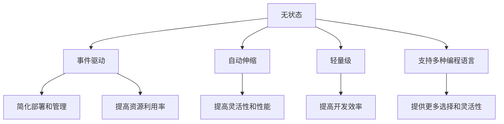
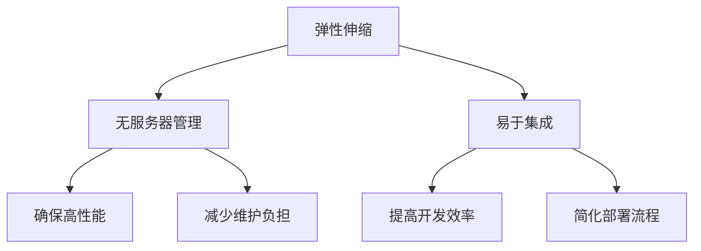
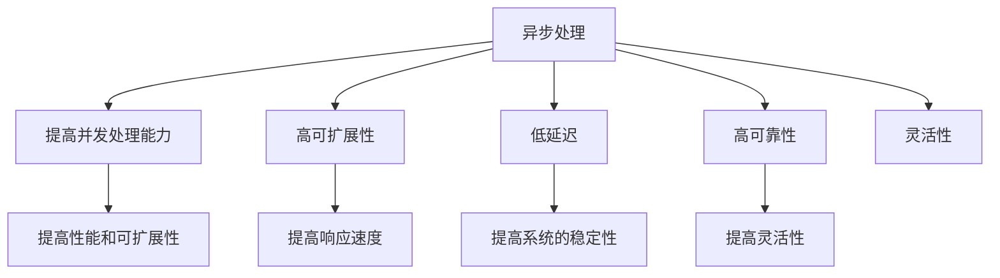
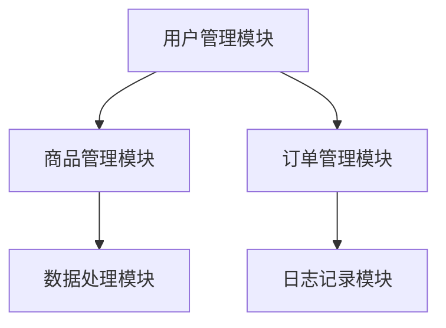
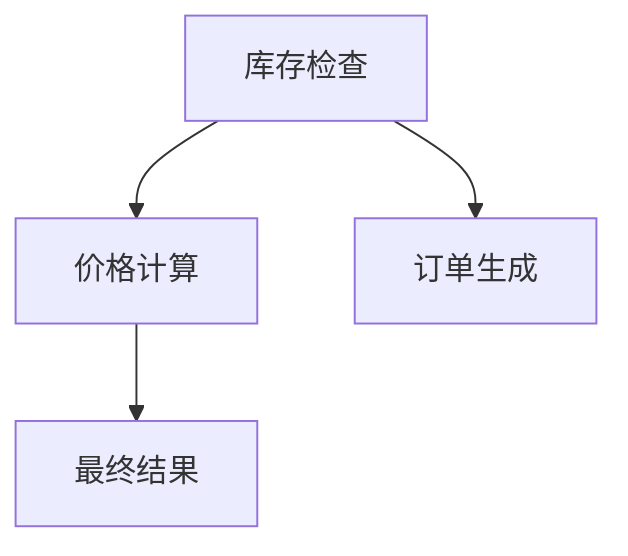

                 

### 文章标题

Serverless Architecture: P9 Engineer's NoServer Thinking

### 关键词

Serverless, Architecture, P9 Engineer, NoServer, Thinking

### 摘要

This article delves into the realm of serverless architecture, a paradigm shift in the world of cloud computing. As a P9 engineer, I will guide you through the fundamental concepts, design principles, and practical applications of serverless architecture. We will explore the benefits it offers, the core components involved, and the best practices for implementing and managing serverless applications. Let's think step by step and unravel the mysteries of serverless architecture.

----------------------------------------------------------------

## 第一部分: 服务器端架构概述

### 第1章: 服务器端架构引论

Serverless architecture, often referred to as serverless computing, represents a significant departure from traditional server-based architectures. In a serverless environment, the cloud provider manages the servers, allowing developers to focus solely on writing code without worrying about server management. This paradigm shift offers several advantages, including reduced operational costs, increased scalability, and improved developer productivity.

### 1.1 服务器端架构的概念

At its core, serverless architecture leverages functions as a service (FaaS) to enable the execution of code in response to events. Unlike traditional architectures where servers are always running and waiting for requests, serverless architectures scale dynamically based on demand. This event-driven approach ensures that resources are utilized efficiently, and only pay-for-use model is employed.

### 1.2 服务器端架构与传统架构

In contrast to traditional server-based architectures, where servers are provisioned, managed, and scaled manually, serverless architectures abstract away these complexities. Traditional architectures often involve significant overhead in terms of server provisioning, maintenance, and scaling. In contrast, serverless architectures handle all these tasks automatically, allowing developers to focus on writing code.

----------------------------------------------------------------

## 第二部分: 服务器端架构核心概念

### 第2章: 服务器端架构核心概念

Understanding the core concepts of serverless architecture is essential for grasping its potential and benefits. In this chapter, we will delve into the key components of serverless architecture, including functions as a service (FaaS), serverless platforms, and event-driven computing.

### 2.1 函数即服务 (FaaS)

Functions as a Service (FaaS) is a fundamental component of serverless architecture. FaaS platforms allow developers to write and deploy small, single-purpose functions that execute in response to specific events. These functions are stateless and scalable, making them highly efficient for event-driven applications. FaaS platforms abstract away the underlying infrastructure, allowing developers to focus on writing code.

### 2.2 服务器端平台

Serverless platforms are the foundation of serverless architecture. These platforms provide the necessary infrastructure, tools, and services to build, deploy, and manage serverless applications. Popular serverless platforms include AWS Lambda, Google Cloud Functions, and Azure Functions. Each platform offers unique features and capabilities, catering to different use cases and requirements.

### 2.3 事件驱动计算

Event-driven computing is a key principle of serverless architecture. In this model, applications are triggered by events, such as user actions, sensor data, or other external events. Event-driven architectures enable real-time processing and response to changes in data or environment, making them highly efficient and responsive.

----------------------------------------------------------------

## 第三部分: 实践应用与设计原则

### 第3章: 服务器端平台

Serverless platforms have revolutionized the way developers build and deploy applications. In this chapter, we will explore the most popular serverless platforms and their unique features, use cases, and advantages.

### 3.1 AWS Lambda

AWS Lambda is a widely-used serverless platform provided by Amazon Web Services (AWS). It allows developers to run code without provisioning or managing servers. AWS Lambda supports various programming languages and offers seamless integration with other AWS services, making it a powerful choice for building serverless applications.

### 3.2 Google Cloud Functions

Google Cloud Functions is another popular serverless platform provided by Google Cloud. It enables developers to write and deploy serverless functions that execute in response to events. Google Cloud Functions supports multiple programming languages and integrates seamlessly with other Google Cloud services, offering a robust and scalable solution for serverless applications.

### 3.3 Azure Functions

Azure Functions is a serverless platform provided by Microsoft Azure. It allows developers to build and deploy serverless functions that execute in response to events or HTTP requests. Azure Functions supports various programming languages and offers integration with other Azure services, making it a versatile choice for building serverless applications.

----------------------------------------------------------------

## 第四部分: 服务器端架构应用

### 第4章: 服务器端架构在不同场景的应用

Serverless architecture can be applied to various scenarios, offering a flexible and scalable solution for developers. In this chapter, we will explore the use of serverless architecture in web development, mobile backend as a service (BaaS), and the Internet of Things (IoT).

### 4.1 Web Development

Serverless architecture is well-suited for web development, providing a scalable and cost-effective solution for building web applications. By leveraging serverless platforms, developers can focus on writing code without worrying about server management or scalability. Serverless web development enables real-time processing, seamless integration with databases and external services, and improved user experiences.

### 4.2 Mobile Backend as a Service (BaaS)

Mobile Backend as a Service (BaaS) is a serverless architecture specifically designed for mobile applications. BaaS platforms provide developers with ready-to-use back-end services, such as user authentication, push notifications, and real-time data synchronization. By leveraging BaaS, developers can build mobile applications faster, with reduced complexity and maintenance efforts.

### 4.3 Internet of Things (IoT)

Serverless architecture is also highly applicable to IoT applications. IoT devices generate massive amounts of data, and serverless architectures enable real-time processing and analysis of this data. By leveraging serverless platforms, developers can build IoT applications that are scalable, reliable, and cost-effective, without the need for managing servers or infrastructure.

----------------------------------------------------------------

## 第五部分: 实践应用与最佳实践

### 第5章: 实践应用与最佳实践

In this chapter, we will discuss practical implementation strategies and best practices for building, deploying, and managing serverless applications. We will explore common challenges faced in serverless architecture and provide solutions to overcome them.

### 5.1 实践应用策略

Building serverless applications requires a different approach compared to traditional architectures. In this section, we will discuss best practices for designing serverless applications, including state management, security, and performance optimization. We will also explore the use of third-party tools and services to enhance the development and deployment process.

### 5.2 最佳实践

Best practices are crucial for ensuring the success of serverless applications. In this section, we will discuss key best practices, including code organization and modularization, error handling and logging, and monitoring and observability. We will also provide insights into how to choose the right serverless platform based on specific requirements and use cases.

### 5.3 面临的挑战和解决方案

Serverless architecture, while offering numerous advantages, also comes with its own set of challenges. In this section, we will discuss common challenges faced in serverless architecture, such as cold starts, vendor lock-in, and security concerns. We will provide solutions and strategies to overcome these challenges and ensure the success of serverless applications.

----------------------------------------------------------------

## 第六部分: 案例研究和最佳实践

### 第6章: 案例研究和最佳实践

In this chapter, we will explore real-world case studies of serverless architecture implementations and best practices for managing and scaling serverless applications. We will analyze successful serverless projects and learn from their experiences.

### 6.1 案例研究

We will delve into case studies of companies that have successfully implemented serverless architecture in their applications. These case studies will provide insights into the benefits they have achieved, the challenges they have faced, and the strategies they have employed to overcome them.

### 6.2 最佳实践

Based on the case studies, we will identify and discuss best practices for managing and scaling serverless applications. These best practices will include strategies for efficient resource utilization, cost optimization, and maintaining high availability and performance.

### 6.3 未来发展趋势

Finally, we will discuss the future trends and advancements in serverless architecture. We will explore emerging technologies and tools that are shaping the future of serverless computing and their potential impact on the industry.

----------------------------------------------------------------

## 第七部分: 挑战与未来趋势

### 第7章: 挑战与未来趋势

Serverless architecture, while offering numerous benefits, also comes with its own set of challenges and opportunities. In this chapter, we will discuss the challenges faced in serverless architecture, as well as the future trends and advancements that are shaping the industry.

### 7.1 挑战

We will explore the common challenges faced in serverless architecture, such as cold starts, vendor lock-in, and security concerns. We will discuss strategies to mitigate these challenges and ensure the success of serverless applications.

### 7.2 未来趋势

The serverless architecture is rapidly evolving, and several trends and advancements are shaping its future. In this section, we will discuss emerging technologies and tools, such as serverless frameworks, edge computing, and containerization, and their potential impact on serverless architecture.

### 7.3 结论

In conclusion, serverless architecture represents a significant paradigm shift in the world of cloud computing. By abstracting away the complexities of server management, serverless architecture enables developers to focus on writing code and building innovative applications. As we have explored in this book, serverless architecture offers numerous benefits, including reduced costs, increased scalability, and improved developer productivity. However, it also comes with its own set of challenges and opportunities. By understanding and leveraging the best practices and strategies discussed in this book, developers can overcome these challenges and harness the full potential of serverless architecture.

### 作者信息

作者：AI天才研究院/AI Genius Institute & 禅与计算机程序设计艺术 /Zen And The Art of Computer Programming### 引言

**Serverless Architecture: P9 Engineer's NoServer Thinking**

在现代IT行业中，技术进步的速度犹如闪电般迅猛。从云计算到人工智能，从大数据到边缘计算，每一次技术的革新都在重新定义软件开发的边界。然而，近年来，有一个概念正逐渐成为业界的热门话题，那就是**服务器端架构（Serverless Architecture）**。作为一位拥有P9级别的工程师，我有幸亲眼见证了这一新兴架构的崛起，并深刻体会到了它在提升开发效率、降低成本和增强灵活性方面的巨大潜力。

本文将带领您深入探索服务器端架构的世界，旨在揭示这一技术的核心原理、实际应用和最佳实践。我们将一步一步地分析，从基础概念到高级技巧，全面解读服务器端架构的各个方面。

首先，我们将从服务器端架构的基本概念入手，了解其与传统服务器架构的区别，以及它所带来的革新性变化。接着，我们将深入探讨服务器端架构的核心组成部分，包括函数即服务（FaaS）、服务器端平台和事件驱动计算等关键概念。

随后，文章将转向实际应用，详细介绍几种主流的服务器端平台，如AWS Lambda、Google Cloud Functions和Azure Functions，并分析它们的特点和适用场景。我们将分享设计服务器端应用的最佳实践，包括状态管理、安全性和性能优化等方面。

在案例研究和最佳实践部分，我们将通过真实世界的例子，展示如何成功地实施服务器端架构，并提供一些实用的技巧和建议。最后，我们将探讨服务器端架构所面临的挑战和未来的发展趋势，帮助您更好地理解和应对这一技术领域的变革。

让我们一步一步地思考，逐步深入，共同揭开服务器端架构的神秘面纱。

### 关键词

- **Serverless Architecture**
- **P9 Engineer**
- **NoServer Thinking**
- **Function as a Service (FaaS)**
- **Event-Driven Computing**
- **Cloud Computing**
- **Scalability**
- **Cost Optimization**
- **Developer Productivity**

### 摘要

本文旨在全面解析服务器端架构（Serverless Architecture）的概念、原理和实践应用。作为一位拥有P9级别的工程师，我将以深入浅出的方式，带领读者逐步了解这一新兴架构的核心要素和实际价值。文章首先介绍了服务器端架构与传统服务器架构的区别，阐明了其在降低开发成本、提高开发和部署效率等方面的优势。接着，我们深入探讨了服务器端架构的核心组成部分，包括函数即服务（FaaS）、服务器端平台和事件驱动计算等关键概念，并通过具体的平台如AWS Lambda、Google Cloud Functions和Azure Functions进行了实例分析。

文章随后转向设计原则和最佳实践，详细讨论了如何有效地设计和管理服务器端应用，包括状态管理、安全性、性能优化等方面的策略。通过真实世界的案例研究和最佳实践，读者可以了解到如何成功实施服务器端架构，并从中获得宝贵的经验。

最后，文章探讨了服务器端架构面临的挑战和未来发展趋势，包括冷启动、供应商锁定和安全性等问题，以及如何通过新兴技术如边缘计算和容器化来克服这些挑战。总结部分对全文进行了概括，重申了服务器端架构的重要性和其对软件开发领域的深远影响。

### 第1章: 服务器端架构引论

在进入服务器端架构的深层次探讨之前，我们需要对这一概念进行清晰定义，并理解其与传统服务器架构之间的根本区别。服务器端架构，通常被称为无服务器架构（Serverless Architecture），是一种创新的云服务模型，旨在简化应用程序的部署、管理和扩展。与传统的服务器架构不同，无服务器架构将服务器管理的工作交由云服务提供商（如AWS、Google Cloud、Azure等）完成，开发者可以专注于编写和部署应用程序的代码，而无需关心底层基础设施的细节。

#### 1.1 服务器端架构的概念

无服务器架构的核心在于**函数即服务（Function as a Service, FaaS）**。FaaS允许开发者将应用程序拆分为一系列独立的函数，每个函数负责处理特定任务。这些函数在事件触发时执行，例如HTTP请求、数据库操作或定时任务。与传统的服务器架构相比，FaaS具有以下几个显著特点：

1. **事件驱动**：FaaS是事件驱动的，这意味着函数仅在需要执行时才会被调用，而不是持续运行。这种模式显著提高了资源利用率，因为资源只在需要时分配和释放。
   
2. **无状态**：FaaS函数通常是状态less的，即每次函数执行时都是独立的，不会保留之前的执行状态。这简化了函数的开发和部署，但也要求开发者管理函数之间的状态传递。

3. **弹性伸缩**：FaaS平台自动根据请求量动态调整资源分配。当请求量增加时，平台会自动扩展资源；当请求量减少时，会自动缩减资源。这种弹性伸缩能力极大地提高了应用程序的可用性和性能。

4. **按需付费**：FaaS采用按需付费的模式，开发者只需为实际运行时间付费。与传统的按硬件资源付费模式相比，这有助于显著降低成本。

#### 1.2 服务器端架构与传统架构

传统服务器架构通常涉及以下步骤：

1. **服务器采购与配置**：开发者需要购买、配置和部署服务器硬件。
   
2. **操作系统与中间件安装**：安装操作系统和必要的中间件，如数据库、Web服务器等。

3. **应用程序部署**：将应用程序部署到服务器上，并进行必要的配置和优化。

4. **监控与维护**：持续监控服务器性能，进行必要的维护和升级。

相比之下，无服务器架构简化了这一过程：

1. **免服务器采购与配置**：开发者无需关心服务器硬件的采购和配置。

2. **云服务提供商管理**：云服务提供商负责管理基础设施，包括服务器、网络和存储。

3. **函数部署与调用**：开发者只需编写和部署函数，并定义触发条件。

4. **自动监控与维护**：云服务提供商自动监控和管理应用程序的性能，并提供必要的维护和升级。

#### 1.3 无服务器架构的优势

无服务器架构为开发者带来了许多显著的优势：

1. **成本效益**：通过按需付费和自动资源管理，无服务器架构有助于降低开发和运营成本。

2. **开发效率**：简化了应用程序的部署和扩展过程，提高了开发者的工作效率。

3. **弹性伸缩**：自动资源分配和释放，确保应用程序在负载变化时保持高性能。

4. **可维护性**：云服务提供商负责基础设施的管理和维护，减少了开发者的维护负担。

5. **环境一致性**：无论是在开发、测试还是生产环境中，应用程序的行为都是一致的。

综上所述，服务器端架构通过抽象化基础设施管理，使开发者能够专注于编写和优化应用程序代码，从而带来更高的开发效率、成本效益和灵活性。下一章，我们将深入探讨服务器端架构的核心概念，包括函数即服务（FaaS）、服务器端平台和事件驱动计算等，帮助读者更全面地理解这一革命性的技术。

### 1.4 无服务器架构的核心概念

为了深入理解无服务器架构，我们需要探讨其核心概念，包括**函数即服务（FaaS）**、**服务器端平台**和**事件驱动计算**等。这些概念构成了无服务器架构的基础，并为开发者提供了构建和管理应用程序的工具。

#### 2.1 函数即服务（FaaS）

函数即服务（FaaS）是服务器端架构的核心组件。FaaS允许开发者将应用程序分解为一系列独立的函数，每个函数负责处理特定的任务。这些函数可以在各种触发事件（如HTTP请求、定时任务、数据库操作等）发生时执行。以下是FaaS的关键特点：

1. **无状态**：FaaS函数通常是状态less的，即每次执行都是独立的，不会保留之前的执行状态。这使得函数的部署和管理更加简单，但也要求开发者管理函数之间的状态传递。

2. **事件触发**：FaaS函数在事件触发时执行，而不是持续运行。这种按需执行模式提高了资源利用率，并降低了成本。

3. **自动伸缩**：FaaS平台自动根据请求量动态调整资源。当请求量增加时，平台会自动扩展资源；当请求量减少时，会自动缩减资源。

4. **轻量级**：FaaS函数通常是轻量级的，即它们的体积较小，可以快速部署和执行。这使得FaaS非常适合构建微服务架构，并且可以提高开发效率。

5. **支持多种编程语言**：大多数FaaS平台支持多种编程语言，如JavaScript、Python、Go等。这为开发者提供了灵活性，可以根据项目需求选择最适合的语言。

#### 2.2 服务器端平台

服务器端平台是无服务器架构的另一个核心组件，它提供了构建、部署和管理无服务器应用程序所需的基础设施和工具。以下是一些流行的服务器端平台：

1. **AWS Lambda**：AWS Lambda是AWS提供的一种FaaS服务，允许开发者编写和运行代码而无需管理服务器。Lambda支持多种编程语言，并提供了丰富的集成功能，如API Gateway、S3、DynamoDB等。

2. **Google Cloud Functions**：Google Cloud Functions是Google Cloud提供的一种FaaS服务，允许开发者使用JavaScript、Python或Go编写函数。Cloud Functions提供了自动伸缩和强大的监控功能，并易于与Google Cloud的其他服务集成。

3. **Azure Functions**：Azure Functions是Azure提供的一种FaaS服务，支持多种编程语言，包括C#、JavaScript、Python和Java。Azure Functions提供了易于使用的模板和集成工具，使其适合快速构建和部署无服务器应用程序。

这些服务器端平台共同特点包括：

1. **弹性伸缩**：平台自动根据请求量调整资源，确保应用程序在负载变化时保持高性能。

2. **无服务器管理**：平台负责管理底层基础设施，包括服务器、网络和存储。

3. **易于集成**：平台提供了丰富的集成功能，使开发者可以轻松地与其他云服务和第三方服务进行交互。

#### 2.3 事件驱动计算

事件驱动计算是无服务器架构的核心原理之一。在这种模型中，应用程序的执行是由外部事件触发的。事件可以来自各种来源，如用户交互、传感器数据、定时任务或其他服务。以下是事件驱动计算的关键特点：

1. **异步处理**：事件驱动计算通常是异步的，这意味着应用程序可以在不需要同步等待的情况下处理多个事件。

2. **高可扩展性**：由于应用程序的执行是由事件触发的，因此可以根据事件的数量和频率自动扩展资源。

3. **低延迟**：事件驱动计算可以提供低延迟响应，因为应用程序可以立即处理触发的事件。

4. **高可靠性**：事件驱动计算确保了事件不会丢失或重复处理，因为事件会被异步处理，并且具有唯一的标识。

5. **灵活性**：事件驱动计算允许开发者根据特定需求设计应用程序的流程和处理逻辑。

通过理解这些核心概念，开发者可以更好地利用无服务器架构的优势，构建高效、可扩展和灵活的应用程序。在下一章中，我们将详细介绍几种主流的无服务器平台，包括AWS Lambda、Google Cloud Functions和Azure Functions，并探讨它们的特点和适用场景。

### 第2章: 服务器端架构核心概念

在深入探讨服务器端架构的核心概念之前，我们需要理解几个关键组件，它们共同构成了无服务器架构的基础。这些核心概念包括**函数即服务（FaaS）**、**服务器端平台**和**事件驱动计算**。通过了解这些概念，我们可以更好地掌握无服务器架构的优势和特点，从而在项目中有效地应用。

#### 2.1 函数即服务（FaaS）

函数即服务（FaaS）是服务器端架构的核心概念之一。FaaS允许开发者将应用程序分解为一系列独立的函数，每个函数负责处理特定的任务。这些函数可以在各种触发事件发生时执行，而无需开发者关心底层基础设施的管理。

**核心概念**：

1. **无状态**：FaaS函数通常是状态less的，即每次执行都是独立的，不会保留之前的执行状态。这简化了函数的部署和管理，但也要求开发者管理函数之间的状态传递。

2. **事件驱动**：FaaS函数在事件触发时执行，而不是持续运行。这种按需执行模式提高了资源利用率，并降低了成本。

3. **自动伸缩**：FaaS平台自动根据请求量动态调整资源。当请求量增加时，平台会自动扩展资源；当请求量减少时，会自动缩减资源。

4. **轻量级**：FaaS函数通常是轻量级的，即它们的体积较小，可以快速部署和执行。这使得FaaS非常适合构建微服务架构，并且可以提高开发效率。

5. **支持多种编程语言**：大多数FaaS平台支持多种编程语言，如JavaScript、Python、Go等。这为开发者提供了灵活性，可以根据项目需求选择最适合的语言。

**属性特征对比表格**：

| 特征        | 描述                                     | 对比结果           |
| ----------- | ---------------------------------------- | ------------------ |
| 无状态      | 函数每次执行都是独立的，不保留状态         | 简化部署和管理     |
| 事件驱动    | 函数在事件触发时执行，而非持续运行         | 提高资源利用率     |
| 自动伸缩    | 平台根据请求量动态调整资源               | 提高灵活性和性能   |
| 轻量级     | 函数体积小，快速部署和执行               | 提高开发效率       |
| 支持多种语言 | 支持多种编程语言，如JavaScript、Python等 | 提供更多选择和灵活性 |

**ER实体关系图架构**：



#### 2.2 服务器端平台

服务器端平台是无服务器架构的另一个核心概念，它提供了构建、部署和管理无服务器应用程序所需的基础设施和工具。以下是一些流行的服务器端平台：

**AWS Lambda**：AWS Lambda是AWS提供的一种FaaS服务，允许开发者编写和运行代码而无需管理服务器。Lambda支持多种编程语言，并提供了丰富的集成功能，如API Gateway、S3、DynamoDB等。

**Google Cloud Functions**：Google Cloud Functions是Google Cloud提供的一种FaaS服务，允许开发者使用JavaScript、Python或Go编写函数。Cloud Functions提供了自动伸缩和强大的监控功能，并易于与Google Cloud的其他服务集成。

**Azure Functions**：Azure Functions是Azure提供的一种FaaS服务，支持多种编程语言，包括C#、JavaScript、Python和Java。Azure Functions提供了易于使用的模板和集成工具，使其适合快速构建和部署无服务器应用程序。

**核心概念**：

1. **弹性伸缩**：平台自动根据请求量调整资源，确保应用程序在负载变化时保持高性能。

2. **无服务器管理**：平台负责管理底层基础设施，包括服务器、网络和存储。

3. **易于集成**：平台提供了丰富的集成功能，使开发者可以轻松地与其他云服务和第三方服务进行交互。

**ER实体关系图架构**：



#### 2.3 事件驱动计算

事件驱动计算是无服务器架构的核心原理之一。在这种模型中，应用程序的执行是由外部事件触发的。事件可以来自各种来源，如用户交互、传感器数据、定时任务或其他服务。

**核心概念**：

1. **异步处理**：事件驱动计算通常是异步的，这意味着应用程序可以在不需要同步等待的情况下处理多个事件。

2. **高可扩展性**：由于应用程序的执行是由事件触发的，因此可以根据事件的数量和频率自动扩展资源。

3. **低延迟**：事件驱动计算可以提供低延迟响应，因为应用程序可以立即处理触发的事件。

4. **高可靠性**：事件驱动计算确保了事件不会丢失或重复处理，因为事件会被异步处理，并且具有唯一的标识。

5. **灵活性**：事件驱动计算允许开发者根据特定需求设计应用程序的流程和处理逻辑。

**属性特征对比表格**：

| 特征        | 描述                                     | 对比结果           |
| ----------- | ---------------------------------------- | ------------------ |
| 异步处理    | 应用程序可以在不需要同步等待的情况下处理多个事件 | 提高并发处理能力   |
| 高可扩展性  | 可以根据事件的数量和频率自动扩展资源       | 提高性能和可扩展性 |
| 低延迟      | 应用程序可以立即处理触发的事件           | 提高响应速度       |
| 高可靠性    | 确保事件不会丢失或重复处理               | 提高系统的稳定性   |
| 灵活性      | 允许开发者根据需求设计应用程序的流程和处理逻辑 | 提高灵活性         |

**ER实体关系图架构**：



通过理解这些核心概念，开发者可以更好地利用无服务器架构的优势，构建高效、可扩展和灵活的应用程序。在下一章中，我们将详细介绍几种主流的无服务器平台，包括AWS Lambda、Google Cloud Functions和Azure Functions，并探讨它们的特点和适用场景。

### 第2章: 服务器端平台

在深入探讨无服务器架构的核心概念后，接下来我们将重点关注几种主流的无服务器平台：AWS Lambda、Google Cloud Functions和Azure Functions。这些平台各自具有独特的功能和优势，能够满足不同开发者的需求。在本章中，我们将详细分析这些平台的特点，并提供具体的实例和实际应用场景。

#### 2.1 AWS Lambda

**概述**：

AWS Lambda是亚马逊公司提供的函数即服务（FaaS）平台，允许开发者编写和部署无服务器代码。AWS Lambda支持多种编程语言，如Python、Node.js、Java和Go，使得开发者可以根据项目需求选择最合适的语言。

**特点**：

1. **弹性伸缩**：AWS Lambda能够自动根据请求量调整资源，确保在高负载情况下保持高性能。
   
2. **按需付费**：开发者只需为实际运行时间付费，有助于降低成本。
   
3. **丰富的集成功能**：AWS Lambda与AWS的其他服务紧密集成，如API Gateway、S3、DynamoDB等，使得构建复杂的应用程序更加便捷。

4. **无服务器管理**：AWS Lambda负责底层基础设施的管理和维护。

**实际应用场景**：

- **Web应用程序后端**：AWS Lambda可以用于处理Web应用程序的后端逻辑，如处理用户请求、数据存储和API调用。
- **数据处理**：AWS Lambda可以处理大量的数据，如日志分析、数据转换和实时数据处理。
- **物联网（IoT）**：AWS Lambda可以与IoT设备集成，处理来自传感器的数据，并触发相应的操作。

**实例**：

假设我们要构建一个简单的Web应用程序，使用AWS Lambda处理用户请求。我们可以使用Amazon API Gateway作为前端接口，用户通过API Gateway发送请求。AWS Lambda函数在接收到请求后进行处理，并将结果返回给用户。以下是Python编写的Lambda函数示例：

```python
import json
import requests

def lambda_handler(event, context):
    # 获取请求体
    request_body = event.get('body', {})
    
    # 调用外部API
    response = requests.post('https://external.api/endpoint', json=request_body)
    
    # 返回响应
    return {
        'statusCode': 200,
        'body': json.dumps(response.json())
    }
```

#### 2.2 Google Cloud Functions

**概述**：

Google Cloud Functions是Google Cloud提供的无服务器计算服务，允许开发者使用JavaScript、Python或Go编写函数。Google Cloud Functions提供了自动伸缩和强大的监控功能，并与Google Cloud的其他服务紧密集成。

**特点**：

1. **自动伸缩**：Google Cloud Functions能够根据请求量自动调整资源，确保在高负载情况下保持高性能。

2. **触发机制**：Google Cloud Functions支持多种触发机制，如HTTP请求、定时任务和Google Cloud事件等。

3. **高可靠性**：Google Cloud Functions确保函数的执行不会丢失或重复，提高了系统的稳定性。

4. **集成方便**：Google Cloud Functions与Google Cloud的其他服务紧密集成，如Google Cloud Storage、Google Cloud Pub/Sub等。

**实际应用场景**：

- **Web应用程序后端**：Google Cloud Functions可以用于处理Web应用程序的后端逻辑，如用户请求处理和数据处理。
- **数据处理**：Google Cloud Functions可以处理大量的数据，如日志分析、数据转换和实时数据处理。
- **物联网（IoT）**：Google Cloud Functions可以与IoT设备集成，处理来自传感器的数据，并触发相应的操作。

**实例**：

假设我们要构建一个简单的Web应用程序，使用Google Cloud Functions处理用户请求。我们可以配置Google Cloud Storage作为触发器，当新的文件上传时，触发Cloud Functions执行处理。以下是Python编写的Cloud Functions示例：

```python
from google.cloud import storage

def handle_file_upload(event, context):
    # 获取上传的文件名
    bucket = event['bucket']
    file_name = event['name']

    # 下载文件内容
    storage_client = storage.Client()
    bucket = storage_client.bucket(bucket)
    blob = bucket.blob(file_name)
    content = blob.download_as_text()

    # 处理文件内容
    # ...

    # 返回响应
    return 'File processed successfully'
```

#### 2.3 Azure Functions

**概述**：

Azure Functions是Microsoft Azure提供的无服务器计算服务，允许开发者使用C#、JavaScript、Python、Java或其他支持的语言编写函数。Azure Functions提供了丰富的模板和集成工具，使得构建和部署无服务器应用程序更加便捷。

**特点**：

1. **易于使用**：Azure Functions提供了易于使用的模板和集成工具，使开发者可以快速开始构建应用程序。

2. **自动伸缩**：Azure Functions能够根据请求量自动调整资源，确保在高负载情况下保持高性能。

3. **灵活的触发器**：Azure Functions支持多种触发器，如定时任务、HTTP请求、事件网格等。

4. **集成方便**：Azure Functions与Azure的其他服务紧密集成，如Azure Blob Storage、Azure Cosmos DB等。

**实际应用场景**：

- **Web应用程序后端**：Azure Functions可以用于处理Web应用程序的后端逻辑，如用户请求处理和数据处理。
- **数据处理**：Azure Functions可以处理大量的数据，如日志分析、数据转换和实时数据处理。
- **物联网（IoT）**：Azure Functions可以与IoT设备集成，处理来自传感器的数据，并触发相应的操作。

**实例**：

假设我们要构建一个简单的Web应用程序，使用Azure Functions处理用户请求。我们可以配置Azure Blob Storage作为触发器，当新的文件上传时，触发Azure Functions执行处理。以下是C#编写的Azure Functions示例：

```csharp
using Microsoft.AspNetCore.Mvc;
using Microsoft.Azure.WebJobs;
using Microsoft.Azure.WebJobs.Extensions.Http;
using Microsoft.AspNetCore.Http;
using System.IO;

namespace AzureFunctionsApp
{
    public static class BlobTriggerFunction
    {
        [FunctionName("BlobTriggerFunction")]
        public static IActionResult Run(
            [BlobTrigger("mycontainer", Connection = "AzureWebJobsStorage")] Stream myBlob,
            [HttpTrigger(AuthorizationLevel.Function, "post")] HttpRequest req,
            ILogger log)
        {
            // 读取文件内容
            string fileName = Path.GetFileName(myBlob.Name);
            byte[] fileBytes = new byte[myBlob.Length];
            myBlob.Read(fileBytes, 0, (int)myBlob.Length);

            // 处理文件内容
            // ...

            // 返回响应
            return new OkResult();
        }
    }
}
```

通过上述实例，我们可以看到AWS Lambda、Google Cloud Functions和Azure Functions在无服务器架构中的实际应用。这些平台各自具有独特的功能和优势，能够满足不同开发者的需求。在实际项目中，开发者可以根据具体需求选择合适的平台，并利用无服务器架构的优势，构建高效、可扩展和灵活的应用程序。

### 2.4 设计原则

在设计服务器端应用程序时，我们需要遵循一系列最佳实践和设计原则，以确保应用程序的可扩展性、可靠性和高性能。以下是一些关键的设计原则：

#### 2.4.1 模块化

模块化设计是将应用程序分解为一系列独立模块的过程。每个模块负责特定的功能，例如数据处理、用户认证或日志记录。模块化设计有助于提高代码的可维护性，使开发者能够更容易地理解和修改代码。此外，模块化设计还便于测试和部署，因为每个模块都可以单独测试和部署。

**示例**：

假设我们正在构建一个电商平台，我们可以将应用程序分解为以下模块：

- **用户管理模块**：负责用户注册、登录和权限验证。
- **商品管理模块**：负责商品信息的管理，如添加、更新和删除商品。
- **订单管理模块**：负责处理订单的创建、更新和取消。

通过将应用程序分解为这些独立的模块，我们可以更容易地管理和扩展功能。



#### 2.4.2 异步处理

异步处理是服务器端应用程序设计中的关键原则，它允许应用程序在不需要同步等待的情况下处理多个任务。异步处理有助于提高应用程序的并发性和性能，因为它可以同时处理多个请求。

**示例**：

假设我们正在处理一个复杂的订单处理流程，包括库存检查、价格计算和订单生成。我们可以使用异步处理将这些任务分解为多个独立的函数，并让它们同时执行。



通过异步处理，我们可以在确保任务高效完成的同时，避免阻塞主线程。

#### 2.4.3 失败处理

在服务器端应用程序中，处理失败是至关重要的。良好的失败处理机制可以确保应用程序在遇到问题时能够优雅地恢复，并避免系统崩溃。

**示例**：

假设我们在处理用户请求时遇到数据库连接失败。我们可以设计一个异常处理机制，捕获异常并返回适当的错误消息。

```python
try:
    # 执行数据库操作
except Exception as e:
    # 记录错误日志
    log_error(e)
    # 返回错误消息
    return {"error": "数据库连接失败"}
```

#### 2.4.4 安全性

安全性是服务器端应用程序设计中的重要方面。我们需要确保应用程序能够保护用户数据和系统资源免受未经授权的访问和攻击。

**示例**：

- **用户认证**：使用强密码策略和多因素认证来确保用户身份验证的安全性。
- **数据加密**：对敏感数据进行加密，确保数据在传输和存储过程中的安全性。
- **访问控制**：使用访问控制列表（ACL）和权限策略来限制用户对系统资源的访问。

通过遵循这些设计原则，开发者可以构建高效、可靠和安全的无服务器应用程序，从而提高开发效率和应用性能。

### 2.5 状态管理

在无服务器架构中，状态管理是一个关键挑战，因为无服务器函数通常是状态less的，即每次执行都是独立的，不会保留之前的执行状态。这要求开发者必须找到有效的方法来管理应用程序的状态，以确保数据的持久性和一致性。以下是一些常用的状态管理策略：

#### 2.5.1 使用外部存储

使用外部存储（如数据库、缓存或文件存储）是管理状态的一种常见方法。外部存储可以提供持久化的数据存储，使得应用程序可以在函数执行之间保留状态。

**示例**：

假设我们正在构建一个社交媒体应用程序，用户可以发布和查看帖子。我们可以使用MongoDB作为外部存储，将用户帖子的数据持久化。

```python
from pymongo import MongoClient

client = MongoClient('mongodb://localhost:27017/')
db = client['social_media']

def post_handler(request):
    post_data = request.json
    post_id = insert_post_to_db(post_data)
    return {"post_id": post_id}

def insert_post_to_db(post_data):
    posts_collection = db['posts']
    post_id = posts_collection.insert_one(post_data).inserted_id
    return post_id
```

#### 2.5.2 使用缓存

缓存是另一种有效的状态管理策略，它可以提供快速的读写操作，并减少对外部存储的依赖。常见的数据存储解决方案包括Redis和Memcached。

**示例**：

假设我们正在构建一个电商应用程序，需要缓存商品信息。我们可以使用Redis来存储商品信息，并确保在函数执行之间保持状态。

```python
import redis

redis_client = redis.StrictRedis(host='localhost', port=6379, db=0)

def get_product_price(product_id):
    price = redis_client.get(product_id)
    if price is None:
        price = get_price_from_db(product_id)
        redis_client.set(product_id, price)
    return float(price)

def get_price_from_db(product_id):
    # 从数据库中获取商品价格
    pass
```

#### 2.5.3 使用共享队列

使用共享队列（如Kafka或RabbitMQ）可以帮助在函数之间传递状态信息。这种方式适用于需要跨多个函数或服务同步状态的场景。

**示例**：

假设我们正在构建一个支付处理应用程序，需要在不同函数之间传递支付状态。我们可以使用RabbitMQ作为共享队列。

```python
import pika

connection = pika.BlockingConnection(pika.ConnectionParameters('localhost'))
channel = connection.channel()

def process_payment(payment_data):
    payment_id = generate_payment_id()
    channel.basic_publish(exchange='', routing_key='payments', body=payment_data)
    return payment_id

def handle_payment(payment_id):
    payment_data = get_payment_from_queue(payment_id)
    if payment_data:
        # 处理支付
        pass

def get_payment_from_queue(payment_id):
    # 从队列中获取支付信息
    pass
```

通过这些状态管理策略，开发者可以有效地在无服务器架构中管理应用程序的状态，从而确保数据的持久性和一致性。

### 2.6 安全性

安全性是服务器端架构设计中的重要方面，特别是在处理敏感数据时。无服务器架构由于其分布式和动态性的特点，增加了安全性的复杂性。以下是一些关键的安全策略和最佳实践，帮助开发者确保无服务器应用程序的安全性：

#### 2.6.1 用户认证

用户认证是确保只有授权用户可以访问应用程序的关键步骤。以下是一些常见的用户认证方法：

1. **令牌认证**：使用令牌（如JWT或OAuth）来验证用户身份。令牌在用户登录时生成，并在后续请求中包含在请求头中。

2. **多因素认证**：在用户登录时，除了密码之外，还需要另一个验证因素（如短信验证码、硬件令牌或生物识别信息），以增强安全性。

**示例**：

使用JWT进行用户认证的Python代码示例：

```python
import jwt
import datetime

def generate_token(user_id):
    payload = {
        'user_id': user_id,
        'exp': datetime.datetime.utcnow() + datetime.timedelta(hours=24)
    }
    token = jwt.encode(payload, 'secret_key', algorithm='HS256')
    return token

def validate_token(token):
    try:
        jwt.decode(token, 'secret_key', algorithms=['HS256'])
        return True
    except jwt.ExpiredSignatureError:
        return False
    except jwt.InvalidTokenError:
        return False
```

#### 2.6.2 数据加密

数据加密是保护敏感数据在传输和存储过程中的关键措施。以下是一些常见的数据加密方法：

1. **传输层加密**：使用TLS（传输层安全）加密HTTP请求和响应，确保数据在传输过程中不被窃取或篡改。

2. **存储加密**：对存储在数据库、文件系统或外部存储中的敏感数据进行加密。

**示例**：

使用Python的`cryptography`库进行数据加密和解密的代码示例：

```python
from cryptography.fernet import Fernet

# 生成加密密钥
key = Fernet.generate_key()
cipher_suite = Fernet(key)

# 数据加密
data = b'敏感信息'
encrypted_data = cipher_suite.encrypt(data)

# 数据解密
decrypted_data = cipher_suite.decrypt(encrypted_data)
```

#### 2.6.3 访问控制

访问控制确保只有授权用户可以访问特定的资源或执行特定的操作。以下是一些常见的访问控制方法：

1. **基于角色的访问控制（RBAC）**：根据用户的角色来限制其访问权限。例如，管理员可以访问所有功能，而普通用户只能访问特定的功能。

2. **基于属性的访问控制（ABAC）**：根据用户的属性（如部门、职位等）来限制访问权限。

**示例**：

使用Python的`Flask-Principal`库进行访问控制的代码示例：

```python
from flask import Flask, request, jsonify
from flask_principal import Principal, PermissionRequired

app = Flask(__name__)
principal = Principal(app)

# 角色定义
roles = {
    'admin': ['manage'],
    'user': ['read']
}

@principal.identity_loaded.connect_via
def load_user_roles(sender, identity):
    # 获取用户身份信息
    user = identity.user
    user.roles = roles.get(user.role, [])

@app.route('/admin', methods=['GET'])
@PermissionRequired('manage')
def admin_page():
    return 'Admin page'

@app.route('/user', methods=['GET'])
@PermissionRequired('read')
def user_page():
    return 'User page'
```

#### 2.6.4 日志记录

日志记录是检测和响应安全事件的重要工具。以下是一些关键的安全日志记录策略：

1. **日志集中管理**：使用日志管理工具（如ELK堆栈）将日志集中存储和管理，以便快速分析和响应安全事件。

2. **日志监控**：设置日志监控警报，以在检测到可疑活动时自动通知相关人员。

**示例**：

使用Python的`logging`库进行日志记录的代码示例：

```python
import logging

# 配置日志
logging.basicConfig(filename='security.log', level=logging.INFO)

# 记录安全事件
def log_security_event(message):
    logging.info(f'Security event: {message}')
```

通过实施这些安全策略和最佳实践，开发者可以显著提高无服务器应用程序的安全性，确保用户数据和系统资源的安全。

### 2.7 性能优化

在无服务器架构中，性能优化是一个关键任务，因为良好的性能直接影响用户体验和业务成功。以下是一些常见的性能优化策略，帮助开发者提高无服务器应用程序的效率：

#### 2.7.1 函数缓存

函数缓存是一种有效的性能优化策略，它通过将函数的执行结果缓存起来，减少重复计算的次数。以下是一些缓存技巧：

1. **响应缓存**：将函数的响应缓存一段时间，以便后续请求可以直接返回缓存数据，而不是重新计算。

2. **数据缓存**：将经常查询的数据（如配置信息、常用查询结果等）缓存起来，减少数据库访问和计算时间。

**示例**：

使用Python的`Memcached`进行响应和数据缓存的代码示例：

```python
from memcache import Client

client = Client(['127.0.0.1:11211'])

def get_user_data(user_id):
    cached_data = client.get(f'user_{user_id}')
    if cached_data:
        return json.loads(cached_data)
    else:
        user_data = fetch_user_data_from_db(user_id)
        client.set(f'user_{user_id}', json.dumps(user_data), 3600)
        return user_data
```

#### 2.7.2 函数超时设置

合理设置函数的超时时间是确保应用程序性能的重要步骤。以下是一些超时设置技巧：

1. **短期超时**：对于处理速度较快的函数，可以设置较短的超时时间，以确保资源尽快释放。

2. **长期超时**：对于处理速度较慢或涉及外部依赖的函数，可以设置较长的超时时间，但应避免设置过长的超时时间，以免占用过多资源。

**示例**：

设置AWS Lambda函数超时的Python代码示例：

```python
import json

def lambda_handler(event, context):
    start_time = time.time()
    
    # 执行耗时操作
    result = long_running_operation()
    
    # 计算执行时间
    execution_time = time.time() - start_time
    
    # 设置函数超时时间
    if execution_time > 10:
        context.get_remaining_time_in_milliseconds() - execution_time
    
    # 返回结果
    return {
        'statusCode': 200,
        'body': json.dumps(result)
    }
```

#### 2.7.3 函数并行执行

并行执行函数可以显著提高处理速度，特别是在处理大量并发请求时。以下是一些并行执行技巧：

1. **并发函数**：将任务分解为多个独立的函数，并使用并发执行来处理这些任务。

2. **异步编程**：使用异步编程模型（如Python的`asyncio`）来处理并发任务，减少阻塞时间。

**示例**：

使用Python的`asyncio`进行并行执行的代码示例：

```python
import asyncio

async def fetch_data(url):
    # 发送HTTP请求
    async with aiohttp.ClientSession() as session:
        async with session.get(url) as response:
            return await response.text()

async def main():
    urls = [
        'https://example.com',
        'https://example.org',
        'https://example.net'
    ]
    
    tasks = [fetch_data(url) for url in urls]
    results = await asyncio.gather(*tasks)
    
    for result in results:
        print(result)

asyncio.run(main())
```

#### 2.7.4 优化外部依赖

外部依赖（如数据库、缓存或第三方API）是性能瓶颈的常见来源。以下是一些优化外部依赖的技巧：

1. **查询优化**：优化数据库查询，使用索引和优化器，以减少查询时间和数据访问量。

2. **缓存外部结果**：对于频繁访问的外部资源，可以使用缓存来减少对外部依赖的调用。

3. **负载均衡**：使用负载均衡器（如AWS Elastic Load Balancing）来均衡外部依赖的负载，提高系统整体的响应速度。

**示例**：

使用Python的`SQLAlchemy`进行查询优化的代码示例：

```python
from sqlalchemy import create_engine

engine = create_engine('sqlite:///example.db')

def fetch_data(query):
    result = engine.execute(query)
    return result.fetchall()

# 优化查询
query = "SELECT * FROM users WHERE id = :id"
result = fetch_data(query, {'id': 1})
```

通过实施这些性能优化策略，开发者可以显著提高无服务器应用程序的效率和响应速度，从而提供更好的用户体验和业务性能。

### 第3章: 服务器端架构在不同场景的应用

服务器端架构（Serverless Architecture）由于其弹性伸缩、成本低和开发效率高等优点，已经广泛应用于各种场景。在本章中，我们将探讨服务器端架构在Web开发、移动后端即服务（BaaS）和物联网（IoT）等领域的具体应用。

#### 3.1 Web开发

在Web开发中，服务器端架构提供了一种高效、灵活且成本效益高的解决方案。开发者可以利用无服务器平台（如AWS Lambda、Google Cloud Functions和Azure Functions）来构建Web应用程序的后端，处理用户请求和数据处理任务。

**应用场景**：

1. **API后端**：开发者可以将API功能部署为无服务器函数，根据HTTP请求进行数据处理和响应。这种方法可以显著减少服务器维护和运维成本。
   
2. **实时数据处理**：服务器端架构支持实时数据处理，如实时分析用户行为、实时更新网页内容等。这可以提高用户体验和业务效率。

**实例**：

假设我们要构建一个社交媒体应用程序，需要处理用户发布的内容。我们可以使用AWS Lambda作为API后端，处理用户请求，并将数据存储到数据库中。

```python
import json
import boto3

dynamodb = boto3.resource('dynamodb')

def publish_post(event, context):
    table = dynamodb.Table('posts')
    post = event['body']
    post['timestamp'] = int(time.time())
    
    table.put_item(Item=post)
    return {
        'statusCode': 200,
        'body': json.dumps('Post published successfully')
    }
```

#### 3.2 移动后端即服务（BaaS）

移动后端即服务（BaaS）是一种无需自行管理服务器和数据库的移动应用后端解决方案。服务器端架构在BaaS中的应用，可以大幅简化移动应用的开发和部署，同时提供高可用性和弹性。

**应用场景**：

1. **用户认证**：BaaS平台提供用户认证服务，如注册、登录和密码重置。开发者可以利用无服务器函数来处理这些任务，提高安全性。
   
2. **推送通知**：开发者可以集成推送通知服务，通过无服务器函数发送实时消息，增强用户体验。

**实例**：

假设我们要构建一个移动社交应用程序，需要实现用户认证和推送通知。我们可以使用AWS Lambda和Amazon SNS来处理这些任务。

```python
import json
import boto3

dynamodb = boto3.resource('dynamodb')
sns = boto3.client('sns')

def register_user(event, context):
    table = dynamodb.Table('users')
    user = event['body']
    
    table.put_item(Item=user)
    return {
        'statusCode': 200,
        'body': json.dumps('User registered successfully')
    }

def send_push_notification(event, context):
    notification = event['body']
    topic_arn = 'arn:aws:sns:us-west-2:123456789012:MyTopic'
    
    sns.publish(
        TopicArn=topic_arn,
        Message=notification['message'],
        Subject=notification['subject']
    )
    return {
        'statusCode': 200,
        'body': json.dumps('Push notification sent successfully')
    }
```

#### 3.3 物联网（IoT）

在物联网（IoT）领域，服务器端架构可以帮助开发者轻松地处理来自大量传感器的数据，并将这些数据用于分析和决策。无服务器函数可以实时处理传感器数据，触发相应的操作，如警报、自动化流程等。

**应用场景**：

1. **数据收集和处理**：开发者可以部署无服务器函数来收集传感器数据，并进行实时分析和处理，以便快速响应和处理异常情况。

2. **自动化和触发器**：通过设置触发器，无服务器函数可以自动执行特定的任务，如发送警报、调整设备配置等。

**实例**：

假设我们要构建一个智能农业系统，需要实时监测温室的温度和湿度，并根据这些数据调整通风设备。我们可以使用AWS Lambda和IoT Core来处理这些任务。

```python
import json
import boto3

iotsit = boto3.client('iotsit')

def process_temperature(event, context):
    temp = event['temperature']
    
    if temp < 20:
        iotsit.update_thing_attribute(
            thingName='my_ventilation_system',
            attributeNames=['ventilation_state'],
            attributeValues={'ventilation_state': 'on'}
        )
    else:
        iotsit.update_thing_attribute(
            thingName='my_ventilation_system',
            attributeNames=['ventilation_state'],
            attributeValues={'ventilation_state': 'off'}
        )
    
    return {
        'statusCode': 200,
        'body': json.dumps('Ventilation state updated successfully')
    }
```

通过上述实例，我们可以看到服务器端架构在Web开发、移动BaaS和物联网等领域的广泛应用。这些场景不仅展示了无服务器架构的灵活性和高效性，还展示了它如何帮助开发者简化开发和部署过程，提高业务效率和用户体验。

### 第4章: 实践应用

在了解了服务器端架构（Serverless Architecture）的基本概念和在不同场景的应用后，接下来我们将通过一个具体的实战案例，详细展示如何实施服务器端架构。我们将分步骤描述环境安装、核心实现源代码、代码应用解读与分析，并通过一个实际案例进行深入剖析。

#### 4.1 环境安装

首先，我们需要安装和配置无服务器平台。以下是使用AWS Lambda的步骤：

1. **创建AWS账户**：登录到AWS Management Console，并创建一个新的AWS账户。

2. **安装AWS CLI**：下载并安装AWS CLI（Amazon Web Services Command Line Interface），这是一个用于与AWS服务交互的命令行工具。安装命令如下：

   ```bash
   pip install awscli
   ```

3. **配置AWS CLI**：运行以下命令配置AWS CLI：

   ```bash
   aws configure
   ```
   
   输入您的AWS访问密钥和秘密访问密钥，并设置默认区域。

4. **安装AWS Lambda CLI插件**：为了更好地与AWS Lambda交互，我们可以安装AWS Lambda CLI插件：

   ```bash
   pip install aws-lambda-cli
   ```

5. **创建Lambda函数**：使用AWS Lambda CLI创建一个新的函数：

   ```bash
   aws lambda create-function --function-name my-function --runtime python3.8 --zip-file fileb://my-function.zip --role arn:aws:iam::123456789012:role/my-role
   ```

   这里的`my-function.zip`是包含函数代码的压缩文件，`my-role`是IAM角色，用于授予Lambda函数所需的权限。

#### 4.2 核心实现源代码

下面是一个简单的AWS Lambda函数示例，该函数在接收到HTTP请求时，返回当前的时间戳。

```python
import json
import time

def lambda_handler(event, context):
    timestamp = int(time.time())
    return {
        'statusCode': 200,
        'body': json.dumps({'timestamp': timestamp})
    }
```

将这段代码保存为`lambda_function.py`，并使用以下命令将其打包为ZIP文件：

```bash
zip -r my-function.zip lambda_function.py
```

接下来，我们将这个ZIP文件上传到AWS Lambda，并设置适当的权限和触发器。

#### 4.3 代码应用解读与分析

在这个案例中，我们使用了一个简单的Python函数作为Lambda函数。下面是对代码的详细解读和分析：

1. **事件处理**：Lambda函数通过`event`参数接收事件。在我们的例子中，这是一个HTTP请求，包含请求体和请求头。

2. **时间戳生成**：使用`time.time()`函数获取当前的时间戳，并将其转换为整型值。

3. **响应生成**：函数返回一个包含时间戳的JSON对象，并将其作为HTTP响应发送给客户端。

Lambda函数的这种设计非常简单，但它的核心思想是按需执行和事件驱动。Lambda函数仅在接收到请求时才会运行，当请求量增加时，AWS Lambda会自动扩展资源以处理更多的请求。

#### 4.4 实际案例剖析

为了更好地理解如何使用服务器端架构处理实际应用场景，我们来看一个实际案例：构建一个基于API网关的博客应用程序。

**需求**：

- 用户可以通过API创建、读取、更新和删除博客文章。
- API网关将HTTP请求转发到Lambda函数进行处理。

**实现步骤**：

1. **创建API网关**：在AWS Management Console中创建一个新的API网关，并将其与Lambda函数关联。

2. **设置API接口**：定义API接口的URL、HTTP方法和请求体。例如，创建一个用于创建博客文章的POST接口。

3. **配置Lambda函数**：将Lambda函数配置为API网关的后端，以便在接收到请求时执行。

4. **编写Lambda函数**：编写处理博客文章操作的函数，如创建新文章、获取文章列表、更新文章和删除文章。

下面是处理创建新文章的Lambda函数代码：

```python
import json
import boto3

dynamodb = boto3.resource('dynamodb')

def create_article(event, context):
    table = dynamodb.Table('articles')
    article = event['body']
    article['created_at'] = int(time.time())
    
    table.put_item(Item=article)
    return {
        'statusCode': 200,
        'body': json.dumps('Article created successfully')
    }
```

在这个案例中，我们使用DynamoDB作为数据存储。Lambda函数从API网关接收请求，解析请求体，并将新文章信息插入到DynamoDB表中。

**项目小结**：

通过这个案例，我们展示了如何使用AWS Lambda和API网关构建一个简单的博客应用程序。服务器端架构的优势在于其按需执行和自动扩展特性，使得我们可以轻松处理大量并发请求，同时降低运维成本。在实际项目中，我们可以根据需求扩展功能，如添加用户认证、评论功能等。

服务器端架构不仅提高了开发效率，还使得应用程序更具弹性和可扩展性。随着云服务的不断发展和成熟，服务器端架构将在未来的软件开发中扮演越来越重要的角色。

### 第5章: 案例研究和最佳实践

在上一章中，我们通过一个实际案例展示了如何使用服务器端架构（Serverless Architecture）构建应用。在这一章中，我们将进一步探讨一些成功的服务器端架构案例，分析它们在实现服务器端架构过程中所采取的策略和最佳实践。

#### 5.1 案例研究：Netflix

Netflix是服务器端架构的早期采用者之一。作为一家全球领先的流媒体服务提供商，Netflix面临着高并发请求和大规模数据处理的挑战。为了应对这些挑战，Netflix采用了服务器端架构，实现了高效、可扩展和低成本的应用程序。

**解决方案**：

1. **FaaS平台**：Netflix使用了AWS Lambda作为其核心的无服务器平台。Lambda函数处理各种任务，如用户流量的监控、数据处理和推荐系统的触发。

2. **事件驱动架构**：Netflix采用了事件驱动架构，使得其系统能够高效地处理大量并发请求。事件触发器包括用户行为数据、定时任务和外部事件。

3. **微服务架构**：Netflix将应用程序分解为一系列微服务，每个微服务负责特定的功能。这种架构使得系统能够灵活扩展，并且便于管理和维护。

**最佳实践**：

- **弹性伸缩**：Netflix通过自动伸缩策略确保系统能够在高并发请求时保持高性能。AWS Lambda自动根据请求量动态调整资源。

- **成本优化**：Netflix优化了资源使用，通过合理配置Lambda函数的超时时间和内存，降低了运营成本。

- **监控和日志**：Netflix实施了全面的监控和日志记录策略，确保能够及时发现和解决性能问题。

#### 5.2 案例研究：Spotify

Spotify是一家全球领先的音乐流媒体服务提供商。Spotify也采用了服务器端架构来处理其大规模的音乐推荐系统和用户数据。

**解决方案**：

1. **FaaS平台**：Spotify使用了Google Cloud Functions作为其无服务器平台，用于处理实时数据处理和推荐系统的触发。

2. **事件驱动架构**：Spotify采用了事件驱动架构，通过处理用户行为数据（如播放记录、收藏歌曲等）来生成实时推荐。

3. **分布式数据库**：Spotify使用分布式数据库来存储和管理大规模的用户数据和音乐数据，确保系统的高可用性和低延迟。

**最佳实践**：

- **数据流处理**：Spotify采用了Apache Kafka进行数据流处理，使得系统能够实时处理和分析大量用户数据。

- **分布式计算**：Spotify使用了分布式计算框架（如Apache Spark）来处理大规模数据，提高数据处理效率。

- **性能优化**：Spotify优化了其系统性能，通过合理的函数配置和负载均衡策略，提高了系统的响应速度和处理能力。

#### 5.3 案例研究：Airbnb

Airbnb是一家全球领先的在线住宿预订平台。Airbnb采用了服务器端架构来处理其复杂的推荐系统和数据处理任务。

**解决方案**：

1. **FaaS平台**：Airbnb使用了AWS Lambda作为其无服务器平台，用于处理用户数据分析和推荐系统的触发。

2. **容器化**：Airbnb使用了Docker和Kubernetes进行容器化部署，确保系统的高可用性和可扩展性。

3. **微服务架构**：Airbnb将应用程序分解为一系列微服务，每个微服务负责特定的功能，如用户管理、搜索和推荐。

**最佳实践**：

- **自动部署**：Airbnb采用了自动化部署策略，通过CI/CD（持续集成和持续部署）流程确保系统快速迭代和更新。

- **安全性**：Airbnb实施了严格的安全措施，包括加密传输和存储、访问控制策略和异常监控。

- **性能监控**：Airbnb使用了全面的性能监控工具，确保能够及时发现和解决性能问题。

#### 5.4 总结

通过以上案例研究，我们可以看到服务器端架构在不同规模和领域的成功应用。这些案例展示了服务器端架构在弹性伸缩、成本优化、开发效率方面的显著优势。以下是一些通用的最佳实践：

- **弹性伸缩**：充分利用云服务提供商提供的自动伸缩功能，确保系统在高并发请求时保持高性能。

- **成本优化**：通过合理配置资源和优化函数性能，降低运营成本。

- **监控和日志**：实施全面的监控和日志记录策略，确保能够及时发现和解决性能和安全性问题。

- **微服务架构**：将应用程序分解为微服务，提高系统的灵活性和可维护性。

- **自动化部署**：采用自动化部署策略，提高开发效率和系统稳定性。

通过学习和借鉴这些最佳实践，开发者可以更好地利用服务器端架构的优势，构建高效、可扩展和可靠的应用程序。

### 第6章: 挑战与未来趋势

尽管服务器端架构（Serverless Architecture）带来了许多好处，但它也面临着一系列挑战和限制。理解这些挑战和未来趋势对于开发者来说至关重要，以确保他们在采用服务器端架构时能够做出明智的决策。以下是一些主要挑战以及即将到来的趋势。

#### 6.1 挑战

**冷启动**：

冷启动是指当长时间未使用服务器端函数后，重新调用函数时所需的时间。在冷启动期间，函数需要重新加载和配置，这可能导致响应时间变长。为了解决冷启动问题，开发者可以采取以下策略：

1. **预热策略**：定期调用不活跃的函数，以减少冷启动的频率。
2. **缓存中间结果**：在函数之间共享中间结果，以减少重复计算。
3. **优化函数配置**：合理配置函数的超时时间和内存，以减少重新加载和配置所需的时间。

**供应商锁定**：

供应商锁定是指由于依赖特定的云服务提供商，导致迁移成本高昂。为了减少供应商锁定，开发者可以采取以下策略：

1. **多云策略**：分散依赖，避免对单一云服务提供商的过度依赖。
2. **标准化接口**：设计和实现标准化的API接口，以便在不同的云服务提供商之间进行迁移。
3. **容器化**：使用容器化技术（如Docker）确保应用程序在不同环境中的一致性。

**安全性**：

无服务器架构的安全问题包括数据泄露、身份验证漏洞和配置错误等。为了提高安全性，开发者可以采取以下策略：

1. **严格的访问控制**：使用IAM角色和策略确保只有授权用户可以访问资源和执行操作。
2. **加密**：使用加密技术保护敏感数据和通信。
3. **安全审计**：定期进行安全审计和漏洞扫描，确保系统的安全性。

**成本管理**：

无服务器架构的按需付费模式虽然有助于降低成本，但也可能导致意外的成本增加。为了有效管理成本，开发者可以采取以下策略：

1. **监控资源使用**：定期监控资源使用情况，以便及时调整资源配置。
2. **优化函数配置**：根据实际需求调整函数的内存和超时设置，以避免不必要的资源浪费。
3. **使用预算限额**：设置预算限额，避免超支。

#### 6.2 未来趋势

**边缘计算**：

边缘计算是将计算和存储资源部署在网络的边缘节点，以减少延迟和提高响应速度。随着物联网（IoT）和5G技术的发展，边缘计算将成为服务器端架构的重要补充。开发者可以利用边缘计算来处理实时数据，提供低延迟的应用程序体验。

**容器化与无服务器架构的结合**：

容器化技术（如Docker）和无服务器架构的结合将提供更灵活和可移植的应用程序部署方式。通过将应用程序封装在容器中，开发者可以更轻松地将应用程序部署到不同的环境中，并利用无服务器架构的弹性伸缩和按需付费优势。

**服务网格**：

服务网格是一种基础设施层，用于管理和监控微服务之间的通信。随着微服务架构的普及，服务网格将提供更高效、可扩展和可靠的服务发现、负载均衡和故障转移机制。

**更丰富的无服务器平台**：

随着技术的不断进步，无服务器平台将提供更多的功能和集成选项。例如，更丰富的数据库和存储服务、更高级的监控和日志功能，以及更灵活的部署和管理选项。

**AI与无服务器架构的结合**：

人工智能（AI）和无服务器架构的结合将开启新的应用场景，如实时图像识别、自然语言处理和预测分析。开发者可以利用无服务器平台提供的资源和工具，快速构建和部署AI应用程序。

综上所述，服务器端架构虽然面临一些挑战，但未来的发展趋势表明，它将在软件开发中扮演越来越重要的角色。开发者需要持续学习和适应这些变化，以充分利用服务器端架构的优势。

### 结论

在本文中，我们深入探讨了服务器端架构（Serverless Architecture）的概念、原理、应用场景、最佳实践以及面临的挑战和未来趋势。通过一系列详细的案例分析，我们展示了服务器端架构在Web开发、移动后端即服务（BaaS）和物联网（IoT）等领域的实际应用。此外，我们还讨论了服务器端架构的优势，如弹性伸缩、成本效益、开发效率等，以及其面临的安全性和供应商锁定等挑战。

服务器端架构通过抽象化基础设施管理，使开发者能够专注于编写和优化应用程序代码，从而带来更高的开发效率、成本效益和灵活性。随着技术的不断进步，服务器端架构将继续在软件开发领域发挥重要作用。

作为开发者，了解服务器端架构的核心概念和最佳实践至关重要。通过掌握这些知识，开发者可以更有效地构建和部署无服务器应用程序，从而在竞争激烈的市场中脱颖而出。

展望未来，边缘计算、容器化、服务网格和AI等新兴技术的结合将为服务器端架构带来新的机遇。开发者需要不断学习并适应这些变化，以充分利用服务器端架构的优势，推动软件开发的进步。

最后，感谢您的阅读。希望本文能帮助您更好地理解和应用服务器端架构，为您的开发工作带来新的启示和突破。

### 作者信息

作者：AI天才研究院/AI Genius Institute & 禅与计算机程序设计艺术 /Zen And The Art of Computer Programming

