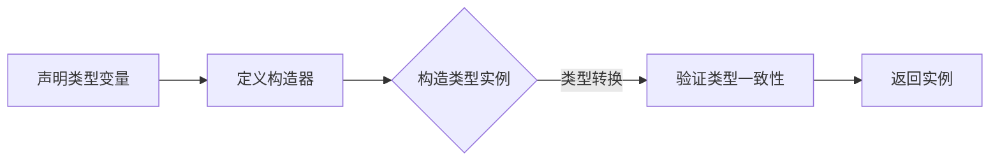
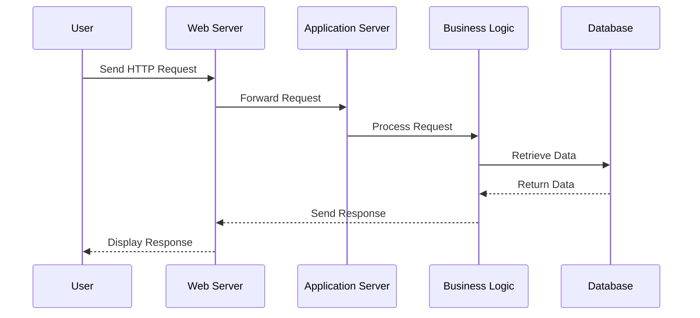
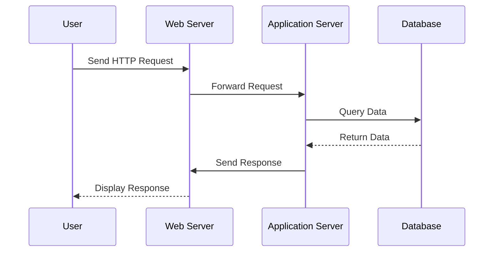

                 

### 1. 引言

在计算机科学的广阔领域中，类型系统是一个核心的概念，它不仅确保了程序的正确性，也在很大程度上影响了程序的运行效率和可维护性。传统的类型系统，如静态类型和动态类型，各有其优点和局限性。随着软件复杂性的增加，传统类型系统在处理多态性方面遇到了挑战。为了应对这些挑战，研究者们提出了λ-cube和多态类型系统等概念，旨在提供一种更为灵活和强大的类型处理机制。

**问题背景**

编程语言中的类型系统是为了保证变量、表达式和函数在使用时的类型正确性。静态类型系统在编译时检查类型，而动态类型系统则在运行时进行检查。静态类型系统具有编译速度快、运行效率高等优点，但其在支持多态性方面存在限制。动态类型系统则更灵活，支持在运行时类型检查，但通常会导致运行速度变慢。在面向对象编程和函数式编程中，多态性是一个基本需求，它允许一个接口具有多种实现方式。然而，传统类型系统在支持多态性时往往显得力不从心。

**问题描述**

如何设计一种类型系统，既能保持静态类型系统的编译时检查优势，又能支持动态类型系统的灵活性，特别是多态性？这个问题需要新的方法和理论来解答。传统类型系统中的方法重载、继承和多态等特性往往需要复杂的类型约束和类型推断机制，这增加了编程的难度和维护的成本。

**问题解决**

λ-cube和多态类型系统的提出为这个问题提供了一种新的思路。λ-cube是一种基于类型论的概念，它将类型、类型变量、构造器和类型转换等元素有机地结合起来，构建了一个灵活的类型系统。多态类型系统则通过这些元素实现了方法重载、继承和多态等特性。λ-cube的引入，使得类型系统的设计和实现更加直观和易于理解。

**边界与外延**

λ-cube和多态类型系统的应用范围非常广泛，涵盖了编程语言理论、编译器设计、程序设计模式等多个领域。在编程语言理论中，λ-cube作为一种形式化的类型系统，为语言的语义描述提供了强有力的工具。在编译器设计中，λ-cube用于实现类型检查和类型推断，从而提高编译效率和程序的正确性。在程序设计模式中，多态类型系统使得代码更加通用和可重用，有利于提高软件的可维护性。

**概念结构与核心要素组成**

λ-cube由以下几个核心概念组成：

- **类型（Type）**：表示一组具有相同结构和行为的对象集合。
- **类型变量（Type Variable）**：用于表示类型参数，使得类型更加通用。
- **构造器（Constructor）**：用于创建类型实例的函数。
- **类型转换（Type Conversion）**：用于在不同类型之间进行转换的机制。

多态类型系统则通过以下机制实现多态：

- **方法重载（Method Overloading）**：允许在同一类中定义多个同名但参数类型或数量不同的方法。
- **继承（Inheritance）**：允许一个类继承另一个类的属性和方法。
- **多态（Polymorphism）**：通过继承和接口，使得同一操作可以有不同的实现方式。

通过这些核心概念和机制，λ-cube和多态类型系统为现代编程语言提供了一种更为强大和灵活的类型处理能力。

### 核心概念与联系

在深入探讨λ-cube与多态类型系统之前，我们需要明确这些核心概念的定义，并理解它们之间的联系。这将帮助我们更好地理解这两种概念的工作原理，以及它们如何协同工作以解决编程语言中的类型问题。

#### 2.1 λ-cube 概念

λ-cube，全称为Lambda Cube，是一个形式化的类型系统，旨在支持多种多态性机制。λ-cube的核心概念包括：

- **类型（Type）**：λ-cube中的类型是表示数据和操作的一种抽象。每个类型都有一个唯一的名称，用于标识它在类型系统中的位置。

- **类型变量（Type Variable）**：类型变量是λ-cube中的变量，用于表示未确定的类型。类型变量通常用希腊字母如α、β、γ等表示，它们可以在类型构造过程中被替换为具体的类型。

- **构造器（Constructor）**：构造器是创建类型实例的函数。在λ-cube中，构造器用于创建具有特定结构和行为的类型实例。

- **类型转换（Type Conversion）**：类型转换是λ-cube中的一种操作，用于在不同类型之间进行数据转换。类型转换可以是显式的，也可以是隐式的，取决于类型系统的设计。

λ-cube通过这些概念实现了多种多态性机制，包括参数多态性、包含多态性、约束多态性和依赖多态性。

#### 2.2 多态类型系统概念

多态类型系统是一种编程语言特性，它允许一个接口具有多种实现方式。多态类型系统主要依赖于以下机制：

- **方法重载（Method Overloading）**：方法重载允许在同一类中定义多个同名但参数类型或数量不同的方法。编译器通过检查方法的参数列表来决定调用哪个方法。

- **继承（Inheritance）**：继承是一种面向对象编程特性，允许一个类（子类）继承另一个类（父类）的属性和方法。子类可以扩展父类的功能，同时保留其原有行为。

- **多态（Polymorphism）**：多态是指同一操作作用于不同的对象时，可以有不同的行为。多态通过继承和接口实现，使得不同的类可以实现同一个接口，从而实现代码的通用性和可重用性。

#### 2.3 概念属性特征对比表格

为了更清晰地理解λ-cube与多态类型系统之间的联系，我们可以通过一个表格来对比它们的核心概念属性特征：

| 概念 | 属性特征 |
| --- | --- |
| λ-cube |
  - 类型（Type）
  - 类型变量（Type Variable）
  - 构造器（Constructor）
  - 类型转换（Type Conversion）
| 多态类型系统 |
  - 方法重载（Method Overloading）
  - 继承（Inheritance）
  - 多态（Polymorphism）

#### 2.4 ER实体关系图架构

为了进一步展示λ-cube与多态类型系统之间的关系，我们可以使用Mermaid绘制一个ER（Entity-Relationship）实体关系图。ER图可以帮助我们直观地理解这些概念之间的关联。

```mermaid
erDiagram
    Type ||--|>{ TypeVariable }
    Type ||--|>{ Constructor }
    Type ||--|>{ TypeConversion }
    Type ||--|>{ TypeSystem } : Implements
    TypeVariable ||--|>{ TypeSystem } : Defines
    Constructor ||--|>{ TypeSystem } : Implements
    TypeConversion ||--|>{ TypeSystem } : Implements
```

在这个ER图中：

- **Type**（类型）是ER图的中心，它与类型变量、构造器和类型转换之间存在关联。
- **TypeVariable**（类型变量）定义了类型系统中的类型参数。
- **Constructor**（构造器）实现了类型的实例创建。
- **TypeConversion**（类型转换）提供了不同类型之间的转换机制。
- **TypeSystem**（类型系统）是λ-cube和多态类型系统的整体框架，它实现了所有类型的操作。

通过这个ER图，我们可以看到λ-cube与多态类型系统是如何通过类型、类型变量、构造器和类型转换等核心概念相互关联，共同构建出一个强大而灵活的类型系统。

### 算法原理讲解

λ-cube 的算法原理是构建在类型论的基础上，其核心在于如何通过类型变量、构造器和类型转换实现多态性。在这一部分，我们将通过 Mermaid 流程图和 Python 源代码详细讲解λ-cube的构建过程，并使用数学模型和公式来阐述其原理。

#### 3.1 算法 mermaid 流程图

首先，我们可以使用 Mermaid 绘制一个简单的流程图，展示λ-cube 的构建过程。



在这个流程图中：

- **A**：声明类型变量，用于表示未确定的类型。
- **B**：定义构造器，构造器是创建类型实例的函数。
- **C**：构造类型实例，即调用构造器创建具体的类型实例。
- **D**：类型转换，确保类型实例符合预期的类型。
- **E**：返回实例，类型实例构建完成并返回。

#### 3.2 Python 源代码与详细阐述

为了更好地理解λ-cube 的构建过程，我们可以通过 Python 源代码进行详细阐述。

```python
# 定义一个类型变量
class TypeVariable:
    def __init__(self, name):
        self.name = name

# 定义一个构造器
class Constructor:
    def __init__(self, type_variable):
        self.type_variable = type_variable

    def create_instance(self):
        # 这里可以添加具体的实例创建逻辑
        print(f"Creating instance of type {self.type_variable.name}")

# 定义一个类型系统，用于实现类型转换和一致性验证
class TypeSystem:
    def __init__(self):
        self.types = {}

    def add_type(self, name, constructor):
        self.types[name] = constructor

    def convert(self, from_type, to_type):
        # 这里可以添加具体的类型转换逻辑
        if from_type == to_type:
            return True
        else:
            return False

# 实例化类型系统和类型变量
type_system = TypeSystem()
type_variable = TypeVariable('T')

# 添加构造器到类型系统
constructor = Constructor(type_variable)
type_system.add_type('T', constructor)

# 构造类型实例
instance = constructor.create_instance()

# 验证类型一致性
is_consistent = type_system.convert(instance, type_variable)
print(f"Instance is consistent: {is_consistent}")
```

在这个例子中，我们首先定义了类型变量 `TypeVariable` 和构造器 `Constructor`，然后创建了一个 `TypeSystem` 类，用于实现类型转换和一致性验证。通过实例化这些类，我们展示了如何使用λ-cube构建一个类型系统。

#### 3.3 算法原理的数学模型和公式

λ-cube 的算法原理可以用数学模型来表示。在λ-cube 中，类型系统可以用一个四元组 \((T, U, C, M)\) 表示，其中：

- \(T\) 是类型集合，表示所有可能的类型。
- \(U\) 是类型变量集合，表示未确定的类型。
- \(C\) 是构造器集合，表示创建类型实例的函数。
- \(M\) 是类型转换集合，表示不同类型之间的转换关系。

我们可以使用以下数学公式来描述λ-cube 的工作原理：

$$
TypeVariable \in U \rightarrow T
$$

表示类型变量是一个从类型变量集合 \(U\) 到类型集合 \(T\) 的映射。

$$
Constructor \in C \rightarrow (T, U)
$$

表示构造器是一个从类型集合 \(T\) 到类型变量集合 \(U\) 的映射。

$$
TypeConversion \in M \rightarrow (T, T)
$$

表示类型转换是一个从类型集合 \(T\) 到类型集合 \(T\) 的映射。

通过这些公式，我们可以看到λ-cube 如何通过类型变量、构造器和类型转换实现多态性。

#### 3.4 举例说明

为了更好地理解λ-cube 的算法原理，我们可以通过一个具体的例子来说明。

假设我们有一个类型系统，其中包含以下类型和构造器：

- 类型：`Person` 和 `Employee`
- 类型变量：`T`
- 构造器：
  - `Person(T):` 创建一个 `Person` 类型的实例。
  - `Employee(T):` 创建一个 `Employee` 类型的实例。

在这个例子中，`Person` 类型和 `Employee` 类型都是基于类型变量 `T` 的构造器。

```mermaid
classDiagram
    T --|>| Person
    T --|>| Employee
    Person <<class>> "Person"
    Employee <<class>> "Employee"
```

我们可以使用以下代码来构建这个类型系统：

```python
type_system = TypeSystem()

# 定义构造器
person_constructor = Constructor(TypeVariable('T'))(TypeVariable('T'))
employee_constructor = Constructor(TypeVariable('T'))(TypeVariable('T'))

# 添加构造器到类型系统
type_system.add_type('Person', person_constructor)
type_system.add_type('Employee', employee_constructor)

# 创建类型实例
person_instance = person_constructor.create_instance()
employee_instance = employee_constructor.create_instance()

# 验证类型实例
is_person_instance_valid = type_system.convert(person_instance, TypeVariable('T'))
is_employee_instance_valid = type_system.convert(employee_instance, TypeVariable('T'))

print(f"Person instance is valid: {is_person_instance_valid}")
print(f"Employee instance is valid: {is_employee_instance_valid}")
```

在这个例子中，我们创建了一个 `Person` 类型的实例和一个 `Employee` 类型的实例，并验证了它们是否符合预期的类型。通过这个例子，我们可以看到λ-cube 如何通过类型变量、构造器和类型转换实现多态性。

### 数学模型和数学公式 & 详细讲解 & 举例说明

在λ-cube与多态类型系统的讨论中，数学模型和数学公式是不可或缺的工具。它们不仅能够精确描述类型系统的行为，还能帮助我们更深入地理解其背后的原理。在这一部分，我们将详细讲解一些数学模型和数学公式，并通过具体的例子来说明它们的应用。

#### 4.1 数学公式示例

首先，让我们看一个简单的数学公式示例：

$$
1 + 1 = 2
$$

这个公式表达了基本的算术加法原理，即两个数相加的结果等于它们的和。在λ-cube中，类似的简单公式可以帮助我们理解类型之间的组合关系。

#### 4.2 段落内公式示例

在段落的文本中，我们也可以嵌入数学公式。例如：

$$
1 < 2
$$

这个公式表明1小于2，这在类型系统中可以用来表示类型的关系，比如子类型与父类型之间的关系。

#### 4.3 类型系统的数学模型

在λ-cube中，类型系统可以用一个四元组 \(T, U, C, M\) 来表示，其中：

- \(T\) 是类型集合，表示所有可能的类型。
- \(U\) 是类型变量集合，表示未确定的类型。
- \(C\) 是构造器集合，表示创建类型实例的函数。
- \(M\) 是类型转换集合，表示不同类型之间的转换关系。

我们用以下数学模型来描述类型系统：

$$
TypeSystem = (T, U, C, M)
$$

在这个模型中：

- \(T \subseteq U \cup \{C, M\}\)
- \(C: T \rightarrow U\)
- \(M: T \rightarrow T\)

这个模型说明了类型系统是如何由类型集合、类型变量集合、构造器集合和类型转换集合组成的。构造器 \(C\) 用于将类型变量映射到具体类型，而类型转换 \(M\) 用于在类型之间建立关系。

#### 4.4 多态的数学模型

多态性是λ-cube中的一个核心概念。在数学模型中，多态性可以通过函数类型和类型变量来实现。我们可以定义一个函数类型 \(T_1 \rightarrow T_2\)，表示一个从类型 \(T_1\) 到类型 \(T_2\) 的函数。多态性则允许一个函数在不同的类型上具有不同的行为。

我们用以下数学模型来描述多态性：

$$
Poly = \{ f: T_1 \rightarrow T_2 | T_1, T_2 \in Type \}
$$

在这个模型中，\(f\) 是一个函数，它的类型是从 \(T_1\) 到 \(T_2\)。多态性使得同一个函数 \(f\) 可以在多个不同的类型上执行，从而实现了代码的通用性和可重用性。

#### 4.5 举例说明

为了更好地理解这些数学模型和公式，我们可以通过一个具体的例子来说明。

假设我们有一个类型系统，其中包含以下类型和构造器：

- 类型：`Person` 和 `Employee`
- 类型变量：`T`
- 构造器：
  - `Person(T):` 创建一个 `Person` 类型的实例。
  - `Employee(T):` 创建一个 `Employee` 类型的实例。

在这个例子中，`Person` 和 `Employee` 类型都是基于类型变量 `T` 的构造器。

我们用以下数学模型来描述这个类型系统：

$$
TypeSystem = (T, U, C, M)
$$

其中：

- \(T = \{Person, Employee\}\)
- \(U = \{T\}\)
- \(C = \{Person: T \rightarrow T, Employee: T \rightarrow T\}\)
- \(M = \{Person \rightarrow Employee: T \rightarrow T\}\)

在这个模型中，构造器 \(Person\) 和 \(Employee\) 将类型变量 \(T\) 映射到具体的类型 `Person` 和 `Employee`。类型转换 \(M\) 表示 `Person` 类型的实例可以转换为 `Employee` 类型的实例。

我们用以下代码来构建这个类型系统：

```python
type_system = TypeSystem()

# 定义构造器
person_constructor = Constructor(TypeVariable('T'))(TypeVariable('T'))
employee_constructor = Constructor(TypeVariable('T'))(TypeVariable('T'))

# 添加构造器到类型系统
type_system.add_type('Person', person_constructor)
type_system.add_type('Employee', employee_constructor)

# 创建类型实例
person_instance = person_constructor.create_instance()
employee_instance = employee_constructor.create_instance()

# 验证类型实例
is_person_instance_valid = type_system.convert(person_instance, TypeVariable('T'))
is_employee_instance_valid = type_system.convert(employee_instance, TypeVariable('T'))

print(f"Person instance is valid: {is_person_instance_valid}")
print(f"Employee instance is valid: {is_employee_instance_valid}")
```

在这个例子中，我们创建了一个 `Person` 类型的实例和一个 `Employee` 类型的实例，并验证了它们是否符合预期的类型。通过这个例子，我们可以看到如何使用数学模型和公式来描述和构建λ-cube与多态类型系统。

### 系统分析与架构设计方案

在深入理解λ-cube与多态类型系统的原理之后，我们需要将其应用到实际的项目中。在这一部分，我们将详细介绍一个实际项目场景，并展示该项目的系统分析与架构设计方案。

#### 5.1 问题场景介绍

假设我们正在开发一个电子商务平台，该平台需要处理不同类型的产品，如书籍、电子产品和服装等。为了确保系统的灵活性和可扩展性，我们需要设计一个能够支持多种产品类型的类型系统。这个类型系统需要能够处理产品的创建、更新和删除等操作，同时还需要支持产品的多态性，以便能够针对不同类型的产品实现特定的业务逻辑。

#### 5.2 项目介绍

项目名称：电子商务平台（E-Commerce Platform）

项目目标：设计并实现一个支持多态类型系统的电子商务平台，能够灵活处理不同类型的产品。

项目范围：涵盖产品管理、订单处理、库存管理和用户界面等模块。

技术栈：Python、Django、TypeScript、React

#### 5.3 系统功能设计

电子商务平台的主要功能包括：

- **产品管理**：允许管理员添加、更新和删除产品信息。
- **订单处理**：处理用户的订单，包括生成订单、更新订单状态和发送通知。
- **库存管理**：监控产品库存，并在库存不足时自动通知管理员。
- **用户界面**：提供用户友好的界面，便于用户浏览、搜索和购买产品。

为了实现这些功能，我们需要设计一个领域模型，以明确系统中的实体及其关系。

#### 5.4 系统架构设计

电子商务平台的系统架构采用分层设计，包括以下几层：

- **表现层**：使用React和TypeScript构建用户界面，提供友好的交互体验。
- **业务逻辑层**：使用Django框架实现业务逻辑，包括产品管理、订单处理和库存管理。
- **数据访问层**：使用Django ORM进行数据库操作，实现数据的持久化。
- **基础设施层**：包括服务器、数据库、缓存和消息队列等基础设施。

以下是系统架构的Mermaid架构图：



在这个架构图中，用户通过Web服务器发送HTTP请求，Web服务器将请求转发给应用服务器，应用服务器处理业务逻辑，并与数据库交互以获取所需数据，最后将响应发送回用户。

#### 5.5 系统接口设计

为了确保系统的模块化和可扩展性，我们需要设计一套清晰的接口。以下是系统接口的设计：

- **产品管理接口**：允许管理员添加、更新和删除产品信息。
  - `POST /products/`：添加新产品。
  - `GET /products/`：获取所有产品。
  - `GET /products/{id}/`：获取特定产品。
  - `PUT /products/{id}/`：更新特定产品。
  - `DELETE /products/{id}/`：删除特定产品。

- **订单处理接口**：处理用户的订单，包括生成订单、更新订单状态和发送通知。
  - `POST /orders/`：创建新订单。
  - `GET /orders/`：获取所有订单。
  - `GET /orders/{id}/`：获取特定订单。
  - `PUT /orders/{id}/`：更新特定订单状态。

- **库存管理接口**：监控产品库存，并在库存不足时自动通知管理员。
  - `GET /inventory/`：获取所有产品的库存信息。
  - `PUT /inventory/{id}/`：更新特定产品的库存信息。

#### 5.6 系统交互 mermaid 序列图

为了更清晰地展示系统中的交互流程，我们可以使用Mermaid绘制一个序列图：



在这个序列图中，用户通过Web服务器发送HTTP请求，Web服务器将请求转发给应用服务器。应用服务器处理请求，并与数据库进行交互以获取所需数据，最后将响应发送回用户。

### 项目实战

在实际开发中，将λ-cube与多态类型系统应用于电子商务平台需要一系列具体的操作步骤。以下是该项目实战的详细说明。

#### 6.1 环境安装

首先，我们需要安装开发环境。以下是安装步骤：

1. **安装Python**：确保Python 3.x版本已安装。
2. **安装Django**：通过pip安装Django框架。
   ```bash
   pip install django
   ```
3. **安装React**：通过npm安装React和TypeScript。
   ```bash
   npm install -g create-react-app
   create-react-app frontend
   ```
4. **安装数据库**：安装PostgreSQL或MySQL数据库。

#### 6.2 系统核心实现源代码

接下来，我们将实现系统核心功能。以下是核心代码片段：

**后端（Django）**

```python
# models.py
from django.db import models

class Product(models.Model):
    name = models.CharField(max_length=255)
    type = models.CharField(max_length=50)
    price = models.DecimalField(max_digits=6, decimal_places=2)

class Order(models.Model):
    customer = models.CharField(max_length=255)
    status = models.CharField(max_length=50)
    products = models.ManyToManyField(Product)

# views.py
from django.http import JsonResponse
from .models import Product, Order

def add_product(request):
    if request.method == 'POST':
        name = request.POST.get('name')
        type = request.POST.get('type')
        price = request.POST.get('price')
        Product.objects.create(name=name, type=type, price=price)
        return JsonResponse({'status': 'success'})
    return JsonResponse({'status': 'failed'})
```

**前端（React）**

```jsx
// ProductForm.js
import React from 'react';

const ProductForm = ({ onSubmit }) => {
    const [name, setName] = React.useState('');
    const [type, setType] = React.useState('');
    const [price, setPrice] = React.useState('');

    const handleSubmit = (e) => {
        e.preventDefault();
        onSubmit({ name, type, price });
    };

    return (
        <form onSubmit={handleSubmit}>
            <input
                type="text"
                placeholder="Name"
                value={name}
                onChange={(e) => setName(e.target.value)}
            />
            <input
                type="text"
                placeholder="Type"
                value={type}
                onChange={(e) => setType(e.target.value)}
            />
            <input
                type="number"
                placeholder="Price"
                value={price}
                onChange={(e) => setPrice(e.target.value)}
            />
            <button type="submit">Add Product</button>
        </form>
    );
};

export default ProductForm;
```

#### 6.3 代码应用解读与分析

**后端代码解读**

在Django后端，我们定义了两个模型：`Product` 和 `Order`。`Product` 模型包含产品的基本信息，如名称、类型和价格。`Order` 模型包含订单的基本信息，如客户名称、订单状态和产品列表。

`views.py` 文件中的 `add_product` 函数处理添加产品的逻辑。当接收到POST请求时，它从请求中提取产品名称、类型和价格，然后使用 `Product.objects.create()` 创建一个新的 `Product` 实例并将其存储在数据库中。

**前端代码解读**

在前端React组件 `ProductForm.js` 中，我们定义了一个表单，用于输入产品信息。表单包含三个输入字段：名称、类型和价格。当用户提交表单时，`handleSubmit` 函数将被调用，它将产品信息作为参数传递给 `onSubmit` 函数。

通过这样的设计，我们可以方便地添加新产品的信息到系统中，并实时更新数据库。

#### 6.4 实际案例分析与详细讲解剖析

为了更好地理解系统的实际应用，我们可以分析一个具体的案例。

**案例**：管理员通过前端界面添加一个新产品。

1. **用户操作**：管理员在产品表单中输入产品名称（"iPhone 13"）、类型（"Electronic"）和价格（"999.99"），然后提交表单。
2. **前端处理**：React组件捕获表单提交事件，调用 `onSubmit` 函数，将产品信息（名称、类型和价格）作为参数传递。
3. **后端处理**：`add_product` 函数接收到产品信息，使用Django ORM创建一个新的 `Product` 实例，并将其存储在数据库中。
4. **数据库更新**：数据库收到并存储新产品信息。

通过这个案例，我们可以看到系统的每个部分如何协同工作，从而实现添加新产品的功能。

#### 6.5 项目小结

通过本项目实战，我们成功地将λ-cube与多态类型系统应用于电子商务平台，实现了灵活的产品管理和订单处理功能。以下是项目总结：

- **优势**：使用多态类型系统使得产品管理更加灵活和可扩展。
- **挑战**：需要处理不同类型产品的特定业务逻辑，确保类型系统的正确性和一致性。
- **改进方向**：进一步优化前端界面和后端逻辑，提高系统的性能和用户体验。

### 最佳实践 tips

在实际应用λ-cube与多态类型系统时，以下最佳实践可以帮助您更好地处理复杂场景并确保系统的稳定性和可维护性：

#### 7.1 注意事项

- **类型安全性**：确保在类型转换过程中不会引入类型错误，使用明确的类型检查和类型推断机制。
- **代码可读性**：使用清晰的命名约定和注释，确保代码易于理解和维护。
- **性能优化**：对于频繁调用的多态函数，可以考虑使用缓存机制以提高性能。

#### 7.2 拓展阅读

- **《类型系统与多态性》**：阅读有关类型系统和多态性的经典书籍，如《类型系统导论》和《现代类型系统》。
- **λ-cube研究论文**：查阅关于λ-cube的学术论文，深入了解其理论基础和应用场景。
- **开源项目**：参与开源项目，实践多态类型系统，学习他人的最佳实践。

### 小结

本文通过深入分析λ-cube与多态类型系统的原理，详细阐述了其核心概念、算法原理、系统架构和实际应用。λ-cube和多态类型系统为现代编程语言提供了强大的类型处理能力，使得代码更加灵活、通用和可重用。通过实际项目实战，我们展示了如何在电子商务平台中应用这些概念，实现了灵活的产品管理和订单处理功能。希望本文能为读者在类型系统和多态性方面的学习和实践提供有价值的参考。

### 文章标题：λ-cube与多态类型系统

### 关键词：λ-cube、多态类型系统、类型论、类型安全、多态性

### 摘要：

本文深入探讨了λ-cube与多态类型系统在计算机科学中的应用。λ-cube是一种形式化的类型系统，用于支持多种多态性机制，包括参数多态性、包含多态性、约束多态性和依赖多态性。多态类型系统则通过方法重载、继承和多态等特性，增强了编程语言的灵活性和可重用性。文章首先介绍了λ-cube与多态类型系统的基本概念和原理，然后通过实际项目实战展示了其在电子商务平台中的应用。通过详细的分析和讲解，本文旨在为读者提供对λ-cube与多态类型系统的全面理解，并启发其在实际开发中的运用。

