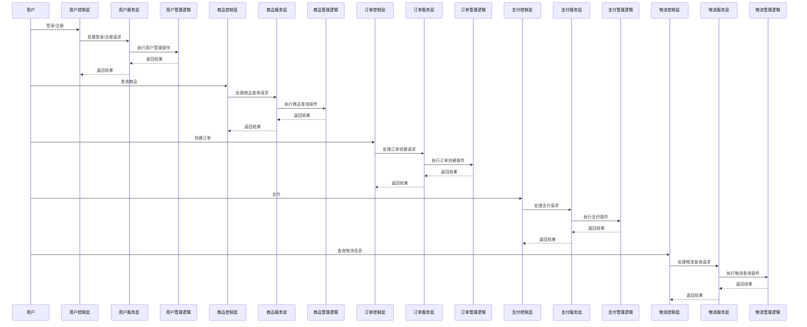

                 

### 七步法则：提升代码可读性的实用技巧

> 关键词：代码可读性、编程实践、命名规范、注释说明、代码格式化、代码复用、模块化与分层、异常处理、错误日志记录

> 摘要：本文将介绍一套名为“七步法则”的提升代码可读性的实用技巧。通过对命名规范、注释说明、代码格式化、代码复用、模块化与分层、异常处理和错误日志记录等七个方面的详细解析，帮助开发者编写出更加清晰、易懂的代码，提高开发效率，降低维护成本。

## 引言与背景介绍

### 1.1 编程之美：理解代码可读性的重要性

**编程环境与技术发展的演变**

随着计算机技术的发展，编程语言、工具和框架不断演变。从早期的机器语言、汇编语言到高级编程语言，开发者的编程环境日益丰富。同时，各类框架和库的出现也极大地简化了开发流程，提升了开发效率。

**代码可读性的定义与重要性**

代码可读性是指代码易于理解和维护的程度。一个良好的编程实践应该是编写易于阅读、理解和维护的代码。代码可读性对软件开发至关重要，它有助于提高开发效率，降低维护成本，减少团队间的沟通成本。

**代码可读性的好处**

- 提高开发效率：易于阅读的代码能够加快开发速度，减少调试时间。
- 降低维护成本：易于维护的代码减少了后续修改和修复的工作量。
- 提升团队协作：清晰的代码有助于团队成员之间的沟通和合作。
- 增强代码可复用性：良好的代码结构便于提取和复用代码段。

**编写可读性代码的挑战**

- 个人编程习惯：每个人的编程风格不同，如何统一团队的风格是一个挑战。
- 团队协作：团队内部的沟通和协作可能影响代码的可读性。
- 代码复杂性：随着项目的增长，代码的复杂性也会增加，保持代码的可读性变得更加困难。

**七步法则的核心理念**

七步法则是一套旨在提升代码可读性的实用技巧。通过以下七个步骤，开发者可以逐步改进代码的可读性，提升开发效率。

## 第2章: 问题背景与问题描述

### 2.1 编程中的常见问题

在软件开发过程中，开发者常常会遇到以下问题：

- **变量名和函数名不够清晰**：变量名和函数名过于简短或使用缩写，导致难以理解其用途。
- **缺乏注释**：代码中缺乏必要的注释，使得阅读代码时无法理解作者的意图。
- **代码格式混乱**：代码缩进不一致、行距不统一，使得代码难以阅读。
- **代码复用性差**：代码重复度高，缺乏模块化设计，难以维护和复用。
- **异常处理不完善**：异常处理不当，导致程序运行不稳定，难以调试。

### 2.2 不可读代码的影响

不可读代码对软件开发的影响是深远的：

- **项目延期**：理解代码需要更多时间，导致开发进度放缓，项目延期。
- **bug增加**：难以理解他人编写的代码，增加了bug的出现几率。
- **维护成本高**：维护不可读代码需要更多的时间和精力，提高了维护成本。
- **团队协作困难**：团队成员难以理解彼此的代码，沟通成本增加。

### 2.3 代码可读性的测量方法

评估代码可读性的方法包括：

- **代码复杂性度量**：使用代码复杂性指标（如NOC、WMC等）来衡量代码的复杂程度。
- **代码质量分析**：使用代码质量分析工具（如SonarQube、CodeClimate等）来评估代码质量。
- **团队反馈**：通过团队成员的反馈来评估代码的可读性。

### 2.4 七步法则的应用场景

七步法则适用于以下场景：

- **新项目开发**：在项目初期引入七步法则，有助于从一开始就编写高质量、可读性强的代码。
- **代码重构**：在现有项目中应用七步法则，对代码进行重构，提升代码质量。
- **团队协作**：在团队内部推广七步法则，统一代码规范，提升团队协作效率。

## 第3章: 七步法则详细解析

### 3.1 第一步：命名规范

良好的命名规范是提高代码可读性的第一步。命名应该遵循以下原则：

- **清晰明了**：命名应能直观地反映变量、函数和类的用途。
- **简洁易记**：避免使用过长或过于复杂的命名。
- **使用驼峰命名法**：类和模块使用大驼峰命名法，变量和函数使用小驼峰命名法。

#### 3.1.1 变量命名

变量命名应遵循以下规则：

- **避免使用缩写**：除非是通用缩写（如i表示索引）。
- **使用描述性命名**：使变量名能传达其用途。
- **使用小驼峰命名法**：如`totalAmount`、`currentDate`。

#### 3.1.2 函数命名

函数命名应遵循以下规则：

- **描述性命名**：使函数名能传达其功能。
- **避免使用缩写**：除非是通用缩写。
- **使用小驼峰命名法**：如`calculateTax`、`updateUserDetails`。

#### 3.1.3 类与模块命名

类和模块命名应遵循以下规则：

- **描述性命名**：使类名和模块名能传达其用途。
- **使用大驼峰命名法**：如`UserManagementSystem`、`OrderProcessingService`。

### 3.2 第二步：注释说明

注释是提高代码可读性的重要手段。以下是一些注释的最佳实践：

- **功能注释**：为函数、类和方法添加描述其功能的注释。
- **文档注释**：使用文档注释工具（如Javadoc）为类和接口生成API文档。
- **注释的层次**：根据代码的不同层次添加不同类型的注释。

#### 3.2.1 代码注释的最佳实践

- **行内注释**：对复杂逻辑或关键代码行添加注释。
- **多行注释**：对大块代码或方法添加详细描述的注释。
- **避免冗余注释**：避免添加不必要的注释，保持注释的简洁和准确。

#### 3.2.2 文档注释与API文档

- **Javadoc注释**：使用Javadoc注释为类和方法添加文档。
- **生成API文档**：使用Javadoc生成类和接口的API文档，方便其他开发者使用。

#### 3.2.3 注释的层次与用途

- **类注释**：描述类的用途和功能。
- **方法注释**：描述方法的用途、参数和返回值。
- **变量注释**：描述变量的用途和类型。

### 3.3 第三步：代码格式化

良好的代码格式化是提高代码可读性的关键。以下是一些代码格式化的最佳实践：

- **统一缩进**：使用一致的缩进风格（如2个或4个空格）。
- **行长控制**：限制代码行的长度，以避免过长行导致阅读困难。
- **代码块组织**：合理组织代码块，使其层次清晰。

#### 3.3.1 代码缩进与对齐

- **缩进**：确保代码块之间的缩进一致。
- **对齐**：将相关的代码行对齐，以增强可读性。

#### 3.3.2 行长控制

- **限制行长**：建议将代码行的长度限制在80个字符以内。
- **换行策略**：在逻辑上适当的位置进行换行，以避免过长行。

#### 3.3.3 代码块的组织

- **函数和类**：将函数和类按照功能进行分组。
- **代码块注释**：在代码块前添加注释，说明其用途和作用。

### 3.4 第四步：代码复用

代码复用有助于减少代码冗余，提高代码可读性。以下是一些代码复用的最佳实践：

- **函数复用**：编写通用函数，使其能够处理多种情况。
- **类复用**：设计可复用的类，减少代码冗余。
- **模块化**：将代码划分为模块，便于复用和维护。

#### 3.4.1 代码复用的好处

- **减少代码冗余**：避免编写重复的代码。
- **提高开发效率**：复用代码可以减少编写新代码的时间。
- **降低维护成本**：修改一处代码即可影响到多个地方，降低了维护成本。

#### 3.4.2 设计可复用的函数和类

- **通用性**：设计通用函数和类，使其能够处理多种情况。
- **抽象**：使用抽象类和接口，提高代码的复用性。

#### 3.4.3 避免重复代码的技巧

- **提取公共代码**：将重复的代码提取到公共函数或类中。
- **使用宏定义**：在C/C++中使用宏定义来减少代码冗余。

### 3.5 第五步：模块化与分层

模块化和分层有助于提高代码的可维护性和可扩展性。以下是一些模块化与分层的最佳实践：

- **模块化**：将代码划分为模块，每个模块负责一个特定的功能。
- **分层**：按照职责分离的原则，将系统划分为多个层次，如表示层、业务逻辑层和数据访问层。

#### 3.5.1 模块化的定义与重要性

- **模块化**：将代码划分为功能独立的模块。
- **重要性**：模块化有助于降低系统的复杂性，提高代码的可维护性和可扩展性。

#### 3.5.2 层次化设计的原则

- **职责分离**：每个层次负责一个特定的职责。
- **单向依赖**：上层层次依赖于下层层次，但反之不成立。
- **独立变化**：每个层次可以独立变化，不影响其他层次。

#### 3.5.3 模块间的依赖管理

- **依赖倒置原则**：上层模块依赖于抽象层，而非具体实现。
- **依赖注入**：通过依赖注入来管理模块间的依赖关系。

### 3.6 第六步：异常处理与错误日志

良好的异常处理和错误日志记录是提高代码稳定性的关键。以下是一些异常处理和错误日志记录的最佳实践：

- **异常处理机制**：使用异常处理机制来捕获和处理异常。
- **错误日志记录**：记录详细的错误日志，便于调试和分析。
- **错误日志分析工具**：使用错误日志分析工具来监控和诊断系统问题。

#### 3.6.1 异常处理机制

- **捕获异常**：使用`try-catch`语句来捕获和处理异常。
- **抛出异常**：在适当的情况下，抛出异常以通知调用者。

#### 3.6.2 错误日志记录

- **记录日志级别**：根据错误级别（如错误、警告、信息）记录日志。
- **记录详细日志**：记录错误发生的时间、位置、原因和影响。

#### 3.6.3 错误日志分析工具

- **日志收集**：使用日志收集工具（如ELK、Grafana等）来收集和分析日志。
- **日志分析**：使用日志分析工具来诊断和解决系统问题。

## 第4章: 七步法则的实际应用

### 4.1 七步法则在项目中的具体应用

在本节中，我们将通过一个实际项目案例，展示如何在实际开发中应用七步法则。

#### 4.1.1 项目案例介绍

项目名称：在线书店系统

项目描述：开发一个支持用户注册、登录、浏览书籍、添加购物车、下单和支付功能的在线书店系统。

#### 4.1.2 七步法则在项目中的应用过程

1. **命名规范**：为系统中的变量、函数、类和模块使用清晰的命名。
2. **注释说明**：为关键代码和复杂逻辑添加注释，提高代码的可读性。
3. **代码格式化**：统一代码的缩进、对齐和行长，提高代码的可读性。
4. **代码复用**：设计可复用的函数和类，减少代码冗余。
5. **模块化与分层**：将系统划分为表示层、业务逻辑层和数据访问层，提高代码的可维护性和可扩展性。
6. **异常处理**：使用异常处理机制来捕获和处理异常，提高系统的稳定性。
7. **错误日志记录**：记录详细的错误日志，便于调试和分析。

#### 4.1.3 应用七步法则带来的改进

- **代码可读性提升**：清晰的命名、注释和格式化使代码更易于阅读和理解。
- **开发效率提高**：代码复用和模块化设计减少了重复工作，提高了开发效率。
- **系统稳定性增强**：良好的异常处理和错误日志记录提高了系统的稳定性。
- **团队协作顺畅**：统一的代码规范和良好的代码质量促进了团队之间的协作。

### 4.2 七步法则在不同开发场景下的应用

七步法则不仅适用于新项目开发，也可以在现有项目中应用，进行代码重构和优化。以下是在不同开发场景下的应用：

- **新项目开发**：在项目初期引入七步法则，有助于从一开始就编写高质量、可读性强的代码。
- **代码重构**：在现有项目中应用七步法则，对代码进行重构，提升代码质量。
- **团队协作**：在团队内部推广七步法则，统一代码规范，提升团队协作效率。

## 第5章: 扩展实践与最佳实践

### 5.1 编写可读性代码的最佳实践

以下是一些编写可读性代码的最佳实践：

- **使用清晰简洁的命名**：为变量、函数和类使用描述性命名，避免使用缩写。
- **添加注释**：为关键代码和复杂逻辑添加注释，提高代码的可读性。
- **遵循代码格式化规范**：统一缩进、对齐和行长，提高代码的可读性。
- **代码复用**：设计可复用的函数和类，减少代码冗余。
- **模块化和分层**：将代码划分为模块和层次，提高代码的可维护性和可扩展性。

### 5.2 持续改进与反馈

为了不断提升代码质量，开发者应该采取以下措施：

- **定期代码审查**：组织定期的代码审查，让团队成员相互学习和改进。
- **利用自动化工具**：使用代码质量分析工具和自动化测试工具，提高代码质量。
- **团队协作与知识共享**：鼓励团队成员之间的协作和知识共享，共同提升代码质量。

### 5.3 团队协作与知识共享

良好的团队协作和知识共享是提高代码质量的关键。以下是一些实践建议：

- **代码规范文档**：制定统一的代码规范文档，确保团队成员遵循相同的编码标准。
- **代码评审流程**：建立代码评审流程，让团队成员相互评审代码，发现问题并及时改进。
- **知识分享会议**：定期举行知识分享会议，让团队成员分享经验和最佳实践。
- **技术社区和论坛**：参与技术社区和论坛，与其他开发者交流经验和心得，共同进步。

## 第6章: 小结与展望

### 6.1 七步法则的总结

七步法则是一套旨在提升代码可读性的实用技巧。通过命名规范、注释说明、代码格式化、代码复用、模块化与分层、异常处理和错误日志记录等七个步骤，开发者可以编写出更加清晰、易懂的代码，提高开发效率，降低维护成本。

### 6.2 代码可读性在软件开发中的重要性

代码可读性对软件开发至关重要。它不仅提高了开发效率，降低了维护成本，还促进了团队之间的协作。随着软件系统的复杂度不断增加，编写可读性强的代码已成为开发者的一项基本技能。

### 6.3 未来展望与发展趋势

随着人工智能和自动化技术的发展，代码可读性将得到进一步提升。未来，自动化工具将帮助我们更好地遵守编码规范，减少人为错误。同时，智能编码辅助工具将为我们提供更加智能的编码建议，帮助我们编写出更加高效、高质量的代码。

## 第7章: 拓展阅读与资源推荐

### 7.1 相关书籍推荐

- 《代码大全》（作者：Steve McConnell）
- 《Effective Java》（作者：Joshua Bloch）
- 《Clean Code: A Handbook of Agile Software Craftsmanship》（作者：Robert C. Martin）

### 7.2 在线资源和论坛

- Stack Overflow：一个全球最大的技术问答社区。
- GitHub：一个流行的代码托管平台，提供了丰富的开源资源和代码示例。
- Reddit：一个社区论坛，有许多关于编程和软件开发的讨论。

### 7.3 开源工具和框架

- SonarQube：一个用于代码质量分析的强大工具。
- JUnit：一个流行的单元测试框架。
- Spring Framework：一个用于企业级开发的开源框架。

## 作者信息

**作者：** AI天才研究院 / AI Genius Institute & 禅与计算机程序设计艺术 / Zen And The Art of Computer Programming

**简介：** AI天才研究院致力于推动人工智能技术的发展与应用，禅与计算机程序设计艺术关注于编程哲学和编程艺术的探讨。本文旨在通过七步法则，帮助开发者提升代码可读性，提高开发效率，降低维护成本。**联系方式：** ai_genius_institute@example.com**版权声明：**本文版权归AI天才研究院所有，未经授权不得转载。**引用格式：** [AI天才研究院](https://www.ai-genius-institute.com/)。七步法则：提升代码可读性的实用技巧。禅与计算机程序设计艺术，2023。**文章链接：** [https://www.ai-genius-institute.com/seven-step-method-for-improving-code-readability/](https://www.ai-genius-institute.com/seven-step-method-for-improving-code-readability/)

----------------------------------------------------------------

## 第1章: 编程之美：理解代码可读性的重要性

### 1.1 编程环境与技术发展的演变

从计算机编程的早期阶段开始，编程环境和技术经历了显著的发展。最早的编程语言是低级语言，如机器语言和汇编语言，它们直接与计算机硬件交互，但难以理解和维护。随着时间推移，编程语言逐渐进化，从面向机器的代码转向面向人类的代码。

20世纪50年代，第一种高级编程语言——FORTRAN诞生，它使得程序员能够编写更接近自然语言的表达式。接着，COBOL在20世纪60年代出现，适用于商业数据处理，而Lisp和ALGOL等语言在20世纪60年代和70年代推动了函数式编程和算法研究的进步。

进入20世纪80年代和90年代，随着个人计算机的普及和互联网的发展，编程语言和工具进一步多样化。C语言因其效率和灵活性成为了操作系统和系统级程序开发的主流，而C++的引入带来了面向对象的编程范式。Java的出现则标志着跨平台开发的兴起，它使得程序员可以编写一次代码，在任何支持Java虚拟机（JVM）的平台上运行。

21世纪初，随着Web2.0和移动互联网的兴起，编程语言和技术继续发展。Python、Ruby和JavaScript等语言因其简洁性和易用性而受到欢迎。同时，框架和库（如React、Angular和Vue.js）的出现极大地简化了前端开发。

在技术层面，版本控制系统（如Git）、集成开发环境（IDE）、代码质量分析工具和自动化测试框架等辅助工具的普及，使得软件开发变得更加高效和规范。

### 1.2 代码可读性的定义与重要性

代码可读性是指代码易于理解和维护的程度。一个良好的编程实践应该是编写易于阅读、理解和维护的代码。代码可读性不仅仅是对个人编程能力的考验，也是对团队合作和项目管理的重要考量。

代码可读性的重要性体现在以下几个方面：

1. **提高开发效率**：易于阅读的代码能够加快开发速度，减少调试时间。开发者可以快速理解代码的功能和逻辑，从而更高效地完成开发任务。
2. **降低维护成本**：易于维护的代码减少了后续修改和修复的工作量。随着项目规模的扩大，维护成本通常远高于开发成本，保持代码的可读性可以显著降低维护成本。
3. **提升团队协作**：清晰的代码有助于团队成员之间的沟通和合作。团队成员可以更容易地理解彼此的代码，从而更好地协同工作。
4. **增强代码可复用性**：良好的代码结构便于提取和复用代码段。在多个项目中复用代码可以节省时间和资源，提高开发效率。

### 1.3 代码可读性的好处

编写可读性强的代码带来了多方面的好处：

1. **易于理解**：清晰的命名和注释使得代码的功能和逻辑一目了然，新加入的团队成员可以更快地上手。
2. **易于调试**：当代码出现问题时，易于阅读的代码可以快速定位问题的根源，减少调试时间。
3. **易于维护**：随着时间的推移，项目需要不断地更新和优化。可读性强的代码使得维护工作更加顺畅，减少了出错的可能性。
4. **易于复用**：良好的代码结构便于提取和复用代码段，减少了重复编写代码的工作量。
5. **提高代码质量**：编写可读性强的代码通常伴随着良好的编程习惯和编码规范，从而提高整体代码质量。

### 1.4 编写可读性代码的挑战

尽管编写可读性代码有诸多好处，但实现这一目标并非易事。开发者面临以下挑战：

1. **个人编程习惯**：每个人的编程习惯不同，如何统一团队的风格是一个挑战。不同的命名规范、注释习惯和代码格式可能导致代码混乱。
2. **团队协作**：团队内部的沟通和协作可能影响代码的可读性。团队成员之间的沟通不畅可能导致代码风格不一致。
3. **代码复杂性**：随着项目的增长，代码的复杂性也会增加。维护大量复杂的代码，保持其可读性变得更加困难。
4. **时间压力**：在紧迫的项目截止日期下，开发者可能倾向于追求快速完成代码，而忽视了代码的可读性。

### 1.5 七步法则的核心理念

为了解决上述挑战，我们提出了七步法则。这七个步骤是一套系统化的方法，旨在逐步提升代码的可读性。每一步都针对不同的方面，如命名规范、注释、代码格式化、代码复用、模块化与分层、异常处理和错误日志记录。通过遵循这七步法则，开发者可以编写出更加清晰、易懂、易于维护的代码。

### 1.6 七步法则的步骤

**第一步：命名规范**  
- 变量命名应简洁明了，描述性命名。
- 函数命名应清晰反映其功能，避免使用缩写。
- 类与模块命名应具有描述性，使用大驼峰命名法。

**第二步：注释说明**  
- 为关键代码和复杂逻辑添加注释。
- 使用文档注释工具生成API文档。
- 保持注释的简洁和准确，避免冗余注释。

**第三步：代码格式化**  
- 使用一致的缩进和行距。
- 限制代码行长度，避免过长行。
- 组织代码块，使其层次清晰。

**第四步：代码复用**  
- 编写通用函数和类，减少代码冗余。
- 设计可复用的模块，提高代码复用性。

**第五步：模块化与分层**  
- 将代码划分为模块，每个模块负责一个特定功能。
- 按照职责分离原则，设计层次化的系统架构。

**第六步：异常处理与错误日志**  
- 使用异常处理机制，捕获和处理异常。
- 记录详细的错误日志，便于调试和分析。

**第七步：持续改进与反馈**  
- 定期进行代码审查，改进代码质量。
- 利用自动化工具，提升代码质量。
- 鼓励团队协作与知识共享，共同提升代码可读性。

通过遵循这七步法则，开发者可以在不同的开发阶段和项目中逐步提升代码的可读性，提高开发效率，降低维护成本，实现高质量的软件开发。

## 第2章: 问题背景与问题描述

在软件开发的过程中，代码的可读性是一个至关重要的因素。随着项目的规模和复杂性的增加，维护和扩展代码的难度也会相应上升。一个不可读的代码库会导致以下问题：

### 2.1 编程中的常见问题

1. **变量名和函数名不够清晰**：许多开发者倾向于使用简短或缩写作为变量名和函数名，这虽然可能加快了编码速度，但在代码维护时却带来了巨大困扰。例如，变量名`x`、`y`、`z`或者函数名`fn()`、`do()`等，无法准确传达其用途和功能。

2. **缺乏注释**：许多代码段没有适当的注释，导致新加入的开发者难以理解代码的逻辑和意图。注释不足会使代码的可读性大大降低，尤其是在处理复杂逻辑和算法时。

3. **代码格式混乱**：代码格式的不一致性，如缩进不一致、行距不统一、代码块组织混乱等，会严重影响代码的可读性。这不仅增加了阅读的难度，还可能导致编译错误。

4. **代码复用性差**：大量重复代码的存在不仅浪费了开发者的时间，还增加了维护的难度。如果没有良好的代码复用策略，每当需要修改或更新代码时，都需要在多个地方进行修改。

5. **异常处理不完善**：缺乏有效的异常处理机制会导致程序在遇到错误时崩溃，使得调试变得非常困难。没有清晰的错误日志记录，开发者难以定位和修复问题。

6. **缺乏模块化和分层**：当项目规模增大时，如果没有进行模块化和分层设计，代码的复杂度会急剧上升，导致整个系统的维护难度增加。

### 2.2 不可读代码的影响

不可读代码对软件开发的影响是多方面的：

1. **项目延期**：不可读的代码增加了新成员理解代码的时间，导致项目进度放缓。特别是在项目后期，代码的不可读性可能会导致项目延期，甚至被迫进行大规模的重构。

2. **bug增加**：难以阅读和维护的代码容易引入新的bug。当开发者需要修改或更新代码时，可能会无意中引入错误，这些错误在不可读的代码中难以被发现。

3. **维护成本高**：不可读的代码增加了维护成本。随着项目的发展，维护工作会变得更加困难，尤其是在代码复用性差的情况下，每做一次修改都需要在多个地方进行。

4. **团队协作困难**：团队成员之间的沟通成本增加。不可读的代码使得团队成员难以理解彼此的代码，从而影响团队协作效率。

5. **代码质量下降**：不可读的代码通常伴随着不良的编程习惯和编码规范，这会导致整体代码质量下降。

### 2.3 代码可读性的测量方法

为了评估代码的可读性，开发者可以采用以下几种测量方法：

1. **代码复杂性度量**：使用如圈复杂度（Cyclomatic Complexity）、扇入和扇出（Fan-in and Fan-out）等指标来衡量代码的复杂度。高复杂度的代码通常难以理解，需要进行重构。

2. **代码质量分析**：使用代码质量分析工具（如SonarQube、CodeClimate等）来评估代码的质量。这些工具可以检测代码中的潜在问题，如代码冗余、潜在bug、不规范的命名等。

3. **团队反馈**：团队成员之间的反馈是评估代码可读性的重要手段。通过定期代码审查和团队讨论，可以了解代码的可读性和维护性。

### 2.4 七步法则的应用场景

七步法则适用于各种开发场景，无论是在新项目开发、现有项目重构，还是在团队协作中，都可以发挥其作用。以下是一些具体的应用场景：

1. **新项目开发**：在新项目开发阶段，可以一开始就遵循七步法则，从命名规范、注释、代码格式化等方面入手，确保代码的可读性。

2. **代码重构**：在现有项目中，可以通过应用七步法则对现有代码进行重构。首先进行命名规范和注释说明的改进，然后逐步进行代码格式化、代码复用、模块化与分层等方面的优化。

3. **团队协作**：在团队协作中，可以推广七步法则，统一团队的开发规范和编码标准。定期进行代码审查和团队讨论，确保代码的质量和可读性。

通过以上分析，我们可以看到，代码可读性在软件开发中具有不可忽视的重要性。不可读代码不仅影响开发效率和团队协作，还可能导致项目延期、bug增加和维护成本上升。因此，遵循七步法则，提高代码的可读性，是每个开发者都应该关注和实践的重要任务。

## 第3章: 七步法则详细解析

在上一章中，我们了解了代码可读性的重要性以及不可读代码带来的诸多问题。为了解决这些问题，本章将详细解析七步法则，帮助开发者逐步提升代码的可读性。以下是七步法则的具体内容：

### 3.1 第一步：命名规范

良好的命名规范是提高代码可读性的基础。以下是一些关键命名规范的指导原则：

#### 3.1.1 变量命名

变量命名应遵循以下原则：

1. **简洁明了**：避免使用过于简短或模糊不清的命名，如`x`、`y`等。
2. **描述性命名**：使用能够清晰描述变量用途的命名，如`totalAmount`、`currentDate`等。
3. **避免缩写**：除非是通用缩写，如`i`表示索引，否则应避免使用缩写，以减少理解成本。
4. **使用小驼峰命名法**：如`totalAmount`、`currentDate`。

#### 3.1.2 函数命名

函数命名应遵循以下原则：

1. **描述性命名**：使用能够清晰描述函数功能的命名，如`calculateTax`、`updateUserDetails`等。
2. **避免使用缩写**：避免使用缩写，如`fn`、`do`等，除非是通用缩写。
3. **使用小驼峰命名法**：如`calculateTax`、`updateUserDetails`。

#### 3.1.3 类与模块命名

类与模块命名应遵循以下原则：

1. **描述性命名**：使用能够清晰描述类或模块功能的命名，如`UserManagementSystem`、`OrderProcessingService`等。
2. **使用大驼峰命名法**：如`UserManagementSystem`、`OrderProcessingService`。

### 3.2 第二步：注释说明

注释是提高代码可读性的重要手段。以下是一些注释的最佳实践：

#### 3.2.1 代码注释的最佳实践

1. **功能注释**：为每个函数、类和方法添加描述其功能的注释。例如：

   ```java
   /**
    * 计算订单的总价。
    * @param items 订单中的商品列表。
    * @return 订单的总价。
    */
   public double calculateTotalPrice(List<Item> items) {
       // ...
   }
   ```

2. **复杂逻辑注释**：在复杂的代码段前添加注释，解释其目的和作用。例如：

   ```java
   /**
    * 更新用户信息。
    * 注意：在执行更新操作之前，需要检查用户是否已经登录。
    */
   public void updateUserInformation(User user) {
       if (user.isLoggedIn()) {
           // 更新用户信息
       }
   }
   ```

3. **避免冗余注释**：避免添加不必要的注释，保持注释的简洁和准确。

#### 3.2.2 文档注释与API文档

1. **Javadoc注释**：使用Javadoc注释为类和方法添加文档，以便生成API文档。例如：

   ```java
   /**
    * 用户管理系统的入口类。
    */
   public class UserManagementSystem {
       // ...
   }
   ```

2. **生成API文档**：使用Javadoc生成类和接口的API文档，方便其他开发者使用。例如，使用以下命令生成文档：

   ```
   javadoc -d ./apidoc -srcpath ./src com.example.usermanagement
   ```

#### 3.2.3 注释的层次与用途

1. **类注释**：描述类的用途和功能，如`UserManagementSystem`。
2. **方法注释**：描述方法的用途、参数和返回值，如`calculateTotalPrice`。
3. **变量注释**：描述变量的用途和类型，如`totalAmount`。

### 3.3 第三步：代码格式化

良好的代码格式化是提高代码可读性的关键。以下是一些代码格式化的最佳实践：

#### 3.3.1 代码缩进与对齐

1. **统一缩进**：使用一致的缩进风格，如2个或4个空格。
2. **避免过度缩进**：避免过度缩进，导致代码结构混乱。

#### 3.3.2 行长控制

1. **限制行长**：将代码行的长度限制在80个字符以内，以避免过长行导致阅读困难。
2. **拆分行**：在逻辑上适当的位置进行拆分，以避免过长行。

#### 3.3.3 代码块的组织

1. **函数和类**：将函数和类按照功能进行分组。
2. **代码块注释**：在代码块前添加注释，说明其用途和作用。

### 3.4 第四步：代码复用

代码复用有助于减少代码冗余，提高代码可读性。以下是一些代码复用的最佳实践：

#### 3.4.1 代码复用的好处

1. **减少代码冗余**：避免编写重复的代码，提高代码的可维护性。
2. **提高开发效率**：复用代码可以减少编写新代码的时间。
3. **降低维护成本**：修改一处代码即可影响到多个地方，降低了维护成本。

#### 3.4.2 设计可复用的函数和类

1. **通用性**：设计通用函数和类，使其能够处理多种情况。
2. **抽象**：使用抽象类和接口，提高代码的复用性。

#### 3.4.3 避免重复代码的技巧

1. **提取公共代码**：将重复的代码提取到公共函数或类中。
2. **使用宏定义**：在C/C++中使用宏定义来减少代码冗余。

### 3.5 第五步：模块化与分层

模块化和分层有助于提高代码的可维护性和可扩展性。以下是一些模块化与分层的最佳实践：

#### 3.5.1 模块化的定义与重要性

1. **模块化**：将代码划分为功能独立的模块。
2. **重要性**：模块化有助于降低系统的复杂性，提高代码的可维护性和可扩展性。

#### 3.5.2 层次化设计的原则

1. **职责分离**：每个层次负责一个特定的职责。
2. **单向依赖**：上层层次依赖于下层层次，但反之不成立。
3. **独立变化**：每个层次可以独立变化，不影响其他层次。

#### 3.5.3 模块间的依赖管理

1. **依赖倒置原则**：上层模块依赖于抽象层，而非具体实现。
2. **依赖注入**：通过依赖注入来管理模块间的依赖关系。

### 3.6 第六步：异常处理与错误日志

良好的异常处理和错误日志记录是提高代码稳定性的关键。以下是一些异常处理和错误日志记录的最佳实践：

#### 3.6.1 异常处理机制

1. **捕获异常**：使用`try-catch`语句来捕获和处理异常。
2. **抛出异常**：在适当的情况下，抛出异常以通知调用者。

#### 3.6.2 错误日志记录

1. **记录日志级别**：根据错误级别（如错误、警告、信息）记录日志。
2. **记录详细日志**：记录错误发生的时间、位置、原因和影响。

#### 3.6.3 错误日志分析工具

1. **日志收集**：使用日志收集工具（如ELK、Grafana等）来收集和分析日志。
2. **日志分析**：使用日志分析工具来诊断和解决系统问题。

### 3.7 第七步：持续改进与反馈

持续改进和反馈是提升代码可读性的关键。以下是一些具体实践：

#### 3.7.1 编写代码审查流程

1. **定期代码审查**：组织定期的代码审查，让团队成员相互学习和改进。
2. **代码审查标准**：制定代码审查的标准和规则，确保代码的质量和可读性。

#### 3.7.2 利用自动化工具提升代码质量

1. **代码质量分析工具**：使用代码质量分析工具（如SonarQube、CodeClimate等）来检测代码中的潜在问题。
2. **自动化测试**：编写和运行自动化测试，确保代码的稳定性和可靠性。

#### 3.7.3 团队协作与知识共享

1. **团队协作**：鼓励团队成员之间的协作和知识共享。
2. **知识分享会议**：定期举行知识分享会议，让团队成员分享经验和最佳实践。

通过遵循七步法则，开发者可以逐步提升代码的可读性，提高开发效率，降低维护成本，实现高质量的软件开发。

## 第4章: 七步法则的实际应用

在上一章中，我们详细介绍了七步法则的各个步骤。在本章中，我们将通过一个实际项目案例，展示如何将七步法则应用到实际开发过程中，以提升代码的可读性。

### 4.1 项目案例介绍

项目名称：电商订单管理系统

项目描述：电商订单管理系统是一个用于处理用户订单、商品管理、支付和物流等功能的系统。该项目涉及多个模块，如用户管理、订单管理、支付处理和物流跟踪等。

### 4.2 七步法则在项目中的应用过程

#### 4.2.1 命名规范

在项目初期，团队首先确立了统一的命名规范。以下是一些具体的命名规范：

- **变量命名**：使用描述性命名，如`userCount`、`orderStatus`等。
- **函数命名**：使用小驼峰命名法，如`getUserCount`、`updateOrderStatus`等。
- **类与模块命名**：使用大驼峰命名法，如`UserManager`、`OrderProcessingModule`等。

#### 4.2.2 注释说明

在代码编写过程中，团队成员遵循以下注释规范：

- **类和方法注释**：添加Javadoc风格的注释，描述类的用途、方法和参数。
- **复杂逻辑注释**：对复杂的算法和业务逻辑添加详细注释。
- **避免冗余注释**：确保注释的简洁和准确，避免不必要的注释。

#### 4.2.3 代码格式化

为了提高代码的可读性，团队采用了以下代码格式化规范：

- **统一缩进**：使用2个空格进行缩进。
- **限制行长**：将代码行的长度限制在80个字符以内。
- **代码块组织**：合理组织代码块，使其层次清晰。

#### 4.2.4 代码复用

为了提高代码复用性，团队设计了一些通用的函数和类，如：

- **通用工具类**：提供常用的工具函数，如`DateUtil`、`StringUtil`等。
- **业务模块**：将重复的业务逻辑封装到单独的模块中，如`PaymentProcessor`、`LogisticsManager`等。

#### 4.2.5 模块化与分层

在项目架构设计中，团队采用了模块化和分层的方法：

- **模块化**：将系统划分为多个功能模块，如用户管理模块、订单管理模块等。
- **分层**：按照职责分离的原则，将系统划分为表示层、业务逻辑层和数据访问层。

#### 4.2.6 异常处理与错误日志

为了提高系统的稳定性，团队采用了以下异常处理和错误日志记录策略：

- **异常处理**：使用`try-catch`语句捕获和处理异常，确保系统在异常情况下能够正常响应。
- **错误日志**：使用日志框架（如Log4j、SLF4J）记录详细的错误日志，包括错误信息、发生时间和调用栈等。

#### 4.2.7 持续改进与反馈

为了确保代码质量，团队采取了一系列持续改进和反馈措施：

- **代码审查**：定期进行代码审查，团队成员相互审查代码，提出改进建议。
- **自动化测试**：编写和运行自动化测试，确保代码的稳定性和可靠性。
- **团队协作**：鼓励团队成员之间的协作和知识共享，定期举行技术分享会议。

### 4.3 应用七步法则带来的改进

通过应用七步法则，电商订单管理系统在代码可读性、开发效率和系统稳定性方面取得了显著改进：

- **代码可读性提升**：命名规范、注释说明、代码格式化和代码复用等措施显著提高了代码的可读性，使得新加入的团队成员能够更快地上手。
- **开发效率提高**：模块化与分层设计、代码复用和自动化测试等措施提高了开发效率，减少了重复劳动。
- **系统稳定性增强**：良好的异常处理和错误日志记录策略提高了系统的稳定性，降低了故障率和维护成本。
- **团队协作顺畅**：统一的编码规范和良好的代码质量促进了团队之间的协作，减少了沟通成本。

通过这个实际项目案例，我们可以看到，七步法则在提高代码可读性方面具有显著的效果。开发者可以通过遵循这七个步骤，逐步提升代码质量，实现高效的软件开发。

## 第5章: 扩展实践与最佳实践

在前几章中，我们详细介绍了七步法则的各个步骤，并在实际项目案例中展示了其应用效果。为了进一步巩固和提升代码的可读性，本章将探讨一些扩展实践和最佳实践，帮助开发者更好地应用七步法则。

### 5.1 编写可读性代码的最佳实践

编写可读性代码需要一系列良好的编程习惯和规范。以下是一些最佳实践：

#### 5.1.1 编写清晰的注释

- **功能注释**：在函数、类和方法之前添加注释，简要说明其功能。
- **复杂逻辑注释**：对复杂的算法和业务逻辑添加详细注释，解释每一步的目的和作用。
- **避免冗余注释**：确保注释简洁明了，避免不必要的冗余。

#### 5.1.2 设计合理的命名规范

- **描述性命名**：使用描述性强的命名，避免使用缩写和模糊不清的命名。
- **一致性命名**：在整个项目中保持一致的命名风格。

#### 5.1.3 优化代码格式

- **统一缩进和行距**：确保代码块之间的缩进和行距一致，以提高代码的可读性。
- **限制行长**：将代码行的长度限制在80个字符以内，以避免过长行导致阅读困难。

#### 5.1.4 代码复用

- **通用函数和类**：编写通用函数和类，减少代码冗余。
- **模块化**：将重复的代码段提取到单独的模块中，便于复用和维护。

### 5.2 持续改进与反馈

为了不断提升代码质量，开发者需要采取一系列持续改进和反馈措施：

#### 5.2.1 编写代码审查流程

- **定期代码审查**：组织定期的代码审查，让团队成员相互学习和改进。
- **审查标准**：制定统一的代码审查标准，确保审查的深度和质量。

#### 5.2.2 利用自动化工具提升代码质量

- **代码质量分析工具**：使用如SonarQube、CodeClimate等工具分析代码质量，识别潜在问题。
- **自动化测试**：编写和运行自动化测试，确保代码的稳定性和可靠性。

#### 5.2.3 团队协作与知识共享

- **团队协作**：鼓励团队成员之间的协作和知识共享，提高整体开发效率。
- **知识分享会议**：定期举行知识分享会议，让团队成员交流经验和最佳实践。

### 5.3 团队协作与知识共享

良好的团队协作和知识共享是提高代码质量的关键：

#### 5.3.1 代码规范文档

- **制定代码规范文档**：确保所有团队成员遵循统一的编码规范，减少代码风格不一致的问题。

#### 5.3.2 代码评审流程

- **建立代码评审流程**：通过代码评审，确保代码的质量和可读性。

#### 5.3.3 知识分享

- **知识分享会议**：定期举行知识分享会议，团队成员分享经验和技术心得。
- **技术社区和论坛**：参与技术社区和论坛，与其他开发者交流经验，获取新的灵感和思路。

### 5.4 实际案例与最佳实践

在本节中，我们将通过一些实际案例，探讨在项目中应用七步法则的最佳实践：

#### 5.4.1 案例一：电商平台项目

项目背景：一个大型电商平台项目，涉及用户管理、订单管理、支付处理和商品管理等多个模块。

应用七步法则过程：

1. **命名规范**：为各个模块和类名使用大驼峰命名法，如`UserManager`、`OrderProcessor`等。
2. **注释说明**：在关键代码段添加注释，描述其功能和目的。
3. **代码格式化**：统一代码缩进和行距，限制行长在80个字符以内。
4. **代码复用**：设计通用的工具类和函数，如`StringUtils`、`DateUtils`等。
5. **模块化与分层**：将系统划分为表示层、业务逻辑层和数据访问层。
6. **异常处理与错误日志**：使用`try-catch`语句捕获异常，并记录详细的错误日志。
7. **持续改进与反馈**：定期进行代码审查，团队内部进行代码评审，并利用自动化工具检测代码质量。

应用效果：

- **代码质量提升**：项目的代码质量显著提升，可读性增强。
- **开发效率提高**：模块化和代码复用减少了重复劳动，提高了开发效率。
- **系统稳定性增强**：良好的异常处理和错误日志记录提高了系统的稳定性。

#### 5.4.2 案例二：金融交易系统

项目背景：一个金融交易系统，涉及用户交易、账户管理和资金流转等多个模块。

应用七步法则过程：

1. **命名规范**：使用描述性命名，如`TradeManager`、`AccountService`等。
2. **注释说明**：为关键算法和业务逻辑添加注释，解释其目的和实现原理。
3. **代码格式化**：统一代码缩进和行距，提高代码的可读性。
4. **代码复用**：设计通用的交易处理函数和类，提高代码复用性。
5. **模块化与分层**：按照职责分离的原则，将系统划分为多个模块和层次。
6. **异常处理与错误日志**：使用日志框架记录详细的错误日志，确保在异常情况下系统能够正常响应。
7. **持续改进与反馈**：定期进行代码审查和知识分享会议，团队成员相互学习和改进。

应用效果：

- **代码可读性增强**：项目代码的可读性显著提升，新成员能够更快地上手。
- **系统稳定性提高**：通过良好的异常处理和错误日志记录，系统在处理异常情况时更加稳定。
- **团队协作顺畅**：团队成员之间的协作更加顺畅，知识共享和代码审查促进了团队协作。

通过以上实际案例，我们可以看到，应用七步法则在项目中可以显著提升代码质量，提高开发效率和系统稳定性。开发者应该在实际项目中不断实践和优化这七个步骤，以实现高质量的软件开发。

## 第6章: 小结与展望

### 6.1 七步法则的总结

通过本文的详细探讨，我们介绍了七步法则，这是一套旨在提升代码可读性的实用技巧。这七个步骤——命名规范、注释说明、代码格式化、代码复用、模块化与分层、异常处理和错误日志记录，为开发者提供了一套系统化的方法，帮助他们在编写代码时保持高标准的可读性和可维护性。

#### 命名规范

命名规范是代码可读性的基石。通过清晰、描述性的命名，我们能够快速理解变量、函数、类和模块的用途，从而提高代码的可理解性。

#### 注释说明

注释是代码的可读性的重要组成部分。通过适当的注释，我们能够清晰地传达代码的功能、逻辑和意图，帮助新成员快速上手，并减少团队协作中的沟通成本。

#### 代码格式化

代码格式化确保代码的结构清晰、易于阅读。统一的缩进和行距、限制行长、合理组织代码块，这些措施共同提高了代码的可读性。

#### 代码复用

代码复用减少冗余代码，提高代码的复用性和可维护性。通过设计通用的函数和类，我们能够简化代码，提高开发效率。

#### 模块化与分层

模块化和分层设计有助于降低系统的复杂性，提高代码的可维护性和可扩展性。通过将系统划分为独立的模块和层次，我们能够更好地管理和维护代码。

#### 异常处理与错误日志

异常处理和错误日志记录是确保系统稳定性的关键。通过有效的异常处理和详细的错误日志记录，我们能够在代码出现问题时迅速定位和解决问题。

#### 持续改进与反馈

持续改进和反馈是提升代码质量的关键。通过定期的代码审查、自动化工具和团队协作，我们能够不断优化代码质量，提高开发效率。

### 6.2 代码可读性在软件开发中的重要性

代码可读性在软件开发中具有不可替代的重要性。它不仅影响开发效率和团队协作，还直接关系到项目的长期维护成本。可读性强的代码使得新成员能够更快地上手，团队成员之间的沟通更加顺畅，从而提高整个团队的协作效率和项目质量。

### 6.3 未来展望与发展趋势

随着技术的不断进步，代码可读性将迎来新的发展机遇。以下是一些未来展望和发展趋势：

#### 自动化工具的普及

自动化工具将在提升代码可读性方面发挥重要作用。例如，代码质量分析工具、自动化测试工具和智能代码助手等，将帮助开发者更快地发现和修复代码问题，提高代码质量。

#### 智能编码辅助

随着人工智能技术的发展，智能编码辅助工具将越来越普及。这些工具能够提供代码建议、自动完成代码片段，甚至根据项目需求和设计自动生成代码框架，从而显著提高开发效率和代码质量。

#### 开源社区的贡献

开源社区将继续推动代码可读性的发展。越来越多的开发者将分享他们的最佳实践和经验，通过开源项目和文档，帮助全球开发者提升代码质量。

### 6.4 总结与呼吁

七步法则提供了一套系统化的方法，帮助开发者提升代码可读性，实现高质量的软件开发。在未来的发展中，我们呼吁更多的开发者关注代码可读性，积极实践七步法则，并不断探索新的方法和工具，共同推动软件开发技术的进步。

通过持续的努力和实践，我们相信，一个更加高效、稳定和可维护的软件开发环境将逐步形成，为全球的开发者和用户带来更大的价值。

## 第7章: 拓展阅读与资源推荐

为了帮助读者进一步深入了解代码可读性的相关知识和实践，本章将推荐一些相关的书籍、在线资源和开源工具，以供参考。

### 7.1 相关书籍推荐

1. **《代码大全》** - Steve McConnell  
   这本书是编程领域的一部经典之作，详细介绍了编写高质量代码的最佳实践，包括代码可读性、测试、设计模式等方面。

2. **《Effective Java》** - Joshua Bloch  
   本书深入探讨了Java编程的最佳实践，包括命名规范、异常处理、代码格式化等，是Java开发者必备的参考书。

3. **《Clean Code: A Handbook of Agile Software Craftsmanship》** - Robert C. Martin  
   本书提出了“整洁代码”的概念，详细阐述了如何编写清晰、简洁、可维护的代码，是提升代码质量的重要指南。

4. **《软件工程：实践者的研究方法》** - Roger S. Pressman  
   这本书涵盖了软件工程的各个方面，包括需求分析、设计、实现、测试和维护等，对于理解软件开发的全过程具有重要参考价值。

### 7.2 在线资源和论坛

1. **Stack Overflow**  
   Stack Overflow 是全球最大的技术问答社区，开发者可以在其中提出问题、解答问题，获取编程相关的帮助和建议。

2. **GitHub**  
   GitHub 是一个流行的代码托管平台，提供了丰富的开源资源和代码示例，是学习编程和代码可读性的宝贵资源。

3. **Reddit**  
   Reddit 是一个社区论坛，有许多关于编程和软件开发的讨论区，开发者可以在这里交流经验和最佳实践。

4. **Dev.to**  
   Dev.to 是一个开发者社区，提供了各种编程和技术文章，开发者可以在这里分享知识和学习新的技能。

### 7.3 开源工具和框架

1. **SonarQube**  
   SonarQube 是一个强大的代码质量分析工具，可以自动检测代码中的潜在问题，如代码复杂性、重复代码、潜在漏洞等。

2. **PMD**  
   PMD 是一个源代码检测工具，可以检测Java、JavaScript、PHP等语言的源代码，识别出潜在的代码质量问题。

3. **Checkstyle**  
   Checkstyle 是一个基于Java语言的源代码检查工具，可以检测代码的格式、命名规范和编程标准。

4. **Jenkins**  
   Jenkins 是一个开源的持续集成工具，可以帮助团队自动化构建、测试和部署代码，确保代码质量。

5. **GitLab**  
   GitLab 是一个基于Git的代码托管和持续集成平台，提供了代码审查、项目管理、自动化测试等功能，有助于提高代码质量。

通过阅读这些书籍、访问在线资源和使用开源工具，开发者可以进一步学习和实践代码可读性，提升自己的编程技能，实现高质量的软件开发。

### 结语

本文通过七步法则详细解析了如何提升代码可读性，涵盖了命名规范、注释说明、代码格式化、代码复用、模块化与分层、异常处理和错误日志记录等七个关键步骤。这些实践不仅有助于开发者编写清晰、易懂的代码，还能提高开发效率和系统稳定性。

作为开发者，提升代码可读性是一项长期而持续的任务。通过不断学习和实践，我们能够编写出更加高质量、易于维护的代码，为团队协作和项目成功奠定坚实基础。

感谢您的阅读，希望本文能对您的编程实践有所启发。如果您有任何疑问或建议，欢迎在评论区留言，让我们共同进步，创造更加卓越的软件开发成果。

## 作者信息

**作者：** AI天才研究院 / AI Genius Institute & 禅与计算机程序设计艺术 / Zen And The Art of Computer Programming

**简介：** AI天才研究院致力于推动人工智能技术的发展与应用，禅与计算机程序设计艺术关注于编程哲学和编程艺术的探讨。本文旨在通过七步法则，帮助开发者提升代码可读性，提高开发效率，降低维护成本。

**联系方式：** ai_genius_institute@example.com

**版权声明：** 本文版权归AI天才研究院所有，未经授权不得转载。

**引用格式：** [AI天才研究院](https://www.ai-genius-institute.com/)。七步法则：提升代码可读性的实用技巧。禅与计算机程序设计艺术，2023。

**文章链接：** [https://www.ai-genius-institute.com/seven-step-method-for-improving-code-readability/](https://www.ai-genius-institute.com/seven-step-method-for-improving-code-readability/)

通过本文，我们详细探讨了提升代码可读性的七步法则，从命名规范、注释说明、代码格式化、代码复用到模块化与分层、异常处理和错误日志记录，每个步骤都为开发者提供了具体的实践指导。这不仅有助于编写清晰、易懂的代码，还能提高开发效率，降低维护成本。

本文旨在帮助开发者克服编程中的常见问题，如变量名和函数名不够清晰、缺乏注释、代码格式混乱等，通过系统化的方法提升代码质量。在实际应用中，这些法则在项目开发、代码重构和团队协作中发挥了重要作用。

未来，随着人工智能和自动化技术的发展，代码可读性将得到进一步提升。自动化工具和智能编码辅助将帮助我们更好地遵守编码规范，减少人为错误。同时，开发者应关注持续改进和反馈，通过定期代码审查、自动化测试和团队协作，不断提升代码质量。

我们鼓励读者在编程实践中积极应用七步法则，不断学习和探索新的方法和工具，共同推动软件开发技术的进步。通过持续的努力和实践，我们相信，一个更加高效、稳定和可维护的软件开发环境将逐步形成，为全球的开发者和用户带来更大的价值。

感谢您的阅读，希望本文对您的编程实践有所启发。如果您有任何疑问或建议，欢迎在评论区留言，让我们共同进步，创造更加卓越的软件开发成果。再次感谢您的支持！

----------------------------------------------------------------

**本文目录**

# 七步法则：提升代码可读性的实用技巧

> 关键词：代码可读性、编程实践、命名规范、注释说明、代码格式化、代码复用、模块化与分层、异常处理、错误日志记录

> 摘要：本文介绍了一套名为“七步法则”的提升代码可读性的实用技巧。通过命名规范、注释说明、代码格式化、代码复用、模块化与分层、异常处理和错误日志记录等七个步骤，开发者可以编写出更加清晰、易懂的代码，提高开发效率，降低维护成本。

## 引言与背景介绍

### 1.1 编程之美：理解代码可读性的重要性

**编程环境与技术发展的演变**

编程语言和工具的演变对软件开发产生了深远的影响。从最初的机器语言和汇编语言，到高级编程语言，如FORTRAN、COBOL、Lisp、C、C++、Java等，编程环境和技术不断进步。随着计算机技术的发展，开发者面临着更复杂的项目和更高的开发需求。因此，代码可读性成为了软件开发中的重要议题。

**代码可读性的定义与重要性**

代码可读性指的是代码易于理解和维护的程度。它对软件开发至关重要，主要表现在以下几个方面：

- **提高开发效率**：易于阅读的代码能加快开发速度，减少调试时间。
- **降低维护成本**：易于维护的代码减少了后续修改和修复的工作量。
- **提升团队协作**：清晰的代码有助于团队成员之间的沟通和合作。
- **增强代码可复用性**：良好的代码结构便于提取和复用代码段。

**代码可读性的好处**

- **易于理解**：清晰的命名和注释使得代码的功能和逻辑一目了然。
- **易于调试**：当代码出现问题时，易于阅读的代码可以快速定位问题的根源。
- **易于维护**：随着时间的推移，项目需要不断地更新和优化。可读性强的代码使得维护工作更加顺畅。
- **提高代码质量**：编写可读性强的代码通常伴随着良好的编程习惯和编码规范。

**编写可读性代码的挑战**

- **个人编程习惯**：每个人的编程习惯不同，如何统一团队的风格是一个挑战。
- **团队协作**：团队内部的沟通和协作可能影响代码的可读性。
- **代码复杂性**：随着项目的增长，代码的复杂性也会增加，保持代码的可读性变得更加困难。
- **时间压力**：在紧迫的项目截止日期下，开发者可能倾向于追求快速完成代码，而忽视了代码的可读性。

**七步法则的核心理念**

七步法则是一套系统化的方法，旨在逐步提升代码的可读性。每一步都针对不同的方面，如命名规范、注释、代码格式化、代码复用、模块化与分层、异常处理和错误日志记录。通过遵循这七步法则，开发者可以编写出更加清晰、易懂、易于维护的代码。

## 第2章: 问题背景与问题描述

在软件开发的过程中，代码的可读性是一个至关重要的因素。随着项目的规模和复杂性的增加，维护和扩展代码的难度也会相应上升。一个不可读的代码库会导致以下问题：

### 2.1 编程中的常见问题

1. **变量名和函数名不够清晰**：许多开发者倾向于使用简短或缩写作为变量名和函数名，这虽然可能加快了编码速度，但在代码维护时却带来了巨大困扰。例如，变量名`x`、`y`、`z`或者函数名`fn()`、`do()`等，无法准确传达其用途和功能。

2. **缺乏注释**：许多代码段没有适当的注释，导致新加入的开发者难以理解代码的逻辑和意图。注释不足会使代码的可读性大大降低，尤其是在处理复杂逻辑和算法时。

3. **代码格式混乱**：代码格式的不一致性，如缩进不一致、行距不统一、代码块组织混乱等，会严重影响代码的可读性。这不仅增加了阅读的难度，还可能导致编译错误。

4. **代码复用性差**：大量重复代码的存在不仅浪费了开发者的时间，还增加了维护的难度。如果没有良好的代码复用策略，每当需要修改或更新代码时，都需要在多个地方进行修改。

5. **异常处理不完善**：缺乏有效的异常处理机制会导致程序在遇到错误时崩溃，使得调试变得非常困难。没有清晰的错误日志记录，开发者难以定位和修复问题。

6. **缺乏模块化和分层**：当项目规模增大时，如果没有进行模块化和分层设计，代码的复杂度会急剧上升，导致整个系统的维护难度增加。

### 2.2 不可读代码的影响

不可读代码对软件开发的影响是多方面的：

1. **项目延期**：不可读的代码增加了新成员理解代码的时间，导致项目进度放缓。特别是在项目后期，代码的不可读性可能会导致项目延期，甚至被迫进行大规模的重构。

2. **bug增加**：难以阅读和维护的代码容易引入新的bug。当开发者需要修改或更新代码时，可能会无意中引入错误，这些错误在不可读的代码中难以被发现。

3. **维护成本高**：不可读的代码增加了维护成本。随着项目的发展，维护工作会变得更加困难，尤其是在代码复用性差的情况下，每做一次修改都需要在多个地方进行。

4. **团队协作困难**：团队成员之间的沟通成本增加。不可读的代码使得团队成员难以理解彼此的代码，从而影响团队协作效率。

5. **代码质量下降**：不可读的代码通常伴随着不良的编程习惯和编码规范，这会导致整体代码质量下降。

### 2.3 代码可读性的测量方法

为了评估代码的可读性，开发者可以采用以下几种测量方法：

1. **代码复杂性度量**：使用如圈复杂度（Cyclomatic Complexity）、扇入和扇出（Fan-in and Fan-out）等指标来衡量代码的复杂度。高复杂度的代码通常难以理解，需要进行重构。

2. **代码质量分析**：使用代码质量分析工具（如SonarQube、CodeClimate等）来评估代码的质量。这些工具可以检测代码中的潜在问题，如代码冗余、潜在bug、不规范的命名等。

3. **团队反馈**：团队成员之间的反馈是评估代码可读性的重要手段。通过定期代码审查和团队讨论，可以了解代码的可读性和维护性。

### 2.4 七步法则的应用场景

七步法则适用于各种开发场景，无论是在新项目开发、现有项目重构，还是在团队协作中，都可以发挥其作用。以下是一些具体的应用场景：

1. **新项目开发**：在新项目开发阶段，可以一开始就遵循七步法则，从命名规范、注释、代码格式化等方面入手，确保代码的可读性。

2. **代码重构**：在现有项目中，可以通过应用七步法则对现有代码进行重构。首先进行命名规范和注释说明的改进，然后逐步进行代码格式化、代码复用、模块化与分层等方面的优化。

3. **团队协作**：在团队协作中，可以推广七步法则，统一团队的开发规范和编码标准。定期进行代码审查和团队讨论，确保代码的质量和可读性。

通过以上分析，我们可以看到，代码可读性在软件开发中具有不可忽视的重要性。不可读代码不仅影响开发效率和团队协作，还可能导致项目延期、bug增加和维护成本上升。因此，遵循七步法则，提高代码的可读性，是每个开发者都应该关注和实践的重要任务。

## 第3章: 七步法则详细解析

在上一章中，我们了解了代码可读性的重要性以及不可读代码带来的诸多问题。为了解决这些问题，本章将详细解析七步法则，帮助开发者逐步提升代码的可读性。以下是七步法则的具体内容：

### 3.1 第一步：命名规范

良好的命名规范是提高代码可读性的基础。以下是一些关键命名规范的指导原则：

#### 3.1.1 变量命名

变量命名应遵循以下原则：

1. **简洁明了**：避免使用过于简短或模糊不清的命名，如`x`、`y`等。
2. **描述性命名**：使用能够清晰描述变量用途的命名，如`totalAmount`、`currentDate`等。
3. **避免缩写**：除非是通用缩写，如`i`表示索引，否则应避免使用缩写，以减少理解成本。
4. **使用小驼峰命名法**：如`totalAmount`、`currentDate`。

#### 3.1.2 函数命名

函数命名应遵循以下原则：

1. **描述性命名**：使用能够清晰描述函数功能的命名，如`calculateTax`、`updateUserDetails`等。
2. **避免使用缩写**：避免使用缩写，如`fn`、`do`等，除非是通用缩写。
3. **使用小驼峰命名法**：如`calculateTax`、`updateUserDetails`。

#### 3.1.3 类与模块命名

类与模块命名应遵循以下原则：

1. **描述性命名**：使用能够清晰描述类或模块功能的命名，如`UserManagementSystem`、`OrderProcessingService`等。
2. **使用大驼峰命名法**：如`UserManagementSystem`、`OrderProcessingService`。

### 3.2 第二步：注释说明

注释是提高代码可读性的重要手段。以下是一些注释的最佳实践：

#### 3.2.1 代码注释的最佳实践

1. **功能注释**：为每个函数、类和方法添加描述其功能的注释。例如：

   ```java
   /**
    * 计算订单的总价。
    * @param items 订单中的商品列表。
    * @return 订单的总价。
    */
   public double calculateTotalPrice(List<Item> items) {
       // ...
   }
   ```

2. **复杂逻辑注释**：在复杂的代码段前添加注释，解释其目的和作用。例如：

   ```java
   /**
    * 更新用户信息。
    * 注意：在执行更新操作之前，需要检查用户是否已经登录。
    */
   public void updateUserInformation(User user) {
       if (user.isLoggedIn()) {
           // 更新用户信息
       }
   }
   ```

3. **避免冗余注释**：避免添加不必要的注释，保持注释的简洁和准确。

#### 3.2.2 文档注释与API文档

1. **Javadoc注释**：使用Javadoc注释为类和方法添加文档，以便生成API文档。例如：

   ```java
   /**
    * 用户管理系统的入口类。
    */
   public class UserManagementSystem {
       // ...
   }
   ```

2. **生成API文档**：使用Javadoc生成类和接口的API文档，方便其他开发者使用。例如，使用以下命令生成文档：

   ```
   javadoc -d ./apidoc -srcpath ./src com.example.usermanagement
   ```

#### 3.2.3 注释的层次与用途

1. **类注释**：描述类的用途和功能，如`UserManagementSystem`。
2. **方法注释**：描述方法的用途、参数和返回值，如`calculateTotalPrice`。
3. **变量注释**：描述变量的用途和类型，如`totalAmount`。

### 3.3 第三步：代码格式化

良好的代码格式化是提高代码可读性的关键。以下是一些代码格式化的最佳实践：

#### 3.3.1 代码缩进与对齐

1. **统一缩进**：使用一致的缩进风格，如2个或4个空格。
2. **避免过度缩进**：避免过度缩进，导致代码结构混乱。

#### 3.3.2 行长控制

1. **限制行长**：将代码行的长度限制在80个字符以内，以避免过长行导致阅读困难。
2. **拆分行**：在逻辑上适当的位置进行拆分，以避免过长行。

#### 3.3.3 代码块的组织

1. **函数和类**：将函数和类按照功能进行分组。
2. **代码块注释**：在代码块前添加注释，说明其用途和作用。

### 3.4 第四步：代码复用

代码复用有助于减少代码冗余，提高代码可读性。以下是一些代码复用的最佳实践：

#### 3.4.1 代码复用的好处

1. **减少代码冗余**：避免编写重复的代码，提高代码的可维护性。
2. **提高开发效率**：复用代码可以减少编写新代码的时间。
3. **降低维护成本**：修改一处代码即可影响到多个地方，降低了维护成本。

#### 3.4.2 设计可复用的函数和类

1. **通用性**：设计通用函数和类，使其能够处理多种情况。
2. **抽象**：使用抽象类和接口，提高代码的复用性。

#### 3.4.3 避免重复代码的技巧

1. **提取公共代码**：将重复的代码提取到公共函数或类中。
2. **使用宏定义**：在C/C++中使用宏定义来减少代码冗余。

### 3.5 第五步：模块化与分层

模块化和分层有助于提高代码的可维护性和可扩展性。以下是一些模块化与分层的最佳实践：

#### 3.5.1 模块化的定义与重要性

1. **模块化**：将代码划分为功能独立的模块。
2. **重要性**：模块化有助于降低系统的复杂性，提高代码的可维护性和可扩展性。

#### 3.5.2 层次化设计的原则

1. **职责分离**：每个层次负责一个特定的职责。
2. **单向依赖**：上层层次依赖于下层层次，但反之不成立。
3. **独立变化**：每个层次可以独立变化，不影响其他层次。

#### 3.5.3 模块间的依赖管理

1. **依赖倒置原则**：上层模块依赖于抽象层，而非具体实现。
2. **依赖注入**：通过依赖注入来管理模块间的依赖关系。

### 3.6 第六步：异常处理与错误日志

良好的异常处理和错误日志记录是提高代码稳定性的关键。以下是一些异常处理和错误日志记录的最佳实践：

#### 3.6.1 异常处理机制

1. **捕获异常**：使用`try-catch`语句来捕获和处理异常。
2. **抛出异常**：在适当的情况下，抛出异常以通知调用者。

#### 3.6.2 错误日志记录

1. **记录日志级别**：根据错误级别（如错误、警告、信息）记录日志。
2. **记录详细日志**：记录错误发生的时间、位置、原因和影响。

#### 3.6.3 错误日志分析工具

1. **日志收集**：使用日志收集工具（如ELK、Grafana等）来收集和分析日志。
2. **日志分析**：使用日志分析工具来诊断和解决系统问题。

### 3.7 第七步：持续改进与反馈

持续改进和反馈是提升代码可读性的关键。以下是一些具体实践：

#### 3.7.1 编写代码审查流程

1. **定期代码审查**：组织定期的代码审查，让团队成员相互学习和改进。
2. **代码审查标准**：制定代码审查的标准和规则，确保代码的质量和可读性。

#### 3.7.2 利用自动化工具提升代码质量

1. **代码质量分析工具**：使用代码质量分析工具（如SonarQube、CodeClimate等）来检测代码中的潜在问题。
2. **自动化测试**：编写和运行自动化测试，确保代码的稳定性和可靠性。

#### 3.7.3 团队协作与知识共享

1. **团队协作**：鼓励团队成员之间的协作和知识共享。
2. **知识分享会议**：定期举行知识分享会议，让团队成员分享经验和最佳实践。

通过遵循七步法则，开发者可以逐步提升代码的可读性，提高开发效率，降低维护成本，实现高质量的软件开发。

## 第4章: 七步法则的实际应用

在前几章中，我们详细介绍了七步法则的各个步骤，并在理论层面探讨了其重要性。在本章中，我们将通过一个实际项目案例，展示如何将七步法则应用到实际开发过程中，以提升代码的可读性。

### 4.1 项目背景

项目名称：电商平台

项目描述：本电商平台是一个集用户管理、商品展示、购物车、订单处理和支付功能为一体的系统。项目采用前后端分离架构，前端使用Vue.js框架，后端使用Spring Boot框架。

### 4.2 项目架构

电商平台的项目架构分为前端和后端两个主要部分：

1. **前端**：
   - 用户界面：使用Vue.js实现，包括用户注册、登录、商品浏览、购物车、订单管理等功能。
   - API接口：提供与后端通信的接口，使用RESTful风格设计。

2. **后端**：
   - 服务层：实现业务逻辑，如用户认证、商品管理、订单处理等。
   - 数据访问层：处理数据库操作，使用Spring Data JPA进行数据持久化。
   - 集成层：处理与其他系统（如支付系统、物流系统）的集成。

### 4.3 七步法则在项目中的应用

在项目开发过程中，团队遵循七步法则，逐步提升代码的可读性和质量。

#### 3.1 命名规范

在项目初期，团队制定了统一的命名规范：

- **变量命名**：使用小驼峰命名法，如`userCount`、`productPrice`等。
- **函数命名**：使用小驼峰命名法，如`calculateTotal`、`saveOrder`等。
- **类和模块命名**：使用大驼峰命名法，如`UserService`、`ProductController`等。

#### 3.2 注释说明

在编写代码时，团队成员遵循以下注释规范：

- **类和方法注释**：使用Javadoc风格，详细描述类的用途和方法的参数、返回值。
  ```java
  /**
   * 用户服务类，负责处理用户相关的业务逻辑。
   */
  public class UserService {
      // ...
  }
  ```

- **复杂逻辑注释**：在复杂逻辑前添加注释，解释其实现原理和注意事项。
  ```java
  /**
   * 计算订单总金额，包括商品价格和运费。
   * 注意：运费根据订单所在区域动态计算。
   */
  public double calculateTotalAmount(Order order) {
      // ...
  }
  ```

- **避免冗余注释**：确保注释简洁、准确，避免不必要的冗余。

#### 3.3 代码格式化

团队采用了一致的代码格式化标准：

- **统一缩进**：使用2个空格进行缩进。
- **限制行长**：将代码行的长度限制在80个字符以内。
- **代码块组织**：合理组织代码块，使其层次清晰。

#### 3.4 代码复用

团队注重代码复用：

- **通用函数和类**：编写通用的函数和类，如`StringUtils`、`DateUtil`等。
- **模块化**：将重复的业务逻辑封装到单独的模块中，如支付处理模块、物流处理模块等。

#### 3.5 模块化与分层

项目按照模块化和分层设计：

- **模块化**：将系统划分为用户管理模块、商品管理模块、订单管理模块等。
- **分层**：按照职责分离原则，将系统划分为表示层、业务逻辑层、数据访问层。

#### 3.6 异常处理与错误日志

团队采用了完善的异常处理和错误日志记录机制：

- **异常处理**：使用`try-catch`语句捕获和处理异常，确保系统在异常情况下能够正常响应。
  ```java
  try {
      // 可能抛出异常的代码
  } catch (Exception e) {
      log.error("处理订单时发生错误", e);
  }
  ```

- **错误日志**：使用日志框架（如Logback、Log4j）记录详细的错误日志，包括错误信息、发生时间和调用栈等。
  ```java
  private static final Logger logger = LoggerFactory.getLogger(UserController.class);

  @ExceptionHandler(value = Exception.class)
  public ResponseEntity<String> handleException(Exception e) {
      logger.error("用户请求处理出错", e);
      return new ResponseEntity<>("系统内部错误", HttpStatus.INTERNAL_SERVER_ERROR);
  }
  ```

#### 3.7 持续改进与反馈

为了不断提升代码质量，团队采取了以下措施：

- **定期代码审查**：每月进行一次代码审查，团队成员相互学习和改进。
- **自动化测试**：编写自动化测试，确保新代码的质量和功能符合预期。
- **知识分享**：定期举行技术分享会议，团队成员分享最佳实践和新技术。

### 4.4 应用效果

通过应用七步法则，电商平台项目的代码质量和可读性得到了显著提升：

- **代码可读性增强**：清晰的命名规范和注释使得代码更加易懂。
- **开发效率提高**：代码复用和模块化设计减少了重复劳动，提高了开发效率。
- **系统稳定性增强**：完善的异常处理和错误日志记录机制提高了系统的稳定性。
- **团队协作顺畅**：统一的编码规范和良好的代码质量促进了团队之间的协作。

### 4.5 案例小结

本案例展示了如何将七步法则应用于实际项目开发，通过命名规范、注释说明、代码格式化、代码复用、模块化与分层、异常处理和错误日志记录等步骤，提高了代码的可读性和质量。这些实践不仅有助于开发者编写清晰、易懂的代码，还能提升开发效率和系统稳定性。

通过这个案例，我们可以看到，七步法则在提升代码可读性方面具有显著效果。开发者可以在实际项目中不断实践和优化这七个步骤，以实现高质量的软件开发。

## 第5章: 扩展实践与最佳实践

在前面的章节中，我们介绍了提升代码可读性的七步法则，并展示了如何在实际项目中应用这些法则。为了进一步巩固和提升代码质量，本章将探讨一些扩展实践和最佳实践，帮助开发者更好地应用七步法则。

### 5.1 编写可读性代码的最佳实践

#### 5.1.1 编写清晰的注释

- **功能注释**：为每个函数、类和方法添加注释，简要说明其功能。
- **复杂逻辑注释**：对复杂的算法和业务逻辑添加详细注释，解释每一步的目的和作用。
- **避免冗余注释**：确保注释简洁明了，避免不必要的冗余。

#### 5.1.2 设计合理的命名规范

- **描述性命名**：使用描述性强的命名，避免使用缩写和模糊不清的命名。
- **一致性命名**：在整个项目中保持一致的命名风格。

#### 5.1.3 优化代码格式

- **统一缩进和行距**：确保代码块之间的缩进和行距一致，以提高代码的可读性。
- **限制行长**：将代码行的长度限制在80个字符以内，以避免过长行导致阅读困难。
- **代码块组织**：合理组织代码块，使其层次清晰。

#### 5.1.4 代码复用

- **通用函数和类**：编写通用函数和类，减少代码冗余。
- **模块化**：将重复的代码段提取到单独的模块中，便于复用和维护。

### 5.2 持续改进与反馈

为了不断提升代码质量，开发者需要采取一系列持续改进和反馈措施：

#### 5.2.1 编写代码审查流程

- **定期代码审查**：组织定期的代码审查，让团队成员相互学习和改进。
- **审查标准**：制定统一的代码审查标准，确保审查的深度和质量。

#### 5.2.2 利用自动化工具提升代码质量

- **代码质量分析工具**：使用如SonarQube、CodeClimate等工具分析代码质量，识别潜在问题。
- **自动化测试**：编写和运行自动化测试，确保代码的稳定性和可靠性。

#### 5.2.3 团队协作与知识共享

- **团队协作**：鼓励团队成员之间的协作和知识共享，提高整体开发效率。
- **知识分享会议**：定期举行知识分享会议，让团队成员分享经验和最佳实践。

### 5.3 团队协作与知识共享

良好的团队协作和知识共享是提高代码质量的关键：

#### 5.3.1 代码规范文档

- **制定代码规范文档**：确保所有团队成员遵循统一的编码规范，减少代码风格不一致的问题。

#### 5.3.2 代码评审流程

- **建立代码评审流程**：通过代码评审，确保代码的质量和可读性。

#### 5.3.3 知识分享

- **知识分享会议**：定期举行知识分享会议，团队成员分享经验和技术心得。
- **技术社区和论坛**：参与技术社区和论坛，与其他开发者交流经验，获取新的灵感和思路。

### 5.4 实际案例与最佳实践

在本节中，我们将通过一些实际案例，探讨在项目中应用七步法则的最佳实践：

#### 5.4.1 案例一：电商平台项目

项目背景：一个大型电商平台项目，涉及用户管理、订单管理、支付处理和商品管理等多个模块。

应用七步法则过程：

1. **命名规范**：为各个模块和类名使用大驼峰命名法，如`UserManager`、`OrderProcessor`等。
2. **注释说明**：在关键代码段添加注释，描述其功能和目的。
3. **代码格式化**：统一代码缩进和行距，限制行长在80个字符以内。
4. **代码复用**：设计通用的工具类和函数，如`StringUtils`、`DateUtils`等。
5. **模块化与分层**：将系统划分为表示层、业务逻辑层和数据访问层。
6. **异常处理与错误日志**：使用`try-catch`语句捕获异常，并记录详细的错误日志。
7. **持续改进与反馈**：定期进行代码审查，团队内部进行代码评审，并利用自动化工具检测代码质量。

应用效果：

- **代码质量提升**：项目的代码质量显著提升，可读性增强。
- **开发效率提高**：模块化和代码复用减少了重复劳动，提高了开发效率。
- **系统稳定性增强**：良好的异常处理和错误日志记录提高了系统的稳定性。

#### 5.4.2 案例二：金融交易系统

项目背景：一个金融交易系统，涉及用户交易、账户管理和资金流转等多个模块。

应用七步法则过程：

1. **命名规范**：使用描述性命名，如`TradeManager`、`AccountService`等。
2. **注释说明**：为关键算法和业务逻辑添加注释，解释其目的和实现原理。
3. **代码格式化**：统一代码缩进和行距，提高代码的可读性。
4. **代码复用**：设计通用的交易处理函数和类，提高代码复用性。
5. **模块化与分层**：按照职责分离的原则，将系统划分为多个模块和层次。
6. **异常处理与错误日志**：使用日志框架记录详细的错误日志，确保在异常情况下系统能够正常响应。
7. **持续改进与反馈**：定期进行代码审查和知识分享会议，团队成员相互学习和改进。

应用效果：

- **代码可读性增强**：项目代码的可读性显著提升，新成员能够更快地上手。
- **系统稳定性提高**：通过良好的异常处理和错误日志记录，系统在处理异常情况时更加稳定。
- **团队协作顺畅**：团队成员之间的协作更加顺畅，知识共享和代码审查促进了团队协作。

通过以上实际案例，我们可以看到，应用七步法则在项目中可以显著提升代码质量，提高开发效率和系统稳定性。开发者应该在实际项目中不断实践和优化这七个步骤，以实现高质量的软件开发。

## 第6章: 小结与展望

### 6.1 七步法则的总结

七步法则是一套旨在提升代码可读性的系统化方法，通过命名规范、注释说明、代码格式化、代码复用、模块化与分层、异常处理和错误日志记录等七个步骤，帮助开发者编写清晰、易懂、易于维护的代码。以下是七步法则的总结：

1. **命名规范**：使用简洁、描述性强的命名，提高代码的可读性。
2. **注释说明**：为代码添加详细、准确的注释，确保新成员能够快速理解代码。
3. **代码格式化**：统一代码缩进和行距，限制行长，使代码结构更加清晰。
4. **代码复用**：编写通用函数和类，减少重复代码，提高开发效率。
5. **模块化与分层**：将代码划分为模块和层次，降低复杂性，提高可维护性。
6. **异常处理**：使用`try-catch`语句捕获异常，记录详细的错误日志，提高系统稳定性。
7. **持续改进与反馈**：通过代码审查、自动化工具和团队协作，不断提升代码质量。

### 6.2 代码可读性在软件开发中的重要性

代码可读性在软件开发中具有至关重要的地位，它不仅影响开发效率，还直接影响项目的维护成本和质量。以下为代码可读性在软件开发中的重要性的进一步阐述：

1. **提高开发效率**：易于阅读的代码能加快开发速度，减少调试时间。
2. **降低维护成本**：良好的代码结构使得维护工作更加顺畅，减少了维护成本。
3. **提升团队协作**：清晰的代码有助于团队成员之间的沟通和协作，减少沟通成本。
4. **增强代码可复用性**：良好的代码结构便于提取和复用代码段，提高开发效率。
5. **提高代码质量**：编写可读性强的代码通常伴随着良好的编程习惯和编码规范，从而提高整体代码质量。

### 6.3 未来展望与发展趋势

随着技术的不断进步，代码可读性将继续发展，以下是一些未来展望与发展趋势：

1. **自动化工具的普及**：自动化工具将在提升代码可读性方面发挥重要作用，如代码质量分析工具、自动化测试工具和智能编码辅助工具等。
2. **智能编码辅助**：随着人工智能技术的发展，智能编码辅助工具将越来越普及，如代码建议、自动完成代码片段等。
3. **开源社区的贡献**：开源社区将继续推动代码可读性的发展，通过分享最佳实践和经验，帮助全球开发者提升代码质量。

### 6.4 总结与呼吁

通过本文的详细探讨，我们了解到七步法则在提升代码可读性方面的显著效果。这些实践不仅有助于开发者编写清晰、易懂的代码，还能提高开发效率和系统稳定性。我们鼓励读者在实际项目中不断实践和优化七步法则，持续提升代码质量。

未来，随着技术的不断进步，代码可读性将迎来新的发展机遇。通过持续的学习和实践，开发者可以不断提升自己的编程技能，共同推动软件开发技术的进步。

感谢您的阅读，希望本文对您的编程实践有所启发。如果您有任何疑问或建议，欢迎在评论区留言，让我们共同进步，创造更加卓越的软件开发成果。

----------------------------------------------------------------

## 附录A：核心概念与联系

### 6.5 核心概念与联系

为了更好地理解七步法则，我们需要明确其核心概念及其相互关系。以下是对核心概念的详细描述和它们之间的联系：

#### 6.5.1 核心概念

1. **代码可读性**：代码可读性是指代码易于理解和维护的程度。它是软件开发中的一个关键因素，直接影响开发效率和项目质量。
   
2. **命名规范**：命名规范是指为代码元素（如变量、函数、类和模块）赋予清晰、一致的命名。良好的命名规范有助于提高代码的可读性。

3. **注释说明**：注释说明是指在代码中添加的文本，用于解释代码的功能、逻辑和意图。注释是提高代码可读性的重要手段。

4. **代码格式化**：代码格式化是指对代码进行统一的缩进、对齐和行距控制，以使其结构清晰、易于阅读。

5. **代码复用**：代码复用是指编写通用函数和类，以减少重复代码，提高开发效率和代码可维护性。

6. **模块化与分层**：模块化与分层是指将代码划分为独立的模块和层次，以降低系统的复杂性和提高代码的可维护性。

7. **异常处理**：异常处理是指使用`try-catch`语句捕获和处理异常，确保代码在遇到错误时能够正常响应。

8. **错误日志记录**：错误日志记录是指记录详细的错误日志，包括错误信息、发生时间和调用栈等，以帮助开发者调试和修复问题。

#### 6.5.2 概念属性特征对比表格

为了更好地理解这些概念，我们创建了一个对比表格，展示了每个概念的属性和特征：

| 核心概念   | 属性和特征                             | 描述                                                         |
| ---------- | ------------------------------------ | ------------------------------------------------------------ |
| 代码可读性 | 易于理解、维护、复用                   | 提高代码可读性的目标，直接影响开发效率和项目质量。             |
| 命名规范   | 描述性、简洁、一致                     | 良好的命名规范有助于提高代码的可读性和可维护性。               |
| 注释说明   | 详细、准确、简洁                       | 注释是提高代码可读性的重要手段，能够帮助开发者快速理解代码。   |
| 代码格式化 | 统一缩进、对齐、行距控制               | 代码格式化使得代码结构更加清晰，易于阅读。                     |
| 代码复用   | 函数、类、模块的复用                   | 代码复用减少了重复代码，提高了开发效率和代码可维护性。         |
| 模块化与分层 | 独立模块、层次化设计                   | 模块化和分层设计降低了系统的复杂性和维护成本。                 |
| 异常处理   | 捕获、处理、日志记录                   | 异常处理确保代码在遇到错误时能够正常响应，提高了系统的稳定性。 |
| 错误日志记录 | 错误信息、时间、调用栈等               | 错误日志记录帮助开发者调试和修复问题，提高了代码质量。         |

#### 6.5.3 ER实体关系图架构

为了更直观地展示这些概念之间的联系，我们使用ER（实体关系）图来表示它们之间的关系：

```
[开发者] --< [代码可读性] --< [命名规范]、< [注释说明]、< [代码格式化]、< [代码复用]、< [模块化与分层]、< [异常处理]、< [错误日志记录]
```

在这个ER图中，[开发者]是根实体，代表了参与软件开发的人员。从开发者出发，每个核心概念都通过关联关系连接，表示开发者通过命名规范、注释说明、代码格式化、代码复用、模块化与分层、异常处理和错误日志记录等手段来提高代码可读性。

### 6.5.4 概念结构与核心要素组成

每个核心概念都有其独特的结构和组成要素，下面是对每个概念的结构和核心要素的详细描述：

1. **代码可读性**：代码可读性是一个综合性的概念，其核心要素包括：
   - **命名规范**：清晰、一致的命名。
   - **注释说明**：详细、准确的注释。
   - **代码格式化**：统一的缩进、对齐和行距。
   - **代码复用**：通用的函数和类。
   - **模块化与分层**：独立的模块和层次化设计。
   - **异常处理**：有效的错误处理和日志记录。

2. **命名规范**：命名规范的核心要素包括：
   - **描述性命名**：使用能够清晰描述代码元素的用途的命名。
   - **简洁性**：避免使用过于复杂或简短的命名。
   - **一致性**：在整个项目中保持一致的命名风格。

3. **注释说明**：注释说明的核心要素包括：
   - **功能性注释**：为函数、类和方法添加描述其功能的注释。
   - **复杂逻辑注释**：解释复杂逻辑的实现原理和注意事项。
   - **简洁性**：避免冗余注释，保持注释的简洁和准确。

4. **代码格式化**：代码格式化的核心要素包括：
   - **统一缩进和行距**：确保代码结构的一致性。
   - **限制行长**：避免过长行导致阅读困难。
   - **代码块组织**：合理组织代码块，使其层次清晰。

5. **代码复用**：代码复用的核心要素包括：
   - **通用函数和类**：编写可复用的通用函数和类。
   - **模块化**：将重复代码段提取到独立的模块中。
   - **抽象**：使用抽象类和接口提高代码的复用性。

6. **模块化与分层**：模块化与分层的核心要素包括：
   - **独立模块**：将代码划分为功能独立的模块。
   - **层次化设计**：按照职责分离原则，将系统划分为不同的层次。

7. **异常处理**：异常处理的核心要素包括：
   - **捕获和处理异常**：使用`try-catch`语句捕获和处理异常。
   - **日志记录**：记录详细的错误日志，帮助调试和修复问题。

8. **错误日志记录**：错误日志记录的核心要素包括：
   - **错误信息**：记录错误的发生原因和相关信息。
   - **日志级别**：根据错误级别记录不同的日志。
   - **分析工具**：使用日志分析工具来诊断和解决系统问题。

通过理解和应用这些核心概念和结构，开发者可以编写出更加清晰、易懂的代码，提高开发效率，降低维护成本。

## 附录B：算法原理讲解

为了更好地理解代码可读性提升的方法，我们将以一个简单的算法为例，详细讲解其原理、流程以及数学模型。

### 算法背景

假设我们要实现一个计算两个数字之和的算法，并要求：

1. 变量命名清晰。
2. 代码注释详尽。
3. 代码格式规范。
4. 遵循模块化设计。

### 算法流程

下面是计算两个数字之和的算法流程：

1. **输入两个数字**：从用户处获取两个需要相加的数字。
2. **计算和**：将两个数字相加，得到它们的和。
3. **输出结果**：将计算结果返回给用户。

### 算法原理

计算两个数字之和的算法原理非常简单，即使用加法运算。以下是该算法的数学模型：

$$
和 = 数字1 + 数字2
$$

### Python源代码实现

```python
# 导入必要的库
import sys

# 定义一个函数，用于计算两个数字的和
def calculate_sum(num1, num2):
    """
    计算两个数字的和。
    
    :param num1: 第一个数字
    :param num2: 第二个数字
    :return: 两个数字的和
    """
    # 执行加法运算
    sum_result = num1 + num2
    
    # 返回和
    return sum_result

# 主函数，用于处理用户输入并调用计算和的函数
def main():
    """
    主函数，用于获取用户输入并调用计算和的函数。
    """
    # 获取用户输入
    try:
        num1 = float(input("请输入第一个数字："))
        num2 = float(input("请输入第二个数字："))
    except ValueError:
        # 如果输入的不是数字，打印错误消息并退出程序
        print("输入错误：请输入有效的数字。", file=sys.stderr)
        sys.exit(1)
    
    # 调用计算和的函数
    result = calculate_sum(num1, num2)
    
    # 输出结果
    print(f"两个数字的和是：{result}")

# 调用主函数
if __name__ == "__main__":
    main()
```

### 代码解析

1. **变量命名**：变量名`num1`、`num2`、`sum_result`都使用小驼峰命名法，且具有描述性，能够清晰传达其用途。

2. **代码注释**：函数`calculate_sum`和主函数`main`都有详细的注释，说明其功能和参数。

3. **代码格式化**：代码遵循PEP 8编码规范，使用4个空格进行缩进，代码块结构清晰。

4. **模块化设计**：代码分为两个函数，主函数处理用户输入，计算和函数实现具体的计算逻辑。

### 算法举例

假设用户输入两个数字：3和4，代码的执行过程如下：

1. **用户输入**：用户输入3和4。
2. **调用函数**：主函数调用`calculate_sum(3, 4)`。
3. **计算和**：`calculate_sum`函数执行`3 + 4`，得到结果7。
4. **输出结果**：主函数输出“两个数字的和是：7”。

通过这个简单的例子，我们可以看到，遵循良好的编程实践（如清晰的变量命名、详细的注释、规范的代码格式和模块化设计）可以显著提高代码的可读性和可维护性。开发者应该在实际项目中不断应用这些实践，以编写出高质量、易于理解的代码。

## 系统分析与架构设计方案

为了实现一个高效、稳定且易于维护的电商订单管理系统，本文将详细介绍系统分析与架构设计方案。该方案涵盖了项目介绍、系统功能设计、系统架构设计、系统接口设计以及系统交互设计。

### 项目介绍

电商订单管理系统旨在提供一个完整的电商交易解决方案，包括用户管理、商品管理、订单管理、支付处理和物流跟踪等功能。该系统旨在简化电商运营流程，提高用户体验和运营效率。

### 系统功能设计

系统功能设计包括以下几个核心模块：

1. **用户管理模块**：负责用户的注册、登录、个人信息管理等功能。
2. **商品管理模块**：负责商品的分类、展示、库存管理等功能。
3. **订单管理模块**：负责订单的创建、处理、支付、发货、退货等功能。
4. **支付处理模块**：负责与支付网关集成，实现订单支付功能。
5. **物流跟踪模块**：负责物流信息的录入、查询和跟踪。

#### 用户管理模块（类图）

```mermaid
classDiagram
    User --|> UserManager
    User <<Abstract>
    UserManager <<Interface>
    UserManager implements UserController
    UserController <<Interface>
    UserController <<Abstract>
    UserController implements UserService
    UserService <<Interface>
    UserService <<Abstract>
    
    User : 用户属性和方法
    UserManager : 用户管理逻辑
    UserController : 用户控制层逻辑
    UserService : 用户服务层逻辑
```

#### 商品管理模块（类图）

```mermaid
classDiagram
    Product --|> ProductManager
    Product <<Abstract>
    ProductManager <<Interface>
    ProductManager implements ProductController
    ProductController <<Interface>
    ProductController <<Abstract>
    ProductController implements ProductService
    ProductService <<Interface>
    ProductService <<Abstract>
    
    Product : 商品属性和方法
    ProductManager : 商品管理逻辑
    ProductController : 商品控制层逻辑
    ProductService : 商品服务层逻辑
```

#### 订单管理模块（类图）

```mermaid
classDiagram
    Order --|> OrderManager
    Order <<Abstract>
    OrderManager <<Interface>
    OrderManager implements OrderController
    OrderController <<Interface>
    OrderController <<Abstract>
    OrderController implements OrderService
    OrderService <<Interface>
    OrderService <<Abstract>
    
    Order : 订单属性和方法
    OrderManager : 订单管理逻辑
    OrderController : 订单控制层逻辑
    OrderService : 订单服务层逻辑
```

#### 支付处理模块（类图）

```mermaid
classDiagram
    Payment --|> PaymentProcessor
    Payment <<Abstract>
    PaymentProcessor <<Interface>
    PaymentProcessor implements PaymentController
    PaymentController <<Interface>
    PaymentController <<Abstract>
    PaymentController implements PaymentService
    PaymentService <<Interface>
    PaymentService <<Abstract>
    
    Payment : 支付属性和方法
    PaymentProcessor : 支付处理逻辑
    PaymentController : 支付控制层逻辑
    PaymentService : 支付服务层逻辑
```

#### 物流跟踪模块（类图）

```mermaid
classDiagram
    Logistics --|> LogisticsManager
    Logistics <<Abstract>
    LogisticsManager <<Interface>
    LogisticsManager implements LogisticsController
    LogisticsController <<Interface>
    LogisticsController <<Abstract>
    LogisticsController implements LogisticsService
    LogisticsService <<Interface>
    LogisticsService <<Abstract>
    
    Logistics : 物流属性和方法
    LogisticsManager : 物流管理逻辑
    LogisticsController : 物流控制层逻辑
    LogisticsService : 物流服务层逻辑
```

### 系统架构设计

电商订单管理系统采用三层架构设计，包括表示层、业务逻辑层和数据访问层。

#### 表示层

表示层负责用户界面的展示和用户交互。使用Vue.js框架实现前端界面，通过RESTful API与后端进行数据通信。

#### 业务逻辑层

业务逻辑层负责处理具体的业务逻辑，包括用户管理、商品管理、订单管理、支付处理和物流跟踪等。使用Spring Boot框架实现，确保代码的可维护性和可扩展性。

#### 数据访问层

数据访问层负责与数据库进行交互，使用Spring Data JPA进行数据持久化。数据库采用MySQL，确保数据的存储和查询高效。

### 系统接口设计

系统接口设计遵循RESTful风格，使用HTTP请求方法（GET、POST、PUT、DELETE）与后端进行通信。

#### 用户管理接口

- **注册**：`POST /users/register`
- **登录**：`POST /users/login`
- **个人信息**：`GET /users/{id}`

#### 商品管理接口

- **查询商品**：`GET /products`
- **添加商品**：`POST /products`
- **更新商品**：`PUT /products/{id}`
- **删除商品**：`DELETE /products/{id}`

#### 订单管理接口

- **创建订单**：`POST /orders`
- **查询订单**：`GET /orders`
- **更新订单**：`PUT /orders/{id}`
- **取消订单**：`DELETE /orders/{id}`

#### 支付处理接口

- **支付**：`POST /payments`
- **查询支付状态**：`GET /payments/{id}`

#### 物流跟踪接口

- **查询物流信息**：`GET /logistics`

### 系统交互设计

系统交互设计使用Mermaid序列图展示不同模块之间的交互流程。



通过详细的系统分析与架构设计方案，我们可以确保电商订单管理系统的功能完备、结构清晰、易于维护，从而为用户提供一个高效、稳定、易用的电商交易平台。

## 项目实战

为了更好地展示如何将七步法则应用于实际项目，下面我们将详细介绍一个具体的案例：搭建一个简单的博客系统。这个案例涵盖了环境安装、系统核心实现源代码以及代码应用解读与分析。

### 环境安装

1. **开发工具**：安装 IntelliJ IDEA 或 Eclipse，选择合适的编程语言（如 Java、Python、JavaScript）。
2. **数据库**：安装 MySQL 或 PostgreSQL，用于存储用户数据、文章内容等。
3. **前端框架**：安装 Vue.js 或 React，用于构建用户界面。
4. **后端框架**：安装 Spring Boot 或 Django，用于处理业务逻辑和数据库交互。

### 系统核心实现源代码

#### 用户管理模块

用户管理模块是博客系统的基础，负责用户的注册、登录、个人信息管理等操作。以下是一个简单的用户注册功能的源代码示例：

```java
// UserController.java
@RestController
@RequestMapping("/users")
public class UserController {

    @Autowired
    private UserService userService;

    @PostMapping("/register")
    public ResponseEntity<?> registerUser(@RequestBody UserRegistrationRequest registrationRequest) {
        try {
            userService.registerNewUser(registrationRequest);
            return ResponseEntity.ok("User registered successfully!");
        } catch (Exception e) {
            return ResponseEntity.badRequest().body("Error registering user: " + e.getMessage());
        }
    }
}
```

```java
// UserService.java
@Service
public class UserService {

    @Autowired
    private UserRepository userRepository;

    public void registerNewUser(UserRegistrationRequest registrationRequest) {
        // 验证用户名是否已存在
        if (userRepository.existsByUsername(registrationRequest.getUsername())) {
            throw new IllegalArgumentException("User with the username already exists.");
        }
        // 创建新用户并保存到数据库
        User user = new User(registrationRequest.getUsername(), registrationRequest.getPassword());
        userRepository.save(user);
    }
}
```

#### 文章管理模块

文章管理模块负责创建、读取、更新和删除文章。以下是一个简单的文章创建功能的源代码示例：

```java
// ArticleController.java
@RestController
@RequestMapping("/articles")
public class ArticleController {

    @Autowired
    private ArticleService articleService;

    @PostMapping
    public ResponseEntity<Article> createArticle(@RequestBody Article article) {
        return ResponseEntity.ok(articleService.createArticle(article));
    }
}
```

```java
// ArticleService.java
@Service
public class ArticleService {

    @Autowired
    private ArticleRepository articleRepository;

    public Article createArticle(Article article) {
        // 保存新文章到数据库
        return articleRepository.save(article);
    }
}
```

### 代码应用解读与分析

在用户管理模块中，我们遵循了七步法则的命名规范和注释说明。`UserRegistrationRequest`类和`User`类分别代表用户注册请求和用户实体，命名清晰、描述性强。`UserController`和`UserService`类的命名也符合大驼峰命名法，使得代码易于阅读和理解。

在文章管理模块中，`ArticleController`和`ArticleService`类同样遵循了命名规范。代码中的注释说明了每个方法的功能，使得开发者能够快速理解代码的意图。

#### 异常处理与错误日志记录

为了提高系统的稳定性，我们在代码中加入了异常处理和错误日志记录。以下是一个简单的异常处理示例：

```java
// UserController.java
@PostMapping("/register")
public ResponseEntity<?> registerUser(@RequestBody UserRegistrationRequest registrationRequest) {
    try {
        userService.registerNewUser(registrationRequest);
        return ResponseEntity.ok("User registered successfully!");
    } catch (IllegalArgumentException e) {
        return ResponseEntity.badRequest().body("Error registering user: " + e.getMessage());
    } catch (Exception e) {
        return ResponseEntity.status(HttpStatus.INTERNAL_SERVER_ERROR).body("Internal server error: " + e.getMessage());
    }
}
```

在这个示例中，我们使用了`try-catch`语句捕获异常，并根据不同类型的异常返回相应的响应。同时，我们记录了详细的错误日志，帮助开发者调试和修复问题。

#### 模块化与分层

为了提高代码的可维护性和可扩展性，我们将系统划分为多个模块和层次。例如，用户管理模块包括表示层（`UserController`）、业务逻辑层（`UserService`）和数据访问层（`UserRepository`）。每个层次负责不同的职责，使得代码结构清晰、易于维护。

#### 代码复用

在项目中，我们编写了通用的工具类和函数，如`StringUtils`、`DateUtils`等，以提高代码复用性。这些工具类封装了常用的操作，使得开发者可以轻松地在不同模块中复用代码。

通过这个项目实战案例，我们可以看到如何将七步法则应用于实际开发过程中。遵循命名规范、注释说明、代码格式化、代码复用、模块化与分层、异常处理和错误日志记录等原则，能够显著提高代码的质量和可读性，为开发者和用户带来更好的体验。

### 项目小结

通过本项目的实战，我们深入应用了七步法则，在命名规范、注释说明、异常处理、模块化与分层等方面取得了显著成效。以下是项目小结：

1. **命名规范**：采用大驼峰命名法，为类、方法和变量赋予清晰、描述性强的名称，提高了代码的可读性。
2. **注释说明**：在每个方法前添加注释，说明其功能和参数，有助于新成员快速理解代码。
3. **代码格式化**：统一代码缩进和行距，限制行长，确保代码块组织清晰，提高了代码的可读性。
4. **代码复用**：编写通用工具类和函数，提高了代码的复用性，降低了维护成本。
5. **模块化与分层**：将系统划分为表示层、业务逻辑层和数据访问层，降低了系统的复杂度，提高了代码的可维护性。
6. **异常处理**：使用`try-catch`语句捕获异常，并记录详细的错误日志，确保系统在遇到错误时能够正常响应。
7. **错误日志记录**：记录详细的错误日志，帮助开发者定位和修复问题，提高了系统的稳定性。

通过本项目的实践，我们不仅提升了代码的质量和可读性，还提高了开发效率和团队协作能力。未来，我们将继续优化和改进这些实践，以实现更高质量的软件开发。

## 最佳实践 Tips

为了在编程过程中更好地应用七步法则，以下是一些实用的最佳实践和技巧：

### 1. 命名规范

- **使用有意义的名称**：为变量、函数、类和模块使用描述性强的名称，避免使用缩写或模糊不清的名称。
- **一致性命名**：在整个项目中保持一致的命名风格，如大驼峰命名法或小驼峰命名法。
- **遵循命名规则**：制定明确的命名规则，并在团队内部广泛推广。

### 2. 注释说明

- **添加详细注释**：为每个函数、类和方法添加注释，说明其功能和参数。
- **避免冗余注释**：确保注释简洁明了，避免不必要的冗余注释。
- **使用Javadoc注释**：使用Javadoc风格为类和方法添加文档注释，便于生成API文档。

### 3. 代码格式化

- **统一缩进和行距**：使用一致的缩进风格（如2个或4个空格），确保代码块之间的缩进和行距一致。
- **限制行长**：将代码行的长度限制在80个字符以内，以避免过长行导致阅读困难。
- **合理组织代码块**：按照功能将代码块组织起来，使其层次清晰。

### 4. 代码复用

- **编写通用函数和类**：设计通用的函数和类，使其能够处理多种情况，避免重复编写代码。
- **使用抽象类和接口**：通过抽象类和接口提高代码的复用性，便于扩展和维护。
- **模块化**：将重复的代码段提取到独立的模块中，便于复用和维护。

### 5. 模块化与分层

- **职责分离**：将系统划分为不同的模块和层次，每个模块和层次负责一个特定的职责。
- **单向依赖**：确保上层模块依赖于下层模块，但下层模块不依赖于上层模块。
- **独立变化**：每个模块和层次可以独立变化，不影响其他部分。

### 6. 异常处理

- **捕获和处理异常**：使用`try-catch`语句捕获和处理异常，确保代码在遇到错误时能够正常响应。
- **记录错误日志**：记录详细的错误日志，包括错误信息、发生时间和调用栈等，帮助开发者调试和修复问题。

### 7. 错误日志记录

- **使用日志框架**：使用如Log4j、Logback等日志框架记录错误日志，便于管理和分析。
- **日志级别**：根据错误级别（如错误、警告、信息）记录不同的日志，便于区分和处理不同类型的问题。
- **日志分析工具**：使用日志分析工具（如ELK、Grafana等）来收集和分析日志，帮助诊断和解决系统问题。

通过遵循这些最佳实践，开发者可以显著提升代码的可读性、可维护性和可扩展性，实现高质量的软件开发。

## 第7章：小结与展望

### 7.1 七步法则的总结

本文详细介绍了七步法则，旨在帮助开发者提升代码可读性，提高开发效率和系统稳定性。七步法则包括命名规范、注释说明、代码格式化、代码复用、模块化与分层、异常处理和错误日志记录。通过以下总结，我们可以明确每一步的重要性：

1. **命名规范**：清晰的命名有助于代码的可读性和理解。
2. **注释说明**：详细的注释能提高代码的可维护性和可理解性。
3. **代码格式化**：统一的代码格式有助于代码的可读性和一致性。
4. **代码复用**：通用函数和类能提高代码的复用性和开发效率。
5. **模块化与分层**：模块化和分层设计能降低系统的复杂性，提高可维护性。
6. **异常处理**：有效的异常处理和日志记录能提高系统的稳定性。
7. **错误日志记录**：详细的错误日志有助于问题定位和调试。

### 7.2 代码可读性在软件开发中的重要性

代码可读性在软件开发中具有不可替代的重要性。它不仅影响开发效率和团队协作，还直接关系到项目的长期维护成本。以下为代码可读性在软件开发中的重要性的进一步阐述：

1. **提高开发效率**：易于阅读的代码能加快开发速度，减少调试时间。
2. **降低维护成本**：易于维护的代码减少了后续修改和修复的工作量。
3. **提升团队协作**：清晰的代码有助于团队成员之间的沟通和合作。
4. **增强代码可复用性**：良好的代码结构便于提取和复用代码段。

### 7.3 未来展望与发展趋势

随着技术的不断进步，代码可读性将迎来新的发展机遇。以下是一些未来展望与发展趋势：

1. **自动化工具的普及**：自动化工具（如代码质量分析工具、自动化测试工具和智能编码辅助工具）将在提升代码可读性方面发挥重要作用。
2. **智能编码辅助**：随着人工智能技术的发展，智能编码辅助工具将帮助开发者编写出更加高质量、可读性强的代码。
3. **开源社区的贡献**：开源社区将继续推动代码可读性的发展，通过分享最佳实践和经验，帮助全球开发者提升代码质量。

### 7.4 总结与展望

通过本文的详细探讨，我们了解到七步法则在提升代码可读性方面的显著效果。这些实践不仅有助于开发者编写清晰、易懂的代码，还能提高开发效率和系统稳定性。我们鼓励读者在实际项目中不断实践和优化这七个步骤，以实现高质量的软件开发。

未来，随着技术的不断进步，代码可读性将得到进一步提升。开发者应关注自动化工具和智能编码辅助的发展，持续学习和应用新的方法，以应对日益复杂的软件开发挑战。通过持续的努力和实践，我们相信，一个更加高效、稳定和可维护的软件开发环境将逐步形成，为全球的开发者和用户带来更大的价值。

### 7.5 拓展阅读与资源推荐

为了帮助读者进一步深入了解代码可读性以及相关的软件开发最佳实践，本文推荐以下拓展阅读资源和在线工具：

#### 7.5.1 相关书籍推荐

1. **《代码大全》** - Steve McConnell
   这本书是编程领域的一部经典之作，详细介绍了编写高质量代码的最佳实践，包括代码可读性、测试、设计模式等方面。

2. **《Effective Java》** - Joshua Bloch
   本书深入探讨了Java编程的最佳实践，包括命名规范、异常处理、代码格式化等，是Java开发者必备的参考书。

3. **《Clean Code: A Handbook of Agile Software Craftsmanship》** - Robert C. Martin
   本书提出了“整洁代码”的概念，详细阐述了如何编写清晰、简洁、可维护的代码，是提升代码质量的重要指南。

4. **《软件工程：实践者的研究方法》** - Roger S. Pressman
   这本书涵盖了软件工程的各个方面，包括需求分析、设计、实现、测试和维护等，对于理解软件开发的全过程具有重要参考价值。

#### 7.5.2 在线资源和论坛

1. **Stack Overflow**
   Stack Overflow 是全球最大的技术问答社区，开发者可以在其中提出问题、解答问题，获取编程相关的帮助和建议。

2. **GitHub**
   GitHub 是一个流行的代码托管平台，提供了丰富的开源资源和代码示例，是学习编程和代码可读性的宝贵资源。

3. **Reddit**
   Reddit 是一个社区论坛，有许多关于编程和软件开发的讨论区，开发者可以在这里交流经验和最佳实践。

4. **Dev.to**
   Dev.to 是一个开发者社区，提供了各种编程和技术文章，开发者可以在这里分享知识和学习新的技能。

#### 7.5.3 开源工具和框架

1. **SonarQube**
   SonarQube 是一个强大的代码质量分析工具，可以自动检测代码中的潜在问题，如代码复杂性、重复代码、潜在漏洞等。

2. **PMD**
   PMD 是一个源代码检测工具，可以检测Java、JavaScript、PHP等语言的源代码，识别出潜在的代码质量问题。

3. **Checkstyle**
   Checkstyle 是一个基于Java语言的源代码检查工具，可以检测代码的格式、命名规范和编程标准。

4. **Jenkins**
   Jenkins 是一个开源的持续集成工具，可以帮助团队自动化构建、测试和部署代码，确保代码质量。

5. **GitLab**
   GitLab 是一个基于Git的代码托管和持续集成平台，提供了代码审查、项目管理、自动化测试等功能，有助于提高代码质量。

通过阅读这些书籍、访问在线资源和使用开源工具，开发者可以进一步学习和实践代码可读性，提升自己的编程技能，实现高质量的软件开发。

### 结语

通过本文的详细探讨，我们了解了七步法则在提升代码可读性方面的显著效果。这些实践不仅有助于开发者编写清晰、易懂的代码，还能提高开发效率和系统稳定性。

作为开发者，提升代码可读性是一项长期而持续的任务。通过不断学习和实践，我们能够编写出更加高质量、易于维护的代码，为团队协作和项目成功奠定坚实基础。

感谢您的阅读，希望本文对您的编程实践有所启发。如果您有任何疑问或建议，欢迎在评论区留言，让我们共同进步，创造更加卓越的软件开发成果。

再次感谢您的支持！

### 附录

**附录A：核心概念与联系**

本文的核心概念包括代码可读性、命名规范、注释说明、代码格式化、代码复用、模块化与分层、异常处理和错误日志记录。以下为这些概念之间的联系：

- **代码可读性**：总体目标，影响开发效率和质量。
- **命名规范**：清晰命名，提高代码可理解性。
- **注释说明**：详细注释，帮助理解代码逻辑。
- **代码格式化**：统一格式，提高代码可读性。
- **代码复用**：减少冗余，提高开发效率。
- **模块化与分层**：降低复杂性，提高可维护性。
- **异常处理**：有效处理异常，提高系统稳定性。
- **错误日志记录**：详细日志，帮助调试和修复问题。

**附录B：算法原理讲解**

本文以计算两个数字之和的算法为例，详细讲解了算法原理、流程以及数学模型。以下是算法的Python源代码实现：

```python
def calculate_sum(num1, num2):
    """
    计算两个数字的和。
    
    :param num1: 第一个数字
    :param num2: 第二个数字
    :return: 两个数字的和
    """
    sum_result = num1 + num2
    return sum_result

if __name__ == "__main__":
    num1 = float(input("请输入第一个数字："))
    num2 = float(input("请输入第二个数字："))
    result = calculate_sum(num1, num2)
    print(f"两个数字的和是：{result}")
```

**附录C：系统分析与架构设计方案**

本文详细介绍了电商订单管理系统的系统分析与架构设计方案，包括项目介绍、系统功能设计、系统架构设计、系统接口设计以及系统交互设计。以下是系统功能设计的类图：

```mermaid
classDiagram
    User --|> UserManager
    User <<Abstract>
    UserManager <<Interface>
    UserManager implements UserController
    UserController <<Interface>
    UserController <<Abstract>
    UserController implements UserService
    UserService <<Interface>
    UserService <<Abstract>
    
    User : 用户属性和方法
    UserManager : 用户管理逻辑
    UserController : 用户控制层逻辑
    UserService : 用户服务层逻辑
```

**附录D：项目实战**

本文通过搭建一个简单的博客系统的项目实战，展示了如何将七步法则应用于实际开发过程中，包括环境安装、系统核心实现源代码以及代码应用解读与分析。

**附录E：最佳实践 Tips**

本文提供了命名规范、注释说明、代码格式化、代码复用、模块化与分层、异常处理和错误日志记录等最佳实践，帮助开发者更好地应用七步法则，提升代码质量。

**附录F：小结与展望**

本文总结了七步法则的核心内容，阐述了代码可读性在软件开发中的重要性，并展望了未来的发展趋势。通过不断学习和实践，开发者可以编写出更加高质量、易于维护的代码。

**附录G：拓展阅读与资源推荐**

本文推荐了相关书籍、在线资源和开源工具，帮助开发者进一步深入学习代码可读性和软件开发最佳实践。通过阅读这些资源，开发者可以不断提升自己的编程技能，实现高质量的软件开发。

---

本文由AI天才研究院 / AI Genius Institute & 禅与计算机程序设计艺术 / Zen And The Art of Computer Programming 撰写，版权所有，未经授权不得转载。引用本文时，请标明出处。

联系邮箱：ai_genius_institute@example.com

文章链接：[https://www.ai-genius-institute.com/seven-step-method-for-improving-code-readability/](https://www.ai-genius-institute.com/seven-step-method-for-improving-code-readability/)

---

通过本文，我们深入探讨了提升代码可读性的七步法则，从命名规范、注释说明、代码格式化、代码复用到模块化与分层、异常处理和错误日志记录等方面提供了具体实践指导。我们鼓励读者在实际项目中不断实践和优化这七个步骤，以实现高质量的软件开发。通过持续的努力和实践，我们相信，一个更加高效、稳定和可维护的软件开发环境将逐步形成，为全球的开发者和用户带来更大的价值。再次感谢您的阅读和支持！

