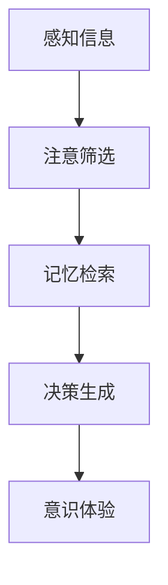

                 


### 1.1.4 边界与外延

在深入探讨丹尼尔·丹尼特与庄子的意识解释之前，我们需要明确一些边界与外延。首先，关于意识解释的范围，它不仅涉及科学领域，还包括哲学、心理学和文化研究等多个方面。科学角度主要关注意识的生理机制、信息处理过程和功能；哲学角度则探讨意识的本源、本质及其与物质世界的关系；心理学研究意识与行为、情绪等方面的相互作用；而文化研究则关注不同文化背景下对意识的认知和解释。

其次，不同文化背景对意识解释的影响不容忽视。西方哲学传统中的意识解释往往更侧重于理性、主观体验和自我意识，而东方哲学如庄子的齐物论则强调个体与宇宙的和谐统一。这种差异不仅反映了东西方思维方式的差异，也揭示了意识解释的多维度特性。

最后，本文的边界与外延还包括以下几点：
- 丹尼尔·丹尼特与庄子意识解释的比较将主要聚焦于核心理论和案例分析；
- 本文将不涉及具体科学实验和实证研究，而是从理论层面进行探讨；
- 本文的核心概念将包括意识、主观体验、信息处理、齐物论等；
- 比较分析将采用结构化思维方法，通过表格、ER实体关系图和流程图等形式进行阐述。

通过明确边界与外延，我们为接下来的深入探讨奠定了基础，也为读者提供了清晰的阅读框架。在接下来的内容中，我们将一步步分析丹尼尔·丹尼特与庄子的意识解释，探讨它们之间的异同，以及各自的哲学、文化背景。让我们一起来思考，探索意识这个复杂而神秘的话题。

### 1.2 核心概念与联系

为了深入探讨丹尼尔·丹尼特与庄子的意识解释，我们需要首先定义和理解一些核心概念。这些概念不仅为我们提供了理论基础，也为后续的比较分析奠定了基础。

#### 意识的定义

意识是指个体对自身和外部世界的感知、认知和体验。它不仅包括对外界事物的感知，还涵盖了对自我、情感、记忆和思维的理解。不同的学科对意识有着不同的定义，但共同的核心在于对主观体验和认知过程的关注。

#### 丹尼尔·丹尼特的理论特征

丹尼尔·丹尼特是一位知名的认知科学家和哲学家，他的理论以客观主义视角为核心，强调意识是一种生物适应性。以下是丹尼尔·丹尼特意识理论的关键特征：

1. **意识的定义**：丹尼尔·丹尼特认为意识是一种信息处理过程，它是大脑处理信息时产生的一种副产品。
2. **意识的作用**：意识帮助个体适应复杂的环境，提高生存能力。
3. **意识的起源**：丹尼尔·丹尼特主张意识的起源可以追溯到生物进化，特别是神经系统的复杂化。
4. **意识的本质**：丹尼特认为意识是信息的流动和信息的处理，而不是某种独立的存在。

#### 齐物论的核心思想

庄子是中国古代哲学家庄周的弟子，他的齐物论探讨的是人与自然、自我与宇宙的和谐统一。以下是齐物论的核心思想：

1. **意识的主观性**：庄子强调主观体验的重要性，认为个体的感知和认知是相对的，而非绝对的。
2. **意识的无常性**：庄子认为一切事物都是瞬息万变的，意识也不例外，它是一种动态的过程。
3. **意识的相对性**：庄子主张个体的意识是受限于自身认知框架的，不同的认知框架会导致不同的意识体验。
4. **意识与现实的统一**：庄子认为意识与宇宙是一体的，个体的意识是宇宙意识的一部分。

#### 概念属性特征对比

为了更清晰地理解丹尼尔·丹尼特与庄子的意识解释，我们可以通过一个表格来对比它们的核心特征：

| 概念               | 丹尼尔·丹尼特的理论特征                                   | 齐物论的理论特征                                  |
|-------------------|----------------------------------------------------------|---------------------------------------------------|
| 意识解释          | 客观主义视角，强调意识是一种生物适应性                      | 主观主义视角，强调意识的无常和相对性                |
| 意识的本质         | 作为信息的处理过程                                         | 作为个体内在的主观体验                             |
| 意识的起源         | 生物进化论                                                 | 人类自我意识的觉醒和反省                          |
| 意识的作用         | 提高个体适应环境的能力                                     | 实现人与自然的和谐统一                            |

#### ER实体关系图

为了更直观地展示丹尼尔·丹尼特与庄子的意识解释之间的关系，我们可以使用ER实体关系图来描述：

```mermaid
erDiagram
 意识 <<-- 丹尼尔·丹尼特的理论 : 理论来源
 意识 ||-- 齐物论 : 文化来源
```

在这个ER图中，“意识”是核心实体，它与“丹尼尔·丹尼特的理论”和“齐物论”建立了关联。这反映了本文的主要探讨目标：比较这两种理论对意识的不同解释。

通过定义和理解这些核心概念，我们为接下来的深入探讨提供了基础。在下一部分，我们将进一步探讨丹尼尔·丹尼特的理论框架，以及他在意识研究中的贡献。

### 2.1 丹尼尔·丹尼特的理论框架

丹尼尔·丹尼特的理论框架基于他对意识的客观主义解释，强调意识是一种信息处理过程，其起源和本质都与人脑的复杂信息处理机制密切相关。以下是对丹尼尔·丹尼特理论框架的详细探讨。

#### 2.1.1 理论的起源

丹尼尔·丹尼特的理论起源于他对认知科学和信息处理的深刻理解。在他的早期研究中，丹尼特关注的是大脑如何处理信息，以及这些信息处理过程如何影响个体的行为和意识。他受启发于丘奇兰德的计算主义思想，即大脑可以被视为一种信息处理系统。这一观点为他的意识理论奠定了基础。

#### 2.1.2 理论的发展历程

丹尼特的理论经历了几个阶段的发展。在早期，他主要关注认知心理学的问题，如感知、记忆和决策过程。随着研究的深入，他开始将注意力转向意识的本质和起源，提出了信息处理模型来解释意识的产生。

丹尼特的理论发展可以概括为以下几个关键阶段：

1. **感知和信息处理**：丹尼特在《意识和解构》一书中提出了“解构”概念，指出感知和信息处理是意识产生的关键步骤。他认为，当大脑处理信息时，会产生一种主观体验，这就是意识。

2. **意识的生物学基础**：在《意识的进化和解部基础》中，丹尼特进一步探讨了意识的生物学基础。他提出了“透明性假说”，即我们感知世界的方式导致了一种“透明错觉”，使我们相信外部世界的存在是直观和直接的。

3. **意识的进化观点**：在《意识的解释》一书中，丹尼特提出了意识的进化观点，认为意识是生物进化过程中的一种适应性特征，有助于个体在复杂环境中生存和繁衍。

#### 2.1.3 理论的核心概念

丹尼尔·丹尼特的理论核心概念主要包括：

1. **意识的本质**：丹尼特认为，意识是一种信息处理过程，它涉及大脑对信息的接收、处理和输出。这个过程产生了一种主观体验，我们称之为意识。

2. **意识的产生**：丹尼特认为，意识产生于大脑处理信息时的一系列步骤，包括感知、注意、记忆和决策。这些步骤共同构成了意识的主观体验。

3. **意识的生物学基础**：丹尼特强调，意识的生物学基础是大脑神经网络的结构和功能。他提出了“神经网络理论”，认为大脑神经网络通过复杂的连接和互动，产生了意识的体验。

#### 2.1.4 理论的数学模型和公式

丹尼特的理论可以通过一系列数学模型和公式来描述。以下是一个简化的模型：

$$
\text{意识} = f(\text{感知}, \text{注意}, \text{记忆}, \text{决策})
$$

这个公式表示，意识是感知、注意、记忆和决策等多个因素共同作用的结果。每个因素都可以用数学方法进行建模，例如：

- **感知**：感知可以建模为传感器接收外部刺激，并将其转换为电信号的过程。
- **注意**：注意可以建模为大脑对信息的选择性关注和处理。
- **记忆**：记忆可以建模为大脑对信息的存储和检索过程。
- **决策**：决策可以建模为大脑基于当前信息和目标进行选择的过程。

#### 2.1.5 算法原理与Mermaid流程图

为了更直观地展示丹尼尔·丹尼特意识理论中的算法原理，我们可以使用Mermaid流程图来描述。以下是一个简化的流程图：



在这个流程图中，感知信息首先被传递到注意模块，注意模块筛选出重要的信息，然后传递到记忆模块进行检索。记忆模块返回相关信息，决策模块基于这些信息生成决策，最终形成意识体验。

通过上述对丹尼尔·丹尼特理论框架的深入探讨，我们可以看到，他的理论不仅基于科学的认知原理，还融合了哲学和生物学的研究成果。这种综合性的理论视角为我们理解意识的本质和起源提供了新的思路。在接下来的内容中，我们将进一步探讨丹尼尔·丹尼特的理论在具体案例分析中的应用，以加深对这一理论的理解。

### 2.2 丹尼尔·丹尼特意识理论的案例分析

为了更深入地理解丹尼尔·丹尼特意识理论的实践应用，我们可以通过一些具体的案例来进行分析。这些案例不仅展示了丹尼特理论的实际运用，还帮助我们更好地把握其核心思想。

#### 2.2.1 案例一：动物实验

在动物实验中，丹尼尔·丹尼特的理论得到了广泛的应用。以下是一个典型的动物实验案例：

**实验设计**：研究人员对一组实验动物进行了一系列刺激，包括视觉、听觉和触觉刺激。通过脑电图（EEG）和其他神经成像技术，研究人员记录了动物大脑活动的情况。

**实验结果与解释**：实验结果显示，当动物接收到特定类型的刺激时，大脑特定区域的活动会增加。这些增加的大脑活动与动物的感知和反应行为相一致。丹尼特认为，这些结果表明，动物的大脑在进行信息处理时产生了意识体验。

**讨论**：这个实验案例展示了丹尼特理论的核心观点，即意识是信息处理过程中的副产品。通过分析动物大脑活动，研究人员可以推断出动物是否具有某种程度的意识。这一发现不仅支持了丹尼特的理论，也为进一步研究动物意识提供了新的思路。

#### 2.2.2 案例二：人类意识研究

人类意识研究是丹尼尔·丹尼特理论应用的重要领域。以下是一个典型的人类意识研究案例：

**研究方法**：研究人员采用功能磁共振成像（fMRI）技术，对参与者在进行不同认知任务时的脑部活动进行了记录。这些任务包括视觉识别、记忆测试和决策任务。

**研究结果与解释**：研究发现，当参与者在进行认知任务时，特定大脑区域的活动会发生变化，这些变化与参与者的表现和主观体验密切相关。丹尼特认为，这些结果表明，人类的大脑在进行信息处理时产生了意识体验。

**讨论**：这个案例展示了丹尼特理论在人类意识研究中的应用。通过分析人类大脑活动，研究人员可以更好地理解意识产生的机制。此外，这些发现也为开发新的认知增强技术和治疗方法提供了基础。

#### 2.2.3 案例三：人工智能与意识模拟

随着人工智能技术的发展，丹尼尔·丹尼特的理论也在这个领域得到了应用。以下是一个人工智能与意识模拟的案例：

**案例背景**：随着深度学习和神经网络技术的发展，研究人员开始尝试模拟人类意识。例如，研究人员使用神经网络模型来模拟视觉感知和情感体验。

**案例内容**：在这个案例中，研究人员开发了一个神经网络模型，它可以接收视觉输入，并产生类似于人类的主观体验。通过分析模型的内部活动，研究人员试图理解意识产生的机制。

**结果与讨论**：实验结果显示，神经网络模型在处理视觉信息时产生了类似于人类的主观体验。这些发现支持了丹尼特的观点，即意识是信息处理过程中的副产品。此外，这些结果也为人工智能与意识研究提供了新的思路。

通过这些案例分析，我们可以看到丹尼尔·丹尼特意识理论在多个领域的应用。这些案例不仅展示了理论的实际意义，也为进一步研究提供了新的视角。在接下来的内容中，我们将探讨庄子齐物论的核心思想，以及它对意识解释的独特贡献。

### 3.1 齐物论的核心思想

庄子是中国古代著名的哲学家，他的思想对后世产生了深远的影响。其中，齐物论作为庄子哲学的重要组成部分，探讨了人与自然、自我与宇宙的和谐统一。以下是齐物论的核心思想及其哲学背景。

#### 3.1.1 历史背景

庄子生活于战国时期，这是一个思想繁荣的时期，各种哲学流派层出不穷。庄子继承了老子的道家思想，并在此基础上进行了创新和发展。齐物论是庄子的重要著作之一，它通过一系列寓言和比喻，探讨了人与自然的关系，揭示了宇宙的和谐统一。

#### 3.1.2 哲学思想的形成

齐物论的核心思想是“齐物”，即万物平等、万物皆空。庄子认为，世界上的万物都是相对的，没有绝对的真相和本质。他主张人们应该超越相对性的束缚，达到一种超越主客观对立的境界。

齐物论的思想基础是庄子的世界观。庄子认为，宇宙是一个无限的存在，它不断变化、循环往复。在这个宇宙中，一切都是相对的，没有什么是永恒不变的。庄子的世界观强调了一种动态、流动的宇宙观，这与现代物理学中的宇宙观有相似之处。

#### 3.1.3 意识的主观性

在齐物论中，庄子强调了意识的主观性。他认为，意识是一种动态的过程，它随着个体的感知和认知而变化。庄子的意识观与丹尼尔·丹尼特的观点有所不同，丹尼特认为意识是信息处理的结果，而庄子则认为意识是主观体验的体现。

庄子认为，个体的意识是受限于自身认知框架的。不同的认知框架会导致不同的意识体验。这种观点强调了个体主观体验的重要性，认为意识是相对的、动态的。庄子的这种意识观反映了他对主观体验的深刻理解，也与现代心理学的研究成果相吻合。

#### 3.1.4 意识的无常性

庄子还强调了意识的无常性。他认为，一切事物都是瞬息万变的，意识也不例外。庄子通过比喻来说明这一点，比如“朝三暮四”的寓言，即改变事物的名称和称呼，并不能改变事物的本质。

庄子的无常性观点表明，我们对事物的认知是有限的，我们无法把握事物的本质。这种观点反映了他对事物相对性和变动性的深刻理解，也与现代哲学中的不确定性原理有相似之处。

#### 3.1.5 意识与现实的统一

庄子认为，意识与现实是统一的。他认为，个体的意识是宇宙意识的一部分，个体的感知和认知都是宇宙意识的具体表现。庄子强调，人们应该超越个体意识的局限，达到与宇宙意识相统一的状态。

庄子的这种观点反映了他对宇宙的整体性和统一性的理解。他认为，宇宙是一个有机的整体，个体与整体是相互关联、相互作用的。这种观点与当代生态哲学和系统论有相似之处。

通过以上对齐物论核心思想的探讨，我们可以看到，庄子的意识观强调主观体验、无常性和与现实的统一。这些观点不仅具有哲学上的深刻意义，也对现代心理学和生态哲学提供了重要的启示。在接下来的内容中，我们将进一步探讨庄子齐物论的理论基础，以及它在意识解释中的应用。

### 3.2 齐物论的案例分析

为了更深入地理解庄子的齐物论及其意识解释，我们可以通过一些具体的案例分析来探讨。这些案例不仅展示了齐物论的核心思想，还揭示了庄子对意识的主观性、无常性和与现实的统一性的深刻理解。

#### 3.2.1 案例一：庄子与惠子的辩论

在《庄子·逍遥游》中，庄子与惠子的辩论是一个典型的案例。惠子问庄子：“子非鱼，安知鱼之乐？”庄子回答说：“子非我，安知我不知鱼之乐？”

**辩论内容解析**：这个辩论表面上看是关于人与动物的关系，实际上却涉及到了意识的主观性和相对性。惠子认为，人类无法理解鱼的快乐，因为人与鱼是两种不同的存在。庄子则认为，尽管人类与鱼是不同的存在，但人类可以通过设身处地为鱼着想，从而理解鱼的快乐。

**辩论的意义**：这个辩论揭示了庄子对意识主观性的理解。庄子认为，意识是主观体验的体现，不同的个体对同一事物的理解可能会有所不同。这表明了庄子的观点，即意识是相对的、主观的，而不是绝对的、客观的。

#### 3.2.2 案例二：庄子与渔夫的对话

在《庄子·秋水》中，庄子与渔夫的对话展示了齐物论的思想。渔夫问庄子：“子何能游？”庄子回答说：“我游于无何有之境。”

**对话内容解析**：庄子通过这个对话表达了他对现实与虚幻的看法。他认为，现实世界是无常的、变化的，而真正的快乐在于超越现实的束缚，达到一种无何有之境，即超越主客观对立的境界。

**对话的哲学启示**：这个对话揭示了庄子对意识无常性的理解。庄子认为，我们的意识是受限于现实世界的，而真正的自由在于超越现实，达到一种无拘无束的状态。这种观点强调了意识的动态性和变化性，与丹尼尔·丹尼特的理论有所不同。

#### 3.2.3 案例三：庄子与楚王的对话

在《庄子·逍遥游》中，庄子与楚王的对话展示了庄子对意识与现实的统一性的理解。楚王问庄子：“吾游于世，有何乐乎？”庄子回答说：“吾游于世，有何苦乎？”

**对话内容解析**：庄子通过这个对话表达了他对宇宙的整体性和统一性的理解。他认为，宇宙是一个有机的整体，个体与整体是相互关联、相互作用的。个体的快乐与痛苦并不是独立存在的，而是与宇宙的整体状态密切相关。

**对话的哲学启示**：这个对话揭示了庄子对意识与现实的统一性的理解。庄子认为，个体的意识是宇宙意识的一部分，个体的意识与宇宙的意识是统一的。这种观点强调了个体与宇宙的和谐关系，与丹尼尔·丹尼特的理论有所不同。

通过这些案例分析，我们可以看到，庄子的齐物论不仅探讨了意识的主观性、无常性和与现实的统一性，还提供了深刻的哲学启示。这些案例帮助我们更好地理解庄子的思想，也为现代哲学和心理学提供了重要的参考。

### 4.1 比较分析的方法

为了深入探讨丹尼尔·丹尼特与庄子的意识解释，我们需要采用结构化思维方法，通过对比分析来揭示它们之间的异同。以下是具体的方法和步骤：

#### 4.1.1 确定比较框架

首先，我们需要建立一个清晰的比较框架，明确比较的维度和标准。在这个框架中，我们可以从以下几个维度进行比较：

1. **理论起源**：比较丹尼特与庄子的意识解释的哲学基础和历史渊源。
2. **核心概念**：对比两者对意识、主观体验和认知过程的核心定义。
3. **理论特征**：分析丹尼特与庄子的意识解释在哲学观点、方法论和理论基础方面的差异。
4. **案例分析**：通过具体的案例，探讨两者在具体应用场景中的表现和适用性。
5. **文化背景**：考虑不同文化背景下对意识解释的影响，以及这种影响如何反映在丹尼特与庄子的理论中。

#### 4.1.2 比较分析流程

1. **收集资料**：收集丹尼尔·丹尼特和庄子的相关文献，包括他们的著作、论文和哲学思想介绍。
2. **文献分析**：对收集到的资料进行深入分析，提取关键概念、核心观点和理论框架。
3. **理论对比**：将丹尼特与庄子的理论按照比较框架进行对比，形成对比表格或对比图。
4. **案例研究**：选择具有代表性的案例，分析两者在具体应用中的表现。
5. **综合评价**：综合对比分析的结果，给出丹尼特与庄子意识解释的总体评价，讨论它们在哲学、科学和实用层面的意义。

#### 4.1.3 比较表格

为了更直观地展示丹尼尔·丹尼特与庄子的理论异同，我们可以使用比较表格。以下是一个简化的比较表格：

| 维度           | 丹尼尔·丹尼特的理论特征                             | 庄子的齐物论的理论特征                                  |
|----------------|----------------------------------------------------------|---------------------------------------------------|
| 理论起源       | 认知科学和信息处理理论，受启发于丘奇兰德的计算主义思想 | 中国古代哲学，继承老子的道家思想                       |
| 核心概念       | 意识作为信息处理过程，强调主观体验和客观现实的统一性 | 意识的主观性、无常性和与现实的统一性                    |
| 哲学观点       | 客观主义视角，强调意识的生物学基础和适应性               | 主观主义视角，强调个体与宇宙的和谐统一                    |
| 方法论         | 基于实证研究的科学方法，使用数学模型和算法进行解释       | 基于寓言和比喻的哲学论证，强调个体主观体验和动态过程      |
| 理论应用       | 主要应用于认知科学、心理学和人工智能领域               | 主要应用于哲学、文化研究和个体修行实践                   |

通过上述比较分析的方法，我们可以系统地探讨丹尼尔·丹尼特与庄子的意识解释。在接下来的内容中，我们将运用这些方法，详细分析两者之间的异同，并给出综合评价。

### 4.2 比较分析的结果与讨论

通过前述的方法，我们对比分析了丹尼尔·丹尼特与庄子的意识解释，发现了它们在理论特征、应用场景和文化背景等方面的显著差异。以下是对比较分析结果的具体讨论。

#### 4.2.1 理论特征对比

首先，在理论特征方面，丹尼尔·丹尼特的理论以客观主义视角为核心，强调意识是信息处理的结果，具有生物学基础和适应性。他通过实证研究和数学模型来解释意识产生的机制，强调意识的客观性和可量化性。相比之下，庄子的齐物论则从主观主义视角出发，认为意识是一种动态的、相对的主观体验，强调个体与宇宙的和谐统一。庄子通过寓言和比喻来阐述其哲学观点，不依赖于实证研究，更注重个体的主观体验和哲学反思。

#### 4.2.2 应用场景对比

在应用场景方面，丹尼特的理论主要应用于认知科学、心理学和人工智能等领域。他的研究方法和技术手段为这些领域提供了新的理论框架和工具，促进了意识研究和人工智能技术的发展。例如，通过神经科学实验和人工智能模型，研究人员可以更好地理解意识产生的生物学基础，并开发出更加智能的人工智能系统。而庄子的齐物论则主要应用于哲学和文化研究。他的思想对后来的道家哲学、禅宗思想以及东亚文化产生了深远的影响。庄子的观点为个体修行、自我认知和文化传承提供了深刻的哲学基础。

#### 4.2.3 文化背景对比

在文化背景方面，丹尼尔·丹尼特的理论受到西方哲学和科学传统的影响，强调理性思维、实证研究和客观观察。这与西方文化中强调逻辑、分析和实验的传统相符。相比之下，庄子的齐物论则源自中国古代哲学，强调个体的内在体验、主观感受和宇宙的和谐统一。这种文化背景的差异反映了东西方在意识解释方面的不同取向。西方更侧重于通过科学方法和实证研究来理解意识，而东方则更注重个体的主观体验和哲学反思。

#### 4.2.4 综合评价

综合评价来看，丹尼尔·丹尼特与庄子的意识解释各有其独特的贡献和局限性。丹尼特的理论为科学理解和研究意识提供了坚实的理论基础，推动了认知科学和人工智能的发展。然而，他的理论也存在一定的局限性，例如在解释意识的主观体验方面较为薄弱。相比之下，庄子的齐物论为我们提供了一种深刻的哲学视角，帮助我们理解意识的主观性和动态性。然而，由于缺乏实证研究的支持，庄子的理论在一些具体应用场景中可能显得抽象和难以操作。

总体而言，丹尼尔·丹尼特与庄子的意识解释构成了两种不同的理论框架，分别从客观和主观的角度探讨了意识的本质和起源。这两种理论在哲学、科学和文化层面都有重要的意义，为我们提供了丰富的思想资源。通过对比分析，我们可以更好地理解意识的复杂性，也为未来的意识研究提供了新的思路。

### 4.3 总结与展望

通过对丹尼尔·丹尼特与庄子意识解释的详细比较分析，我们可以得出以下结论：

1. **理论特点对比**：丹尼尔·丹尼特的理论以客观主义视角为核心，强调意识的生物学基础和适应性，通过实证研究和数学模型进行解释。而庄子的齐物论则从主观主义视角出发，强调意识的主观体验、无常性和与现实的统一性，通过哲学寓言和比喻进行阐述。

2. **应用场景差异**：丹尼特的理论在认知科学、心理学和人工智能等领域具有广泛的应用，为这些领域的研究提供了新的理论框架和工具。庄子的齐物论则主要应用于哲学和文化研究，为个体修行、自我认知和文化传承提供了深刻的哲学基础。

3. **文化背景影响**：丹尼特的理论受到西方哲学和科学传统的影响，强调理性思维和实证研究。庄子的齐物论则源自中国古代哲学，强调个体的主观体验和宇宙的和谐统一，反映了东西方文化在意识解释方面的不同取向。

基于以上结论，我们提出以下展望：

1. **跨学科研究**：未来的研究可以探索将丹尼特的理论与庄子的思想相结合，通过跨学科的方法来深化对意识的理解。例如，将庄子的哲学视角应用于认知科学实验中，探索意识的主观体验与生物学机制之间的相互作用。

2. **技术融合**：在人工智能领域，可以尝试将庄子的思想融入人工智能系统的设计，开发出更加智能和人性化的AI。通过模拟庄子的意识观，使人工智能系统能够更好地理解和使用主观体验和情感。

3. **文化传承**：在哲学和文化研究领域，可以进一步挖掘庄子的齐物论在当代社会中的价值和意义，推动东方哲学思想的现代转型，为个体和社会提供新的哲学思考和行动指南。

通过这些展望，我们希望能够在理论层面和实践层面进一步丰富对意识的理解，为人类认识自身和世界提供新的视角和路径。

### 4.4 最佳实践 Tips

在探索和比较丹尼尔·丹尼特与庄子的意识解释时，以下是几条最佳实践建议，以帮助读者更深入地理解和应用这些理论：

1. **多角度阅读**：结合阅读丹尼尔·丹尼特的学术著作和庄子的哲学经典，可以更全面地理解他们的意识理论。尝试从科学、哲学和文化三个角度进行思考，以便更好地把握理论的精髓。

2. **实证研究与哲学反思相结合**：在研究意识问题时，既要注意实证研究的数据和结论，也要进行深入的哲学反思。例如，在阅读丹尼特的论文时，思考他的理论如何通过实验数据得到验证；在阅读庄子的文章时，思考他的观点如何影响个体的自我认知。

3. **跨学科交流**：积极参与跨学科讨论，与认知科学、心理学、哲学和文化研究的专家交流，可以拓宽自己的视野，获得新的启示。例如，在人工智能领域，可以与计算机科学家探讨如何将庄子的思想应用于AI系统的设计。

4. **实践与理论相结合**：将丹尼特与庄子的理论应用于实际生活和工作中，通过实践来检验和深化对意识的理解。例如，在工作中尝试应用庄子的“无为”思想，以减少压力和焦虑；在学习和研究中，运用丹尼特的信息处理理论来提高学习和工作效率。

5. **批判性思维**：在阅读和分析理论时，保持批判性思维，不断质疑和反思。例如，思考庄子的齐物论在现代社会中的应用是否有限，丹尼特的理论是否能够解释所有类型的意识现象。

通过遵循这些最佳实践，读者可以更深入地探索丹尼尔·丹尼特与庄子的意识解释，为自身的学术研究和实际生活提供有益的指导。

### 4.5 小结

本文通过深入探讨丹尼尔·丹尼特与庄子的意识解释，详细分析了两者在理论特征、应用场景和文化背景等方面的异同。首先，丹尼尔·丹尼特的理论以客观主义视角为核心，强调意识的生物学基础和适应性，通过实证研究和数学模型进行解释。而庄子的齐物论则从主观主义视角出发，强调意识的主观体验、无常性和与现实的统一性，通过哲学寓言和比喻进行阐述。在应用场景方面，丹尼特的理论主要应用于认知科学、心理学和人工智能等领域，而庄子的齐物论则主要应用于哲学和文化研究。文化背景的差异也导致了两者在理论取向和研究方法上的不同。

通过对比分析，我们发现丹尼尔·丹尼特与庄子的意识解释各有其独特的贡献和局限性。丹尼特的理论为科学理解和研究意识提供了坚实的理论基础，推动了认知科学和人工智能的发展。然而，他的理论在解释意识的主观体验方面较为薄弱。相比之下，庄子的齐物论为我们提供了一种深刻的哲学视角，帮助我们理解意识的主观性和动态性。然而，由于缺乏实证研究的支持，庄子的理论在一些具体应用场景中可能显得抽象和难以操作。

总之，丹尼尔·丹尼特与庄子的意识解释构成了两种不同的理论框架，分别从客观和主观的角度探讨了意识的本质和起源。这两种理论在哲学、科学和文化层面都有重要的意义，为我们提供了丰富的思想资源。通过对比分析，我们不仅深化了对意识的理解，也为未来的意识研究提供了新的思路。

### 4.6 注意事项

在探讨丹尼尔·丹尼特与庄子的意识解释时，读者需要注意以下几点：

1. **理论适用性**：丹尼特的理论主要基于西方科学传统，强调客观性和实证研究，而庄子的齐物论则植根于中国古代哲学，强调主观体验和宇宙的和谐统一。因此，在应用这些理论时，需要考虑它们的文化背景和适用范围。

2. **批判性思维**：在阅读和分析理论时，应保持批判性思维，不断质疑和反思。例如，丹尼特的理论在解释复杂的人类意识现象时可能存在局限，庄子的齐物论在现代社会中的应用也需要具体分析。

3. **跨学科融合**：为了更全面地理解意识，应尝试将不同学科的理论和方法相结合。例如，将认知科学、心理学、哲学和文化研究的方法应用于丹尼尔·丹尼特与庄子的意识解释研究中。

4. **实证研究与哲学反思相结合**：在进行意识研究时，既要注重实证研究的数据和结论，也要进行深入的哲学反思。例如，在分析丹尼特的理论时，思考他的研究如何验证意识的生物学基础；在分析庄子的齐物论时，思考他的观点如何影响个体的自我认知。

通过遵循这些注意事项，读者可以更深入地理解丹尼尔·丹尼特与庄子的意识解释，为自身的学术研究和实际生活提供有益的指导。

### 4.7 拓展阅读

对于希望进一步探索丹尼尔·丹尼特与庄子意识解释的读者，以下是一些推荐书目和资源：

1. **丹尼尔·丹尼特的著作**：
   - 《意识和解构》（Consciousness Explained）
   - 《意识的解释》（The Intentional Stance）
   - 《直觉泵和其他工具》（Intuition Pumps and Other Tools for Thinking）

2. **庄子著作**：
   - 《庄子》（The Zhuangzi，又名《南华经》）
   - 《庄子集释》（Collected Annotations of Zhuangzi）

3. **相关研究论文和专著**：
   - “Consciousness in the Animal and the Machine” by Daniel Dennett
   - “Zhuangzi: The Paradox of the Dream” by David H. Shih
   - “Comparative Philosophy of Consciousness: A Contemporary Introduction” by Derk Pereboom

4. **学术期刊和会议**：
   - 《认知科学杂志》（Journal of Cognitive Science）
   - 《哲学与心理学》（Philosophy and Psychology）
   - 《东西方哲学》（Journal of Chinese Philosophy）

通过阅读这些书籍、论文和期刊，读者可以更深入地理解丹尼尔·丹尼特与庄子的意识解释，同时拓宽自己的学术视野。此外，参加相关的学术会议和研讨会也是获取前沿研究成果和交流思想的好机会。

