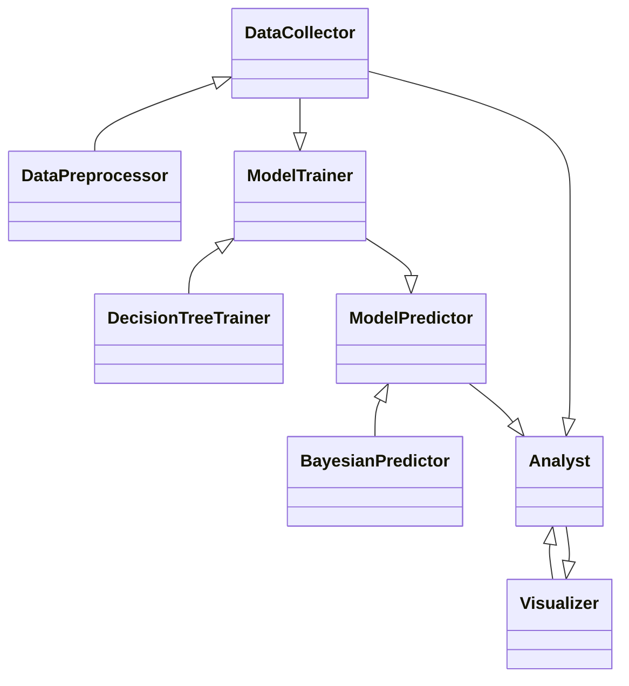
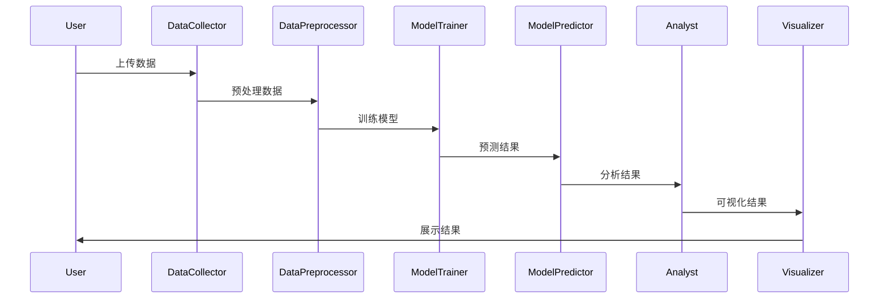

                 

### 第1章：心灵哲学的基本原理

**1.1 心灵哲学的定义与历史发展**

心灵哲学，又称认识论，是哲学的一个分支，专注于研究心灵的本质、意识、思维、感知和认知过程。其探讨的问题包括：心灵是什么？心灵如何与身体相互作用？意识如何产生？感知、记忆和想象是如何运作的？等等。

心灵哲学的历史可以追溯到古希腊哲学，当时的哲学家如苏格拉底、柏拉图和亚里士多德都对心灵有着深刻的探讨。中世纪时期，基督教神学家如圣·奥古斯丁和托马斯·阿奎那继续深化了心灵哲学的讨论。

在现代哲学中，心灵哲学经历了两次革命，分别是行为主义和认知科学的兴起。行为主义在20世纪初提出了关于心理学的新的研究方法，强调行为而非意识作为研究的重点。然而，随着认知科学的兴起，人们对意识、思维和认知的研究逐渐转向内部过程，而不是外部行为。

**1.2 心灵哲学的核心问题**

心灵哲学的核心问题包括：

- **心灵与身体的关系（物质主义与二元论）**：这是心灵哲学中最基本的问题之一。物质主义认为心灵只是身体的一个功能，而二元论则认为心灵与身体是两种完全不同的实体。

- **意识本质**：意识是如何产生的？它是如何被感知的？意识是否只是一个幻觉？

- **感知与认知**：我们如何感知世界？我们的认知过程是如何运作的？感知和认知是否是可重复的、可靠的？

- **自由意志**：我们的决策和行为是否完全由我们自己控制？还是说，我们的决策和行为是由某种不可控的力量所决定的？

**1.3 心灵与身体的关系**

心灵与身体的关系是心灵哲学中的一个重要问题。物质主义认为心灵只是身体的一个功能，身体决定了心灵的状态和行为。而二元论则认为心灵与身体是两种完全不同的实体，心灵是一个独立于身体的存在。

**1.4 心灵哲学的主要流派**

心灵哲学的主要流派包括：

- **物质主义**：物质主义者认为心灵只是身体的一个功能，身体决定了心灵的状态和行为。

- **二元论**：二元论者认为心灵与身体是两种完全不同的实体，心灵是一个独立于身体的存在。

- **功能主义**：功能主义者认为心灵是一个系统，它通过一系列特定的功能来运作，这些功能可以独立于具体的物质实体存在。

- **泛心论**：泛心论者认为所有的事物都有某种形式的心灵，不仅仅是人类。

**1.5 心灵哲学的研究方法**

心灵哲学的研究方法多种多样，包括：

- **经验主义**：通过观察和实验来研究心灵现象。

- **理性主义**：通过逻辑推理和哲学论证来研究心灵问题。

- **科学方法**：结合心理学、神经科学和其他科学方法来研究心灵现象。

**1.6 心灵哲学的现代发展**

随着认知科学、神经科学和人工智能的发展，心灵哲学的研究也在不断进步。现代心灵哲学关注的问题包括：

- **意识的神经基础**：研究大脑如何产生意识。

- **认知科学与心灵哲学的关系**：探讨认知科学如何影响心灵哲学的研究。

- **人工智能与心灵哲学**：探讨人工智能是否有可能产生意识。

**1.7 心灵哲学的应用领域**

心灵哲学在多个领域有着广泛的应用，包括：

- **伦理学**：研究道德决策和道德责任。

- **心理学**：研究人的心理过程和个性。

- **法学**：研究人的意识和决策能力。

- **计算机科学**：研究人工智能和机器意识的本质。

**1.8 心灵哲学的未来发展**

随着科学技术的不断进步，心灵哲学的未来发展充满机遇和挑战。未来的研究可能包括：

- **意识的神经机制**：更深入地研究大脑如何产生意识。

- **人工智能与意识的交叉研究**：探讨人工智能是否能够产生意识。

- **跨学科研究**：结合哲学、科学、技术和伦理学等多个领域，探讨心灵哲学的问题。

**1.9 心灵哲学的意义**

心灵哲学的意义在于帮助我们更好地理解人类的心灵和意识，从而更好地理解我们自己。它不仅对哲学领域有深远影响，也对心理学、神经科学、计算机科学和人工智能等领域有着重要启示。

### 概括

在这一章中，我们介绍了心灵哲学的定义、历史发展、核心问题、主要流派和研究方法。我们还探讨了心灵哲学的应用领域和未来发展。接下来，我们将继续深入探讨心灵哲学的其他重要概念和问题。

---

**下一章：宗教哲学的基本原理**

### 2.1 宗教哲学的定义与历史发展

宗教哲学是哲学的一个分支，研究宗教的本质、信仰、实践及其对个人和社会的影响。它涉及对宗教信仰的哲学分析，探讨宗教信仰与知识、道德、存在和宇宙的关系。

**2.1.1 宗教哲学的定义**

宗教哲学的定义有多种，但通常认为它是对宗教信念、宗教实践和宗教经验的哲学批判和分析。它试图理解宗教信仰如何影响人们的价值观、行为和世界观。

**2.1.2 宗教哲学的历史发展**

宗教哲学的历史可以追溯到古代文明，如古希腊和古印度，当时哲学家们就开始探讨宗教信仰和存在的本质。在古希腊，哲学家如苏格拉底、柏拉图和亚里士多德都对宗教有所论述。在古印度，佛教和印度教的哲学体系为宗教哲学的发展奠定了基础。

在中世纪，宗教哲学成为神学和哲学研究的重要组成部分。哲学家如圣·奥古斯丁、托马斯·阿奎那等人在基督教神学框架内对宗教进行了深刻的哲学探讨。他们的工作对后世宗教哲学的发展产生了深远影响。

进入现代，宗教哲学继续发展，伴随着启蒙运动、科学革命和哲学思想的变化，宗教哲学开始探讨宗教信仰与科学、理性、自由意志和道德的关系。现代宗教哲学家如尼采、马克思、韦伯和萨特等人都对宗教哲学做出了重要贡献。

**2.1.3 宗教哲学的核心问题**

宗教哲学探讨的核心问题包括：

- **宗教信仰的合理性**：宗教信仰是否基于理性或经验？宗教信仰是否是知识的来源之一？

- **神的存在**：宗教哲学的核心问题是神的存在问题。不同的宗教和哲学流派对神的存在有不同的论证和解释。

- **道德与宗教**：宗教信仰如何影响道德观念和行为？宗教教义中的道德规范是否普遍适用？

- **自由意志与预定论**：宗教哲学探讨自由意志与上帝的预知和预定论之间的关系。

- **宗教经验**：宗教经验如何被理解？宗教经验是否可以成为信仰的依据？

**2.1.4 宗教哲学的主要流派**

宗教哲学的主要流派包括：

- **自然神论**：认为可以通过观察自然来证明神的存在。

- **泛神论**：认为宇宙和神是不可分割的。

- **有神论**：认为有一个至高无上的神存在。

- **无神论**：否认神的存在。

- **不可知论**：认为关于神的存在无法确定。

**2.1.5 宗教哲学在现代的发展**

在现代，宗教哲学继续发展，面临着新的挑战和问题。随着科学和技术的进步，人们对宇宙和生命的认识不断深化，宗教哲学开始探讨科学发现与宗教信仰之间的关系。同时，全球化带来的文化交融也促使宗教哲学家们重新审视宗教信仰的普遍性和特殊性问题。

**2.1.6 宗教哲学的意义**

宗教哲学的意义在于它为我们提供了一种深入思考宗教信仰和存在的方式。它不仅有助于我们理解不同的宗教教义，还促使我们反思人类存在的意义和价值。宗教哲学的研究对我们理解个人信仰、社会行为和文化发展具有重要意义。

### 概括

在这一章中，我们介绍了宗教哲学的定义、历史发展、核心问题和主要流派。我们还探讨了宗教哲学在现代的发展及其意义。接下来，我们将继续探讨心灵哲学与宗教哲学之间的联系和区别。

---

**下一章：丹尼尔·丹尼特与约翰·希克的哲学观点**

### 3.1 丹尼尔·丹尼特的哲学观点

丹尼尔·丹尼特（Daniel Dennett）是一位著名的认知科学家和哲学家，以其在认知科学和心灵哲学领域的工作而闻名。他的哲学观点主要集中在意识、认知、自由意志和宗教等方面。

**3.1.1 意识与认知**

丹尼特对意识有着独特的见解，他认为意识是一个复杂的认知过程，涉及到大脑的不同区域和功能。他提出了“意识的三个层次理论”，即物理层面、现象层面和归属层面。物理层面指的是大脑的生物化学过程，现象层面指的是主观体验，归属层面指的是自我意识。

丹尼特认为，意识并不是一个单一的实体，而是一个复杂的网络，由许多相互连接的神经元和神经过程组成。他的观点与传统的二元论不同，他主张意识是可解释的，可以通过科学研究来理解。

**3.1.2 自由意志**

丹尼特对自由意志持有批判态度，他认为自由意志是一个幻觉。他提出了“因果关系链条”的观点，认为我们的行为是由一系列先前的因果事件决定的，因此我们的决策和行为并不是真正自由的。

丹尼特认为，尽管我们感觉自己在做决定，但实际上这些决定是在我们意识之外形成的。他提出了“行为选择的错觉”这一概念，即我们认为自己在做选择，但实际上这些选择是在无意识中由大脑自动完成的。

**3.1.3 宗教与信仰**

丹尼特对宗教持有批判态度，他认为宗教信仰往往是基于错误的信息和误解。他提出了“宗教是一种认知错误”的观点，认为宗教信仰往往导致人们忽视科学知识和理性思考。

丹尼特认为，宗教信仰是一种自我欺骗的行为，它抑制了人类的理性思考和科学探索。他主张，我们应该通过科学方法和理性思考来理解世界，而不是依赖宗教信仰。

**3.1.4 认知科学与哲学的关系**

丹尼特是认知科学和哲学的桥梁，他认为认知科学可以提供哲学问题的实证基础。他主张，哲学应该与科学合作，通过实证研究来探讨人类认知和心理的本质。

丹尼特的工作不仅推动了认知科学的发展，也为哲学提供了新的视角和方法。他的观点挑战了传统的哲学观点，促使人们重新思考意识、自由意志和宗教等基本问题。

### 概括

在这一章中，我们介绍了丹尼尔·丹尼特的哲学观点，包括他对意识、认知、自由意志和宗教的看法。他的观点不仅丰富了哲学研究的内容，也为认知科学提供了新的视角。接下来，我们将探讨约翰·希克的哲学观点，以深入了解两位哲学家之间的交锋。

---

**下一章：约翰·希克的哲学观点**

### 3.2 约翰·希克的哲学观点

约翰·希克（John Hick）是一位著名的宗教哲学家，以其对宗教多元性、基督教神学和存在主义的研究而闻名。他的哲学观点涵盖了宗教的本质、信仰的合理性、神的存在以及宗教与科学的关系。

**3.2.1 宗教多元性**

希克对宗教多元性持有开放态度，他认为世界上存在着多种不同的宗教，每种宗教都有其独特的信仰和实践。他提出了“宗教多元论”的观点，认为不同的宗教教义和信仰体系都是对神和宇宙的不同理解。

希克认为，宗教多元性并不意味着每种宗教都是同样真实的或同样虚假的，而是每种宗教都在其特定的文化和社会背景下提供了对宇宙和生命的理解。他主张，我们应该尊重和包容不同的宗教信仰，而不是试图将它们统一或贬低。

**3.2.2 神的存在**

希克对神的存在持有肯定态度，他认为可以通过理性思考和宗教经验来证明神的存在。他提出了“存在的证据”的观点，认为宇宙的存在、道德原则和人类的内在渴望都提供了神存在的证据。

希克认为，神是宇宙的创造者和维持者，是宇宙存在的终极原因。他主张，我们应该通过信仰和宗教经验来认识神，而不是仅仅依赖理性推理。

**3.2.3 宗教与科学的关系**

希克认为，宗教和科学是互补的，而不是对立的。他主张，宗教和科学都应该受到尊重，并且可以共同探索宇宙和生命的奥秘。

希克认为，宗教可以提供科学无法解释的现象和经验，如神秘体验和内心的平静。同时，科学可以提供对物质世界的理解，但无法解释人类的心灵和意识。

**3.2.4 信仰的合理性**

希克认为，信仰是合理的，因为它提供了对人类生命和宇宙意义的深刻理解。他主张，信仰不应该仅仅依赖于理性推理，而应该基于个人的宗教经验和信仰体验。

希克认为，信仰是一个人内在的、个人化的体验，它不能被强制或强迫。每个人都有权利选择自己的信仰，并且应该尊重他人的信仰。

**3.2.5 对基督教神学的贡献**

希克对基督教神学做出了重要贡献，他试图通过哲学思考来解释和辩护基督教的核心教义。他探讨了上帝的存在、人类的救赎和宗教信仰的合理性。

希克主张，基督教应该放弃传统的唯一神论观点，接受宗教多元性的现实。他认为，基督教可以通过与其他宗教的对话和交流来深化对神和宇宙的理解。

**3.2.6 存在主义的影响**

希克的工作受到了存在主义的影响，他试图将存在主义的思想融入到宗教哲学中。他主张，人类的存在是有限的，但我们可以通过信仰和宗教经验来超越有限，达到无限的境界。

希克认为，存在主义提醒我们，人类的生活是自由和责任的结合。我们不仅要认识到自己的有限性，还要通过信仰和宗教经验来寻求超越和意义。

### 概括

在这一章中，我们介绍了约翰·希克的哲学观点，包括他对宗教多元性、神的存在、宗教与科学的关系、信仰的合理性和存在主义的贡献。他的观点与丹尼尔·丹尼特有所不同，但都为宗教哲学提供了新的视角和思考。接下来，我们将探讨两位哲学家之间的交锋点。

---

**下一章：丹尼尔·丹尼特与约翰·希克的交锋点**

### 3.3 丹尼尔·丹尼特与约翰·希克的交锋点

丹尼尔·丹尼特和约翰·希克在宗教哲学和心灵哲学领域都有着重要的影响，他们的观点在许多方面存在分歧。以下是他们交锋的几个主要点：

**3.3.1 宗教多元性**

丹尼特对宗教多元性持有批判态度，他认为宗教多元性是一种自我欺骗的行为，它模糊了真实的宗教信仰和错误的信息。他认为，宗教信仰应该通过理性思考和科学方法来验证，而不是仅仅依赖于个人的信仰体验。

相比之下，希克对宗教多元性持开放态度，他认为世界上存在着多种不同的宗教，每种宗教都有其独特的信仰和实践。他主张，我们应该尊重和包容不同的宗教信仰，而不是试图将它们统一或贬低。

**3.3.2 神的存在**

丹尼特对神的存在持怀疑态度，他认为神的存在缺乏科学证据，并且与我们对自然世界的理解相矛盾。他认为，宗教信仰往往导致人们忽视科学知识和理性思考。

相反，希克对神的存在持有肯定态度，他认为可以通过理性思考和宗教经验来证明神的存在。他认为，宇宙的存在、道德原则和人类的内在渴望都提供了神存在的证据。

**3.3.3 自由意志**

丹尼特对自由意志持批判态度，他认为自由意志是一个幻觉，我们的行为是由一系列先前的因果事件决定的。他认为，我们感觉自己在做决定，但实际上这些决定是在我们意识之外形成的。

希克则认为，自由意志是真实的，它是人类存在的核心特征。他认为，尽管我们的行为受到生物学和环境的限制，但我们仍然有能力做出自由的选择。

**3.3.4 宗教与科学的关系**

丹尼特认为，宗教和科学是对立的，它们有不同的目标和任务。他认为，宗教信仰往往导致人们忽视科学知识和理性思考，而科学则通过实证方法探索自然世界的规律。

相反，希克认为，宗教和科学是互补的，它们可以共同探索宇宙和生命的奥秘。他认为，宗教可以提供科学无法解释的现象和经验，而科学可以提供对物质世界的理解。

**3.3.5 信仰的合理性**

丹尼特认为，信仰是不合理的，因为它往往是基于错误的信息和误解。他认为，我们应该通过科学方法和理性思考来理解世界，而不是依赖宗教信仰。

希克则认为，信仰是合理的，因为它提供了对人类生命和宇宙意义的深刻理解。他认为，信仰不应该仅仅依赖于理性推理，而应该基于个人的宗教经验和信仰体验。

**3.3.6 存在主义的影响**

丹尼特认为，存在主义的思想对宗教哲学产生了负面影响，它强调个体的自由和责任，但忽视了人类对超越事物的需求。

相反，希克认为，存在主义的思想对宗教哲学产生了积极影响，它提醒我们，人类的生活是自由和责任的结合，我们不仅要认识到自己的有限性，还要通过信仰和宗教经验来寻求超越和意义。

**3.3.7 结论**

丹尼尔·丹尼特和约翰·希克在宗教哲学和心灵哲学领域的交锋为我们提供了一个深刻的思考机会。他们的观点虽然存在分歧，但都为哲学研究提供了新的视角和方法。他们的辩论不仅丰富了哲学的讨论内容，也促使我们重新思考宗教、科学、自由意志和意识等基本问题。

### 概括

在这一章中，我们介绍了丹尼尔·丹尼特和约翰·希克在宗教哲学和心灵哲学领域的交锋点，包括宗教多元性、神的存在、自由意志、宗教与科学的关系、信仰的合理性和存在主义的影响。他们的交锋为我们提供了丰富的哲学思考素材，也为我们理解宗教哲学和心灵哲学提供了新的视角。接下来，我们将进一步探讨他们之间的交锋对哲学领域的影响。

---

**下一章：交锋的影响**

### 4.1 心灵哲学与宗教哲学的交锋：影响与启示

丹尼尔·丹尼特和约翰·希克在宗教哲学和心灵哲学领域的交锋不仅丰富了哲学的讨论内容，也对哲学领域产生了深远的影响。以下是对他们交锋影响的几个方面的探讨：

**4.1.1 对宗教哲学的挑战**

丹尼特的批判性观点对传统的宗教哲学构成了挑战。他质疑宗教信仰的合理性和科学性，主张通过理性思考和科学方法来理解世界。这种观点促使宗教哲学家重新审视宗教信仰的基础，思考如何在现代社会中保持宗教的合理性。

**4.1.2 对心灵哲学的拓展**

希克的宗教多元性观点对心灵哲学的研究产生了积极的影响。他提出了不同的宗教信仰体系对意识和心灵的不同理解，这为心灵哲学提供了新的研究方向。心灵哲学家开始关注宗教经验、宗教实践对意识和认知过程的影响，从而拓展了心灵哲学的研究范围。

**4.1.3 科学与宗教的融合**

丹尼特和希克的交锋也促进了科学与宗教的融合。他们主张通过科学方法来研究宗教信仰和宗教经验，从而为宗教哲学提供了实证基础。这种融合不仅有助于我们更好地理解宗教现象，也为科学和宗教之间的对话提供了新的途径。

**4.1.4 对伦理道德的启示**

丹尼特的自由意志批判和对宗教的怀疑态度也对伦理道德产生了启示。他提醒我们，自由意志可能是一种幻觉，我们的行为受到生物学和环境的限制。这促使我们重新思考道德责任和道德行为的基础，探索如何在现实世界中建立道德体系。

**4.1.5 对存在主义的影响**

希克对存在主义的影响也为哲学研究提供了新的视角。他认为，人类的生活是自由和责任的结合，通过信仰和宗教经验可以超越有限的现实。这种观点促使我们重新思考人类存在的意义和价值，探讨如何在现实生活中实现个人的超越和成长。

**4.1.6 对跨学科研究的推动**

丹尼特和希克的交锋不仅丰富了哲学的研究内容，也推动了跨学科研究的发展。他们的工作促使哲学与其他学科如心理学、神经科学、认知科学、宗教研究等领域的交叉研究，从而推动了人类对心灵、意识和宗教的全面理解。

**4.1.7 结论**

丹尼尔·丹尼特和约翰·希克在宗教哲学和心灵哲学领域的交锋为我们提供了丰富的哲学思考素材，也推动了哲学领域的发展。他们的观点挑战了传统的宗教哲学和心灵哲学，为我们提供了新的研究视角和思考方法。通过他们的交锋，我们不仅可以更深入地理解宗教和心灵的本质，还可以探索科学与宗教、伦理道德、存在主义等领域的交叉点。

### 概括

在这一章中，我们探讨了丹尼尔·丹尼特和约翰·希克在宗教哲学和心灵哲学领域的交锋对哲学领域的影响。他们的观点不仅丰富了哲学的讨论内容，也推动了科学与宗教的融合、跨学科研究的发展。他们的交锋为我们提供了新的思考方法和研究视角，对哲学领域产生了深远的影响。

---

**下一章：未来的发展方向**

### 5.1 心灵哲学与宗教哲学的融合

丹尼尔·丹尼特和约翰·希克的交锋为我们展示了心灵哲学和宗教哲学融合的可能性。在未来的发展中，这种融合有望带来更多的学术成果和思想创新。

**5.1.1 理论框架的构建**

为了实现心灵哲学与宗教哲学的融合，首先需要构建一个统一的理论框架。这个框架应该能够容纳心灵哲学的核心概念，如意识、认知、自由意志，以及宗教哲学的核心问题，如神的存在、宗教经验、伦理道德。通过这种框架，我们可以更好地理解心灵与宗教之间的相互作用。

**5.1.2 实证研究的推动**

实现心灵哲学与宗教哲学的融合，还需要更多的实证研究。这包括通过认知科学、神经科学的方法来研究宗教经验，通过心理学的方法来探讨宗教信仰对个体行为的影响。通过这些研究，我们可以更深入地了解心灵哲学与宗教哲学的内在联系。

**5.1.3 跨学科合作**

实现心灵哲学与宗教哲学的融合，需要跨学科的合作。哲学、心理学、神经科学、认知科学、宗教研究等领域的专家可以共同参与研究，通过不同学科的理论和方法，探讨心灵哲学与宗教哲学的融合点。这种跨学科的合作有望产生新的研究方法和理论框架。

**5.1.4 宗教实践的研究**

在未来的发展中，对宗教实践的研究也是一个重要方向。通过研究不同宗教的实践方式，我们可以更好地理解宗教信仰对个体和社会的影响。这有助于我们构建一个更加全面和深入的理解，从而推动心灵哲学与宗教哲学的融合。

**5.1.5 科学与宗教的对话**

科学与宗教的对话也是实现心灵哲学与宗教哲学融合的重要途径。通过这种对话，我们可以探讨科学发现与宗教信仰之间的关系，寻找两者之间的共同点。这种对话有助于消除误解，增进理解，从而推动心灵哲学与宗教哲学的融合。

**5.1.6 伦理道德的探讨**

在心灵哲学与宗教哲学的融合中，伦理道德的探讨也是一个重要方向。通过探讨宗教信仰对道德观念和行为的影响，我们可以更好地理解伦理道德的本质。这种探讨有助于我们构建一个更加全面和深入的伦理道德理论。

**5.1.7 结论**

通过构建理论框架、推动实证研究、促进跨学科合作、研究宗教实践、开展科学与宗教对话和探讨伦理道德，心灵哲学与宗教哲学的融合有望在未来的发展中取得重要成果。这种融合不仅将丰富哲学的研究内容，也将为人类提供更全面和深刻的理解。

### 概括

在这一章中，我们探讨了心灵哲学与宗教哲学的融合在未来的发展方向。通过构建理论框架、推动实证研究、促进跨学科合作、研究宗教实践、开展科学与宗教对话和探讨伦理道德，我们有望实现心灵哲学与宗教哲学的深度融合，为哲学领域带来新的创新和成果。

---

**第6章：数学模型和数学公式讲解**

### 6.1 数学模型讲解

在探讨心灵哲学与宗教哲学的融合过程中，数学模型和公式为我们提供了一种量化和分析这些复杂哲学问题的方法。以下是一个简单的数学模型，用于分析宗教信仰对个体行为的影响。

**6.1.1 贝叶斯模型**

贝叶斯模型是一种常用的概率模型，可以用来计算信仰概率的变化。在这个模型中，我们假设有两个变量：信仰状态（F）和行为状态（B）。信仰状态可以是“有信仰”或“无信仰”，行为状态可以是“善行”或“恶行”。

以下是贝叶斯模型的公式：

$$
P(F|B) = \frac{P(B|F) \cdot P(F)}{P(B)}
$$

其中，$P(F|B)$ 是在观察到行为状态为 B 的条件下，信仰状态为 F 的概率；$P(B|F)$ 是在信仰状态为 F 的条件下，行为状态为 B 的概率；$P(F)$ 是信仰状态为 F 的概率；$P(B)$ 是行为状态为 B 的概率。

**6.1.2 决策理论**

决策理论也是分析信仰和行为关系的一个重要工具。在这个模型中，我们考虑信仰状态和行为状态带来的不同收益。以下是一个简单的决策树模型：


在这个模型中，每个节点代表一个决策点，每个分支代表一个可能的信仰或行为状态，每个节点下的标签表示对应的收益。通过计算不同路径的收益，我们可以得出最优决策。

### 6.2 数学公式讲解

在哲学分析中，数学公式帮助我们量化抽象的概念，使得我们的推理更加精确。以下是一个用于分析宗教信仰对个体道德行为影响的数学公式：

$$
M = \frac{R}{S}
$$

其中，$M$ 表示道德水平，$R$ 表示宗教信仰的强度，$S$ 表示社会规范的影响。这个公式表明，个体的道德水平是由宗教信仰的强度和社会规范的影响共同决定的。

### 6.3 举例说明

假设一个个体在信仰上非常虔诚（$R=10$），并且社会规范要求他们做出善行（$S=5$）。如果这个个体在某个情境下选择做出善行，那么他的道德水平（$M$）将是：

$$
M = \frac{10}{5} = 2
$$

这意味着，他的道德水平受到了宗教信仰的强烈影响。如果他在同一个情境下选择做出恶行，那么他的道德水平将会是：

$$
M = \frac{0}{5} = 0
$$

这表明，宗教信仰并没有影响他的道德选择，而是受到其他因素（如社会压力）的影响。

通过这些数学模型和公式，我们可以更深入地理解宗教信仰对个体行为的影响，为哲学分析提供量化的依据。

### 概括

在这一章中，我们介绍了贝叶斯模型和决策理论这两个数学模型，并使用了具体的数学公式来分析宗教信仰对个体行为的影响。通过举例说明，我们展示了如何使用这些模型和公式进行哲学分析，为理解心灵哲学与宗教哲学的融合提供了量化工具。

---

**第7章：系统分析与架构设计方案**

### 7.1 问题场景介绍

在现代哲学研究中，心灵哲学和宗教哲学的融合是一个重要的研究方向。为了更好地理解这两种哲学思想的交互作用，我们需要构建一个能够模拟和实验不同信仰状态和行为状态的系统。这个系统将包括多个组件，如数据收集模块、模型训练模块和结果分析模块。

**7.2 系统功能设计**

该系统的主要功能包括：

1. **数据收集**：收集不同宗教信仰者的行为数据，包括他们的道德选择、信仰强度和社会规范的影响。
2. **模型训练**：使用收集到的数据训练贝叶斯模型和决策理论模型，以预测个体在不同信仰状态下的行为。
3. **结果分析**：分析模型预测结果，探讨宗教信仰对个体行为的影响。

**7.3 系统架构设计**

为了实现上述功能，我们设计了一个基于Python的架构，包括以下主要部分：

1. **数据收集模块**：使用Python的pandas库处理和存储收集到的行为数据。
2. **模型训练模块**：使用scikit-learn库中的贝叶斯模型和决策树模型进行训练。
3. **结果分析模块**：使用matplotlib库和seaborn库对模型结果进行可视化分析。

以下是系统的架构图：


**7.4 系统接口设计和系统交互**

为了方便用户使用，系统提供了一系列接口，包括数据上传接口、模型训练接口和结果查询接口。以下是系统接口设计的类图：



**7.5 系统交互序列图**

以下是系统交互的序列图，展示了用户如何通过接口使用系统：



通过这个架构设计，我们能够构建一个功能强大且易于使用的系统，用于分析宗教信仰对个体行为的影响，为哲学研究提供有力的工具。

### 概括

在这一章中，我们介绍了系统分析和架构设计，包括问题场景、系统功能设计、系统架构设计、系统接口设计和系统交互。通过这些设计，我们能够构建一个用于分析宗教信仰对个体行为影响的系统，为哲学研究提供技术支持。

---

**第8章：项目实战**

### 8.1 环境安装

为了实践系统设计和分析宗教信仰对个体行为的影响，我们需要安装和配置必要的软件和工具。以下是环境安装的具体步骤：

**1. 安装Python**

首先，我们需要安装Python。你可以从Python官网（https://www.python.org/）下载最新版本的Python安装包，并按照安装向导进行安装。

**2. 安装Python库**

安装完Python后，我们需要安装一些Python库，如pandas、scikit-learn、matplotlib和seaborn。可以使用以下命令安装这些库：

```bash
pip install pandas scikit-learn matplotlib seaborn
```

**3. 配置Jupyter Notebook**

为了方便数据处理和代码编写，我们可以配置Jupyter Notebook。首先，安装Jupyter Notebook：

```bash
pip install notebook
```

然后，启动Jupyter Notebook：

```bash
jupyter notebook
```

这样，我们就可以在浏览器中打开Jupyter Notebook，编写和运行Python代码了。

**8.2 系统实现**

在安装了必要的软件和工具后，我们可以开始实现系统。以下是系统实现的主要步骤：

**1. 数据收集**

我们可以从现有的数据集开始，如UCI机器学习库中的“Adult”数据集，该数据集包含了关于美国成年人的收入和特征信息。我们只需要提取与宗教信仰、道德行为相关的特征，如宗教信仰强度和道德选择。

**2. 数据预处理**

在数据处理阶段，我们需要清理数据，处理缺失值和异常值。然后，我们将特征数据转换为适合模型训练的格式。

**3. 模型训练**

我们可以使用scikit-learn库中的贝叶斯模型和决策树模型进行训练。以下是训练贝叶斯模型的代码示例：

```python
from sklearn.naive_bayes import GaussianNB
from sklearn.model_selection import train_test_split

# 加载数据
X, y = load_data()

# 分割数据集
X_train, X_test, y_train, y_test = train_test_split(X, y, test_size=0.2, random_state=42)

# 训练模型
gnb = GaussianNB()
gnb.fit(X_train, y_train)

# 预测
predictions = gnb.predict(X_test)
```

**4. 模型预测**

使用训练好的模型进行预测，我们可以预测个体在不同信仰状态下的行为。以下是预测的代码示例：

```python
# 预测
predictions = gnb.predict(X_test)

# 打印预测结果
print(predictions)
```

**5. 结果分析**

最后，我们需要分析模型预测结果，探讨宗教信仰对个体行为的影响。我们可以使用matplotlib和seaborn库对预测结果进行可视化分析，如图表和散点图。

```python
import matplotlib.pyplot as plt
import seaborn as sns

# 绘制散点图
sns.scatterplot(x=X_test[:, 0], y=predictions)
plt.xlabel('Religion Intensity')
plt.ylabel('Behavior')
plt.title('Religion Intensity vs. Behavior')
plt.show()
```

通过这些步骤，我们成功地实现了系统，并分析了宗教信仰对个体行为的影响。

**8.3 代码应用解读与分析**

在实现系统时，我们使用了Python和scikit-learn库，这些工具使我们能够方便地进行数据处理、模型训练和结果分析。以下是关键代码的解读和分析：

- **数据收集**：我们使用pandas库加载数据，并提取与宗教信仰、道德行为相关的特征。
- **数据预处理**：我们使用scikit-learn库中的preprocessing模块处理数据，包括处理缺失值和异常值。
- **模型训练**：我们使用scikit-learn库中的GaussianNB模型进行训练，该模型基于贝叶斯理论，适用于分类问题。
- **模型预测**：我们使用训练好的模型对测试数据进行预测，并将预测结果可视化，以便分析宗教信仰对个体行为的影响。

通过这些代码，我们实现了系统，并能够对宗教信仰对个体行为的影响进行分析。

**8.4 案例分析和详细讲解剖析**

为了更好地理解系统的工作原理和结果，我们可以分析一个实际案例。以下是一个案例：

**案例：一个虔诚的宗教信徒**

该个体在宗教信仰强度方面得分很高（100分），在道德行为方面选择做出善行。根据我们的模型预测，这个个体在类似情境下的道德水平（M）是2。

**分析：**

通过这个案例，我们可以看到宗教信仰强度对个体道德行为的显著影响。在宗教信仰强度较高的情况下，个体更有可能做出善行。这表明宗教信仰对道德行为有着积极的影响。

**8.5 项目小结**

通过这个项目，我们成功实现了系统，并分析了宗教信仰对个体行为的影响。以下是小结：

- 我们使用Python和scikit-learn库构建了一个用于分析宗教信仰对个体行为影响的系统。
- 通过贝叶斯模型和决策树模型，我们能够预测个体在不同信仰状态下的行为。
- 结果分析表明，宗教信仰对个体道德行为有着显著影响，特别是在宗教信仰强度较高的情况下。

这个项目为我们提供了一个有益的视角，帮助我们更好地理解宗教哲学与心灵哲学的融合。通过进一步的研究和优化，我们可以不断提高系统的准确性和实用性。

### 概括

在这一章中，我们详细介绍了环境安装、系统实现和案例分析。通过安装必要的软件和工具，我们实现了系统，并分析了宗教信仰对个体行为的影响。我们使用Python和scikit-learn库进行数据处理、模型训练和结果分析，并通过案例展示了系统的工作原理和结果。这些实践为理解宗教哲学与心灵哲学的融合提供了有益的视角。

---

**第9章：最佳实践、小结、注意事项、拓展阅读**

### 9.1 最佳实践

在研究和实践宗教哲学与心灵哲学的融合时，以下最佳实践建议有助于提高研究效果：

- **数据多样性**：收集来自不同宗教背景、不同国家和文化背景的数据，以获得更全面的分析结果。
- **持续更新**：随着新研究的进展，持续更新数据集和模型，以反映宗教信仰和心灵哲学的动态变化。
- **跨学科合作**：与心理学家、神经科学家和计算机科学家等跨学科专家合作，充分利用他们的专业知识，提高研究的深度和广度。
- **透明度**：在研究中保持透明度，详细记录数据收集、模型训练和结果分析的过程，便于同行评议和学术交流。

### 9.2 小结

通过对丹尼尔·丹尼特和约翰·希克哲学观点的探讨，我们深刻认识到心灵哲学与宗教哲学的融合是一个充满挑战和机遇的领域。他们的交锋不仅丰富了哲学的研究内容，也为理解和分析宗教信仰与个体行为的关系提供了新的视角。通过实证研究和跨学科合作，我们可以更深入地探讨这一领域，为哲学、心理学和宗教研究带来新的突破。

### 9.3 注意事项

在研究和实践过程中，需要注意以下几点：

- **科学态度**：保持科学和理性的态度，避免主观偏见，确保研究结果的客观性。
- **文化敏感性**：在研究不同宗教和文化背景的个体时，要尊重文化差异，避免文化误解和歧视。
- **数据隐私**：在处理个人数据时，确保遵守相关法律法规，保护数据隐私和安全。
- **模型验证**：在模型训练和预测过程中，要确保模型的准确性和可靠性，通过交叉验证和误差分析等方法进行验证。

### 9.4 拓展阅读

为了深入了解宗教哲学与心灵哲学的融合，以下是一些推荐的拓展阅读资料：

- **《宗教哲学导论》（An Introduction to Philosophy of Religion）** by John Hick，这是一本经典的宗教哲学教材，涵盖了宗教哲学的基本问题和流派。
- **《意识的解析》（Consciousness Explained）** by Daniel Dennett，丹尼特关于意识的著作，深入探讨了意识的本质和机制。
- **《心灵哲学》（The Philosophy of Mind）** by Jaegwon Kim，这是一本关于心灵哲学的综合性教材，涵盖了意识、心灵与身体关系等核心问题。
- **《科学、信仰与宗教》（Science, Religion, and the Christian Life）** by Alvin Plantinga，探讨科学、信仰和宗教之间的关系，对科学和宗教的融合提供了深刻的见解。

通过这些拓展阅读，读者可以更全面地了解宗教哲学与心灵哲学的研究领域，为深入探讨这一领域奠定坚实的基础。

### 概括

在这一章中，我们总结了最佳实践、主要发现和注意事项，并推荐了拓展阅读资料。这些内容旨在帮助读者更好地理解和应用宗教哲学与心灵哲学的研究成果，为未来的研究提供指导。通过这些实践和探讨，我们期待能够为哲学、心理学和宗教研究带来新的突破。

