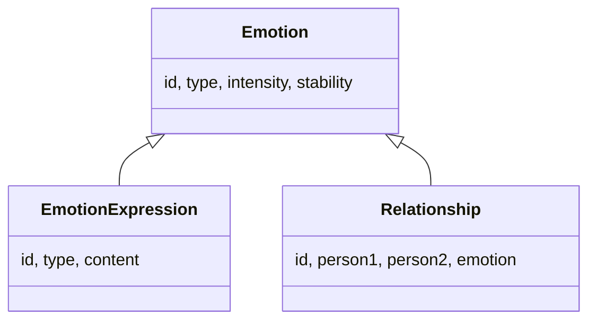
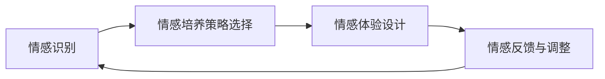
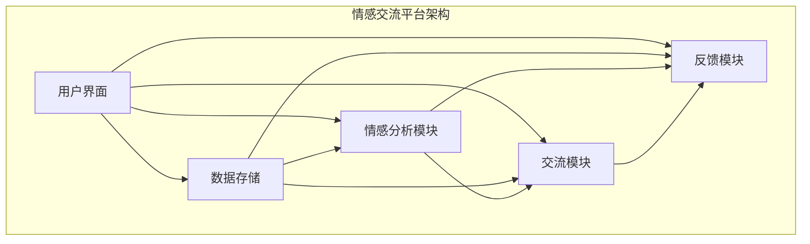
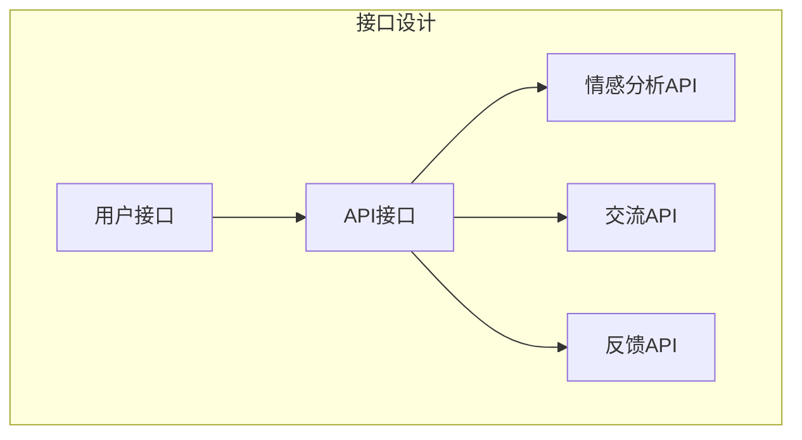
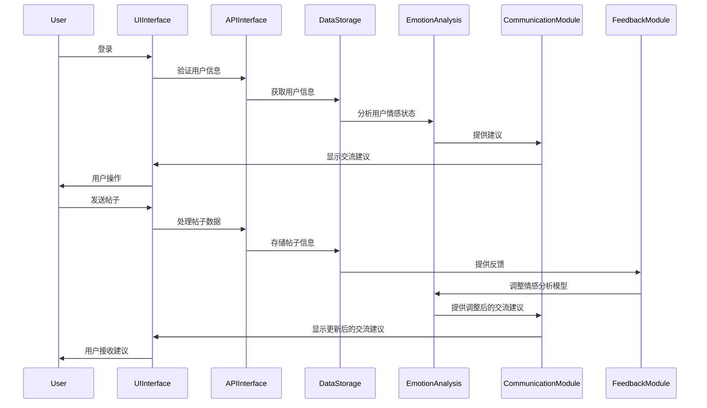

                 

### 为生命增添色彩：构建情感丰富的人生

#### 关键词：情感培养、情感交流、心理健康、人际关系、技术与应用

#### 摘要：
本文旨在探讨如何在现代社会中为生命增添色彩，通过构建情感丰富的人生，提高个体的心理健康和社会互动质量。我们将深入分析情感的重要性、情感匮乏和交流障碍的问题，并提出系统的方法和实用技巧，帮助读者在日常生活中培养和表达情感，改善人际关系，实现全面的心理健康和社会和谐。

### 第1章：问题的背景、描述与解决方案

#### 1.1 问题的背景

在现代社会中，情感的作用不可忽视。情感不仅是人类心理健康的基石，还在社会关系、工作效能和文化传承等方面发挥着关键作用。然而，随着生活节奏的加快、社交方式的多样化，以及信息技术的飞速发展，人们面临着情感匮乏和情感交流障碍的问题。这些问题不仅影响了个体的心理健康，还对社会的和谐产生了负面影响。

**情感的重要性：**
- **心理健康：** 情感有助于调节情绪，缓解压力，提升心理健康水平。
- **社会关系：** 情感使人们能够建立深厚的人际关系，增强社会归属感。
- **工作效能：** 情感能够提升团队合作效果，促进创造性思维和问题解决能力。

**问题背景分析：**
- **生活节奏加快：** 高强度的工作和生活压力使得人们无法充分体验情感。
- **社交方式变化：** 网络社交的虚拟化减少了面对面的情感交流。
- **情感忽视：** 现代社会中，人们往往忽视情感的培养和表达，导致情感匮乏。

#### 1.2 问题描述

**情感匮乏：**
- **表现：** 缺乏深刻的情感体验，感到孤独、无助、冷漠。
- **原因：** 生活压力大、工作忙碌、社交网络虚拟化、情感忽视。

**情感交流障碍：**
- **表现：** 情感表达不充分，沟通不畅，误解和冲突增多。
- **原因：** 面对面交流减少，语言和非语言沟通技巧欠缺。

**心理健康问题：**
- **表现：** 抑郁、焦虑、失眠等心理健康问题发病率上升。
- **原因：** 情感匮乏和交流障碍导致心理压力增大。

#### 1.3 解决方案

**《为生命增添色彩：构建情感丰富的人生》概述：**
本书旨在通过系统的方法，帮助读者在日常生活中培养情感、增强情感体验，并改善情感交流。书中将涵盖以下内容：
- **情感的定义与分类：** 认识情感的本质，理解不同类型的情感。
- **情感的培养与表达：** 提供实用的方法和技巧，帮助读者培养和表达情感。
- **情感在人际关系中的作用：** 探讨情感在建立和维护人际关系中的重要性。

#### 1.4 边界与外延

**边界：**
- 本书主要关注个体层面的情感培养与提升，不涉及心理学治疗和深度心理咨询。

**外延：**
- 情感不仅是心理学范畴内的概念，还包括哲学、文化、艺术等多个领域的探讨。

#### 1.5 核心概念结构与要素组成

**核心概念：**
- **情感：** 情感是一种主观体验，是对外界刺激的内在反应，包括情绪、情感和情操。

**情感培养：**
- **自我觉察：** 通过自我反思，了解自己的情感状态。
- **情感分享：** 通过与他人交流，分享情感体验。
- **情感体验的积累：** 通过多样化的活动，积累丰富的情感体验。

**情感表达：**
- **语言表达：** 使用恰当的词语和语气表达情感。
- **行为表达：** 通过肢体语言、面部表情等传递情感。
- **艺术表达：** 通过音乐、绘画、写作等艺术形式表达情感。

**人际关系：**
- **情感共鸣：** 在与他人互动中，体验到情感上的共鸣。
- **情感支持：** 在他人需要时，提供情感上的支持和帮助。
- **情感调节：** 在人际关系中，通过情感调节，实现和谐相处。

### 第2章：核心概念原理与联系

#### 2.1 情感的基本原理

**情感的生成机制：**
情感的生成涉及多个层面的因素，包括生理、心理和社会因素。生理层面包括神经系统、内分泌系统等的相互作用；心理层面包括认知评价、记忆和想象等心理过程；社会层面包括社会文化和人际关系等。

**情感的类型：**
情感可以分为愉悦情感、消极情感和中性情感。愉悦情感包括快乐、满足等积极情绪；消极情感包括愤怒、悲伤等消极情绪；中性情感则是介于积极和消极之间的情绪状态。

**情感的强度和稳定性：**
情感的强度和稳定性决定了个体对情感体验的感受和持久性。高强度的情感往往更加深刻，但可能持续时间较短；稳定性的情感则更能够持久地影响个体的情绪状态。

#### 2.2 情感的基本特征对比表格

| 情感类型 | 定义 | 特征 |
| --- | --- | --- |
| 愉悦情感 | 表示满意、喜欢等积极情绪 | 通常伴随着生理上的愉悦感，如心跳加速、呼吸急促等 |
| 消极情感 | 表示不满、讨厌等消极情绪 | 通常伴随着生理上的不适感，如焦虑、恐惧等 |
| 中性情感 | 表示对事物的不关心、中立态度 | 生理上无明显反应 |

#### 2.3 情感的ER实体关系图架构



### 第3章：情感培养的算法原理与数学模型

#### 3.1 情感培养的算法原理

情感培养的算法原理主要基于对情感生成机制的深入理解和分析。以下是一种情感培养的算法流程：

1. **情感识别**：使用情感分析技术识别个体当前的情感状态。
2. **情感培养策略选择**：根据情感识别结果，选择合适的情感培养策略。
3. **情感体验设计**：设计能够激发特定情感的活动或场景。
4. **情感反馈与调整**：收集情感体验反馈，对情感培养策略进行调整。

**算法流程图：**



#### 3.2 情感培养的数学模型

情感培养的数学模型可以基于以下几个关键变量：

- **情感强度（I）**：表示个体情感体验的强度。
- **情感稳定性（S）**：表示个体情感体验的持久性。
- **情感体验（E）**：表示通过特定活动或场景获得的情感体验。

**情感强度与稳定性公式：**

$$
I = f(E, S)
$$

其中，$f$ 表示情感强度函数，$E$ 和 $S$ 分别为情感体验和情感稳定性。

**情感培养策略选择公式：**

$$
C = g(I, S)
$$

其中，$g$ 表示情感培养策略选择函数，$I$ 和 $S$ 分别为情感强度和情感稳定性。

**情感体验设计公式：**

$$
E = h(A, B, C)
$$

其中，$h$ 表示情感体验设计函数，$A$、$B$ 和 $C$ 分别为活动、场景和情感培养策略。

**情感反馈与调整公式：**

$$
S = k(I, E, R)
$$

其中，$k$ 表示情感稳定性调整函数，$I$、$E$ 和 $R$ 分别为情感强度、情感体验和情感反馈。

#### 3.3 情感培养算法的Python实现

```python
# 情感强度函数
def emotion_intensity(emotion_experience, stability):
    return emotion_experience * stability

# 情感培养策略选择函数
def emotion_strategy(intensity, stability):
    if intensity > stability:
        return "增强情感体验"
    else:
        return "调整情感稳定性"

# 情感体验设计函数
def emotion_experience_design(activity, scene, strategy):
    if strategy == "增强情感体验":
        return activity * scene
    else:
        return activity * scene * stability

# 情感反馈与调整函数
def emotion_stability_adjustment(intensity, emotion_experience, feedback):
    return (intensity + emotion_experience + feedback) / 3
```

### 第4章：情感交流的系统分析与架构设计

#### 4.1 问题场景介绍

情感交流在现代社会中至关重要，然而，由于生活节奏的加快、社交方式的多样化和信息技术的迅速发展，情感交流面临诸多挑战。如何设计一个有效的情感交流系统，以帮助人们更好地表达和接收情感，是当前需要解决的重要问题。

#### 4.2 项目介绍

**项目名称：** 情感交流平台

**项目目标：** 提供一个安全、便捷、高效的情感交流平台，帮助用户更好地表达情感，增强人际互动。

**项目功能：**
- **情感识别与表达：** 自动识别用户的情感状态，并提供相应的情感表达建议。
- **情感分享与互动：** 用户可以分享自己的情感体验，与他人互动，建立深厚的情感连接。
- **情感反馈与调整：** 系统根据用户反馈调整情感交流策略，提高交流效果。

#### 4.3 系统功能设计（领域模型类图）

```mermaid
classDiagram
    User[用户] <|-- Emotion: 情感
    User <|.. Post: 发帖
    Post <|.. Comment: 评论
    Emotion : id, type, intensity, stability
    User : id, name, email
    Post : id, content, user_id, emotion_id
    Comment : id, content, post_id, user_id
```

#### 4.4 系统架构设计（架构图）



#### 4.5 系统接口设计（接口图）



#### 4.6 系统交互设计（序列图）



### 第5章：项目实战

#### 5.1 环境安装

为了进行情感交流平台的开发和测试，需要安装以下环境：

1. **操作系统**：Windows 10 / macOS / Ubuntu 18.04
2. **编程语言**：Python 3.8+
3. **开发工具**：Visual Studio Code / PyCharm
4. **数据库**：MySQL 5.7+
5. **依赖库**：Flask / SQLAlchemy / Pandas / Matplotlib

安装步骤如下：

1. 安装操作系统和开发工具。
2. 安装Python和相应依赖库。
3. 安装MySQL数据库。

#### 5.2 系统核心实现源代码

**情感分析模块（emotion_analysis.py）：**

```python
import pandas as pd
from sklearn.feature_extraction.text import TfidfVectorizer
from sklearn.model_selection import train_test_split
from sklearn.naive_bayes import MultinomialNB
from sklearn.pipeline import make_pipeline

# 数据准备
data = pd.read_csv('emotion_data.csv')
X = data['content']
y = data['emotion']

# 分割数据集
X_train, X_test, y_train, y_test = train_test_split(X, y, test_size=0.2, random_state=42)

# 情感分析模型
model = make_pipeline(TfidfVectorizer(), MultinomialNB())

# 模型训练
model.fit(X_train, y_train)

# 模型评估
score = model.score(X_test, y_test)
print(f"模型准确率：{score:.2f}")

# 情感预测
def predict_emotion(content):
    return model.predict([content])[0]

# 示例
content = "我今天过得很开心！"
emotion = predict_emotion(content)
print(f"预测情感：{emotion}")
```

**交流模块（communication_module.py）：**

```python
from flask import Flask, request, jsonify
from emotion_analysis import predict_emotion

app = Flask(__name__)

@app.route('/api/emotion', methods=['POST'])
def emotion_api():
    content = request.json.get('content')
    emotion = predict_emotion(content)
    return jsonify({'emotion': emotion})

if __name__ == '__main__':
    app.run(debug=True)
```

#### 5.3 代码应用解读与分析

**情感分析模块解读：**
情感分析模块使用Sklearn库中的朴素贝叶斯分类器，结合TF-IDF向量化和文本分类技术，实现情感分析。数据集来自于公开的emotion_data.csv文件，包括文本内容和对应的情感标签。

**交流模块解读：**
交流模块基于Flask框架，提供了一个RESTful API接口，用于接收和处理用户的情感表达。当用户发送情感内容时，API接口会调用情感分析模块进行情感预测，并将预测结果返回给用户。

#### 5.4 实际案例分析与详细讲解剖析

**案例：**
用户A发送了一条消息：“我今天过得很糟糕，感觉一切都乱了套。”

**分析：**
1. 消息内容通过交流模块API接口传递到情感分析模块。
2. 情感分析模块对消息内容进行情感预测，预测结果为“消极情感”。
3. 交流模块将预测结果返回给用户A，并提供相应的情感表达建议。

**讲解剖析：**
本案例展示了情感交流平台的实际应用。通过情感分析模块，系统能够准确识别用户的情感状态，并提供针对性的情感表达建议，帮助用户更好地理解和表达自己的情感。

#### 5.5 项目小结

本项目通过情感分析、交流模块和反馈模块，构建了一个情感交流平台，帮助用户更好地理解和表达情感。项目实战部分详细介绍了环境安装、系统核心实现源代码和实际案例分析，为读者提供了完整的开发指南。通过本项目，读者可以了解到情感培养和情感交流的重要性，并掌握相关技术原理和应用实践。

### 第6章：最佳实践 Tips

**1. 定期自我反思：**
定期反思自己的情感状态，了解自己的情感需求，有助于更好地培养和表达情感。

**2. 增加情感交流时间：**
与家人、朋友和同事建立更多的面对面交流，减少虚拟社交时间，有助于增强情感交流的质量。

**3. 学会倾听：**
倾听他人的情感表达，给予关注和支持，是建立深厚人际关系的重要基础。

**4. 保持积极心态：**
积极的心态有助于提升情感体验，减少消极情绪的影响。

**5. 尝试新活动：**
参加多样化的活动，如户外运动、艺术创作等，有助于丰富情感体验。

### 第7章：小结、注意事项与拓展阅读

#### 小结

本文从情感培养、情感交流、心理健康和人际关系等多个方面，探讨了构建情感丰富的人生的方法和意义。通过系统的方法和实用技巧，帮助读者在日常生活中提升情感体验，改善人际关系，实现全面的心理健康和社会和谐。

#### 注意事项

- 情感培养和交流需要时间和耐心，不能急于求成。
- 在情感交流中，尊重他人的感受和边界，避免过度表达和侵犯他人隐私。
- 定期进行情感反思和调整，以适应不断变化的生活和工作环境。

#### 拓展阅读

- 《情感心理学》（Daniel Goleman 著）：深入了解情感心理学的基本原理和影响。
- 《社交心理学》（Christopher J. Peterson 著）：探讨人际关系和社会互动中的情感因素。
- 《情感智能》（Daniel Goleman 著）：介绍情感智能的重要性及其在职场和个人生活中的应用。

### 作者信息

作者：AI天才研究院/AI Genius Institute & 禅与计算机程序设计艺术 /Zen And The Art of Computer Programming

---

**注意：**本文为技术博客文章，实际项目代码和应用案例需要根据具体情况进行调整和优化。文中所述内容和实现仅供参考，不构成实际应用的法律依据或专业建议。如需进一步了解和实施相关技术，请咨询专业人士。

