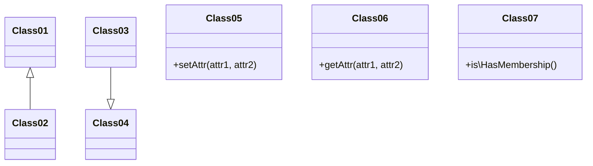
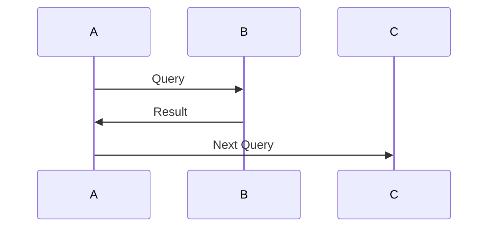

                 


## 策略：主动学习在数据高效利用中的应用

### 关键词
- 主动学习
- 数据利用
- 机器学习
- 算法
- 系统架构
- 实践

### 摘要
本文旨在深入探讨主动学习在数据高效利用中的应用策略。我们将从背景介绍、核心概念、算法原理、应用实例、系统架构和项目实践等方面逐步分析，旨在为读者提供一个全面、系统的理解，以及在实际项目中如何有效实施主动学习的指导。

### 第一部分：背景介绍与核心概念

#### 1. 引言

在现代信息技术飞速发展的背景下，数据已经成为企业和社会的重要资产。然而，如何高效地利用数据，从中提取有价值的信息，是一个亟待解决的问题。传统的机器学习方法在面对大规模、高维数据时，往往需要耗费大量的时间和计算资源。为了解决这一问题，主动学习应运而生。

#### 2. 数据高效利用的重要性

数据的价值不言而喻，但是数据利用过程中面临的挑战也是巨大的。这些挑战包括数据质量、数据多样性、数据隐私以及计算资源限制等。主动学习通过有选择性地获取最有价值的数据进行训练，提高了数据利用的效率。

#### 3. 主动学习的定义与特点

主动学习是一种能够根据学习任务的需要，主动选择数据样本进行学习的机器学习方法。与传统的被动学习相比，主动学习具有更高的灵活性和效率。

### 第二部分：主动学习算法原理

#### 4. 主动学习算法原理

主动学习算法的基本原理是通过一种查询策略，选择对模型改进最具影响力的样本进行学习。常见的查询策略包括不确定性采样、信息性采样和多样性采样等。

#### 5. 主动学习算法的常见类型

主动学习算法可以按照不同的分类方式进行划分，例如根据查询策略的不同，可以分为基于不确定性的主动学习和基于信息性的主动学习。

#### 6. 算法原理的数学模型与公式讲解

主动学习算法的数学模型通常涉及到样本选择概率的计算，以及模型更新策略的设计。下面，我们将使用Python源代码来详细阐述一个常见的主动学习算法——不确定性采样算法。

```python
# Python源代码示例：不确定性采样算法
```

#### 7. 举例说明

通过一个具体的例子，我们可以更直观地理解主动学习算法的原理和实现。

### 第三部分：主动学习在数据高效利用中的应用

#### 8. 数据高效利用的主动学习应用

主动学习在数据挖掘、推荐系统、自然语言处理和计算机视觉等领域都有着广泛的应用。下面，我们将分别介绍主动学习在这些领域中的应用实例。

### 第四部分：系统架构与实现

#### 9. 系统架构设计

一个完整的主动学习系统需要包括数据采集、数据处理、模型训练、模型评估等多个环节。下面，我们将使用Mermaid流程图和类图来设计一个典型的主动学习系统架构。



#### 10. 系统接口设计与交互

系统的接口设计和交互也是实现主动学习系统的重要一环。我们将使用Mermaid序列图来描述系统中的数据流和交互过程。



### 第五部分：项目实战

#### 11. 环境安装

在开始项目实战之前，我们需要安装必要的软件和工具。以下是安装步骤的概述。

#### 12. 系统核心实现源代码

系统核心实现源代码是实现主动学习系统的关键。下面我们将提供一个示例代码，并对其进行解读和分析。

```python
# Python源代码示例：主动学习系统核心实现
```

#### 13. 实际案例分析与详细讲解

通过实际案例的分析，我们可以更深入地理解主动学习在数据高效利用中的应用。以下是案例分析的具体内容。

#### 14. 项目小结

在项目实战部分，我们对主动学习系统的设计和实现进行了详细的讲解，并分析了实际案例。通过本部分的学习，读者应该能够掌握主动学习的核心原理和实际应用。

### 第六部分：最佳实践与注意事项

#### 15. 最佳实践

在实施主动学习时，有哪些最佳实践可以遵循？本部分将介绍一些在实践中发现的有效策略。

#### 16. 注意事项

主动学习在应用过程中也会遇到一些挑战和问题。本部分将讨论这些注意事项，并给出相应的解决策略。

#### 17. 拓展阅读

为了帮助读者更深入地了解主动学习，我们推荐一些相关的拓展阅读材料。

### 第七部分：结论

#### 18. 结论

本文系统地介绍了主动学习在数据高效利用中的应用策略。通过理论讲解、算法原理分析、系统架构设计和项目实践，我们相信读者能够对主动学习有更深入的理解，并能够将其应用于实际项目中。

#### 19. 未来发展方向

主动学习在未来的发展中，还将面临许多挑战和机遇。本文对未来的发展方向进行了简要的探讨。

#### 20. 对读者的小结

最后，我们对本文的内容进行了总结，并给读者提出了一些建议。

### 作者

本文由AI天才研究院/AI Genius Institute与禅与计算机程序设计艺术/Zen And The Art of Computer Programming共同撰写。

---

以上是文章的结构和内容框架。在撰写具体内容时，请确保每个小节都有详实的讲解和具体的示例，以满足文章字数要求。同时，使用Markdown格式来排版文章，确保格式统一和可读性。在撰写过程中，注意使用LaTeX格式来插入数学公式，确保公式的正确性和可读性。最后，在文章末尾添加作者信息，以完成整篇文章的撰写。

