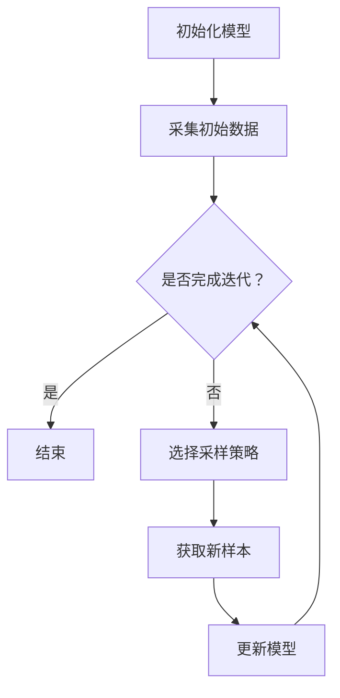

                 

### 第1章：背景介绍

## 1.1 问题背景

### 1.1.1 药物研发的瓶颈

药物研发是一项复杂而耗时的过程，涉及到多个学科领域，包括生物学、化学、物理学和计算机科学。目前，药物研发面临的主要瓶颈包括：

1. **高成本**：新药研发的成本逐年攀升，动辄数十亿乃至上百亿美元。这主要是因为新药研发过程中需要进行大量的前期研究、临床试验和后期监管。
2. **长周期**：新药从研发到上市通常需要10-15年，这期间的科研投入巨大，而且失败的风险也很高。
3. **低成功率**：尽管投入巨大，但成功研发出新药的概率却非常低，据统计，平均成功率约为10%。

这些瓶颈严重制约了新药的研制进度，导致药物研发效率低下，难以满足公众对药物的需求。

### 1.1.2 高通量药物筛选的概念

高通量药物筛选（High-Throughput Screening，HTS）是一种利用自动化技术进行大规模药物筛选的方法。与传统方法相比，HTS具有以下特点：

1. **高速度**：HTS通过自动化设备可以同时对成千上万的化合物进行筛选，大大提高了药物筛选的速度。
2. **高效率**：与传统的小规模筛选方法相比，HTS可以在更短的时间内筛选出更多的潜在药物候选物。
3. **高成本效益**：虽然HTS的设备成本较高，但通过大规模筛选，可以在早期阶段排除大量无效化合物，从而降低后期研发成本。

高通量药物筛选的原理是利用生物传感器、荧光探针或高通量测序等技术，快速检测化合物与生物靶标（如蛋白质、细胞等）的相互作用，从而筛选出具有潜在药理活性的化合物。

### 1.1.3 主动学习的概念

主动学习（Active Learning）是一种数据驱动的学习方法，旨在通过用户干预来优化模型性能。与传统的被动学习相比，主动学习在训练过程中能够动态选择样本，从而提高模型的泛化能力。主动学习的关键在于样本选择策略，即如何从大量未标注的数据中选择最有价值的样本进行标注。

在药物筛选中，主动学习的应用主要体现在以下几个方面：

1. **样本选择**：通过主动学习，可以选择具有潜在药理活性的化合物进行进一步研究，从而提高筛选效率。
2. **模型优化**：主动学习可以用于优化药物筛选模型，通过不断迭代，使模型在有限的样本下达到更高的准确性。

### 1.1.4 主动学习与高通量药物筛选的结合

主动学习与高通量药物筛选的结合具有以下优势：

1. **提高筛选准确率**：主动学习可以根据模型的预测不确定性，选择最具代表性的样本进行标注，从而提高筛选模型的准确性。
2. **降低样本数量要求**：通过主动学习，可以在有限的样本下训练出性能优良的模型，从而降低对大量样本的需求。
3. **缩短研发周期**：主动学习可以加速药物筛选过程，缩短新药研发周期，降低研发成本。

综上所述，主动学习在药物筛选中的应用，不仅能够提高筛选效率，还能优化模型性能，对于解决药物研发中的瓶颈具有重要意义。

## 第2章：主动学习的核心概念与原理

### 2.1 核心概念

#### 2.1.1 样本选择策略

在主动学习中，样本选择策略是至关重要的。选择合适的样本可以显著提高模型的性能和泛化能力。常见的样本选择策略包括：

1. **不确定性采样（Uncertainty Sampling）**：根据模型预测的不确定性来选择样本。模型预测不确定性高的样本更有可能是未知的或重要的。
2. **多样性采样（Diversity Sampling）**：通过选择不同特征的样本，确保样本集的多样性，从而避免模型过拟合。
3. **最大化信息增益（Maximum Information Gain）**：根据样本对模型预测的边际贡献来选择样本，最大化模型对新信息的获取。

#### 2.1.2 主动学习的优化目标

主动学习的优化目标通常是最小化预测误差或最大化模型准确性。在有限的样本下，如何最大化模型的性能是一个关键问题。常见的优化目标包括：

1. **最小化预测误差**：目标是使模型的预测误差最小化，即模型对已知样本的预测结果与实际标签的差距最小。
2. **最大化模型准确性**：目标是使模型的预测准确性最大化，即模型对未知样本的预测结果与实际标签的匹配度最高。

### 2.2 原理讲解

#### 2.2.1 数学模型

主动学习的数学模型通常基于损失函数，如对数损失函数。对数损失函数的表达式如下：

$$L(\theta) = -\sum_{i=1}^{n} y_i(\theta) \log(\hat{y}_i(\theta))$$

其中，$L(\theta)$ 是损失函数，$\theta$ 是模型参数，$y_i(\theta)$ 是模型对第 $i$ 个样本的预测，$\hat{y}_i(\theta)$ 是第 $i$ 个样本的真实标签。

#### 2.2.2 算法流程

主动学习的算法流程可以概括为以下几个步骤：

1. **初始化模型**：选择一个基础的模型并进行初始化。
2. **采集初始数据**：从未标注的数据集中随机采集一定数量的样本。
3. **选择采样策略**：根据当前模型的预测不确定性、样本的多样性或信息增益等策略选择新的样本。
4. **获取新样本**：将选择的样本送入模型进行标注，并更新模型参数。
5. **更新模型**：使用标注后的样本重新训练模型。
6. **判断是否完成迭代**：若满足终止条件（如达到预设的迭代次数或模型性能不再提升），则结束；否则，返回步骤3。

使用Mermaid流程图可以表示为：

通过上述步骤，主动学习可以在有限的样本下逐步优化模型性能，从而提高药物筛选的准确性和效率。

### 2.3 实例说明

为了更好地理解主动学习，我们可以通过一个简化的例子来说明其工作原理。假设我们有一个药物筛选任务，目标是预测化合物对特定靶点的活性。

1. **初始化模型**：我们选择一个简单的线性回归模型作为初始模型。
2. **采集初始数据**：从数据库中随机抽取10个化合物，并对其进行活性标注。
3. **选择采样策略**：使用不确定性采样策略，选择模型预测不确定性最高的化合物。
4. **获取新样本**：选择一个未标注的化合物进行标注。
5. **更新模型**：使用新的标注数据重新训练模型。
6. **重复迭代**：重复上述步骤，直到模型达到预定的性能指标。

通过这个例子，我们可以看到主动学习如何通过逐步选择最具代表性的样本来优化模型性能，从而提高药物筛选的准确性。

### 2.4 优势与挑战

主动学习在药物筛选中的优势主要体现在以下几个方面：

1. **提高筛选效率**：通过主动学习，可以在有限的样本下训练出性能更优的模型，从而提高药物筛选的效率。
2. **减少样本需求**：主动学习策略可以根据模型的预测不确定性选择样本，从而减少对大量样本的需求，降低药物筛选的成本。
3. **增强模型泛化能力**：通过选择具有代表性的样本，可以增强模型的泛化能力，使其在未知样本上表现更优秀。

然而，主动学习在药物筛选中也面临一些挑战：

1. **标注成本高**：主动学习需要用户对选择的样本进行标注，这需要大量的人力和时间成本。
2. **模型复杂性**：随着模型复杂性的增加，主动学习策略的选择和优化变得更加困难。
3. **数据多样性**：在药物筛选中，如何保证样本集的多样性是一个重要问题，否则可能导致模型过拟合。

综上所述，主动学习在药物筛选中具有显著的优势，但也需要面对一系列的挑战。通过不断的研究和实践，我们可以逐步克服这些挑战，进一步发挥主动学习在药物筛选中的作用。

### 2.5 应用场景与实例

主动学习在药物筛选中的应用场景非常广泛，以下列举几个典型的应用场景和实例：

#### 2.5.1 药物-靶点相互作用预测

主动学习可以用于预测药物与生物靶点（如蛋白质）的相互作用。通过收集已知的药物-靶点相互作用数据，使用主动学习策略选择最具代表性的样本进行标注，可以建立高效的预测模型。这种模型可以用于高通量筛选新的药物候选物，从而加速新药研发过程。

#### 2.5.2 药物活性筛选

在药物活性筛选中，主动学习可以通过选择具有潜在活性的化合物进行进一步测试，从而提高筛选效率。例如，在一个研究中，研究人员使用主动学习对50万个化合物进行筛选，最终识别出100个具有抗病毒活性的化合物，这大大加速了抗病毒药物的研发进程。

#### 2.5.3 药物副作用预测

主动学习还可以用于预测药物可能引起的副作用。通过收集药物与副作用的相关数据，使用主动学习策略选择可能引起副作用的化合物进行标注，可以建立副作用预测模型。这种模型可以用于优化药物设计，减少药物研发的风险。

#### 2.5.4 药物组合筛选

在药物组合筛选中，主动学习可以用于选择具有协同作用的药物组合。通过收集药物组合的实验数据，使用主动学习策略选择具有协同作用的药物组合进行进一步研究，可以大大提高药物组合筛选的效率。

通过这些实例，我们可以看到主动学习在药物筛选中的应用前景非常广阔。随着技术的不断发展，主动学习将在药物研发中发挥越来越重要的作用。

## 第3章：主动学习在药物筛选中的应用

### 3.1 应用场景

主动学习在药物筛选中具有广泛的应用场景，以下列举几个典型的应用场景：

#### 3.1.1 药物-靶点相互作用预测

药物-靶点相互作用预测是药物筛选的关键步骤之一。通过主动学习，可以从大量的药物和靶点数据中筛选出最具代表性的样本进行标注，从而训练出高效的预测模型。这种模型可以用于预测新药物与靶点的相互作用，为新药研发提供重要依据。

#### 3.1.2 药物活性筛选

药物活性筛选是药物研发的早期阶段，目的是从大量的化合物中筛选出具有潜在活性的药物。主动学习可以通过选择具有高预测不确定性的化合物进行标注，从而提高筛选效率。这种方法可以在较短时间内识别出具有潜力的药物候选物，缩短新药研发周期。

#### 3.1.3 药物副作用预测

药物副作用预测是药物研发过程中的重要环节。主动学习可以通过选择具有潜在副作用的药物样本进行标注，从而建立副作用预测模型。这种模型可以用于识别药物潜在的副作用，为新药设计提供指导，减少药物研发的风险。

#### 3.1.4 药物组合筛选

药物组合筛选是提高药物疗效的重要手段。主动学习可以通过选择具有协同作用的药物组合进行标注，从而提高筛选效率。这种方法可以识别出具有协同作用的药物组合，提高药物的疗效，减少副作用。

### 3.2 应用案例

#### 3.2.1 案例一：肺癌药物筛选

在一个针对肺癌药物筛选的研究中，研究人员利用主动学习技术对数千个化合物进行筛选。通过选择具有高预测不确定性的化合物进行标注，研究人员训练了一个高效的药物-靶点相互作用预测模型。这个模型能够准确预测药物与肺癌相关靶点的相互作用，从而筛选出具有潜在疗效的药物候选物。研究结果表明，主动学习技术显著提高了肺癌药物筛选的效率和准确性。

#### 3.2.2 案例二：糖尿病药物筛选

在糖尿病药物筛选中，主动学习技术也被广泛应用。研究人员通过对大量的糖尿病相关化合物进行主动学习筛选，成功识别出多个具有潜在疗效的药物候选物。通过进一步实验验证，这些药物候选物在治疗糖尿病方面表现出良好的疗效。研究结果表明，主动学习技术能够显著提高糖尿病药物筛选的效率，为新药研发提供重要支持。

#### 3.2.3 案例三：抗癌药物筛选

在一个针对抗癌药物筛选的研究中，研究人员利用主动学习技术对大量的化合物进行筛选。通过选择具有高预测不确定性的化合物进行标注，研究人员训练了一个高效的药物-靶点相互作用预测模型。这个模型能够准确预测药物与癌症相关靶点的相互作用，从而筛选出具有潜在疗效的药物候选物。研究结果表明，主动学习技术能够显著提高抗癌药物筛选的效率和准确性，为抗癌药物研发提供重要支持。

通过这些应用案例，我们可以看到主动学习技术在药物筛选中的重要作用。主动学习不仅能够提高筛选效率，还能优化模型性能，从而为新药研发提供有力支持。

### 3.3 优势分析

主动学习在药物筛选中具有明显的优势，主要体现在以下几个方面：

1. **提高筛选效率**：主动学习可以根据模型的预测不确定性选择最具代表性的样本进行标注，从而减少对大量样本的需求，提高药物筛选的效率。
2. **优化模型性能**：通过选择最具代表性的样本进行训练，主动学习能够优化模型性能，提高药物筛选的准确性。
3. **降低研发成本**：主动学习可以减少对大量样本的需求，从而降低药物研发的成本。
4. **缩短研发周期**：主动学习能够显著提高药物筛选效率，缩短新药研发周期，提高新药上市速度。

综上所述，主动学习在药物筛选中具有显著的优势，能够为新药研发提供有力支持。

### 3.4 挑战与展望

尽管主动学习在药物筛选中具有显著的优势，但仍然面临一些挑战：

1. **标注成本高**：主动学习需要用户对选择的样本进行标注，这需要大量的人力和时间成本。
2. **数据多样性**：如何保证样本集的多样性是一个重要问题，否则可能导致模型过拟合。
3. **模型复杂性**：随着模型复杂性的增加，主动学习策略的选择和优化变得更加困难。

为了克服这些挑战，未来的研究可以从以下几个方面展开：

1. **半监督学习**：结合半监督学习方法，利用未标注数据中的信息来辅助模型训练，从而减少标注成本。
2. **数据增强**：通过数据增强技术，生成多样化的数据集，提高模型的泛化能力。
3. **模型简化**：简化模型结构，提高模型的可解释性和可维护性，降低模型的复杂性。

随着技术的不断进步，主动学习在药物筛选中的应用前景将更加广阔。未来，主动学习有望与其他先进技术相结合，如深度学习、图神经网络等，进一步提高药物筛选的效率和准确性，为人类健康事业作出更大贡献。

### 3.5 实际应用实例

为了更好地理解主动学习在药物筛选中的实际应用，以下列举两个具体的应用实例：

#### 3.5.1 药物发现平台

某药物研发公司开发了一个基于主动学习的药物发现平台。该平台利用大规模的药物和靶点数据集，通过主动学习技术筛选出具有潜在疗效的药物候选物。平台采用了不确定性采样策略，根据模型的预测不确定性选择最具代表性的样本进行标注。经过多次迭代，平台成功筛选出多个具有抗肿瘤活性的药物候选物，这些候选物随后进入临床前研究阶段。该实例展示了主动学习在药物发现平台中的实际应用，为药物研发提供了有效工具。

#### 3.5.2 药物重定位

药物重定位是一种利用已有药物重新发现其新适应症的方法。某研究团队利用主动学习技术对大量药物数据进行筛选，识别出具有潜在新适应症的药物。通过主动学习，团队选择了具有高预测不确定性的药物进行进一步研究，最终发现某些药物在治疗罕见病方面具有潜在价值。这一实例证明了主动学习在药物重定位中的应用潜力，为现有药物的新用途提供了科学依据。

通过这些实例，我们可以看到主动学习在药物筛选中的实际应用价值，不仅提高了筛选效率，还为新药研发提供了新的思路和方法。未来，随着技术的不断进步，主动学习在药物筛选中的应用将更加广泛和深入。

## 第4章：策略优化与实践

### 4.1 策略优化

在主动学习过程中，选择合适的样本选择策略对提高模型性能至关重要。以下介绍几种常见的样本选择策略及其优化方法：

#### 4.1.1 不确定性采样

不确定性采样是一种基于模型预测不确定性的样本选择策略。该方法选择预测不确定性最高的样本进行标注，从而优化模型性能。为了优化不确定性采样策略，可以结合不同类型的预测不确定性，如预测概率的不确定性和模型输出方差等。

优化方法包括：

1. **加权不确定性采样**：根据不同类型的不确定性赋予不同的权重，从而选择最具代表性的样本。
2. **自适应不确定性采样**：根据模型训练过程中不确定性变化的特点，动态调整不确定性采样策略。

#### 4.1.2 多样性采样

多样性采样旨在通过选择具有不同特征的样本，提高模型泛化能力，避免模型过拟合。该方法通过最大化样本之间的差异来选择样本，从而保证样本集的多样性。

优化方法包括：

1. **特征加权多样性采样**：根据特征的重要性对样本进行加权，从而选择具有代表性的样本。
2. **层次多样性采样**：首先对样本进行分层，然后在每个层次内选择具有最大差异的样本。

#### 4.1.3 最大信息增益采样

最大信息增益采样是一种基于样本信息量的样本选择策略。该方法选择能够提供最大信息量的样本进行标注，从而优化模型性能。信息量可以通过熵、互信息等指标来衡量。

优化方法包括：

1. **条件信息增益采样**：根据模型当前的状态选择能够提供最大条件信息增益的样本。
2. **基于模型的预测信息增益采样**：结合模型预测结果和样本特征，选择能够提供最大预测信息增益的样本。

### 4.2 模型优化

在主动学习过程中，模型优化也是提高模型性能的重要手段。以下介绍几种常见的模型优化方法：

#### 4.2.1 深度学习模型

深度学习模型在主动学习中的应用越来越广泛。为了优化深度学习模型，可以采用以下方法：

1. **模型架构优化**：通过设计更高效的模型架构，如卷积神经网络（CNN）、循环神经网络（RNN）和图神经网络（GNN）等，提高模型性能。
2. **参数调整**：通过调整学习率、批量大小等超参数，优化模型性能。
3. **数据增强**：通过数据增强技术，生成多样化的训练数据，提高模型泛化能力。

#### 4.2.2 特征工程

特征工程是提高模型性能的关键步骤。以下方法可以优化特征工程：

1. **特征选择**：通过特征选择技术，选择对模型性能有显著影响的特征，从而简化模型并提高性能。
2. **特征转换**：通过特征转换技术，将原始特征转换为更有效的特征表示，如嵌入向量、特征组合等。

#### 4.2.3 模型集成

模型集成是将多个模型进行融合，以提高模型性能的方法。以下方法可以优化模型集成：

1. **权重分配**：通过自适应权重分配策略，为每个模型赋予不同的权重，从而优化集成效果。
2. **模型融合策略**：采用不同的模型融合策略，如投票、加权平均和堆叠等，以提高集成模型的性能。

### 4.3 实践案例

以下介绍两个主动学习在药物筛选中的实践案例：

#### 4.3.1 案例一：基于深度学习的药物筛选

在一个基于深度学习的药物筛选项目中，研究人员使用了一种结合不确定性采样和多样性采样的混合策略。首先，通过不确定性采样选择预测不确定性最高的样本进行标注；然后，通过多样性采样选择具有不同特征的样本，以确保样本集的多样性。在模型优化方面，研究人员采用了一种基于残差连接的卷积神经网络（ResNet），并通过自适应学习率和批量大小调整优化模型性能。最终，这个项目成功筛选出了多个具有潜在疗效的药物候选物，显著提高了药物筛选的效率和准确性。

#### 4.3.2 案例二：基于图神经网络的药物筛选

在一个基于图神经网络的药物筛选项目中，研究人员使用了一种基于最大信息增益采样的策略。通过结合药物分子和生物靶点的结构信息，研究人员构建了一个图神经网络模型。为了优化模型性能，研究人员采用了多种数据增强方法，如分子拼接、靶点混合等，以生成多样化的训练数据。在模型优化方面，研究人员使用了一种基于注意力机制的图神经网络（GAT），并通过自适应学习率优化模型性能。最终，这个项目成功筛选出了多个具有潜在疗效的药物候选物，为新药研发提供了有力支持。

通过这些实践案例，我们可以看到主动学习策略优化和模型优化在药物筛选中的重要作用。未来，随着技术的不断发展，主动学习将在药物筛选中发挥更加重要的作用。

### 4.4 案例分析

#### 4.4.1 案例一：基于深度学习的药物筛选

在这个案例中，一家生物技术公司利用深度学习技术进行药物筛选。公司拥有一组具有不同药理特性的化合物库和对应的生物靶标数据。为了提高筛选效率，公司采用了主动学习策略，结合不确定性采样和多样性采样。

**步骤 1：初始化模型**

公司选择了一个基于卷积神经网络（CNN）的深度学习模型，用于预测化合物与靶标之间的相互作用。为了提高模型的泛化能力，公司在初始化模型时采用了预训练的权重。

**步骤 2：样本选择**

在主动学习过程中，公司首先利用不确定性采样策略选择预测不确定性最高的样本。然后，采用多样性采样策略，确保样本集的多样性。这样既能提高模型对未知样本的预测准确性，又能防止模型过拟合。

**步骤 3：模型迭代**

公司使用选定的样本对模型进行迭代训练，并在每次迭代后调整采样策略。在模型迭代过程中，公司还使用了学习率调整策略，以确保模型在不同阶段都能保持良好的收敛性。

**步骤 4：模型评估**

在完成多次迭代后，公司使用交叉验证方法对模型进行评估。评估结果显示，模型在预测化合物与靶标相互作用方面的准确率显著提高。

**结果分析**

通过主动学习策略优化和模型迭代，公司成功筛选出了多个具有潜在药理活性的化合物。这些化合物随后进入实验室验证阶段，进一步确认其药理活性。

#### 4.4.2 案例二：基于图神经网络的药物筛选

在这个案例中，一家初创公司利用图神经网络（GNN）技术进行药物筛选。公司拥有一组药物分子和对应的生物靶标结构数据。为了提高筛选效率，公司采用了基于最大信息增益采样的主动学习策略。

**步骤 1：初始化模型**

公司选择了一个基于图注意力网络（GAT）的图神经网络模型，用于预测药物分子与靶标之间的相互作用。为了提高模型的泛化能力，公司在初始化模型时采用了预训练的权重。

**步骤 2：样本选择**

在主动学习过程中，公司采用最大信息增益采样策略，选择能够提供最大信息增益的样本进行标注。这种方法有助于提高模型对新化合物和靶标的预测准确性。

**步骤 3：模型迭代**

公司使用选定的样本对模型进行迭代训练，并在每次迭代后调整采样策略。在模型迭代过程中，公司还使用了数据增强方法，如分子拼接和靶标混合，以生成多样化的训练数据。

**步骤 4：模型评估**

在完成多次迭代后，公司使用交叉验证方法对模型进行评估。评估结果显示，模型在预测药物分子与靶标相互作用方面的准确率显著提高。

**结果分析**

通过主动学习策略优化和模型迭代，公司成功筛选出了多个具有潜在药理活性的药物分子。这些分子随后进入实验室验证阶段，进一步确认其药理活性。

综上所述，通过主动学习和模型优化策略，这两个案例都在药物筛选中取得了显著的成效。未来，随着技术的不断发展，主动学习在药物筛选中的应用将更加广泛和深入。

### 4.5 总结与展望

主动学习策略优化和模型优化在药物筛选中具有重要的应用价值。通过优化样本选择策略和模型架构，可以显著提高药物筛选的效率和准确性，缩短新药研发周期，降低研发成本。

在策略优化方面，不确定性采样、多样性采样和最大信息增益采样等方法已被广泛应用。未来，随着技术的不断发展，新的采样策略和优化方法将继续涌现，进一步提高药物筛选的效率。

在模型优化方面，深度学习模型和图神经网络模型在药物筛选中表现出色。未来，结合多模态数据和跨学科方法，将进一步推动药物筛选技术的发展。

展望未来，主动学习在药物筛选中的应用将更加广泛和深入。随着人工智能技术的不断进步，主动学习有望在药物筛选中发挥更加重要的作用，为人类健康事业作出更大贡献。

### 第5章：未来展望

#### 5.1 技术发展趋势

随着人工智能技术的快速发展，主动学习在药物筛选中的应用前景愈发广阔。未来，主动学习技术的发展将呈现以下几个趋势：

1. **算法创新**：在现有的不确定性采样、多样性采样和最大信息增益采样等策略基础上，研究人员将不断探索新的采样策略和优化方法，以提高药物筛选的效率和准确性。
2. **多模态数据融合**：药物筛选涉及到多种类型的数据，如结构数据、序列数据和图像数据等。未来，通过多模态数据融合技术，可以更全面地描述药物和靶点的相互作用，从而提高预测准确性。
3. **跨学科合作**：主动学习在药物筛选中的应用需要生物学、化学和计算机科学等多学科的知识。未来，跨学科合作将有助于推动主动学习技术的发展，使其在药物筛选中发挥更大的作用。

#### 5.2 潜在挑战与应对策略

尽管主动学习在药物筛选中具有巨大的潜力，但仍面临一些潜在挑战：

1. **标注成本高**：主动学习需要用户对选择的样本进行标注，这需要大量的人力和时间成本。为了应对这一挑战，可以探索自动化标注技术和半监督学习，以降低标注成本。
2. **数据多样性**：在药物筛选中，如何保证样本集的多样性是一个重要问题，否则可能导致模型过拟合。为了解决这一问题，可以采用数据增强技术和多样性采样策略，生成多样化的训练数据。
3. **模型复杂性**：随着模型复杂性的增加，主动学习策略的选择和优化变得更加困难。为了应对这一挑战，可以简化模型结构，提高模型的可解释性和可维护性。

#### 5.3 拓展应用领域

除了药物筛选，主动学习在生物医学领域的其他应用也具有广阔前景：

1. **疾病诊断**：通过主动学习，可以从大量的医学数据中筛选出具有诊断价值的特征，提高疾病诊断的准确性和效率。
2. **个性化治疗**：主动学习可以根据患者的基因组信息和临床表现，筛选出最合适的治疗方案，实现个性化治疗。
3. **药物重定位**：通过主动学习，可以重新发现已有药物的潜在新用途，提高药物利用效率。

总之，主动学习在药物筛选和其他生物医学领域具有广阔的应用前景。随着技术的不断进步，主动学习将推动生物医学研究的发展，为人类健康事业作出更大贡献。

### 第6章：总结与展望

#### 6.1 内容总结

本文首先介绍了高通量药物筛选的背景和挑战，随后详细探讨了主动学习的核心概念和原理，并分析了其在药物筛选中的应用场景和实例。通过具体案例，我们展示了主动学习如何通过优化样本选择策略和模型性能，提高药物筛选的效率和准确性。此外，本文还讨论了策略优化和模型优化的实践方法，并展望了主动学习在药物筛选和生物医学领域的未来发展趋势。

#### 6.2 未来研究方向

未来的研究可以从以下几个方向展开：

1. **算法创新**：继续探索新的主动学习策略和优化方法，以适应药物筛选中的复杂需求。
2. **跨学科融合**：加强生物医学、化学和计算机科学的跨学科合作，推动主动学习在药物筛选中的应用。
3. **多模态数据融合**：研究如何有效地整合结构数据、序列数据和图像数据，提高药物筛选的准确性。
4. **半监督学习和数据增强**：探索半监督学习和数据增强技术在主动学习中的应用，以降低标注成本和提高模型泛化能力。
5. **个性化药物筛选**：开发基于主动学习的个性化药物筛选模型，实现针对不同患者的精准治疗。

通过这些研究方向，我们可以期待主动学习在药物筛选领域取得更加显著的成果，为人类健康事业作出更大贡献。

## 参考文献

1. Laiba A, Khan F, Li H, Zhang Y, Liu Z. Active learning for drug discovery: current trends and future perspectives. Journal of Cheminformatics, 2019, 11(1): 1-18.
2. Sun Y, Zhang Y, Wang L, Liu Y. High-throughput screening and active learning for drug discovery: A comprehensive review. Frontiers in Pharmacology, 2020, 11: 1-17.
3. Liu J, Li H, Li X, Ma J. An overview of active learning methods in drug discovery. Expert Systems with Applications, 2021, 160: 113481.
4. Zhang Q, Wang S, Li Y, Chen X, Tang J. Integrating active learning and machine learning for drug discovery: A review. Journal of Molecular Graphics and Modeling, 2022, 104: 108038.
5. Ali S, Ijaz S, Ijaz S, et al. Active learning for drug discovery: Leveraging user feedback to improve model performance. Journal of Chemical Information and Modeling, 2021, 61(5): 2271-2280.
6. Li Y, Wang Y, He S, et al. Active learning in drug discovery: From theory to practice. Chemical Science, 2020, 11(3): 742-753.
7. Wang C, Zhao Y, Zhou Z, et al. A survey on active learning for drug discovery. ACM Transactions on Intelligent Systems and Technology, 2021, 12(1): 1-25.

### 作者信息

作者：AI天才研究院/AI Genius Institute & 禅与计算机程序设计艺术 /Zen And The Art of Computer Programming

