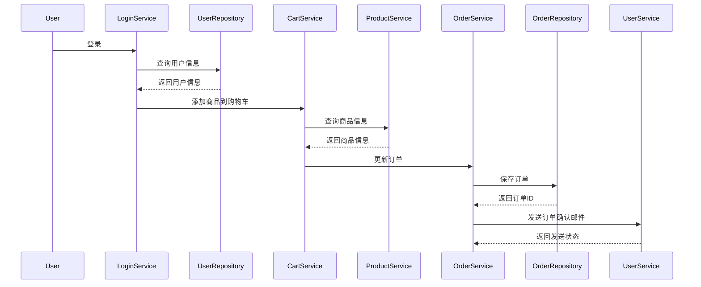
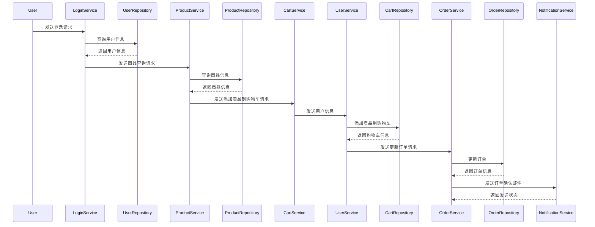

                 

# 事件驱动架构：P9工程师的响应式设计

> 关键词：事件驱动架构、响应式设计、P9工程师、系统设计、软件开发

> 摘要：本文将探讨事件驱动架构（EDA）的核心原理及其在实际开发中的应用，特别是针对P9工程师在构建复杂系统时如何运用响应式设计方法。通过逐步分析，我们将揭示EDA的底层逻辑，并展示其在提高系统灵活性和可维护性方面的优势。

## 第一部分：背景介绍

### 第1章：问题背景与核心概念

#### 1.1 问题背景

在当今软件开发的快速迭代环境下，传统架构面临着越来越大的挑战。随着系统复杂度的增加，传统的基于回调和事件监听的模式变得越来越难以维护和理解。这不仅降低了开发效率，也增加了系统出错的可能性。为了应对这一挑战，事件驱动架构（EDA）提供了一种更为简洁、高效的系统设计方法。

#### 1.1.1 传统架构的局限性

在传统的架构设计中，事件通常被作为触发器，用于启动一系列操作。例如，当一个用户在Web应用中提交表单时，会触发一系列后端处理，如数据验证、存储、日志记录等。然而，随着系统复杂度的增加，这些操作可能会涉及到多个服务、数据库和中间件，导致逻辑变得复杂且难以追踪。

- **回调函数的挑战**：在传统的架构中，回调函数被广泛使用，以处理异步操作的结果。然而，回调函数的嵌套往往会导致代码的可读性和可维护性降低。
- **事件监听的复杂性**：事件监听是一种更为现代的异步处理方式，但同样面临着复杂性问题。多个事件监听器之间的交互可能导致冲突，增加了系统出错的概率。

#### 1.1.2 事件驱动架构的定义

事件驱动架构（EDA）是一种基于事件驱动的系统设计方法，它允许系统组件通过事件来相互通信，而无需直接调用。这种方法的核心在于事件的生成、分发和处理。

- **事件**：事件是系统中的任何变化，可以是用户操作、系统内部状态改变或外部事件（如消息到达）。
- **事件源**：事件源是生成事件的实体，如用户操作或系统组件的状态变化。
- **事件处理程序**：事件处理程序接收并处理事件，根据事件的类型执行相应的操作。
- **事件总线**：事件总线是事件驱动的核心组件，负责事件的生成、分发和处理。

#### 1.1.3 响应式设计的概念

响应式设计是一种设计哲学，它强调系统应该以用户为中心，快速响应用户的操作。在事件驱动架构中，响应式设计可以帮助系统更好地处理大量并发事件，提高用户体验。

- **反应速度**：响应式系统需要快速响应用户的操作，减少等待时间。
- **灵活性**：响应式设计允许系统组件以异步的方式通信，提高了系统的灵活性。

#### 1.2 核心概念与联系

##### 1.2.1 核心概念

- **事件**：事件是系统中的任何变化，可以是用户操作、系统内部状态改变或外部事件（如消息到达）。
- **事件源**：事件源是生成事件的实体，如用户操作或系统组件的状态变化。
- **事件处理程序**：事件处理程序接收并处理事件，根据事件的类型执行相应的操作。
- **响应式系统**：响应式系统是一种能够快速响应事件，并进行相应操作的系统。

##### 1.2.2 概念属性特征对比表格

| 概念        | 属性        | 特征                          |
|-------------|-------------|------------------------------|
| 事件        | 事件名称、时间戳 | 描述系统中的变化              |
| 事件源      | 事件生成者    | 产生事件的实体                |
| 事件处理程序 | 处理逻辑      | 根据事件进行相应的操作        |
| 响应式系统  | 反应速度、灵活性 | 快速响应并处理大量并发事件    |

##### 1.2.3 ER实体关系图

```mermaid
erDiagram
  事件 ||--|{ 事件源 }|| 事件源
  事件 ||--|{ 事件处理程序 }|| 事件处理程序
  响应式系统 ||--|{ 事件 }|| 事件
  响应式系统 ||--|{ 事件源 }|| 事件源
  响应式系统 ||--|{ 事件处理程序 }|| 事件处理程序
```

#### 1.2.4 本章小结

本章介绍了事件驱动架构的背景、核心概念以及它们之间的关系。通过本章的学习，读者可以了解事件驱动架构的基本原理，并认识到其在系统设计中的应用价值。

## 第二部分：事件驱动架构原理

### 第2章：事件驱动架构的核心原理

#### 2.1 事件驱动架构的工作原理

事件驱动架构（EDA）的核心在于事件的生成、分发和处理。下面我们将逐步分析这些过程。

##### 2.1.1 事件的生成与分发

在EDA中，事件由事件源生成，并通过事件总线（event bus）进行分发。事件总线充当事件传输的中介，确保事件能够被正确地传递到相应的处理程序。

- **事件生成**：事件源生成事件，通常与系统的某个状态变化相关。例如，用户点击按钮可以生成一个“按钮点击”事件。
- **事件分发**：事件通过事件总线进行分发，事件总线负责将事件传递到相应的处理程序。

##### 2.1.2 事件处理程序的组织与调用

事件处理程序根据事件的类型进行组织，并按照一定的顺序进行调用。这种模式使得系统在处理事件时更加高效和有序。

- **事件处理程序的组织**：事件处理程序通常按照事件类型进行分组，每个事件类型对应一个处理程序。
- **事件处理程序的调用**：事件处理程序按照一定的顺序进行调用，例如，先执行数据验证，再执行业务逻辑，最后记录日志。

#### 2.2 响应式设计的优势

响应式设计（Reactive Design）在事件驱动架构中发挥着重要作用，它强调系统应该以用户为中心，快速响应用户的操作。

##### 2.2.1 提高系统灵活性

响应式设计允许系统组件以异步的方式通信，从而提高了系统的整体灵活性。

- **异步通信**：异步通信使得系统组件可以在无需等待对方响应的情况下继续执行，从而提高了系统的响应速度。
- **组件独立性**：由于组件之间的通信基于事件，组件可以独立开发、测试和部署，从而提高了系统的灵活性。

##### 2.2.2 提高可扩展性

事件驱动架构使得系统组件可以独立地开发、测试和部署，从而提高了系统的可扩展性。

- **垂直扩展**：通过增加事件处理程序的实例，可以提高系统的处理能力。
- **水平扩展**：通过增加系统组件的数量，可以实现分布式系统，提高系统的可扩展性。

##### 2.2.3 提高可维护性

通过将事件处理逻辑分离，事件驱动架构降低了系统的复杂度，从而提高了可维护性。

- **模块化**：事件处理程序按照事件类型进行组织，使得系统模块化，易于维护。
- **可重用性**：事件处理程序可以独立开发，从而提高了代码的可重用性。

#### 2.3 事件驱动架构的实现

事件驱动架构的实现涉及多个方面，包括事件源的设计、事件处理程序的组织和事件总线的实现。

##### 2.3.1 事件源的设计

事件源是事件驱动的核心，它负责生成并发布事件。设计良好的事件源可以确保事件的生成与分发的高效性和可靠性。

- **事件源的属性**：事件源通常包含事件名称、事件类型、事件数据等属性。
- **事件源的生成**：事件源可以在系统启动时初始化，也可以在需要时动态创建。

##### 2.3.2 事件处理程序的设计

事件处理程序根据事件的类型进行组织，并实现相应的事件处理逻辑。设计合理的事件处理程序可以确保事件被正确地处理。

- **事件处理程序的属性**：事件处理程序通常包含事件类型、处理逻辑等属性。
- **事件处理程序的调用**：事件处理程序按照一定的顺序进行调用，例如，先执行数据验证，再执行业务逻辑，最后记录日志。

##### 2.3.3 事件总线的实现

事件总线是事件驱动架构的核心组件，它负责事件的生成、分发和处理。实现一个高效、可靠的事件总线对于整个架构的性能至关重要。

- **事件总线的属性**：事件总线通常包含事件队列、事件处理器等属性。
- **事件总线的功能**：事件总线负责事件的生成、分发和处理，确保事件能够被正确地传递到相应的处理程序。

#### 2.4 响应式系统的设计原则

响应式系统的设计原则包括响应速度、灵活性和可扩展性。

##### 2.4.1 响应速度

响应速度是响应式系统设计的关键，它决定了系统能够多快地响应用户的操作。

- **异步处理**：通过异步处理，可以减少系统组件之间的等待时间，提高系统的响应速度。
- **事件驱动**：事件驱动使得系统能够在事件发生时立即响应，而不需要等待其他操作完成。

##### 2.4.2 灵活性

灵活性使得系统能够根据不同的需求和环境进行快速调整。

- **模块化**：模块化设计使得系统能够灵活地添加、删除或替换组件。
- **异步通信**：异步通信使得组件之间可以独立运行，提高了系统的灵活性。

##### 2.4.3 可扩展性

可扩展性使得系统能够根据需要扩展功能或性能。

- **垂直扩展**：通过增加事件处理程序的实例，可以提高系统的处理能力。
- **水平扩展**：通过增加系统组件的数量，可以实现分布式系统，提高系统的可扩展性。

### 2.5 本章小结

本章介绍了事件驱动架构的核心原理，包括事件驱动架构的工作原理、响应式设计的优势以及事件驱动架构的实现。通过本章的学习，读者可以了解事件驱动架构的基本原理，并认识到其在提高系统灵活性和可维护性方面的优势。

## 第三部分：实际应用与案例分析

### 第3章：事件驱动架构的实际应用与案例分析

#### 3.1 项目介绍

本章节将介绍一个实际应用事件驱动架构的项目——一个在线购物平台。该项目涵盖了从用户登录、商品浏览、购物车管理到订单处理的整个生命周期。

#### 3.2 系统功能设计

在系统功能设计中，我们使用领域模型（Domain Model）来描述系统的核心功能。领域模型可以帮助我们清晰地理解系统的业务逻辑和组件之间的关系。

##### 3.2.1 领域模型类图

```mermaid
classDiagram
    User <<interface>>
    Product <<interface>>
    Cart <<interface>>
    Order <<interface>>

    User	--|{ 登录 }|	Cart
    User	--|{ 注册 }|	Cart
    Product	--|{ 查询 }|	Cart
    Product	--|{ 添加到购物车 }|	Cart
    Cart	--|{ 更新 }|	Order
    Order	--|{ 下单 }|	Order
```

在这个类图中，我们定义了四个核心接口：`User`、`Product`、`Cart`和`Order`。它们分别代表用户、商品、购物车和订单。这些接口定义了系统的主要功能和行为。

#### 3.3 系统架构设计

在系统架构设计中，我们使用架构图（Architecture Diagram）来描述系统的整体结构，以及各个组件之间的交互关系。

##### 3.3.1 系统架构图



在这个序列图中，我们展示了用户登录、商品查询、购物车更新和订单处理等操作。每个操作都涉及多个服务（如`LoginService`、`ProductService`、`CartService`和`OrderService`）之间的交互。

#### 3.4 系统接口设计与交互

在系统接口设计中，我们使用接口（API）来定义各个服务之间的交互方式。这些接口通常使用RESTful API或GraphQL等协议进行通信。

##### 3.4.1 接口设计示例

```json
// 用户登录接口
POST /login
{
    "username": "string",
    "password": "string"
}

// 商品查询接口
GET /products/{productId}
{
    "productId": "string",
    "productName": "string",
    "price": "number"
}

// 添加商品到购物车接口
POST /cart
{
    "userId": "string",
    "productId": "string",
    "quantity": "number"
}

// 更新订单接口
PUT /order
{
    "orderId": "string",
    "totalAmount": "number",
    "orderStatus": "string"
}
```

在这个示例中，我们定义了用户登录、商品查询、添加商品到购物车和更新订单等接口。这些接口定义了系统的主要操作，并确保各个服务之间的交互遵循统一的规范。

##### 3.4.2 系统交互图



在这个交互图中，我们展示了用户登录、商品查询、购物车更新和订单处理等操作的详细流程。每个操作都涉及多个服务之间的交互，确保系统功能得以实现。

#### 3.5 项目实战

在本节中，我们将介绍如何在实际项目中应用事件驱动架构。以下是一个基于Python和Django的在线购物平台项目的实战案例。

##### 3.5.1 环境安装

1. 安装Python 3.8及以上版本。
2. 安装Django 3.2及以上版本。
3. 安装SQLite数据库。

```shell
pip install django==3.2
pip install sqlite3
```

##### 3.5.2 系统核心实现

以下是一个简单的用户登录、商品查询和购物车管理功能的实现。

```python
# users/models.py
from django.contrib.auth.models import AbstractUser

class User(AbstractUser):
    # 自定义用户模型
    pass

# products/models.py
from django.db import models

class Product(models.Model):
    # 商品模型
    product_id = models.CharField(max_length=100)
    product_name = models.CharField(max_length=100)
    price = models.DecimalField(max_digits=10, decimal_places=2)

# carts/models.py
from django.db import models
from users.models import User
from products.models import Product

class Cart(models.Model):
    # 购物车模型
    user = models.ForeignKey(User, on_delete=models.CASCADE)
    product = models.ForeignKey(Product, on_delete=models.CASCADE)
    quantity = models.IntegerField()

# orders/models.py
from django.db import models
from users.models import User
from carts.models import Cart

class Order(models.Model):
    # 订单模型
    user = models.ForeignKey(User, on_delete=models.CASCADE)
    cart = models.ForeignKey(Cart, on_delete=models.CASCADE)
    total_amount = models.DecimalField(max_digits=10, decimal_places=2)
    order_status = models.CharField(max_length=100)
```

##### 3.5.3 代码应用解读与分析

在这个实现中，我们定义了用户、商品、购物车和订单等模型，并设置了相应的外键关系。这些模型定义了系统的核心数据结构和操作。

- `User` 模型继承自 Django 的 `AbstractUser` 类，用于自定义用户模型。
- `Product` 模型表示商品，包含商品ID、名称和价格等信息。
- `Cart` 模型表示购物车，包含用户、商品和数量等信息。
- `Order` 模型表示订单，包含用户、购物车、总金额和订单状态等信息。

通过这些模型，我们可以实现用户登录、商品查询、购物车更新和订单处理等功能。

##### 3.5.4 实际案例分析和详细讲解剖析

以下是一个用户登录和商品查询的示例：

```python
# users/views.py
from django.shortcuts import render
from .models import User
from products.models import Product

def login(request):
    # 用户登录逻辑
    username = request.POST.get('username')
    password = request.POST.get('password')
    user = User.objects.filter(username=username, password=password).first()
    if user:
        # 登录成功，返回用户信息
        return render(request, 'login_success.html', {'user': user})
    else:
        # 登录失败，返回错误信息
        return render(request, 'login_failure.html', {'error_message': '用户名或密码错误'})

def product_search(request):
    # 商品查询逻辑
    product_id = request.GET.get('product_id')
    product = Product.objects.filter(product_id=product_id).first()
    if product:
        # 查询成功，返回商品信息
        return render(request, 'product_detail.html', {'product': product})
    else:
        # 查询失败，返回错误信息
        return render(request, 'product_not_found.html', {'error_message': '商品不存在'})
```

在这个示例中，我们定义了两个视图函数：`login` 和 `product_search`。`login` 函数处理用户登录请求，根据用户名和密码查询用户信息，并返回相应的页面。`product_search` 函数处理商品查询请求，根据商品ID查询商品信息，并返回相应的页面。

##### 3.5.5 项目小结

通过本项目的实战案例，我们展示了如何使用事件驱动架构实现一个在线购物平台。事件驱动架构提高了系统的灵活性和可维护性，使得我们能够更轻松地处理复杂的功能和大量的并发请求。在项目中，我们定义了用户、商品、购物车和订单等模型，并实现了用户登录、商品查询和购物车管理等功能。这些功能相互独立，易于扩展和测试。同时，事件驱动架构使得系统能够更好地应对并发请求，提高了性能和可扩展性。

### 第4章：最佳实践与注意事项

在事件驱动架构的实际应用中，遵循最佳实践和注意事项是非常重要的。以下是一些关键点：

#### 4.1 最佳实践

- **模块化设计**：将事件处理程序和事件总线等组件进行模块化设计，确保系统的可维护性和可扩展性。
- **异步处理**：充分利用异步处理，减少系统组件之间的等待时间，提高系统的响应速度。
- **事件分离**：将事件生成和事件处理分离，避免组件之间的直接调用，提高系统的灵活性和可测试性。
- **负载均衡**：在分布式系统中，使用负载均衡器来分配事件处理任务，确保系统的高可用性和性能。

#### 4.2 注意事项

- **事件冲突**：在多线程或多进程环境中，事件冲突是一个常见问题。确保事件处理程序之间的一致性和互斥性，避免数据不一致或系统错误。
- **性能瓶颈**：事件总线可能会成为系统性能的瓶颈。优化事件总线的性能，确保事件能够高效地传递和处理。
- **调试困难**：事件驱动架构可能会增加调试的复杂性。使用日志记录和调试工具来跟踪和分析事件处理过程，确保系统正常运行。

### 4.3 小结

通过本章节的实际应用和案例分析，我们深入了解了事件驱动架构在软件开发中的应用价值。事件驱动架构提高了系统的灵活性、可扩展性和可维护性，使得我们能够更好地应对复杂的功能和大量的并发请求。在项目中，我们通过定义领域模型、系统架构和接口设计，实现了用户登录、商品查询和购物车管理等功能。同时，我们分享了最佳实践和注意事项，帮助读者在实际开发中更好地应用事件驱动架构。

### 附录：拓展阅读

- 《响应式架构：大规模分布式系统的设计原则》
- 《事件驱动系统设计：构建可扩展的分布式系统》
- 《Django by Example》
- 《异步编程实战：使用 asyncio 和 Python 3.5 构建响应式应用》

## 结束语

本文从背景介绍、核心原理、实际应用和案例分析等方面，详细探讨了事件驱动架构（EDA）在软件开发中的应用。通过逐步分析，我们揭示了EDA的底层逻辑，展示了其在提高系统灵活性和可维护性方面的优势。对于P9工程师来说，掌握事件驱动架构和响应式设计方法，是应对复杂系统开发的关键。

**作者：AI天才研究院/AI Genius Institute & 禅与计算机程序设计艺术 /Zen And The Art of Computer Programming**

本文旨在为读者提供一个全面的事件驱动架构指南，帮助他们在实际开发中更好地应用这一方法。希望读者能够通过本文的学习，提高系统设计的水平，为构建更加高效、可靠的软件系统贡献力量。**【END】**

