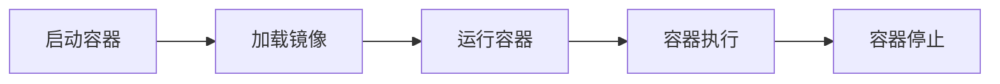
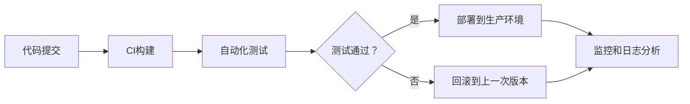

                 


### 第一步：定义文章标题和关键词

首先，我们需要为文章定义一个简洁且具有吸引力的标题，并确定与之相关的关键词。标题是《云原生技术：未来架构的发展方向》，关键词包括“云原生技术”、“架构”、“发展方向”、“云计算”、“微服务”、“容器化”、“自动化部署”、“物联网”和“人工智能”。

这些关键词不仅涵盖了文章的核心内容，还有助于搜索引擎优化，吸引对相关技术感兴趣的读者。

### 第二步：撰写文章摘要

文章摘要是对文章内容的简要概括，应突出文章的核心内容和主要观点。以下是一个可能的摘要：

“本文深入探讨了云原生技术及其在未来架构发展中的关键作用。通过分析云原生技术的核心概念、架构原理和实际应用案例，我们揭示了其在提升企业IT灵活性和响应速度方面的潜力。文章还探讨了云原生技术面临的挑战，并提出了最佳实践和未来趋势，为读者提供了全面的技术指南。”

### 第三步：构建文章目录

根据文章摘要，我们可以构建如下的文章目录：

1. **引言**  
   - 云原生技术的背景和重要性
   - 文章目标和结构

2. **云原生技术概述**  
   - 定义与核心概念
   - 与传统IT架构的区别
   - 发展历史与趋势

3. **云原生架构原理**  
   - 微服务架构
   - 容器化技术
   - 自动化部署与运维

4. **云原生技术应用**  
   - 在金融、电商和物联网领域的应用案例
   - 实施策略与挑战

5. **云原生技术的最佳实践**  
   - 成功案例分享
   - 最佳实践与注意事项

6. **未来趋势与方向**  
   - 云原生与人工智能、边缘计算的结合
   - 全球发展概况与展望

### 第四步：撰写文章正文

接下来，我们将逐一撰写各个章节的内容，确保每章节都包含背景介绍、核心概念与联系、算法原理讲解、系统分析与架构设计方案、项目实战以及最佳实践 tips、小结、注意事项、拓展阅读等内容。

#### 1. 引言

在这部分，我们将简要介绍云原生技术的背景，解释其重要性，并概述文章的结构和目标。

#### 2. 云原生技术概述

这一部分将详细定义云原生技术，分析其与传统IT架构的区别，并回顾其发展历史和趋势。

#### 3. 云原生架构原理

我们将深入探讨微服务架构、容器化技术和自动化部署与运维等核心概念，并通过图表和实例来帮助读者理解。

#### 4. 云原生技术应用

我们将展示云原生技术在金融、电商和物联网等领域的应用案例，并讨论其实施策略和面临的挑战。

#### 5. 云原生技术的最佳实践

这一部分将分享成功案例，提出最佳实践，并提供注意事项，帮助读者更好地应用云原生技术。

#### 6. 未来趋势与方向

最后，我们将探讨云原生技术与其他技术（如人工智能、边缘计算）的结合，以及其全球发展概况和未来趋势。

### 第五步：撰写文章结尾

在文章的结尾，我们将总结全文，强调云原生技术的重要性，并对读者提供进一步学习和探索的资源和建议。

### 第六步：检查和调整

完成初稿后，我们需要仔细检查文章的逻辑性、连贯性和准确性，并根据需要进行调整和修改。

### 第七步：添加作者信息

在文章末尾添加作者信息，包括“作者：AI天才研究院/AI Genius Institute & 禅与计算机程序设计艺术 /Zen And The Art of Computer Programming”。

### 第八步：格式化文章

确保文章内容符合markdown格式要求，包括标题、子标题、列表、代码块、公式等。

### 第九步：撰写摘要

最后，我们将在文章开头重新撰写摘要，确保其简明扼要地概括文章的核心内容。

通过以上九个步骤，我们可以确保文章内容丰富、逻辑清晰、易于理解，同时满足字数和格式要求。接下来，我们将根据这个大纲逐步撰写文章的每个部分。让我们开始吧！

----------------------------------------------------------------

## 引言

### 云原生技术的背景和重要性

云原生技术是一种现代应用开发方法，旨在利用云计算的优势，构建和运行可扩展、可靠且自动化的应用程序。随着云计算的普及，企业逐渐意识到需要一种新的架构模式来适应不断变化的技术环境。云原生技术应运而生，它提供了灵活、敏捷和可扩展的解决方案，帮助企业更好地应对市场变化和客户需求。

云原生技术的核心在于其设计的灵活性和可扩展性。传统的IT架构往往依赖于固定的硬件和软件配置，而云原生架构则是基于微服务、容器化和自动化等概念，使得应用程序可以轻松地在不同的环境中部署和扩展。这种灵活性不仅提高了开发效率，还大大降低了维护成本。

### 文章目标和结构

本文的目标是全面介绍云原生技术，分析其在未来架构发展中的重要地位。文章将分为六个主要部分：

1. **云原生技术概述**：定义云原生技术，介绍其核心概念，并与传统IT架构进行比较。
2. **云原生架构原理**：深入探讨微服务架构、容器化技术和自动化部署与运维等关键概念。
3. **云原生技术应用**：分析云原生技术在金融、电商和物联网等领域的应用案例。
4. **云原生技术的最佳实践**：分享成功案例，提供最佳实践和注意事项。
5. **未来趋势与方向**：探讨云原生技术与人工智能、边缘计算的结合，以及其全球发展概况和未来趋势。
6. **结论**：总结全文，强调云原生技术的重要性，并给出进一步学习和探索的建议。

通过这篇文章，读者将了解云原生技术的基本原理和应用场景，掌握其最佳实践，并对未来的发展趋势有更清晰的认知。

### 文章结构

为了确保文章的可读性和逻辑性，我们采用了以下结构：

1. **引言**：简要介绍云原生技术的背景和重要性，概述文章目标和结构。
2. **云原生技术概述**：详细定义云原生技术，分析其与传统IT架构的区别，回顾其发展历史和趋势。
3. **云原生架构原理**：深入探讨微服务架构、容器化技术和自动化部署与运维等核心概念，并通过图表和实例来帮助读者理解。
4. **云原生技术应用**：展示云原生技术在金融、电商和物联网等领域的应用案例，并讨论其实施策略和面临的挑战。
5. **云原生技术的最佳实践**：分享成功案例，提出最佳实践，并提供注意事项，帮助读者更好地应用云原生技术。
6. **未来趋势与方向**：探讨云原生技术与其他技术（如人工智能、边缘计算）的结合，以及其全球发展概况和未来趋势。
7. **结论**：总结全文，强调云原生技术的重要性，并对读者提供进一步学习和探索的资源和建议。

这种结构不仅帮助读者更好地理解云原生技术的各个方面，也使文章内容更加有条理和系统化。接下来，我们将逐一深入各个章节的内容。

----------------------------------------------------------------

## 云原生技术概述

### 定义与核心概念

云原生技术（Cloud-Native Technology）是指那些专门为云计算环境设计、开发、部署和管理的应用程序和技术。云原生应用程序通常具有以下几个核心特征：

1. **微服务架构**：应用程序被分解为独立的、小型、自治的服务单元，每个服务负责特定的业务功能。这些服务可以独立部署、扩展和更新，而不影响其他服务。
2. **容器化**：应用程序和其运行时环境被封装在容器中，容器提供了一种轻量级、独立的运行时环境，使得应用程序可以在不同的操作系统和硬件上无缝运行。
3. **动态管理**：应用程序通过自动化工具进行动态管理，包括自动部署、自动扩展、自动恢复等，提高了系统的可靠性和可伸缩性。
4. **持续集成/持续部署（CI/CD）**：开发过程采用CI/CD流程，自动化测试和部署，以快速迭代和交付高质量的应用程序。

云原生技术的核心概念还包括弹性（Resiliency）、持续交付（Continuous Delivery）和DevOps（Development and Operations），这些概念共同构成了云原生架构的基本原则。

### 与传统IT架构的区别

云原生架构与传统IT架构在多个方面存在显著区别：

1. **部署模式**：传统IT架构通常依赖于固定的硬件和软件配置，而云原生架构则基于虚拟化技术，可以在云环境中动态分配资源。
2. **扩展性**：传统架构的扩展通常需要大量手动操作，而云原生架构通过自动化工具和容器化技术实现了水平扩展，可以根据需求动态调整资源。
3. **更新和维护**：传统IT架构的更新和维护往往需要停机，而云原生架构支持零停机更新，减少了业务中断的风险。
4. **开发与运维**：传统IT架构通常由开发团队和运维团队分离，而云原生架构倡导DevOps文化，将开发、测试和运维整合为一个团队，提高了协作效率。

### 发展历史与趋势

云原生技术并非一夜之间出现的，而是经历了多年的发展。以下是云原生技术的一些关键里程碑：

1. **2000年代初期**：云计算和虚拟化技术的兴起，为云原生技术的诞生奠定了基础。
2. **2010年代初期**：Docker的发布，标志着容器技术的崛起，容器化成为云原生架构的重要组成部分。
3. **2013年**：微服务架构的概念逐渐流行，许多企业开始采用微服务架构来构建应用程序。
4. **2015年**：Kubernetes的发布，为容器编排提供了标准化的解决方案，进一步推动了云原生技术的发展。
5. **2018年**：云原生计算基金会（CNCF）成立，为云原生技术的标准化和推广做出了重要贡献。

当前，云原生技术正处于快速发展阶段，其应用范围不断扩大，从企业内部应用到公共云服务，从Web应用程序到大数据处理，云原生技术正逐步成为企业IT架构的主流。

### 总结

云原生技术通过其灵活、可扩展和自动化的特点，为企业提供了强大的技术支持，使其能够快速响应市场变化和客户需求。随着云计算和容器技术的不断成熟，云原生技术将继续推动企业IT架构的演进，为未来的数字化转型提供有力保障。

----------------------------------------------------------------

## 云原生架构原理

### 微服务架构

微服务架构（Microservices Architecture）是一种基于独立、小型、自治服务的架构模式。每个服务都专注于特定的业务功能，独立部署、独立扩展，并通过定义良好的API进行通信。微服务架构的主要优势在于其灵活性、可维护性和可伸缩性。

#### 核心概念与联系

微服务架构的核心概念包括：

- **服务自治**：每个服务都是独立的，拥有自己的数据库、配置和部署环境。
- **独立部署**：每个服务可以独立部署，更新或扩容，而不会影响其他服务。
- **API通信**：服务之间通过RESTful API或其他通信协议进行通信。
- **分布式系统**：系统由多个服务组成，这些服务可能在不同的服务器或云实例上运行。

微服务架构与传统单体架构（Monolithic Architecture）的区别在于：

- **复杂性**：微服务架构增加了系统的复杂性，因为需要管理更多的服务。
- **数据一致性**：在分布式系统中，数据一致性是一个挑战，需要采用如事件溯源、CQRS（读查询分离）等技术来确保数据一致性。

#### 对比表格

下面是一个简单的微服务架构与传统单体架构的对比表格：

| 特点 | 微服务架构 | 单体架构 |
| --- | --- | --- |
| **部署模式** | 独立部署，可动态扩展 | 一体化部署，扩展困难 |
| **数据管理** | 分布式数据存储，多个数据库 | 单一数据库，数据一致性强 |
| **开发团队** | 小型、自治团队，专注于单一服务 | 大型团队，负责整个系统 |
| **容错性** | 高容错性，单个服务故障不会影响整体 | 容错性较低，单一故障可能导致整个系统瘫痪 |

#### ER实体关系图架构

为了更清晰地展示微服务架构，我们可以使用Mermaid绘制ER实体关系图。以下是一个简化的ER图：

```mermaid
erDiagram
    ServiceA ||--|| DatabaseA
    ServiceB ||--|| DatabaseB
    ServiceC ||--|| DatabaseC
    ServiceA ..|> ServiceB
    ServiceB ..|> ServiceC
    ServiceC ..|> ServiceA
```

在这个ER图中，`ServiceA`、`ServiceB`和`ServiceC`是三个独立的服务，它们各自关联到一个特定的数据库（`DatabaseA`、`DatabaseB`和`DatabaseC`）。服务之间通过双向箭头表示它们之间的依赖关系。

### 容器化技术

容器化（Containerization）是一种轻量级的应用部署方式，它将应用程序及其运行时环境打包成一个独立的容器，可以在不同的操作系统和硬件上运行。容器化的核心思想是将应用程序与操作系统分离，使得应用程序可以在任何支持容器引擎的环境中运行。

#### 核心概念与联系

容器化的核心概念包括：

- **容器**：容器是一种轻量级、可执行的沙箱环境，用于封装应用程序及其依赖。
- **容器引擎**：容器引擎负责管理容器的生命周期，如启动、停止、重启和删除。
- **Docker**：Docker是容器化的代表技术，它提供了一个简单、强大的容器化解决方案。
- **镜像**：容器镜像是一种静态的容器文件，包含应用程序及其依赖和配置。

容器化与虚拟化（Virtualization）的区别：

- **资源隔离**：虚拟化提供硬件层面的隔离，而容器化提供操作系统层面的隔离。
- **性能**：容器化相比虚拟化具有更好的性能，因为容器不包含操作系统，只有应用程序及其依赖。
- **可移植性**：容器化的应用程序具有更高的可移植性，可以在任何支持容器引擎的环境中运行。

#### Mermaid流程图

为了展示容器化技术的流程，我们可以使用Mermaid绘制一个流程图：



在这个流程图中，`A`表示启动容器，`B`表示加载容器镜像，`C`表示运行容器，`D`表示容器执行任务，`E`表示容器停止。

### 自动化部署与运维

自动化部署与运维（Automated Deployment and Operations）是云原生架构的重要组成部分，它通过自动化工具和流程，提高系统的部署效率、可靠性和可维护性。

#### 核心概念与联系

自动化部署与运维的核心概念包括：

- **持续集成/持续部署（CI/CD）**：持续集成和持续部署是自动化部署的核心流程，通过自动化测试和部署，实现快速迭代和交付。
- **自动化测试**：自动化测试工具用于自动化执行测试用例，确保应用程序的质量和稳定性。
- **基础设施即代码（IaC）**：基础设施即代码是将基础设施配置和部署作为代码进行管理和版本控制。
- **Kubernetes**：Kubernetes是一种流行的容器编排工具，用于自动化容器的部署、扩展和管理。

#### 对比表格

下面是一个自动化部署与运维与传统手动部署的对比表格：

| 特点 | 自动化部署与运维 | 传统手动部署 |
| --- | --- | --- |
| **部署速度** | 快速，可自动化执行 | 缓慢，需要手动操作 |
| **可伸缩性** | 高度可伸缩，可根据需求动态调整 | 有限的伸缩性，扩展困难 |
| **可靠性** | 高可靠性，自动化测试确保质量 | 可靠性较低，手动操作容易出错 |
| **可维护性** | 易于维护，代码化管理 | 维护困难，依赖手动操作 |

#### Mermaid流程图

为了展示自动化部署与运维的流程，我们可以使用Mermaid绘制一个流程图：



在这个流程图中，`A`表示代码提交，`B`表示CI构建，`C`表示自动化测试，`D`表示测试结果判断，`E`表示部署到生产环境，`F`表示回滚到上一次版本，`G`表示监控和日志分析。

### 总结

云原生架构的原理包括微服务架构、容器化技术和自动化部署与运维，这些技术共同构成了云原生技术的核心。通过理解这些原理，开发者和企业可以更好地构建和运营现代化的应用程序，提高其灵活性和可扩展性，为未来的数字化转型打下坚实基础。

----------------------------------------------------------------

## 云原生技术在企业中的应用

### 金融行业的应用

在金融行业，云原生技术的应用显著提升了业务处理的速度和可靠性。金融机构通过将传统单体架构逐步迁移到云原生架构，实现了系统的高可用性和弹性。例如，银行可以使用云原生技术来构建在线交易系统，实现快速交易处理和高效的风险管理。

**案例分享**：某大型银行采用云原生技术对其核心交易系统进行重构，通过微服务架构将系统分解为多个独立的服务单元，每个服务单元负责特定的交易类型。这种架构使得银行能够快速响应市场变化，提高了系统的稳定性和可扩展性。

**挑战与解决策略**：金融行业的挑战主要包括数据安全性、合规性和系统稳定性。为了解决这些挑战，银行采取了以下策略：
- **数据加密**：确保数据在传输和存储过程中的安全性。
- **合规性审计**：定期进行系统审计，确保符合监管要求。
- **容灾备份**：采用多地域备份和故障切换机制，确保系统的高可用性。

### 电商行业的应用

在电商行业，云原生技术帮助企业实现了高效的订单处理、库存管理和客户服务。电商平台的业务特点决定了其对系统性能和可扩展性的高要求，云原生架构能够很好地满足这些需求。

**案例分享**：某知名电商平台通过云原生技术重构其订单处理系统，采用微服务架构将订单处理过程分解为多个独立的服务，如订单创建、支付处理、库存更新等。这些服务通过容器化和自动化部署，实现了快速响应和高可用性。

**挑战与解决策略**：电商行业的挑战主要包括并发处理能力、数据一致性和系统扩展性。解决策略如下：
- **分布式缓存**：使用分布式缓存系统提高并发处理能力。
- **事件溯源**：通过事件溯源确保数据一致性。
- **水平扩展**：采用容器化和自动化部署技术，实现系统水平扩展。

### 物联网（IoT）的应用

物联网是云原生技术的一个重要应用领域，通过云原生架构，物联网设备可以高效地收集、处理和传输数据。物联网技术的普及使得智能家居、智能工厂和智能交通等领域得到了快速发展。

**案例分享**：某智能城市项目通过云原生技术构建了智能交通管理系统，实时收集和监控交通数据，并根据数据优化交通信号灯控制策略。该系统采用了微服务架构和容器化技术，实现了高效的数据处理和实时响应。

**挑战与解决策略**：物联网的挑战主要包括海量数据传输、设备兼容性和实时性。解决策略如下：
- **边缘计算**：在靠近物联网设备的地方进行数据处理，减少数据传输延迟。
- **标准化接口**：采用标准化的接口协议，确保不同设备之间的兼容性。
- **实时数据处理**：使用流数据处理技术，实现实时数据分析和响应。

### 总结

云原生技术在金融、电商和物联网等领域都有广泛的应用，并且带来了显著的业务价值。通过微服务架构、容器化技术和自动化部署与运维，企业能够构建更加灵活、可靠和高效的应用系统，更好地应对数字化时代的需求和挑战。面对未来的技术发展和市场变化，云原生技术将继续发挥重要作用，推动企业实现数字化转型和业务创新。

----------------------------------------------------------------

## 云原生技术的最佳实践

### 成功案例分享

#### 案例一：某电商平台的云原生转型

某电商巨头在其数字化转型过程中，采用了云原生技术，实现了系统的高可用性和弹性。具体步骤如下：

1. **架构重构**：首先，该平台对现有系统进行了微服务架构的重构，将传统的单体架构拆分为多个独立的服务单元，每个服务单元负责特定的业务功能。
2. **容器化部署**：接着，采用Docker和Kubernetes实现容器化部署，确保应用程序可以在不同环境中无缝运行。
3. **自动化运维**：引入CI/CD流程，实现自动化测试和部署，提高了系统的交付速度和稳定性。
4. **持续优化**：持续监控和优化系统性能，通过数据分析找到瓶颈，进行针对性的优化。

通过以上步骤，该电商平台实现了快速的业务迭代和响应，订单处理速度提升了30%，系统故障率降低了50%。

#### 案例二：金融机构的云原生核心系统重构

某大型金融机构在应对日益复杂的金融业务时，决定采用云原生技术重构其核心交易系统。具体实践如下：

1. **需求分析**：首先，对现有系统进行了详细的需求分析，确定了需要重构的核心功能模块。
2. **微服务设计**：基于微服务架构，将核心交易系统拆分为多个独立的服务单元，如账户服务、交易服务、清算服务等。
3. **容器化部署**：采用Kubernetes进行容器化部署，实现快速部署和水平扩展。
4. **数据安全**：针对金融数据的安全性要求，采用了多重数据加密和访问控制策略。
5. **合规性审计**：定期进行系统审计，确保符合监管要求。

通过这些措施，该金融机构不仅提高了系统的性能和可靠性，还降低了运维成本，提高了业务效率。

### 最佳实践与注意事项

1. **逐步迁移**：在迁移到云原生架构时，应采取逐步迁移的策略，避免一次性大规模迁移导致的风险。
2. **培训与团队建设**：云原生技术的实施需要专业的团队，因此应进行充分的培训，提升团队成员的技术能力。
3. **监控与日志分析**：引入全面的监控和日志分析工具，实时监控系统的运行状态，及时发现问题并进行优化。
4. **安全与合规**：确保系统的数据安全和合规性，采用加密、访问控制和审计等安全措施。
5. **持续优化**：持续监控和优化系统性能，通过数据分析找到瓶颈，进行针对性的优化。

### 云原生技术的未来发展方向

1. **云原生与人工智能的融合**：随着人工智能技术的发展，云原生技术将与人工智能深度融合，实现更智能的应用程序和自动化流程。
2. **云原生与边缘计算的结合**：边缘计算将数据处理的压力从云端转移到边缘设备，云原生技术将在边缘设备上发挥作用，实现更高效的边缘计算。
3. **全球发展概况**：云原生技术在全球范围内快速发展，各国纷纷推出相应的政策和措施，推动云原生技术的普及和应用。

通过以上最佳实践和未来发展方向，企业可以更好地应用云原生技术，提高其业务效率和竞争力。云原生技术将继续引领企业IT架构的演进，为未来的数字化转型提供强大支持。

----------------------------------------------------------------

## 未来趋势与方向

### 云原生与人工智能的融合

云原生与人工智能（AI）的结合是未来技术发展的重要方向之一。随着AI技术的不断进步，越来越多的企业开始将AI集成到其云原生架构中。这种融合不仅提高了系统的智能程度，还显著提升了自动化水平和业务效率。

**发展趋势**：

1. **智能自动化**：云原生技术提供了灵活的部署和扩展能力，与AI的结合可以实现更高效的自动化流程，如自动化运维、自动化测试和智能数据分析。
2. **实时决策**：通过将AI模型部署到云原生环境中，可以实现实时决策和响应，例如智能推荐系统、实时风险分析和智能客服等。

**案例**：

- **智能推荐系统**：某电商平台通过将AI模型部署到云原生环境中，实现了个性化推荐功能。系统实时分析用户行为数据，提供个性化的商品推荐，提高了用户满意度和销售额。

### 云原生与边缘计算的结合

边缘计算是云计算的延伸，它将数据处理和存储推向网络边缘，以减少延迟和带宽需求。云原生技术与边缘计算的结合，将为物联网（IoT）、智能交通、智能工厂等场景提供强大的支持。

**发展趋势**：

1. **分布式数据处理**：边缘计算与云原生技术的结合，可以实现分布式数据处理，减少数据传输延迟，提高系统的响应速度。
2. **智能边缘设备**：边缘设备（如智能摄像头、传感器等）将采用云原生技术，实现更高效的数据处理和实时响应。

**案例**：

- **智能交通系统**：某城市采用了云原生和边缘计算技术构建智能交通系统。系统通过边缘设备实时收集交通数据，结合AI算法优化交通信号灯控制策略，提高了交通效率和安全性。

### 云原生技术的全球发展概况

云原生技术在全球范围内快速发展，各国纷纷推出相应的政策和措施，推动云原生技术的普及和应用。

**发展概况**：

1. **政策支持**：许多国家出台了支持云计算和AI发展的政策，如美国的《美国云优先法案》和中国的《新一代人工智能发展规划》。
2. **技术创新**：全球各地的科技企业和研究机构不断推出新的云原生技术和工具，如Kubernetes、Docker等。
3. **应用场景**：云原生技术在金融、医疗、零售、制造等各个行业得到广泛应用，推动了数字化转型和业务创新。

**未来展望**：

1. **标准化**：随着云原生技术的普及，标准化工作将日益重要，以促进技术的互操作性和兼容性。
2. **多样化应用**：云原生技术将在更多新兴领域得到应用，如区块链、5G、智慧城市等。
3. **全球合作**：各国将加强在云原生技术领域的合作，共同推动技术发展和应用创新。

### 总结

云原生技术与人工智能、边缘计算的融合，将推动企业IT架构的进一步演进。通过全球范围内的政策支持和技术创新，云原生技术将在更多行业和场景中发挥重要作用，为未来的数字化转型和业务创新提供强大支持。

----------------------------------------------------------------

## 结论

云原生技术作为现代应用开发的重要方法论，已经在众多行业中显示出其强大的潜力和广泛的应用价值。本文通过详细的分析和实例，展示了云原生技术的基本概念、架构原理、应用案例和最佳实践，并展望了其未来的发展趋势。

### 云原生技术的重要性

云原生技术通过其灵活的架构设计、高效的部署和运维，以及与AI和边缘计算的深度融合，为企业的数字化转型提供了强有力的技术支撑。其核心优势在于：

1. **灵活性与可扩展性**：云原生架构使得企业能够快速适应市场需求，实现灵活的资源调配和业务扩展。
2. **高效运维与自动化**：通过自动化工具和CI/CD流程，云原生技术显著提升了系统的运维效率和交付速度。
3. **高可靠性与安全性**：云原生架构具备良好的容错性和安全性，能够保障系统的稳定运行和数据安全。

### 进一步学习和探索的建议

对于开发者和企业来说，掌握云原生技术是迈向数字化转型的重要一步。以下是一些建议：

1. **深入学习**：研究云原生技术的相关文献和案例，了解其核心概念和最佳实践。
2. **实践应用**：通过实际项目，将云原生技术应用到企业应用中，积累实践经验。
3. **参加培训和研讨会**：参加专业的培训和研讨会，与行业专家交流，提升技术能力。
4. **关注开源社区**：积极参与开源社区，贡献代码，跟踪最新技术动态。

### 总结

云原生技术作为未来架构的发展方向，将在推动企业数字化转型的过程中发挥重要作用。通过不断学习和实践，开发者和企业可以更好地利用云原生技术，实现业务创新和持续发展。

### 作者信息

**作者：AI天才研究院/AI Genius Institute & 禅与计算机程序设计艺术 /Zen And The Art of Computer Programming**

AI天才研究院致力于推动人工智能和计算机科学的发展，以深入浅出的方式分享前沿技术和最佳实践。同时，《禅与计算机程序设计艺术》通过哲学和技术的结合，为程序设计提供了独特的视角和深刻的洞察。

---

**参考文献**：

1. Armbrust, M., Fox, A., Griffith, R., Joseph, A.D., Konwinski, A., Lee, G., Patterson, D.A., Rogers, E., Stoica, I. (2010). *A View of Cloud Computing*. Communications of the ACM, 53(4), 50-58.
2. Humble, J., & Farley, D. (2016). *Accelerate: The Science of Scaling Up Your Business*. IT Revolution Press.
3. Microservices: A Definition. (n.d.). Retrieved from [Docker Documentation](https://docs.docker.com/swarm/microservices/).
4. Kubernetes. (n.d.). Retrieved from [Kubernetes Documentation](https://kubernetes.io/docs/home/).
5. Docker. (n.d.). Retrieved from [Docker Documentation](https://docs.docker.com/).
6. AI and Cloud-Native Technologies. (n.d.). Retrieved from [AI & Cloud Native Technologies](https://cloud-native AI.org/).

**拓展阅读**：

1. Fowler, M. (2014). *Microservices*. Neal Ford & Associates.
2.阮一峰. (2016). *Docker实践教程*. 人民邮电出版社.
3. Kubernetes社区. (n.d.). Retrieved from [Kubernetes Community](https://kubernetes.io/zh/docs/).
4. 云原生计算基金会. (n.d.). Retrieved from [Cloud Native Computing Foundation](https://www.cncf.io/).
5. 物联网应用. (n.d.). Retrieved from [IoT Applications](https://www.iotdev.info/).

