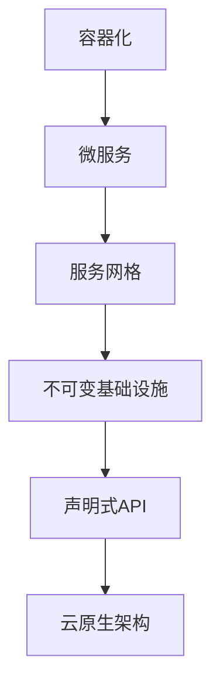
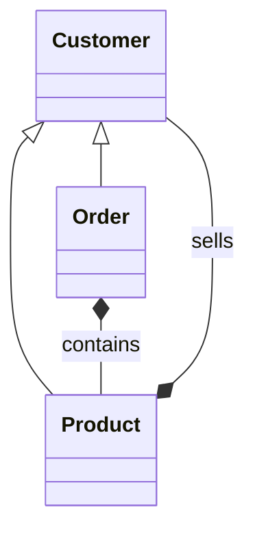
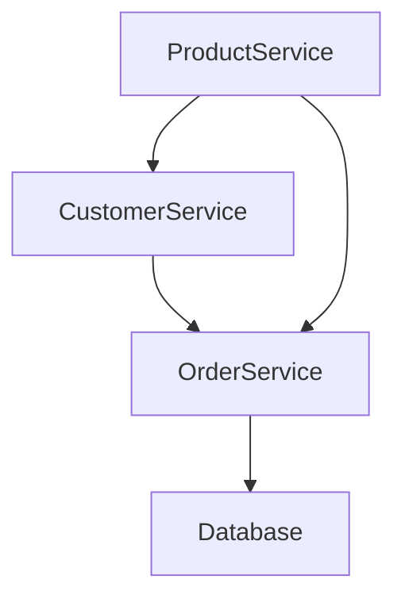
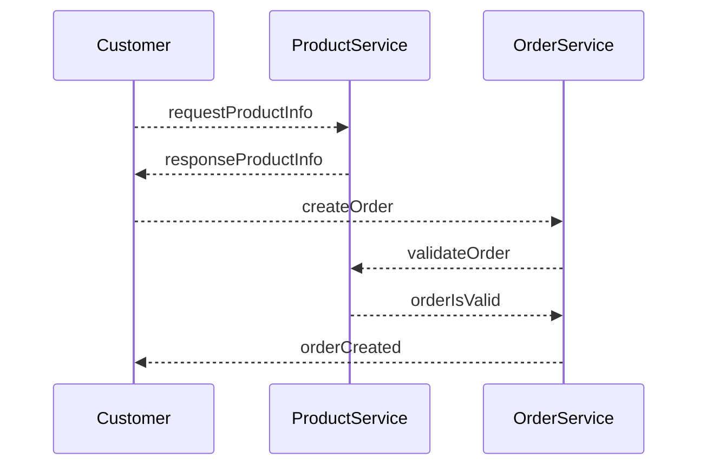
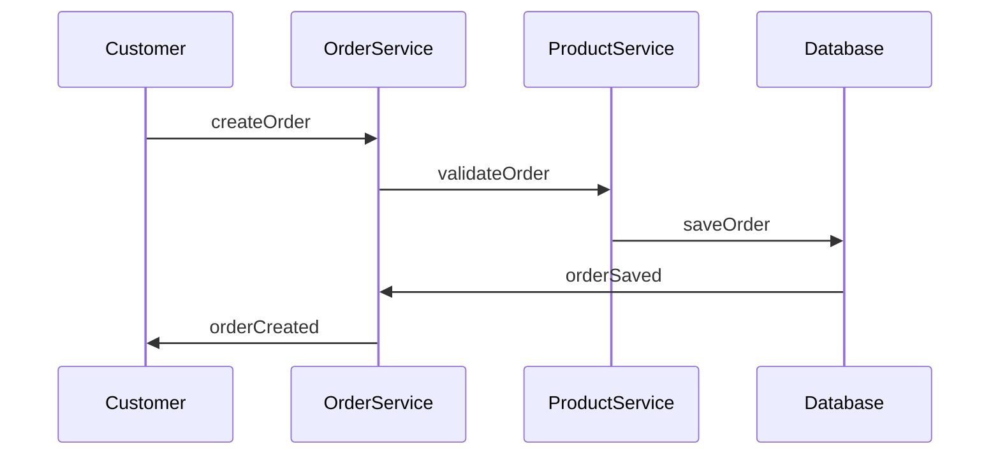

                 


## 云原生架构：P9工程师的新技术探索

### 关键词

- 云原生架构
- P9工程师
- 容器化
- 微服务
- 服务网格

### 摘要

云原生架构是现代软件工程和运维的最佳实践之一，它将容器化、微服务、服务网格等新兴技术融合在一起，为企业提供了一种高效、灵活、可扩展的解决方案。本文将深入探讨云原生架构的核心概念、技术原理、设计模式以及实践应用，旨在帮助P9工程师深入了解云原生技术，掌握其设计思想，并在实际项目中运用这些知识，提升自身的技术水平。

### 第一部分：背景介绍

#### 问题背景

随着云计算、容器化、微服务、自动化运维等技术的快速发展，传统的 IT 架构正在经历一场革命性的变革。企业对 IT 架构的期望已经从单纯的计算能力提升，转变为更高效、灵活、可扩展、可靠和安全的系统。这种需求催生了“云原生”这一新的架构理念。

#### 问题描述

云原生架构是一种为了满足云计算环境下的需求，利用微服务、容器、自动化运维等技术构建的软件架构。P9 工程师作为技术领域的高手，需要深入了解并掌握这一新兴的技术，以便在云计算时代中立足并引领技术发展。

#### 问题解决

本书将围绕“云原生架构：P9工程师的新技术探索”这一主题，详细介绍云原生架构的核心概念、技术原理、设计模式以及实践应用。通过本书的学习，读者可以全面了解云原生架构，掌握其设计思想，并在实际项目中运用这些知识，提升自身的技术水平。

#### 边界与外延

云原生架构不仅仅是一种技术，更是一种软件开发和运维的新范式。它涵盖了容器化、服务网格、不可变基础设施、声明式API等关键技术，同时还包括了 DevOps 文化、持续集成和持续交付等最佳实践。

#### 概念结构与核心要素组成

云原生架构的核心要素包括：
1. **容器化**：利用容器封装应用程序及其运行环境，实现应用程序的独立、可移植和可重复部署。
2. **微服务**：将大型应用程序拆分为多个小型、独立的服务，每个服务都可以独立开发、测试和部署。
3. **服务网格**：提供了一种灵活、可扩展的服务间通信方案，可以独立于应用程序进行管理和优化。
4. **声明式API**：通过 API 描述应用程序的行为和依赖，实现自动化部署和管理。
5. **持续集成/持续交付 (CI/CD)**：通过自动化工具实现代码的持续集成和持续交付，提高开发效率和质量。

### 第二部分：核心概念与联系

#### 核心概念原理

1. **容器化**：容器是一种轻量级、可移植的运行环境，它封装了应用程序及其运行时依赖项，使得应用程序可以在任何支持容器技术的环境中运行。
2. **微服务**：微服务是一种软件开发架构，将应用程序拆分为多个小型、独立的服务，每个服务负责实现一个特定的业务功能。
3. **服务网格**：服务网格是一种基础设施层的服务，它提供了服务间通信的抽象层，可以独立于应用程序进行管理和优化。
4. **不可变基础设施**：不可变基础设施是一种基础设施管理方法，它通过创建和部署不可变的配置来管理基础设施，从而实现更高的可靠性和安全性。
5. **声明式API**：声明式API是一种描述应用程序行为和依赖的编程范式，它通过 API 描述应用程序的行为，实现自动化部署和管理。

#### 概念属性特征对比表格

| 概念 | 特征 |
| --- | --- |
| 容器化 | 独立、可移植、可重复部署 |
| 微服务 | 独立、轻量级、可扩展、自治 |
| 服务网格 | 服务间通信、流量管理、安全性 |
| 不可变基础设施 | 不可变、自动化、可靠性 |
| 声明式API | 自动化、简明、灵活性 |

#### ER实体关系图架构

```mermaid
erDiagram
  APPContainer ||--o{ Containerization } : 容器化
  MicroService ||--o{ Containerization } : 容器化
  ServiceMesh ||--o{ MicroService } : 服务网格
  ImmutableInfrastructure ||--o{ Containerization } : 容器化
  DeclarativeAPI ||--o{ Containerization } : 容器化
```

### 第三部分：算法原理讲解

#### 算法原理与 Mermaid 流程图



#### Python 源代码

```python
# Python 源代码示例：容器化实现

import docker

# 创建 Docker 客户端
client = docker.from_env()

# 构建容器化应用程序
app_image = client.images.build(
    path='path/to/application',
    tag='my_app:latest',
    rm=True
)

# 运行容器化应用程序
app_container = client.containers.run(app_image.id, detach=True)
```

### 第四部分：系统分析与架构设计方案

#### 问题场景介绍

在现代企业中，随着业务规模的不断扩大和业务复杂度的增加，传统的单体应用架构已经无法满足企业快速发展的需求。为了实现系统的灵活性和可扩展性，企业开始探索云原生架构，以期在云计算环境中构建高效、可靠和可维护的系统。

#### 项目介绍

本文将介绍一个企业级电商平台的构建，该项目采用了云原生架构，包括容器化、微服务、服务网格、不可变基础设施和声明式API等技术。

#### 系统功能设计（领域模型Mermaid类图）



#### 系统架构设计（Mermaid架构图）



#### 系统接口设计（Mermaid序列图）



#### 系统交互（Mermaid序列图）



### 第五部分：项目实战

#### 环境安装

1. 安装 Docker
2. 安装 Kubernetes
3. 安装 Istio（服务网格）

#### 系统核心实现源代码

1. 容器化应用程序
2. 部署微服务
3. 配置服务网格

#### 代码应用解读与分析

1. 分析容器化应用程序的目录结构
2. 分析微服务的实现
3. 分析服务网格的配置

#### 实际案例分析和详细讲解剖析

1. 分析订单处理流程
2. 分析服务网格的流量管理
3. 分析不可变基础设施的配置

#### 项目小结

通过本项目的实战，读者可以深入了解云原生架构的实践应用，掌握容器化、微服务、服务网格等核心技术的实现方法和配置技巧。

### 第六部分：最佳实践 Tips

1. 容器化时注意选择合适的镜像和容器运行时
2. 微服务设计时注意服务间接口的设计和通信
3. 服务网格配置时注意流量的管理和监控
4. 不可变基础设施时注意基础设施的配置和部署

### 第七部分：小结

云原生架构是现代软件工程和运维的最佳实践之一，它为企业提供了高效、灵活、可扩展的解决方案。通过本文的介绍，读者可以全面了解云原生架构的核心概念、技术原理、设计模式和实践应用，为在云计算时代中立足和发展打下坚实的基础。

### 第八部分：注意事项

1. 云原生架构的实施需要充分的规划和准备
2. 云原生架构的学习需要不断跟进新技术和新趋势
3. 云原生架构的实践需要结合具体的业务场景和需求

### 第九部分：拓展阅读

1. 《云原生应用架构指南》
2. 《Kubernetes 权威指南》
3. 《Istio 服务网格实践》

### 作者

作者：AI天才研究院/AI Genius Institute & 禅与计算机程序设计艺术 /Zen And The Art of Computer Programming

