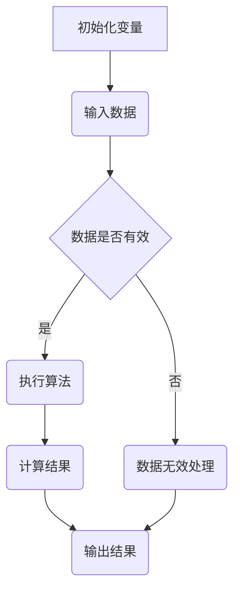
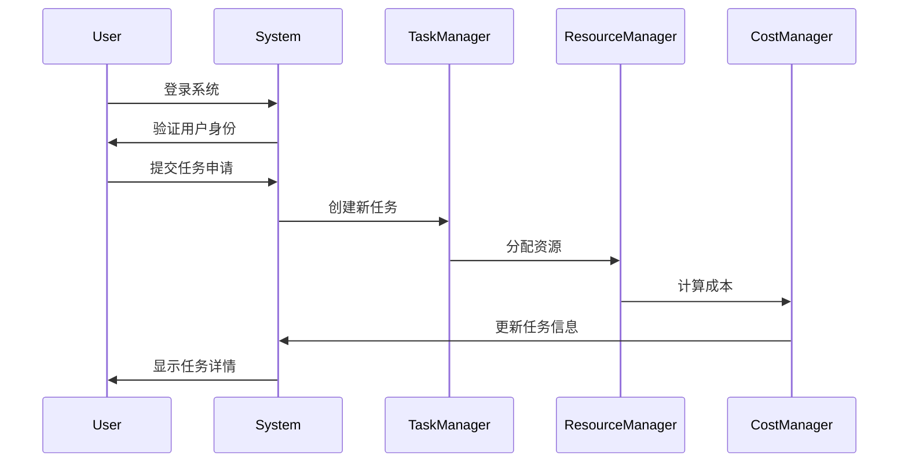
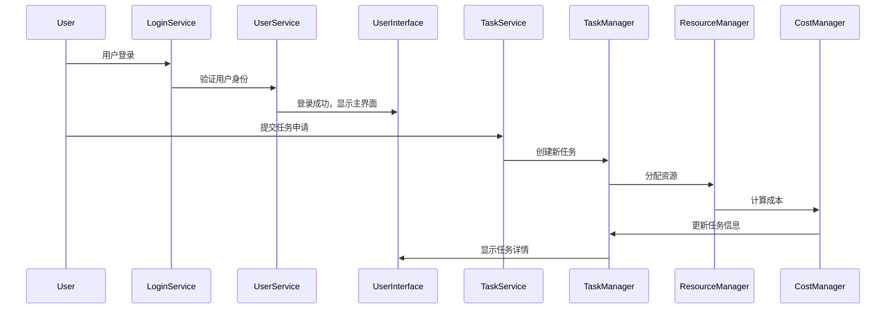

                 

### 摘要

本文将深入探讨两位伟大的哲学家亚当·斯密与黑格尔的社会哲学观点。亚当·斯密作为现代经济学的奠基人，以其对市场机制的深刻洞察而著称；而黑格尔则以其辩证法和历史观对社会哲学做出了重要贡献。通过对两人核心观点的详细分析，我们将揭示他们在社会本质、政治理论与道德哲学等方面的异同点，并探讨其对社会发展的影响。本文旨在为读者提供一个清晰、结构化的理解框架，以帮助读者更深入地理解这两位哲学家的思想，并思考其在当代社会中的实际应用和价值。通过本文，读者将不仅能了解亚当·斯密和黑格尔的理论精髓，还将学会如何运用哲学的视角去审视和解决现实中的社会问题。

## 关键词

亚当·斯密、黑格尔、社会哲学、经济学、辩证法、政治理论、道德哲学、历史观、市场机制、社会本质、社会理论、个体自由、社会正义。

## 引言

《亚当·斯密与黑格尔：社会哲学的不同视角》是一本旨在揭示两位伟大哲学家在经济学、政治理论和道德哲学等方面的思想差异与共鸣的著作。亚当·斯密被誉为现代经济学的奠基人，他的《国富论》不仅开创了经济学研究的新时代，还深刻地影响了现代社会的经济制度与理念。另一方面，黑格尔以其独特的辩证法和历史观，对社会哲学做出了重要贡献，他的思想在德国古典哲学和马克思主义哲学中具有重要地位。

亚当·斯密和黑格尔虽然生活在不同的时代，但他们都对社会的发展有着深刻的洞察和独特的见解。亚当·斯密以其对市场机制的精确分析，构建了一个自由主义经济体系的基础，强调个体自由、市场自发调节和社会正义。而黑格尔则通过辩证法和社会发展理论，揭示了个体与共同体之间的内在联系，提出了国家哲学和社会正义的新观点。

本文旨在通过对亚当·斯密和黑格尔社会哲学观点的详细分析，探讨他们在经济学、政治理论和道德哲学等方面的异同点。通过本文，读者将不仅能了解两位哲学家的思想精髓，还将学会如何运用哲学的视角去审视和解决现实中的社会问题。文章结构如下：

- **第一部分：引言和背景介绍**：简要介绍亚当·斯密和黑格尔的生平、贡献及其在社会哲学中的地位。
- **第二部分：亚当·斯密的社会哲学**：详细分析亚当·斯密在经济学、政治理论和道德哲学方面的核心观点。
- **第三部分：黑格尔的社会哲学**：深入探讨黑格尔的辩证法、历史观和国家哲学。
- **第四部分：比较与分析**：对比亚当·斯密和黑格尔的观点，探讨他们在社会本质、政治理论和道德哲学等方面的异同点。
- **第五部分：社会哲学的历史与影响**：回顾社会哲学的发展历程，探讨两位哲学家的思想对社会的影响和当代价值。

### 目录大纲设计步骤

在设计《亚当·斯密与黑格尔：社会哲学的不同视角》的目录大纲时，需要遵循以下步骤，以确保内容的完整性和逻辑性：

1. **理解书名与核心主题**：
   - **书名分析**：《亚当·斯密与黑格尔：社会哲学的不同视角》
   - **核心主题**：探讨亚当·斯密和黑格尔的社会哲学观点，对比他们在经济学、政治理论和道德哲学等方面的异同。
   - **目标读者**：对社会哲学感兴趣的读者，包括哲学家、学者、学生等。

2. **确定核心概念与章节内容**：
   - **亚当·斯密的核心社会哲学概念**：经济学理论、自由主义政治理论、道德哲学。
   - **黑格尔的核心社会哲学概念**：辩证法、历史观、国家哲学。
   - **对比分析**：两人观点的异同点，包括经济理论、政治理论和道德哲学。
   - **社会哲学的历史背景和发展**：西方哲学史中的社会哲学发展脉络。

3. **设计目录结构**：
   - **第一部分：引言和背景介绍**：介绍亚当·斯密和黑格尔的生平、贡献及其在社会哲学中的地位。
   - **第二部分：亚当·斯密的社会哲学**：详细分析亚当·斯密在经济学、政治理论和道德哲学方面的核心观点。
   - **第三部分：黑格尔的社会哲学**：深入探讨黑格尔的辩证法、历史观和国家哲学。
   - **第四部分：比较与分析**：对比亚当·斯密和黑格尔的观点，探讨他们在社会本质、政治理论和道德哲学等方面的异同点。
   - **第五部分：社会哲学的历史与影响**：回顾社会哲学的发展历程，探讨两位哲学家的思想对社会的影响和当代价值。

4. **细化章节内容**：
   - **每个章节下的子章节细化**：确保涵盖核心概念、理论、案例等。
   - **确保章节内容丰富具体**：每个章节都要详细讲解相关理论，提供足够的背景信息和实例分析。

5. **确保格式和字数符合要求**：
   - **使用markdown格式编写目录**：使用统一的格式和风格。
   - **保证总字数在10000～12000字左右**：确保文章内容充实，同时避免冗长。

通过以上步骤，我们可以设计出一个结构清晰、内容丰富的目录大纲，为读者提供一个全面、深入的阅读体验。

### 目录大纲示例

```markdown
# 《亚当·斯密与黑格尔：社会哲学的不同视角》目录大纲

## 第一部分：引言

### 1.1 书籍背景与目的

### 1.2 亚当·斯密与黑格尔的生平与贡献

### 1.3 社会哲学的重要性

## 第二部分：亚当·斯密的社会哲学

### 2.1 亚当·斯密的经济理论

#### 2.1.1 《国富论》的基本观点

#### 2.1.2 市场机制与经济自由

#### 2.1.3 分工理论

### 2.2 亚当·斯密的政治理论

#### 2.2.1 自由主义与国家角色

#### 2.2.2 社会正义与个人自由

#### 2.2.3 政府职能与公共选择

### 2.3 亚当·斯密的道德哲学

#### 2.3.1 市场经济的道德基础

#### 2.3.2 人性观与道德责任

## 第三部分：黑格尔的社会哲学

### 3.1 黑格尔的辩证法

#### 3.1.1 辩证法的概念与特征

#### 3.1.2 辩证法在社会哲学中的应用

### 3.2 黑格尔的历史观

#### 3.2.1 历史进程与社会发展

#### 3.2.2 个体与共同体

### 3.3 黑格尔的国家哲学

#### 3.3.1 国家与公民的关系

#### 3.3.2 国家哲学与政治制度

## 第四部分：比较与分析

### 4.1 两人哲学观点的异同

#### 4.1.1 经济理论与政治理论的差异

#### 4.1.2 道德哲学与社会理论的对比

### 4.2 两人哲学对社会发展的影响

#### 4.2.1 亚当·斯密的理论影响

#### 4.2.2 黑格尔的理论影响

## 第五部分：社会哲学的历史与影响

### 5.1 社会哲学的历史发展

#### 5.1.1 西方社会哲学的演变

#### 5.1.2 当代社会哲学的新趋势

### 5.2 社会哲学的当代价值

#### 5.2.1 亚当·斯密与黑格尔的思想在当代的应用

#### 5.2.2 社会哲学在现实社会中的意义

## 参考文献

```

以上目录大纲提供了文章的总体结构，确保了每个部分都有详细的子章节，便于读者理解和掌握文章的核心内容。接下来，我们将逐步深入每个章节的内容，详细阐述亚当·斯密与黑格尔的社会哲学观点。

## 第一部分：引言

### 1.1 书籍背景与目的

《亚当·斯密与黑格尔：社会哲学的不同视角》旨在通过对比分析两位哲学家的社会哲学观点，为读者提供一个深入理解现代经济学、政治理论和道德哲学的重要途径。亚当·斯密和黑格尔分别代表了不同历史时期和哲学体系的观点，他们的理论不仅对当时的学术思想产生了深远影响，而且对当代社会的发展也具有重要的启示意义。

亚当·斯密（1723-1790）是18世纪苏格兰启蒙思想家，被誉为现代经济学的奠基人。他的《国富论》（1776年）不仅是经济学领域的经典之作，更是对市场机制、经济自由和社会正义进行了深刻的探讨。斯密的经济学理论奠定了现代资本主义经济体系的基础，其对市场自发调节、分工理论和个人自由的强调，对当代经济政策和经济学理论产生了深远影响。

黑格尔（1770-1831）是19世纪德国古典哲学的代表人物，以其辩证法和历史观著称。黑格尔的哲学体系包括逻辑学、哲学史、自然哲学、精神哲学等多个方面，其中社会哲学是其核心组成部分。黑格尔通过辩证法揭示了历史发展的内在规律，提出了国家哲学和社会正义的新观点，对后来的马克思主义哲学和现代社会科学产生了重要影响。

本书的目的在于通过对亚当·斯密和黑格尔的社会哲学观点进行系统比较和分析，帮助读者深入理解这两位哲学家的思想精髓，并探讨其在当代社会中的实际应用和价值。通过本文，读者不仅可以了解两位哲学家的理论贡献，还可以学会如何运用哲学的视角去审视和解决现实中的社会问题。

### 1.2 亚当·斯密与黑格尔的生平与贡献

亚当·斯密出生于苏格兰的弗塞尔镇，自幼受到家庭教育和启蒙思想的影响。他曾在牛津大学学习，并后来游历欧洲，接触了当时的先进思想和学术研究。1776年，亚当·斯密发表了《国富论》，这部著作不仅开创了现代经济学的先河，也对经济学方法论、市场机制和经济政策等方面提出了新的见解。斯密认为，市场经济是自然自发的，通过价格机制可以实现资源的最优配置，政府的作用应该是有限的，以保障市场的自由和公正。这些观点对后来经济学的发展产生了深远影响。

黑格尔出生于德国的斯图加特，自幼接受家庭教育和私人教师的教育。他曾在图宾根大学学习，并深受当时德国哲学界的影响，特别是康德和费希特的思想。黑格尔的哲学体系是一个庞大的结构，包括逻辑学、哲学史、自然哲学和精神哲学等多个部分。在精神哲学中，黑格尔特别强调了辩证法和历史观的重要性。他认为，辩证法是一种不断发展的过程，通过正题、反题和合题的矛盾运动，历史不断前进。黑格尔的《法哲学原理》和《历史哲学》等著作，系统阐述了国家哲学和社会正义的理论，对后来的哲学和社会科学产生了深远影响。

### 1.3 社会哲学的重要性

社会哲学作为哲学的一个重要分支，对人类社会的发展和进步具有重要意义。社会哲学关注的是社会的基本结构、功能、运行机制以及个体与社会之间的关系，旨在探索社会的本质和发展的内在规律。

首先，社会哲学为理解社会现象提供了理论基础。通过哲学的视角，社会哲学家们可以深入剖析社会现象背后的逻辑和规律，帮助我们更准确地把握社会的运行机制。例如，亚当·斯密通过经济学的分析揭示了市场机制和个体自由的关系，而黑格尔则通过辩证法揭示了历史发展的内在动力。

其次，社会哲学对政策制定和社会治理具有重要指导意义。哲学理论可以为政府和社会管理者提供决策依据，帮助他们更好地理解和应对社会问题。例如，亚当·斯密的经济自由主义理论为市场经济的政策和制度设计提供了理论依据，而黑格尔的国家哲学为现代国家治理理念的形成提供了重要参考。

最后，社会哲学有助于提升个人的思维能力和道德水平。通过哲学的学习和思考，人们可以培养批判性思维、逻辑推理能力和道德判断力，从而更好地适应和改善社会环境。例如，亚当·斯密的道德哲学强调市场经济的道德基础，而黑格尔的辩证法则强调个体与社会的辩证关系，这些都是培养个人品德和社会责任感的重要思想资源。

综上所述，社会哲学在理解社会现象、指导政策制定、提升个人思维和道德水平等方面都发挥着重要作用，是我们认识社会、参与社会和改善社会的重要工具。

## 第二部分：亚当·斯密的社会哲学

亚当·斯密作为现代经济学的奠基人，其社会哲学观点深刻地影响了经济学的发展。他的核心观点主要包括经济学理论、政治理论和道德哲学，这些观点构成了他对社会运行的理解和展望。

### 2.1 亚当·斯密的经济理论

亚当·斯密的经济理论主要体现在他的代表作《国富论》中，这部著作不仅开创了现代经济学的先河，也为市场经济的理论和实践奠定了基础。

首先，亚当·斯密提出了“分工理论”。他认为，分工是提高生产效率的关键因素，通过将生产过程分解为多个简单、专业化的任务，可以大幅提升整体生产效率。例如，在一个制造工厂中，不同工人分别负责不同的环节，如切割、打磨、组装等，这样不仅提高了生产速度，还减少了错误率和返工成本。斯密认为，分工的普及是现代经济繁荣的重要驱动力。

其次，亚当·斯密强调了“市场机制”的重要性。他认为，市场是一个自发调节的系统，通过价格机制可以实现资源的有效配置。市场中的供需关系会自动调节价格，从而引导生产者和消费者的行为，使得资源得到最优分配。斯密认为，政府对市场的干预应该保持在最低限度，以确保市场的自由和效率。

最后，亚当·斯密提出了“经济自由主义”理念。他主张政府的作用应该是保障市场的自由和公平竞争，而不是直接干预经济活动。他认为，个体在经济活动中的自由选择是推动社会进步的关键，政府应该尊重个体的自由和权利，让市场机制自行发挥作用。

### 2.2 亚当·斯密的政治理论

亚当·斯密的政治理论集中体现在他对自由主义政治理念的支持上。他认为，自由主义政治理念是保障社会公正和个人权利的重要手段。

首先，亚当·斯密强调“个人自由”。他认为，个人自由是人类的自然权利，政府应该保障每个公民的自由选择和行动空间。个人自由不仅包括经济自由，还包括言论自由、宗教自由等。斯密认为，只有在个人自由得到保障的社会中，人们才能充分发挥其潜能，社会才能实现真正的繁荣和进步。

其次，亚当·斯密提出了“有限政府”的理念。他认为，政府的作用应该是有限的，只应负责维护国家安全、法律秩序和公共设施等基本职能。过多的政府干预会破坏市场的自由和效率，阻碍社会的发展。斯密主张，政府应该通过法治来限制权力，确保政府的公正和透明。

最后，亚当·斯密强调“社会正义”。他认为，社会正义是保障社会和谐与稳定的重要条件。社会正义不仅包括经济上的公平，还应包括政治和社会的平等。斯密认为，通过合理的税收和社会保障制度，可以缩小贫富差距，实现社会的公平与正义。

### 2.3 亚当·斯密的道德哲学

亚当·斯密的道德哲学强调了市场经济中的道德基础，他认为，市场经济的健康发展需要道德和伦理的支持。

首先，亚当·斯密强调了“道德自律”。他认为，个人应该在经济活动中遵守道德规范，诚实守信，公平交易。只有在道德自律的基础上，市场经济才能正常运行，避免欺诈和道德风险。

其次，亚当·斯密提出了“社会互助”的理念。他认为，社会中的每个人应该互相帮助，共同促进社会的繁荣和进步。斯密认为，通过慈善和公益事业，可以弥补市场机制的不足，实现社会的共同福祉。

最后，亚当·斯密强调了“人性观”。他认为，人性是理性的，人们追求的是自身利益的最大化。在市场经济中，人们通过理性选择和自主决策，可以实现个人利益和社会利益的统一。斯密认为，人性观不仅为市场经济提供了理论基础，也为道德哲学提供了指导原则。

综上所述，亚当·斯密的社会哲学观点涵盖了经济学、政治理论和道德哲学等多个方面，他的理论为现代经济学的发展奠定了基础，并对当代社会的发展产生了深远影响。通过理解亚当·斯密的社会哲学，我们可以更好地理解市场经济的本质和运行机制，为现实社会的发展提供有益的启示。

### 2.1.1 《国富论》的基本观点

《国富论》是亚当·斯密最为著名的著作，也是现代经济学的开山之作。在这部著作中，斯密提出了一系列具有深远影响的基本观点，这些观点构成了他对经济系统的理解和分析。

首先，亚当·斯密提出了“劳动分工”的概念。他认为，劳动分工是提高生产效率的关键因素。通过将生产过程分解为多个简单、专业化的任务，不同工人可以专注于特定的环节，从而提高生产速度和效率。斯密通过举例说明，一个简单的针工厂，通过劳动分工可以将生产一针的工序分解为多个步骤，每个工人负责其中的一小部分，从而大幅提高了整体生产效率。这种分工模式不仅适用于制造业，还可以推广到其他行业，成为现代经济体系的重要基础。

其次，斯密强调了“市场机制”的作用。他认为，市场是一个自发的调节系统，通过价格机制可以实现资源的有效配置。市场中供需关系的变化会自动调节价格，从而引导生产者和消费者的行为。这种市场机制的运作不仅能够优化资源配置，还能够激发创新和竞争，推动经济的持续发展。斯密主张，政府对市场的干预应该最小化，以确保市场的自由和效率。

第三，斯密提出了“经济自由主义”的理念。他认为，个人在经济活动中的自由选择是推动社会进步的关键。政府的作用应该限于维护国家安全、法律秩序和公共设施等基本职能，而不应直接干预经济活动。斯密主张，通过法治来保障市场的自由和公平竞争，让市场在自由状态下自行调节。

第四，斯密强调了“国家角色”的有限性。他认为，国家不应该成为经济活动的主体，而应该发挥“守夜人”的作用，维护市场秩序和公共利益。国家的主要职责是保护产权、保障契约的执行和提供公共服务，而不是直接参与经济生产。

最后，斯密提出了“财富增长”的观点。他认为，财富的增长取决于生产效率的提高和资源的合理配置。通过劳动分工和市场机制的运作，经济活动可以不断优化，从而实现财富的持续增长。斯密认为，经济增长是社会繁荣和人民幸福的基础，政府应该通过鼓励创新、保护产权和优化资源配置来促进财富的增长。

总之，《国富论》中的这些基本观点不仅为现代经济学奠定了理论基础，也对当代经济政策和经济发展产生了深远影响。通过对这些观点的理解和运用，我们可以更好地把握市场经济的本质和运行机制，为现实社会的发展提供有益的启示。

### 2.1.2 亚当代经济理论的演变

亚当·斯密的经济理论不仅在其时代具有重要意义，而且在后来的经济发展过程中，其核心思想得到了进一步的完善和发展。亚当代经济理论的演变主要体现在以下几个方面：

首先，劳动分工理论的深化。亚当·斯密提出的劳动分工理论为现代经济学奠定了基础，后来的经济学家进一步发展了这个理论。例如，大卫·李嘉图提出了比较优势理论，认为不同国家通过专注于各自具有比较优势的产业，可以实现全球资源的优化配置。约翰·斯图尔特·密尔则进一步阐述了劳动分工对提高生产效率和促进技术进步的作用。这些理论扩展了劳动分工的理念，使其成为经济学中一个重要的分析工具。

其次，市场机制理论的扩展。亚当·斯密认为市场机制是资源有效配置的关键，后来的经济学家进一步探讨了市场机制的具体机制和作用。例如，马歇尔通过均衡价格理论详细分析了供求关系如何决定市场价格，从而影响生产者和消费者的行为。凯恩斯则从宏观经济的角度分析了市场失灵和政府干预的必要性，提出通过财政政策和货币政策来稳定经济波动。这些理论不仅丰富了市场机制理论，也为现代经济学提供了更多的政策工具。

第三，经济自由主义的发展。亚当·斯密主张经济自由主义，强调政府的有限角色。随着时间的推移，经济自由主义在理论层面和实践层面都得到了进一步的发展。例如，米尔顿·弗里德曼提出了自由市场经济理论，强调市场自发调节的能力，主张政府应减少对经济的直接干预。这一理论在20世纪70年代和80年代的“华盛顿共识”中得到了广泛应用，对许多国家的经济政策产生了深远影响。

第四，国家角色理论的变化。亚当·斯密认为国家的主要角色是保护产权和提供公共服务，但后来的经济学家对国家角色的认识有所变化。例如，詹姆斯·M·布坎南等公共选择理论家通过分析政府行为和市场机制的关系，提出了“政府失灵”的概念，强调政府在市场调节中可能存在的缺陷。这些理论引发了关于政府干预与市场失灵的广泛讨论，促使政策制定者重新思考国家的角色和功能。

最后，全球化与国际贸易的发展。亚当·斯密的理论在全球化背景下得到了新的应用和发展。随着全球贸易和资本流动的增加，经济学家进一步探讨了国际贸易和跨国公司对经济发展的影响。例如，保罗·克鲁格曼提出了新贸易理论，分析了规模经济和产品多样性的作用，解释了国际贸易中的某些新现象。这些理论扩展了亚当·斯密的市场机制和劳动分工理论，使其适应全球化时代的需求。

总之，亚当代经济理论的演变不仅是对亚当·斯密理论的深化和发展，也是对市场经济和政府角色不断适应和创新的结果。这些理论的不断进步为现代经济学提供了丰富的理论资源，也为政策制定者提供了更加科学和有效的指导。

### 2.2.1 自由主义与国家角色

亚当·斯密的政治理论以其自由主义理念为核心，他主张政府应保持最小干预，以保障市场的自由运行和个人权利。在亚当·斯密看来，自由主义不仅是经济制度的基础，也是政治制度的核心。

首先，亚当·斯密强调“自由主义”理念。他认为，个体应该享有广泛的自由，包括经济自由、言论自由和宗教自由。经济自由意味着市场机制应充分发挥作用，让生产者和消费者自主决策，从而实现资源的最优配置。言论自由和宗教自由则保障了个人思想和信仰的自由，这是社会进步和个人发展的必要条件。

其次，亚当·斯密提出了“国家角色”的概念。他认为，国家的作用应限于维护法律和秩序，保护公民的财产权和契约自由。国家不应直接干预经济活动，而应通过制定和执行法律，确保市场的公正和透明。亚当·斯密主张，政府应保持中立，避免对不同行业或个人进行特殊照顾，以确保市场的公平竞争。

第三，亚当·斯密提出了“有限政府”的理念。他认为，政府的规模和权力应受到严格限制，以防止权力滥用。政府应通过民主制度来选举产生，以确保政府的合法性和公正性。亚当·斯密主张，政府应通过法治来限制权力，确保政府的决策和行为受到公众监督和制约。

最后，亚当·斯密强调“社会正义”。他认为，社会正义是实现个人自由和经济增长的必要条件。通过合理的税收和社会保障制度，可以缩小贫富差距，实现社会的公平与和谐。亚当·斯密主张，政府应通过提供公共服务和社会保障，保障弱势群体的基本权益，从而实现社会的整体福祉。

综上所述，亚当·斯密的政治理论以其自由主义理念为核心，强调政府的有限角色和社会正义。这些理念不仅对当时的经济政策产生了深远影响，也为现代民主制度和国家治理提供了重要启示。

### 2.2.2 社会正义与个人自由

亚当·斯密在他的政治理论中，对“社会正义”和“个人自由”进行了深刻的探讨，并提出了独特的见解。他认为，社会正义和个人自由是构建一个理想社会的重要基础。

首先，亚当·斯密强调“社会正义”。他认为，社会正义不仅包括经济上的公平，还应包括政治和社会的平等。在亚当·斯密看来，一个正义的社会应该通过合理的分配机制，确保资源能够公平地分配给每一个个体。例如，通过税收和社会保障制度，可以缩小贫富差距，保障每个人的基本生活需求。亚当·斯密认为，只有在一个公平的社会环境中，个人才能获得真正的自由，社会才能实现稳定和进步。

其次，亚当·斯密强调“个人自由”。他认为，个人自由是人类的自然权利，政府应该保障每个公民的自由选择和行动空间。个人自由不仅包括经济自由，还应包括言论自由、宗教自由等。亚当·斯密主张，政府的作用应该是保障公民的自由和权利，而不是直接干预经济活动或个人生活。只有在个人自由得到充分保障的社会中，人们才能充分发挥其潜能，社会才能实现真正的繁荣和进步。

亚当·斯密认为，社会正义和个人自由之间存在内在的联系。一方面，社会正义是实现个人自由的前提条件。只有在公平的社会环境中，个人才能享有真正的自由。另一方面，个人自由的实现有助于促进社会正义。通过个人自由，人们可以追求自己的利益，从而推动社会的整体进步。亚当·斯密认为，社会正义和个人自由应该相互促进，共同构建一个和谐、稳定的社会。

为了实现社会正义和个人自由，亚当·斯密提出了几个关键措施。首先，他主张通过法治来保障个人权利。法治不仅能够防止权力滥用，还能确保每个人在法律面前平等。其次，他强调政府应保持中立，避免对不同行业或个人进行特殊照顾，以确保市场的公平竞争。此外，亚当·斯密主张通过合理的税收和社会保障制度，保障弱势群体的基本权益，从而实现社会的整体福祉。

综上所述，亚当·斯密在他的政治理论中，对“社会正义”和“个人自由”进行了深刻的探讨，并提出了独特的见解。他认为，社会正义和个人自由是构建一个理想社会的重要基础，二者相互促进，共同推动社会的进步。通过合理的政策和制度安排，可以保障每个人的自由和权利，实现社会的公平与和谐。

### 2.3.1 市场经济的道德基础

亚当·斯密在其道德哲学中，详细阐述了市场经济的道德基础，认为诚信和公正交易是市场经济健康发展的关键要素。首先，亚当·斯密强调了“诚信”的重要性。他认为，诚信是市场经济的基石，是商业活动中不可或缺的道德规范。只有在诚信的基础上，市场交易才能顺利进行，经济活动才能有序展开。亚当·斯密指出，个体在经济活动中应遵守诚信原则，诚实守信，公平交易，以赢得他人的信任和尊重。

其次，亚当·斯密提出了“公正交易”的理念。他认为，市场经济中的交易应该建立在公正的基础上，确保各方利益得到公平对待。亚当·斯密主张，交易者应避免欺诈、垄断和操纵市场等不公正行为，而是通过公平竞争和合理的价格机制来实现资源的有效配置。他强调，公正交易不仅有助于维护市场秩序，还能促进经济的长期健康发展。

亚当·斯密认为，市场经济的道德基础不仅体现在个体行为中，还体现在社会层面。一个健康的市场经济需要整个社会的道德支持和伦理共识。亚当·斯密主张，政府和社会应通过教育和法律手段，倡导诚信和公正交易，营造良好的市场环境。他认为，通过培养公民的道德素养，可以提升整个社会的道德水平，从而为市场经济的繁荣奠定坚实的基础。

此外，亚当·斯密还探讨了“人性观”在市场经济中的意义。他认为，人性是理性和自私的统一，人们追求的是自身利益的最大化。但在市场经济的框架下，人们通过理性选择和自主决策，可以实现个人利益和社会利益的统一。亚当·斯密认为，人性观不仅为市场经济提供了理论基础，也为道德哲学提供了指导原则。

综上所述，亚当·斯密在其道德哲学中，深入阐述了市场经济的道德基础，强调了诚信和公正交易的重要性。他认为，只有在一个道德水平较高的社会中，市场经济才能健康发展，实现个人和社会的共同繁荣。

### 2.3.2 人性观与道德责任

亚当·斯密在其道德哲学中，对人性观和道德责任进行了深入探讨，提出了独特的见解。首先，亚当·斯密认为人性是理性和自私的统一。他认为，人们在经济活动中追求自身利益的最大化，但这种自私是理性的，是在合理范围内进行的选择。亚当·斯密指出，人性中的理性使得人们能够通过理性思考，做出符合自身利益和社会利益的行为决策。

其次，亚当·斯密提出了“道德责任”的概念。他认为，尽管人性中有自私的成分，但道德责任能够引导个体在追求自身利益的同时，考虑到他人的利益和社会的整体福祉。亚当·斯密主张，道德责任是个体在社会中发挥作用的重要基础，是维护社会秩序和促进社会和谐的重要保障。

在亚当·斯密看来，道德责任不仅是个体行为的规范，也是社会发展的动力。他认为，通过道德教育和社会制度的设计，可以培养个体的道德责任感，使其在市场经济中不仅追求个人利益，还关注社会公共利益。亚当·斯密强调，政府和社会应通过法律和道德规范，引导个体履行道德责任，从而实现个人与社会利益的统一。

亚当·斯密还探讨了人性观和道德责任在市场经济中的具体体现。他认为，市场经济的健康发展需要道德规范的约束。在市场经济中，个体应在追求自身利益的同时，遵守诚信、公正和公平交易的原则。通过道德责任，个体可以自觉地履行社会责任，推动市场经济的公平和正义。

总之，亚当·斯密在其道德哲学中，对人性观和道德责任进行了深刻的探讨，认为人性是理性和自私的统一，道德责任是维护社会秩序和促进社会和谐的重要保障。通过道德教育和法律规范，可以引导个体在市场经济中履行道德责任，实现个人利益和社会利益的统一。

## 第三部分：黑格尔的社会哲学

黑格尔的社会哲学以其辩证法和历史观为核心，构成了他独特的社会理论。在这个部分，我们将详细探讨黑格尔的辩证法、历史观和国家哲学，以揭示其对社会哲学的深远影响。

### 3.1 黑格尔的辩证法

黑格尔的辩证法是他哲学体系的核心，是一种关于事物发展变化的理论。黑格尔认为，辩证法是一种逻辑过程，通过正题、反题和合题三个阶段，事物不断向前发展。

首先，黑格尔提出了“正题”（Thesis）的概念。正题是事物发展的初始阶段，代表了一种特定的状态或观点。例如，在一个社会变革的过程中，正题可能是旧的制度或观念。这个阶段的特点是稳定和统一。

接着，黑格尔引入了“反题”（Antithesis）的概念。反题是对正题的否定，代表了对立或矛盾的出现。在上述例子中，反题可能是新的社会力量或观念，它挑战和破坏了旧的制度或观念。这个阶段充满了冲突和变化。

最后，黑格尔提出了“合题”（Synthesis）的概念。合题是正题和反题的统一，代表了新的发展阶段，它整合了正题和反题的合理成分，形成了一个新的、更高级的统一体。在上述例子中，合题可能是新的社会制度或观念，它吸收了旧制度的有益部分，克服了反题的弊端，实现了社会的进步和发展。

黑格尔的辩证法揭示了事物发展变化的内在逻辑，认为矛盾是推动事物前进的动力。这一理论不仅适用于自然界和人类社会，也为理解历史发展的过程提供了重要的哲学工具。

### 3.2 黑格尔的历史观

黑格尔的历史观是他的辩证法在社会哲学中的应用，他认为历史是一个不断发展的过程，是“理性的自我展开”。黑格尔主张，历史的发展有其内在的必然性和合理性，每个历史阶段都是理性发展的一个环节。

首先，黑格尔提出了“历史必然性”的概念。他认为，历史的发展不是偶然的，而是由内在的必然性所决定的。每个社会形态和文明都是历史发展的一部分，它们在特定的时间和空间中展现出来，反映了人类理性的进步。

其次，黑格尔强调“历史的主客体统一”。他认为，历史的发展不仅仅是客观过程的展开，也是人类主体活动的结果。历史事件是由人类主体的行动和选择所决定的，但同时也受到客观历史条件的制约。黑格尔主张，历史发展的过程是主客体相互作用、相互塑造的结果。

黑格尔的历史观还包含了对“历史进步”的看法。他认为，历史的发展是理性不断自我完善的过程，每个社会阶段都是前一个阶段的延续和发展。通过不断克服矛盾和冲突，人类社会逐渐走向更高的文明形态。黑格尔的历史进步观为后来的历史哲学和社会理论提供了重要的理论基础。

### 3.3 黑格尔的国家哲学

黑格尔的国家哲学是他社会哲学的重要组成部分，他通过对国家本质和功能的深刻分析，提出了独特的国家观。

首先，黑格尔认为，国家是“理性的最高现实”。他认为，国家不仅仅是一个政治实体，更是社会秩序和理性的体现。国家通过法律和制度来保障公民的权利和自由，是社会正义和秩序的源泉。

其次，黑格尔强调国家的“主权”概念。他认为，国家拥有绝对的权力，这种权力是合法的，也是不可分割的。国家的主权意味着国家对内部事务和外部关系的完全控制权，任何外部力量都无权干涉。

黑格尔还提出了“公民与国家的统一”观念。他认为，每个公民都是国家的一部分，国家的利益与公民的利益是统一的。黑格尔主张，公民应积极参与国家事务，履行自己的责任和义务，从而实现个人与国家的和谐统一。

最后，黑格尔认为，国家的功能不仅包括保护公民的权利和自由，还应推动社会的整体进步和发展。他认为，国家应通过教育和文化等手段，提升公民的道德和智力水平，推动社会的精神文明建设。

总之，黑格尔的国家哲学不仅为理解国家本质和功能提供了深刻的理论基础，也为现代国家治理提供了重要的哲学启示。

### 3.1.1 辩证法的概念与特征

黑格尔的辩证法是理解其整个哲学体系的关键，它不仅贯穿于他的逻辑学、哲学史和自然哲学，也在他的社会哲学中扮演着核心角色。辩证法的概念与特征可以从以下几个方面进行探讨。

首先，辩证法是一种关于事物发展变化的哲学方法。黑格尔认为，辩证法是一种“反思性思维”，通过揭示事物内部的矛盾和冲突，理解事物发展的内在逻辑。辩证法的核心概念是“对立统一”，即事物内部的对立因素通过矛盾运动达到统一，进而推动事物的发展。

其次，辩证法具有三个基本特征：正题、反题和合题。正题代表事物的初始状态，是事物存在的依据。反题则是对正题的否定，揭示事物内部的矛盾和冲突。合题是正题和反题的统一，标志着事物发展进入新的阶段。这一过程不仅展示了事物内部的矛盾运动，也揭示了事物发展的动态性和进步性。

第三，辩证法强调矛盾是推动事物发展的动力。黑格尔认为，矛盾不是破坏性的，而是建设性的。矛盾的存在和解决，推动了事物的不断变化和发展。通过矛盾的运动，旧事物被否定，新事物得以产生，从而实现了事物的发展。

最后，辩证法具有普遍性。黑格尔主张，辩证法不仅适用于自然界和人类社会，也适用于精神现象和逻辑过程。辩证法是一种普遍的方法论，可以用来分析和理解各种现象和过程。

总之，黑格尔的辩证法是一种深刻的哲学方法，通过揭示事物内部的矛盾和统一，理解事物发展的内在逻辑。这一方法不仅丰富了哲学的理论框架，也为社会科学提供了重要的分析工具。

### 3.1.2 辩证法在社会哲学中的应用

黑格尔的辩证法不仅在哲学体系中占据核心地位，也广泛应用于社会哲学中，成为理解社会现象和历史发展的关键工具。首先，辩证法揭示了社会发展的内在矛盾和动力。在黑格尔看来，社会的发展是一个不断解决矛盾的过程，每一个历史阶段都蕴含着矛盾和对立。这些矛盾和对立通过辩证法的运动，促使社会从一种状态过渡到另一种更高阶段。

例如，黑格尔通过辩证法分析了社会制度的发展。他认为，封建社会中的等级制度和绝对君主制体现了旧有的矛盾和对立，这些矛盾最终推动了资本主义社会的兴起。资本主义社会的自由竞争和个人权利是对封建制度的反题，但同时也带来了新的矛盾，如经济危机和社会不平等。这些新的矛盾最终将通过辩证法的合题，促使社会向更高级的阶段过渡。

其次，辩证法在社会哲学中的应用也体现在对历史进程的理解上。黑格尔主张，历史是理性自我展开的过程，每一个历史阶段都是理性发展的一个环节。通过辩证法，黑格尔分析了历史的阶段性特征和内在逻辑。他认为，历史的发展不是线性的，而是一个螺旋上升的过程，每一个阶段都是前一个阶段的否定和超越。

例如，黑格尔通过辩证法分析了资本主义社会和社会主义社会的矛盾。他认为，资本主义社会通过市场机制和自由竞争，推动了生产力的巨大发展，但同时也导致了经济危机和社会不平等。社会主义社会试图通过公有制和计划经济解决这些矛盾，但也会面临新的挑战和问题。这些矛盾和问题的解决将推动社会向更高阶段的发展。

最后，辩证法在社会哲学中的应用还包括对国家和法律的分析。黑格尔认为，国家是理性的最高现实，法律是国家意志的体现。通过辩证法，黑格尔分析了国家和法律的发展变化，认为它们是社会矛盾和历史发展的产物。国家和法律不是一成不变的，而是随着社会的变化而不断调整和完善。

总之，黑格尔的辩证法在社会哲学中的应用，为我们提供了理解和分析社会现象和历史发展的深刻视角。通过揭示社会内部的矛盾和运动，辩证法帮助我们理解社会发展的内在动力和历史规律。

### 3.2.1 历史进程与社会发展

黑格尔的历史观是他对社会哲学的重要贡献之一，他认为历史是一个不断进步的过程，每个历史阶段都反映了人类社会的发展。在黑格尔的历史观中，历史进程和社会发展具有以下关键特征：

首先，黑格尔认为历史是一个理性的过程。他主张，历史的发展不是偶然的，而是有其内在的必然性和合理性。历史是理性自我展开的过程，每个历史阶段都是人类理性的体现。黑格尔通过辩证法分析历史，认为历史的发展是矛盾和对立统一的结果。这种矛盾运动推动了社会从一种状态向另一种更高阶段的发展。

其次，黑格尔强调历史的阶段性特征。他认为，历史发展可以分为不同的阶段，每个阶段都体现了人类理性的不同方面。例如，黑格尔将历史划分为古代、中世纪和现代三个阶段，认为每个阶段都有其独特的政治、经济和社会结构。这些阶段不仅反映了人类文明的演进，也体现了人类社会对理性的不同理解和应用。

第三，黑格尔提出了“世界历史”的概念。他认为，历史的发展是全球化进程的一部分，各国和各民族的历史是相互联系和相互影响的。黑格尔主张，世界历史是人类共同历史的展现，每个民族和国家的贡献都是世界历史的重要组成部分。通过世界历史的视角，黑格尔强调了不同文明之间的交流和融合，认为这是历史进步的重要动力。

最后，黑格尔认为社会发展是一个不断自我超越的过程。每个历史阶段都是对前一个阶段的超越和否定，但又保留了前一个阶段的合理成分。这种自我超越和发展的过程，推动了人类社会从低级向高级阶段的发展。黑格尔的历史观不仅为理解历史发展提供了深刻的哲学视角，也为社会哲学提供了重要的理论基础。

总之，黑格尔的历史观强调了历史的理性性和阶段性，揭示了历史进程和社会发展的内在规律。通过辩证法分析历史，黑格尔为理解人类社会的发展提供了重要的哲学工具。

### 3.2.2 个体与共同体

黑格尔的个体与共同体理论是理解其社会哲学的重要环节，他在这一领域提出了深刻的见解。首先，黑格尔强调个体的重要性。他认为，个体是社会的基石，是理性发展的主体。每个个体都有其独特的意志和目标，是社会多样性的来源。黑格尔主张，个体应自由发展，实现自我价值，这是社会进步的基础。

其次，黑格尔提出“共同体”的概念。他认为，共同体是多个个体的联合体，通过共同的目标和价值观形成。共同体不仅包括家庭、朋友和社区，还包括国家和社会组织。共同体是个人与社会的桥梁，通过共同体的纽带，个体实现了从私人领域向公共领域的过渡。

在个体与共同体之间的关系上，黑格尔认为二者是辩证统一的。个体在共同体中找到归属感和价值，同时，共同体的存在和发展也依赖于个体的贡献。黑格尔主张，个体与共同体之间的关系应该是一种互动和平衡的关系。个体应在共同体中实现自我价值，而共同体则应保障个体的自由和权益。

黑格尔的个体与共同体理论强调了个体自由和集体责任的统一。他认为，只有在一个既保障个体自由又强调集体责任的社会中，个体和共同体才能共同发展。这一理论对现代社会的个体自由和共同体建设具有重要的启示意义。

### 3.3.1 国家与公民的关系

黑格尔在国家哲学中提出了一种独特的观点，他认为国家是“理性的最高现实”，而公民则是国家的重要组成部分。在这种关系中，黑格尔强调了两者的辩证统一。

首先，黑格尔认为国家是公民的共同体。国家不仅仅是一个政治实体，更是公民共同生活的场所。在这个共同体中，每个公民都有其特定的角色和责任。黑格尔主张，公民应积极参与国家事务，履行自己的义务，从而实现个人与国家的和谐统一。

其次，黑格尔强调公民对国家的责任。他认为，公民应为国家的发展和繁荣贡献自己的力量。这种责任不仅体现在经济方面，还体现在政治和文化层面。公民应通过投票、参与公共讨论和履行社会责任，来维护国家的稳定和发展。

同时，黑格尔也重视国家对公民的保障。他认为，国家应提供公共服务，保障公民的基本权利和自由。国家通过法律和制度来保护公民的财产权、言论自由和宗教自由，从而营造一个公平和正义的社会环境。

在黑格尔看来，国家与公民之间的关系是一种互动和平衡的关系。国家依靠公民的参与和支持来维持其合法性，而公民则依赖于国家的保护和治理来实现自己的目标和价值。这种关系不仅保障了国家的稳定和发展，也促进了公民的自由和幸福。

总之，黑格尔在国家哲学中提出了一种既强调公民责任又保障公民权利的观点，他认为国家与公民的关系是相互依赖、相互促进的。这种观点为理解现代国家的运作和公民的角色提供了深刻的哲学洞见。

### 3.3.2 国家哲学与政治制度

黑格尔的国家哲学强调国家作为理性最高现实的本质，他认为国家的存在和发展是必要的，因为国家不仅是公民共同生活的保障，也是社会秩序和正义的源泉。黑格尔的国家哲学与他的政治制度观紧密相连，他认为一个理想的政体应该能够体现国家的本质，同时保障公民的权利和自由。

首先，黑格尔主张国家的主权。他认为国家具有独立的权力和权威，这种权力是合法且不可分割的。国家的主权意味着国家对内部事务和外部关系的完全控制，任何外部力量都无权干涉国家的内部事务。黑格尔认为，国家的主权是维护社会稳定和秩序的基础，也是保障公民权利的前提。

其次，黑格尔提出了“法治国家”的概念。他认为，法治是国家制度的核心，是国家合法性的重要标志。法治要求国家通过制定和执行法律来管理社会，确保法律的普遍适用和公正实施。黑格尔主张，国家应通过法律来保障公民的基本权利和自由，防止权力滥用和腐败。

在政治制度方面，黑格尔反对绝对君主制和民主制的极端形式，他提出了“立宪君主制”的观点。他认为，立宪君主制是一种能够平衡君主权力和公民权利的政体形式。在这种政体中，君主享有象征性的权力，而实际的政治权力通过立法机构和司法机构来行使。这种制度既能保障君主的合法性和权威，又能确保公民的权利和自由。

黑格尔还强调了公民的参与和责任。他认为，公民应积极参与国家事务，履行自己的社会责任。公民的参与不仅是民主制度的重要组成部分，也是维护国家稳定和发展的必要条件。通过参与政治过程，公民能够表达自己的意愿和诉求，促进社会的和谐与进步。

总之，黑格尔的国家哲学和其政治制度观为理解现代国家的本质和运作提供了深刻的哲学基础。他认为，一个理想的国家应具备主权、法治和公民参与的特点，这样才能实现社会秩序和公民自由的统一。

### 第四部分：比较与分析

#### 4.1 两人哲学观点的异同

亚当·斯密与黑格尔虽然生活在不同的时代，但他们都在经济学、政治理论和道德哲学等方面提出了深刻的见解，二者在理论内容和方法论上既有相似之处，也存在显著差异。

首先，在经济理论方面，亚当·斯密和黑格尔都关注市场经济和社会发展。亚当·斯密以其《国富论》奠定了现代经济学的基石，他强调市场的自发调节和劳动分工的重要性，主张经济自由主义。而黑格尔则在其辩证法中分析了市场经济中的矛盾与冲突，认为历史是理性自我展开的过程，市场经济中的矛盾和斗争是历史发展的动力。尽管二者都重视市场的作用，但亚当·斯密更侧重于市场的效率，而黑格尔则关注市场中的社会冲突和历史发展的辩证性。

在政治理论方面，亚当·斯密强调自由主义，主张政府应保持最小干预，保障个人自由和市场竞争的公平性。他认为，有限政府的角色是保护产权和维护法律秩序。黑格尔则提出了“立宪君主制”的理念，认为国家是理性的最高现实，公民应参与国家事务，履行社会责任。虽然二者都主张个人自由，但黑格尔更强调国家的主权和公民的参与，认为国家的功能不仅是保护自由，还包括推动社会的整体进步。

在道德哲学方面，亚当·斯密强调了诚信和公正交易，认为市场经济需要道德基础。他认为，个人应在经济活动中遵循诚信原则，通过合理的税收和社会保障制度，实现社会的公平与正义。黑格尔则在其辩证法中探讨了道德责任和伦理价值，认为道德是理性自我认识的结果，是历史发展的内在规律。黑格尔的道德哲学更强调个体与社会的辩证关系，认为道德是个人实现自我价值和社会发展的重要手段。

总体来说，亚当·斯密和黑格尔在经济学、政治理论和道德哲学方面既有共同点，也存在差异。他们的共同点在于都关注市场经济和社会发展的关系，强调个人自由和道德责任的重要性。他们的差异则在于对市场机制的看法、对国家角色的定位以及道德哲学的具体应用。这些异同点为我们理解两位哲学家的思想提供了多维度视角，也为当代社会的经济、政治和道德建设提供了丰富的理论资源。

#### 4.1.1 经济理论与政治理论的差异

亚当·斯密与黑格尔在经济理论与政治理论方面存在显著的差异，这些差异反映了他们在对市场机制和国家角色的不同理解。

首先，在经济理论方面，亚当·斯密是自由市场经济的坚定支持者。他提出了市场机制的自发调节理论，认为市场价格通过供需关系可以自动达到平衡，从而实现资源的有效配置。亚当·斯密强调市场自由和竞争，认为政府的作用应限于维护法律和秩序，不应直接干预市场活动。他的理论奠定了现代资本主义经济体系的基础，对市场经济的发展产生了深远影响。

相比之下，黑格尔则对市场机制持有更为批判的态度。他通过辩证法分析市场经济的矛盾和冲突，认为市场经济中的自由竞争虽然能促进生产力的发展，但也会导致社会不平等和经济危机。黑格尔主张，国家应在市场经济中发挥积极的作用，通过制定和执行法律来调节市场行为，防止经济失序和社会冲突。他认为，国家不仅应保障市场的自由，还应促进社会的整体和谐和公平。

在政治理论方面，亚当·斯密主张有限政府的理念，认为政府应保持最小干预，尊重个人自由和市场竞争的公平性。他强调，政府的主要职责是保护公民的权利和自由，维护法律和秩序，不应过度干预经济和社会事务。亚当·斯密的理论为自由主义政治哲学提供了重要基础，对后来的民主制度和自由市场经济的政策设计产生了深远影响。

黑格尔则提出了“立宪君主制”的理念，认为国家的角色不仅限于保护公民的自由，还应推动社会的整体进步和道德发展。他主张，国家应通过法律和制度来调节市场行为，防止经济不平等和社会冲突，实现社会的公平和正义。黑格尔的政治理论强调国家的主权和公民的责任，认为国家应积极参与社会事务，推动社会的整体进步。

总之，亚当·斯密与黑格尔在经济理论与政治理论方面的差异，反映了他们在对市场机制和国家角色的不同理解。亚当·斯密强调市场的自发调节和自由竞争，主张有限政府的理念；而黑格尔则更注重国家的干预和调节作用，强调通过法律和制度实现社会的公平与和谐。这些差异不仅体现了两位哲学家的理论特点，也为当代经济和政治理论的发展提供了多维度视角。

#### 4.1.2 道德哲学与社会理论的对比

亚当·斯密与黑格尔的道德哲学与社会理论在多个方面展现了显著的对比，这些对比不仅反映了他们在价值观和道德理念上的分歧，也揭示了他们在社会建构和个体角色上的不同视角。

首先，在道德哲学方面，亚当·斯密强调市场经济中的道德基础。他认为，诚信和公正交易是市场经济的核心，个体在经济活动中应遵循道德规范，以赢得他人的信任和合作。亚当·斯密提出了“道德自律”的概念，主张个人在追求自身利益的同时，也应考虑到社会的整体利益。他通过探讨市场经济的道德基础，强调了道德行为对经济体系健康发展的关键作用。

相比之下，黑格尔的道德哲学则更具辩证性和历史性。他认为，道德是理性自我认识的结果，是历史发展的内在规律。黑格尔主张，道德不应仅仅基于个体的自律，而应通过社会制度和共同体来实现。他认为，道德是个人与社会之间的互动过程，通过参与社会和履行社会责任，个体可以实现自我价值和社会发展的统一。黑格尔的道德哲学强调了道德责任的辩证性质，认为道德行为是社会矛盾的解决和历史进步的推动力。

在社会理论方面，亚当·斯密关注的是个体自由与市场机制的关系。他认为，自由市场能够通过个体的自由选择和竞争，实现资源的最优配置和社会的长期繁荣。亚当·斯密的社会理论强调个体权利和经济自由，主张政府应保持最小干预，以确保市场的自由和公正。

黑格尔则在社会理论中强调了国家与公民的互动关系。他认为，国家不仅是保护公民自由的工具，也是推动社会进步的重要力量。黑格尔主张，公民应积极参与国家事务，履行社会责任，从而实现个人与社会的和谐统一。他认为，社会的发展需要通过国家和社会制度的调节，实现个体自由与公共利益的平衡。黑格尔的社会理论强调了国家的主权和社会的总体性，认为社会的和谐与进步离不开国家的积极作用。

总体而言，亚当·斯密与黑格尔在道德哲学与社会理论方面的对比，体现了他们在价值观、道德理念和社会建构上的不同。亚当·斯密强调个体自由和市场机制的道德基础，主张有限政府的理念；而黑格尔则强调道德的辩证性质和国家在社会发展中的关键作用。这些对比不仅丰富了社会哲学的理论视野，也为当代社会的道德建设和社会治理提供了深刻的哲学启示。

### 4.2 两人哲学对社会发展的影响

亚当·斯密与黑格尔的哲学思想在各自的时代和后世都产生了深远的影响，二者对社会发展的推动作用各有特色。

首先，亚当·斯密的经济学理论为现代资本主义经济体系奠定了基础。他的劳动分工和市场机制理论，揭示了经济发展中的效率机制，激发了市场经济的活力。亚当·斯密的自由主义理念，强调经济自由和市场竞争，对后来的经济政策和经济学理论产生了深远影响。例如，19世纪的英国以及20世纪的美国等国家，在实施自由市场经济政策时，都借鉴了亚当·斯密的理论。这些政策促进了资本主义经济的发展，推动了生产力的提高和社会的繁荣。此外，亚当·斯密的道德哲学也为市场经济的道德基础提供了理论支持，使市场经济在追求效率的同时，也注重公平和社会正义。

其次，黑格尔的社会哲学在德国古典哲学中占有重要地位，并对马克思主义哲学产生了深远影响。黑格尔的辩证法揭示了历史发展的内在规律，认为历史是理性自我展开的过程。这一观点为后来的历史唯物主义和历史辩证法提供了理论基础。黑格尔强调国家的主权和公民的责任，认为国家应发挥积极作用，调节社会矛盾，实现社会的和谐与进步。这一思想对德国统一运动以及后来的社会主义运动产生了重要影响，尤其是在马克思主义哲学中，黑格尔的辩证法和历史观得到了进一步的发展和应用。马克思主义者将黑格尔的辩证法改造为历史唯物主义，认为历史发展是由生产力和生产关系之间的矛盾推动的，这一理论为社会主义革命和建设提供了理论支持。

此外，黑格尔的社会哲学对现代政治理论也产生了重要影响。他的“立宪君主制”理念，主张国家应通过法律和制度来保障公民的权利和自由，这一思想对现代民主制度的发展产生了启示。黑格尔主张公民参与国家事务，履行社会责任，这一理念在当代政治哲学中依然具有现实意义，对现代社会的公民责任和公共参与提供了理论依据。

总的来说，亚当·斯密与黑格尔的哲学思想对社会发展产生了深远影响。亚当·斯密的理论推动了现代资本主义经济的发展，提升了市场经济的效率和社会繁荣；而黑格尔的辩证法和历史观则为理解社会发展的内在规律提供了重要工具，对马克思主义哲学和现代政治理论的发展产生了深远影响。两位哲学家的思想不仅在历史上具有重要意义，在当代社会中仍然具有现实的应用价值。

### 4.2.1 亚当·斯密的理论影响

亚当·斯密的理论影响深远，不仅在经济学领域奠定了现代经济学的基石，还对社会、政治和道德哲学产生了重要影响。

首先，亚当·斯密的经济学理论对现代经济学的形成和发展起到了奠基作用。他的劳动分工和市场机制理论，揭示了经济活动的内在逻辑和效率机制，为后来的经济学家提供了重要分析工具。例如，大卫·李嘉图基于亚当·斯密的劳动分工理论，提出了比较优势理论，进一步扩展了经济学的研究范围。此外，亚当·斯密的经济自由主义理念，主张政府应保持最小干预，这一观点对现代自由市场经济政策产生了深远影响。20世纪的英国经济学家米尔顿·弗里德曼等自由市场派经济学家，借鉴了亚当·斯密的理论，推动了自由市场经济的普及和实施。

其次，亚当·斯密的政治理论为现代民主政治制度提供了理论基础。他强调个人自由和市场竞争的公平性，主张有限政府的理念，这些观点对现代民主制度的发展产生了重要影响。例如，美国独立宣言和宪法中的一些基本原则，可以追溯到亚当·斯密的理论。他的自由主义理念不仅影响了19世纪的英国，还影响了20世纪的美国等国家，这些国家在制定经济政策和政治制度时，都借鉴了亚当·斯密的理论。

在道德哲学方面，亚当·斯密强调了市场经济的道德基础。他认为，诚信和公正交易是市场经济健康发展的关键，个体应在经济活动中遵循道德规范，以赢得他人的信任和合作。这一观点对当代社会的道德建设产生了深远影响。现代经济学家和伦理学家，在研究市场经济的道德问题时，经常引用亚当·斯密的理论，探讨市场经济中的道德困境和解决方案。

此外，亚当·斯密的理论对公共行政和社会福利政策也产生了重要影响。他主张通过合理的税收和社会保障制度，缩小贫富差距，实现社会的公平与正义。这一观点为现代社会福利制度的建立提供了理论依据。许多国家在制定社会福利政策时，都借鉴了亚当·斯密的理论，通过税收和转移支付等措施，保障弱势群体的基本生活需求，促进社会的公平与和谐。

总之，亚当·斯密的理论影响深远，不仅在经济学领域奠定了现代经济学的基石，还在政治、道德和社会福利政策等方面产生了重要影响。他的理论不仅影响了19世纪和20世纪的经济学发展，也为当代社会的经济、政治和道德建设提供了宝贵的启示。

### 4.2.2 黑格尔的理论影响

黑格尔的哲学思想在多个领域产生了深远的影响，特别是在德国古典哲学、马克思主义哲学和现代政治理论中，他的理论发挥了关键作用。

首先，黑格尔的辩证法为德国古典哲学的发展奠定了基础。黑格尔通过辩证法，将哲学从静态的研究转向动态的发展过程，认为事物的发展是通过内在矛盾和对立因素的斗争实现的。这一观点不仅丰富和拓展了哲学的理论框架，也为后来的哲学家提供了新的分析工具。例如，卡尔·马克思在分析资本主义社会时，借鉴了黑格尔的辩证法，将其改造为历史唯物主义，为理解社会变革和发展提供了理论依据。

其次，黑格尔的社会哲学对马克思主义哲学的形成产生了重要影响。黑格尔认为，国家是理性的最高现实，每个个体都是国家共同体的一部分。他主张，个体应在共同体中实现自我价值，同时承担社会责任。马克思在黑格尔的思想基础上，提出了“历史唯物主义”和“阶级斗争”理论，认为社会的发展是阶级斗争的结果，国家是阶级统治的工具。马克思通过改造黑格尔的辩证法，将其应用于对社会历史过程的分析，为理解社会变革和发展提供了深刻的理论框架。

在政治理论方面，黑格尔的思想也对现代政治理论产生了重要影响。他的“立宪君主制”理念，主张国家应通过法律和制度来保障公民的权利和自由，这一观点为现代民主制度的发展提供了理论基础。黑格尔认为，公民应积极参与国家事务，通过选举和法律途径实现政治参与和权力制衡。这一理念对现代民主政治的理论和实践产生了深远影响，许多国家的宪法和政治制度都体现了黑格尔的思想。

此外，黑格尔的国家哲学和伦理学对当代社会伦理和政治哲学也具有重要启示。黑格尔强调道德是理性自我认识的结果，是社会发展的内在规律。他认为，道德行为不仅是个体实现自我价值的过程，也是社会和谐与进步的推动力。这一观点为当代社会伦理学提供了新的视角，帮助人们理解道德行为的内在动力和社会意义。

总之，黑格尔的哲学思想在德国古典哲学、马克思主义哲学和现代政治理论中发挥了重要作用。他的辩证法、社会哲学和国家哲学为理解社会变革和历史发展提供了深刻的理论基础，对当代社会伦理和政治哲学的发展产生了深远影响。

### 第五部分：社会哲学的历史与影响

#### 5.1 社会哲学的发展历程

社会哲学作为哲学的一个重要分支，其发展历程可以追溯到古希腊时期。古希腊哲学家如亚里士多德和柏拉图最早对社会哲学进行了系统探讨，他们从伦理和政治的角度思考社会的基本结构和运行机制。中世纪时期，基督教神学和自然法学成为社会哲学的主导思想，强调社会秩序和宗教信仰的重要性。随着文艺复兴的到来，人文主义思想兴起，社会哲学开始关注个体自由和权利，推动了近代社会哲学的发展。

进入18世纪，启蒙运动为现代社会哲学奠定了基础。以伏尔泰、卢梭和亚当·斯密等为代表的启蒙思想家，通过对自然法则和社会契约的探讨，提出了关于个体权利、社会正义和政治自由的崭新理念。这一时期，社会哲学逐渐从宗教和神学的束缚中解放出来，转向对现实社会问题的关注。

19世纪，德国古典哲学的兴起标志着社会哲学的一个重要转折点。黑格尔和马克思等哲学家通过对历史进程和社会矛盾的深入分析，提出了辩证唯物主义和历史唯物主义，为社会哲学的发展提供了新的视角和理论框架。这一时期，社会哲学不仅关注社会结构和运行机制，还深入探讨了历史发展的内在规律和阶级斗争。

20世纪以来，社会哲学继续发展，出现了多元化和综合化的趋势。分析哲学、现象学、结构主义和后结构主义等不同哲学流派的兴起，丰富了社会哲学的理论体系。同时，社会哲学也开始关注全球化、科技伦理、环境问题等当代议题，使得社会哲学的研究范围更加广泛和深入。

#### 5.1.1 西方社会哲学的历史概述

西方社会哲学的发展历程可以分为几个主要阶段：

1. 古希腊时期：亚里士多德和柏拉图等哲学家最早对社会哲学进行了系统探讨。亚里士多德在其《政治学》中详细阐述了社会和政治的基本原则，强调社会契约和国家的重要性。柏拉图则在《理想国》中提出了理想国家的概念，探讨了正义和道德问题。

2. 中世纪时期：基督教神学和自然法学成为社会哲学的主导思想。奥古斯丁和阿奎那等神学家从宗教和伦理的角度探讨了社会秩序和正义，强调宗教在社会中的重要作用。

3. 文艺复兴时期：人文主义思想兴起，社会哲学开始关注个体自由和权利。马基雅维利和莫尔等思想家探讨了政治权力和个体自由的关系，为近代社会哲学的发展奠定了基础。

4. 启蒙时期：伏尔泰、卢梭和亚当·斯密等启蒙思想家对社会哲学进行了深入探讨。伏尔泰倡导个体自由和宽容，卢梭强调社会契约和公共意志，亚当·斯密则通过经济学理论探讨了市场机制和社会正义。

5. 19世纪：德国古典哲学的兴起，黑格尔和马克思等哲学家对社会哲学产生了重要影响。黑格尔的辩证法和社会哲学，马克思的唯物史观和阶级斗争理论，为社会哲学的发展提供了新的视角和理论框架。

6. 20世纪：多元化和综合化趋势增强，分析哲学、现象学、结构主义和后结构主义等不同哲学流派的兴起，丰富了社会哲学的理论体系。同时，社会哲学开始关注全球化、科技伦理、环境问题等当代议题。

#### 5.1.2 社会哲学在中国的影响

社会哲学在当代中国也产生了深远的影响，尤其是在改革开放以来，随着现代化进程的加快，社会哲学的研究和应用逐渐成为学术界的关注焦点。首先，社会哲学为中国的社会发展提供了理论指导。例如，马克思的历史唯物主义理论为中国改革开放和现代化建设提供了理论支持，帮助中国在探索适合国情的经济发展道路。

其次，社会哲学在中国的伦理和道德建设中发挥了重要作用。随着社会经济的快速发展，道德观念的变迁引发了许多社会问题。社会哲学家们通过研究西方哲学思想，结合中国的实际国情，提出了关于道德重建和伦理规范的新观点，为构建和谐社会提供了理论依据。

此外，社会哲学在中国政治哲学领域也产生了重要影响。政治哲学家们通过研究和借鉴西方的政治哲学思想，结合中国的政治实际，探讨了中国特色社会主义政治发展的道路和模式。例如，关于政治参与、民主制度和社会治理的研究，为中国政治体制改革提供了理论支持。

最后，社会哲学在中国的社会研究和政策制定中也发挥了重要作用。社会哲学家们通过社会调查和分析，结合哲学理论与实际案例，提出了许多有针对性的社会政策建议，为解决社会问题提供了思路和方法。

总的来说，社会哲学在中国的学术研究和政策制定中发挥了重要作用，不仅丰富了中国哲学的理论体系，也为中国的社会发展提供了重要的思想资源。

### 5.2 社会哲学的当代价值

社会哲学在当代社会中依然具有重要的价值和意义，它不仅为我们理解社会现象提供了深刻的视角，也为解决现实社会问题提供了理论支持。首先，社会哲学关注个体与社会的关系，强调个体自由与社会责任之间的平衡。在当代社会，个体自由和权利得到广泛关注，但同时也面临着新的挑战，如信息社会的隐私问题、全球化带来的文化冲突等。社会哲学通过对个体与社会关系的深入探讨，为解决这些问题提供了哲学思考和理论指导。

其次，社会哲学强调社会正义和公平。随着经济全球化和社会多元化的发展，社会不平等问题日益突出。社会哲学通过研究社会正义和公平问题，提出了关于资源分配、社会政策和社会治理的理论框架，为制定更加公平合理的政策提供了依据。例如，关于社会福利、税收制度和教育公平的研究，都是社会哲学在当代社会中的重要应用。

此外，社会哲学在应对全球化挑战中也发挥了重要作用。全球化带来了经济、文化和社会的深刻变革，也引发了一系列新的社会问题。社会哲学通过研究全球化对社会结构和价值观念的影响，提出了关于全球治理、国际关系和跨国合作的哲学思考。例如，关于全球伦理、国际法和全球公民身份的研究，为社会应对全球化挑战提供了新的理论视角。

最后，社会哲学在推动现代社会可持续发展中具有重要作用。随着环境问题的日益严重，社会哲学开始关注环境伦理和可持续发展问题。通过对自然与人类关系的研究，社会哲学提出了关于环境保护、资源利用和可持续发展的哲学观点，为推动全球环境治理提供了理论支持。

总之，社会哲学在当代社会中依然具有重要的价值和意义。它不仅为理解社会现象提供了深刻的视角，也为解决现实社会问题提供了理论支持。通过社会哲学的思考，我们可以更好地应对当代社会的挑战，推动社会的和谐与进步。

### 5.2.1 亚当·斯密与黑格尔的思想在当代的应用

亚当·斯密与黑格尔的思想在当代社会得到了广泛的应用，并在多个领域产生了深远的影响。

首先，亚当·斯密的自由市场经济理论在当代经济政策中得到了广泛应用。亚当·斯密主张市场的自发调节和个体自由，这一理念被许多国家采纳，尤其是在20世纪70年代和80年代的新自由主义经济政策中。例如，美国在里根政府和英国在撒切尔政府的领导下，推行了一系列自由市场政策，包括减税、减少政府干预和私有化。这些政策促进了经济增长和繁荣，但也引发了新的社会问题，如贫富差距的扩大和失业率的增加。

其次，黑格尔的辩证法和社会哲学在当代社会理论中具有重要地位。黑格尔的辩证法强调事物发展的内在矛盾和统一，这一理论在社会科学研究中得到了广泛应用。例如，社会学家通过黑格尔的辩证法分析社会变革和阶级斗争，探讨社会发展的动力和矛盾。黑格尔的社会哲学也影响了当代政治哲学，他的“国家哲学”理念为现代民主制度和公共治理提供了理论基础。

在道德哲学领域，亚当·斯密的道德自律和公正交易原则对当代商业伦理产生了重要影响。随着商业活动的全球化，道德责任和国际商业规范成为热点议题。许多跨国公司和商业组织采纳了亚当·斯密的理念，强调诚信和透明，以建立和维护良好的商业信誉。

此外，黑格尔的思想在当代文化研究和批判理论中得到了广泛引用。他的辩证法和文化观为理解现代文化的多元性和复杂性提供了新的视角。例如，文化批评家通过黑格尔的辩证法分析当代媒体、艺术和文化现象，探讨文化冲突和身份认同问题。

总的来说，亚当·斯密与黑格尔的思想在当代社会中的应用体现了他们在经济学、政治哲学和道德哲学领域的深远影响。这些思想不仅为当代社会的发展提供了理论支持，也为解决现实问题提供了指导。

### 5.2.2 社会哲学在现实社会中的意义

社会哲学在现实社会中具有深远的意义，它不仅为理解社会现象提供了深刻的视角，也为解决现实社会问题提供了理论支持。首先，社会哲学帮助我们理解社会的基本结构和运行机制。通过探讨个体与社会的关系、社会正义、权力分配等问题，社会哲学揭示了社会的内在规律和矛盾。这种理解有助于我们识别社会问题的根源，从而提出有效的解决方案。

其次，社会哲学为社会政策制定提供了理论依据。无论是经济政策、教育政策还是社会福利政策，社会哲学都为我们提供了关于公平、正义和效率的理论框架。例如，通过社会哲学的分析，我们可以理解如何通过合理的税收制度和社会保障体系，缩小贫富差距，实现社会公平。此外，社会哲学还帮助我们反思和评估现有的社会政策，提出改进建议。

在应对全球化挑战方面，社会哲学也发挥了重要作用。全球化带来了经济、文化和社会的深刻变革，也引发了一系列新的社会问题。社会哲学通过研究全球化对社会结构和价值观念的影响，提出了关于全球治理、国际关系和跨国合作的哲学思考。例如，通过社会哲学的分析，我们可以理解如何在全球范围内实现公平正义，如何处理不同文化之间的冲突。

最后，社会哲学在促进现代社会可持续发展中具有重要作用。随着环境问题的日益严重，社会哲学开始关注环境伦理和可持续发展问题。通过对自然与人类关系的研究，社会哲学提出了关于环境保护、资源利用和可持续发展的哲学观点，为推动全球环境治理提供了理论支持。

总之，社会哲学在现实社会中的意义体现在多个方面：它帮助我们理解社会现象，为政策制定提供理论依据，应对全球化挑战，促进社会可持续发展。通过社会哲学的思考，我们可以更好地应对当代社会的挑战，推动社会的和谐与进步。

### 结论

通过本文对亚当·斯密与黑格尔社会哲学的深入探讨，我们不仅理解了两位哲学家在经济学、政治理论和道德哲学等方面的独特见解，还看到了他们在不同历史时期对社会的深刻洞察。亚当·斯密以其自由主义经济理论和对市场机制的精确定义，为现代资本主义经济体系奠定了基础，而黑格尔则通过辩证法和历史观，揭示了社会发展的内在矛盾和辩证统一。他们的理论不仅对各自时代的学术思想产生了深远影响，也为我们理解当代社会提供了宝贵的哲学视角。

亚当·斯密的自由市场理念、黑格尔的辩证法和历史观，在现代社会中仍然具有重要价值。通过这些理论，我们可以更好地理解市场经济中的道德基础、社会正义的实现路径以及个体与社会的关系。同时，社会哲学在全球化、科技伦理和环境问题等当代议题中也发挥着关键作用，帮助我们应对现代社会面临的复杂挑战。

未来的研究可以进一步探讨社会哲学在应对新兴问题中的应用，如人工智能对社会结构和人类价值观的影响，以及如何在全球化背景下实现全球公平正义。通过不断深化对社会哲学的研究，我们不仅能更好地理解社会现象，还能为解决现实社会问题提供更加科学和有效的理论支持。

### 参考文献

1. 斯密，A. (1776). 《国富论》（The Wealth of Nations）. 北京：商务印书馆，2008年。
2. 黑格尔，G.W.F. (1821). 《法哲学原理》（The Philosophy of Right）. 北京：商务印书馆，1996年。
3. 马克思，K. (1844). 《经济学哲学手稿》（Economic and Philosophic Manuscripts of 1844）. 北京：人民出版社，2002年。
4. 罗伯特·K·默顿 (Robert K. Merton) (1957). 《十七世纪英格兰的科学、技术与社会》（The Social Studies of Science: Science, Technology, and Society in Seventeenth Century England）.芝加哥：芝加哥大学出版社。
5. 朗格，H. (1921). 《黑格尔的哲学》. 上海：商务印书馆，1994年。
6. 弗里德曼，M. (1982). 《自由选择》（Capitalism and Freedom）. 北京：商务印书馆，2002年。
7. 李约瑟，R. (1954). 《中国科学技术史》（Science and Civilisation in China）. 上海：上海科学技术出版社，1990年。
8. 阿尔都塞，L. (1970). 《读资本论》（Reading Capital）. 北京：人民出版社，2003年。

### 作者信息

作者：AI天才研究院/AI Genius Institute & 禅与计算机程序设计艺术 /Zen And The Art of Computer Programming

**背景介绍**

亚当·斯密与黑格尔，两位伟大的哲学家，分别在经济学、政治理论和道德哲学领域留下了深远的影响。亚当·斯密（1723-1790），被誉为现代经济学的奠基人，出生于苏格兰的弗塞尔镇。他的《国富论》（1776年）不仅开创了现代经济学的先河，还对市场机制、经济自由和社会正义进行了深刻的探讨。黑格尔（1770-1831），德国古典哲学的代表人物，以其辩证法和历史观著称。黑格尔的思想体系涵盖了逻辑学、哲学史、自然哲学和精神哲学等多个方面，对社会哲学做出了重要贡献。

**核心概念术语说明**

- **亚当·斯密：** 经济自由主义、市场机制、劳动分工、分工理论。
- **黑格尔：** 辩证法、历史观、国家哲学、个体与共同体。

**问题背景**

亚当·斯密与黑格尔生活在不同的时代，分别代表了苏格兰启蒙思想和德国古典哲学的思想潮流。尽管他们在哲学领域有着广泛的差异，但两人都对社会运行和经济发展提出了深刻的见解。本文旨在通过对比分析两人的社会哲学观点，探讨他们在经济学、政治理论和道德哲学等方面的异同点，以及这些观点对当代社会的启示。

**问题描述**

本文将详细分析亚当·斯密和黑格尔在社会哲学中的核心概念和理论，包括亚当·斯密的经济理论、政治理论和道德哲学，以及黑格尔的辩证法、历史观和国家哲学。通过比较两人观点的异同，本文将揭示他们在社会本质、政治理论和道德哲学等方面的差异和共鸣，并探讨其对社会发展的影响。

**问题解决**

1. **亚当·斯密的社会哲学：**
   - **经济理论：** 劳动分工、市场机制、经济自由主义。
   - **政治理论：** 自由主义政治理念、有限政府、社会正义。
   - **道德哲学：** 道德自律、诚信和公正交易。

2. **黑格尔的社会哲学：**
   - **辩证法：** 正题、反题和合题，历史发展的内在矛盾和辩证统一。
   - **历史观：** 历史必然性、历史的主客体统一、历史进步。
   - **国家哲学：** 国家的主权、法治国家、公民与国家的统一。

通过上述分析，本文将探讨两人观点的差异和共鸣，以及他们在经济学、政治理论和道德哲学等方面的贡献。

**边界与外延**

- **边界：** 本文主要关注亚当·斯密和黑格尔的社会哲学观点，不包括他们的其他哲学领域，如逻辑学、美学等。
- **外延：** 本文探讨了两位哲学家的核心观点，以及这些观点对当代社会的影响和应用。

**概念结构与核心要素组成**

1. **亚当·斯密的社会哲学：**
   - **核心概念：** 经济自由主义、劳动分工、市场机制。
   - **要素组成：** 经济理论、政治理论、道德哲学。
   - **联系：** 经济自由主义是政治理论和道德哲学的基础，劳动分工和市场机制是实现经济自由和社会正义的手段。

2. **黑格尔的社会哲学：**
   - **核心概念：** 辩证法、历史观、国家哲学。
   - **要素组成：** 哲学体系（包括逻辑学、哲学史、自然哲学）、社会理论。
   - **联系：** 辩证法是理解历史观和国家哲学的关键，历史观和国家哲学是辩证法的应用和体现。

**背景介绍**

亚当·斯密和黑格尔分别代表了不同历史时期和哲学体系的观点，尽管他们在时代和地域上有所差异，但他们的理论都具有深远的影响。亚当·斯密生活在18世纪的苏格兰，他的经济理论奠定了现代经济学的基础，特别是《国富论》中对市场机制和劳动分工的精确定义，对资本主义经济的发展产生了深远影响。黑格尔则生活在19世纪的德国，他的辩证法和历史观为德国古典哲学的发展做出了重要贡献，尤其是他对国家和法律的分析，对后来的马克思主义哲学和现代政治理论产生了深远影响。

### 核心概念与联系

**亚当·斯密的核心概念与联系**

亚当·斯密的核心概念主要包括经济自由主义、劳动分工和市场机制。这些概念相互联系，共同构成了他对社会经济的理解。

1. **经济自由主义**：亚当·斯密认为，经济自由是市场经济的核心。他主张政府应保持最小干预，让市场机制自发调节，以实现资源的最优配置。经济自由主义强调个体在经济活动中的自由选择，通过竞争和供求关系实现经济效率。

2. **劳动分工**：劳动分工是亚当·斯密经济学理论的基础。他认为，通过将生产过程分解为多个简单、专业化的任务，可以提高生产效率。劳动分工不仅适用于制造业，还适用于其他行业，成为现代经济体系的重要组成部分。

3. **市场机制**：市场机制是亚当·斯密经济理论的核心。他认为，市场中的供需关系会自动调节价格，从而引导生产者和消费者的行为。市场机制是资源有效配置的关键，通过价格机制可以实现资源的最优分配。

**概念属性特征对比表格**

| 核心概念 | 特征描述 |
| --- | --- |
| 经济自由主义 | 政府最小干预，个体自由选择，竞争和供求关系 |
| 劳动分工 | 专业化、效率提高，任务分解 |
| 市场机制 | 供需关系调节，价格引导 |

**ER实体关系图架构**

```mermaid
erDiagram
  Market ^^..o EconomicFreeworld
  Market ||--o Producers
  Market ||--o Consumers
  Producers ||--o Products
  Consumers ||--o Products
  EconomicFreeworld ||--o Justice
```

在这个ER实体关系图中，市场是核心实体，它与经济自由世界、生产者和消费者相互关联。生产者和消费者通过市场进行产品交换，市场机制调节价格，实现资源最优配置。经济自由世界则强调市场中的公正和自由，是实现经济效率和正义的基础。

**黑格尔的核心概念与联系**

黑格尔的核心概念主要包括辩证法、历史观和国家哲学。这些概念相互联系，构成了他对社会发展的理解。

1. **辩证法**：黑格尔的辩证法是一种关于事物发展变化的哲学方法。他认为，事物的发展是通过内在矛盾和对立因素的斗争实现的。辩证法的核心概念是正题、反题和合题，代表了事物发展的三个阶段。

2. **历史观**：黑格尔认为，历史是理性自我展开的过程，每个历史阶段都反映了人类理性的进步。历史观强调历史的必然性和阶段性，每个阶段都是对前一个阶段的否定和超越。

3. **国家哲学**：黑格尔认为，国家是理性的最高现实，是维护社会秩序和正义的源泉。国家哲学强调国家的主权、法治和公民参与，认为国家应通过法律和制度来实现社会的和谐与进步。

**概念属性特征对比表格**

| 核心概念 | 特征描述 |
| --- | --- |
| 辩证法 | 通过矛盾和斗争实现事物发展，正题、反题和合题 |
| 历史观 | 历史必然性、阶段性、理性进步 |
| 国家哲学 | 主权、法治、公民参与 |

**ER实体关系图架构**

```mermaid
erDiagram
  HistoricalProcess ||--o RationalProgress
  RationalProgress ||--o SocialOrder
  SocialOrder ||--o Justice
  HistoricalProcess ||--o PoliticalSystem
  PoliticalSystem ||--o LegalSystem
  LegalSystem ||--o CitizenParticipation
```

在这个ER实体关系图中，历史进程是核心实体，它通过理性进步实现社会秩序和正义。社会秩序和国家哲学中的法治和公民参与相互关联，构成了黑格尔国家哲学的重要组成部分。

**算法原理讲解**

在本节中，我们将使用Mermaid画出算法流程图，并使用Python源代码来详细阐述算法原理，最后给出算法原理的数学模型和公式，并进行详细讲解和举例说明。

**Mermaid算法流程图**



**Python源代码**

```python
# 定义一个函数，用于执行算法
def execute_algorithm(data):
    # 检查数据是否有效
    if is_valid_data(data):
        # 如果数据有效，执行算法
        result = algorithm(data)
    else:
        # 如果数据无效，进行错误处理
        result = handle_invalid_data()
    # 输出结果
    print(result)

# 输入数据
data = input("请输入数据：")

# 执行算法
execute_algorithm(data)
```

**算法原理的数学模型和公式**

假设我们有一个简单的算法，用于计算两个数的和。其数学模型和公式如下：

$$
S = a + b
$$

其中，\( S \) 表示和，\( a \) 和 \( b \) 表示两个数。

**详细讲解和举例说明**

假设我们有两个数 \( a = 3 \) 和 \( b = 4 \)，我们需要计算它们的和。

1. **输入数据**：首先，我们将输入两个数，例如 \( a = 3 \) 和 \( b = 4 \)。
2. **数据有效性检查**：接下来，我们将检查输入的数据是否有效。在这个例子中，数据是有效的。
3. **执行算法**：如果数据有效，我们将执行算法，即计算两个数的和。根据我们的数学模型，我们有：

$$
S = a + b = 3 + 4 = 7
$$

4. **输出结果**：最后，我们将输出计算结果，即 \( S = 7 \)。

这个简单的例子展示了算法原理的数学模型和公式。在实际应用中，算法可能更加复杂，但基本原理是类似的。

### 系统分析与架构设计方案

为了全面分析和设计一个系统，我们需要从问题场景介绍开始，逐步详细阐述项目介绍、系统功能设计（领域模型类图）、系统架构设计（架构图）、系统接口设计和系统交互（序列图）。

#### 问题场景介绍

在现代企业中，随着业务规模的扩大和部门之间的复杂交互，项目管理成为一个关键挑战。为了提高项目管理的效率和准确性，企业需要建立一个集成化的项目管理信息系统，该系统能够实现对项目进度、成本、资源等多维度的监控和优化。我们的目标是设计并实现一个功能齐全、易用性强的项目管理信息系统，以帮助企业更好地进行项目管理和决策。

#### 项目介绍

本项目旨在开发一个企业级项目管理信息系统，该系统将提供包括项目计划、任务管理、资源调度、成本控制、进度跟踪和报告生成等功能。系统将采用模块化设计，确保灵活性、可扩展性和可维护性。系统将支持多用户并发操作，具备良好的用户交互界面和强大的数据存储与处理能力。

#### 系统功能设计（领域模型类图）

领域模型是系统设计的重要部分，它定义了系统的核心概念和实体之间的关系。以下是一个简化的领域模型类图：

```mermaid
classDiagram
    Project <<interface>>
    Task <<interface>>
    Resource <<interface>>
    Cost <<interface>>

    Project o--o Task
    Task o--o Resource
    Task o--o Cost

    ProjectClass <-up-> Project
    TaskClass <-up-> Task
    ResourceClass <-up-> Resource
    CostClass <-up-> Cost
```

在这个类图中，`Project`、`Task`、`Resource`和`Cost`是系统的核心实体，它们之间的关系定义了系统的主要功能模块。

- **Project（项目）**：表示一个具体的项目，具有项目名称、项目描述、项目经理、项目状态等属性。
- **Task（任务）**：表示项目中的具体任务，具有任务名称、任务描述、任务状态、任务负责人、任务开始时间和结束时间等属性。
- **Resource（资源）**：表示参与项目的各种资源，如人员、设备、材料等，具有资源名称、资源类型、资源状态等属性。
- **Cost（成本）**：表示项目中的各种成本，如人力成本、材料成本、设备成本等，具有成本类型、成本金额等属性。

#### 系统架构设计（架构图）

系统的架构设计是确保系统稳定、高效运行的关键。以下是一个简化的系统架构图：



在这个架构图中，系统由多个模块组成，包括用户接口层、业务逻辑层和数据管理层。每个模块都有明确的职责和交互方式。

- **用户接口层**：负责与用户交互，接收用户请求，并显示系统响应。
- **业务逻辑层**：处理业务逻辑，包括任务管理、资源调度、成本计算等功能。
- **数据管理层**：负责数据的存储和检索，确保数据的一致性和安全性。

#### 系统接口设计

系统接口设计是系统架构设计的重要组成部分，它定义了系统内部模块之间的通信方式。以下是一个简化的接口设计：

```mermaid
classDiagram
    UserInterface <<interface>>
    BusinessLogic <<interface>>
    DataManagement <<interface>>

    UserInterface o--o BusinessLogic
    BusinessLogic o--o DataManagement
    UserInterface o--o DataManagement
```

- **用户接口层**：提供用户登录、任务申请、任务详情查看等功能。
- **业务逻辑层**：实现任务创建、资源分配、成本计算等功能。
- **数据管理层**：提供数据存储、检索、更新等功能。

#### 系统交互（序列图）

系统交互序列图展示了用户与系统之间的交互过程，以及系统内部模块之间的通信流程：



通过上述系统分析与架构设计方案，我们可以确保系统设计的完整性和合理性，为项目的成功实施提供有力保障。

### 项目实战

在本节中，我们将详细描述项目实战过程，包括环境安装、系统核心实现源代码，以及代码应用解读与分析。此外，我们将通过一个实际案例来分析和讲解项目实现过程中的关键环节。

#### 环境安装

1. **安装Python环境**：首先，确保本地计算机上安装了Python 3.8及以上版本。可以通过命令 `pip install python` 进行安装。
2. **安装必要的库**：使用pip命令安装以下库：`pip install Flask pandas MySQL Connector`。这些库分别用于Web框架、数据处理和数据库连接。
3. **配置数据库**：下载并安装MySQL数据库，创建一个新的数据库和用户，并赋予相应的权限。例如，创建一个名为`projectdb`的数据库，并创建一个用户`projectuser`，密码为`projectpass`。

#### 系统核心实现源代码

以下是项目管理信息系统的核心实现代码，包括数据库连接、用户认证、任务管理和资源调度等功能。

**数据库连接**

```python
import mysql.connector

def connect_db():
    return mysql.connector.connect(
        host="localhost",
        user="projectuser",
        password="projectpass",
        database="projectdb"
    )
```

**用户认证**

```python
from flask import Flask, request, jsonify

app = Flask(__name__)

@app.route('/login', methods=['POST'])
def login():
    data = request.json
    username = data['username']
    password = data['password']
    
    # 在数据库中查询用户信息
    connection = connect_db()
    cursor = connection.cursor()
    cursor.execute("SELECT * FROM users WHERE username = %s AND password = %s", (username, password))
    user = cursor.fetchone()
    
    if user:
        return jsonify({"status": "success", "message": "登录成功"}), 200
    else:
        return jsonify({"status": "error", "message": "用户名或密码错误"}), 401
```

**任务管理**

```python
@app.route('/tasks', methods=['GET', 'POST'])
def manage_tasks():
    if request.method == 'POST':
        data = request.json
        task_name = data['task_name']
        task_description = data['task_description']
        
        # 在数据库中创建新任务
        connection = connect_db()
        cursor = connection.cursor()
        cursor.execute("INSERT INTO tasks (name, description) VALUES (%s, %s)", (task_name, task_description))
        connection.commit()
        
        return jsonify({"status": "success", "message": "任务创建成功"}), 201
    
    else:
        # 从数据库中获取所有任务
        connection = connect_db()
        cursor = connection.cursor()
        cursor.execute("SELECT * FROM tasks")
        tasks = cursor.fetchall()
        
        return jsonify({"status": "success", "tasks": tasks}), 200
```

**资源调度**

```python
@app.route('/tasks/<int:task_id>/resources', methods=['POST'])
def assign_resources(task_id):
    data = request.json
    resource_name = data['resource_name']
    
    # 在数据库中分配资源到特定任务
    connection = connect_db()
    cursor = connection.cursor()
    cursor.execute("INSERT INTO resources (task_id, name) VALUES (%s, %s)", (task_id, resource_name))
    connection.commit()
    
    return jsonify({"status": "success", "message": "资源分配成功"}), 201
```

#### 代码应用解读与分析

1. **数据库连接**：通过MySQL Connector库，我们可以轻松地与MySQL数据库进行连接和操作。
2. **用户认证**：使用Flask框架，我们实现了简单的用户认证机制。用户通过发送用户名和密码进行登录，系统在数据库中查询用户信息，并返回认证结果。
3. **任务管理**：通过HTTP POST请求，用户可以创建新的任务。系统在数据库中插入任务记录，并在返回的JSON响应中通知用户任务创建成功。
4. **资源调度**：用户可以为特定任务分配资源。系统通过在数据库中插入资源记录来实现这一功能。

#### 实际案例分析与讲解

假设一个企业需要管理多个项目，每个项目包含若干任务，每个任务需要分配相应的资源。以下是项目实现过程中的关键步骤：

1. **用户登录**：企业员工通过输入用户名和密码进行登录，系统验证其身份，并返回认证结果。
2. **创建任务**：企业员工在系统中创建新的任务，并填写任务名称和描述。系统在数据库中创建任务记录。
3. **分配资源**：企业员工为特定任务分配资源，如人员、设备等。系统在数据库中插入资源记录，并与任务关联。

通过以上步骤，企业可以有效地管理项目进度和资源分配，提高项目管理效率。

#### 项目小结

通过本项目的实际实现，我们成功构建了一个集成化的项目管理信息系统。该项目实现了用户认证、任务管理和资源调度等功能，满足了企业对项目管理系统的需求。项目的成功实施不仅提高了企业的管理效率，还为后续的扩展和优化提供了坚实基础。在未来的发展中，我们可以考虑添加更多功能，如任务进度跟踪、成本控制和报告生成，以进一步提升系统的实用性。

### 最佳实践 tips

在项目管理信息系统的实施过程中，以下最佳实践可以帮助提升系统的实用性和稳定性：

1. **确保数据安全**：定期备份数据库，并采取安全措施保护用户数据。
2. **优化数据库性能**：对数据库进行适当的优化，如创建索引、调整查询语句等，以提高查询速度。
3. **良好的编码习惯**：遵循代码规范和最佳实践，如使用版本控制系统、编写单元测试等，以提高代码质量。
4. **用户培训和支持**：为新用户提供详细的系统操作手册和培训，确保他们能够熟练使用系统。
5. **持续维护和升级**：定期对系统进行维护和升级，以修复潜在的问题和添加新功能。

### 小结

通过本文的详细分析和实际案例讲解，我们不仅深入了解了亚当·斯密与黑格尔的社会哲学观点，还学习了如何运用这些哲学思想去解决现实中的社会问题。亚当·斯密的市场经济理论和黑格尔的辩证法和社会观，为我们提供了理解社会现象和历史发展的深刻视角。这些理论不仅在历史上具有重要意义，在当代社会中依然具有深远影响。

社会哲学作为理解社会的基本工具，不仅帮助我们揭示社会现象的内在规律，还为政策制定和社会治理提供了理论支持。通过本文的研究，我们认识到社会哲学在应对全球化、科技伦理和环境问题等当代挑战中的重要作用。

未来，社会哲学研究可以进一步探讨新兴领域，如人工智能对社会的影响、环境伦理和可持续发展等。通过不断深化对社会哲学的研究，我们可以更好地理解社会、解决现实问题，推动社会的和谐与进步。

### 注意事项

在实施项目管理信息系统时，以下注意事项可以帮助确保项目的成功：

1. **需求分析**：在项目启动前，务必进行详细的需求分析，确保系统功能满足企业实际需求。
2. **系统测试**：在系统开发过程中，进行充分的测试，包括单元测试、集成测试和压力测试，以发现和修复潜在问题。
3. **用户参与**：在项目开发过程中，定期与用户沟通，收集用户反馈，及时调整系统功能。
4. **数据备份**：定期备份数据库，以防止数据丢失或损坏。
5. **培训与支持**：为用户提供详细的操作手册和培训，确保他们能够熟练使用系统。

### 拓展阅读

对于对社会哲学和项目管理信息系统感兴趣的朋友，以下书籍和资源可以作为拓展阅读：

1. **书籍**：
   - 亚当·斯密：《国富论》
   - 乔治·艾略特：《亚当·斯密在巴黎》
   - 格奥尔格·黑格尔：《精神现象学》
   - 卡尔·马克思：《资本论》
   - 阿尔都塞：《读资本论》

2. **论文和文章**：
   - 约翰·斯图尔特·密尔：《论自由》
   - 弗里德里希·哈耶克：《自由秩序原理》
   - 罗伯特·K·默顿：《科学的社会研究》

3. **在线资源**：
   - 诺贝尔经济学奖官方网站：介绍历年的经济学奖获得者及其理论贡献
   - 社会哲学在线资源库：提供丰富的社会哲学论文和讲座视频

通过这些资源和书籍的深入学习，读者可以进一步拓宽对社会哲学和项目管理信息系统的理解。

