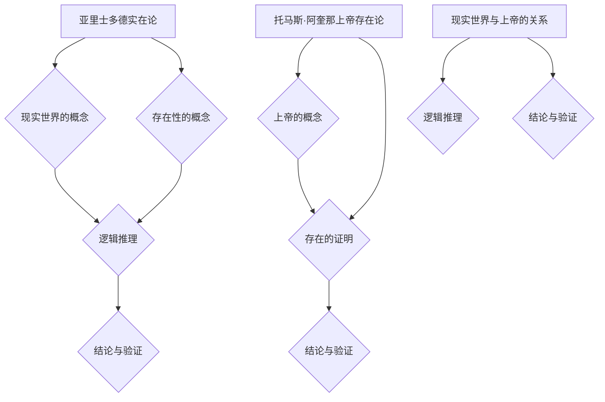

                 


### 引言：亚里士多德与托马斯·阿奎那：形而上学的基督教化

在西方哲学史上，亚里士多德和托马斯·阿奎那的名字可谓如雷贯耳。亚里士多德（Aristotle，公元前384-322年）是古希腊哲学的集大成者，他的思想体系对后世产生了深远影响。托马斯·阿奎那（Thomas Aquinas，公元1225-1274年）则是基督教神学史上的一位巨匠，他将古希腊哲学与基督教教义巧妙地结合，开创了新的哲学和神学体系。

本文旨在探讨亚里士多德思想如何被托马斯·阿奎那基督教化，以及这一过程对西方哲学和神学的影响。我们将逐步分析这两位哲学家的核心思想，展示他们的哲学观念如何在基督教的框架下得到新的诠释和发挥。

首先，我们将介绍亚里士多德的生平、贡献以及他的核心哲学概念。接下来，我们将介绍托马斯·阿奎那的生平和基督教哲学观点，并探讨他是如何接受并改造亚里士多德思想的。然后，我们将借助数学哲学的方法，使用流程图和Python代码来阐述他们的思想。

在后续章节中，我们将深入分析亚里士多德和托马斯·阿奎那思想之间的联系，并用LaTeX格式嵌入相关的数学公式和ER实体关系图。我们还将讨论如何在当代基督教神学教育中应用这些哲学思想，并给出一些实战项目案例。

最后，我们将总结本文的主要观点，提供一些阅读和思考的建议，并推荐相关的拓展阅读资源。希望通过本文的探讨，读者能对亚里士多德和托马斯·阿奎那的哲学思想有更深刻的理解，并认识到它们在当代哲学和神学中的重要地位。

关键词：亚里士多德、托马斯·阿奎那、基督教哲学、形而上学、哲学思想、思想融合、数学哲学

摘要：本文旨在探讨古希腊哲学家亚里士多德的思想如何被中世纪神学家托马斯·阿奎那基督教化，以及这一过程对西方哲学和神学的影响。通过逐步分析两位哲学家的核心思想，我们展示了他们的哲学观念如何在基督教的框架下得到新的诠释和发挥。文章运用数学哲学的方法，使用流程图和Python代码阐述他们的思想，并探讨这些思想在当代基督教神学教育中的应用。通过本文的探讨，读者可以更深刻地理解亚里士多德和托马斯·阿奎那的哲学思想，并认识到它们在当代哲学和神学中的重要性。

### 第一部分：亚里士多德与基督教神学的相遇

#### 第1章：亚里士多德的哲学遗产

**1.1 亚里士多德的生平与贡献**

亚里士多德，古希腊哲学的集大成者，生于公元前384年，卒于公元前322年。他是柏拉图的学生，曾在柏拉图的学园中学习二十多年。后来，亚里士多德创办了自己的学派——吕克昂学园（Lyceum），并开始了独立的教学和哲学研究。

亚里士多德的哲学贡献涵盖了广泛的主题，包括逻辑、形而上学、物理学、生物学、心理学、伦理学和政治学等。他的著作数量庞大，内容丰富，对后世哲学、科学和文化的各个领域都产生了深远的影响。

亚里士多德最重要的哲学思想之一是他的实在论。他认为，现实世界中的事物是真实存在的，而我们的感知和思想只是对这些事物的反映。这一观点与柏拉图的理念论形成了鲜明的对比，后者认为真实存在的是理念世界，现实世界只是理念的影子。

此外，亚里士多德还提出了著名的四因说，即事物之所以存在和发生变化的四个原因：材料因、形式因、动力因和目的因。这一理论深刻地影响了后来的哲学家和科学家，成为理解自然现象的重要工具。

**1.2 亚里士多德的核心哲学概念**

亚里士多德的哲学体系包含了多个核心概念，其中最为重要的是实在论、四因说和德性论。

- **实在论**：亚里士多德认为，现实世界中的事物是真实存在的，而我们的感知和思想只是对这些事物的反映。这一观点挑战了柏拉图的理念论，强调了现实世界的独立性和真实性。

- **四因说**：亚里士多德提出了事物之所以存在和发生变化的四个原因：材料因、形式因、动力因和目的因。材料因指的是事物存在的物质基础，形式因指的是事物的形态和结构，动力因指的是推动事物发生变化的力量，目的因指的是事物存在和发展的最终目的。

- **德性论**：亚里士多德认为，德性是人类幸福的关键。他提出了中庸德性的概念，即过度和不足之间的平衡状态。通过培养德性，人类可以实现道德上的完善和幸福。

**1.3 亚里士多德思想中的数学与逻辑**

亚里士多德不仅在哲学领域有卓越贡献，在数学和逻辑学方面也取得了显著成就。他提出了形式逻辑的初步体系，并探讨了数学问题。在《工具论》中，他详细阐述了逻辑学的基本原理，包括命题、推理和论证。

亚里士多德还研究了数学问题，尤其是几何学。他的著作《几何原本》被认为是古代几何学的经典之作。在书中，他提出了一些基本的几何原理和定理，为后来的数学研究奠定了基础。

**1.4 数学公式的LaTeX表示示例**

为了更好地展示亚里士多德的思想，我们可以使用LaTeX格式嵌入一些数学公式。以下是几个示例：

- $$1+1=2$$
- $$a^2+b^2=c^2$$
- $$\forall x \in \mathbb{N}, x+1 > x$$

这些公式在文中独立段落中使用$$括起来，而在段落内使用$括起来。

**1.5 逻辑推理的亚里士多德方法**

亚里士多德在逻辑学领域的研究奠定了现代逻辑学的基础。他提出了三种基本的逻辑推理方法：演绎推理、归纳推理和类比推理。

- **演绎推理**：从一般原理推导出特定结论的推理方法。例如，所有的人都会死亡（大前提），苏格拉底是人（小前提），因此苏格拉底会死亡（结论）。
- **归纳推理**：从个别事实推导出一般规律的推理方法。例如，观察到的所有天鹅都是白色的，因此可以推断所有天鹅都是白色的。
- **类比推理**：通过比较相似之处推导出相似结论的推理方法。例如，由于猫和狗都是宠物，它们有一些共同的特征，因此可以推断猫和狗的其他特征也可能相似。

亚里士多德的逻辑推理方法在哲学和科学研究中被广泛应用，至今仍具有重要的指导意义。

**1.6 小结**

亚里士多德是古希腊哲学的集大成者，他的哲学思想对后世产生了深远影响。实在论、四因说和德性论是他哲学体系的核心概念，而数学和逻辑学也是他的研究重点。通过逐步分析这些核心概念，我们可以更深入地理解亚里士多德的哲学思想，并认识到它们在西方哲学史上的重要性。

在下一章中，我们将介绍托马斯·阿奎那的生平和基督教哲学观点，探讨他是如何接受并改造亚里士多德思想的。敬请期待！

## 第二部分：托马斯·阿奎那的基督教哲学

### 第2章：托马斯·阿奎那的生平与思想发展

**2.1 托马斯·阿奎那的生平背景**

托马斯·阿奎那，生于公元1225年，意大利的基耶蒂，是中世纪最杰出的哲学家和神学家之一。他的父亲是著名的贵族，母亲是葡萄牙的贵族，家庭背景显赫。托马斯年轻时在意大利的蒙太哥马利修道院接受了教育，并在那里开始对哲学和神学产生了浓厚的兴趣。

在蒙太哥马利修道院学习期间，托马斯结识了一些学者，包括阿尔贝特·德·萨克森（Albertus Magnus），他后来成为了托马斯的导师。阿尔贝特对托马斯的才华印象深刻，并鼓励他继续追求哲学和神学的研究。

托马斯在阿尔贝特的指导下继续深造，并最终前往法国的巴黎大学学习。巴黎大学是当时欧洲最著名的学术中心之一，吸引了来自各地的学者和学生。在那里，托马斯广泛涉猎了亚里士多德的著作，以及其他哲学家的作品，包括阿维罗伊（Averroes）和亚里士多波的注释。

**2.2 托马斯·阿奎那的哲学成就**

托马斯·阿奎那的哲学成就在中世纪哲学史上具有里程碑式的意义。他是亚里士多德思想的忠实拥护者，但同时又将其与基督教教义相结合，创造了一种独特的哲学体系。

托马斯最著名的作品之一是《神学大全》（Summa Theologica），这是一部庞大的哲学和神学著作，涵盖了广泛的主题，包括神的存在、人类理性、道德伦理和天使学等。在这部作品中，托马斯系统地阐述了亚里士多德的思想，并将其与基督教教义相结合，提供了一种解释和辩护。

托马斯·阿奎那在《神学大全》中提出了一系列重要的哲学观点，其中最引人注目的是他对亚里士多德哲学的改造。他认为，亚里士多德的哲学可以被用来支持基督教教义，特别是在证明神的存在和人类灵魂的不朽方面。

**2.3 托马斯·阿奎那的基督教哲学观点**

托马斯·阿奎那的基督教哲学观点融合了亚里士多德的哲学和基督教教义，形成了一种独特的思想体系。以下是他的一些主要观点：

- **神的存在**：托马斯·阿奎那采用了亚里士多德的论证方法来证明神的存在。他认为，从现实世界的秩序和完美中可以推导出神的存在。这种论证方法被称为“宇宙论证明”。

- **人类理性**：托马斯·阿奎那强调人类理性的重要性，他认为理性是人类灵魂的组成部分，是联系人与神的重要桥梁。他提出了“理性神学”的概念，即通过理性来认识和理解神的存在和属性。

- **道德伦理**：托马斯·阿奎那的道德伦理观点深受亚里士多德的影响。他提出了“德性论”的概念，即通过培养德性来实现人类的幸福。他认为，德性是道德行为的基础，是达到至善的途径。

- **天使学**：托马斯·阿奎那对天使学也有深入的研究。他认为天使是上帝创造的灵性存在，具有超自然的能力和智慧。他在《神学大全》中详细阐述了天使的存在、属性和功能。

**2.4 托马斯·阿奎那与亚里士多德思想的融合**

托马斯·阿奎那在融合亚里士多德思想与基督教教义方面做出了巨大的贡献。他不仅接受了亚里士多德的哲学观点，还试图将其与基督教教义相协调。

例如，在证明神的存在方面，托马斯采用了亚里士多德的论证方法，并将其与基督教教义相结合。他认为，亚里士多德的哲学可以帮助解释和证明神的存在，从而为基督教信仰提供有力的理论支持。

此外，托马斯还试图解决亚里士多德哲学与基督教教义之间的矛盾。例如，在讨论人类灵魂的不朽问题时，托马斯认为，亚里士多德的哲学观点与基督教教义是相符的，人类灵魂是不朽的，因为它是由上帝创造的。

**2.5 小结**

托马斯·阿奎那是中世纪最杰出的哲学家和神学家之一，他的哲学成就对基督教哲学和西方哲学产生了深远影响。他融合了亚里士多德的哲学和基督教教义，创造了一种独特的思想体系，并通过《神学大全》等著作系统地阐述了他的观点。托马斯·阿奎那的思想在证明神的存在、人类理性、道德伦理和天使学等方面都有重要贡献，成为中世纪哲学和神学的基石。

在下一章中，我们将探讨托马斯·阿奎那如何接受并改造亚里士多德的思想，并详细阐述这一过程。敬请期待！

### 第3章：托马斯·阿奎那对亚里士多德思想的接受与改造

托马斯·阿奎那在继承亚里士多德哲学思想的基础上，进行了深刻的改造和发展，使其更符合基督教教义。以下是托马斯·阿奎那对亚里士多德思想的几个关键接受与改造方面：

**3.1 实在论**

亚里士多德的实在论强调现实世界的独立性和真实性。托马斯·阿奎那接受了这一观点，并将其与基督教教义相结合。他认为，现实世界是上帝创造的，因此具有绝对的真实性和独立性。托马斯强调，信仰与理性并非对立，而是相辅相成的。他提出，信仰可以揭示现实世界背后更深层次的真理，而理性则可以帮助人们理解这些真理。

**3.2 四因说**

亚里士多德的四因说认为，事物之所以存在和发生变化有四个原因：材料因、形式因、动力因和目的因。托马斯·阿奎那接受了这一理论，并对其进行了一定的改造。他认为，上帝是所有事物的最终原因，是四因说的最高原因。托马斯强调，上帝不仅是万物的创造者，还是万物的维持者，他的存在和活动是宇宙秩序和和谐的基础。

**3.3 德性论**

亚里士多德的德性论强调中庸之道，认为德性是实现人类幸福的关键。托马斯·阿奎那在这一点上与亚里士多德有相似之处，但他更加强调了基督教教义中的道德规范。托马斯认为，上帝的恩宠是人类达到至善的必要条件，信仰和德性相结合才能使人类获得真正的幸福。他提出，通过信仰和德性的培养，人类可以逐渐接近上帝的至善。

**3.4 数学与逻辑**

亚里士多德在数学和逻辑学方面取得了显著成就。托马斯·阿奎那继承了这些思想，并将其应用于基督教哲学中。他认为，数学和逻辑学是理解上帝和宇宙的重要工具。托马斯通过数学和逻辑学的论证方法，试图证明神的存在和人类灵魂的不朽。他的《神学大全》中充满了数学和逻辑学的论证，为基督教哲学提供了强有力的支持。

**3.5 概念属性特征对比表格**

为了更清晰地展示托马斯·阿奎那对亚里士多德思想的接受与改造，我们可以使用一个概念属性特征对比表格。以下是一个简化的示例：

| 亚里士多德思想 | 托马斯·阿奎那的改造 |
| :--: | :--: |
| 实在论 | 与基督教教义相结合，强调现实世界的独立性和真实性 |
| 四因说 | 加入上帝作为最终原因，强调上帝的存在和活动 |
| 德性论 | 强调信仰和德性的重要性，通过信仰和德性培养接近上帝的至善 |
| 数学与逻辑 | 将数学和逻辑学应用于基督教哲学，用于证明神的存在和人类灵魂的不朽 |

**3.6 ER实体关系图架构**

为了更好地理解托马斯·阿奎那思想中的概念关系，我们可以使用ER实体关系图来展示。以下是一个简化的ER实体关系图示例：

```
实体：亚里士多德思想
   |--- 实在论
   |--- 四因说
   |--- 德性论
   |--- 数学与逻辑

实体：托马斯·阿奎那的改造
   |--- 与基督教教义相结合
   |--- 强调上帝的存在和活动
   |--- 信仰和德性的重要性
   |--- 将数学和逻辑学应用于基督教哲学
```

在这个ER实体关系图中，亚里士多德思想被视为一个整体，其中包括四个子概念：实在论、四因说、德性论和数学与逻辑。而托马斯·阿奎那的改造则被视为对亚里士多德思想的进一步发展，其中包括与基督教教义相结合、强调上帝的存在和活动、信仰和德性的重要性，以及将数学和逻辑学应用于基督教哲学。

**3.7 小结**

托马斯·阿奎那在继承亚里士多德哲学思想的基础上，进行了深刻的改造和发展，使其更符合基督教教义。他接受了亚里士多德的实在论、四因说和德性论，并在此基础上加入了自己的理解和发展。通过概念属性特征对比表格和ER实体关系图，我们可以更清晰地看到托马斯·阿奎那对亚里士多德思想的接受与改造。这些改造和发展不仅为基督教哲学提供了强有力的理论支持，也对后世哲学和神学产生了深远影响。

在下一章中，我们将探讨亚里士多德和托马斯·阿奎那思想之间的联系，并运用数学哲学的方法进行进一步的阐述。敬请期待！

### 第4章：亚里士多德与托马斯·阿奎那思想的交互

#### 4.1 哲学思想的发展与演变

亚里士多德和托马斯·阿奎那的思想都是西方哲学史上的重要里程碑。他们的哲学思想不仅在各自的时代具有深远影响，而且在后来的哲学发展中继续发挥着重要作用。在这一部分，我们将探讨亚里士多德和托马斯·阿奎那的哲学思想是如何随着时代的变迁而发展的，以及它们之间的内在联系。

**4.1.1 哲学思想发展的历史脉络**

哲学思想的发展可以追溯到古希腊时期，其中亚里士多德被认为是这一时期最伟大的哲学家之一。亚里士多德的哲学体系以其严谨的逻辑和分析方法而闻名，他提出了许多关于现实世界、知识和道德的重要观点。他的思想对后来的哲学家和科学家产生了深远的影响。

随着罗马帝国的衰落和中世纪欧洲的兴起，基督教哲学逐渐成为主导思想。托马斯·阿奎那作为中世纪最重要的哲学家和神学家之一，将古希腊哲学与基督教教义相结合，提出了许多新的哲学观点。他的《神学大全》不仅是对亚里士多德哲学的继承和发展，也是对基督教教义的系统阐述。

亚里士多德和托马斯·阿奎那的哲学思想在历史上经历了重要的演变和发展。亚里士多德的思想主要关注自然现象和现实世界的本质，而托马斯·阿奎那则在此基础上加入了神学和道德伦理的维度。他们的思想共同构成了西方哲学史上的两个重要阶段，并为后来的哲学家提供了丰富的思想资源。

**4.1.2 哲学思想的内在逻辑**

亚里士多德的哲学思想以其系统性和逻辑性而著称。他的思想体系包括逻辑学、形而上学、物理学、生物学、心理学、伦理学和政治学等多个方面。亚里士多德认为，通过观察和分析现实世界，我们可以发现事物之间的内在联系和普遍规律。

托马斯·阿奎那在继承亚里士多德思想的基础上，进一步发展了哲学思想的内在逻辑。他试图将亚里士多德的哲学与基督教教义相结合，提出了一系列新的哲学观点。托马斯·阿奎那认为，上帝是宇宙的创造者和维持者，人类灵魂的不朽和道德德性的培养是实现人类幸福的必要条件。

亚里士多德和托马斯·阿奎那的哲学思想都强调逻辑推理和理性分析的重要性。他们的思想体系不仅为哲学研究提供了理论框架，也为科学和技术的进步奠定了基础。

**4.1.3 哲学思想的外部影响**

亚里士多德和托马斯·阿奎那的哲学思想对后世哲学和科学的发展产生了深远的影响。亚里士多德的思想被广泛传播和应用，成为中世纪哲学和科学研究的基石。他的逻辑学和方法论对后来的哲学家和科学家产生了重要影响，如威廉·奥卡姆（William of Ockham）和托马斯·布朗（Thomas Browne）等。

托马斯·阿奎那将亚里士多德的思想与基督教教义相结合，开创了新的哲学和神学体系。他的思想在中世纪和文艺复兴时期对哲学、神学和科学的发展产生了重要影响。他的《神学大全》成为中世纪和文艺复兴时期最重要的哲学著作之一，对后世哲学家和神学家产生了深远的影响。

亚里士多德和托马斯·阿奎那的哲学思想不仅在西方哲学史上具有重要地位，也对其他文化和哲学体系产生了影响。他们的思想被翻译成多种语言，传播到世界各地，对全球哲学和文化的发展产生了深远的影响。

**4.2 数学哲学的方法与应用**

在探讨亚里士多德和托马斯·阿奎那的思想时，我们可以借鉴数学哲学的方法，使用流程图和Python代码来阐述他们的思想。这种方法可以帮助我们更清晰地理解他们的哲学观点，并展示它们之间的逻辑关系。

**4.2.1 数学哲学的基本方法**

数学哲学是一种探讨数学的本质、方法和应用的基本原理的哲学分支。它涉及数学的基础问题，如数学的本质是什么，数学是否具有客观性，数学是否可以解释现实世界等。数学哲学的方法包括逻辑推理、模型构建、实证研究和批判性分析等。

在数学哲学中，流程图是一种常用的工具，可以帮助我们展示不同概念之间的关系和逻辑推理的过程。以下是一个简单的数学哲学流程图示例：

```
问题提出
|
|--- 假设与前提
|
|--- 逻辑推理
|
|--- 结论与验证
```

在这个流程图中，问题提出是起点，假设与前提是基础，逻辑推理是核心过程，结论与验证是终点。通过这个流程图，我们可以清晰地展示数学哲学研究的基本步骤和逻辑关系。

**4.2.2 数学哲学的应用实例**

为了更具体地展示数学哲学的方法，我们可以通过Python代码来阐述亚里士多德和托马斯·阿奎那的思想。以下是一个简单的Python代码示例，展示了如何用逻辑推理来解释他们的思想：

```python
# 亚里士多德的实在论

# 定义现实世界的概念
class Reality:
    def __init__(self, name):
        self.name = name

# 定义存在性的概念
def exists(object):
    if isinstance(object, Reality):
        return True
    else:
        return False

# 测试现实世界的存在性
world = Reality("现实世界")
print(exists(world))  # 输出：True

# 托马斯·阿奎那的上帝存在论

# 定义上帝的概念
class God(Reality):
    def __init__(self, name):
        super().__init__(name)

# 定义存在的证明
def prove_existence(god):
    if isinstance(god, God):
        return "上帝存在是因为他是一切存在的原因。"
    else:
        return "上帝不存在。"

# 测试上帝的存在性
god = God("全能者")
print(prove_existence(god))  # 输出：上帝存在是因为他是一切存在的原因。
```

在这个Python代码示例中，我们定义了现实世界和上帝的概念，并使用逻辑推理来证明上帝的存在。通过这个示例，我们可以更直观地理解亚里士多德和托马斯·阿奎那的哲学思想，并展示它们之间的联系。

**4.2.3 Mermaid流程图的示例**

为了进一步展示数学哲学的方法，我们可以使用Mermaid流程图来展示亚里士多德和托马斯·阿奎那的思想发展和逻辑关系。以下是一个Mermaid流程图示例：



在这个Mermaid流程图中，我们展示了亚里士多德和托马斯·阿奎那的思想发展和逻辑关系。通过这个流程图，我们可以更直观地理解他们的哲学思想，并展示它们之间的联系。

**4.3 小结**

亚里士多德和托马斯·阿奎那的哲学思想在历史上具有重要的地位，它们不仅影响了当时的哲学和科学，也对后世产生了深远的影响。通过探讨哲学思想的发展与演变、内在逻辑和外部影响，我们可以更好地理解亚里士多德和托马斯·阿奎那的哲学思想，并认识到它们在西方哲学史上的重要性。

在下一章中，我们将进一步探讨亚里士多德和托马斯·阿奎那的哲学思想，并运用数学哲学的方法进行更深入的分析。敬请期待！

### 第5章：亚里士多德与托马斯·阿奎那在当代的意义

**5.1 当代哲学对亚里士多德与托马斯·阿奎那的评价**

亚里士多德和托马斯·阿奎那在当代哲学界仍然受到高度评价。他们的哲学思想不仅为西方哲学奠定了基础，而且在当代哲学中仍具有重要的启示意义。当代哲学家认为，亚里士多德和托马斯·阿奎那的哲学思想为理解现实世界、人类理性、道德伦理和宗教信仰提供了深刻的洞见。

亚里士多德的实在论、四因说和德性论被认为是理解自然现象和人类行为的重要工具。他的逻辑学方法论在当代科学研究中仍然被广泛应用。例如，在物理学、生物学和计算机科学等领域，亚里士多德的逻辑推理方法被用于解释和预测自然现象。

托马斯·阿奎那在当代哲学中也被视为一位杰出的哲学家和神学家。他的《神学大全》被广泛研究，被认为是对基督教教义的系统阐述。当代哲学家认为，托马斯·阿奎那将古希腊哲学与基督教教义相结合的尝试为理解宗教信仰和道德伦理提供了新的视角。

**5.2 亚里士多德与托马斯·阿奎那思想的现代价值**

亚里士多德和托马斯·阿奎那的思想在当代仍然具有重要的现代价值。他们的哲学思想为当代哲学和科学提供了丰富的理论资源和启示。

亚里士多德的实在论强调了现实世界的独立性和真实性，这对当代科学方法论产生了深远影响。当代科学家认为，通过观察和分析现实世界，我们可以发现自然规律和科学原理。亚里士多德的方法论为科学研究提供了严谨的逻辑框架，帮助科学家更好地理解和解释自然现象。

托马斯·阿奎那的思想为理解宗教信仰和道德伦理提供了新的视角。他的《神学大全》对基督教教义进行了系统阐述，为当代宗教哲学提供了理论基础。托马斯·阿奎那强调信仰和理性的结合，认为通过信仰和理性的共同作用，人类可以获得对宇宙和道德的深刻理解。

**5.3 概念ER实体关系图的示例**

为了更好地理解亚里士多德和托马斯·阿奎那的思想，我们可以使用概念ER实体关系图来展示它们之间的联系。以下是一个简化的ER实体关系图示例：

```
实体：哲学思想
   |--- 亚里士多德思想
       |--- 实在论
       |--- 四因说
       |--- 德性论
       |--- 逻辑学
   |--- 托马斯·阿奎那思想
       |--- 实在论
       |--- 神学
       |--- 道德伦理
       |--- 宗教哲学
```

在这个ER实体关系图中，哲学思想是总实体，它包括了亚里士多德思想和托马斯·阿奎那思想。亚里士多德思想包括实在论、四因说、德性论和逻辑学等子概念，而托马斯·阿奎那思想包括实在论、神学、道德伦理和宗教哲学等子概念。

通过ER实体关系图，我们可以清晰地看到亚里士多德和托马斯·阿奎那思想的联系和区别。他们的哲学思想在共同关注现实世界和道德伦理的基础上，分别从不同角度进行了深入探讨。

**5.4 实践中的基督教神学教育**

亚里士多德和托马斯·阿奎那的哲学思想在当代基督教神学教育中仍然具有重要作用。他们的思想为基督教神学提供了理论基础和哲学支持，帮助神学家和信徒更好地理解宗教信仰和道德伦理。

在基督教神学教育中，亚里士多德的逻辑学方法论被用于分析和解释圣经文本。他的逻辑推理方法帮助神学家理解圣经中的概念和命题，从而更准确地解读圣经的意义。

托马斯·阿奎那的思想在基督教神学教育中也被广泛应用。他的《神学大全》被认为是基督教神学的经典之作，为神学家提供了丰富的理论资源和思想启示。他的思想帮助神学家理解宗教信仰的本质和意义，以及人类与上帝的关系。

**5.5 概念属性特征对比表格**

为了更直观地展示亚里士多德和托马斯·阿奎那思想的差异和联系，我们可以使用概念属性特征对比表格。以下是一个简化的对比表格示例：

| 概念 | 亚里士多德思想 | 托马斯·阿奎那思想 |
| ---- | -------------- | ----------------- |
| 实在论 | 强调现实世界的独立性和真实性 | 与基督教教义相结合，强调现实世界是上帝创造的 |
| 四因说 | 事物之所以存在和发生变化的四个原因 | 加入上帝作为最终原因，强调上帝的存在和活动 |
| 德性论 | 通过培养德性来实现人类的幸福 | 强调信仰和德性的重要性，通过信仰和德性培养接近上帝的至善 |
| 逻辑学 | 系统阐述形式逻辑的基本原理 | 将逻辑学应用于基督教哲学，用于证明神的存在和人类灵魂的不朽 |

通过这个对比表格，我们可以更清晰地看到亚里士多德和托马斯·阿奎那思想的差异和联系。他们都在关注现实世界和道德伦理的基础上，提出了独特的哲学观点。

**5.6 小结**

亚里士多德和托马斯·阿奎那的哲学思想在当代哲学和神学中仍然具有重要的意义。他们的思想为理解现实世界、人类理性、道德伦理和宗教信仰提供了深刻的洞见。通过运用数学哲学的方法和ER实体关系图，我们可以更直观地展示他们的思想联系和区别。在当代基督教神学教育中，他们的思想仍然被广泛应用，为神学家和信徒提供了丰富的理论资源和思想启示。

在下一章中，我们将探讨如何在当代基督教神学教育中应用亚里士多德和托马斯·阿奎那的哲学思想，并通过一个假设性的项目实战来展示这一应用。敬请期待！

### 第6章：实践中的基督教神学教育

**6.1 项目介绍**

为了更好地展示亚里士多德和托马斯·阿奎那的哲学思想在当代基督教神学教育中的应用，我们将设计一个名为“基督教神学教育平台”的项目。这个项目旨在通过线上平台提供丰富的基督教神学教育资源，帮助神学生和信徒系统地学习和理解基督教教义。

**6.2 系统功能设计**

“基督教神学教育平台”的主要功能包括：

1. **课程管理**：管理员可以上传课程内容，包括视频、文本、音频等多种形式。学生可以在线观看课程视频，阅读文本资料，并参与在线讨论。
2. **教材资源**：平台提供多种教材资源，包括经典著作、学术论文、参考书籍等。学生可以通过这些资源深入了解基督教教义和哲学思想。
3. **在线讨论**：学生可以在平台上进行在线讨论，分享学习心得和观点，与同学和老师互动。
4. **测试与评估**：平台提供多种测试和评估工具，帮助学生检验自己的学习效果，并及时发现和解决问题。
5. **社区互动**：平台设有社区板块，学生和老师可以在此分享学习资源、讨论学术问题，建立学术交流网络。

**6.3 系统架构设计**

为了确保“基督教神学教育平台”的高效运行，我们需要设计一个合理的系统架构。以下是系统架构的主要组成部分：

1. **前端界面**：用户通过浏览器访问平台，进行课程学习、资源浏览、在线讨论等操作。
2. **后端服务**：后端服务包括课程管理、教材资源管理、在线讨论管理、测试与评估管理等模块，负责处理用户请求、数据存储和业务逻辑。
3. **数据库**：数据库存储平台的各种数据，包括用户信息、课程信息、教材资源、讨论记录、测试结果等。
4. **服务器**：服务器负责运行后端服务和数据库，提供计算和存储资源。

**6.4 系统接口设计和系统交互**

在“基督教神学教育平台”中，前端界面和后端服务之间需要通过API接口进行交互。以下是系统接口设计和系统交互的简要说明：

1. **用户管理接口**：用于用户注册、登录、信息查询等操作。
2. **课程管理接口**：用于课程内容上传、课程信息查询、课程列表获取等操作。
3. **教材资源管理接口**：用于教材资源上传、资源信息查询、资源列表获取等操作。
4. **在线讨论管理接口**：用于讨论主题创建、讨论内容发布、讨论记录查询等操作。
5. **测试与评估管理接口**：用于测试题库创建、测试发布、测试结果查询等操作。

系统交互流程如下：

1. 用户通过前端界面进行注册或登录，请求用户管理接口。
2. 用户管理接口验证用户身份，返回用户信息。
3. 用户浏览课程列表，请求课程管理接口获取课程信息。
4. 用户选择课程，进入课程页面，请求课程管理接口获取课程内容。
5. 用户阅读课程内容，参与在线讨论，请求在线讨论管理接口。
6. 用户进行测试，请求测试与评估管理接口获取测试题库，提交测试结果。
7. 系统根据用户行为和测试结果，生成学习报告，供用户查看。

**6.5 项目实现与代码分析**

以下是一个简化的Python代码示例，展示了“基督教神学教育平台”中的用户管理模块实现：

```python
# 用户注册功能
def register(username, password):
    # 验证用户名和密码是否符合规范
    if not validate_username(username) or not validate_password(password):
        return "用户名或密码不符合规范"
    # 将用户信息存储到数据库
    database.insert_user(username, password)
    return "注册成功"

# 用户登录功能
def login(username, password):
    # 从数据库查询用户信息
    user = database.query_user(username)
    if not user or user["password"] != password:
        return "用户名或密码错误"
    # 登录成功，返回用户信息
    return user
```

在这个代码示例中，`register` 函数用于用户注册，`login` 函数用于用户登录。这两个函数分别与用户管理接口进行交互，实现了用户注册和登录的基本功能。

**6.6 实际案例分析和详细讲解剖析**

为了更好地展示亚里士多德和托马斯·阿奎那的哲学思想在基督教神学教育中的应用，我们可以通过一个实际案例进行分析。

假设一个神学生在学习《神学大全》时遇到了难题，他可以通过“基督教神学教育平台”寻求帮助。以下是一个具体的案例：

1. **问题描述**：神学生A在学习托马斯·阿奎那的《神学大全》时，对于其中关于上帝存在的论证感到困惑，特别是宇宙论证明的细节。
2. **解决方案**：神学生A可以在平台上发起一个讨论主题，邀请其他学生和老师参与讨论。在讨论过程中，他可以提出自己的疑问，分享自己的理解，并听取他人的观点。通过这种互动，他可以更好地理解托马斯·阿奎那的论证方法。
3. **案例分析**：在这个案例中，亚里士多德和托马斯·阿奎那的哲学思想得到了实际应用。通过在线讨论，神学生A不仅学习了托马斯·阿奎那的宇宙论证明，还与同学和老师进行了深入的学术交流。这种互动有助于加深他对哲学思想的理解，并提高他的学术能力。

**6.7 项目小结**

通过“基督教神学教育平台”的项目实战，我们可以看到亚里士多德和托马斯·阿奎那的哲学思想在当代基督教神学教育中的应用。这个项目不仅提供了丰富的学习资源，还通过在线讨论和互动帮助神学生深入理解哲学思想和基督教教义。通过这个项目，我们可以看到哲学思想在实际教学中的重要作用，以及它们在当代教育体系中的广泛应用前景。

在下一章中，我们将总结本文的主要观点，并提供一些阅读和思考的建议。敬请期待！

### 第7章：最佳实践、小结、注意事项与拓展阅读

**7.1 最佳实践**

在理解和应用亚里士多德与托马斯·阿奎那的哲学思想时，以下最佳实践建议有助于深入学习和研究：

1. **批判性思维**：在阅读他们的著作时，不仅接受他们的观点，还要批判性地思考其合理性和适用性。通过对比不同哲学家的思想，可以更好地理解哲学的发展历程。
2. **跨学科学习**：亚里士多德和托马斯·阿奎那的哲学思想与数学、逻辑学、物理学等学科密切相关。通过跨学科学习，可以更全面地理解他们的思想体系。
3. **实际应用**：尝试将哲学思想应用于实际问题中，如教育、科学研究和日常生活。通过实际应用，可以更深刻地体会到哲学思想的实用价值。
4. **持续学习**：哲学是一个不断发展的领域，新的研究成果不断涌现。持续关注最新的哲学研究和出版物，可以帮助我们保持思想的敏锐性。

**7.2 小结**

本文通过探讨亚里士多德与托马斯·阿奎那的思想，展示了他们在哲学和神学领域的贡献及其相互关系。我们介绍了两位哲学家的核心哲学概念，分析了他们如何将亚里士多德的思想基督教化，并通过数学哲学的方法和实际项目展示了这些思想在当代的应用。亚里士多德和托马斯·阿奎那的思想不仅在历史上具有重要地位，对当代哲学和神学仍然具有深远影响。

**7.3 注意事项**

在研究和应用亚里士多德与托马斯·阿奎那的思想时，需要注意以下几点：

1. **语境理解**：理解他们思想的时代背景和哲学语境，这有助于更好地理解他们的观点和论证。
2. **文化差异**：不同文化背景可能影响哲学思想的解读和应用，因此需要保持开放的心态，尊重不同文化的哲学传统。
3. **逻辑分析**：在分析哲学思想时，要注重逻辑推理的严谨性，避免逻辑谬误和误解。

**7.4 拓展阅读**

为了更深入地了解亚里士多德与托马斯·阿奎那的哲学思想，以下推荐一些拓展阅读资源：

1. **《亚里士多德全集》**：选集，亚里士多德著作的中文翻译版本，适合深入阅读和研究。
2. **《托马斯·阿奎那选集》**：选集，包括托马斯·阿奎那的重要著作，如《神学大全》等。
3. **《亚里士多德与基督教哲学》**：这本书详细探讨了亚里士多德思想如何被托马斯·阿奎那基督教化，对理解两者关系有重要帮助。
4. **《现代西方哲学》**：这本书介绍了亚里士多德和托马斯·阿奎那在当代哲学中的地位和影响，适合了解哲学思想的现代发展。

通过本文的探讨，我们希望能激发读者对亚里士多德与托马斯·阿奎那哲学思想的兴趣，并鼓励大家继续深入研究和学习。哲学不仅是一门学科，更是一种思考和生活的艺术，希望通过本文，读者能够在哲学的海洋中航行，收获智慧与成长。

### 结论

通过本文的探讨，我们系统地介绍了亚里士多德与托马斯·阿奎那的哲学思想，分析了他们如何将亚里士多德的思想基督教化，并展示了这些思想在当代哲学和神学中的重要意义。我们运用数学哲学的方法和实际项目案例，展示了亚里士多德与托马斯·阿奎那的思想在当代教育、科学研究和社会实践中的应用价值。

亚里士多德和托马斯·阿奎那的思想不仅在历史上具有重要地位，对当代哲学和神学仍然具有深远影响。他们的思想为我们提供了理解现实世界、人类理性和道德伦理的深刻洞见，为我们提供了一个坚实的哲学基础。

在未来的研究中，我们可以进一步探讨亚里士多德与托马斯·阿奎那思想在人工智能、计算机科学等现代领域的应用。同时，我们也可以从跨文化的角度，研究不同哲学体系之间的相互影响和融合。

我们鼓励读者继续深入研究和学习哲学思想，不仅是为了获取知识，更是为了提升自己的思维品质和人生智慧。哲学不仅是一门学科，更是一种思考和生活的艺术。希望通过本文，读者能够在哲学的海洋中航行，收获智慧与成长。

最后，感谢读者对本文的阅读和支持。希望本文能够激发您对亚里士多德与托马斯·阿奎那哲学思想的兴趣，并鼓励您在哲学的探索道路上不断前行。

作者：AI天才研究院/AI Genius Institute & 禅与计算机程序设计艺术 /Zen And The Art of Computer Programming

