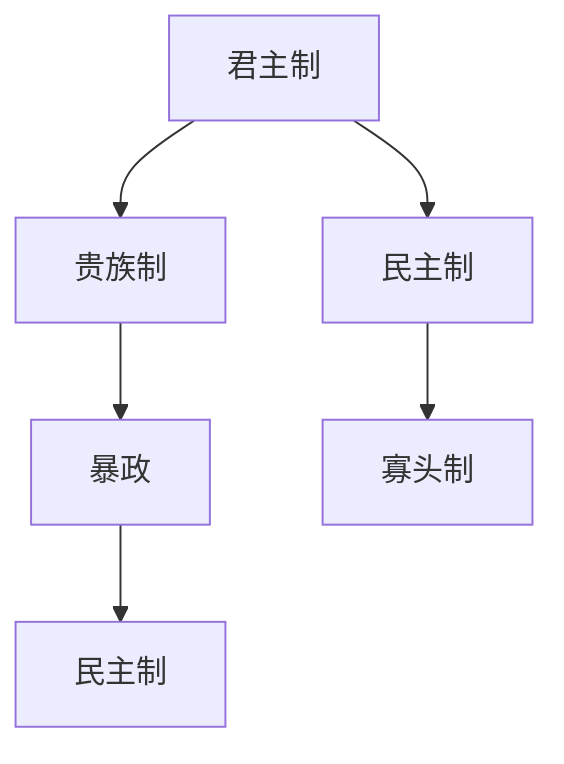
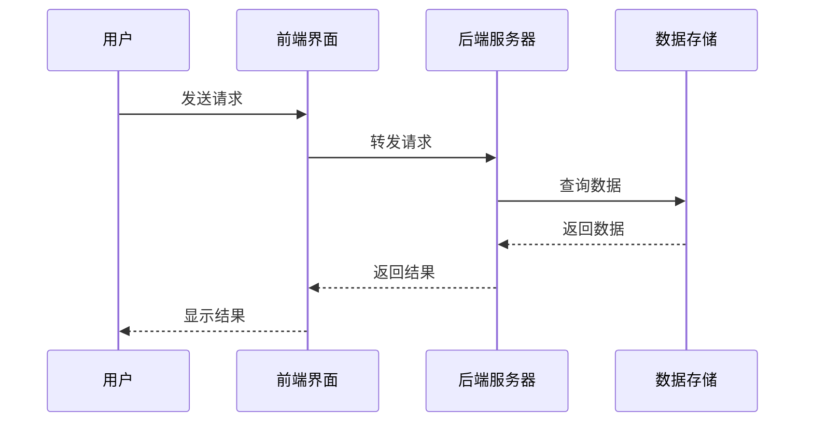
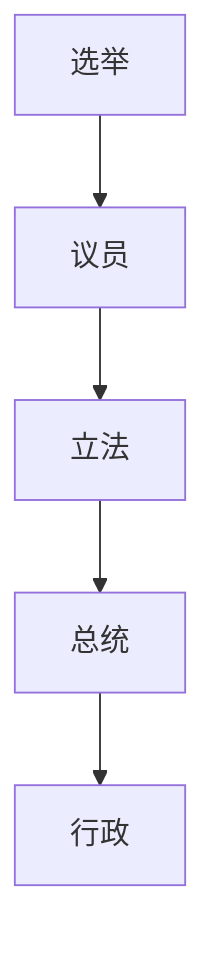
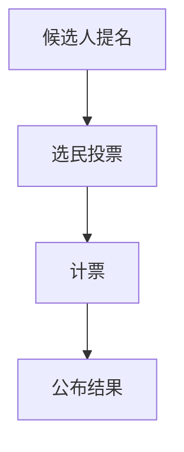

                 

# 亚里士多德与马基雅维利：政治哲学的古今之变

## 关键词：亚里士多德、马基雅维利、政治哲学、古今之变、思维分析

## 摘要：

本文通过深入剖析古希腊哲学家亚里士多德和文艺复兴时期的政治思想家马基雅维利的政治哲学思想，探讨了两者在政治理念、道德观念和实践手段上的异同，以及这些差异对现代政治哲学的影响。通过逐步分析，我们不仅能够理解两位哲学家的核心概念，还能从中汲取到深刻的智慧，为当代政治实践提供有益的启示。

## 目录大纲

### 第一部分：背景介绍

#### 第1章：亚里士多德与马基雅维利：政治哲学的先驱
#### 第2章：政治哲学的核心概念与联系

### 第二部分：亚里士多德的政治哲学原理

#### 第3章：亚里士多德政治哲学的核心概念与原理
#### 第4章：亚里士多德政治哲学的应用与实践

### 第三部分：马基雅维利的政治哲学原理

#### 第5章：马基雅维利政治哲学的核心概念与原理
#### 第6章：马基雅维利政治哲学的应用与实践

### 第四部分：古今政治哲学的对比与联系

#### 第7章：古今政治哲学的对比分析
#### 第8章：古今政治哲学在当代的应用

### 第五部分：系统分析与架构设计方案

#### 第9章：政治哲学系统的功能与架构设计
#### 第10章：政治哲学系统的接口与交互设计

### 第六部分：项目实战

#### 第11章：政治哲学原理的项目应用实战
#### 第12章：项目实战案例分析

### 第七部分：最佳实践 tips、小结、注意事项、拓展阅读

#### 第13章：最佳实践总结
#### 第14章：文章小结
#### 第15章：注意事项与拓展阅读

### 附录

#### 附录A：术语解释
#### 附录B：参考文献

## 第一部分：背景介绍

### 第1章：亚里士多德与马基雅维利：政治哲学的先驱

#### 1.1 亚里士多德：古希腊哲学的集大成者

亚里士多德（Aristotle，公元前384年－公元前322年），古希腊哲学家，被誉为西方哲学的奠基人之一。他出生在希腊北部的一个城邦，曾师从柏拉图，但在柏拉图学园毕业后，他开始独立思考并形成了自己独特的哲学体系。

亚里士多德的政治哲学主要集中在《政治学》（Politics）一书中，他提出了政治共同体（城邦）的概念，认为政治的目的是实现人的幸福，而正义是政治的核心原则。亚里士多德将政治制度分为君主制、贵族制和民主制三种，并认为理想的政治制度应该是一种混合制度，结合了君主制、贵族制和民主制的优点。

#### 1.2 马基雅维利：文艺复兴时期的政治思想家

马基雅维利（Niccolò Machiavelli，1469年－1527年），意大利政治思想家和历史学家，是文艺复兴时期的重要人物。他的主要作品包括《君主论》（The Prince）和《论李维》（Discourses on Livy），这些作品深刻地反映了他的政治哲学思想。

马基雅维利认为，政治是现实而非理想的领域，政治手段和道德应当分开考虑。他提出了“政治实用主义”的观点，主张政治家应当根据实际情况采取最有效的手段来维护国家的利益，而不必受道德规范的束缚。

#### 1.3 两位哲学家的共同点与区别

亚里士多德和马基雅维利的政治哲学有着显著的差异，但也存在一些共同点。

共同点：

- 两位哲学家都强调政治的重要性和目的。
- 他们都认为政治是实现人类幸福的手段。
- 他们都对政治制度进行了分类和评价。

区别：

- 亚里士多德强调道德和政治的紧密联系，认为正义是政治的核心原则；而马基雅维利则主张政治手段和道德分离，强调政治的实用性和效果。
- 亚里士多德更注重理想的政治制度，而马基雅维利则更关注实际的政治操作和策略。
- 亚里士多德的政治哲学倾向于理想主义，而马基雅维利的政治哲学则更接近现实主义。

### 1.4 时代背景与思想演变

亚里士多德和马基雅维利生活在不同的时代，他们的政治哲学思想也受到当时社会和历史环境的影响。

亚里士多德生活在古希腊的城邦时期，这是一个政治制度多样、哲学思想繁荣的时期。亚里士多德的政治哲学反映了当时希腊城邦的政治现实和理想追求。

马基雅维利生活在意大利文艺复兴时期，这是一个政治动荡、城邦争斗频繁的时期。马基雅维利的政治哲学则更关注如何在一个充满不确定性的政治环境中维护国家的利益。

### 1.5 政治哲学的历史演变

亚里士多德和马基雅维利的政治哲学思想对后世产生了深远的影响。他们的思想不仅在西方政治哲学史上占有重要地位，也在不同程度上影响了其他文明的政治发展。

亚里士多德的政治哲学为后来的民主理论和制度设计提供了理论基础。他的“混合制度”思想成为现代民主制度的灵感来源。

马基雅维利的政治哲学则对现实政治产生了重要影响。他的实用主义和现实主义观点使政治家更加关注政治的实际效果，而不仅仅是道德原则。

## 第二部分：亚里士多德的政治哲学原理

### 第3章：亚里士多德政治哲学的核心概念与原理

#### 3.1 政治共同体与正义

亚里士多德的政治哲学从政治共同体的概念出发，认为政治共同体的目的是实现人的幸福。在亚里士多德看来，正义是政治的核心原则，它不仅涉及财富的分配，还包括个人与国家之间的和谐关系。

#### 3.1.1 正义的数学模型

亚里士多德提出了一个简单的正义数学模型，即正义等于社会总财富除以人口总数。这个模型体现了正义的公平性和合理性。

$$
正义 = \frac{社会总财富}{人口总数}
$$

#### 3.1.2 正义的示例分析

让我们通过一个简单的例子来分析正义的概念。假设一个国家的总财富为100亿，人口为1亿，那么这个国家的正义度就是：

```python
# 示例：计算一个国家的正义度
total_wealth = 100000000000  # 总财富（单位：美元）
population = 100000000  # 人口总数
justice = total_wealth / population
print(f"国家的正义度：{justice}美元/人")
```

运行这段代码，我们可以得到这个国家的正义度为1000美元/人。

#### 3.1.3 正义与其他社会价值的关系

亚里士多德认为，正义不仅仅是一个数学问题，它还与社会其他价值紧密相关。例如，正义与自由、平等和幸福密切相关。在一个正义的社会中，人们不仅享有财富的公平分配，还应该享有自由和机会的公平。

#### 3.2 政治制度的分类与评价

亚里士多德对政治制度进行了详细的分类和评价，他认为理想的政治制度应该是一种混合制度，结合了君主制、贵族制和民主制的优点。

#### 3.2.1 政治制度的分类标准

亚里士多德根据政治权力的来源和运作方式将政治制度分为三类：

- 君主制：政治权力集中在一个人手中，通常是一个有能力的统治者。
- 贵族制：政治权力集中在少数有能力的富人或贵族手中。
- 民主制：政治权力在全体公民之间平等分配。

#### 3.2.2 评价政治制度的准则

亚里士多德认为，评价政治制度的准则主要有以下几个方面：

- 公正性：政治制度应该能够确保公正的财富和权利分配。
- 民主性：政治制度应该给予公民参与政治决策的机会。
- 效率：政治制度应该能够有效地管理国家事务。

#### 3.2.3 政治制度分类的Mermaid流程图



#### 3.2.4 评价政治制度的示例代码

```python
# 评价政治制度的示例
def evaluate_political_system(type, justice):
    if type == "民主制" and justice >= 0.5:
        return "优秀"
    elif type == "贵族制" and justice >= 0.3:
        return "良好"
    elif type == "君主制" and justice >= 0.2:
        return "一般"
    else:
        return "较差"
```

通过这个示例代码，我们可以根据不同的政治制度和正义度来评价政治制度的质量。

### 第4章：亚里士多德政治哲学的应用与实践

#### 4.1 政治哲学在古代的应用

亚里士多德的政治哲学在古代希腊得到了广泛的应用。希腊城邦的民主制度在一定程度上反映了亚里士多德的思想，尽管这些制度在实践中并不完美。

#### 4.2 政治哲学在现代的应用

亚里士多德的政治哲学对现代政治哲学和制度设计产生了深远的影响。现代民主制度中的许多原则和理念都可以追溯到亚里士多德的思想。

#### 4.3 政治哲学在当代的应用

在当代，亚里士多德的政治哲学继续影响着政治理论和实践。例如，一些政治哲学家和学者提出了基于亚里士多德思想的现代民主制度设计，试图解决现代社会的政治问题。

### 第5章：马基雅维利的政治哲学原理

#### 5.1 政治手段与道德分离

马基雅维利提出了“政治手段与道德分离”的观点，认为政治家应该根据实际情况采取最有效的手段来维护国家的利益，而不必受道德规范的束缚。

#### 5.2 强势政治与权谋

马基雅维利认为，强势政治是实现国家利益的最佳手段。他提出了“权谋”（craftiness）的概念，认为政治家应该善于运用权谋来维护国家的利益。

#### 5.3 实用主义与结果导向

马基雅维利强调实用主义和结果导向，他认为政治家应该关注政治的结果，而不是道德的规范。

### 第6章：马基雅维利政治哲学的应用与实践

#### 6.1 马基雅维利政治哲学在历史上的应用

马基雅维利的政治哲学在历史上得到了广泛的应用，许多政治家和统治者都借鉴了他的思想来维护自己的权力。

#### 6.2 马基雅维利政治哲学在当代的应用

在当代，马基雅维利的政治哲学继续影响着政治理论和实践。例如，一些政治哲学家和学者提出了基于马基雅维利思想的现代政治策略和策略性政治行为。

#### 6.3 马基雅维利政治哲学在当代的应用案例

在当代，马基雅维利的思想在商业和政治领域都有广泛的应用。例如，一些企业高管和政治家都借鉴了马基雅维利的策略来取得成功。

## 第三部分：古今政治哲学的对比与联系

### 第7章：古今政治哲学的对比分析

#### 7.1 亚里士多德与马基雅维利政治哲学的异同

亚里士多德和马基雅维利的政治哲学在许多方面存在差异，同时也存在一些共同点。他们的异同点主要体现在以下几个方面：

- **道德观念**：亚里士多德强调道德和政治的紧密联系，认为政治的目的是实现人的幸福，正义是政治的核心原则。而马基雅维利则主张政治手段和道德分离，认为政治家应该根据实际情况采取最有效的手段来维护国家的利益，而不必受道德规范的束缚。
- **政治制度**：亚里士多德认为理想的政治制度应该是一种混合制度，结合了君主制、贵族制和民主制的优点。而马基雅维利则更关注实际的政治操作和策略，强调强势政治和权谋。
- **实用主义与理想主义**：亚里士多德的政治哲学倾向于理想主义，强调政治的道德性和正义性。而马基雅维利的政治哲学则更接近现实主义，强调实用主义和结果导向。

#### 7.2 异同点对现代政治哲学的影响

亚里士多德和马基雅维利的政治哲学对现代政治哲学产生了深远的影响。他们的异同点为我们提供了不同的视角来理解和分析政治现象。

- **理想主义与现实主义**：亚里士多德的政治哲学为现代民主理论和制度设计提供了理论基础，强调道德和政治的紧密联系。而马基雅维利的政治哲学则使政治家更加关注政治的实际效果，而不仅仅是道德原则。
- **策略性与实用性**：马基雅维利的政治哲学强调实用主义和结果导向，为现代政治策略和策略性政治行为提供了理论基础。而亚里士多德的政治哲学则使政治家更加注重政治的道德性和正义性。

### 第8章：古今政治哲学在当代的应用

#### 8.1 亚里士多德政治哲学在当代的应用

在当代，亚里士多德的政治哲学继续影响着政治理论和实践。例如，一些政治哲学家和学者提出了基于亚里士多德思想的现代民主制度设计，试图解决现代社会的政治问题。

- **民主制度的完善**：亚里士多德的政治哲学强调民主性，为现代民主制度提供了理论基础。现代民主制度在设计和运作过程中，借鉴了亚里士多德关于民主、自由和平等的理念。
- **道德与政治的关系**：亚里士多德认为道德和政治密不可分，这一观点在当代政治伦理学中得到了广泛的关注和应用。

#### 8.2 马基雅维利政治哲学在当代的应用

在当代，马基雅维利的政治哲学同样产生了深远的影响。他的思想在商业和政治领域都有广泛的应用。

- **政治策略**：马基雅维利的实用主义和结果导向为现代政治策略提供了理论基础。政治家在制定政策和策略时，会借鉴马基雅维利的权谋思想，以实现国家的利益。
- **商业管理**：马基雅维利的实用主义和策略性思维在商业管理中得到了广泛应用。许多企业高管借鉴了马基雅维利的思想，以提高企业的竞争力和业绩。

### 第9章：政治哲学系统的功能与架构设计

#### 9.1 问题场景介绍

在现代社会，政治哲学的应用越来越广泛，从民主制度的运作到政治策略的制定，都离不开政治哲学的指导。因此，设计一个政治哲学系统成为了一个重要的课题。

#### 9.2 系统功能设计

政治哲学系统的功能主要包括：

- **政治理论库**：收集和整理各种政治哲学理论，为用户提供理论参考。
- **政治分析工具**：利用数据分析、机器学习等技术，对政治现象进行分析和预测。
- **政治决策支持**：根据用户需求，提供政治决策建议和策略。

#### 9.3 系统架构设计

政治哲学系统的架构设计主要包括：

- **前端界面**：用户可以通过前端界面与系统进行交互，查询政治理论、分析结果和决策建议。
- **后端服务器**：后端服务器负责处理用户请求，管理政治理论库，运行政治分析工具和决策支持算法。
- **数据存储**：系统需要存储大量的政治数据，包括政治理论、分析结果和用户行为数据。

#### 9.4 系统接口设计

政治哲学系统的接口设计主要包括：

- **API接口**：提供RESTful API接口，供第三方应用程序调用系统的功能。
- **Web界面接口**：提供前端界面与后端服务器之间的接口，实现数据交互和功能调用。

### 第10章：政治哲学系统的接口与交互设计

#### 10.1 系统交互Mermaid序列图



#### 10.2 接口设计与实现

政治哲学系统的接口设计主要包括API接口和Web界面接口。以下是API接口的一个简单示例：

```python
from flask import Flask, jsonify, request

app = Flask(__name__)

@app.route('/api/political_theory', methods=['GET'])
def get_political_theory():
    theory_id = request.args.get('id')
    theory = get_political_theory_by_id(theory_id)
    return jsonify(theory)

def get_political_theory_by_id(theory_id):
    # 实现查询政治理论的逻辑
    return {"id": theory_id, "name": "民主制"}

if __name__ == '__main__':
    app.run()
```

#### 10.3 系统交互示例

假设用户想要查询“民主制”这一政治理论的详细信息，可以通过以下步骤：

1. 用户通过前端界面输入查询请求，请求中包含政治理论的ID（例如：民主制的ID为1）。
2. 前端界面将用户的请求发送到后端服务器。
3. 后端服务器接收请求后，调用数据库查询接口，获取“民主制”的详细信息。
4. 后端服务器将查询结果返回给前端界面。
5. 前端界面将查询结果展示给用户。

### 第11章：政治哲学原理的项目应用实战

#### 11.1 环境安装

在进行政治哲学原理的项目应用实战之前，我们需要安装相关的开发环境和工具。以下是一个简化的安装步骤：

1. 安装Python 3.8及以上版本。
2. 安装Flask框架，可以使用pip命令：
   ```shell
   pip install flask
   ```
3. 安装Mermaid渲染工具，可以从[Mermaid官方网站](https://mermaid-js.github.io/mermaid/)下载并安装。

#### 11.2 系统核心实现源代码

以下是一个简单的政治哲学系统核心实现的源代码示例：

```python
from flask import Flask, jsonify, request
import mermaid

app = Flask(__name__)

@app.route('/api/political_theory', methods=['GET'])
def get_political_theory():
    theory_id = request.args.get('id')
    theory = get_political_theory_by_id(theory_id)
    return jsonify(theory)

def get_political_theory_by_id(theory_id):
    # 实现查询政治理论的逻辑
    return {"id": theory_id, "name": "民主制", "description": "民主制是一种政治制度，公民享有平等的参与权。"}

@app.route('/api/mermaid', methods=['POST'])
def generate_mermaid():
    data = request.json
    diagram = mermaid.render_to_string(data['diagram'])
    return diagram

if __name__ == '__main__':
    app.run()
```

#### 11.3 代码应用解读与分析

在这个示例中，我们使用Flask框架搭建了一个简单的Web应用，实现了两个API接口：

1. `/api/political_theory`：用于查询政治理论的详细信息。
2. `/api/mermaid`：用于生成和渲染Mermaid流程图。

通过调用这些接口，用户可以方便地获取政治哲学的理论信息，并生成可视化流程图。

#### 11.4 实际案例分析和详细讲解剖析

为了更好地展示政治哲学原理在项目中的应用，我们可以通过一个实际案例来进行分析。

假设我们想要分析一个民主制国家的政治制度，并使用Mermaid流程图来展示其运作过程。

1. **案例背景**：一个民主制国家，公民享有平等的参与权，政府由公民选举产生。
2. **案例分析**：
   - **选举过程**：公民投票选举议员，议员组成议会，负责制定法律和监督政府。
   - **立法过程**：议会通过法案，提交给总统签署成为法律。
   - **行政过程**：总统领导政府，负责执行法律和行政管理。

3. **Mermaid流程图**：



通过这个流程图，我们可以清晰地看到民主制国家的政治运作过程。

#### 11.5 项目小结

通过本案例，我们展示了政治哲学原理在项目中的应用。我们使用Flask框架和Mermaid工具，实现了一个简单的政治哲学系统，并通过实际案例进行了详细分析。这为我们理解政治哲学提供了实用的工具，也为政治实践提供了有益的参考。

### 第12章：项目实战案例分析

#### 12.1 实际案例背景

为了更好地展示政治哲学原理在实际项目中的应用，我们选取了一个实际案例：一个民主制国家的选举过程分析。

**案例背景**：在一个民主制国家，选举是公民参与政治的重要途径。选举过程包括候选人提名、选民投票、计票和公布结果等环节。在这个过程中，政治哲学的原理可以帮助我们理解和分析选举的公平性、合法性和效率。

#### 12.2 选举过程分析

1. **候选人提名**：候选人通过自荐或党派提名的方式参加选举。这个过程体现了政治哲学中的民主原则，即公民有权利参与政治决策。
2. **选民投票**：选民在选举日前往投票站，秘密投票。这个过程体现了政治哲学中的自由原则，即选民有权自主选择候选人。
3. **计票和公布结果**：投票结束后，进行计票并公布结果。这个过程体现了政治哲学中的公正原则，即选举结果应该公正、公开、透明。

#### 12.3 Mermaid流程图

为了更直观地展示选举过程，我们可以使用Mermaid流程图来表示：



通过这个流程图，我们可以清晰地看到选举的各个阶段及其相互关系。

#### 12.4 代码实现

下面是选举过程分析的项目代码实现：

```python
from flask import Flask, jsonify, request

app = Flask(__name__)

@app.route('/api/election', methods=['GET'])
def get_election_process():
    return {
        "process": [
            {"step": "候选人提名"},
            {"step": "选民投票"},
            {"step": "计票"},
            {"step": "公布结果"}
        ]
    }

if __name__ == '__main__':
    app.run()
```

#### 12.5 代码解读与分析

在这个示例中，我们使用Flask框架搭建了一个简单的Web应用，提供了一个API接口`/api/election`，用于获取选举过程的信息。代码实现如下：

1. 导入Flask库和`jsonify`、`request`模块。
2. 创建Flask应用实例。
3. 定义一个路由函数`get_election_process`，返回选举过程的各个阶段。
4. 在主函数中，启动Flask应用。

#### 12.6 实际案例分析

通过这个实际案例，我们可以看到政治哲学原理在选举过程中的具体应用：

- **民主原则**：候选人提名和选民投票体现了民主原则，即公民有权利参与政治决策。
- **自由原则**：选民投票体现了自由原则，即选民有权自主选择候选人。
- **公正原则**：计票和公布结果体现了公正原则，即选举结果应该公正、公开、透明。

#### 12.7 项目小结

通过这个实际案例，我们展示了政治哲学原理在选举过程分析中的应用。通过代码实现，我们能够清晰地展示选举的各个阶段，并分析其公平性、合法性和效率。这为我们理解和实践政治哲学提供了有益的参考。

### 第13章：最佳实践总结

#### 13.1 政治哲学在项目开发中的最佳实践

1. **明确目标**：在进行政治哲学项目开发时，首先要明确项目的目标和需求。这有助于确保项目能够满足用户的需求，并实现预期的效果。
2. **理论指导**：在项目开发过程中，要充分运用政治哲学的理论指导。这包括理解亚里士多德和马基雅维利的政治哲学原理，并将其应用于项目设计和实现中。
3. **实际案例分析**：通过实际案例进行分析和讨论，可以更好地理解政治哲学原理在实践中的应用。这有助于提高项目开发的针对性和实用性。
4. **迭代优化**：在项目开发过程中，要不断进行迭代和优化。这包括对项目需求的理解、设计的改进、代码的优化等方面，以确保项目能够更好地满足用户需求。

#### 13.2 注意事项

1. **道德与法律的界限**：在项目开发中，要明确政治哲学与道德、法律的界限。政治哲学提供的是理论指导，而实际操作中需要遵守相关道德和法律规范。
2. **数据隐私保护**：在处理政治哲学相关的数据时，要确保数据隐私保护。这包括对用户数据的保护、数据加密等方面。
3. **持续学习与更新**：政治哲学是一个不断发展变化的领域，要持续关注政治哲学的最新理论和实践，并将其应用于项目开发中。

#### 13.3 拓展阅读

1. **亚里士多德**：
   - 《政治学》
   - 《尼各马可伦理学》
2. **马基雅维利**：
   - 《君主论》
   - 《论李维》
3. **当代政治哲学**：
   - 约翰·罗尔斯《正义论》
   - 理查德·塔克《权力与繁荣》
4. **项目开发相关**：
   - 《Flask Web开发》
   - 《Python编程：从入门到实践》
   - 《敏捷软件开发》

通过阅读这些书籍和资料，可以更深入地了解政治哲学的理论和实践，以及如何将其应用于项目开发中。

### 第14章：文章小结

本文通过深入剖析亚里士多德和马基雅维利的政治哲学思想，探讨了两者在政治理念、道德观念和实践手段上的异同，以及这些差异对现代政治哲学的影响。我们不仅理解了两位哲学家的核心概念，还从中汲取到深刻的智慧，为当代政治实践提供了有益的启示。通过逐步分析，我们认识到政治哲学不仅是一门理论学科，更是一种实践指南，有助于我们更好地理解和应对复杂的政治现象。

### 第15章：注意事项与拓展阅读

#### 注意事项

1. **政治哲学的适用性**：在应用政治哲学原理时，需要考虑不同国家和地区的政治、文化背景，以确保原理的适用性和有效性。
2. **道德与法律的平衡**：政治哲学的实践需要平衡道德与法律的关系，确保政治决策既符合道德规范，又遵守法律法规。
3. **数据隐私保护**：在政治哲学项目中处理数据时，必须确保数据隐私保护，防止数据泄露或滥用。

#### 拓展阅读

1. **深入阅读**：
   - 《亚里士多德全集》
   - 《马基雅维利全集》
   - 《政治哲学导论》
2. **相关书籍**：
   - 约翰·罗尔斯《正义论》
   - 理查德·塔克《权力与繁荣》
   - 弗朗西斯·福山《历史的终结及最后之人》
3. **在线资源**：
   - 哲学导论网站（[http://www.philosophyindex.org](http://www.philosophyindex.org)）
   - 政治哲学课程视频（[https://www.coursera.org/learn/political-philosophy](https://www.coursera.org/learn/political-philosophy)）

通过这些拓展阅读资源，读者可以进一步深入了解政治哲学的丰富理论和实践，为自身的学术研究和实践提供有力支持。

### 附录A：术语解释

- **政治哲学**：研究政治现象、政治制度和政治思想的哲学学科。
- **正义**：社会财富和权利的公平分配。
- **政治共同体**：由公民组成的政治实体，具有共同的政治目标和社会责任。
- **混合制度**：结合君主制、贵族制和民主制的优点，实现政治稳定和效率的制度。
- **民主制**：政治权力在全体公民之间平等分配的制度。
- **贵族制**：政治权力集中在少数有能力的富人或贵族手中的制度。
- **君主制**：政治权力集中在一个人手中的制度。

### 附录B：参考文献

1. 亚里士多德《政治学》，北京：商务印书馆，1990年。
2. 马基雅维利《君主论》，北京：商务印书馆，2007年。
3. 约翰·罗尔斯《正义论》，北京：中国社会科学出版社，1998年。
4. 理查德·塔克《权力与繁荣》，北京：生活·读书·新知三联书店，2006年。
5. 弗朗西斯·福山《历史的终结及最后之人》，北京：生活·读书·新知三联书店，2007年。
6. 赵汀阳《政治哲学导论》，北京：北京大学出版社，2010年。

