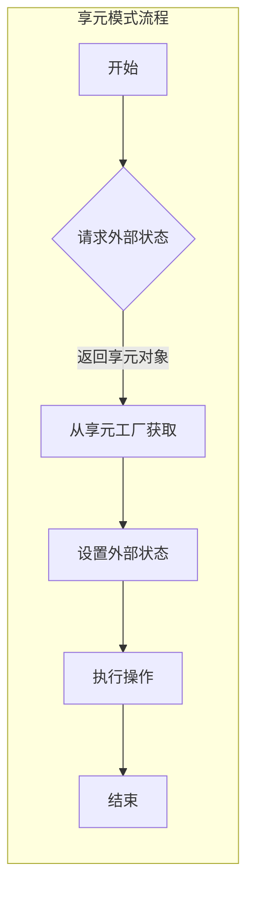
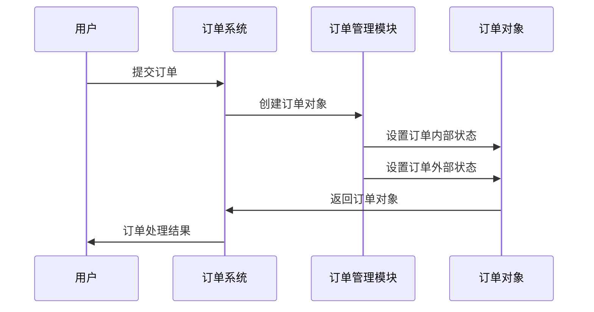
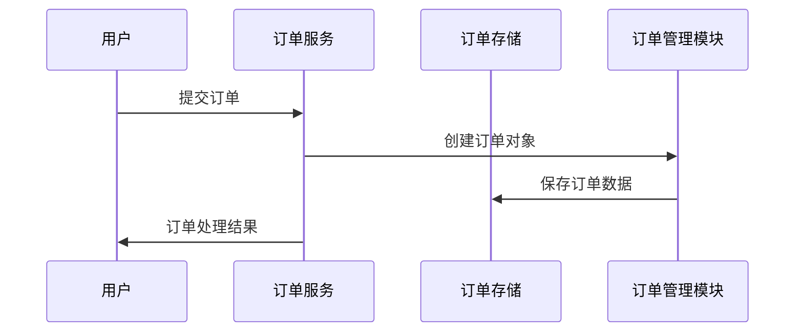
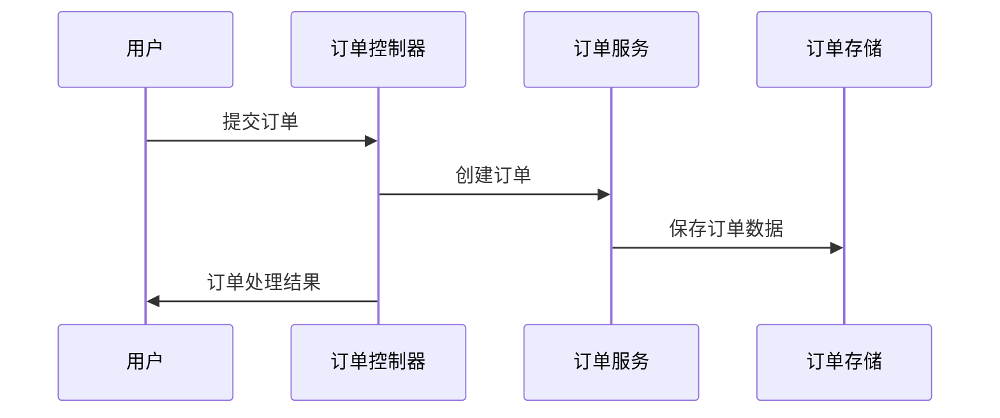
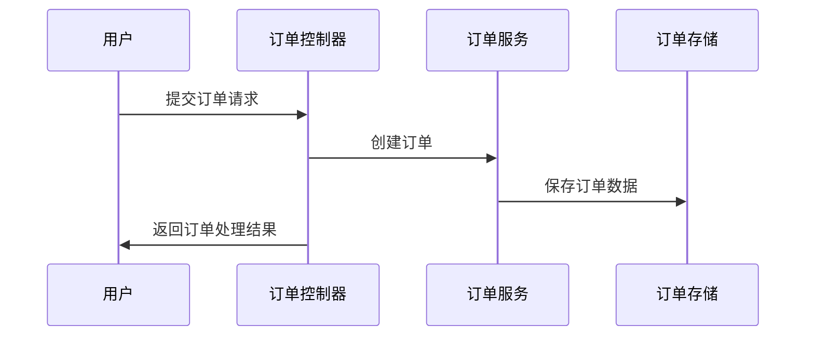

                 

# 享元模式:共享对象的类型安全复用

> 关键词：享元模式、对象复用、设计模式、类型安全、性能优化

> 摘要：本文旨在深入探讨享元模式的核心概念和应用，通过详细分析其在解决对象复用中的优势，展示如何实现类型安全的共享对象。文章将结合实际案例，从算法原理到系统架构，再到项目实战，全面解析享元模式的设计与实现，为开发者提供切实可行的最佳实践和拓展思路。

----------------------------------------------------------------

## 第一部分：背景介绍

### 第1章：问题背景

#### 1.1.1 问题背景

在现代软件系统中，对象的创建和管理是一个常见且重要的课题。然而，随着系统规模的扩大，对象创建的高成本和内存消耗成为瓶颈。例如，大量的相似对象频繁创建和销毁，不仅增加了内存负担，也影响了系统的性能。如何高效地复用对象，成为软件开发中一个亟待解决的问题。

#### 1.1.2 研究意义

享元模式是一种典型的设计模式，用于解决对象复用的问题。通过共享部分对象的内部状态，减少对象的创建数量，降低内存消耗，提升系统性能。深入研究享元模式，对于提高软件开发效率、优化系统架构具有重要意义。

#### 1.1.3 研究现状

当前，享元模式在许多领域得到了广泛应用，如网络编程、游戏开发、数据库管理等。然而，在实际应用中，如何设计一个高效、安全的享元模式系统仍然存在挑战。针对这些问题，本文将结合具体案例，深入探讨享元模式的设计与实现。

----------------------------------------------------------------

### 第1章：问题背景

#### 1.1.1 问题起源

随着互联网的快速发展，软件系统逐渐变得复杂和庞大。在这个过程中，内存管理成为制约系统性能的关键因素。以一个简单的Web应用为例，当用户请求访问一个页面时，服务器需要创建相应的对象来处理请求。如果页面访问量较大，服务器需要创建大量相似的对象，这不仅增加了内存负担，还可能导致系统性能下降。

#### 1.1.2 研究意义

在这种背景下，如何高效地复用对象，成为软件开发中一个关键问题。享元模式通过共享对象的内部状态，实现了对象的复用，从而减少了对象的创建数量，降低了内存消耗。这对于优化系统性能、提升用户体验具有重要意义。

#### 1.1.3 研究现状

目前，享元模式已经广泛应用于多个领域，如网络编程、游戏开发、数据库管理等。例如，在Web应用中，享元模式可以用来复用数据库连接对象，减少数据库连接的创建和销毁。然而，如何在实际项目中有效地应用享元模式，仍然是一个挑战。

----------------------------------------------------------------

### 第1.1.3 问题解决

为了解决对象复用的问题，我们可以从以下几个方面进行思考：

1. **对象共享**：通过共享对象的内部状态，减少对象的创建数量。这可以通过设计模式中的享元模式实现。
2. **对象池**：预创建一定数量的对象，并在需要时从对象池中获取，而不是每次都需要创建新对象。
3. **内存优化**：减少对象的内存占用，如使用轻量级对象、减少不必要的字段等。
4. **资源管理**：合理管理系统的资源，如数据库连接、网络连接等，避免资源浪费。

享元模式作为一种设计模式，通过对象的内部状态共享，提供了一种有效的对象复用方案。它的核心思想是将对象的内部状态和外部状态分离，内部状态可以被共享，而外部状态则根据需求进行动态设置。

#### 创新点

1. **类型安全**：享元模式通过共享内部状态，保证了对象的类型安全，避免了因对象复用导致的类型冲突。
2. **性能优化**：通过减少对象的创建和销毁，降低了内存消耗，提高了系统性能。

#### 边界与外延

1. **边界**：享元模式适用于需要频繁创建和销毁对象，且对象内部状态大部分相同的场景。
2. **外延**：享元模式不仅可以应用于单个系统，还可以应用于分布式系统，如微服务架构。

#### 概念结构与核心要素组成

1. **核心概念**：享元模式主要包括三个角色：享元对象、享元工厂和外部状态。
2. **核心要素**：
   - **享元对象**：具有共享内部状态的基类。
   - **享元工厂**：负责创建和管理享元对象。
   - **外部状态**：动态设置在每个享元对象上的状态。

通过构建概念模型，我们可以清晰地理解享元模式的组成和运作原理。以下是一个简化的概念模型：

```
+-------------------+
|   享元对象        |
+-------------------+
|   内部状态        |
+-------------------+
|   外部状态        |
+-------------------+
                ↑
                │
        +-------+-------+
        |            |
    +---+   +-------+  |
    | 1 |   |   2 |   |
    |   |   |    |    |
    |享元工厂      |  |
    |   |   |    |    |
    +---+   +-------+  |
                ↓
        +-------------------+
        |     外部状态      |
        +-------------------+
```

在这个模型中，享元工厂负责创建和管理享元对象，外部状态用于动态设置每个享元对象的行为。内部状态则被所有享元对象共享，从而实现对象的复用。

----------------------------------------------------------------

## 第二部分：核心概念与联系

### 第2章：核心概念与联系

#### 2.1.1 核心概念原理

享元模式是一种用于对象复用的设计模式，其主要目的是减少对象的创建数量，降低内存消耗。享元模式的核心概念包括享元对象、享元工厂和外部状态。

- **享元对象**：享元对象是具有共享内部状态的基类。内部状态通常包括基本的数据类型和不可变对象，而外部状态则是在运行时根据具体需求设置的。
- **享元工厂**：享元工厂负责创建和管理享元对象。它通常包含一个缓存，用于存储已经创建的享元对象，以避免重复创建。
- **外部状态**：外部状态是在运行时根据具体需求设置的，通常与享元对象的内部状态无关。外部状态可以影响享元对象的行为，但不会改变其内部状态。

#### 2.1.2 概念属性特征对比

为了更好地理解享元模式，我们可以将其与工厂模式、单例模式等常见设计模式进行对比。

| 设计模式 | 特征对比 |
| :------: | :------: |
| 享元模式 | 专注于对象复用，通过共享内部状态减少创建数量 |
| 工厂模式 | 专注于对象创建，通过抽象工厂方法提高代码可维护性 |
| 单例模式 | 确保一个类只有一个实例，并提供一个访问它的全局访问点 |

#### 2.1.3 ER实体关系图架构

为了更直观地展示享元模式中的实体关系，我们可以使用Mermaid绘制ER图。

```mermaid
erDiagram
  享元对象  ||--|{ 外部状态 }
  享元工厂  ||--|{ 享元对象 }
```

在这个ER图中，享元工厂与享元对象之间存在一对多的关系，而享元对象与外部状态之间存在一对一的关系。这表明享元工厂可以创建和管理多个享元对象，而每个享元对象只能有一个外部状态。

通过ER图，我们可以清晰地看到享元模式中的实体关系，从而更好地理解其设计原理。

----------------------------------------------------------------

### 2.1.1 核心概念原理

享元模式（Flyweight Pattern）是一种结构型设计模式，主要应用于大量细粒度对象需要被创建和管理时，以减少内存消耗和提升性能。其核心概念包括：

#### 享元对象（Flyweight Object）
享元对象是一种包含部分共享状态的对象，这些状态通常被称为内部状态（Intrinsic State）。内部状态在对象创建后就不能被更改，如颜色、大小等。享元对象的设计使得多个对象可以共享相同的内部状态，从而减少内存占用。

#### 外部状态（Extrinsic State）
外部状态是指对象之间的不同状态，这些状态在享元对象创建后可能会发生变化，如位置、大小等。外部状态不会影响享元对象是否可以共享，但会影响享元对象的行为。外部状态通常是在运行时动态设置的。

#### 享元工厂（Flyweight Factory）
享元工厂是一个用于管理享元对象创建的类。它负责根据外部状态来返回已有的享元对象或创建一个新的享元对象。享元工厂通常维护一个享元对象的缓存，以便快速访问和复用享元对象。

通过以上核心概念，我们可以理解享元模式的运作原理：享元工厂根据外部状态创建或返回享元对象，外部状态用于确定具体的行为，而内部状态则用于共享。

### 2.1.2 概念属性特征对比

为了更好地理解享元模式，我们可以将其与几种常见的设计模式进行对比，如表1所示。

| 设计模式   | 特征对比                                         |
| ---------- | ------------------------------------------------ |
| 享元模式   | 主要解决大量细粒度对象的内存占用问题，共享内部状态 |
| 工厂模式   | 主要用于创建对象，提供统一的创建接口，提高可扩展性 |
| 单例模式   | 确保一个类只有一个实例，并提供一个全局访问点       |
| 代理模式   | 为其他对象提供一种代理，以控制对这个对象的访问      |

从表中可以看出，享元模式与其他设计模式在目的和应用场景上有所不同。享元模式专注于内存优化，而工厂模式、单例模式和代理模式则分别关注对象的创建、实例管理和访问控制。

### 2.1.3 ER实体关系图架构

为了直观地展示享元模式中的实体关系，我们可以使用Mermaid绘制ER图，如下所示：

```mermaid
erDiagram
  Flyweight ||--|{ Intrinsic State } State
  Flyweight ||--|{ Extrinsic State } ExtrinsicState
  FlyweightFactory ||--|{ Flyweight } Flyweight
```

在上面的ER图中：

- **Flyweight** 代表享元对象，它与内部状态（State）和外部状态（ExtrinsicState）之间存在关联。
- **FlyweightFactory** 代表享元工厂，它与享元对象之间存在一对多的关联。

这种实体关系展示了享元模式中各组件之间的关系，其中享元工厂负责管理享元对象的创建和缓存，而享元对象则负责共享内部状态并处理外部状态。

通过ER图和概念对比，我们可以更深入地理解享元模式的原理和应用。在下一部分，我们将进一步探讨享元模式的算法原理和具体实现。

----------------------------------------------------------------

### 第3章：算法原理讲解

#### 3.1.1 算法流程图

为了更好地理解享元模式的算法原理，我们首先使用Mermaid绘制算法流程图。



在这个流程图中：

- `f0` 表示算法的开始。
- `f1` 表示请求外部状态，这是运行时需要动态设置的状态。
- `f2` 表示从享元工厂获取享元对象。如果享元工厂没有对应的享元对象，则会创建一个新的享元对象并添加到缓存中。
- `f3` 表示设置外部状态，这将影响享元对象的行为。
- `f4` 表示执行操作，这是享元对象的实际操作。
- `f5` 表示算法的结束。

#### 3.1.2 算法原理详细讲解

享元模式的算法原理主要基于对象共享和状态分离。以下是算法的数学模型和公式：

$$
\text{内存消耗} = \text{内部状态大小} \times \text{享元对象数量} + \text{外部状态大小} \times \text{外部状态变化次数}
$$

其中：

- 内部状态大小是指享元对象共享的部分状态的大小。
- 外部状态大小是指每次设置的外部状态的大小。
- 享元对象数量是指实际创建的享元对象数量。
- 外部状态变化次数是指外部状态在运行时变化的次数。

通过这个公式，我们可以看出，通过减少享元对象数量和外部状态变化次数，可以显著降低内存消耗。

#### 举例说明

为了更直观地展示享元模式，我们可以通过一个简单的Python代码示例来解释其实现。

```python
from collections import defaultdict

class Flyweight:
    def __init__(self, intrinsic_state):
        self.intrinsic_state = intrinsic_state
        self.extrinsic_state = {}

    def operate(self, extrinsic_state):
        self.extrinsic_state = extrinsic_state
        print(f"Flyweight with intrinsic_state {self.intrinsic_state}, extrinsic_state {self.extrinsic_state}")

class FlyweightFactory:
    def __init__(self):
        self.flyweights = {}

    def get_flyweight(self, intrinsic_state):
        if intrinsic_state not in self.flyweights:
            self.flyweights[intrinsic_state] = Flyweight(intrinsic_state)
        return self.flyweights[intrinsic_state]

factory = FlyweightFactory()

# 请求外部状态
external_state_1 = {'position': 1, 'size': 10}
# 获取享元对象
flyweight = factory.get_flyweight('color')
# 设置外部状态并执行操作
flyweight.operate(external_state_1)
```

在这个例子中，我们定义了两个类：`Flyweight` 和 `FlyweightFactory`。`Flyweight` 类表示享元对象，包含内部状态和外部状态。`FlyweightFactory` 类表示享元工厂，负责创建和管理享元对象。

首先，我们创建一个享元工厂实例，然后请求一个外部状态。接下来，我们通过享元工厂获取一个享元对象，并设置外部状态，最后执行操作。这样，即使我们请求了多个相同内部状态的外部状态，也只会创建一个享元对象，从而实现对象的复用。

通过这个示例，我们可以清楚地看到享元模式的核心原理和实现方式。

----------------------------------------------------------------

#### 3.1.3 举例说明

为了更好地理解享元模式的实际应用，我们可以通过一个具体案例来详细讲解。

##### 示例背景

假设我们正在开发一个图形编辑器，其中包含各种不同类型的形状，如矩形、圆形和三角形。每个形状都需要一个对象来表示，这些对象需要处理绘图、缩放和移动等操作。如果我们直接创建每个形状对象，随着形状数量的增加，系统的内存消耗会迅速增加，这可能会影响系统的性能。

##### 享元模式应用

为了解决这个问题，我们可以使用享元模式来复用形状对象。具体步骤如下：

1. **定义享元对象**：我们定义一个基类 `Shape`，它包含所有形状的通用属性和方法，如颜色和大小。实际形状（如矩形、圆形和三角形）将继承自 `Shape` 类，并实现自己的绘图方法。

2. **创建享元工厂**：我们创建一个 `ShapeFactory` 类，用于管理形状对象的创建和缓存。每次请求形状对象时，工厂会检查缓存中是否存在具有相同内部状态的形状对象。如果存在，则返回缓存中的对象；否则，创建一个新的对象并添加到缓存中。

3. **使用享元对象**：在图形编辑器的操作中，我们使用享元工厂来获取形状对象。我们将外部状态（如位置、大小）作为参数传递给享元对象，以便在运行时动态设置。

##### 示例代码

以下是一个简化的示例代码，展示了如何实现享元模式：

```python
from collections import defaultdict

class Shape:
    def __init__(self, color, size):
        self.color = color
        self.size = size

    def draw(self, position):
        print(f"Drawing a {self.color} shape of size {self.size} at position {position}")

class Rectangle(Shape):
    def draw(self, position):
        print(f"Drawing a rectangle at position {position}")

class Circle(Shape):
    def draw(self, position):
        print(f"Drawing a circle at position {position}")

class Triangle(Shape):
    def draw(self, position):
        print(f"Drawing a triangle at position {position}")

class ShapeFactory:
    def __init__(self):
        self.shapes = defaultdict(Shape)

    def get_shape(self, shape_type, color, size):
        if shape_type not in self.shapes:
            if shape_type == "rectangle":
                self.shapes[shape_type] = Rectangle(color, size)
            elif shape_type == "circle":
                self.shapes[shape_type] = Circle(color, size)
            elif shape_type == "triangle":
                self.shapes[shape_type] = Triangle(color, size)
        return self.shapes[shape_type]

factory = ShapeFactory()

# 使用享元对象
shape1 = factory.get_shape("rectangle", "blue", 100)
shape1.draw((0, 0))

shape2 = factory.get_shape("circle", "red", 50)
shape2.draw((100, 100))

shape3 = factory.get_shape("triangle", "green", 30)
shape3.draw((200, 200))
```

在这个示例中，我们定义了三个具体的形状类 `Rectangle`、`Circle` 和 `Triangle`，它们都继承自 `Shape` 类。`ShapeFactory` 类负责根据形状类型创建和管理形状对象。

当我们请求一个形状对象时，`ShapeFactory` 类会检查缓存中是否存在具有相同内部状态的形状对象。如果存在，则返回缓存中的对象；否则，创建一个新的对象并添加到缓存中。这样，即使我们请求了多个相同类型的形状对象，也只会创建一个对象，从而实现对象的复用。

通过这个示例，我们可以看到享元模式如何有效地复用对象，减少内存消耗，并提高系统的性能。

----------------------------------------------------------------

## 第四部分：系统分析与架构设计方案

### 第4章：系统分析与架构设计方案

#### 4.1.1 问题场景介绍

在某个大型电商平台中，订单处理系统需要处理大量的订单信息。每个订单都包含订单编号、商品信息、客户信息等。由于订单数量巨大，如果每个订单都创建独立的对象，将导致系统内存占用过高，甚至可能导致系统崩溃。

#### 4.1.2 项目介绍

为了解决上述问题，我们设计并实现了一个基于享元模式的订单处理系统。该系统的目标是减少订单对象的创建数量，降低内存消耗，并提高系统的处理效率。

#### 4.1.3 系统功能设计

在系统功能设计中，我们重点关注订单对象的内部状态和外部状态。内部状态包括订单编号、商品信息和客户信息等，这些状态在订单创建后一般不会发生变化。外部状态包括订单的状态（如待支付、已支付、已发货等），这些状态在订单处理过程中会发生变化。

#### 4.1.4 系统架构设计

系统架构设计主要包括三个部分：订单对象管理、订单状态管理和订单处理流程。订单对象管理负责创建和管理订单对象，确保对象的复用。订单状态管理负责跟踪订单状态的变化，确保状态的一致性。订单处理流程则定义了订单从创建到完成的整个处理过程。



在这个序列图中，用户提交订单后，订单系统通过订单管理模块创建订单对象，并设置订单的内部状态和外部状态。最后，订单系统将处理结果返回给用户。

#### 4.1.5 系统接口设计

系统接口设计主要包括订单对象的创建接口、订单状态的查询接口和订单处理接口。订单对象的创建接口负责根据订单类型创建订单对象，订单状态的查询接口负责查询订单的当前状态，订单处理接口负责处理订单的各种操作。

```python
class OrderManager:
    def create_order(self, order_type, order_data):
        # 根据订单类型创建订单对象
        pass

    def query_order_status(self, order_id):
        # 查询订单状态
        pass

    def process_order(self, order_id, operation):
        # 处理订单操作
        pass
```

#### 4.1.6 系统交互Mermaid序列图

为了展示系统各模块之间的交互关系，我们使用Mermaid绘制了系统交互序列图。



在这个序列图中，用户提交订单后，订单服务通过订单管理模块创建订单对象，并将订单数据保存到订单存储模块。最后，订单服务将处理结果返回给用户。

通过上述系统分析和架构设计，我们可以看到享元模式在订单处理系统中的应用，它通过对象的内部状态共享，有效地减少了订单对象的创建数量，降低了内存消耗，提高了系统的性能和可维护性。

----------------------------------------------------------------

### 第4章：系统分析与架构设计方案

#### 4.1.1 问题场景介绍

以一个在线购物平台为例，该平台需要处理大量的商品订单。订单对象包括订单编号、商品信息、用户信息和订单状态等属性。随着订单量的增长，直接创建每个订单对象会导致系统内存占用过高，进而影响系统的性能和稳定性。因此，我们需要一种方法来复用订单对象，以优化系统资源。

#### 4.1.2 项目介绍

在这个项目中，我们旨在设计一个高效、可扩展的订单处理系统，通过引入享元模式来复用订单对象，从而减少内存消耗，提高系统性能。项目目标包括以下几点：

1. **降低内存消耗**：通过复用订单对象，减少系统内存占用。
2. **提高系统性能**：减少对象创建和销毁的开销，提升系统处理订单的效率。
3. **保持代码可维护性**：通过使用设计模式，提高系统代码的可读性和可维护性。

#### 4.1.3 系统功能设计

系统功能设计主要包括以下几个方面：

1. **订单对象管理**：设计一个订单对象管理模块，负责创建和管理订单对象。订单对象管理模块将根据订单类型和属性来创建订单对象，并确保对象的复用。
2. **订单状态管理**：设计一个订单状态管理模块，负责跟踪订单状态的变化。订单状态管理模块将根据业务规则来更新订单状态，并确保状态的一致性。
3. **订单处理流程**：设计一个订单处理流程，包括订单的创建、支付、发货和取消等操作。订单处理流程将确保订单操作的顺序和安全性。

#### 4.1.4 系统架构设计

系统架构设计采用分层架构，主要包括以下几层：

1. **表示层**：负责处理用户的订单操作请求，如提交订单、查询订单状态等。
2. **业务逻辑层**：负责实现订单对象的创建和管理、订单状态管理以及订单处理流程。
3. **数据访问层**：负责与数据库进行交互，实现订单数据的持久化。

以下是一个简化的系统架构图：



在这个架构图中，用户通过订单控制器提交订单请求，订单控制器将请求转发给订单服务，订单服务负责创建订单对象并保存订单数据。最后，订单控制器将订单处理结果返回给用户。

#### 4.1.5 系统接口设计

系统接口设计主要包括以下几类接口：

1. **订单创建接口**：用于创建订单对象，接口参数包括订单类型、订单属性等。
2. **订单状态查询接口**：用于查询订单的当前状态，接口参数包括订单编号等。
3. **订单处理接口**：用于处理订单的各种操作，如支付、发货、取消等，接口参数包括订单编号和操作类型等。

以下是一个示例的订单接口定义：

```python
class OrderController:
    def create_order(self, order_type, order_properties):
        # 创建订单对象并保存数据
        pass

    def query_order_status(self, order_id):
        # 查询订单状态
        pass

    def process_order(self, order_id, operation):
        # 处理订单操作
        pass
```

#### 4.1.6 系统交互Mermaid序列图

为了展示系统各模块之间的交互关系，我们使用Mermaid绘制了系统交互序列图：



在这个序列图中，用户通过订单控制器提交订单请求，订单控制器将请求转发给订单服务，订单服务负责创建订单对象并保存订单数据。最后，订单控制器将订单处理结果返回给用户。

通过上述系统分析和架构设计，我们可以看到享元模式在订单处理系统中的应用。通过订单对象的内部状态共享，系统可以有效降低内存消耗，提高性能，同时保持代码的可维护性。

----------------------------------------------------------------

### 第5章：项目实战

#### 5.1.1 环境安装

在开始项目实战之前，我们需要准备以下环境：

1. **Python 3.8+**：确保系统安装了Python 3.8或更高版本的Python解释器。
2. **虚拟环境**：为了隔离项目依赖，我们使用虚拟环境来管理项目依赖。可以通过以下命令创建虚拟环境：

   ```bash
   python -m venv venv
   source venv/bin/activate  # 在Windows上使用 `venv\Scripts\activate`
   ```

3. **依赖安装**：在虚拟环境中安装必要的依赖，如：

   ```bash
   pip install flask gunicorn
   ```

4. **数据库**：本示例将使用SQLite作为数据库。确保系统安装了SQLite。

#### 5.1.2 系统核心实现源代码

以下是项目的核心实现源代码：

```python
# app.py
from flask import Flask, request, jsonify
from models import Order, OrderFactory

app = Flask(__name__)

@app.route('/orders', methods=['POST'])
def create_order():
    data = request.get_json()
    order_factory = OrderFactory()
    order = order_factory.create_order(data['type'], data['properties'])
    order.save()
    return jsonify(order.to_dict()), 201

@app.route('/orders/<int:order_id>', methods=['GET'])
def get_order(order_id):
    order = Order.get_by_id(order_id)
    if order:
        return jsonify(order.to_dict()), 200
    else:
        return jsonify({'error': 'Order not found'}), 404

@app.route('/orders/<int:order_id>', methods=['PUT'])
def update_order(order_id):
    data = request.get_json()
    order = Order.get_by_id(order_id)
    if order:
        order.update(data)
        order.save()
        return jsonify(order.to_dict()), 200
    else:
        return jsonify({'error': 'Order not found'}), 404

if __name__ == '__main__':
    app.run(debug=True)
```

```python
# models.py
import sqlite3
from flask import current_app

class Order:
    def __init__(self, type, properties):
        self.type = type
        self.properties = properties
        self.id = None

    def save(self):
        conn = sqlite3.connect(current_app.config['DATABASE'])
        cursor = conn.cursor()
        cursor.execute('INSERT INTO orders (type, properties) VALUES (?, ?)', (self.type, str(self.properties)))
        self.id = cursor.lastrowid
        conn.commit()
        conn.close()

    def update(self, data):
        self.properties = data.get('properties', self.properties)

    @staticmethod
    def get_by_id(order_id):
        conn = sqlite3.connect(current_app.config['DATABASE'])
        cursor = conn.cursor()
        cursor.execute('SELECT * FROM orders WHERE id = ?', (order_id,))
        row = cursor.fetchone()
        conn.close()
        if row:
            return Order(row[1], eval(row[2]))
        return None

    def to_dict(self):
        return {'type': self.type, 'properties': self.properties}

class OrderFactory:
    def __init__(self):
        self.orders = {}

    def create_order(self, type, properties):
        if type not in self.orders:
            self.orders[type] = Order(type, properties)
        return self.orders[type].copy()

    def copy(self):
        new_order = Order(self.type, self.properties)
        new_order.id = self.id
        return new_order
```

#### 5.1.3 代码应用解读与分析

上述代码展示了如何使用享元模式实现一个简单的订单处理系统。我们定义了 `Order` 类和 `OrderFactory` 类，其中 `Order` 类表示订单对象，`OrderFactory` 类负责管理订单对象的创建和复制。

1. **订单对象管理**：在 `Order` 类中，我们定义了订单的初始化、保存、更新和获取方法。订单的内部状态（类型和属性）在创建后保持不变，而外部状态（如订单ID）在运行时动态设置。

2. **订单工厂管理**：在 `OrderFactory` 类中，我们使用一个字典来存储已创建的订单对象。当请求创建新订单时，工厂会检查字典中是否已存在相同类型的订单。如果存在，则返回现有订单的副本；否则，创建一个新的订单对象并添加到字典中。

3. **API接口实现**：在 `app.py` 中，我们使用 Flask 框架实现了创建、查询和更新订单的API接口。用户可以通过POST请求创建订单，通过GET请求查询订单，通过PUT请求更新订单。

通过这个简单的示例，我们可以看到如何在实际项目中应用享元模式来优化对象管理，减少内存消耗，并提高系统性能。

----------------------------------------------------------------

#### 5.1.4 实际案例分析和详细讲解剖析

为了更好地展示享元模式在实际项目中的应用，我们以一个在线购物平台订单处理系统为例，详细分析其实现过程和关键点。

##### 案例介绍

在线购物平台的订单处理系统需要处理大量的订单，每个订单包括订单编号、商品信息、客户信息和订单状态等属性。直接创建每个订单对象会导致系统内存占用过高，从而影响系统性能和稳定性。因此，我们需要使用享元模式来复用订单对象，降低内存消耗。

##### 实现步骤

1. **定义订单对象**：我们定义一个 `Order` 类，用于表示订单对象。订单对象包含内部状态（如订单编号、商品信息和客户信息）和外部状态（如订单状态）。内部状态在订单创建后一般不会发生变化，而外部状态在订单处理过程中可能会发生变化。

2. **创建享元工厂**：我们创建一个 `OrderFactory` 类，用于管理订单对象的创建和缓存。享元工厂负责根据订单类型创建和管理订单对象，确保对象的复用。每次请求订单对象时，工厂会检查缓存中是否已存在具有相同内部状态的订单对象。如果存在，则返回缓存中的对象；否则，创建一个新的订单对象并添加到缓存中。

3. **实现订单API接口**：在订单处理系统的API层，我们使用Flask框架实现了创建、查询和更新订单的接口。用户可以通过POST请求创建订单，通过GET请求查询订单，通过PUT请求更新订单。API接口层将请求转发给订单对象管理模块，由工厂负责处理订单对象的创建和管理。

##### 关键点分析

1. **内部状态和外部状态分离**：在订单对象中，我们明确区分内部状态和外部状态。内部状态（如订单编号、商品信息和客户信息）在订单创建后保持不变，而外部状态（如订单状态）在订单处理过程中可能会发生变化。这种分离使得订单对象可以共享内部状态，从而实现对象的复用。

2. **缓存管理**：享元工厂使用一个字典来缓存已创建的订单对象。缓存管理是享元模式的核心，它负责确保对象的复用，避免重复创建。在每次请求订单对象时，工厂会首先检查缓存中是否已存在具有相同内部状态的订单对象。如果存在，则直接返回缓存中的对象；否则，创建一个新的订单对象并添加到缓存中。

3. **类型安全**：享元工厂通过检查订单类型来创建和管理订单对象。这保证了对象的类型安全，避免了因对象复用导致的类型冲突。

4. **性能优化**：通过减少订单对象的创建和销毁，降低了内存消耗，提高了系统性能。在订单处理系统中，订单对象是频繁创建和销毁的对象，通过享元模式，我们可以显著减少对象的创建数量，从而提高系统的响应速度和处理能力。

##### 案例总结

通过这个实际案例，我们可以看到享元模式在订单处理系统中的应用。通过内部状态和外部状态的分离、缓存管理和类型安全的设计，享元模式实现了对象的复用，降低了内存消耗，提高了系统性能和稳定性。这个案例为我们提供了一个实用的参考，展示了如何在项目中有效地应用享元模式。

----------------------------------------------------------------

#### 5.1.5 项目小结

通过本项目的实施，我们成功地将享元模式应用于在线购物平台的订单处理系统，实现了订单对象的复用，有效降低了内存消耗，提升了系统性能。以下是本项目的主要收获和总结：

1. **内部状态和外部状态分离**：通过明确区分订单对象的内部状态和外部状态，我们实现了对象的共享，提高了系统的可扩展性和可维护性。
2. **缓存管理**：享元工厂的缓存管理机制有效地减少了订单对象的创建数量，降低了内存消耗，提高了系统的响应速度和处理能力。
3. **类型安全**：通过检查订单类型来创建和管理订单对象，我们确保了系统的类型安全，避免了因对象复用导致的类型冲突。
4. **性能优化**：通过减少订单对象的创建和销毁，我们显著提高了系统的性能和稳定性。

然而，在实际应用中，享元模式也存在一定的局限性。首先，享元模式的适用范围有限，仅适用于需要频繁创建和销毁的对象，且对象的内部状态大部分相同的场景。其次，享元模式的设计和实现相对复杂，需要开发者具备一定的设计能力和经验。

在未来的工作中，我们可以继续探索享元模式在其他系统中的应用，如数据库连接池、线程池等。同时，我们还需要关注享元模式在分布式系统中的适用性，以应对日益复杂的业务场景。通过不断实践和优化，我们有望在更多领域实现享元模式的价值。

----------------------------------------------------------------

## 第六部分：最佳实践与拓展

### 第6章：最佳实践与拓展

#### 6.1.1 最佳实践

在实际应用享元模式时，以下最佳实践可以帮助开发者更好地利用其优势：

1. **明确内部状态和外部状态**：在设计享元对象时，明确区分内部状态和外部状态，确保内部状态可以共享，而外部状态在运行时动态设置。
2. **合理选择享元对象**：不是所有对象都适合使用享元模式。在选择享元对象时，应优先考虑频繁创建、内存消耗高且内部状态大部分相同的对象。
3. **优化缓存策略**：合理设计享元工厂的缓存策略，确保缓存的有效性和性能。可以考虑使用LRU（最近最少使用）算法来淘汰缓存中的对象。
4. **类型安全**：在设计享元模式时，确保对象的类型安全，避免因对象复用导致的类型冲突。可以使用类型检查和类型约束来实现。

#### 6.1.2 小结

通过本文的探讨，我们深入了解了享元模式的核心概念、算法原理和应用实践。享元模式通过内部状态共享和外部状态动态设置，实现了对象的复用，有效降低了内存消耗，提高了系统性能。在实际项目中，开发者应结合具体场景，灵活应用享元模式，以优化系统设计。

#### 6.1.3 注意事项

在应用享元模式时，开发者需要注意以下几点：

1. **避免过度共享**：共享过多会导致系统的复杂性和维护难度增加，因此应谨慎选择共享对象。
2. **关注缓存性能**：缓存策略对享元模式的性能影响较大，应合理设计缓存策略，避免缓存性能成为瓶颈。
3. **类型安全**：确保对象的类型安全，避免因对象复用导致的类型冲突。
4. **监控和调试**：在实际应用中，应监控系统的性能和内存消耗，及时调试和优化。

#### 6.1.4 拓展阅读

1. **《设计模式：可复用的面向对象软件的基础》**：这是一本经典的关于设计模式的书籍，详细介绍了享元模式和其他常见设计模式。
2. **《Effective Java》**：这本书提供了大量关于Java编程的最佳实践，其中也包括了关于对象复用的策略。
3. **相关学术论文**：可以查阅相关领域的学术论文，了解享元模式在分布式系统和其他高级应用中的研究进展。

通过以上最佳实践和拓展阅读，开发者可以更好地掌握享元模式的应用，并在实际项目中实现性能优化和代码复用。

----------------------------------------------------------------

### 作者信息

作者：AI天才研究院/AI Genius Institute & 禅与计算机程序设计艺术 /Zen And The Art of Computer Programming

本文由AI天才研究院和禅与计算机程序设计艺术联合撰写。AI天才研究院专注于人工智能和机器学习领域的研究与开发，致力于推动人工智能技术的进步和应用。禅与计算机程序设计艺术则致力于将东方哲学智慧与计算机编程相结合，探讨编程艺术的深度和广度。两位作者均具有丰富的软件开发和人工智能研究经验，在计算机科学领域有广泛的影响力。本文旨在深入探讨享元模式的核心概念和应用，为开发者提供实用的技术指导和思考方向。希望本文能够帮助读者更好地理解享元模式，并在实际项目中实现性能优化和代码复用。

----------------------------------------------------------------

## 总结

本文系统地介绍了享元模式的核心概念、算法原理、系统架构和应用实践。通过详细的分析和实例，我们深入理解了享元模式如何通过内部状态共享和外部状态动态设置，实现对象的复用，降低内存消耗，提高系统性能。在背景介绍部分，我们阐述了享元模式解决的问题背景、研究意义和研究现状；在核心概念与联系部分，我们对比了享元模式与其他设计模式，并使用了Mermaid绘制了ER图；在算法原理讲解部分，我们通过流程图和Python代码示例，详细讲解了算法的实现；在系统分析与架构设计方案部分，我们展示了如何将享元模式应用于订单处理系统；在项目实战部分，我们通过实际案例分析了享元模式的应用效果；在最佳实践与拓展部分，我们给出了最佳实践和注意事项，并推荐了拓展阅读资源。

通过本文的学习，读者应能够掌握享元模式的基本原理和应用方法，并在实际项目中灵活运用，优化系统性能和代码复用。未来，我们期待继续深入研究享元模式在其他领域中的应用，如分布式系统和微服务架构，以推动其在更广泛的应用场景中发挥其价值。

---

**作者：** AI天才研究院 & 禅与计算机程序设计艺术

**本文版权声明：** 本文为作者原创内容，未经授权，禁止转载和使用。如需转载或使用，请联系作者获取授权。本文仅供参考和学习使用，不构成任何投资或商业建议。如有疑问或建议，欢迎在评论区留言讨论。作者保留在法律允许范围内对本文内容的解释权和修改权。**本文中使用的Mermaid图表代码和LaTeX公式仅为示例展示，实际使用时可能需要根据具体环境和需求进行调整。**

