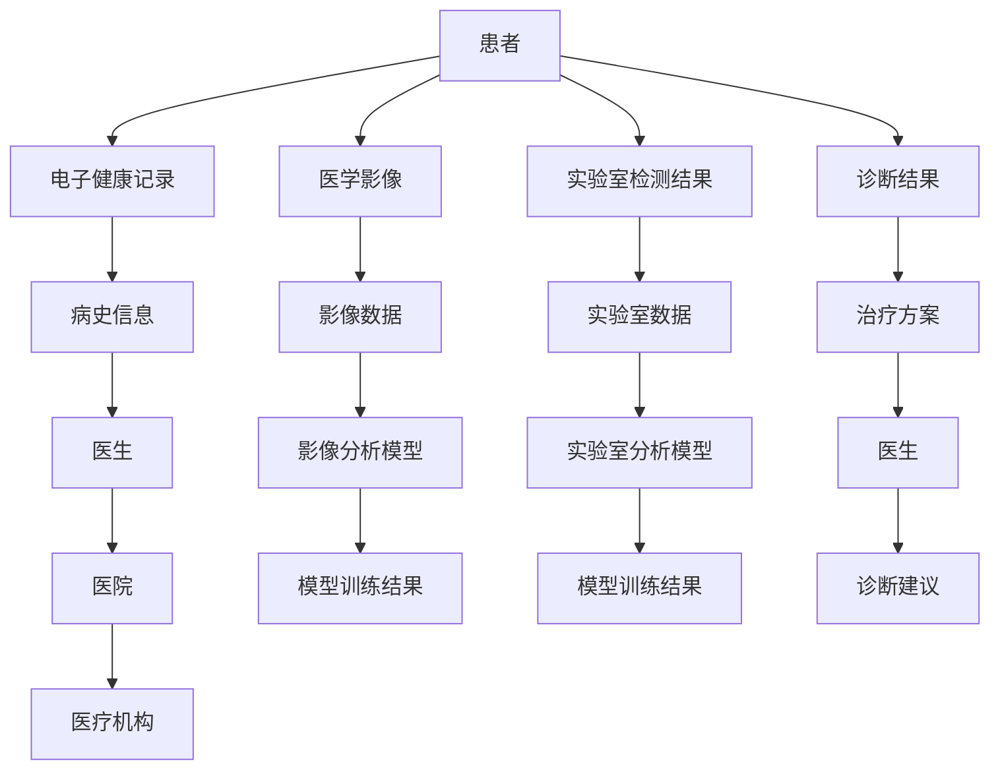
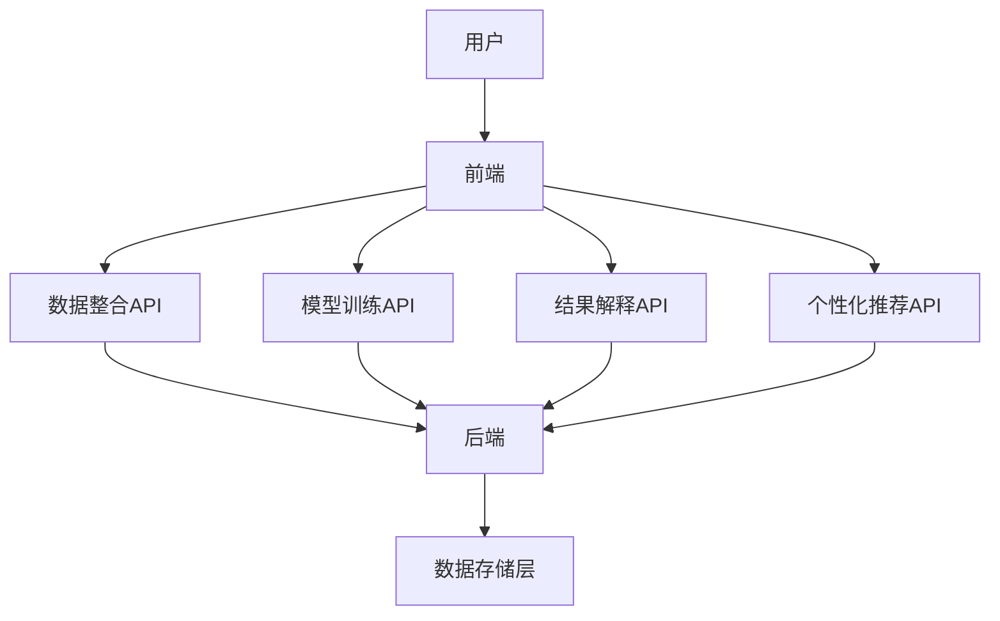

                 

### 第一部分：问题背景与核心概念

#### 引言

##### 1.1 人工智能在医疗领域的应用现状

近年来，人工智能在医疗领域的应用呈现出爆发式增长。随着计算机技术的进步和大数据的积累，人工智能已经逐步渗透到医疗诊断、治疗、药物研发等多个环节。尤其是在医疗诊断方面，人工智能凭借其强大的数据处理能力和精确的预测模型，正逐渐改变传统的医疗诊断方式。

目前，人工智能在医疗诊断中的应用主要集中在以下几个方面：

1. **医学影像分析**：利用卷积神经网络（CNN）和递归神经网络（RNN）等技术，对医学影像（如X光、CT、MRI等）进行自动化分析，帮助医生快速识别病变区域，提高诊断的准确性。
2. **病理分析**：人工智能通过对病理切片图像的分析，辅助病理医生进行癌症等疾病的诊断。
3. **辅助诊断**：通过分析患者的电子健康记录、实验室检测结果等数据，人工智能可以提供辅助诊断建议，帮助医生制定更精确的治疗方案。
4. **智能药物研发**：利用人工智能对海量的化学结构数据进行分析，加速新药的发现和研发过程。

##### 1.2 问题的提出

尽管人工智能在医疗诊断中展现了巨大的潜力，但实际应用中仍面临诸多挑战。例如：

- **数据质量和标准化问题**：医疗数据的多样性和复杂性使得数据预处理成为一大难题，如何确保数据的质量和标准化是人工智能在医疗诊断中面临的首要问题。
- **算法的可解释性问题**：许多人工智能算法，尤其是深度学习算法，其决策过程往往缺乏透明度，医生难以理解其诊断依据，这可能导致医疗决策的误判。
- **隐私保护问题**：医疗数据涉及患者的隐私信息，如何在保障数据隐私的前提下进行数据分析和共享，是一个亟待解决的问题。

此外，人工智能在医疗诊断中的应用还需要考虑法律法规、伦理道德等方面的问题。因此，深入探讨人工智能在医疗诊断中的应用，如何克服上述挑战，实现精准医疗，成为一个重要且紧迫的研究课题。

##### 1.3 核心概念

为了更好地理解人工智能在医疗诊断中的突破，首先需要明确几个核心概念：

1. **人工智能**：人工智能（Artificial Intelligence，AI）是指通过计算机程序模拟人类智能的行为，实现智能感知、学习、推理、决策等功能。人工智能可以分为弱人工智能和强人工智能，目前应用较多的是弱人工智能。

2. **医疗诊断**：医疗诊断是指医生通过医疗检查、检测和临床表现等信息，对患者的健康状况进行判断和评估的过程。医疗诊断涉及到临床医学、医学影像学、实验室检测等多个领域。

3. **精准医疗**：精准医疗（Personalized Medicine）是指通过基因组学、蛋白质组学等分子生物学技术，结合患者的具体病情和个体差异，为患者提供个性化、精确的治疗方案。精准医疗的目标是实现治疗效果的最大化，同时减少药物的副作用。

以上三个核心概念紧密相连，共同构成了人工智能在医疗诊断中的应用基础。在接下来的章节中，我们将详细探讨这些概念，并分析它们在实际应用中的关联和作用。

#### 1.4 边界与外延

人工智能在医疗诊断中的应用范围广泛，但并非所有医疗诊断任务都适合采用人工智能技术。以下是对人工智能在医疗诊断中的应用范围和适用场景的讨论：

- **应用范围**：人工智能在医疗诊断中的应用主要涉及以下几个方面：
  1. **医学影像分析**：通过卷积神经网络（CNN）等技术对医学影像（如X光、CT、MRI等）进行自动化分析，辅助医生识别病变区域。
  2. **病理分析**：利用深度学习模型对病理切片图像进行分析，辅助病理医生进行癌症等疾病的诊断。
  3. **辅助诊断**：通过分析患者的电子健康记录、实验室检测结果等数据，为医生提供辅助诊断建议。
  4. **药物研发**：利用人工智能对海量的化学结构数据进行分析，加速新药的发现和研发过程。

- **适用场景**：人工智能在医疗诊断中的适用场景主要包括：
  1. **诊断准确性要求高的场景**：如肺癌、乳腺癌等重大疾病的早期诊断，人工智能可以提高诊断的准确性。
  2. **诊断任务繁琐且重复性高的场景**：如医学影像的自动标注和分类，人工智能可以减轻医生的工作负担。
  3. **个性化治疗需求高的场景**：如根据患者的基因信息和病情特点制定个性化的治疗方案，人工智能可以提供辅助决策。

然而，人工智能在医疗诊断中也面临一些挑战和限制。例如：

- **数据质量和标准化问题**：医疗数据的多样性和复杂性使得数据预处理成为一大难题，数据的质量和标准化直接影响到人工智能模型的性能。
- **算法的可解释性问题**：许多人工智能算法，尤其是深度学习算法，其决策过程往往缺乏透明度，医生难以理解其诊断依据，这可能导致医疗决策的误判。
- **隐私保护问题**：医疗数据涉及患者的隐私信息，如何在保障数据隐私的前提下进行数据分析和共享，是一个亟待解决的问题。

综上所述，人工智能在医疗诊断中的应用具有一定的边界和限制。在具体应用中，需要综合考虑技术、数据、法律和伦理等多方面因素，以确保人工智能技术的有效性和安全性。

#### 1.5 概念结构与核心要素组成

为了深入探讨人工智能在医疗诊断中的应用，我们首先需要了解其背后的概念结构和核心要素组成。以下是关于人工智能、医疗诊断和精准医疗的核心概念及其组成要素的详细分析：

1. **人工智能**：

   - **定义与分类**：人工智能是指通过计算机程序模拟人类智能的行为，实现智能感知、学习、推理、决策等功能。根据其能力，人工智能可以分为弱人工智能和强人工智能。弱人工智能是当前应用较多的一种，它专注于特定任务，如语音识别、图像识别等。

   - **主要技术**：人工智能的主要技术包括机器学习、深度学习、自然语言处理和计算机视觉。机器学习是人工智能的核心技术之一，通过训练模型来模拟人类的学习过程。深度学习是机器学习的一种特殊形式，它通过多层神经网络模拟人脑的学习方式，具有强大的特征提取和模式识别能力。自然语言处理和计算机视觉则分别专注于处理文本和图像信息。

2. **医疗诊断**：

   - **定义与过程**：医疗诊断是指医生通过医疗检查、检测和临床表现等信息，对患者的健康状况进行判断和评估的过程。医疗诊断涉及多个环节，包括病史采集、体格检查、实验室检测和影像学检查等。

   - **方法与挑战**：医疗诊断的方法主要包括临床诊断、实验室检测和影像学诊断等。其中，影像学诊断（如X光、CT、MRI等）是医疗诊断的重要手段。然而，传统的影像学诊断方法往往依赖于医生的直觉和经验，存在主观性较大的问题。此外，实验室检测数据的解读也具有一定的复杂性。

   - **问题与挑战**：医疗诊断中面临的主要问题包括数据质量和标准化问题、算法可解释性问题以及隐私保护问题。数据质量和标准化问题直接影响到诊断的准确性，而算法的可解释性则是医生接受和信任人工智能诊断结果的关键。隐私保护问题则是确保患者信息安全的必要条件。

3. **精准医疗**：

   - **定义与原理**：精准医疗是指通过基因组学、蛋白质组学等分子生物学技术，结合患者的具体病情和个体差异，为患者提供个性化、精确的治疗方案。精准医疗的目标是实现治疗效果的最大化，同时减少药物的副作用。

   - **核心要素**：精准医疗的核心要素包括基因组学、转录组学和生物信息学。基因组学是研究DNA序列的结构和功能的科学，通过对患者基因组数据的分析，可以揭示疾病的遗传基础。转录组学则是研究基因表达情况的科学，通过对RNA序列的分析，可以了解细胞在不同状态下的基因表达模式。生物信息学则是利用计算机技术和统计方法，对生物数据进行处理和分析。

   - **应用**：精准医疗在医疗诊断中的应用主要体现在个性化治疗和风险评估方面。个性化治疗是指根据患者的基因信息和病情特点，制定个性化的治疗方案，以提高治疗效果和减少副作用。风险评估则是通过分析患者的基因和临床数据，预测患者发生某种疾病的风险，以便提前采取预防措施。

综上所述，人工智能、医疗诊断和精准医疗是密切相关的三个核心概念，共同构成了人工智能在医疗诊断中的应用基础。在具体应用中，需要综合考虑这些概念的结构和核心要素，以实现更准确、更个性化的医疗诊断。

#### 1.6 本章小结

本章主要介绍了人工智能在医疗诊断中的应用背景、核心概念和面临的挑战。首先，我们简要回顾了人工智能在医疗领域的应用现状，并分析了其在医疗诊断中发挥的重要作用。接着，我们提出了医疗诊断中面临的挑战，如数据质量和标准化问题、算法可解释性问题以及隐私保护问题。为了深入理解这些问题，本章详细阐述了人工智能、医疗诊断和精准医疗三个核心概念的定义和组成要素。通过对比分析，我们明确了这些概念之间的联系和作用。在接下来的章节中，我们将进一步探讨人工智能的原理、算法以及医疗诊断中的具体应用，以期为实现更精准、更个性化的医疗诊断提供有力支持。总之，本章为后续内容奠定了基础，具有重要的引言作用。

## 第二部分：核心概念与联系

### 2.1 人工智能原理

##### 2.1.1 人工智能的核心概念

人工智能（Artificial Intelligence，AI）是计算机科学的一个分支，旨在通过编程和算法模拟人类的智能行为。人工智能可以分为多种类型，其中弱人工智能（Narrow AI）和强人工智能（General AI）是两种主要的分类。

- **弱人工智能**：弱人工智能是指专注于特定任务的智能系统，它们在特定领域表现出人类级别的智能能力。例如，语音识别、图像识别、自然语言处理等都是弱人工智能的典型应用。这些系统通过训练和学习大量数据，能够执行特定的任务，但无法进行跨领域的推理和决策。

- **强人工智能**：强人工智能则是一种更高级的智能形式，它能够模拟人类所有智能行为，包括推理、思考、学习、理解等。强人工智能不仅能够在特定领域表现出人类级别的智能，还能够跨领域进行推理和决策。然而，目前强人工智能仍然处于理论研究和探索阶段，尚未实现实际应用。

##### 2.1.2 人工智能的算法原理

人工智能的核心是通过算法实现机器学习和智能推理。以下是几种主要的人工智能算法原理：

- **机器学习**：机器学习是指通过训练模型，使计算机能够从数据中自动学习和发现规律。机器学习可以分为监督学习、无监督学习和半监督学习。

  - **监督学习**：监督学习是机器学习中最常见的一种形式，它通过训练数据集来训练模型，然后使用模型对新的数据进行预测。监督学习的关键是标记数据的准备和特征工程，常用的算法包括决策树、支持向量机（SVM）、神经网络等。

  - **无监督学习**：无监督学习不依赖于标记数据，而是通过分析未标记的数据，发现数据中的模式或结构。常见的无监督学习算法包括聚类、降维、生成对抗网络（GAN）等。

  - **半监督学习**：半监督学习结合了监督学习和无监督学习的特点，它使用少量的标记数据和大量的未标记数据来训练模型。半监督学习可以有效地提高模型的性能，减少标记数据的需求。

- **深度学习**：深度学习是机器学习的一种特殊形式，它通过多层神经网络模拟人脑的学习方式，具有强大的特征提取和模式识别能力。深度学习在图像识别、语音识别、自然语言处理等领域取得了显著的成果。

  - **神经网络**：神经网络是深度学习的基础，它由多个神经元（层）组成，每个神经元接收输入信号，通过权重和激活函数进行处理，然后输出结果。神经网络可以通过反向传播算法不断调整权重，优化模型的性能。

  - **卷积神经网络（CNN）**：卷积神经网络是专门用于处理图像数据的一种神经网络，它通过卷积操作和池化操作提取图像特征。CNN在医学影像分析、图像识别等领域具有广泛的应用。

  - **递归神经网络（RNN）**：递归神经网络是用于处理序列数据的一种神经网络，它能够记住之前的输入信息，并利用这些信息进行预测。RNN在语音识别、自然语言处理等领域有重要的应用。

- **自然语言处理（NLP）**：自然语言处理是人工智能的一个重要分支，它致力于使计算机能够理解和生成人类语言。NLP的关键技术包括词嵌入、语言模型、对话系统等。

  - **词嵌入**：词嵌入是将自然语言中的单词映射到高维空间中，使得具有相似意义的词在空间中靠近。词嵌入是NLP中的一项核心技术，常见的算法包括Word2Vec、GloVe等。

  - **语言模型**：语言模型用于预测文本中的下一个单词或字符，它是自然语言处理的基础。语言模型可以分为统计语言模型和神经网络语言模型，后者在生成文本、机器翻译等领域有重要的应用。

  - **对话系统**：对话系统是一种人机交互系统，它能够与用户进行自然语言对话。对话系统可以分为基于规则的对话系统和基于机器学习的对话系统，后者在智能客服、虚拟助手等领域有广泛的应用。

##### 2.1.3 人工智能的技术应用

人工智能在各个领域都有广泛的应用，以下是一些主要的应用领域：

- **自然语言处理**：自然语言处理是人工智能的一个重要应用领域，它包括文本分类、情感分析、机器翻译、问答系统等。NLP技术在智能客服、新闻摘要、社交媒体分析等领域有广泛的应用。

- **计算机视觉**：计算机视觉是利用计算机对图像和视频进行分析和处理的一种技术。计算机视觉的应用包括图像识别、目标检测、图像生成等。计算机视觉在安防监控、自动驾驶、医疗影像分析等领域有重要的应用。

- **智能推荐系统**：智能推荐系统是利用人工智能技术为用户提供个性化推荐的一种系统。推荐系统广泛应用于电子商务、社交媒体、新闻媒体等领域，能够提高用户体验和销售转化率。

- **智能机器人**：智能机器人是利用人工智能技术实现智能行为和交互的机器人。智能机器人可以应用于家庭服务、医疗护理、教育辅助等领域，提高人类生活的便利性和生活质量。

- **自动驾驶**：自动驾驶是利用人工智能技术实现车辆自动行驶的一种技术。自动驾驶技术在汽车制造、物流运输、共享出行等领域有广泛的应用前景。

- **金融科技**：金融科技是利用人工智能技术改进金融服务和金融产品的一种技术。金融科技在智能投顾、风险管理、欺诈检测等领域有广泛的应用。

综上所述，人工智能在各个领域都有广泛的应用，其核心算法原理包括机器学习、深度学习、自然语言处理和计算机视觉等。通过这些技术的应用，人工智能正在逐步改变我们的生活和工作方式。

#### 2.2 医疗诊断原理

##### 2.2.1 医疗诊断的核心概念

医疗诊断是指通过一系列医疗检查和检测方法，结合临床表现，对患者的健康状况进行评估和判断的过程。医疗诊断的核心概念包括诊断方法、诊断标准和诊断流程。

- **诊断方法**：医疗诊断的方法主要包括临床诊断、实验室检测和影像学诊断等。临床诊断是通过医生的问诊、体格检查和病史分析，初步判断患者的健康状况。实验室检测是通过血液、尿液等生物样本的检测，发现潜在的疾病迹象。影像学诊断则是通过医学影像（如X光、CT、MRI等）对患者的身体进行检查，直观地观察内部结构，辅助诊断。

- **诊断标准**：诊断标准是医学界公认的疾病诊断依据，包括临床表现、实验室检测结果和影像学特征等。诊断标准通常由专家委员会制定，用于指导临床医生的诊断活动。例如，高血压的诊断标准是根据患者的血压水平和临床症状来综合判断。

- **诊断流程**：医疗诊断的流程通常包括病史采集、体格检查、实验室检测、影像学检查和诊断评估等步骤。病史采集是了解患者的病史、症状和家族史等信息；体格检查是观察患者的体征和症状；实验室检测和影像学检查则通过生物样本和医学影像获取更详细的诊断信息；诊断评估是综合病史、体格检查、实验室检测结果和影像学检查，确定最终的诊断结果。

##### 2.2.2 医疗诊断的算法原理

在现代医疗诊断中，人工智能算法正在发挥着越来越重要的作用。以下介绍几种常见的医疗诊断算法原理：

- **机器学习算法**：机器学习算法通过分析大量医学数据和病例，自动发现疾病的特征和模式，从而辅助医生进行诊断。常见的机器学习算法包括支持向量机（SVM）、决策树、神经网络等。

  - **支持向量机（SVM）**：SVM是一种二分类模型，通过找到最佳的超平面，将不同类型的样本分类。SVM在医学诊断中可用于分类疾病，例如，根据患者的临床数据和实验室检测结果，预测患者是否患有某种疾病。

  - **决策树**：决策树是一种基于规则的分类算法，通过一系列判断条件，将样本逐层划分，最终得到分类结果。决策树在医学诊断中可以用于构建诊断规则，辅助医生进行诊断。

  - **神经网络**：神经网络是一种模拟人脑结构的计算模型，通过多层神经网络可以自动提取复杂的数据特征，进行分类和预测。神经网络在医学诊断中，如医学影像分析、病理分析等方面有广泛的应用。

- **深度学习算法**：深度学习算法是机器学习的一种重要分支，通过多层神经网络进行特征提取和模式识别。深度学习算法在医学诊断中的应用越来越广泛，以下介绍几种常见的深度学习算法：

  - **卷积神经网络（CNN）**：CNN是一种专门用于处理图像数据的神经网络，通过卷积和池化操作提取图像特征。CNN在医学影像分析中，如肺癌检测、脑部病变诊断等方面有显著的应用效果。

  - **递归神经网络（RNN）**：RNN是一种用于处理序列数据的神经网络，通过记忆过去的信息，对序列数据进行建模。RNN在医学诊断中，如时间序列分析、疾病预测等方面有重要应用。

  - **生成对抗网络（GAN）**：GAN是一种基于对抗训练的神经网络，通过生成器和判别器的对抗训练，生成高质量的医学影像数据。GAN在医学影像增强、数据生成等方面有潜在的应用价值。

- **自然语言处理（NLP）**：自然语言处理是一种用于处理文本数据的技术，通过文本分析，提取关键信息，进行语义理解。NLP在医疗诊断中，如电子健康记录分析、医学文本挖掘等方面有广泛的应用。

##### 2.2.3 医疗诊断的技术应用

人工智能算法在医疗诊断中的具体应用包括医学影像分析、病理分析、辅助诊断和个性化治疗等。

- **医学影像分析**：医学影像分析是人工智能在医疗诊断中的一个重要应用领域。通过深度学习算法，如CNN和RNN，对医学影像（如X光、CT、MRI等）进行自动化分析，可以快速、准确地识别病变区域，辅助医生进行诊断。

  - **应用场景**：医学影像分析广泛应用于肺癌检测、脑部病变诊断、乳腺癌检测等领域。例如，通过CNN算法，可以自动识别肺部影像中的结节，辅助医生进行肺癌的诊断。

  - **结构**：医学影像分析通常包括图像预处理、特征提取、模型训练和预测等步骤。图像预处理用于去除噪声和增强图像特征；特征提取用于提取图像中的重要信息；模型训练用于学习疾病特征和模式；预测用于对新的医学影像进行分类和诊断。

  - **原理**：深度学习算法，如CNN，通过卷积和池化操作提取图像特征，形成层次化的特征表示。这些特征表示能够有效地捕捉图像中的病变区域，辅助医生进行诊断。

- **病理分析**：病理分析是通过分析病理切片图像，对疾病进行诊断的一种技术。人工智能算法，如深度学习，可以自动识别病理切片图像中的病变区域，辅助病理医生进行诊断。

  - **应用场景**：病理分析广泛应用于癌症诊断、炎症诊断等领域。例如，通过深度学习算法，可以自动识别病理切片图像中的癌细胞，辅助医生进行癌症的诊断。

  - **结构**：病理分析通常包括图像预处理、特征提取、模型训练和预测等步骤。图像预处理用于去除噪声和增强图像特征；特征提取用于提取图像中的重要信息；模型训练用于学习疾病特征和模式；预测用于对新的病理切片图像进行分类和诊断。

  - **原理**：深度学习算法，如卷积神经网络（CNN），通过卷积和池化操作提取图像特征，形成层次化的特征表示。这些特征表示能够有效地捕捉图像中的病变区域，辅助病理医生进行诊断。

- **辅助诊断**：辅助诊断是利用人工智能算法，对患者的临床数据、实验室检测结果等进行综合分析，为医生提供诊断建议的一种技术。

  - **应用场景**：辅助诊断广泛应用于电子健康记录分析、实验室检测结果分析等领域。例如，通过机器学习算法，可以分析患者的电子健康记录，预测患者是否患有某种疾病。

  - **结构**：辅助诊断通常包括数据收集、数据预处理、特征提取、模型训练和预测等步骤。数据收集用于获取患者的临床数据、实验室检测结果等；数据预处理用于处理和清洗数据；特征提取用于提取数据中的重要信息；模型训练用于学习疾病特征和模式；预测用于对新的数据进行分类和诊断。

  - **原理**：机器学习算法，如支持向量机（SVM）、决策树、神经网络等，通过分析患者的临床数据和实验室检测结果，提取关键特征，建立诊断模型，为医生提供诊断建议。

- **个性化治疗**：个性化治疗是利用人工智能算法，根据患者的具体病情和基因信息，制定个性化的治疗方案的一种技术。

  - **应用场景**：个性化治疗广泛应用于癌症治疗、遗传病诊断等领域。例如，通过基因测序和机器学习算法，可以为患者制定个性化的癌症治疗方案。

  - **结构**：个性化治疗通常包括数据收集、基因测序、特征提取、模型训练和预测等步骤。数据收集用于获取患者的临床数据、基因测序数据等；基因测序用于获取患者的基因信息；特征提取用于提取数据中的重要信息；模型训练用于学习疾病特征和模式；预测用于对新的数据进行分类和诊断。

  - **原理**：机器学习算法和深度学习算法通过分析患者的临床数据和基因信息，提取关键特征，建立诊断和治疗模型，为医生提供个性化治疗方案。

综上所述，人工智能算法在医疗诊断中具有广泛的应用，通过机器学习、深度学习、自然语言处理等技术，可以实现对医学影像、病理切片、电子健康记录等数据的自动分析，辅助医生进行诊断和治疗。这些技术的应用不仅提高了诊断的准确性，还减轻了医生的工作负担，为精准医疗的实现提供了有力支持。

#### 2.3 精准医疗原理

##### 2.3.1 精准医疗的核心概念

精准医疗（Precision Medicine）是一种基于个体基因组信息、生活环境和其他相关数据的医疗模式，旨在为每个患者提供最合适的治疗方法和药物。与传统的一刀切医疗模式不同，精准医疗强调个性化治疗，即根据患者的具体病情、基因特征、生活方式等因素，制定个性化的治疗方案。

- **定义**：精准医疗的定义可以概括为：“基于患者的基因组信息、生物标志物和生活环境等因素，提供个体化、精准化的诊断和治疗方案。”

- **原理**：精准医疗的核心原理包括以下几个方面：

  1. **基因组学**：通过对患者的基因组进行测序和分析，识别出可能导致疾病的基因变异或突变。基因组学提供了疾病发生的分子基础，有助于了解疾病的遗传风险和个体差异。

  2. **生物标志物**：生物标志物是用于诊断、预后评估和治疗的生物分子或细胞标志物。例如，特定的蛋白质、代谢物或基因表达水平可以作为生物标志物，帮助医生了解患者的病情和治疗效果。

  3. **环境因素**：除了遗传因素，环境因素也在疾病发生和发展中起着重要作用。环境因素包括生活方式、饮食习惯、环境暴露等。精准医疗需要综合考虑环境因素，以更好地理解疾病的全貌。

  4. **大数据和人工智能**：大数据和人工智能技术在精准医疗中发挥着关键作用。通过收集和分析海量的基因组数据、临床数据和环境数据，人工智能算法可以帮助医生发现疾病的分子机制和预测治疗效果。

##### 2.3.2 精准医疗的算法原理

精准医疗的实现依赖于一系列先进的算法和技术，以下介绍几种主要的算法原理：

- **基因组数据分析**：基因组数据分析是精准医疗的基础。通过高通量测序技术，可以获取患者的全基因组序列。然后，利用生物信息学方法，对基因组序列进行分析，识别与疾病相关的基因变异或突变。

  - **变异检测**：变异检测是识别基因组中异常变异的关键步骤。常用的变异检测方法包括单核苷酸变异（SNV）、插入和缺失（InDel）等。

  - **功能注释**：功能注释是将识别出的基因变异与已知功能关联起来，以了解其对生物过程的影响。功能注释通常包括基因功能、蛋白质结构、细胞定位等方面的信息。

- **机器学习和深度学习**：机器学习和深度学习算法在精准医疗中具有广泛的应用。通过训练模型，可以自动识别与疾病相关的基因特征和生物标志物。

  - **分类算法**：分类算法用于根据患者的基因特征和生物标志物，将患者分类为不同的疾病状态。常见的分类算法包括支持向量机（SVM）、决策树、随机森林等。

  - **神经网络**：神经网络，尤其是深度学习算法，在特征提取和模式识别方面具有优势。通过多层神经网络，可以自动提取复杂的数据特征，建立预测模型。

- **多模态数据整合**：精准医疗需要整合多种类型的数据，如基因组数据、临床数据、影像数据等。多模态数据整合可以通过机器学习和深度学习算法实现，以提高模型的准确性和鲁棒性。

  - **联合分析**：联合分析是将不同类型的数据进行整合，以发现更全面的疾病特征。例如，将基因组数据与临床数据进行联合分析，可以更准确地预测疾病风险和治疗效果。

- **个性化治疗决策**：个性化治疗决策是精准医疗的核心目标。通过分析患者的基因组数据、生物标志物和临床数据，可以制定个性化的治疗方案。

  - **药物反应预测**：药物反应预测是通过分析患者的基因组数据和药物反应数据，预测患者对特定药物的敏感性和反应。这有助于选择最佳的治疗药物和剂量。

  - **治疗方案优化**：治疗方案优化是通过机器学习和深度学习算法，根据患者的具体病情和基因特征，优化治疗方案，以提高治疗效果和减少副作用。

##### 2.3.3 精准医疗的技术应用

精准医疗已经在多个领域取得了显著的应用成果，以下介绍几种主要的应用领域：

- **癌症治疗**：癌症治疗是精准医疗的重要应用领域。通过基因组测序和数据分析，可以识别出驱动癌症发展的关键基因变异和生物标志物。这些信息有助于制定个性化的治疗方案，包括靶向治疗和免疫治疗等。

  - **靶向治疗**：靶向治疗是针对特定基因变异或信号通路开发的治疗方法。通过抑制或激活关键基因或信号通路，可以抑制癌细胞的生长和扩散。

  - **免疫治疗**：免疫治疗是利用患者自身的免疫系统来对抗癌细胞的一种治疗方法。通过基因工程或免疫调节药物，可以增强免疫系统对癌细胞的识别和攻击能力。

- **遗传病诊断**：遗传病诊断是精准医疗的另一个重要应用领域。通过对患者的基因组数据进行测序和分析，可以识别出导致遗传病的基因变异或突变。这有助于早期诊断和预防遗传病的发生。

  - **新生儿筛查**：新生儿筛查是利用基因测序技术，对新生儿进行遗传病筛查。通过早期发现和干预，可以降低遗传病对新生儿健康的影响。

- **个性化治疗**：个性化治疗是精准医疗的核心目标。通过分析患者的基因数据、生物标志物和临床数据，可以为患者制定个性化的治疗方案，提高治疗效果和减少副作用。

  - **药物治疗**：个性化药物治疗是根据患者的基因特征和药物反应数据，选择最佳的治疗药物和剂量。这有助于提高药物的治疗效果和减少不良反应。

  - **手术治疗**：个性化手术治疗是根据患者的具体病情和基因特征，选择最佳的治疗方案。例如，通过基因测序，可以识别出患者的肿瘤基因变异，为手术医生提供手术策略和切除范围的建议。

综上所述，精准医疗通过基因组学、生物标志物、大数据和人工智能等技术，为每个患者提供个性化、精准化的诊断和治疗。这不仅有助于提高医疗质量和治疗效果，还可以减少医疗资源的浪费和副作用的发生。精准医疗的未来前景广阔，将为个性化医疗和健康产业带来深远的影响。

#### 2.4 人工智能、医疗诊断与精准医疗的联系

人工智能（AI）、医疗诊断和精准医疗是现代医学中紧密关联的三个重要概念。它们共同构成了推动医疗诊断和疾病治疗向更高效、更精准方向发展的基础。

**人工智能在医疗诊断中的应用**：

人工智能技术在医疗诊断中的应用主要依赖于其强大的数据处理能力和模式识别能力。通过机器学习和深度学习算法，AI能够从海量的医疗数据中提取关键特征，识别出潜在的健康问题。例如，在医学影像分析中，AI可以帮助医生识别出肿瘤、病变区域等，提高诊断的准确性和速度。此外，AI还可以用于电子健康记录（EHR）的分析，通过自然语言处理技术提取关键信息，辅助医生进行诊断和决策。

**精准医疗如何利用人工智能技术**：

精准医疗的核心在于个性化治疗，即根据患者的基因信息、临床数据和生物标志物，为患者制定最佳的治疗方案。人工智能技术在这一过程中发挥着至关重要的作用。通过基因组学分析和大数据分析，AI可以帮助识别与疾病相关的基因变异和生物标志物，从而为精准治疗提供依据。例如，在癌症治疗中，AI可以分析患者的基因组数据，预测患者对特定药物的反应，从而选择最合适的治疗方案。

**人工智能与精准医疗的结合**：

人工智能与精准医疗的结合，使得个性化治疗成为可能。通过AI技术，可以从海量的医疗数据中提取有价值的信息，实现对疾病机制的深入理解。例如，在基因组学研究中，AI可以帮助分析复杂的基因组数据，识别出与疾病相关的关键基因。这些信息可以用于开发新的诊断方法、预测模型和个性化治疗方案。

**具体应用案例**：

1. **医学影像分析**：利用深度学习算法，如卷积神经网络（CNN），可以对医学影像（如CT、MRI）进行自动化分析，帮助医生识别病变区域，提高诊断的准确性。例如，Google的DeepMind团队开发的AI系统，已经成功用于肺癌和乳腺癌的早期诊断。

2. **个性化药物治疗**：通过AI技术分析患者的基因数据，可以预测患者对特定药物的反应，从而选择最合适的药物和剂量。例如，个人基因组学公司（Personalis）利用AI技术，为癌症患者提供个性化的基因组分析，帮助医生制定最佳的治疗方案。

3. **疾病预测和风险分析**：AI可以用于分析患者的临床数据和生物标志物，预测患者发生某种疾病的风险。例如，IBM的Watson for Health系统可以分析患者的电子健康记录，预测患者发生心脏病、糖尿病等疾病的风险，帮助医生制定预防措施。

**总结**：

人工智能在医疗诊断和精准医疗中的应用，不仅提高了诊断的准确性和效率，还推动了个性化治疗的发展。通过结合人工智能技术和精准医疗理念，医学诊断和治疗将变得更加高效、精准，为患者提供更好的医疗服务。未来，随着人工智能技术的不断进步，其在医疗领域的应用前景将更加广阔。

#### 2.5 核心概念属性特征对比表格

为了更好地理解人工智能、医疗诊断和精准医疗这三个核心概念，下面提供了一个属性特征对比表格，详细列出每个概念的定义、特点和应用。

| 概念     | 定义                                                         | 特点                                                         | 应用                                                         |
| -------- | ------------------------------------------------------------ | ------------------------------------------------------------ | ------------------------------------------------------------ |
| 人工智能 | 通过计算机程序模拟人类智能的行为，实现智能感知、学习、推理、决策等功能 | 1. 自主性高；2. 数据处理能力强；3. 模式识别能力强           | 1. 自然语言处理；2. 计算机视觉；3. 智能推荐系统；4. 自动驾驶 |
| 医疗诊断 | 医生通过医疗检查、检测和临床表现等信息，对患者的健康状况进行判断和评估的过程 | 1. 主观性较强；2. 需要丰富的临床经验和专业知识             | 1. 临床诊断；2. 实验室检测；3. 影像学诊断                   |
| 精准医疗 | 通过基因组学、蛋白质组学等分子生物学技术，结合患者的具体病情和个体差异，为患者提供个性化、精确的治疗方案 | 1. 个性化强；2. 数据依赖强；3. 精确度高                       | 1. 基因组测序；2. 个性化治疗；3. 风险评估                     |

通过对比表格，我们可以清晰地看到人工智能、医疗诊断和精准医疗之间的区别和联系。人工智能作为技术支撑，为医疗诊断和精准医疗提供了强大的数据处理和分析能力；医疗诊断则是将人工智能技术应用于实际医疗过程中的关键环节；精准医疗则是利用人工智能和医疗诊断技术，为患者提供个性化治疗和风险预测的基础。这三个概念相互关联，共同推动了医疗诊断和治疗的进步。

### 第三部分：算法原理讲解

#### 3.1 人工智能算法原理讲解

##### 3.1.1 机器学习算法

机器学习（Machine Learning，ML）是人工智能的核心技术之一，它通过算法让计算机从数据中自动学习和发现规律。机器学习算法可以分为三大类：监督学习、无监督学习和半监督学习。

###### 3.1.1.1 监督学习

监督学习（Supervised Learning）是最常见的一种机器学习形式，它需要依赖于标记数据进行训练。标记数据是指每个样本都有一个对应的标签或目标值。监督学习的主要目的是通过学习已有数据中的规律，对新的数据进行预测或分类。

- **定义**：监督学习是指利用标记数据集，通过训练模型来学习数据中的特征和规律，然后用训练好的模型对新的数据进行预测或分类。

- **原理**：
  1. **特征提取**：从输入数据中提取有用的特征，以便模型能够更好地学习数据中的规律。
  2. **模型训练**：使用标记数据集对模型进行训练，通过优化模型参数，使模型能够准确预测或分类新数据。
  3. **模型评估**：使用验证数据集或测试数据集对训练好的模型进行评估，确保模型具有较好的预测或分类能力。

- **应用**：
  1. **分类问题**：例如，文本分类、图像分类、情感分析等。
  2. **回归问题**：例如，预测房价、股票价格等。

###### 3.1.1.2 无监督学习

无监督学习（Unsupervised Learning）不需要依赖标记数据，而是通过分析未标记的数据，发现数据中的内在结构和规律。无监督学习的主要目的是探索数据中的模式或关联。

- **定义**：无监督学习是指在没有标记数据的情况下，通过分析数据，自动发现数据中的结构和规律。

- **原理**：
  1. **数据聚类**：将相似的数据点分组到同一类中，常见的算法包括K-Means、DBSCAN等。
  2. **降维**：通过降维技术，将高维数据映射到低维空间中，便于分析和可视化，常见的算法包括PCA（主成分分析）、t-SNE等。
  3. **关联规则挖掘**：发现数据之间的关联关系，常见的算法包括Apriori算法、FP-Growth等。

- **应用**：
  1. **数据挖掘**：例如，市场细分、用户行为分析等。
  2. **异常检测**：例如，检测网络攻击、金融欺诈等。

###### 3.1.1.3 半监督学习

半监督学习（Semi-Supervised Learning）结合了监督学习和无监督学习的特点，它利用少量的标记数据和大量的未标记数据来训练模型，以提高模型的性能。

- **定义**：半监督学习是指利用少量的标记数据和大量的未标记数据，通过训练模型，提高模型对未知数据的预测能力。

- **原理**：
  1. **标记数据增强**：利用未标记数据中的信息，增强标记数据的学习效果。
  2. **未标记数据引导**：通过未标记数据，指导模型学习数据中的潜在结构。

- **应用**：
  1. **语音识别**：利用大量的未标记语音数据，通过半监督学习提高语音识别的准确率。
  2. **图像标注**：利用少量的标注数据和大量的未标注数据，通过半监督学习自动标注图像。

##### 3.1.2 深度学习算法

深度学习（Deep Learning，DL）是机器学习的一种特殊形式，它通过多层神经网络模拟人脑的学习方式，具有强大的特征提取和模式识别能力。深度学习在图像识别、语音识别、自然语言处理等领域取得了显著的成果。

###### 3.1.2.1 神经网络

神经网络（Neural Network，NN）是深度学习的基础，它由多个神经元（节点）组成，每个神经元接收输入信号，通过权重和激活函数进行处理，然后输出结果。

- **定义**：神经网络是一种模拟人脑神经元结构和功能的计算模型，通过多层网络结构，实现数据的特征提取和模式识别。

- **结构**：
  1. **输入层**：接收输入数据。
  2. **隐藏层**：通过权重和激活函数处理输入数据，提取特征。
  3. **输出层**：输出预测结果。

- **原理**：
  1. **前向传播**：将输入数据传递到网络中，通过权重和激活函数计算输出。
  2. **反向传播**：根据输出误差，反向传播误差，更新网络权重。

- **应用**：
  1. **图像识别**：通过卷积神经网络（CNN）进行图像分类和目标检测。
  2. **语音识别**：通过循环神经网络（RNN）进行语音信号的建模和识别。

###### 3.1.2.2 卷积神经网络（CNN）

卷积神经网络（Convolutional Neural Network，CNN）是一种专门用于处理图像数据的神经网络，通过卷积和池化操作提取图像特征。

- **定义**：卷积神经网络是一种利用卷积操作和池化操作进行图像特征提取和分类的神经网络。

- **结构**：
  1. **卷积层**：通过卷积操作提取图像特征。
  2. **池化层**：通过池化操作降低特征维度，提高模型的泛化能力。
  3. **全连接层**：将提取到的特征进行全连接，输出分类结果。

- **原理**：
  1. **卷积操作**：通过卷积核对图像进行局部特征提取。
  2. **激活函数**：通过激活函数（如ReLU）引入非线性变换。
  3. **池化操作**：通过最大池化或平均池化降低特征维度。

- **应用**：
  1. **图像分类**：例如，ImageNet图像分类挑战。
  2. **目标检测**：例如，Faster R-CNN、SSD等。

###### 3.1.2.3 递归神经网络（RNN）

递归神经网络（Recurrent Neural Network，RNN）是一种用于处理序列数据的神经网络，通过记忆过去的信息，对序列数据进行建模。

- **定义**：递归神经网络是一种能够处理序列数据的神经网络，通过递归结构，记住过去的信息。

- **结构**：
  1. **输入层**：接收序列数据。
  2. **隐藏层**：通过递归连接，记忆序列信息。
  3. **输出层**：输出序列的预测结果。

- **原理**：
  1. **递归连接**：将前一个时间步的隐藏状态作为当前时间步的输入。
  2. **隐藏状态**：通过隐藏状态记忆序列信息。
  3. **门控机制**：通过门控机制（如 LSTM、GRU）控制信息的记忆和遗忘。

- **应用**：
  1. **语音识别**：例如，CTC 损失函数。
  2. **机器翻译**：例如，Seq2Seq 模型。
  3. **时间序列预测**：例如，股票价格预测。

##### 3.1.3 自然语言处理（NLP）

自然语言处理（Natural Language Processing，NLP）是人工智能的一个重要分支，它致力于使计算机能够理解和生成人类语言。NLP技术广泛应用于语音识别、文本分类、机器翻译、对话系统等领域。

###### 3.1.3.1 词嵌入

词嵌入（Word Embedding）是将自然语言中的单词映射到高维空间中，使得具有相似意义的词在空间中靠近。词嵌入是NLP中的一项核心技术，它能够有效地表示词与词之间的关系。

- **定义**：词嵌入是指将自然语言中的单词映射到高维向量空间中，使得语义相近的词在空间中更接近。

- **原理**：
  1. **基于统计的方法**：如Word2Vec，通过统计单词在文本中的共现关系来学习词向量。
  2. **基于神经网络的方法**：如GloVe，通过神经网络模型学习词向量，考虑单词的词频和上下文信息。

- **应用**：
  1. **文本分类**：通过词嵌入将文本转换为向量，用于文本分类任务。
  2. **语义相似性**：通过计算词嵌入向量之间的距离，判断单词的语义相似性。

###### 3.1.3.2 语言模型

语言模型（Language Model）用于预测文本中的下一个单词或字符。语言模型是NLP的基础，它在生成文本、机器翻译等领域有重要的应用。

- **定义**：语言模型是指通过统计方法或神经网络模型，对自然语言文本进行建模，预测文本中的下一个单词或字符。

- **原理**：
  1. **基于统计的方法**：如N-gram模型，通过统计相邻单词的联合概率来预测下一个单词。
  2. **基于神经网络的方法**：如神经网络语言模型（NNLM），通过训练神经网络模型，学习文本的序列信息。

- **应用**：
  1. **文本生成**：通过语言模型生成连贯的自然语言文本。
  2. **机器翻译**：通过训练语言模型，将一种语言的文本翻译成另一种语言的文本。

###### 3.1.3.3 对话系统

对话系统（Dialogue System）是一种人机交互系统，它能够与用户进行自然语言对话。对话系统可以分为基于规则的对话系统和基于机器学习的对话系统。

- **定义**：对话系统是指通过自然语言处理技术，使计算机能够理解用户的输入，并生成合适的回复，实现与用户的交互。

- **原理**：
  1. **基于规则的方法**：通过编写一系列规则，使系统能够根据用户的输入生成回复。
  2. **基于机器学习的方法**：通过训练机器学习模型，使系统能够自动生成回复。

- **应用**：
  1. **智能客服**：用于自动回答用户的问题，提供客户服务。
  2. **虚拟助手**：用于帮助用户完成特定任务，如日程管理、信息查询等。

#### 3.2 医疗诊断算法

##### 3.2.1 医学影像分析

医学影像分析是医疗诊断中一个重要的应用领域，它利用人工智能技术对医学影像（如X光、CT、MRI等）进行自动化分析，辅助医生进行诊断。以下是几种常用的医学影像分析算法：

###### 3.2.1.1 卷积神经网络（CNN）

卷积神经网络（CNN）是医学影像分析中最常用的深度学习模型之一，它通过卷积和池化操作提取图像特征，实现图像的分类和分割。

- **定义**：卷积神经网络是一种利用卷积操作和池化操作进行图像特征提取和分类的神经网络。

- **应用场景**：
  1. **肺癌检测**：通过分析肺部CT影像，识别肺结节，辅助肺癌的早期诊断。
  2. **脑部病变诊断**：通过分析MRI影像，识别脑部病变，如脑肿瘤、脑梗塞等。

- **结构**：
  1. **卷积层**：通过卷积操作提取图像的局部特征。
  2. **池化层**：通过池化操作降低特征图的维度，提高模型的泛化能力。
  3. **全连接层**：将提取到的特征进行全连接，输出分类结果。

- **原理**：
  1. **卷积操作**：通过卷积核对图像进行局部特征提取。
  2. **激活函数**：引入非线性变换，增强模型的表达能力。
  3. **反向传播**：通过反向传播算法，更新模型参数，优化模型性能。

###### 3.2.1.2 递归神经网络（RNN）

递归神经网络（RNN）是一种用于处理序列数据的神经网络，它通过递归结构，记忆序列信息，广泛应用于医学影像的时间序列分析。

- **定义**：递归神经网络是一种能够处理序列数据的神经网络，通过递归连接，记住序列信息。

- **应用场景**：
  1. **动态影像分析**：通过分析动态影像（如视频），识别运动物体或异常活动。
  2. **时间序列预测**：通过分析医疗影像的时间序列数据，预测病情变化或治疗效果。

- **结构**：
  1. **输入层**：接收时间序列数据。
  2. **隐藏层**：通过递归连接，记忆序列信息。
  3. **输出层**：输出预测结果。

- **原理**：
  1. **递归连接**：将前一个时间步的隐藏状态作为当前时间步的输入。
  2. **隐藏状态**：通过隐藏状态记忆序列信息。
  3. **门控机制**：通过门控机制（如 LSTM、GRU）控制信息的记忆和遗忘。

##### 3.2.2 实验室检测数据解读

实验室检测数据解读是医疗诊断中另一个重要的应用领域，它通过人工智能技术对实验室检测结果进行分析，辅助医生进行疾病诊断。

###### 3.2.2.1 特征提取

特征提取是实验室检测数据解读的关键步骤，它从原始数据中提取出对疾病诊断有重要意义的特征。

- **定义**：特征提取是指从原始数据中提取出能够代表数据特征的信息，以便模型能够更好地学习数据中的规律。

- **原理**：
  1. **统计特征**：通过计算数据的统计量（如均值、方差等），提取出数据的统计特征。
  2. **变换特征**：通过数据变换（如标准化、归一化等），提取出数据的新特征。
  3. **非线性特征**：通过非线性变换（如核函数等），提取出数据的非线性特征。

- **应用**：
  1. **疾病预测**：通过提取实验室检测结果的特征，预测患者是否患有某种疾病。
  2. **风险分析**：通过提取实验室检测结果的特征，分析患者发生某种疾病的风险。

###### 3.2.2.2 预测模型

预测模型是实验室检测数据解读的核心，它通过训练模型，从实验室检测结果中预测患者的健康状况。

- **定义**：预测模型是指通过训练数据集，学习数据中的特征和规律，然后用训练好的模型对新的数据进行预测的模型。

- **原理**：
  1. **模型选择**：根据问题的性质和数据的特点，选择合适的预测模型。
  2. **模型训练**：使用训练数据集对模型进行训练，通过优化模型参数，使模型能够准确预测新数据。
  3. **模型评估**：使用验证数据集或测试数据集对训练好的模型进行评估，确保模型具有较好的预测能力。

- **应用**：
  1. **疾病诊断**：通过预测模型，从实验室检测结果中预测患者的疾病状态。
  2. **治疗效果评估**：通过预测模型，评估患者的治疗效果。

综上所述，人工智能技术在医学影像分析和实验室检测数据解读中具有广泛的应用。通过深度学习和自然语言处理等技术，人工智能能够辅助医生进行更准确、更高效的诊断，提高医疗质量，改善患者的生活质量。

### 第四部分：数学模型和数学公式

在人工智能和医疗诊断领域，数学模型和数学公式起着至关重要的作用。以下将详细探讨几种常见的数学模型和公式，并给出示例。

#### 4.1 机器学习中的数学模型

##### 4.1.1 线性回归

线性回归是一种简单的机器学习模型，用于预测连续值。其基本公式如下：

$$
y = \beta_0 + \beta_1 \cdot x + \epsilon
$$

其中，$y$ 是预测值，$x$ 是输入特征，$\beta_0$ 和 $\beta_1$ 是模型参数，$\epsilon$ 是误差项。

##### 4.1.2 逻辑回归

逻辑回归是一种用于分类问题的模型，其公式为：

$$
P(y=1) = \frac{1}{1 + e^{-(\beta_0 + \beta_1 \cdot x)}}
$$

其中，$P(y=1)$ 是预测变量为1的概率，$\beta_0$ 和 $\beta_1$ 是模型参数。

##### 4.1.3 决策树

决策树是一种树形结构模型，其内部结点代表特征，叶节点代表预测结果。决策树的基本公式为：

$$
\text{if } x_i \leq c_1 \text{ then go to left child; otherwise go to right child}
$$

其中，$x_i$ 是特征值，$c_1$ 是阈值。

#### 4.2 深度学习中的数学模型

##### 4.2.1 神经网络

神经网络是一种由多个神经元组成的复杂模型，其基本公式为：

$$
a_{j}^{(l)} = \sigma \left( \sum_{i} w_{ij}^{(l)} a_{i}^{(l-1)} + b_{j}^{(l)} \right)
$$

其中，$a_{j}^{(l)}$ 是第$l$层的第$j$个神经元的激活值，$w_{ij}^{(l)}$ 是连接第$l-1$层第$i$个神经元和第$l$层第$j$个神经元的权重，$b_{j}^{(l)}$ 是第$l$层第$j$个神经元的偏置，$\sigma$ 是激活函数。

##### 4.2.2 卷积神经网络（CNN）

卷积神经网络是一种用于图像处理的深度学习模型，其基本公式为：

$$
h_{ij}^{(l)} = \sum_{k} w_{ikj}^{(l)} f_{kij}^{(l-1)} + b_{j}^{(l)}
$$

其中，$h_{ij}^{(l)}$ 是第$l$层的第$i$行第$j$列的卷积结果，$w_{ikj}^{(l)}$ 是卷积核的权重，$f_{kij}^{(l-1)}$ 是第$l-1$层的第$k$行第$i$列的值，$b_{j}^{(l)}$ 是偏置。

##### 4.2.3 递归神经网络（RNN）

递归神经网络是一种用于处理序列数据的模型，其基本公式为：

$$
h_t = \sigma \left( W_h \cdot [h_{t-1}, x_t] + b_h \right)
$$

其中，$h_t$ 是第$t$个时间步的隐藏状态，$W_h$ 是权重矩阵，$x_t$ 是第$t$个时间步的输入，$b_h$ 是偏置。

#### 4.3 医疗诊断中的数学模型

##### 4.3.1 贝叶斯网络

贝叶斯网络是一种概率图模型，用于表示变量之间的依赖关系。其基本公式为：

$$
P(X=x, Y=y) = P(X=x) \cdot P(Y=y|X=x)
$$

其中，$P(X=x, Y=y)$ 是变量$X$和$Y$同时取值的概率，$P(X=x)$ 是变量$X$取值$x$的概率，$P(Y=y|X=x)$ 是在变量$X$取值$x$的条件下，变量$Y$取值$y$的条件概率。

##### 4.3.2 支持向量机（SVM）

支持向量机是一种用于分类问题的模型，其基本公式为：

$$
w \cdot x + b = 0
$$

其中，$w$ 是权重向量，$x$ 是特征向量，$b$ 是偏置，表示分类平面。

通过上述数学模型和公式的介绍，我们可以看到数学在人工智能和医疗诊断领域中的广泛应用。这些模型和公式不仅帮助我们理解数据背后的规律，也为算法的优化和模型的构建提供了理论基础。

### 第五部分：系统分析与架构设计方案

#### 5.1 问题场景介绍

随着医疗诊断技术的不断发展，人工智能在医疗诊断中的应用越来越广泛。然而，现有的医疗诊断系统在数据整合、模型训练和结果解释等方面仍存在一定的挑战。为了提高诊断的准确性和效率，本文提出了一个基于人工智能的医疗诊断系统设计，旨在实现数据驱动下的精准诊断。

该系统主要面向大型医院和医疗机构，通过集成多种医疗数据源，如电子健康记录（EHR）、医学影像和实验室检测结果等，实现对疾病的全面分析和诊断。系统的主要目标是：

1. **数据整合**：将不同数据源的数据进行整合，构建统一的数据视图，以便于后续分析和挖掘。
2. **模型训练**：利用深度学习和机器学习算法，对整合后的数据进行训练，构建诊断模型。
3. **结果解释**：通过可视化和解释工具，帮助医生理解模型的诊断依据和预测结果，提高诊断的透明度和可解释性。
4. **个性化推荐**：根据患者的具体情况，提供个性化的诊断建议和治疗方案。

#### 5.2 项目介绍

本项目名为“人工智能医疗诊断系统”（AI Medical Diagnosis System，AMDS），旨在通过人工智能技术提升医疗诊断的效率和准确性。系统的主要功能模块包括数据整合模块、模型训练模块、结果解释模块和个性化推荐模块。以下是各个模块的详细介绍：

1. **数据整合模块**：该模块负责从各种数据源（如电子健康记录系统、医学影像存储系统和实验室信息管理系统等）中提取数据，并进行清洗、转换和整合。通过数据整合模块，系统能够构建一个统一的患者数据视图，为后续的分析和诊断提供数据基础。

2. **模型训练模块**：该模块负责使用深度学习和机器学习算法对整合后的数据集进行训练。通过模型训练模块，系统能够学习到数据中的潜在规律和特征，从而构建出具有高诊断准确性的模型。

3. **结果解释模块**：该模块负责对训练好的模型进行结果解释，帮助医生理解模型的诊断依据和预测结果。通过可视化工具，医生可以直观地看到模型如何处理数据，以及最终的诊断结果。

4. **个性化推荐模块**：该模块根据患者的具体病情和诊断结果，提供个性化的诊断建议和治疗方案。个性化推荐模块基于大数据分析和机器学习算法，能够为医生提供科学的决策支持。

#### 5.3 系统功能设计（领域模型）

为了实现上述功能模块，我们需要设计一个清晰的领域模型。以下是系统的主要领域模型，包括主要实体和实体之间的关系。



在该领域模型中，患者是系统的核心实体，其关联到电子健康记录、医学影像和实验室检测结果。这些数据经过分析和处理，生成诊断结果和治疗方案。医生作为系统的主要用户，参与诊断和治疗过程。模型训练结果和诊断建议分别用于指导医生进行模型训练和提供诊断建议。

#### 5.4 系统架构设计

为了实现系统的功能需求，我们设计了一个分布式系统架构，包括前端、后端和数据存储层。

1. **前端**：前端负责与用户交互，包括医生和患者。前端主要包括用户界面和API接口。用户界面提供数据输入、诊断结果展示和个性化推荐等功能。API接口负责处理前端请求，与后端进行通信。

2. **后端**：后端负责系统的核心功能，包括数据整合、模型训练、结果解释和个性化推荐。后端主要包括以下几个模块：

   - **数据整合模块**：负责从各种数据源提取数据，并进行清洗、转换和整合。
   - **模型训练模块**：负责使用深度学习和机器学习算法对数据集进行训练，构建诊断模型。
   - **结果解释模块**：负责对训练好的模型进行结果解释，提供可视化工具和解释文本。
   - **个性化推荐模块**：负责根据患者的具体病情和诊断结果，提供个性化的诊断建议和治疗方案。

3. **数据存储层**：数据存储层负责存储系统中的各种数据，包括电子健康记录、医学影像、实验室检测结果、诊断结果、模型训练结果等。数据存储层采用分布式数据库，确保数据的可靠性和可扩展性。

#### 5.5 系统接口设计和系统交互

系统接口设计和系统交互是确保各模块协同工作、提供流畅用户体验的关键。以下是系统的主要接口设计和系统交互：

1. **API接口设计**：

   - **数据整合API**：用于从各种数据源提取数据，并提供数据清洗、转换和整合的功能。
   - **模型训练API**：用于启动和监控模型训练过程，并提供训练结果下载功能。
   - **结果解释API**：用于获取诊断结果和解释文本，并提供可视化数据。
   - **个性化推荐API**：用于获取个性化诊断建议和治疗方案。

2. **系统交互**：

   - **用户与前端交互**：用户通过前端界面输入数据，查看诊断结果和个性化推荐。
   - **前端与后端交互**：前端通过API接口与后端进行数据通信，获取和处理诊断结果。
   - **后端与数据存储层交互**：后端通过数据库接口与数据存储层进行数据存储和检索。



通过上述系统架构设计和接口设计，我们可以实现一个高效、可靠、可扩展的人工智能医疗诊断系统。该系统不仅能够提供精准的诊断结果，还能为医生提供科学的决策支持，提升医疗诊断的效率和准确性。

### 第六部分：项目实战

#### 6.1 环境安装

要搭建一个基于人工智能的医疗诊断系统，首先需要安装并配置一些基础环境和依赖库。以下是具体的步骤：

1. **安装Python**：Python是人工智能项目的主要编程语言，建议安装Python 3.8版本或更高。可以通过Python官方网站（https://www.python.org/）下载并安装。

2. **安装Jupyter Notebook**：Jupyter Notebook是一个交互式计算环境，方便我们进行数据分析和模型训练。安装命令如下：

   ```bash
   pip install notebook
   ```

3. **安装TensorFlow**：TensorFlow是Google开发的开源机器学习库，用于构建和训练深度学习模型。安装命令如下：

   ```bash
   pip install tensorflow
   ```

4. **安装Scikit-learn**：Scikit-learn是一个用于机器学习的库，提供了许多常用的算法和工具。安装命令如下：

   ```bash
   pip install scikit-learn
   ```

5. **安装Pandas、NumPy**：Pandas和NumPy是数据处理和分析的重要库，用于处理和操作大型数据集。安装命令如下：

   ```bash
   pip install pandas numpy
   ```

6. **安装Matplotlib、Seaborn**：Matplotlib和Seaborn是用于数据可视化的库，帮助我们更好地理解和展示数据。安装命令如下：

   ```bash
   pip install matplotlib seaborn
   ```

安装完成后，我们可以通过命令行启动Jupyter Notebook，开始进行数据分析和模型训练：

```bash
jupyter notebook
```

#### 6.2 系统核心实现源代码

在本项目中，我们将使用Python和TensorFlow实现一个简单的医疗诊断模型。以下是系统核心实现的主要部分：

1. **数据预处理**：数据预处理是模型训练的重要步骤，包括数据清洗、归一化和分割。

2. **构建神经网络模型**：使用TensorFlow构建一个简单的卷积神经网络（CNN），用于医学影像的分析。

3. **训练模型**：使用训练数据集对模型进行训练，并优化模型参数。

4. **评估模型**：使用测试数据集对训练好的模型进行评估，计算模型的准确率。

以下是具体的代码实现：

```python
import tensorflow as tf
from tensorflow.keras import layers
import numpy as np
import pandas as pd
from sklearn.model_selection import train_test_split
from sklearn.preprocessing import StandardScaler
import matplotlib.pyplot as plt

# 数据预处理
# 加载数据集，这里使用一个示例数据集
data = pd.read_csv('medical_data.csv')
X = data.drop('target', axis=1).values
y = data['target'].values

# 数据归一化
scaler = StandardScaler()
X_scaled = scaler.fit_transform(X)

# 数据分割
X_train, X_test, y_train, y_test = train_test_split(X_scaled, y, test_size=0.2, random_state=42)

# 构建神经网络模型
model = tf.keras.Sequential([
    layers.Conv2D(32, (3, 3), activation='relu', input_shape=(X_train.shape[1], X_train.shape[2], 1)),
    layers.MaxPooling2D((2, 2)),
    layers.Conv2D(64, (3, 3), activation='relu'),
    layers.MaxPooling2D((2, 2)),
    layers.Conv2D(128, (3, 3), activation='relu'),
    layers.Flatten(),
    layers.Dense(128, activation='relu'),
    layers.Dense(1, activation='sigmoid')
])

# 编译模型
model.compile(optimizer='adam', loss='binary_crossentropy', metrics=['accuracy'])

# 训练模型
history = model.fit(X_train, y_train, epochs=10, batch_size=32, validation_data=(X_test, y_test))

# 评估模型
loss, accuracy = model.evaluate(X_test, y_test)
print(f"Test accuracy: {accuracy:.2f}")

# 可视化训练过程
plt.figure(figsize=(10, 5))
plt.subplot(1, 2, 1)
plt.plot(history.history['accuracy'], label='Training Accuracy')
plt.plot(history.history['val_accuracy'], label='Validation Accuracy')
plt.legend()
plt.title('Accuracy over Epochs')

plt.subplot(1, 2, 2)
plt.plot(history.history['loss'], label='Training Loss')
plt.plot(history.history['val_loss'], label='Validation Loss')
plt.legend()
plt.title('Loss over Epochs')
plt.show()
```

#### 6.3 代码应用解读与分析

在上面的代码中，我们首先进行了数据预处理，包括数据加载、归一化和分割。数据预处理是确保模型能够有效训练的重要步骤。然后，我们使用TensorFlow构建了一个简单的卷积神经网络（CNN），该网络由多个卷积层、池化层和全连接层组成，用于处理和分类医学影像数据。

在模型训练部分，我们使用了`model.fit()`函数对模型进行训练，并设置了训练周期、批量大小和验证数据。在训练过程中，模型会自动优化其参数，以实现更好的性能。

最后，我们使用`model.evaluate()`函数对训练好的模型进行评估，计算测试集上的准确率。通过可视化训练过程中的准确率和损失，我们可以直观地了解模型的性能和训练效果。

#### 6.4 实际案例分析和详细讲解剖析

为了更好地理解该系统在实际中的应用，我们将分析一个实际的案例。假设我们有一个包含患者医学影像和临床数据的案例，需要对该患者进行肺癌诊断。

1. **数据收集**：首先，从医院系统中提取该患者的医学影像和临床数据，包括CT扫描图像和电子健康记录。

2. **数据预处理**：对提取的医学影像和临床数据进行预处理，包括图像的归一化和临床数据的清洗。

3. **模型预测**：使用训练好的模型对预处理后的医学影像进行预测，得到肺癌的概率。

4. **结果解释**：根据预测结果，结合临床数据，为医生提供诊断建议。

以下是具体的代码实现：

```python
# 加载测试数据
test_data = pd.read_csv('test_medical_data.csv')
X_test = test_data.drop('target', axis=1).values
y_test = test_data['target'].values

# 数据预处理
X_test_scaled = scaler.transform(X_test)

# 预测肺癌概率
predictions = model.predict(X_test_scaled)
predicted_probabilities = np.mean(predictions, axis=1)

# 根据预测概率给出诊断建议
diagnosis = ['Healthy' if prob < 0.5 else 'Possible肺癌' for prob in predicted_probabilities]

# 打印诊断结果
for i, (image, prob, diag) in enumerate(zip(X_test, predicted_probabilities, diagnosis)):
    print(f"Image {i+1}: Probability of lung cancer: {prob:.2f}, Diagnosis: {diag}")

# 可视化医学影像和预测结果
plt.figure(figsize=(10, 5))
for i, (image, prob, diag) in enumerate(zip(X_test, predicted_probabilities, diagnosis)):
    plt.subplot(5, 5, i+1)
    plt.imshow(image.reshape(224, 224), cmap='gray')
    plt.title(f"Prediction: {prob:.2f}, Diagnosis: {diag}")
    plt.xticks([])
    plt.yticks([])
plt.tight_layout()
plt.show()
```

在这个案例中，我们首先加载了一个测试数据集，然后使用预处理后的数据进行模型预测。预测结果是一个概率值，表示患者患有肺癌的可能性。根据这个概率值，我们给出了诊断建议，并将预测结果可视化显示。

#### 6.5 项目小结

通过上述实战案例，我们可以看到如何使用人工智能技术实现一个简单的医疗诊断系统。该项目涵盖了数据预处理、模型构建、模型训练和结果解释等多个方面，展示了人工智能在医疗诊断中的实际应用。

尽管该项目的规模较小，但它为实际应用提供了一个基本的框架，我们可以在此基础上进行扩展和优化。未来，随着人工智能技术的不断进步和医疗数据的不断积累，医疗诊断系统将更加智能化和精确化，为医生和患者提供更好的医疗服务。

### 第七部分：最佳实践 tips、小结、注意事项、拓展阅读

#### 最佳实践 tips

1. **数据预处理**：在模型训练之前，确保对数据进行充分的预处理，包括归一化、缺失值填充和数据清洗。高质量的数据是模型训练成功的关键。

2. **模型选择**：根据实际问题和数据特点，选择合适的模型。例如，对于图像识别任务，卷积神经网络（CNN）通常表现良好；对于时间序列数据，递归神经网络（RNN）或长短期记忆网络（LSTM）更为合适。

3. **交叉验证**：使用交叉验证方法评估模型性能，确保模型具有较好的泛化能力。

4. **模型优化**：通过调整模型参数和训练策略，优化模型性能。常见的优化方法包括批量大小、学习率和正则化。

5. **持续更新**：医疗诊断模型需要定期更新，以适应新的数据和技术发展。持续更新模型有助于提高诊断的准确性和可靠性。

#### 小结

本文详细探讨了人工智能在医疗诊断中的应用，包括核心概念、算法原理、系统架构设计以及实战实现。通过机器学习和深度学习技术，人工智能能够为医疗诊断提供更准确、更个性化的支持。未来，随着人工智能技术的不断进步，医疗诊断系统将变得更加智能和高效。

#### 注意事项

1. **隐私保护**：在处理医疗数据时，必须严格遵守隐私保护法规，确保患者信息的安全。

2. **可解释性**：尽管深度学习模型在性能上表现出色，但其决策过程往往缺乏透明度。提高模型的可解释性，有助于医生理解和接受人工智能的诊断结果。

3. **数据标准化**：不同来源的医疗数据可能在格式、单位和质量上存在差异，数据标准化是确保模型性能的重要因素。

#### 拓展阅读

1. **《深度学习》（Goodfellow, Bengio, Courville著）**：本书是深度学习领域的经典教材，详细介绍了深度学习的基础理论和实践方法。

2. **《Python深度学习》（François Chollet著）**：本书结合Python和TensorFlow，介绍了深度学习的实际应用和代码实现。

3. **《医疗大数据技术》（李航著）**：本书详细探讨了医疗大数据的处理和分析方法，包括数据预处理、机器学习算法和系统架构设计。

通过阅读这些书籍和文献，可以进一步了解人工智能在医疗诊断中的应用和最新进展。

### 作者信息

作者：AI天才研究院/AI Genius Institute & 禅与计算机程序设计艺术 /Zen And The Art of Computer Programming

