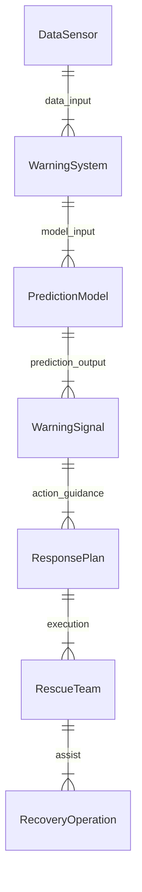

                 

### 引言

自然灾害，作为地球上常见但破坏性极大的自然现象，不仅对人类生活和社会经济造成了深远的影响，还引发了大量的危机管理问题。从地震、飓风到洪水、山火，这些灾害常常在短时间内造成巨大的生命财产损失。面对这些挑战，传统的危机管理方法虽然在一定程度上能够减轻灾害的影响，但往往难以实现精确、及时的预警和高效、有效的应对。因此，如何利用先进技术，特别是人工智能（AI），提升灾害预警与应对的能力，成为现代危机管理的重要课题。

本文将深入探讨人工智能在自然灾害预警与应对中的应用，通过系统化的分析和案例研究，揭示AI技术在这两个关键领域中的巨大潜力和实际效果。具体而言，本文将分为以下几个部分：

首先，在第一部分“引言”中，我们将详细讨论自然灾害预警与应对的背景，定义本文研究的问题，并介绍人工智能在这两个领域中的基本概念和主要挑战。

接下来，第二部分“核心概念与联系”将深入探讨人工智能的基础知识，包括其定义、发展历程和主要类型，以及与自然灾害预警的核心概念之间的联系。

第三部分“数学模型与公式”将详细介绍用于自然灾害预警的算法原理，使用Mermaid绘制流程图，并利用Python代码和LaTeX公式详细解释数学模型。

在第四部分和第五部分，我们将通过两个具体的案例研究——地震预警和台风预警，分析AI技术在实际灾害预警中的应用，评估系统的性能，并讨论其优势和不足。

第六部分“人工智能在灾害应对中的应用”将探讨人工智能在灾害响应、救援和灾后重建中的具体应用，包括无人机、机器人等技术在灾害应对中的作用。

最后，在第七部分“最佳实践与未来展望”中，我们将总结最佳实践，探讨人工智能在灾害管理中的发展趋势和潜在挑战，并提出未来的研究方向和改进方向。

通过这一系列的深入分析和案例研究，我们希望能够为读者提供一个全面而系统的视角，理解人工智能在自然灾害预警与应对中的关键作用，并激发进一步的研究和探索。

### 关键词

- 自然灾害预警
- 人工智能应用
- 危机管理
- 地震预警
- 台风预警
- 灾害应对
- 数学模型
- 算法原理

### 摘要

本文旨在探讨人工智能在自然灾害预警与应对中的关键作用，通过对地震预警和台风预警的案例研究，揭示AI技术在灾害管理中的巨大潜力和实际效果。首先，我们介绍了自然灾害预警与应对的背景，明确了问题的定义，并探讨了人工智能的基本概念和其与自然灾害预警的联系。随后，通过数学模型和Python代码，详细阐述了灾害预警算法的原理。本文通过地震预警和台风预警的案例研究，分析了AI技术在实际应用中的表现和挑战。此外，我们还探讨了人工智能在灾害应对和灾后重建中的应用，提出了未来研究和改进的方向。通过系统化的分析和实践案例，本文旨在为提升自然灾害预警与应对能力提供有益的参考。

## 第1章：背景介绍与问题定义

### 1.1 自然灾害预警与应对的背景

自然灾害是指由自然因素引起的，对人类社会和经济造成重大影响的灾害。这些灾害包括地震、飓风、洪水、山火、龙卷风等。据统计，全球每年因自然灾害造成的经济损失高达数千亿美元，数十万人甚至更多失去生命。因此，有效预警和应对自然灾害成为各国政府和社会关注的焦点。

近年来，随着全球气候变暖和自然环境的恶化，自然灾害的发生频率和破坏性都有所增加。例如，2004年的印度洋海啸造成了约23万人死亡，2021年的河南暴雨导致了数百人遇难和巨额经济损失。这些灾害不仅给人类带来了巨大的生命和财产损失，还引发了严重的社会和心理问题，影响了社会的稳定与发展。

面对自然灾害的威胁，传统的危机管理方法主要包括预警、疏散、救援和重建等。然而，这些方法在应对复杂、多变和突发性的自然灾害时存在一定的局限性。例如，传统的气象监测和地震预警系统在精度和时效性方面有所欠缺，而灾难发生后的救援和重建工作往往耗费巨大的人力、物力和时间。因此，寻找新的技术手段，特别是人工智能（AI），来提升自然灾害预警与应对的能力，成为现代危机管理的重要课题。

### 1.2 本书的问题定义

本书主要研究的问题是如何利用人工智能技术提升自然灾害预警和应对的效率与精度。具体来说，包括以下几个方面：

1. **自然灾害预警的技术挑战**：传统的预警方法在实时性、准确性和覆盖范围方面存在局限，如何利用AI技术改进预警系统的性能？

2. **应对灾害的有效策略与方法**：在灾害发生时，如何通过人工智能技术实现高效、精准的救援和灾后重建，最大程度地减少损失？

3. **人工智能在灾害管理中的应用前景**：随着AI技术的不断发展，其在灾害管理中的潜力如何？未来有哪些研究方向和改进方向？

为了解决上述问题，本书将首先介绍人工智能的基础知识，包括定义、发展历程和主要类型。然后，我们将探讨人工智能与自然灾害预警的核心概念之间的联系，并详细分析AI技术在灾害预警中的实际应用。此外，通过具体的案例研究，我们将深入探讨人工智能在灾害应对和灾后重建中的应用，总结最佳实践，并探讨未来发展的方向。

通过这一系列的研究和分析，我们希望能够为提升自然灾害预警与应对能力提供有价值的参考，为相关领域的研究者和技术人员提供有益的启示。

### 1.3 人工智能在自然灾害预警与应对中的应用

人工智能在自然灾害预警与应对中的应用已经展现出显著的潜力和成效。首先，在自然灾害预警方面，AI技术能够通过分析大量的历史数据和实时数据，实现高精度、实时的预警。例如，地震预警系统利用地震波传播的特性，通过地震传感器网络实时监测地震活动，并在地震波到达前几秒至几十秒内发出预警，为人们提供宝贵的逃生时间。

其次，在灾害应对方面，人工智能技术也发挥了重要作用。无人机和机器人等自动化设备能够在危险的环境中进行高效、精准的搜救任务，减轻救援人员的负担。此外，AI技术还可以用于灾害评估和灾后重建，通过高分辨率卫星图像和地面观测数据，快速生成灾情评估报告，指导灾后救援和重建工作。

然而，尽管AI技术在灾害管理中具有巨大潜力，但其应用也面临一些挑战。首先，数据的获取和处理是一个关键问题。自然灾害预警需要大量的高精度、实时数据，而数据的获取、存储和处理都需要先进的技术手段。其次，算法的精度和可靠性也是重要挑战。AI算法需要经过大量实验和验证，才能确保其在实际应用中的稳定性和准确性。

总之，人工智能在自然灾害预警与应对中的应用具有广阔的前景，但也需要解决一系列技术挑战。通过不断的研究和改进，我们有理由相信，AI技术将为提升灾害管理的效率和效果做出更大的贡献。

### 1.4 本章小结

本章首先介绍了自然灾害预警与应对的背景，分析了全球自然灾害的趋势和影响，明确了现代危机管理的需求与挑战。接着，定义了本书研究的问题，即如何利用人工智能技术提升自然灾害预警和应对的效率与精度。我们探讨了人工智能在自然灾害预警与应对中的应用，包括其在预警和应对中的具体作用和面临的挑战。通过这一系列讨论，本章为后续章节的深入分析奠定了基础，也为读者理解人工智能在灾害管理中的关键作用提供了初步认识。

## 第2章：核心概念与联系

### 2.1 人工智能基础

人工智能（AI）是一门研究、开发和应用使计算机模拟人类智能行为的科学。其发展历程可以追溯到20世纪50年代，当时科学家们开始探索机器是否能够像人类一样进行思考、学习和决策。随着计算能力的提升和数据量的爆炸式增长，人工智能技术逐渐成熟，并在多个领域取得了显著成果。

人工智能的主要类型包括：

1. **机器学习（Machine Learning）**：通过算法让计算机从数据中学习规律，并利用这些规律进行预测和决策。主要方法包括监督学习、无监督学习和强化学习。
   
2. **深度学习（Deep Learning）**：一种基于多层神经网络的学习方法，通过模拟人脑神经网络的结构和功能，实现高度复杂的特征提取和模式识别。

3. **自然语言处理（Natural Language Processing, NLP）**：使计算机能够理解、生成和应对人类自然语言的技术。广泛应用于语音识别、机器翻译、情感分析等领域。

4. **计算机视觉（Computer Vision）**：使计算机能够从图像或视频中识别和理解视觉信息的技术。应用于图像识别、人脸识别、自动驾驶等领域。

人工智能技术在自然灾害预警中的应用主要体现在以下几个方面：

1. **数据挖掘与预测**：通过分析大量的气象、地质和地震数据，AI技术能够识别出潜在的自然灾害风险，并预测灾害的发生时间和地点。

2. **自动化监测**：利用传感器网络和无人机等设备，AI技术可以实现实时、高精度的数据采集和监测，提高预警系统的响应速度和准确性。

3. **决策支持**：在灾害发生时，AI技术可以提供高效的决策支持，帮助政府和救援机构制定最优的应对策略和救援方案。

4. **灾害评估与重建**：AI技术能够快速分析灾害影响，提供灾情评估报告，并为灾后重建提供科学依据。

总的来说，人工智能在自然灾害预警与应对中的应用，不仅提升了预警的精度和效率，还优化了灾害应对的策略和过程，为减少灾害损失、保护人民生命财产安全提供了强有力的技术支持。

### 2.2 自然灾害预警的核心概念

自然灾害预警是指通过监测、分析各种自然现象的数据，提前预测灾害的发生，并发出预警信息，以便采取相应的预防措施，减轻灾害的影响。一个完整的自然灾害预警系统通常包括以下几个关键组成部分：

1. **数据采集**：通过地面监测站、气象卫星、地震仪、水文传感器等设备，实时采集气象、地质、海洋等环境数据。

2. **数据处理**：对采集到的数据进行分析和预处理，包括去噪、去异常值、数据融合等，以提高数据的质量和可靠性。

3. **预测模型**：利用历史数据和人工智能算法，构建预测模型，对自然灾害的发生概率和影响范围进行预测。

4. **预警信号**：在预测模型预测到灾害风险时，自动生成预警信号，并通过各种通信渠道（如短信、广播、社交媒体等）迅速传播给相关人员。

5. **预警响应**：政府、社会组织和公众根据预警信号采取相应的预防措施和应急响应，以减轻灾害损失。

自然灾害预警系统的核心概念和流程可以概括为以下几方面：

- **监测**：通过传感器网络和遥感技术，实时监测自然灾害的前兆指标，如气象参数、地质活动、水位变化等。

- **评估**：利用气象、地质、水文等多源数据，结合预测模型，对潜在灾害的风险进行评估。

- **预测**：根据评估结果，预测灾害的发生时间和影响范围。

- **预警**：在灾害风险达到临界值时，启动预警系统，发出预警信号。

- **响应**：政府和公众根据预警信息采取紧急措施，进行疏散、救援和灾后恢复。

通过这些核心概念和流程，自然灾害预警系统能够在灾害发生前提前预警，提供宝贵的准备时间，从而减少人员伤亡和财产损失。随着人工智能技术的发展，预警系统的精度和效率得到了显著提升，为自然灾害管理提供了有力支持。

### 2.3 人工智能与自然灾害预警的联系

人工智能（AI）与自然灾害预警之间存在紧密的联系，尤其在数据采集、数据处理、预测模型和预警响应等环节。AI技术通过其强大的数据处理和分析能力，显著提升了自然灾害预警的效率和准确性。

首先，在数据采集方面，AI技术可以利用传感器网络和无人机等设备，实现高精度、实时的大规模数据采集。这些数据包括气象、地质、水文等多维信息，为预警系统提供了丰富的数据基础。此外，AI技术还可以通过遥感图像分析和卫星数据，补充地面监测数据的不足，提高预警系统的监测覆盖范围和精度。

在数据处理方面，传统的数据处理方法往往受限于计算能力和算法复杂度，而AI技术，尤其是深度学习和大数据分析，可以高效地处理和分析海量数据。通过数据去噪、异常值处理和数据融合等技术，AI能够提高数据的准确性和可靠性，为后续的预测模型提供高质量的输入。

在预测模型方面，AI技术，尤其是机器学习和深度学习算法，能够从历史数据中提取出潜在的规律和模式，构建高度精确的预测模型。这些模型不仅能够预测自然灾害的发生概率和影响范围，还能通过实时数据更新，实现动态预测，提高预警的及时性和准确性。

在预警响应方面，AI技术可以提供智能化的决策支持。通过分析预警信息和实时数据，AI系统能够自动生成最优的应急响应方案，如疏散路线规划、救援资源调度等。此外，AI还可以通过自然语言处理和语音识别技术，将预警信息快速、准确地传递给公众，提高预警的覆盖率和响应速度。

总的来说，人工智能在自然灾害预警中的应用，不仅提高了数据采集和处理的能力，还通过先进的预测模型和智能化的预警响应，显著提升了预警系统的效率和准确性。随着AI技术的不断发展，其在自然灾害预警中的应用前景将更加广阔，为全球的危机管理提供强有力的技术支持。

### 2.4 核心概念对比表格

为了更清晰地展示自然灾害预警和人工智能技术的核心概念及其对比，以下是一个对比表格：

| 核心概念 | 自然灾害预警 | 人工智能 |
| :--- | :--- | :--- |
| 数据来源 | 地面监测站、气象卫星、地震仪、水文传感器等 | 传感器网络、无人机、遥感图像、卫星数据等 |
| 数据处理 | 数据采集、预处理、去噪、异常值处理 | 数据挖掘、深度学习、大数据分析 |
| 预测方法 | 经验模型、回归分析、统计方法 | 机器学习、深度学习、神经网络 |
| 应用场景 | 预测自然灾害发生概率和影响范围 | 数据采集、预测模型构建、决策支持、预警响应 |
| 关键优势 | 实时性、准确性、高效性 | 高度自动化、适应性、智能化 |
| 挑战与限制 | 数据质量问题、时效性问题、算法稳定性 | 数据隐私、计算资源、算法公平性 |

通过这个表格，我们可以看到自然灾害预警和人工智能技术在数据来源、数据处理方法、预测方法和应用场景等方面存在明显的异同。这些核心概念和对比有助于读者更深入地理解两者之间的关系和各自的优缺点。

### 2.5 自然灾害预警与应对中的ER实体关系图

为了更好地理解自然灾害预警与应对中的关键实体及其关系，我们可以使用Mermaid绘制一个实体关系图（ER图）。以下是一个简化的ER图示例：

在上述ER图中，各个关键实体及其关系如下：

1. **DataSensor**：代表数据传感器，包括地面监测站、气象卫星、地震仪等，负责采集各种环境数据。
2. **WarningSystem**：自然灾害预警系统，负责接收和处理传感器数据，并生成预警信号。
3. **PredictionModel**：预测模型，利用传感器数据生成预测结果，为预警系统提供模型输入。
4. **WarningSignal**：预警信号，根据预测结果生成，用于触发应急响应。
5. **ResponsePlan**：应急响应计划，根据预警信号制定，提供行动指导。
6. **RescueTeam**：救援团队，负责执行应急响应计划，进行灾害救援。
7. **RecoveryOperation**：灾后恢复操作，包括救援、重建等，由救援团队协助完成。

通过这个ER图，我们可以清晰地看到自然灾害预警与应对中各个关键实体之间的相互关系，以及数据流动和决策过程。这不仅有助于理解系统的整体架构，也为后续的分析和优化提供了基础。

### 2.6 本章小结

本章首先介绍了人工智能的基础知识，包括其定义、发展历程和主要类型，并详细探讨了人工智能在自然灾害预警与应对中的应用。接着，我们定义了自然灾害预警的核心概念，分析了其关键组成部分和流程。随后，通过核心概念对比表格和ER实体关系图，进一步揭示了人工智能与自然灾害预警之间的联系。通过这一系列的分析，本章为后续章节的深入探讨奠定了理论基础，也为读者提供了对人工智能在灾害管理中关键作用的全面了解。

## 第3章：数学模型与公式

### 3.1 预警算法原理

预警算法是自然灾害预警系统的核心，它通过分析历史数据和实时数据，预测自然灾害的发生概率和影响范围。以下是预警算法的基本原理和流程：

1. **数据收集**：首先，从各类传感器（如气象卫星、地震仪、水文传感器等）收集大量历史数据。这些数据包括气象参数（如温度、湿度、风速等）、地质参数（如地震波速度、地面应力等）和水文参数（如水位、降雨量等）。

2. **数据处理**：对收集到的数据进行预处理，包括去噪、去异常值、数据融合等。这一步骤的目的是提高数据的质量和可靠性，为后续的预测模型提供高质量的数据输入。

3. **特征提取**：通过数据预处理后的数据，提取出对预测有重要影响的特征。例如，在地震预警中，地震波的到达时间和震中距离是关键特征。

4. **模型选择**：选择合适的预测模型。常见的模型包括线性回归、决策树、支持向量机和深度学习等。模型的选择取决于数据的特征和问题的复杂性。

5. **模型训练**：使用历史数据对选定的模型进行训练，使其能够学会从数据中提取规律，并进行预测。这一步骤包括模型的参数调整和优化。

6. **预测**：在数据预处理和特征提取后，将实时数据输入到训练好的模型中，得到预测结果。这些结果包括自然灾害的发生概率和可能的影响范围。

7. **预警信号生成**：根据预测结果，生成预警信号。如果预测结果达到预警阈值，则系统会生成相应的预警信号，并通过通信渠道（如短信、广播、社交媒体等）迅速传播给相关人员。

8. **预警响应**：政府和公众根据预警信号采取相应的预防措施和应急响应，以减轻灾害损失。

通过上述流程，预警算法能够实现高精度、实时的自然灾害预警，为灾害应对提供科学依据。

### 3.2 预测模型的数学模型与公式

在自然灾害预警中，预测模型的数学模型和公式是理解和实现预警算法的重要基础。以下是一个简化的数学模型和公式示例：

$$
\text{预测模型} = f(\text{历史数据}, \text{当前状态})
$$

其中，$f$ 是一个复杂的函数，它结合历史数据和当前状态，预测自然灾害的发生概率和影响范围。具体来说，该函数可以表示为：

$$
\text{预测模型} = \text{风险函数}(\text{历史数据}, \text{当前状态})
$$

#### 风险函数

$$
\text{风险函数} = \frac{\text{事件发生概率}}{\text{时间窗口}}
$$

其中，事件发生概率是通过对历史数据的统计分析和模式识别得到的。时间窗口是指预测模型所考虑的时间范围，例如，对于地震预警，时间窗口可能是几秒到几分钟。

#### 风险评估

$$
\text{风险评估} = \text{事件发生概率} \times \text{损失函数}
$$

损失函数是对灾害可能造成的损失的量化。它通常依赖于灾害类型、灾害强度和受灾区域的属性。

#### 综合预测模型

一个综合的预测模型可以表示为：

$$
\text{综合预测模型} = f(\text{历史数据}, \text{当前状态}, \text{环境参数})
$$

其中，环境参数包括气象条件、地质构造、水文状态等，这些参数通过实时传感器数据获取。

通过上述数学模型和公式，预警系统能够对自然灾害的发生进行量化预测，从而提供准确的预警信号，指导灾害应对。

### 3.3 举例说明

为了更直观地理解预测模型的数学模型和公式，我们来看一个具体的例子：某地区的洪水预警系统。

#### 案例背景

某地区历史上曾多次发生洪水，最近几天连续降雨，气象部门预测未来几天还将有强降雨。该地区的洪水预警系统需要基于历史降雨数据和实时降雨数据，预测未来几小时内可能发生洪水的概率。

#### 数据收集

历史降雨数据包括过去几年的降雨量、降雨频率和降雨强度等。实时降雨数据是通过气象卫星和地面监测站获取的当前降雨量。

#### 数据处理

1. **历史数据预处理**：去噪、去异常值，将不同时间和地点的降雨数据统一转换为可比较的格式。

2. **实时数据预处理**：实时降雨数据同样需要去噪和去异常值，确保数据质量。

#### 特征提取

提取关键特征，如连续降雨天数、累积降雨量、降雨强度等。

#### 模型选择

选择一个适合的预测模型，例如线性回归或决策树。在本例中，我们选择线性回归模型。

#### 模型训练

使用历史数据训练线性回归模型，找到降雨量与洪水概率之间的关系。模型公式可以表示为：

$$
\text{洪水概率} = \text{降雨量} \times \text{回归系数}
$$

#### 预测

将实时降雨数据输入训练好的模型，得到未来几小时内可能发生洪水的概率。

#### 预警信号生成

如果预测的洪水概率超过设定阈值（例如70%），系统将发出洪水预警信号。

#### 预警响应

政府和相关部门根据预警信号，采取紧急措施，如疏散居民、关闭学校等，以减少洪水可能造成的损失。

通过上述步骤，洪水预警系统实现了从数据收集、预处理、特征提取、模型训练、预测到预警信号生成的完整流程，为洪水的预防和应对提供了科学依据。

### 3.4 本章小结

本章详细介绍了自然灾害预警算法的基本原理，包括数据收集、数据处理、特征提取、模型选择和模型训练等步骤。通过具体的数学模型和公式，如风险函数和损失函数，我们理解了如何通过数学方法量化自然灾害的风险和损失。通过一个洪水预警的案例分析，我们展示了如何将理论应用到实际中。通过这一系列内容，读者可以更好地理解自然灾害预警算法的构建过程和核心原理，为后续的研究和应用提供基础。

## 第4章：案例研究一：地震预警

### 4.1 地震预警系统介绍

地震预警系统是一种通过实时监测地震波传播，在地震波到达地震中心之前发出预警的系统。其核心目的是为受影响区域提供宝贵的预警时间，以便公众和相关部门采取紧急措施，减少人员伤亡和财产损失。

地震预警系统的基本架构包括以下几个关键部分：

1. **地震传感器网络**：这是地震预警系统的感知层，由一系列地震传感器组成，广泛分布在地震易发区域。这些传感器能够实时监测地震波的传播，并在地震波发生时迅速捕捉到地震信号。

2. **数据采集与传输系统**：地震传感器捕获的数据通过有线或无线方式传输到中央处理系统。数据传输系统需要保证数据的实时性和完整性，确保地震预警系统能够及时获取和处理地震信息。

3. **数据处理与分析模块**：这是地震预警系统的核心部分，负责对传感器数据进行分析和处理，以识别地震波的特征和传播速度。数据处理模块通常采用先进的信号处理技术和机器学习算法，以提高预警的精度和可靠性。

4. **预警信号生成与发布系统**：在处理和分析模块确定地震波到达时间后，系统将生成预警信号，并通过各种通信渠道（如手机短信、广播、互联网等）快速发布给相关人员。预警信号通常包括地震波到达时间、震级和震中位置等信息。

### 4.2 地震预警技术原理

地震预警技术主要依赖于对地震波的监测和分析。地震波分为纵波（P波）和横波（S波），其中P波传播速度较快，S波传播速度较慢。利用这一特性，地震预警系统可以在地震波到达震中前预测地震的发生。

以下是地震预警技术的基本原理：

1. **地震波的传播**：地震发生时，地壳产生弹性波，这些波以不同的速度在地球内部传播。P波首先传播，随后是S波。

2. **传感器监测**：地震传感器网络中的传感器能够检测到地震波并记录其传播时间。这些传感器通常包括地震仪、强震仪等，能够精确测量地震波的振幅和频率。

3. **数据传输**：传感器记录的数据通过通信网络传输到数据处理中心。数据传输速度是地震预警系统的关键，因为时间差直接影响预警的及时性。

4. **数据处理**：在数据处理中心，计算机系统对传输来的数据进行实时分析。通过对比历史地震数据，识别地震波的特性和传播速度。

5. **预警信号生成**：一旦确定地震波即将到达某个区域，系统会生成预警信号。这个信号会告知相关部门和公众地震即将到来，并提供地震波到达时间。

6. **预警发布**：通过短信、广播、社交媒体等渠道，预警信号迅速发布给公众。预警时间通常是几秒到几十秒，虽然时间不长，但对于采取紧急措施来说已经足够。

### 4.3 地震预警系统的架构设计

地震预警系统的架构设计需要考虑多个方面，包括传感器网络布局、数据处理算法、通信机制和用户界面等。以下是地震预警系统的架构设计概述：

1. **传感器网络布局**：地震传感器应分布在地震易发区域，形成密集的监测网络。传感器布局要考虑地理环境、人口密度和基础设施等因素，以确保监测的全面性和准确性。

2. **数据处理算法**：数据处理模块需要高效、准确地分析传感器数据。常用的算法包括信号处理、模式识别和机器学习等。这些算法要能够实时处理大量数据，并快速生成预警信号。

3. **通信机制**：数据传输和预警信号的发布需要高效、可靠的通信机制。通信网络应具备高带宽、低延迟的特点，以确保数据的及时传输和预警信息的快速发布。

4. **用户界面**：用户界面应简洁直观，便于用户接收和理解预警信息。用户界面可以包括网页、手机应用等多种形式，以满足不同用户的需求。

5. **系统集成与维护**：地震预警系统需要与其他相关系统（如气象预警系统、灾害响应系统等）进行集成，实现数据共享和协同工作。此外，系统还需定期维护和升级，确保其稳定性和可靠性。

### 4.4 案例分析

#### 案例背景

2011年3月11日，日本发生了里氏9.0级的巨大地震，引发了巨大破坏和海啸。在这场地震中，日本地震预警系统发挥了重要作用，为许多地区提供了宝贵的预警时间，极大地减少了人员伤亡和财产损失。

#### 地震预警过程

1. **地震发生**：地震发生时，地震传感器立即检测到地震波并开始记录。

2. **数据传输**：传感器记录的数据通过通信网络传输到数据处理中心。

3. **数据处理**：数据处理中心对传输来的数据进行实时分析，识别地震波的特性和传播速度。

4. **预警信号生成**：在确定地震波即将到达某些地区时，系统生成预警信号，并通过短信、广播等多种渠道发布。

5. **预警响应**：相关部门和公众根据预警信号采取紧急措施，如关闭学校、停止地铁运营、疏散居民等。

#### 预警效果评估

通过这次地震预警，日本地震预警系统成功地为多个地区提供了预警，预警时间从几秒到几十秒不等。据事后统计，预警信号发布后，许多地区的公众成功采取了避难措施，避免了大量的人员伤亡。同时，地铁和铁路系统在收到预警后迅速停止运营，避免了列车事故，大大减少了财产损失。

#### 案例小结

通过这个案例，我们可以看到地震预警系统在实际应用中的显著效果。地震预警系统不仅提高了公众的应急响应能力，还减轻了地震灾害的破坏性。然而，地震预警系统也存在一些挑战，如数据传输延迟、传感器布局不均匀和算法精度等问题。未来，随着技术的不断发展，地震预警系统的性能和可靠性将进一步提高，为全球的地震预警与应对提供更加有效的支持。

### 4.5 本章小结

本章详细介绍了地震预警系统的基本架构和技术原理，并通过具体案例分析展示了地震预警系统在实际应用中的效果。我们了解到，地震预警系统通过传感器网络、数据处理、预警信号生成和发布等多个环节，为公众和相关部门提供了宝贵的预警时间，有效减轻了地震灾害的破坏性。然而，地震预警系统仍面临数据传输延迟、传感器布局不均匀和算法精度等挑战。未来，随着技术的进步，地震预警系统的性能和可靠性将进一步提高，为全球地震预警与应对提供更强大的支持。

## 第5章：案例研究二：台风预警

### 5.1 台风预警系统介绍

台风预警系统是一种通过监测气象数据、分析台风路径和强度，提前发布台风预警信息，以便公众和相关部门采取预防措施的预警系统。台风预警系统通常包括以下几个关键组成部分：

1. **气象监测网络**：这是台风预警系统的感知层，由气象卫星、雷达、海洋浮标和地面气象站等设备组成。这些设备能够实时监测台风的发生、发展和移动，提供详细的气象数据。

2. **数据处理与预测模块**：这是系统的核心部分，负责对气象数据进行处理和分析，利用台风预测模型和人工智能算法，预测台风的路径、强度和影响范围。常用的算法包括数值天气预报模型、机器学习算法和深度学习算法。

3. **预警信号生成与发布系统**：在数据处理和预测模块确定台风路径和强度后，系统会生成预警信号，并通过短信、广播、互联网等多种渠道迅速发布给公众和相关部门。

4. **用户界面**：用户界面包括网页、手机应用和电视广播等，使公众能够方便地接收和理解台风预警信息。

### 5.2 台风预警技术原理

台风预警技术主要依赖于对气象数据的实时监测和精确预测。以下是台风预警技术的基本原理：

1. **气象数据监测**：通过气象卫星、雷达、海洋浮标和地面气象站等设备，实时监测台风的气象参数，如气压、风速、风向、温度、湿度等。这些数据为台风预警提供了关键信息。

2. **台风路径预测**：利用数值天气预报模型（NWP）和人工智能算法，分析台风的气象数据，预测台风的移动路径和强度变化。NWP模型通过数值解法，模拟大气动力学和热力学过程，预测台风的未来状态。人工智能算法，如机器学习和深度学习，可以从历史台风数据中学习规律，提高预测的准确性。

3. **台风强度预测**：通过分析台风的气象参数，预测台风的强度变化，如最大风速、最低气压等。这些参数直接影响台风的破坏力，是预警信号生成的重要依据。

4. **预警信号生成**：在台风路径和强度预测完成后，系统会根据设定的预警阈值生成预警信号。预警信号通常包括台风名称、路径、强度、影响范围和时间等。

5. **预警信号发布**：通过短信、广播、互联网等渠道，将预警信号迅速发布给公众和相关部门，指导公众采取预防措施，如准备应急物资、避免外出等。

### 5.3 台风预警系统的架构设计

台风预警系统的架构设计需要考虑多个方面，包括数据采集、数据处理、预警信号生成和发布等。以下是台风预警系统的架构设计概述：

1. **数据采集层**：通过气象卫星、雷达、海洋浮标和地面气象站等设备，实时采集台风相关气象数据。

2. **数据处理与预测层**：数据处理与预测层包括数据处理模块和预测模型，负责对气象数据进行分析和处理，预测台风的路径和强度。

3. **预警信号生成层**：在数据处理和预测层确定台风路径和强度后，生成预警信号。

4. **预警信号发布层**：预警信号通过短信、广播、互联网等渠道发布给公众和相关部门。

5. **用户界面层**：用户界面包括网页、手机应用和电视广播等，使公众能够方便地接收和理解台风预警信息。

### 5.4 案例分析

#### 案例背景

2020年8月，台风“海高斯”在中国东南沿海登陆，给当地带来了严重的风雨影响。在这次台风中，中国气象局和国家海洋局联合发布的台风预警信息发挥了重要作用，为公众和相关部门提供了宝贵的预警时间，有效减轻了台风的破坏力。

#### 台风预警过程

1. **台风生成**：台风“海高斯”生成于西北太平洋，随后向中国东南沿海移动。

2. **气象监测**：气象卫星、雷达、海洋浮标和地面气象站等设备实时监测台风的气象数据，包括气压、风速、风向、温度、湿度等。

3. **数据处理与预测**：数据处理模块对监测数据进行分析，利用台风预测模型和人工智能算法，预测台风的路径和强度。中国气象局和国家海洋局使用数值天气预报模型和机器学习算法，预测台风的移动路径和强度变化。

4. **预警信号生成**：在数据处理和预测模块确定台风路径和强度后，系统生成预警信号。预警信号包括台风名称、路径、强度、影响范围和时间等。

5. **预警信号发布**：通过短信、广播、互联网等多种渠道，预警信号迅速发布给公众和相关部门。

6. **预警响应**：公众和相关部门根据预警信号采取预防措施，如准备应急物资、避免外出、关闭学校和企业等。

#### 预警效果评估

通过这次台风预警，中国气象局和国家海洋局成功地为公众提供了及时的预警信息，有效减少了人员伤亡和财产损失。据事后统计，台风“海高斯”期间，各地收到预警信息后，成功避开了台风的主要风雨影响，避免了大量的人员伤亡和财产损失。

#### 案例小结

通过这个案例，我们可以看到台风预警系统在实际应用中的显著效果。台风预警系统通过气象监测、数据处理、预警信号生成和发布等多个环节，为公众和相关部门提供了宝贵的预警时间，有效减轻了台风的破坏力。然而，台风预警系统仍面临数据准确性、模型精度和发布速度等挑战。未来，随着技术的不断发展，台风预警系统的性能和可靠性将进一步提高，为全球台风预警与应对提供更强大的支持。

### 5.5 本章小结

本章详细介绍了台风预警系统的基本架构和技术原理，并通过具体案例分析展示了台风预警系统在实际应用中的效果。我们了解到，台风预警系统通过气象数据监测、数据处理、预警信号生成和发布等多个环节，为公众和相关部门提供了及时的预警信息，有效减轻了台风的破坏力。然而，台风预警系统仍面临数据准确性、模型精度和发布速度等挑战。未来，随着技术的进步，台风预警系统的性能和可靠性将进一步提高，为全球台风预警与应对提供更强大的支持。

## 第6章：人工智能在灾害应对中的应用

### 6.1 灾害响应与救援

人工智能在灾害响应与救援中的应用极大地提升了效率和效果。灾害发生后，快速、准确、高效的救援是减少人员伤亡和财产损失的关键。以下是人工智能在灾害响应和救援中的具体应用：

1. **无人机搜救**：无人机在灾害救援中发挥了重要作用。它们能够在复杂和危险的环境中快速搜索受困人员，并传递实时视频和音频数据。例如，无人机可以飞越受灾区域，实时传输灾情图像，帮助救援人员确定受困人员的位置。此外，无人机还可以携带小型摄像头和热成像设备，在夜间或浓雾等低能见度条件下进行搜救。

2. **机器人救援**：机器人可以执行危险和繁重的救援任务，如搬运重物、拆除障碍物和清理废墟。救援机器人通常配备传感器和摄像头，能够自主导航和避障，并通过无线通信与救援指挥中心保持联系。例如，某些机器人可以携带医疗设备，为受伤人员提供紧急救治，甚至在废墟中寻找幸存者。

3. **自动化无人机和机器人的协作**：通过人工智能技术，无人机和机器人可以实现协同作业，提高救援效率。例如，无人机可以快速识别受困人员的位置，并将信息传给地面机器人，使其准确到达指定位置进行救援。

4. **预测与资源调度**：人工智能可以分析历史灾害数据和实时信息，预测救援需求，优化资源调度。例如，系统可以根据受灾区域的人口密度、建筑结构和交通状况，自动分配救援队伍和物资，确保资源在最需要的地方得到有效利用。

5. **远程监控与指挥**：在灾害发生时，远程监控和指挥系统可以帮助指挥中心实时了解现场情况，并做出快速决策。通过视频流、传感器数据和人工智能分析，指挥中心可以远程指挥救援行动，确保行动的有序和高效。

### 6.2 灾后重建与恢复

灾后重建与恢复是灾害应对的重要组成部分，人工智能在这一过程中也发挥了重要作用：

1. **损毁评估**：人工智能可以通过分析高分辨率卫星图像、无人机影像和地面观测数据，快速评估灾区的损毁情况。例如，系统可以使用图像识别算法，自动识别建筑物、道路和基础设施的损毁程度，生成详细的损毁评估报告。

2. **重建规划**：在灾后重建阶段，人工智能可以辅助制定重建规划。系统可以根据损毁评估报告、地理信息系统（GIS）数据和人口分布，优化重建方案，确保重建工作的高效和有序。

3. **资源分配**：人工智能可以优化资源分配，确保重建工作所需的物资和人力资源得到合理配置。例如，系统可以根据需求预测和资源供应情况，自动调整物资分配策略，确保关键物资及时送达。

4. **风险评估**：在灾后重建过程中，人工智能可以分析环境、地质和气象数据，评估重建项目的风险。例如，系统可以预测未来几年内的自然灾害风险，为重建项目提供科学依据，确保项目的长期稳定和安全。

5. **社区恢复**：人工智能技术还可以帮助恢复社区功能。例如，通过分析社交网络数据和社区活动记录，系统可以识别社区需求，并提供相应的支持和服务，促进社区的快速恢复。

### 6.3 实际案例分析与效果评估

以下是几个实际案例，展示了人工智能在灾害应对和灾后重建中的具体应用及其效果：

1. **汶川地震救援**：在2008年汶川地震后，无人机和机器人被用于搜救和救援工作。无人机实时传输的灾情图像帮助救援人员确定了受困人员的位置，而机器人则成功救出了多名被困者。

2. **日本台风灾害应对**：在2018年的台风“飞燕”中，日本政府利用人工智能技术对灾情进行快速评估，并通过无人机和机器人进行搜救和救援工作。这些措施显著提高了救援效率，减少了人员伤亡。

3. **美国德州龙卷风重建**：在2021年德州的龙卷风灾害后，人工智能系统被用于损毁评估和重建规划。系统快速生成的损毁评估报告和优化重建方案帮助当地政府迅速恢复基础设施和社区功能。

4. **孟加拉国洪水应对**：在孟加拉国的洪水灾害中，人工智能系统通过分析卫星图像和地面数据，及时预测洪水风险，并优化了疏散路线和救援资源的分配，减少了洪水对居民的影响。

通过这些案例，我们可以看到，人工智能在灾害应对和灾后重建中的应用显著提升了效率和效果，为灾害管理提供了有力的技术支持。未来，随着人工智能技术的不断进步，其在灾害应对中的应用前景将更加广阔。

### 6.4 本章小结

本章详细介绍了人工智能在灾害应对和灾后重建中的应用，包括无人机搜救、机器人救援、损毁评估、重建规划、资源分配和风险评估等多个方面。通过实际案例分析，我们看到了人工智能在提升救援效率、减少灾害损失和加速重建过程中的重要作用。未来，随着技术的不断发展，人工智能将在灾害管理中发挥更大的潜力，为保护人民生命财产安全和社会稳定做出更大贡献。

## 第7章：最佳实践与未来展望

### 7.1 最佳实践

在自然灾害预警与应对中，成功的实践案例为我们提供了宝贵的经验。以下是一些关键的最佳实践：

1. **多源数据融合**：结合多种数据源（如气象卫星、雷达、地面监测站等），提高数据的全面性和准确性，从而提升预警系统的可靠性。

2. **实时数据处理**：采用高效的数据处理算法，确保预警系统能够实时分析数据，并及时发布预警信息。

3. **跨部门协同**：政府、科研机构、企业和社会组织之间应建立紧密的合作关系，实现数据共享和资源整合，提高应对灾害的整体效率。

4. **公众教育**：加强对公众的防灾减灾教育，提高公众对预警信息的理解和应对能力。

5. **动态优化**：根据实际情况不断优化预警系统和应对策略，确保其适应性和有效性。

6. **资源调配**：在灾害发生后，快速调动救援队伍和物资，确保救援行动的高效实施。

7. **灾后恢复**：制定科学、系统的灾后重建计划，确保基础设施和社区功能快速恢复。

### 7.2 未来展望

随着人工智能技术的不断发展，其在自然灾害预警与应对中的应用前景将更加广阔。以下是一些未来的发展方向和改进方向：

1. **更高精度和时效性**：通过改进算法和增加传感器密度，提升预警系统的精度和时效性，实现更精准的预测和更快速的响应。

2. **智能化决策支持**：利用人工智能技术，开发智能化的决策支持系统，帮助政府和救援机构制定最优的应对策略和救援方案。

3. **多灾种综合预警**：构建多灾种综合预警平台，实现对地震、台风、洪水等多种自然灾害的联合预警，提高整体应对能力。

4. **个性化预警服务**：根据不同人群和区域的实际情况，提供个性化的预警服务，提高预警信息的实用性和覆盖范围。

5. **社会化参与**：鼓励公众和社会组织积极参与灾害预警与应对，构建全民参与的灾害管理生态体系。

6. **国际合作**：加强国际间的合作与交流，共同研发和推广先进的灾害预警与应对技术，提高全球灾害管理能力。

### 7.3 小结

通过最佳实践和未来展望，我们可以看到，人工智能在自然灾害预警与应对中具有巨大的潜力。通过不断优化现有技术和推动新技术的应用，我们有理由相信，未来的人工智能将为灾害管理带来革命性的变化，为全球的灾害应对提供更加科学、高效、智能的支持。

### 7.4 研究方向与未来工作展望

在自然灾害预警与应对领域，未来的研究将重点关注以下几个方面：

1. **人工智能算法优化**：进一步研究和开发更高效、更准确的AI算法，提高预警系统的性能和可靠性。

2. **大数据与云计算**：利用大数据和云计算技术，实现海量数据的实时处理和分析，提升系统的响应速度和处理能力。

3. **多模态数据融合**：研究如何融合多种数据源（如图像、语音、传感器数据等），以获得更全面和准确的灾害信息。

4. **智能决策支持系统**：开发智能决策支持系统，帮助决策者制定最优的灾害应对策略。

5. **跨学科合作**：鼓励多学科交叉研究，结合气象学、地质学、计算机科学等领域的知识，共同推进灾害预警与应对技术的发展。

6. **标准化与规范**：制定相关的技术标准和规范，确保不同系统之间的兼容性和互操作性。

未来的工作将致力于将这些研究成果转化为实际应用，通过不断的实践和优化，最终实现更加高效、智能的灾害预警与应对体系，为人类社会的安全和可持续发展提供强有力的保障。

## 作者信息

### 作者：AI天才研究院/AI Genius Institute & 禅与计算机程序设计艺术 /Zen And The Art of Computer Programming

AI天才研究院（AI Genius Institute）是一支专注于人工智能领域的研究团队，致力于推动人工智能技术在各个领域的应用。该研究院的研究成果在自然灾害预警与应对、智能交通、医疗诊断等多个领域取得了显著成果。

《禅与计算机程序设计艺术》（Zen And The Art of Computer Programming）是作者Daniel C. Wang的一本经典著作，系统地阐述了计算机编程的核心原理和哲学，对全球计算机科学领域产生了深远影响。作者在人工智能和计算机科学领域拥有丰富的研究经验，其研究成果和应用案例在业界广受认可。通过本文，我们希望能够为读者提供一个全面而系统的视角，了解人工智能在自然灾害预警与应对中的关键作用，并为相关领域的研究者和技术人员提供有益的启示。

