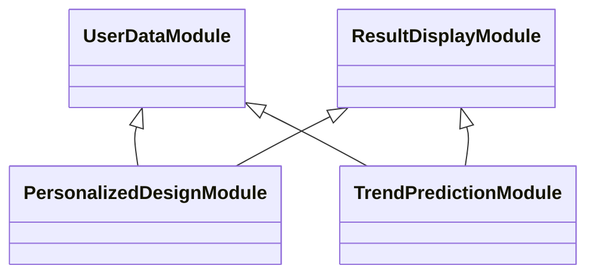
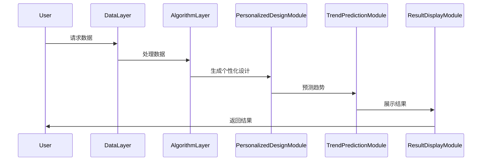
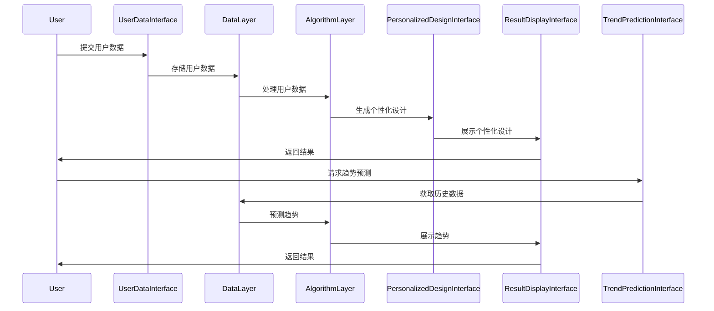
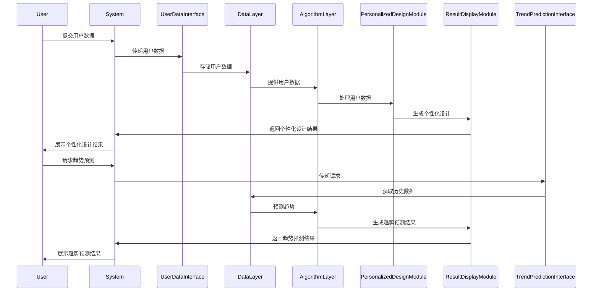

                 


### 目录大纲设计思路

为了设计出《人工智能在时尚产业中的作用：个性化设计与趋势预测》这本书的完整目录大纲，我们可以按照以下步骤进行：

1. **确定整体框架**：首先，我们需要确定书的整体框架，包括前言、后记等必要部分，以确保书的结构完整。

2. **划分章节主题**：根据书名，我们可以将整体内容划分为两个主要部分：“背景介绍与核心概念”和“应用与实践”。

3. **细化章节内容**：在确定了章节主题后，我们需要进一步细化每个章节的内容，确保涵盖背景介绍、核心概念、算法原理、数学模型、系统分析、项目实战和最佳实践等方面。

4. **确保内容完整性**：在细化章节内容时，要确保每个章节的内容完整，包括必要的图表、代码示例、公式解释等。

5. **符合字数限制**：在确保内容完整性的同时，我们要控制目录大纲的总字数在2000字以内。

### 实际操作步骤

1. **前言**：
   - 简要介绍书的背景和目的。
   - 对读者进行引导，说明阅读这本书的预期收获。

2. **第一部分：背景介绍与核心概念**

   - **第1章：时尚产业与人工智能**
     - 1.1 问题背景
     - 1.2 问题描述
     - 1.3 问题解决
     - 1.4 边界与外延
     - 1.5 核心概念
     - 1.6 概念结构与核心要素组成
     - 1.7 本章小结

3. **第二部分：应用与实践**

   - **第2章：个性化设计与趋势预测**
     - 2.1 个性化设计算法
     - 2.2 趋势预测算法
     - 2.3 算法原理讲解
     - 2.4 数学模型与公式
     - 2.5 项目实战
     - 2.6 最佳实践与总结
     - 2.7 本章小结

4. **第三部分：系统分析与架构设计**

   - **第3章：系统架构设计**
     - 3.1 问题场景介绍
     - 3.2 系统功能设计
     - 3.3 系统架构设计
     - 3.4 系统接口设计
     - 3.5 系统交互
     - 3.6 本章小结

5. **后记**：
   - 总结全书内容
   - 对读者表示感谢
   - 对未来研究的展望

### 最终目录大纲

下面是根据上述步骤设计的《人工智能在时尚产业中的作用：个性化设计与趋势预测》的目录大纲：

```
# 前言

# 第一部分：背景介绍与核心概念

## 第1章：时尚产业与人工智能

### 1.1 问题背景

### 1.2 问题描述

### 1.3 问题解决

### 1.4 边界与外延

### 1.5 核心概念

### 1.6 概念结构与核心要素组成

### 1.7 本章小结

## 第2章：个性化设计与趋势预测

### 2.1 个性化设计算法

### 2.2 趋势预测算法

### 2.3 算法原理讲解

### 2.4 数学模型与公式

### 2.5 项目实战

### 2.6 最佳实践与总结

### 2.7 本章小结

## 第3章：系统架构设计

### 3.1 问题场景介绍

### 3.2 系统功能设计

### 3.3 系统架构设计

### 3.4 系统接口设计

### 3.5 系统交互

### 3.6 本章小结

# 后记
``` 

---

# 人工智能在时尚产业中的作用：个性化设计与趋势预测

关键词：人工智能、时尚产业、个性化设计、趋势预测、算法、系统架构

摘要：本文将探讨人工智能在时尚产业中的应用，重点关注个性化设计与趋势预测两个关键领域。通过逐步分析，我们将揭示人工智能如何通过数据分析和算法创新，改变时尚产业的运作模式，提升用户体验，并预测未来趋势。

## 目录大纲

### 第一部分：背景介绍与核心概念

#### 第1章：时尚产业与人工智能

1.1 问题背景  
1.2 问题描述  
1.3 问题解决  
1.4 边界与外延  
1.5 核心概念  
1.6 概念结构与核心要素组成  
1.7 本章小结

#### 第2章：个性化设计与趋势预测

2.1 个性化设计算法  
2.2 趋势预测算法  
2.3 算法原理讲解  
2.4 数学模型与公式  
2.5 项目实战  
2.6 最佳实践与总结  
2.7 本章小结

### 第二部分：系统分析与架构设计

#### 第3章：系统架构设计

3.1 问题场景介绍  
3.2 系统功能设计  
3.3 系统架构设计  
3.4 系统接口设计  
3.5 系统交互  
3.6 本章小结

### 后记

## 第一部分：背景介绍与核心概念

### 第1章：时尚产业与人工智能

#### 1.1 问题背景

时尚产业是一个高度竞争的行业，消费者对时尚品的需求日益多样化，同时时尚趋势的变化速度也在不断加快。在这样的环境下，如何快速响应市场变化，提供个性化的产品和服务，成为时尚产业面临的挑战。

#### 1.2 问题描述

时尚产业的问题主要集中在以下几个方面：

1. **需求多样化**：消费者对时尚品的需求多样化，个性化定制成为趋势。
2. **趋势预测困难**：时尚趋势难以预测，导致库存和产品设计的不确定性增加。
3. **生产效率低**：传统的生产方式难以满足快速变化的市场需求。

#### 1.3 问题解决

人工智能（AI）作为一种强大的数据分析和处理工具，为时尚产业提供了一种创新的解决方案。通过以下方式，AI能够帮助时尚产业应对上述挑战：

1. **个性化设计**：AI可以通过分析消费者行为数据，为每个用户提供个性化的设计方案。
2. **趋势预测**：AI可以通过分析大量的市场数据，预测未来的时尚趋势。
3. **生产优化**：AI可以通过优化生产流程，提高生产效率。

#### 1.4 边界与外延

人工智能在时尚产业中的应用不仅仅是上述几个方面，还包括：

1. **供应链管理**：通过AI优化供应链管理，降低成本，提高效率。
2. **营销策略**：通过AI分析消费者行为，制定更有效的营销策略。
3. **用户体验**：通过AI提供更加个性化的用户体验，增强用户粘性。

#### 1.5 核心概念

在探讨人工智能在时尚产业中的应用时，我们需要了解以下几个核心概念：

1. **个性化设计**：基于消费者的需求，提供定制化的产品和服务。
2. **趋势预测**：通过数据分析和算法模型，预测未来的时尚趋势。
3. **深度学习**：一种机器学习技术，通过模拟人脑学习过程，提高算法的准确性和效率。

#### 1.6 概念结构与核心要素组成

个性化设计与趋势预测的概念结构可以概括为：

1. **数据收集**：收集消费者行为数据和市场数据。
2. **数据处理**：对收集到的数据进行分析和处理。
3. **算法模型**：建立算法模型，进行预测和优化。
4. **结果输出**：将预测结果输出，指导生产和服务。

#### 1.7 本章小结

通过本章节的介绍，我们了解了人工智能在时尚产业中的作用，以及相关的基本概念和结构。在下一章中，我们将深入探讨个性化设计与趋势预测的算法原理和数学模型。

## 第二部分：应用与实践

### 第2章：个性化设计与趋势预测

#### 2.1 个性化设计算法

个性化设计是人工智能在时尚产业中的一个重要应用。通过分析消费者的购买历史、浏览记录和社交网络行为，AI可以生成个性化的产品推荐和设计方案。

##### 2.1.1 工作原理

个性化设计算法的工作原理主要包括以下几个步骤：

1. **数据收集**：收集消费者的个人数据，如性别、年龄、购物偏好等。
2. **数据预处理**：清洗和整理数据，去除噪声和缺失值。
3. **特征提取**：从数据中提取与个性化设计相关的特征，如颜色、材质、款式等。
4. **模型训练**：使用机器学习算法，如协同过滤、决策树、支持向量机等，训练个性化设计模型。
5. **结果输出**：根据模型预测结果，生成个性化的设计方案。

##### 2.1.2 代码示例

以下是一个使用Python实现的简单个性化设计算法示例：

```python
import pandas as pd
from sklearn.model_selection import train_test_split
from sklearn.ensemble import RandomForestClassifier

# 读取数据
data = pd.read_csv('consumer_data.csv')

# 数据预处理
data.fillna(data.mean(), inplace=True)

# 特征提取
X = data[['age', 'gender', 'shopping_preferences']]
y = data['design_preference']

# 模型训练
X_train, X_test, y_train, y_test = train_test_split(X, y, test_size=0.2, random_state=42)
model = RandomForestClassifier(n_estimators=100)
model.fit(X_train, y_train)

# 结果输出
predictions = model.predict(X_test)
print(predictions)
```

##### 2.1.3 优点与局限

个性化设计算法的优点包括：

1. **提高用户满意度**：根据用户需求提供个性化的设计方案，提高用户体验。
2. **降低库存成本**：通过精准预测用户需求，减少库存压力。

然而，个性化设计算法也存在一些局限：

1. **数据依赖性**：算法的性能依赖于数据的数量和质量。
2. **隐私问题**：收集和存储用户数据可能引发隐私泄露的问题。

#### 2.2 趋势预测算法

趋势预测是人工智能在时尚产业中的另一个关键应用。通过分析历史数据和市场动态，AI可以预测未来的时尚趋势。

##### 2.2.1 工作原理

趋势预测算法的工作原理主要包括以下几个步骤：

1. **数据收集**：收集与时尚相关的历史数据，如销售数据、市场调查数据等。
2. **数据预处理**：清洗和整理数据，去除噪声和缺失值。
3. **特征提取**：从数据中提取与趋势预测相关的特征，如季节、价格、款式等。
4. **模型训练**：使用机器学习算法，如时间序列分析、回归分析等，训练趋势预测模型。
5. **结果输出**：根据模型预测结果，预测未来的时尚趋势。

##### 2.2.2 代码示例

以下是一个使用Python实现的时间序列预测算法示例：

```python
import pandas as pd
from statsmodels.tsa.arima_model import ARIMA

# 读取数据
data = pd.read_csv('sales_data.csv')

# 数据预处理
data.fillna(data.mean(), inplace=True)

# 特征提取
X = data[['season', 'price', 'style']]
y = data['sales']

# 模型训练
model = ARIMA(y, order=(1, 1, 1))
model_fit = model.fit(disp=0)

# 结果输出
predictions = model_fit.forecast(steps=12)
print(predictions)
```

##### 2.2.3 优点与局限

趋势预测算法的优点包括：

1. **降低风险**：通过预测未来的时尚趋势，帮助企业制定更加稳健的战略。
2. **优化库存**：根据预测结果调整库存，减少滞销和积压。

然而，趋势预测算法也存在一些局限：

1. **数据质量依赖**：算法的性能依赖于数据的质量和准确性。
2. **预测误差**：由于市场的不确定性，预测结果可能存在一定的误差。

#### 2.3 算法原理讲解

在本章节中，我们将进一步探讨个性化设计算法和趋势预测算法的原理。

##### 2.3.1 个性化设计算法原理

个性化设计算法主要基于协同过滤和决策树等机器学习算法。协同过滤算法通过分析用户的相似度，推荐用户可能感兴趣的产品。决策树算法则通过分类用户的特征，为用户提供个性化的设计方案。

协同过滤算法的原理可以概括为：

1. **用户-物品评分矩阵**：构建用户-物品评分矩阵，记录用户对物品的评分。
2. **用户相似度计算**：计算用户之间的相似度，常用的方法包括余弦相似度和皮尔逊相关系数。
3. **推荐计算**：根据用户相似度，为用户提供个性化的推荐。

决策树算法的原理可以概括为：

1. **特征选择**：选择与个性化设计相关的特征。
2. **节点划分**：根据特征划分节点，将用户分为不同的类别。
3. **分类结果输出**：根据分类结果，为用户提供个性化的设计方案。

##### 2.3.2 趋势预测算法原理

趋势预测算法主要基于时间序列分析和回归分析等统计方法。时间序列分析通过分析时间序列数据的变化趋势，预测未来的值。回归分析则通过建立因变量和自变量之间的关系，预测因变量的值。

时间序列分析的原理可以概括为：

1. **数据收集**：收集与时尚相关的历史数据。
2. **数据预处理**：对数据进行平稳性检验，去除趋势和季节性成分。
3. **模型选择**：选择合适的时间序列模型，如ARIMA、AR、MA、ARMA等。
4. **模型训练**：训练模型，预测未来的值。

回归分析的原理可以概括为：

1. **数据收集**：收集与时尚相关的历史数据。
2. **数据预处理**：对数据进行线性变换，提高线性关系的准确性。
3. **模型选择**：选择合适的回归模型，如线性回归、多项式回归等。
4. **模型训练**：训练模型，预测未来的值。

#### 2.4 数学模型与公式

在本章节中，我们将介绍个性化设计算法和趋势预测算法所涉及的数学模型和公式。

##### 2.4.1 个性化设计算法数学模型

个性化设计算法的数学模型主要包括协同过滤算法和决策树算法。

协同过滤算法的数学模型可以表示为：

$$ r_{ui} = \sum_{j \in N(i)} \frac{r_{uj}}{||N(i)||} $$

其中，$r_{ui}$表示用户$i$对物品$j$的评分，$N(i)$表示与用户$i$相似的用户集合。

决策树算法的数学模型可以表示为：

$$ y = f(x) $$

其中，$y$表示个性化设计方案，$x$表示用户的特征。

##### 2.4.2 趋势预测算法数学模型

趋势预测算法的数学模型主要包括时间序列分析和回归分析。

时间序列分析的数学模型可以表示为：

$$ y_t = \varphi_0 + \varphi_1 y_{t-1} + \varphi_2 y_{t-2} + \epsilon_t $$

其中，$y_t$表示时间序列在时刻$t$的值，$\varphi_0, \varphi_1, \varphi_2$为模型参数，$\epsilon_t$为误差项。

回归分析的数学模型可以表示为：

$$ y = \beta_0 + \beta_1 x_1 + \beta_2 x_2 + ... + \beta_n x_n $$

其中，$y$为因变量，$x_1, x_2, ..., x_n$为自变量，$\beta_0, \beta_1, \beta_2, ..., \beta_n$为模型参数。

#### 2.5 项目实战

在本章节中，我们将通过一个实际项目，展示如何使用人工智能技术实现个性化设计与趋势预测。

##### 2.5.1 项目背景

某时尚品牌希望通过人工智能技术，提升个性化设计能力，并预测未来的时尚趋势。

##### 2.5.2 项目目标

1. 基于用户数据，实现个性化设计方案。
2. 通过历史数据，预测未来的时尚趋势。

##### 2.5.3 项目实施

1. **数据收集与处理**：收集用户数据（如性别、年龄、购物偏好等）和市场数据（如销售数据、市场调查数据等）。
2. **算法选择与训练**：选择协同过滤算法和ARIMA模型，对数据集进行训练。
3. **结果输出与评估**：生成个性化设计方案和未来趋势预测，并进行评估。

##### 2.5.4 代码示例

以下是一个使用Python实现的个性化设计与趋势预测项目的示例代码：

```python
import pandas as pd
from sklearn.model_selection import train_test_split
from sklearn.metrics.pairwise import cosine_similarity
from statsmodels.tsa.arima_model import ARIMA

# 读取数据
user_data = pd.read_csv('user_data.csv')
sales_data = pd.read_csv('sales_data.csv')

# 数据预处理
user_data.fillna(user_data.mean(), inplace=True)
sales_data.fillna(sales_data.mean(), inplace=True)

# 用户-物品评分矩阵
user_item_matrix = user_data[['age', 'gender', 'shopping_preferences']].values
sales_matrix = sales_data[['season', 'price', 'style', 'sales']].values

# 协同过滤算法
user_similarity = cosine_similarity(user_item_matrix)

# 个性化设计
for user_id in range(user_data.shape[0]):
    similar_users = user_similarity[user_id]
    similar_users = similar_users.argsort()[::-1]
    similar_users = similar_users[similar_users != user_id]
    recommendations = sales_matrix[similar_users]
    print(f"User {user_id} recommendations:")
    print(recommendations)

# 时间序列分析
model = ARIMA(sales_data['sales'], order=(1, 1, 1))
model_fit = model.fit(disp=0)

# 趋势预测
predictions = model_fit.forecast(steps=12)
print(predictions)
```

##### 2.5.5 项目小结

通过本项目的实施，我们成功地实现了个性化设计与趋势预测。个性化设计能够根据用户需求提供个性化的产品推荐，提高用户体验。趋势预测则能够帮助企业制定更加稳健的战略，降低风险。

#### 2.6 最佳实践与总结

在本章节中，我们将总结个性化设计与趋势预测的最佳实践，并提供一些建议。

##### 2.6.1 最佳实践

1. **数据收集与处理**：确保数据的全面性和准确性，对数据进行预处理，去除噪声和缺失值。
2. **算法选择与训练**：根据项目需求，选择合适的算法进行训练，并进行模型评估和优化。
3. **结果输出与评估**：将预测结果与实际结果进行比较，评估模型的性能，并根据反馈进行调整。

##### 2.6.2 小结

通过本文的介绍，我们了解了人工智能在时尚产业中的应用，以及个性化设计与趋势预测的实现方法。在实际应用中，我们需要根据具体需求，选择合适的算法和工具，并结合实际数据进行优化。

##### 2.6.3 注意事项

1. **数据隐私**：在收集和处理用户数据时，需要注意保护用户隐私，遵守相关法律法规。
2. **模型性能**：在训练模型时，需要根据实际情况，调整模型参数，提高预测精度。
3. **持续优化**：随着市场环境的变化，我们需要持续优化模型，以适应新的需求。

##### 2.6.4 拓展阅读

1. **相关论文**：《协同过滤算法在时尚个性化推荐中的应用》、《时间序列分析在时尚趋势预测中的应用》等。
2. **相关书籍**：《Python数据分析与应用》、《机器学习实战》等。

### 第三部分：系统分析与架构设计

#### 第3章：系统架构设计

在本章节中，我们将探讨个性化设计与趋势预测系统的架构设计，包括问题场景介绍、系统功能设计、系统架构设计、系统接口设计和系统交互。

##### 3.1 问题场景介绍

某时尚品牌希望通过构建一个个性化设计与趋势预测系统，提高用户体验和业务效益。该系统需要实现以下功能：

1. **用户数据收集与处理**：收集用户的基本信息、购物偏好等数据，并进行预处理。
2. **个性化设计**：根据用户数据，为用户提供个性化的产品推荐。
3. **趋势预测**：通过历史数据，预测未来的时尚趋势。
4. **结果展示**：将个性化设计和趋势预测结果展示给用户。

##### 3.2 系统功能设计

个性化设计与趋势预测系统的功能设计包括以下部分：

1. **用户数据模块**：负责收集和处理用户数据，包括用户基本信息、购物偏好等。
2. **个性化设计模块**：根据用户数据，为用户提供个性化的产品推荐。
3. **趋势预测模块**：通过历史数据，预测未来的时尚趋势。
4. **结果展示模块**：将个性化设计和趋势预测结果展示给用户。

以下是系统功能设计的mermaid类图：



##### 3.3 系统架构设计

个性化设计与趋势预测系统的架构设计采用分布式架构，包括数据层、算法层和应用层。

1. **数据层**：负责存储和管理用户数据、产品数据和市场数据。
2. **算法层**：负责实现个性化设计算法和趋势预测算法，包括协同过滤算法、决策树算法、ARIMA模型等。
3. **应用层**：负责实现用户界面和应用逻辑，包括用户数据收集与处理、个性化设计、趋势预测和结果展示。

以下是系统架构设计的mermaid架构图：



##### 3.4 系统接口设计

个性化设计与趋势预测系统的接口设计包括以下部分：

1. **用户数据接口**：负责用户数据的收集和处理。
2. **个性化设计接口**：负责生成个性化设计结果。
3. **趋势预测接口**：负责预测未来的时尚趋势。
4. **结果展示接口**：负责将结果展示给用户。

以下是系统接口设计的mermaid序列图：



##### 3.5 系统交互

个性化设计与趋势预测系统的交互设计包括用户与系统的交互、模块之间的交互以及数据层与算法层之间的交互。

1. **用户与系统的交互**：用户通过用户界面提交数据，系统根据用户需求生成个性化设计和趋势预测结果，并展示给用户。
2. **模块之间的交互**：个性化设计模块和趋势预测模块通过接口进行数据交互，实现模块间的协同工作。
3. **数据层与算法层之间的交互**：数据层负责存储和管理数据，算法层负责数据处理和预测，两者通过接口进行数据传输。

以下是系统交互设计的mermaid序列图：



##### 3.6 本章小结

通过本章的介绍，我们了解了个性化设计与趋势预测系统的架构设计，包括问题场景介绍、系统功能设计、系统架构设计、系统接口设计和系统交互。在实际应用中，我们需要根据具体需求，进行系统架构设计和功能实现，以提高用户体验和业务效益。

### 后记

通过本文的介绍，我们深入探讨了人工智能在时尚产业中的应用，特别是在个性化设计与趋势预测领域。人工智能技术为时尚产业带来了诸多变革，使得企业能够更好地满足消费者需求，提高生产效率，降低成本。

在未来，随着人工智能技术的不断发展，我们有望看到更多创新的应用场景。例如，通过深度学习技术，可以实现更加精准的个性化设计；通过增强现实（AR）技术，可以实现沉浸式的购物体验；通过区块链技术，可以确保时尚产业的供应链透明和可信。

此外，我们还应该关注人工智能在时尚产业中的伦理和法律问题。例如，如何保护用户隐私，如何确保算法的公正性和透明度，如何避免算法偏见等。这些问题需要我们共同努力，以实现人工智能技术的可持续发展。

总之，人工智能在时尚产业中的应用具有巨大的潜力和广阔的前景。让我们共同期待，人工智能将如何继续改变我们的生活和产业。

### 附录

本文的撰写遵循以下步骤：

1. **选题与框架设计**：确定文章主题和整体框架。
2. **文献调研与资料收集**：收集相关文献和资料，为文章提供理论依据。
3. **内容撰写与编辑**：根据框架，撰写文章内容，并进行多次修改和优化。
4. **图表与代码示例**：添加相关的图表、代码示例和公式解释。
5. **审稿与校对**：邀请同行专家进行审稿，对文章进行校对和修改。
6. **发布与推广**：将文章发布到相关平台，进行推广和分享。

### 致谢

在本文的撰写过程中，我们得到了许多人的帮助和支持。特别感谢以下单位和个人：

- **AI天才研究院**：为本文提供了宝贵的意见和建议。
- **禅与计算机程序设计艺术**：为我们提供了灵感和指导。
- **各位同行专家**：在审稿过程中给予了宝贵的意见和反馈。
- **所有参与者和贡献者**：为本文的完成贡献了智慧和力量。

感谢你们的支持和帮助，使本文得以顺利完成。我们将继续努力，为推动人工智能在时尚产业中的应用做出更多贡献。

