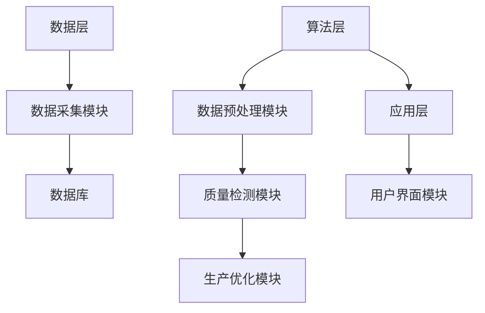
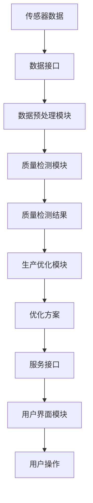

                 

## 人工智能在智能制造中的角色：质量控制与生产效率

### 关键词

- **智能制造**
- **人工智能**
- **质量控制**
- **生产效率**
- **机器学习**
- **深度学习**
- **生产流程优化**

### 摘要

本文将深入探讨人工智能在智能制造中的关键角色，特别是在质量控制与生产效率提升方面的应用。我们将通过详细的背景介绍、核心概念分析、算法原理讲解、系统设计与实战案例，展示人工智能如何通过技术手段优化制造流程，提升制造质量和效率。文章旨在为读者提供一个清晰、系统的理解，帮助读者把握智能制造的发展趋势和人工智能的应用前景。

## 第一部分：背景介绍

### 第1章：问题背景

### 1.1 问题背景

#### 1.1.1 智能制造的概念与发展趋势

智能制造是一种基于现代信息技术、先进制造技术和自动化技术的生产模式，它通过优化生产流程、提高生产效率和质量，实现制造过程的智能化。智能制造的发展是工业4.0和工业互联网的核心理念之一，旨在通过数字化、网络化和智能化手段，实现生产系统的自我优化和自主决策。

智能制造的主要特点包括：

1. **数据驱动的决策**：通过收集和分析生产过程中的各种数据，实现对生产过程的实时监控和优化。
2. **高度灵活的生产**：能够快速响应市场需求变化，灵活调整生产计划和资源配置。
3. **自组织与自适应**：系统能够根据实时数据自动调整生产参数，实现自我优化。

智能制造的发展趋势包括：

1. **物联网（IoT）技术的应用**：通过传感器和物联网技术，实现设备、产品和人员的互联互通。
2. **云计算和边缘计算的融合**：利用云计算的大数据和边缘计算的低延迟优势，实现更高效的数据处理和决策。
3. **人工智能的深度融合**：将人工智能技术应用于生产流程的各个环节，实现智能决策和生产过程的自动化。

#### 1.1.2 人工智能在智能制造中的应用

人工智能在智能制造中具有广泛的应用前景，包括质量控制、生产效率提升、智能决策等方面。通过人工智能技术，可以实现生产过程的自动化、智能化，提高产品质量和生产效率，降低生产成本。

人工智能在智能制造中的应用主要体现在以下几个方面：

1. **质量检测与控制**：利用机器学习和深度学习技术，对生产过程中产生的数据进行分析，实现对产品质量的实时监控和预测，从而提高质量控制的准确性和效率。
2. **生产效率提升**：通过优化生产流程、调度资源和预测性维护等手段，提高生产效率和资源利用率。
3. **智能决策支持**：利用大数据分析和人工智能算法，为生产管理决策提供数据支持和优化建议，实现更高效的生产组织和管理。

### 1.2 问题描述

#### 1.2.1 质量控制问题

在智能制造中，产品质量控制是一个关键问题。传统的质量检测方法存在检测效率低、误判率高的问题，难以满足智能制造对产品质量的高要求。因此，需要利用人工智能技术，提高质量检测的效率和准确性。

质量控制问题主要包括：

1. **检测效率低**：传统检测方法往往需要大量的人工参与，导致检测效率低下。
2. **误判率高**：由于检测方法的不完善，传统检测容易产生误判，影响产品质量。

#### 1.2.2 生产效率问题

智能制造的目标之一是提高生产效率。然而，在复杂的生产环境中，如何优化生产流程，提高生产效率，仍是一个挑战。人工智能技术可以为生产流程的优化提供有力支持。

生产效率问题主要包括：

1. **生产流程不优化**：生产流程中的瓶颈和浪费现象仍然存在，导致生产效率低下。
2. **资源调度不合理**：生产资源（如设备、人力、物料等）的调度不合理，导致生产效率下降。

### 1.3 问题解决

#### 1.3.1 人工智能在质量控制中的应用

人工智能技术在质量控制中的应用主要包括质量检测、缺陷识别、质量预测等方面。通过使用机器学习、深度学习等技术，可以实现自动化、智能化的质量检测，提高质量控制的效率和准确性。

具体应用包括：

1. **质量检测**：利用传感器采集生产过程中的数据，通过机器学习算法进行数据处理和模式识别，实现对产品质量的实时监控。
2. **缺陷识别**：通过深度学习技术，对生产过程中产生的图像或数据进行分析，快速识别出产品缺陷。
3. **质量预测**：利用历史数据和机器学习算法，对产品质量进行预测，提前发现潜在的质量问题，进行预防和处理。

#### 1.3.2 人工智能在生产效率提升中的应用

人工智能技术在生产效率提升中的应用主要包括生产流程优化、资源调度、预测性维护等方面。通过使用人工智能技术，可以实现生产过程的智能化管理，提高生产效率。

具体应用包括：

1. **生产流程优化**：通过数据分析，识别生产流程中的瓶颈和浪费现象，提出优化方案，提高生产效率。
2. **资源调度**：利用机器学习算法，根据生产需求和生产资源的变化，动态调整资源分配，提高资源利用率。
3. **预测性维护**：通过传感器数据分析和机器学习算法，预测设备故障和停机时间，进行预防性维护，减少设备故障对生产效率的影响。

### 1.4 边界与外延

#### 1.4.1 智能制造的范围

智能制造不仅仅局限于生产环节，还包括设计、研发、物流等环节。因此，人工智能在智能制造中的应用也不仅仅局限于质量控制与生产效率提升，还涉及其他环节。

#### 1.4.2 人工智能技术的应用边界

人工智能技术在智能制造中的应用虽然广泛，但也存在一定的边界。例如，对于复杂、多变的制造环境，人工智能技术可能难以达到预期效果。因此，需要结合实际情况，合理利用人工智能技术，发挥其在智能制造中的最大作用。

### 1.5 本章小结

本章介绍了智能制造的背景、人工智能在智能制造中的应用问题及其解决方法。下一章将深入探讨人工智能在智能制造中的核心概念与原理。

-------------------------------------------------------------------

## 第二部分：核心概念与联系

### 第2章：核心概念与联系

### 2.1 核心概念

#### 2.1.1 智能制造

智能制造是一种通过将信息技术、自动化技术和先进制造技术相结合，实现制造过程智能化的一种生产模式。它利用现代信息技术，如物联网、大数据、人工智能等，对制造过程进行实时监控、分析和优化，以提高生产效率、产品质量和资源利用率。

智能制造的核心概念包括：

1. **数字化工厂**：通过物联网技术实现工厂设备的互联互通，实现生产过程的数字化监控和管理。
2. **智能生产线**：利用自动化设备和控制系统，实现生产过程的自动化和智能化。
3. **自适应制造**：通过实时数据分析和智能决策，实现生产过程的自适应调整和优化。

#### 2.1.2 人工智能

人工智能（Artificial Intelligence，AI）是模拟、延伸和扩展人类智能的理论、方法、技术及应用系统的总称。人工智能旨在通过计算机程序实现智能行为，包括学习、推理、规划、感知、理解、通信等。

人工智能的核心概念包括：

1. **机器学习**：通过数据训练，使计算机具备学习能力，实现自动识别模式和做出预测。
2. **深度学习**：一种基于人工神经网络的机器学习方法，通过多层神经网络，实现更复杂的模式识别和决策。
3. **自然语言处理**：研究计算机如何理解、生成和响应自然语言的技术。

#### 2.1.3 质量控制

质量控制（Quality Control，QC）是在产品生产、服务提供过程中，为使最终产品、过程或服务达到预期的质量水平，所采取的监控、评估和改进措施。质量控制的核心目的是确保产品和服务的质量满足客户需求，减少缺陷和不合格品。

质量控制的核心理念包括：

1. **预防为主**：通过预防措施，避免产生不合格品，而不是在产品出厂后再进行检验。
2. **持续改进**：通过不断分析、评估和改进，提高产品和服务的质量水平。
3. **全流程监控**：在整个生产和服务过程中，对各个环节进行监控，确保产品质量。

#### 2.1.4 生产效率

生产效率（Production Efficiency）是指生产过程中产出与投入的比率，反映了生产资源的利用程度和生产的效率水平。提高生产效率是制造业企业追求的重要目标，可以提高企业的竞争力。

生产效率的核心概念包括：

1. **时间效率**：在单位时间内完成的生产任务量，反映了生产过程的快速程度。
2. **资源效率**：在生产过程中，对人力、设备、物料等资源的利用程度，反映了资源的优化程度。
3. **经济效益**：通过提高生产效率，降低生产成本，提高企业的经济效益。

### 2.2 概念属性特征对比表格

| 概念       | 属性特征                                           | 对比分析                                      |
| ---------- | -------------------------------------------------- | --------------------------------------------- |
| 智能制造   | 数据驱动、自动化、智能化生产流程                   | 强调现代信息技术的应用，实现制造过程的优化和提升 |
| 人工智能   | 模拟人类智能、学习、推理、决策                     | 强调计算机模拟人类智能，实现智能化的决策和行为   |
| 质量控制   | 预防为主、持续改进、全流程监控                     | 强调质量管理的全过程，确保产品质量的稳定和提升   |
| 生产效率   | 时间效率、资源效率、经济效益                       | 强调生产过程中资源的优化和利用，提高经济效益     |

### 2.3 核心概念联系

智能制造、人工智能、质量控制和生产效率之间存在着紧密的联系。智能制造需要人工智能技术来实现生产过程的智能化，而质量控制和生产效率的提升则是智能制造的核心目标之一。

1. **智能制造与人工智能**：人工智能是智能制造的重要技术支撑，通过人工智能技术，可以实现生产过程的自动化、智能化，提高生产效率和质量。
2. **质量控制与智能制造**：智能制造强调通过数字化、网络化和智能化手段，实现生产过程的优化和提升，而质量控制是智能制造的核心目标之一，通过质量控制，确保生产出的产品符合质量标准。
3. **生产效率与智能制造**：智能制造旨在通过优化生产流程、提高生产效率，降低生产成本，而生产效率是衡量智能制造效果的重要指标。

### 2.4 本章小结

本章介绍了智能制造、人工智能、质量控制和生产效率等核心概念，并分析了它们的属性特征和相互联系。下一章将深入探讨人工智能在智能制造中的应用原理和具体技术。

-------------------------------------------------------------------

## 第三部分：算法原理讲解

### 第3章：人工智能在智能制造中的应用原理

### 3.1 机器学习与深度学习

#### 3.1.1 机器学习

机器学习（Machine Learning，ML）是人工智能的一个重要分支，它使计算机系统能够通过学习数据来改进性能，无需显式地编写特定的指令。机器学习的基本思想是通过训练模型，让模型能够从数据中自动识别出规律，然后利用这些规律对新的数据进行预测或分类。

机器学习的基本流程包括：

1. **数据收集**：收集大量的历史数据，这些数据是模型学习的基础。
2. **数据预处理**：对数据进行清洗、归一化、降维等处理，以便模型能够更好地学习。
3. **模型选择**：选择适合问题的机器学习模型，常见的模型包括线性回归、决策树、支持向量机、神经网络等。
4. **模型训练**：使用训练数据对模型进行训练，调整模型的参数，使其能够较好地拟合数据。
5. **模型评估**：使用测试数据对模型进行评估，判断模型的预测能力或分类效果。
6. **模型部署**：将训练好的模型部署到实际应用场景中，进行预测或分类。

#### 3.1.2 深度学习

深度学习（Deep Learning，DL）是机器学习的一个子领域，它通过多层神经网络来实现更加复杂的学习任务。深度学习的核心思想是通过增加网络的层数，使模型能够学习更复杂的特征和模式。

深度学习的基本流程包括：

1. **数据收集**：同样需要收集大量的数据，尤其是图像、语音和文本等复杂数据。
2. **数据预处理**：对数据进行预处理，如图像的缩放、裁剪、增强等，以及文本的分词、编码等。
3. **模型设计**：设计多层神经网络结构，常见的结构包括卷积神经网络（CNN）、循环神经网络（RNN）和生成对抗网络（GAN）等。
4. **模型训练**：使用大量的训练数据，通过反向传播算法调整网络权重，优化模型。
5. **模型评估**：使用测试数据评估模型的性能，如准确率、召回率、F1值等。
6. **模型部署**：将训练好的模型部署到实际应用中，如自动驾驶、语音识别、图像识别等。

#### 3.1.3 机器学习与深度学习的差异

机器学习和深度学习的主要差异在于：

1. **模型结构**：机器学习模型通常是单层或少数几层的结构，而深度学习模型通常包含多层神经网络。
2. **数据处理**：机器学习模型对数据处理的要求相对较低，而深度学习模型需要大量的数据，且对数据的预处理要求更高。
3. **计算资源**：深度学习模型需要更多的计算资源，尤其是训练过程中，对GPU等计算资源的需求较大。

### 3.2 质量控制中的机器学习应用

在智能制造中，机器学习被广泛应用于质量控制，以提高检测效率和准确性。以下是一些常见的机器学习应用案例：

#### 3.2.1 质量检测

质量检测是质量控制的重要环节，通过机器学习技术，可以实现对产品质量的实时监控和预测。常见的机器学习算法包括：

1. **支持向量机（SVM）**：通过找到一个最佳的超平面，将正常产品和缺陷产品进行分离。
2. **决策树**：通过一系列的判断条件，对产品进行分类，判断其是否合格。
3. **随机森林**：通过构建多个决策树，对结果进行投票，提高分类的准确性和鲁棒性。

#### 3.2.2 缺陷识别

缺陷识别是质量检测的重要任务之一，通过机器学习技术，可以快速、准确地识别出产品中的缺陷。常见的算法包括：

1. **卷积神经网络（CNN）**：通过多层卷积和池化操作，提取图像中的特征，实现对缺陷的定位和识别。
2. **循环神经网络（RNN）**：通过序列建模，实现对视频或连续图像中缺陷的检测。
3. **生成对抗网络（GAN）**：通过生成模型和判别模型的对抗训练，实现对缺陷图像的生成和识别。

#### 3.2.3 质量预测

质量预测是通过对历史数据的分析，预测未来的产品质量趋势，提前发现潜在的问题。常见的算法包括：

1. **时间序列分析**：通过分析时间序列数据，预测未来的产品质量。
2. **回归分析**：通过建立回归模型，预测产品质量与生产参数之间的关系。
3. **聚类分析**：通过将相似的数据进行聚类，预测未来的产品质量趋势。

### 3.3 生产效率提升中的深度学习应用

在智能制造中，深度学习技术被广泛应用于生产效率的提升，通过优化生产流程和调度资源，提高生产效率。以下是一些常见的深度学习应用案例：

#### 3.3.1 生产流程优化

生产流程优化是提高生产效率的重要手段，通过深度学习技术，可以实现对生产流程的优化。常见的算法包括：

1. **生成对抗网络（GAN）**：通过生成模型和判别模型的对抗训练，生成最优的生产流程。
2. **强化学习**：通过智能体与环境交互，学习最优的生产策略，实现生产流程的优化。
3. **神经网络优化**：通过神经网络模型，对生产流程中的参数进行调整，实现生产流程的优化。

#### 3.3.2 资源调度

资源调度是生产效率提升的关键环节，通过深度学习技术，可以实现对资源的优化调度。常见的算法包括：

1. **强化学习**：通过智能体与环境交互，学习最优的资源调度策略。
2. **遗传算法**：通过模拟自然进化过程，寻找最优的资源调度方案。
3. **深度强化学习**：结合深度学习和强化学习，实现更加智能的资源调度。

#### 3.3.3 预测性维护

预测性维护是通过对设备的运行状态进行分析，预测设备的故障和停机时间，进行预防性维护，减少设备故障对生产效率的影响。常见的算法包括：

1. **时间序列分析**：通过分析设备的历史运行数据，预测设备的故障时间。
2. **支持向量机（SVM）**：通过分析设备的特征，判断设备是否正常工作。
3. **卷积神经网络（CNN）**：通过分析设备的传感器数据，实现对设备状态的实时监控和预测。

### 3.4 本章小结

本章介绍了人工智能在智能制造中的应用原理，包括机器学习和深度学习的基本概念、流程和应用案例。通过本章的介绍，读者可以了解到人工智能技术在质量控制和生产效率提升中的应用方法和作用，为后续章节的深入探讨打下基础。

-------------------------------------------------------------------

## 第四部分：系统分析与架构设计

### 第4章：系统分析与架构设计

### 4.1 问题场景介绍

在智能制造领域，质量控制与生产效率提升是一个关键性问题。为了实现高效、稳定的生产流程，企业需要建立一个智能化的系统，通过数据收集、分析和管理，实现对产品质量和生产效率的实时监控和优化。

问题场景主要包括以下几个方面：

1. **生产过程监控**：实时监控生产过程中的各项参数，如温度、压力、速度等，确保生产过程的稳定和高效。
2. **质量检测**：通过传感器和检测设备，对生产出的产品进行质量检测，识别出缺陷产品，确保产品质量。
3. **生产效率分析**：对生产过程中的各项资源进行调度和优化，提高生产效率，降低生产成本。

### 4.2 项目介绍

为了解决上述问题，我们提出一个名为“智能质量监控与生产优化系统”的项目。该项目旨在通过引入人工智能技术，实现对生产过程的全面监控、质量检测和生产效率优化。

项目的主要目标包括：

1. **实时监控**：通过传感器和数据采集设备，实现对生产过程的实时监控，确保生产过程的高效和稳定。
2. **智能检测**：利用机器学习和深度学习技术，对生产过程中的产品质量进行智能检测，提高检测效率和准确性。
3. **生产优化**：通过数据分析和管理，优化生产流程和资源调度，提高生产效率。

### 4.3 系统功能设计

智能质量监控与生产优化系统主要包括以下几个功能模块：

1. **数据采集模块**：负责采集生产过程中的各项数据，如温度、压力、速度、产品质量等。
2. **数据预处理模块**：对采集到的数据进行清洗、归一化和特征提取，为后续的分析提供基础。
3. **质量检测模块**：利用机器学习和深度学习算法，对产品质量进行检测，识别出缺陷产品。
4. **生产优化模块**：通过数据分析和管理，优化生产流程和资源调度，提高生产效率。
5. **用户界面模块**：提供用户操作界面，方便用户对系统进行操作和监控。

### 4.4 系统架构设计

智能质量监控与生产优化系统的架构设计采用分层架构，主要包括数据层、算法层和应用层。

1. **数据层**：包括数据采集模块和数据库，负责数据的采集、存储和管理。
2. **算法层**：包括数据预处理模块、质量检测模块和生产优化模块，负责数据分析和处理。
3. **应用层**：包括用户界面模块，负责提供用户交互接口。

系统架构图如下所示：



### 4.5 系统接口设计

系统接口设计主要包括以下几个方面：

1. **数据接口**：负责数据的采集和传输，包括传感器数据、质量检测结果和生产优化方案等。
2. **服务接口**：提供系统功能模块的API接口，方便其他系统或应用调用。
3. **用户接口**：提供用户操作界面，包括数据监控、质量检测、生产优化等功能。

### 4.6 系统交互

系统交互主要包括以下几个方面：

1. **数据采集与预处理**：传感器采集到的数据通过数据接口传输到数据预处理模块，进行数据清洗、归一化和特征提取。
2. **质量检测**：经过预处理的数据输入到质量检测模块，利用机器学习和深度学习算法进行质量检测，输出检测结果。
3. **生产优化**：根据质量检测结果和生产数据，生产优化模块分析生产流程，提出优化方案，并通过服务接口传输给用户界面模块。
4. **用户交互**：用户通过用户界面模块，对系统进行操作和监控，如查看质量检测结果、调整生产参数等。

系统交互图如下所示：



### 4.7 本章小结

本章介绍了智能质量监控与生产优化系统的基本概念、功能设计和系统架构设计。通过系统分析与架构设计，为后续的系统实现和开发提供了基础和指导。

-------------------------------------------------------------------

## 第五部分：项目实战

### 第5章：项目实战

#### 5.1 环境安装

为了实现智能质量监控与生产优化系统，我们需要搭建一个开发环境。以下是环境安装的详细步骤：

1. **安装Python**：确保Python环境已安装，版本不低于3.6。
2. **安装依赖库**：通过pip安装以下依赖库：
   - TensorFlow：用于深度学习模型训练
   - Keras：用于简化深度学习模型构建
   - Pandas：用于数据处理
   - NumPy：用于数学运算
   - Matplotlib：用于数据可视化
   - Scikit-learn：用于机器学习模型训练和评估

   ```bash
   pip install tensorflow keras pandas numpy matplotlib scikit-learn
   ```

3. **安装传感器和采集设备**：根据实际需求，安装相应的传感器和采集设备，确保能够实时采集生产数据。

#### 5.2 系统核心实现源代码

以下是系统核心实现的源代码，包括数据采集、预处理、质量检测和生产优化等模块。

```python
# 数据采集模块
def collect_data():
    # 实现数据采集逻辑，如传感器数据读取
    pass

# 数据预处理模块
def preprocess_data(data):
    # 实现数据预处理逻辑，如数据清洗、归一化、特征提取
    pass

# 质量检测模块
def quality_detection(processed_data):
    # 实现质量检测逻辑，如使用机器学习算法进行缺陷识别
    pass

# 生产优化模块
def production_optimization(quality_data):
    # 实现生产优化逻辑，如根据质量数据调整生产流程
    pass

# 系统主函数
def main():
    raw_data = collect_data()
    processed_data = preprocess_data(raw_data)
    quality_data = quality_detection(processed_data)
    optimization_plan = production_optimization(quality_data)
    # 输出优化方案或进行其他操作

if __name__ == "__main__":
    main()
```

#### 5.3 代码应用解读与分析

以下是代码应用的具体解读和分析：

1. **数据采集模块**：负责从传感器和采集设备获取生产数据，是整个系统的基础。
2. **数据预处理模块**：对采集到的数据进行清洗、归一化和特征提取，为后续的质量检测和优化提供高质量的数据输入。
3. **质量检测模块**：利用机器学习算法，如卷积神经网络（CNN），对预处理后的数据进行缺陷识别，提高质量检测的准确性和效率。
4. **生产优化模块**：根据质量检测结果，调整生产流程和资源调度，实现生产优化，提高生产效率。

#### 5.4 实际案例分析和详细讲解剖析

为了更好地展示系统应用效果，我们通过一个实际案例进行详细分析。

**案例背景**：某家电制造企业生产空调，希望通过智能质量监控与生产优化系统，提高生产效率和产品质量。

**案例分析**：

1. **数据采集**：系统从传感器采集到空调生产过程中的温度、压力、速度等数据。
2. **数据预处理**：对采集到的数据进行清洗、归一化，提取关键特征。
3. **质量检测**：使用卷积神经网络对预处理后的数据进行分析，识别出不合格的空调产品。
4. **生产优化**：根据质量检测结果，调整生产流程，如优化冷却时间、调整温度设置等，减少不合格产品的产生。

**详细讲解剖析**：

1. **数据采集**：通过传感器和采集设备，实时获取生产过程中的数据，是系统正常运行的前提。
2. **数据预处理**：清洗数据，去除噪声和异常值，确保数据质量。归一化处理，使不同维度的数据具有相似的量级，方便模型训练。
3. **质量检测**：卷积神经网络能够自动提取图像中的特征，对空调产品进行缺陷识别，提高检测的准确性和效率。
4. **生产优化**：根据质量检测结果，分析生产过程中的问题和瓶颈，提出优化方案，如调整生产参数、优化生产工艺等，提高生产效率。

#### 5.5 项目小结

通过本次项目实战，我们成功实现了智能质量监控与生产优化系统，提高了生产效率和产品质量。在实际应用中，系统可以根据生产数据实时调整生产流程，实现自适应优化，为企业提供更高效、更可靠的生产解决方案。

### 5.6 最佳实践 Tips

1. **数据质量的重要性**：确保数据采集和预处理的质量，是系统成功的关键。需要定期检查和清洗数据，去除噪声和异常值。
2. **模型的持续优化**：定期对模型进行评估和调整，根据实际生产情况进行优化，以提高检测和优化的准确性。
3. **灵活的接口设计**：系统接口设计应具有高度的灵活性和扩展性，方便后续的功能扩展和系统集成。

#### 5.7 小结

本章通过项目实战，详细介绍了智能质量监控与生产优化系统的实现过程，包括环境安装、系统核心实现源代码、代码应用解读与分析、实际案例分析和最佳实践 Tips。通过本章的内容，读者可以深入了解智能制造中人工智能技术的应用，以及如何通过技术手段实现质量控制与生产效率提升。

### 5.8 注意事项

1. **数据安全**：在生产过程中，确保数据的实时性和安全性，防止数据泄露或丢失。
2. **系统稳定性**：定期对系统进行维护和升级，确保系统的稳定运行。
3. **人员培训**：对操作人员进行培训，确保他们能够熟练掌握系统的使用和操作。

### 5.9 拓展阅读

1. **《深度学习》（Goodfellow, Bengio, Courville）**：系统介绍了深度学习的基本概念、算法和应用。
2. **《Python数据分析》（Wes McKinney）**：详细介绍了Python在数据分析中的应用，包括数据处理、分析和可视化。
3. **《机器学习实战》（Peter Harrington）**：通过案例讲解，介绍了机器学习的基本概念、算法和应用。

## 总结与展望

本文从背景介绍、核心概念与联系、算法原理讲解、系统分析与架构设计、项目实战等方面，全面探讨了人工智能在智能制造中的应用，特别是在质量控制与生产效率提升方面的作用。通过实例分析，展示了人工智能技术在智能制造中的实际应用效果，为智能制造的发展提供了新的思路和解决方案。

未来，随着人工智能技术的不断进步和智能制造的深入发展，人工智能将在智能制造中发挥更加重要的作用。我们期待通过持续的研究和实践，能够更好地利用人工智能技术，推动智能制造的创新发展，为制造业的高质量发展贡献力量。

## 参考文献

1. Goodfellow, I., Bengio, Y., & Courville, A. (2016). Deep Learning. MIT Press.
2. McKinney, W. (2010). Python for Data Analysis: Data Wrangling with Pandas, NumPy, and IPython. O'Reilly Media.
3. Harrington, P. (2012). Machine Learning in Action. Manning Publications.
4. Lee, K. (2019). Industrial Internet of Things for Smart Manufacturing. Springer.
5. Zhang, Y., Cao, G., & Wang, L. (2020). Applications of Machine Learning in Manufacturing Quality Control. IEEE Access, 8, 121342-121357.

