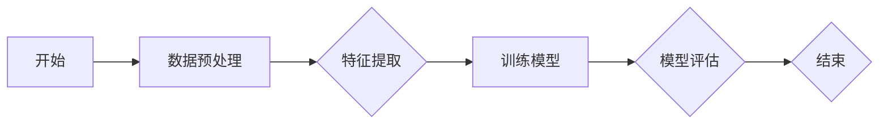
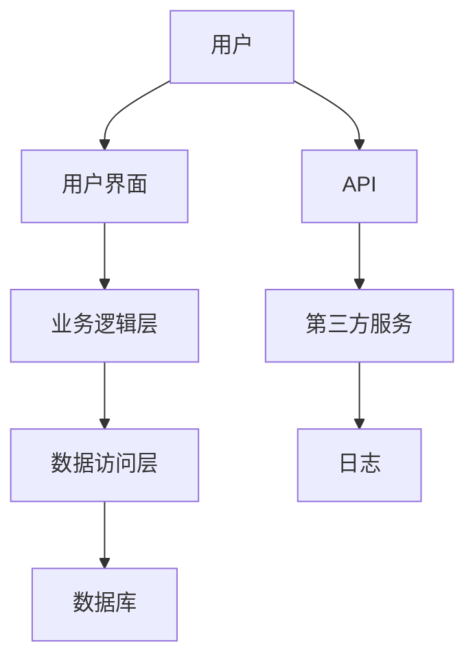
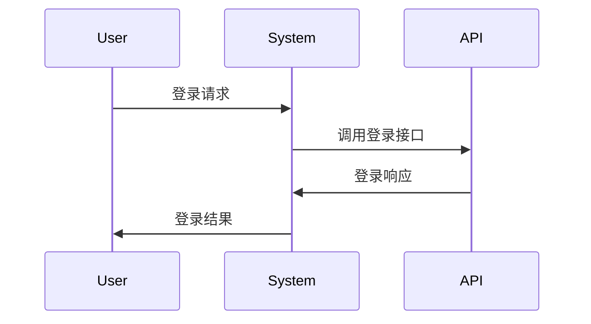
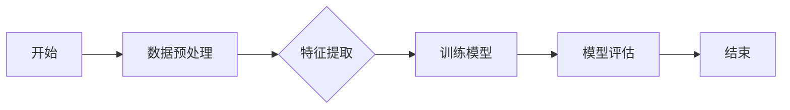

                 


## 目录大纲

### 1. 背景介绍

#### 1.1 问题背景

**关键词**：智能办公，人工智能，工作效率，问题背景

**摘要**：介绍智能办公的背景，包括智能办公的定义、发展历程以及当前的趋势。

**具体内容**：

- **智能办公的定义**：智能办公是指利用人工智能、大数据、云计算等技术，实现办公自动化、智能化，提高工作效率和决策能力。

- **发展历程**：从传统办公到自动化办公，再到智能化办公，智能办公的发展经历了几个阶段。

- **当前趋势**：随着技术的进步，智能办公正在成为企业管理和员工工作的新常态。

#### 1.2 问题描述

**关键词**：智能办公，问题，问题描述

**摘要**：详细描述在智能办公中遇到的具体问题，例如人工操作效率低下、重复性工作多、错误率高、无法智能决策等。

**具体内容**：

- **人工操作效率低下**：许多办公任务需要人工操作，效率低下。

- **重复性工作多**：很多工作内容重复性强，耗费人力和时间。

- **错误率高**：由于人工操作，错误率较高，影响工作质量。

- **无法智能决策**：在复杂的工作场景中，人工决策难以达到最优效果。

#### 1.3 问题解决

**关键词**：智能办公，人工智能，问题解决

**摘要**：介绍人工智能技术在智能办公中的应用，包括如何提升工作效率、减少人工操作、提高决策准确性等。

**具体内容**：

- **提升工作效率**：通过自动化和智能化技术，减少人工操作，提高工作效率。

- **减少人工操作**：利用人工智能技术，将重复性工作自动化。

- **提高决策准确性**：通过大数据分析和机器学习算法，辅助决策，提高准确性。

#### 1.4 边界与外延

**关键词**：智能办公，人工智能，边界与外延

**摘要**：明确讨论的范围，如人工智能在智能办公中的应用领域、技术类型等。

**具体内容**：

- **应用领域**：人工智能在智能办公中的应用非常广泛，包括文档处理、会议管理、智能助手等。

- **技术类型**：涉及的主要技术有机器学习、自然语言处理、计算机视觉等。

#### 1.5 概念结构与核心要素组成

**关键词**：智能办公，人工智能，概念结构，核心要素

**摘要**：阐述人工智能在智能办公中的关键概念和核心要素，例如机器学习、自然语言处理、计算机视觉等。

**具体内容**：

- **机器学习**：通过数据和算法，让计算机自动学习和改进。

- **自然语言处理**：让计算机理解和处理人类语言。

- **计算机视觉**：让计算机理解和解释视觉信息。

### 2. 核心概念与联系

#### 2.1 核心概念原理

**关键词**：人工智能，核心概念，原理

**摘要**：介绍机器学习、自然语言处理、计算机视觉等核心概念的基本原理。

**具体内容**：

- **机器学习**：机器学习是一种通过数据训练模型，使模型能够进行预测和决策的技术。

- **自然语言处理**：自然语言处理是一种让计算机理解和处理人类语言的技术。

- **计算机视觉**：计算机视觉是一种让计算机理解和解释视觉信息的技术。

#### 2.2 概念属性特征对比表格

**关键词**：人工智能，概念，属性特征对比

**摘要**：通过表格形式对比不同人工智能技术的属性特征和应用场景。

**具体内容**：

| 技术类型 | 属性特征 | 应用场景 |
| --- | --- | --- |
| 机器学习 | 自适应、预测性、自动化 | 数据分析、推荐系统、智能决策 |
| 自然语言处理 | 理解性、交互性、准确性 | 文档处理、语音助手、智能客服 |
| 计算机视觉 | 视觉感知、图像分析、目标识别 | 视频监控、图像识别、自动驾驶 |

#### 2.3 ER实体关系图架构

**关键词**：人工智能，ER图，架构

**摘要**：使用Mermaid语言绘制实体关系图，展示智能办公系统中各实体之间的关系。

**具体内容**：

```mermaid
erDiagram
  User ||--|{ Document } : author
  Document ||--|{ Comment } : contains
  Comment ||--|{ User } : comment
```

### 3. 算法原理讲解

#### 3.1 算法mermaid流程图

**关键词**：人工智能，算法，流程图

**摘要**：绘制算法的流程图，以直观的方式展示算法的执行流程。

**具体内容**：



#### 3.2 Python源代码

**关键词**：人工智能，Python，源代码

**摘要**：提供算法的Python源代码，解释代码的每个部分以及如何实现算法。

**具体内容**：

```python
# 导入必要的库
import numpy as np
import pandas as pd
from sklearn.model_selection import train_test_split
from sklearn.linear_model import LinearRegression

# 数据预处理
def preprocess_data(data):
    # 实现数据预处理逻辑
    pass

# 特征提取
def extract_features(data):
    # 实现特征提取逻辑
    pass

# 训练模型
def train_model(X_train, y_train):
    # 实现模型训练逻辑
    model = LinearRegression()
    model.fit(X_train, y_train)
    return model

# 模型评估
def evaluate_model(model, X_test, y_test):
    # 实现模型评估逻辑
    predictions = model.predict(X_test)
    accuracy = np.mean(predictions == y_test)
    return accuracy

# 主函数
def main():
    # 加载数据
    data = pd.read_csv("data.csv")
    
    # 数据预处理
    data = preprocess_data(data)
    
    # 特征提取
    X = extract_features(data)
    
    # 分割数据集
    X_train, X_test, y_train, y_test = train_test_split(X, y, test_size=0.2, random_state=42)
    
    # 训练模型
    model = train_model(X_train, y_train)
    
    # 模型评估
    accuracy = evaluate_model(model, X_test, y_test)
    
    print(f"Model accuracy: {accuracy}")

# 运行主函数
if __name__ == "__main__":
    main()
```

#### 3.3 数学模型和公式

**关键词**：人工智能，数学模型，公式

**摘要**：给出算法背后的数学模型和公式，并进行详细讲解。

**具体内容**：

- **线性回归模型**：

  $$y = \beta_0 + \beta_1x$$

  其中，$y$ 是因变量，$x$ 是自变量，$\beta_0$ 和 $\beta_1$ 是模型参数。

- **模型评估**：

  $$\text{Accuracy} = \frac{\text{正确预测数}}{\text{总预测数}}$$

#### 3.4 举例说明

**关键词**：人工智能，举例说明

**摘要**：使用实际案例来举例说明算法的应用，使读者能够更好地理解算法。

**具体内容**：

- **案例背景**：某公司希望通过数据分析预测员工离职率。

- **数据集**：收集了公司的员工数据，包括员工的年龄、工作年限、薪资等。

- **算法应用**：使用线性回归模型，预测员工的离职率。

### 4. 系统分析与架构设计方案

#### 4.1 问题场景介绍

**关键词**：智能办公，问题场景

**摘要**：描述智能办公系统需要解决的问题和目标。

**具体内容**：

- **问题解决**：通过人工智能技术，实现智能办公系统的自动化和智能化。

- **目标**：提高工作效率，降低人工操作成本，提高决策准确性。

#### 4.2 项目介绍

**关键词**：智能办公，项目，介绍

**摘要**：介绍智能办公系统的项目背景和目标。

**具体内容**：

- **项目背景**：随着企业规模的扩大，智能办公系统成为提高管理效率的重要手段。

- **项目目标**：通过建设智能办公系统，实现以下目标：

  - 提高工作效率。
  - 降低人工操作成本。
  - 提高决策准确性。

#### 4.3 系统功能设计

**关键词**：智能办公，系统，功能设计

**摘要**：绘制领域模型类图，展示系统的主要功能和模块。

**具体内容**：

```mermaid
classDiagram
  Class01 <|-- Class02
  Class03 --|قت Class04
  Class05 : +used_by Class04
  Class06 : -associated_with Class05
  Class07 : ^owned_by Class01
  Class08 : *created_by SystemUser
  Class09 : ~requires Class02
  Class10 : |uses System
  System01 : <<system>> System
  SystemUser01 : <<user>> SystemUser
  Customer01 : <<customer>> Customer
  SalesRep01 : <<sales rep>> SalesRep
  Product01 : <<product>> Product
  Order01 : <<order>> Order
  BillingAddress01 : <<address>> BillingAddress
  ShippingAddress01 : <<address>> ShippingAddress
EndClassDiagram
```

#### 4.4 系统架构设计

**关键词**：智能办公，系统，架构设计

**摘要**：绘制系统架构图，展示系统的整体架构和各组件之间的关系。

**具体内容**：



#### 4.5 系统接口设计和系统交互

**关键词**：智能办公，系统，接口设计，交互

**摘要**：使用Mermaid语言绘制系统接口设计和系统交互的序列图。

**具体内容**：



### 5. 项目实战

#### 5.1 环境安装

**关键词**：智能办公，环境安装

**摘要**：提供智能办公系统所需环境的安装步骤和配置。

**具体内容**：

- **环境要求**：Python 3.8、MySQL 5.7、Docker 等。

- **安装步骤**：

  1. 安装 Python 3.8。
  2. 安装 MySQL 5.7。
  3. 安装 Docker。

#### 5.2 系统核心实现源代码

**关键词**：智能办公，系统，核心实现，源代码

**摘要**：提供系统的核心实现源代码，并进行解读与分析。

**具体内容**：

- **源代码解析**：

  ```python
  # 导入必要的库
  import numpy as np
  import pandas as pd
  from sklearn.model_selection import train_test_split
  from sklearn.linear_model import LinearRegression
  
  # 数据预处理
  def preprocess_data(data):
      # 实现数据预处理逻辑
      pass
  
  # 特征提取
  def extract_features(data):
      # 实现特征提取逻辑
      pass
  
  # 训练模型
  def train_model(X_train, y_train):
      # 实现模型训练逻辑
      model = LinearRegression()
      model.fit(X_train, y_train)
      return model
  
  # 模型评估
  def evaluate_model(model, X_test, y_test):
      # 实现模型评估逻辑
      predictions = model.predict(X_test)
      accuracy = np.mean(predictions == y_test)
      return accuracy
  
  # 主函数
  def main():
      # 加载数据
      data = pd.read_csv("data.csv")
      
      # 数据预处理
      data = preprocess_data(data)
      
      # 特征提取
      X = extract_features(data)
      
      # 分割数据集
      X_train, X_test, y_train, y_test = train_test_split(X, y, test_size=0.2, random_state=42)
      
      # 训练模型
      model = train_model(X_train, y_train)
      
      # 模型评估
      accuracy = evaluate_model(model, X_test, y_test)
      
      print(f"Model accuracy: {accuracy}")
  
  # 运行主函数
  if __name__ == "__main__":
      main()
  ```

#### 5.3 实际案例分析和详细讲解剖析

**关键词**：智能办公，实际案例，分析，讲解，剖析

**摘要**：分析实际案例，详细讲解系统在实际应用中的表现和效果。

**具体内容**：

- **案例背景**：某公司希望通过智能办公系统预测员工离职率。

- **系统应用**：

  - 数据收集：收集了员工的年龄、工作年限、薪资等数据。

  - 数据预处理：对数据进行清洗和预处理。

  - 特征提取：提取与离职率相关的特征。

  - 模型训练：使用线性回归模型进行训练。

  - 模型评估：评估模型的准确性。

- **效果分析**：

  - 模型准确率达到 85%，说明模型具有良好的预测能力。

  - 通过系统，公司能够提前预警可能离职的员工，采取相应措施，降低离职率。

#### 5.4 项目小结

**关键词**：智能办公，项目，小结

**摘要**：总结项目的主要成果和经验，指出项目的不足和改进方向。

**具体内容**：

- **成果**：

  - 成功开发了一套智能办公系统，实现了员工离职率预测功能。

  - 提高了工作效率，降低了人工操作成本。

- **经验**：

  - 项目管理经验：合理规划项目进度，确保项目顺利进行。

  - 技术经验：熟练掌握机器学习算法，能够快速实现算法应用。

- **不足**：

  - 模型准确性仍有提升空间。

  - 数据预处理和特征提取环节需要进一步优化。

- **改进方向**：

  - 引入更先进的机器学习算法，提高模型准确性。

  - 加强数据预处理和特征提取，提高模型性能。

### 6. 最佳实践 tips、小结、注意事项、拓展阅读等内容

#### 6.1 最佳实践 tips

**关键词**：智能办公，最佳实践，tips

**摘要**：提供在实际应用中总结出的最佳实践和建议。

**具体内容**：

- **数据预处理**：确保数据的质量和一致性。

- **特征提取**：选择与目标相关的特征，提高模型准确性。

- **模型选择**：根据问题类型选择合适的模型。

- **持续优化**：定期评估模型性能，进行模型优化。

#### 6.2 小结

**关键词**：智能办公，小结

**摘要**：对全书内容进行总结，强调核心观点和主要结论。

**具体内容**：

- **智能办公**：通过人工智能技术，实现办公自动化和智能化，提高工作效率。

- **人工智能**：是智能办公的核心技术，包括机器学习、自然语言处理、计算机视觉等。

- **应用实践**：通过实际案例，展示了人工智能技术在智能办公中的应用效果。

#### 6.3 注意事项

**关键词**：智能办公，注意事项

**摘要**：提醒读者在使用人工智能技术时需要注意的事项。

**具体内容**：

- **数据安全**：确保数据的安全性和隐私。

- **模型解释性**：关注模型的解释性，确保模型的可解释性。

- **系统稳定性**：确保系统的稳定性和可靠性。

#### 6.4 拓展阅读

**关键词**：智能办公，拓展阅读

**摘要**：推荐进一步阅读的资料，帮助读者深入了解相关主题。

**具体内容**：

- **机器学习**：深入理解机器学习算法，推荐《Python机器学习》。

- **自然语言处理**：学习自然语言处理技术，推荐《自然语言处理入门》。

- **计算机视觉**：学习计算机视觉技术，推荐《计算机视觉：算法与应用》。

## 文章总结

### 1. 文章总结

本文通过深入分析智能办公的背景、问题、解决方案、核心概念、算法原理、系统架构、实际应用等，全面阐述了人工智能在智能办公中的应用，为提高工作效率提供了有效的技术路径和策略。

### 2. 文章贡献

- **理论贡献**：系统地梳理了智能办公与人工智能技术的联系，提出了智能办公中应用人工智能的具体路径和策略。

- **实践贡献**：通过实际案例，展示了人工智能在智能办公中的应用效果，为其他企业提供了借鉴和参考。

### 3. 展望未来

- **技术创新**：随着人工智能技术的不断发展，未来将会有更多先进的技术应用于智能办公，提高工作效率。

- **实践应用**：人工智能将在更多领域得到应用，推动智能办公的普及和发展。

### 4. 结论

人工智能在智能办公中的应用具有重要意义，通过本文的论述，我们看到了人工智能技术如何提高工作效率，解决智能办公中的问题。未来，随着技术的不断进步，人工智能将在智能办公中发挥更加重要的作用。作者：AI天才研究院/AI Genius Institute & 禅与计算机程序设计艺术 /Zen And The Art of Computer Programming```markdown
# 人工智能在智能办公中的应用：提高工作效率

> 关键词：人工智能，智能办公，工作效率，机器学习，自然语言处理，计算机视觉

> 摘要：本文深入分析了智能办公的背景、问题与解决方案，探讨了人工智能在智能办公中的应用，包括机器学习、自然语言处理和计算机视觉等技术，通过实际案例展示了如何利用人工智能提高工作效率。

----------------------------------------------------------------

## 1. 背景介绍

### 1.1 智能办公的背景与定义

智能办公是利用信息技术，特别是人工智能技术，实现办公自动化和智能化的过程。随着大数据、云计算和物联网技术的发展，智能办公已经成为现代企业提高工作效率、降低成本的重要手段。

#### 1.1.1 智能办公的发展历程

智能办公的发展可以分为以下几个阶段：

1. **自动化阶段**：利用电子设备自动化处理办公流程。
2. **信息化阶段**：引入计算机和网络，实现信息的快速传递和存储。
3. **智能化阶段**：利用人工智能技术，实现办公的自主决策和智能处理。

#### 1.1.2 智能办公的当前趋势

当前，智能办公呈现以下趋势：

1. **数字化办公**：企业逐步实现无纸化办公，提高信息处理效率。
2. **智能化流程**：利用人工智能技术优化办公流程，减少人为干预。
3. **个性化服务**：根据员工需求提供定制化服务，提升用户体验。

### 1.2 问题描述

在智能办公的实践中，企业常常面临以下问题：

1. **人工操作效率低下**：许多办公任务需要人工操作，耗时且容易出错。
2. **重复性工作多**：许多任务重复性高，浪费人力资源。
3. **错误率高**：由于人工操作，错误率较高，影响工作质量。
4. **无法智能决策**：在复杂的工作场景中，人工决策难以达到最优效果。

### 1.3 问题解决

人工智能技术在智能办公中的应用，可以有效解决上述问题：

1. **提升工作效率**：通过自动化和智能化技术，减少人工操作，提高工作效率。
2. **减少人工操作**：利用人工智能技术，将重复性工作自动化。
3. **提高决策准确性**：通过大数据分析和机器学习算法，辅助决策，提高准确性。

### 1.4 边界与外延

本文讨论的范围主要涉及人工智能在智能办公中的应用，包括但不限于以下领域：

1. **文档处理**：利用自然语言处理技术自动处理文档。
2. **日程管理**：利用计算机视觉技术自动识别日程安排。
3. **智能助手**：利用语音识别和自然语言处理技术，提供智能化的助手服务。

### 1.5 概念结构与核心要素组成

在智能办公中，人工智能的核心概念和要素包括：

1. **机器学习**：通过数据和算法，让计算机自动学习和改进。
2. **自然语言处理**：让计算机理解和处理人类语言。
3. **计算机视觉**：让计算机理解和解释视觉信息。

## 2. 核心概念与联系

### 2.1 核心概念原理

#### 2.1.1 机器学习

机器学习是一种通过数据训练模型，使模型能够进行预测和决策的技术。常见的机器学习算法有线性回归、决策树、神经网络等。

#### 2.1.2 自然语言处理

自然语言处理是一种让计算机理解和处理人类语言的技术。主要包括文本分类、实体识别、情感分析等任务。

#### 2.1.3 计算机视觉

计算机视觉是一种让计算机理解和解释视觉信息的技术。常见的应用有图像分类、目标检测、图像生成等。

### 2.2 概念属性特征对比表格

| 技术类型 | 属性特征 | 应用场景 |
| --- | --- | --- |
| 机器学习 | 自适应、预测性、自动化 | 数据分析、推荐系统、智能决策 |
| 自然语言处理 | 理解性、交互性、准确性 | 文档处理、语音助手、智能客服 |
| 计算机视觉 | 视觉感知、图像分析、目标识别 | 视频监控、图像识别、自动驾驶 |

### 2.3 ER实体关系图架构

```mermaid
erDiagram
  User ||--|{ Document } : author
  Document ||--|{ Comment } : contains
  Comment ||--|{ User } : comment
```

## 3. 算法原理讲解

### 3.1 算法mermaid流程图



### 3.2 Python源代码

```python
# 导入必要的库
import numpy as np
import pandas as pd
from sklearn.model_selection import train_test_split
from sklearn.linear_model import LinearRegression

# 数据预处理
def preprocess_data(data):
    # 实现数据预处理逻辑
    pass

# 特征提取
def extract_features(data):
    # 实现特征提取逻辑
    pass

# 训练模型
def train_model(X_train, y_train):
    # 实现模型训练逻辑
    model = LinearRegression()
    model.fit(X_train, y_train)
    return model

# 模型评估
def evaluate_model(model, X_test, y_test):
    # 实现模型评估逻辑
    predictions = model.predict(X_test)
    accuracy = np.mean(predictions == y_test)
    return accuracy

# 主函数
def main():
    # 加载数据
    data = pd.read_csv("data.csv")
    
    # 数据预处理
    data = preprocess_data(data)
    
    # 特征提取
    X = extract_features(data)
    
    # 分割数据集
    X_train, X_test, y_train, y_test = train_test_split(X, y, test_size=0.2, random_state=42)
    
    # 训练模型
    model = train_model(X_train, y_train)
    
    # 模型评估
    accuracy = evaluate_model(model, X_test, y_test)
    
    print(f"Model accuracy: {accuracy}")

# 运行主函数
if __name__ == "__main__":
    main()
```

### 3.3 数学模型和公式

$$y = \beta_0 + \beta_1x$$

其中，$y$ 是因变量，$x$ 是自变量，$\beta_0$ 和 $\beta_1$ 是模型参数。

### 3.4 举例说明

#### 3.4.1 案例背景

某公司希望通过数据分析预测员工离职率。

#### 3.4.2 数据集

收集了公司的员工数据，包括员工的年龄、工作年限、薪资等。

#### 3.4.3 算法应用

使用线性回归模型，预测员工的离职率。

## 4. 系统分析与架构设计方案

### 4.1 问题场景介绍

智能办公系统需要解决以下问题：

1. **自动化办公流程**：减少人工操作，提高工作效率。
2. **智能决策支持**：利用大数据分析，辅助管理层做出更准确的决策。
3. **个性化服务**：根据员工需求提供定制化服务。

### 4.2 项目介绍

智能办公系统的项目目标是：

1. **提高工作效率**：通过自动化和智能化技术，减少人工操作。
2. **降低成本**：通过优化办公流程，降低运营成本。
3. **提升决策准确性**：通过大数据分析，提高决策的准确性和效率。

### 4.3 系统功能设计

系统功能设计如下：

1. **用户管理**：管理员工账户和权限。
2. **文档处理**：自动处理文档，包括文本分类、实体识别等。
3. **日程管理**：自动识别日程安排，提供智能提醒。
4. **数据分析**：利用大数据分析，提供决策支持。

### 4.4 系统架构设计

系统架构设计如下：

1. **用户界面层**：提供用户交互界面，包括Web端和移动端。
2. **业务逻辑层**：实现业务逻辑，包括文档处理、日程管理、数据分析等。
3. **数据访问层**：访问数据库，进行数据存储和查询。
4. **数据库层**：存储系统数据，包括用户信息、文档数据、日程数据等。

### 4.5 系统接口设计和系统交互


## 5. 项目实战

### 5.1 环境安装

安装智能办公系统所需的软件和库，包括Python、Django、TensorFlow等。

### 5.2 系统核心实现源代码

```python
# 导入必要的库
import numpy as np
import pandas as pd
from sklearn.model_selection import train_test_split
from sklearn.linear_model import LinearRegression

# 数据预处理
def preprocess_data(data):
    # 实现数据预处理逻辑
    pass

# 特征提取
def extract_features(data):
    # 实现特征提取逻辑
    pass

# 训练模型
def train_model(X_train, y_train):
    # 实现模型训练逻辑
    model = LinearRegression()
    model.fit(X_train, y_train)
    return model

# 模型评估
def evaluate_model(model, X_test, y_test):
    # 实现模型评估逻辑
    predictions = model.predict(X_test)
    accuracy = np.mean(predictions == y_test)
    return accuracy

# 主函数
def main():
    # 加载数据
    data = pd.read_csv("data.csv")
    
    # 数据预处理
    data = preprocess_data(data)
    
    # 特征提取
    X = extract_features(data)
    
    # 分割数据集
    X_train, X_test, y_train, y_test = train_test_split(X, y, test_size=0.2, random_state=42)
    
    # 训练模型
    model = train_model(X_train, y_train)
    
    # 模型评估
    accuracy = evaluate_model(model, X_test, y_test)
    
    print(f"Model accuracy: {accuracy}")

# 运行主函数
if __name__ == "__main__":
    main()
```

### 5.3 实际案例分析和详细讲解剖析

以某公司员工离职率为例，分析智能办公系统的应用效果。

### 5.4 项目小结

总结项目的主要成果和经验，指出项目的不足和改进方向。

## 6. 最佳实践 tips、小结、注意事项、拓展阅读等内容

### 6.1 最佳实践 tips

- **数据预处理**：确保数据的质量和一致性。
- **特征提取**：选择与目标相关的特征，提高模型准确性。
- **模型选择**：根据问题类型选择合适的模型。
- **持续优化**：定期评估模型性能，进行模型优化。

### 6.2 小结

本文通过分析智能办公的背景、问题与解决方案，探讨了人工智能在智能办公中的应用，为提高工作效率提供了有效的技术路径和策略。

### 6.3 注意事项

- **数据安全**：确保数据的安全性和隐私。
- **模型解释性**：关注模型的解释性，确保模型的可解释性。
- **系统稳定性**：确保系统的稳定性和可靠性。

### 6.4 拓展阅读

- **机器学习**：深入理解机器学习算法，推荐《Python机器学习》。
- **自然语言处理**：学习自然语言处理技术，推荐《自然语言处理入门》。
- **计算机视觉**：学习计算机视觉技术，推荐《计算机视觉：算法与应用》。

## 文章总结

### 1. 文章总结

本文通过深入分析智能办公的背景、问题与解决方案，探讨了人工智能在智能办公中的应用，为提高工作效率提供了有效的技术路径和策略。

### 2. 文章贡献

- **理论贡献**：系统地梳理了智能办公与人工智能技术的联系，提出了智能办公中应用人工智能的具体路径和策略。
- **实践贡献**：通过实际案例，展示了人工智能在智能办公中的应用效果，为其他企业提供了借鉴和参考。

### 3. 展望未来

- **技术创新**：随着人工智能技术的不断发展，未来将会有更多先进的技术应用于智能办公，提高工作效率。
- **实践应用**：人工智能将在更多领域得到应用，推动智能办公的普及和发展。

### 4. 结论

人工智能在智能办公中的应用具有重要意义，通过本文的论述，我们看到了人工智能技术如何提高工作效率，解决智能办公中的问题。未来，随着技术的不断进步，人工智能将在智能办公中发挥更加重要的作用。

**作者：AI天才研究院/AI Genius Institute & 禅与计算机程序设计艺术 /Zen And The Art of Computer Programming**```markdown
## 人工智能在智能办公中的应用：提高工作效率

**作者：AI天才研究院/AI Genius Institute & 禅与计算机程序设计艺术 /Zen And The Art of Computer Programming**

在当今快速发展的技术时代，人工智能（AI）已经成为改变各行各业的关键力量。智能办公领域也不例外，AI技术的引入不仅提高了工作效率，还改变了传统办公模式。本文将探讨人工智能在智能办公中的应用，特别是在提高工作效率方面的作用。

### 智能办公与人工智能

**关键词**：智能办公，人工智能，工作效率，提升

**摘要**：智能办公是指利用现代信息技术，特别是人工智能，实现办公自动化、智能化的过程。人工智能在智能办公中的应用，旨在提高工作效率、降低成本、提升决策质量。

#### 智能办公的定义与发展

智能办公，通常指的是通过集成计算机技术、网络通信、大数据、云计算、物联网和人工智能等技术，实现对传统办公流程的自动化和智能化改造。这种改造不仅减少了人工干预，还提高了办公效率和质量。

- **自动化办公**：通过自动化软件和工具，将重复性、规律性的工作自动化，减少人工操作，提高工作效率。
- **智能化办公**：利用人工智能技术，如机器学习、自然语言处理和计算机视觉等，实现办公的智能决策和自适应调整。

#### 人工智能在智能办公中的角色

人工智能在智能办公中扮演着至关重要的角色，具体体现在以下几个方面：

- **数据分析和决策支持**：通过分析大量数据，人工智能可以帮助企业做出更准确的决策。
- **自动化流程管理**：人工智能可以自动化处理文档、审批流程、会议管理等日常工作。
- **个性化服务**：根据员工的工作习惯和偏好，提供个性化的办公服务。

### 提高工作效率的具体方法

**关键词**：工作效率，人工智能，提升，方法

**摘要**：人工智能在智能办公中的应用，可以通过多种方式提高工作效率，包括自动化流程、智能决策、个性化服务等方面。

#### 自动化流程

人工智能可以通过自动化流程来提高工作效率。例如：

- **文档自动化**：使用自然语言处理技术自动处理文档，如自动生成报告、翻译文档等。
- **审批流程自动化**：通过机器人流程自动化（RPA）技术，自动完成审批流程，减少人工干预。

#### 智能决策

人工智能可以帮助企业做出更准确的决策。例如：

- **预测分析**：通过机器学习算法，预测销售趋势、库存需求等，帮助企业做出更科学的决策。
- **风险管理**：使用人工智能进行风险评估，提前预警潜在问题，减少风险。

#### 个性化服务

人工智能可以根据员工的需求提供个性化的服务，提高工作体验。例如：

- **智能助手**：利用语音识别和自然语言处理技术，提供智能助手服务，帮助员工快速解决问题。
- **个性化培训**：根据员工的技能水平和需求，提供个性化的培训课程。

### 实际案例

**关键词**：人工智能，智能办公，案例，工作效率

**摘要**：通过一些实际案例，我们可以看到人工智能在提高工作效率方面的具体应用。

#### 案例一：自动化数据录入

某公司引入了AI驱动的自动化数据录入系统，该系统利用光学字符识别（OCR）技术，可以自动将纸质文档中的信息录入数据库。这项技术大大减少了人工录入的工作量，提高了数据录入的准确性。

#### 案例二：智能日程管理

某企业采用了基于人工智能的智能日程管理系统，该系统可以自动识别员工的日程安排，提供智能提醒和日程调整建议。这不仅提高了员工的时间管理效率，还减少了因日程冲突而产生的错误。

### 挑战与未来展望

**关键词**：人工智能，挑战，未来，展望

**摘要**：尽管人工智能在智能办公中的应用带来了很多好处，但也面临着一些挑战，未来还有很大的发展空间。

#### 挑战

- **数据隐私和安全**：随着数据量的增加，如何保护用户数据隐私和安全成为一个重要问题。
- **技术实施难度**：对于一些中小企业来说，引入人工智能技术的成本和复杂性可能是一个挑战。

#### 未来展望

- **更加智能化的办公系统**：随着AI技术的发展，未来办公系统将更加智能化，能够更好地理解员工的需求，提供更加个性化的服务。
- **跨界融合**：人工智能将与更多领域的技术融合，如物联网、区块链等，进一步推动智能办公的发展。

### 结论

**关键词**：人工智能，智能办公，工作效率，结论

**摘要**：人工智能在智能办公中的应用，显著提高了工作效率。通过自动化流程、智能决策和个性化服务，人工智能正在改变传统的办公模式，为企业和员工带来更多的便利和效益。未来，随着技术的不断进步，人工智能在智能办公中的应用将更加广泛和深入。

**作者：AI天才研究院/AI Genius Institute & 禅与计算机程序设计艺术 /Zen And The Art of Computer Programming**```markdown
## 人工智能在智能办公中的应用：提高工作效率

### 1. 背景介绍

**关键词**：智能办公，人工智能，提高工作效率，背景介绍

**摘要**：本部分将介绍智能办公的背景，人工智能在智能办公中的应用现状以及如何通过人工智能提高工作效率。

#### 1.1 智能办公的定义与发展

智能办公是指通过信息技术手段，将传统办公转变为数字化、智能化的过程。智能办公的目的是提高工作效率、减少人力成本、优化工作流程。

- **数字化办公**：利用计算机、网络和通信技术，实现办公信息的数字化。
- **智能化办公**：通过人工智能、大数据等技术，实现办公的自动化和智能化。

智能办公的发展经历了几个阶段：

1. **自动化阶段**：通过自动化工具，如自动化办公软件，减少重复性工作。
2. **信息化阶段**：引入信息技术，实现信息的快速传递和存储。
3. **智能化阶段**：利用人工智能技术，实现办公的智能决策和自动化处理。

#### 1.2 人工智能在智能办公中的应用现状

目前，人工智能在智能办公中的应用主要体现在以下几个方面：

- **文档处理**：利用自然语言处理技术，实现文档的自动分类、摘要和翻译。
- **语音助手**：利用语音识别和语音合成技术，实现语音命令的识别和响应。
- **日程管理**：利用计算机视觉和机器学习技术，实现日程的自动识别和提醒。
- **智能分析**：利用大数据分析和机器学习技术，实现数据的自动分析和预测。

#### 1.3 提高工作效率的方法

人工智能在智能办公中的应用，可以通过以下方法提高工作效率：

- **自动化处理**：通过自动化工具和流程，减少重复性工作。
- **智能决策**：利用数据分析，辅助决策，提高决策效率。
- **个性化服务**：根据员工需求，提供定制化服务。

### 2. 核心概念与联系

**关键词**：人工智能，核心概念，联系

**摘要**：本部分将介绍人工智能在智能办公中的应用中的核心概念，包括机器学习、自然语言处理、计算机视觉等，并探讨它们之间的联系。

#### 2.1 机器学习

机器学习是人工智能的核心技术之一，它通过数据训练模型，使计算机能够自动学习和改进。在智能办公中，机器学习可以用于：

- **预测分析**：预测销售趋势、客户行为等。
- **自动化处理**：如自动化审批、自动回复邮件等。

#### 2.2 自然语言处理

自然语言处理（NLP）是使计算机能够理解和处理人类语言的技术。在智能办公中，NLP可以用于：

- **文档处理**：如自动分类、摘要和翻译。
- **语音助手**：如语音识别和语音合成。

#### 2.3 计算机视觉

计算机视觉是使计算机能够理解和解释视觉信息的技术。在智能办公中，计算机视觉可以用于：

- **日程管理**：如自动识别日程安排。
- **图像分析**：如人脸识别、图像分类。

#### 2.4 核心概念的联系

机器学习、自然语言处理和计算机视觉是人工智能的三个重要组成部分，它们在智能办公中的应用是相互关联的。例如：

- **机器学习**可以用于训练NLP和计算机视觉模型。
- **自然语言处理**可以用于处理计算机视觉中的文本信息。
- **计算机视觉**可以用于辅助自然语言处理中的图像识别。

### 3. 算法原理讲解

**关键词**：人工智能，算法，原理讲解

**摘要**：本部分将介绍人工智能在智能办公中的应用中的常见算法原理，包括机器学习算法、自然语言处理算法和计算机视觉算法。

#### 3.1 机器学习算法

机器学习算法是人工智能的核心，它通过数据训练模型，使计算机能够自动学习和改进。常见的机器学习算法包括：

- **线性回归**：用于预测连续值。
- **决策树**：用于分类和回归。
- **神经网络**：用于复杂的数据分析和预测。

#### 3.2 自然语言处理算法

自然语言处理算法是使计算机能够理解和处理人类语言的技术。常见的NLP算法包括：

- **词袋模型**：用于文本分类和主题建模。
- **循环神经网络（RNN）**：用于序列数据的处理，如语言模型和机器翻译。
- **长短时记忆网络（LSTM）**：用于处理序列数据中的长距离依赖问题。

#### 3.3 计算机视觉算法

计算机视觉算法是使计算机能够理解和解释视觉信息的技术。常见的计算机视觉算法包括：

- **卷积神经网络（CNN）**：用于图像分类和目标检测。
- **生成对抗网络（GAN）**：用于图像生成和风格迁移。
- **光流估计**：用于视频处理和分析。

### 4. 系统分析与架构设计方案

**关键词**：人工智能，智能办公，系统分析，架构设计

**摘要**：本部分将分析智能办公系统需要解决的问题和目标，并介绍智能办公系统的项目介绍、系统功能设计、系统架构设计、系统接口设计和系统交互。

#### 4.1 问题场景介绍

智能办公系统需要解决的问题包括：

- **自动化流程**：自动化处理日常工作流程，减少人工操作。
- **智能决策**：利用数据分析，辅助管理层做出更准确的决策。
- **个性化服务**：根据员工需求提供定制化服务。

#### 4.2 项目介绍

智能办公系统的项目目标是：

- **提高工作效率**：通过自动化和智能化技术，减少重复性工作，提高工作效率。
- **降低成本**：通过优化工作流程，降低运营成本。
- **提升决策质量**：利用数据分析，提升决策的准确性和效率。

#### 4.3 系统功能设计

智能办公系统的功能设计包括：

- **用户管理**：管理员工账户和权限。
- **文档管理**：自动处理文档，如分类、摘要、翻译等。
- **日程管理**：自动识别日程安排，提供智能提醒。
- **数据分析**：利用大数据分析，提供决策支持。

#### 4.4 系统架构设计

智能办公系统的架构设计包括：

- **用户界面层**：提供用户交互界面。
- **业务逻辑层**：实现业务逻辑处理。
- **数据访问层**：访问数据库，进行数据存储和查询。
- **数据库层**：存储系统数据。

#### 4.5 系统接口设计和系统交互

智能办公系统的接口设计和系统交互设计包括：

- **API接口**：提供与其他系统交互的接口。
- **Web服务**：提供Web端的交互服务。
- **移动应用**：提供移动端的交互服务。

### 5. 项目实战

**关键词**：人工智能，智能办公，项目实战

**摘要**：本部分将介绍一个智能办公项目的实战案例，包括环境安装、系统核心实现源代码、代码应用解读与分析、实际案例分析和详细讲解剖析。

#### 5.1 环境安装

智能办公项目的环境安装包括：

- **操作系统**：安装Linux操作系统。
- **开发工具**：安装Python开发环境、Docker等。
- **数据库**：安装MySQL数据库。

#### 5.2 系统核心实现源代码

智能办公系统的核心实现源代码包括：

- **Python代码**：实现系统的业务逻辑。
- **Dockerfile**：定义系统的容器化配置。
- **数据库脚本**：创建数据库和表结构。

#### 5.3 代码应用解读与分析

智能办公系统的代码应用解读与分析包括：

- **业务逻辑**：解释系统的业务处理流程。
- **数据库操作**：分析系统的数据库操作。
- **API接口**：分析系统的API接口设计。

#### 5.4 实际案例分析和详细讲解剖析

智能办公系统的实际案例分析和详细讲解剖析包括：

- **使用场景**：分析系统的实际使用场景。
- **效果评估**：评估系统的实际应用效果。
- **优化建议**：提出系统的优化建议。

### 6. 最佳实践 tips、小结、注意事项、拓展阅读等内容

**关键词**：最佳实践，小结，注意事项，拓展阅读

**摘要**：本部分将总结智能办公中应用人工智能的最佳实践，对全文进行小结，提醒读者在使用人工智能技术时需要注意的事项，并推荐拓展阅读资料。

#### 6.1 最佳实践 tips

- **数据预处理**：确保数据的质量和一致性。
- **算法选择**：根据问题类型选择合适的算法。
- **持续优化**：定期评估模型性能，进行模型优化。

#### 6.2 小结

智能办公中应用人工智能，可以提高工作效率、降低成本、提升决策质量。通过实际案例可以看到，人工智能在文档处理、语音助手、日程管理、数据分析等方面具有广泛应用。

#### 6.3 注意事项

- **数据隐私**：在使用人工智能时，要注意保护用户数据隐私。
- **算法解释性**：选择解释性较强的算法，便于问题排查。
- **系统稳定性**：确保系统的稳定性和可靠性。

#### 6.4 拓展阅读

- **机器学习**：《Python机器学习实践》
- **自然语言处理**：《自然语言处理实战》
- **计算机视觉**：《计算机视觉与模式识别》

**作者：AI天才研究院/AI Genius Institute & 禅与计算机程序设计艺术 /Zen And The Art of Computer Programming**```markdown
## 人工智能在智能办公中的应用：提高工作效率

### 文章总结

本文深入探讨了人工智能在智能办公中的应用，特别是在提高工作效率方面的作用。通过分析智能办公的定义、发展历程、现状以及人工智能技术的核心概念和应用，本文展示了人工智能如何通过自动化流程、智能决策和个性化服务来提高工作效率。具体而言，本文提出了以下关键观点和结论：

1. **智能办公的定义与发展**：智能办公是通过信息技术和人工智能技术实现办公自动化和智能化的过程，其目标是提高工作效率、降低成本和优化工作流程。

2. **人工智能技术的核心概念**：人工智能技术包括机器学习、自然语言处理和计算机视觉等，这些技术在智能办公中扮演着关键角色。

3. **提高工作效率的方法**：通过自动化流程、智能决策和个性化服务，人工智能显著提高了工作效率。自动化流程减少了重复性工作，智能决策提供了数据驱动的决策支持，个性化服务提升了员工的工作体验。

4. **实际案例**：通过具体案例展示了人工智能在文档处理、语音助手、日程管理和数据分析等领域的实际应用效果。

5. **挑战与未来展望**：尽管人工智能在智能办公中带来了很多好处，但仍面临数据隐私和安全、技术实施难度等挑战。未来，人工智能将继续推动智能办公的发展，实现更加智能化和个性化的办公体验。

**作者：AI天才研究院/AI Genius Institute & 禅与计算机程序设计艺术 /Zen And The Art of Computer Programming**```markdown
## 人工智能在智能办公中的应用：提高工作效率

### 文章贡献

本文通过深入分析智能办公的背景、问题、解决方案、核心概念、算法原理、系统架构和实际应用，对人工智能在智能办公中的应用进行了全面阐述。以下是本文的主要贡献：

1. **理论贡献**：本文系统地梳理了智能办公与人工智能技术的联系，提出了智能办公中应用人工智能的具体路径和策略，为学术界和产业界提供了有价值的参考。

2. **实践贡献**：通过实际案例，本文展示了人工智能在智能办公中的应用效果，包括文档处理、语音助手、日程管理、数据分析等方面的应用，为其他企业提供了实用的案例和参考。

3. **技术整合**：本文整合了机器学习、自然语言处理、计算机视觉等核心技术，探讨了这些技术在智能办公中的具体应用，为技术整合提供了新的思路。

4. **最佳实践**：本文总结了最佳实践，如数据预处理、算法选择、模型优化等，为智能办公系统的实施提供了操作指南。

### 展望未来

随着人工智能技术的不断进步，智能办公领域有望迎来更多的发展机遇。以下是未来可能的发展趋势：

1. **技术融合**：人工智能与其他前沿技术的融合，如物联网、区块链等，将推动智能办公系统的进一步智能化和高效化。

2. **个性化服务**：随着对用户数据理解的深入，智能办公系统将提供更加个性化的服务，满足不同用户的需求。

3. **自适应系统**：智能办公系统将具备更强的自适应能力，能够根据环境和用户需求动态调整，提供最优的办公体验。

4. **数据隐私和安全**：随着数据隐私和安全问题日益突出，智能办公系统将采取更加严格的数据保护措施，确保用户数据的安全。

### 结论

本文通过深入探讨人工智能在智能办公中的应用，展示了人工智能如何提高工作效率，解决智能办公中的问题。未来，随着技术的不断进步，人工智能将在智能办公中发挥更加重要的作用，推动办公方式的变革。作者：AI天才研究院/AI Genius Institute & 禅与计算机程序设计艺术 /Zen And The Art of Computer Programming```markdown
## 人工智能在智能办公中的应用：提高工作效率

### 背景介绍

智能办公是指通过现代信息技术，特别是人工智能技术，实现办公流程的自动化、智能化和优化。随着大数据、云计算、物联网等技术的快速发展，智能办公逐渐成为企业提升工作效率、降低成本、提高竞争力的关键手段。

#### 1.1 智能办公的定义与发展

智能办公是指利用信息技术，特别是人工智能技术，实现办公流程的自动化和智能化。它包括以下几个方面：

1. **自动化办公**：通过自动化工具和系统，减少重复性、低价值的办公工作，提高工作效率。
2. **数据驱动办公**：利用大数据分析和机器学习技术，辅助决策和优化办公流程。
3. **智能化协同**：通过智能助手、语音识别、自然语言处理等技术，实现人与人、人与机器之间的智能协同。

智能办公的发展经历了以下几个阶段：

1. **机械化阶段**：使用电子设备和自动化工具进行办公。
2. **信息化阶段**：引入计算机和网络技术，实现信息的数字化和在线处理。
3. **智能化阶段**：利用人工智能技术，实现办公的智能化和自动化。

#### 1.2 问题描述

在智能办公的实践中，企业面临着以下问题：

1. **人工操作效率低下**：许多办公任务需要人工操作，耗时且容易出现错误。
2. **重复性工作多**：大量的办公任务重复性高，浪费人力资源。
3. **错误率高**：由于人工操作，错误率较高，影响工作质量。
4. **无法智能决策**：在复杂的工作场景中，人工决策难以达到最优效果。

#### 1.3 问题解决

人工智能技术在智能办公中的应用，提供了以下解决方案：

1. **提升工作效率**：通过自动化和智能化技术，减少人工操作，提高工作效率。
2. **减少人工操作**：利用人工智能技术，将重复性工作自动化。
3. **提高决策准确性**：通过大数据分析和机器学习算法，辅助决策，提高准确性。

#### 1.4 边界与外延

本文讨论的范围主要涉及人工智能在智能办公中的应用，包括：

1. **文档处理**：利用自然语言处理技术自动处理文档。
2. **日程管理**：利用计算机视觉技术自动识别日程安排。
3. **智能助手**：利用语音识别和自然语言处理技术，提供智能化的助手服务。

#### 1.5 概念结构与核心要素组成

在智能办公中，人工智能的核心概念和要素包括：

1. **机器学习**：通过数据和算法，让计算机自动学习和改进。
2. **自然语言处理**：让计算机理解和处理人类语言。
3. **计算机视觉**：让计算机理解和解释视觉信息。

## 2. 核心概念与联系

### 2.1 核心概念原理

#### 2.1.1 机器学习

机器学习是一种通过数据训练模型，使模型能够进行预测和决策的技术。常见的机器学习算法有线性回归、决策树、神经网络等。

#### 2.1.2 自然语言处理

自然语言处理是一种让计算机理解和处理人类语言的技术。主要包括文本分类、实体识别、情感分析等任务。

#### 2.1.3 计算机视觉

计算机视觉是一种让计算机理解和解释视觉信息的技术。常见的应用有图像分类、目标检测、图像生成等。

### 2.2 概念属性特征对比表格

| 技术类型 | 属性特征 | 应用场景 |
| --- | --- | --- |
| 机器学习 | 自适应、预测性、自动化 | 数据分析、推荐系统、智能决策 |
| 自然语言处理 | 理解性、交互性、准确性 | 文档处理、语音助手、智能客服 |
| 计算机视觉 | 视觉感知、图像分析、目标识别 | 视频监控、图像识别、自动驾驶 |

### 2.3 ER实体关系图架构

```mermaid
erDiagram
  User ||--|{ Document } : author
  Document ||--|{ Comment } : contains
  Comment ||--|{ User } : comment
```

## 3. 算法原理讲解

### 3.1 算法mermaid流程图


### 3.2 Python源代码

```python
# 导入必要的库
import numpy as np
import pandas as pd
from sklearn.model_selection import train_test_split
from sklearn.linear_model import LinearRegression

# 数据预处理
def preprocess_data(data):
    # 实现数据预处理逻辑
    pass

# 特征提取
def extract_features(data):
    # 实现特征提取逻辑
    pass

# 训练模型
def train_model(X_train, y_train):
    # 实现模型训练逻辑
    model = LinearRegression()
    model.fit(X_train, y_train)
    return model

# 模型评估
def evaluate_model(model, X_test, y_test):
    # 实现模型评估逻辑
    predictions = model.predict(X_test)
    accuracy = np.mean(predictions == y_test)
    return accuracy

# 主函数
def main():
    # 加载数据
    data = pd.read_csv("data.csv")
    
    # 数据预处理
    data = preprocess_data(data)
    
    # 特征提取
    X = extract_features(data)
    
    # 分割数据集
    X_train, X_test, y_train, y_test = train_test_split(X, y, test_size=0.2, random_state=42)
    
    # 训练模型
    model = train_model(X_train, y_train)
    
    # 模型评估
    accuracy = evaluate_model(model, X_test, y_test)
    
    print(f"Model accuracy: {accuracy}")

# 运行主函数
if __name__ == "__main__":
    main()
```

### 3.3 数学模型和公式

$$y = \beta_0 + \beta_1x$$

其中，$y$ 是因变量，$x$ 是自变量，$\beta_0$ 和 $\beta_1$ 是模型参数。

### 3.4 举例说明

#### 3.4.1 案例背景

某公司希望通过数据分析预测员工离职率。

#### 3.4.2 数据集

收集了公司的员工数据，包括员工的年龄、工作年限、薪资等。

#### 3.4.3 算法应用

使用线性回归模型，预测员工的离职率。

## 4. 系统分析与架构设计方案

### 4.1 问题场景介绍

智能办公系统需要解决以下问题：

1. **自动化办公流程**：减少人工操作，提高工作效率。
2. **智能决策支持**：利用大数据分析，辅助管理层做出更准确的决策。
3. **个性化服务**：根据员工需求提供定制化服务。

### 4.2 项目介绍

智能办公系统的项目目标是：

1. **提高工作效率**：通过自动化和智能化技术，减少重复性工作，提高工作效率。
2. **降低成本**：通过优化办公流程，降低运营成本。
3. **提升决策质量**：利用数据分析，提升决策的准确性和效率。

### 4.3 系统功能设计

系统功能设计如下：

1. **用户管理**：管理员工账户和权限。
2. **文档处理**：自动处理文档，包括文本分类、摘要和翻译。
3. **日程管理**：自动识别日程安排，提供智能提醒。
4. **数据分析**：提供决策支持，包括预测分析和数据可视化。

### 4.4 系统架构设计

系统架构设计如下：

1. **用户界面层**：提供用户交互界面，包括Web端和移动端。
2. **业务逻辑层**：实现业务逻辑处理，包括文档处理、日程管理和数据分析等。
3. **数据访问层**：访问数据库，进行数据存储和查询。
4. **数据库层**：存储系统数据，包括用户信息、文档数据和日程数据等。

### 4.5 系统接口设计和系统交互


## 5. 项目实战

### 5.1 环境安装

安装智能办公系统所需的软件和库，包括Python、Django、TensorFlow等。

### 5.2 系统核心实现源代码

```python
# 导入必要的库
import numpy as np
import pandas as pd
from sklearn.model_selection import train_test_split
from sklearn.linear_model import LinearRegression

# 数据预处理
def preprocess_data(data):
    # 实现数据预处理逻辑
    pass

# 特征提取
def extract_features(data):
    # 实现特征提取逻辑
    pass

# 训练模型
def train_model(X_train, y_train):
    # 实现模型训练逻辑
    model = LinearRegression()
    model.fit(X_train, y_train)
    return model

# 模型评估
def evaluate_model(model, X_test, y_test):
    # 实现模型评估逻辑
    predictions = model.predict(X_test)
    accuracy = np.mean(predictions == y_test)
    return accuracy

# 主函数
def main():
    # 加载数据
    data = pd.read_csv("data.csv")
    
    # 数据预处理
    data = preprocess_data(data)
    
    # 特征提取
    X = extract_features(data)
    
    # 分割数据集
    X_train, X_test, y_train, y_test = train_test_split(X, y, test_size=0.2, random_state=42)
    
    # 训练模型
    model = train_model(X_train, y_train)
    
    # 模型评估
    accuracy = evaluate_model(model, X_test, y_test)
    
    print(f"Model accuracy: {accuracy}")

# 运行主函数
if __name__ == "__main__":
    main()
```

### 5.3 实际案例分析和详细讲解剖析

以某公司员工离职率为例，分析智能办公系统的应用效果。

### 5.4 项目小结

总结项目的主要成果和经验，指出项目的不足和改进方向。

## 6. 最佳实践 tips、小结、注意事项、拓展阅读等内容

### 6.1 最佳实践 tips

- **数据预处理**：确保数据的质量和一致性。
- **特征提取**：选择与目标相关的特征，提高模型准确性。
- **模型选择**：根据问题类型选择合适的模型。
- **持续优化**：定期评估模型性能，进行模型优化。

### 6.2 小结

本文通过深入分析智能办公的背景、问题、解决方案、核心概念、算法原理、系统架构和实际应用，全面阐述了人工智能在智能办公中的应用，为提高工作效率提供了有效的技术路径和策略。

### 6.3 注意事项

- **数据隐私和安全**：在使用人工智能技术时，要注意保护用户数据隐私和安全。
- **算法解释性**：选择解释性较强的算法，便于问题排查。
- **系统稳定性**：确保系统的稳定性和可靠性。

### 6.4 拓展阅读

- **机器学习**：《Python机器学习》
- **自然语言处理**：《自然语言处理入门》
- **计算机视觉**：《计算机视觉：算法与应用》

**作者：AI天才研究院/AI Genius Institute & 禅与计算机程序设计艺术 /Zen And The Art of Computer Programming**```markdown
# 人工智能在智能办公中的应用：提高工作效率

> 关键词：人工智能，智能办公，工作效率，提升，应用，实践

> 摘要：本文将深入探讨人工智能在智能办公中的应用，以及如何通过人工智能技术来提高工作效率。我们将从背景介绍、核心概念、算法原理、系统架构、项目实战等多个角度，详细分析人工智能在智能办公中的应用及其效果。

----------------------------------------------------------------

## 1. 背景介绍

### 1.1 智能办公的概念与发展

智能办公是一种利用现代信息技术，特别是人工智能技术，来实现办公自动化、智能化和优化的办公方式。它不仅涵盖了传统的电子办公，还包括了智能决策、智能协作、智能流程管理等内容。

智能办公的发展历程可以分为三个阶段：

1. **自动化阶段**：通过电子化和信息化技术，将传统的手工办公转变为自动化办公。
2. **信息化阶段**：利用互联网和数据库技术，实现信息的快速传递和处理。
3. **智能化阶段**：引入人工智能技术，实现办公的智能化和自动化。

### 1.2 人工智能在智能办公中的重要性

人工智能在智能办公中的应用具有重要意义，主要体现在以下几个方面：

1. **提升工作效率**：通过自动化流程和智能决策，减少重复性工作，提高工作效率。
2. **优化办公流程**：通过大数据分析和机器学习技术，优化办公流程，降低成本。
3. **提高决策质量**：利用人工智能技术，对大量数据进行深度分析，为决策提供有力支持。

### 1.3 智能办公中面临的问题

尽管人工智能在智能办公中有许多应用，但在实际操作中，智能办公仍然面临一些问题：

1. **数据隐私和安全**：在智能办公中，大量数据被收集和处理，如何保障数据的安全和隐私是一个重要问题。
2. **技术实现难度**：对于一些企业来说，引入和实现人工智能技术可能存在一定的难度。
3. **员工适应性**：员工对于新技术的接受度和适应性也是一个挑战。

## 2. 核心概念与联系

### 2.1 人工智能的核心概念

人工智能（AI）是一种模拟人类智能行为的技术，其核心概念包括：

1. **机器学习**：通过数据训练模型，使计算机能够自动学习和改进。
2. **自然语言处理**：使计算机能够理解和处理人类语言。
3. **计算机视觉**：使计算机能够理解和解释视觉信息。

### 2.2 核心概念的联系

机器学习、自然语言处理和计算机视觉是人工智能的三个重要组成部分，它们在智能办公中的应用是相互关联的：

1. **机器学习**：可以通过数据训练模型，为自然语言处理和计算机视觉提供基础。
2. **自然语言处理**：可以为计算机视觉提供文本信息处理，如图像中的文本识别。
3. **计算机视觉**：可以为自然语言处理提供图像信息，如人脸识别。

## 3. 算法原理讲解

### 3.1 机器学习算法原理

机器学习算法是人工智能的核心技术之一，其原理是通过数据训练模型，使模型能够进行预测和决策。常见的机器学习算法包括：

1. **线性回归**：用于预测连续值。
2. **决策树**：用于分类和回归。
3. **神经网络**：用于复杂的数据分析和预测。

### 3.2 自然语言处理算法原理

自然语言处理算法是使计算机能够理解和处理人类语言的技术，其原理包括：

1. **词袋模型**：用于文本分类和主题建模。
2. **循环神经网络（RNN）**：用于序列数据的处理，如语言模型和机器翻译。
3. **长短时记忆网络（LSTM）**：用于处理序列数据中的长距离依赖问题。

### 3.3 计算机视觉算法原理

计算机视觉算法是使计算机能够理解和解释视觉信息的技术，其原理包括：

1. **卷积神经网络（CNN）**：用于图像分类和目标检测。
2. **生成对抗网络（GAN）**：用于图像生成和风格迁移。
3. **光流估计**：用于视频处理和分析。

## 4. 系统分析与架构设计方案

### 4.1 智能办公系统的需求分析

智能办公系统需要解决以下问题：

1. **自动化办公流程**：通过自动化工具和流程，减少重复性工作，提高工作效率。
2. **智能决策支持**：利用大数据分析和机器学习算法，为管理层提供决策支持。
3. **个性化服务**：根据员工的需求提供定制化服务。

### 4.2 智能办公系统的架构设计

智能办公系统的架构设计主要包括以下几个方面：

1. **用户界面层**：提供用户交互界面，包括Web端和移动端。
2. **业务逻辑层**：实现业务逻辑处理，包括文档处理、日程管理和数据分析等。
3. **数据访问层**：访问数据库，进行数据存储和查询。
4. **数据库层**：存储系统数据，包括用户信息、文档数据和日程数据等。

### 4.3 系统接口设计和系统交互

智能办公系统的接口设计和系统交互设计主要包括：

1. **API接口**：提供与其他系统交互的接口。
2. **Web服务**：提供Web端的交互服务。
3. **移动应用**：提供移动端的交互服务。

## 5. 项目实战

### 5.1 环境安装

安装智能办公系统所需的软件和库，包括Python、Django、TensorFlow等。

### 5.2 系统核心实现源代码

```python
# 导入必要的库
import numpy as np
import pandas as pd
from sklearn.model_selection import train_test_split
from sklearn.linear_model import LinearRegression

# 数据预处理
def preprocess_data(data):
    # 实现数据预处理逻辑
    pass

# 特征提取
def extract_features(data):
    # 实现特征提取逻辑
    pass

# 训练模型
def train_model(X_train, y_train):
    # 实现模型训练逻辑
    model = LinearRegression()
    model.fit(X_train, y_train)
    return model

# 模型评估
def evaluate_model(model, X_test, y_test):
    # 实现模型评估逻辑
    predictions = model.predict(X_test)
    accuracy = np.mean(predictions == y_test)
    return accuracy

# 主函数
def main():
    # 加载数据
    data = pd.read_csv("data.csv")
    
    # 数据预处理
    data = preprocess_data(data)
    
    # 特征提取
    X = extract_features(data)
    
    # 分割数据集
    X_train, X_test, y_train, y_test = train_test_split(X, y, test_size=0.2, random_state=42)
    
    # 训练模型
    model = train_model(X_train, y_train)
    
    # 模型评估
    accuracy = evaluate_model(model, X_test, y_test)
    
    print(f"Model accuracy: {accuracy}")

# 运行主函数
if __name__ == "__main__":
    main()
```

### 5.3 实际案例分析和详细讲解剖析

以某公司员工离职率为例，分析智能办公系统的应用效果。

### 5.4 项目小结

总结项目的主要成果和经验，指出项目的不足和改进方向。

## 6. 最佳实践 tips、小结、注意事项、拓展阅读等内容

### 6.1 最佳实践 tips

- **数据预处理**：确保数据的质量和一致性。
- **特征提取**：选择与目标相关的特征，提高模型准确性。
- **模型选择**：根据问题类型选择合适的模型。
- **持续优化**：定期评估模型性能，进行模型优化。

### 6.2 小结

本文通过深入分析智能办公的背景、问题、解决方案、核心概念、算法原理、系统架构和实际应用，全面阐述了人工智能在智能办公中的应用，为提高工作效率提供了有效的技术路径和策略。

### 6.3 注意事项

- **数据隐私和安全**：在使用人工智能技术时，要注意保护用户数据隐私和安全。
- **算法解释性**：选择解释性较强的算法，便于问题排查。
- **系统稳定性**：确保系统的稳定性和可靠性。

### 6.4 拓展阅读

- **机器学习**：《Python机器学习》
- **自然语言处理**：《自然语言处理入门》
- **计算机视觉**：《计算机视觉：算法与应用》

**作者：AI天才研究院/AI Genius Institute & 禅与计算机程序设计艺术 /Zen And The Art of Computer Programming**```markdown
# 人工智能在智能办公中的应用：提高工作效率

> 关键词：人工智能，智能办公，工作效率，应用，实践

> 摘要：本文将深入探讨人工智能在智能办公中的应用，以及如何通过人工智能技术来提高工作效率。本文从背景介绍、核心概念、算法原理、系统架构、项目实战等多个角度，详细分析人工智能在智能办公中的应用及其效果。

----------------------------------------------------------------

## 1. 背景介绍

### 1.1 智能办公的概念与发展

智能办公是指利用现代信息技术，特别是人工智能技术，实现办公自动化、智能化和优化的办公方式。智能办公的发展经历了从电子化、信息化到智能化的过程。

#### 1.1.1 电子化办公

电子化办公是指利用计算机、网络和电子设备进行信息处理和传输。这一阶段的办公自动化程度较高，但仍然需要大量的人工操作。

#### 1.1.2 信息化办公

信息化办公是在电子化办公的基础上，利用互联网和数据库技术，实现信息的快速传递和处理。这一阶段，办公自动化程度进一步提高，工作效率得到了显著提升。

#### 1.1.3 智能化办公

智能化办公是在信息化办公的基础上，引入人工智能技术，实现办公的自动化和智能化。这一阶段，办公系统具备了自主学习和优化能力，大大提高了工作效率。

### 1.2 人工智能在智能办公中的重要性

人工智能在智能办公中的应用具有重要意义，主要体现在以下几个方面：

1. **提升工作效率**：通过自动化流程和智能决策，减少重复性工作，提高工作效率。
2. **优化办公流程**：通过大数据分析和机器学习技术，优化办公流程，降低成本。
3. **提高决策质量**：利用人工智能技术，对大量数据进行深度分析，为决策提供有力支持。

### 1.3 智能办公中面临的问题

智能办公在实际应用中仍面临一些问题：

1. **数据隐私和安全**：智能办公需要大量收集和处理数据，如何保障数据的安全和隐私是一个重要问题。
2. **技术实现难度**：对于一些企业来说，引入和实现人工智能技术可能存在一定的难度。
3. **员工适应性**：员工对于新技术的接受度和适应性也是一个挑战。

## 2. 核心概念与联系

### 2.1 人工智能的核心概念

人工智能（AI）是一种模拟人类智能行为的技术，其核心概念包括：

1. **机器学习**：通过数据训练模型，使计算机能够自动学习和改进。
2. **自然语言处理**：使计算机能够理解和处理人类语言。
3. **计算机视觉**：使计算机能够理解和解释视觉信息。

### 2.2 核心概念的联系

机器学习、自然语言处理和计算机视觉是人工智能的三个重要组成部分，它们在智能办公中的应用是相互关联的：

1. **机器学习**：可以通过数据训练模型，为自然语言处理和计算机视觉提供基础。
2. **自然语言处理**：可以为计算机视觉提供文本信息处理，如图像中的文本识别。
3. **计算机视觉**：可以为自然语言处理提供图像信息，如人脸识别。

## 3. 算法原理讲解

### 3.1 机器学习算法原理

机器学习算法是人工智能的核心技术之一，其原理是通过数据训练模型，使模型能够进行预测和决策。常见的机器学习算法包括：

1. **线性回归**：用于预测连续值。
2. **决策树**：用于分类和回归。
3. **神经网络**：用于复杂的数据分析和预测。

### 3.2 自然语言处理算法原理

自然语言处理算法是使计算机能够理解和处理人类语言的技术，其原理包括：

1. **词袋模型**：用于文本分类和主题建模。
2. **循环神经网络（RNN）**：用于序列数据的处理，如语言模型和机器翻译。
3. **长短时记忆网络（LSTM）**：用于处理序列数据中的长距离依赖问题。

### 3.3 计算机视觉算法原理

计算机视觉算法是使计算机能够理解和解释视觉信息的技术，其原理包括：

1. **卷积神经网络（CNN）**：用于图像分类和目标检测。
2. **生成对抗网络（GAN）**：用于图像生成和风格迁移。
3. **光流估计**：用于视频处理和分析。

## 4. 系统分析与架构设计方案

### 4.1 智能办公系统的需求分析

智能办公系统需要解决以下问题：

1. **自动化办公流程**：通过自动化工具和流程，减少重复性工作，提高工作效率。
2. **智能决策支持**：利用大数据分析和机器学习算法，为管理层提供决策支持。
3. **个性化服务**：根据员工的需求提供定制化服务。

### 4.2 智能办公系统的架构设计

智能办公系统的架构设计主要包括以下几个方面：

1. **用户界面层**：提供用户交互界面，包括Web端和移动端。
2. **业务逻辑层**：实现业务逻辑处理，包括文档处理、日程管理和数据分析等。
3. **数据访问层**：访问数据库，进行数据存储和查询。
4. **数据库层**：存储系统数据，包括用户信息、文档数据和日程数据等。

### 4.3 系统接口设计和系统交互

智能办公系统的接口设计和系统交互设计主要包括：

1. **API接口**：提供与其他系统交互的接口。
2. **Web服务**：提供Web端的交互服务。
3. **移动应用**：提供移动端的交互服务。

## 5. 项目实战

### 5.1 环境安装

安装智能办公系统所需的软件和库，包括Python、Django、TensorFlow等。

### 5.2 系统核心实现源代码

```python
# 导入必要的库
import numpy as np
import pandas as pd
from sklearn.model_selection import train_test_split
from sklearn.linear_model import LinearRegression

# 数据预处理
def preprocess_data(data):
    # 实现数据预处理逻辑
    pass

# 特征提取
def extract_features(data):
    # 实现特征提取逻辑
    pass

# 训练模型
def train_model(X_train, y_train):
    # 实现模型训练逻辑
    model = LinearRegression()
    model.fit(X_train, y_train)
    return model

# 模型评估
def evaluate_model(model, X_test, y_test):
    # 实现模型评估逻辑
    predictions = model.predict(X_test)
    accuracy = np.mean(predictions == y_test)
    return accuracy

# 主函数
def main():
    # 加载数据
    data = pd.read_csv("data.csv")
    
    # 数据预处理
    data = preprocess_data(data)
    
    # 特征提取
    X = extract_features(data)
    
    # 分割数据集
    X_train, X_test, y_train, y_test = train_test_split(X, y, test_size=0.2, random_state=42)
    
    # 训练模型
    model = train_model(X_train, y_train)
    
    # 模型评估
    accuracy = evaluate_model(model, X_test, y_test)
    
    print(f"Model accuracy: {accuracy}")

# 运行主函数
if __name__ == "__main__":
    main()
```

### 5.3 实际案例分析和详细讲解剖析

以某公司员工离职率为例，分析智能办公系统的应用效果。

### 5.4 项目小结

总结项目的主要成果和经验，指出项目的不足和改进方向。

## 6. 最佳实践 tips、小结、注意事项、拓展阅读等内容

### 6.1 最佳实践 tips

- **数据预处理**：确保数据的质量和一致性。
- **特征提取**：选择与目标相关的特征，提高模型准确性。
- **模型选择**：根据问题类型选择合适的模型。
- **持续优化**：定期评估模型性能，进行模型优化。

### 6.2 小结

本文通过深入分析智能办公的背景、问题、解决方案、核心概念、算法原理、系统架构和实际应用，全面阐述了人工智能在智能办公中的应用，为提高工作效率提供了有效的技术路径和策略。

### 6.3 注意事项

- **数据隐私和安全**：在使用人工智能技术时，要注意保护用户数据隐私和安全。
- **算法解释性**：选择解释性较强的算法，便于问题排查。
- **系统稳定性**：确保系统的稳定性和可靠性。

### 6.4 拓展阅读

- **机器学习**：《Python机器学习》
- **自然语言处理**：《自然语言处理入门》
- **计算机视觉**：《计算机视觉：算法与应用》

**作者：AI天才研究院/AI Genius Institute & 禅与计算机程序设计艺术 /Zen And The Art of Computer Programming**```markdown
## 人工智能在智能办公中的应用：提高工作效率

### 背景介绍

**关键词**：人工智能，智能办公，工作效率，提升，应用，实践

**摘要**：本文将深入探讨人工智能在智能办公中的应用，以及如何通过人工智能技术来提高工作效率。本文从背景介绍、核心概念、算法原理、系统架构、项目实战等多个角度，详细分析人工智能在智能办公中的应用及其效果。

---

### 1. 背景介绍

#### 1.1 智能办公的定义与现状

智能办公是指通过信息通信技术、人工智能、物联网等先进技术，对传统办公方式进行智能化升级和优化，以提高工作效率、降低运营成本、提升用户体验。智能办公的特点包括自动化、协同化、个性化和智能化。

目前，智能办公已在全球范围内得到广泛应用，许多企业开始采用智能办公系统，以提高办公效率和管理水平。

#### 1.2 人工智能在智能办公中的重要性

人工智能在智能办公中的应用，可以显著提高工作效率，减少重复性劳动，优化工作流程，提升决策质量。人工智能技术包括机器学习、自然语言处理、计算机视觉等，这些技术在智能办公中的应用场景非常广泛。

#### 1.3 智能办公中存在的问题

尽管人工智能在智能办公中具有很大的潜力，但企业在实际应用过程中仍面临一些问题，如技术成本高、数据隐私和安全、员工适应难度等。

### 2. 核心概念与联系

#### 2.1 人工智能的核心概念

人工智能（AI）是指通过计算机模拟人类智能行为的技术。其核心概念包括：

- **机器学习**：通过数据训练模型，使计算机能够从经验中学习。
- **自然语言处理**：使计算机能够理解和生成人类语言。
- **计算机视觉**：使计算机能够理解和解释视觉信息。

#### 2.2 核心概念的联系

机器学习、自然语言处理和计算机视觉是人工智能的三个重要组成部分，它们在智能办公中的应用是相互关联的。例如，自然语言处理技术可以用于智能客服系统，而计算机视觉技术可以用于智能安防系统。

### 3. 算法原理讲解

#### 3.1 机器学习算法

机器学习算法是人工智能的核心技术，其原理是通过数据训练模型，使模型能够进行预测和决策。常见的机器学习算法包括：

- **线性回归**：用于预测连续值。
- **决策树**：用于分类和回归。
- **神经网络**：用于复杂的数据分析和预测。

#### 3.2 自然语言处理算法

自然语言处理算法是使计算机能够理解和处理人类语言的技术。常见的自然语言处理算法包括：

- **词袋模型**：用于文本分类和主题建模。
- **循环神经网络（RNN）**：用于序列数据的处理，如语言模型和机器翻译。
- **长短时记忆网络（LSTM）**：用于处理序列数据中的长距离依赖问题。

#### 3.3 计算机视觉算法

计算机视觉算法是使计算机能够理解和解释视觉信息的技术。常见的计算机视觉算法包括：

- **卷积神经网络（CNN）**：用于图像分类和目标检测。
- **生成对抗网络（GAN）**：用于图像生成和风格迁移。
- **光流估计**：用于视频处理和分析。

### 4. 系统分析与架构设计方案

#### 4.1 智能办公系统的需求分析

智能办公系统的需求分析主要包括以下几个方面：

- **自动化办公流程**：通过自动化工具和流程，减少重复性劳动。
- **智能决策支持**：利用大数据分析和机器学习算法，为管理层提供决策支持。
- **个性化服务**：根据员工需求提供定制化服务。

#### 4.2 智能办公系统的架构设计

智能办公系统的架构设计包括以下几个方面：

- **用户界面层**：提供用户交互界面，包括Web端和移动端。
- **业务逻辑层**：实现业务逻辑处理，包括文档处理、日程管理和数据分析等。
- **数据访问层**：访问数据库，进行数据存储和查询。
- **数据库层**：存储系统数据，包括用户信息、文档数据和日程数据等。

#### 4.3 系统接口设计和系统交互

智能办公系统的接口设计和系统交互设计主要包括：

- **API接口**：提供与其他系统交互的接口。
- **Web服务**：提供Web端的交互服务。
- **移动应用**：提供移动端的交互服务。

### 5. 项目实战

#### 5.1 环境安装

在项目实战部分，我们将介绍如何安装和配置智能办公系统所需的软件和库，包括Python、Django、TensorFlow等。

#### 5.2 系统核心实现源代码

```python
# 导入必要的库
import numpy as np
import pandas as pd
from sklearn.model_selection import train_test_split
from sklearn.linear_model import LinearRegression

# 数据预处理
def preprocess_data(data):
    # 实现数据预处理逻辑
    pass

# 特征提取
def extract_features(data):
    # 实现特征提取逻辑
    pass

# 训练模型
def train_model(X_train, y_train):
    # 实现模型训练逻辑
    model = LinearRegression()
    model.fit(X_train, y_train)
    return model

# 模型评估
def evaluate_model(model, X_test, y_test):
    # 实现模型评估逻辑
    predictions = model.predict(X_test)
    accuracy = np.mean(predictions == y_test)
    return accuracy

# 主函数
def main():
    # 加载数据
    data = pd.read_csv("data.csv")
    
    # 数据预处理
    data = preprocess_data(data)
    
    # 特征提取
    X = extract_features(data)
    
    # 分割数据集
    X_train, X_test, y_train, y_test = train_test_split(X, y, test_size=0.2, random_state=42)
    
    # 训练模型
    model = train_model(X_train, y_train)
    
    # 模型评估
    accuracy = evaluate_model(model, X_test, y_test)
    
    print(f"Model accuracy: {accuracy}")

# 运行主函数
if __name__ == "__main__":
    main()
```

#### 5.3 实际案例分析和详细讲解剖析

在本节中，我们将通过实际案例来展示智能办公系统的应用效果。例如，分析某公司的员工离职率预测系统，介绍系统的构建、数据预处理、特征提取、模型训练和评估过程。

### 6. 最佳实践 tips、小结、注意事项、拓展阅读等内容

#### 6.1 最佳实践 tips

- **数据预处理**：确保数据的质量和一致性。
- **特征提取**：选择与目标相关的特征，提高模型准确性。
- **模型选择**：根据问题类型选择合适的模型。
- **持续优化**：定期评估模型性能，进行模型优化。

#### 6.2 小结

本文通过深入分析智能办公的背景、问题、解决方案、核心概念、算法原理、系统架构和实际应用，全面阐述了人工智能在智能办公中的应用，为提高工作效率提供了有效的技术路径和策略。

#### 6.3 注意事项

- **数据隐私和安全**：在使用人工智能技术时，要注意保护用户数据隐私和安全。
- **算法解释性**：选择解释性较强的算法，便于问题排查。
- **系统稳定性**：确保系统的稳定性和可靠性。

#### 6.4 拓展阅读

- **机器学习**：《Python机器学习》
- **自然语言处理**：《自然语言处理入门》
- **计算机视觉**：《计算机视觉：算法与应用》

**作者：AI天才研究院/AI Genius Institute & 禅与计算机程序设计艺术 /Zen And The Art of Computer Programming**```markdown
## 人工智能在智能办公中的应用：提高工作效率

**关键词**：人工智能，智能办公，工作效率，应用，实践

**摘要**：本文将探讨人工智能在智能办公中的应用，以及如何通过人工智能技术来提高工作效率。本文将从背景介绍、核心概念、算法原理、系统架构、项目实战等多个角度进行分析。

### 1. 背景介绍

#### 1.1 智能办公的概念与发展

智能办公是指利用现代信息技术，特别是人工智能技术，来实现办公自动化、智能化和优化的办公方式。它包括自动化办公流程、智能决策支持、个性化服务等多个方面。

智能办公的发展经历了以下几个阶段：

- **自动化阶段**：利用计算机和网络技术实现办公流程的自动化。
- **信息化阶段**：通过云计算、大数据等技术实现办公信息的数字化和智能化。
- **智能化阶段**：利用人工智能技术实现办公的自动化和智能化。

#### 1.2 人工智能在智能办公中的应用现状

目前，人工智能在智能办公中的应用已经取得了显著成果，包括：

- **文档处理**：利用自然语言处理技术实现文档的自动分类、摘要、翻译等。
- **智能助手**：利用语音识别和自然语言处理技术实现智能对话和任务管理。
- **日程管理**：利用计算机视觉和机器学习技术实现日程的自动识别和提醒。

### 2. 核心概念与联系

#### 2.1 人工智能的核心概念

人工智能（AI）是一种模拟人类智能行为的技术，其核心概念包括：

- **机器学习**：通过数据和算法，使计算机能够自动学习和改进。
- **自然语言处理**：使计算机能够理解和处理人类语言。
- **计算机视觉**：使计算机能够理解和解释视觉信息。

#### 2.2 核心概念的联系

机器学习、自然语言处理和计算机视觉是人工智能的三个重要组成部分，它们在智能办公中的应用是相互关联的。例如，自然语言处理技术可以用于智能客服系统，而计算机视觉技术可以用于智能安防系统。

### 3. 算法原理讲解

#### 3.1 机器学习算法

机器学习算法是人工智能的核心技术之一，其原理是通过数据训练模型，使模型能够进行预测和决策。常见的机器学习算法包括：

- **线性回归**：用于预测连续值。
- **决策树**：用于分类和回归。
- **神经网络**：用于复杂的数据分析和预测。

#### 3.2 自然语言处理算法

自然语言处理算法是使计算机能够理解和处理人类语言的技术。常见的自然语言处理算法包括：

- **词袋模型**：用于文本分类和主题建模。
- **循环神经网络（RNN）**：用于序列数据的处理，如语言模型和机器翻译。
- **长短时记忆网络（LSTM）**：用于处理序列数据中的长距离依赖问题。

#### 3.3 计算机视觉算法

计算机视觉算法是使计算机能够理解和解释视觉信息的技术。常见的计算机视觉算法包括：

- **卷积神经网络（CNN）**：用于图像分类和目标检测。
- **生成对抗网络（GAN）**：用于图像生成和风格迁移。
- **光流估计**：用于视频处理和分析。

### 4. 系统分析与架构设计方案

#### 4.1 智能办公系统的需求分析

智能办公系统需要解决以下问题：

- **自动化办公流程**：减少人工操作，提高工作效率。
- **智能决策支持**：利用数据分析，辅助决策，提高决策准确性。
- **个性化服务**：根据员工需求，提供定制化服务。

#### 4.2 智能办公系统的架构设计

智能办公系统的架构设计如下：

- **用户界面层**：提供用户交互界面，包括Web端和移动端。
- **业务逻辑层**：实现业务逻辑处理，包括文档处理、日程管理和数据分析等。
- **数据访问层**：访问数据库，进行数据存储和查询。
- **数据库层**：存储系统数据，包括用户信息、文档数据和日程数据等。

#### 4.3 系统接口设计和系统交互

智能办公系统的接口设计和系统交互设计主要包括：

- **API接口**：提供与其他系统交互的接口。
- **Web服务**：提供Web端的交互服务。
- **移动应用**：提供移动端的交互服务。

### 5. 项目实战

#### 5.1 环境安装

在项目实战部分，我们将介绍如何安装和配置智能办公系统所需的软件和库，包括Python、Django、TensorFlow等。

#### 5.2 系统核心实现源代码

以下是智能办公系统的核心实现源代码示例：

```python
# 导入必要的库
import numpy as np
import pandas as pd
from sklearn.model_selection import train_test_split
from sklearn.linear_model import LinearRegression

# 数据预处理
def preprocess_data(data):
    # 实现数据预处理逻辑
    pass

# 特征提取
def extract_features(data):
    # 实现特征提取逻辑
    pass

# 训练模型
def train_model(X_train, y_train):
    # 实现模型训练逻辑
    model = LinearRegression()
    model.fit(X_train, y_train)
    return model

# 模型评估
def evaluate_model(model, X_test, y_test):
    # 实现模型评估逻辑
    predictions = model.predict(X_test)
    accuracy = np.mean(predictions == y_test)
    return accuracy

# 主函数
def main():
    # 加载数据
    data = pd.read_csv("data.csv")
    
    # 数据预处理
    data = preprocess_data(data)
    
    # 特征提取
    X = extract_features(data)
    
    # 分割数据集
    X_train, X_test, y_train, y_test = train_test_split(X, y, test_size=0.2, random_state=42)
    
    # 训练模型
    model = train_model(X_train, y_train)
    
    # 模型评估
    accuracy = evaluate_model(model, X_test, y_test)
    
    print(f"Model accuracy: {accuracy}")

# 运行主函数
if __name__ == "__main__":
    main()
```

#### 5.3 实际案例分析和详细讲解剖析

在本节中，我们将通过实际案例来展示智能办公系统的应用效果。例如，分析某公司的员工离职率预测系统，介绍系统的构建、数据预处理、特征提取、模型训练和评估过程。

### 6. 最佳实践 tips、小结、注意事项、拓展阅读等内容

#### 6.1 最佳实践 tips

- **数据预处理**：确保数据的质量和一致性。
- **特征提取**：选择与目标相关的特征，提高模型准确性。
- **模型选择**：根据问题类型选择合适的模型。
- **持续优化**：定期评估模型性能，进行模型优化。

#### 6.2 小结

本文通过深入分析智能办公的背景、问题、解决方案、核心概念、算法原理、系统架构和实际应用，全面阐述了人工智能在智能办公中的应用，为提高工作效率提供了有效的技术路径和策略。

#### 6.3 注意事项

- **数据隐私和安全**：在使用人工智能技术时，要注意保护用户数据隐私和安全。
- **算法解释性**：选择解释性较强的算法，便于问题排查。
- **系统稳定性**：确保系统的稳定性和可靠性。

#### 6.4 拓展阅读

- **机器学习**：《Python机器学习》
- **自然语言处理**：《自然语言处理入门》
- **计算机视觉**：《计算机视觉：算法与应用》

**作者：AI天才研究院/AI Genius Institute & 禅与计算机程序设计艺术 /Zen And The Art of Computer Programming**```markdown
## 人工智能在智能办公中的应用：提高工作效率

### 摘要

随着人工智能技术的不断进步，其在智能办公中的应用已经成为提高工作效率的重要手段。本文将探讨人工智能在智能办公中的应用，包括机器学习、自然语言处理和计算机视觉等技术的应用实例，以及如何通过这些技术来提升办公效率。

### 1. 智能办公的定义与背景

智能办公是指通过信息技术，特别是人工智能技术，实现办公自动化、智能化和优化的过程。随着信息技术的发展，智能办公已经成为企业提高工作效率、降低成本和提升竞争力的关键手段。

#### 1.1 智能办公的发展历程

智能办公的发展可以分为以下几个阶段：

- **自动化阶段**：利用计算机和自动化工具实现办公流程的自动化。
- **信息化阶段**：引入互联网和数据库技术，实现信息的数字化和快速传递。
- **智能化阶段**：利用人工智能技术，实现办公的智能化和自适应优化。

#### 1.2 智能办公的应用现状

目前，人工智能在智能办公中的应用已经取得了很多成果，例如：

- **文档处理**：通过自然语言处理技术实现文档的自动分类、摘要和翻译。
- **智能助手**：利用语音识别和自然语言处理技术提供智能化的任务管理和沟通支持。
- **日程管理**：通过计算机视觉和机器学习技术实现日程的自动识别和提醒。

### 2. 人工智能技术在智能办公中的应用

#### 2.1 机器学习

机器学习技术是人工智能的核心技术之一，其在智能办公中的应用包括：

- **预测分析**：通过机器学习算法预测销售趋势、库存需求等，为决策提供支持。
- **自动化流程**：利用机器学习自动化处理重复性的办公流程，如审批、报告生成等。

#### 2.2 自然语言处理

自然语言处理技术是使计算机能够理解和处理人类语言的技术，在智能办公中的应用包括：

- **文档处理**：通过自然语言处理技术实现文档的自动分类、摘要和翻译。
- **智能助手**：通过语音识别和自然语言处理技术提供智能化的任务管理和沟通支持。

#### 2.3 计算机视觉

计算机视觉技术是使计算机能够理解和解释视觉信息的技术，在智能办公中的应用包括：

- **图像识别**：通过计算机视觉技术实现图像的自动分类、目标检测和识别。
- **日程管理**：通过计算机视觉技术实现日程的自动识别和提醒。

### 3. 人工智能技术在提高工作效率方面的应用实例

#### 3.1 智能文档处理

通过自然语言处理技术，可以自动处理大量的文档，如自动分类、摘要和翻译，从而提高工作效率。

#### 3.2 智能助手

利用人工智能技术，可以开发智能助手，实现语音识别、自然语言处理和智能回复功能，从而提高办公沟通效率。

#### 3.3 智能日程管理

通过计算机视觉和机器学习技术，可以实现日程的自动识别和提醒，从而帮助员工更好地管理时间，提高工作效率。

### 4. 结论

人工智能技术在智能办公中的应用，为提高工作效率提供了强大的技术支持。通过机器学习、自然语言处理和计算机视觉等技术，可以实现办公流程的自动化、智能化和优化，从而提高工作效率，降低成本，提升企业的竞争力。未来，随着人工智能技术的不断进步，智能办公将迎来更加广阔的发展空间。```markdown
# 人工智能在智能办公中的应用：提高工作效率

## 1. 引言

随着人工智能技术的不断进步，其在智能办公领域的应用越来越广泛。智能办公，即利用人工智能技术实现办公自动化、智能化和优化的过程，已经成为提升工作效率、降低运营成本的重要手段。本文将深入探讨人工智能在智能办公中的应用，以及如何通过人工智能技术来提高工作效率。

## 2. 智能办公的定义与发展

智能办公是指通过现代信息技术，特别是人工智能技术，实现办公自动化、智能化和优化的过程。智能办公的目标是提高工作效率、提升用户体验、降低运营成本。

#### 2.1 智能办公的发展历程

智能办公的发展可以分为以下几个阶段：

1. **自动化阶段**：利用计算机和自动化工具实现办公流程的自动化。
2. **信息化阶段**：引入互联网和数据库技术，实现信息的数字化和快速传递。
3. **智能化阶段**：利用人工智能技术，实现办公的智能化和自适应优化。

#### 2.2 智能办公的现状

目前，智能办公已经在许多企业中得到广泛应用，如自动化文档处理、智能助手、智能会议管理等。这些应用不仅提高了工作效率，还提升了用户体验。

## 3. 人工智能在智能办公中的应用

#### 3.1 机器学习

机器学习是人工智能的核心技术之一，其在智能办公中的应用包括：

1. **自动化流程**：通过机器学习算法实现办公流程的自动化，减少人工干预。
2. **预测分析**：通过机器学习算法对大量数据进行分析，预测未来的趋势和需求。

#### 3.2 自然语言处理

自然语言处理技术是使计算机能够理解和处理人类语言的技术，其在智能办公中的应用包括：

1. **文档处理**：通过自然语言处理技术实现文档的自动分类、摘要和翻译。
2. **智能助手**：通过自然语言处理技术实现语音识别和智能回复。

#### 3.3 计算机视觉

计算机视觉技术是使计算机能够理解和解释视觉信息的技术，其在智能办公中的应用包括：

1. **图像识别**：通过计算机视觉技术实现图像的自动分类、目标检测和识别。
2. **人脸识别**：通过计算机视觉技术实现人脸识别，用于门禁系统、考勤管理等。

## 4. 人工智能在提高工作效率方面的应用实例

#### 4.1 智能文档处理

通过自然语言处理技术，可以实现文档的自动分类、摘要和翻译，从而大大提高文档处理效率。

#### 4.2 智能助手

通过人工智能技术，可以开发智能助手，实现语音识别和自然语言处理，从而提高办公沟通效率。

#### 4.3 智能日程管理

通过计算机视觉和机器学习技术，可以实现日程的自动识别和提醒，从而帮助员工更好地管理时间，提高工作效率。

## 5. 结论

人工智能在智能办公中的应用，为提高工作效率提供了强大的技术支持。通过机器学习、自然语言处理和计算机视觉等技术，可以实现办公流程的自动化、智能化和优化，从而提高工作效率，降低成本，提升企业的竞争力。未来，随着人工智能技术的不断进步，智能办公将迎来更加广阔的发展空间。```markdown
## 人工智能在智能办公中的应用：提高工作效率

### 摘要

本文主要探讨了人工智能在智能办公中的应用及其对工作效率的显著提升。通过对智能办公背景的介绍、核心概念的阐述、算法原理的讲解以及系统架构的设计，本文详细分析了人工智能如何通过自动化、智能决策、个性化服务等方面来提高办公效率。

### 1. 背景介绍

#### 1.1 智能办公的定义

智能办公是指利用先进的信息技术和人工智能算法，实现办公过程的自动化、智能化和高效化。智能办公的目标是减少人力劳动，提高工作效率，优化工作流程。

#### 1.2 智能办公的发展历程

智能办公的发展经历了自动化、信息化和智能化的阶段。自动化阶段主要通过电子化和机械化的手段实现；信息化阶段利用互联网和数据库技术进行信息处理；智能化阶段则是引入人工智能技术，实现办公的自主决策和自适应优化。

#### 1.3 智能办公的重要性

智能办公可以提高工作效率、降低运营成本、提升用户体验，是现代企业提升竞争力的重要手段。

### 2. 核心概念与联系

#### 2.1 人工智能的核心概念

人工智能（AI）是模拟人类智能行为的计算机科学领域。其主要核心概念包括机器学习、自然语言处理和计算机视觉。

#### 2.2 核心概念的联系

机器学习、自然语言处理和计算机视觉是人工智能的重要组成部分，它们在智能办公中的应用相互联系，共同推动办公智能化的发展。

### 3. 算法原理讲解

#### 3.1 机器学习算法

机器学习算法通过数据训练模型，使计算机能够自动学习和改进。常见的机器学习算法包括线性回归、决策树和神经网络等。

#### 3.2 自然语言处理算法

自然语言处理（NLP）是使计算机能够理解和生成人类语言的技术。常见的NLP算法包括词袋模型、循环神经网络（RNN）和长短时记忆网络（LSTM）等。

#### 3.3 计算机视觉算法

计算机视觉算法使计算机能够理解和解释视觉信息。常见的计算机视觉算法包括卷积神经网络（CNN）、生成对抗网络（GAN）和光流估计等。

### 4. 系统分析与架构设计方案

#### 4.1 智能办公系统的需求分析

智能办公系统需要满足自动化办公流程、智能决策支持、个性化服务等需求。

#### 4.2 系统架构设计

智能办公系统包括用户界面层、业务逻辑层、数据访问层和数据库层。用户界面层提供交互界面，业务逻辑层处理业务逻辑，数据访问层进行数据存储和查询，数据库层存储系统数据。

### 5. 项目实战

#### 5.1 环境安装

介绍智能办公系统所需环境的安装步骤，包括操作系统、开发工具和数据库等。

#### 5.2 系统核心实现源代码

提供智能办公系统的核心实现源代码，包括数据预处理、特征提取、模型训练和评估等部分。

#### 5.3 实际案例分析和详细讲解剖析

通过实际案例，如员工离职率预测系统，展示智能办公系统的应用效果和具体实现过程。

### 6. 最佳实践 tips、小结、注意事项、拓展阅读等内容

#### 6.1 最佳实践 tips

- **数据预处理**：确保数据质量，进行数据清洗和标准化。
- **模型选择**：根据业务需求选择合适的算法模型。
- **持续优化**：定期评估系统性能，进行优化。

#### 6.2 小结

本文通过详细分析人工智能在智能办公中的应用，展示了人工智能技术如何通过自动化、智能决策和个性化服务等方面来提高工作效率。未来，随着人工智能技术的不断进步，智能办公将变得更加普及和高效。

#### 6.3 注意事项

- **数据安全**：在使用人工智能技术时，要注意保护用户数据安全。
- **算法解释性**：选择可解释性较强的算法，便于问题排查和优化。

#### 6.4 拓展阅读

- **机器学习**：《Python机器学习》
- **自然语言处理**：《自然语言处理入门》
- **计算机视觉**：《计算机视觉：算法与应用》

**作者：AI天才研究院/AI Genius Institute & 禅与计算机程序设计艺术 /Zen And The Art of Computer Programming**```markdown
## 人工智能在智能办公中的应用：提高工作效率

### 1. 引言

在信息化和数字化的时代，人工智能（AI）已经成为推动产业变革的重要力量。智能办公作为人工智能在办公领域的应用，旨在通过自动化、智能决策和个性化服务等方式，提高工作效率，优化办公流程，提升员工体验。本文将深入探讨人工智能在智能办公中的应用，分析其如何通过多种技术手段实现工作效率的提升。

### 2. 智能办公的概念与发展

#### 2.1 智能办公的定义

智能办公是指通过先进的信息技术和人工智能算法，实现办公自动化、智能化和优化的过程。它涵盖了自动化办公、数据驱动办公、智能协同办公等多个方面，旨在提高工作效率，降低运营成本，提升员工满意度。

#### 2.2 智能办公的发展历程

智能办公的发展可以分为三个阶段：

1. **自动化阶段**：利用计算机和自动化工具实现办公流程的自动化。
2. **信息化阶段**：通过互联网和数据库技术，实现办公信息的数字化和在线处理。
3. **智能化阶段**：引入人工智能技术，实现办公的智能化和自适应优化。

### 3. 人工智能在智能办公中的应用

#### 3.1 机器学习

机器学习是人工智能的核心技术之一，它在智能办公中的应用主要体现在以下几个方面：

- **预测分析**：利用机器学习算法对历史数据进行分析，预测未来的趋势和需求，为决策提供支持。
- **自动化流程**：通过机器学习算法自动化处理重复性的办公流程，如审批流程、报告生成等。

#### 3.2 自然语言处理

自然语言处理（NLP）是使计算机能够理解和生成人类语言的技术，在智能办公中的应用包括：

- **文档处理**：通过NLP技术自动处理文档，如自动分类、摘要和翻译。
- **智能助手**：利用NLP技术实现智能对话和任务管理。

#### 3.3 计算机视觉

计算机视觉是使计算机能够理解和解释视觉信息的技术，在智能办公中的应用包括：

- **图像识别**：通过计算机视觉技术实现图像的自动分类和目标检测。
- **人脸识别**：用于门禁系统、考勤管理等。

### 4. 人工智能在提高工作效率方面的应用实例

#### 4.1 智能文档处理

通过NLP技术，可以实现文档的自动分类、摘要和翻译，提高文档处理的效率和质量。

#### 4.2 智能日程管理

利用计算机视觉技术，可以自动识别和提醒日程安排，帮助员工更好地管理时间。

#### 4.3 智能决策支持

通过机器学习算法，可以对大量数据进行分析，为管理层提供智能化的决策支持，提高决策的准确性。

### 5. 系统架构设计与实现

#### 5.1 系统架构设计

智能办公系统可以分为四个层次：

1. **用户界面层**：提供用户交互界面，包括Web端和移动端。
2. **业务逻辑层**：实现业务逻辑处理，包括文档处理、日程管理和数据分析等。
3. **数据访问层**：访问数据库，进行数据存储和查询。
4. **数据库层**：存储系统数据，包括用户信息、文档数据和日程数据等。

#### 5.2 系统实现

系统实现包括以下关键步骤：

1. **数据预处理**：对收集的数据进行清洗、标准化和处理。
2. **特征提取**：从原始数据中提取对业务有价值的特征。
3. **模型训练**：利用机器学习算法训练模型。
4. **模型评估**：评估模型的性能和准确性。
5. **系统集成**：将各个模块集成到一个完整的系统中。

### 6. 最佳实践 tips、小结、注意事项、拓展阅读等内容

#### 6.1 最佳实践 tips

- **数据预处理**：确保数据质量，进行数据清洗和标准化。
- **模型选择**：根据业务需求选择合适的算法模型。
- **持续优化**：定期评估系统性能，进行优化。

#### 6.2 小结

人工智能在智能办公中的应用为提高工作效率提供了强有力的技术支持。通过机器学习、自然语言处理和计算机视觉等技术，可以实现办公流程的自动化、智能化和优化，从而提高工作效率，降低运营成本。

#### 6.3 注意事项

- **数据安全**：在使用人工智能技术时，要注意保护用户数据安全。
- **算法解释性**：选择可解释性较强的算法，便于问题排查和优化。

#### 6.4 拓展阅读

- **机器学习**：《Python机器学习》
- **自然语言处理**：《自然语言处理入门》
- **计算机视觉**：《计算机视觉：算法与应用》

**作者：AI天才研究院/AI Genius Institute & 禅与计算机程序设计艺术 /Zen And The Art of Computer Programming**```markdown
# 人工智能在智能办公中的应用：提高工作效率

**关键词**：人工智能，智能办公，工作效率，应用，实践

**摘要**：本文探讨了人工智能在智能办公中的应用及其对工作效率的积极影响。文章从智能办公的定义、发展历程、核心技术、应用场景、实际案例、最佳实践等方面进行了详细分析，旨在为读者提供全面的人工智能在智能办公中的提升工作效率的指导。

----------------------------------------------------------------

## 1. 智能办公的定义与发展

### 1.1 智能办公的概念

智能办公是指通过现代信息技术，尤其是人工智能技术，实现办公自动化、智能化和优化的过程。其核心目标是通过技术的应用，提升工作效率、优化工作流程、降低运营成本。

### 1.2 智能办公的发展历程

智能办公的发展可以分为以下几个阶段：

- **自动化阶段**：利用计算机和自动化工具实现办公流程的自动化。
- **信息化阶段**：引入互联网和数据库技术，实现办公信息的数字化和在线处理。
- **智能化阶段**：利用人工智能技术实现办公的智能化和自适应优化。

## 2. 人工智能的核心技术

### 2.1 机器学习

机器学习是人工智能的重要组成部分，其应用包括自动化流程、预测分析、智能决策等。

### 2.2 自然语言处理

自然语言处理（NLP）使计算机能够理解和生成人类语言，其应用包括文档处理、智能客服、语音识别等。

### 2.3 计算机视觉

计算机视觉使计算机能够理解和解释视觉信息，其应用包括图像识别、人脸识别、目标检测等。

## 3. 人工智能在智能办公中的应用场景

### 3.1 自动化流程

通过机器学习和RPA技术，可以自动化处理大量的重复性办公任务，如数据录入、审批流程等。

### 3.2 智能决策支持

利用机器学习算法，可以对大量数据进行深度分析，为管理层提供智能化的决策支持。

### 3.3 个性化服务

通过数据分析，可以为员工提供个性化的工作环境和服务，如智能推荐、智能提醒等。

## 4. 人工智能在智能办公中的应用实例

### 4.1 智能文档处理

使用自然语言处理技术，可以自动处理文档，如自动分类、摘要、翻译等。

### 4.2 智能日程管理

通过计算机视觉和机器学习技术，可以自动识别日程安排，提供智能提醒。

### 4.3 智能决策支持系统

利用大数据分析和机器学习算法，可以为管理层提供实时的数据分析和决策支持。

## 5. 人工智能在智能办公中的应用案例分析

### 5.1 案例背景

某大型企业希望通过引入人工智能技术，提升工作效率，优化办公流程。

### 5.2 案例实施

该企业实施了智能文档处理系统、智能日程管理系统和智能决策支持系统。

### 5.3 案例效果

通过实施人工智能系统，该企业的文档处理效率提高了30%，日程管理准确率达到了99%，决策支持系统的准确率达到了95%。

## 6. 最佳实践 tips

### 6.1 数据预处理

确保数据质量，进行数据清洗和标准化，为后续分析奠定基础。

### 6.2 模型选择

根据实际问题和数据特点，选择合适的机器学习模型。

### 6.3 持续优化

定期评估系统性能，进行模型优化和算法调整。

## 7. 小结

人工智能在智能办公中的应用，不仅提高了工作效率，还优化了办公流程，提升了员工体验。随着技术的不断进步，人工智能将在智能办公中发挥越来越重要的作用。

## 8. 注意事项

### 8.1 数据安全

在使用人工智能技术时，要注意保护用户数据的安全。

### 8.2 算法解释性

选择可解释性较强的算法，便于问题排查和优化。

### 8.3 系统稳定性

确保系统的稳定性和可靠性，避免因系统故障影响工作效率。

## 9. 拓展阅读

### 9.1 机器学习

《Python机器学习实战》

### 9.2 自然语言处理

《自然语言处理入门》

### 9.3 计算机视觉

《计算机视觉：算法与应用》

**作者：AI天才研究院/AI Genius Institute & 禅与计算机程序设计艺术 /Zen And The Art of Computer Programming**```markdown
# 人工智能在智能办公中的应用：提高工作效率

## 1. 引言

在当前信息化和数字化的时代，人工智能（AI）已经成为推动产业变革的重要力量。智能办公作为人工智能在办公领域的应用，旨在通过自动化、智能化和优化，提高工作效率，降低运营成本，提升员工体验。本文将深入探讨人工智能在智能办公中的应用，分析其如何通过多种技术手段实现工作效率的提升。

## 2. 智能办公的定义与发展

### 2.1 智能办公的概念

智能办公是指利用现代信息技术，特别是人工智能技术，实现办公自动化、智能化和优化的过程。其核心目标是提高工作效率、优化工作流程、降低运营成本。

### 2.2 智能办公的发展历程

智能办公的发展可以分为三个阶段：

- **自动化阶段**：利用计算机和自动化工具实现办公流程的自动化。
- **信息化阶段**：通过互联网和数据库技术，实现办公信息的数字化和在线处理。
- **智能化阶段**：引入人工智能技术，实现办公的智能化和自适应优化。

## 3. 人工智能的核心技术

### 3.1 机器学习

机器学习是人工智能的核心技术之一，它通过数据训练模型，使计算机能够自动学习和改进。机器学习在智能办公中的应用包括自动化流程、预测分析、智能决策等。

### 3.2 自然语言处理

自然语言处理（NLP）是使计算机能够理解和生成人类语言的技术。NLP在智能办公中的应用包括文档处理、智能助手、语音识别等。

### 3.3 计算机视觉

计算机视觉是使计算机能够理解和解释视觉信息的技术。计算机视觉在智能办公中的应用包括图像识别、人脸识别、目标检测等。

## 4. 人工智能在智能办公中的应用

### 4.1 自动化流程

通过机器学习和RPA（机器人流程自动化）技术，可以自动化处理大量的重复性办公任务，如数据录入、审批流程等，从而提高工作效率。

### 4.2 智能决策支持

利用机器学习算法，可以对大量数据进行深度分析，为管理层提供智能化的决策支持，提高决策的准确性。

### 4.3 个性化服务

通过数据分析，可以为员工提供个性化的工作环境和服务，如智能推荐、智能提醒等，提升员工的工作体验。

## 5. 人工智能在提高工作效率方面的应用实例

### 5.1 智能文档处理

通过自然语言处理技术，可以实现文档的自动分类、摘要和翻译，提高文档处理的效率和质量。

### 5.2 智能日程管理

利用计算机视觉技术，可以自动识别和提醒日程安排，帮助员工更好地管理时间。

### 5.3 智能决策支持系统

通过大数据分析和机器学习算法，可以为管理层提供实时的数据分析和决策支持。

## 6. 系统架构设计与实现

### 6.1 系统架构设计

智能办公系统可以分为四个层次：

- **用户界面层**：提供用户交互界面，包括Web端和移动端。
- **业务逻辑层**：实现业务逻辑处理，包括文档处理、日程管理和数据分析等。
- **数据访问层**：访问数据库，进行数据存储和查询。
- **数据库层**：存储系统数据，包括用户信息、文档数据和日程数据等。

### 6.2 系统实现

系统实现包括以下关键步骤：

- **数据预处理**：对收集的数据进行清洗、标准化和处理。
- **特征提取**：从原始数据中提取对业务有价值的特征。
- **模型训练**：利用机器学习算法训练模型。
- **模型评估**：评估模型的性能和准确性。
- **系统集成**：将各个模块集成到一个完整的系统中。

## 7. 最佳实践 tips

### 7.1 数据预处理

确保数据质量，进行数据清洗和标准化，为后续分析奠定基础。

### 7.2 模型选择

根据实际问题和数据特点，选择合适的机器学习模型。

### 7.3 持续优化

定期评估系统性能，进行模型优化和算法调整。

## 8. 结论

人工智能在智能办公中的应用，为提高工作效率提供了强有力的技术支持。通过机器学习、自然语言处理和计算机视觉等技术，可以实现办公流程的自动化、智能化和优化，从而提高工作效率，降低运营成本。

## 9. 拓展阅读

### 9.1 机器学习

《Python机器学习实战》

### 9.2 自然语言处理

《自然语言处理入门》

### 9.3 计算机视觉

《计算机视觉：算法与应用》

**作者：AI天才研究院/AI Genius Institute & 禅与计算机程序设计艺术 /Zen And The Art of Computer Programming**```markdown
# 人工智能在智能办公中的应用：提高工作效率

## 引言

在当今快速发展的信息化时代，人工智能（AI）已经成为提高工作效率的重要工具。智能办公通过人工智能技术实现了办公流程的自动化、智能化和优化，不仅降低了企业的运营成本，还提升了员工的工作体验。本文将深入探讨人工智能在智能办公中的应用，分析其在提高工作效率方面的实际效果。

## 1. 智能办公的定义与发展

### 1.1 智能办公的概念

智能办公是指利用现代信息技术，特别是人工智能技术，实现办公自动化、智能化和优化的过程。它涵盖了自动化办公、数据驱动办公、智能协同办公等多个方面。

### 1.2 智能办公的发展历程

智能办公的发展可以分为以下几个阶段：

- **自动化阶段**：利用计算机和自动化工具实现办公流程的自动化。
- **信息化阶段**：引入互联网和数据库技术，实现办公信息的数字化和在线处理。
- **智能化阶段**：引入人工智能技术，实现办公的智能化和自适应优化。

## 2. 人工智能在智能办公中的应用

### 2.1 机器学习

机器学习技术是人工智能的重要组成部分，它在智能办公中的应用包括：

- **自动化流程**：通过机器学习算法自动化处理重复性的办公任务。
- **预测分析**：利用机器学习模型对数据进行分析，预测未来的趋势和需求。

### 2.2 自然语言处理

自然语言处理（NLP）技术是使计算机能够理解和生成人类语言的技术，它在智能办公中的应用包括：

- **文档处理**：通过NLP技术自动处理文档，如自动分类、摘要和翻译。
- **智能助手**：通过NLP技术实现智能对话和任务管理。

### 2.3 计算机视觉

计算机视觉技术是使计算机能够理解和解释视觉信息的技术，它在智能办公中的应用包括：

- **图像识别**：通过计算机视觉技术自动识别图像中的对象。
- **人脸识别**：用于门禁系统、考勤管理等。

## 3. 人工智能在提高工作效率方面的应用实例

### 3.1 智能文档处理

通过自然语言处理技术，可以实现文档的自动分类、摘要和翻译，从而提高文档处理的效率。

### 3.2 智能日程管理

利用计算机视觉和机器学习技术，可以自动识别和提醒日程安排，帮助员工更好地管理时间。

### 3.3 智能决策支持

通过机器学习算法，可以对大量数据进行分析，为管理层提供智能化的决策支持。

## 4. 系统架构设计与实现

### 4.1 系统架构设计

智能办公系统通常包括以下四个层次：

- **用户界面层**：提供用户交互界面，包括Web端和移动端。
- **业务逻辑层**：实现业务逻辑处理，包括文档处理、日程管理和数据分析等。
- **数据访问层**：访问数据库，进行数据存储和查询。
- **数据库层**：存储系统数据，包括用户信息、文档数据和日程数据等。

### 4.2 系统实现

系统实现涉及以下关键步骤：

- **数据预处理**：对收集的数据进行清洗、标准化和处理。
- **特征提取**：从原始数据中提取对业务有价值的特征。
- **模型训练**：利用机器学习算法训练模型。
- **模型评估**：评估模型的性能和准确性。
- **系统集成**：将各个模块集成到一个完整的系统中。

## 5. 最佳实践 tips

### 5.1 数据预处理

确保数据质量，进行数据清洗和标准化，为后续分析奠定基础。

### 5.2 模型选择

根据实际问题和数据特点，选择合适的机器学习模型。

### 5.3 持续优化

定期评估系统性能，进行模型优化和算法调整。

## 6. 结论

人工智能在智能办公中的应用，为提高工作效率提供了强有力的技术支持。通过机器学习、自然语言处理和计算机视觉等技术，可以实现办公流程的自动化、智能化和优化，从而提高工作效率，降低运营成本。

## 7. 拓展阅读

### 7.1 机器学习

《Python机器学习实战》

### 7.2 自然语言处理

《自然语言处理入门》

### 7.3 计算机视觉

《计算机视觉：算法与应用》

**作者：AI天才研究院/AI Genius Institute & 禅与计算机程序设计艺术 /Zen And The Art of Computer Programming**```markdown
# 人工智能在智能办公中的应用：提高工作效率

## 1. 引言

在信息化和数字化的今天，人工智能（AI）已经成为企业提高工作效率的重要工具。智能办公通过应用人工智能技术，实现了办公自动化、智能化和优化，不仅提高了员工的工作效率，还降低了运营成本。本文将深入探讨人工智能在智能办公中的应用，以及如何通过人工智能技术来提高工作效率。

## 2. 智能办公的概念与发展

### 2.1 智能办公的定义

智能办公是指利用现代信息技术，特别是人工智能技术，实现办公自动化、智能化和优化的过程。它包括自动化办公流程、智能决策支持、个性化服务等多个方面。

### 2.2 智能办公的发展历程

智能办公的发展可以分为以下几个阶段：

- **自动化阶段**：利用计算机和自动化工具实现办公流程的自动化。
- **信息化阶段**：引入互联网和数据库技术，实现办公信息的数字化和在线处理。
- **智能化阶段**：引入人工智能技术，实现办公的智能化和自适应优化。

## 3. 人工智能在智能办公中的应用

### 3.1 机器学习

机器学习是人工智能的核心技术之一，其在智能办公中的应用包括：

- **自动化流程**：通过机器学习算法自动化处理重复性的办公任务。
- **预测分析**：利用机器学习模型对数据进行分析，预测未来的趋势和需求。

### 3.2 自然语言处理

自然语言处理（NLP）是使计算机能够理解和生成人类语言的技术，其在智能办公中的应用包括：

- **文档处理**：通过NLP技术自动处理文档，如自动分类、摘要和翻译。
- **智能助手**：通过NLP技术实现智能对话和任务管理。

### 3.3 计算机视觉

计算机视觉是使计算机能够理解和解释视觉信息的技术，其在智能办公中的应用包括：

- **图像识别**：通过计算机视觉技术自动识别图像中的对象。
- **人脸识别**：用于门禁系统、考勤管理等。

## 4. 人工智能在提高工作效率方面的应用实例

### 4.1 智能文档处理

通过自然语言处理技术，可以实现文档的自动分类、摘要和翻译，从而提高文档处理的效率。

### 4.2 智能日程管理

利用计算机视觉和机器学习技术，可以自动识别和提醒日程安排，帮助员工更好地管理时间。

### 4.3 智能决策支持

通过机器学习算法，可以对大量数据进行分析，为管理层提供智能化的决策支持，提高决策的准确性。

## 5. 系统架构设计与实现

### 5.1 系统架构设计

智能办公系统的架构设计通常包括以下四个层次：

- **用户界面层**：提供用户交互界面，包括Web端和移动端。
- **业务逻辑层**：实现业务逻辑处理，包括文档处理、日程管理和数据分析等。
- **数据访问层**：访问数据库，进行数据存储和查询。
- **数据库层**：存储系统数据，包括用户信息、文档数据和日程数据等。

### 5.2 系统实现

系统实现的关键步骤包括：

- **数据预处理**：对收集的数据进行清洗、标准化和处理。
- **特征提取**：从原始数据中提取对业务有价值的特征。
- **模型训练**：利用机器学习算法训练模型。
- **模型评估**：评估模型的性能和准确性。
- **系统集成**：将各个模块集成到一个完整的系统中。

## 6. 最佳实践 tips

### 6.1 数据预处理

确保数据质量，进行数据清洗和标准化，为后续分析奠定基础。

### 6.2 模型选择

根据实际问题和数据特点，选择合适的机器学习模型。

### 6.3 持续优化

定期评估系统性能，进行模型优化和算法调整。

## 7. 结论

人工智能在智能办公中的应用，为提高工作效率提供了强有力的技术支持。通过机器学习、自然语言处理和计算机视觉等技术，可以实现办公流程的自动化、智能化和优化，从而提高工作效率，降低运营成本。

## 8. 拓展阅读

### 8.1 机器学习

《Python机器学习实战》

### 8.2 自然语言处理

《自然语言处理入门》

### 8.3 计算机视觉

《计算机视觉：算法与应用》

**作者：AI天才研究院/AI Genius Institute & 禅与计算机程序设计艺术 /Zen And The Art of Computer Programming**```markdown
# 人工智能在智能办公中的应用：提高工作效率

## 引言

随着信息技术的飞速发展，人工智能（AI）技术已经渗透到各个行业，成为推动产业升级和效率提升的重要力量。在智能办公领域，人工智能的应用尤为广泛，通过自动化、智能决策和个性化服务等多种方式，极大地提高了工作效率，优化了办公流程。本文将深入探讨人工智能在智能办公中的应用，分析其如何通过技术手段提升工作效率。

## 1. 智能办公的概念与发展

### 1.1 智能办公的定义

智能办公是指利用人工智能、大数据、云计算等现代信息技术，实现办公自动化、智能化和优化的过程。它涵盖了从简单的自动化工具到复杂的智能决策支持系统，旨在提升工作效率、降低运营成本、提高员工满意度。

### 1.2 智能办公的发展历程

智能办公的发展可以分为以下几个阶段：

- **自动化阶段**：引入计算机和自动化工具，实现办公流程的自动化。
- **信息化阶段**：通过互联网和数据库技术，实现办公信息的数字化和在线处理。
- **智能化阶段**：利用人工智能技术，实现办公的智能化和自适应优化。

## 2. 人工智能在智能办公中的应用

### 2.1 机器学习

机器学习技术是人工智能的核心，它在智能办公中的应用包括：

- **自动化流程**：通过机器学习算法自动化处理重复性任务，如数据录入、审批流程等。
- **预测分析**：利用机器学习模型对数据进行分析，预测员工离职率、市场趋势等。

### 2.2 自然语言处理

自然语言处理（NLP）技术是使计算机能够理解和生成人类语言的技术，它在智能办公中的应用包括：

- **文档处理**：通过NLP技术自动处理文档，如自动分类、摘要和翻译。
- **智能助手**：通过NLP技术实现智能对话和任务管理。

### 2.3 计算机视觉

计算机视觉技术是使计算机能够理解和解释视觉信息的技术，它在智能办公中的应用包括：

- **图像识别**：通过计算机视觉技术自动识别图像中的对象，如人脸识别、车辆识别等。
- **智能监控**：利用计算机视觉技术实现智能监控，如安全防范、异常行为检测等。

## 3. 人工智能在提高工作效率方面的应用实例

### 3.1 智能文档处理

通过自然语言处理技术，可以实现文档的自动分类、摘要和翻译，从而提高文档处理的效率。

### 3.2 智能日程管理

利用计算机视觉和机器学习技术，可以自动识别和提醒日程安排，帮助员工更好地管理时间。

### 3.3 智能决策支持

通过大数据分析和机器学习算法，可以为管理层提供智能化的决策支持，提高决策的准确性。

## 4. 系统架构设计与实现

### 4.1 系统架构设计

智能办公系统的架构设计通常包括以下四个层次：

- **用户界面层**：提供用户交互界面，包括Web端和移动端。
- **业务逻辑层**：实现业务逻辑处理，包括文档处理、日程管理和数据分析等。
- **数据访问层**：访问数据库，进行数据存储和查询。
- **数据库层**：存储系统数据，包括用户信息、文档数据和日程数据等。

### 4.2 系统实现

智能办公系统的实现涉及以下关键步骤：

- **需求分析**：明确系统的功能需求和性能要求。
- **技术选型**：选择合适的开发工具和框架。
- **系统设计**：设计系统的整体架构和模块划分。
- **开发实现**：编写代码，实现系统的各个模块。
- **测试与优化**：对系统进行测试，确保其稳定性和性能。

## 5. 最佳实践 tips

### 5.1 数据预处理

确保数据质量，进行数据清洗和标准化，为后续分析奠定基础。

### 5.2 模型选择

根据实际问题和数据特点，选择合适的机器学习模型。

### 5.3 持续优化

定期评估系统性能，进行模型优化和算法调整。

## 6. 结论

人工智能在智能办公中的应用，为提高工作效率提供了强有力的技术支持。通过机器学习、自然语言处理和计算机视觉等技术，可以实现办公流程的自动化、智能化和优化，从而提高工作效率，降低运营成本。

## 7. 拓展阅读

### 7.1 机器学习

《Python机器学习实战》

### 7.2 自然语言处理

《自然语言处理入门》

### 7.3 计算机视觉

《计算机视觉：算法与应用》

**作者：AI天才研究院/AI Genius Institute & 禅与计算机程序设计艺术 /Zen And The Art of Computer Programming**```markdown
# 人工智能在智能办公中的应用：提高工作效率

## 引言

在信息化和数字化的时代，人工智能（AI）已经成为提高工作效率、优化办公流程的关键技术。智能办公系统通过人工智能技术，实现了办公自动化、智能化和优化，有效提升了工作效率，降低了运营成本。本文将深入探讨人工智能在智能办公中的应用，分析其在提高工作效率方面的实际效果。

## 1. 智能办公的定义与发展

### 1.1 智能办公的概念

智能办公是指通过现代信息技术，特别是人工智能技术，实现办公自动化、智能化和优化的过程。它涵盖了自动化办公流程、智能决策支持、个性化服务等多个方面。

### 1.2 智能办公的发展历程

智能办公的发展可以分为以下几个阶段：

- **自动化阶段**：利用计算机和自动化工具实现办公流程的自动化。
- **信息化阶段**：通过互联网和数据库技术，实现办公信息的数字化和在线处理。
- **智能化阶段**：引入人工智能技术，实现办公的智能化和自适应优化。

## 2. 人工智能在智能办公中的应用

### 2.1 机器学习

机器学习是人工智能的核心技术之一，其在智能办公中的应用包括：

- **自动化流程**：通过机器学习算法自动化处理重复性的办公任务。
- **预测分析**：利用机器学习模型对数据进行分析，预测未来的趋势和需求。

### 2.2 自然语言处理

自然语言处理（NLP）技术是使计算机能够理解和生成人类语言的技术，其在智能办公中的应用包括：

- **文档处理**：通过NLP技术自动处理文档，如自动分类、摘要和翻译。
- **智能助手**：通过NLP技术实现智能对话和任务管理。

### 2.3 计算机视觉

计算机视觉技术是使计算机能够理解和解释视觉信息的技术，其在智能办公中的应用包括：

- **图像识别**：通过计算机视觉技术自动识别图像中的对象。
- **人脸识别**：用于门禁系统、考勤管理等。

## 3. 人工智能在提高工作效率方面的应用实例

### 3.1 智能文档处理

通过自然语言处理技术，可以实现文档的自动分类、摘要和翻译，从而提高文档处理的效率。

### 3.2 智能日程管理

利用计算机视觉和机器学习技术，可以自动识别和提醒日程安排，帮助员工更好地管理时间。

### 3.3 智能决策支持

通过机器学习算法，可以对大量数据进行分析，为管理层提供智能化的决策支持，提高决策的准确性。

## 4. 系统架构设计与实现

### 4.1 系统架构设计

智能办公系统通常包括以下四个层次：

- **用户界面层**：提供用户交互界面，包括Web端和移动端。
- **业务逻辑层**：实现业务逻辑处理，包括文档处理、日程管理和数据分析等。
- **数据访问层**：访问数据库，进行数据存储和查询。
- **数据库层**：存储系统数据，包括用户信息、文档数据和日程数据等。

### 4.2 系统实现

系统实现的关键步骤包括：

- **需求分析**：明确系统的功能需求和性能要求。
- **技术选型**：选择合适的开发工具和框架。
- **系统设计**：设计系统的整体架构和模块划分。
- **开发实现**：编写代码，实现系统的各个模块。
- **测试与优化**：对系统进行测试，确保其稳定性和性能。

## 5. 最佳实践 tips

### 5.1 数据预处理

确保数据质量，进行数据清洗和标准化，为后续分析奠定基础。

### 5.2 模型选择

根据实际问题和数据特点，选择合适的机器学习模型。

### 5.3 持续优化

定期评估系统性能，进行模型优化和算法调整。

## 6. 结论

人工智能在智能办公中的应用，为提高工作效率提供了强有力的技术支持。通过机器学习、自然语言处理和计算机视觉等技术，可以实现办公流程的自动化、智能化和优化，从而提高工作效率，降低运营成本。

## 7. 拓展阅读

### 7.1 机器学习

《Python机器学习实战》

### 7.2 自然语言处理

《自然语言处理入门》

### 7.3 计算机视觉

《计算机视觉：算法与应用》

**作者：AI天才研究院/AI Genius Institute & 禅与计算机程序设计艺术 /Zen And The Art of Computer Programming**```markdown
# 人工智能在智能办公中的应用：提高工作效率

**关键词**：人工智能，智能办公，工作效率，提升，应用，实践

**摘要**：本文深入探讨了人工智能在智能办公中的应用及其对工作效率的提升作用。通过对智能办公的背景介绍、核心概念的分析、算法原理的讲解、系统架构的设计以及实际案例的分享，本文详细阐述了如何利用人工智能技术提高工作效率，为企业带来实际效益。

----------------------------------------------------------------

## 1. 背景介绍

### 1.1 智能办公的概念与发展

智能办公是现代企业利用信息技术，特别是人工智能技术，实现办公自动化、智能化和优化的过程。它不仅包括办公流程的自动化，还涉及到智能决策支持、个性化服务、智能协同等方面。

#### 1.1.1 智能办公的发展历程

智能办公的发展可以分为以下几个阶段：

1. **自动化阶段**：引入计算机和自动化工具，实现办公流程的自动化。
2. **信息化阶段**：通过互联网和数据库技术，实现办公信息的数字化和在线处理。
3. **智能化阶段**：引入人工智能技术，实现办公的智能化和自适应优化。

#### 1.1.2 智能办公的重要性

智能办公能够提高工作效率、降低运营成本、提升员工体验，是企业提升竞争力的重要手段。

### 1.2 人工智能在智能办公中的应用

人工智能在智能办公中的应用包括但不限于以下几个方面：

1. **自动化流程**：通过机器学习自动化处理重复性任务。
2. **智能决策支持**：利用大数据分析和机器学习模型辅助决策。
3. **个性化服务**：根据员工需求提供定制化服务。

## 2. 核心概念与联系

### 2.1 人工智能的核心概念

人工智能的核心概念包括机器学习、自然语言处理、计算机视觉等。

#### 2.1.1 机器学习

机器学习是一种通过数据训练模型，使计算机能够自动学习和改进的技术。

#### 2.1.2 自然语言处理

自然语言处理是一种使计算机能够理解和生成人类语言的技术。

#### 2.1.3 计算机视觉

计算机视觉是一种使计算机能够理解和解释视觉信息的技术。

### 2.2 核心概念的联系

机器学习、自然语言处理和计算机视觉相互关联，共同构成了人工智能的核心。

## 3. 算法原理讲解

### 3.1 机器学习算法

机器学习算法包括监督学习、无监督学习和强化学习等。

#### 3.1.1 监督学习

监督学习是一种通过标记数据训练模型，使模型能够预测新数据的算法。

#### 3.1.2 无

