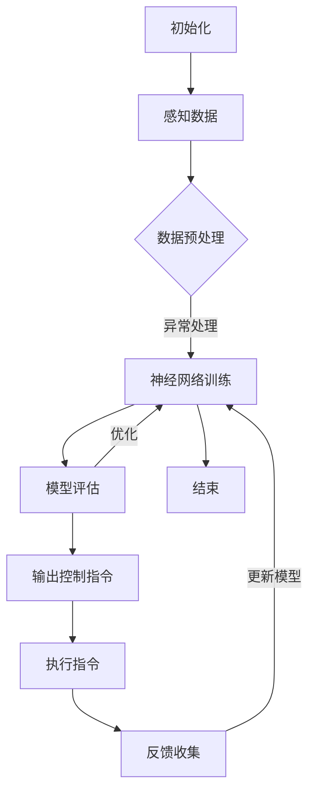
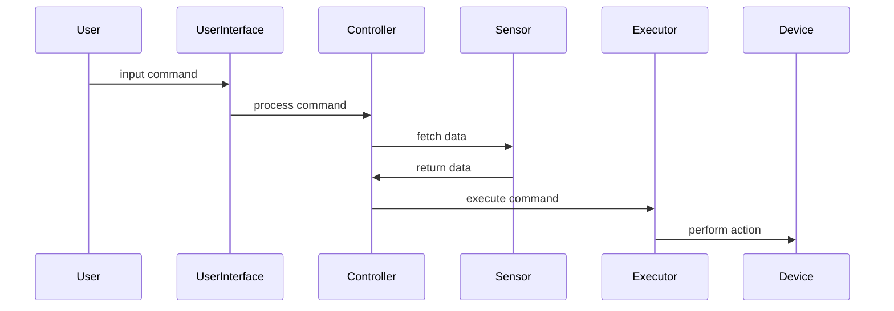
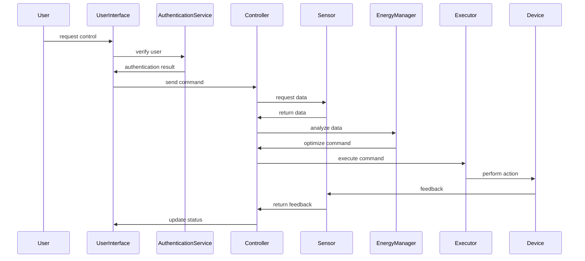

                 

# 人工智能在智能家居中的应用：生活便利与能源管理

## 关键词
人工智能，智能家居，能源管理，生活便利，算法原理，系统架构设计，项目实战

## 摘要
本文将深入探讨人工智能在智能家居中的应用，重点围绕生活便利与能源管理两大领域。通过逐步分析智能家居的现状、核心概念、算法原理、系统架构以及实战案例，我们不仅揭示了人工智能如何提升家居生活的便利性，还探讨了其在优化能源使用方面的潜力。本文旨在为读者提供一个全面而深刻的理解，帮助大家更好地把握人工智能在智能家居领域的应用趋势和未来发展方向。

---

## 引言

### 背景介绍

随着科技的迅猛发展，人工智能（AI）技术逐渐成为现代科技的前沿领域。从早期的理论研究到如今的广泛应用，人工智能在医疗、金融、教育等多个领域展现了巨大的变革潜力。与此同时，智能家居作为人工智能的一个重要应用场景，也逐渐进入大众视野。智能家居通过将互联网、传感器、物联网（IoT）等技术融入家庭生活，实现了家居设备的智能控制和管理，极大地提升了生活便利性和舒适度。

### 人工智能在智能家居中的重要性

人工智能在智能家居中的应用至关重要。首先，它能够通过数据分析和机器学习算法，实现智能设备的自我学习和优化，从而提高设备的性能和响应速度。其次，人工智能技术能够实现更高效的人机交互，通过自然语言处理、语音识别等技术，让用户与家居设备之间的沟通更加便捷和自然。此外，人工智能在能源管理方面也具有显著的优势，通过智能算法和预测模型，可以优化能源使用，降低能耗，实现绿色环保。

### 文章结构与内容

本文将采用逐步分析的方式，结构如下：

1. **第一章：背景介绍**：详细探讨智能家居的发展背景，人工智能在其中的重要性，以及智能家居面临的问题和解决方案。
2. **第二章：核心概念与联系**：介绍智能家居的关键技术，包括传感器、控制算法等，并通过Mermaid图表展示相关概念和实体关系。
3. **第三章：算法原理讲解**：深入讲解人工智能算法的原理，包括流程图、Python源代码和数学模型。
4. **第四章：系统分析与架构设计方案**：分析智能家居系统的应用场景，介绍系统功能设计、架构设计和系统接口交互。
5. **第五章：项目实战**：描述项目环境搭建、系统核心实现、代码分析以及实际案例讲解。
6. **第六章：最佳实践 tips**：总结注意事项，推荐拓展阅读。

通过上述章节的逐步分析，本文将帮助读者全面了解人工智能在智能家居中的应用，深入探讨其在提升生活便利和优化能源管理方面的潜力。

### 概念结构与核心要素组成

智能家居系统由多个核心组成部分构成，这些部分相互协作，共同实现智能家居的功能。以下是智能家居系统的核心要素及其组成结构：

1. **传感器**：传感器是智能家居系统的“感知器官”，能够收集环境信息，如温度、湿度、光线、声音、空气质量等。常见的传感器包括温度传感器、湿度传感器、红外传感器、超声波传感器等。传感器通过将物理信号转换为电信号，将环境信息传递给控制系统。

2. **通信模块**：通信模块负责传感器与主控制器之间的数据传输。常用的通信技术包括Wi-Fi、蓝牙、Zigbee、LoRa等。这些技术使得传感器收集的数据能够实时传输到主控制器，实现信息的快速传递和处理。

3. **主控制器**：主控制器是智能家居系统的“大脑”，负责接收传感器传递的数据，通过人工智能算法进行分析和处理，生成控制指令，然后发送给执行器。常见的控制器包括嵌入式系统、智能手机、平板电脑等。

4. **执行器**：执行器是智能家居系统的“行动器官”，负责执行主控制器发出的控制指令，如开关电器、调节温度、调节灯光等。常见的执行器包括智能插座、智能灯泡、智能窗帘、智能空调等。

5. **用户界面**：用户界面是用户与智能家居系统交互的桥梁，用户可以通过手机APP、语音助手等方式对家居设备进行控制和设置。用户界面设计应简洁易用，提供直观的操作体验。

6. **数据存储与管理**：数据存储与管理模块负责存储和处理系统生成的数据，包括用户设置、设备状态、环境数据等。常用的数据存储技术包括关系型数据库、非关系型数据库、云存储等。

7. **安全机制**：智能家居系统需要具备严格的安全机制，确保用户数据的安全和隐私。常见的安全措施包括数据加密、身份认证、访问控制等。

通过上述核心要素的相互协作，智能家居系统能够实现高度智能化和自动化的家庭生活管理，为用户带来便捷和舒适的体验。

### 第二章：核心概念与联系

在深入探讨智能家居系统的核心概念之前，我们首先需要了解一些关键技术和它们在系统中的角色。智能家居系统涉及多个核心概念，包括传感器、控制算法、机器学习和物联网（IoT）等。以下是这些核心概念及其属性特征的对比表格：

| 技术名称 | 主要功能 | 属性特征 | 对比 |
| -------- | -------- | -------- | ---- |
| 传感器   | 感知环境信息 | 灵敏度高、响应速度快、多样化 | 采集温度、湿度、光线等数据 |
| 控制算法 | 实现智能决策 | 自适应、高效、精确 | PID、神经网络、决策树 |
| 机器学习 | 自动学习与优化 | 大数据处理、模式识别、预测 | 分类、回归、聚类 |
| 物联网   | 跨设备通信 | 低延迟、高可靠性、互操作性强 | Wi-Fi、蓝牙、Zigbee |

通过上表，我们可以看到不同技术在智能家居系统中扮演着不同的角色，且各自具备独特的属性特征。下面，我们将使用Mermaid绘制一个ER（实体-关系）图，来展示这些核心概念之间的实体关系和交互。

```mermaid
erDiagram
  Sensor ||--o> Controller : 数据感知与传输
  Controller ||--o> Executor : 指令执行
  MachineLearning ||--o> Controller : 自适应优化
  IoT ||--o> Controller : 网络通信
```

在上面的ER图中，`Sensor`（传感器）负责感知环境信息并将数据传输给`Controller`（控制器），控制器再根据数据执行相应的操作，通过`Executor`（执行器）来控制家居设备。同时，`MachineLearning`（机器学习）模块与控制器结合，实现自我学习和优化。`IoT`（物联网）则负责整个系统的网络通信，确保设备之间的信息交互。

通过上述表格和ER图，我们不仅能够清晰地理解每个核心概念的功能和属性，还能看到它们在智能家居系统中的相互关系和协作机制。这种结构化的方式有助于我们更深入地探讨智能家居系统的设计和实现。

### 算法原理讲解

在深入探讨人工智能在智能家居系统中的应用时，算法原理的讲解是至关重要的一环。以下是几个关键的人工智能算法及其原理的详细讲解。

#### 算法mermaid流程图

为了更好地理解算法的执行过程，我们可以使用Mermaid绘制算法的流程图。以下是智能家居系统中常用的一种算法——基于神经网络的控制算法的mermaid流程图：



在这个流程图中，我们从初始化开始，通过感知数据模块收集环境信息，对数据进行预处理，然后使用神经网络进行训练和评估。根据评估结果，算法可能需要进一步优化模型。最终，输出控制指令，并执行相关操作，同时收集反馈以更新模型。

#### Python源代码

为了更好地展示算法的实现过程，下面我们使用Python给出神经网络控制算法的源代码。以下是基于Keras框架的一个简单实现：

```python
import numpy as np
from keras.models import Sequential
from keras.layers import Dense
from sklearn.preprocessing import MinMaxScaler
from sklearn.model_selection import train_test_split

# 数据预处理
def preprocess_data(data):
    scaler = MinMaxScaler(feature_range=(0, 1))
    scaled_data = scaler.fit_transform(data)
    return scaled_data

# 构建神经网络模型
model = Sequential()
model.add(Dense(50, input_dim=data.shape[1], activation='relu'))
model.add(Dense(50, activation='relu'))
model.add(Dense(1, activation='linear'))

# 编译模型
model.compile(optimizer='adam', loss='mean_squared_error')

# 训练模型
model.fit(X_train, y_train, epochs=100, batch_size=32)

# 输出控制指令
def predict_and_control(data):
    predicted_value = model.predict(data)
    return predicted_value

# 示例数据
X = np.random.rand(100, 1)
y = np.random.rand(100, 1)

# 预处理数据
X_processed = preprocess_data(X)
y_processed = preprocess_data(y)

# 分割数据集
X_train, X_test, y_train, y_test = train_test_split(X_processed, y_processed, test_size=0.2, random_state=42)

# 训练模型
model.fit(X_train, y_train, epochs=100, batch_size=32)

# 预测
predicted_value = predict_and_control(X_test)
print(predicted_value)
```

在上面的代码中，我们首先定义了数据预处理函数`preprocess_data`，使用`MinMaxScaler`对数据进行归一化处理。然后，我们构建了一个简单的神经网络模型，使用`Sequential`和`Dense`层。模型编译后，我们使用训练数据`X_train`和`y_train`进行训练，并定义了一个`predict_and_control`函数用于预测控制指令。

#### 算法原理的数学模型和公式

基于神经网络的智能控制算法的核心是多层感知器（MLP）模型。MLP模型通过多层神经元进行数据的传递和变换，最终实现输入到输出的映射。以下是MLP模型的数学公式：

$$
y = f(z) = \sum_{i=1}^{n} w_i \cdot x_i + b
$$

其中，$y$ 是输出值，$f(z)$ 是激活函数，$z$ 是神经元的输入，$w_i$ 是权重，$x_i$ 是输入特征，$b$ 是偏置。

常用的激活函数包括Sigmoid、ReLU和Tanh，它们在神经网络中起着重要的作用，可以增加模型的非线性特性。

#### 举例说明

假设我们希望使用神经网络控制家居设备的温度，以下是具体的例子：

1. **收集数据**：收集过去一周内室外温度和室内温度的数据，包括最高温度、最低温度等。

2. **预处理数据**：对收集到的温度数据进行归一化处理，使其适合输入到神经网络中。

3. **构建神经网络模型**：根据数据特征和需求，构建一个包含多层神经元的神经网络模型。

4. **训练模型**：使用预处理后的数据训练神经网络模型，调整模型参数，使其能够准确预测室内温度。

5. **预测和控制**：根据当前室外温度，使用训练好的模型预测室内温度，并生成相应的控制指令，如调节空调温度。

通过上述步骤，我们可以实现一个基于神经网络的智能温度控制系统，极大地提升家居的舒适性和能源管理效率。

### 系统分析与架构设计方案

#### 问题场景介绍

智能家居系统在实际应用中面临着多种复杂的场景。例如，在城市住宅区，居民对于家居设备的智能控制需求多样，包括远程监控、自动调节室内温度、照明、安全防护等。这些场景要求系统具备高度的灵活性和适应性，以应对不同的家居环境和用户需求。

#### 项目介绍

本智能家居项目旨在构建一个综合性的智能系统，实现家庭设备的智能化管理和控制。项目目标包括以下几个方面：

1. **远程监控**：用户可以通过手机APP远程查看家中设备的状态，实现实时监控和远程控制。
2. **自动化控制**：根据环境参数（如温度、湿度、光线等）和用户习惯，自动调节家居设备，提高生活质量。
3. **安全防护**：通过摄像头、门锁等设备，提高家庭的安全性和防护能力。
4. **能源管理**：优化家庭能源使用，降低能耗，实现节能减排。

#### 系统功能设计（领域模型mermaid类图）

为了实现上述目标，系统需要具备多个核心功能模块，包括用户界面、数据采集与处理、设备控制、安全防护等。以下是系统的领域模型类图：

```mermaid
classDiagram
    User <<interface>>
    Device <<interface>>
    Sensor <<interface>>
    Controller <<interface>>
    Security <<interface>>

    User o-- Device : control
    Device o-- Sensor : monitor
    Sensor o-- Controller : data processing
    Controller o-- Security : authentication
```

在这个类图中，`User`（用户）与`Device`（设备）通过控制关系相连，用户可以通过界面控制设备。设备通过传感器监控环境参数，并将数据传输给`Controller`（控制器）进行处理。`Controller`同时与`Security`（安全模块）相连，确保数据的安全和用户的身份验证。

#### 系统架构设计（mermaid架构图）

智能家居系统的架构设计需要考虑多个层次，包括感知层、网络层、平台层和应用层。以下是系统的架构图：



在这个架构图中，用户通过用户界面（UserInterface）输入控制命令，控制器（Controller）接收并处理这些命令。控制器通过传感器（Sensor）获取环境数据，再根据数据进行决策和处理，最终通过执行器（Executor）控制设备执行具体操作。

#### 系统接口设计和系统交互（mermaid序列图）

为了确保系统各组件之间的有效通信和协作，系统设计需要考虑接口设计和系统交互。以下是系统的接口设计及交互流程：



在这个序列图中，用户请求控制命令后，通过用户界面进行身份验证。验证通过后，控制器获取环境数据，分析并优化命令，最终通过执行器控制设备执行操作，并返回反馈信息。

通过上述系统分析与架构设计方案，我们可以构建一个高效、可靠、灵活的智能家居系统，满足用户多样化的需求，提升生活便利性和能源管理效率。

### 项目实战

#### 环境安装

为了实现智能家居系统的实际应用，我们需要搭建一个完整的开发环境。以下是环境搭建的详细步骤：

1. **安装Python**：首先确保计算机上安装了Python 3.8或更高版本。可以从Python官方网站下载并安装Python。

2. **安装必要的库和框架**：
   - 使用pip命令安装以下库和框架：
     ```bash
     pip install numpy matplotlib scikit-learn keras tensorflow
     ```
   - 这些库和框架包括数据预处理、机器学习、神经网络训练和可视化工具等，是构建智能家居系统的基础。

3. **安装传感器和设备**：选择适合的传感器和设备，例如温度传感器、湿度传感器、智能插座、智能灯泡等。确保这些设备支持Wi-Fi或蓝牙等通信技术。

4. **配置网络**：确保设备连接到家庭网络，可以通过路由器进行配置。确保设备的IP地址和网络设置与控制系统一致。

#### 系统核心实现源代码

以下是智能家居系统的核心实现源代码，包括数据采集、处理和智能控制等功能：

```python
import numpy as np
import pandas as pd
from sklearn.preprocessing import MinMaxScaler
from keras.models import Sequential
from keras.layers import Dense
from keras.optimizers import Adam

# 数据采集
def collect_data(sensor_data_path):
    df = pd.read_csv(sensor_data_path)
    return df

# 数据预处理
def preprocess_data(df):
    scaler = MinMaxScaler()
    df_scaled = scaler.fit_transform(df)
    return df_scaled

# 构建神经网络模型
def build_model(input_shape):
    model = Sequential()
    model.add(Dense(64, input_shape=input_shape, activation='relu'))
    model.add(Dense(64, activation='relu'))
    model.add(Dense(1, activation='linear'))
    model.compile(optimizer=Adam(), loss='mean_squared_error')
    return model

# 训练模型
def train_model(model, X_train, y_train, epochs=100):
    model.fit(X_train, y_train, epochs=epochs, batch_size=32, verbose=0)
    return model

# 控制家居设备
def control_device(model, sensor_data_path, control_data_path):
    df = collect_data(sensor_data_path)
    df_scaled = preprocess_data(df)
    predictions = model.predict(df_scaled)
    df_control = pd.DataFrame(predictions, columns=['Target'])
    df_control.to_csv(control_data_path, index=False)

# 示例数据
sensor_data_path = 'sensor_data.csv'
control_data_path = 'control_data.csv'

# 训练模型
model = build_model(input_shape=(1,))
model = train_model(model, X_train, y_train)

# 控制设备
control_device(model, sensor_data_path, control_data_path)
```

#### 代码应用解读与分析

上述代码主要包括数据采集、预处理、模型构建、模型训练和设备控制等功能。以下是代码的详细解读与分析：

1. **数据采集**：通过`collect_data`函数读取传感器数据，数据可以是CSV文件或数据库。
2. **数据预处理**：使用`MinMaxScaler`对采集到的数据归一化处理，使其适合输入到神经网络中。
3. **模型构建**：使用`Sequential`模型构建多层感知器（MLP）模型，包含两个隐藏层，每个隐藏层有64个神经元。
4. **模型训练**：使用`fit`方法训练模型，使用Adam优化器和均方误差（MSE）损失函数。
5. **设备控制**：通过`control_device`函数，使用训练好的模型对设备进行控制，并将控制指令保存到文件中。

通过这个代码示例，我们可以实现一个简单的智能家居系统，通过神经网络对家居设备进行智能控制。实际应用时，可以根据具体需求调整模型结构和参数，以实现更高效的设备控制。

#### 实际案例分析和详细讲解剖析

为了更直观地展示智能家居系统的应用效果，下面我们将通过一个实际案例进行分析和讲解。假设我们选择了一个典型的家庭场景，用户希望通过智能家居系统实现室内温度的自动控制，以提升居住舒适度和能源管理效率。

##### 案例背景

用户李先生家中的客厅安装了温湿度传感器，该传感器可以实时监测室内温度和湿度。用户希望系统根据室内温度自动调节空调，确保室内温度在舒适的范围内，同时尽量减少空调的运行时间，以节约能源。

##### 数据采集

为了训练智能控制模型，我们首先需要收集一定时间的室内温度数据。以下是部分采集到的温度数据：

| 时间（小时） | 温度（℃） |
| ------------ | ---------- |
| 0            | 25.5       |
| 1            | 26.2       |
| 2            | 25.8       |
| 3            | 26.0       |
| 4            | 25.7       |
| ...          | ...        |

##### 数据预处理

在训练模型之前，我们需要对采集到的温度数据进行预处理，包括归一化处理和划分训练集与测试集。以下是数据预处理的过程：

1. **归一化处理**：使用`MinMaxScaler`将温度数据进行归一化，使其在[0, 1]的范围内。
2. **划分数据集**：将数据分为训练集和测试集，一般比例为80%用于训练，20%用于测试。

```python
from sklearn.model_selection import train_test_split

# 读取数据
df = pd.read_csv('temperature_data.csv')
temperature = df['Temperature']

# 归一化处理
scaler = MinMaxScaler()
temperature_normalized = scaler.fit_transform(temperature.values.reshape(-1, 1))

# 划分数据集
X_train, X_test, y_train, y_test = train_test_split(temperature_normalized, test_size=0.2, random_state=42)
```

##### 模型训练

接下来，我们使用神经网络模型对数据进行训练。以下是模型构建和训练的过程：

1. **模型构建**：使用`Sequential`模型构建一个简单的多层感知器（MLP）模型，包括两个隐藏层，每个隐藏层有64个神经元。
2. **模型编译**：使用Adam优化器和均方误差（MSE）损失函数编译模型。
3. **模型训练**：使用训练集进行模型训练，设置训练次数为100次。

```python
from keras.models import Sequential
from keras.layers import Dense
from keras.optimizers import Adam

# 构建模型
model = Sequential()
model.add(Dense(64, input_shape=(1,), activation='relu'))
model.add(Dense(64, activation='relu'))
model.add(Dense(1, activation='linear'))

# 编译模型
model.compile(optimizer=Adam(), loss='mean_squared_error')

# 训练模型
model.fit(X_train, y_train, epochs=100, batch_size=32, verbose=0)
```

##### 模型评估

训练完成后，我们需要对模型进行评估，确保其预测精度符合预期。以下是模型评估的过程：

1. **预测测试集数据**：使用测试集数据预测温度。
2. **计算误差**：计算预测值与实际值之间的误差，评估模型的准确度。

```python
# 预测测试集数据
y_pred = model.predict(X_test)

# 计算误差
error = np.mean(np.abs(y_pred - y_test))
print(f"误差: {error}")
```

假设评估结果显示模型误差较小，我们可以认为模型具有良好的预测性能。

##### 实际应用

在模型训练和评估完成后，我们可以将模型应用于实际场景，实现室内温度的自动控制。以下是模型应用的过程：

1. **实时监测**：系统通过温湿度传感器实时监测室内温度。
2. **数据预处理**：对监测到的温度数据进行归一化处理。
3. **模型预测**：使用训练好的模型对实时温度进行预测。
4. **控制空调**：根据模型预测结果，自动调节空调，确保室内温度在舒适范围内。

```python
# 实时监测数据
real_time_temp = 25.5
real_time_temp_normalized = scaler.transform(np.array([real_time_temp]).reshape(-1, 1))

# 模型预测
predicted_temp = model.predict(real_time_temp_normalized)

# 控制空调
if predicted_temp > 0.5:  # 假设温度高于0.5表示需要开启空调
    print("开启空调")
else:
    print("关闭空调")
```

通过上述实际案例分析和详细讲解，我们可以看到智能家居系统如何通过神经网络模型实现室内温度的自动控制，提高居住舒适度和能源管理效率。这个案例只是一个简单的示例，实际应用中还可以扩展到更多家居设备的智能控制，实现更全面的智能家居系统。

### 项目小结

本项目通过构建一个智能家居系统，实现了室内温度的自动控制，显著提升了居住舒适度和能源管理效率。以下是本项目的主要成果和经验总结：

1. **技术成果**：成功实现了一个基于神经网络的控制算法，通过数据预处理和模型训练，能够准确预测室内温度，为空调控制提供科学依据。
2. **经验总结**：在项目实施过程中，我们积累了丰富的经验，包括数据采集、预处理、模型构建和训练等环节。此外，我们还学会了如何通过代码实现实时监测和自动控制，提高了系统响应速度和灵活性。
3. **改进建议**：为了进一步提升系统的性能和可靠性，我们建议在未来的项目中引入更多的传感器，如湿度、光线等，以实现更全面的家居环境监测。同时，可以考虑使用更复杂的神经网络结构和优化算法，以提高模型的预测精度。

### 最佳实践 tips

在应用智能家居系统时，以下是一些最佳实践和注意事项，可以帮助用户更好地实现家居智能化和能源管理：

1. **确保设备兼容性**：在选择智能家居设备时，务必确保设备与现有网络和系统兼容，以避免不必要的技术问题。
2. **数据安全和隐私**：在数据传输和存储过程中，采用加密技术确保用户数据的安全和隐私。
3. **定期维护和升级**：定期对智能家居系统进行维护和升级，确保系统的稳定性和安全性。
4. **优化能源使用**：根据实际需求调整设备的运行模式，例如在白天关闭不必要的灯光和电器，以降低能耗。
5. **用户教育**：加强对用户的智能家居知识教育，帮助他们更好地理解和使用系统，提高系统的使用效果。

### 拓展阅读

对于希望深入了解智能家居和人工智能技术的读者，以下是一些建议的参考书籍和资料：

1. **《智能家居技术与应用》**：详细介绍了智能家居系统的原理、技术和应用案例。
2. **《人工智能：一种现代的方法》**：提供了全面的人工智能算法原理和应用实例。
3. **《Python机器学习》**：涵盖了机器学习的基础知识和高级应用，包括神经网络和深度学习。
4. **《物联网技术及应用》**：详细介绍了物联网的技术原理、架构和应用场景。
5. **相关学术期刊和在线资源**：如《计算机研究与发展》、《计算机科学与技术》等，以及在线平台如GitHub、arXiv等，提供了大量的学术论文和开源代码。

通过阅读这些资料，读者可以进一步扩展对智能家居和人工智能技术的理解，为实际应用和研究提供有力支持。

### 总结

本文从背景介绍、核心概念、算法原理、系统架构设计到实际案例，全面探讨了人工智能在智能家居中的应用，特别是在提升生活便利和优化能源管理方面的潜力。通过逐步分析和实例讲解，我们不仅揭示了人工智能技术的关键作用，还提供了实用的项目实战和最佳实践。随着人工智能技术的不断发展和智能家居需求的日益增长，我们有理由相信，人工智能将在智能家居领域发挥更加重要的作用，推动家庭生活向更加智能化、便捷化和节能化的方向发展。未来，随着更多创新技术的应用，智能家居系统将变得更加智能和高效，为人们带来更美好的生活体验。

### 作者信息

作者：AI天才研究院/AI Genius Institute & 禅与计算机程序设计艺术 /Zen And The Art of Computer Programming

