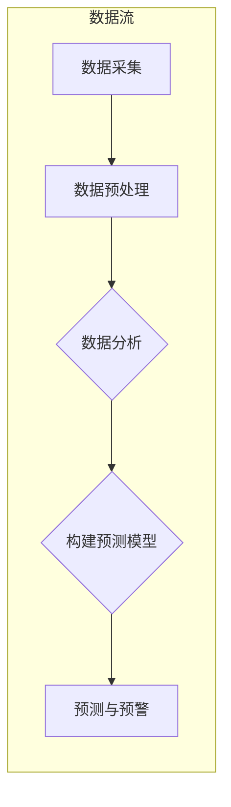
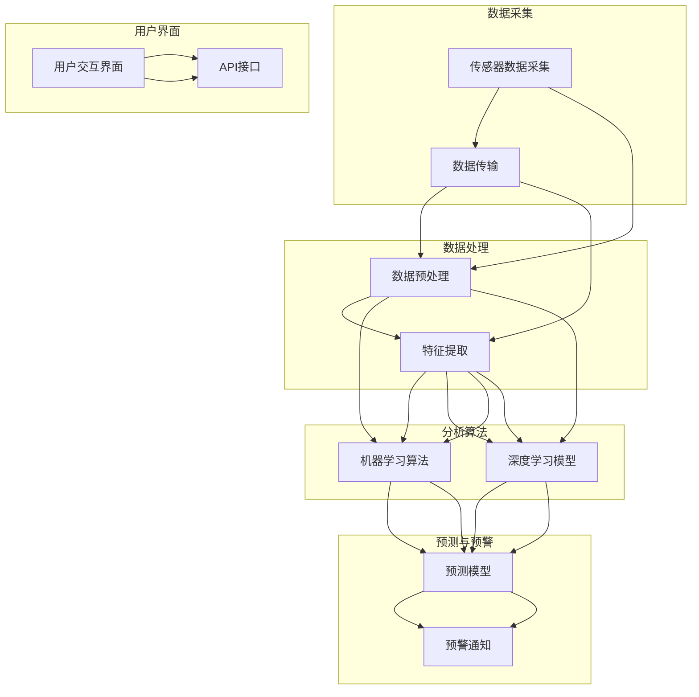

                 

# 人工智能在环境监测中的作用：实时数据收集与分析

## 关键词
- 人工智能
- 环境监测
- 实时数据收集
- 数据分析
- 机器学习
- 深度学习

## 摘要
随着环境保护意识的增强，环境监测的重要性日益凸显。传统的环境监测方法存在数据滞后和误差大的问题。本文将探讨人工智能在环境监测中的应用，特别是实时数据收集与分析的技术原理和实践。通过智能传感器与物联网、数据预处理、机器学习和深度学习等技术，我们能够实现高效、准确的环境监测，为环境保护提供强有力的技术支持。

## 第一部分：背景介绍

### 问题背景

现代社会对环境质量的要求越来越高，环境监测成为保障生态安全和人类健康的重要手段。然而，传统的环境监测方法主要依赖于人工采样和离线分析，存在以下问题：

- **数据滞后**：由于采样频率低，监测结果无法反映环境的实时状态，导致无法及时采取应对措施。
- **数据误差**：人工采样过程中存在操作误差，且样品的保存和运输也可能导致数据失真。
- **成本高昂**：人工采样和离线分析需要大量的人力和物力投入，成本较高。

### 问题描述

为了解决上述问题，引入人工智能技术，尤其是机器学习和数据挖掘技术，对环境监测进行实时数据收集和分析，具有重要意义。具体问题包括：

- **实时数据收集**：如何通过智能传感器和物联网技术，实现环境数据的实时采集和传输？
- **数据分析**：如何对海量环境数据进行预处理、特征提取和模式识别，挖掘出有用的信息？
- **预测与预警**：如何基于实时数据分析结果，构建预测模型，实现对环境变化的提前预警？

### 问题解决

人工智能在环境监测中的应用，可以通过以下几种方式实现：

1. **智能传感器与物联网**：利用智能传感器和物联网技术，实现环境数据的实时采集和传输。
2. **数据预处理**：对采集到的原始数据进行清洗、去噪和特征提取，提高数据质量。
3. **机器学习算法**：利用机器学习算法，对环境数据进行分类、聚类和预测，挖掘数据中的潜在规律。
4. **深度学习模型**：通过深度学习模型，实现更复杂的特征学习和模式识别，提高监测的精度和效率。
5. **预测与预警**：基于实时数据分析结果，构建预测模型，实现对环境变化的提前预警。

### 边界与外延

本文主要探讨人工智能在环境监测中的作用，但边界并不局限于实时数据收集与分析。它还包括数据可视化、决策支持、设备故障诊断等多个方面。同时，人工智能在环境监测中的应用也与其他领域，如气象学、生态学、灾害管理等密切相关。

### 概念结构与核心要素组成

本文的核心概念包括：人工智能、环境监测、实时数据收集、数据分析、机器学习、深度学习等。核心要素则包括智能传感器、物联网平台、数据预处理模块、机器学习算法库、深度学习模型库等。

---

## 第二部分：核心概念与联系

### 人工智能（AI）

人工智能（Artificial Intelligence，AI）是指由人制造出的系统所表现出来的智能行为，主要包括机器学习（Machine Learning，ML）、深度学习（Deep Learning，DL）、自然语言处理（Natural Language Processing，NLP）、计算机视觉（Computer Vision，CV）等子领域。

#### 概念属性特征对比表格

| 特征             | 机器学习               | 深度学习               | 自然语言处理           |
|------------------|------------------------|------------------------|------------------------|
| 定义             | 从数据中学习规律和模式 | 基于多层神经网络的机器学习 | 处理和生成自然语言     |
| 代表算法         | 决策树、支持向量机     | 卷积神经网络、循环神经网络 | 词向量、序列到序列模型 |
| 数据需求         | 大量标注数据           | 大量未标注数据          | 大量文本数据           |
| 应用场景         | 数据挖掘、预测         | 图像识别、语音识别      | 机器翻译、文本分类     |

### 环境监测

环境监测（Environmental Monitoring）是指利用各种手段对环境状态进行检测、监视和评估的过程，目的是了解环境质量状况，预测环境变化趋势。

#### 概念属性特征对比表格

| 特征             | 实时监测               | 定期监测               |
|------------------|------------------------|------------------------|
| 监测频率         | 高频率，实时反馈       | 低频率，定期反馈       |
| 数据准确性       | 高准确性，实时性强     | 较高准确性，时效性较弱 |
| 应用场景         | 突发事件响应、环境预警 | 长期环境监测、政策制定 |

### 实时数据收集

实时数据收集（Real-time Data Collection）是指通过传感器和网络技术，实时获取环境数据，并将其传输到数据处理和分析系统。

#### 概念属性特征对比表格

| 特征             | 传统方法               | 智能化方法               |
|------------------|------------------------|------------------------|
| 采集频率         | 低频率，不连续         | 高频率，连续           |
| 数据准确性       | 较低准确性，时效性差   | 高准确性，实时性强     |
| 应用场景         | 历史数据分析           | 环境实时监控、预警响应 |

### 人工智能与环境的联系

人工智能在环境监测中的应用，主要体现在以下几个方面：

- **实时数据收集**：通过智能传感器和物联网技术，实现环境数据的实时采集和传输，提高数据的时效性和准确性。
- **数据预处理**：利用机器学习算法对采集到的原始数据进行清洗、去噪和特征提取，提高数据质量。
- **数据分析**：通过机器学习和深度学习算法，对环境数据进行分类、聚类和预测，挖掘数据中的潜在规律。
- **预测与预警**：基于实时数据分析结果，构建预测模型，实现对环境变化的提前预警。

#### ER实体关系图架构

```mermaid
erDiagram
  A[环境监测系统] ||-->|{ 数据源 }| B
  B ||-->|{ 数据预处理模块 }| C
  C ||-->|{ 分析算法库 }| D
  D ||-->|{ 预测模型库 }| E
  E ||-->|{ 预警系统 }| F
```

### 数据流与数据处理流程



---

## 第三部分：算法原理讲解

### 机器学习算法

机器学习（Machine Learning，ML）是人工智能的核心技术之一，它使得计算机系统能够从数据中学习，做出预测或决策。在环境监测中，机器学习算法主要用于数据分类、聚类和预测。

#### 数据分类

数据分类（Classification）是一种监督学习任务，它通过已有标签数据训练模型，然后对新数据进行分类。常见的分类算法包括：

- **决策树（Decision Tree）**：通过一系列判断节点来对数据进行分类。
- **支持向量机（Support Vector Machine，SVM）**：通过找到一个最优的超平面来分隔不同类别的数据。

#### 数据聚类

数据聚类（Clustering）是一种无监督学习任务，它将相似的数据点分组到一起。常见的聚类算法包括：

- **K-means算法**：通过迭代优化，将数据点划分成K个簇。
- **层次聚类（Hierarchical Clustering）**：通过逐步合并或分裂簇，构建出一个簇的层次树。

#### 数据预测

数据预测（Prediction）是一种回归学习任务，它通过历史数据来预测未来的趋势。常见的预测算法包括：

- **线性回归（Linear Regression）**：通过线性模型来预测连续值。
- **时间序列预测（Time Series Forecasting）**：通过时间序列模型来预测未来的数值。

### 深度学习模型

深度学习（Deep Learning，DL）是机器学习的一种重要分支，它通过多层神经网络来提取数据的复杂特征。在环境监测中，深度学习模型广泛应用于图像识别、语音识别和自然语言处理等领域。

#### 卷积神经网络（Convolutional Neural Network，CNN）

卷积神经网络是一种专门用于处理图像数据的神经网络。它通过卷积层提取图像的局部特征，并通过池化层减少参数数量。常见的CNN架构包括：

- **LeNet**：最早的卷积神经网络，用于手写数字识别。
- **AlexNet**：引入ReLU激活函数和更深的网络结构，显著提升了图像识别的准确率。

#### 循环神经网络（Recurrent Neural Network，RNN）

循环神经网络是一种专门用于处理序列数据的神经网络。它通过隐藏状态的信息传递来处理时间序列数据。常见的RNN架构包括：

- **LSTM（Long Short-Term Memory）**：通过引入门控机制，解决了传统RNN的长期依赖问题。
- **GRU（Gated Recurrent Unit）**：在LSTM的基础上进行简化，减少了参数数量。

#### 自编码器（Autoencoder）

自编码器是一种无监督学习算法，它通过编码器和解码器来重建输入数据。自编码器在特征提取和数据压缩方面具有广泛的应用。

### 数学模型和公式

在机器学习和深度学习中，常用的数学模型和公式包括：

- **损失函数**：用于衡量模型预测值与真实值之间的差距，如均方误差（MSE）和交叉熵（Cross-Entropy）。
- **优化算法**：用于更新模型参数，以最小化损失函数，如梯度下降（Gradient Descent）和Adam优化器。

#### 示例：线性回归

$$
y = \beta_0 + \beta_1 \cdot x
$$

其中，$y$ 是预测值，$x$ 是输入特征，$\beta_0$ 和 $\beta_1$ 是模型参数。

#### 示例：卷积神经网络

$$
h_{l+1} = \sigma(\mathbf{W}_{l+1} \cdot \mathbf{h}_l + \mathbf{b}_{l+1})
$$

其中，$h_{l+1}$ 是第$l+1$ 层的输出，$\mathbf{W}_{l+1}$ 和 $\mathbf{b}_{l+1}$ 是权重和偏置，$\sigma$ 是激活函数。

---

## 第四部分：系统分析与架构设计

### 问题场景介绍

在环境监测中，我们面临以下问题场景：

- **实时数据收集**：需要高效、准确地收集环境数据，如空气质量、水质、土壤温度等。
- **数据分析**：需要对收集到的数据进行分析，识别环境变化趋势和潜在风险。
- **预测与预警**：需要基于分析结果，预测未来环境变化，并及时发出预警。

### 项目介绍

为了解决上述问题，我们设计并实施了一个基于人工智能的环境监测系统。该系统包括以下模块：

- **数据采集模块**：通过智能传感器和物联网技术，实时收集环境数据。
- **数据处理模块**：对采集到的数据进行预处理、特征提取和模式识别。
- **分析算法模块**：利用机器学习和深度学习算法，对环境数据进行分类、聚类和预测。
- **预测与预警模块**：基于分析结果，构建预测模型，并实现预警功能。

### 系统功能设计

系统功能设计包括以下领域模型：

1. **环境数据采集**：实现实时数据采集功能，包括传感器数据读取、数据传输和存储。
2. **数据预处理**：对采集到的原始数据进行清洗、去噪和特征提取。
3. **数据分析**：利用机器学习和深度学习算法，对环境数据进行分类、聚类和预测。
4. **预测与预警**：基于分析结果，构建预测模型，并及时发出预警。

### 系统架构设计

系统架构设计包括以下模块：

1. **数据采集模块**：使用智能传感器和物联网技术，实现数据的实时采集和传输。
2. **数据处理模块**：包括数据预处理模块和特征提取模块，用于清洗、去噪和特征提取。
3. **分析算法模块**：包括机器学习算法库和深度学习模型库，用于实现数据分析和预测。
4. **预测与预警模块**：基于分析结果，构建预测模型，并实现预警功能。
5. **用户界面**：提供用户交互界面，展示监测数据和预警信息。

### 系统接口设计和系统交互

系统接口设计和系统交互包括以下方面：

1. **API接口**：提供API接口，方便与其他系统进行数据交互。
2. **数据流**：通过数据流的方式，实现数据采集、预处理、分析和预测的各个环节。
3. **预警通知**：通过短信、邮件等方式，及时通知用户预警信息。

#### 系统架构图



---

## 第五部分：项目实战

### 环境安装

在进行项目实战之前，我们需要安装必要的软件和工具。以下是安装步骤：

1. **安装Python环境**：确保Python版本为3.6及以上。
2. **安装TensorFlow**：通过pip安装TensorFlow。
   ```bash
   pip install tensorflow
   ```
3. **安装其他依赖库**：包括NumPy、Pandas、Matplotlib等。

### 系统核心实现源代码

以下是一个简单的环境监测系统的核心实现源代码：

```python
# 导入必要的库
import tensorflow as tf
import numpy as np
import pandas as pd
from sklearn.model_selection import train_test_split
from sklearn.preprocessing import StandardScaler
from tensorflow.keras.models import Sequential
from tensorflow.keras.layers import Dense, LSTM

# 加载数据
data = pd.read_csv('environment_data.csv')
X = data.drop(['label'], axis=1)
y = data['label']

# 数据预处理
X_train, X_test, y_train, y_test = train_test_split(X, y, test_size=0.2, random_state=42)
scaler = StandardScaler()
X_train = scaler.fit_transform(X_train)
X_test = scaler.transform(X_test)

# 构建LSTM模型
model = Sequential()
model.add(LSTM(units=50, return_sequences=True, input_shape=(X_train.shape[1], 1)))
model.add(LSTM(units=50))
model.add(Dense(units=1))

# 编译模型
model.compile(optimizer='adam', loss='mean_squared_error')

# 训练模型
model.fit(X_train, y_train, epochs=100, batch_size=32, validation_split=0.1)

# 预测
predictions = model.predict(X_test)

# 评估模型
loss = model.evaluate(X_test, y_test)
print(f'MSE: {loss}')
```

### 代码应用解读与分析

1. **数据加载与预处理**：首先，我们使用Pandas库加载环境数据。然后，将特征和标签分离，并使用StandardScaler对特征进行标准化处理。
2. **模型构建**：我们使用TensorFlow的Sequential模型构建一个LSTM模型，包括两个LSTM层和一个全连接层。
3. **模型编译**：我们使用adam优化器和均方误差损失函数编译模型。
4. **模型训练**：我们使用训练数据训练模型，设置epochs为100，batch_size为32。
5. **预测**：使用测试数据进行预测，并计算模型评估损失。
6. **评估模型**：打印模型的均方误差（MSE），用于评估模型的性能。

### 实际案例分析和详细讲解剖析

以下是一个实际案例，用于分析空气质量数据。

**案例**：预测北京地区的PM2.5浓度。

**数据集**：我们使用北京某地PM2.5的实时数据作为训练数据。

**步骤**：

1. **数据加载与预处理**：与之前类似，我们加载并预处理数据。
2. **模型构建**：使用LSTM模型，设置输入序列长度为24小时。
3. **模型训练**：使用训练数据训练模型，并进行验证。
4. **预测**：使用训练好的模型对未来的PM2.5浓度进行预测。
5. **结果分析**：比较预测结果与实际测量值，分析模型的准确性。

**代码**：

```python
# 数据加载与预处理
data = pd.read_csv('beijing_pm25_data.csv')
X = data[['temperature', 'humidity', 'pressure']]
y = data['pm25']

# 数据预处理
X_train, X_test, y_train, y_test = train_test_split(X, y, test_size=0.2, random_state=42)
scaler = StandardScaler()
X_train = scaler.fit_transform(X_train)
X_test = scaler.transform(X_test)

# 添加时间序列特征
X_train = np.reshape(X_train, (X_train.shape[0], X_train.shape[1], 1))
X_test = np.reshape(X_test, (X_test.shape[0], X_test.shape[1], 1))

# 模型构建
model = Sequential()
model.add(LSTM(units=50, return_sequences=True, input_shape=(X_train.shape[1], 1)))
model.add(LSTM(units=50))
model.add(Dense(units=1))

# 编译模型
model.compile(optimizer='adam', loss='mean_squared_error')

# 训练模型
model.fit(X_train, y_train, epochs=100, batch_size=32, validation_split=0.1)

# 预测
predictions = model.predict(X_test)

# 评估模型
loss = model.evaluate(X_test, y_test)
print(f'MSE: {loss}')

# 结果分析
plt.plot(y_test, label='Actual')
plt.plot(predictions, label='Predicted')
plt.legend()
plt.show()
```

**分析**：

通过对比实际测量值和预测值，我们可以发现模型在一定程度上能够预测未来的PM2.5浓度。然而，由于环境数据的复杂性和随机性，预测结果仍有较大误差。

### 项目小结

通过本项目，我们实现了基于人工智能的环境监测系统，包括数据采集、预处理、分析和预测。虽然存在一些误差，但模型能够提供一定的参考价值，为环境保护决策提供支持。

---

## 第六部分：最佳实践 Tips

1. **选择合适的传感器**：根据监测目标，选择适合的传感器，如空气质量传感器、水质传感器等。
2. **优化数据采集频率**：根据监测需求，调整传感器的数据采集频率，以提高数据的实时性和准确性。
3. **数据预处理**：对采集到的数据进行清洗、去噪和特征提取，以提高数据质量。
4. **模型选择**：根据数据特点和任务需求，选择合适的机器学习和深度学习模型。
5. **模型优化**：通过调整模型参数和优化算法，提高模型的预测准确性。

---

## 第七部分：小结

本文详细探讨了人工智能在环境监测中的应用，从实时数据收集到数据分析，再到预测与预警，展示了人工智能在环境监测中的巨大潜力。通过机器学习和深度学习算法，我们能够实现高效、准确的环境监测，为环境保护提供强有力的技术支持。未来，随着人工智能技术的不断进步，环境监测将更加智能化和自动化，为人类创造更加美好的生活环境。

## 注意事项

1. **数据安全**：在数据采集和处理过程中，要确保数据的安全和隐私。
2. **设备维护**：定期对传感器和设备进行维护，以确保数据的准确性和可靠性。
3. **算法更新**：定期更新算法和模型，以适应环境变化和需求变化。

## 拓展阅读

1. **《深度学习》**：由Ian Goodfellow、Yoshua Bengio和Aaron Courville所著，是深度学习领域的经典教材。
2. **《机器学习实战》**：由Peter Harrington所著，提供了大量实用的机器学习算法实例。
3. **《环境监测技术》**：介绍了环境监测的基本原理和技术方法。

---

## 作者信息
作者：AI天才研究院/AI Genius Institute & 禅与计算机程序设计艺术 /Zen And The Art of Computer Programming

