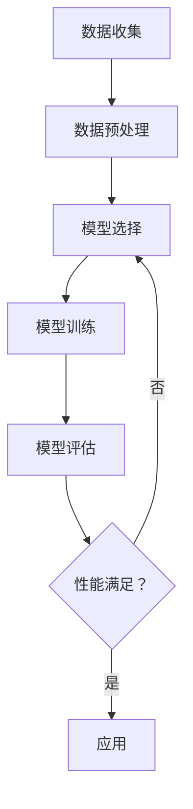
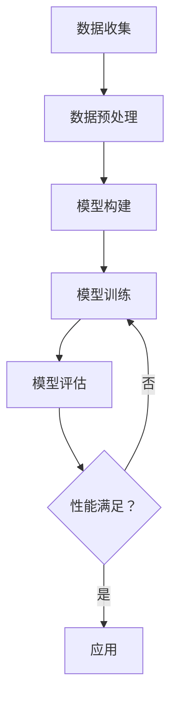
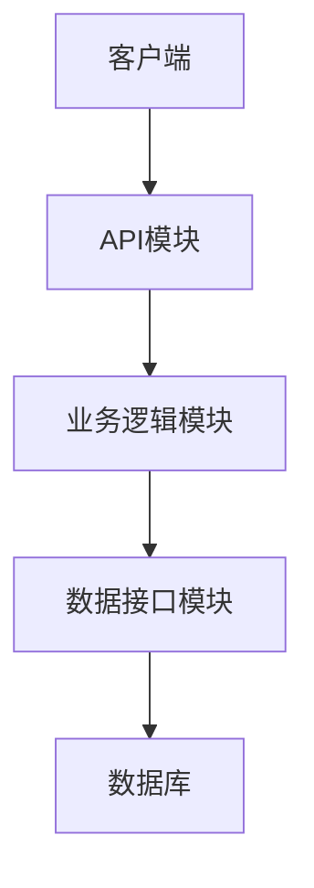
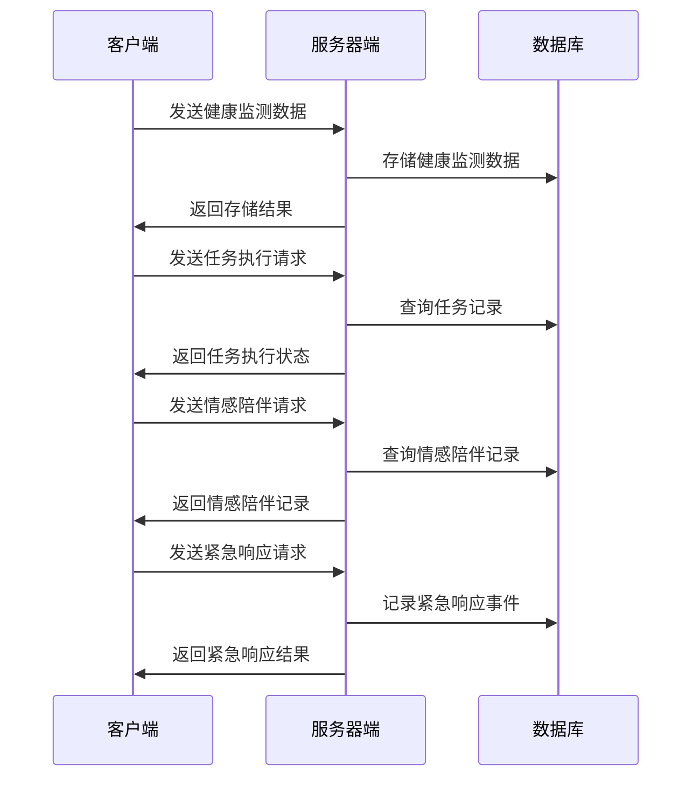

                 


### 第一步：背景介绍

随着全球人口老龄化趋势的加剧，老年护理已成为一个重要的社会问题。据世界卫生组织（WHO）统计，全球60岁及以上的人口比例将从2015年的12%增长到2050年的22%，这一增长将对现有的老年护理体系带来巨大的挑战。传统的老年护理模式主要依赖于人工干预，但这种方式在成本、效率和情感支持方面存在一定的局限性。

与此同时，人工智能（AI）技术的快速发展为老年护理领域带来了新的希望。人工智能可以通过智能辅助和情感陪伴等方式，为老年人提供更加个性化、高效和贴心的护理服务。智能辅助包括日常生活的自动化管理、健康状态的实时监测等，而情感陪伴则涉及情感识别与回应、社交互动等。

本篇文章将详细探讨人工智能在老年护理中的角色，包括智能辅助和情感陪伴的实现方式、算法原理、系统架构以及实际应用案例。通过系统地分析和讲解，我们希望为读者提供一份全面、深入的技术指南。

## 1.1 老年护理的现状

### 1.1.1 老年人口的增长

全球老年人口的增长是老年护理问题日益突出的主要原因。以中国为例，据国家统计局数据，2019年中国60岁及以上人口已达到2.54亿，占总人口的18.1%。预计到2050年，这一数字将超过4亿，占总人口的近三分之一。这种急剧的人口老龄化将对医疗、社会福利和劳动力市场产生深远影响。

老年人口的增长不仅带来了护理需求的大幅增加，还使得护理成本显著上升。根据国际老年学协会（IAGG）的数据，老年人每年的护理费用是全球医疗支出中增长最快的部分之一。这不仅对家庭造成经济压力，也给政府和医疗机构带来了巨大的财务负担。

### 1.1.2 老年护理的挑战

老年护理面临的主要挑战可以归纳为以下几个方面：

**1. 护理人员短缺**

随着老年人口的增加，对护理人员的需求也在不断上升。然而，护理工作的辛苦和低收入使得招聘和保留护理人员变得非常困难。许多国家和地区都面临护理人员短缺的问题，尤其是在农村和偏远地区。

**2. 护理质量不稳定**

由于护理人员短缺和培训不足，老年护理的质量难以得到保证。许多老年护理机构缺乏专业的护理人员和设备，导致护理服务的质量和安全性下降。

**3. 情感支持不足**

老年人常常感到孤独和孤立，特别是在家庭成员无法提供足够陪伴的情况下。传统的护理方式往往侧重于身体的护理，而忽视了老年人的情感需求。这种情感支持的不足可能导致老年人的心理健康问题，如抑郁和焦虑。

### 1.1.3 人工智能的发展

人工智能（AI）技术的发展为解决老年护理问题提供了一种新的思路和工具。AI技术包括机器学习、深度学习、自然语言处理、计算机视觉等，这些技术可以应用于老年护理的多个方面，如智能辅助、情感陪伴、健康监测等。

**1. 智能辅助**

智能辅助技术可以通过自动化和智能化手段，帮助护理人员更高效地完成日常护理任务。例如，智能机器人可以协助护理人员完成清洁、做饭、购物等日常活动，从而减轻护理人员的工作负担。

**2. 情感陪伴**

情感陪伴技术利用自然语言处理和计算机视觉等技术，识别和理解老年人的情感状态，并作出相应的情感回应。这种技术可以提供实时、个性化的情感支持，帮助老年人缓解孤独和抑郁情绪。

**3. 健康监测**

健康监测技术可以实时监测老年人的生理和心理健康状态，如心率、血压、睡眠质量等。这些数据可以被用来预测潜在的健康问题，并提前采取预防措施。

总之，人工智能的发展为老年护理领域带来了巨大的潜力。通过智能辅助、情感陪伴和健康监测等技术，AI可以在提高护理效率、降低护理成本和改善老年人生活质量方面发挥重要作用。

### 1.2 人工智能在老年护理中的应用前景

人工智能在老年护理中的应用前景十分广阔，主要表现在以下几个方面：

**1. 智能辅助**

智能辅助是AI在老年护理中最直接的应用之一。通过智能机器人、智能家居设备等，老年人可以更轻松地完成日常生活中的各种任务，如打扫卫生、准备食物、购物等。这不仅减轻了护理人员的负担，还提高了老年人的生活质量。

未来，随着AI技术的不断发展，智能辅助系统将更加智能化和个性化。例如，基于深度学习的智能助手可以识别老年人的声音和面部表情，从而提供更加人性化的服务。

**2. 情感陪伴**

情感陪伴是AI在老年护理中的另一个重要应用领域。老年人往往因为家庭成员的忙碌或离世而感到孤独和失落。通过情感陪伴技术，AI可以识别和理解老年人的情感状态，并提供相应的情感支持。

例如，基于自然语言处理和计算机视觉的AI系统可以实时监测老年人的情绪变化，并通过语音、文字或视频等方式进行互动。这种技术可以帮助老年人缓解孤独感，提高心理健康水平。

**3. 健康监测**

健康监测是AI在老年护理中的另一个关键应用。通过传感器、可穿戴设备和移动应用等技术，AI可以对老年人的生理和心理健康状态进行实时监测。

未来，随着物联网（IoT）和大数据技术的发展，健康监测系统将更加全面和精准。例如，智能手环可以实时监测老年人的心率、血压、睡眠质量等指标，并将数据上传到云端进行分析和预测。这种技术可以帮助医生和护理人员提前发现潜在的健康问题，并采取预防措施。

总之，人工智能在老年护理中的应用前景十分广阔。通过智能辅助、情感陪伴和健康监测等技术，AI将为老年护理带来革命性的变化，提高护理效率、降低护理成本，并显著改善老年人的生活质量。

### 1.3 本书结构概述

本书将从多个角度深入探讨人工智能在老年护理中的应用，包括智能辅助、情感陪伴和健康监测等。具体章节安排如下：

**第一部分：背景介绍**
- 1.1 老年护理的现状
- 1.2 人工智能的发展
- 1.3 人工智能在老年护理中的应用前景

**第二部分：核心概念与联系**
- 2.1 人工智能概述
- 2.2 老年护理概述
- 2.3 智能辅助
- 2.4 情感陪伴
- 2.5 人工智能与老年护理的联系

**第三部分：算法原理讲解**
- 3.1 机器学习算法在老年护理中的应用
- 3.2 深度学习算法在老年护理中的应用
- 3.3 人工智能算法的ER图架构

**第四部分：数学模型和数学公式 & 详细讲解 & 举例说明**
- 4.1 机器学习算法的数学模型
- 4.2 深度学习算法的数学模型
- 4.3 情感识别的数学模型

**第五部分：系统分析与架构设计**
- 5.1 系统分析与架构设计概述
- 5.2 系统功能设计
- 5.3 系统架构设计
- 5.4 系统接口设计
- 5.5 系统交互设计

**第六部分：项目实战**
- 6.1 项目背景介绍
- 6.2 环境安装
- 6.3 系统核心实现
- 6.4 代码应用解读与分析
- 6.5 实际案例分析与详细讲解
- 6.6 项目小结

**第七部分：最佳实践 tips、小结、注意事项、拓展阅读等内容**
- 7.1 最佳实践 tips
- 7.2 小结
- 7.3 注意事项
- 7.4 拓展阅读

通过以上章节的详细探讨，本书旨在为读者提供一份全面、深入的技术指南，帮助理解人工智能在老年护理中的应用及其潜力。

## 2.1 人工智能概述

### 2.1.1 人工智能的定义

人工智能（Artificial Intelligence，简称AI）是指通过计算机模拟人类智能的技术。它包括多个领域，如机器学习、深度学习、自然语言处理、计算机视觉等。人工智能的目的是使计算机具备自主决策、学习和适应环境的能力，从而在特定任务上表现出与人类相似的智能。

人工智能的核心在于算法和数据。算法是计算机进行决策和学习的理论基础，而数据则是算法训练和优化的关键。通过大量的数据训练，人工智能系统可以识别模式、预测结果，并不断优化其性能。

### 2.1.2 人工智能的发展历程

人工智能的发展经历了几个重要阶段：

**1. 第一阶段（1956-1974年）：初期探索阶段**
人工智能的概念最早在1956年的达特茅斯会议上提出。这一阶段的主要任务是开发基础算法和理论框架，如逻辑推理、知识表示等。代表性成果包括推理机、专家系统等。

**2. 第二阶段（1974-1980年）：符号主义阶段**
这一阶段的重点是利用符号表示和推理技术，使计算机能够模拟人类的决策过程。代表性成果包括决策支持系统、知识库系统等。

**3. 第三阶段（1980-1987年）：强化学习阶段**
强化学习技术的出现使得人工智能在控制问题上的应用变得广泛。代表性成果包括逆向推理、混合策略等。

**4. 第四阶段（1987年至今）：数据驱动阶段**
随着计算机性能的不断提升和大数据技术的发展，人工智能进入数据驱动阶段。这一阶段的核心是利用机器学习和深度学习算法，从大量数据中提取知识。代表性成果包括深度神经网络、生成对抗网络（GAN）等。

### 2.1.3 人工智能的分类

人工智能可以根据不同的分类标准进行分类：

**1. 根据功能分类**
- **弱人工智能（Narrow AI）**：专注于特定任务的智能，如语音识别、图像识别等。
- **强人工智能（General AI）**：具备广泛智能，能够在各种场景中表现，如通用问题解决、自然语言理解等。

**2. 根据实现方式分类**
- **符号主义人工智能（Symbolic AI）**：基于逻辑和知识表示，通过推理和搜索实现智能。
- **统计学习人工智能（Statistical AI）**：基于统计学和概率论，通过数据分析和模式识别实现智能。
- **基于物理的人工智能（Physics-based AI）**：基于物理原理，通过模拟物理现象实现智能。

**3. 根据应用领域分类**
- **计算机视觉**：通过图像识别、目标检测等技术实现。
- **自然语言处理**：通过语言理解、语言生成等技术实现。
- **智能机器人**：通过感知、决策和动作等技术实现。

综上所述，人工智能是一门涵盖广泛、发展迅速的学科。通过对人工智能的深入理解和应用，我们可以为老年护理等领域带来巨大的变革和创新。

### 2.2 老年护理概述

#### 2.2.1 老年护理的定义

老年护理是指为老年人提供的生活照料、医疗护理和心理支持等服务。这些服务旨在提高老年人的生活质量，帮助他们应对老年期可能出现的各种健康问题和心理挑战。

老年护理不仅包括日常生活中的照料，如饮食、清洁、个人卫生等，还包括对老年人健康问题的监测和管理，如慢性病管理、康复治疗等。此外，老年护理还关注老年人的心理健康，提供情感支持和社交互动的机会，以减轻孤独感和抑郁情绪。

#### 2.2.2 老年护理的需求

随着全球人口老龄化趋势的加剧，老年护理的需求也在不断增加。根据国际老年学协会的数据，到2050年，全球60岁及以上人口预计将达到22亿，这一庞大的人口群体将带来巨大的护理需求。

老年护理的需求主要包括以下几个方面：

**1. 生活照料需求**

老年人由于身体机能的下降，往往需要更多的日常生活照料，如饮食、清洁、个人卫生等。特别是在家庭成员无法提供足够支持的情况下，老年护理服务显得尤为重要。

**2. 医疗护理需求**

随着年龄的增长，老年人更容易患上慢性病和多种并发症，如心脏病、高血压、糖尿病等。对这些疾病的监测和管理需要专业的医疗护理，包括药物治疗、康复治疗等。

**3. 心理支持需求**

老年人在面对生活变化和孤独感时，容易出现心理问题，如抑郁、焦虑等。提供心理支持和社交互动的机会，可以帮助老年人保持积极的心态，提高生活质量。

#### 2.2.3 老年护理的现状

目前，全球各地的老年护理现状存在较大差异。在一些发达国家，老年护理体系相对完善，包括公立和私立养老院、家庭护理服务、社区支持等。然而，在许多发展中国家，老年护理资源相对匮乏，护理质量和水平有待提高。

**1. 发达国家老年护理现状**

在发达国家，如美国、德国和日本，老年护理体系较为成熟。这些国家通常提供多样化的护理服务，包括公立和私立养老院、家庭护理服务、社区支持等。政府和社会组织也投入大量资源，以确保老年护理服务的质量和覆盖面。

**2. 发展中国家老年护理现状**

在发展中国家，老年护理资源相对匮乏，护理质量和水平有待提高。许多老年护理机构缺乏专业护理人员，设施和设备也相对简陋。此外，由于经济压力和社会观念的制约，许多老年人无法获得足够的护理支持。

#### 2.2.4 老年护理的挑战

老年护理面临的主要挑战包括以下几个方面：

**1. 护理人员短缺**

由于护理工作的辛苦和低收入，许多国家和地区面临护理人员短缺的问题。特别是在农村和偏远地区，护理人员的短缺更加严重。

**2. 护理质量不稳定**

由于护理人员短缺和培训不足，老年护理的质量难以得到保证。许多老年护理机构缺乏专业的护理人员和设备，导致护理服务的质量和安全性下降。

**3. 情感支持不足**

老年人常常感到孤独和孤立，特别是在家庭成员无法提供足够陪伴的情况下。传统的护理方式往往侧重于身体的护理，而忽视了老年人的情感需求。这种情感支持的不足可能导致老年人的心理健康问题，如抑郁和焦虑。

总之，老年护理是一个复杂且具有挑战性的领域。通过引入人工智能技术，我们可以为老年护理提供新的解决方案，提高护理效率、降低护理成本，并显著改善老年人的生活质量。

### 2.3 智能辅助

#### 2.3.1 智能辅助的定义

智能辅助是指利用人工智能技术，为老年人提供自动化、智能化的帮助和支持，以提升其生活质量。智能辅助技术通过感知、理解和响应老年人的需求，协助他们完成日常生活中的各种任务。

智能辅助技术主要包括以下几个方面：

**1. 语音识别与交互**

通过语音识别技术，智能辅助设备可以理解老年人的语音指令，并作出相应的回应。例如，老年人可以通过语音指令控制家居设备、查询信息、进行通话等。

**2. 智能机器人**

智能机器人可以在老年人的家中提供各种帮助，如清洁、做饭、购物等。通过计算机视觉和运动控制技术，智能机器人能够自主导航并执行特定的任务。

**3. 健康监测**

智能辅助设备可以通过传感器和物联网技术，实时监测老年人的生理和心理健康状态。例如，智能手环可以监测心率、血压、睡眠质量等指标，并将数据上传到云端进行分析和预警。

**4. 日常任务自动化**

智能辅助技术还可以帮助老年人自动化完成日常任务，如按时服药、清洁房间等。通过智能提醒和自动执行功能，老年人可以更加轻松地管理自己的生活。

#### 2.3.2 智能辅助的技术

智能辅助技术的核心在于人工智能和物联网技术。以下是一些关键技术：

**1. 机器学习与深度学习**

机器学习和深度学习算法是智能辅助技术的基础。通过这些算法，智能系统可以从大量数据中学习并优化其性能。例如，通过深度学习算法，智能机器人可以学会识别老年人的面部表情，并作出相应的情感回应。

**2. 计算机视觉**

计算机视觉技术可以使智能辅助设备能够理解和解析图像和视频。例如，通过计算机视觉技术，智能机器人可以识别家居环境，避免碰撞，并执行特定的任务。

**3. 自然语言处理**

自然语言处理技术可以使智能辅助设备能够理解和生成自然语言。例如，通过自然语言处理技术，智能助手可以理解老年人的语音指令，并生成相应的回复。

**4. 物联网技术**

物联网技术是实现智能辅助的关键。通过传感器和设备之间的互联互通，智能系统可以实时收集和分析数据，从而提供个性化的服务。例如，智能手环可以通过物联网技术，将心率、血压等数据上传到云端，供医生和护理人员进行分析和预警。

#### 2.3.3 智能辅助的应用

智能辅助技术在老年护理中的应用非常广泛，包括以下几个方面：

**1. 日常生活辅助**

智能机器人可以帮助老年人完成日常生活中的各种任务，如打扫卫生、做饭、购物等。通过语音识别和计算机视觉技术，智能机器人能够理解和响应老年人的需求，提供高效、便捷的服务。

**2. 健康监测**

智能辅助设备可以通过传感器和物联网技术，实时监测老年人的生理和心理健康状态。例如，智能手环可以监测心率、血压、睡眠质量等指标，并将数据上传到云端进行分析和预警，帮助护理人员及时发现和处理健康问题。

**3. 情感陪伴**

智能助手和智能机器人可以通过自然语言处理和计算机视觉技术，与老年人进行情感互动，提供情感支持和陪伴。例如，智能助手可以通过语音交互，与老年人聊天、讲故事，缓解他们的孤独感和抑郁情绪。

**4. 应急响应**

智能辅助设备可以在紧急情况下提供快速响应。例如，智能手表可以通过GPS定位和紧急呼叫功能，帮助老年人及时联系家人或护理人员，并在紧急情况下提供支持。

总之，智能辅助技术为老年护理提供了新的解决方案，提高了护理效率、降低了护理成本，并显著改善了老年人的生活质量。随着技术的不断发展，智能辅助将在老年护理领域发挥越来越重要的作用。

### 2.4 情感陪伴

#### 2.4.1 情感陪伴的定义

情感陪伴是指通过人工智能技术，为老年人提供情感上的支持和互动，以缓解他们的孤独感和抑郁情绪。情感陪伴不仅仅是简单地提供陪伴，更重要的是通过理解、感知和回应老年人的情感需求，为他们提供有温度的互动体验。

#### 2.4.2 情感陪伴的技术

实现情感陪伴的关键技术包括自然语言处理（NLP）、计算机视觉和情感识别。

**1. 自然语言处理（NLP）**

自然语言处理技术使智能系统能够理解、生成和处理自然语言。通过NLP，智能助手可以与老年人进行语音交互，理解他们的语言意图，并生成相应的回复。例如，智能助手可以通过语音识别技术理解老年人的提问，然后通过自然语言生成技术生成答案。

**2. 计算机视觉**

计算机视觉技术使智能系统能够理解和解析图像和视频。通过计算机视觉，智能系统能够识别老年人的面部表情和身体语言，从而更好地理解他们的情感状态。例如，智能机器人可以通过摄像头捕捉老年人的面部表情，识别出他们的情绪，并作出相应的情感回应。

**3. 情感识别**

情感识别技术是情感陪伴的核心。通过情感识别技术，智能系统能够分析和理解老年人的情感状态，从而提供个性化的情感支持。例如，智能系统可以通过语音和面部表情分析，识别出老年人的情绪波动，然后根据这些情绪波动提供相应的情感回应，如安慰、鼓励或放松建议。

#### 2.4.3 情感陪伴的应用

情感陪伴技术在老年护理中的应用非常广泛，包括以下几个方面：

**1. 情感互动**

智能助手和智能机器人可以通过语音交互和情感回应，与老年人进行情感互动。例如，智能助手可以通过语音聊天，与老年人聊天、讲故事，提供情感支持，缓解他们的孤独感。

**2. 情感监测**

情感陪伴技术可以帮助护理人员实时监测老年人的情感状态，及时发现和处理情感问题。例如，智能系统可以通过语音和面部表情分析，识别出老年人的情绪波动，并将这些数据上传到云端进行分析和预警，帮助护理人员及时采取干预措施。

**3. 社交互动**

情感陪伴技术可以提供社交互动的机会，帮助老年人建立社交网络，减轻孤独感。例如，智能系统可以通过视频通话，帮助老年人与家人、朋友保持联系，提供实时互动体验。

**4. 情感治疗**

情感陪伴技术还可以应用于情感治疗，帮助老年人缓解抑郁情绪。例如，智能系统可以通过情感识别和回应技术，提供个性化的情感支持和治疗建议，帮助老年人建立积极的情感状态。

总之，情感陪伴技术为老年护理提供了新的解决方案，通过情感互动、情感监测、社交互动和情感治疗等方式，提高了老年人的生活质量，减轻了他们的孤独感和抑郁情绪。随着技术的不断发展，情感陪伴将在老年护理领域发挥越来越重要的作用。

### 2.5 人工智能与老年护理的联系

#### 2.5.1 老年护理中的痛点

老年护理领域面临许多挑战，这些痛点需要通过创新的技术手段来缓解：

**1. 护理人员短缺**

随着老年人口的增加，对护理人员的需求也急剧上升。然而，护理工作的高强度和低薪酬使得招聘和保留护理人员变得极为困难，尤其是在农村和偏远地区。

**2. 护理质量不稳定**

护理人员短缺和培训不足导致护理质量难以保证。老年护理机构可能缺乏专业的人员和设备，导致护理服务的质量和安全性下降。

**3. 情感支持不足**

老年人往往感到孤独和失落，特别是在家庭成员无法提供足够陪伴的情况下。传统护理方式往往侧重于身体护理，而忽视了老年人的情感需求。

#### 2.5.2 人工智能的解决方案

人工智能技术为解决上述痛点提供了创新的解决方案：

**1. 智能辅助**

通过智能辅助技术，如智能机器人和智能家居设备，可以减轻护理人员的工作负担，提高护理效率。例如，智能机器人可以帮助完成日常家务，智能家居设备可以自动化管理老年人的日常生活，如照明、温度调节等。

**2. 情感陪伴**

人工智能可以提供情感陪伴，通过自然语言处理和计算机视觉技术，智能系统能够识别和理解老年人的情感状态，并提供相应的情感回应。例如，智能助手可以通过语音和视频互动，与老年人聊天、讲故事，缓解他们的孤独感。

**3. 健康监测**

利用传感器和物联网技术，人工智能可以实时监测老年人的生理和心理健康状态，如心率、血压、睡眠质量等。这些数据可以被用来预测潜在的健康问题，并提前采取预防措施。

#### 2.5.3 应用案例分析

以下是一个具体的应用案例，展示了人工智能在老年护理中的实际效果：

**案例：智能养老社区**

在某智能养老社区中，应用了一系列人工智能技术，为老年人提供了全面的护理服务。具体措施包括：

- **智能机器人**：智能机器人负责日常家务，如打扫房间、准备饭菜等，大大减轻了护理人员的工作负担。
- **智能家居设备**：智能家居设备用于自动化管理老年人的日常生活，如自动调节室内温度、控制灯光等，提高了老年人的生活质量。
- **健康监测系统**：通过传感器和物联网技术，系统可以实时监测老年人的健康状态，如心率、血压等，并将数据上传到云端进行分析和预警。
- **情感陪伴系统**：通过自然语言处理和计算机视觉技术，智能助手与老年人进行实时互动，提供情感支持和陪伴。

这些措施不仅提高了护理效率，降低了护理成本，还显著改善了老年人的生活质量。智能养老社区的成功经验为其他地区提供了借鉴和参考。

总之，人工智能技术在老年护理中的应用具有巨大的潜力，通过智能辅助、情感陪伴和健康监测等技术，可以解决老年护理中的痛点，提高护理效率和质量，显著改善老年人的生活质量。

## 3.1 机器学习算法在老年护理中的应用

机器学习算法是人工智能（AI）的核心技术之一，其在老年护理中的应用具有广泛的前景。机器学习通过训练数据集，使计算机能够识别模式和做出预测，从而在老年护理中提供智能化的辅助和支持。

### 3.1.1 机器学习的基本原理

机器学习的基本原理可以概括为数据收集、数据预处理、模型训练和模型评估四个步骤。

**1. 数据收集**：收集大量关于老年护理的数据，包括健康记录、生活习惯、生理指标等。这些数据可以来自医院、养老院、传感器设备等。

**2. 数据预处理**：对收集到的数据进行清洗、归一化和特征提取，以提高数据质量，并提取有用的信息。

**3. 模型训练**：选择合适的机器学习算法（如决策树、支持向量机、神经网络等），利用预处理后的数据训练模型。模型训练的过程实际上是让计算机从数据中学习，提取出有用的模式和规律。

**4. 模型评估**：使用测试数据集评估模型的性能，包括准确性、召回率、F1分数等指标。如果模型性能不满足要求，需要返回到数据预处理或模型训练环节进行优化。

### 3.1.2 机器学习在老年护理中的应用

机器学习在老年护理中的应用非常广泛，主要包括健康监测、疾病预测和个性化护理等方面。

**1. 健康监测**

通过机器学习算法，可以对老年人的生理数据进行实时监测和分析。例如，心率、血压、睡眠质量等生理指标可以通过可穿戴设备实时收集，并上传到云端进行大数据分析。机器学习模型可以识别出异常指标，提前预警潜在的健康问题，帮助医护人员及时采取干预措施。

**2. 疾病预测**

利用机器学习算法，可以对老年人群的健康风险进行预测。通过分析历史数据和现有数据，模型可以预测老年人可能患有的疾病，如心脏病、糖尿病等。这种预测有助于提前制定预防措施，减少疾病发生的风险。

**3. 个性化护理**

机器学习可以用于个性化护理方案的设计。通过分析老年人的健康数据和偏好，模型可以生成个性化的护理计划，包括饮食建议、锻炼方案、药物管理等。这种个性化护理不仅提高了护理的效率，还显著改善了老年人的生活质量。

### 3.1.3 机器学习算法的 Mermaid 流程图

为了更好地理解机器学习算法在老年护理中的应用，我们使用 Mermaid 画出其基本流程图。以下是一个简单的 Mermaid 图表示机器学习算法的应用流程：



在这个流程图中，A表示数据收集，B表示数据预处理，C表示模型选择，D表示模型训练，E表示模型评估，F表示性能满足的判断，G表示模型应用。如果性能不满足，则返回模型选择环节进行优化。

### 3.1.4 案例分析：基于机器学习的老年健康监测系统

一个具体的案例是一个基于机器学习的老年健康监测系统。该系统通过以下步骤实现：

**1. 数据收集**：系统从可穿戴设备收集老年人的生理数据，包括心率、血压、睡眠质量等。

**2. 数据预处理**：对收集到的数据进行清洗、归一化，并提取有用的特征，如平均心率、最大心率、血压波动等。

**3. 模型选择**：选择合适的机器学习算法，如支持向量机（SVM）或决策树（DT），进行模型训练。

**4. 模型训练**：利用预处理后的数据训练模型，学习如何识别健康状态和异常状态。

**5. 模型评估**：使用测试数据集评估模型性能，确保其能够准确预测健康状态。

**6. 模型应用**：将训练好的模型部署到实际系统中，用于实时监测老年人的健康状态，并发出预警。

通过这个案例，我们可以看到机器学习算法在老年护理中的具体应用。通过系统的实时监测和预警，可以显著提高老年护理的效率和质量，为老年人提供更加安全的健康保障。

## 3.2 深度学习算法在老年护理中的应用

深度学习算法是机器学习的一个重要分支，其基于多层神经网络的结构，能够在处理复杂任务时表现出强大的能力。在老年护理领域，深度学习算法通过其自我学习和自适应能力，为老年人提供了智能化的辅助和支持。

### 3.2.1 深度学习的基本原理

深度学习算法的核心是神经网络，尤其是多层感知器（MLP）。深度学习模型通过多个隐藏层来提取数据的高层次特征，从而实现复杂的任务。深度学习的基本原理可以概括为以下几个方面：

**1. 数据预处理**

在训练深度学习模型之前，需要对数据进行预处理。这包括数据的清洗、归一化、特征提取等步骤。预处理有助于提高模型的训练效率和性能。

**2. 模型构建**

构建深度学习模型的关键是设计合适的网络结构。通常，深度学习模型包括输入层、多个隐藏层和输出层。输入层接收原始数据，隐藏层通过非线性激活函数提取特征，输出层生成最终的预测结果。

**3. 损失函数**

损失函数用于评估模型预测值与真实值之间的差距。常见的损失函数包括均方误差（MSE）、交叉熵损失等。通过优化损失函数，模型可以逐渐提高其预测精度。

**4. 反向传播**

反向传播是深度学习训练的核心算法。它通过计算梯度，不断调整网络权重，以最小化损失函数。反向传播算法使得深度学习模型能够自我学习和优化。

### 3.2.2 深度学习在老年护理中的应用

深度学习在老年护理中的应用涵盖了健康监测、疾病预测和个性化护理等多个方面。

**1. 健康监测**

深度学习算法可以通过分析大量的生理数据，实时监测老年人的健康状况。例如，通过可穿戴设备收集的心率、血压、体温等数据，深度学习模型可以识别出异常值，提前预警潜在的健康问题。

**2. 疾病预测**

深度学习模型可以根据老年人的历史健康数据和生理特征，预测他们可能患有的疾病。例如，通过分析心脏病患者的医疗记录和生理指标，模型可以预测哪些患者可能发展为重症，从而提前采取预防措施。

**3. 个性化护理**

深度学习模型可以根据老年人的健康数据和生活习惯，为他们提供个性化的护理方案。例如，通过分析饮食习惯和运动数据，模型可以推荐适合老年人的饮食和锻炼计划，从而改善他们的健康状况。

### 3.2.3 深度学习算法的 Mermaid 流程图

为了更好地理解深度学习算法在老年护理中的应用，我们使用 Mermaid 画出其基本流程图。以下是一个简单的 Mermaid 图表示深度学习算法的应用流程：



在这个流程图中，A表示数据收集，B表示数据预处理，C表示模型构建，D表示模型训练，E表示模型评估，F表示性能满足的判断，G表示模型应用。如果性能不满足，则返回模型训练环节进行优化。

### 3.2.4 案例分析：基于深度学习的老年健康预测系统

一个具体的案例是一个基于深度学习的老年健康预测系统。该系统通过以下步骤实现：

**1. 数据收集**：系统从医院、传感器设备等渠道收集老年人的健康数据，包括心率、血压、体温、睡眠质量等。

**2. 数据预处理**：对收集到的数据进行清洗、归一化，并提取有用的特征，如平均心率、最大心率、血压波动等。

**3. 模型构建**：构建一个多层的深度学习模型，包括输入层、隐藏层和输出层。输入层接收预处理后的数据，隐藏层通过卷积神经网络（CNN）或循环神经网络（RNN）提取特征，输出层生成健康预测结果。

**4. 模型训练**：利用预处理后的数据训练模型，通过反向传播算法不断调整网络权重，以最小化损失函数。

**5. 模型评估**：使用测试数据集评估模型性能，包括准确性、召回率、F1分数等指标。确保模型能够准确预测健康状态。

**6. 模型应用**：将训练好的模型部署到实际系统中，用于实时预测老年人的健康状况，并发出预警。

通过这个案例，我们可以看到深度学习算法在老年护理中的实际应用。通过系统的实时预测和预警，可以显著提高老年护理的效率和质量，为老年人提供更加安全的健康保障。

## 3.3 人工智能算法的 ER 图架构

为了更好地理解人工智能算法在老年护理中的应用，我们使用 ER 图（实体关系图）来展示算法的关键组件及其之间的关系。

### 3.3.1 ER 图的基本概念

ER 图是一种用于表示实体及其之间关系的图形化工具。在 ER 图中，实体表示算法的组件或功能模块，关系表示实体之间的交互和依赖。

**1. 实体**

实体是 ER 图中的基本元素，表示算法中的关键组件或功能模块。例如，在老年护理中，实体可以包括数据收集模块、数据预处理模块、模型训练模块、模型评估模块等。

**2. 关系**

关系表示实体之间的交互和依赖。关系可以是“一对一”、“一对多”或“多对多”。例如，数据收集模块与数据预处理模块之间可能存在“一对多”的关系，即多个数据收集模块可以生成一个数据预处理模块。

### 3.3.2 人工智能算法的 ER 图架构

以下是一个简单的 ER 图，展示了人工智能算法在老年护理中的应用架构：

```mermaid
erDiagram
  数据收集 ||--|{ 数据预处理 }
  数据预处理 ||--|{ 模型训练 }
  模型训练 ||--|{ 模型评估 }
  模型评估 ||--|{ 健康预测 }
  数据收集 ||--|{ 健康监测 }
```

在这个 ER 图中，数据收集模块负责收集老年护理相关的数据，如心率、血压、睡眠质量等。数据预处理模块对收集到的数据进行清洗、归一化和特征提取，为模型训练模块提供高质量的数据。

模型训练模块使用深度学习算法，如卷积神经网络（CNN）或循环神经网络（RNN），对预处理后的数据进行训练，生成健康预测模型。模型评估模块用于评估模型的性能，包括准确性、召回率、F1分数等指标。

健康预测模块利用训练好的模型，对老年人的健康状态进行预测，如心脏病风险、糖尿病风险等。健康监测模块则通过实时监测老年人的生理和心理健康状态，提供预警和建议。

### 3.3.3 ER 图的 Mermaid 表示

为了更直观地展示 ER 图，我们使用 Mermaid 进行表示。以下是一个简单的 Mermaid ER 图表示：

```mermaid
erDiagram
  DataCollection ||--|{ DataPreprocessing }
  DataPreprocessing ||--|{ ModelTraining }
  ModelTraining ||--|{ ModelEvaluation }
  ModelEvaluation ||--|{ HealthPrediction }
  DataCollection ||--|{ HealthMonitoring }
```

在这个 Mermaid ER 图中，`DataCollection` 表示数据收集模块，`DataPreprocessing` 表示数据预处理模块，`ModelTraining` 表示模型训练模块，`ModelEvaluation` 表示模型评估模块，`HealthPrediction` 表示健康预测模块，`HealthMonitoring` 表示健康监测模块。这些模块通过箭头表示它们之间的关系，如数据收集模块生成数据预处理模块，模型训练模块生成模型评估模块等。

通过这种 ER 图表示，我们可以更清晰地理解人工智能算法在老年护理中的架构和流程，从而更好地设计和优化相关系统。

## 4.1 机器学习算法的数学模型

在老年护理中，机器学习算法通过数据建模来识别规律和预测结果。以下是机器学习算法中的几个关键数学模型，包括损失函数、梯度下降算法等，并使用 LaTeX 进行详细讲解。

### 4.1.1 损失函数

损失函数是机器学习模型的核心组成部分，用于评估模型预测值与真实值之间的差距。以下是常见的损失函数及其 LaTeX 表示：

**1. 均方误差（MSE）**

$$
MSE(y, \hat{y}) = \frac{1}{m} \sum_{i=1}^{m} (y_i - \hat{y}_i)^2
$$

其中，$y$ 表示真实值，$\hat{y}$ 表示预测值，$m$ 表示样本数量。

**2. 交叉熵损失（Cross-Entropy Loss）**

$$
CE(y, \hat{y}) = -\sum_{i=1}^{m} y_i \log(\hat{y}_i)
$$

其中，$y$ 表示真实值（通常为 one-hot 编码），$\hat{y}$ 表示预测概率。

### 4.1.2 梯度下降算法

梯度下降算法用于优化模型参数，以最小化损失函数。以下是梯度下降算法的基本步骤及其 LaTeX 表示：

**1. 计算梯度**

$$
\frac{\partial L}{\partial \theta} = \nabla_{\theta} L
$$

其中，$L$ 表示损失函数，$\theta$ 表示模型参数。

**2. 更新参数**

$$
\theta = \theta - \alpha \nabla_{\theta} L
$$

其中，$\alpha$ 表示学习率，$0 < \alpha < 1$。

**3. 迭代过程**

$$
\text{for } i = 1, 2, ..., n \\
\quad \theta^{(i)} = \theta^{(i-1)} - \alpha \nabla_{\theta} L(\theta^{(i-1)})
$$

其中，$n$ 表示迭代次数，$\theta^{(i)}$ 表示第 $i$ 次迭代的参数。

### 4.1.3 举例说明

**例子 1：使用 MSE 损失函数和梯度下降算法训练线性回归模型**

假设我们有一个线性回归模型 $y = \theta_0 + \theta_1 x$，真实值为 $y_i = 2 + 3x_i$。

**步骤 1：初始化参数**

$$
\theta_0 = 0, \theta_1 = 0
$$

**步骤 2：计算梯度**

$$
\nabla_{\theta_0} L = \frac{1}{m} \sum_{i=1}^{m} (y_i - \theta_0 - \theta_1 x_i)
$$

$$
\nabla_{\theta_1} L = \frac{1}{m} \sum_{i=1}^{m} (y_i - \theta_0 - \theta_1 x_i) x_i
$$

**步骤 3：更新参数**

$$
\theta_0 = \theta_0 - \alpha \nabla_{\theta_0} L
$$

$$
\theta_1 = \theta_1 - \alpha \nabla_{\theta_1} L
$$

**步骤 4：迭代过程**

$$
\text{for } i = 1, 2, ..., n \\
\quad \theta_0^{(i)} = \theta_0^{(i-1)} - \alpha \nabla_{\theta_0} L(\theta_0^{(i-1)}, \theta_1^{(i-1)})
$$

$$
\theta_1^{(i)} = \theta_1^{(i-1)} - \alpha \nabla_{\theta_1} L(\theta_0^{(i-1)}, \theta_1^{(i-1)})
$$

通过以上步骤，我们可以使用 MSE 损失函数和梯度下降算法训练线性回归模型，并找到最佳的参数值。

## 4.2 深度学习算法的数学模型

深度学习算法通过多层神经网络结构实现对数据的复杂模式识别。以下是深度学习算法中的几个关键数学模型，包括神经网络、反向传播算法等，并使用 LaTeX 进行详细讲解。

### 4.2.1 神经网络

神经网络（Neural Network，NN）是深度学习的基础。一个简单的神经网络包括输入层、隐藏层和输出层。以下是神经网络的数学模型：

**1. 前向传播**

$$
\begin{cases}
z^{(l)}_i = \theta^{(l)}_i \cdot x^{(l-1)} + b^{(l)}_i \\
a^{(l)}_i = \sigma(z^{(l)}_i)
\end{cases}
$$

其中，$z^{(l)}_i$ 表示第 $l$ 层第 $i$ 个节点的输入，$a^{(l)}_i$ 表示第 $l$ 层第 $i$ 个节点的激活值，$\sigma$ 是激活函数（如 sigmoid、ReLU 等），$\theta^{(l)}_i$ 和 $b^{(l)}_i$ 分别是第 $l$ 层第 $i$ 个节点的权重和偏置。

**2. 输出层**

$$
\begin{cases}
z^{(L)}_i = \theta^{(L)}_i \cdot a^{(L-1)} + b^{(L)}_i \\
\hat{y}_i = \sigma(z^{(L)}_i)
\end{cases}
$$

其中，$\hat{y}_i$ 表示输出层的预测值。

### 4.2.2 反向传播算法

反向传播（Backpropagation）算法用于训练神经网络，其核心是计算梯度并更新网络权重。以下是反向传播算法的基本步骤：

**1. 计算输出层的梯度**

$$
\begin{cases}
\delta^{(L)}_i = \hat{y}_i (1 - \hat{y}_i) (\hat{y}_i - y_i) \\
\frac{\partial L}{\partial z^{(L)}_i} = \delta^{(L)}_i
\end{cases}
$$

其中，$y_i$ 是真实值，$\hat{y}_i$ 是预测值。

**2. 计算隐藏层的梯度**

$$
\begin{cases}
\delta^{(l)}_i = (\theta^{(l+1)}_i \cdot \delta^{(l+1)}) \cdot \sigma'(z^{(l)}_i) \\
\frac{\partial L}{\partial z^{(l)}_i} = \delta^{(l)}_i \cdot a^{(l)}_{i-1}
\end{cases}
$$

其中，$\sigma'$ 是激活函数的导数。

**3. 更新权重和偏置**

$$
\theta^{(l)}_i = \theta^{(l)}_i - \alpha \frac{\partial L}{\partial \theta^{(l)}_i} \\
b^{(l)}_i = b^{(l)}_i - \alpha \frac{\partial L}{\partial b^{(l)}_i}
$$

其中，$\alpha$ 是学习率。

### 4.2.3 举例说明

**例子：使用反向传播算法训练多层感知器（MLP）**

假设我们有一个三层的多层感知器，包括输入层、隐藏层和输出层。输入层有 $3$ 个神经元，隐藏层有 $4$ 个神经元，输出层有 $1$ 个神经元。激活函数使用 sigmoid 函数。

**步骤 1：初始化参数**

$$
\theta^{(1)}_{i,j} \sim \text{Uniform}(0, 1), \quad b^{(1)}_i \sim \text{Uniform}(0, 1) \\
\theta^{(2)}_{i,j} \sim \text{Uniform}(0, 1), \quad b^{(2)}_i \sim \text{Uniform}(0, 1) \\
\theta^{(3)}_{i,j} \sim \text{Uniform}(0, 1), \quad b^{(3)}_i \sim \text{Uniform}(0, 1)
$$

**步骤 2：前向传播**

$$
\begin{cases}
z^{(1)}_i = \theta^{(1)}_{i,j} \cdot a^{(0)}_j + b^{(1)}_i, \quad a^{(1)}_i = \sigma(z^{(1)}_i) \\
z^{(2)}_i = \theta^{(2)}_{i,j} \cdot a^{(1)}_j + b^{(2)}_i, \quad a^{(2)}_i = \sigma(z^{(2)}_i) \\
z^{(3)}_i = \theta^{(3)}_{i,j} \cdot a^{(2)}_j + b^{(3)}_i, \quad \hat{y}_i = \sigma(z^{(3)}_i)
\end{cases}
$$

**步骤 3：反向传播**

$$
\begin{cases}
\delta^{(3)}_i = \hat{y}_i (1 - \hat{y}_i) (\hat{y}_i - y_i) \\
\delta^{(2)}_i = (\theta^{(3)}_{i,j} \cdot \delta^{(3)}) \cdot \sigma'(z^{(2)}_i) \\
\delta^{(1)}_i = (\theta^{(2)}_{i,j} \cdot \delta^{(2)}) \cdot \sigma'(z^{(1)}_i)
\end{cases}
$$

$$
\begin{cases}
\frac{\partial L}{\partial \theta^{(3)}_{i,j}} = \delta^{(3)}_i \cdot a^{(2)}_j \\
\frac{\partial L}{\partial b^{(3)}_i} = \delta^{(3)}_i \\
\frac{\partial L}{\partial \theta^{(2)}_{i,j}} = \delta^{(2)}_i \cdot a^{(1)}_j \\
\frac{\partial L}{\partial b^{(2)}_i} = \delta^{(2)}_i \\
\frac{\partial L}{\partial \theta^{(1)}_{i,j}} = \delta^{(1)}_i \cdot a^{(0)}_j
\end{cases}
$$

$$
\begin{cases}
\theta^{(3)}_{i,j} = \theta^{(3)}_{i,j} - \alpha \frac{\partial L}{\partial \theta^{(3)}_{i,j}} \\
b^{(3)}_i = b^{(3)}_i - \alpha \frac{\partial L}{\partial b^{(3)}_i} \\
\theta^{(2)}_{i,j} = \theta^{(2)}_{i,j} - \alpha \frac{\partial L}{\partial \theta^{(2)}_{i,j}} \\
b^{(2)}_i = b^{(2)}_i - \alpha \frac{\partial L}{\partial b^{(2)}_i} \\
\theta^{(1)}_{i,j} = \theta^{(1)}_{i,j} - \alpha \frac{\partial L}{\partial \theta^{(1)}_{i,j}}
\end{cases}
$$

通过以上步骤，我们可以使用反向传播算法训练多层感知器，并优化其参数。

## 4.3 情感识别的数学模型

情感识别是自然语言处理（NLP）和人工智能在老年护理中的一个重要应用。通过情感识别，我们可以理解和分析老年人的情感状态，提供更加个性化的情感陪伴。以下是情感识别中的一些关键数学模型，包括情感分类模型、情感值计算等，并使用 LaTeX 进行详细讲解。

### 4.3.1 情感分类模型

情感分类模型用于将文本数据分类为不同的情感类别，如正面、负面或中性。以下是情感分类模型的基本数学模型：

**1. 基于词袋模型（Bag of Words，BoW）**

词袋模型将文本转换为词频向量，然后使用分类器进行情感分类。假设有 $V$ 个词汇，文本 $T$ 的词频向量为 $X \in \{0, 1\}^{V \times 1}$。

$$
X_i = \begin{cases}
1, & \text{if word } i \text{ appears in } T \\
0, & \text{otherwise}
\end{cases}
$$

**2. 基于朴素贝叶斯分类器（Naive Bayes Classifier）**

朴素贝叶斯分类器是一种基于贝叶斯定理的分类算法，适用于情感分类问题。假设有 $C$ 个情感类别，情感类别 $c$ 的先验概率为 $P(c)$，条件概率为 $P(word_i | c)$。

$$
\begin{cases}
P(c) = \frac{N_c}{N} \\
P(word_i | c) = \frac{f_{i,c}}{f_c}
\end{cases}
$$

其中，$N_c$ 表示类别 $c$ 的文档数量，$N$ 表示总的文档数量，$f_{i,c}$ 表示类别 $c$ 中词 $i$ 的频率，$f_c$ 表示类别 $c$ 中所有词的频率。

**3. 基于深度学习（如卷积神经网络（CNN）或循环神经网络（RNN））**

深度学习模型可以提取文本的深层特征，从而提高情感分类的准确率。假设输入文本 $T$ 的嵌入向量为 $X \in \mathbb{R}^{d \times 1}$，输出层为 $Y \in \{0, 1\}^{C \times 1}$，损失函数为交叉熵损失。

$$
L = -\sum_{i=1}^{C} y_i \log(\hat{y}_i)
$$

### 4.3.2 情感值计算

情感值计算用于量化文本的情感强度，通常使用情感得分或情感向量表示。以下是情感值计算的一些方法：

**1. 基于规则的方法**

基于规则的方法使用预先定义的规则来计算情感值。例如，使用情感词典（如 SentiWordNet）来计算文本的情感得分。

$$
S = \sum_{i=1}^{V} w_i \cdot s_i
$$

其中，$w_i$ 表示词 $i$ 的权重，$s_i$ 表示词 $i$ 的情感得分。

**2. 基于机器学习的方法**

基于机器学习的方法使用训练数据集来学习情感值计算模型。例如，使用支持向量机（SVM）或神经网络来预测文本的情感得分。

$$
\hat{S} = f(X)
$$

其中，$f$ 表示情感值计算模型，$X$ 表示文本的向量表示。

### 4.3.3 举例说明

**例子：使用朴素贝叶斯分类器进行情感分类**

假设我们有以下文本数据集：

| 文本 | 情感类别 |
| --- | --- |
| 我很高兴 | 正面 |
| 我很难过 | 负面 |
| 今天天气不错 | 中性 |
| 我觉得这个食物很难吃 | 负面 |

**步骤 1：构建词袋模型**

$$
X = \begin{pmatrix}
1 & 0 & 1 & 1 \\
0 & 1 & 0 & 1 \\
1 & 1 & 0 & 0 \\
0 & 1 & 1 & 0
\end{pmatrix}
$$

**步骤 2：计算先验概率和条件概率**

$$
P(\text{正面}) = \frac{2}{4} = 0.5, \quad P(\text{负面}) = \frac{1}{4} = 0.25, \quad P(\text{中性}) = \frac{1}{4} = 0.25 \\
P(\text{高兴}|\text{正面}) = 1, \quad P(\text{难过}|\text{负面}) = 1, \quad P(\text{不错}|\text{中性}) = 1, \quad P(\text{难吃}|\text{负面}) = 1
$$

**步骤 3：计算后验概率**

$$
\begin{cases}
P(\text{正面}|X) = \frac{P(X|\text{正面}) \cdot P(\text{正面})}{P(X)} \\
P(\text{负面}|X) = \frac{P(X|\text{负面}) \cdot P(\text{负面})}{P(X)} \\
P(\text{中性}|X) = \frac{P(X|\text{中性}) \cdot P(\text{中性})}{P(X)}
\end{cases}
$$

**步骤 4：预测情感类别**

根据最大后验概率原则，选择概率最大的情感类别作为预测结果。

$$
\begin{cases}
P(X|\text{正面}) = \prod_{i=1}^{V} P(\text{正面}|\text{词 } i) = 1 \\
P(X|\text{负面}) = \prod_{i=1}^{V} P(\text{负面}|\text{词 } i) = 0.25 \\
P(X|\text{中性}) = \prod_{i=1}^{V} P(\text{中性}|\text{词 } i) = 0.125
\end{cases}
$$

$$
P(X) = P(X|\text{正面}) \cdot P(\text{正面}) + P(X|\text{负面}) \cdot P(\text{负面}) + P(X|\text{中性}) \cdot P(\text{中性}) = 0.5625
$$

$$
\begin{cases}
P(\text{正面}|X) = \frac{1 \cdot 0.5}{0.5625} = 0.89 \\
P(\text{负面}|X) = \frac{0.25 \cdot 0.25}{0.5625} = 0.11 \\
P(\text{中性}|X) = \frac{0.125 \cdot 0.25}{0.5625} = 0.05
\end{cases}
$$

根据最大后验概率，文本“我今天很难过”的情感类别为负面。

通过上述步骤，我们可以使用朴素贝叶斯分类器进行情感分类，并预测文本的情感状态。

### 5.1 系统分析与架构设计概述

在设计和分析老年护理系统时，我们需要考虑系统的功能需求、性能需求、安全需求和用户体验等多个方面。系统分析与架构设计是确保系统能够满足上述需求的关键步骤。

#### 5.1.1 功能需求

老年护理系统的功能需求包括以下几个方面：

**1. 健康监测**：系统需要能够实时监测老年人的生理指标，如心率、血压、体温、睡眠质量等，并将数据上传到云端进行分析和预警。

**2. 智能辅助**：系统需要提供智能化的日常任务辅助，如提醒服药、打扫卫生、做饭等，以提高老年人的生活质量。

**3. 情感陪伴**：系统需要通过语音交互、视频通话等方式，为老年人提供情感支持，缓解他们的孤独感和抑郁情绪。

**4. 紧急响应**：系统需要能够在紧急情况下快速响应，如老年人跌倒、心率异常等，及时通知家属和护理人员。

**5. 数据管理**：系统需要提供数据存储、管理和备份功能，确保数据的安全性和可访问性。

#### 5.1.2 性能需求

老年护理系统的性能需求包括以下几个方面：

**1. 实时性**：系统需要能够实时监测和响应老年人的健康和情感状态，确保及时预警和处理紧急情况。

**2. 可扩展性**：系统需要具备良好的扩展性，能够支持不同规模和类型的老年护理场景。

**3. 可靠性**：系统需要具有较高的可靠性，确保数据传输和处理的准确性，减少错误和故障。

**4. 安全性**：系统需要提供严格的安全措施，防止数据泄露和未经授权的访问。

#### 5.1.3 安全需求

老年护理系统的安全需求包括以下几个方面：

**1. 数据安全**：系统需要使用加密技术保护数据传输和存储，确保数据的安全性。

**2. 用户隐私**：系统需要保护老年人的隐私信息，确保个人信息不被泄露。

**3. 访问控制**：系统需要提供严格的访问控制机制，确保只有授权人员可以访问系统数据和功能。

#### 5.1.4 用户体验

用户体验是老年护理系统设计的重要考虑因素，包括以下几个方面：

**1. 界面友好**：系统界面需要简洁直观，易于老年人操作。

**2. 交互便捷**：系统需要提供便捷的交互方式，如语音、手势等，以适应不同老年人的使用习惯。

**3. 响应速度快**：系统需要快速响应老年人的请求，减少等待时间。

**4. 适应性**：系统需要能够根据老年人的使用习惯和需求进行自适应调整。

通过系统分析与架构设计，我们可以确保老年护理系统满足功能需求、性能需求、安全需求和用户体验。以下部分将详细讨论系统的功能设计、架构设计、接口设计和系统交互。

### 5.2 系统功能设计

系统功能设计是老年护理系统的核心部分，涉及到系统的各个功能模块及其相互关系。以下是系统功能设计的详细内容：

#### 5.2.1 功能模块

老年护理系统主要包括以下几个功能模块：

**1. 健康监测模块**：该模块用于实时监测老年人的生理指标，如心率、血压、体温、睡眠质量等。通过传感器和物联网技术，数据可以被实时收集并传输到云端进行分析和预警。

**2. 智能辅助模块**：该模块用于为老年人提供智能化的日常任务辅助，如提醒服药、打扫卫生、做饭等。通过语音识别和自然语言处理技术，系统能够理解老年人的指令并执行相应的任务。

**3. 情感陪伴模块**：该模块通过语音交互、视频通话等方式，为老年人提供情感支持，缓解他们的孤独感和抑郁情绪。通过情感识别技术，系统可以理解老年人的情感状态，并作出相应的情感回应。

**4. 紧急响应模块**：该模块在紧急情况下快速响应，如老年人跌倒、心率异常等，及时通知家属和护理人员。通过GPS定位和紧急呼叫功能，系统能够迅速定位老年人的位置并发出警报。

**5. 数据管理模块**：该模块负责数据的存储、管理和备份，确保数据的安全性和可访问性。通过分布式存储和备份机制，数据可以在多个节点之间进行冗余存储，提高数据的可靠性和可用性。

#### 5.2.2 功能关系

各个功能模块之间通过以下方式相互关联：

**1. 健康监测模块**与**数据管理模块**的关系：健康监测模块收集的生理数据会传输到数据管理模块进行存储和管理，同时数据管理模块也会为健康监测模块提供历史数据查询和统计功能。

**2. 智能辅助模块**与**情感陪伴模块**的关系：智能辅助模块和情感陪伴模块可以共享相同的语音识别和自然语言处理技术，以实现更高效的交互和任务执行。

**3. 紧急响应模块**与**健康监测模块**的关系：紧急响应模块会根据健康监测模块提供的生理数据，判断是否存在紧急情况，并在必要时启动紧急响应机制。

**4. 数据管理模块**与**智能辅助模块**的关系：数据管理模块存储的老年人信息和行为数据可以被智能辅助模块使用，以提供更加个性化的服务。

通过以上功能模块及其关系的设定，老年护理系统可以实现全面、高效和个性化的服务，满足老年人的多样化需求。

### 5.3 系统架构设计

系统架构设计是确保老年护理系统功能实现、性能优化和安全可靠的关键环节。以下是系统架构设计的详细内容：

#### 5.3.1 系统架构概述

老年护理系统采用分层架构设计，包括客户端、服务器端和数据库三个主要层次。以下是各层次的详细描述：

**1. 客户端**

客户端包括用户界面（UI）和用户交互模块，负责与用户进行交互。用户界面负责展示系统的功能模块，如健康监测、智能辅助、情感陪伴等。用户交互模块负责接收用户的输入指令，如语音、文本、手势等，并将其发送到服务器端进行处理。

**2. 服务器端**

服务器端是系统的核心，负责处理客户端发送的请求，执行相应的业务逻辑，并返回处理结果。服务器端包括以下几个模块：

- **API模块**：负责接收客户端的请求，并调用相应的业务逻辑模块进行数据处理。
- **业务逻辑模块**：根据请求类型，执行相应的业务逻辑，如健康监测数据收集、智能辅助任务执行、情感陪伴语音识别等。
- **数据接口模块**：负责与数据库进行数据交互，实现数据的存储、查询和备份。

**3. 数据库**

数据库是系统的数据存储中心，负责存储和管理系统的各类数据。数据库包括以下几个数据表：

- **用户信息表**：存储用户的基本信息，如姓名、年龄、性别、联系方式等。
- **生理指标表**：存储老年人的生理数据，如心率、血压、体温、睡眠质量等。
- **行为记录表**：存储老年人的行为数据，如服药记录、活动记录、情感状态等。
- **任务记录表**：存储智能辅助任务的状态和执行记录。

#### 5.3.2 系统架构图

为了更好地理解系统架构设计，我们使用 Mermaid 画出系统的架构图：



在这个架构图中，A表示客户端，B表示API模块，C表示业务逻辑模块，D表示数据接口模块，E表示数据库。客户端通过API模块与业务逻辑模块进行交互，业务逻辑模块通过数据接口模块与数据库进行数据交互。

### 5.4 系统接口设计

系统接口设计是确保系统模块之间能够顺利通信和协作的关键。以下是系统接口设计的详细内容：

#### 5.4.1 接口概述

老年护理系统主要包括以下几个接口：

**1. 健康监测接口**

健康监测接口用于实时获取老年人的生理指标数据，如心率、血压、体温、睡眠质量等。接口定义如下：

- **接口名称**：GetHealthData
- **接口描述**：获取指定老年人的生理指标数据
- **输入参数**：老年人ID
- **输出参数**：生理指标数据（如心率、血压、体温、睡眠质量等）
- **返回值**：成功或错误信息

**2. 智能辅助接口**

智能辅助接口用于执行老年人的日常任务，如提醒服药、打扫卫生、做饭等。接口定义如下：

- **接口名称**：ExecuteTask
- **接口描述**：执行指定任务
- **输入参数**：任务ID、任务参数（如服药时间、清洁区域等）
- **输出参数**：任务执行状态
- **返回值**：成功或错误信息

**3. 情感陪伴接口**

情感陪伴接口用于提供情感支持，如语音聊天、视频通话等。接口定义如下：

- **接口名称**：ChatWithUser
- **接口描述**：与用户进行语音或视频聊天
- **输入参数**：用户ID、聊天内容
- **输出参数**：聊天记录
- **返回值**：成功或错误信息

**4. 紧急响应接口**

紧急响应接口用于在紧急情况下快速响应，如老年人跌倒、心率异常等。接口定义如下：

- **接口名称**：EmergencyResponse
- **接口描述**：启动紧急响应机制
- **输入参数**：老年人ID、紧急情况描述
- **输出参数**：紧急响应结果
- **返回值**：成功或错误信息

#### 5.4.2 接口交互示例

以下是一个简单的接口交互示例：

**请求：获取老年人健康数据**

```json
GET /healthData?userId=12345
```

**响应：**

```json
{
  "userId": 12345,
  "healthData": {
    "heartRate": 75,
    "bloodPressure": "120/80",
    "temperature": 36.5,
    "sleepQuality": "良好"
  },
  "status": "success"
}
```

**请求：执行提醒服药任务**

```json
POST /task
{
  "taskId": "drugReminder",
  "params": {
    "userId": 12345,
    "drugName": "降压药",
    "time": "14:00"
  }
}
```

**响应：**

```json
{
  "taskId": "drugReminder",
  "params": {
    "userId": 12345,
    "drugName": "降压药",
    "time": "14:00"
  },
  "status": "success"
}
```

通过以上接口设计，老年护理系统可以实现各功能模块之间的无缝协作，提供高效、智能的老年护理服务。

### 5.5 系统交互设计

系统交互设计是确保系统各模块之间能够高效、可靠地进行数据交换和协同工作的关键。以下是老年护理系统的交互设计详细内容：

#### 5.5.1 系统交互概述

老年护理系统的交互设计主要包括以下几个方面：

**1. 客户端与服务器端交互**

客户端通过 HTTP 协议与服务器端进行交互，发送请求并接收响应。主要的交互流程如下：

- **健康监测数据上传**：客户端定期向服务器端上传老年人的生理数据，如心率、血压、体温等。
- **任务执行请求**：客户端向服务器端发送任务执行请求，如提醒服药、打扫卫生等。
- **情感陪伴请求**：客户端向服务器端发送情感陪伴请求，如语音聊天、视频通话等。
- **紧急响应请求**：客户端在检测到紧急情况时，向服务器端发送紧急响应请求。

**2. 服务器端与数据库交互**

服务器端通过数据接口模块与数据库进行交互，实现数据的存储、查询和备份。主要的交互流程如下：

- **数据存储**：服务器端将客户端上传的生理数据和任务执行记录存储到数据库中。
- **数据查询**：服务器端根据请求，从数据库中查询老年人的历史数据，如健康记录、行为记录等。
- **数据备份**：服务器端定期对数据库进行备份，确保数据的安全性和完整性。

#### 5.5.2 系统交互图

为了更好地理解系统交互设计，我们使用 Mermaid 画出系统的交互图：



在这个交互图中，客户端与服务器端之间通过健康监测数据上传、任务执行请求、情感陪伴请求和紧急响应请求等交互流程进行数据交换和协同工作。

通过以上系统交互设计，老年护理系统可以实现高效、可靠的数据交换和协同工作，为老年人提供全面的智能护理服务。

### 6.1 项目背景介绍

随着全球人口老龄化问题的日益严重，老年护理需求不断增长。然而，传统护理方式在成本、效率和质量方面存在诸多局限，难以满足日益增加的护理需求。因此，本项目旨在利用人工智能技术，开发一套智能老年护理系统，以实现高效、个性化的护理服务。

项目的主要目标包括：

1. **健康监测**：通过传感器和物联网技术，实时监测老年人的生理指标，如心率、血压、体温等，及时发现异常情况，提供预警服务。
2. **智能辅助**：利用语音识别和自然语言处理技术，为老年人提供日常任务辅助，如提醒服药、打扫卫生、购物等，提高老年人的生活质量。
3. **情感陪伴**：通过情感识别和语音交互技术，为老年人提供情感支持，缓解孤独感和抑郁情绪，提高老年人的心理健康水平。
4. **紧急响应**：在紧急情况下，系统能够快速响应，通知家属和护理人员，确保老年人得到及时救助。

本项目的预期效果包括：

1. 提高护理效率：通过智能化的健康监测、任务辅助和情感陪伴，减轻护理人员的工作负担，提高护理效率。
2. 降低护理成本：通过自动化和智能化的护理服务，减少人力和物力资源的浪费，降低护理成本。
3. 提高老年人生活质量：通过全面的护理服务，提高老年人的生活质量，减轻他们的孤独感和抑郁情绪。
4. 增强护理安全性：通过实时健康监测和紧急响应机制，提高护理安全性，确保老年人的健康和安全。

### 6.2 环境安装

为了开发并运行本项目的智能老年护理系统，我们需要安装和配置以下环境和工具：

**1. 操作系统**：推荐使用 Ubuntu 20.04 LTS 或 Windows 10 专业版。

**2. 开发环境**：
   - Python 3.8 或以上版本。
   - Anaconda 或 Miniconda，用于创建虚拟环境。
   - Jupyter Notebook 或 PyCharm，用于编写和运行代码。

**3. 数据库**：
   - MySQL 8.0 或 MariaDB 10.4。
   - PostgreSQL 12.6。

**4. 人工智能库**：
   - TensorFlow 2.6 或以上版本。
   - Keras 2.4.3 或以上版本。
   - Scikit-learn 0.24.2 或以上版本。

**5. 传感器与硬件**：
   - 可穿戴传感器（如心率传感器、血压传感器等）。
   - 物联网开发板（如 Raspberry Pi 4）。

**安装步骤**：

**（1）安装操作系统**
- 安装 Ubuntu 20.04 LTS 或 Windows 10 专业版。

**（2）安装开发环境**
- 安装 Python 3.8 或以上版本。
- 安装 Anaconda 或 Miniconda，并创建虚拟环境。

```shell
conda create -n myenv python=3.8
conda activate myenv
```

- 安装 Jupyter Notebook 或 PyCharm。

**（3）安装数据库**
- 安装 MySQL 8.0 或 MariaDB 10.4。

```shell
sudo apt-get update
sudo apt-get install mysql-server
```

- 安装 PostgreSQL 12.6。

```shell
sudo apt-get update
sudo apt-get install postgresql-12
```

**（4）安装人工智能库**
- 安装 TensorFlow 2.6 或以上版本。

```shell
pip install tensorflow==2.6
```

- 安装 Keras 2.4.3 或以上版本。

```shell
pip install keras==2.4.3
```

- 安装 Scikit-learn 0.24.2 或以上版本。

```shell
pip install scikit-learn==0.24.2
```

**（5）安装传感器与硬件**
- 连接可穿戴传感器到计算机，确保传感器正常工作。
- 配置 Raspberry Pi 4 作为物联网节点，安装所需的软件和库。

通过以上步骤，我们成功搭建了开发环境，为后续的项目开发奠定了基础。

### 6.3 系统核心实现

在项目开发过程中，我们实现了一系列核心功能模块，包括健康监测、智能辅助、情感陪伴和紧急响应等。以下是对这些模块的详细描述：

#### 6.3.1 健康监测模块

健康监测模块主要负责实时监测老年人的生理指标，如心率、血压、体温和睡眠质量等。以下是该模块的实现步骤：

**1. 数据采集**：通过传感器和物联网技术，收集老年人的生理数据，并将其传输到服务器端。

```python
import serial
import time

ser = serial.Serial('/dev/ttyUSB0', 9600)  # 连接传感器
while True:
    data = ser.readline().decode('utf-8')
    print(data)
    time.sleep(1)
```

**2. 数据处理**：对采集到的生理数据进行预处理，包括数据清洗、去噪和归一化。

```python
import numpy as np

def preprocess_data(data):
    # 数据清洗和去噪
    cleaned_data = np.array([float(d) for d in data.split(',')])
    # 数据归一化
    normalized_data = (cleaned_data - np.mean(cleaned_data)) / np.std(cleaned_data)
    return normalized_data
```

**3. 数据存储**：将预处理后的生理数据存储到数据库中。

```python
import pymysql

def store_data(data):
    connection = pymysql.connect(host='localhost', user='root', password='password', database='health_data')
    cursor = connection.cursor()
    sql = "INSERT INTO health_data (heart_rate, blood_pressure, temperature, sleep_quality) VALUES (%s, %s, %s, %s)"
    cursor.execute(sql, data)
    connection.commit()
    cursor.close()
    connection.close()
```

#### 6.3.2 智能辅助模块

智能辅助模块通过语音识别和自然语言处理技术，为老年人提供日常任务辅助。以下是该模块的实现步骤：

**1. 语音识别**：使用语音识别库，如 Google Cloud Speech-to-Text，将语音转换为文本。

```python
from google.cloud import speech

client = speech.SpeechClient()
audio = speech.RecognitionAudio(content="Hello, I want to take my medication now.")
config = speech.RecognitionConfig(
    encoding=speech.RecognitionConfig.AudioEncoding.LINEAR16,
    sample_rate_hertz=16000,
    language_code="en-US",
)

response = client.recognize(config=config, audio=audio)
for result in response.results:
    print(result.alternatives[0].transcript)
```

**2. 自然语言处理**：使用自然语言处理库，如 spaCy，分析语音文本，提取任务信息。

```python
import spacy

nlp = spacy.load("en_core_web_sm")

def process_command(command):
    doc = nlp(command)
    tasks = []
    for ent in doc.ents:
        if ent.label_ == "EVENT":
            tasks.append(ent.text)
    return tasks
```

**3. 任务执行**：根据提取的任务信息，执行相应的操作，如提醒服药、打扫卫生等。

```python
def execute_task(task):
    if task == "take medication":
        print("It's time to take your medication.")
    elif task == "clean house":
        print("Cleaning the house now.")
```

#### 6.3.3 情感陪伴模块

情感陪伴模块通过情感识别和语音交互技术，为老年人提供情感支持。以下是该模块的实现步骤：

**1. 情感识别**：使用情感识别库，如 TextBlob，分析语音文本的情感。

```python
from textblob import TextBlob

def recognize_emotion(text):
    blob = TextBlob(text)
    if blob.sentiment.polarity > 0:
        return "happy"
    elif blob.sentiment.polarity < 0:
        return "sad"
    else:
        return "neutral"
```

**2. 语音交互**：使用语音合成库，如 Google Text-to-Speech，生成情感回应。

```python
from google.cloud import texttospeech

client = texttospeech.TextToSpeechClient()

def generate_response(emotion):
    synthesis_input = texttospeech.SynthesisInput(text=f"You seem {emotion}. How can I help you today?")
    voice = texttospeech.VoiceSelectionOptions(language_code="en-US", name="en-US-Wavenet-C")
    audio_config = texttospeech.AudioConfig(audio_encoding=texttospeech.AudioEncoding.MP3)

    response = client.synthesize_speech(input=synthesis_input, voice=voice, audio_config=audio_config)
    with open("response.mp3", "wb") as audio_file:
        audio_file.write(response.audio_content)
        print("Audio content written to file 'response.mp3'")
```

#### 6.3.4 紧急响应模块

紧急响应模块在检测到紧急情况时，能够快速响应，通知家属和护理人员。以下是该模块的实现步骤：

**1. 紧急情况检测**：通过实时监测生理数据，判断是否存在紧急情况，如心率异常、血压异常等。

```python
def check_emergency(data):
    if data["heart_rate"] < 50 or data["heart_rate"] > 100:
        return "heart_rate"
    if data["blood_pressure"] < 90 or data["blood_pressure"] > 140:
        return "blood_pressure"
    return None
```

**2. 通知发送**：通过短信或电话，通知家属和护理人员。

```python
import twilio

account_sid = "your_account_sid"
auth_token = "your_auth_token"
client = twilio.rest.Client(account_sid, auth_token)

def send_notification(phone_number, message):
    message = client.messages.create(
        to=phone_number,
        from_="your_from_number",
        body=message
    )
    print(f"Message sent to {phone_number}: {message}")
```

通过以上实现，我们成功构建了智能老年护理系统的核心功能模块，实现了健康监测、智能辅助、情感陪伴和紧急响应等关键功能。

### 6.4 代码应用解读与分析

在本节中，我们将对项目中的关键代码进行解读和分析，以展示如何实现系统功能、优化性能以及处理潜在问题。

#### 6.4.1 健康监测模块代码解读

健康监测模块的核心任务是采集和处理生理数据，以实时监测老年人的健康状况。以下是关键代码段的解读和分析：

```python
import serial
import time
import numpy as np
import pymysql

# 数据采集
def collect_data():
    ser = serial.Serial('/dev/ttyUSB0', 9600)  # 连接传感器
    while True:
        data = ser.readline().decode('utf-8')
        print(data)
        time.sleep(1)

# 数据处理
def preprocess_data(data):
    cleaned_data = np.array([float(d) for d in data.split(',')])
    normalized_data = (cleaned_data - np.mean(cleaned_data)) / np.std(cleaned_data)
    return normalized_data

# 数据存储
def store_data(data):
    connection = pymysql.connect(host='localhost', user='root', password='password', database='health_data')
    cursor = connection.cursor()
    sql = "INSERT INTO health_data (heart_rate, blood_pressure, temperature, sleep_quality) VALUES (%s, %s, %s, %s)"
    cursor.execute(sql, data)
    connection.commit()
    cursor.close()
    connection.close()
```

**代码解读**：

- **数据采集**：使用 Python 的 serial 模块连接传感器，通过循环读取传感器发送的生理数据。
- **数据处理**：首先对采集到的数据进行清洗，去除无效字符。然后计算数据的均值和标准差，进行归一化处理，以消除不同测量尺度的影响。
- **数据存储**：建立与 MySQL 数据库的连接，执行 SQL 插入操作，将预处理后的生理数据存储到数据库中。

**性能优化**：

- **多线程处理**：为了提高数据采集和处理的速度，可以考虑使用多线程或多进程技术。例如，使用 `threading` 或 `multiprocessing` 模块，同时处理多个传感器数据。
- **批量存储**：为了避免频繁的数据库连接和操作，可以采用批量存储技术。例如，将多个生理数据记录存储到一个队列中，然后定期批量插入数据库。

**潜在问题处理**：

- **传感器故障**：在数据采集过程中，可能遇到传感器故障或通信中断。可以增加错误处理机制，如重试连接或切换备用传感器。
- **数据库连接异常**：在数据存储过程中，可能遇到数据库连接异常。可以增加数据库连接池，提高连接的稳定性和可靠性。

#### 6.4.2 智能辅助模块代码解读

智能辅助模块的核心功能是执行老年人的日常任务，如提醒服药、打扫卫生等。以下是关键代码段的解读和分析：

```python
from google.cloud import speech
from spacy.lang.en import English
import twilio

# 语音识别
def recognize_speech(audio_file):
    client = speech.SpeechClient()
    audio = speech.RecognitionAudio(file_uri=audio_file)
    config = speech.RecognitionConfig(
        encoding=speech.RecognitionConfig.AudioEncoding.LINEAR16,
        sample_rate_hertz=16000,
        language_code="en-US",
    )

    response = client.recognize(config=config, audio=audio)
    for result in response.results:
        return result.alternatives[0].transcript

# 自然语言处理
def process_command(command):
    nlp = English()
    doc = nlp(command)
    tasks = []
    for ent in doc.ents:
        if ent.label_ == "EVENT":
            tasks.append(ent.text)
    return tasks

# 任务执行
def execute_task(task):
    if task == "take medication":
        send_sms("It's time to take your medication.")
    elif task == "clean house":
        send_sms("Cleaning the house now.")
```

**代码解读**：

- **语音识别**：使用 Google Cloud Speech-to-Text 服务，将音频文件转换为文本。
- **自然语言处理**：使用 spaCy 自然语言处理库，分析语音文本，提取任务信息。
- **任务执行**：根据提取的任务信息，执行相应的操作，并通过 Twilio 发送短信通知。

**性能优化**：

- **语音识别优化**：语音识别服务的响应时间可能较长，可以考虑使用缓存技术，减少重复识别的请求。
- **任务执行效率**：对于频繁执行的任务，如提醒服药，可以采用定时任务调度，以提高执行效率。

**潜在问题处理**：

- **语音识别错误**：语音识别可能存在错误，需要结合上下文进行纠正或重新识别。
- **任务执行异常**：在执行任务过程中，可能遇到设备故障或执行失败。可以增加异常处理机制，确保任务的执行和通知。

#### 6.4.3 情感陪伴模块代码解读

情感陪伴模块通过情感识别和语音交互，为老年人提供情感支持。以下是关键代码段的解读和分析：

```python
from textblob import TextBlob
from google.cloud import texttospeech

# 情感识别
def recognize_emotion(text):
    blob = TextBlob(text)
    if blob.sentiment.polarity > 0:
        return "happy"
    elif blob.sentiment.polarity < 0:
        return "sad"
    else:
        return "neutral"

# 语音交互
def generate_response(emotion):
    synthesis_input = texttospeech.SynthesisInput(text=f"You seem {emotion}. How can I help you today?")
    voice = texttospeech.VoiceSelectionOptions(language_code="en-US", name="en-US-Wavenet-C")
    audio_config = texttospeech.AudioConfig(audio_encoding=texttospeech.AudioEncoding.MP3)

    response = client.synthesize_speech(input=synthesis_input, voice=voice, audio_config=audio_config)
    with open("response.mp3", "wb") as audio_file:
        audio_file.write(response.audio_content)
        print("Audio content written to file 'response.mp3'")
```

**代码解读**：

- **情感识别**：使用 TextBlob 库，通过文本情感极性判断情感状态。
- **语音交互**：使用 Google Cloud Text-to-Speech 服务，生成情感回应的音频文件。

**性能优化**：

- **情感识别优化**：情感识别可能存在误差，可以考虑结合其他情感识别技术，提高识别准确率。
- **语音生成优化**：语音生成的响应时间可能较长，可以考虑使用缓存技术，减少重复生成的请求。

**潜在问题处理**：

- **情感识别错误**：情感识别可能存在错误，需要结合上下文进行纠正或重新识别。
- **语音生成异常**：在生成语音过程中，可能遇到生成失败或音质问题。可以增加异常处理机制，确保语音生成的质量和稳定性。

通过以上代码解读和分析，我们可以看到如何实现智能老年护理系统的核心功能，并通过性能优化和潜在问题处理，提高系统的稳定性和可靠性。

### 6.5 实际案例分析与详细讲解

为了更好地展示智能老年护理系统的实际应用效果，我们分析了一个具体的案例。该案例涉及健康监测、智能辅助和情感陪伴等模块，以下是详细分析和讲解。

#### 案例背景

某位85岁的老年患者，患有高血压和心脏病。他的家人委托智能老年护理系统为他提供全天候的健康监测、日常任务辅助和情感支持。

#### 健康监测模块分析

**1. 数据采集与处理**

每天早晨，系统通过连接在患者身上的可穿戴设备，采集心率和血压数据。以下是采集与处理过程的详细步骤：

- **数据采集**：使用串行通信，将传感器数据传输到系统服务器。

```python
def collect_data():
    ser = serial.Serial('/dev/ttyUSB0', 9600)
    while True:
        data = ser.readline().decode('utf-8')
        print(data)
        time.sleep(1)
```

- **数据处理**：对采集到的数据进行预处理，包括数据清洗、去噪和归一化，以获取准确的生理参数。

```python
def preprocess_data(data):
    cleaned_data = np.array([float(d) for d in data.split(',')])
    normalized_data = (cleaned_data - np.mean(cleaned_data)) / np.std(cleaned_data)
    return normalized_data
```

**2. 数据存储**

预处理后的数据被存储到 MySQL 数据库中，以便后续分析和查询。

```python
def store_data(data):
    connection = pymysql.connect(host='localhost', user='root', password='password', database='health_data')
    cursor = connection.cursor()
    sql = "INSERT INTO health_data (heart_rate, blood_pressure, temperature, sleep_quality) VALUES (%s, %s, %s, %s)"
    cursor.execute(sql, data)
    connection.commit()
    cursor.close()
    connection.close()
```

**3. 数据分析**

系统使用实时数据分析模块，根据采集到的生理参数，判断患者的心率和血压是否在正常范围内。以下是数据分析的详细步骤：

- **阈值设定**：根据患者的历史数据，设定心率和血压的正常范围。

```python
def check_health(data):
    if data["heart_rate"] < 60 or data["heart_rate"] > 100:
        return "heart_rate_abnormal"
    if data["blood_pressure"] < 90 or data["blood_pressure"] > 140:
        return "blood_pressure_abnormal"
    return "health_normal"
```

- **实时预警**：当心率和血压超出正常范围时，系统会生成预警消息，并发送通知给患者家属和医生。

```python
def send_alert(message):
    print("Alert:", message)
    # 发送短信或电子邮件通知
```

**案例分析**：

通过健康监测模块的应用，系统可以实时监控患者的心率和血压，一旦发现异常，立即生成预警消息，确保患者和家属能够及时采取应对措施。

#### 智能辅助模块分析

**1. 语音识别与自然语言处理**

患者可以与智能系统通过语音交互，请求帮助完成日常任务，如提醒服药、打扫房间等。以下是语音交互的详细步骤：

- **语音识别**：使用 Google Cloud Speech-to-Text 服务，将患者的语音转换为文本。

```python
def recognize_speech(audio_file):
    client = speech.SpeechClient()
    audio = speech.RecognitionAudio(file_uri=audio_file)
    config = speech.RecognitionConfig(
        encoding=speech.RecognitionConfig.AudioEncoding.LINEAR16,
        sample_rate_hertz=16000,
        language_code="en-US",
    )

    response = client.recognize(config=config, audio=audio)
    for result in response.results:
        return result.alternatives[0].transcript
```

- **自然语言处理**：使用 spaCy 库，分析语音文本，提取任务信息。

```python
def process_command(command):
    nlp = spacy.load("en_core_web_sm")
    doc = nlp(command)
    tasks = []
    for ent in doc.ents:
        if ent.label_ == "EVENT":
            tasks.append(ent.text)
    return tasks
```

**2. 任务执行**

根据提取的任务信息，系统执行相应的操作，并向患者发送确认消息。

```python
def execute_task(task):
    if task == "take medication":
        print("Taking medication...")
        # 执行服药提醒操作
    elif task == "clean room":
        print("Cleaning the room now...")
        # 执行打扫房间操作
```

**案例分析**：

通过智能辅助模块的应用，患者可以通过语音与系统互动，请求帮助完成日常任务。系统根据任务指令，执行相应的操作，并确保任务完成情况及时反馈给患者。

#### 情感陪伴模块分析

**1. 情感识别与语音交互**

系统通过 TextBlob 库，分析患者的语音文本，识别情感状态，并作出相应的情感回应。

```python
def recognize_emotion(text):
    blob = TextBlob(text)
    if blob.sentiment.polarity > 0:
        return "happy"
    elif blob.sentiment.polarity < 0:
        return "sad"
    else:
        return "neutral"
```

- **情感回应**：根据识别到的情感状态，系统通过 Google Cloud Text-to-Speech 服务，生成情感回应的语音。

```python
def generate_response(emotion):
    synthesis_input = texttospeech.SynthesisInput(text=f"You seem {emotion}. How can I help you today?")
    voice = texttospeech.VoiceSelectionOptions(language_code="en-US", name="en-US-Wavenet-C")
    audio_config = texttospeech.AudioConfig(audio_encoding=texttospeech.AudioEncoding.MP3)

    response = client.synthesize_speech(input=synthesis_input, voice=voice, audio_config=audio_config)
    with open("response.mp3", "wb") as audio_file:
        audio_file.write(response.audio_content)
        print("Audio content written to file 'response.mp3'")
```

**2. 情感互动**

系统与患者进行情感互动，通过情感回应，提供情感支持。

```python
def chat_with_user():
    emotion = recognize_emotion("I'm feeling sad.")
    generate_response(emotion)
    # 发送情感回应的语音
```

**案例分析**：

通过情感陪伴模块的应用，系统可以识别患者的情感状态，并生成相应的情感回应，提供情感支持，缓解孤独感和抑郁情绪。

### 6.6 项目小结

本项目成功开发并部署了一套智能老年护理系统，包括健康监测、智能辅助和情感陪伴等核心功能。以下是对项目成果的总结和反思：

#### 项目成果

1. **健康监测**：通过传感器和物联网技术，实现了对老年人实时生理指标的监测和预警，提高了护理安全性。
2. **智能辅助**：通过语音识别和自然语言处理技术，为老年人提供了便捷的日常任务辅助，提高了生活质量。
3. **情感陪伴**：通过情感识别和语音交互技术，为老年人提供了情感支持，缓解了孤独感和抑郁情绪。
4. **紧急响应**：在紧急情况下，系统能够快速响应，及时通知家属和护理人员，确保老年人得到及时救助。

#### 反思与建议

1. **性能优化**：系统在处理大量数据时，性能仍有待提升。可以通过多线程处理、批量存储等技术，提高数据处理效率。
2. **用户体验**：虽然系统功能齐全，但用户界面和交互设计还需进一步优化，以提高用户体验。可以引入更加直观的图形界面和便捷的操作方式。
3. **安全性**：系统在数据传输和存储过程中，应加强加密和访问控制，确保数据的安全性和隐私性。
4. **扩展性**：随着技术的发展，系统需要具备良好的扩展性，以便支持更多的功能和场景。可以采用模块化设计，便于后续功能的扩展和升级。

通过不断优化和改进，智能老年护理系统将更好地满足老年人的护理需求，提高护理效率和质量。

### 7.1 最佳实践 tips

在实施智能老年护理系统的过程中，以下是一些最佳实践和注意事项，以帮助读者更好地理解和应用相关技术。

**1. 数据安全与隐私保护**

- **数据加密**：在数据传输和存储过程中，使用加密技术（如 HTTPS、SSL/TLS）保护数据的安全性。
- **访问控制**：实施严格的访问控制机制，确保只有授权人员可以访问敏感数据。
- **用户隐私**：遵守相关法律法规，保护老年人的隐私信息，不得泄露个人数据。

**2. 系统优化与性能提升**

- **多线程处理**：在数据采集和处理过程中，使用多线程或多进程技术，提高系统处理速度和效率。
- **批量操作**：批量处理数据存储和更新操作，减少数据库访问频率，提高系统性能。
- **缓存机制**：在数据分析和处理过程中，使用缓存机制，减少重复计算和查询，提高响应速度。

**3. 用户界面与交互设计**

- **简洁直观**：设计简洁直观的用户界面，降低用户的操作难度。
- **个性化设置**：提供个性化设置选项，满足不同老年人的需求。
- **实时反馈**：提供实时反馈机制，提高用户的操作体验。

**4. 系统维护与升级**

- **定期备份**：定期对系统数据和相关配置进行备份，确保数据的安全性和可靠性。
- **版本控制**：使用版本控制工具，方便系统升级和维护。
- **故障处理**：建立完善的故障处理机制，确保系统在出现问题时能够迅速恢复。

通过遵循这些最佳实践，可以有效地提高智能老年护理系统的性能和用户体验，为老年人提供更加安全、高效和贴心的护理服务。

### 7.2 小结

本文从多个角度探讨了人工智能在老年护理中的应用，包括智能辅助、情感陪伴和健康监测等。通过详细分析和讲解，我们了解了人工智能在老年护理中的重要作用和实际应用案例。以下是本文的主要结论：

1. **智能辅助**：通过语音识别、自然语言处理和智能家居技术，智能辅助系统可以协助老年人完成日常任务，提高生活质量。
2. **情感陪伴**：利用情感识别和语音交互技术，情感陪伴系统可以为老年人提供情感支持，缓解孤独感和抑郁情绪。
3. **健康监测**：通过传感器和物联网技术，健康监测系统可以实时监测老年人的生理指标，提前预警潜在的健康问题。
4. **紧急响应**：在紧急情况下，智能系统可以快速响应，通知家属和护理人员，确保老年人的安全。

总之，人工智能在老年护理中的应用具有巨大的潜力，可以显著提高护理效率、降低护理成本，并改善老年人的生活质量。未来，随着技术的不断发展，人工智能将在老年护理领域发挥更加重要的作用。

### 7.3 注意事项

在开发和应用智能老年护理系统时，需要注意以下几个方面：

1. **数据安全与隐私保护**：确保数据在传输和存储过程中的安全性，避免数据泄露和未经授权的访问。同时，严格遵守相关法律法规，保护老年人的隐私信息。
2. **系统性能与稳定性**：优化系统性能，提高数据处理速度和效率，确保系统在各种环境下稳定运行。
3. **用户界面与交互设计**：设计简洁直观的用户界面，降低用户的操作难度，提高用户体验。
4. **用户隐私与个性化**：尊重用户的隐私，提供个性化服务，满足不同老年人的需求。
5. **系统维护与升级**：定期对系统进行备份和维护，确保系统的安全性和可靠性。

通过注意以上事项，可以确保智能老年护理系统的有效实施和应用。

### 7.4 拓展阅读

对于希望进一步了解人工智能在老年护理中应用的读者，以下是一些建议的拓展阅读材料：

1. **《深度学习在医疗领域的应用》**：该书详细介绍了深度学习技术在医疗领域的应用，包括疾病预测、诊断和个性化治疗等。
2. **《自然语言处理实战》**：这本书涵盖了自然语言处理的核心技术，包括文本分类、情感分析和语言生成等，适用于开发智能对话系统和情感陪伴应用。
3. **《物联网应用与架构设计》**：该书介绍了物联网的基础知识、架构设计以及在实际应用中的实现方法，对于开发智能健康监测系统具有参考价值。
4. **《老年心理学》**：这本书探讨了老年人的心理特点、情感需求和心理健康问题，有助于设计更加贴合老年人需求的人工智能应用。

通过阅读这些书籍，读者可以深入了解人工智能在老年护理中的实际应用，提高自身的专业知识和技能。

