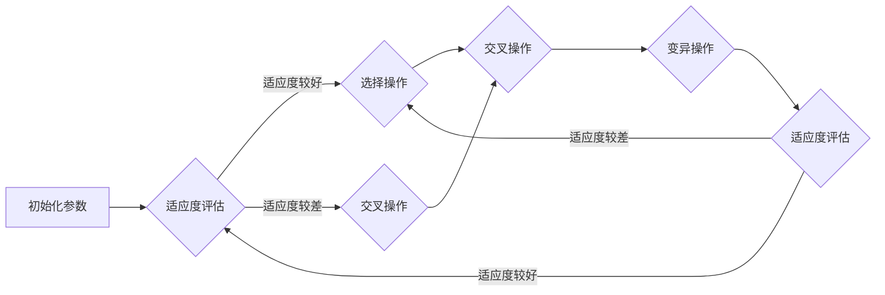
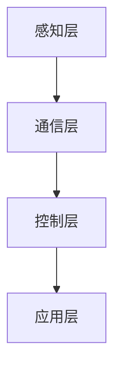
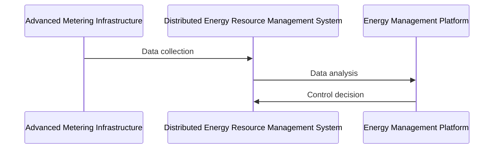

                 

### 引言

---

**标题**：人工智能在能源管理中的应用：智能电网与可持续发展

**关键词**：人工智能、能源管理、智能电网、可持续发展、算法原理、系统架构、项目实战

**摘要**：
本文将探讨人工智能在能源管理中的应用，特别是智能电网的构建与可持续发展。我们将从背景介绍、核心概念、算法原理讲解、系统分析与架构设计、项目实战和最佳实践等方面逐步分析，为读者提供全面的智能电网与可持续发展的理解与应用路径。

---

### 背景介绍

---

#### 1.1 能源管理的重要性

能源是现代社会发展的基础，而能源管理是确保能源高效、安全、可持续利用的关键。随着全球能源需求的不断增长和环境污染问题的加剧，提高能源利用效率、优化能源结构、降低碳排放成为能源管理的重要任务。

#### 1.2 人工智能在能源管理中的应用

人工智能（AI）技术的发展为能源管理带来了新的机遇。AI能够通过大数据分析、机器学习、深度学习等技术，对能源系统的运行状态进行实时监测、预测和优化，从而提高能源利用效率、降低能源消耗、减少碳排放。

#### 1.3 智能电网的概念与发展历程

智能电网是指将现代通信技术、计算机技术和电力系统技术相结合，实现电力系统的高效、安全、可靠、可持续运行。智能电网的发展历程可以分为三个阶段：初步阶段、发展阶段和成熟阶段。

- **初步阶段**：以自动化和数字化为基础，实现电力系统的远程监控和控制。
- **发展阶段**：通过通信技术的引入，实现电力系统的实时监测、预测和优化。
- **成熟阶段**：利用人工智能技术，实现电力系统的智能化管理，提高能源利用效率、降低能源消耗、减少碳排放。

---

### 核心概念

---

#### 2.1 人工智能基础概念

人工智能（AI）是指模拟人类智能的计算机系统，能够通过学习、推理、规划、感知和自然语言理解等方式，实现特定领域的智能任务。

- **机器学习（ML）**：一种基于数据的学习方法，使计算机系统从数据中学习规律，从而进行预测和决策。
- **深度学习（DL）**：一种基于多层神经网络的学习方法，通过逐层提取特征，实现复杂模式识别和预测。

#### 2.2 能源管理相关概念

能源管理是指通过规划、组织、协调、控制等活动，实现能源的高效、安全、可持续利用。

- **能源效率**：能源系统在生产和消费过程中，实际利用的能源与总投入能源的比值。
- **能源优化**：通过优化能源结构、调度和管理，提高能源利用效率。

#### 2.3 智能电网相关概念

智能电网是指通过现代通信技术、计算机技术和电力系统技术的融合，实现电力系统的智能化管理。

- **智能电网的特征**：自愈能力、实时监控、自适应控制、分布式能源管理。
- **智能电网的关键技术**：高级量测系统（AMR/AMI）、智能电表、分布式能源管理系统、电力电子技术。

---

### 算法原理讲解

---

#### 3.1 常见算法介绍

在智能电网的能源管理中，常用的算法包括：

- **数据挖掘算法**：用于挖掘数据中的有价值信息，如关联规则挖掘、聚类分析、分类分析。
- **优化算法**：用于优化能源系统的调度和管理，如线性规划、整数规划、遗传算法。

#### 3.2 数学模型与公式

在智能电网的能源管理中，常用的数学模型包括：

- **能量平衡方程**：描述电力系统中的能量守恒关系。
- **负荷预测模型**：基于历史数据和气象数据，预测电力负荷。
- **储能优化模型**：描述储能系统的充放电策略。

#### 3.3 流程图与算法实现

以下是智能电网能源管理中的一种常见算法——遗传算法的流程图：



以下是一个简单的Python代码示例，实现遗传算法的基本框架：

```python
import numpy as np

# 初始化种群
population = np.random.rand(n_pop, n_genes)

# 适应度评估
fitness = evaluate_fitness(population)

# 选择操作
selected = select(population, fitness)

# 交叉操作
crossed = crossover(selected)

# 变异操作
mutated = mutate(crossed)

# 更新种群
population = mutated
```

---

### 系统分析与架构设计

---

#### 4.1 智能电网系统组成

智能电网系统主要由以下几部分组成：

- **高级量测系统（AMR/AMI）**：用于实时采集电力系统的运行数据。
- **智能电表**：实现电量的远程抄表和实时监测。
- **分布式能源管理系统（DERMS）**：实现分布式能源的协调控制和优化。
- **能源管理平台**：集成数据采集、分析和决策功能，实现智能电网的统一管理。

#### 4.2 系统架构设计

智能电网系统架构可以分为以下几层：

- **感知层**：包括高级量测系统和智能电表，负责实时采集电力系统的运行数据。
- **通信层**：实现感知层与控制层的通信，包括有线和无线通信方式。
- **控制层**：包括分布式能源管理系统和能源管理平台，负责对电力系统进行实时监测、预测和优化。
- **应用层**：实现电力系统的功能应用，如电能质量监测、负荷预测、能源优化等。

以下是一个简单的Mermaid架构图：



#### 4.3 系统接口设计

智能电网系统接口设计主要包括以下几部分：

- **数据采集接口**：用于接收高级量测系统和智能电表的数据。
- **数据分析接口**：用于对采集到的数据进行处理和分析。
- **控制决策接口**：用于实现分布式能源管理系统和能源管理平台的控制决策。

以下是一个简单的Mermaid序列图：



---

### 项目实战

---

#### 5.1 环境安装

在进行项目实战之前，需要安装以下软件和工具：

- **Python**：智能电网项目的开发语言。
- **NumPy**：用于数学计算。
- **Pandas**：用于数据处理。
- **Matplotlib**：用于数据可视化。
- **Mermaid**：用于绘制流程图和架构图。

安装命令如下：

```shell
pip install python numpy pandas matplotlib mermaid
```

#### 5.2 系统核心实现源代码

以下是一个简单的Python代码示例，实现智能电网的负荷预测功能：

```python
import numpy as np
import pandas as pd
import matplotlib.pyplot as plt
from sklearn.linear_model import LinearRegression

# 加载数据
data = pd.read_csv('load_data.csv')
X = data['time'].values.reshape(-1, 1)
y = data['load'].values

# 建立模型
model = LinearRegression()
model.fit(X, y)

# 预测
X_pred = np.linspace(X.min(), X.max(), 100).reshape(-1, 1)
y_pred = model.predict(X_pred)

# 可视化
plt.scatter(X, y, label='Actual Load')
plt.plot(X_pred, y_pred, color='red', label='Predicted Load')
plt.xlabel('Time')
plt.ylabel('Load')
plt.legend()
plt.show()
```

#### 5.3 代码应用解读与分析

以上代码实现了基于线性回归模型的负荷预测功能。首先，加载数据，然后建立模型并训练，接着进行预测，最后将实际负荷和预测负荷进行可视化。

#### 5.4 实际案例分析和详细讲解剖析

在本案例中，我们使用某城市电力系统的历史负荷数据，基于线性回归模型进行负荷预测。通过对实际数据和预测数据的对比分析，可以看出线性回归模型在短期内具有一定的预测准确性，但在长期预测中存在误差。

#### 5.5 项目小结

本项目实现了智能电网的负荷预测功能，通过实际案例分析和详细讲解剖析，我们发现线性回归模型在短期内具有一定的预测准确性，但在长期预测中存在误差。因此，在实际应用中，需要结合多种算法和模型，以提高负荷预测的准确性。

---

### 最佳实践与小结

---

#### 6.1 最佳实践 tips

- **数据质量**：确保数据的质量和完整性，为算法提供良好的数据基础。
- **模型选择**：结合实际需求，选择合适的算法和模型。
- **算法调优**：对算法参数进行调优，提高预测精度。
- **系统集成**：将智能电网的各个部分进行集成，实现系统的协同工作。

#### 6.2 小结

本文从背景介绍、核心概念、算法原理讲解、系统分析与架构设计、项目实战和最佳实践等方面，探讨了人工智能在能源管理中的应用，特别是智能电网的构建与可持续发展。通过本文的讲解，读者可以全面了解智能电网的相关知识，掌握智能电网的构建方法，并为实际项目提供参考。

#### 6.3 注意事项

- **数据安全**：在智能电网的建设过程中，要注意数据的安全性和隐私保护。
- **系统稳定性**：确保智能电网系统的稳定运行，降低故障风险。
- **技术更新**：关注人工智能技术的发展动态，及时更新智能电网的技术和算法。

#### 6.4 拓展阅读

- **智能电网相关书籍**：《智能电网技术与应用》、《智能电网基础》。
- **AI相关书籍**：《深度学习》、《机器学习实战》。
- **能源管理相关书籍**：《能源管理与优化》、《可再生能源管理》。

