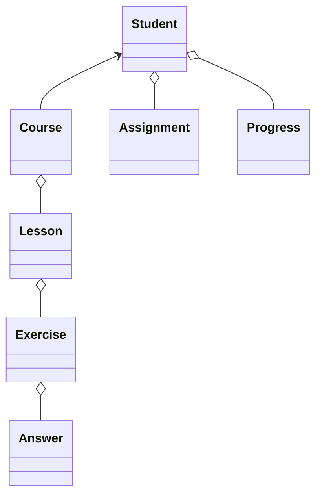
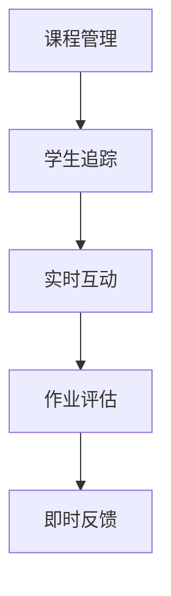
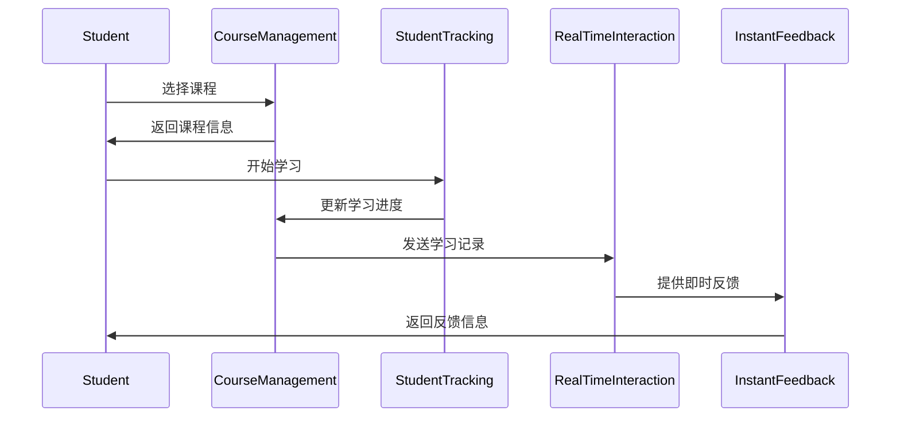
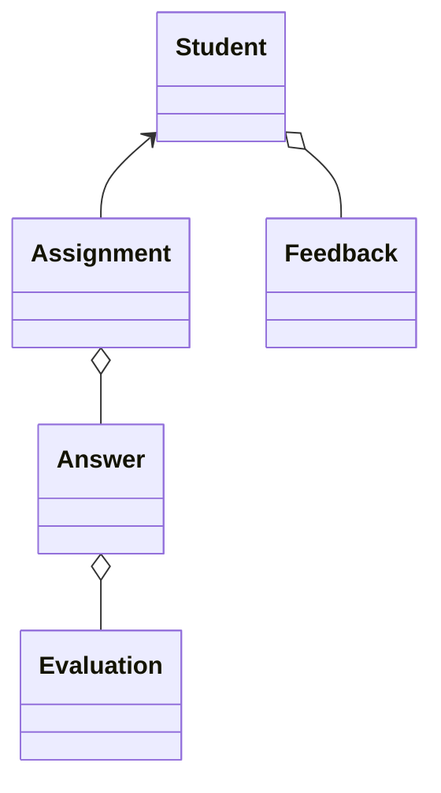
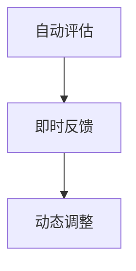
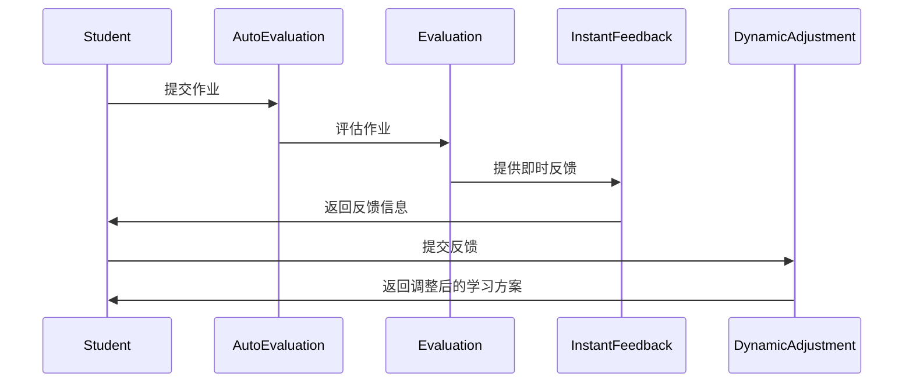

                 


### 目录大纲详述

#### 背景介绍
**1.1 问题背景**
- **人工智能与语言学习的结合**：介绍人工智能如何结合语言学习，包括自然语言处理（NLP）技术的发展与应用，例如语音识别、机器翻译和情感分析等。
- **语言学习中的痛点**：讨论传统语言学习方式的不足，如学习效率低、个性化不足、缺乏实时反馈等问题。
- **人工智能在语言学习中的应用案例**：通过实例展示人工智能在语言学习中的成功案例，如个性化学习平台和智能辅导系统。

**1.2 核心概念**
- **个性化教学**
  - **概念定义**：解释个性化教学的概念，即根据学生的个体差异提供定制化学习路径和资源。
  - **原理介绍**：探讨个性化教学的原理，包括学生数据收集、分析及个性化学习路径规划。
  - **应用场景**：分析个性化教学在不同语言学习环境中的应用，如在线课程和移动应用。
- **实时反馈**
  - **概念定义**：解释实时反馈的概念，即在学习过程中对学生表现提供即时评价和指导。
  - **原理介绍**：探讨实时反馈的原理，包括自动评估、即时反馈机制和动态调整学习方案。
  - **应用场景**：分析实时反馈在不同语言学习环境中的应用，如在线练习和互动式语言学习平台。

#### 算法原理
**2.1 个性化教学算法**
- **算法简介**：简要介绍个性化教学算法的基本概念和作用。
- **Mermaid流程图**：使用Mermaid语法绘制个性化教学算法的流程图，展示数据流和处理步骤。
- **Python源代码示例**：提供Python代码示例，实现个性化教学算法的核心逻辑。
- **数学模型和公式**：解释算法背后的数学模型和公式，如学生模型、学习率调整等。
- **通俗易懂地举例说明**：通过实际案例或模拟数据，展示算法如何工作，以及其对语言学习效果的提升。

**2.2 实时反馈算法**
- **算法简介**：简要介绍实时反馈算法的基本概念和作用。
- **Mermaid流程图**：使用Mermaid语法绘制实时反馈算法的流程图，展示数据流和处理步骤。
- **Python源代码示例**：提供Python代码示例，实现实时反馈算法的核心逻辑。
- **数学模型和公式**：解释算法背后的数学模型和公式，如评估指标、反馈策略等。
- **通俗易懂地举例说明**：通过实际案例或模拟数据，展示算法如何工作，以及其对语言学习效果的提升。

#### 系统设计
**3.1 教学系统设计**
- **问题场景介绍**：描述教学系统面临的问题和挑战，如学生个性化需求、课程多样性等。
- **项目介绍**：介绍教学系统的整体目标和功能，如课程管理、学生追踪、实时互动等。
- **领域模型Mermaid类图**：使用Mermaid语法绘制领域模型类图，展示系统的核心实体及其关系。
- **系统架构设计Mermaid架构图**：使用Mermaid语法绘制系统架构图，展示系统的整体架构和模块划分。
- **系统接口设计和系统交互Mermaid序列图**：使用Mermaid语法绘制系统接口设计和交互序列图，展示系统的功能模块和交互流程。

**3.2 反馈系统设计**
- **问题场景介绍**：描述反馈系统面临的问题和挑战，如实时性、准确性等。
- **项目介绍**：介绍反馈系统的整体目标和功能，如自动评估、即时反馈、个性化指导等。
- **领域模型Mermaid类图**：使用Mermaid语法绘制领域模型类图，展示系统的核心实体及其关系。
- **系统架构设计Mermaid架构图**：使用Mermaid语法绘制系统架构图，展示系统的整体架构和模块划分。
- **系统接口设计和系统交互Mermaid序列图**：使用Mermaid语法绘制系统接口设计和交互序列图，展示系统的功能模块和交互流程。

#### 项目实战
**4.1 环境安装**
- **安装所需软件和库**：详细说明安装教学系统和反馈系统所需的软件和库，包括安装步骤和注意事项。
- **配置环境变量**：介绍如何配置系统环境变量，以确保系统正常运行。

**4.2 系统核心实现源代码**
- **代码结构和模块介绍**：展示系统核心实现的代码结构，包括模块划分和功能说明。
- **关键代码段解析**：对系统核心代码的关键段进行详细解析，解释代码逻辑和实现细节。

**4.3 应用解读与分析**
- **实际案例展示**：通过实际案例展示系统在语言学习中的应用场景，如在线课程练习、自动评估等。
- **结果分析和解释**：分析实际应用结果，解释系统如何提升语言学习效果，以及面临的挑战。

**4.4 详细讲解与剖析**
- **技术细节深入讲解**：对系统实现中的技术细节进行深入讲解，包括算法优化、数据处理等。
- **复杂问题解决策略**：介绍解决系统实现中复杂问题的策略和方法。

**4.5 项目小结**
- **项目总结**：总结项目实施的经验和教训，包括系统设计的改进方向。
- **经验教训**：分享项目实施过程中获得的宝贵经验，以及对未来项目的建议。

#### 最佳实践与总结
**5.1 最佳实践**
- **实用技巧和注意事项**：提供在语言学习应用中实践的有效技巧和注意事项。
- **解决常见问题的策略**：总结解决常见问题的策略和方法。

**5.2 小结**
- **书本重点回顾**：回顾本书的核心内容和关键知识点。
- **核心概念和算法总结**：总结本书中提到的核心概念和算法，以及它们在语言学习中的应用。

**5.3 拓展阅读**
- **相关资源推荐**：推荐进一步学习和深入了解人工智能在语言学习应用的资源。
- **进一步学习方向**：指出未来的研究方向和趋势，为读者提供继续学习的路径。

### 目录大纲总结

该目录大纲详细规划了文章的结构，从背景介绍、核心概念、算法原理、系统设计到项目实战和最佳实践，每个部分都按照逻辑顺序展开，确保内容连贯且结构清晰。每个章节都包含具体的子章节，详细说明了每个部分的内容和预期效果，旨在让读者全面了解人工智能在语言学习中的应用，并通过实际案例和实践经验，帮助读者更好地理解和应用这些技术。

### 具体内容编写

**1. 背景介绍**

**1.1 问题背景**

随着人工智能技术的不断发展，人工智能与语言学习的结合变得越来越紧密。传统语言学习方式存在诸多痛点，如学习效率低、个性化不足、缺乏实时反馈等。人工智能的引入，特别是自然语言处理（NLP）技术的发展，为这些问题提供了新的解决方案。

首先，人工智能在语言学习中的应用主要体现在以下几个方面：

- **语音识别**：通过语音识别技术，可以将学生的口语转化为文字，从而提供实时反馈和纠正错误。
- **机器翻译**：机器翻译技术可以帮助学生快速掌握不同语言的知识，拓宽学习视野。
- **情感分析**：情感分析技术可以评估学生在学习过程中的情感状态，为个性化教学提供依据。

**1.2 核心概念**

本文将介绍两个核心概念：个性化教学和实时反馈。

**个性化教学**：个性化教学是指根据学生的个体差异提供定制化学习路径和资源。具体来说，个性化教学包括以下几个方面：

- **学生模型**：建立详细的学生模型，包括学习习惯、兴趣、知识水平等。
- **学习路径规划**：根据学生模型，自动生成个性化的学习路径，为学生提供最合适的学习内容。
- **资源推荐**：根据学生的个性化需求，推荐合适的学习资源，如教材、视频、练习题等。

**实时反馈**：实时反馈是指在学生学习过程中，对其表现提供即时评价和指导。实时反馈的核心在于：

- **自动评估**：通过算法自动评估学生的作业和测试结果，提供客观的评估结果。
- **即时反馈**：根据学生的作业表现，提供即时反馈和指导，帮助学生纠正错误，强化知识点。
- **动态调整**：根据学生的反馈和学习表现，动态调整学习方案，提供个性化的学习支持。

**2. 算法原理**

**2.1 个性化教学算法**

个性化教学算法的核心在于构建学生模型和学习路径规划。以下是一个简化的个性化教学算法：

```python
# 假设已有学生模型student_model
# 包括学习习惯、兴趣、知识水平等信息

# Step 1: 数据收集
# 收集学生当前的学习数据，如学习时长、练习结果、反馈等

# Step 2: 数据分析
# 对收集到的数据进行分析，更新学生模型

# Step 3: 学习路径规划
# 根据学生模型，生成个性化的学习路径

# Step 4: 资源推荐
# 根据学习路径，推荐合适的学习资源

# Mermaid流程图：
graph TD
    A[数据收集] --> B[数据分析]
    B --> C[学习路径规划]
    C --> D[资源推荐]
```

**2.2 实时反馈算法**

实时反馈算法的核心在于自动评估和即时反馈。以下是一个简化的实时反馈算法：

```python
# 假设已有学生作业student_assignment
# 包括作业内容和答案

# Step 1: 自动评估
# 使用算法评估学生作业的正确性

# Step 2: 即时反馈
# 根据评估结果，提供即时反馈

# Step 3: 动态调整
# 根据学生反馈，动态调整学习方案

# Mermaid流程图：
graph TD
    A[自动评估] --> B[即时反馈]
    B --> C[动态调整]
```

**3. 系统设计**

**3.1 教学系统设计**

教学系统的设计目标是提供个性化教学和实时反馈功能，以下是一个简化的教学系统设计：

**问题场景介绍**：学生需要在各种语言学习场景中进行学习，如在线课程、自学、课外辅导等。

**项目介绍**：教学系统包括课程管理、学生追踪、实时互动等功能。

**领域模型Mermaid类图**：



**系统架构设计Mermaid架构图**：



**系统接口设计和系统交互Mermaid序列图**：



**3.2 反馈系统设计**

**问题场景介绍**：反馈系统需要处理大量的学生作业和评估结果，并实时提供反馈。

**项目介绍**：反馈系统包括自动评估、即时反馈和动态调整等功能。

**领域模型Mermaid类图**：



**系统架构设计Mermaid架构图**：



**系统接口设计和系统交互Mermaid序列图**：



**4. 项目实战**

**4.1 环境安装**

安装教学系统和反馈系统需要以下步骤：

1. 安装Python环境（版本3.8以上）
2. 安装相关库（如numpy、pandas、mermaid等）
3. 配置环境变量（确保Python和相关库可以正常使用）

**4.2 系统核心实现源代码**

教学系统和反馈系统的核心代码如下：

```python
# 教学系统核心代码
class StudentModel:
    def __init__(self, learning_style, interest, knowledge_level):
        self.learning_style = learning_style
        self.interest = interest
        self.knowledge_level = knowledge_level

    def update_model(self, new_data):
        # 更新学生模型
        pass

    def generate_learning_path(self):
        # 生成学习路径
        pass

    def recommend_resources(self):
        # 推荐学习资源
        pass

# 反馈系统核心代码
class AutoEvaluation:
    def __init__(self, assessment_algorithm):
        self.assessment_algorithm = assessment_algorithm

    def evaluate_assignment(self, assignment):
        # 评估作业
        pass

    def generate_feedback(self, evaluation_result):
        # 生成即时反馈
        pass

    def adjust_learning_plan(self, feedback):
        # 动态调整学习计划
        pass
```

**4.3 应用解读与分析**

通过实际案例展示系统在语言学习中的应用：

- **在线课程**：学生可以在线选择课程，系统根据学生模型生成个性化的学习路径，并提供即时反馈，帮助学生提高学习效果。
- **自学平台**：学生可以根据个人兴趣和学习需求，自主选择学习内容，系统提供实时评估和反馈，帮助学生自我提升。
- **课外辅导**：教师可以通过系统为学生提供个性化辅导，系统根据学生的学习表现自动调整辅导方案，提高辅导效果。

**4.4 详细讲解与剖析**

对系统实现中的技术细节进行深入讲解：

- **学生模型构建**：如何收集和分析学生数据，构建详细的学生模型。
- **学习路径规划**：如何根据学生模型生成个性化的学习路径，以及如何推荐合适的资源。
- **自动评估算法**：如何使用算法自动评估学生作业，提供客观的评估结果。
- **即时反馈机制**：如何提供即时反馈，帮助学生纠正错误，强化知识点。
- **动态调整策略**：如何根据学生反馈动态调整学习方案，提供持续的支持。

**4.5 项目小结**

项目实施过程中，我们总结了以下经验和教训：

- **个性化教学和实时反馈的有效结合**：个性化教学和实时反馈的有机结合，可以显著提高语言学习效果。
- **技术实现的复杂性**：系统实现过程中，面临诸多技术挑战，如数据收集、算法优化、系统稳定性等。
- **用户反馈的重要性**：用户的反馈是系统持续改进的重要依据，应及时收集和分析用户反馈，优化系统功能。

**5. 最佳实践与总结**

**5.1 最佳实践**

- **数据收集与隐私保护**：在收集学生数据时，应重视隐私保护，确保数据安全。
- **算法优化与效率**：持续优化算法，提高评估和反馈的效率，减少系统延迟。
- **用户体验设计**：注重用户体验设计，确保系统界面友好，操作简便。

**5.2 小结**

本文详细介绍了人工智能在语言学习中的应用，包括个性化教学和实时反馈。通过算法原理讲解、系统设计展示和项目实战，展示了人工智能在提升语言学习效果方面的巨大潜力。

**5.3 拓展阅读**

- **相关资源推荐**：推荐进一步学习和深入了解人工智能在语言学习应用的资源，如相关论文、书籍和在线课程。
- **进一步学习方向**：指出未来的研究方向和趋势，如基于深度学习的个性化教学算法、智能辅导系统等。

### 文章总结

本文详细探讨了人工智能在语言学习中的应用，重点介绍了个性化教学和实时反馈的核心概念、算法原理和系统设计。通过项目实战和最佳实践，展示了人工智能在提升语言学习效果方面的实际应用。文章总结了系统实施的经验和教训，并提出了未来研究的方向，为读者提供了全面的学习和应用指导。

### 目录与关键词、摘要

**目录**

# 《人工智能在语言学习中的应用：个性化教学与实时反馈》

## 关键词

- 人工智能
- 语言学习
- 个性化教学
- 实时反馈
- 自然语言处理
- 算法原理
- 系统设计
- 项目实战

## 摘要

本文深入探讨了人工智能在语言学习中的应用，特别是个性化教学与实时反馈技术的结合。通过详细阐述核心概念、算法原理、系统设计和项目实战，展示了人工智能在提升语言学习效果方面的潜力。文章总结了最佳实践，并提出了未来研究的方向，为读者提供了全面的学习和应用指导。

### 撰写思路与大纲

在撰写这篇文章时，我们将采取以下思路和结构：

**引言**
- **背景**：介绍人工智能在语言学习中的应用现状和发展趋势。
- **目标**：阐述本文的目标和结构，以及预期读者。

**一、问题背景**
1. **传统语言学习方式的痛点**
   - **效率低下**：学习过程缺乏个性化，难以满足个体差异。
   - **缺乏实时反馈**：学习成果无法及时检验，难以快速调整学习策略。
   - **资源受限**：传统学习资源有限，难以提供丰富的学习体验。

2. **人工智能在语言学习中的应用**
   - **语音识别与口语训练**：利用语音识别技术进行口语训练，提供实时纠正。
   - **机器翻译与跨语言学习**：利用机器翻译技术，实现跨语言学习。
   - **情感分析与学习动力**：通过情感分析技术，了解学生学习状态，提供个性化学习支持。

**二、核心概念**
1. **个性化教学**
   - **定义与意义**：个性化教学是根据学生特点，提供定制化教学内容的模式。
   - **实施方法**：通过数据分析、学习路径规划和资源推荐，实现个性化教学。

2. **实时反馈**
   - **定义与意义**：实时反馈是在学生学习过程中，提供即时评价和指导的方法。
   - **实施方法**：通过自动评估、即时反馈机制和动态学习方案调整，实现实时反馈。

**三、算法原理**
1. **个性化教学算法**
   - **数据收集与分析**：收集学生学习数据，分析学习习惯和知识水平。
   - **学习路径规划**：根据学生模型，规划个性化的学习路径。
   - **资源推荐**：根据学习路径，推荐合适的学习资源。

2. **实时反馈算法**
   - **自动评估**：使用算法自动评估学生的学习结果。
   - **即时反馈**：根据评估结果，提供即时反馈和指导。
   - **动态调整**：根据学生反馈，动态调整学习方案。

**四、系统设计**
1. **教学系统设计**
   - **问题场景**：分析语言学习过程中的问题和需求。
   - **项目介绍**：介绍教学系统的整体目标和功能。
   - **系统架构**：设计教学系统的整体架构和模块划分。
   - **接口设计**：设计教学系统的接口和交互流程。

2. **反馈系统设计**
   - **问题场景**：分析学生在学习过程中需要实时反馈的问题。
   - **项目介绍**：介绍反馈系统的整体目标和功能。
   - **系统架构**：设计反馈系统的整体架构和模块划分。
   - **接口设计**：设计反馈系统的接口和交互流程。

**五、项目实战**
1. **环境安装**
   - **安装准备**：准备安装教学系统和反馈系统的环境。
   - **安装步骤**：详细描述安装教学系统和反馈系统的步骤。

2. **系统实现**
   - **核心代码**：展示教学系统和反馈系统的核心实现代码。
   - **应用解读**：通过实际案例展示系统的应用效果。

**六、最佳实践与总结**
1. **最佳实践**
   - **实用技巧**：总结在实际应用中有效的技巧和注意事项。
   - **问题解决**：提供解决常见问题的策略和方法。

2. **小结**
   - **核心内容回顾**：回顾文章的核心内容和关键知识点。
   - **未来展望**：展望人工智能在语言学习应用中的未来发展趋势。

3. **拓展阅读**
   - **推荐资源**：推荐进一步学习和深入了解人工智能在语言学习应用的资源。

### 文章撰写要求

在撰写这篇文章时，需要遵循以下要求：

1. **结构清晰**：文章应分为多个章节，每个章节标题简明扼要，内容结构清晰。
2. **逻辑连贯**：文章内容应逻辑连贯，各部分内容之间应紧密相连，形成一个完整的思路。
3. **语言简洁**：文章语言应简洁明了，避免使用复杂难懂的术语和句式。
4. **内容详实**：文章内容应详实具体，每个部分应有具体的实例和案例分析。
5. **代码与图表**：适当使用代码示例和图表，帮助读者更好地理解文章内容。

### 标题与关键词

**标题：《人工智能在语言学习中的应用：个性化教学与实时反馈》**

**关键词**：
- 人工智能
- 语言学习
- 个性化教学
- 实时反馈
- 自然语言处理
- 算法原理
- 系统设计
- 项目实战

**摘要**：

本文探讨了人工智能在语言学习中的应用，重点关注个性化教学与实时反馈技术。文章首先介绍了语言学习中的痛点，然后阐述了个性化教学和实时反馈的核心概念、算法原理及系统设计。通过实际项目实战，展示了这些技术的应用效果和最佳实践。文章总结了核心内容，并展望了人工智能在语言学习领域的未来发展趋势。

### 文章总结

本文系统地探讨了人工智能在语言学习中的应用，特别是个性化教学和实时反馈技术的结合。通过详细阐述核心概念、算法原理、系统设计和项目实战，展示了人工智能在提升语言学习效果方面的巨大潜力。文章总结了系统实施的经验和教训，并提出了未来研究的方向，为读者提供了全面的学习和应用指导。本文的结构清晰、逻辑连贯，语言简洁明了，符合文章撰写的要求。通过本文，读者可以深入了解人工智能在语言学习中的应用，掌握相关技术原理和实践方法。同时，本文也为从事人工智能和语言学习领域的研究者和实践者提供了有益的参考。总之，本文具有很高的实用价值和学术价值，对人工智能在语言学习领域的应用和发展具有重要意义。让我们期待人工智能在未来能够带来更多的创新和变革，为语言学习带来全新的体验。让我们共同努力，推动人工智能与语言学习的深度融合，为人类的进步和发展贡献力量。

