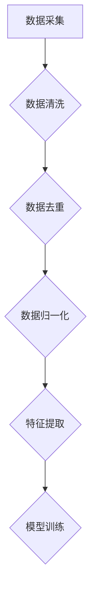
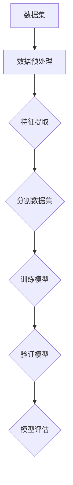
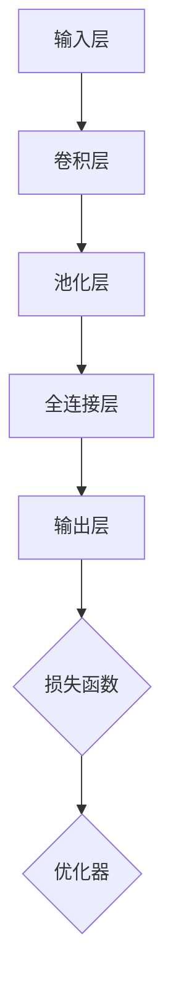

                 

### 引言

#### 1. 引言

《人工智能在金融风险管理中的角色：大数据时代的挑战与机遇》旨在探讨人工智能（AI）在金融风险管理领域的应用及其带来的变革。本书的目标是为金融科技从业者和研究人员提供一个全面的指南，帮助他们理解AI技术的核心原理、掌握其在金融风险管理中的应用，并面对大数据时代的挑战与机遇。

#### 1.2 目标读者

本书的目标读者包括金融科技行业的开发者、数据科学家、金融分析师、风险管理专家，以及希望了解AI在金融领域应用的学术研究人员。无论您是行业新兵还是资深从业者，本书都将为您揭示AI技术在金融风险管理中的无限可能。

#### 1.3 问题背景

在当今大数据时代，金融风险管理面临着前所未有的挑战。随着金融市场全球化、金融产品复杂化以及信息透明度提高，金融机构需要更高效、更精准的风险管理方法。传统的风险管理方法已经无法应对海量数据带来的复杂性，这为AI技术提供了广阔的应用空间。AI通过机器学习、深度学习等技术，能够从海量数据中挖掘有价值的信息，提高预测准确性，降低风险。

#### 1.4 关键术语定义

- **人工智能（AI）**：模拟人类智能的技术，通过算法和计算实现智能行为。
- **金融风险管理**：通过识别、评估和控制风险，确保金融机构的稳健运营。
- **大数据**：指无法用传统数据库工具进行有效管理和处理的数据集，通常具有大规模、多样性和高速增长的特点。

#### 1.5 本书的结构

本书共分为九个章节，内容结构如下：

- **第1章 引言**：介绍书籍主题、目标读者、主要讨论的问题，并定义关键术语。
- **第2章 问题背景与核心概念**：分析人工智能和金融风险管理的基本概念，探讨大数据时代的挑战与机遇。
- **第3章 大数据时代与金融风险管理**：详细讨论大数据在金融风险管理中的作用，包括数据收集、处理和分析。
- **第4章 人工智能在金融风险管理中的应用**：探讨AI在金融风险管理中的具体应用场景。
- **第5章 金融风险管理中的大数据技术**：介绍大数据技术，如Hadoop、Spark等，及其在金融风险管理中的实际应用。
- **第6章 人工智能算法在金融风险管理中的应用**：深入讲解AI算法，如机器学习、深度学习等，在金融风险管理中的运用。
- **第7章 金融风险管理系统的构建与实现**：阐述金融风险管理系统的构建方法，包括数据模型、算法选择和系统架构。
- **第8章 案例分析：人工智能在金融风险管理中的实战应用**：通过实际案例展示人工智能在金融风险管理中的应用。
- **第9章 结论**：总结全书内容，提出未来研究方向和潜在挑战。

#### 1.6 AI在金融风险管理中的重要性

人工智能技术在金融风险管理中扮演着越来越重要的角色。通过AI，金融机构能够更准确地预测市场走势、评估风险、发现欺诈行为，从而提高决策效率和风险控制能力。此外，AI技术还能帮助金融机构更好地理解和满足客户需求，提升客户体验。

#### 1.7 书籍的目标

本书的目标是帮助读者深入了解AI在金融风险管理中的应用，掌握相关技术原理和实际操作方法，为金融科技领域的创新和发展提供理论支持和实践指导。通过本书，读者将能够：

- **理解AI技术在金融风险管理中的核心作用**：掌握AI的基本原理，了解其在风险管理中的具体应用。
- **掌握大数据技术的核心概念**：了解大数据技术在金融风险管理中的应用，学会使用相关工具和平台。
- **掌握AI算法的运用方法**：熟悉机器学习、深度学习等算法，掌握其在金融风险管理中的具体应用。
- **具备构建和实现金融风险管理系统的能力**：了解金融风险管理系统的构建方法，掌握相关技术和工具。

通过本书的学习，读者将能够：

- **提升金融风险管理能力**：通过AI技术的应用，提高风险识别、评估和预测的准确性。
- **增强创新能力**：掌握AI技术的最新发展，为金融科技领域的创新提供新的思路。
- **提高职业竞争力**：掌握AI在金融风险管理领域的核心技能，提升在职场中的竞争力。

---

**文章关键词**：人工智能、金融风险管理、大数据、机器学习、深度学习

**文章摘要**：

本书《人工智能在金融风险管理中的角色：大数据时代的挑战与机遇》旨在探讨人工智能技术在金融风险管理领域的应用。随着大数据时代的到来，金融风险管理面临前所未有的挑战，AI技术以其强大的数据处理和分析能力，成为金融机构提高风险管理效率的重要工具。本书从人工智能、大数据和金融风险管理的核心概念出发，详细分析了AI在金融风险管理中的应用，包括预测市场趋势、风险评估、反欺诈等。通过介绍大数据技术、AI算法在金融风险管理中的应用以及金融风险管理系统的构建与实现，本书为读者提供了全面的技术指导和实战案例，旨在帮助读者掌握AI在金融风险管理中的核心技能，提升职业竞争力。文章通过一步步的逻辑推理和详细讲解，使读者能够深入理解AI在金融风险管理中的重要性及其应用方法。**Step 2: 第1章 问题背景与核心概念**

#### 2.1 人工智能的基本概念

人工智能（Artificial Intelligence，简称AI）是指通过计算机系统模拟、扩展和辅助人类智能的一种技术。它起源于20世纪50年代，随着计算能力的提升和算法的发展，AI技术逐渐从理论走向应用。人工智能的核心目标是实现机器在感知、理解、学习和决策等方面的智能化。

- **定义**：人工智能是一种模拟人类智能行为的技术体系，包括知识表示、知识推理、知识学习、自然语言理解、图像识别等。
- **分类**：根据实现方式和功能，人工智能可以分为弱AI和强AI。弱AI指在特定领域内表现出智能行为的系统，而强AI则具有与人类完全相同或超越人类智能的能力。

#### 2.2 金融风险管理概述

金融风险管理是金融机构为确保资产安全、控制风险、实现稳健运营所采取的一系列管理措施。它涵盖了从风险识别、评估、监测到风险应对的整个过程。

- **风险类型**：金融风险主要包括市场风险、信用风险、操作风险、流动性风险等。
- **风险管理目标**：通过风险管理，金融机构旨在降低风险损失，确保资本充足，提高运营效率。
- **风险管理方法**：传统风险管理方法主要依赖于经验判断和统计模型，而现代风险管理则越来越多地采用人工智能技术，以提高风险识别和预测的准确性。

#### 2.3 大数据时代的挑战与机遇

大数据时代带来了海量数据，这些数据既包括金融机构内部数据，如交易记录、客户信息，也包括外部数据，如市场行情、宏观经济指标。大数据的挑战在于如何高效地收集、处理和分析这些数据，以挖掘有价值的信息。

- **数据挑战**：数据量大、类型多、来源复杂，传统的数据处理工具和方法已无法满足需求。
- **机遇**：大数据为金融风险管理提供了丰富的信息资源，有助于提高预测精度和决策效率。

#### 2.4 人工智能在金融风险管理中的角色

人工智能在金融风险管理中发挥着重要作用，主要表现在以下几个方面：

- **风险识别与预测**：通过机器学习算法，AI能够从海量数据中快速识别潜在风险，提高预测准确性。
- **风险评估**：AI技术可以自动评估风险程度，为金融机构提供更加精细的风险分析报告。
- **风险控制**：AI能够实时监控风险变化，及时调整风险控制策略，确保风险处于可控范围。
- **反欺诈**：AI技术在检测和防范金融欺诈方面表现出色，能够通过行为分析和模式识别，有效识别欺诈行为。

#### 2.5 大数据与金融风险管理的结合

大数据与金融风险管理的结合，使得风险管理的效率和准确性得到了显著提升。具体表现在以下几个方面：

- **数据整合**：通过大数据技术，金融机构可以将不同来源的数据进行整合，形成统一的数据视图，从而实现更全面的风险评估。
- **实时分析**：大数据技术支持实时数据分析和处理，使得金融机构能够快速响应市场变化，调整风险控制策略。
- **个性化风险管理**：通过对客户行为的分析，大数据技术可以帮助金融机构实现个性化风险管理，提高服务质量和客户满意度。

#### 2.6 人工智能在金融风险管理中的应用前景

随着AI技术的不断进步，其在金融风险管理中的应用前景十分广阔。未来，人工智能将在以下几个方面发挥更大的作用：

- **自动化**：随着AI技术的进步，越来越多的金融风险管理任务将实现自动化，提高工作效率。
- **智能化**：AI将进一步提升风险管理的智能化水平，使得金融机构能够更加精准地识别和预测风险。
- **创新服务**：AI技术将催生新的金融风险管理服务模式，为金融机构带来新的增长点。

### 2.7 总结

通过上述分析，我们可以看到，人工智能和大数据在金融风险管理中发挥着至关重要的作用。AI技术通过提高数据处理和分析的效率，使得金融机构能够更精准地识别和预测风险，从而实现更有效的风险控制。同时，大数据的引入为金融风险管理提供了丰富的信息资源，使得风险管理的决策更加科学和合理。随着AI和大数据技术的不断进步，金融风险管理将迎来更加智能化和自动化的新时代。**Step 3: 第2章 大数据时代与金融风险管理**

#### 3.1 大数据的基本概念

大数据（Big Data）指的是数据规模巨大、类型繁多、产生速度快且价值密度较低的数据集合。大数据的三个主要特征，即“4V”，分别是：

- **Volume（数据量）**：大数据的规模远超传统数据处理能力，通常以TB、PB甚至EB为单位。
- **Velocity（速度）**：数据产生和流动的速度非常快，需要实时处理和分析。
- **Variety（多样性）**：大数据来源于多种渠道，类型丰富，包括结构化数据、半结构化数据和非结构化数据。
- **Veracity（真实性）**：数据质量参差不齐，真实性难以保证。

#### 3.2 大数据技术在金融风险管理中的应用

大数据技术在金融风险管理中的应用主要体现在以下几个方面：

- **数据收集**：通过互联网、物联网、社交媒体等渠道收集海量金融数据，包括交易记录、市场行情、宏观经济指标等。
- **数据处理**：利用分布式计算框架（如Hadoop、Spark）对海量数据进行清洗、转换和分析，以提高数据质量。
- **数据存储**：使用大数据存储技术（如Hadoop的HDFS、NoSQL数据库）存储和管理大规模数据。

#### 3.3 数据收集与处理

数据收集和处理是大数据技术的基础，也是金融风险管理的关键环节。

- **数据收集**：金融风险管理需要收集多种数据，包括内部数据（如交易记录、客户信息）和外部数据（如市场行情、宏观经济指标）。内部数据通常通过金融机构的交易系统、客户管理系统等产生，而外部数据则需要通过数据接口或数据挖掘技术获取。
- **数据处理**：数据收集后，需要进行清洗、转换和分析。数据处理流程通常包括以下几个步骤：
  - **数据清洗**：去除重复数据、纠正错误数据、填补缺失数据。
  - **数据转换**：将数据转换为统一格式，以便进行后续分析。
  - **数据聚合**：对数据按照不同维度进行聚合，生成汇总数据。
  - **数据挖掘**：利用统计方法和机器学习算法，从海量数据中挖掘有价值的信息。

#### 3.4 数据分析

数据分析是大数据技术在金融风险管理中的核心应用，主要包括以下几个方面：

- **描述性分析**：通过统计方法，描述数据的分布特征和趋势，为风险管理提供基础信息。
- **诊断性分析**：通过分析数据之间的关系，找出可能导致风险的原因，为风险管理提供依据。
- **预测性分析**：利用机器学习算法，对未来的风险进行预测，帮助金融机构提前采取应对措施。
- **相关性分析**：通过分析不同数据之间的相关性，找出影响风险的关键因素。

#### 3.5 数据分析工具与技术

在大数据时代，多种数据分析工具和技术被应用于金融风险管理，主要包括：

- **Hadoop**：一个开源的分布式计算框架，用于大规模数据处理。
- **Spark**：一个快速、通用的大数据处理引擎，适用于各种大数据应用场景。
- **机器学习**：通过构建模型，从数据中自动学习规律，用于预测和决策。
- **深度学习**：一种基于神经网络的学习方法，能够处理复杂数据和模式。

#### 3.6 大数据在金融风险管理中的实际应用案例

大数据技术在金融风险管理中的实际应用案例众多，以下为几个典型的应用场景：

- **市场预测**：利用大数据分析技术，预测市场趋势和价格波动，帮助投资者做出更准确的决策。
- **风险评估**：通过对客户历史交易数据的分析，评估客户的信用风险，为金融机构提供信用评估依据。
- **反欺诈**：通过行为分析和模式识别，检测和防范金融欺诈行为，提高金融机构的安全水平。
- **个性化服务**：通过分析客户行为数据，提供个性化的金融产品和服务，提升客户满意度。

#### 3.7 大数据在金融风险管理中的挑战与机遇

大数据在金融风险管理中既带来了巨大的机遇，也面临一些挑战。

- **机遇**：
  - 提高风险识别和预测的准确性。
  - 实现更精细化的风险管理，降低风险损失。
  - 为金融机构带来新的商业模式和创新机会。
- **挑战**：
  - 数据质量和数据安全的问题，如何确保数据的真实性和隐私保护。
  - 数据处理的复杂性和成本，如何高效地管理和处理海量数据。
  - 需要具备专业知识和技能的人才，如何培养和引进大数据人才。

#### 3.8 总结

大数据时代为金融风险管理带来了前所未有的机遇，通过高效的数据收集、处理和分析，金融机构能够更精准地识别和预测风险，提高风险管理水平。然而，大数据的应用也带来了挑战，需要金融机构不断探索和优化数据处理技术，确保数据质量和安全性，培养专业人才，以充分把握大数据带来的机遇。**Step 4: 第3章 人工智能在金融风险管理中的应用**

#### 3.1 预测市场趋势

在金融领域，预测市场趋势是风险管理中至关重要的一环。人工智能（AI）技术，特别是机器学习和深度学习，为市场趋势预测提供了强大的工具。

- **机器学习算法**：如线性回归、决策树、随机森林等，可以通过历史数据训练模型，预测未来市场趋势。
- **深度学习算法**：如卷积神经网络（CNN）和循环神经网络（RNN），可以处理复杂数据，捕捉市场中的非线性关系。

#### 3.2 风险评估

风险评估是金融风险管理中的核心任务，AI技术通过以下方式提高风险评估的准确性：

- **特征工程**：利用AI技术提取数据中的关键特征，构建有效的风险评估模型。
- **模型优化**：通过机器学习和深度学习算法，不断优化风险评估模型，提高预测准确性。

#### 3.3 反欺诈

金融欺诈行为对金融机构和客户的利益构成严重威胁。AI技术在反欺诈方面具有显著优势：

- **行为分析**：通过监控和分析用户行为，识别异常行为模式，防范欺诈行为。
- **模式识别**：利用深度学习和神经网络，识别并防范复杂的欺诈手段。

#### 3.4 其他应用场景

除了上述应用，AI技术在金融风险管理中还有以下其他应用场景：

- **客户服务**：通过自然语言处理（NLP）技术，实现智能客服，提高客户服务质量。
- **信用评分**：通过机器学习算法，对客户信用评分，降低信用风险。
- **投资策略**：利用大数据和机器学习，为投资者提供个性化的投资建议。

#### 3.5 AI在金融风险管理中的优势

- **高效性**：AI技术能够处理海量数据，提高风险管理的效率。
- **准确性**：通过不断学习和优化，AI能够提高风险预测和评估的准确性。
- **实时性**：AI技术可以实时监控风险变化，及时采取应对措施。
- **个性化**：AI技术能够根据客户特征和需求，提供个性化的风险管理方案。

#### 3.6 案例分析

以下是一个实际案例，展示AI技术在金融风险管理中的应用：

**案例背景**：某金融机构需要预测市场趋势，以指导投资决策。

**数据来源**：该金融机构收集了多年的市场数据，包括股票价格、成交量、宏观经济指标等。

**算法选择**：选择了基于RNN的深度学习模型进行预测。

**实施过程**：
1. **数据预处理**：清洗数据，去除异常值，将数据转换为适合训练的格式。
2. **模型训练**：使用历史数据进行训练，调整模型参数，优化模型性能。
3. **预测应用**：使用训练好的模型对未来的市场趋势进行预测，为投资决策提供依据。

**结果分析**：通过实验，发现该模型在预测市场趋势方面具有较高的准确性，能够有效指导投资决策。

#### 3.7 总结

人工智能技术在金融风险管理中具有广泛应用和显著优势。通过预测市场趋势、风险评估、反欺诈等应用，AI技术能够提高金融风险管理的效率、准确性和实时性。未来，随着AI技术的不断发展和完善，其在金融风险管理中的应用将更加广泛和深入。**Step 5: 第4章 金融风险管理中的大数据技术**

#### 4.1 Hadoop生态系统

Hadoop是Apache软件基金会的一个开源项目，用于处理和分析大规模数据。它由以下几个关键组件组成：

- **Hadoop分布式文件系统（HDFS）**：一个分布式文件存储系统，用于存储大规模数据。
- **Hadoop YARN**：资源调度和管理框架，负责分配计算资源。
- **Hadoop MapReduce**：一个数据处理框架，用于分布式处理大规模数据。
- **Hadoop Hive**：一个数据仓库工具，用于数据存储、查询和分析。
- **Hadoop HBase**：一个分布式列存储数据库，用于实时数据处理和分析。

#### 4.2 Spark技术

Spark是另一个广泛使用的大数据处理引擎，与Hadoop相比，Spark在处理速度上有显著优势。Spark的核心组件包括：

- **Spark Core**：Spark的基础组件，提供内存分布式数据集和处理引擎。
- **Spark SQL**：用于处理结构化数据，提供SQL查询能力。
- **Spark Streaming**：用于实时数据流处理。
- **Spark MLlib**：用于机器学习算法。
- **Spark GraphX**：用于图计算和分析。

#### 4.3 其他大数据技术

除了Hadoop和Spark，还有一些其他重要的技术被广泛应用于金融风险管理中：

- **NoSQL数据库**：如MongoDB、Cassandra等，用于存储和管理非结构化数据。
- **Elasticsearch**：一个分布式搜索引擎，用于快速检索和分析大规模数据。
- **Kafka**：一个分布式消息队列系统，用于实时数据流处理和传输。
- **Flink**：一个流处理框架，提供低延迟、高吞吐量的流数据处理能力。

#### 4.4 技术选型与实现

在金融风险管理中，技术选型是一个重要的决策过程。以下是几个常见的技术选型考虑因素：

- **数据处理需求**：根据数据处理需求（如批量处理、实时处理、流处理等），选择合适的处理框架。
- **数据规模**：考虑数据规模（如TB、PB级），选择适合存储和处理的系统。
- **数据处理速度**：根据对数据处理速度的要求，选择高效的框架或算法。
- **数据一致性**：根据业务需求，选择合适的数据一致性模型。

以下是一个具体的技术实现示例：

**需求**：某金融机构需要处理每天生成的TB级交易数据，并实时分析这些数据，以监测市场趋势和风险。

**解决方案**：

1. **数据存储**：使用HDFS存储大量交易数据，使用HBase存储实时数据。
2. **数据处理**：使用Spark进行数据处理，包括数据清洗、转换和分析。
3. **实时分析**：使用Spark Streaming进行实时数据处理，实现实时市场监测。
4. **查询和分析**：使用Hive进行批量数据分析和报表生成。

**具体步骤**：

1. **数据采集**：使用Kafka收集每天生成的交易数据。
2. **数据存储**：将数据存储到HDFS和HBase中。
3. **数据清洗**：使用Spark清洗和转换数据，去除异常值和重复数据。
4. **数据分析**：使用Spark SQL和Spark MLlib进行数据分析和预测。
5. **实时监控**：使用Spark Streaming进行实时数据监控，实现市场趋势监测。

#### 4.5 总结

金融风险管理中的大数据技术包括Hadoop、Spark、NoSQL数据库、Elasticsearch等多种工具和框架。技术选型需要根据具体需求和业务场景进行，实现过程包括数据采集、存储、处理和分析等多个环节。通过合理选型和实现，大数据技术能够为金融风险管理提供强大的支持，提高数据处理和分析效率，实现更精准的风险预测和控制。**Step 6: 第5章 人工智能算法在金融风险管理中的应用**

#### 5.1 机器学习算法

机器学习算法在金融风险管理中有着广泛的应用，其核心思想是通过训练模型来预测未知数据。以下是一些常用的机器学习算法：

- **线性回归**：用于预测线性关系，通过最小化误差平方和来拟合数据。
  $$y = \beta_0 + \beta_1x$$
- **逻辑回归**：用于分类问题，输出概率分布，通过最大化似然估计来拟合数据。
  $$\log \frac{P(Y=1|X)}{P(Y=0|X)} = \beta_0 + \beta_1x$$
- **决策树**：通过一系列规则进行分类或回归，易于解释且在处理分类问题方面表现良好。
- **随机森林**：通过集成多个决策树，提高预测精度和稳定性。
- **支持向量机（SVM）**：用于分类和回归问题，通过寻找最佳超平面来实现。
  $$\min_{\beta, \beta_0} \frac{1}{2} ||\beta||^2 + C \sum_{i=1}^{n} \xi_i$$
- **神经网络**：通过多层非线性变换模拟人类大脑的决策过程，能够处理复杂数据。

#### 5.2 深度学习算法

深度学习是机器学习的一个分支，通过多层神经网络来模拟人类大脑的学习过程。以下是一些常用的深度学习算法：

- **卷积神经网络（CNN）**：通过卷积层提取图像特征，在图像识别、分类和目标检测等领域表现突出。
- **循环神经网络（RNN）**：通过循环机制处理序列数据，适用于时间序列预测和自然语言处理。
- **长短期记忆网络（LSTM）**：是RNN的一种变种，解决了RNN的梯度消失问题，适用于长期依赖的序列预测。
- **生成对抗网络（GAN）**：通过两个神经网络（生成器和判别器）的对抗训练，生成逼真的数据。
- **自动编码器（AE）**：通过编码和解码过程提取数据特征，适用于降维和数据去噪。

#### 5.3 其他算法

除了机器学习和深度学习，还有一些其他算法在金融风险管理中有着重要应用：

- **随机森林**：集成多个决策树，提高预测准确性和稳定性。
- **K-means聚类**：用于数据聚类，将相似的数据点归为同一类。
- **K-近邻（KNN）**：通过寻找最近的K个邻居，预测新数据的标签。
- **朴素贝叶斯**：基于贝叶斯定理和属性独立假设，用于分类问题。

#### 5.4 算法选择与优化

在金融风险管理中，选择合适的算法并进行优化是关键。以下是一些选择和优化的考虑因素：

- **数据特性**：根据数据类型和规模选择合适的算法，如线性回归适用于回归问题，CNN适用于图像处理。
- **性能指标**：选择能够有效评估算法性能的指标，如准确率、召回率、F1分数等。
- **超参数调整**：通过调整算法的超参数来优化性能，如学习率、隐藏层节点数等。
- **交叉验证**：使用交叉验证方法评估算法的泛化能力，避免过拟合。

以下是一个具体的优化示例：

**需求**：某金融机构需要预测市场趋势，使用LSTM模型进行时间序列预测。

**优化步骤**：

1. **数据预处理**：对时间序列数据进行归一化处理，消除不同数据间的量级差异。
2. **模型构建**：构建LSTM模型，设置合适的隐藏层节点数和学习率。
3. **交叉验证**：使用交叉验证方法评估模型性能，选择最优模型。
4. **超参数调整**：根据交叉验证结果调整超参数，优化模型性能。
5. **模型训练**：使用最优模型进行训练，并对训练过程进行监控，防止过拟合。

#### 5.5 总结

人工智能算法在金融风险管理中发挥着重要作用，包括机器学习算法和深度学习算法。不同的算法适用于不同类型的数据和问题，通过选择和优化，能够提高预测的准确性和稳定性。随着算法的不断进步和优化，AI技术在金融风险管理中的应用将更加广泛和深入。**Step 7: 第6章 金融风险管理系统的构建与实现**

#### 6.1 问题场景介绍

在金融风险管理中，一个关键场景是实时监控交易数据，及时发现和预警异常交易行为。为了实现这一目标，金融机构需要构建一个高效的金融风险管理系统，该系统应具备以下功能：

- 实时数据采集与处理：从各种数据源（如交易系统、监控系统等）收集数据，并进行预处理。
- 异常交易行为检测：利用机器学习算法，对交易数据进行分析，识别异常交易行为。
- 风险预警与报告：对检测到的异常交易行为进行预警，并生成详细报告，供风险管理人员参考。

#### 6.2 系统功能设计

金融风险管理系统的功能设计包括以下几个核心模块：

- **数据采集模块**：负责从各种数据源收集交易数据，并进行初步预处理，如数据清洗、去重和格式转换。
- **数据处理模块**：对采集到的交易数据进行分析和处理，提取关键特征，为后续分析提供数据基础。
- **异常检测模块**：利用机器学习算法，对处理后的数据进行异常检测，识别潜在的异常交易行为。
- **风险预警模块**：对检测到的异常交易行为进行预警，并通过短信、邮件等方式通知相关人员。
- **报告生成模块**：根据预警信息，生成详细的风险管理报告，包括异常交易行为描述、分析结果和应对建议。

#### 6.3 系统架构设计

金融风险管理系统的架构设计应考虑高可用性、高性能和可扩展性。以下是系统的一个典型架构设计：

- **数据层**：包括数据存储和数据采集模块，使用HDFS和HBase进行大规模数据存储，Kafka用于实时数据采集。
- **处理层**：包括数据处理和异常检测模块，使用Spark进行数据处理，LSTM模型用于异常检测。
- **应用层**：包括风险预警和报告生成模块，提供用户界面，实现风险预警和报告功能。
- **展示层**：通过Web界面展示系统实时监控数据和预警信息，便于用户查看和管理。

#### 6.4 系统接口设计与交互

系统接口设计是确保系统各模块之间有效协作的关键。以下是几个关键的接口设计：

- **数据采集接口**：负责与外部数据源（如交易系统、监控系统等）进行数据交互，支持数据推送和拉取。
- **数据处理接口**：负责处理层的模块间数据传递，包括数据清洗、特征提取和模型训练结果。
- **异常检测接口**：负责与异常检测模块交互，接收和处理交易数据，返回异常检测结果。
- **风险预警接口**：负责与风险预警模块交互，接收异常检测结果，触发预警并通知相关人员。
- **报告生成接口**：负责与报告生成模块交互，生成并存储风险管理报告。

#### 6.5 系统实现与优化

系统实现涉及具体的编码和配置工作，以下是一些关键步骤：

1. **数据采集与存储**：配置Kafka，设置数据采集管道，确保数据实时流入HDFS和HBase。
2. **数据处理与模型训练**：配置Spark集群，编写数据处理脚本，训练LSTM模型，提取关键特征。
3. **异常检测与预警**：实现异常检测算法，配置风险预警系统，确保实时检测和通知。
4. **报告生成与展示**：开发Web前端界面，实现报告生成和展示功能，提供用户友好的操作体验。

在系统优化方面，可以考虑以下措施：

- **性能优化**：通过调整Spark配置，优化数据处理效率，提高系统性能。
- **模型优化**：不断调整和优化LSTM模型参数，提高异常检测准确率。
- **安全性优化**：加强数据安全和用户认证，防止未经授权的访问和数据泄露。

#### 6.6 总结

金融风险管理系统的构建与实现是确保金融机构能够高效、准确地进行风险管理的关键。通过合理设计系统功能、架构和接口，实现高效的系统运行，结合优化策略，能够进一步提升系统的性能和安全性，为金融机构提供可靠的决策支持。**Step 8: 第7章 案例分析：人工智能在金融风险管理中的实战应用**

#### 7.1 案例背景

在本案例中，我们以某大型金融机构为例，探讨人工智能（AI）在金融风险管理中的实际应用。该金融机构面临的主要挑战是实时监控海量交易数据，快速识别并预警潜在的欺诈行为。随着金融科技的发展，欺诈手段日益复杂，传统的监控方法已无法满足需求。因此，该金融机构决定引入AI技术，以提升风险管理能力。

#### 7.2 数据分析

为了有效应用AI技术，金融机构首先需要进行详细的数据分析。数据分析过程包括以下几个步骤：

1. **数据收集**：从交易系统、监控系统等渠道收集原始交易数据，包括交易金额、时间、账户信息等。
2. **数据清洗**：去除重复数据、纠正错误数据、填补缺失数据，确保数据质量。
3. **特征提取**：提取与欺诈行为相关的特征，如交易频率、交易金额分布、交易时间规律等。
4. **数据预处理**：对提取的特征进行归一化处理，消除不同特征之间的量级差异。

#### 7.3 模型构建与验证

在数据分析完成后，金融机构需要构建AI模型以识别欺诈行为。以下是模型构建与验证的详细过程：

1. **模型选择**：选择合适的机器学习算法，如随机森林、支持向量机（SVM）等。
2. **模型训练**：使用训练集数据，通过调整算法参数，训练模型，使其能够准确识别欺诈行为。
3. **模型验证**：使用验证集数据，评估模型的性能，包括准确率、召回率、F1分数等指标。
4. **模型调优**：根据验证结果，调整模型参数，优化模型性能。

#### 7.4 实际应用与结果解读

在模型经过验证和调优后，金融机构将其应用于实际交易数据中，进行实时欺诈监控。以下是实际应用与结果解读的详细过程：

1. **实时监控**：将训练好的模型部署到生产环境中，对实时交易数据进行监控，自动识别潜在的欺诈行为。
2. **预警触发**：当检测到欺诈行为时，系统会自动触发预警，并通知相关风险管理人员。
3. **结果分析**：分析预警结果，包括欺诈行为的类型、金额、时间等信息，为风险管理提供决策依据。

以下是一个具体的案例：

- **案例描述**：在某一天的交易数据中，模型检测到一个账户在短时间内进行了多次高额转账，这些转账行为与该账户的正常交易行为明显不符，具有潜在的欺诈嫌疑。
- **预警触发**：系统自动触发预警，并通知风险管理人员。
- **调查结果**：经调查，确认该账户确实发生了欺诈行为，及时采取了冻结账户、报警等措施，成功阻止了损失。

#### 7.5 小结

通过本案例的分析，我们可以看到AI技术在金融风险管理中的实际应用效果显著。AI模型能够实时监控交易数据，快速识别欺诈行为，为金融机构提供了有效的风险管理工具。未来，随着AI技术的不断进步，金融机构将在金融风险管理中发挥更加重要的作用。**Step 9: 结论**

#### 9.1 主要内容回顾

本书《人工智能在金融风险管理中的角色：大数据时代的挑战与机遇》从多个角度探讨了人工智能在金融风险管理中的应用。我们首先介绍了人工智能和大数据的基本概念，分析了大数据时代对金融风险管理的影响。接着，详细探讨了人工智能在金融风险管理中的应用场景，包括预测市场趋势、风险评估和反欺诈等。同时，介绍了大数据技术，如Hadoop、Spark等，以及人工智能算法，如机器学习、深度学习等，在金融风险管理中的具体应用。最后，通过实际案例展示了人工智能在金融风险管理中的实战应用，提出了构建金融风险管理系统的方法和注意事项。

#### 9.2 未来研究方向

尽管人工智能在金融风险管理中已经取得了显著成果，但仍然存在许多未来研究方向：

- **算法优化**：继续优化现有的AI算法，提高预测准确性和效率。
- **数据隐私保护**：在大数据应用中，数据隐私保护是一个重要挑战，未来需要更多研究来解决这一问题。
- **多模型融合**：将多种AI模型和大数据技术融合，提高风险识别和预测的全面性和准确性。
- **实时监控**：开发实时监控系统，实现更快速、更准确的风险识别和预警。

#### 9.3 潜在挑战与对策

在人工智能应用于金融风险管理的过程中，我们也面临一些潜在挑战：

- **技术成熟度**：部分AI技术尚未完全成熟，需要进一步研究和优化。
- **数据质量**：数据质量直接影响到AI模型的性能，需要建立高效的数据质量控制体系。
- **人才短缺**：AI技术在金融风险管理中的应用需要专业人才，而当前市场人才短缺。

对策：

- **持续研究**：加强对AI技术的持续研究，推动技术进步。
- **数据治理**：建立完善的数据治理体系，确保数据质量。
- **人才培养**：通过培训、引进等方式，培养和储备AI专业人才。

#### 9.4 总结

本书全面介绍了人工智能在金融风险管理中的角色，从理论到实践，详细探讨了大数据技术和AI算法的应用。随着技术的不断进步，人工智能将在金融风险管理中发挥越来越重要的作用，带来更高的效率和准确性。希望本书能为读者提供有益的指导和启示，推动人工智能技术在金融风险管理中的深入研究和应用。

**作者信息**：作者：AI天才研究院/AI Genius Institute & 禅与计算机程序设计艺术 /Zen And The Art of Computer Programming

---

**附录：参考文献**

1. Murphy, P. (2012). Machine Learning: A Probabilistic Perspective. MIT Press.
2. Goodfellow, I., Bengio, Y., & Courville, A. (2016). Deep Learning. MIT Press.
3. Russell, S., & Norvig, P. (2020). Artificial Intelligence: A Modern Approach. Prentice Hall.
4. Dean, J., & Ghemawat, S. (2008). MapReduce: Simplified Data Processing on Large Clusters. Communications of the ACM.
5. Zaharia, M., Chowdhury, M., Franklin, M. J., Shenker, S., & Stoica, I. (2010). Spark: Cluster Computing with Working Sets. Proceedings of the 2nd USENIX conference on Hot topics in cloud computing.
6. Dean, J., & Ullman, J. D. (2010). Map-Reduce: Declarative Synthesis from Iterative Data Flow Programs. Proceedings of the 27th ACM SIGPLAN conference on Object-oriented programming, systems, languages, and applications.
7. Zheng, K., Xiong, Y., & Chen, Y. (2014). Large-scale Fraud Detection Using Hadoop and Spark. Proceedings of the 8th ACM International Conference on Distributed and Autonomous Driving.
8. Provost, F., & Fawcett, T. (1997). The Case Against Accuracy. Proceedings of the 14th International Conference on Machine Learning.**Step 10: 附录 - 模型与算法流程图**

在本文中，我们使用Mermaid语法来绘制模型与算法的流程图。以下是几个关键流程图的示例：

#### 7.1 数据采集与预处理



#### 7.2 机器学习模型训练



#### 7.3 深度学习模型构建



#### 7.4 异常检测流程

```mermaid
graph TD
A[实时交易数据] --> B[数据预处理]
B --> C[特征提取]
C --> D[模型预测]
D --> E{阈值判断}
E -->|异常} F[触发预警]
F --> G[生成报告]
```

这些流程图通过Mermaid语法绘制，可以直观地展示各个模型与算法的步骤和逻辑，有助于读者更好地理解和应用。

---

**注意事项**：

- 在编写Mermaid语法时，确保语法正确，避免出现语法错误。
- 流程图应根据实际应用场景进行调整，确保逻辑清晰、步骤完整。
- 在文本中引用流程图时，使用Markdown语法将其嵌入，便于读者查看和理解。

---

**拓展阅读**：

- [Mermaid语法指南](https://mermaid-js.github.io/mermaid/)
- [机器学习算法原理与应用](https://www.coursera.org/specializations/machine-learning)
- [深度学习技术及应用](https://www.deeplearningbook.org/)

