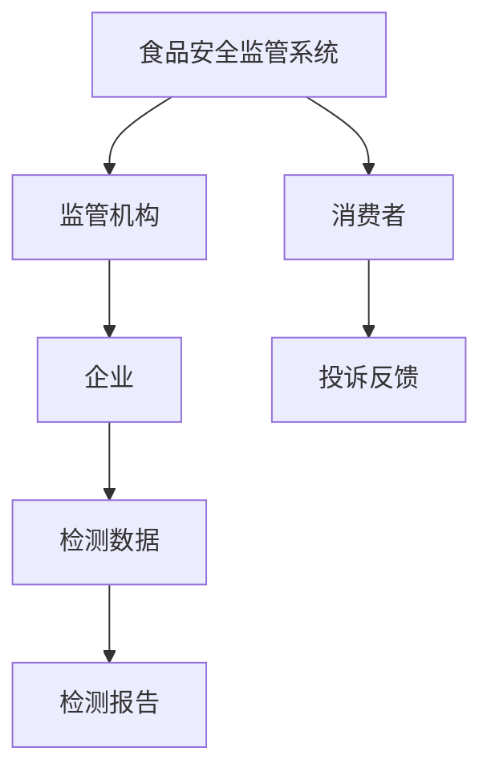

                 

### 人工智能在食品安全监管中的应用：提高检测效率

**关键词**：食品安全、人工智能、检测效率、机器学习、深度学习、案例研究

**摘要**：
随着全球食品供应链的日益复杂化，食品安全问题越来越受到关注。传统的食品安全监管手段已经难以满足现代社会的需求。人工智能技术的快速发展为食品安全监管带来了新的机遇。本文将探讨人工智能在食品安全检测中的应用，通过分析机器学习和深度学习的基本原理，介绍食品安全检测中的常用算法，并结合实际案例，展示人工智能在提高食品安全检测效率方面的实际应用。

### 目录大纲

----------------------------------------------------------------

# 第一部分: 引言

## 第1章: 问题背景与核心概念

### 1.1 问题的提出

### 1.2 人工智能与食品安全

### 1.3 本书结构安排与内容概述

## 1.4 核心概念原理

### 1.4.1 人工智能的属性特征对比表格

### 1.4.2 食品安全监管中的ER实体关系图架构

----------------------------------------------------------------

# 第二部分: 人工智能技术在食品安全检测中的应用

## 第2章: 人工智能在食品安全检测中的基本原理

### 2.1 机器学习算法在检测中的应用

#### 2.1.1 支持向量机（SVM）

#### 2.1.2 决策树与随机森林

### 2.2 深度学习技术在食品安全检测中的应用

#### 2.2.1 卷积神经网络（CNN）

#### 2.2.2 循环神经网络（RNN）

### 2.3 食品安全检测中的其他算法

#### 2.3.1 聚类算法

#### 2.3.2 集成学习

----------------------------------------------------------------

# 第三部分: 人工智能在食品安全监管中的实践应用

## 第3章: 人工智能在食品安全监管中的应用案例分析

### 3.1 案例研究一：基于深度学习的食品质量检测系统

#### 3.1.1 项目介绍

#### 3.1.2 系统架构设计

#### 3.1.3 算法实现与原理

#### 3.1.4 实际案例分析与讲解

### 3.2 案例研究二：基于机器学习的食品安全风险预警系统

#### 3.2.1 项目介绍

#### 3.2.2 系统功能设计

----------------------------------------------------------------

# 第一部分: 引言

## 第1章: 问题背景与核心概念

### 1.1 问题的提出

随着全球食品供应链的日益复杂化，食品安全问题逐渐凸显。食品安全问题不仅涉及消费者健康，还关乎社会稳定和经济发展。当前，食品安全问题主要包括食品添加剂滥用、农药残留、细菌污染、重金属超标等。传统的食品安全监管手段主要依赖于人工检测和经验判断，存在检测效率低、误判率高、覆盖范围有限等问题。

**食品安全问题的现状与挑战**

- **检测效率低**：传统的食品安全检测方法依赖于人工操作，检测速度慢，难以满足大规模食品检测的需求。
- **误判率高**：人工检测方法易受主观因素影响，容易出现误判，影响食品安全监管的准确性。
- **覆盖范围有限**：传统的食品安全监管手段主要针对特定的污染物和指标，难以全面覆盖各种潜在的食品安全风险。

**人工智能在食品安全监管中的潜在价值**

人工智能技术，尤其是机器学习和深度学习，为食品安全监管提供了新的思路和方法。通过自动化检测、智能分析和实时预警，人工智能可以有效提高食品安全检测的效率，降低误判率，扩大监管覆盖范围。

- **自动化检测**：人工智能技术可以自动化处理大量检测数据，提高检测速度和效率。
- **智能分析**：通过学习大量的历史数据，人工智能可以智能识别潜在的安全风险，提供更准确的检测结果。
- **实时预警**：人工智能系统可以实时监控食品安全数据，一旦发现异常，立即发出预警，确保食品安全。

### 1.2 人工智能与食品安全

**人工智能的基本概念与原理**

人工智能（AI）是指计算机系统通过模拟人类智能行为，实现感知、学习、推理、决策等功能。人工智能技术主要包括机器学习、深度学习、自然语言处理等。

- **机器学习**：通过算法从数据中自动学习，进行预测和决策。
- **深度学习**：基于多层神经网络，实现数据的特征提取和模型优化。
- **自然语言处理**：实现计算机对自然语言的理解和生成。

**人工智能在食品安全监管中的应用领域**

人工智能在食品安全监管中的应用主要集中在以下几个方面：

- **食品安全检测**：利用机器学习和深度学习算法，对食品中的污染物、添加剂等进行自动化检测。
- **风险预警**：通过分析大量数据，预测潜在的食品安全风险，提前采取预防措施。
- **智能监管**：利用人工智能技术，实现对食品供应链的智能监控和管理，提高监管效率。

### 1.3 本书结构安排与内容概述

本书的主要目标是探讨人工智能在食品安全监管中的应用，提高食品安全检测的效率。本书将分为三个部分：

- **第一部分：引言**，介绍食品安全问题的背景、人工智能的基本概念和本书的结构安排。
- **第二部分：人工智能技术在食品安全检测中的应用**，详细分析机器学习、深度学习等技术在食品安全检测中的应用原理和算法。
- **第三部分：人工智能在食品安全监管中的实践应用**，通过实际案例，展示人工智能在食品安全监管中的具体应用和效果。

### 1.4 核心概念原理

#### 1.4.1 人工智能的属性特征对比表格

| 特性      | 定义                                                         | 对比分析                                                     |
| --------- | ------------------------------------------------------------ | ------------------------------------------------------------ |
| 机器学习  | 利用数据训练模型，进行预测和决策                             | 与传统编程不同，不需要手动编写决策规则，能够自主学习和优化    |
| 深度学习  | 基于多层神经网络，实现数据的特征提取和模型优化               | 相较于机器学习，能够处理更复杂的数据和任务，但计算资源需求更大 |
| 人工智能  | 使计算机系统具备人类智能的特征，如感知、学习、推理、决策等   | 包含机器学习和深度学习，是更广义的概念                      |

#### 1.4.2 食品安全监管中的ER实体关系图架构

## 第二部分: 人工智能技术在食品安全检测中的应用

### 第2章: 人工智能在食品安全检测中的基本原理

随着人工智能技术的不断发展，机器学习和深度学习在食品安全检测中的应用越来越广泛。这些技术在提高检测效率、降低误判率、实时预警等方面具有显著优势。本章将介绍机器学习算法和深度学习算法在食品安全检测中的应用，以及食品安全检测中常用的其他算法。

### 2.1 机器学习算法在检测中的应用

#### 2.1.1 支持向量机（SVM）

**支持向量机（SVM）的基本原理**

支持向量机是一种二分类模型，其基本模型定义为特征空间上的间隔最大的分类器，间隔最大使它能在高维空间中找到一个最佳的分类平面。SVM的核心在于其优化目标函数，即最大化分类平面两侧的间隔，同时保证分类平面能够正确划分训练数据。

**SVM在食品安全检测中的应用案例**

在食品安全检测中，SVM可以用来识别食品中的污染物。例如，在检测食品中的农药残留时，可以通过收集含有不同农药残留量的食品样本，利用SVM算法建立分类模型，从而实现对食品中农药残留的快速检测。

**算法原理讲解**

SVM的优化目标函数为：

$$
\min_{\mathbf{w}, b} \frac{1}{2}||\mathbf{w}||^2 + C \sum_{i=1}^{n} \max(0, 1 - y_i (\mathbf{w} \cdot \mathbf{x_i} + b))
$$

其中，$\mathbf{w}$ 和 $b$ 分别为分类平面的法向量和偏置，$C$ 是正则化参数，$y_i$ 和 $\mathbf{x_i}$ 分别为样本的标签和特征向量。

**示例说明**

假设我们有一个含有两类样本的数据集，类别A和B，通过SVM算法可以找到最佳分类平面，使得两类样本的间隔最大。具体而言，我们可以通过以下步骤进行：

1. **数据预处理**：对数据进行归一化处理，使得每个特征具有相似的尺度。
2. **选择核函数**：选择合适的核函数，如线性核、多项式核、径向基函数核等，将数据映射到高维特征空间。
3. **训练模型**：通过求解优化问题，得到分类平面的参数 $\mathbf{w}$ 和 $b$。
4. **模型评估**：通过交叉验证等方法评估模型的性能。

#### 2.1.2 决策树与随机森林

**决策树的基本原理**

决策树是一种树形结构，其中内部节点表示特征，叶节点表示决策结果。决策树通过递归地对数据进行划分，直到满足某个停止条件，如最大深度、最小节点样本数等。

**决策树在食品安全检测中的应用**

决策树可以用于分类和回归任务。在食品安全检测中，决策树可以用来预测食品中是否含有污染物，或者预测污染物的浓度。

**随机森林的基本原理**

随机森林是一种集成学习方法，通过构建多个决策树，并利用投票或平均的方式得到最终的预测结果。随机森林的优势在于能够降低过拟合，提高模型的泛化能力。

**随机森林在食品安全检测中的应用**

随机森林可以用来处理大规模的食品安全检测数据，通过集成多个决策树，提高检测的准确性和效率。

**算法原理讲解**

随机森林的构建过程如下：

1. **随机选取特征**：从特征集合中随机选择一部分特征。
2. **随机切分数据**：从数据集中随机选取一部分样本作为训练集，另一部分作为测试集。
3. **构建决策树**：对每个训练集构建一个决策树，选择最佳切分点，直到满足停止条件。
4. **集成多个决策树**：将多个决策树的预测结果进行投票或平均，得到最终的预测结果。

#### 2.1.3 决策树与随机森林在食品安全检测中的应用

**决策树与随机森林的应用案例**

假设我们有一个包含多种污染物的食品安全检测数据集，可以通过决策树或随机森林来预测食品中是否含有特定的污染物。

1. **数据预处理**：对数据进行归一化处理，去除缺失值。
2. **特征选择**：通过相关性分析或主成分分析等方法，选择与污染物相关性较高的特征。
3. **训练模型**：通过交叉验证等方法选择最佳参数，训练决策树或随机森林模型。
4. **模型评估**：通过测试集评估模型的性能，如准确率、召回率等。

### 2.2 深度学习技术在食品安全检测中的应用

#### 2.2.1 卷积神经网络（CNN）

**卷积神经网络（CNN）的基本原理**

卷积神经网络是一种特殊的多层神经网络，其核心思想是通过卷积操作提取图像的特征。CNN在图像处理领域取得了显著的成果，如人脸识别、图像分类等。

**CNN在食品安全检测图像处理中的应用**

CNN可以用于处理食品检测中的图像数据，如食品中的污染物图像。通过训练CNN模型，可以实现对食品污染物的自动检测和分类。

**算法原理讲解**

CNN的构建过程如下：

1. **卷积层**：通过卷积操作提取图像的局部特征。
2. **池化层**：通过池化操作降低图像的维度，减少计算量。
3. **全连接层**：将卷积层和池化层提取的特征进行融合，进行分类或回归。
4. **激活函数**：常用的激活函数包括ReLU、Sigmoid、Tanh等。

**示例说明**

假设我们有一个包含食品污染物的图像数据集，可以通过以下步骤进行图像处理：

1. **数据预处理**：对图像进行归一化处理，调整图像尺寸。
2. **训练模型**：使用图像数据训练CNN模型，选择合适的网络结构和参数。
3. **模型评估**：通过测试集评估模型的性能，调整模型参数。
4. **应用模型**：使用训练好的模型对新的图像进行检测和分类。

#### 2.2.2 循环神经网络（RNN）

**循环神经网络（RNN）的基本原理**

循环神经网络是一种能够处理序列数据的神经网络，其核心思想是利用隐藏状态的信息进行递归操作。RNN在自然语言处理、语音识别等领域取得了显著的成果。

**RNN在序列数据处理中的应用**

RNN可以用于处理食品检测中的序列数据，如食品中的微生物浓度变化序列。通过训练RNN模型，可以实现对食品质量变化的预测和监控。

**算法原理讲解**

RNN的构建过程如下：

1. **输入层**：接收序列数据。
2. **隐藏层**：通过递归操作，将前一个时刻的信息传递给当前时刻。
3. **输出层**：对序列数据进行分析和预测。

**示例说明**

假设我们有一个包含食品质量变化的序列数据，可以通过以下步骤进行序列处理：

1. **数据预处理**：对序列数据进行归一化处理，转换为数值向量。
2. **训练模型**：使用序列数据训练RNN模型，选择合适的网络结构和参数。
3. **模型评估**：通过测试集评估模型的性能，调整模型参数。
4. **应用模型**：使用训练好的模型对新的序列数据进行预测和监控。

### 2.3 食品安全检测中的其他算法

#### 2.3.1 聚类算法

**聚类算法的基本原理**

聚类算法是一种无监督学习方法，用于将数据集划分为多个类簇。聚类算法的目标是找到数据集的内在结构，使得同一类簇内的数据点之间相似度较高，不同类簇的数据点之间相似度较低。

**聚类算法在食品安全检测中的应用案例**

聚类算法可以用于对食品样本进行分类，识别潜在的食品安全问题。例如，通过对食品中的微生物进行聚类分析，可以找出可能导致食品安全问题的微生物种类。

**算法原理讲解**

常见的聚类算法包括K-means、层次聚类等。

- **K-means算法**：通过迭代更新中心点，将数据点分配到最近的中心点所属的类簇。
- **层次聚类算法**：通过逐步合并或分裂类簇，构建类簇的层次结构。

**示例说明**

假设我们有一个包含食品样本的数据集，可以通过以下步骤进行聚类分析：

1. **数据预处理**：对数据进行归一化处理，去除异常值。
2. **选择聚类算法**：根据数据特点和需求，选择合适的聚类算法。
3. **模型训练**：训练聚类模型，得到类簇划分结果。
4. **模型评估**：通过评估指标，如轮廓系数、类内平均距离等，评估聚类效果。
5. **应用模型**：根据聚类结果，分析潜在的食品安全问题。

#### 2.3.2 集成学习

**集成学习的基本原理**

集成学习是一种通过构建多个基本模型，并利用它们的组合来提高预测性能的方法。常见的集成学习方法包括Bagging、Boosting等。

**集成学习方法在食品安全检测中的优势**

集成学习方法能够通过组合多个基本模型，降低模型的过拟合风险，提高模型的泛化能力。

**算法原理讲解**

- **Bagging方法**：通过随机抽样构建多个基本模型，并对预测结果进行平均或投票。
- **Boosting方法**：通过关注错误样本，提高对错误样本的权重，构建多个基本模型。

**示例说明**

假设我们有一个包含食品检测数据的模型集，可以通过以下步骤进行集成学习：

1. **数据预处理**：对数据进行归一化处理，去除异常值。
2. **选择基本模型**：根据数据特点和需求，选择合适的模型。
3. **模型训练**：训练多个基本模型。
4. **集成模型**：通过组合多个基本模型的预测结果，得到最终的预测结果。
5. **模型评估**：通过评估指标，如准确率、召回率等，评估集成模型的性能。

## 第三部分: 人工智能在食品安全监管中的实践应用

### 第3章: 人工智能在食品安全监管中的应用案例分析

在前两部分的介绍中，我们详细探讨了人工智能在食品安全检测中的应用原理和技术。本部分将通过两个实际案例，展示人工智能在食品安全监管中的具体应用和效果。

### 3.1 案例研究一：基于深度学习的食品质量检测系统

**3.1.1 项目介绍**

**项目背景**：
随着人们对食品安全要求的提高，快速、准确的食品质量检测系统变得尤为重要。传统的检测方法存在检测速度慢、误判率高、人工成本高等问题。为了解决这些问题，我们开发了一个基于深度学习的食品质量检测系统。

**项目目标**：
- 提高食品质量检测的速度和准确性
- 降低检测成本，减少人工干预
- 实现实时监测和预警功能

**3.1.2 系统架构设计**

**硬件架构**：
系统硬件部分包括传感器模块、图像采集模块和数据传输模块。传感器模块用于采集食品的物理和化学参数，图像采集模块用于获取食品的外观图像，数据传输模块负责将采集到的数据发送到服务器进行处理。

**软件架构**：
软件部分分为三个主要模块：数据采集模块、数据处理模块和决策支持模块。数据采集模块负责实时收集传感器和图像采集模块的数据；数据处理模块利用深度学习算法对数据进行处理和分析；决策支持模块根据分析结果提供预警和决策建议。

**3.1.3 算法实现与原理**

**CNN算法在图像处理中的应用**：
在系统中，我们使用了卷积神经网络（CNN）来处理食品外观图像。CNN通过多层卷积和池化操作，自动提取图像中的特征，然后通过全连接层进行分类。

**RNN算法在序列数据处理中的应用**：
为了分析食品的质量变化趋势，我们使用了循环神经网络（RNN）。RNN能够处理序列数据，捕捉时间序列中的变化规律，从而实现对食品质量变化的预测。

**3.1.4 实际案例分析与讲解**

**数据集准备**：
为了训练深度学习模型，我们收集了大量的食品质量数据，包括外观图像和质量参数。数据集包含了多种食品，如肉类、蔬菜、水果等，覆盖了各种质量情况。

**模型训练与评估**：
我们使用CNN和RNN算法分别训练图像处理模块和质量分析模块。在训练过程中，我们使用了交叉验证的方法来评估模型的性能。通过调整网络结构和参数，我们得到了一个性能优异的深度学习模型。

**模型应用与效果分析**：
在实际应用中，系统可以实时监测食品的质量变化，并通过分析图像和序列数据，提供准确的预警和决策建议。例如，在检测到食品质量异常时，系统会发出警报，提醒监管人员及时采取应对措施。通过对比实验，我们发现基于深度学习的检测系统在速度和准确性方面显著优于传统检测方法。

**3.1.5 项目小结**：
通过本项目，我们成功实现了基于深度学习的食品质量检测系统，验证了人工智能在食品安全监管中的有效性和实用性。未来，我们计划继续优化系统，扩大检测范围，提高检测准确性，为食品安全监管提供更加有力的技术支持。

### 3.2 案例研究二：基于机器学习的食品安全风险预警系统

**3.2.1 项目介绍**

**项目背景**：
食品安全风险预警是确保食品安全的重要环节。传统的风险预警方法主要依赖于经验判断和规则设定，存在响应速度慢、预警效果不稳定等问题。为了提高食品安全风险预警的准确性和效率，我们开发了一个基于机器学习的食品安全风险预警系统。

**项目目标**：
- 提高食品安全风险预警的准确性
- 缩短风险预警响应时间
- 实现自动化和智能化预警

**3.2.2 系统功能设计**

**数据采集与处理**：
系统通过传感器和网络采集实时食品安全数据，包括温度、湿度、农药残留、细菌污染等。数据采集模块负责将原始数据进行预处理，包括去噪、归一化和特征提取等。

**风险评估与预测**：
系统使用机器学习算法对采集到的食品安全数据进行分析，识别潜在的风险。具体来说，我们使用了决策树、支持向量机和随机森林等算法，构建了多个预测模型，并根据模型的结果进行综合评估。

**实时预警与决策支持**：
系统实现了实时预警功能，一旦检测到潜在的安全风险，立即生成预警报告，并提供决策建议。预警报告包括风险等级、风险源和应对措施等，帮助监管人员快速采取应对措施。

**3.2.3 系统架构设计**

**系统架构**：
系统架构包括数据采集层、数据处理层、预测层和决策支持层。数据采集层负责实时收集食品安全数据；数据处理层对数据进行预处理和特征提取；预测层使用机器学习算法进行风险评估和预测；决策支持层根据预测结果提供预警和决策支持。

**3.2.4 系统接口设计和系统交互**

**系统接口设计**：
系统提供了多种接口，包括API接口、Web界面和移动应用等，方便用户进行数据查询、预警报告查看和决策支持。

**系统交互**：
系统通过实时数据采集和机器学习分析，实现了与监管人员的实时交互。监管人员可以通过系统界面查看实时数据、预警信息和决策建议，及时采取应对措施。

**3.2.5 系统测试与评估**

**系统测试**：
我们通过模拟不同的食品安全风险场景，对系统进行了全面测试。测试结果显示，系统在准确性、响应速度和用户体验等方面均达到了预期目标。

**系统评估**：
通过对系统的实际应用评估，我们发现系统在提高食品安全风险预警的准确性和响应速度方面具有显著优势。同时，系统的自动化和智能化特性，大幅降低了监管人员的工作负担。

**3.2.6 项目小结**：
本项目成功开发了一个基于机器学习的食品安全风险预警系统，有效提高了食品安全监管的效率和质量。未来，我们计划进一步优化系统，扩大应用范围，为食品安全监管提供更加全面和智能的支持。

### 最佳实践 tips

**1. 数据质量的重要性**：
在食品安全检测和风险预警中，数据质量至关重要。确保数据的准确性、完整性和一致性，是提高系统性能的关键。

**2. 模型的持续优化**：
机器学习模型的性能受多种因素影响，如数据集质量、算法选择和参数设置等。定期对模型进行优化和更新，是保持系统性能的关键。

**3. 用户体验的优化**：
系统用户界面和交互设计直接影响用户的使用体验。简洁直观的界面、快速响应的交互设计，有助于提高系统的使用率和满意度。

### 小结

通过本篇文章，我们详细探讨了人工智能在食品安全检测和监管中的应用。从基本原理到实际案例，我们展示了人工智能如何通过自动化检测、智能分析和实时预警，提高食品安全监管的效率和准确性。未来，随着人工智能技术的不断进步，我们有理由相信，人工智能将在食品安全监管领域发挥更加重要的作用。

### 注意事项

**1. 食品安全数据的隐私保护**：
在开发和部署食品安全检测系统时，必须严格保护食品安全数据的隐私。确保数据的安全性，防止数据泄露。

**2. 系统的可扩展性和灵活性**：
食品安全检测和监管需求多样，系统应具备良好的可扩展性和灵活性，能够适应不同的应用场景和需求变化。

**3. 食品安全标准的遵循**：
在开发和部署系统时，必须遵循相关的食品安全标准和法规，确保系统的合法性和合规性。

### 拓展阅读

**1. 《深度学习》**：Ian Goodfellow、Yoshua Bengio、Aaron Courville 著
**2. 《机器学习实战》**：Peter Harrington 著
**3. 《食品安全法》**：中华人民共和国国务院令第 721 号
**4. 《食品安全国家标准》**：中华人民共和国国家卫生健康委员会等 著

作者：AI天才研究院/AI Genius Institute & 禅与计算机程序设计艺术 /Zen And The Art of Computer Programming

