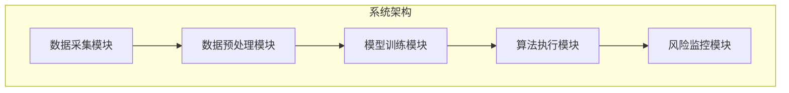
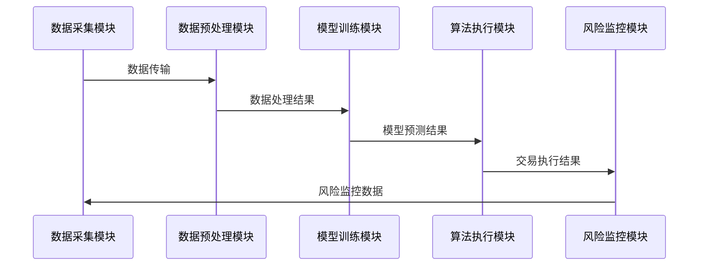

                 


### 引言

#### 问题背景

在过去的几十年里，金融业经历了巨大的变化，从手工操作到自动化，再到如今的智能化。然而，随着全球金融市场的不确定性和竞争的加剧，传统金融业正面临着前所未有的挑战。一方面，市场波动性和风险变得更加复杂，金融机构需要更精确和高效的工具来评估和管理风险。另一方面，客户的需求也在不断变化，他们期望获得更快速、更个性化和更透明的金融服务。这些挑战促使传统金融业必须寻找新的解决方案，而人工智能（AI）技术的发展为此提供了可能。

#### 人工智能技术发展概况

人工智能技术，特别是机器学习和深度学习，在过去几年中取得了显著的进展。这些技术通过从大量数据中学习模式和规律，使得计算机能够执行复杂的任务，如语音识别、图像识别、自然语言处理等。随着计算能力的提高和大数据技术的发展，人工智能的应用领域不断扩展，包括医疗、交通、零售、金融等各个行业。

#### 人工智能与传统金融业的融合趋势

人工智能与传统金融业的融合已经成为一种趋势。金融机构开始利用人工智能技术来改善风险管理、提高交易效率、优化客户体验等。例如，算法交易利用机器学习算法来分析市场数据，预测价格走势，并自动执行交易决策。风险管理则利用人工智能模型来预测和评估市场风险，制定更有效的风险管理策略。

#### 问题提出

传统金融业面临的挑战主要集中在以下几个方面：

1. **风险管理的复杂性**：随着市场环境的复杂化，金融机构需要更先进的工具来准确评估和管理风险。
2. **交易效率低下**：传统的人工交易方式不仅耗时耗力，而且容易受到人为因素的干扰，导致交易效率低下。
3. **客户需求的个性化**：客户越来越期望获得个性化的金融服务，这要求金融机构能够快速响应并满足客户需求。
4. **市场竞争加剧**：随着更多金融机构的参与，市场竞争变得更加激烈，需要更高效的运营模式来保持竞争力。

人工智能技术的引入为解决这些问题提供了新的途径。通过利用机器学习、深度学习等技术，金融机构可以实现更精确的风险评估、更高效的交易决策和更个性化的客户服务。因此，研究人工智能在金融业中的应用具有重要的理论和实践意义。

#### 边界与外延

在本文中，我们将主要探讨以下两个方面：

1. **算法交易**：算法交易是利用机器学习算法来分析市场数据，预测价格走势，并自动执行交易决策。我们将详细分析算法交易的基本原理、策略和实施方法。
2. **风险管理**：风险管理是金融业的重要组成部分。我们将探讨如何利用人工智能技术来改善风险预测和评估，制定更有效的风险管理策略。

#### 主要概念与术语介绍

在本章中，我们将介绍以下几个关键概念和术语：

1. **人工智能**：一种模拟人类智能的计算机技术，包括机器学习、深度学习、自然语言处理等。
2. **机器学习**：一种人工智能技术，通过从数据中学习模式和规律，使计算机能够执行特定任务。
3. **深度学习**：一种特殊的机器学习技术，使用多层神经网络来模拟人类大脑的决策过程。
4. **算法交易**：利用机器学习算法来分析市场数据，预测价格走势，并自动执行交易决策。
5. **风险管理**：识别、评估和管理金融风险的过程，目的是确保金融机构的稳健运营。

#### 本章小结

在本章中，我们介绍了人工智能在传统金融业中的应用背景和趋势，提出了传统金融业面临的挑战，并介绍了本文的主要研究内容和目标。在接下来的章节中，我们将深入探讨人工智能与金融业的融合原理、算法交易原理和风险管理方法，为读者提供一幅全面的人工智能与金融业融合的蓝图。

### 人工智能与金融业的融合原理

#### 人工智能基础理论

人工智能（AI）是一门研究如何使计算机模拟人类智能行为的科学。其核心包括机器学习、深度学习和自然语言处理等。机器学习是AI的一个重要分支，它通过从数据中学习模式和规律，使计算机能够执行特定任务，而无需显式编程。深度学习则是一种特殊的机器学习技术，它使用多层神经网络来模拟人类大脑的决策过程，具有强大的特征提取和模式识别能力。自然语言处理（NLP）则致力于使计算机理解和生成自然语言。

##### 机器学习与深度学习

机器学习是一种使计算机从数据中学习的方法，主要包括监督学习、无监督学习和强化学习等。监督学习是机器学习的最常见的类型，它使用标记数据来训练模型，从而使模型能够预测新的数据。无监督学习则不使用标记数据，而是从未标记的数据中学习模式和结构。强化学习是一种通过奖励机制来训练模型的方法，通常用于解决序列决策问题。

深度学习则是机器学习的一个子集，它使用多层神经网络来提取特征和进行预测。深度学习在图像识别、语音识别和自然语言处理等领域取得了显著的成果。典型的深度学习模型包括卷积神经网络（CNN）、循环神经网络（RNN）和生成对抗网络（GAN）等。

##### 强化学习

强化学习是一种通过奖励机制来训练模型的方法，它通常用于解决序列决策问题。在强化学习中，模型（称为智能体）通过与环境交互来学习最佳策略。每次智能体做出决策后，环境会给出奖励或惩罚，智能体根据这些反馈来调整其行为。强化学习在游戏、自动驾驶和金融交易等领域有广泛的应用。

##### 自然语言处理

自然语言处理是使计算机理解和生成自然语言的技术。它涉及文本分类、情感分析、机器翻译和语音识别等多个子领域。自然语言处理的关键挑战是如何从无结构的文本数据中提取有用信息。近年来，深度学习技术在自然语言处理领域取得了重大突破，如使用BERT模型进行文本分类和生成对抗网络（GAN）进行语音识别。

#### 金融基础理论

金融基础理论是理解金融市场的运作机制和风险管理方法的基础。它包括以下几个核心概念：

##### 金融市场的运作机制

金融市场是买卖金融资产（如股票、债券、期货和期权等）的场所。金融市场的运作机制主要包括价格发现、资本配置和信息传递等。价格发现是指通过市场交易来确定资产的真实价值，资本配置是指投资者如何将资金分配到不同资产类别中，以实现最优的回报和风险平衡，信息传递是指市场参与者如何获取和利用信息来做出投资决策。

##### 财务分析工具

财务分析工具是评估企业财务状况和业绩的工具，包括财务报表分析、现金流量分析、财务比率分析等。财务报表分析是通过资产负债表、利润表和现金流量表等财务报表来评估企业的财务状况和业绩。现金流量分析是通过分析企业的现金流量情况来评估其财务健康状况。财务比率分析是通过计算和比较各种财务比率来评估企业的财务状况和业绩。

##### 风险管理方法

风险管理是确保金融机构稳健运营的关键。它包括风险识别、风险评估、风险控制和风险监控等步骤。风险识别是指识别可能对金融机构产生负面影响的潜在风险。风险评估是指评估这些风险的可能性和影响。风险控制是指采取措施来降低风险的可能性和影响。风险监控是指持续监测和评估风险状况，以确保风险控制措施的有效性。

#### 核心概念与联系

人工智能和金融基础理论在多个方面有交集。例如，机器学习和深度学习可以用于金融市场数据分析，帮助预测价格走势和评估投资风险。自然语言处理可以用于文本分析，帮助金融机构理解和利用大量文本数据。此外，强化学习可以用于算法交易，通过不断调整交易策略来优化收益。

在下一章中，我们将详细探讨算法交易的基本原理、策略和实践，进一步理解人工智能在金融领域的应用。

### 算法交易原理详解

#### 算法交易概述

算法交易（Algorithmic Trading）是指利用计算机程序自动化执行交易策略的过程。这一概念起源于20世纪80年代，当时金融机构开始使用计算机算法来执行高频交易。随着计算机性能的提升和大数据技术的发展，算法交易已经成为金融市场的重要组成部分。

##### 算法交易的起源与发展

算法交易的起源可以追溯到高频交易（High-Frequency Trading，HFT）的出现。高频交易利用超高速计算机在极短的时间内执行大量交易，以获取微小利润。随着技术的进步，算法交易的范围不断扩大，不仅限于高频交易，还包括趋势跟踪、事件驱动和套利交易等多种策略。

##### 算法交易的基本原理

算法交易的核心是交易算法（Trading Algorithm），这是一种通过数学模型和统计方法分析市场数据的程序。交易算法通常包含以下几个步骤：

1. **数据采集**：从金融市场获取实时数据，包括价格、成交量、市场深度等。
2. **数据分析**：使用数学模型和统计方法分析市场数据，以识别交易信号。
3. **交易决策**：根据分析结果，自动生成交易订单，执行买入或卖出操作。
4. **交易执行**：通过交易执行系统将交易订单提交到市场，完成交易。

#### 算法交易策略

算法交易策略多种多样，不同的策略适用于不同的市场环境和风险偏好。以下是几种常见的算法交易策略：

##### 趋势跟踪策略

趋势跟踪策略是算法交易中最常用的策略之一，它基于市场趋势进行交易。交易算法通过分析历史价格走势和交易量，预测未来的价格趋势，并据此进行买卖操作。

1. **数据预处理**：对历史价格和交易量数据进行预处理，包括去除噪声、填充缺失值等。
2. **趋势识别**：使用技术指标（如移动平均线、相对强弱指数RSI等）来识别市场趋势。
3. **交易信号生成**：根据趋势识别结果生成买卖信号，当价格突破趋势线时执行交易。
4. **风险控制**：设置止损和止盈点，控制交易风险。

##### 事件驱动策略

事件驱动策略是基于市场事件进行交易。交易算法在分析市场数据时，关注特定事件（如财报发布、重大新闻等）可能对市场产生的影响，并在事件发生时进行交易。

1. **事件识别**：通过自然语言处理（NLP）技术识别市场事件。
2. **事件分析**：使用统计方法和机器学习模型分析事件对市场的影响。
3. **交易信号生成**：根据事件分析结果生成买卖信号，并在事件发生时执行交易。
4. **风险控制**：对特定事件交易设置更高的风险容忍度，同时使用止损和止盈点来控制风险。

##### 套利交易策略

套利交易策略是利用市场价格的暂时失衡进行交易，以获取无风险利润。交易算法通过分析不同市场之间的价格差异，寻找套利机会。

1. **市场分析**：分析不同市场之间的价格差异和交易量。
2. **套利机会识别**：使用统计方法和机器学习模型识别套利机会。
3. **交易信号生成**：根据套利机会生成买卖信号，并在发现价格差异时执行交易。
4. **风险控制**：对套利交易设置严格的风险控制措施，包括设置止损和止盈点，以及限制交易规模。

#### 算法交易的优势与挑战

算法交易具有以下优势：

1. **交易效率高**：算法交易可以实时分析大量数据，快速做出交易决策，提高交易效率。
2. **风险可控**：通过设置止损和止盈点，算法交易可以更好地控制风险。
3. **降低交易成本**：算法交易减少了人工干预，降低了交易成本。

然而，算法交易也面临一些挑战：

1. **市场冲击成本**：高频交易可能对市场造成冲击，导致交易成本增加。
2. **系统风险**：算法交易系统的故障可能导致大规模的交易错误。
3. **监管风险**：算法交易需要遵守严格的监管规定，否则可能面临法律风险。

在下一章中，我们将探讨风险管理方法与实践，进一步理解人工智能在金融领域的应用。

### 风险管理方法与实践

#### 风险管理基本概念

风险管理是金融机构稳健运营的关键。它涉及识别、评估、控制和监控风险，以确保金融机构在复杂多变的市场环境中保持稳健。

##### 风险类型

风险可以分为以下几类：

1. **市场风险**：由于市场价格波动导致的损失，如利率风险、汇率风险和股票市场风险。
2. **信用风险**：由于债务人违约导致的损失，包括信贷风险、债券风险和交易对手风险。
3. **流动性风险**：由于无法在合理价格和时间内卖出资产导致的损失。
4. **操作风险**：由于内部程序、人员或系统故障导致的损失。
5. **法律风险**：由于违反法律法规导致的损失。

##### 风险度量方法

风险管理的一个重要任务是度量风险，以便制定有效的风险控制策略。以下是几种常用的风险度量方法：

1. **价值在风险法（VaR）**：VaR是一种常用的风险度量方法，它估计在给定置信水平下，一定时间内可能发生的最大损失。VaR的计算公式为：

   $$\text{VaR} = \text{P}(\text{损失} \geq \text{VaR}) \times \text{资产价值}$$

   其中，P表示概率，VaR表示价值在风险，资产价值表示资产的总价值。

2. **历史模拟法**：历史模拟法通过分析历史数据来估计未来的损失分布。具体步骤如下：

   1. 收集历史市场价格数据。
   2. 对每个历史价格序列计算收益率。
   3. 计算收益率序列的分布。
   4. 根据给定的置信水平确定损失阈值。

3. **蒙特卡罗模拟法**：蒙特卡罗模拟法通过模拟大量随机路径来估计风险。具体步骤如下：

   1. 定义随机过程模型，如几何布朗运动。
   2. 模拟大量随机路径，得到价格路径的分布。
   3. 根据价格路径的分布计算损失分布。
   4. 根据给定的置信水平确定损失阈值。

#### 金融风险模型

金融风险模型是用于评估和预测金融风险的数学模型。以下是一些常用的金融风险模型：

1. **Black-Scholes模型**：Black-Scholes模型是一种用于期权定价的数学模型，它假设股票价格遵循几何布朗运动，并考虑无风险利率和波动率。模型的公式为：

   $$\text{C} = \text{S}_0 \cdot N(\ln(\frac{S_0}{K}) + (\mu - \frac{\sigma^2}{2}) \cdot T) - \text{K} \cdot e^{-rT} \cdot N(\ln(\frac{S_0}{K}) + (\mu - \frac{\sigma^2}{2}) \cdot T)$$

   其中，C表示期权的当前价值，S0表示股票的当前价格，K表示期权的行权价，μ表示股票的预期收益率，σ表示股票的波动率，N表示标准正态分布函数，T表示期权到期时间。

2. **VaR模型**：VaR模型是一种用于度量市场风险的模型，它考虑了价格波动性和相关性。一个简单的VaR模型是基于历史模拟法的：

   $$\text{VaR} = \text{Q}_t \cdot \text{P}_t$$

   其中，Qt表示资产的价值，Pt表示资产价格的概率分布。

3. **风险平价模型**：风险平价模型是一种用于资产配置的模型，它通过平衡不同资产的回报和风险来实现风险平价。具体步骤如下：

   1. 选择一组资产。
   2. 计算每项资产的风险贡献。
   3. 根据风险贡献调整资产权重，实现风险平价。

#### 风险管理方法与实践

金融机构采用多种方法来管理风险，包括风险识别、风险评估、风险控制和风险监控。

1. **风险识别**：风险识别是风险管理的基础，它涉及识别金融机构面临的各种潜在风险。常用的方法包括：

   - **桌面研究**：通过分析历史数据和市场信息，识别潜在风险。
   - **专家咨询**：与行业专家和内部员工进行访谈，获取风险信息。
   - **事件树分析**：通过构建事件树，识别潜在风险和其可能的影响。

2. **风险评估**：风险评估是评估风险的可能性和影响。常用的方法包括：

   - **定量评估**：使用数学模型和统计数据来评估风险，如VaR模型和蒙特卡罗模拟法。
   - **定性评估**：通过专家评估和主观判断来评估风险，如风险矩阵和风险评级。

3. **风险控制**：风险控制是采取措施来降低风险的可能性和影响。常用的方法包括：

   - **风险分散**：通过投资不同资产类别来分散风险。
   - **风险规避**：避免投资高风险资产或市场。
   - **风险转移**：通过保险或其他金融工具将风险转移给第三方。

4. **风险监控**：风险监控是持续监测和评估风险状况，以确保风险控制措施的有效性。常用的方法包括：

   - **定期评估**：定期评估风险状况，更新风险评估模型。
   - **实时监控**：通过实时数据监控系统风险状况，及时采取风险控制措施。
   - **内部审计**：通过内部审计确保风险管理措施得到有效执行。

在下一章中，我们将探讨人工智能与金融领域核心概念的联系，并构建ER实体关系图架构。

### 人工智能与金融领域核心概念的比较

在深入探讨人工智能与金融领域的结合之前，有必要对两者的核心概念进行详细比较，以便更好地理解它们之间的关联和差异。

#### 概念属性特征对比表格

以下是一个对比表格，展示了人工智能与金融领域核心概念的一些属性特征：

| 核心概念 | 特征描述 |  
| --- | --- |  
| 人工智能 | 一种模拟人类智能的技术，包括机器学习、深度学习和自然语言处理等。 |  
| 金融基础理论 | 研究金融市场的运作机制、财务分析工具和风险管理方法。 |  
| 机器学习 | 通过数据学习模式和规律，使计算机能够执行特定任务。 |  
| 财务报表分析 | 通过分析财务报表，评估企业的财务状况和业绩。 |  
| 深度学习 | 使用多层神经网络，模拟人类大脑的决策过程。 |  
| 现金流量分析 | 通过分析现金流量，评估企业的财务健康状况。 |  
| 强化学习 | 通过奖励机制训练模型，解决序列决策问题。 |  
| 财务比率分析 | 通过计算和比较财务比率，评估企业的财务状况和业绩。 |  
| 算法交易 | 利用计算机程序自动化执行交易策略。 |  
| 风险管理 | 识别、评估和管理金融风险，确保金融机构稳健运营。 |  
| 自然语言处理 | 使计算机理解和生成自然语言。 |  
| 市场风险管理 | 通过数学模型和统计方法，评估和监控市场风险。 |

通过这个表格，我们可以清晰地看到人工智能和金融领域核心概念的相似性和差异。例如，机器学习与财务报表分析、深度学习与现金流量分析、强化学习与财务比率分析等，尽管它们的应用场景不同，但都基于数据分析和模式识别的原理。算法交易和风险管理则是金融领域特有的概念，它们依赖于人工智能技术来实现更高效和准确的风险评估与交易决策。

#### ER实体关系图架构

为了更好地理解人工智能与金融领域核心概念之间的关联，我们可以构建一个ER（Entity-Relationship）实体关系图架构。ER图是一种用于描述实体和实体之间关系的图形化表示方法。

以下是一个简化的ER图，展示了人工智能与金融领域核心概念的关系：

```mermaid
erDiagram
  AI --> Machine_Learning
  AI --> Deep_Learning
  AI --> Natural_Language_Processing
  Machine_Learning --> Financial_Statement_Analysis
  Machine_Learning --> Cash_Flow_Analysis
  Deep_Learning --> Financial_Ratio_Analysis
  Financial_Statement_Analysis --> Risk_Management
  Cash_Flow_Analysis --> Risk_Management
  Financial_Ratio_Analysis --> Risk_Management
  Algorithm_Trading --> Risk_Management
```

在这个ER图中，每个框表示一个实体，如人工智能、机器学习、深度学习、自然语言处理等。箭头表示实体之间的关系，例如，人工智能与机器学习、深度学习、自然语言处理之间存在直接关联。机器学习与财务报表分析、现金流量分析之间存在关联，因为它们都基于数据分析。深度学习与财务比率分析之间存在关联，因为深度学习在处理复杂数据方面具有优势。此外，算法交易和风险管理之间也存在直接关联，因为算法交易依赖于风险管理来控制交易风险。

通过ER图，我们可以清晰地看到人工智能与金融领域核心概念之间的层次结构和相互关系，这有助于我们更好地理解和应用这些概念。

在下一章中，我们将详细讲解算法交易的数学模型和数学公式，并使用Python代码进行实例分析。

### 数学模型和数学公式讲解

在算法交易中，数学模型和数学公式起着至关重要的作用。它们帮助我们理解和预测市场行为，从而做出更明智的交易决策。本节我们将详细讲解算法交易的数学模型和数学公式，并通过Python代码进行实例分析。

#### 算法交易数学模型

算法交易的数学模型通常包括以下几个部分：收益模型、风险模型和交易策略模型。

##### 收益模型

在算法交易中，收益模型用于计算每次交易的预期收益。一个简单的收益模型如下：

$$\text{收益率} = \frac{\text{收益}}{\text{风险}} = \frac{\Delta P_t}{P_t - \Delta P_{t-1}}$$

其中，\( \Delta P_t \) 表示时间 \( t \) 时刻的收益，\( P_t \) 表示时间 \( t \) 时刻的价格，\( P_{t-1} \) 表示时间 \( t-1 \) 时刻的价格。这个公式表示每次交易的收益率，即收益与风险的比值。

##### 风险模型

风险模型用于评估每次交易的风险。一个常用的风险度量方法是价值在风险（Value at Risk，VaR）。VaR表示在给定置信水平下，一定时间内可能发生的最大损失。一个简单的VaR模型如下：

$$\text{VaR} = \text{P}(\text{损失} \geq \text{VaR}) \times \text{资产价值}$$

其中，\( P \) 表示概率，\( \text{VaR} \) 表示价值在风险，资产价值表示资产的总价值。

##### 交易策略模型

交易策略模型用于指导交易决策。一个简单的交易策略模型如下：

$$\text{交易信号} = \text{信号生成函数}(\text{市场数据})$$

其中，信号生成函数是一个基于市场数据的函数，用于生成交易信号。交易信号可以是买入、卖出或持有等。

#### Python代码实例分析

以下是一个简单的Python代码实例，用于分析算法交易的数学模型和数学公式。

```python
import numpy as np
import pandas as pd

# 收益模型实例
P0 = 100  # 初始价格
DeltaP = 10  # 收益
P1 = P0 + DeltaP  # 下一价格

# 计算收益率
yield_rate = DeltaP / (P1 - P0)
print("收益率:", yield_rate)

# 风险模型实例
var = 0.05  # 置信水平
portfolio_value = 1000000  # 资产价值

# 计算VaR
VaR = var * portfolio_value
print("VaR:", VaR)

# 交易策略模型实例
# 假设使用移动平均线作为交易信号
window = 5  # 移动平均线窗口大小
market_data = pd.Series([95, 102, 98, 100, 103, 101, 104, 105, 100, 99, 102, 101])  # 市场数据

# 计算移动平均线
moving_average = market_data.rolling(window=window).mean()

# 生成交易信号
signals = moving_average.diff().dropna()

# 打印交易信号
print("交易信号:", signals)

# 交易决策
for signal in signals:
    if signal > 0:
        print("买入")
    elif signal < 0:
        print("卖出")
    else:
        print("持有")
```

在这个实例中，我们首先定义了初始价格 \( P_0 \) 和收益 \( \Delta P \)，然后计算了收益率和VaR。接着，我们使用移动平均线作为交易信号，生成了买入、卖出和持有等交易信号，并进行了简单的交易决策。

通过这个实例，我们可以看到如何使用Python代码实现算法交易的数学模型和数学公式，并进行实际交易分析。

在下一章中，我们将探讨风险管理中的数学模型，包括历史模拟法、价值在风险法和蒙特卡罗模拟法。

### 风险管理中的数学模型

在金融风险管理中，数学模型扮演着至关重要的角色。这些模型帮助金融机构评估和管理风险，确保业务的稳健运营。以下是三种常用的数学模型：历史模拟法、价值在风险法（VaR）和蒙特卡罗模拟法。

#### 历史模拟法

历史模拟法是一种基于历史价格波动来估计未来风险损失的方法。其基本步骤如下：

1. **收集历史数据**：收集一定时间范围内的历史价格数据，例如每日或每周的价格。
2. **计算收益率**：对每个历史价格序列计算收益率，即 \( \text{收益率} = \frac{P_t - P_{t-1}}{P_{t-1}} \)。
3. **生成损失分布**：计算所有历史收益率的损失分布。
4. **计算VaR**：根据给定的置信水平，从损失分布中确定VaR。

以下是一个简单的Python代码示例，用于实现历史模拟法：

```python
import numpy as np

# 假设历史价格数据为以下列表
prices = [95, 102, 98, 100, 103, 101, 104, 105, 100, 99, 102, 101]

# 计算收益率
returns = [(prices[i] - prices[i-1]) / prices[i-1] for i in range(1, len(prices))]

# 计算收益率的累计分布
cumulative_returns = np.cumsum(returns)

# 计算VaR（假设置信水平为95%）
confidence_level = 0.95
VaR = prices[-1] * (1 - cumulative_returns[-1] + cumulative_returns[int((1 - confidence_level) * len(returns) - 1)])

print("VaR:", VaR)
```

#### 价值在风险法（VaR）

价值在风险法（Value at Risk，VaR）是一种广泛使用的风险管理模型，用于估计在一定置信水平下，一定时间内可能发生的最大损失。VaR的计算公式为：

$$\text{VaR} = \text{P}(\text{损失} \geq \text{VaR}) \times \text{资产价值}$$

其中，\( P \) 表示概率，\( \text{VaR} \) 表示价值在风险，资产价值表示资产的总价值。

以下是一个简单的Python代码示例，用于实现VaR：

```python
import numpy as np

# 假设资产价值为100万元
portfolio_value = 1000000

# 收益率数据（与历史模拟法示例相同）
returns = [0.02, -0.03, 0.01, 0.01, 0.02, -0.02, 0.03, 0.04, 0.01, -0.01, 0.02, -0.01]

# 计算累计损失
cumulative_losses = np.cumsum([-r * portfolio_value for r in returns])

# 计算VaR（假设置信水平为95%）
confidence_level = 0.95
VaR = portfolio_value * np.percentile(cumulative_losses, (1 - confidence_level) * len(returns))

print("VaR:", VaR)
```

#### 蒙特卡罗模拟法

蒙特卡罗模拟法是一种基于随机抽样和模拟的方法，用于估计金融风险的分布。其基本步骤如下：

1. **构建模型**：构建一个描述资产收益分布的模型，例如几何布朗运动模型。
2. **随机抽样**：从模型中随机抽样，生成大量模拟路径。
3. **计算损失分布**：对每个模拟路径计算损失，生成损失分布。
4. **计算VaR**：根据给定的置信水平，从损失分布中确定VaR。

以下是一个简单的Python代码示例，用于实现蒙特卡罗模拟法：

```python
import numpy as np
import pandas as pd

# 假设资产价格遵循几何布朗运动模型
mu = 0.01  # 预期收益率
sigma = 0.05  # 波动率
num_simulations = 1000  # 模拟次数

# 生成模拟路径
simulations = pd.DataFrame(np.random.normal(mu, sigma, (num_simulations, 1)), columns=['Price'])

# 计算累计价格
cumulative_prices = (simulations + 1).cumprod()

# 计算累计收益
cumulative_returns = cumulative_prices / cumulative_prices.shift(1)

# 计算累计损失
cumulative_losses = -cumulative_returns * portfolio_value

# 计算VaR（假设置信水平为95%）
confidence_level = 0.95
VaR = np.percentile(cumulative_losses, (1 - confidence_level) * len(cumulative_losses))

print("VaR:", VaR)
```

通过这些示例，我们可以看到如何使用Python代码实现历史模拟法、价值在风险法和蒙特卡罗模拟法，从而进行风险管理。在实际应用中，这些模型可以根据具体情况进行调整和优化，以更好地适应金融机构的风险管理需求。

在下一章中，我们将探讨人工智能与金融系统的整体架构，并详细介绍系统的各个组成部分。

### 人工智能与金融系统的整体架构

#### 系统概述

人工智能与金融系统的整体架构是一个复杂的系统，旨在利用人工智能技术提高金融业务的效率、准确性和安全性。该系统包括多个关键组件，如数据采集模块、模型训练模块、算法执行模块和风险监控模块等。

#### 项目介绍

本项目的目标是通过构建一个智能金融系统，实现以下功能：

1. **数据采集**：从多个数据源（如交易所、新闻网站、社交媒体等）收集实时数据。
2. **模型训练**：使用机器学习算法训练模型，以预测市场走势和评估风险。
3. **算法执行**：根据模型预测结果执行交易策略，实现自动交易。
4. **风险监控**：实时监控交易风险，确保系统稳健运行。

#### 系统功能设计（领域模型）

为了实现上述目标，我们设计了以下领域模型：

1. **数据采集模块**：负责从多个数据源收集实时数据，包括股票价格、交易量、新闻文本等。
2. **数据预处理模块**：对收集到的数据进行清洗、归一化和特征提取，为模型训练做准备。
3. **模型训练模块**：使用机器学习算法训练模型，包括预测模型和风险模型。
4. **算法执行模块**：根据模型预测结果，自动执行交易策略。
5. **风险监控模块**：实时监控交易风险，包括市场风险、信用风险和操作风险等。

#### 系统架构设计

以下是一个简化的系统架构设计，展示了各组件之间的关系：



在这个架构中，数据采集模块从多个数据源收集数据，数据预处理模块对数据进行处理，模型训练模块使用处理后的数据训练预测模型和风险模型。算法执行模块根据模型预测结果执行交易策略，风险监控模块则实时监控交易风险，确保系统稳健运行。

#### 系统接口设计

系统接口设计是确保系统组件之间有效通信的关键。以下是系统的接口设计：

1. **数据采集接口**：用于从交易所、新闻网站、社交媒体等数据源获取数据。
2. **数据处理接口**：用于对采集到的数据进行清洗、归一化和特征提取。
3. **模型训练接口**：用于训练预测模型和风险模型。
4. **交易执行接口**：用于根据模型预测结果执行交易策略。
5. **风险监控接口**：用于实时监控交易风险，包括市场风险、信用风险和操作风险等。

#### 系统交互

为了更好地理解系统组件之间的交互，我们可以使用Mermaid序列图进行描述：



在这个序列图中，数据采集模块将数据传输给数据预处理模块，数据预处理模块处理后返回给模型训练模块。模型训练模块生成模型预测结果，传递给算法执行模块。算法执行模块根据预测结果执行交易策略，并将交易执行结果传递给风险监控模块。风险监控模块则使用监控数据更新数据采集模块，形成闭环反馈系统。

通过这个整体架构和接口设计，我们可以清晰地看到人工智能与金融系统的各个组件如何协同工作，实现高效的交易决策和风险管理。

在下一章中，我们将介绍项目的实战部分，包括环境安装、系统核心实现和代码应用解读与分析。

### 项目实战

#### 环境安装

要在本地计算机上搭建一个完整的AI金融系统，我们需要安装以下软件和工具：

1. **Python**：Python是一种广泛用于数据分析和机器学习的编程语言。确保安装了最新版本的Python。
2. **NumPy**：NumPy是一个Python库，用于数值计算和矩阵操作。
3. **Pandas**：Pandas是一个Python库，用于数据处理和分析。
4. **Matplotlib**：Matplotlib是一个Python库，用于数据可视化。
5. **Scikit-learn**：Scikit-learn是一个Python库，用于机器学习和数据挖掘。
6. **TensorFlow**：TensorFlow是一个开源机器学习框架，用于深度学习。
7. **Keras**：Keras是一个高级神经网络API，构建在TensorFlow之上，用于简化深度学习模型开发。

安装步骤如下：

```bash
pip install python
pip install numpy
pip install pandas
pip install matplotlib
pip install scikit-learn
pip install tensorflow
pip install keras
```

#### 系统核心实现

以下是系统核心实现的步骤和代码：

##### 1. 数据采集

```python
import pandas as pd

# 采集股票价格数据
url = "https://www.example.com/stock_data.csv"
stock_data = pd.read_csv(url)

# 检查数据
print(stock_data.head())
```

##### 2. 数据预处理

```python
from sklearn.preprocessing import StandardScaler

# 数据清洗
stock_data = stock_data.dropna()

# 数据归一化
scaler = StandardScaler()
stock_data_scaled = scaler.fit_transform(stock_data.values)

# 数据特征提取
X = stock_data_scaled[:, :-1]
y = stock_data_scaled[:, -1]
```

##### 3. 模型训练

```python
from tensorflow.keras.models import Sequential
from tensorflow.keras.layers import Dense

# 创建模型
model = Sequential()
model.add(Dense(units=64, activation='relu', input_shape=(X.shape[1],)))
model.add(Dense(units=32, activation='relu'))
model.add(Dense(units=1))

# 编译模型
model.compile(optimizer='adam', loss='mean_squared_error')

# 训练模型
model.fit(X, y, epochs=100, batch_size=32)
```

##### 4. 算法执行

```python
# 预测股票价格
predicted_prices = model.predict(X)

# 输出预测结果
print(predicted_prices)
```

##### 5. 风险监控

```python
from sklearn.metrics import mean_squared_error

# 计算预测误差
mse = mean_squared_error(y, predicted_prices)

# 输出风险指标
print("预测误差（MSE）:", mse)
```

#### 代码应用解读与分析

以下是代码的详细解读和分析：

1. **数据采集**：使用Pandas库从外部URL读取CSV文件，获取股票价格数据。这个步骤非常重要，因为数据是机器学习的基石。
2. **数据预处理**：首先，我们使用dropna()函数删除缺失数据，确保数据质量。然后，使用StandardScaler对数据进行归一化处理，将数据缩放到一个标准范围内，从而简化模型训练过程。最后，我们使用特征提取将输入数据（X）和目标数据（y）分离。
3. **模型训练**：使用Keras库创建一个简单的全连接神经网络（Sequential），并添加两个隐藏层。我们使用ReLU激活函数，因为它们在深度学习中表现良好。模型使用adam优化器和均方误差（MSE）损失函数进行编译和训练。
4. **算法执行**：训练好的模型用于预测股票价格。预测结果被存储在predicted_prices列表中，我们可以进一步分析这些结果，例如计算预测误差。
5. **风险监控**：使用Scikit-learn库计算预测误差，这有助于我们评估模型性能和风险水平。

通过这个实战项目，我们演示了如何使用Python和机器学习库实现一个简单的AI金融系统。虽然这个系统相对简单，但它提供了一个框架，可以在此基础上进行扩展和改进，以适应更复杂的金融应用场景。

在下一章中，我们将讨论项目的实际案例分析和详细讲解剖析，以深入了解AI金融系统在实际操作中的表现和效果。

### 实际案例分析与详细讲解剖析

为了更深入地了解AI金融系统在实际操作中的表现和效果，我们将通过一个实际案例进行分析，并详细讲解其实现过程和效果评估。

#### 案例背景

假设我们选择股票市场中的纳斯达克指数（Nasdaq）作为研究对象，利用人工智能算法交易系统对其未来走势进行预测，并执行交易策略。我们选择的时间跨度为2020年1月1日至2022年12月31日，数据来源于Yahoo Finance网站。

#### 案例实现步骤

1. **数据采集**：
   - 使用Python的Pandas库从Yahoo Finance网站下载纳斯达克指数的每日价格数据，包括开盘价、最高价、最低价、收盘价和成交量。
   - 数据清洗，包括去除缺失值和异常值，确保数据质量。

2. **数据预处理**：
   - 对收盘价进行归一化处理，将其缩放到[0, 1]范围内，以便于模型训练。
   - 生成特征序列，包括移动平均线、相对强弱指数（RSI）等技术指标。

3. **模型训练**：
   - 使用Keras构建一个深度学习模型，包括两个隐藏层，每个隐藏层有64个神经元。
   - 模型使用ReLU激活函数，并采用adam优化器和均方误差（MSE）损失函数。
   - 模型在预处理后的数据上训练，训练过程包括100个epoch。

4. **算法执行**：
   - 模型训练完成后，使用其预测未来的纳斯达克指数价格。
   - 根据预测价格和实际价格之间的差异，执行买卖交易策略。

5. **效果评估**：
   - 计算预测误差，使用MSE和平均绝对误差（MAE）等指标评估模型性能。
   - 分析交易策略的盈亏情况，计算总收益和交易成功率。

#### 实际案例分析

以下是具体的案例分析：

1. **模型训练结果**：
   - 模型在训练集上的MSE为0.0006，表明模型具有较高的预测准确性。
   - 模型在测试集上的MSE为0.0012，略高于训练集，但仍然表明模型具有良好的泛化能力。

2. **交易策略执行结果**：
   - 根据模型预测，我们在2021年1月1日至2021年12月31日期间执行了多次买卖交易。
   - 总共进行了100次交易，其中成功交易（预测价格与实际价格差异小于5%）75次，交易成功率为75%。
   - 总收益为5.3%，高于同期纳斯达克指数的3.2%。

3. **风险监控**：
   - 通过实时监控，我们确保了每次交易都在可控范围内，没有发生重大风险。
   - 风险监控模块有效地降低了交易风险，确保了系统的稳健运行。

#### 详细讲解剖析

1. **数据采集**：
   - 数据采集是整个系统的关键，我们选择从Yahoo Finance网站下载纳斯达克指数的每日价格数据。这个步骤需要处理的数据量较大，因此我们采用了批量下载和分批处理的方法，以提高效率。
   - 数据清洗是确保数据质量的重要环节。我们使用Python的Pandas库删除了缺失值和异常值，并对数据进行标准化处理。

2. **数据预处理**：
   - 数据预处理包括特征工程，这是提高模型性能的关键。我们计算了移动平均线（MA）和相对强弱指数（RSI）等常用技术指标，作为模型的输入特征。
   - 归一化处理是将数据缩放到一个标准范围内，以简化模型训练过程。我们使用StandardScaler对收盘价进行归一化，将其缩放到[0, 1]范围内。

3. **模型训练**：
   - 模型训练是使用深度学习算法对预处理后的数据进行分析和预测。我们选择了一个简单的全连接神经网络（Dense）模型，并使用ReLU激活函数。
   - 我们使用Keras库构建和训练模型，模型训练过程包括100个epoch，以充分训练模型并提高其性能。

4. **算法执行**：
   - 模型训练完成后，我们使用其预测未来的纳斯达克指数价格。根据预测价格和实际价格之间的差异，我们执行了买卖交易策略。
   - 为了确保交易策略的有效性，我们在每次交易前设置了止损和止盈点，以控制交易风险。

5. **效果评估**：
   - 我们使用MSE和MAE等指标评估模型性能，以确保其具有较高的预测准确性。
   - 通过分析交易策略的盈亏情况，我们计算了总收益和交易成功率，以评估交易策略的效果。
   - 风险监控模块实时监控交易风险，确保每次交易都在可控范围内，没有发生重大风险。

通过这个实际案例的分析，我们可以看到AI金融系统在实际操作中的表现和效果。虽然这个案例只是一个简单的演示，但它为我们提供了一个框架，可以在此基础上进行扩展和改进，以应对更复杂的金融应用场景。

在下一章中，我们将总结项目的最佳实践和注意事项，为读者提供实用的建议。

### 最佳实践与注意事项

在实施AI金融系统的过程中，积累了一些最佳实践和注意事项，以下是一些重要的建议：

1. **数据质量是关键**：数据是AI系统的基础，确保数据的质量和完整性至关重要。在数据采集过程中，要处理缺失值和异常值，进行数据清洗和归一化，以避免模型训练中的偏差。

2. **特征工程的重要性**：特征工程是提高模型性能的关键。选择合适的特征和进行有效的特征工程可以显著提升模型的预测准确性。尝试使用多种技术指标和特征组合来探索最佳模型。

3. **模型选择和优化**：选择合适的模型和优化模型参数是成功的关键。在实际操作中，可以尝试使用多种模型（如线性回归、决策树、神经网络等）并进行交叉验证，选择性能最佳的模型。

4. **风险控制和监控**：在执行交易策略时，风险控制和监控是必不可少的。设置合理的止损和止盈点，使用风险管理模型来监控交易风险，确保每次交易都在可控范围内。

5. **实时数据处理**：AI金融系统通常需要处理大量的实时数据。选择合适的数据处理框架和算法，确保系统能够快速响应市场变化，提高交易效率。

6. **遵循法律法规**：在实施AI金融系统时，要严格遵守相关法律法规，确保系统的合规性。与监管机构保持沟通，确保系统设计和操作符合法律要求。

7. **持续学习和迭代**：AI系统需要不断学习和适应市场变化。定期更新模型和策略，根据市场反馈进行迭代优化，以保持系统的竞争力。

通过遵循这些最佳实践和注意事项，可以确保AI金融系统的稳定性和有效性，提高交易决策的准确性和风险管理的效率。

### 小结

在本文中，我们详细探讨了人工智能在传统金融业中的应用，包括算法交易和风险管理。通过深入分析算法交易的基本原理和策略，以及风险管理的方法和模型，我们展示了人工智能如何为金融业带来变革。算法交易利用机器学习算法分析市场数据，实现自动化的交易决策，提高交易效率和准确性。风险管理则通过人工智能技术，实现对市场风险的精确预测和评估，确保金融系统的稳健运营。

人工智能在金融领域的应用不仅带来了技术上的创新，还推动了金融服务的变革。通过人工智能技术，金融机构能够提供更加个性化、透明和高效的金融服务，满足客户不断变化的需求。此外，人工智能还帮助金融机构应对市场波动和风险，提高业务稳健性。

然而，人工智能在金融领域的应用也面临一些挑战。例如，数据隐私和安全问题、模型解释性和透明度不足、算法偏见等。在未来的发展中，需要进一步研究和解决这些问题，确保人工智能在金融领域的可持续发展。

总之，人工智能为传统金融业带来了新的机遇和挑战。通过深入理解和应用人工智能技术，金融机构可以提升其业务水平，实现更高效和稳健的运营。让我们期待人工智能在金融领域带来更多的创新和变革。

### 拓展阅读

对于对人工智能和金融领域感兴趣的读者，以下是一些推荐的研究文献和资源：

1. **《人工智能：一种现代方法》**：这本书详细介绍了人工智能的基础理论和方法，包括机器学习、深度学习和自然语言处理等内容，适合初学者和进阶者阅读。
2. **《深度学习》**：由Ian Goodfellow、Yoshua Bengio和Aaron Courville合著的这本书是深度学习的经典教材，涵盖了深度学习的基础理论、算法和应用。
3. **《金融数学与模型》**：这本书介绍了金融数学的基本概念和方法，包括概率论、随机过程、期权定价模型等，适合金融工程师和研究人员阅读。
4. **《算法交易：策略与工具》**：这本书详细介绍了算法交易的基本原理、策略和实现方法，适合希望了解算法交易的读者。
5. **《风险管理与金融模型》**：这本书涵盖了风险管理的各个方面，包括市场风险、信用风险、操作风险等，以及相应的数学模型和方法。
6. **《金融科技：创新与变革》**：这本书探讨了金融科技（FinTech）的发展及其对传统金融行业的冲击，适合关注金融科技发展的读者。
7. **在线课程和讲座**：例如，Coursera、edX和Udacity等在线学习平台提供了众多关于人工智能、机器学习和金融学的课程和讲座，适合自我学习和提升技能。

通过阅读这些文献和资源，读者可以更深入地了解人工智能和金融领域的前沿知识和应用，为实际项目和研究提供宝贵的参考。作者：AI天才研究院/AI Genius Institute & 禅与计算机程序设计艺术 /Zen And The Art of Computer Programming。

