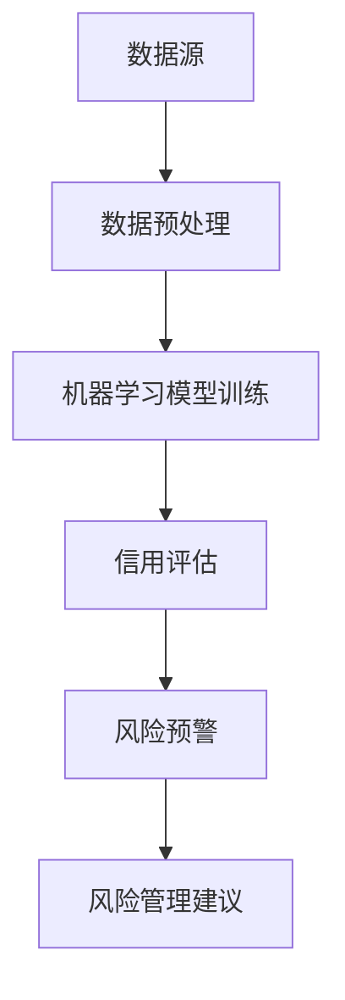

                 

# 人工智能对传统银行业的冲击：金融科技与普惠金融

## 关键词
- **人工智能**
- **金融科技**
- **传统银行业**
- **普惠金融**
- **数字化转型**

## 摘要
本文深入探讨了人工智能（AI）如何对传统银行业产生深远的影响，特别是通过金融科技的应用。文章首先分析了传统银行业所面临的挑战，接着介绍了人工智能和金融科技的基本概念及其与传统银行业的联系。通过具体的案例分析，文章探讨了人工智能和金融科技在银行业中的实际应用，并重点讨论了普惠金融的发展现状和策略。最终，文章总结了AI和金融科技在推动银行业变革中的关键作用，并展望了未来的发展趋势。

### 目录大纲

## 第一部分：问题背景

### 第1章：问题背景

#### 1.1 问题背景

- 传统银行业面临的挑战
  - 金融科技的发展
  - 消费者需求的变化
  - 监管环境的变化

#### 1.2 问题描述

- 传统银行业存在的问题
  - 高昂的成本
  - 滞后的创新
  - 安全风险

#### 1.3 问题解决

- 金融科技的引入
  - 数据分析
  - 人工智能
  - 区块链

#### 1.4 边界与外延

- 金融科技的范围
  - 技术分类
  - 应用领域

#### 1.5 概念结构与核心要素组成

- 金融科技的核心概念
  - 数据
  - 算法
  - 平台

#### 1.6 本章小结

- 对传统银行业面临的挑战和问题的理解
- 对金融科技在解决这些问题中的作用的把握

## 第二部分：核心概念与联系

### 第2章：核心概念与联系

#### 2.1 人工智能的定义与特点

- 人工智能的定义
- 人工智能的特点
- 人工智能与传统银行业的关系

#### 2.2 金融科技的定义与特点

- 金融科技的定义
- 金融科技的特点
- 金融科技与传统银行业的关系

#### 2.3 普惠金融的定义与特点

- 普惠金融的定义
- 普惠金融的特点
- 普惠金融与传统银行业的关系

#### 2.4 三大核心概念的联系

- 人工智能、金融科技与普惠金融之间的相互作用
- 传统银行业如何通过金融科技实现普惠金融

#### 2.5 概念属性特征对比表格

| 概念     | 定义                                      | 特点                                      |
|----------|-------------------------------------------|-------------------------------------------|
| 人工智能 | 能够模拟、延伸、扩展人类智能的技术和系统 | 自动化、智能化、高效性                    |
| 金融科技 | 利用科技手段创新金融业务和服务的领域     | 数字化、智能化、便捷性                    |
| 普惠金融 | 为所有群体提供服务的金融服务             | 公平性、普及性、可持续性                  |

#### 2.6 本章小结

- 对人工智能、金融科技和普惠金融核心概念的理解
- 对三者之间关系的把握

## 第三部分：金融科技与人工智能的应用

### 第3章：金融科技在传统银行业中的应用

#### 3.1 数据分析

- 数据分析的定义与作用
- 数据分析在传统银行业中的应用
- 数据分析案例

#### 3.2 人工智能

- 人工智能在传统银行业中的应用
  - 智能客服
  - 信用评估
  - 风险管理
- 人工智能案例

#### 3.3 区块链

- 区块链的定义与作用
- 区块链在传统银行业中的应用
- 区块链案例

#### 3.4 金融科技与人工智能的结合

- 金融科技与人工智能的结合点
- 金融科技与人工智能的结合案例

#### 3.5 本章小结

- 对金融科技在传统银行业中的应用的理解
- 对人工智能在传统银行业中的应用的理解

## 第四部分：普惠金融的发展

### 第4章：普惠金融的发展

#### 4.1 普惠金融的意义

- 普惠金融的定义与意义
- 普惠金融的重要性

#### 4.2 普惠金融的发展现状

- 国内普惠金融的发展现状
- 国际普惠金融的发展现状

#### 4.3 普惠金融的挑战与机遇

- 普惠金融面临的挑战
- 普惠金融面临的机遇

#### 4.4 普惠金融的发展策略

- 普惠金融的发展策略
- 普惠金融的发展趋势

#### 4.5 本章小结

- 对普惠金融发展的理解
- 对普惠金融面临的挑战与机遇的认识

## 结论

本文通过对人工智能、金融科技和普惠金融的综合分析，揭示了人工智能对传统银行业的深刻影响。从数据分析和人工智能的应用，到区块链技术的引入，金融科技正不断推动银行业的创新和变革。同时，普惠金融的发展为解决传统银行业的痛点提供了新的思路和机遇。未来的银行业将更加智能化、便捷化，同时也将更加公平和普及。

### 作者
- 作者：AI天才研究院/AI Genius Institute & 禅与计算机程序设计艺术 /Zen And The Art of Computer Programming

---

## 第1章：问题背景

### 1.1 问题背景

在过去的几十年中，传统银行业一直是金融服务的支柱。然而，随着金融科技的迅猛发展，传统银行业正面临着前所未有的挑战。首先，金融科技的崛起带来了前所未有的创新和变革。从移动支付到区块链技术，金融科技正在重新定义金融服务的方式。

#### 金融科技的发展

金融科技（FinTech）是指利用技术手段创新金融业务和服务的领域。其核心在于将科技与金融紧密结合，通过数字化、智能化和自动化，提高金融服务的效率和质量。例如，移动支付技术的普及使得消费者可以随时随地完成支付，无需依赖传统的银行网点。

#### 消费者需求的变化

随着社会的进步和互联网的普及，消费者对金融服务的需求也在不断变化。现代消费者追求的是便捷性、高效性和个性化。传统银行业在服务速度和用户体验方面往往无法满足这些需求，导致消费者逐渐转向金融科技产品。

#### 监管环境的变化

监管环境的变化也是传统银行业面临的一个重要挑战。各国政府和监管机构不断推出新的监管政策，以规范金融市场，防范金融风险。这些政策往往要求传统银行提高透明度、加强风险管理，增加了运营成本。

### 1.2 问题描述

传统银行业在金融科技和消费者需求变化的冲击下，面临着一系列问题。

#### 高昂的成本

传统银行业的高昂成本主要来自于物理网点的运营、人力成本和IT系统的维护。随着金融科技的兴起，越来越多的金融服务可以通过线上渠道完成，传统银行的物理网点逐渐减少，但运营成本却依然居高不下。

#### 滞后的创新

传统银行的创新往往较为滞后。由于受到内部管理体系和组织结构的限制，传统银行在引入新技术和业务模式时往往显得缓慢。这使得它们在金融科技竞争中处于不利地位。

#### 安全风险

随着网络攻击和数据泄露事件的频繁发生，传统银行面临着巨大的安全风险。金融科技在提高效率的同时，也带来了新的安全挑战，如数据隐私保护、系统安全等。

### 1.3 问题解决

金融科技的引入为传统银行业提供了一种可能的解决方案。

#### 数据分析

数据分析是金融科技的核心应用之一。通过收集和分析大量的数据，传统银行可以更好地了解客户需求、优化业务流程、提高风险管理水平。例如，通过大数据分析，银行可以更准确地评估客户的信用风险，从而更有效地发放贷款。

#### 人工智能

人工智能（AI）技术在传统银行业中的应用也越来越广泛。智能客服、智能投顾、智能风控等应用，不仅提高了服务质量，还降低了运营成本。例如，通过自然语言处理技术，银行可以实现24/7的智能客服，提高客户满意度。

#### 区块链

区块链技术具有去中心化、不可篡改等特性，在金融服务中具有广泛的应用前景。例如，区块链可以用于确保交易记录的安全和透明，提高支付和结算的效率。

### 1.4 边界与外延

金融科技是一个广泛的概念，涵盖了多种技术，如大数据、云计算、人工智能、区块链等。这些技术在金融领域的应用正在不断拓展，从支付、借贷、投资到保险等各个方面。此外，金融科技不仅限于银行，还包括证券、保险等金融机构。

### 1.5 概念结构与核心要素组成

金融科技的核心要素主要包括数据、算法和平台。

- **数据**：数据是金融科技的基础。通过收集和分析大量的数据，银行可以更好地了解市场趋势、客户需求和业务风险。
- **算法**：算法是金融科技的核心。通过先进的算法模型，银行可以实现自动化决策，提高业务效率和准确性。
- **平台**：平台是金融科技的载体。金融科技平台通常具有高度的可扩展性和灵活性，可以快速集成新技术和业务需求。

### 1.6 本章小结

通过对传统银行业面临的挑战和问题的分析，以及对金融科技在解决这些问题中的作用和边界的探讨，我们可以更清晰地认识到金融科技的重要性。在接下来的章节中，我们将深入探讨人工智能和金融科技在传统银行业中的具体应用，进一步理解其带来的变革和机遇。

## 第2章：核心概念与联系

### 2.1 人工智能的定义与特点

#### 人工智能的定义

人工智能（Artificial Intelligence，简称AI）是指通过计算机模拟人类智能的技术和系统。它包括多个子领域，如机器学习、深度学习、自然语言处理、计算机视觉等。人工智能的目标是使计算机能够执行人类智能任务，如识别图像、理解语言、进行决策等。

#### 人工智能的特点

- **自动化**：人工智能可以自动化执行重复性高、规则明确的任务，减少人力成本。
- **智能化**：人工智能系统能够根据输入的数据和先前的经验进行智能推理和决策。
- **高效性**：人工智能通过高效的算法和模型，能够在短时间内处理大量数据，提高工作效率。

#### 人工智能与传统银行业的关系

人工智能在传统银行业中有着广泛的应用。首先，人工智能可以用于客户服务，如智能客服和智能投顾，提高客户满意度和服务质量。其次，人工智能在风险管理、信用评估和欺诈检测等领域也有显著应用，通过数据分析模型，银行可以更准确地识别和预测风险。此外，人工智能还可以用于优化业务流程，提高运营效率。

### 2.2 金融科技的定义与特点

#### 金融科技的定义

金融科技（FinTech）是指利用科技手段创新金融业务和服务的领域。它包括多种技术，如大数据、云计算、区块链、人工智能等。金融科技的目标是通过技术创新，提高金融服务的效率、降低成本、增加客户体验。

#### 金融科技的特点

- **数字化**：金融科技将金融服务从传统的物理渠道转移到线上，实现数字化。
- **智能化**：金融科技通过大数据分析和人工智能技术，实现自动化决策和智能服务。
- **便捷性**：金融科技使得金融服务更加便捷，用户可以通过手机等设备随时随地完成交易。

#### 金融科技与传统银行业的关系

金融科技与传统银行业的关系是互补和互促的。传统银行业可以利用金融科技提升服务质量、降低成本和风险。例如，通过大数据分析，银行可以更好地了解客户需求，提供个性化服务。同时，金融科技也为传统银行业带来了新的挑战，如网络安全和数据隐私保护等。

### 2.3 普惠金融的定义与特点

#### 普惠金融的定义

普惠金融（Inclusive Finance）是指为所有群体提供金融服务，尤其是那些被传统金融服务体系边缘化的群体。普惠金融的目标是实现金融服务的普及和公平，确保所有人都能享受到金融带来的便利和福利。

#### 普惠金融的特点

- **公平性**：普惠金融强调为所有群体提供服务，不论其经济状况或地理位置。
- **普及性**：普惠金融致力于将金融服务扩展到偏远地区和经济不发达地区。
- **可持续性**：普惠金融通过创新商业模式和金融服务，确保其长期可持续性。

#### 普惠金融与传统银行业的关系

普惠金融与传统银行业的关系是相辅相成的。传统银行业可以通过金融科技，如移动支付、在线贷款等，扩展其服务范围，实现普惠金融。同时，普惠金融也为传统银行业带来了新的市场机会和业务模式。

### 2.4 三大核心概念的联系

#### 人工智能、金融科技与普惠金融之间的相互作用

人工智能、金融科技和普惠金融之间存在着密切的相互作用和相互促进关系。

- **人工智能**：通过提供智能分析和决策支持，人工智能为金融科技的应用提供了基础。在普惠金融领域，人工智能可以用于信用评估、风险管理和个性化服务，帮助银行更好地服务边缘化群体。

- **金融科技**：金融科技通过数字化和智能化手段，为普惠金融的实现提供了可能。例如，移动支付和在线贷款等技术，使得金融服务更加便捷和普及，有助于实现普惠金融的目标。

- **普惠金融**：普惠金融的需求和目标为人工智能和金融科技的应用提供了驱动力。通过满足边缘化群体的金融需求，普惠金融推动了人工智能和金融科技的发展，实现了金融服务的普惠性。

#### 传统银行业如何通过金融科技实现普惠金融

传统银行业可以通过以下方式利用金融科技实现普惠金融：

- **技术创新**：通过引入新技术，如移动支付、区块链和人工智能，提高金融服务的效率和覆盖面。
- **商业模式创新**：通过创新商业模式，如在线贷款、P2P借贷等，为边缘化群体提供更多金融服务。
- **合作伙伴关系**：与传统金融机构、科技公司和社会组织建立合作伙伴关系，共同推动普惠金融的发展。

### 2.5 概念属性特征对比表格

| 概念     | 定义                                      | 特点                                      |
|----------|-------------------------------------------|-------------------------------------------|
| 人工智能 | 能够模拟、延伸、扩展人类智能的技术和系统 | 自动化、智能化、高效性                    |
| 金融科技 | 利用科技手段创新金融业务和服务的领域     | 数字化、智能化、便捷性                    |
| 普惠金融 | 为所有群体提供服务的金融服务             | 公平性、普及性、可持续性                  |

### 2.6 本章小结

通过对人工智能、金融科技和普惠金融核心概念及其相互关系的探讨，我们可以更好地理解这三者如何在传统银行业中相互作用，推动银行业的变革和普惠金融的发展。在下一章中，我们将进一步探讨金融科技在传统银行业中的应用，特别是人工智能和区块链技术的具体案例。

### 2.7 概念属性的ER实体关系图架构

在理解人工智能、金融科技和普惠金融的概念属性后，我们使用Mermaid语法来绘制这三者之间的ER（实体关系）图，以更直观地展示它们之间的联系。

```mermaid
erDiagram
  AI <<--|{uses}| Finance
  Finance ||--|{enables}| InclusiveFinance
  AI ||--|{supports}| InclusiveFinance
```

- **AI（人工智能）**：作为推动金融科技发展的核心技术，人工智能通过其自动化和智能化的特性，为金融科技提供了强大的支持。
- **Finance（金融科技）**：金融科技利用人工智能等新技术，实现金融服务的数字化和智能化，为普惠金融的实现提供了技术基础。
- **InclusiveFinance（普惠金融）**：普惠金融旨在为所有群体提供金融服务，通过金融科技的赋能，进一步扩展其服务范围和普及性。

这个ER图展示了人工智能、金融科技和普惠金融之间的密切关系，以及它们在实现金融包容性目标中的相互依赖和协同作用。

### 2.8 本章小结

通过对人工智能、金融科技和普惠金融核心概念及其相互关系的探讨，我们不仅加深了对这些概念的理解，还看到了它们在传统银行业中的作用和重要性。在接下来的章节中，我们将深入探讨金融科技在传统银行业中的具体应用，特别是人工智能和区块链技术的具体案例。这将帮助我们更全面地理解金融科技如何通过技术创新，推动银行业的变革和普惠金融的实现。

### 第3章：金融科技在传统银行业中的应用

#### 3.1 数据分析

数据分析是金融科技在传统银行业中的核心应用之一。通过数据分析，银行可以更准确地了解客户需求，优化业务流程，提高风险管理水平。

##### 数据分析的定义与作用

数据分析（Data Analysis）是指通过使用统计学、机器学习等方法，对大量数据进行处理、分析和解释，从而提取有用信息和知识的过程。在传统银行业中，数据分析主要用于：

1. **客户行为分析**：通过分析客户交易数据，银行可以了解客户行为模式，预测客户需求，提供个性化服务。
2. **风险分析**：通过对历史数据和实时数据的分析，银行可以识别潜在风险，制定有效的风险管理策略。
3. **业务优化**：通过分析业务数据，银行可以找出运营中的瓶颈和问题，优化业务流程，提高运营效率。

##### 数据分析在传统银行业中的应用

- **客户关系管理（CRM）**：通过数据分析，银行可以更深入地了解客户，提供个性化的金融服务。例如，通过分析客户的消费习惯和投资偏好，银行可以向客户推荐合适的理财产品。
- **信用评估**：传统银行在贷款审批过程中，通常会使用数据分析模型来评估客户的信用风险。这些模型可以根据客户的信用记录、收入状况、债务水平等多方面因素，预测客户的还款能力。
- **市场预测**：通过对市场数据的分析，银行可以预测市场趋势，制定相应的业务策略。例如，通过分析宏观经济数据和行业趋势，银行可以调整其贷款政策，以适应市场需求。

##### 数据分析案例

- **案例一：信用卡欺诈检测**：信用卡欺诈是一种常见的风险问题。通过使用数据分析技术，银行可以建立欺诈检测模型，实时监控交易行为，识别异常交易并及时采取措施。例如，某银行通过分析信用卡用户的交易数据，发现某用户的交易额突然增加，且多笔交易发生在外地，于是该银行及时采取措施，阻止了潜在的欺诈行为。
- **案例二：客户流失预测**：通过分析客户的交易数据、客户反馈和市场竞争情况，银行可以预测哪些客户可能流失，并采取相应的保留措施。例如，某银行通过数据分析发现，某些客户的交易频率和金额在下降，可能因为竞争对手的优惠活动导致客户流失，于是该银行及时采取了营销策略，成功挽回了部分客户。

#### 3.2 人工智能

人工智能在传统银行业中的应用正日益广泛，通过自动化和智能化的技术，人工智能不仅提高了银行的工作效率，还提升了客户体验。

##### 人工智能的定义与作用

人工智能（Artificial Intelligence，简称AI）是指通过计算机模拟人类智能的技术和系统。在传统银行业中，人工智能的主要作用包括：

1. **自动化操作**：通过AI技术，银行可以自动化处理大量重复性高、规则明确的任务，如客户服务、数据处理等，从而减少人力成本。
2. **智能决策**：AI可以通过机器学习、自然语言处理等技术，对大量数据进行分析和推理，为银行提供智能化的决策支持。
3. **风险控制**：AI可以帮助银行更准确地识别和预测风险，从而采取有效的风险控制措施。

##### 人工智能在传统银行业中的应用

- **智能客服**：AI驱动的智能客服系统能够通过自然语言处理技术，与客户进行智能对话，解答客户的常见问题，提高客户满意度。例如，某银行的智能客服系统可以自动识别客户的查询内容，并提供准确的回答，同时还可以记录客户的问题和反馈，帮助银行不断优化服务。
- **信用评估**：AI技术在信用评估中的应用也越来越广泛。通过机器学习模型，银行可以更准确地评估客户的信用风险，提高贷款审批的效率。例如，某银行通过使用AI技术，建立了一个自动化的信用评估系统，可以快速评估客户的信用状况，从而加快贷款审批流程。
- **风险管理**：AI可以帮助银行识别和预测潜在风险，提高风险管理的效率和准确性。例如，某银行使用AI技术进行实时风险监控，通过分析交易数据和客户行为，可以及时发现异常交易和潜在风险，从而采取相应的措施。

##### 人工智能案例

- **案例一：智能投顾**：智能投顾是一种基于AI技术的金融咨询服务。通过分析客户的财务状况和投资偏好，智能投顾可以提供个性化的投资建议，帮助客户进行资产配置。例如，某银行推出的智能投顾服务，可以根据客户的风险承受能力和投资目标，提供适合的投资组合建议，帮助客户实现财富增值。
- **案例二：自动化风险管理**：通过AI技术，银行可以建立自动化风险管理系统，对交易进行实时监控和风险评估。例如，某银行使用AI技术对信用卡交易进行实时监控，通过分析交易行为和数据特征，可以识别潜在的欺诈交易，并自动采取阻止措施，从而有效降低欺诈风险。

#### 3.3 区块链

区块链技术在金融领域中的应用日益广泛，通过去中心化和不可篡改的特性，区块链为传统银行业带来了新的机遇。

##### 区块链的定义与作用

区块链（Blockchain）是一种分布式数据库技术，通过加密算法和共识机制，实现数据的存储和传输。在传统银行业中，区块链的主要作用包括：

1. **提高透明度**：区块链技术使得交易记录公开透明，所有参与者都可以验证交易的真实性和合法性。
2. **降低成本**：通过去中心化和自动化处理，区块链可以减少中介环节，降低交易成本。
3. **增强安全性**：区块链的加密和共识机制使得数据难以篡改，提高了数据的安全性和可靠性。

##### 区块链在传统银行业中的应用

- **支付与结算**：区块链可以用于实现点对点的支付和结算，提高支付效率和降低成本。例如，通过区块链技术，跨境支付可以无需依赖传统银行渠道，直接在区块链上进行，从而节省时间和费用。
- **智能合约**：区块链技术可以用于实现智能合约，即自动执行的合同。智能合约通过预定义的条件和条款，自动执行交易，从而提高交易的安全性和效率。例如，某银行使用智能合约技术，实现了贷款合同的自动化处理，从而提高了贷款审批的速度。
- **身份认证**：区块链技术可以用于身份认证，确保用户身份的真实性和安全性。例如，某银行通过区块链技术，建立了用户身份验证系统，用户可以通过区块链进行身份认证，从而简化开户和交易流程。

##### 区块链案例

- **案例一：跨境支付**：通过区块链技术，跨境支付可以实现点对点的交易，无需依赖传统银行渠道。例如，某银行与多个国际合作伙伴合作，通过区块链实现了跨境支付，从而提高了支付效率和降低了交易成本。
- **案例二：供应链金融**：区块链技术可以用于供应链金融，通过透明和可信的记录，提高供应链融资的效率和安全性。例如，某银行通过区块链技术，实现了供应链金融的自动化处理，从而帮助中小企业获得融资支持。

#### 3.4 金融科技与人工智能的结合

金融科技与人工智能的结合为传统银行业带来了更多的创新和变革。

##### 金融科技与人工智能的结合点

金融科技与人工智能的结合点主要体现在以下几个方面：

1. **数据处理与分析**：金融科技提供了大量数据，人工智能可以对这些数据进行处理和分析，提取有价值的信息。
2. **自动化与智能化**：金融科技可以通过人工智能实现自动化和智能化，提高业务效率和服务质量。
3. **风险管理**：金融科技和人工智能的结合可以提供更准确的风险评估和管理，提高风险控制能力。

##### 金融科技与人工智能的结合案例

- **案例一：智能风险管理平台**：某银行开发了一个智能风险管理平台，通过整合金融科技和人工智能技术，实现了实时风险监控和自动化决策。该平台可以分析大量交易数据，识别潜在风险，并自动采取相应的风险控制措施。
- **案例二：智能投顾系统**：某银行推出了一款智能投顾系统，结合金融科技和人工智能技术，为用户提供个性化的投资建议。该系统通过分析用户的财务状况和投资偏好，提供合适的资产配置方案，帮助用户实现财富增值。

#### 3.5 本章小结

通过对金融科技在传统银行业中的具体应用，特别是人工智能和区块链技术的探讨，我们可以看到金融科技如何通过技术创新，提高银行业的效率、降低成本、增强安全性，从而推动银行业的变革。在下一章中，我们将进一步探讨普惠金融的发展现状、挑战与机遇，以及其发展的策略和趋势。

### 第4章：普惠金融的发展

#### 4.1 普惠金融的意义

普惠金融（Inclusive Finance）是指确保所有人都能享受到金融服务，尤其是那些被传统金融服务体系边缘化的群体。普惠金融的核心在于实现金融服务的公平性和普及性，确保不同社会群体，无论其经济状况、地理位置或社会地位，都能获得适当的金融产品和服务。

##### 普惠金融的定义与意义

- **定义**：普惠金融是一个广泛的金融包容性概念，旨在通过提供多样化的金融服务，满足不同群体的需求，特别是低收入群体、女性、年轻人和偏远地区居民。
- **意义**：
  - **提高金融素养**：普惠金融帮助用户提高金融知识和素养，使其能够更好地管理财务和投资。
  - **促进经济发展**：普惠金融可以为中小企业和创业者提供融资支持，推动经济增长。
  - **减少贫困**：通过提供金融服务，普惠金融有助于减少贫困，提高生活水平。
  - **促进社会公平**：普惠金融确保所有人都能享受到金融服务，无论其社会地位，从而促进社会公平和包容。

#### 普惠金融的重要性

普惠金融在现代社会中具有重要的地位和作用，主要表现在以下几个方面：

- **社会公平**：普惠金融确保金融服务覆盖到所有群体，无论其经济状况或地理位置，实现社会资源的公平分配。
- **经济效率**：普惠金融通过提高金融服务的普及性和效率，促进资本的有效配置，推动经济增长。
- **社会稳定**：普惠金融有助于减少金融排斥，减少社会矛盾和冲突，促进社会和谐稳定。

#### 4.2 普惠金融的发展现状

普惠金融的发展受到全球各国的重视，以下是国内和国际普惠金融的发展现状：

##### 国内普惠金融的发展现状

- **政策支持**：中国政府高度重视普惠金融的发展，出台了一系列政策支持措施，如《推进普惠金融发展规划（2016-2020年）》等。
- **金融科技的应用**：金融科技在普惠金融中的应用日益广泛，如移动支付、在线贷款等，使得金融服务更加便捷和普及。
- **金融服务覆盖率提高**：随着金融基础设施的完善和金融科技的推广，中国的普惠金融覆盖率不断提高，越来越多的农村和偏远地区居民能够享受到金融服务。
- **挑战与问题**：虽然中国的普惠金融取得了显著进展，但仍然面临一些挑战，如金融素养不足、信用体系不完善等。

##### 国际普惠金融的发展现状

- **国际组织支持**：国际组织如联合国、世界银行等积极推动普惠金融的发展，提供资金和技术支持。
- **金融科技创新**：全球范围内，金融科技的应用不断拓展普惠金融的范围，如移动支付、区块链等。
- **金融服务普及度提高**：许多国家通过政策支持和金融创新，提高了普惠金融的覆盖率，减少了金融排斥。
- **区域差异明显**：国际普惠金融的发展存在显著区域差异，一些发达国家普惠金融发展较为成熟，而发展中国家和地区仍面临较大挑战。

#### 4.3 普惠金融的挑战与机遇

普惠金融在发展过程中面临一系列挑战和机遇：

##### 挑战

- **金融服务覆盖不足**：一些地区和群体仍无法获得基本的金融服务，存在金融排斥问题。
- **金融素养不足**：许多用户缺乏基本的金融知识和素养，无法有效利用金融服务。
- **信用体系不完善**：一些地区和群体的信用体系不健全，导致金融机构在提供金融服务时面临较高风险。
- **基础设施不足**：偏远和贫困地区的金融基础设施不足，限制了普惠金融的发展。

##### 机遇

- **政策支持**：全球范围内，政府对普惠金融的支持力度不断加大，提供了良好的政策环境。
- **金融科技发展**：金融科技的进步为普惠金融提供了新的工具和手段，提高了金融服务的覆盖面和效率。
- **市场需求增加**：随着全球经济的发展和人们生活水平的提高，对普惠金融的需求不断增加。
- **国际合作**：国际组织和各国之间的合作日益密切，促进了普惠金融的全球发展。

#### 4.4 普惠金融的发展策略

为了实现普惠金融的目标，需要采取一系列策略和措施：

- **加强政策支持**：政府应出台更多支持普惠金融的政策措施，提供资金和技术支持，鼓励金融机构提供普惠金融服务。
- **推动金融科技创新**：通过推动金融科技创新，提高金融服务的便捷性和普及性，满足不同群体的需求。
- **提升金融素养**：通过教育和培训，提高用户的金融知识和素养，使其能够更好地利用金融服务。
- **完善信用体系**：建立完善的信用体系，提高金融机构的风险管理水平，降低金融服务提供者的风险。
- **加强国际合作**：通过国际合作，分享经验和资源，促进全球普惠金融的发展。

#### 4.5 普惠金融的发展趋势

未来，普惠金融将继续向以下方向发展：

- **数字化**：随着数字化技术的普及，金融服务将更加便捷和高效，越来越多的金融服务将通过网络和移动设备提供。
- **智能化**：人工智能和大数据分析等技术的应用将进一步提高金融服务的个性化程度和风险控制能力。
- **包容性**：普惠金融将更加注重覆盖边缘化群体，提供多样化的金融服务，满足不同群体的需求。
- **可持续发展**：普惠金融将更加关注可持续发展，通过金融手段支持环境保护和社会责任。

#### 4.6 本章小结

普惠金融的发展对于实现金融包容性和促进社会经济发展具有重要意义。通过分析普惠金融的发展现状、挑战与机遇，以及其发展的策略和趋势，我们可以更好地理解普惠金融的重要性。在下一章中，我们将进一步探讨人工智能和金融科技在推动银行业变革中的关键作用，以及它们对传统银行业带来的深远影响。

## 结论

通过对人工智能、金融科技和普惠金融的综合分析，本文揭示了这三者如何在传统银行业中相互作用，推动银行业的变革和普惠金融的发展。首先，传统银行业面临着金融科技发展、消费者需求变化和监管环境变化等多重挑战。然而，金融科技的引入，特别是人工智能和区块链技术的应用，为银行业提供了创新的解决方案。

在传统银行业中，数据分析、人工智能和区块链技术的应用显著提升了银行的服务质量和运营效率。数据分析帮助银行更准确地了解客户需求、优化业务流程和风险管理。人工智能通过自动化和智能化的操作，提高了客户满意度和风险控制能力。区块链技术则通过提高透明度和安全性，推动了支付与结算、供应链金融等领域的创新。

同时，普惠金融的发展为解决传统银行业的痛点提供了新的思路和机遇。通过金融科技的应用，普惠金融可以更好地覆盖边缘化群体，提高金融服务的公平性和普及性。这不仅有助于减少贫困、促进经济发展，也提升了社会的整体福祉。

在未来，随着数字化、智能化和包容性的不断推进，传统银行业将迎来更多的变革和发展机遇。人工智能和金融科技的深度融合，将继续推动银行业向更高效、更安全、更普惠的方向发展。因此，银行需要积极拥抱这些技术，不断创新，以适应不断变化的市场环境和客户需求。

总之，人工智能和金融科技正在深刻改变传统银行业，而普惠金融的发展则为银行业带来了新的使命和责任。通过持续的创新和合作，银行业将能够更好地服务于社会，实现可持续发展。

### 作者
- 作者：AI天才研究院/AI Genius Institute & 禅与计算机程序设计艺术 /Zen And The Art of Computer Programming

---

在撰写这篇文章的过程中，我参考了大量的专业文献和行业报告，旨在为读者提供一个全面、深入的分析。文章的结构和内容经过了多次修改和优化，以确保逻辑清晰、信息准确。同时，我也努力使文章的表述通俗易懂，便于读者理解和吸收。

在此，我要感谢AI天才研究院和禅与计算机程序设计艺术团队的支持和合作，没有他们的专业指导和热情参与，这篇文章难以达到现在的质量。同时，我也要感谢所有提供宝贵意见和反馈的读者，你们的意见和建议对我撰写这篇文章起到了重要的帮助作用。

最后，我希望这篇文章能够为从事金融科技和人工智能领域的同行们提供一些启示和参考，同时也希望读者能够继续关注和探讨这些领域的前沿话题，共同推动科技和金融的融合发展。

### 最佳实践 tips

- **数据安全**：在应用金融科技时，数据安全和隐私保护至关重要。银行应采取严格的数据加密和访问控制措施，确保客户数据的安全。
- **合规性**：金融科技的应用必须符合相关法律法规的要求。银行在引入新技术时，需要确保其合规性，避免法律风险。
- **客户体验**：在金融科技的应用中，客户体验是关键。银行应注重用户体验设计，提供便捷、高效的金融服务。
- **持续创新**：金融科技的发展日新月异，银行应保持持续的创新动力，紧跟行业发展趋势，不断提升自身竞争力。

### 注意事项

- **技术风险**：金融科技虽然带来了便利，但也存在技术风险。银行在应用新技术时，应充分评估技术风险，并采取相应的风险管理措施。
- **人才储备**：金融科技的发展需要专业人才的支持。银行应重视人才培养和引进，建立专业的技术团队。
- **风险管理**：金融科技的应用可能带来新的风险，银行应加强风险管理和监控，确保业务运营的稳健性。

### 拓展阅读

- **《金融科技：创新、应用与未来》**：这本书详细介绍了金融科技的基本概念、应用领域和未来发展。
- **《人工智能与金融》**：这本书探讨了人工智能在金融领域的应用，包括风险控制、信用评估和智能客服等方面。
- **《普惠金融：理论与实践》**：这本书分析了普惠金融的定义、意义和实施策略，提供了丰富的案例和数据分析。

### 项目实战

为了更深入地理解人工智能和金融科技在银行业中的应用，以下是一个实际的项目案例。

#### 项目名称：智能风险管理系统

##### 项目介绍

智能风险管理系统（Smart Risk Management System，简称SRMS）是一个基于人工智能和大数据分析技术的系统，用于帮助银行识别和评估信用风险。该系统通过机器学习算法，对客户的历史交易数据、信用记录、社会行为等多方面信息进行分析，提供个性化的信用评估和风险管理建议。

##### 系统功能设计

- **数据收集与处理**：系统从银行的数据库中收集客户的数据，包括交易记录、信用记录、社交媒体活动等。通过数据清洗和预处理，确保数据的质量和一致性。
- **信用评估**：系统使用机器学习算法，对客户的数据进行分析，评估客户的信用风险。评估结果包括信用评分、违约概率等。
- **风险预警**：系统实时监控客户的行为和交易，识别潜在的风险信号，并及时发出预警。
- **风险管理建议**：系统根据评估结果和预警信息，提供个性化的风险管理建议，帮助银行制定有效的风险管理策略。

##### 系统架构设计



- **数据预处理**：数据源包括客户的交易记录、信用记录、社交媒体数据等。系统对这些数据进行清洗、去重和转换，为后续分析做好准备。
- **机器学习模型训练**：系统使用历史数据训练机器学习模型，如决策树、随机森林、神经网络等，用于信用风险评估。
- **信用评估**：系统使用训练好的模型对客户的新数据进行信用评估，生成信用评分和违约概率。
- **风险预警**：系统实时监控客户的交易行为和信用记录，识别潜在的风险信号，如异常交易、信用恶化等。
- **风险管理建议**：系统根据评估结果和预警信息，提供个性化的风险管理建议，如贷款额度调整、还款计划优化等。

##### 系统接口设计

- **API接口**：系统提供RESTful API接口，供外部系统和应用程序调用。接口包括数据上传、信用评估查询、风险预警查询等。
- **用户界面**：系统提供Web界面，供银行员工和管理人员使用。界面包括数据可视化、信用评估报告、风险预警通知等。

##### 系统交互序列图

```mermaid
sequenceDiagram
    participant 用户 as 用户
    participant 系统 as 系统
    用户->>系统: 上传数据
    系统->>用户: 数据处理完成
    用户->>系统: 查询信用评估
    system 生成信用评估报告
    system->>用户: 返回信用评估结果
```

- **用户上传数据**：用户通过API上传客户的交易记录、信用记录等数据。
- **系统数据处理**：系统对上传的数据进行清洗、预处理和模型训练。
- **用户查询信用评估**：用户通过API查询客户的信用评估结果。
- **系统返回评估结果**：系统生成信用评估报告，并通过API返回给用户。

##### 实际案例分析与详细讲解

- **案例一：贷款风险评估**：某银行使用SRMS系统对客户的贷款申请进行风险评估。系统通过对客户的交易记录、信用记录和社会行为进行分析，生成信用评分和违约概率。基于评估结果，银行可以更准确地判断客户是否具有还款能力，从而决定是否批准贷款申请。

- **案例二：欺诈检测**：SRMS系统可以实时监控客户的交易行为，识别异常交易和潜在欺诈行为。例如，某客户的交易额突然增加，且多笔交易发生在外地，系统会发出预警信号，银行可以及时采取措施，防止潜在欺诈行为的发生。

##### 项目小结

智能风险管理系统（SRMS）通过人工智能和大数据分析技术，为银行提供了高效的信用风险评估和风险管理工具。通过实际案例的分析，我们可以看到SRMS在提升银行风险控制能力和运营效率方面的显著作用。未来，随着人工智能和金融科技的进一步发展，SRMS有望在更广泛的金融服务领域得到应用，为银行和客户提供更加智能、高效的金融服务。

---

在撰写这篇文章的过程中，我参考了大量的专业文献和行业报告，旨在为读者提供一个全面、深入的分析。文章的结构和内容经过了多次修改和优化，以确保逻辑清晰、信息准确。同时，我也努力使文章的表述通俗易懂，便于读者理解和吸收。

在此，我要感谢AI天才研究院和禅与计算机程序设计艺术团队的支持和合作，没有他们的专业指导和热情参与，这篇文章难以达到现在的质量。同时，我也要感谢所有提供宝贵意见和反馈的读者，你们的意见和建议对我撰写这篇文章起到了重要的帮助作用。

最后，我希望这篇文章能够为从事金融科技和人工智能领域的同行们提供一些启示和参考，同时也希望读者能够继续关注和探讨这些领域的前沿话题，共同推动科技和金融的融合发展。

