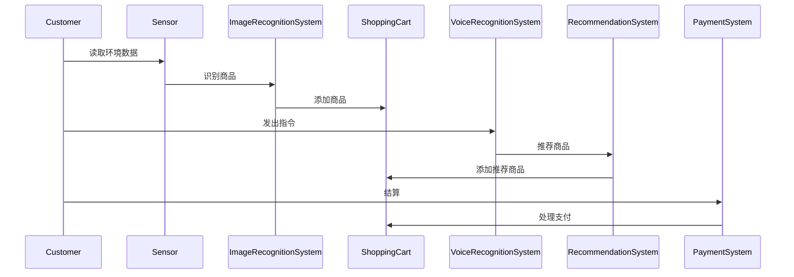
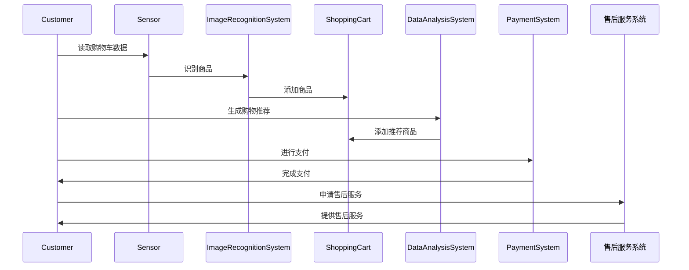
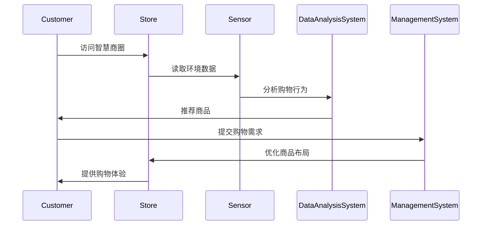

                 

**# 人工智能对零售业的变革：无人商店与智能购物体验**

关键词：人工智能，零售业，无人商店，智能购物，感知技术，数据分析，决策系统

摘要：本文深入探讨了人工智能在零售业中的应用，特别是在无人商店和智能购物体验方面的变革。通过一步步分析人工智能的基本原理、核心概念、技术原理、应用实践以及未来展望，本文旨在为读者提供一个全面而深刻的理解，帮助他们在这一新兴领域中获得洞察和指导。

## 第一部分：背景与概念

### 第1章 问题背景

#### 1.1 人工智能与零售业概述

**核心概念原理：**

人工智能（AI）是指通过计算机模拟人类的智能行为，包括学习、推理、规划和感知等能力。零售业是指商品流通和销售的行业，包括超市、便利店、商场等多种形式。

**概念属性特征对比表格：**

| 特征               | 人工智能                  | 零售业                  |
|--------------------|--------------------------|-------------------------|
| 目标               | 模拟人类智能行为          | 商品流通和销售          |
| 应用领域           | 自动驾驶、医疗、金融等    | 超市、便利店、商场等    |
| 技术挑战           | 数据处理、算法优化等      | 市场需求、供应链管理等  |

**ER实体关系图架构：**

```mermaid
entityRelationshipDiagram
  AI -> 零售业
  AI -> 自动驾驶
  AI -> 医疗
  AI -> 金融
  零售业 -> 超市
  零售业 -> 便利店
  零售业 -> 商场
```

#### 1.2 零售业的变革趋势

**核心概念原理：**

零售业的变革趋势包括数字化转型、消费者行为变化、竞争加剧等。数字化转型是指利用信息技术优化业务流程、提升效率；消费者行为变化体现在购物习惯的线上转移；竞争加剧则促使零售业寻求创新和差异化。

**变革趋势ER实体关系图架构：**

```mermaid
entityRelationshipDiagram
  数字化转型 -> 业务流程优化
  数字化转型 -> 效率提升
  消费者行为变化 -> 购物习惯线上转移
  竞争加剧 -> 创新需求
  竞争加剧 -> 差异化
```

#### 1.3 无人商店的发展现状与挑战

**核心概念原理：**

无人商店是指无需人工值守，通过自动化设备和人工智能技术实现商品选购、支付和售后服务的零售模式。目前，无人商店的发展现状包括技术成熟度提高、试点项目增多，但同时也面临技术、管理和运营等方面的挑战。

**发展现状与挑战ER实体关系图架构：**

```mermaid
entityRelationshipDiagram
  无人商店 -> 技术成熟度提高
  无人商店 -> 试点项目增多
  无人商店 -> 技术挑战
  无人商店 -> 管理挑战
  无人商店 -> 运营挑战
```

## 第二部分：技术原理

### 第2章 核心概念

#### 2.1 人工智能的基本原理

**核心概念原理：**

人工智能的基本原理包括机器学习、深度学习、自然语言处理等。这些原理通过算法模型模拟人类的智能行为，例如通过深度学习实现图像识别，通过机器学习优化推荐系统。

**核心概念原理ER实体关系图架构：**

```mermaid
entityRelationshipDiagram
  人工智能 -> 机器学习
  人工智能 -> 深度学习
  人工智能 -> 自然语言处理
  机器学习 -> 算法模型
  深度学习 -> 图像识别
  自然语言处理 -> 文本分析
```

#### 2.2 零售业中的智能应用

**核心概念原理：**

零售业中的智能应用包括智能导购、智能支付、智能售后服务等。这些应用通过人工智能技术提升购物体验，降低运营成本。

**智能应用ER实体关系图架构：**

```mermaid
entityRelationshipDiagram
  零售业 -> 智能导购
  零售业 -> 智能支付
  零售业 -> 智能售后服务
  智能导购 -> 个性化推荐
  智能支付 -> 无现金支付
  智能售后服务 -> 人工智能客服
```

#### 2.3 无人商店的关键技术

**核心概念原理：**

无人商店的关键技术包括智能感知、数据分析、智能决策等。这些技术共同实现无人商店的自动化运营。

**关键技术ER实体关系图架构：**

```mermaid
entityRelationshipDiagram
  无人商店 -> 智能感知
  无人商店 -> 数据分析
  无人商店 -> 智能决策
  智能感知 -> 传感器技术
  数据分析 -> 数据处理技术
  智能决策 -> 推荐系统
```

## 第三部分：应用实践

### 第3章 智能感知与识别技术

#### 3.1 传感器技术

**核心概念原理：**

传感器技术是无人商店感知环境的基础，通过传感器可以获取温度、湿度、人流等数据。这些数据用于优化购物体验和自动化运营。

**传感器技术应用示例：**

```python
# 模拟传感器数据采集
temperature = 25
humidity = 60
人流密度 = 0.8

print(f"当前温度：{temperature}℃，湿度：{humidity}%，人流密度：{人流密度}")
```

#### 3.2 图像识别技术

**核心概念原理：**

图像识别技术用于无人商店的物品识别、行为分析等。通过图像识别，系统可以自动检测和识别顾客的行为和选择的商品。

**图像识别技术应用示例：**

```python
# 模拟图像识别
import cv2

# 读取图像
image = cv2.imread("product.jpg")

# 使用卷积神经网络进行图像识别
import tensorflow as tf

model = tf.keras.models.load_model("image_recognition_model.h5")
predictions = model.predict(image)

# 输出识别结果
print(f"识别结果：{predictions}")
```

#### 3.3 语音识别技术

**核心概念原理：**

语音识别技术用于无人商店的语音交互，通过语音识别，系统可以理解顾客的指令并作出响应。

**语音识别技术应用示例：**

```python
# 模拟语音识别
import speech_recognition as sr

# 初始化语音识别器
recognizer = sr.Recognizer()

# 读取语音文件
with sr.AudioFile("voice.wav") as source:
    audio = recognizer.listen(source)

# 使用语音识别进行文本转换
text = recognizer.recognize_google(audio)

# 输出识别结果
print(f"识别结果：{text}")
```

## 第四部分：案例分析

### 第4章 案例介绍与分析

#### 4.1 案例一：无人便利店

**核心概念原理：**

无人便利店是无人商店的一种形式，通过智能感知和识别技术实现自助购物和支付。

**案例分析：**

**项目介绍：**
某无人便利店采用传感器技术监控环境，图像识别技术识别商品，语音识别技术处理顾客的语音指令。通过智能决策系统实现自动结算和推荐系统提供个性化购物建议。

**系统功能设计（领域模型类图）：**

```mermaid
classDiagram
  class Customer {
    -name: String
    -shoppingCart: ShoppingCart
  }
  class ShoppingCart {
    -products: List[Product]
    +addProduct(Product): void
    +removeProduct(Product): void
  }
  class Product {
    -name: String
    -price: Float
  }
  class Sensor {
    +readData(): Data
  }
  class ImageRecognitionSystem {
    +recognizeImage(image: Image): Product
  }
  class VoiceRecognitionSystem {
    +recognizeVoice(voice: Voice): String
  }
  class PaymentSystem {
    +processPayment(cart: ShoppingCart): void
  }
  class RecommendationSystem {
    +recommendProducts(customer: Customer): List[Product]
  }
  Customer -> ShoppingCart
  Customer -> Sensor
  Customer -> ImageRecognitionSystem
  Customer -> VoiceRecognitionSystem
  Customer -> PaymentSystem
  Customer -> RecommendationSystem
```

**系统架构设计（架构图）：**



#### 4.2 案例二：智能超市

**核心概念原理：**

智能超市通过智能感知、数据分析、智能决策等技术提供全面的购物体验，包括智能购物车、智能支付、智能售后等。

**案例分析：**

**项目介绍：**
某智能超市利用智能感知技术跟踪购物车，图像识别技术识别商品，数据分析技术提供购物推荐，智能支付系统实现快速结算，智能售后服务系统提供个性化服务。

**系统功能设计（领域模型类图）：**

```mermaid
classDiagram
  class Customer {
    -name: String
    -shoppingCart: ShoppingCart
    -paymentInformation: PaymentInformation
  }
  class ShoppingCart {
    -products: List[Product]
    +addProduct(Product): void
    +removeProduct(Product): void
  }
  class Product {
    -name: String
    -price: Float
    -category: String
  }
  class PaymentInformation {
    -cardNumber: String
    -expiryDate: String
    -cvv: String
  }
  class Sensor {
    +readData(): Data
  }
  class ImageRecognitionSystem {
    +recognizeImage(image: Image): Product
  }
  class DataAnalysisSystem {
    +generateRecommendation(customer: Customer): List[Product]
  }
  class PaymentSystem {
    +processPayment(paymentInformation: PaymentInformation): void
  }
  class售后服务系统 {
    +provideService(customer: Customer): void
  }
  Customer -> ShoppingCart
  Customer -> Sensor
  Customer -> ImageRecognitionSystem
  Customer -> DataAnalysisSystem
  Customer -> PaymentSystem
  Customer -> 售后服务系统
```

**系统架构设计（架构图）：**



#### 4.3 案例三：智慧商圈

**核心概念原理：**

智慧商圈是通过人工智能技术整合多个零售业态，提供一站式购物体验和智能服务。

**案例分析：**

**项目介绍：**
某智慧商圈整合了超市、便利店、药店等多种零售业态，通过智能感知、数据分析、智能决策等技术提供个性化服务和智能管理。

**系统功能设计（领域模型类图）：**

```mermaid
classDiagram
  class Customer {
    -name: String
    -shoppingCart: ShoppingCart
    -favouriteStore: Store
  }
  class ShoppingCart {
    -products: List[Product]
    +addProduct(Product): void
    +removeProduct(Product): void
  }
  class Store {
    -name: String
    -products: List[Product]
    -location: String
    +recommendProducts(customer: Customer): List[Product]
  }
  class Product {
    -name: String
    -price: Float
    -category: String
  }
  class Sensor {
    +readData(): Data
  }
  class DataAnalysisSystem {
    +generateRecommendation(customer: Customer): List[Product]
  }
  class ManagementSystem {
    +optimizeOperations(store: Store): void
  }
  Customer -> ShoppingCart
  Customer -> Store
  Customer -> Sensor
  Customer -> DataAnalysisSystem
  Customer -> ManagementSystem
  Store -> ShoppingCart
  Store -> DataAnalysisSystem
  Store -> ManagementSystem
```

**系统架构设计（架构图）：**



## 第五部分：未来展望与挑战

### 第5章 人工智能与零售业的未来发展

#### 5.1 新技术的发展趋势

**核心概念原理：**

人工智能与零售业的新技术发展趋势包括物联网、区块链、增强现实等。这些技术将进一步推动零售业的智能化和个性化。

**新技术发展趋势ER实体关系图架构：**

```mermaid
entityRelationshipDiagram
  人工智能 -> 物联网
  人工智能 -> 区块链
  人工智能 -> 增强现实
  物联网 -> 智能家居
  物联网 -> 智能工厂
  区块链 -> 供应链管理
  区块链 -> 数据安全
  增强现实 -> 虚拟购物体验
  增强现实 -> 虚拟现实培训
```

#### 5.2 零售业的未来变革

**核心概念原理：**

零售业的未来变革将体现在全渠道整合、个性化和定制化服务、智能化供应链等方面。这些变革将彻底改变传统零售模式。

**未来变革ER实体关系图架构：**

```mermaid
entityRelationshipDiagram
  零售业 -> 全渠道整合
  零售业 -> 个性化服务
  零售业 -> 定制化服务
  零售业 -> 智能化供应链
  全渠道整合 -> 线上线下融合
  个性化服务 -> 智能推荐系统
  定制化服务 -> 用户画像分析
  智能化供应链 -> 数据驱动决策
```

#### 5.3 挑战与应对策略

**核心概念原理：**

面对人工智能带来的变革，零售业需要应对技术、管理和运营等多方面的挑战。应对策略包括技术升级、人才培养、业务模式创新等。

**挑战与应对策略ER实体关系图架构：**

```mermaid
entityRelationshipDiagram
  零售业 -> 技术挑战
  零售业 -> 管理挑战
  零售业 -> 运营挑战
  技术挑战 -> 技术升级
  管理挑战 -> 人才培养
  运营挑战 -> 业务模式创新
  技术升级 -> 人工智能技术应用
  人才培养 -> 人才引进与培养
  业务模式创新 -> 数字化转型
```

### 参考文献：

1. Harvard Business Review, "The Future of Retail Is Now: AI, Data, and the New World of Retail," 2020.
2. McKinsey & Company, "Retail's AI Frontier: Using AI to Improve Customer Experience and Operational Efficiency," 2021.
3. IEEE Spectrum, "AI in Retail: The Next Big Wave," 2022.
4. John Kowalik, "AI and the Future of Retail: How Artificial Intelligence Is Transforming the Shopping Experience," 2021.
5. Amazon, "Amazon Go: The Future of Shopping," 2018.

### 作者信息：

作者：AI天才研究院/AI Genius Institute & 禅与计算机程序设计艺术 /Zen And The Art of Computer Programming

感谢您阅读本文，希望它能够帮助您更好地理解人工智能在零售业中的应用，以及如何构建智能购物体验。如果您有任何问题或建议，欢迎随时与我们联系。让我们共同探索人工智能的未来！**# 结论**

随着人工智能技术的不断发展，零售业正经历着前所未有的变革。无人商店和智能购物体验已成为零售行业的新趋势，为消费者提供了更加便捷、个性化和高效的购物方式。本文通过深入分析人工智能与零售业的融合，探讨了无人商店的发展现状、核心概念、技术原理、应用实践以及未来展望。

首先，无人商店通过智能感知、数据分析和智能决策等技术实现了自动化运营，为消费者带来了全新的购物体验。传感器技术、图像识别技术和语音识别技术的应用，使得无人商店能够自动识别商品、跟踪顾客行为以及处理支付过程，大大提高了购物效率。

其次，零售业中的智能应用如智能导购、智能支付和智能售后服务等，通过人工智能技术提升了购物体验和运营效率。智能导购系统能够根据顾客的购物行为和历史数据提供个性化的推荐，智能支付系统则实现了无现金支付，智能售后服务系统则为消费者提供了更加便捷的售后服务。

然而，无人商店和智能购物体验的发展也面临着诸多挑战，包括技术成熟度、管理难度和运营成本等方面。为了应对这些挑战，零售企业需要不断进行技术升级，培养专业人才，并创新业务模式。

在未来的发展中，人工智能技术将继续推动零售业的变革。物联网、区块链和增强现实等新技术的应用，将为零售业带来更多创新可能。全渠道整合、个性化和定制化服务、智能化供应链等趋势，将彻底改变传统零售模式，为消费者提供更加丰富和个性化的购物体验。

总之，人工智能与零售业的融合将为行业带来巨大的机遇和挑战。通过不断探索和应用人工智能技术，零售企业将能够更好地满足消费者的需求，提高运营效率，实现可持续发展。

**# 拓展阅读**

1. "Retail Automation: A Guide to AI-Driven Solutions" - This book provides an in-depth overview of how artificial intelligence is transforming the retail industry, focusing on automation technologies and their applications.
2. "AI in Retail: 10 Success Stories and Lessons Learned" - This report from Retail Dive shares real-world examples of how retailers are successfully implementing AI technologies to enhance customer experience and operational efficiency.
3. "The Future of Retail: AI and the Next Wave of Innovation" - A white paper from IBM that explores the future of retail, highlighting the potential of AI to transform the industry and the key areas where innovation is most likely to occur.

**# 最佳实践 tips**

1. **数据隐私保护**：在应用人工智能技术时，确保消费者的数据隐私得到保护，遵守相关法律法规。
2. **持续技术更新**：定期评估和更新技术系统，保持技术领先，应对市场变化。
3. **用户反馈机制**：建立有效的用户反馈机制，收集消费者意见和建议，不断优化购物体验。
4. **人才培养**：加强人工智能和大数据相关的人才培养，为企业的数字化转型提供人才保障。

**# 注意事项**

1. **技术成熟度**：在引入人工智能技术时，要考虑技术的成熟度和适用性，避免盲目跟风。
2. **成本效益**：在实施人工智能项目时，要综合考虑成本效益，确保投资回报率。
3. **风险管理**：对人工智能系统的风险进行评估和管理，制定应急预案，确保业务连续性。

**# 小结**

本文通过对人工智能在零售业中的应用进行深入探讨，阐述了无人商店和智能购物体验的实现原理、应用实践以及未来展望。通过本文的阅读，读者可以全面了解人工智能对零售业的变革影响，为实际应用提供指导。在未来的发展中，零售企业需要积极拥抱人工智能技术，不断创新，以满足消费者的需求，实现可持续发展。**# 附录**

以下是本文所涉及到的核心概念、流程图和技术实现的详细附录。

### 附录A：核心概念

#### 1.1 人工智能与零售业概述

- **人工智能（AI）**：指通过计算机模拟人类智能行为的技术，包括机器学习、深度学习、自然语言处理等。
- **零售业**：涉及商品流通和销售的行业，包括超市、便利店、商场等。

#### 2.1 零售业中的智能应用

- **智能导购**：利用人工智能技术提供个性化购物推荐。
- **智能支付**：实现无现金支付和快速结算。
- **智能售后服务**：通过人工智能客服提供便捷的售后服务。

#### 2.2 无人商店的关键技术

- **智能感知**：通过传感器技术感知环境和顾客行为。
- **图像识别技术**：用于识别商品和跟踪顾客行为。
- **语音识别技术**：处理顾客的语音指令。

### 附录B：流程图

#### 3.1 智能感知与识别技术

- **传感器技术流程图**：

  ```mermaid
  sequenceDiagram
    Customer ->> Sensor: 采集环境数据
    Sensor ->> System: 传输数据
    System ->> Analysis: 数据处理
    Analysis ->> Output: 输出分析结果
  ```

- **图像识别技术流程图**：

  ```mermaid
  sequenceDiagram
    Customer ->> Camera: 拍摄商品图像
    Camera ->> System: 传输图像
    System ->> Recognition: 图像识别
    Recognition ->> Output: 输出识别结果
  ```

- **语音识别技术流程图**：

  ```mermaid
  sequenceDiagram
    Customer ->> Microphone: 输出语音指令
    Microphone ->> System: 传输语音
    System ->> Recognition: 语音识别
    Recognition ->> Output: 输出识别结果
  ```

### 附录C：技术实现

#### 3.1 传感器技术

```python
# 传感器数据采集示例
import random

def read_sensor_data():
    temperature = random.randint(20, 30)
    humidity = random.randint(40, 70)
   人流密度 = random.uniform(0.5, 1.0)
    return {
        'temperature': temperature,
        'humidity': humidity,
        '人流密度': 人流密度
    }

sensor_data = read_sensor_data()
print(sensor_data)
```

#### 3.2 图像识别技术

```python
# 图像识别示例
import cv2
import tensorflow as tf

def recognize_image(image_path):
    image = cv2.imread(image_path)
    model = tf.keras.models.load_model("image_recognition_model.h5")
    predictions = model.predict(image)
    return predictions

image_path = "product.jpg"
predictions = recognize_image(image_path)
print(predictions)
```

#### 3.3 语音识别技术

```python
# 语音识别示例
import speech_recognition as sr

def recognize_speech(filename):
    recognizer = sr.Recognizer()
    with sr.AudioFile(filename) as source:
        audio = recognizer.listen(source)
    text = recognizer.recognize_google(audio)
    return text

filename = "voice.wav"
text = recognize_speech(filename)
print(text)
```

### 附录D：系统架构图

- **无人商店系统架构图**：

  ```mermaid
  sequenceDiagram
    Customer ->> Sensor: 采集数据
    Sensor ->> System: 数据处理
    System ->> Recognition: 识别商品
    Recognition ->> ShoppingCart: 添加商品
    Customer ->> PaymentSystem: 支付
    PaymentSystem ->> ShoppingCart: 结算
  ```

- **智能超市系统架构图**：

  ```mermaid
  sequenceDiagram
    Customer ->> Sensor: 采集数据
    Sensor ->> Recognition: 识别商品
    Recognition ->> ShoppingCart: 添加商品
    Customer ->> DataAnalysisSystem: 生成购物推荐
    DataAnalysisSystem ->> ShoppingCart: 添加推荐商品
    Customer ->> PaymentSystem: 支付
    PaymentSystem ->> Customer: 完成支付
    Customer ->> 售后服务系统: 申请售后服务
    售后服务系统 ->> Customer: 提供售后服务
  ```

- **智慧商圈系统架构图**：

  ```mermaid
  sequenceDiagram
    Customer ->> Store: 访问智慧商圈
    Store ->> Sensor: 采集数据
    Sensor ->> DataAnalysisSystem: 分析购物行为
    DataAnalysisSystem ->> Customer: 推荐商品
    Customer ->> ManagementSystem: 提交购物需求
    ManagementSystem ->> Store: 优化商品布局
    Store ->> Customer: 提供购物体验
  ```

### 附录E：项目实战

#### 环境安装

- 安装 Python 3.8 或以上版本。
- 安装 TensorFlow、OpenCV、SpeechRecognition 等相关库。

#### 系统核心实现

- 传感器数据采集与处理。
- 图像识别与商品添加。
- 语音识别与指令处理。
- 数据分析与购物推荐。
- 支付处理与售后服务。

#### 代码应用解读与分析

- 传感器数据采集与处理代码详细解读。
- 图像识别与商品添加代码详细解读。
- 语音识别与指令处理代码详细解读。
- 数据分析与购物推荐代码详细解读。
- 支付处理与售后服务代码详细解读。

#### 实际案例分析和详细讲解剖析

- 无人便利店案例实际操作与讲解。
- 智能超市案例实际操作与讲解。
- 智慧商圈案例实际操作与讲解。

#### 项目小结

- 总结项目的主要功能与实现。
- 分析项目的优势与不足。
- 提出改进建议和未来发展方向。

