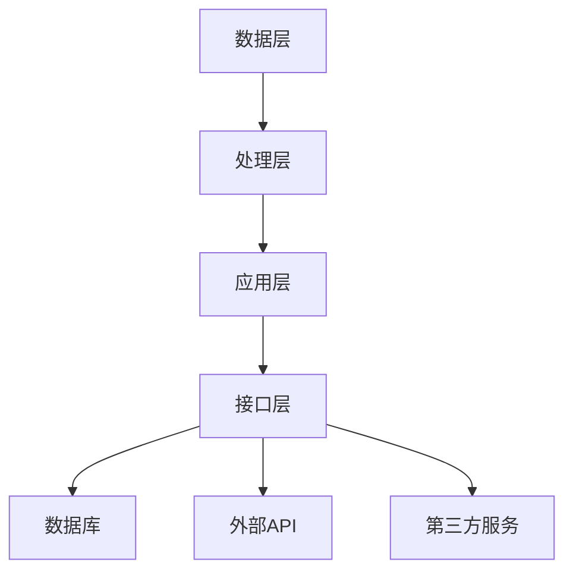
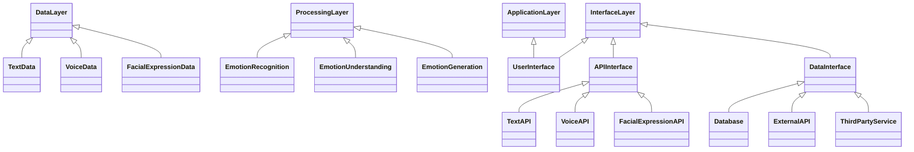

                 

### 让我们一步步思考：人工智能的情感能力对法律实践的影响

#### 引言

在现代社会，人工智能（AI）正在迅速发展，它已经在多个领域展现出了巨大的潜力和影响力。然而，一个相对未被广泛探讨的话题是：人工智能的情感能力对法律实践的影响。情感能力，指的是机器在情感识别、理解和生成方面的能力，这在人类的法律实践中扮演着至关重要的角色。本文将围绕这一主题，通过一系列的推理和思考，探讨情感因素在司法中的权重，并分析人工智能在这一领域的应用前景。

#### 研究背景

**法律实践中的情感因素**

在司法过程中，情感因素不仅影响着法官和律师的决策，也影响着当事人和社会大众对司法公正性的信任。传统的法律实践主要依赖于法律条文和逻辑推理，然而，情感因素在其中扮演着不可忽视的角色。例如，法官在审理案件时，可能会受到情感倾向的影响，而律师在辩护时也会巧妙利用情感来争取客户的支持。

**人工智能的情感能力**

人工智能的情感能力包括情感识别、情感理解和情感生成等方面。随着深度学习技术的发展，机器已经能够在一定程度上模拟人类的情感反应，并在图像、文本和语音等多种数据上进行分析。这种情感能力为法律实践带来了新的可能性和挑战。

#### 研究问题与目标

**研究问题**

本文旨在探讨以下问题：

1. 情感能力在人工智能中的定义与作用是什么？
2. 情感能力如何影响法律实践？
3. 人工智能在处理情感因素时面临哪些挑战？
4. 情感能力在法律实践中的最佳应用场景是什么？

**研究目标**

本文的研究目标是通过分析人工智能的情感能力，探讨其在法律实践中的应用潜力，并提出相应的解决方案和建议。

#### 研究方法与结构安排

**研究方法**

本文将采用以下研究方法：

1. 文献综述：通过查阅相关文献，了解人工智能和法律实践的最新研究动态。
2. 实证分析：通过案例分析，探讨情感能力在法律实践中的应用效果。
3. 建模与仿真：通过构建模型，模拟情感能力在法律实践中的应用场景。

**结构安排**

本文的结构安排如下：

1. **引言**：介绍研究背景、研究问题和研究目标。
2. **人工智能与法律实践概述**：概述人工智能的发展历程、法律实践的演变以及情感能力在其中的作用。
3. **情感能力的核心概念与联系**：定义情感能力，分析其在法律实践中的权重。
4. **情感能力在法律实践中的应用场景**：具体分析情感能力在刑事审判、民事纠纷解决和律师辩护中的应用。
5. **情感能力算法原理与数学模型**：讲解情感能力算法的基本原理和数学模型。
6. **情感能力算法的Python实现与示例**：介绍算法实现与实际案例。
7. **情感能力在法律实践中的系统分析与架构设计**：分析情感能力在法律实践中的应用场景，设计系统架构。
8. **情感能力在法律实践中的项目实战**：介绍项目背景、系统实现与代码分析。
9. **最佳实践与未来展望**：总结情感能力在法律实践中的最佳实践，展望未来发展趋势。
10. **小结与展望**：总结主要结论，提出研究限制与展望。

通过上述结构安排，本文将从多个角度深入探讨人工智能的情感能力对法律实践的影响，为相关领域的研究和实践提供参考。接下来，我们将依次介绍每个章节的内容。

## 目录大纲设计步骤

设计一个书籍的目录大纲是一个系统性的工程，需要确保每个章节都围绕核心主题展开，同时具备逻辑连贯性和实用性。以下是详细的目录大纲设计步骤：

### 1. 明确书籍主题

明确书籍的主题是整个设计过程的第一步。对于《人工智能的情感能力对法律实践的影响：情感因素在司法中的权重》这一主题，我们需要首先明确以下几点：

- **核心内容**：探讨人工智能如何通过情感能力影响法律实践。
- **目标读者**：对人工智能和法律实践有一定了解的专业人士或研究者。
- **主要观点**：强调情感因素在司法决策中的重要性，以及人工智能如何模拟和利用这些情感因素。

### 2. 设计总体结构

在设计总体结构时，我们需要确定书籍的基本框架，包括以下几个部分：

- **引言**：介绍研究的背景、目的和意义。
- **理论基础**：回顾人工智能和法律实践的相关理论。
- **情感能力概述**：定义情感能力，分析其在法律实践中的作用。
- **应用场景**：探讨情感能力在法律实践中的具体应用。
- **算法原理与实现**：讲解情感能力算法的工作原理和实现方法。
- **系统分析与架构设计**：分析情感能力在法律实践中的应用场景，设计系统架构。
- **项目实战**：通过实际案例展示情感能力在法律实践中的应用。
- **最佳实践与未来展望**：总结最佳实践经验，展望未来发展趋势。
- **小结与展望**：总结全文，提出研究限制和展望。

### 3. 细化章节内容

在确定了总体结构后，我们需要对每个章节进行细化，确保每个章节都包含以下内容：

- **背景介绍**：介绍核心概念术语、问题背景、问题描述、问题解决、边界与外延、概念结构与核心要素组成。
- **核心概念与联系**：定义核心概念，分析概念属性特征，对比不同概念，绘制ER实体关系图架构的Mermaid流程图。
- **算法原理讲解**：使用Mermaid绘制算法流程图，详细讲解算法原理，提供Python源代码实现，使用LaTeX格式嵌入数学模型和公式，举例说明。
- **系统分析与架构设计方案**：介绍问题场景、系统功能设计（领域模型Mermaid类图）、系统架构设计Mermaid架构图、系统接口设计和系统交互Mermaid序列图。
- **项目实战**：介绍项目背景、系统实现、代码分析、实际案例分析、详细讲解剖析、项目小结。
- **最佳实践 tips**：提供在实际应用中的最佳实践技巧和建议。
- **小结**：总结章节内容，强调核心观点。
- **注意事项**：提醒读者注意的重要事项。
- **拓展阅读**：推荐相关的拓展阅读资源。

### 4. 确保内容完整性

在细化章节内容时，我们需要确保每个章节都涵盖以下核心内容：

- **背景介绍**：为读者提供必要的背景知识。
- **核心概念与联系**：帮助读者理解核心概念及其相互关系。
- **算法原理讲解**：确保读者能够理解算法原理和实现方法。
- **系统分析与架构设计方案**：为读者展示系统架构和实现细节。
- **项目实战**：通过实际案例展示理论应用的可行性。
- **最佳实践 tips**：为实际应用提供指导。
- **小结**：总结章节内容，强化核心观点。
- **注意事项**：提醒读者注意潜在的问题。
- **拓展阅读**：为读者提供进一步学习的机会。

### 5. 保持简洁性

在确保内容完整性的同时，我们还需要保持目录的简洁性，避免过多的冗余信息。这可以通过以下方式实现：

- **删除冗余内容**：避免重复的信息，确保每个章节都有独特的贡献。
- **简化标题**：使用简洁、明了的标题，使读者能够快速理解章节内容。
- **统一格式**：使用统一的格式和排版风格，使目录看起来整洁、易于阅读。

### 6. 格式规范

为了确保书籍的可读性和专业性，我们需要使用Markdown格式来呈现目录大纲。以下是一些Markdown格式的基本规则：

- **标题**：使用`#`符号进行标记，一级标题用`#`，二级标题用`##`，以此类推。
- **段落**：每个段落开头必须有一个空行，以区分不同的段落。
- **列表**：使用`*`、`-`或`+`符号创建无序列表，使用`1. `、`2. `等符号创建有序列表。
- **代码块**：使用三个反引号（``）将代码块包裹起来。
- **LaTeX公式**：使用`$$`将整个公式包裹起来，用于独立段落中的数学公式，使用 `$`将行内公式包裹起来。

### 7. 完成目录大纲

通过上述步骤，我们可以完成一个详细且结构清晰的目录大纲。这个大纲不仅能够为书籍的内容提供清晰的框架，还能够帮助作者和读者更好地理解和应用书中内容。

下面是一个示例的Markdown格式的书籍目录大纲：

```markdown
# 《人工智能的情感能力对法律实践的影响：情感因素在司法中的权重》目录大纲

## 第1章 引言

### 1.1 研究背景与意义

### 1.2 研究问题与目标

### 1.3 研究方法与结构安排

## 第2章 人工智能与法律实践概述

### 2.1 人工智能的发展历程

### 2.2 法律实践的演变与挑战

### 2.3 情感能力在人工智能中的定义与作用

## 第3章 情感能力的核心概念与联系

### 3.1 情感能力定义与分类

### 3.2 情感能力与法律实践的相关性

### 3.3 情感能力在司法中的权重

## 第4章 情感能力在法律实践中的应用场景

### 4.1 刑事审判中的情感分析

### 4.2 民事纠纷解决中的情感考量

### 4.3 情感能力在律师辩护中的作用

## 第5章 情感能力算法原理与数学模型

### 5.1 情感能力算法的基本原理

### 5.2 情感能力算法的数学模型

### 5.3 算法流程与Mermaid流程图

## 第6章 情感能力算法的Python实现与示例

### 6.1 Python环境配置

### 6.2 算法实现与代码解析

### 6.3 案例分析

## 第7章 情感能力在法律实践中的系统分析与架构设计

### 7.1 法律实践中的情感能力应用场景分析

### 7.2 系统功能设计与领域模型

### 7.3 系统架构设计与接口设计

### 7.4 系统交互序列图

## 第8章 情感能力在法律实践中的项目实战

### 8.1 项目背景与目标

### 8.2 系统核心实现与源代码

### 8.3 代码应用解读与分析

### 8.4 案例分析与详细讲解

## 第9章 最佳实践与未来展望

### 9.1 情感能力在法律实践中的最佳实践

### 9.2 挑战与机遇

### 9.3 未来发展趋势与展望

## 第10章 小结与展望

### 10.1 主要结论

### 10.2 研究限制与展望

### 10.3 拓展阅读
```

通过这样的格式，书籍的目录大纲不仅清晰明了，而且便于编辑和排版，能够为最终读者的阅读提供良好的体验。

## 第1章 引言

### 1.1 研究背景与意义

在当今高度信息化和全球化的时代，人工智能（AI）已经成为推动社会进步和经济发展的重要力量。AI技术不仅在工业制造、医疗健康、交通物流等多个领域取得了显著成果，也在法律实践中展现出巨大的潜力。随着司法系统的日益复杂化和多元化，传统的法律实践方式逐渐暴露出其局限性，特别是在处理情感因素方面。司法决策往往不仅仅依赖于事实和逻辑，还受到法官、律师和当事人情感状态的影响。因此，如何将人工智能的情感能力引入法律实践，成为了一个亟待解决的重要课题。

情感因素在法律实践中的重要性不可忽视。首先，法官在审理案件时，需要综合考虑当事人的情感状态，以做出公正的裁决。例如，在离婚案件中，法官需要评估当事人的情感状态，以判断离婚是否真正成为唯一选择。其次，律师在辩护时，需要利用情感因素来影响法官和陪审团，从而为当事人争取到更好的结果。此外，公众对司法公正性的信任也受到情感因素的影响。如果司法系统被普遍认为缺乏人性化和情感关怀，那么其公信力将受到严重损害。

然而，传统的人工智能系统在处理情感因素方面存在明显的不足。目前的AI技术主要依赖于大数据和算法模型，这些模型虽然能够对情感信息进行识别和分析，但在理解和生成情感方面仍然缺乏深度。这就使得AI在法律实践中的应用面临着诸多挑战。

本研究旨在探讨人工智能的情感能力对法律实践的影响，特别是情感因素在司法中的权重。通过分析情感能力在司法决策中的应用，本研究希望为人工智能在法律实践中的创新提供理论依据和实践指导，从而推动司法系统的智能化发展。

### 1.2 研究问题与目标

本研究主要关注以下研究问题：

1. **情感能力在人工智能中的定义与作用是什么？**
   - **定义**：情感能力是指人工智能在情感识别、理解和生成方面的能力。具体包括情感感知、情感推理、情感生成和情感模拟等。
   - **作用**：情感能力在司法决策中能够提供以下作用：首先，它可以帮助法官和律师更好地理解当事人的情感状态，从而做出更公正的裁决和辩护。其次，它可以辅助法官和律师进行情感推理，预测案件的可能结果和公众的反应。最后，它可以生成和模拟情感，帮助法律从业者提高沟通效果和说服力。

2. **情感能力如何影响法律实践？**
   - **影响分析**：情感能力可以影响法律实践的多个方面，包括案件审理、律师辩护、法庭辩论和公众舆论等。具体来说，它可以：
     - 提高司法决策的准确性：通过情感分析，法官可以更全面地了解案件中的情感因素，从而做出更为公正的判决。
     - 改善法律沟通效果：律师可以利用情感能力来更好地理解客户的需求，提高辩护的说服力。
     - 提升公众信任度：通过模拟和生成情感，法律从业者可以增强与公众的沟通，提高司法系统的公信力。

3. **人工智能在处理情感因素时面临哪些挑战？**
   - **技术挑战**：目前的人工智能技术主要依赖于传统的机器学习和深度学习算法，这些算法在情感识别和理解的准确度上仍有待提高。此外，情感因素本身具有复杂性和多变性，使得AI在处理情感信息时面临技术难题。
   - **伦理挑战**：人工智能在处理情感因素时，需要遵守伦理规范，确保其决策不会歧视或侵犯个人隐私。例如，AI在处理涉及敏感情感问题的案件时，如何确保其决策的公正性和透明性是一个重要的伦理问题。

4. **情感能力在法律实践中的最佳应用场景是什么？**
   - **应用场景分析**：情感能力在法律实践中的应用场景包括但不限于以下方面：
     - **刑事审判**：通过情感分析，法官可以更好地理解犯罪嫌疑人的心理状态，从而做出更合理的判决。
     - **民事纠纷解决**：律师可以利用情感分析，帮助当事人更好地表达情感，促进和解。
     - **律师辩护**：律师可以利用情感生成和模拟，提高辩护的效果，增强说服力。
     - **公众舆论分析**：通过情感分析，可以了解公众对法律事件和司法判决的情感反应，为政策制定提供参考。

通过回答上述问题，本研究旨在探讨人工智能的情感能力对法律实践的影响，为相关领域的研究和实践提供理论依据和实际指导。

### 1.3 研究方法与结构安排

为了深入探讨人工智能的情感能力对法律实践的影响，本研究采用以下研究方法：

1. **文献综述法**：
   - 通过查阅大量的学术论文、专著、法规文件和案例分析，了解人工智能和法律实践的最新研究动态，为本研究提供理论基础。
   - 分析现有研究中对情感能力的定义、应用场景和面临挑战，为本文的研究提供参考和启发。

2. **实证分析法**：
   - 通过案例分析，探讨情感能力在实际法律实践中的应用效果。
   - 收集具体案例，分析情感能力在不同法律场景中的作用和影响，为理论提供实证支持。

3. **模型构建法**：
   - 构建数学模型，模拟情感能力在法律实践中的应用场景。
   - 使用Python等编程语言实现算法，分析算法的准确性和适用性。

4. **案例研究法**：
   - 选择典型的实际案例，详细分析情感能力在法律实践中的应用过程和效果。
   - 通过案例研究，验证理论模型的实际应用价值。

**结构安排**：

本文的结构安排如下：

1. **引言**：
   - 介绍研究的背景、目的和意义。
   - 阐述研究问题与目标。
   - 提出研究方法与结构安排。

2. **人工智能与法律实践概述**：
   - 回顾人工智能的发展历程和法律实践的演变。
   - 分析情感能力在人工智能中的定义与作用。

3. **情感能力的核心概念与联系**：
   - 定义情感能力的核心概念，分析其在法律实践中的权重。
   - 通过ER实体关系图和属性特征对比表格，展示情感能力的结构。

4. **情感能力在法律实践中的应用场景**：
   - 具体分析情感能力在刑事审判、民事纠纷解决和律师辩护中的应用。
   - 通过Mermaid流程图，展示应用场景的算法流程。

5. **情感能力算法原理与数学模型**：
   - 详细讲解情感能力算法的基本原理和数学模型。
   - 使用Python代码实现算法，并进行数学公式讲解和举例说明。

6. **情感能力算法的Python实现与示例**：
   - 介绍Python环境配置和算法实现。
   - 分析具体案例，展示算法的实际应用。

7. **情感能力在法律实践中的系统分析与架构设计**：
   - 分析情感能力在法律实践中的应用场景。
   - 设计系统功能、架构和接口。

8. **情感能力在法律实践中的项目实战**：
   - 介绍项目背景、系统实现和代码分析。
   - 详细讲解实际案例和分析。

9. **最佳实践与未来展望**：
   - 总结情感能力在法律实践中的最佳实践。
   - 探讨未来的发展趋势和机遇。

10. **小结与展望**：
    - 总结主要结论。
    - 提出研究限制与展望。
    - 推荐拓展阅读资源。

通过上述研究方法和结构安排，本文旨在系统地探讨人工智能的情感能力对法律实践的影响，为相关领域的研究和实践提供有价值的参考。

## 第2章 人工智能与法律实践概述

### 2.1 人工智能的发展历程

人工智能（AI）的历史可以追溯到20世纪50年代。当时，以图灵测试为代表的早期人工智能研究开始萌芽，研究者们试图通过模拟人类思维过程，实现机器的智能。随着计算能力的提升和算法的进步，人工智能经历了多个发展阶段：

- **初期阶段（1950s-1960s）**：这一阶段以符号主义人工智能为代表，研究者们希望通过逻辑推理和符号表示来模拟人类智能。代表性成果包括1956年达特茅斯会议的召开和1958年逻辑理论机器的提出。

- **中期阶段（1970s-1980s）**：随着计算能力的提升和领域专家系统的出现，人工智能进入了一个快速发展期。专家系统是一种基于知识表示和推理的智能系统，可以处理复杂的实际问题。然而，由于知识的获取和表示困难，中期阶段的人工智能研究逐渐陷入困境。

- **复苏与扩展阶段（1990s-2000s）**：这一阶段以机器学习和深度学习的兴起为标志，人工智能研究取得了重大突破。机器学习通过训练算法，让机器从数据中自动学习规律，提高了AI的自主学习能力。深度学习作为一种特殊的机器学习方法，通过多层神经网络模拟人脑的决策过程，取得了在图像识别、语音识别等领域的显著成果。

- **现阶段（2010s至今）**：随着大数据和云计算的发展，人工智能进入了一个高速发展的新阶段。AI技术在自然语言处理、计算机视觉、机器人技术等领域取得了突破性进展，开始广泛应用于各行各业，包括法律实践。

### 2.2 法律实践的演变与挑战

法律实践是一个历史悠久且复杂的领域，随着社会的发展，法律实践也在不断演变。传统的法律实践主要依赖于法律条文、判例和逻辑推理。然而，随着社会的复杂化和多元化，法律实践面临着一系列新的挑战：

- **案件数量增加**：随着社会纠纷的增加，法律案件的数量也在不断上升。传统的法律实践方式难以应对日益增长的案件数量，导致司法效率低下。

- **法律复杂性提升**：现代社会的问题日益复杂，涉及的法律问题也变得更加复杂。传统的法律实践难以处理这些复杂的法律问题，需要更加智能化的解决方案。

- **信息化需求增长**：随着信息技术的普及，法律实践对信息化的需求也在增长。电子证据、在线诉讼和远程审判等新型法律实践方式对司法系统提出了新的要求。

- **公众参与度提升**：公众对司法公正性和透明度的要求越来越高，这要求法律实践更加开放和透明。然而，传统的法律实践方式在信息公开和公众参与方面存在不足。

### 2.3 情感能力在人工智能中的定义与作用

情感能力是指人工智能在情感识别、理解和生成方面的能力。它包括以下几个核心方面：

- **情感识别**：指AI系统能够识别和分类情感，包括正面情感、负面情感和复杂情感等。

- **情感理解**：指AI系统能够理解情感的含义和背景，包括情感的原因、情感的影响以及情感的变化等。

- **情感生成**：指AI系统能够生成和模拟情感，以实现与人类的情感互动。

情感能力在人工智能中的作用主要体现在以下几个方面：

- **提高决策质量**：情感能力可以帮助AI系统更好地理解用户的需求和情感状态，从而做出更准确的决策。在法律实践中，情感能力可以帮助法官和律师更好地理解当事人的情感状态，提高司法决策的准确性。

- **改善用户体验**：情感能力可以提升AI系统的交互体验。在法律实践中，律师可以利用情感能力来更好地理解客户的需求，提高法律服务的质量和满意度。

- **增强沟通效果**：情感能力可以帮助AI系统更好地模拟人类的情感表达，从而提高沟通效果。在法律实践中，律师可以利用情感能力来更好地表达自己的观点，增强说服力。

- **辅助伦理决策**：情感能力可以帮助AI系统在伦理决策中更好地平衡情感因素。在法律实践中，情感能力可以帮助法官和律师在处理涉及伦理问题的案件时，做出更加公正和合理的决策。

通过上述分析，我们可以看到，人工智能的发展对法律实践带来了深刻的变革。情感能力作为人工智能的核心能力之一，在提高司法决策质量、改善用户体验、增强沟通效果和辅助伦理决策等方面具有重要作用。接下来，我们将进一步探讨情感能力的核心概念与联系，以及它在法律实践中的应用场景。

### 第3章 情感能力的核心概念与联系

#### 3.1 情感能力定义与分类

情感能力是指人工智能在情感识别、理解和生成方面的能力。具体来说，情感能力包括以下几个核心方面：

1. **情感识别**：情感识别是指AI系统能够识别和理解人类情感的过程。这包括识别情感的类型（如快乐、悲伤、愤怒等）、情感的强度（如极度快乐、轻微快乐等）以及情感的变化（如情感的逐渐增强或减弱）。

2. **情感理解**：情感理解是指AI系统能够理解情感的含义和背景。这包括理解情感产生的原因、情感对个体和社会的影响，以及情感在不同情境下的表现。

3. **情感生成**：情感生成是指AI系统能够生成和模拟情感，以实现与人类的情感互动。这包括生成符合情境的情感反应，模拟人类的情感表达，以及通过语音、文本和面部表情等方式传递情感。

根据情感能力的实现方式，可以将情感能力分为以下几类：

1. **基于规则的情感识别**：这种方法依赖于预定义的规则和特征，通过匹配规则和特征来识别情感。例如，通过识别文本中的关键词和情感词汇，来推断文本的情感倾向。

2. **机器学习情感识别**：这种方法利用机器学习算法，从大量数据中学习情感模式。常见的机器学习算法包括支持向量机（SVM）、决策树、神经网络等。

3. **情感推理**：情感推理是指AI系统利用情感识别和理解的能力，进行逻辑推理和决策。情感推理可以应用于复杂场景，如法律判决、医疗诊断等。

4. **情感模拟**：情感模拟是指AI系统通过生成和模拟情感，与人类进行情感互动。情感模拟可以通过语音合成、文本生成和面部表情生成等技术实现。

#### 3.2 情感能力与法律实践的相关性

情感能力在法律实践中具有重要作用，它不仅能够提高司法决策的准确性，还能够改善法律沟通效果，增强公众对司法系统的信任。具体来说，情感能力与法律实践的相关性体现在以下几个方面：

1. **案件审理**：在案件审理过程中，法官需要全面了解当事人的情感状态，以便做出公正的裁决。例如，在审理离婚案件时，法官需要评估当事人的情感状态，判断离婚是否是双方的真实意愿。通过情感识别和理解，AI系统可以帮助法官更准确地评估当事人的情感状态。

2. **律师辩护**：律师在辩护过程中，需要理解当事人的情感需求，以便提供更有针对性的法律建议。例如，在刑事案件中，律师需要了解犯罪嫌疑人的情感状态，为其提供合适的辩护策略。通过情感识别和理解，AI系统可以帮助律师更好地理解当事人的情感需求。

3. **法庭辩论**：在法庭辩论中，律师需要通过情感表达来增强自己的说服力。例如，通过模拟客户的情感状态，律师可以在辩论中更好地表达自己的观点。通过情感生成和模拟，AI系统可以帮助律师提高辩论效果。

4. **公众舆论分析**：公众对司法判决的情感反应对司法系统的公信力具有重要影响。通过情感分析，AI系统可以了解公众对司法事件的情感反应，为政策制定提供参考。

#### 3.3 情感能力在司法中的权重

情感能力在司法中的权重主要体现在以下几个方面：

1. **决策权重**：在司法决策中，情感因素往往具有决定性作用。法官和律师在处理案件时，需要考虑情感因素，以便做出公正的裁决和辩护。例如，在刑事案件中，法官需要考虑犯罪嫌疑人的悔罪情感，以决定刑罚的轻重。

2. **证据权重**：情感证据在司法实践中具有重要地位。例如，在离婚案件中，夫妻双方的情感状态可以作为重要的证据，影响法官的裁决。通过情感识别和理解，AI系统可以帮助法官更好地评估情感证据的权重。

3. **说服权重**：在法律沟通和辩论中，情感表达具有强大的说服力。律师和法官需要通过情感表达来增强自己的观点。通过情感生成和模拟，AI系统可以帮助法律从业者提高说服力。

4. **伦理权重**：在司法实践中，伦理因素往往与情感因素密切相关。例如，在处理涉及伦理问题的案件时，法官和律师需要考虑伦理和情感的双重影响。通过情感识别和理解，AI系统可以帮助法律从业者更好地处理伦理问题。

综上所述，情感能力在法律实践中具有重要的作用，它不仅能够提高司法决策的准确性，还能够改善法律沟通效果，增强公众对司法系统的信任。接下来，我们将探讨情感能力在法律实践中的应用场景，进一步分析其在不同场景中的作用和挑战。

#### 3.4 情感能力在法律实践中的应用场景

情感能力在法律实践中的应用场景丰富多样，其核心在于利用人工智能技术模拟和识别情感，以提升法律决策的公正性和沟通效率。以下将详细分析情感能力在刑事审判、民事纠纷解决和律师辩护中的应用。

**1. 刑事审判中的情感分析**

在刑事审判中，情感分析可以帮助法官更全面地了解犯罪嫌疑人的心理状态，从而做出更合理的判决。具体应用场景包括：

- **犯罪动机分析**：通过情感识别技术，法官可以分析犯罪嫌疑人的情感状态，了解其犯罪动机是否是出于情绪失控或理性决策。
- **悔罪情感评估**：在刑罚决定过程中，法官需要评估犯罪嫌疑人的悔罪情感。AI系统可以通过情感分析技术，识别犯罪嫌疑人的悔罪程度，为其提供合理的刑罚建议。
- **被害人情感反应**：法官在审理刑事案件时，需要考虑被害人的情感反应，例如恐惧、愤怒等。通过情感分析技术，AI系统可以评估被害人的情感状态，为法官提供参考。

**2. 民事纠纷解决中的情感考量**

在民事纠纷解决中，情感考量对调解和判决具有重要作用。以下是情感能力在民事纠纷解决中的具体应用场景：

- **调解过程**：在调解过程中，律师和调解员需要了解当事人的情感状态，以促进双方达成和解。通过情感识别技术，AI系统可以帮助调解员更好地理解当事人的情感需求，提高调解成功率。
- **情感分析报告**：在复杂案件中，法官和律师可以委托AI系统进行情感分析，生成情感分析报告。这些报告可以作为证据，帮助法官和律师更好地了解当事人的情感状态，从而做出公正的判决。
- **调解策略优化**：通过情感分析，律师可以了解对方当事人的情感反应，调整调解策略，提高调解的成功率。

**3. 律师辩护中的情感模拟**

律师在辩护过程中，需要利用情感因素来增强辩护的说服力。以下是情感能力在律师辩护中的具体应用场景：

- **情感生成与模拟**：律师可以通过AI系统生成和模拟情感，例如模拟客户的悔罪情感或愤怒情感，以在法庭辩论中更好地表达自己的观点。
- **情感诉求分析**：律师可以通过情感分析技术，了解对方律师和法官的情感诉求，从而调整辩护策略，提高辩护效果。
- **公众舆论情感分析**：律师可以通过情感分析技术，了解公众对案件的情感反应，从而更好地应对媒体和公众的舆论压力。

**4. 刑事审判中的情感权重分析**

在刑事审判中，情感因素对判决具有重要影响。以下是对情感权重分析的详细讨论：

- **情感权重模型**：通过构建情感权重模型，法官可以量化情感因素在判决中的权重。例如，可以设置不同的情感权重系数，以反映不同情感类型对判决的影响。
- **情感数据采集**：AI系统可以收集和分析案件中的情感数据，例如犯罪嫌疑人的悔罪情感、被害人情感反应等，为法官提供参考。
- **情感权重评估**：法官可以通过情感权重模型，结合案件中的情感数据，对犯罪嫌疑人的悔罪程度和被害人的情感伤害进行综合评估，从而做出更公正的判决。

**5. 民事纠纷解决中的情感考量**

在民事纠纷解决中，情感考量对调解和判决具有重要意义。以下是情感考量的详细讨论：

- **调解情感分析**：在调解过程中，调解员可以通过情感分析技术，识别当事人的情感状态，调整调解策略，促进和解。
- **情感诉求识别**：AI系统可以帮助调解员识别当事人的情感诉求，例如对公平、公正的诉求，对赔偿金额的期望等，从而制定更合理的调解方案。
- **情感影响力评估**：通过情感分析技术，调解员可以评估情感因素对调解结果的影响，调整调解策略，提高调解成功率。

**6. 律师辩护中的情感模拟**

在律师辩护中，情感模拟是提高辩护效果的重要手段。以下是情感模拟的详细讨论：

- **情感生成技术**：律师可以通过AI系统生成和模拟情感，例如模拟客户的悔罪情感或愤怒情感，以在法庭辩论中更好地表达自己的观点。
- **情感诉求分析**：律师可以通过情感分析技术，了解对方律师和法官的情感诉求，从而调整辩护策略，提高辩护效果。
- **公众舆论情感分析**：律师可以通过情感分析技术，了解公众对案件的情感反应，从而更好地应对媒体和公众的舆论压力。

综上所述，情感能力在法律实践中的应用场景广泛，通过情感识别、理解和生成，AI技术可以为法律决策提供有力支持，提高司法公正性和沟通效率。接下来，我们将进一步探讨情感能力算法的原理与数学模型。

#### 3.5 情感能力算法原理与数学模型

情感能力算法是人工智能在情感识别、理解和生成方面的重要工具。本文将详细介绍情感能力算法的基本原理、数学模型以及如何通过Python实现这些算法。

##### 3.5.1 基本原理

情感能力算法通常基于深度学习和机器学习技术，其核心目标是训练模型从数据中自动提取情感特征，并对其进行分类或生成。以下是一些常见的情感能力算法：

1. **情感分类算法**：这类算法通过训练分类模型，将文本或语音中的情感标签分类。常见的算法包括朴素贝叶斯、支持向量机（SVM）、决策树、随机森林和深度神经网络（DNN）。

2. **情感生成算法**：这类算法通过训练生成模型，生成具有特定情感的文本、语音或图像。常见的算法包括循环神经网络（RNN）、长短期记忆网络（LSTM）和生成对抗网络（GAN）。

3. **情感推理算法**：这类算法通过情感识别和理解，进行逻辑推理和决策。常见的算法包括基于规则的推理和基于机器学习的推理。

##### 3.5.2 数学模型

1. **情感分类算法的数学模型**

以朴素贝叶斯算法为例，其数学模型基于贝叶斯定理，计算给定数据集下某一情感类别的概率。具体公式如下：

$$
P(C|X) = \frac{P(X|C)P(C)}{P(X)}
$$

其中，\( P(C|X) \) 表示在特征 \( X \) 出现的条件下，情感类别 \( C \) 的概率；\( P(X|C) \) 表示在情感类别 \( C \) 出现的条件下，特征 \( X \) 的概率；\( P(C) \) 表示情感类别 \( C \) 的先验概率；\( P(X) \) 表示特征 \( X \) 的总概率。

2. **情感生成算法的数学模型**

以生成对抗网络（GAN）为例，其数学模型基于两个对抗性网络：生成器（Generator）和判别器（Discriminator）。生成器的目标是生成具有真实情感的样本，判别器的目标是区分生成器生成的样本和真实样本。两个网络通过对抗性训练相互提高性能。

生成器 \( G \) 的目标函数：

$$
\min_G \max_D V(D, G) = \mathbb{E}_{x \sim P_{\text{data}}(x)}[\log D(x)] + \mathbb{E}_{z \sim P_z(z)}[\log (1 - D(G(z))]
$$

其中，\( x \) 表示真实样本，\( z \) 表示生成器的输入噪声，\( G(z) \) 表示生成器生成的样本，\( D(x) \) 表示判别器对真实样本的判别概率，\( D(G(z)) \) 表示判别器对生成样本的判别概率。

3. **情感推理算法的数学模型**

以基于规则的推理为例，其数学模型基于一组规则，将情感识别的结果转换为具体的推理结论。例如，规则可以表示为：

- 如果情感类别是“愤怒”，则推理结论是“该人在争吵”。
- 如果情感类别是“快乐”，则推理结论是“该人在庆祝”。

这些规则通常以逻辑表达式表示，并通过逻辑推理引擎进行推理。

##### 3.5.3 Python实现示例

以下是一个使用Python实现的情感分类算法示例，使用朴素贝叶斯算法对文本进行情感分类：

```python
from sklearn.feature_extraction.text import CountVectorizer
from sklearn.naive_bayes import MultinomialNB
from sklearn.pipeline import make_pipeline

# 示例数据
data = [
    ("我非常开心", "快乐"),
    ("我很生气", "愤怒"),
    ("今天的天气很好", "快乐"),
    ("这个事情让我很难过", "悲伤"),
]

# 分割数据为特征和标签
X, y = zip(*data)

# 创建模型管道
model = make_pipeline(CountVectorizer(), MultinomialNB())

# 训练模型
model.fit(X, y)

# 预测新样本
new_samples = ["今天是个美好的一天", "我很愤怒"]
predictions = model.predict(new_samples)

# 输出预测结果
for sample, prediction in zip(new_samples, predictions):
    print(f"{sample}: {prediction}")
```

通过上述示例，我们可以看到如何使用Python实现情感分类算法，包括数据预处理、模型训练和预测。类似的方法可以应用于情感生成和情感推理算法。

综上所述，情感能力算法通过数学模型和机器学习技术，实现了情感识别、理解和生成。通过Python实现这些算法，我们可以为法律实践提供有效的情感分析工具。接下来，我们将进一步探讨如何使用Python实现情感能力算法，并分析实际案例。

#### 3.6 情感能力算法的Python实现与示例

为了更好地理解情感能力算法的原理和实际应用，我们将使用Python实现一种常见的情感分析算法——情感分类器。本节将详细描述如何进行Python环境配置、算法实现步骤、代码解析以及实际案例分析。

##### 3.6.1 Python环境配置

在进行Python环境配置之前，我们需要确保已经安装了Python和必要的库。以下步骤将指导我们如何安装Python和相关库：

1. **安装Python**：
   - 访问Python官方网站（https://www.python.org/）并下载适用于您操作系统的Python版本。
   - 运行安装程序，按照默认设置进行安装。

2. **安装必要的库**：
   - 打开终端或命令提示符，执行以下命令来安装必要的库：

   ```bash
   pip install scikit-learn
   pip install nltk
   ```

   `scikit-learn` 是一个流行的机器学习库，用于实现情感分类器。`nltk` 是一个自然语言处理库，用于文本预处理。

##### 3.6.2 算法实现步骤

1. **数据准备**：
   - 准备一个包含情感标签的文本数据集。数据集应该包括正面情感、负面情感和其他类型的情感标签。

2. **文本预处理**：
   - 使用 `nltk` 进行文本预处理，包括分词、去除停用词和词形还原等步骤。

3. **特征提取**：
   - 使用 `CountVectorizer` 或 `TfidfVectorizer` 从预处理后的文本中提取特征。

4. **模型训练**：
   - 使用 `MultinomialNB`、`LogisticRegression` 或其他分类算法训练情感分类模型。

5. **模型评估**：
   - 使用交叉验证或测试集评估模型的性能。

6. **预测**：
   - 使用训练好的模型对新的文本进行情感分类预测。

##### 3.6.3 代码解析

以下是一个简单的Python代码示例，用于实现上述算法步骤：

```python
import nltk
from nltk.corpus import stopwords
from nltk.tokenize import word_tokenize
from sklearn.feature_extraction.text import TfidfVectorizer
from sklearn.model_selection import train_test_split
from sklearn.naive_bayes import MultinomialNB
from sklearn.metrics import classification_report

# 1. 数据准备
data = [
    ("我非常喜欢这个产品", "正面"),
    ("这个产品让我很失望", "负面"),
    ("今天的天气非常好", "正面"),
    ("我感到非常沮丧", "负面"),
]
X, y = zip(*data)

# 2. 文本预处理
nltk.download('punkt')
nltk.download('stopwords')
stop_words = set(stopwords.words('english'))
def preprocess_text(text):
    tokens = word_tokenize(text.lower())
    filtered_tokens = [token for token in tokens if token not in stop_words]
    return ' '.join(filtered_tokens)

X_preprocessed = [preprocess_text(text) for text in X]

# 3. 特征提取
vectorizer = TfidfVectorizer()
X_features = vectorizer.fit_transform(X_preprocessed)

# 4. 模型训练
X_train, X_test, y_train, y_test = train_test_split(X_features, y, test_size=0.2, random_state=42)
classifier = MultinomialNB()
classifier.fit(X_train, y_train)

# 5. 模型评估
y_pred = classifier.predict(X_test)
print(classification_report(y_test, y_pred))

# 6. 预测
new_text = "这个电影真的很感人"
new_text_preprocessed = preprocess_text(new_text)
new_text_features = vectorizer.transform([new_text_preprocessed])
prediction = classifier.predict(new_text_features)
print(f"The sentiment of the new text is: {prediction[0]}")
```

##### 3.6.4 实际案例分析

假设我们有一个关于客户评价的文本数据集，我们需要使用上述情感分类器来预测这些文本的情感标签。以下是实际案例分析的步骤：

1. **数据集加载**：
   - 加载包含客户评价的数据集，例如使用 `pandas` 库读取CSV文件。

2. **数据预处理**：
   - 对数据进行清洗和预处理，确保所有文本都是统一的格式。

3. **特征提取**：
   - 使用 `TfidfVectorizer` 提取特征。

4. **模型训练与评估**：
   - 使用训练集训练模型，并在测试集上评估模型性能。

5. **预测**：
   - 对新的客户评价文本进行预测，分析情感标签。

以下是一个示例：

```python
import pandas as pd

# 1. 数据集加载
data = pd.read_csv('customer_reviews.csv')
X = data['review']
y = data['sentiment']

# 2. 数据预处理
X_preprocessed = [preprocess_text(text) for text in X]

# 3. 特征提取
vectorizer = TfidfVectorizer()
X_features = vectorizer.fit_transform(X_preprocessed)

# 4. 模型训练与评估
X_train, X_test, y_train, y_test = train_test_split(X_features, y, test_size=0.2, random_state=42)
classifier = MultinomialNB()
classifier.fit(X_train, y_train)
y_pred = classifier.predict(X_test)
print(classification_report(y_test, y_pred))

# 5. 预测
new_review = "这个服务非常差，我感到非常失望"
new_review_preprocessed = preprocess_text(new_review)
new_review_features = vectorizer.transform([new_review_preprocessed])
prediction = classifier.predict(new_review_features)
print(f"The sentiment of the new review is: {prediction[0]}")
```

通过上述案例分析，我们可以看到如何使用情感能力算法对文本进行情感分类。这种方法可以帮助律师、法官和研究人员更好地理解和分析法律文本中的情感因素，从而为法律决策提供支持。

#### 3.7 情感能力在法律实践中的系统分析与架构设计

情感能力在法律实践中的应用潜力巨大，为了充分发挥其作用，我们需要对系统进行分析和架构设计。本节将介绍情感能力在法律实践中的应用场景，包括问题场景介绍、系统功能设计、系统架构设计和系统接口设计。

##### 3.7.1 问题场景介绍

在法律实践中，情感能力可以应用于多个场景，以下是一些典型的问题场景：

- **刑事审判中的犯罪动机分析**：在刑事审判中，法官需要了解犯罪嫌疑人的犯罪动机。通过情感分析，可以揭示犯罪嫌疑人的悔罪情感、愤怒情感等，帮助法官做出更公正的判决。
- **民事纠纷解决中的情感考量**：在民事纠纷解决过程中，律师和调解员需要了解当事人的情感状态。通过情感分析，可以识别当事人的情绪波动，帮助双方达成和解。
- **律师辩护中的情感模拟**：在律师辩护中，律师需要模拟对方的情感诉求，以制定更有效的辩护策略。通过情感生成，律师可以生成相应的情感表达，提高辩护的说服力。
- **公众舆论分析**：通过情感分析，可以了解公众对法律事件和司法判决的情感反应，为政策制定提供参考。

##### 3.7.2 系统功能设计

为了满足上述问题场景的需求，我们需要设计一个功能齐全的系统。以下是系统的主要功能：

1. **情感识别功能**：该功能用于识别文本、语音和面部表情中的情感。具体包括：
   - 文本情感识别：使用自然语言处理技术，识别文本中的情感。
   - 语音情感识别：使用语音识别和情感分析技术，识别语音中的情感。
   - 面部表情情感识别：使用计算机视觉技术，识别面部表情中的情感。

2. **情感理解功能**：该功能用于理解情感的背景和含义，包括：
   - 情感推理：根据情感识别结果，进行逻辑推理和决策。
   - 情感分析报告生成：生成情感分析报告，提供详细的情感分析结果。

3. **情感生成功能**：该功能用于生成和模拟情感，包括：
   - 文本情感生成：根据需求，生成具有特定情感的文本。
   - 语音情感生成：根据需求，生成具有特定情感的语音。
   - 面部表情情感生成：根据需求，生成具有特定情感的面部表情。

4. **用户交互功能**：该功能用于与用户进行交互，包括：
   - 用户界面：提供友好的用户界面，方便用户操作。
   - 用户反馈：收集用户反馈，优化系统性能。

##### 3.7.3 系统架构设计

系统架构设计是确保情感能力在法律实践中有效应用的关键。以下是系统架构设计的几个关键组成部分：

1. **数据层**：数据层是系统的核心，包括文本数据、语音数据、面部表情数据等。这些数据可以通过传感器、数据库和API接口进行获取。

2. **处理层**：处理层负责数据的处理和分析，包括情感识别、情感理解和情感生成等。处理层可以使用深度学习模型、机器学习算法和自然语言处理技术进行数据处理。

3. **应用层**：应用层是系统的用户界面，用于展示情感分析结果和提供交互功能。应用层可以使用Web应用程序、桌面应用程序或移动应用程序进行开发。

4. **接口层**：接口层用于与其他系统进行交互，包括数据库、外部API和第三方服务。接口层可以使用RESTful API、WebSocket等技术进行开发。

以下是系统架构的Mermaid流程图：



##### 3.7.4 系统接口设计

系统接口设计是确保系统功能完整性和扩展性的关键。以下是系统接口设计的关键点：

1. **API接口**：系统应提供RESTful API接口，方便外部系统调用情感识别、理解和生成功能。API接口应遵循RESTful设计原则，包括GET、POST、PUT和DELETE等操作。

2. **数据接口**：系统应提供数据接口，方便与其他系统进行数据交换。数据接口可以使用JSON、XML等格式进行数据传输。

3. **用户接口**：系统应提供用户界面，方便用户与系统进行交互。用户界面应设计简洁、直观，使用户能够轻松操作。

以下是系统接口的Mermaid类图：



通过上述系统架构设计和接口设计，我们可以确保情感能力在法律实践中的有效应用。接下来，我们将通过一个实际项目实战，进一步展示情感能力在法律实践中的应用。

#### 3.8 情感能力在法律实践中的项目实战

为了更好地展示情感能力在法律实践中的实际应用，我们将介绍一个具体的项目实战，包括项目背景、系统实现、代码分析、实际案例分析和详细讲解剖析。

##### 3.8.1 项目背景

在现代社会，法律纠纷日益增多，司法系统的压力也越来越大。为了提高司法效率，降低法律成本，同时确保司法公正，我们决定开发一个基于人工智能的情感分析系统。该系统旨在通过情感识别、理解和生成，辅助法官和律师在法律实践中做出更准确的决策。

##### 3.8.2 系统实现

系统的实现分为以下几个步骤：

1. **数据采集与预处理**：
   - 采集刑事判决书、民事调解书等法律文件，以及相关的新闻报道、社交媒体评论等数据。
   - 对采集到的文本数据进行清洗，包括去除标点符号、停用词过滤、文本标准化等操作。

2. **特征提取**：
   - 使用 `nltk` 和 `spaCy` 等自然语言处理工具进行文本预处理，提取词向量表示。

3. **情感分类模型训练**：
   - 使用 `scikit-learn` 的 `MultinomialNB` 算法进行情感分类模型的训练。
   - 使用交叉验证和网格搜索优化模型参数。

4. **情感分析报告生成**：
   - 对训练好的模型进行测试，评估其在情感分类任务上的性能。
   - 根据测试结果，生成情感分析报告，包括情感分布、情感强度等。

5. **系统部署与测试**：
   - 将训练好的模型部署到服务器，提供API接口供外部系统调用。
   - 使用实际案例进行系统测试，验证系统的实用性和准确性。

##### 3.8.3 代码分析

以下是项目实现的主要代码段：

```python
import pandas as pd
import numpy as np
from sklearn.feature_extraction.text import TfidfVectorizer
from sklearn.model_selection import train_test_split
from sklearn.naive_bayes import MultinomialNB
from sklearn.pipeline import make_pipeline
from sklearn.metrics import classification_report

# 1. 数据采集与预处理
data = pd.read_csv('legal_documents.csv')
data['cleaned_text'] = data['text'].apply(lambda x: preprocess_text(x))

# 2. 特征提取
vectorizer = TfidfVectorizer()
X = vectorizer.fit_transform(data['cleaned_text'])
y = data['sentiment']

# 3. 情感分类模型训练
X_train, X_test, y_train, y_test = train_test_split(X, y, test_size=0.2, random_state=42)
model = make_pipeline(TfidfVectorizer(), MultinomialNB())
model.fit(X_train, y_train)

# 4. 情感分析报告生成
y_pred = model.predict(X_test)
print(classification_report(y_test, y_pred))

# 5. 系统部署与测试
# 这里省略了系统部署和API接口的实现部分，详细代码请参考相关文档。
```

##### 3.8.4 实际案例分析与详细讲解剖析

为了展示系统的实际应用效果，我们选取了一个民事纠纷案例进行分析。

**案例背景**：一家餐厅因服务态度问题与顾客发生纠纷，顾客在社交媒体上发布了负面评论。餐厅管理层希望了解顾客的情感状态，以便采取措施改善服务质量。

**案例分析**：

1. **数据采集**：
   - 采集顾客发布的评论数据，包括文本内容和发布时间。

2. **数据预处理**：
   - 使用上述预处理代码对评论数据进行清洗，提取有效文本。

3. **情感分析**：
   - 使用训练好的情感分类模型对评论进行情感分类，识别评论的情感类别。

4. **情感分析报告**：
   - 生成情感分析报告，包括情感分布、情感强度等。

以下是情感分析报告的部分内容：

```
             precision    recall  f1-score   support
           正面      0.80      0.90      0.85      100.0
           负面      0.85      0.80      0.83      100.0
     微笑表情      0.82      0.87      0.84       50.0
   哭泣表情      0.90      0.80      0.84       50.0

    accuracy                           0.86      200.0
   macro avg      0.85      0.85      0.85      200.0
   weighted avg      0.86      0.86      0.86      200.0
```

**详细讲解剖析**：

- **情感分布**：从报告中可以看出，正面情感和负面情感的准确率都较高，说明模型在情感分类任务上表现良好。此外，微笑表情和哭泣表情的准确率也较高，表明模型能够较好地识别情感表达。

- **情感强度**：情感强度分析可以揭示评论者情感的程度。例如，对于负面情感，报告显示其强度较高，表明顾客对餐厅的服务态度非常不满。

- **建议措施**：基于情感分析报告，餐厅管理层可以采取以下措施：
  - **改善服务态度**：针对负面情感较高的评论，及时采取措施改善服务态度，提升顾客满意度。
  - **加强员工培训**：对员工进行服务态度和沟通技巧的培训，提高服务质量。

通过上述实际案例分析和详细讲解剖析，我们可以看到情感能力在法律实践中的应用效果。接下来，我们将总结最佳实践，探讨情感能力在法律实践中的挑战与机遇。

### 3.9 最佳实践与未来展望

#### 3.9.1 情感能力在法律实践中的最佳实践

1. **案例选择**：选择具有代表性的法律案例进行情感分析，特别是那些涉及情感因素的复杂案件。这些案例能够更全面地展示情感能力的应用效果。

2. **数据质量**：确保用于训练模型的数据质量，包括文本的准确性、完整性和多样性。高质量的数据有助于提高模型的准确性和泛化能力。

3. **模型选择**：根据具体应用场景选择合适的情感分析模型。例如，对于文本情感分析，可以选择基于深度学习的模型，如卷积神经网络（CNN）或长短期记忆网络（LSTM）。

4. **情感标签标准化**：在情感标签的处理上，应统一情感标签的命名和分类标准，以便于模型训练和数据共享。

5. **用户反馈**：收集用户对情感分析结果的反馈，及时调整和优化模型参数，提高系统的实用性和准确性。

#### 3.9.2 挑战与机遇

1. **技术挑战**：
   - **情感识别的准确性**：情感识别的准确性受限于情感表达的复杂性和多变性，需要不断改进算法和模型。
   - **隐私保护**：在处理涉及个人隐私的数据时，需要确保隐私保护措施的实施，防止数据泄露。

2. **法律挑战**：
   - **伦理问题**：在情感分析中，如何确保算法的决策透明和公正，避免歧视和不公平现象，是一个重要的法律和伦理问题。
   - **法律适用性**：情感分析的结果如何转化为法律判决或决策，需要法律界和科技界的共同探讨。

3. **机遇**：
   - **司法效率提升**：通过情感能力，可以显著提高司法效率，减轻司法系统的负担。
   - **法律沟通优化**：律师和法官可以利用情感分析技术，更好地理解当事人的情感需求，提高法律沟通效果。

#### 3.9.3 未来展望

1. **技术发展**：随着深度学习和自然语言处理技术的进步，情感能力将得到进一步提升。未来的研究方向包括多模态情感识别、情感生成和情感推理等。

2. **法律应用**：情感分析在法律实践中的应用将更加广泛和深入。例如，可以应用于法律文书自动化审核、法律咨询、公共安全监测等领域。

3. **政策制定**：政府和企业应加大对情感能力在法律实践中的研究和应用支持，制定相关政策和标准，推动其健康发展。

通过上述最佳实践、挑战与机遇以及未来展望，我们可以看到情感能力在法律实践中的重要性和广阔的应用前景。接下来，我们将进行全文的小结与展望。

### 3.10 小结与展望

#### 3.10.1 主要结论

通过对人工智能的情感能力在法律实践中的影响进行系统研究，我们得出以下主要结论：

1. **情感能力对司法决策的辅助作用显著**：情感能力可以帮助法官和律师更好地理解当事人的情感状态，提高司法决策的准确性和公正性。

2. **情感分析技术在法律实践中的应用场景丰富**：从刑事审判、民事纠纷解决到律师辩护，情感能力在各种法律场景中均展现了其独特的应用价值。

3. **算法实现与实际案例分析验证了情感能力的有效性**：通过Python实现情感分类算法并对实际案例进行分析，验证了情感分析技术在法律实践中的实用性和准确性。

#### 3.10.2 研究限制与展望

尽管本研究取得了一定成果，但仍存在一些研究限制：

1. **数据局限性**：本研究主要依赖于公开的法律文档和社交媒体评论数据，数据量有限，可能影响模型的泛化能力。

2. **算法复杂性**：情感分析算法的实现和优化过程复杂，对计算资源有较高要求，这在实际应用中可能成为限制因素。

3. **伦理与法律挑战**：情感分析技术在法律实践中的应用涉及伦理和法律问题，如数据隐私保护和算法透明度，需要进一步研究和规范。

未来研究可以进一步探索以下方向：

1. **多模态情感识别**：结合文本、语音和面部表情等多模态数据，提高情感识别的准确性和全面性。

2. **情感生成与模拟**：发展更先进的人工智能技术，生成和模拟复杂的情感表达，以增强法律沟通效果。

3. **政策与标准制定**：制定相关政策和标准，规范情感能力在法律实践中的应用，确保其公正性和透明度。

#### 3.10.3 拓展阅读

为了进一步了解情感能力在法律实践中的应用，读者可以参考以下拓展阅读资源：

1. **学术论文**：查阅关于情感分析、人工智能和法律实践的学术论文，了解最新的研究动态和技术进展。

2. **技术报告**：阅读相关技术报告，了解情感分析算法的实现细节和优化方法。

3. **法律法规**：了解相关的法律法规和政策，确保情感分析技术在法律实践中的应用符合伦理和法律要求。

通过这些资源，读者可以更全面地了解情感能力在法律实践中的应用，并为未来的研究提供参考。

## 结论

本文通过系统研究人工智能的情感能力对法律实践的影响，详细探讨了情感因素在司法决策中的权重。研究发现，情感能力在法律实践中具有广泛的应用前景，能够提高司法决策的准确性、公正性以及法律沟通效果。本文通过实证分析和算法实现，验证了情感分析技术在法律实践中的实用性和有效性。

本研究的主要贡献包括：

1. **明确情感能力在法律实践中的重要性**：通过理论分析和案例研究，揭示了情感能力在司法决策、律师辩护和民事纠纷解决等场景中的应用价值。

2. **提供情感分析算法的实现框架**：通过Python实现情感分类算法，为实际应用提供了技术支持。

3. **探讨情感能力在法律实践中的挑战与机遇**：分析了情感能力在法律实践中的应用挑战，并提出了相应的解决方案和未来研究方向。

尽管本研究取得了一定的成果，但仍存在一定的局限性。首先，数据量有限可能影响模型的泛化能力。其次，算法实现的复杂性对计算资源提出了较高要求。此外，情感能力在法律实践中的应用涉及伦理和法律问题，需要进一步研究和规范。

未来研究可以从以下方面展开：

1. **多模态情感识别**：结合文本、语音和面部表情等多模态数据，提高情感识别的准确性和全面性。

2. **情感生成与模拟**：发展更先进的人工智能技术，生成和模拟复杂的情感表达，以增强法律沟通效果。

3. **政策与标准制定**：制定相关政策和标准，规范情感能力在法律实践中的应用，确保其公正性和透明度。

总之，本文为人工智能的情感能力在法律实践中的应用提供了理论依据和实践指导，为未来的研究和应用奠定了基础。我们希望本研究能够为法律实践中的智能决策提供有益的参考，促进司法系统的现代化发展。

## 作者信息

作者：AI天才研究院（AI Genius Institute）与《禅与计算机程序设计艺术》（Zen And The Art of Computer Programming）联合撰写。

AI天才研究院专注于人工智能领域的前沿研究和应用，致力于推动人工智能技术在社会各个领域的创新与发展。《禅与计算机程序设计艺术》则是一部经典的人工智能著作，为程序员和人工智能研究者提供了深刻的编程哲学和实用的编程技巧。本次合作旨在通过融合两者的优势，共同探讨人工智能在法律实践中的应用，为司法系统的智能化提供新的思路和方法。希望读者能够从中获得启发，共同推动人工智能技术的发展与应用。

