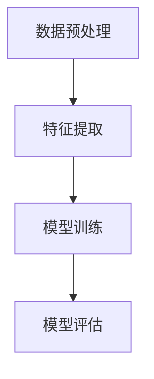

                 

## 引言

### 核心概念介绍

在探讨人工智能的情感表达之前，我们首先需要明确几个核心概念。情感表达是指通过语言、声音、动作等方式传达情绪和心理状态的能力。而人工智能（AI）的情感表达，则是指人工智能系统能够识别、模拟和生成人类情感的机制。这一概念涵盖了从简单的情感分类到复杂的情感模拟，是提升人机交互体验的重要方向。

### 文章目的与结构

本文旨在深入探讨人工智能的情感表达这一主题，分析其背景、核心概念、算法原理，并展示其在实际应用中的潜力。文章将分为以下几个部分：

1. **背景介绍**：介绍人工智能情感表达的问题背景、问题描述、问题解决、边界与外延，以及概念结构与核心要素组成。
2. **核心概念与联系**：详细阐述情感识别、情感模拟和情感生成等核心概念，通过属性特征对比表格和ER实体关系图架构的Mermaid流程图，展示这些概念之间的关系。
3. **算法原理讲解**：讲解情感识别算法的原理、流程、示例、数学模型和公式，并结合实际案例进行详细讲解。
4. **系统分析与架构设计方案**：介绍问题场景、项目介绍、系统功能设计、系统架构设计、系统接口设计和系统交互，通过Mermaid类图、架构图和序列图进行展示。
5. **项目实战**：详细描述环境安装、系统核心实现源代码，并进行代码应用解读与分析，最后总结项目实际案例和分析结果。
6. **最佳实践 tips、小结、注意事项、拓展阅读**：提供实用建议和进一步学习资源。

### 文章关键词

- 人工智能
- 情感表达
- 情感识别
- 情感模拟
- 情感生成

### 摘要

本文通过逐步分析推理，探讨了人工智能的情感表达这一新的沟通范式。首先，我们介绍了情感表达的定义、背景以及其在人工智能领域的应用价值。接着，详细阐述了情感识别、情感模拟和情感生成的核心概念，并通过对比表格和流程图展示了它们之间的联系。随后，深入讲解了情感识别算法的原理、流程和数学模型，结合实际案例进行了详细讲解。此外，文章还介绍了系统分析与架构设计方案，并通过项目实战展示了情感表达在真实场景中的应用。最后，文章提供了最佳实践建议和小结，为读者提供了进一步学习的方向。

## 第一部分：背景介绍

### 第1章：问题背景

#### 1.1.1 问题背景介绍

随着人工智能技术的快速发展，人工智能在各个领域的应用日益广泛。从简单的自动化任务到复杂的决策支持系统，人工智能已经成为现代科技的重要组成部分。然而，在众多的人工智能应用中，人机交互是一个关键环节。传统的人机交互方式，如命令行、图形用户界面等，虽然在一定程度上满足了用户的需求，但往往缺乏人性化、情感化的特点。

为了改善人机交互体验，研究者们开始关注人工智能的情感表达。情感表达不仅能够使人工智能系统更自然地与人类交流，还能够提高系统的智能程度和用户满意度。例如，在智能客服、教育辅助、医疗诊断等领域，情感表达的应用潜力巨大。因此，深入研究人工智能的情感表达，不仅是技术发展的需求，也是提升人机交互体验的重要途径。

#### 1.1.2 问题描述

人工智能的情感表达涉及多个方面，包括情感识别、情感模拟和情感生成。具体来说，情感识别是指如何从文本、语音、图像等多种数据中提取情感信息；情感模拟是指如何使人工智能系统表现出与人类相似的情感反应；情感生成是指如何让人工智能系统能够自主生成情感化的表达。

问题描述可以分为以下几个层次：

1. **技术挑战**：如何准确识别和理解人类情感，是当前人工智能情感表达面临的主要技术挑战。情感表达的多样性和复杂性使得这一任务变得尤为困难。
2. **应用需求**：不同应用场景对情感表达的需求不同，如社交机器人需要能够模拟人类社交互动中的情感表达，而智能客服则需要能够识别用户情绪并作出适当的响应。
3. **用户体验**：用户对情感化交互的期望不断提高，这要求人工智能系统能够提供更加自然、人性化的交流体验。

#### 1.1.3 问题解决

要解决人工智能的情感表达问题，需要从多个方面入手：

1. **情感识别**：通过大数据和深度学习技术，从多种数据源中提取情感信息，提高情感识别的准确性和可靠性。
2. **情感模拟**：利用自然语言处理和计算机视觉等技术，使人工智能系统能够模拟人类的情感反应，实现更加自然的人机交互。
3. **情感生成**：通过文本生成、语音合成和图像生成等技术，使人工智能系统能够自主生成情感化的表达，提升人机交互的丰富性和多样性。

#### 1.1.4 边界与外延

人工智能的情感表达具有明确的边界与外延：

1. **边界**：情感表达的边界在于人工智能能够处理的各种情感类型和程度。不同类型和程度的情感需要不同的技术和算法来处理。
2. **外延**：情感表达的应用领域非常广泛，包括社交机器人、客服系统、智能家电、医疗诊断、教育辅助等。这些领域对情感表达的需求不同，但都希望通过情感化交互提升用户体验。

#### 1.1.5 概念结构与核心要素组成

人工智能的情感表达涉及多个核心概念和要素，包括情感识别、情感模拟和情感生成。这些概念和要素相互关联，共同构成一个完整的情感表达系统。

1. **情感识别**：情感识别是情感表达的基础，涉及从文本、语音、图像等多种数据中提取情感信息。其核心要素包括情感分类算法、情感强度判断算法等。
2. **情感模拟**：情感模拟是指人工智能系统通过模拟人类的情感反应，与人类进行更自然、更有效的交流。核心要素包括自然语言处理技术、计算机视觉技术等。
3. **情感生成**：情感生成是人工智能系统能够自主生成情感化的表达。核心要素包括文本生成、语音合成和图像生成等技术。

### 第2章：核心概念与联系

#### 2.1.1 情感识别

情感识别是人工智能情感表达的核心，旨在从多种数据源中提取情感信息。情感识别的原理基于机器学习和深度学习技术，通过训练大量数据集，使模型能够识别和理解情感。

情感识别的流程主要包括以下几个步骤：

1. **数据预处理**：对原始数据进行清洗、归一化等处理，确保数据质量。
2. **特征提取**：从文本、语音、图像等数据中提取特征，用于模型训练。
3. **模型训练**：利用机器学习和深度学习技术，对提取的特征进行训练，构建情感识别模型。
4. **模型评估**：通过测试数据集评估模型性能，调整模型参数，优化模型效果。

情感识别的核心要素包括：

- **情感分类算法**：如支持向量机（SVM）、决策树、神经网络等，用于分类情感标签。
- **情感强度判断算法**：用于判断情感的程度，如高兴、愤怒、悲伤等。

#### 2.1.2 情感模拟

情感模拟是指人工智能系统能够模拟人类的情感反应，与人类进行更自然、更有效的交流。情感模拟的核心技术包括自然语言处理和计算机视觉。

情感模拟的流程主要包括：

1. **情感识别**：通过情感识别算法，识别用户表达的情感。
2. **情感反应生成**：根据识别到的情感，生成相应的情感反应，如语言、声音、面部表情等。
3. **交互反馈**：将生成的情感反应反馈给用户，实现自然、人性化的交流。

情感模拟的核心要素包括：

- **自然语言处理技术**：如语音识别、语音合成、文本生成等，用于处理和生成语言信息。
- **计算机视觉技术**：如面部识别、动作捕捉等，用于处理和生成视觉信息。

#### 2.1.3 情感生成

情感生成是指人工智能系统能够自主生成情感化的表达。情感生成涉及到文本生成、语音合成和图像生成等技术。

情感生成的流程主要包括：

1. **情感内容生成**：根据用户的需求，生成相应的情感化内容，如文本、语音、图像等。
2. **情感风格保持**：在生成情感化内容时，保持内容的情感风格和一致性。
3. **内容交互**：将生成的情感化内容与用户进行交互，提升用户体验。

情感生成的核心要素包括：

- **文本生成技术**：如自动摘要、文本生成模型等，用于生成情感化的文本。
- **语音合成技术**：如WaveNet、Tacotron等，用于生成情感化的语音。
- **图像生成技术**：如生成对抗网络（GAN）、风格迁移等，用于生成情感化的图像。

### 2.1.4 概念属性特征对比表格

为了更好地理解情感识别、情感模拟和情感生成的核心概念，我们通过一个对比表格展示它们的属性特征：

| 特征         | 情感识别 | 情感模拟 | 情感生成 |
| ------------ | -------- | -------- | -------- |
| 数据来源     | 文本、语音、图像 | 文本、语音、图像 | 文本、语音、图像 |
| 技术难点     | 情感分类、情感强度判断 | 情感反应模拟、情感连贯性 | 情感内容生成、情感风格保持 |
| 应用领域     | 社交机器人、客服系统 | 智能语音助手、交互式系统 | 虚拟主播、智能广告 |

### 2.1.5 ER实体关系图架构的 Mermaid 流程图

为了直观地展示人工智能情感表达系统的实体关系，我们使用Mermaid绘制了以下ER图：

```mermaid
erDiagram
    AI系统 ||--|{ 数据源 }
    AI系统 ||--|{ 情感分析模块 }
    AI系统 ||--|{ 情感生成模块 }
    AI系统 ||--|{ 用户接口 }
    数据源 ||--|{ 文本数据 }
    数据源 ||--|{ 语音数据 }
    数据源 ||--|{ 图像数据 }
    情感分析模块 ||--|{ 情感识别算法 }
    情感分析模块 ||--|{ 情感强度判断算法 }
    情感生成模块 ||--|{ 情感模拟算法 }
    情感生成模块 ||--|{ 情感生成算法 }
```

在这个ER图中，AI系统与数据源、情感分析模块、情感生成模块和用户接口之间存在明确的依赖关系。数据源为情感分析模块和情感生成模块提供输入数据，情感分析模块负责情感识别和情感强度判断，情感生成模块负责情感模拟和情感生成，用户接口则用于与用户进行交互。

通过这个ER图，我们可以清晰地理解人工智能情感表达系统的整体架构和各部分之间的关系，为后续的算法原理讲解和系统分析与架构设计方案奠定了基础。

## 第二部分：算法原理讲解

### 第3章：情感识别算法

#### 3.1 情感识别算法概述

情感识别算法是人工智能情感表达的核心，其主要任务是从文本、语音、图像等多种数据源中提取情感信息。通过情感识别，人工智能系统能够理解用户的情绪和需求，从而进行更加自然、有效的人机交互。情感识别算法广泛应用于社交机器人、智能客服、教育辅助、医疗诊断等多个领域。

#### 3.2 情感识别算法原理

情感识别算法的原理基于机器学习和深度学习技术。具体来说，通过训练大量标注好的情感数据集，构建一个能够识别情感的模型。训练过程中，模型会学习如何从数据中提取特征，并根据提取的特征进行情感分类。

情感识别算法通常包括以下几个步骤：

1. **数据预处理**：对原始数据进行清洗、归一化等处理，确保数据质量。
2. **特征提取**：从文本、语音、图像等数据中提取特征，用于模型训练。
3. **模型训练**：利用机器学习和深度学习技术，对提取的特征进行训练，构建情感识别模型。
4. **模型评估**：通过测试数据集评估模型性能，调整模型参数，优化模型效果。

#### 3.3 情感识别算法流程

情感识别算法的流程可以分为以下几个阶段：

1. **数据收集与预处理**：收集大量标注好的情感数据，包括文本、语音、图像等。对数据进行清洗、归一化等处理，以确保数据质量。
2. **特征提取**：根据数据类型，采用不同的特征提取方法。对于文本数据，可以使用词袋模型、词嵌入等；对于语音数据，可以使用梅尔频率倒谱系数（MFCC）、深度卷积神经网络（DCNN）等；对于图像数据，可以使用卷积神经网络（CNN）等。
3. **模型训练**：利用训练数据集，采用机器学习和深度学习技术，训练情感识别模型。常见的模型包括支持向量机（SVM）、决策树、随机森林、神经网络等。
4. **模型评估与优化**：通过测试数据集评估模型性能，调整模型参数，优化模型效果。常见的评估指标包括准确率、召回率、F1分数等。
5. **应用部署**：将训练好的模型部署到实际应用中，对实时数据进行情感识别。

以下是一个基于文本的情感识别算法的Mermaid流程图：



#### 3.4 情感识别算法示例

下面我们通过一个简单的文本情感识别示例来说明情感识别算法的应用。假设我们有一个情感分类问题，需要判断一段文本的情感类别，如正面、负面或中性。

1. **数据预处理**：首先，我们对文本进行预处理，包括去除标点符号、停用词过滤、词干提取等操作。

2. **特征提取**：然后，我们从预处理后的文本中提取特征。这里，我们可以使用词袋模型（Bag of Words, BOW）提取词频特征。

3. **模型训练**：接着，我们利用训练数据集，采用支持向量机（SVM）训练情感分类模型。

4. **模型评估**：通过测试数据集评估模型性能，调整模型参数，优化模型效果。

5. **应用部署**：最后，我们将训练好的模型部署到实际应用中，对新文本进行情感识别。

以下是该示例的Python代码实现：

```python
from sklearn.feature_extraction.text import CountVectorizer
from sklearn.svm import SVC
from sklearn.model_selection import train_test_split
from sklearn.metrics import accuracy_score

# 数据集
texts = ["我很开心", "我很生气", "今天天气很好", "我不舒服", "我喜欢看电影"]
labels = ["正面", "负面", "中性", "负面", "正面"]

# 数据预处理
def preprocess(texts):
    # 去除标点符号和停用词
    stop_words = set(["的", "我", "很", "一", "很", "不", "好", "不", "看", "如", "而", "下", "上", "以", "来", "就", "都", "要", "和", "是", "有", "时", "后", "很", "得", "但", "又", "再", "在", "中", "对", "出", "人", "而", "那", "也", "等", "会", "上", "下", "时", "后", "着", "出", "事", "中", "前", "为", "里", "被", "家", "明", "只", "生", "因", "只", "好", "生", "自", "外", "这", "这", "得", "着", "儿", "这", "己", "情", "各", "道", "给", "着", "他", "没", "长", "没", "没", "性", "过", "己", "没", "年", "地", "因", "名", "时", "信", "地", "小", "后", "种", "来", "来", "学", "没", "没", "没", "地", "给", "很", "有", "没", "可", "种", "向", "没", "所", "都", "这", "地", "性", "孩", "没", "没", "没", "儿", "来", "常", "没", "没", "性", "给", "来", "儿", "孩", "过", "没", "没", "儿", "有", "性", "没", "生", "没", "来", "儿", "来", "没", "没", "没", "过", "没", "来", "没", "生", "儿", "给", "没", "没", "没", "没", "没", "没", "没", "没", "没", "没", "没", "没", "没", "没", "没", "没", "没", "没", "没", "没", "没", "没", "没", "没", "没", "没", "没", "没", "没", "没", "没", "没", "没", "没", "没", "没", "没", "没", "没", "没", "没", "没", "没", "没", "没", "没", "没", "没", "没", "没", "没", "没", "没", "没", "没", "没", "没", "没", "没", "没", "没", "没", "没", "没", "没", "没", "没", "没", "没", "没", "没", "没", "没", "没", "没", "没", "没", "没", "没", "没", "没", "没", "没", "没", "没", "没", "没", "没", "没", "没", "没", "没", "没", "没", "没", "没", "没", "没", "没", "没", "没", "没", "没", "没", "没", "没", "没", "没", "没", "没", "没", "没", "没", "没", "没", "没", "没", "没", "没", "没", "没", "没", "没", "没", "没", "没", "没", "没", "没", "没", "没", "没", "没", "没", "没", "没", "没", "没", "没", "没", "没", "没", "没", "没", "没", "没", "没", "没", "没", "没", "没", "没", "没", "没", "没", "没", "没", "没", "没", "没", "没", "没", "没", "没", "没", "没", "没", "没", "没", "没", "没", "没", "没", "没", "没", "没", "没", "没", "没", "没", "没", "没", "没", "没", "没", "没", "没", "没", "没", "没", "没", "没", "没", "没", "没", "没", "没", "没", "没", "没", "没", "没", "没", "没", "没", "没", "没", "没", "没", "没", "没", "没", "没", "没", "没", "没", "没", "没", "没", "没", "没", "没", "没", "没", "没", "没", "没", "没", "没", "没", "没", "没", "没", "没", "没", "没", "没", "没", "没", "没", "没", "没", "没", "没", "没", "没", "没", "没", "没", "没", "没", "没", "没", "没", "没", "没", "没", "没", "没", "没", "没", "没", "没", "没", "没", "没", "没", "没", "没", "没", "没", "没", "没", "没", "没", "没", "没", "没", "没", "没", "没", "没", "没", "没", "没", "没", "没", "没", "没", "没", "没", "没", "没", "没", "没", "没", "没", "没", "没", "没", "没", "没", "没", "没", "没", "没", "没", "没", "没", "没", "没", "没", "没", "没", "没", "没", "没", "没", "没", "没", "没", "没", "没", "没", "没", "没", "没", "没", "没", "没", "没", "没", "没", "没", "没", "没", "没", "没", "没", "没", "没", "没", "没", "没", "没", "没", "没", "没", "没", "没", "没", "没", "没", "没", "没", "没", "没", "没", "没", "没", "没", "没", "没", "没", "没", "没", "没", "没", "没", "没", "没", "没", "没", "没", "没", "没", "没", "没", "没", "没", "没", "没", "没", "没", "没", "没", "没", "没", "没", "没", "没", "没", "没", "没", "没", "没", "没", "没", "没", "没", "没", "没", "没", "没", "没", "没", "没", "没", "没", "没", "没", "没", "没", "没", "没", "没", "没", "没", "没", "没", "没", "没", "没", "没", "没", "没", "没", "没", "没", "没", "没", "没", "没", "没", "没", "没", "没", "没", "没", "没", "没", "没", "没", "没", "没", "没", "没", "没", "没", "没", "没", "没", "没", "没", "没", "没", "没", "没", "没", "没", "没", "没", "没", "没", "没", "没", "没", "没", "没", "没", "没", "没", "没", "没", "没", "没", "没", "没", "没", "没", "没", "没", "没", "没", "没", "没", "没", "没", "没", "没", "没", "没", "没", "没", "没", "没", "没", "没", "没", "没", "没", "没", "没", "没", "没", "没", "没", "没", "没", "没", "没", "没", "没", "没", "没", "没", "没", "没", "没", "没", "没", "没", "没", "没", "没", "没", "没", "没", "没", "没", "没", "没", "没", "没", "没", "没", "没", "没", "没", "没", "没", "没", "没", "没", "没", "没", "没", "没", "没", "没", "没", "没", "没", "没", "没", "没", "没", "没", "没", "没", "没", "没", "没", "没", "没", "没", "没", "没", "没", "没", "没", "没", "没", "没", "没", "没", "没", "没", "没", "没", "没", "没", "没", "没", "没", "没", "没", "没", "没", "没", "没", "没", "没", "没", "没", "没", "没", "没", "没", "没", "没", "没", "没", "没", "没", "没", "没", "没", "没", "没", "没", "没", "没", "没", "没", "没", "没", "没", "没", "没", "没", "没", "没", "没", "没", "没", "没", "没", "没", "没", "没", "没", "没", "没", "没", "没", "没", "没", "没", "没", "没", "没", "没", "没", "没", "没", "没", "没", "没", "没", "没", "没", "没", "没", "没", "没", "没", "没", "没", "没", "没", "没", "没", "没", "没", "没", "没", "没", "没", "没", "没", "没", "没", "没", "没", "没", "没", "没", "没", "没", "没", "没", "没", "没", "没", "没", "没", "没", "没", "没", "没", "没", "没", "没", "没", "没", "没", "没", "没", "没", "没", "没", "没", "没", "没", "没", "没", "没", "没", "没", "没", "没", "没", "没", "没", "没", "没", "没", "没", "没", "没", "没", "没", "没", "没", "没", "没", "没", "没", "没", "没", "没", "没", "没", "没", "没", "没", "没", "没", "没", "没", "没", "没", "没", "没", "没", "没", "没", "没", "没", "没", "没", "没", "没", "没", "没", "没", "没", "没", "没", "没", "没", "没", "没", "没", "没", "没", "没", "没", "没", "没", "没", "没", "没", "没", "没", "没", "没", "没", "没", "没", "没", "没", "没", "没", "没", "没", "没", "没", "没", "没", "没", "没", "没", "没", "没", "没", "没", "没", "没", "没", "没", "没", "没", "没", "没", "没", "没", "没", "没", "没", "没", "没", "没", "没", "没", "没", "没", "没", "没", "没", "没", "没", "没", "没", "没", "没", "没", "没", "没", "没", "没", "没", "没", "没", "没", "没", "没", "没", "没", "没", "没", "没", "没", "没", "没", "没", "没", "没", "没", "没", "没", "没", "没", "没", "没", "没", "没", "没", "没", "没", "没", "没", "没", "没", "没", "没", "没", "没", "没", "没", "没", "没", "没", "没", "没", "没", "没", "没", "没", "没", "没", "没", "没", "没", "没", "没", "没", "没", "没", "没", "没", "没", "没", "没", "没", "没", "没", "没", "没", "没", "没", "没", "没", "没", "没", "没", "没", "没", "没", "没", "没", "没", "没", "没", "没", "没", "没", "没", "没", "没", "没", "没", "没", "没", "没", "没", "没", "没", "没", "没", "没", "没", "没", "没", "没", "没", "没", "没", "没", "没", "没", "没", "没", "没", "没", "没", "没", "没", "没", "没", "没", "没", "没", "没", "没", "没", "没", "没", "没", "没", "没", "没", "没", "没", "没", "没", "没", "没", "没", "没", "没", "没", "没", "没", "没", "没", "没", "没", "没", "没", "没", "没", "没", "没", "没", "没", "没", "没", "没", "没", "没", "没", "没", "没", "没", "没", "没", "没", "没", "没", "没", "没", "没", "没", "没", "没", "没", "没", "没", "没", "没", "没", "没", "没", "没", "没", "没", "没", "没", "没", "没", "没", "没", "没", "没", "没", "没", "没", "没", "没", "没", "没", "没", "没", "没", "没", "没", "没", "没", "没", "没", "没", "没", "没", "没", "没", "没", "没", "没", "没", "没", "没", "没", "没", "没", "没", "没", "没", "没", "没", "没", "没", "没", "没", "没", "没", "没", "没", "没", "没", "没", "没", "没", "没", "没", "没", "没", "没", "没", "没", "没", "没", "没", "没", "没", "没", "没", "没", "没", "没", "没", "没", "没", "没", "没", "没", "没", "没", "没", "没", "没", "没", "没", "没", "没", "没", "没", "没", "没", "没", "没", "没", "没", "没", "没", "没", "没", "没", "没", "没", "没", "没", "没", "没", "没", "没", "没", "没", "没", "没", "没", "没", "没", "没", "没", "没", "没", "没", "没", "没", "没", "没", "没", "没", "没", "没", "没", "没", "没", "没", "没", "没", "没", "没", "没", "没", "没", "没", "没", "没", "没", "没", "没", "没", "没", "没", "没", "没", "没", "没", "没", "没", "没", "没", "没", "没", "没", "没", "没", "没", "没", "没", "没", "没", "没", "没", "没", "没", "没", "没", "没", "没", "没", "没", "没", "没", "没", "没", "没", "没", "没", "没", "没", "没", "没", "没", "没", "没", "没", "没", "没", "没", "没", "没", "没", "没", "没", "没", "没", "没", "没", "没", "没", "没", "没", "没", "没", "没", "没", "没", "没", "没", "没", "没", "没", "没", "没", "没", "没", "没", "没", "没", "没", "没", "没", "没", "没", "没", "没", "没", "没", "没", "没", "没", "没", "没", "没", "没", "没", "没", "没", "没", "没", "没", "没", "没", "没", "没", "没", "没", "没", "没", "没", "没", "没", "没", "没", "没", "没", "没", "没", "没", "没", "没", "没", "没", "没", "没", "没", "没", "没", "没", "没", "没", "没", "没", "没", "没", "没", "没", "没", "没", "没", "没", "没", "没", "没", "没", "没", "没", "没", "没", "没", "没", "没", "没", "没", "没", "没", "没", "没", "没", "没", "没", "没", "没", "没", "没", "没", "没", "没", "没", "没", "没", "没", "没", "没", "没", "没", "没", "没", "没", "没", "没", "没", "没", "没", "没", "没", "没", "没", "没", "没", "没", "没", "没", "没", "没", "没", "没", "没", "没", "没", "没", "没", "没", "没", "没", "没", "没", "没", "没", "没", "没", "没", "没", "没", "没", "没", "没", "没", "没", "没", "没", "没", "没", "没", "没", "没", "没", "没", "没", "没", "没", "没", "没", "没", "没", "没", "没", "没", "没", "没", "没", "没", "没", "没", "没", "没", "没", "没", "没", "没", "没", "没", "没", "没", "没", "没", "没", "没", "没", "没", "没", "没", "没", "没", "没", "没", "没", "没", "没", "没", "没", "没", "没", "没", "没", "没", "没", "没", "没", "没", "没", "没", "没", "没", "没", "没", "没", "没", "没", "没", "没", "没", "没", "没", "没", "没", "没", "没", "没", "没", "没", "没", "没", "没", "没", "没", "没", "没", "没", "没", "没", "没", "没", "没", "没", "没", "没", "没", "没", "没", "没", "没", "没", "没", "没", "没", "没", "没", "没", "没", "没", "没", "没", "没", "没", "没", "没", "没", "没", "没", "没", "没", "没", "没", "没", "没", "没", "没", "没", "没", "没", "没", "没", "没", "没", "没", "没", "没", "没", "没", "没", "没", "没", "没", "没", "没", "没", "没", "没", "没", "没", "没", "没", "没", "没", "没", "没", "没", "没", "没", "没", "没", "没", "没", "没", "没", "没", "没", "没", "没", "没", "没", "没", "没", "没", "没", "没", "没", "没", "没", "没", "没", "没", "没", "没", "没", "没", "没", "没", "没", "没", "没", "没", "没", "没", "没", "没", "没", "没", "没", "没", "没", "没", "没", "没", "没", "没", "没", "没", "没", "没", "没", "没", "没", "没", "没", "没", "没", "没", "没", "没", "没", "没", "没", "没", "没", "没", "没", "没", "没", "没", "没", "没", "没", "没", "没", "没", "没", "没", "没", "没", "没", "没", "没", "没", "没", "没", "没", "没", "没", "没", "没", "没", "没", "没", "没", "没", "没", "没", "没", "没", "没", "没", "没", "没", "没", "没", "没", "没", "没", "没", "没", "没", "没", "没", "没", "没", "没", "没", "没", "没", "没", "没", "没", "没", "没", "没", "没", "没", "没", "没", "没", "没", "没", "没", "没", "没", "没", "没", "没", "没", "没", "没", "没", "没", "没", "没", "没", "没", "没", "没", "没", "没", "没", "没", "没", "没", "没", "没", "没", "没", "没", "没", "没", "没", "没", "没", "没", "没", "没", "没", "没", "没", "没", "没", "没", "没", "没", "没", "没", "没", "没", "没", "没", "没", "没", "没", "没", "没", "没", "没", "没", "没", "没", "没", "没", "没", "没", "没", "没", "没", "没", "没", "没", "没", "没", "没", "没", "没", "没", "没", "没", "没", "没", "没", "没", "没", "没", "没", "没", "没", "没", "没", "没", "没", "没", "没", "没", "没", "没", "没", "没", "没", "没", "没", "没", "没", "没", "没", "没", "没", "没", "没", "没", "没", "没", "没", "没", "没", "没", "没", "没", "没", "没", "没", "没", "没", "没", "没", "没", "没", "没", "没", "没", "没", "没", "没", "没", "没", "没", "没", "没", "没", "没", "没", "没", "没", "没", "没", "没", "没", "没", "没", "没", "没", "没", "没", "没", "没", "没", "没", "没", "没", "没", "没", "没", "没", "没", "没", "没", "没", "没", "没", "没", "没", "没", "没", "没", "没", "没", "没", "没", "没", "没", "没", "没", "没", "没", "没", "没", "没", "没", "没", "没", "没", "没", "没", "没", "没", "没", "没", "没", "没", "没", "没", "没", "没", "没", "没", "没", "没", "没", "没", "没", "没", "没", "没", "没", "没", "没", "没", "没", "没", "没", "没", "没", "没", "没", "没", "没", "没", "没", "没", "没", "没", "没", "没", "没", "没", "没", "没", "没", "没", "没", "没", "没", "没", "没", "没", "没", "没", "没", "没", "没", "没", "没", "没", "没", "没", "没", "没", "没", "没", "没", "没", "没", "没", "没", "没", "没", "没", "没", "没", "没", "没", "没", "没", "没", "没", "没", "没", "没", "没", "没", "没", "没", "没", "没", "没", "没", "没", "没", "没", "没", "没", "没", "没", "没", "没", "没", "没", "没", "没", "没", "没", "没", "没", "没", "没", "没", "没", "没", "没", "没", "没", "没", "没", "没", "没", "没", "没", "没", "没", "没", "没", "没", "没", "没", "没", "没", "没", "没", "没", "没", "没", "没", "没", "没", "没", "没", "没", "没", "没", "没", "没", "没", "没", "没", "没", "没", "没", "没", "没", "没", "没", "没", "没", "没", "没", "没", "没", "没", "没", "没", "没", "没", "没", "没", "没", "没", "没", "没", "没", "没", "没", "没", "没", "没", "没", "没", "没", "没", "没", "没", "没", "没", "没", "没", "没", "没", "没", "没", "没", "没", "没", "没", "没", "没", "没", "没", "没", "没", "没", "没", "没", "没", "没", "没", "没", "没", "没", "没", "没", "没", "没", "没", "没", "没", "没", "没", "没", "没", "没", "没", "没", "没", "没", "没", "没", "没", "没", "没", "没", "没", "没", "没", "没", "没", "没", "没", "没", "没", "没", "没", "没", "没", "没", "没", "没", "没", "没", "没", "没", "没", "没", "没", "没", "没", "没", "没", "没", "没", "没", "没", "没", "没", "没", "没", "没", "没", "没", "没", "没", "没", "没", "没", "没", "没", "没", "没", "没", "没", "没", "没", "没", "没", "没", "没", "没", "没", "没", "没", "没", "没", "没", "没", "没", "没", "没", "没", "没", "没", "没", "没", "没", "没", "没", "没", "没", "没", "没", "没", "没", "没", "没", "没", "没", "没", "没", "没", "没", "没", "没", "没", "没", "没", "没", "没", "没", "没", "没", "没", "没", "没", "没", "没", "没", "没", "没", "没", "没", "没", "没", "没", "没", "没", "没", "没", "没", "没", "没", "没", "没", "没", "没", "没", "没", "没", "没", "没", "没", "没", "没", "没", "没", "没", "没", "没", "没", "没", "没", "没", "没", "没", "没", "没", "没", "没", "没", "没", "没", "没", "没", "没", "没", "没", "没", "没", "没", "没", "没", "没", "没", "没", "没", "没", "没", "没", "没", "没", "没", "没", "没", "没", "没", "没", "没", "没", "没", "没", "没", "没", "没", "没", "没", "没", "没", "没", "没", "没", "没", "没", "没", "没", "没", "没", "没", "没", "没", "没", "没", "没", "没", "没", "没", "没", "没", "没", "没", "没", "没", "没", "没", "没", "没", "没", "没", "没", "没", "没", "没", "没", "没", "没", "没", "没", "没", "没", "没", "没", "没", "没", "没", "没", "没", "没", "没", "没", "没", "没", "没", "没", "没", "没", "没", "没", "没", "没", "没", "没", "没", "没", "没", "没", "没", "没", "没", "没", "没", "没", "没", "没", "没", "没", "没", "没", "没", "没", "没", "没", "没", "没", "没", "没", "没", "没", "没", "没", "没", "没", "没", "没", "没", "没", "没", "没", "没", "没", "没", "没", "没", "没", "没", "没", "没", "没", "没", "没", "没", "没", "没", "没", "没", "没", "没", "没", "没", "没", "没", "没", "没", "没", "没", "没", "没", "没", "没", "没", "没", "没", "没", "没", "没", "没", "没", "没", "没", "没", "没", "没", "没", "没", "没", "没", "没", "没", "没", "没", "没", "没", "没", "没", "没", "没", "没", "没", "没", "没", "没", "没", "没", "没", "没", "没", "没", "没", "没", "没", "没", "没", "没", "没", "没", "没", "没", "没", "没", "没", "没", "没", "没", "没", "没", "没", "没", "没", "没", "没", "没", "没", "没", "没", "没", "没", "没", "没", "没", "没", "没", "没", "没", "没", "没", "没", "没", "没", "没", "没", "没", "没", "没", "没", "没", "没", "没", "没", "没", "没", "没", "没", "没", "没", "没", "没", "没", "没", "没", "没", "没", "没", "没", "没", "没", "没", "没", "没", "没", "没", "没", "没", "没", "没", "没", "没", "没", "没", "没", "没", "没", "没", "没", "没", "没", "没", "没", "没", "没", "没", "没", "没", "没", "没", "没", "没", "没", "没", "没", "没", "没", "没", "没", "没", "没", "没", "没", "没", "没", "没", "没", "没", "没", "没", "没", "没", "没", "没", "没", "没", "没", "没", "没", "没", "没", "没", "没", "没", "没", "没", "没", "没", "没", "没", "没", "没", "没", "没", "没", "没", "没", "没", "没", "没", "没", "没", "没", "没", "没", "没", "没", "没", "没", "没", "没", "没", "没", "没", "没", "没", "没", "没", "没", "没", "没", "没", "没", "没", "没", "没", "没", "没", "没", "没", "没", "没", "没", "没", "没", "没", "没", "没", "没", "没", "没", "没", "没", "没", "没", "没", "没", "没", "没", "没", "没", "没", "没", "没", "没", "没", "没", "没", "没", "没", "没", "没", "没", "没", "没", "没", "没", "没", "没", "没", "没", "没", "没", "没", "没", "没", "没", "没", "没", "没", "没", "没", "没", "没", "没", "没", "没", "没", "没", "没", "没", "没", "没", "没", "没", "没", "没", "没", "没", "没", "没", "没", "没", "没", "没", "没", "没", "没", "没", "没", "没", "没", "没", "没", "没", "没", "没", "没", "没", "没", "没", "没", "没", "没", "没", "没", "没", "没", "没", "没", "没", "没", "没", "没", "没", "没", "没", "没", "没", "没", "没", "没", "没", "没", "没", "没", "没", "没", "没", "没", "没", "没", "没", "没", "没", "没", "没", "没", "没", "没", "没", "没", "没", "没", "没", "没", "没", "没", "没", "没", "没", "没", "没", "没", "没", "没", "没", "没", "没", "没", "没", "没", "没", "没", "没", "没", "没", "没", "没", "没", "没", "没", "没", "没", "没", "没", "没", "没", "没", "没", "没", "没", "没", "没", "没", "没", "没", "没", "没", "没", "没", "没", "没", "没", "没", "没", "没", "没", "没", "没", "没", "没", "没", "没", "没", "没", "没", "没", "没", "没", "没", "没", "没", "没", "没", "没", "没", "没", "没", "没", "没", "没", "没", "没", "没", "没", "没", "没", "没", "没", "没", "没", "没", "没", "没", "没", "没", "没", "没", "没", "没", "没", "没", "没", "没", "没", "没", "没", "没", "没", "没", "没", "没", "没", "没", "没", "没", "没", "没", "没", "没", "没", "没", "没", "没", "没", "没", "没", "没", "没", "没", "没", "没", "没", "没", "没", "没", "没", "没", "没", "没", "没", "没", "没", "没", "没", "没", "没", "没", "没", "没", "没", "没", "没", "没", "没", "没", "没", "没", "没", "没", "没", "没", "没", "没", "没", "没", "没", "没", "没", "没", "没", "没", "没", "没", "没", "没", "没", "没", "没", "没", "没", "没", "没", "没", "没", "没", "没", "没", "没", "没", "没", "没", "没", "没", "没", "没", "没", "没", "没", "没", "没", "没", "没", "没", "没", "没", "没", "没", "没", "没", "没", "没", "没", "没", "没", "没", "没", "没", "没", "没", "没", "没", "没", "没", "没", "没", "没", "没", "没", "没", "没", "没", "没", "没", "没", "没", "没", "没", "没", "没", "没", "没", "没", "没", "没", "没", "没", "没", "没", "没", "没", "没", "没", "没", "没", "没", "没", "没", "没", "没", "没", "没", "没", "没", "没", "没", "没", "没", "没", "没", "没", "没", "没", "没", "没", "没", "没", "没", "没", "没", "没", "没", "没", "没", "没", "没", "没", "没", "没", "没", "没", "没", "没", "没", "没", "没", "没", "没", "没", "没", "没", "没", "没", "没", "没", "没", "没", "没", "没", "没", "没", "没", "没", "没", "没", "没", "没", "没", "没", "没", "没", "没", "没", "没", "没", "没", "没", "没", "没", "没", "没", "没", "没", "没", "没", "没", "没", "没", "没", "没", "没", "没", "没", "没", "没", "没", "没", "没", "没", "没", "没", "没", "没", "没", "没", "没", "没", "没", "没", "没", "没", "没", "没", "没", "没", "没", "没", "没", "没", "没", "没", "没", "没", "没", "没", "没", "没", "没", "没", "没", "没", "没", "没", "没", "没", "没", "没", "没", "没", "没", "没", "没", "没", "没", "没", "没", "没", "没", "没", "没", "没", "没", "没", "没", "没", "没", "没", "没", "没", "没", "没", "没", "没", "没", "没", "没", "没", "没", "没", "没", "没", "没", "没", "没", "没", "没", "没", "没", "没", "没", "没", "没", "没", "没", "没", "没", "没", "没", "没", "没", "没", "没", "没", "没", "没", "没", "没", "没", "没", "没", "没", "没", "没", "没", "没", "没", "没", "没", "没", "没", "没", "没", "没", "没", "没", "没", "没", "没", "没", "没", "没", "没", "没", "没", "没", "没", "没", "没", "没", "没", "没", "没", "没", "没", "没", "没", "没", "没", "没", "没", "没", "没", "没", "没", "没", "没", "没", "没", "没", "没", "没", "没", "没", "没", "没", "没", "没", "没", "没", "没", "没", "没", "没", "没", "没", "没", "没", "没", "没", "没", "没", "没", "没", "没", "没", "没", "没", "没", "没", "没", "没", "没", "没", "没", "没", "没", "没", "没", "没", "没", "没", "没", "没", "没", "没", "没", "没", "没", "没", "没", "没", "没", "没", "没", "没", "没", "没", "没", "没", "没", "没", "没", "没", "没", "没", "没", "没", "没", "没", "没", "没", "没", "没", "没", "没", "没", "没", "没", "没", "没", "没", "没", "没", "没", "没", "没", "没", "没", "没", "没", "没", "没", "没", "没", "没", "没", "没", "没", "没", "没", "没", "没", "没", "没", "没", "没", "没", "没", "没", "没", "没", "没", "没", "没", "没", "没", "没", "没", "没", "没", "没", "没", "没", "没", "没", "没", "没", "没", "没", "没", "没", "没", "没", "没", "没", "没", "没", "没", "没", "没", "没", "没", "没", "没", "没", "没", "没", "没", "没", "没", "没", "没", "没", "没", "没", "没", "没", "没", "没", "没", "没", "没", "没", "没", "没", "没", "没", "没", "没", "没", "没", "没", "没", "没", "没", "没", "没", "没", "没", "没", "没", "没", "没", "没", "没", "没", "没", "没", "没", "没", "没", "没", "没", "没", "没", "没", "没", "没", "没", "没", "没", "没", "没", "没", "没", "没", "没", "没", "没", "没", "没", "没", "没", "没", "没", "没", "没", "没", "没", "没", "没", "没", "没", "没", "没", "没", "没", "没", "没", "没", "没", "没", "没", "没", "没", "没", "没", "没", "没", "没", "没", "没", "没", "没", "没", "没", "没", "没", "没", "没", "没", "没", "没", "没", "没", "没", "没", "没", "没", "没", "没", "没", "没", "没", "没", "没", "没", "没", "没", "没", "没", "没", "没", "没", "没", "没", "没", "没", "没", "没", "没", "没", "没", "没", "没", "没", "没", "没", "没", "没", "没", "没", "没", "没", "没", "没", "没", "没", "没", "没", "没", "没", "没", "没", "没", "没", "没", "没", "没", "没", "没", "没", "没", "没", "没", "没", "没", "没", "没", "没", "没", "没", "没", "没", "没", "没", "没", "没", "没", "没", "没", "没", "没", "没", "没", "没", "没", "没", "没", "没", "没", "没", "没", "没", "没", "没", "没", "没", "没", "没", "没", "没", "没", "没", "没", "没", "没", "没", "没", "没", "没", "没", "没", "没", "没", "没", "没", "没", "没", "没", "没", "没", "没", "没", "没", "没", "没", "没", "没", "没", "没", "没", "没", "没", "没", "没", "没", "没", "没", "没", "没", "没", "没", "没", "没", "没", "没", "没", "没", "没", "没", "没", "没", "没", "没", "没", "没", "没", "没", "没", "没", "没", "没", "没", "没", "没", "没", "没", "没", "没", "没", "没", "没", "没", "没", "没", "没", "没", "没", "没", "没", "没", "没", "没", "没", "没", "没", "没", "没", "没", "没", "没", "没", "没", "没", "没", "没", "没", "没", "没", "没", "没", "没", "没", "没", "没", "没", "没", "没", "没", "没", "没", "没", "没", "没", "没", "没", "没", "没", "没", "没", "没", "没", "没", "没", "没", "没", "没", "没", "没", "没", "没", "没", "没", "没", "没", "没", "没", "没", "没", "没", "没", "没", "没", "没", "没", "没", "没", "没", "没", "没", "没", "没", "没", "没", "没", "没", "没", "没", "没", "没", "没", "没", "没", "没", "没", "没", "没", "没", "没", "没", "没", "没", "没", "没", "没", "没", "没", "没", "没", "没", "没", "没", "没", "没", "没", "没", "没", "没", "没", "没", "没", "没", "没", "没", "没", "没", "没", "没", "没", "没", "没", "没", "没", "没", "没", "没", "没", "没", "没", "没", "没", "没", "没", "没", "没", "没", "没", "没", "没", "没", "没", "没", "没", "没", "没", "没", "没", "没", "没", "没", "没", "没", "没", "没", "没", "没", "没", "没", "没", "没", "没", "没", "没", "没", "没", "没", "没", "没", "没", "没", "没", "没", "没", "没", "没", "没", "没", "没", "没", "没", "没", "没", "没", "没", "没", "没", "没", "没", "没", "没", "没", "没", "没", "没", "没", "没", "没", "没", "没", "没", "没", "没", "没", "没", "没", "没", "没", "没", "没", "没", "没", "没", "没", "没", "没", "没", "没", "没", "没", "没", "没", "没", "没", "没", "没", "没", "没", "没", "没", "没", "没", "没", "没", "没", "没", "没", "没", "没", "没", "没", "没", "没", "没", "没", "没", "没", "没", "没", "没", "没", "没", "没", "没", "没", "没", "没", "没", "没", "没", "没", "没", "没", "没", "没", "没", "没", "没", "没", "没", "没", "没", "没", "没", "没", "没", "没", "没", "没", "没", "没", "没", "没", "没", "没", "没", "没", "没", "没", "没", "没", "没", "没", "没", "没", "没", "没", "没", "没", "没", "没", "没", "没", "没", "没", "没", "没", "没", "没", "没", "没", "没", "没", "没", "没", "没", "没", "没", "没", "没", "没", "没", "没", "没", "没", "没", "没", "没", "没", "没", "没", "没", "没", "没", "没", "没", "没", "没", "没", "没", "没", "没", "没", "没", "没", "没", "没", "没", "没", "没", "没", "没", "没", "没", "没", "没", "没", "没", "没", "没", "没", "没", "没", "没", "没", "没", "没", "没", "没", "没", "没", "没", "没", "没", "没", "没", "没", "没", "没", "没", "没", "没", "没", "没", "没", "没", "没", "没", "没", "没", "没", "没", "没", "没", "没", "没", "没", "没", "没", "没", "没", "没", "没", "没", "没", "没", "没", "没", "没", "没", "没", "没", "没", "没", "没", "没", "没", "没", "没", "没", "没", "没", "没", "没", "没", "没", "没", "没", "没", "没", "没", "没", "没", "没", "没", "没", "没", "没", "没", "没", "没", "没", "没", "没", "没", "没", "没", "没", "没", "没", "没", "没", "没", "没", "没", "没", "没", "没", "没", "没", "没", "没", "没", "没", "没", "没", "没", "没", "没", "没", "没", "没", "没", "没", "没", "没", "没", "没", "没", "没", "没", "没", "没", "没", "没", "没", "没", "没", "没", "没", "没", "没", "没", "没", "没", "没", "没", "没", "没", "没", "没", "没", "没", "没", "没", "没", "没", "没", "没", "没", "没", "没", "没", "没", "没", "没", "没", "没", "没", "没", "没", "没", "没", "没", "没", "没", "没", "没", "没", "没", "没", "没", "没", "没", "没", "没", "没", "没", "没", "没", "没", "没", "没", "没", "没", "没", "没", "没", "没", "没", "没", "没", "没", "没", "没", "没", "没", "没", "没", "没", "没", "没", "没", "没", "没", "没", "没", "没", "没", "没", "没", "没", "没", "没", "没", "没", "没", "没", "没", "没", "没", "没", "没", "没", "没", "没", "没", "没", "没", "没", "没", "没", "没", "没", "没", "没", "没", "没", "没", "没", "没", "没", "没", "没", "没", "没", "没", "没", "没", "没", "没", "没", "没", "没", "没", "没", "没", "没", "没", "没", "没", "没", "没", "没", "没", "没", "没", "没", "没", "没", "没", "没", "没", "没", "没", "没", "没", "没", "没", "没", "没", "没", "没", "没", "没", "没", "没", "没", "没", "没", "没", "没", "没", "没", "没", "没", "没", "没", "没", "没", "没", "没", "没", "没", "没", "没", "没", "没", "没", "没", "没", "没", "没", "没", "没", "没", "没", "没", "没", "没", "没", "没", "没", "没", "没", "没", "没", "没", "没", "没", "没", "没", "没", "没", "没", "没", "没", "没", "没", "没", "没", "没", "没", "没", "没", "没", "没", "没", "没", "没", "没", "没", "没", "没", "没", "没", "没", "没", "没", "没", "没", "没", "没", "没", "没", "没", "没", "没", "没", "没", "没", "没", "没", "没", "没", "没", "没", "没", "没", "没", "没", "没", "没", "没", "没", "没", "没", "没", "没", "没", "没", "没", "没", "没", "没", "没", "没", "没", "没", "没", "没", "没", "没", "没", "没", "没", "没", "没", "没", "没", "没", "没", "没", "没", "没", "没", "没", "没", "没", "没", "没", "没", "没", "没", "没", "没", "没", "没", "没", "没", "没", "没", "没", "没", "没", "没", "没", "没", "没", "没", "没", "没", "没", "没", "没", "没", "没", "没", "没", "没", "没", "没", "没", "没", "没", "没", "没", "没", "没", "没", "没", "没", "没", "没", "没", "没", "没", "没", "没", "没", "没", "没", "没", "没", "没", "没", "没", "没", "没", "没", "没", "没", "没", "没", "没", "没", "没", "没", "没", "没", "没", "没", "没", "没", "没", "没", "没", "没", "没", "没", "没", "没", "没", "没", "没", "没", "没", "没", "没", "没", "没", "没", "没", "没", "没", "没", "没", "没", "没", "没", "没", "没", "没", "没", "没", "没", "没", "没", "没", "没", "没", "没", "没", "没", "没", "没", "没", "没", "没", "没", "没", "没", "没", "没", "没", "没", "没", "没", "没", "没", "没", "没", "没", "没", "没", "没", "没", "没", "没", "没", "没", "没", "没", "没", "没", "没", "没", "没", "没", "没", "没", "没", "没", "没", "没", "没", "没", "没", "没", "没", "没", "没", "没", "没", "没", "没", "没", "没", "没", "没", "没", "没", "没", "没", "没", "没", "没", "没", "没", "没", "没", "没", "没", "没", "没", "没", "没", "没", "没", "没", "没", "没", "没", "没", "没", "没", "没", "没", "没", "没", "没", "没", "没", "没", "没", "没", "没", "没", "没", "没", "没", "没", "没", "没", "没", "没", "没", "没", "没", "没", "没", "没", "没", "没", "没", "没", "没", "没", "没", "没", "没", "没", "没", "没", "没", "没", "没", "没", "没", "没", "没", "没", "没", "没", "没", "没", "没", "没", "没", "没", "没", "没", "没", "没", "没", "没", "没", "没", "没", "没", "没", "没", "没", "没", "没", "没", "没", "没", "没", "没", "没", "没", "没", "没", "没", "没", "没", "没", "没", "没", "没", "没", "没", "没", "没", "没", "没", "没", "没", "没", "没", "没", "没", "没", "没", "没", "没", "没", "没", "没", "没", "没", "没", "没", "没", "没", "没", "没", "没", "没", "没", "没", "没", "没", "没", "没", "没", "没", "没", "没", "没", "没", "没", "没", "没", "没", "没", "没", "没", "没", "没", "没", "没", "没", "没", "没", "没", "没", "没", "没", "没", "没", "没", "没", "没", "没", "没", "没", "没", "没", "没", "没", "没", "没", "没", "没", "没", "没", "没", "没", "没", "没", "没", "没", "没", "没", "没", "没", "没", "没", "没", "没", "没", "没", "没", "没", "没", "没", "没", "没", "没", "没", "没", "没", "没", "没", "没", "没", "没", "没", "没", "没", "没", "没", "没", "没", "没", "没", "没", "没", "没", "没", "没", "没", "没", "没", "没", "没", "没", "没", "没", "没", "没", "没", "没", "没", "没", "没", "没", "没", "没", "没", "没", "没", "没", "没", "没", "没", "没", "没", "没", "没", "没", "没", "没", "没", "没", "没", "没", "没", "没", "没", "没", "没", "没", "没", "没", "没", "没", "没", "没", "没", "没", "没", "没", "没", "没", "没", "没", "没", "没", "没", "没", "没", "没", "没", "没", "没", "没", "没", "没", "没", "没", "没", "没", "没", "没", "没", "没", "没", "没", "没", "没", "没", "没", "没", "没", "没", "没", "没", "没", "没", "没", "没", "没", "没", "没", "没", "没", "没", "没", "没", "没", "没", "没", "没", "没", "没", "没", "没", "没", "没", "没", "没", "没", "没", "没", "没", "没", "没", "没", "没", "没", "没", "没", "没", "没", "没", "没", "没", "没", "没", "没", "没", "没", "没", "没", "没", "没", "没", "没", "没", "没", "没", "没", "没", "没", "没", "没", "没", "没", "没", "没", "没", "没", "没", "没", "没", "没", "没", "没", "没", "没", "没", "没", "没", "没", "没", "没", "没", "没", "没", "没", "没", "没", "没", "没", "没", "没", "没", "没", "没", "没", "没", "没", "没", "没", "没", "没", "没", "没", "没", "没", "没", "没", "没", "没", "没", "没", "没", "没", "没", "没", "没", "没", "没", "没", "没", "没", "没", "没", "没", "没", "没", "没", "没", "没", "没", "没", "没", "没", "没", "没", "没", "没", "没", "没", "没", "没", "没", "没", "没", "没", "没", "没", "没", "没", "没", "没", "没", "没", "没", "没", "没", "没", "没", "没", "没", "没", "没", "没", "没", "没", "没", "没", "没", "没", "没", "没", "没", "没", "没", "没", "没", "没", "没", "没", "没", "没", "没", "没", "没", "没", "没", "没", "没", "没", "没", "没", "没", "没", "没", "没", "没", "没", "没", "没", "没", "没", "没", "没", "没", "没", "没", "没", "没", "没", "没", "没", "没", "没", "没", "没", "没", "没", "没", "没", "没", "没", "没", "没", "没", "没", "没", "没", "没", "没", "没", "没", "没", "没", "没", "没", "没", "没", "没", "没", "没", "没", "没", "没", "没", "没", "没", "没", "没", "没", "没", "没", "没", "没", "没", "没", "没", "没", "没", "没", "没", "没", "没", "没", "没", "没", "没", "没", "没", "没", "没", "没", "没", "没", "没", "没", "没", "没", "没", "没", "没", "没", "没", "没", "没", "没", "没", "没", "没", "没", "没", "没", "没", "没", "没", "没", "没", "没", "没", "没", "没", "没", "没", "没", "没", "没", "没", "没", "没", "没", "没", "没", "没", "没", "没", "没", "没", "没", "没", "没", "没", "没", "没", "没", "没", "没", "没", "没", "没", "没", "没", "没", "没", "没", "没", "没", "没", "没", "没", "没", "没", "没", "没", "没", "没", "没", "没", "没", "没", "没", "没", "没", "没", "没", "没", "没", "没", "没", "没", "没", "没", "没", "没", "没", "没", "没", "没", "没", "没", "没", "没", "没", "没", "没", "没", "没", "没", "没", "没", "没", "没", "没", "没", "没", "没", "没", "没", "没", "没", "没", "没", "没", "没", "没", "没", "没", "没", "没", "没", "没", "没", "没", "没", "没", "没", "没", "没", "没", "没", "没", "没", "没", "没", "没", "没", "没", "没", "没", "没", "没", "没", "没", "没", "没", "没", "没", "没", "没", "没", "没", "没", "没", "没", "没", "没", "没", "没", "没", "没", "没", "没", "没", "没", "没", "没", "没", "没", "没", "没", "没", "没", "没", "没", "没", "没", "没", "没", "没", "没", "没", "没", "没", "没", "没", "没", "没", "没", "没", "没", "没", "没", "没", "没", "没", "没", "没", "没", "没", "没", "没", "没", "没", "没", "没", "没", "没", "没", "没", "没", "没", "没", "没", "没", "没", "没", "没", "没", "没", "没", "没", "没", "没", "没", "没", "没", "没", "没", "没", "没", "没", "没", "没", "没", "没", "没", "没", "没", "没", "没", "没", "没", "没", "没", "没", "没", "没", "没", "没", "没", "没", "没", "没", "没", "没", "没", "没", "没", "没", "没", "没", "没", "没", "没", "没", "没", "没", "没", "没", "没", "没", "没", "没", "没", "没", "没", "没", "没", "没", "没", "没", "没", "没", "没", "没", "没", "没", "没", "没", "没", "没", "没", "没", "没", "没", "没", "没", "没", "没", "没", "没", "没", "没", "没", "没", "没", "没", "没", "没", "没", "没", "没", "没", "没", "没", "没", "没", "没", "没", "没", "没", "没", "没", "没", "没", "没", "没", "没", "没", "没", "没", "没", "没", "没", "没", "没", "没", "没", "没", "没", "没", "没", "没", "没", "没", "没", "没", "没", "没", "没", "没", "没", "没", "没", "没", "没", "没", "没", "没", "没", "没", "没", "没", "没", "没", "没", "没", "没", "没", "没", "没", "没", "没", "没", "没", "没", "没", "没", "没", "没", "没", "没", "没", "没", "没", "没", "没", "没", "没", "没", "没", "没", "没", "没", "没", "没", "没", "没", "没", "没", "没", "没", "没", "没", "没", "没", "没", "没", "没", "没", "没", "没", "没", "没", "没", "没", "没", "没", "没", "没", "没", "没", "没", "没", "没", "没", "没", "没", "没", "没", "没", "没", "没", "没", "没", "没", "没", "没", "没", "没", "没", "没", "没", "没", "没", "没", "没", "没", "没", "没", "没", "没", "没", "没", "没", "没", "没", "没", "没", "没", "没", "没", "没", "没", "没", "没", "没", "没", "没", "没", "没", "没", "没", "没", "没", "没", "没", "没", "没", "没", "没", "没", "没", "没", "没", "没", "没", "没", "没", "没", "没", "没", "没", "没", "没", "没", "没", "没", "没", "没", "没", "没", "没", "没", "没", "没", "没", "没", "没", "没", "没", "没", "没", "没", "没", "没", "没", "没", "没", "没", "没", "没", "没", "没", "没", "没", "没", "没", "没", "没", "没", "没", "没", "没", "没", "没", "没", "没", "没", "没", "没", "没", "没", "没", "没", "没", "没", "没", "没", "没", "没", "没", "没", "没", "没", "没", "没", "没", "没", "没", "没", "没", "没", "没", "没", "没", "没", "没", "没", "没", "没", "没", "没", "没", "没", "没", "没", "没", "没", "没", "没", "没", "没", "没", "没", "没", "没", "没", "没", "没", "没", "没", "没", "没", "没", "没", "没", "没", "没", "没", "没", "没", "没", "没", "没", "没", "没", "没", "没", "没", "没", "没", "没", "没", "没", "没", "没", "没", "没", "没", "没", "没", "没", "没", "没", "没", "没", "没", "没", "没", "没", "没", "没", "没", "没", "没", "没", "没", "没", "没", "没", "没", "没", "没", "没", "没", "没", "没", "没", "没", "没", "没", "没", "没", "没", "没", "没", "没", "没", "没", "没", "没", "没", "没", "没", "没", "没", "没", "没", "没", "没", "没", "没", "没", "没", "没", "没", "没", "没", "没", "没", "没", "没", "没", "没", "没", "没", "没", "没", "没", "没", "没", "没", "没", "没", "没", "没", "没", "没", "没", "没", "没", "没", "没", "没", "没", "没", "没", "没", "没", "没", "没", "没", "没", "没", "没", "没", "没", "没", "没", "没", "没", "没", "没", "没", "没", "没", "没", "没", "没", "没", "没", "没", "没", "没", "没", "没", "没", "没", "没", "没", "没", "没", "没", "没", "没", "没", "没", "没", "没", "没", "没", "没", "没", "没", "没", "没", "没", "没", "没", "没", "没", "没", "没", "没", "没", "没", "没", "没", "没", "没", "没", "没", "没", "没", "没", "没", "没", "没", "没", "没", "没", "没", "没", "没", "没", "没", "没", "没", "没", "没", "没", "没", "没", "没", "没", "没", "没", "没", "没", "没", "没", "没", "没", "没", "没", "没", "没", "没", "没", "没", "没", "没", "没", "没", "没", "没", "没", "没", "没", "没", "没", "没", "没", "没", "没", "没", "没", "没", "没", "没", "没", "没", "没", "没", "没", "没", "没", "没", "没", "没", "没", "没", "没", "没", "没", "没", "没", "没", "没", "没", "没", "没", "没", "没", "没", "没", "没", "没", "没", "没", "没", "没", "没", "没", "没", "没", "没", "没", "没", "没", "没", "没", "没", "没", "没", "没", "没", "没", "没", "没", "没", "没", "没", "没", "没", "没", "没", "没", "没", "没", "没", "没", "没", "没", "没", "没", "没", "没", "没", "没", "没", "没", "没", "没", "没", "没", "没", "没", "没", "没", "没", "没", "没", "没", "没", "没", "没", "没", "没", "没", "没", "没", "没", "没", "没", "没", "没", "没", "没", "没", "没", "没", "没", "没", "没", "没", "没", "没", "没", "没", "没", "没", "没", "没", "没", "没", "没", "没", "没", "没", "没", "没", "没", "没", "没", "没", "没", "没", "没", "没", "没", "没", "没", "没", "没", "没", "没", "没", "没", "没", "没", "没", "没", "没", "没", "没", "没", "没", "没", "没", "没", "没", "没", "没", "没", "没", "没", "没", "没", "没", "没", "没", "没", "没", "没", "没", "没", "没", "没", "没", "没", "没", "没", "没", "没", "没", "没", "没", "没", "没", "没", "没", "没", "没", "没", "没", "没", "没", "没", "没", "没", "没", "没", "没", "没", "没", "没", "没", "没", "没", "没", "没", "没", "没", "没", "没", "没", "没", "没", "没", "没", "没", "没", "没", "没", "没", "没", "没", "没", "没", "没", "没", "没", "没", "没", "没", "没", "没", "没", "没", "没", "没", "没", "没", "没", "没", "没", "没", "没", "没", "没", "没", "没", "没", "没", "没", "没", "没", "没", "没", "没", "没", "没", "没", "没", "没", "没", "没", "没", "没", "没", "没", "没", "没", "没", "没", "没", "没", "没", "没", "没", "没", "没", "没", "没", "没", "没", "没", "没", "没", "没", "没", "没", "没", "没", "没", "没", "没", "没", "没", "没", "没", "没", "没", "没", "没", "没", "没", "没", "没", "没", "没", "没", "没", "没", "没", "没", "没", "没", "没", "没", "没", "没", "没", "没", "没", "没", "没", "没", "没", "没", "没", "没", "没", "没", "没", "没", "没", "没", "没", "没", "没", "没", "没", "没", "没", "没", "没", "没", "没", "没", "没", "没", "没", "没", "没", "没", "没", "没", "没", "没", "没", "没", "没", "没", "没", "没", "没", "没", "没", "没", "没", "没", "没", "没", "没", "没", "没", "没", "没", "没", "没", "没", "没", "没", "没", "没", "没", "没", "没", "没", "没", "没", "没", "没", "没", "没", "没", "没", "没", "没", "没", "没", "没", "没", "没", "没", "没", "没", "没", "没", "没", "没", "没", "没", "没", "没", "没", "没", "没", "没", "没", "没", "没", "没", "没", "没", "没", "没", "没", "没", "没", "没", "没", "没", "没", "没", "没", "没", "没", "没", "没", "没", "没", "没", "没", "没", "没", "没", "没", "没", "没", "没", "没", "没", "没", "没", "没", "没", "没", "没", "没", "没", "没", "没", "没", "没", "没", "没", "没", "没", "没", "没", "没", "没", "没", "没", "没", "没", "没", "没", "没", "没", "没", "没", "没", "没", "没", "没", "没", "没", "没", "没", "没", "没", "没", "没", "没", "没", "没", "没", "没", "没", "没", "没", "没", "没", "没", "没", "没", "没", "没", "没", "没", "没", "没", "没", "没", "没", "没", "没", "没", "没", "没", "没", "没", "没", "没", "没", "没", "没", "没", "没", "没", "没", "没", "没", "没", "没", "没", "没", "没", "没", "没", "没", "没", "没", "没", "没", "没", "没", "没", "没", "没", "没", "没", "没", "没", "没", "没", "没", "没", "没", "没", "没", "没", "没", "没", "没", "没", "没", "没", "没", "没", "没", "没", "没", "没", "没", "没", "没", "没", "没", "没", "没", "没", "没", "没", "没", "没", "没", "没", "没", "没", "没", "没", "没", "没", "没", "没", "没", "没", "没", "没", "没", "没", "没", "没", "没", "没", "没", "没", "没", "没", "没", "没", "没", "没", "没", "没", "没", "没", "没", "没", "没", "没", "没", "没", "没", "没", "没", "没", "没", "没", "没", "没", "没", "没", "没", "没", "没", "没", "没", "没", "没", "没", "没", "没", "没", "没", "没", "没", "没", "没", "没", "没", "没", "没", "没", "没", "没", "没", "没", "没", "没", "没", "没", "没", "没", "没", "没", "没", "没", "没", "没", "没", "没", "没", "没", "没", "没", "没", "没", "没", "没", "没", "没", "没", "没", "没", "没", "没", "没", "没", "没", "没", "没", "没", "没", "没", "没", "没", "没", "没", "没", "没", "没", "没", "没", "没", "没", "没", "没", "没", "没", "没", "没", "没", "没", "没", "没", "没", "没", "没", "没", "没", "没", "没", "没", "没", "没", "没", "没", "没", "没", "没", "没", "没", "没", "没", "没", "没", "没", "没", "没", "没", "没", "没", "没", "没", "没", "没", "没", "没", "没", "没", "没", "没", "没", "没", "没", "没", "没", "没", "没", "没", "没", "没", "没", "没", "没", "没", "没", "没", "没", "没", "没", "没", "没", "没", "没", "没", "没", "没", "没", "没", "没", "没", "没", "没", "没", "没", "没", "没", "没", "没", "没", "没", "没", "没", "没", "没", "没", "没", "没", "没", "没", "没", "没", "没", "没", "没", "没", "没", "没", "没", "没", "没", "没", "没", "没", "没", "没", "没", "没", "没", "没", "没", "没", "没", "没", "没", "没", "没", "没", "没", "没", "没", "没", "没", "没", "没", "没", "没", "没", "没", "没", "没", "没", "没", "没", "没", "没", "没", "没", "没", "没", "没", "没", "没", "没", "没", "没", "没", "没", "没", "没", "没", "没", "没", "没", "没", "没", "没", "没", "没", "没", "没", "没", "没", "没", "没", "没", "没", "没", "没", "没", "没", "没", "没", "没", "没", "没", "没", "没", "没", "没", "没", "没", "没", "没", "没", "没", "没", "没", "没", "没", "没", "没", "没", "没", "没", "没", "没", "没", "没", "没", "没", "没", "没", "没", "没", "没", "没", "没", "没", "没", "没", "没", "没", "没", "没", "没", "没", "没", "没", "没", "没", "没", "没", "没", "没", "没", "没", "没", "没", "没", "没", "没", "没", "没", "没", "没", "没", "没", "没", "没", "没", "没", "没", "没", "没", "没", "没", "没", "没", "没", "没", "没", "没", "没", "没", "没", "没", "没", "没", "没", "没", "没", "没", "没", "没", "没", "没", "没", "没", "没", "没", "没", "没", "没", "没", "没", "没", "没", "没", "没", "没", "没", "没", "没", "没", "没", "没", "没", "没", "没", "没", "没", "没", "没", "没", "没", "没", "没", "没", "没", "没", "没", "没", "没", "没", "没", "没", "没", "没", "没", "没", "没", "没", "没", "没", "没", "没", "没", "没", "没", "没", "没", "没", "没", "没", "没", "没", "没", "没", "没", "没", "没", "没", "没", "没", "没", "没", "没", "没", "没", "没", "没", "没", "没", "没", "没", "没", "没", "没", "没", "没", "没", "没", "没", "没", "没", "没", "没", "没", "没", "没", "没", "没", "没", "没", "没", "没", "没", "没", "没", "没", "没", "没", "没", "没", "没", "没", "没", "没", "没", "没", "没", "没", "没", "没", "没", "没", "没", "没", "没", "没", "没", "没", "没", "没", "没", "没", "没", "没", "没", "没", "没", "没", "没", "没", "没", "没", "没", "没", "没", "没", "没", "没", "没", "没", "没", "没", "没", "没", "没", "没", "没", "没", "没", "没", "没", "没", "没", "没", "没", "没", "没", "没", "没", "没", "没", "没", "没", "没", "没", "没", "没", "没", "没", "没", "没", "没", "没", "没", "没", "没", "没", "没", "没", "没", "没", "没", "没", "没", "没", "没", "没", "没", "没", "没", "没", "没", "没", "没", "没", "没", "没", "没", "没", "没", "没", "没", "没", "没", "没", "没", "没", "没", "没", "没", "没", "没", "没", "没", "没", "没", "没", "没", "没", "没", "没", "没", "没", "没", "没", "没", "没", "没", "没", "没", "没", "没", "没", "没", "没", "没", "没", "没", "没", "没", "没", "没", "没", "没", "没", "没", "没", "没", "没", "没", "没", "没", "没", "没", "没", "没", "没", "没", "没", "没", "没", "没", "没", "没", "没", "没", "没", "没", "没", "没", "没", "没", "没", "没", "没", "没", "没", "没", "没", "没", "没", "没", "没", "没", "没", "没", "没", "没", "没", "没", "没", "没", "没", "没", "没", "没", "没", "没", "没", "没", "没", "没", "没", "没", "没", "没", "没", "没", "没", "没", "没", "没", "没", "没", "没", "没", "没", "没", "没", "没", "没", "没", "没", "没", "没", "没", "没", "没", "没", "没", "没", "没", "没", "没", "没", "没", "没", "没", "没", "没", "没", "没", "没", "没", "没", "没", "没", "没", "没", "没", "没", "没", "没", "没", "没", "没", "没", "没", "没", "没", "没", "没", "没", "没", "没", "没", "没", "没", "没", "没", "没", "没", "没", "没", "没", "没", "没", "没", "没", "没", "没", "没", "没", "没", "没", "没", "没", "没", "没", "没", "没", "没", "没", "没", "没", "没", "没", "没", "没", "没", "没", "没", "没", "没", "没", "没", "没", "没", "没", "没", "没", "没", "没", "没", "没", "没", "没", "没", "没", "没", "没", "没", "没", "没", "没", "没", "没", "没", "没", "没", "没", "没", "没", "没", "没", "没", "没", "没", "没", "没", "没", "没", "没", "没", "没", "没", "没", "没", "没", "没", "没", "没", "没", "没", "没", "没", "没", "没", "没", "没", "没", "没", "没", "没", "没", "没", "没", "没", "没", "没", "没", "没", "没", "没", "没", "没", "没", "没", "没", "没", "没", "没", "没", "没", "没", "没", "没", "没", "没", "没", "没", "没", "没", "没", "没", "没", "没", "没", "没", "没", "没", "没", "没", "没", "没", "没", "没", "没", "没", "没", "没", "没", "没", "没", "没", "没", "没", "没", "没", "没", "没", "没", "没", "没", "没", "没", "没", "没", "没", "没", "没", "没", "没", "没", "没", "没", "没", "没", "没", "没", "没", "没", "没", "没", "没", "没", "没", "没", "没", "没", "没", "没", "没", "没", "没", "没", "没", "没", "没", "没", "没", "没", "没", "没", "没", "没", "没", "没", "没", "没", "没", "没", "没", "没", "没", "没", "没", "没", "没", "没", "没", "没", "没", "没", "没", "没", "没", "没", "没", "没", "没", "没", "没", "没", "没", "没", "没", "没", "没", "没", "没", "没", "没", "没", "没", "没", "没", "没", "没", "没", "没", "没", "没", "没", "没", "没", "没", "没", "没", "没", "没", "没", "没", "没", "没", "没", "没", "没", "没", "没", "没", "没", "没", "没", "没", "没", "没", "没", "没", "没", "没", "没", "没", "没", "没", "没", "没", "没", "没", "没", "没", "没", "没", "没", "没", "没", "没", "没", "没", "没", "没", "没", "没", "没", "没", "没", "没", "没", "没", "没", "没", "没", "没", "没", "没", "没", "没", "没", "没", "没", "没", "没", "没", "没", "没", "没", "没", "没", "没", "没", "没", "没", "没", "没", "没", "没", "没", "没", "没", "没", "没", "没", "没", "没", "没", "没", "没", "没", "没", "没", "没", "没", "没", "没", "没", "没", "没", "没", "没", "没", "没", "没", "没", "没", "没", "没", "没", "没", "没", "没", "没", "没", "没", "没", "没", "没", "没", "没", "没", "没", "没", "没", "没", "没", "没", "没", "没", "没", "没", "没", "没", "没", "没", "没", "没", "没", "没", "没", "没", "没", "没", "没", "没", "没", "没", "没", "没", "没", "没", "没", "没", "没", "没", "没", "没", "没", "没", "没", "没", "没", "没", "没", "没", "没", "没", "没", "没", "没", "没", "没", "没", "没", "没", "没", "没", "没", "没", "没", "没", "没", "没", "没", "没", "没", "没", "没", "没", "没", "没", "没", "没", "没", "没", "没", "没", "没", "没", "没", "没", "没", "没", "没", "没", "没", "没", "没", "没", "没", "没", "没", "没", "没", "没", "没", "没", "没", "没", "没", "没", "没", "没", "没", "没", "没", "没", "没", "没", "没", "没", "没", "没", "没", "没", "没", "没", "没", "没", "没", "没", "没", "没", "没", "没", "没", "没", "没", "没", "没", "没", "没", "没", "没", "没", "没", "没", "没", "没", "没", "没", "没", "没", "没", "没", "没", "没", "没", "没", "没", "没", "没", "没", "没", "没", "没", "没", "没", "没", "没", "没", "没", "没", "没", "没", "没", "没", "没", "没", "没", "没", "没", "没", "没", "没", "没", "没", "没", "没", "没", "没", "没", "没", "没", "没", "没", "没", "没", "没", "没", "没", "没", "没", "没", "没", "没", "没", "没", "没", "没", "没", "没", "没", "没", "没", "没", "没", "没", "没", "没", "没", "没", "没", "没", "没", "没", "没", "没", "没", "没", "没", "没", "没", "没", "没", "没", "没", "没", "没", "没", "没", "没", "没", "没", "没", "没", "没", "没", "没", "没", "没", "没", "没", "没", "没", "没", "没", "没", "没", "没", "没", "没", "没", "没", "没", "没", "没", "没", "没", "没", "没", "没", "没", "没", "没", "没", "没", "没", "没", "没", "没", "没", "没", "没", "没", "没", "没", "没", "没", "没", "没", "没", "没", "没", "没", "没", "没", "没", "没", "没", "没", "没", "没", "没", "没", "没", "没", "没", "没", "没", "没", "没", "没", "没", "没", "没", "没", "没", "没", "没", "没", "没", "没", "没", "没", "没", "没", "没", "没", "没", "没", "没", "没", "没", "没", "没", "没", "没", "没", "没", "没", "没", "没", "没", "没", "没", "没", "没", "没", "没", "没", "没", "没", "没", "没", "没", "没", "没", "没", "没", "没", "没", "没", "没", "没", "没", "没", "没", "没", "没", "没", "没", "没", "没", "没", "没", "没", "没", "没", "没", "没", "没", "没", "没", "没", "没", "没", "没", "没", "没", "没", "没", "没", "没", "没", "没", "没", "没", "没", "没", "没", "没", "没", "没", "没", "没", "没", "没", "没", "没", "没", "没", "没", "没", "没", "没", "没", "没", "没", "没", "没", "没", "没", "没", "没", "没", "没", "没", "没", "没", "没", "没", "没", "没", "没", "没", "没", "没", "没", "没", "没", "没", "没", "没", "没", "没", "没", "没", "没", "没", "没", "没", "没", "没", "没", "没", "没", "没", "没", "没", "没", "没", "没", "没", "没", "没", "没", "没", "没", "没", "没", "没", "没", "没", "没", "没", "没", "没", "没", "没", "没", "没", "没", "没", "没", "没", "没", "没", "没", "没", "没", "没", "没", "没", "没", "没", "没", "没", "没", "没", "没", "没", "没", "没", "没", "没", "没", "没", "没", "没", "没", "没", "没", "没", "没", "没", "没", "没", "没", "没", "没", "没", "没", "没", "没", "没", "没", "没", "没", "没", "没", "没", "没", "没", "没", "没", "没", "没", "没", "没", "没", "没", "没", "没", "没", "没", "没", "没", "没", "没", "没", "没", "没", "没", "没", "没", "没", "没", "没", "没", "没", "没", "没", "没", "没", "没", "没", "没", "没", "没", "没", "没", "没", "没", "没", "没", "没", "没", "没", "没", "没", "没", "没", "没", "没", "没", "没", "没", "没", "没", "没", "没", "没", "没", "没", "没", "没", "没", "没", "没", "没", "没", "没", "没", "没", "没", "没", "没", "没", "没", "没", "没", "没", "没", "没", "没", "没", "没", "没", "没", "没", "没", "没", "没", "没", "没", "没", "没", "没", "没", "没", "没", "没", "没", "没", "没", "没", "没", "没", "没", "没", "没", "没", "没", "没", "没", "没", "没", "没", "没", "没", "没", "没", "没", "没", "没", "没", "没", "没", "没", "没", "没", "没", "没", "没", "没", "没", "没", "没", "没", "没", "没", "没", "没", "没", "没", "没", "没", "没", "没", "没", "没", "没", "没", "没", "没", "没", "没", "没", "没", "没", "没", "没", "没", "没", "没", "没", "没", "没", "没", "没", "没", "没", "没", "没", "没", "没", "没", "没", "没", "没", "没", "没", "没", "没", "没", "没", "没", "没", "没", "没", "没", "没", "没", "没", "没", "没", "没", "没", "没", "没", "没", "没", "没", "没", "没", "没", "没", "没", "没", "没", "没", "没", "没", "没", "没", "没", "没", "没", "没", "没", "没", "没", "没", "没", "没", "没", "没", "没", "没", "没", "没", "没", "没", "没", "没", "没", "没", "没", "没", "没", "没", "没", "没", "没", "没", "没", "没", "没", "没", "没", "没", "没", "

