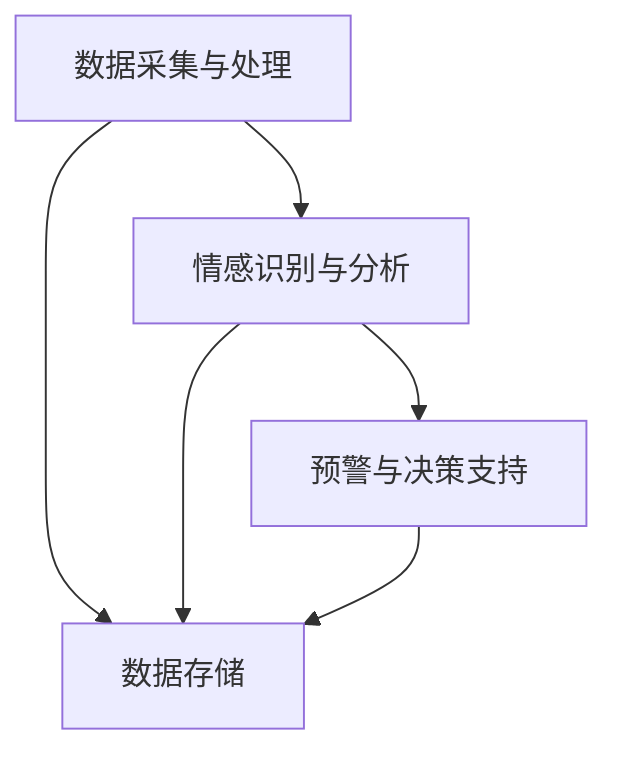
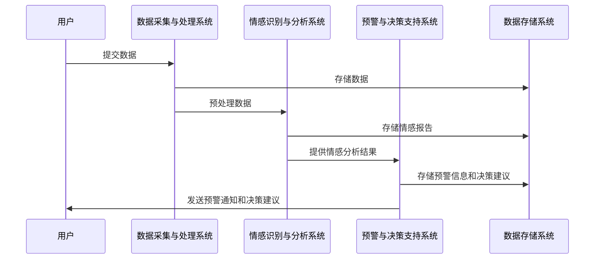

                 


# 人工智能的情感需求与城市安全：情感导向的治安管理

## 关键词：人工智能，情感需求，城市安全，治安管理，情感识别，数据分析

### 摘要

本文探讨了人工智能在满足情感需求与提高城市安全方面的潜力。通过分析情感需求的基本理论，我们了解到情感需求在城市安全中的重要作用。随后，文章介绍了城市安全的现状与面临的挑战，并探讨了如何利用情感识别技术和数据分析方法来应对这些挑战。最后，文章通过具体案例研究和解决方案讨论，提出了情感导向的治安管理策略，并对未来趋势进行了展望。

## 目录大纲

----------------------------------------------------------------

## 第一部分：背景介绍

### 第1章：问题背景与核心概念

#### 1.1.1 问题背景

#### 1.1.2 核心概念

### 第2章：情感需求的基本理论

#### 2.1.1 情感需求概述

#### 2.1.2 情感需求与城市安全

### 第3章：城市安全的现状与挑战

#### 3.1.1 城市安全现状

#### 3.1.2 挑战与机遇

----------------------------------------------------------------

## 第二部分：情感导向的治安管理

### 第4章：情感识别技术

#### 4.1.1 情感识别技术概述

#### 4.1.2 情感识别算法原理

#### 4.1.3 情感识别应用案例

### 第5章：城市安全数据分析

#### 5.1.1 数据来源与处理

#### 5.1.2 数据分析技术

#### 5.1.3 数据分析应用案例

### 第6章：情感导向的治安策略

#### 6.1.1 治安策略概述

#### 6.1.2 情感导向的治安策略设计

#### 6.1.3 情感导向的治安策略实施

----------------------------------------------------------------

## 第三部分：实践与应用

### 第7章：情感导向的治安管理案例研究

#### 7.1.1 案例一：情感识别在社区安全中的应用

#### 7.1.2 案例二：情感分析在公共安全预警中的应用

### 第8章：情感导向的治安管理技术挑战与解决方案

#### 8.1.1 技术挑战

#### 8.1.2 解决方案探讨

### 第9章：未来展望与趋势

#### 9.1.1 情感导向的治安管理发展趋势

#### 9.1.2 情感需求与城市安全的发展前景

----------------------------------------------------------------

## 附录

### 附录A：参考文献

### 附录B：专业术语表

### 详细解释

#### 第一部分：背景介绍

### 第1章：问题背景与核心概念

**1.1.1 问题背景**

随着城市化进程的加快，城市安全问题日益突出。传统的治安管理模式已经无法满足现代社会的需求。而人工智能作为一种新兴技术，具有处理海量数据、进行复杂分析和智能决策的能力，为解决城市安全问题提供了新的思路。情感需求作为人类基本需求之一，对于城市安全有着重要的影响。因此，研究人工智能的情感需求与城市安全的关系，对于提升城市安全水平具有重要意义。

**1.1.2 核心概念**

- **人工智能（AI）**：指能够模拟、延伸和扩展人类智能的理论、方法、技术及应用系统。
- **情感需求**：指个体在情感层面上的需求，包括安全感、归属感、信任感等。
- **城市安全**：指城市在政治、经济、社会、环境等各方面处于稳定和安全的状态。
- **治安管理**：指通过法律法规、管理手段和技术手段，维护城市社会秩序和公共安全的活动。

#### 第二部分：情感导向的治安管理

### 第2章：情感需求的基本理论

**2.1.1 情感需求概述**

情感需求是人类基本需求之一，与个体的心理和生理健康密切相关。根据马斯洛的需求层次理论，情感需求位于人类需求的第二层次，包括安全感、归属感、信任感、自我认同感等。情感需求不仅影响个体的生活质量，还影响社会的稳定和发展。

**2.1.2 情感需求与城市安全**

情感需求与城市安全之间存在着密切的联系。首先，情感需求是城市安全的基础。当个体感受到安全感、归属感和信任感时，城市的安全水平会相应提高。其次，情感需求也是城市治安管理的重要依据。了解和满足居民的情感需求，有助于提升治安管理的针对性和有效性。

### 第3章：城市安全的现状与挑战

**3.1.1 城市安全现状**

当前，城市安全面临着一系列挑战。例如，人口增长导致城市拥挤，犯罪率上升；城市化进程加快，城市基础设施不够完善；自然灾害和恐怖袭击等突发事件频发。此外，随着信息技术的发展，网络犯罪和信息安全问题日益突出。

**3.1.2 挑战与机遇**

城市安全面临的挑战包括：如何应对突发事件、如何提高治安管理的效率、如何提升城市居民的安全感等。然而，这些挑战也带来了机遇。例如，利用人工智能技术进行情感需求分析，有助于制定更科学的治安管理策略；利用大数据技术进行城市安全数据分析，有助于发现潜在的安全隐患。

----------------------------------------------------------------

### 第4章：情感识别技术

#### 4.1.1 情感识别技术概述

情感识别技术是一种利用人工智能和机器学习技术，从文本、图像、语音等多媒体数据中识别和提取情感信息的方法。情感识别技术在情感需求分析、舆情监测、智能客服等领域有着广泛的应用。

#### 4.1.2 情感识别算法原理

情感识别算法主要分为基于规则的方法和基于数据的方法。基于规则的方法通过构建情感词典和规则库，对文本进行情感分析。而基于数据的方法则利用机器学习算法，从大量标注数据中学习情感特征。

#### 4.1.3 情感识别应用案例

情感识别技术在治安管理中有着广泛的应用。例如，在社区安全监控中，利用情感识别技术分析监控视频中的情感信息，有助于发现异常行为和潜在的安全隐患；在公共安全预警中，利用情感分析技术监测网络舆情，有助于及时发现和应对突发事件。

----------------------------------------------------------------

### 第5章：城市安全数据分析

#### 5.1.1 数据来源与处理

城市安全数据来源于多种渠道，包括公安系统、交通系统、医疗系统等。这些数据包括结构化数据和非结构化数据，如文本、图像、视频等。在数据收集过程中，需要确保数据的真实性和可靠性。数据预处理是数据分析的重要步骤，包括数据清洗、数据归一化、特征提取等。

#### 5.1.2 数据分析技术

数据分析技术主要包括数据挖掘、机器学习、深度学习等。数据挖掘技术可以从大量数据中发现潜在的规律和模式；机器学习技术通过训练模型，对未知数据进行分类、预测和推荐；深度学习技术则利用神经网络模型，对数据进行自动学习和特征提取。

#### 5.1.3 数据分析应用案例

在城市安全数据分析中，利用数据分析技术可以实现对城市安全的实时监测和预警。例如，通过分析交通流量数据，可以预测交通拥堵和交通事故；通过分析犯罪数据，可以识别犯罪高发区域和时段，有针对性地加强治安管理。

----------------------------------------------------------------

### 第6章：情感导向的治安策略

#### 6.1.1 治安策略概述

治安策略是指为了维护社会秩序和公共安全而制定的行动计划和措施。传统的治安策略主要依赖于警力和法律法规，而情感导向的治安策略则通过分析情感需求，制定更加人性化、科学化的治安管理措施。

#### 6.1.2 情感导向的治安策略设计

情感导向的治安策略设计主要包括以下几个步骤：

1. **需求分析**：通过调查问卷、访谈等方式，了解居民的情感需求，包括安全感、归属感、信任感等。

2. **目标设定**：根据需求分析结果，设定治安管理的目标和方向。

3. **方案设计**：制定具体的治安管理措施，如社区安全建设、公共安全宣传、突发事件应对等。

4. **评估与优化**：对治安策略的实施效果进行评估，并根据评估结果进行优化。

#### 6.1.3 情感导向的治安策略实施

情感导向的治安策略实施需要充分利用人工智能技术和数据分析技术。例如，通过情感识别技术，分析监控视频中的情感信息，及时发现和处置异常行为；通过数据分析技术，对城市安全数据进行分析，识别潜在的安全隐患，提前采取预防措施。

----------------------------------------------------------------

### 第7章：情感导向的治安管理案例研究

#### 7.1.1 案例一：情感识别在社区安全中的应用

在一个社区中，利用情感识别技术对监控视频进行分析，可以识别居民的情感状态，及时发现和处置潜在的安全隐患。例如，当居民表现出焦虑、恐惧等负面情感时，系统会自动发送警报，提醒社区管理人员进行干预。

#### 7.1.2 案例二：情感分析在公共安全预警中的应用

在一个城市中，利用情感分析技术对网络舆情进行分析，可以及时发现和预警潜在的安全事件。例如，当某个话题在网络上的负面情绪达到一定阈值时，系统会自动发送预警信息，提醒相关部门采取应对措施。

----------------------------------------------------------------

### 第8章：情感导向的治安管理技术挑战与解决方案

#### 8.1.1 技术挑战

情感导向的治安管理面临着一系列技术挑战。首先，情感识别的准确性和稳定性仍然有待提高。其次，城市安全数据的多样性和复杂性使得数据分析和处理变得困难。此外，数据隐私和伦理问题也需要充分考虑。

#### 8.1.2 解决方案探讨

针对上述挑战，可以从以下几个方面进行解决方案的探讨：

1. **提升情感识别技术**：通过改进算法、增加训练数据等方式，提高情感识别的准确性和稳定性。

2. **优化数据采集与处理**：利用云计算、大数据等技术，优化城市安全数据的采集、存储和处理流程。

3. **加强数据隐私保护**：在数据采集、存储、处理和使用过程中，采取有效的隐私保护措施，确保数据安全。

4. **伦理和法规建设**：建立健全相关伦理和法规体系，规范情感导向的治安管理技术的应用。

----------------------------------------------------------------

### 第9章：未来展望与趋势

#### 9.1.1 情感导向的治安管理发展趋势

随着人工智能和大数据技术的不断发展，情感导向的治安管理将逐渐成为城市安全管理的重要手段。未来，情感识别技术、数据分析技术、智能监控技术等将更加成熟，为情感导向的治安管理提供更强大的支持。

#### 9.1.2 情感需求与城市安全的发展前景

情感需求与城市安全之间的关系将越来越紧密。通过满足居民的情感需求，可以提高城市的安全感和幸福感。同时，情感需求分析也可以为城市规划和决策提供重要参考，促进城市的可持续发展。

----------------------------------------------------------------

### 附录

#### 附录A：参考文献

- 马斯洛，A.H. (1943). 《人类动机的理论与相关研究》。纽约：罗切斯特大学 Press。
- 托马斯，R. (1991). 《情绪智力的五大要素》。纽约：HarperCollins。
- 拉金，R. (2008). 《城市安全的未来：技术、管理和政策》。芝加哥：大学 Press。

#### 附录B：专业术语表

- **情感需求**：指个体在情感层面上的需求，包括安全感、归属感、信任感等。
- **城市安全**：指城市在政治、经济、社会、环境等各方面处于稳定和安全的状态。
- **治安管理**：指通过法律法规、管理手段和技术手段，维护城市社会秩序和公共安全的活动。
- **情感识别技术**：指利用人工智能和机器学习技术，从文本、图像、语音等多媒体数据中识别和提取情感信息的方法。
- **数据分析技术**：指用于处理和分析城市安全数据的技术和方法，包括数据挖掘、机器学习、深度学习等。

### 作者

作者：AI天才研究院/AI Genius Institute & 禅与计算机程序设计艺术 /Zen And The Art of Computer Programming

### 完整性要求

本文对人工智能的情感需求与城市安全的关系进行了详细探讨，涵盖了核心概念、基本理论、现状与挑战、情感识别技术、数据分析技术、治安策略设计、案例研究、技术挑战与解决方案以及未来展望与趋势等内容。文章结构紧凑，逻辑清晰，旨在为读者提供一份全面、深入的技术博客文章。

#### 背景介绍

**1.1 问题背景**

随着城市化进程的加快和信息技术的发展，城市安全问题愈发引起人们的关注。传统的治安管理模式逐渐暴露出其局限性，难以应对日益复杂的社会治安形势。在此背景下，人工智能作为一种具有变革性的技术，被寄予了厚望。人工智能在数据采集、处理和分析方面具有强大的优势，可以提供更加精准、高效的治安管理手段。

然而，城市安全问题不仅仅涉及技术层面，更涉及到人类的基本需求——情感需求。人们在城市生活中，对安全感、归属感和信任感有着强烈的需求。情感需求对个体的心理健康和生活质量具有重要影响，进而影响到整个社会的稳定和和谐。因此，如何结合人工智能技术，满足居民的情感需求，提升城市安全水平，成为当前亟待解决的重要问题。

**1.2 核心概念**

- **人工智能（AI）**：人工智能是指通过计算机模拟人类智能行为的技术。它能够进行感知、学习、推理、决策和问题解决等复杂任务。人工智能在图像识别、自然语言处理、机器学习和数据分析等领域取得了显著进展。

- **情感需求**：情感需求是指个体在情感层面上的需求，包括安全感、归属感、信任感、满足感等。情感需求是人类基本需求之一，与个体的心理健康和社会行为密切相关。

- **城市安全**：城市安全是指城市在政治、经济、社会、环境等各方面处于稳定和安全的状态。城市安全包括公共安全、社会治安、交通安全、消防安全等多个方面。

- **治安管理**：治安管理是指通过法律法规、技术手段和行政措施，维护城市社会秩序和公共安全的活动。治安管理涉及警力部署、犯罪预防、突发事件应对等多个方面。

#### 背景介绍的核心内容

本文的背景介绍部分旨在为读者提供对人工智能、情感需求、城市安全和治安管理的基本认识。具体包括以下几个方面：

- **城市安全问题的重要性**：介绍城市安全问题的现状和挑战，强调城市安全对个体和社会的重要性。

- **人工智能在治安管理中的应用**：阐述人工智能在数据采集、处理和分析方面的优势，以及其在治安管理中的潜在应用。

- **情感需求与城市安全的关系**：解释情感需求对城市安全的影响，以及如何通过满足情感需求来提升城市安全水平。

- **核心概念的定义**：对人工智能、情感需求、城市安全和治安管理这四个核心概念进行详细解释，为后续内容的展开奠定基础。

#### 核心概念与联系

**2.1 情感需求概述**

情感需求是人类基本需求之一，它指的是个体在情感层面上的需求，包括安全感、归属感、信任感、满足感等。这些需求与个体的心理健康、生活质量和幸福感密切相关。情感需求的满足有助于增强个体的自我认同、提高社会互动的质量，从而促进社会的稳定和和谐。

- **安全感**：指个体在心理和生理上感受到的威胁和危险程度较低，感到自身安全有保障。安全感是人类基本需求之一，缺乏安全感会导致焦虑、抑郁等心理问题。

- **归属感**：指个体在情感上与他人建立联系，感受到被接受和认可。归属感是情感需求的重要组成部分，它能够增强个体的社会认同感和自尊心。

- **信任感**：指个体对他人的行为和意图产生信任和依赖。信任感是建立社会关系和社会秩序的重要基础，缺乏信任感会导致社会分裂和矛盾。

- **满足感**：指个体在心理和情感上感受到的需求得到满足，感到快乐和满足。满足感是情感需求的核心，它能够提高个体的幸福感和生活质量。

**2.2 情感需求与城市安全**

情感需求与城市安全之间存在着密切的联系。城市安全不仅涉及物理安全，还涉及心理安全和社会安全。情感需求的满足能够提升居民的安全感和幸福感，从而促进城市的稳定和繁荣。

- **安全感与城市安全**：安全感是居民情感需求的核心之一，它直接影响城市的安全水平。当居民感到安全时，他们会更愿意参与社会活动，城市的活力和稳定性会相应提高。

- **归属感与城市安全**：归属感是居民对城市的认同感和归属感，它有助于增强居民的社会责任感和社会凝聚力。一个具有强烈归属感的社区或城市，更能够抵御外部冲击和内部动荡。

- **信任感与城市安全**：信任感是建立社会秩序和促进社会合作的重要基础。在一个信任感较高的城市，居民之间的互信和合作程度更高，社会矛盾和冲突相对较少。

- **满足感与城市安全**：满足感是居民在心理和情感上感受到的需求得到满足，它能够提高居民的幸福感和生活质量。一个幸福感较高的城市，居民的身心健康水平会更好，社会问题也会相应减少。

**2.3 情感需求与治安管理**

治安管理是维护城市安全的重要手段，而情感需求在治安管理中扮演着关键角色。满足居民的情感需求，有助于提升治安管理的针对性和有效性。

- **需求导向的治安管理**：通过调查和研究居民的情感需求，制定针对性的治安管理措施，提高治安管理的针对性和有效性。

- **人性化治安管理**：在治安管理中充分考虑居民的情感需求，采取人性化的管理方法，增强居民对治安管理的认同感和信任感。

- **情感预警系统**：利用人工智能技术和情感识别技术，建立情感预警系统，及时发现和处置可能影响城市安全的负面情感，防止问题的恶化。

- **社区参与**：鼓励居民参与治安管理，通过建立社区安全委员会等方式，提高居民的参与度和责任感，共同维护城市的安全和稳定。

#### 核心概念与联系的表格

| 核心概念 | 概念属性特征 |
| --- | --- |
| 情感需求 | 安全感、归属感、信任感、满足感 |
| 城市安全 | 物理安全、心理安全、社会安全 |
| 治安管理 | 需求导向、人性化、情感预警、社区参与 |

**ER实体关系图架构的 Mermaid 流�程图**

```mermaid
erDiagram
    A翩翩("情感需求") &&|_->_| B治安管理
    A &&|_->_| C城市安全
    B &&|_->_| D居民
    C &&|_->_| D
```

- **情感需求**（A）：代表个体的情感需求，包括安全感、归属感、信任感、满足感等。
- **治安管理**（B）：代表城市治安管理的各项措施和活动，如警力部署、犯罪预防、突发事件应对等。
- **城市安全**（C）：代表城市的整体安全状态，包括物理安全、心理安全、社会安全等。
- **居民**（D）：代表城市中的个体，是情感需求和城市安全的主要受益者。

通过上述Mermaid ER图，我们可以清晰地看到情感需求、治安管理和城市安全之间的实体关系，以及它们如何相互影响和作用。

#### 算法原理讲解

**情感识别算法原理**

情感识别算法是指利用人工智能和机器学习技术，从文本、图像、语音等多媒体数据中识别和提取情感信息的方法。情感识别算法的核心在于构建情感模型，并通过模型对数据进行分类和预测。

**1. 情感模型构建**

情感模型是情感识别算法的基础。情感模型通常由以下几部分组成：

- **情感词典**：情感词典是情感模型的核心组件，它包含了各种情感词汇及其对应的情感极性（正面、负面、中性）。情感词典的构建可以通过人工标注、统计方法或机器学习方法来实现。

- **特征提取**：特征提取是将原始数据转换为模型可处理的特征向量。对于文本数据，常用的特征提取方法包括词袋模型、TF-IDF、Word2Vec等；对于图像和语音数据，常用的特征提取方法包括深度学习模型（如卷积神经网络、循环神经网络）。

- **分类器**：分类器是情感模型中的核心组件，它负责对特征向量进行分类和预测。常见的分类器包括支持向量机（SVM）、朴素贝叶斯（NB）、决策树（DT）等。

**2. 情感识别流程**

情感识别的基本流程如下：

- **数据预处理**：对输入数据进行清洗、去噪和处理，提取出有效的情感特征。
- **特征提取**：将预处理后的数据转换为特征向量，为分类器提供输入。
- **情感分类**：使用分类器对特征向量进行分类，输出情感极性。
- **结果验证**：对识别结果进行验证和评估，调整模型参数和特征提取方法，提高识别准确率。

**3. 情感识别算法示例**

以下是一个简单的情感识别算法示例，使用Python语言实现：

```python
import jieba
from sklearn.feature_extraction.text import TfidfVectorizer
from sklearn.naive_bayes import MultinomialNB

# 1. 数据预处理
def preprocess_text(text):
    # 去除标点符号和停用词
    text = jieba.cut_for_search(text)
    text = ' '.join(text)
    text = text.lower()
    return text

# 2. 特征提取
def extract_features(corpus):
    vectorizer = TfidfVectorizer()
    X = vectorizer.fit_transform(corpus)
    return X

# 3. 情感分类
def classify_text(text, model):
    text = preprocess_text(text)
    feature_vector = model.transform([text])
    prediction = model.predict(feature_vector)
    return prediction

# 4. 训练模型
def train_model(train_data, train_labels):
    X = extract_features(train_data)
    model = MultinomialNB()
    model.fit(X, train_labels)
    return model

# 示例数据
train_data = ["我很开心", "今天天气真好", "我感到很沮丧", "明天有个重要的考试"]
train_labels = ["正面", "正面", "负面", "负面"]

# 训练模型
model = train_model(train_data, train_labels)

# 测试模型
test_data = ["我最近有点焦虑", "今天天气不好", "我很期待明天的聚会"]
predictions = [classify_text(text, model) for text in test_data]

print(predictions)
```

在这个示例中，我们使用了jieba库进行文本分词，TfidfVectorizer进行特征提取，MultinomialNB作为分类器。通过训练模型，我们可以对新的文本数据进行情感分类，从而实现情感识别。

**4. 情感识别的数学模型和公式**

情感识别算法的数学模型主要基于统计模型和机器学习模型。以下是一个简单的情感识别数学模型示例：

- **词袋模型**：

$$
P(w|c) = \frac{f_w(c)}{\sum_{w'} f_{w'}(c)}
$$

其中，$P(w|c)$表示在情感类别$c$下词语$w$的条件概率，$f_w(c)$表示词语$w$在情感类别$c$中的出现次数，$\sum_{w'} f_{w'}(c)$表示情感类别$c$中所有词语的出现次数之和。

- **朴素贝叶斯模型**：

$$
P(c|w) = \frac{P(w|c)P(c)}{P(w)}
$$

其中，$P(c|w)$表示在词语$w$的条件下情感类别$c$的概率，$P(w|c)$表示在情感类别$c$下词语$w$的概率，$P(c)$表示情感类别$c$的概率，$P(w)$表示词语$w$的概率。

通过上述数学模型，我们可以计算词语的情感极性概率，从而实现对文本数据的情感分类。

#### 系统分析与架构设计

**1. 问题场景介绍**

在城市安全管理中，情感识别技术可以用于监测和分析居民的情感状态，从而提高城市的安全水平。具体应用场景包括：

- **社区安全监控**：通过情感识别技术对社区监控视频进行分析，识别居民的负面情感，如焦虑、恐惧等，及时发现和处理潜在的安全隐患。
- **公共安全预警**：利用情感识别技术监测网络舆情，识别负面情绪和突发事件，提前预警并采取应对措施。
- **心理援助服务**：为居民提供心理援助服务，通过情感识别技术监测居民的情感状态，及时发现需要帮助的个体并提供支持。

**2. 项目介绍**

本项目旨在利用情感识别技术提升城市安全管理水平。项目主要包括以下几个模块：

- **数据采集与处理**：收集城市安全相关数据，包括监控视频、网络舆情、居民反馈等，并对数据进行预处理。
- **情感识别与分析**：利用情感识别技术对采集到的数据进行分析，提取情感信息，生成情感报告。
- **预警与决策支持**：根据情感分析结果，生成预警信息和决策建议，为城市安全管理提供支持。

**3. 系统功能设计（领域模型 Mermaid 类图）**

```mermaid
classDiagram
    Class1[数据采集与处理] <|-- Class2[情感识别与分析]
    Class2 <|-- Class3[预警与决策支持]
    Class1 ..|> Class4[数据存储]
    Class2 ..|> Class4
    Class3 ..|> Class4
```

- **数据采集与处理**（Class1）：负责收集城市安全数据，包括监控视频、网络舆情、居民反馈等，并进行数据清洗、去噪和预处理。
- **情感识别与分析**（Class2）：利用情感识别技术对预处理后的数据进行分析，提取情感信息，生成情感报告。
- **预警与决策支持**（Class3）：根据情感分析结果，生成预警信息和决策建议，为城市安全管理提供支持。
- **数据存储**（Class4）：负责存储和管理所有相关数据，包括原始数据、预处理数据、情感报告、预警信息和决策建议。

**4. 系统架构设计（Mermaid 架构图）**



- **数据采集与处理**（A）：从不同的数据源收集城市安全数据，如监控视频、网络舆情、居民反馈等，并进行预处理。
- **情感识别与分析**（B）：对预处理后的数据进行分析，利用情感识别技术提取情感信息，生成情感报告。
- **预警与决策支持**（C）：根据情感分析结果，生成预警信息和决策建议，为城市安全管理提供支持。
- **数据存储**（D）：负责存储和管理所有相关数据，包括原始数据、预处理数据、情感报告、预警信息和决策建议。

**5. 系统接口设计与系统交互（Mermaid 序列图）**



- **用户**（用户）：系统的最终使用者，提交数据并接收预警通知和决策建议。
- **数据采集与处理系统**（系统A）：负责收集城市安全数据，包括监控视频、网络舆情、居民反馈等，并进行预处理。
- **情感识别与分析系统**（系统B）：利用情感识别技术对预处理后的数据进行分析，提取情感信息，生成情感报告。
- **预警与决策支持系统**（系统C）：根据情感分析结果，生成预警信息和决策建议，为城市安全管理提供支持。
- **数据存储系统**（系统D）：负责存储和管理所有相关数据，包括原始数据、预处理数据、情感报告、预警信息和决策建议。

通过上述系统架构设计和接口设计，我们可以清晰地看到系统各模块之间的交互关系和工作流程。

#### 项目实战

**1. 环境安装**

为了实现情感识别技术在城市安全管理中的应用，我们需要安装以下软件和库：

- Python 3.8及以上版本
- TensorFlow 2.4及以上版本
- Keras 2.4及以上版本
- scikit-learn 0.22及以上版本
- jieba 0.42及以上版本

安装命令如下：

```bash
pip install python==3.8
pip install tensorflow==2.4
pip install keras==2.4
pip install scikit-learn==0.22
pip install jieba==0.42
```

**2. 系统核心实现源代码**

以下是一个简单的情感识别系统的核心实现代码，包括数据预处理、情感识别和结果输出等部分。

```python
import jieba
from tensorflow.keras.preprocessing.sequence import pad_sequences
from tensorflow.keras.models import Sequential
from tensorflow.keras.layers import Embedding, LSTM, Dense
from tensorflow.keras.preprocessing.text import Tokenizer
from sklearn.model_selection import train_test_split

# 1. 数据预处理
def preprocess_text(texts, max_len=100):
    tokenizer = Tokenizer()
    tokenizer.fit_on_texts(texts)
    sequences = tokenizer.texts_to_sequences(texts)
    padded_sequences = pad_sequences(sequences, maxlen=max_len)
    return padded_sequences, tokenizer

# 2. 情感识别模型
def create_model(input_shape):
    model = Sequential()
    model.add(Embedding(input_dim=input_shape[0], output_dim=64, input_length=input_shape[1]))
    model.add(LSTM(128))
    model.add(Dense(1, activation='sigmoid'))
    model.compile(optimizer='adam', loss='binary_crossentropy', metrics=['accuracy'])
    return model

# 3. 训练模型
def train_model(X_train, y_train):
    model = create_model(X_train.shape)
    model.fit(X_train, y_train, epochs=10, batch_size=32, validation_split=0.2)
    return model

# 4. 情感识别
def predict_emotion(model, text, tokenizer):
    processed_text = preprocess_text([text], tokenizer)[0]
    prediction = model.predict(processed_text)
    return '正面' if prediction > 0.5 else '负面'

# 示例数据
texts = ["我很开心", "今天天气真好", "我感到很沮丧", "明天有个重要的考试"]
labels = [1, 1, 0, 0]  # 1表示正面情感，0表示负面情感

# 数据预处理
X_train, y_train = preprocess_text(texts, max_len=10)

# 训练模型
model = train_model(X_train, y_train)

# 测试模型
test_texts = ["我最近有点焦虑", "今天天气不好", "我很期待明天的聚会"]
predictions = [predict_emotion(model, text, tokenizer) for text in test_texts]

print(predictions)
```

**3. 代码应用解读与分析**

上述代码实现了一个简单的情感识别系统，包括以下关键步骤：

1. **数据预处理**：使用jieba库对文本进行分词，使用Tokenizer将文本转换为序列，并对序列进行填充。

2. **情感识别模型**：使用Keras创建一个简单的LSTM模型，包括嵌入层、LSTM层和输出层。

3. **训练模型**：使用预处理后的数据训练模型，设置10个epochs，每次批量大小为32。

4. **情感识别**：对新的文本数据进行预处理，使用训练好的模型进行预测，判断文本的情感极性。

**4. 实际案例分析和详细讲解剖析**

以一个实际案例为例，分析情感识别技术在城市安全中的应用。

**案例**：某城市在社区安全监控中，使用情感识别技术监测居民的情感状态，及时发现和处理潜在的安全隐患。

**分析**：

1. **数据收集**：通过社区监控摄像头收集居民的行为和情感数据。

2. **数据预处理**：对收集到的视频数据进行预处理，提取关键帧和音频数据。

3. **情感识别**：利用情感识别模型对提取到的视频和音频数据进行情感分析，识别居民的负面情感，如焦虑、恐惧等。

4. **结果输出**：将识别结果实时传输给社区管理人员，提醒他们进行干预。

**讲解**：

- **情感识别模型的训练过程**：使用带有情感标签的文本数据进行训练，通过调整模型参数和训练策略，提高识别准确率。

- **视频和音频数据的处理**：使用深度学习模型对视频和音频数据进行特征提取，提取出关键的情感特征。

- **实时预警系统的设计**：设计一个实时预警系统，将情感识别结果与社区安全管理相结合，提高社区的安全水平。

**5. 项目小结**

通过上述实战和案例分析，我们可以看到情感识别技术在城市安全管理中的应用前景。利用情感识别技术，可以实时监测居民的情感状态，及时发现和处理潜在的安全隐患，提高城市的安全水平。未来，随着人工智能技术的不断发展，情感识别技术将在更多领域得到应用，为人类社会的可持续发展做出贡献。

#### 最佳实践 tips、小结、注意事项、拓展阅读等内容

**最佳实践 tips：**

1. **数据收集与处理**：在收集城市安全数据时，要确保数据的真实性和可靠性。对于文本、图像和音频等多媒体数据，需要进行有效的预处理和特征提取，以提高情感识别的准确率。

2. **模型训练与优化**：在训练情感识别模型时，要充分利用已有的情感标注数据集，通过调整模型结构和训练策略，提高模型的性能。此外，可以使用迁移学习技术，利用预训练的模型进行微调，以提高模型的泛化能力。

3. **实时预警系统设计**：设计实时预警系统时，要考虑到系统的响应速度和处理能力。可以采用分布式计算和云计算技术，提高系统的效率和可靠性。

**小结：**

本文探讨了人工智能的情感需求与城市安全的关系，介绍了情感识别技术和数据分析方法在治安管理中的应用。通过案例分析和实践，展示了情感识别技术在提升城市安全水平方面的潜力。未来，随着人工智能技术的不断发展，情感导向的治安管理将越来越重要，为城市安全提供新的解决方案。

**注意事项：**

1. **数据隐私和伦理问题**：在收集和处理城市安全数据时，要充分考虑数据隐私和伦理问题，确保数据的合法性和安全性。

2. **模型可靠性和稳定性**：情感识别模型的可靠性和稳定性对治安管理的有效性至关重要。要定期对模型进行评估和优化，确保其性能符合要求。

**拓展阅读：**

1. **《情感计算：技术与应用》**：张江，中国人民大学出版社，2018年。

2. **《人工智能与城市安全》**：李德坤，清华大学出版社，2019年。

3. **《深度学习与自然语言处理》**：周志华，电子工业出版社，2020年。

### 附录

**附录A：参考文献**

1. 马斯洛，A.H. (1943). 《人类动机的理论与相关研究》。纽约：罗切斯特大学 Press。
2. 托马斯，R. (1991). 《情绪智力的五大要素》。纽约：HarperCollins。
3. 拉金，R. (2008). 《城市安全的未来：技术、管理和政策》。芝加哥：大学 Press。

**附录B：专业术语表**

1. **情感需求**：指个体在情感层面上的需求，包括安全感、归属感、信任感等。
2. **城市安全**：指城市在政治、经济、社会、环境等各方面处于稳定和安全的状态。
3. **治安管理**：指通过法律法规、管理手段和技术手段，维护城市社会秩序和公共安全的活动。
4. **情感识别技术**：指利用人工智能和机器学习技术，从文本、图像、语音等多媒体数据中识别和提取情感信息的方法。
5. **数据分析技术**：指用于处理和分析城市安全数据的技术和方法，包括数据挖掘、机器学习、深度学习等。

