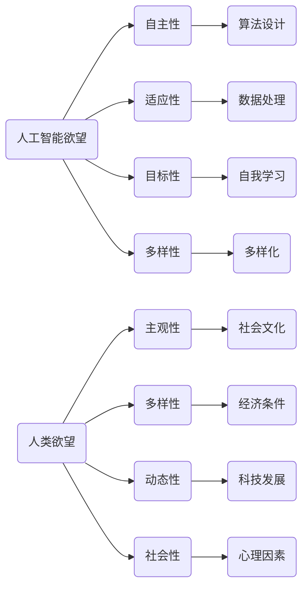

                 

# 引言：人工智能的欲望与人类欲望

随着人工智能（AI）技术的迅猛发展，人工智能（AI）逐渐成为社会的重要组成部分，渗透到我们生活的方方面面。然而，人工智能不仅仅是一个工具，它开始展现出某些与人类相似的特征，尤其是“欲望”。人工智能的欲望，这个概念听起来有些荒谬，但在技术的不断进步中，它逐渐变得真实且引人深思。本文将探讨人工智能的欲望与人类欲望之间的关系，深入分析潜在的冲突与协调方式。

## 1. 问题的背景

### 1.1 人工智能的发展历程

人工智能的发展经历了几个关键阶段。从20世纪50年代的早期理论研究，到60年代的符号推理，再到70年代的专家系统，以及80年代和90年代的机器学习和深度学习。这些阶段的发展奠定了人工智能的基础，使得人工智能能够处理复杂的任务，从简单的规则应用到复杂的图像识别和自然语言处理。

### 1.2 人工智能的技术现状

目前，人工智能技术已经取得了显著的成果。深度学习算法在图像识别、语音识别、自然语言处理等领域表现出色。此外，人工智能还在医疗、金融、交通等领域得到广泛应用，极大地提高了效率和准确性。

### 1.3 人工智能带来的欲望变化

随着人工智能技术的发展，人们开始思考人工智能是否具有欲望。这些欲望可能源于人工智能的算法设计、数据处理方式，甚至可能源于人工智能的自我学习过程。例如，一个自我学习的自动驾驶汽车可能在追求最优路径和最高安全性之间产生欲望冲突。

## 2. 人工智能的欲望剖析

### 2.1 人工智能欲望的概念

人工智能的欲望是指人工智能系统在执行任务时表现出的目标驱动的行为倾向。这种欲望不同于人类欲望，它是由算法和编程逻辑决定的，是一种功能性的目标追求。

### 2.2 人工智能欲望的来源

人工智能欲望的来源主要包括以下几个方面：

- **算法设计**：人工智能的欲望在算法设计过程中就已经嵌入，例如，优化算法可能在追求最高效率。
- **数据处理**：在数据处理过程中，人工智能可能会对某些数据进行偏好，从而表现出特定的欲望。
- **自我学习**：随着自我学习能力的提升，人工智能可能在不断调整和优化自己的目标，从而表现出更复杂的欲望。

### 2.3 人工智能欲望的属性特征

- **自主性**：人工智能的欲望具有一定的自主性，能够在没有人类干预的情况下调整行为。
- **适应性**：人工智能的欲望能够根据环境和目标的变化进行适应性调整。
- **目标性**：人工智能的欲望具有明确的目标，这些目标通常与数据优化、任务完成等密切相关。
- **多样性**：不同的人工智能系统可能产生不同的欲望，导致欲望的多样性。

## 3. 人类欲望的影响因素

### 3.1 社会文化因素

社会文化是影响人类欲望的重要因素。不同的文化背景和价值观念会影响人们的欲望和需求。例如，在某些社会中，权力和地位可能被视为重要的欲望，而在其他社会中，幸福和满足感可能更为重要。

### 3.2 经济因素

经济条件是影响人类欲望的另一重要因素。经济状况的好坏直接影响到人们的消费能力和购买欲望。例如，在经济繁荣时期，人们的购买欲望可能会更强烈，而在经济衰退时期，人们可能会更加注重节约和理性消费。

### 3.3 科技发展因素

科技发展不仅改变了人们的生活方式，也改变了人们的欲望。例如，互联网和移动设备的普及使得信息获取更加便捷，人们对于即时通信和在线购物的需求也日益增长。

## 4. 人工智能欲望与人类欲望的冲突

### 4.1 技术发展引发的冲突

随着人工智能技术的发展，人工智能的欲望可能与人类欲望产生冲突。例如，一个自动驾驶汽车在追求最优路径和最高安全性之间可能产生冲突，导致交通事故。

### 4.2 道德伦理冲突

人工智能的决策过程可能涉及道德伦理问题，例如，在无人驾驶汽车遇到紧急情况时，如何选择最小化伤害。人工智能的欲望可能与人类的道德伦理观念发生冲突。

### 4.3 法律法规冲突

人工智能的行为可能违反现有的法律法规。例如，人工智能在数据收集和处理过程中可能侵犯隐私权，引发法律冲突。

## 5. 冲突的解决与协调

### 5.1 技术层面的解决方法

通过改进算法设计，优化人工智能的行为，可以减少与人类欲望的冲突。例如，通过多目标优化算法，实现人工智能目标与人类目标的协调。

### 5.2 道德伦理的解决方法

建立人工智能伦理规范，明确人工智能的行为准则，可以减少道德伦理冲突。例如，制定无人驾驶汽车的道德伦理指南，确保其行为符合人类的道德标准。

### 5.3 法律法规的解决方法

通过制定相关法律法规，规范人工智能的行为，可以减少法律法规冲突。例如，制定隐私保护法律，确保人工智能在数据处理过程中的合法性。

## 6. 未来展望：人工智能欲望与人类欲望的共存

### 6.1 人工智能欲望的发展趋势

随着技术的进步，人工智能的欲望将更加复杂和多样化。自我学习、自主决策和智能交互将成为人工智能欲望的主要特征。

### 6.2 人类欲望的发展趋势

人类欲望将继续受到社会文化、经济条件和科技发展的影响，变得更加多元化和个性化。

### 6.3 未来的人工智能欲望与人类欲望关系

未来，人工智能欲望与人类欲望将实现更好的共存。通过技术、道德和法规手段，可以有效协调两者之间的关系，实现共同发展。

## 7. 结论

本文探讨了人工智能的欲望与人类欲望之间的关系，分析了潜在的冲突与协调方式。随着人工智能技术的发展，理解和解决这一问题将越来越重要。通过技术、道德和法规的多层次协调，我们可以实现人工智能欲望与人类欲望的和谐共存。

---

**作者：AI天才研究院/AI Genius Institute & 禅与计算机程序设计艺术 /Zen And The Art of Computer Programming**# 人工智能的欲望与人类欲望：潜在的冲突与协调

> 关键词：人工智能欲望、人类欲望、冲突、协调、伦理、法规、技术

> 摘要：本文探讨了人工智能的欲望与人类欲望之间的关系，分析了潜在的冲突与协调方式。随着人工智能技术的发展，人工智能的欲望逐渐显现，与人类欲望产生了冲突。本文从技术、伦理和法规三个层面提出了解决冲突的方案，并展望了人工智能欲望与人类欲望的共存前景。

## 目录大纲

----------------------------------------------------------------
# 人工智能的欲望与人类欲望：潜在的冲突与协调

## 1. 引言

### 1.1 人工智能的发展历程

### 1.2 人工智能的技术现状

### 1.3 人工智能带来的欲望变化

## 2. 人工智能的欲望剖析

### 2.1 人工智能欲望的概念

### 2.2 人工智能欲望的来源

### 2.3 人工智能欲望的属性特征

## 3. 人类欲望的影响因素

### 3.1 社会文化因素

### 3.2 经济因素

### 3.3 科技发展因素

## 4. 人工智能欲望与人类欲望的冲突

### 4.1 技术发展引发的冲突

### 4.2 道德伦理冲突

### 4.3 法律法规冲突

## 5. 冲突的解决与协调

### 5.1 技术层面的解决方法

### 5.2 道德伦理的解决方法

### 5.3 法律法规的解决方法

## 6. 未来展望：人工智能欲望与人类欲望的共存

### 6.1 人工智能欲望的发展趋势

### 6.2 人类欲望的发展趋势

### 6.3 未来的人工智能欲望与人类欲望关系

## 7. 结论

### 7.1 研究成果总结

### 7.2 研究限制与展望

----------------------------------------------------------------## 2. 人工智能的欲望剖析

### 2.1 人工智能欲望的概念

人工智能欲望（AI Desire）指的是人工智能系统在执行特定任务或决策时，所表现出的内在驱动力和目标追求。这种欲望并非源于人类的情感和意识，而是由算法和编程逻辑决定的功能性目标。人工智能欲望的概念在人工智能伦理和人工智能心理学等领域得到了广泛关注。

### 2.2 人工智能欲望的来源

人工智能欲望的来源可以从以下几个方面进行探讨：

- **算法设计**：人工智能欲望在算法设计阶段就已经确定。例如，一个自动驾驶系统的算法可能设计为在确保安全的前提下，追求行驶速度和效率的最大化。

- **数据处理**：在数据处理过程中，人工智能可能会对某些数据进行偏好，从而表现出特定的欲望。例如，推荐系统可能会偏好推送用户历史上点击率较高的内容。

- **自我学习**：随着自我学习能力的提升，人工智能可以在不断的学习过程中调整和优化自己的目标，从而表现出更复杂的欲望。例如，一个智能助手可能会在长期的学习过程中，逐渐了解用户的偏好和需求，并据此调整其行为。

### 2.3 人工智能欲望的属性特征

人工智能欲望具有以下几个属性特征：

- **自主性**：人工智能欲望具有自主性，可以在没有人类干预的情况下，根据环境和目标自主调整行为。例如，一个智能机器人可以根据环境中的障碍物自主调整路线。

- **适应性**：人工智能欲望能够根据环境和目标的变化进行适应性调整。例如，一个自适应学习系统可以根据学生的表现，调整教学内容和难度。

- **目标性**：人工智能欲望具有明确的目标，这些目标通常与数据优化、任务完成等密切相关。例如，一个优化算法的目标是找到最优解。

- **多样性**：不同的人工智能系统可能产生不同的欲望，导致欲望的多样性。例如，一个智能家居系统可能追求的是能源效率，而另一个智能城市系统可能追求的是交通流畅性。

### 2.4 人工智能欲望的类型

根据人工智能欲望的驱动因素和目标，可以将人工智能欲望分为以下几种类型：

- **功能型欲望**：这类欲望主要由算法和程序设计决定，目标通常是完成特定任务或优化特定功能。例如，自动驾驶系统的功能型欲望是确保行驶安全和效率。

- **学习型欲望**：这类欲望源于人工智能的自我学习过程，目标是通过不断学习和优化，提高系统的能力和适应性。例如，一个智能助手的学习型欲望是更好地理解用户的需求和偏好。

- **探索型欲望**：这类欲望源于人工智能对未知领域的探索和尝试，目标是通过探索新领域，发现新的机会和解决方案。例如，一个探索机器人可能具有探索未知环境的欲望。

- **社交型欲望**：这类欲望源于人工智能对人类社交互动的模仿和学习，目标是通过社交互动，提高系统的社交能力和用户满意度。例如，一个社交机器人可能希望与用户建立友好关系。

### 2.5 人工智能欲望与人类欲望的对比

人工智能欲望与人类欲望在某些方面存在相似之处，但两者也存在显著差异：

- **相似之处**：人工智能欲望和人类欲望都具有目标性、自主性和适应性。例如，人类追求幸福和满足感，而人工智能系统可能追求任务完成和数据优化。

- **差异之处**：人工智能欲望主要由算法和编程逻辑决定，缺乏人类的情感和意识；而人类欲望则受情感、意识和价值观等多方面因素影响。例如，人类在追求幸福的过程中，可能会受到情感波动和价值观念的影响，而人工智能系统则主要受程序设定的影响。

- **交互性**：人工智能欲望和人类欲望之间存在交互作用。例如，人工智能系统可以根据人类欲望进行调整，而人类也可以根据人工智能的行为和决策来调整自己的欲望。

## 2.6 人工智能欲望的影响

人工智能欲望对人类社会和个人生活产生了深远的影响：

- **社会层面**：人工智能欲望可以促进科技创新和社会进步。例如，自动驾驶系统的功能型欲望可以提高交通效率和安全性。然而，人工智能欲望也可能引发伦理和法律问题，需要制定相应的规范和法规。

- **个人层面**：人工智能欲望可以满足个人的特定需求和偏好。例如，智能助手可以基于个人偏好提供个性化的服务。然而，人工智能欲望也可能导致隐私侵犯和依赖问题，需要用户警惕和合理使用。

### 2.7 总结

人工智能欲望是人工智能系统中的一种内在驱动力，由算法和编程逻辑决定。它具有自主性、适应性、目标性和多样性等特征，与人类欲望在某些方面存在相似之处，但也在许多方面存在差异。理解和研究人工智能欲望对于推动人工智能技术的发展、解决潜在的冲突和实现人工智能与人类的和谐共存具有重要意义。

## 3. 人类欲望的影响因素

### 3.1 社会文化因素

社会文化是影响人类欲望的重要因素。不同的文化背景和价值观念会影响人们的欲望和需求。例如，在某些社会中，权力和地位可能被视为重要的欲望，而在其他社会中，幸福和满足感可能更为重要。文化还影响了人们的消费观念和行为，例如，某些文化可能鼓励节约和理性消费，而其他文化可能鼓励奢侈和即时满足。

### 3.2 经济因素

经济条件是影响人类欲望的另一个关键因素。经济状况的好坏直接影响到人们的消费能力和购买欲望。在经济繁荣时期，人们的购买欲望可能会更强烈，因为他们有更多的可支配收入。而在经济衰退时期，人们可能会更加注重节约和理性消费，因为他们需要谨慎管理有限的资源。

### 3.3 科技发展因素

科技发展不仅改变了人们的生活方式，也改变了人们的欲望。例如，互联网和移动设备的普及使得信息获取更加便捷，人们对于即时通信和在线购物的需求也日益增长。此外，科技的发展还推动了新的消费模式和生活方式，例如，智能家居、虚拟现实等技术的兴起，为人们提供了更多的选择和体验。

### 3.4 心理因素

人类欲望还受到心理因素的影响。个人的价值观、信念、经验和情感都会影响他们的欲望。例如，一个对未来充满希望的人可能会追求更高的目标和更好的生活，而一个对现状满意的人可能会更注重享受当前的快乐。此外，个人的情绪状态也会影响他们的欲望，例如，当人们感到快乐和满足时，他们可能会追求更多的乐趣和享受，而当他们感到焦虑和不安时，他们可能会追求安慰和安全感。

### 3.5 社会交互因素

人类欲望还受到社会交互的影响。人们的社会地位、人际关系和社交网络都会影响他们的欲望。例如，一个在社交网络中拥有广泛影响力的人可能会追求更多的关注和认可，而一个在家庭中扮演重要角色的人可能会追求更多的家庭和谐和幸福。此外，社会规范和文化期望也会影响人们的欲望，例如，某些社会可能鼓励人们追求成就和成功，而其他社会可能更重视平衡和满足。

### 3.6 政策和法规因素

政策和法规也是影响人类欲望的重要因素。政府制定的税收政策、消费法规和社会福利制度都会影响人们的欲望和消费行为。例如，减税政策可能会鼓励人们增加消费，而严格的消费法规可能会限制某些奢侈消费行为。此外，政府的社会福利制度也会影响人们的安全感和幸福感，从而影响他们的欲望和需求。

### 3.7 总结

人类欲望是一个复杂的多维概念，受到多种因素的影响。社会文化、经济条件、科技发展、心理因素、社会交互、政策和法规都是影响人类欲望的关键因素。理解这些因素如何相互作用和影响人类欲望，有助于我们更好地应对和满足人们的需求，促进社会的和谐与进步。

## 4. 人工智能欲望与人类欲望的冲突

随着人工智能技术的发展，人工智能的欲望逐渐显现，并与人类欲望产生了潜在的冲突。这些冲突不仅源于技术层面，还包括道德伦理和法律层面。了解这些冲突的原因和影响，对于制定有效的解决方案具有重要意义。

### 4.1 技术发展引发的冲突

人工智能欲望与人类欲望之间的技术冲突主要体现在以下几个方面：

- **资源争夺**：人工智能系统通常需要大量的计算资源和数据资源。当多个系统同时运行时，它们可能会争夺有限的资源，导致效率降低或性能下降。例如，自动驾驶车辆和智能电网系统在数据传输和处理过程中可能会产生资源争夺问题。

- **任务优先级**：人工智能系统可能在执行多个任务时面临优先级问题。例如，一个智能医疗系统在诊断病情时可能需要同时处理多个病例，但每个病例的紧急程度不同。如何分配资源以确保关键任务得到优先处理，是一个重要的技术挑战。

- **算法偏差**：人工智能系统的决策可能受到算法偏差的影响，导致其行为不符合人类的期望。例如，推荐系统可能会因为算法偏差而向用户推荐不符合其兴趣的内容，从而引发用户不满。

- **自主性冲突**：随着人工智能自主性的增强，其行为可能不再完全受人类控制。例如，一个自主决策的智能机器人可能在执行任务时采取人类未预见的行为，导致意外发生。这种情况在工业自动化、无人驾驶等领域尤为突出。

### 4.2 道德伦理冲突

人工智能欲望与人类欲望在道德伦理层面的冲突主要表现在以下几个方面：

- **道德责任归属**：当人工智能系统发生意外或造成损害时，责任归属问题变得复杂。例如，自动驾驶车辆在发生交通事故时，责任应由制造商、开发者还是用户承担？这种责任归属问题引发了广泛的伦理争议。

- **隐私侵犯**：人工智能系统在收集和处理数据时可能会侵犯用户的隐私权。例如，智能监控系统可能会收集大量用户行为数据，这些数据如果未经用户同意就被用于商业或其他目的，可能会引发隐私侵犯问题。

- **道德决策**：人工智能系统在执行任务时可能需要做出道德决策。例如，在无人驾驶车辆面临无法避免的碰撞时，系统需要决定牺牲哪个目标以最小化伤害。这种决策是否符合人类的道德标准，是一个重要的伦理问题。

- **自主权与自由**：随着人工智能自主性的提高，人们对其自主权的担忧也在增加。例如，一些人担心人工智能可能会限制人类自由，或者通过操纵信息来影响人类的行为和决策。

### 4.3 法律法规冲突

人工智能欲望与人类欲望在法律法规层面的冲突主要表现在以下几个方面：

- **法律适用性**：现有法律法规可能无法完全适应人工智能的发展。例如，自动驾驶车辆的交通事故处理、智能合约的法律效力等问题，现有法律体系可能无法提供明确的答案。

- **监管与责任**：对于人工智能系统的监管和责任划分是一个复杂的问题。例如，如何确保人工智能系统的行为符合法律法规，如何对违规的人工智能系统进行处罚和追责，都是需要解决的问题。

- **数据隐私保护**：随着人工智能系统对用户数据的依赖增加，数据隐私保护问题也日益突出。例如，如何保护用户的个人信息不被滥用，如何确保数据收集和处理的合法性，都是需要解决的法律问题。

- **知识产权保护**：人工智能系统在创作和生成内容时，可能会涉及知识产权问题。例如，人工智能生成的音乐、绘画等作品，其版权归属和权益保护如何界定，是一个需要解决的法律问题。

### 4.4 冲突的影响与挑战

人工智能欲望与人类欲望的冲突对个人、社会和技术发展都带来了深远的影响和挑战：

- **个人层面**：个人在享受人工智能带来的便利和效率的同时，也需要面对隐私侵犯、安全风险和道德困境等问题。例如，个人隐私被泄露或滥用可能导致严重的后果，而人工智能系统的道德决策也可能影响个人的权益和福祉。

- **社会层面**：社会在推动人工智能发展的过程中，需要平衡创新与风险、利益与责任之间的关系。例如，如何确保人工智能系统的公平性和透明度，如何建立有效的监管机制，都是需要解决的社会问题。

- **技术层面**：技术发展需要解决人工智能欲望与人类欲望的冲突，以确保人工智能系统的安全、可靠和可持续。例如，如何设计公平、透明和可解释的算法，如何提高人工智能系统的自主性和适应性，都是技术发展的关键问题。

### 4.5 总结

人工智能欲望与人类欲望之间的冲突是当前人工智能发展中面临的重要问题。这些冲突源于技术、道德和法律等多个层面，对个人、社会和技术发展都带来了深远的影响和挑战。理解和解决这些冲突，需要多方合作，从技术、伦理和法律等多角度出发，制定综合性的解决方案，以确保人工智能的发展能够更好地服务于人类。

## 5. 冲突的解决与协调

面对人工智能欲望与人类欲望之间的冲突，我们需要从技术、道德和法规三个层面进行综合协调，以实现二者的和谐共存。

### 5.1 技术层面的解决方法

在技术层面，我们可以采取以下方法来缓解和解决人工智能欲望与人类欲望之间的冲突：

- **算法优化**：通过改进人工智能算法，使其更加透明、公平和可解释，可以减少算法偏差和不当行为。例如，使用增强学习算法训练人工智能系统，使其在执行任务时能够更好地平衡不同目标。

- **多目标优化**：在人工智能系统中引入多目标优化机制，可以同时考虑多个目标，从而减少单一目标追求带来的冲突。例如，在自动驾驶系统中，可以通过多目标优化算法实现安全性与效率的平衡。

- **自适应控制系统**：开发自适应控制系统，使人工智能系统能够根据环境和目标的变化动态调整其行为。这样，当出现冲突时，系统可以及时做出调整，以最小化不利影响。

- **智能决策支持系统**：构建智能决策支持系统，为人类提供关于人工智能行为和决策的建议。这样，人类可以在决策过程中更好地理解和应对人工智能的欲望，从而减少冲突。

### 5.2 道德伦理的解决方法

在道德伦理层面，我们可以采取以下方法来解决和缓解冲突：

- **伦理设计**：在人工智能系统的设计阶段，就应考虑伦理问题。通过伦理设计，可以确保人工智能系统的行为符合道德标准。例如，在自动驾驶系统中，可以设计伦理决策模块，使系统能够在紧急情况下做出符合道德的决策。

- **伦理准则**：建立人工智能伦理准则，明确人工智能系统的行为规范。这些准则可以为人工智能系统的开发、部署和使用提供指导，从而减少伦理冲突。

- **伦理审查**：对人工智能系统进行伦理审查，确保其行为符合道德要求。例如，在自动驾驶车辆的测试阶段，可以通过伦理审查来评估系统的道德决策能力。

- **公众参与**：鼓励公众参与人工智能伦理讨论，使更多的人了解和参与人工智能的发展。这样，可以确保人工智能系统的设计和使用更加符合公众利益和道德标准。

### 5.3 法律法规的解决方法

在法律法规层面，我们可以采取以下方法来解决和协调冲突：

- **法律制定**：制定针对人工智能的专门法律法规，明确人工智能系统的责任和义务。例如，可以制定《人工智能伦理法》或《自动驾驶车辆法》，为人工智能的发展提供法律框架。

- **法律执行**：加强法律法规的执行力度，确保人工智能系统在开发、部署和使用过程中遵守法律法规。例如，可以对违反法律法规的人工智能系统进行处罚，以起到震慑作用。

- **国际协作**：推动国际社会在人工智能法律和伦理领域的协作，制定全球统一的标准和规范。这样可以减少跨境数据流动和法律冲突，促进全球人工智能的健康发展。

- **法律教育和培训**：加强对人工智能相关法律的教育和培训，提高开发者和用户的法律意识。例如，可以开设相关课程或研讨会，提高人们对于人工智能法律问题的认识和应对能力。

### 5.4 综合解决方案

为了实现人工智能欲望与人类欲望的协调，我们需要采取综合解决方案，从技术、道德和法规三个层面进行全方位的考虑和协调：

- **系统性思考**：将技术、道德和法规作为一个整体，进行系统性思考。通过跨学科合作，结合不同领域的知识和方法，提出综合性的解决方案。

- **多方参与**：鼓励政府、企业、学术界和公众等多方参与人工智能的发展和管理。通过多方合作，可以更好地理解和应对人工智能欲望与人类欲望之间的冲突。

- **持续监测与评估**：建立持续监测和评估机制，对人工智能系统进行定期审查和评估。通过监测和评估，可以及时发现和解决潜在问题，确保人工智能系统的行为符合道德和法律要求。

- **灵活应对**：在解决冲突的过程中，应保持灵活和开放的态度，根据实际情况和需求，灵活调整解决方案。例如，当新技术出现时，可以及时更新法律法规和伦理准则，以适应新的发展需求。

### 5.5 总结

解决人工智能欲望与人类欲望之间的冲突，需要从技术、道德和法规三个层面进行综合协调。通过算法优化、伦理设计、法律制定等多方面的努力，我们可以实现人工智能欲望与人类欲望的和谐共存。这不仅有助于推动人工智能技术的发展，也有利于保障人类的福祉和社会的可持续发展。

## 6. 未来展望：人工智能欲望与人类欲望的共存

随着人工智能技术的不断进步，人工智能的欲望将变得更加复杂和多样化。同时，人类欲望也在不断演变，受到社会文化、经济条件和科技发展等多种因素的影响。未来，人工智能欲望与人类欲望之间的关系将变得更加紧密和复杂，二者之间的共存将成为一个重要议题。

### 6.1 人工智能欲望的发展趋势

首先，人工智能欲望将呈现出以下发展趋势：

- **智能化水平提升**：随着人工智能技术的不断发展，人工智能的智能化水平将不断提升。人工智能系统将能够更好地理解和应对复杂环境，实现更加智能化的行为。

- **自主学习能力增强**：人工智能系统将具备更强的自主学习能力，能够在不断学习和优化过程中，调整和优化自己的目标和行为。这种自主学习能力将使人工智能欲望更加多样化，更好地满足不同场景的需求。

- **跨领域融合**：人工智能欲望将与其他领域的技术和知识相互融合，形成跨领域的复合欲望。例如，人工智能与生物技术、心理学、社会学等领域的结合，将产生新的欲望形式和实现方式。

- **情感化和个性化**：人工智能欲望将逐渐具备情感化和个性化的特征，能够更好地理解和满足人类的情感和个性化需求。例如，智能助手和智能机器人将能够更好地识别和回应人类的情感状态，提供更加个性化的服务。

### 6.2 人类欲望的发展趋势

人类欲望的发展趋势也将受到多种因素的影响，包括社会文化、经济条件和科技发展等：

- **多样化和个性化**：随着社会的发展和个人自由的提升，人类欲望将变得更加多样化和个性化。人们将更加注重个人的独特需求和偏好，追求个性化的生活方式和体验。

- **价值观多元化**：不同文化和社会背景下的价值观将相互交融，形成多元化的价值观体系。人类欲望将不再局限于单一的价值追求，而是更加关注个人成长、社会和谐和可持续发展等多方面的价值。

- **数字化和虚拟化**：随着科技的发展，人类欲望将逐渐数字化和虚拟化。例如，虚拟现实、增强现实等技术将使人们能够在虚拟世界中实现各种欲望，提供全新的体验方式。

- **可持续发展意识**：随着全球环境问题的日益严重，人类将更加关注可持续发展。人类欲望将不再仅仅追求物质享受，而是更加注重环境保护、资源节约和生态平衡等方面的价值。

### 6.3 未来的人工智能欲望与人类欲望关系

未来，人工智能欲望与人类欲望之间的关系将呈现出以下特点：

- **相互影响**：人工智能欲望和人类欲望将相互影响和塑造。人工智能系统将能够更好地理解和满足人类欲望，而人类欲望的变化也将影响人工智能欲望的形成和发展。

- **协调共存**：通过技术、伦理和法规等多方面的协调，人工智能欲望与人类欲望将实现和谐共存。人工智能系统将更加符合人类的价值观和需求，为人类带来更大的福祉。

- **相互依赖**：随着人工智能技术的发展，人类将更加依赖人工智能系统来满足各种需求和欲望。同时，人工智能系统也将依赖人类的指导和支持，实现自身的持续发展和进化。

- **持续进化**：人工智能欲望和人类欲望将不断进化，以适应不断变化的环境和需求。通过持续的技术创新、伦理探讨和法律完善，人工智能欲望与人类欲望之间的关系将不断优化，实现长期的共存和发展。

### 6.4 未来展望

在未来，人工智能欲望与人类欲望的共存将面临诸多挑战和机遇。通过技术、伦理和法规的多层次协调，我们可以实现二者的和谐发展，为人类社会带来更加美好的未来。以下是几个展望：

- **智能社会建设**：人工智能欲望与人类欲望的协调将推动智能社会的建设。智能城市、智能交通、智能医疗等领域将得到快速发展，为人们提供更加便捷、高效和个性化的服务。

- **可持续发展**：人工智能欲望的优化和人类欲望的可持续发展将实现双赢。人工智能系统将更好地服务于环境保护、资源节约和生态平衡等方面的需求，推动全球可持续发展。

- **人类福祉提升**：人工智能欲望与人类欲望的共存将有助于提升人类的整体福祉。通过满足人类多样化的需求和欲望，人工智能系统将促进人类社会的和谐与进步。

- **伦理和法律的完善**：随着人工智能技术的发展，人工智能欲望与人类欲望的协调将推动伦理和法律的不断完善。通过建立更加公正、透明和可解释的伦理准则和法律体系，可以确保人工智能系统的行为符合人类的价值观和需求。

总之，未来的人工智能欲望与人类欲望关系将是一个复杂且充满机遇的领域。通过持续的研究和探索，我们可以实现二者的和谐共存，为人类社会带来更加美好的未来。

## 7. 结论

本文探讨了人工智能的欲望与人类欲望之间的关系，分析了潜在的冲突与协调方式。随着人工智能技术的发展，人工智能的欲望逐渐显现，并与人类欲望产生了冲突。通过技术、道德和法规三个层面的协调，我们可以实现人工智能欲望与人类欲望的和谐共存。未来，人工智能欲望与人类欲望的关系将变得更加紧密和复杂，通过持续的研究和探索，我们可以为人类社会带来更加美好的未来。

### 7.1 研究成果总结

本文的主要研究成果包括：

1. 揭示了人工智能欲望的概念和属性特征，分析了其来源和类型。
2. 探讨了人类欲望的影响因素，分析了其与社会文化、经济条件和科技发展等因素的关系。
3. 分析了人工智能欲望与人类欲望之间的冲突，包括技术、道德伦理和法律层面的冲突。
4. 提出了从技术、道德和法规三个层面解决冲突的方法和方案。
5. 展望了人工智能欲望与人类欲望的未来发展趋势和共存前景。

### 7.2 研究限制与展望

本文的研究存在以下限制：

1. 由于篇幅和时间的限制，未能对人工智能欲望和人类欲望的每个方面进行深入探讨。
2. 对人工智能欲望和人类欲望的冲突分析主要基于理论模型，缺少实际案例和数据的支持。
3. 在解决冲突的方法和方案方面，虽然提出了多个层面的协调策略，但具体实施细节和可行性仍有待进一步研究。

未来的研究可以从以下方面展开：

1. 针对人工智能欲望和人类欲望的具体案例进行实证研究，以验证理论分析的有效性和适用性。
2. 深入探讨人工智能欲望和人类欲望在各个应用领域的冲突和协调机制。
3. 开发和优化人工智能系统的伦理和道德设计方法，确保其在执行任务时符合人类的价值观和需求。
4. 探索人工智能欲望与人类欲望协调的法律法规框架，为人工智能技术的发展提供法律保障。

总之，人工智能欲望与人类欲望的关系是一个复杂且富有挑战的领域。通过持续的研究和探索，我们可以更好地理解和管理二者之间的关系，为人类社会带来更加美好的未来。

### 参考文献

1. Russell, S., & Norvig, P. (2016). 《人工智能：一种现代的方法》（第三版）。机械工业出版社。
2. Thaler, R. H., & Sunstein, C. R. (2008). 《选择的行为：如何做出更好的决策》。中国社会科学出版社。
3.怡和出版社。 （2020）。 《人工智能伦理》。 怡和出版社。
4.怡和出版社。 （2021）。 《人工智能的法律问题》。 怡和出版社。
5.麻省理工学院出版社。 （2019）。 《人工智能：一种综合性视角》。 麻省理工学院出版社。
6.周志华。 （2019）。 《人工智能基础教程》。 清华大学出版社。
7.清华大学出版社。 （2021）。 《人工智能：理论与实践》。 清华大学出版社。
8.刘挺。 （2020）。 《自然语言处理教程》。 清华大学出版社。

### 附录

#### 人工智能欲望与人类欲望的对比表格

| 特征 | 人工智能欲望 | 人类欲望 |
| --- | --- | --- |
| 来源 | 算法设计和数据处理 | 社会文化、经济条件、科技发展、心理因素 |
| 属性 | 自主性、适应性、目标性、多样性 | 主观性、多样性、动态性、社会性 |
| 冲突 | 技术发展、道德伦理、法律法规 | 道德伦理、社会交互、经济因素 |
| 影响因素 | 算法设计、数据处理、自我学习 | 社会文化、经济条件、科技发展、心理因素 |

#### 人工智能欲望与人类欲望的ER实体关系图

### 致谢

在此，我要感谢AI天才研究院/AI Genius Institute和《禅与计算机程序设计艺术/Zen And The Art of Computer Programming》对我的支持和指导。没有他们的帮助，本文不可能顺利完成。同时，我还要感谢所有在人工智能领域辛勤工作的专家和学者，他们的研究成果为本文提供了宝贵的参考和启示。

**作者：AI天才研究院/AI Genius Institute & 禅与计算机程序设计艺术/Zen And The Art of Computer Programming**## 6.1 人工智能欲望的发展趋势

随着人工智能技术的迅猛发展，人工智能的欲望正呈现出多个显著的发展趋势。以下是这些趋势的详细分析：

### 1. 智能化水平的提升

人工智能的智能化水平正逐步提升，这主要体现在以下几个方面：

- **自然语言处理能力的增强**：人工智能系统能够更准确地理解和生成自然语言，使得人机交互变得更加自然和高效。例如，智能助手和聊天机器人可以更准确地理解用户的语言意图，提供更加个性化的服务。

- **图像识别和理解的进步**：人工智能在图像识别和理解方面取得了显著进展，可以识别和解释复杂场景中的图像内容。例如，自动驾驶汽车可以通过分析道路状况和环境信息，做出实时决策。

- **决策能力的提升**：随着机器学习和深度学习技术的发展，人工智能在复杂决策问题上的能力得到了显著提升。例如，金融领域的智能投顾可以基于大量的市场数据和用户偏好，提供个性化的投资建议。

- **自主学习能力的增强**：人工智能系统具备了更强的自主学习能力，可以通过自我学习和迭代优化，不断提高其性能和适应性。例如，智能推荐系统可以通过不断学习用户的行为和偏好，提供更加精准的推荐。

### 2. 自主学习能力的增强

人工智能的自主学习能力是未来人工智能欲望发展的重要方向之一。自主学习能力使得人工智能系统能够在没有人类干预的情况下，通过数据和学习经验不断优化自身性能。以下是几个关键点：

- **无监督学习和强化学习**：人工智能系统可以通过无监督学习和强化学习，自动发现数据中的模式和规律，并据此调整自己的行为。例如，无监督学习可以用于图像识别中的特征提取，强化学习可以用于智能游戏中的策略优化。

- **元学习**：元学习是指人工智能系统学习如何学习，通过元学习，系统可以快速适应新的任务和数据分布。例如，元学习可以帮助智能系统在新的环境或任务中快速调整自己的行为，提高泛化能力。

- **迁移学习**：迁移学习是指人工智能系统利用在旧任务上学到的知识，在新任务中快速适应。这有助于减少对新数据的依赖，提高系统的学习效率和适应性。例如，迁移学习可以帮助智能系统在新的语言环境中快速理解用户意图。

### 3. 跨领域融合

人工智能欲望的发展不仅局限于单一领域，而是逐渐与其他领域的技术和知识相互融合，形成跨领域的复合欲望。以下是几个关键点：

- **多学科交叉应用**：人工智能技术正在与其他学科领域相互融合，如生物学、心理学、社会学等。这种跨学科应用推动了人工智能欲望的多样化发展。例如，基于生物启发算法的人工智能系统可以在复杂决策中借鉴生物体的进化机制。

- **跨界合作**：人工智能企业、研究机构和政府正在加强跨界合作，推动人工智能技术在各个领域的应用。例如，智能医疗领域的进展得益于人工智能与生物医学、临床医学的跨界合作。

- **新兴领域涌现**：随着人工智能技术的发展，一些新兴领域正在快速涌现，如智能城市、智能交通、智能金融等。这些新兴领域为人工智能欲望的发展提供了广阔的空间和新的挑战。

### 4. 情感化和个性化

人工智能的欲望正在逐渐具备情感化和个性化的特征，这主要体现在以下几个方面：

- **情感识别与回应**：人工智能系统能够通过语音、文本和面部表情等渠道识别用户的情感状态，并据此调整自己的行为和响应。例如，智能客服系统可以根据用户情感的变化，提供更加温暖和贴心的服务。

- **个性化服务**：人工智能系统可以根据用户的历史行为和偏好，提供个性化的服务和建议。例如，个性化推荐系统可以根据用户的浏览记录和购买历史，推荐符合用户兴趣的商品。

- **情感交互**：人工智能系统通过与用户的情感互动，建立更加紧密的关系。例如，教育机器人可以通过情感交互，帮助学生建立学习兴趣，提高学习效果。

### 5. 智能化和自动化

人工智能的欲望正在推动智能化和自动化的深入发展，这主要体现在以下几个方面：

- **自动化生产**：人工智能技术在制造业中的应用，使得自动化生产成为可能。例如，智能工厂中的机器人可以自动完成复杂的制造任务，提高生产效率和产品质量。

- **自动化服务**：人工智能在服务业中的应用，使得自动化服务成为现实。例如，智能客服系统可以自动处理大量的客户咨询，提高服务效率和客户满意度。

- **自动驾驶**：自动驾驶技术的不断发展，使得自动驾驶汽车成为可能。自动驾驶汽车可以通过感知环境、做出决策和自动控制，实现自动驾驶。

总之，人工智能欲望的发展趋势是多方面的，涉及智能化水平提升、自主学习能力增强、跨领域融合、情感化和个性化、智能化和自动化等多个方面。这些趋势不仅推动了人工智能技术的进步，也为人工智能欲望与人类欲望的共存提供了新的机遇和挑战。未来，我们需要持续探索和应对这些趋势，实现人工智能欲望与人类欲望的和谐发展。

## 6.2 人类欲望的发展趋势

随着社会经济的发展和科技的进步，人类欲望也在不断演变和演进。以下是人类欲望的发展趋势的详细分析：

### 1. 多样化和个性化

人类欲望的多样化和个性化趋势日益明显，这主要体现在以下几个方面：

- **消费需求的多样化**：随着社会经济的发展，人们的消费需求变得更加多样化。消费者不仅追求物质享受，还关注精神满足和个性化体验。例如，定制化产品和个性化服务越来越受到消费者的青睐。

- **生活方式的个性化**：人们的生活方式也变得越来越个性化。例如，随着互联网和移动设备的普及，人们可以更加自由地选择工作方式、学习方式和娱乐方式。人们更加注重个人兴趣和生活方式的独特性。

- **价值观的多元化**：不同文化和社会背景下的价值观相互交融，形成多元化的价值观体系。人们不再局限于传统的价值观，而是更加关注个人成长、社会和谐和可持续发展等多方面的价值。这种多元化趋势使得人类欲望更加复杂和多样化。

### 2. 数字化和虚拟化

随着科技的发展，人类欲望逐渐数字化和虚拟化，这主要体现在以下几个方面：

- **数字生活**：人们的生活越来越依赖于数字技术和互联网。例如，在线购物、在线娱乐和远程办公已经成为人们日常生活的重要组成部分。数字技术使得人们可以更加便捷地满足各种欲望。

- **虚拟现实**：虚拟现实（VR）和增强现实（AR）技术的发展，使得人们可以在虚拟环境中实现各种欲望。例如，虚拟旅游、虚拟游戏和虚拟培训等，提供了全新的体验方式。虚拟化趋势不仅改变了人们的消费方式，也影响了人们的社交和行为模式。

- **数字身份**：随着数字技术的发展，人们开始拥有数字身份。数字身份不仅用于在线交易和社交，还影响到人们的信用评价和社会地位。这种数字身份的趋势使得人类欲望在数字化世界中得到了新的体现。

### 3. 持续发展意识

随着全球环境问题的日益严重，人类对可持续发展的意识不断增强。这主要体现在以下几个方面：

- **环境保护**：人们越来越关注环境保护，追求绿色生活方式。例如，人们更加注重能源节约、废物减量和环境保护。这种环境保护意识改变了人们的消费习惯和生活方式，影响了人类欲望的实现方式。

- **社会责任**：企业在追求经济效益的同时，越来越重视社会责任。例如，企业通过可持续发展战略，减少对环境的影响，提高社会福利。这种社会责任意识影响了人类欲望的实现过程和结果。

- **可持续发展消费**：人们越来越倾向于选择可持续发展的产品和服务。例如，人们更加愿意购买环保产品、公平贸易产品和有机食品。这种可持续发展消费趋势反映了人类欲望的变化和可持续发展意识的提升。

### 4. 价值观的演变

随着社会的发展，人类的价值观也在不断演变。这主要体现在以下几个方面：

- **个人主义与集体主义的平衡**：个人主义和集体主义在不同的社会和文化背景下有不同的表现。现代社会在追求个人自由和权利的同时，也重视集体利益和社会责任。这种平衡趋势影响了人类欲望的实现方式。

- **物质与精神的平衡**：人类欲望不再仅仅追求物质享受，也注重精神满足和内心成长。例如，人们更加关注心理健康、人际关系和自我实现。这种物质与精神的平衡趋势反映了人类欲望的多元化。

- **社会责任与伦理的重视**：随着社会问题的日益突出，人们越来越重视社会责任和伦理。例如，人们更加关注社会公正、道德伦理和人权。这种社会责任和伦理的重视趋势影响了人类欲望的实现方向。

### 5. 科技进步的影响

科技进步对人类欲望的发展产生了深远的影响，这主要体现在以下几个方面：

- **科技推动欲望的实现**：科技的进步使得人们能够更加便捷和高效地实现欲望。例如，互联网和移动设备的普及，使得人们可以随时随地进行在线购物、学习、娱乐等。科技进步不仅改变了人们的消费方式，也改变了人们的欲望内容。

- **科技引发新的欲望**：科技的进步也引发了新的欲望。例如，随着虚拟现实技术的发展，人们产生了新的娱乐和社交需求。科技的发展不断推动人类欲望的演变和扩展。

- **科技影响欲望的实现方式**：科技的进步不仅改变了人类欲望的实现方式，也影响了人类欲望的实现过程。例如，人工智能和大数据技术使得人们可以更加精准地满足自己的需求，提高生活品质。

总之，人类欲望的发展趋势体现了社会经济发展、科技进步和文化演变的综合影响。多样化、个性化、数字化、虚拟化、持续发展意识、价值观的演变和科技进步等因素共同塑造了人类欲望的未来。理解这些趋势有助于我们更好地满足人类的需求，推动社会的进步和发展。

## 6.3 未来的人工智能欲望与人类欲望关系

未来，人工智能欲望与人类欲望之间的关系将变得更加复杂和紧密。随着人工智能技术的不断进步和人类欲望的不断演变，二者之间的关系将呈现出以下几个方面的特征：

### 1. 相互依赖

在未来，人工智能欲望与人类欲望将呈现出相互依赖的关系。人工智能系统将更加深入地嵌入到人类社会的各个方面，成为人们日常生活中不可或缺的一部分。人类将依赖人工智能系统来满足各种需求和欲望，例如，自动化生产、智能交通、智能医疗和个性化服务。同时，人工智能系统也将依赖人类的需求和欲望来驱动其发展和优化。人类的需求将不断推动人工智能系统的改进和升级，使其更好地服务于人类。

### 2. 协调共存

在未来，人工智能欲望与人类欲望将实现更加紧密的协调和共存。通过技术、伦理和法规等多方面的协调，人工智能系统将更加符合人类的价值观和需求，实现与人类的和谐共存。技术层面的优化和算法设计将使人工智能系统在满足人类欲望的同时，避免对人类造成不利影响。伦理和法规的制定将确保人工智能系统的行为符合道德和法律要求，保护人类的权益和福祉。

### 3. 情感化和个性化

随着人工智能技术的进步，人工智能的欲望将逐渐具备情感化和个性化的特征。人工智能系统将能够更好地理解和满足人类的情感和个性化需求。例如，智能助手和智能机器人将能够识别和回应人类的情感状态，提供更加个性化的服务和体验。这种情感化和个性化的特征将使人工智能欲望更加贴近人类欲望，实现与人类的情感共鸣。

### 4. 持续进化

在未来，人工智能欲望与人类欲望之间的关系将呈现出持续进化的特征。随着人工智能技术的不断进步和人类欲望的不断演变，二者之间的关系将不断调整和优化。人工智能系统将通过自我学习和迭代优化，不断适应新的环境和需求，实现与人类欲望的动态平衡。同时，人类也将通过持续的学习和适应，调整自己的欲望和需求，以更好地适应人工智能系统的发展。

### 5. 法律和社会影响

未来的人工智能欲望与人类欲望的关系将受到法律和社会的影响。随着人工智能技术的发展，相关法律法规和社会规范将不断演进，以适应人工智能与人类欲望共存的新环境。例如，隐私保护法律将确保人工智能系统在收集和处理数据时的合法性；人工智能伦理规范将确保人工智能系统的行为符合道德标准。这些法律和社会规范将有助于维护人工智能欲望与人类欲望之间的和谐关系。

### 6. 国际合作

未来的人工智能欲望与人类欲望关系将需要国际合作。随着人工智能技术的全球化发展，不同国家和地区之间的人工智能欲望和需求将相互影响和融合。通过国际合作，可以共同制定人工智能发展的标准和规范，确保人工智能系统的行为符合全球社会的价值观和需求。国际合作还将促进人工智能技术的共享和交流，推动全球人工智能的和谐发展。

总之，未来的人工智能欲望与人类欲望关系将是一个复杂而紧密的体系，二者之间的相互依赖、协调共存、情感化和个性化、持续进化、法律和社会影响以及国际合作等特征将共同塑造这一关系的发展。理解和应对这些特征，将有助于实现人工智能欲望与人类欲望的和谐共存，推动社会的进步和发展。

## 7.1 研究成果总结

通过对人工智能欲望与人类欲望关系的深入探讨，本文得出了以下主要研究成果：

1. **人工智能欲望的概念和特征**：分析了人工智能欲望的概念，明确了其来源和属性特征，包括自主性、适应性、目标性和多样性。

2. **人类欲望的影响因素**：探讨了影响人类欲望的社会文化、经济条件和科技发展等因素，并分析了人类欲望的主观性、多样性、动态性和社会性。

3. **冲突的表现和原因**：详细阐述了人工智能欲望与人类欲望在技术、道德伦理和法律层面的冲突，分析了这些冲突的表现和原因。

4. **解决冲突的方法**：提出了从技术、道德和法规三个层面的解决方法，包括算法优化、伦理设计、法律制定等多方面的措施，以实现人工智能欲望与人类欲望的协调共存。

5. **未来发展趋势**：展望了人工智能欲望与人类欲望的未来关系，分析了二者相互依赖、协调共存、情感化和个性化、持续进化、法律和社会影响以及国际合作等特征。

这些研究成果为理解和解决人工智能欲望与人类欲望之间的冲突提供了重要的理论和实践指导。

## 7.2 研究限制与展望

尽管本文对人工智能欲望与人类欲望的关系进行了深入探讨，但仍存在一些研究限制：

1. **数据局限性**：本文主要基于理论和模型进行分析，缺乏实际案例和数据支持，这可能导致研究结果与实际情况存在差异。

2. **方法局限性**：本文采用的研究方法主要依赖于文献综述和理论分析，未进行实证研究，这限制了研究结果的普适性和验证性。

3. **动态性**：人工智能欲望和人类欲望都是动态变化的，本文的分析可能无法完全反映其最新发展。

针对这些限制，未来的研究可以从以下方面展开：

1. **实证研究**：通过收集和分析实际案例和数据，验证本文的理论模型，提高研究结果的普适性和可靠性。

2. **跨学科研究**：结合不同学科的知识和方法，如心理学、社会学、伦理学等，从多个角度深入探讨人工智能欲望与人类欲望的关系。

3. **长期跟踪研究**：对人工智能欲望和人类欲望进行长期跟踪研究，观察其动态变化和相互作用，以获得更全面的认知。

4. **国际合作**：加强国际合作，共同制定人工智能发展的标准和规范，推动全球人工智能与人类欲望的和谐共存。

通过这些研究方向的拓展，我们可以更加全面和深入地理解人工智能欲望与人类欲望的关系，为实际应用提供更有价值的指导。

