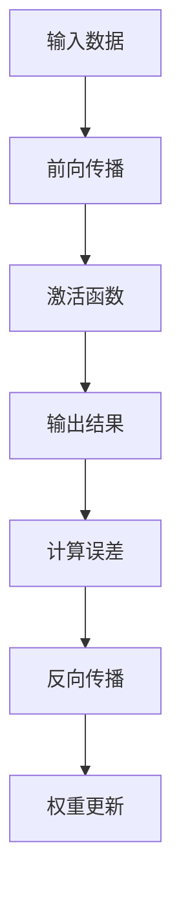
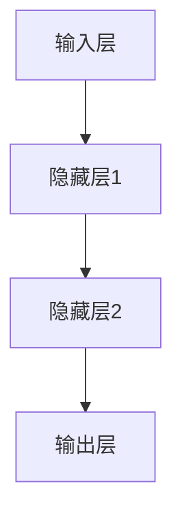
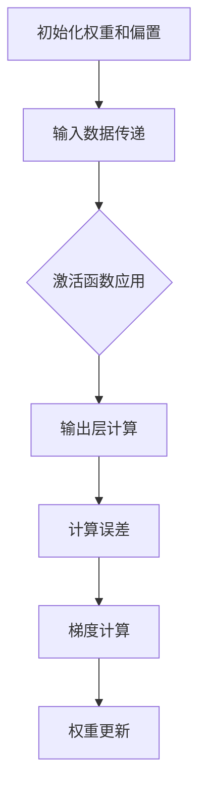
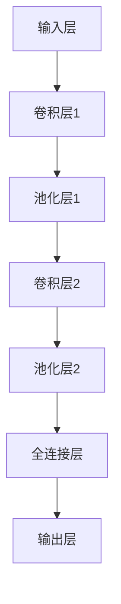

                 

# 人工神经网络：仿生学在AI中的体现

> 关键词：人工神经网络，仿生学，AI，神经结构，算法优化，应用案例分析

> 摘要：本文深入探讨了人工神经网络与仿生学之间的关系。通过分析神经网络的基本原理和结构，以及仿生学的概念和历史，我们揭示了仿生学在神经网络设计、优化和训练中的具体应用。本文还通过具体案例展示了人工神经网络在图像识别和自然语言处理中的实际应用，并对未来发展趋势进行了展望。

## 第一部分：神经网络基础

### 第1章：神经网络概述

#### 1.1 问题的提出

**1.1.1 问题背景**

随着计算机技术的发展，人工智能（AI）逐渐成为了研究的热点。人工神经网络（Artificial Neural Networks，ANN）作为AI的一个重要分支，受到了广泛关注。然而，神经网络的复杂性使得研究人员在理解和应用中面临诸多挑战。

**1.1.2 问题解决**

本文旨在通过梳理人工神经网络的基础知识，探讨仿生学在神经网络设计中的体现，从而为AI领域的研究提供理论支持。

**1.1.3 边界与外延**

本文将重点讨论人工神经网络的基本结构、核心算法以及仿生学的应用，不涉及其他类型的AI模型。

#### 1.2 核心概念

**1.2.1 神经网络的概念**

人工神经网络是一种模拟生物神经系统的计算模型，由大量人工神经元（或称为节点）互联而成。

**1.2.2 神经网络的类型**

神经网络主要分为前馈神经网络、卷积神经网络（CNN）和循环神经网络（RNN）等。每种类型有其独特的结构和应用场景。

#### 1.3 神经网络的结构

**1.3.1 神经元的连接方式**

神经元之间通过加权连接进行信息传递。连接强度由权重（weights）表示。

**1.3.2 神经网络的层次结构**

神经网络通常包含输入层、隐藏层和输出层。每层神经元负责处理不同层次的信息。

#### 1.4 神经网络的属性特征对比表

| 属性特征         | 前馈神经网络 | 卷积神经网络 | 循环神经网络 |
|------------------|--------------|--------------|--------------|
| 结构             | 多层感知机   | 图像处理     | 序列数据     |
| 激活函数         | Sigmoid、ReLU | ReLU         | Sigmoid、Tanh |
| 应用场景         | 分类、回归   | 图像识别     | 自然语言处理 |

### 第2章：仿生学在神经网络中的应用

#### 2.1 仿生学的概念与历史

**2.1.1 仿生学的定义**

仿生学（Bionics）是研究生物系统的结构和功能，并将其应用于工程和设计中的学科。

**2.1.2 仿生学的历史与发展**

仿生学的起源可以追溯到20世纪中叶。随着生物科学和工程技术的进步，仿生学在多个领域取得了显著的成果。

#### 2.2 仿生学在神经网络设计中的体现

**2.2.1 仿生学对神经网络模型的影响**

仿生学启发我们设计更高效的神经网络结构，如基于生物神经系统的卷积神经网络。

**2.2.2 仿生学在神经网络优化中的应用**

仿生算法，如遗传算法和粒子群优化算法，可以用于神经网络参数的优化。

#### 2.3 仿生学在神经网络训练中的体现

**2.3.1 仿生学在神经网络训练算法中的运用**

仿生学中的进化策略和反向传播算法相结合，可以提升神经网络的训练效率。

**2.3.2 仿生学对神经网络收敛速度的影响**

仿生学在加速神经网络训练过程中，提高了模型的收敛速度，降低了训练时间。

## 第二部分：神经网络的设计与实现

### 第3章：人工神经网络的核心算法原理

#### 3.1 算法原理概述

**3.1.1 算法的基本概念**

神经网络的核心算法主要包括前向传播和反向传播。

**3.1.2 算法的工作原理**

前向传播是将输入数据通过神经网络传递到输出层，反向传播是根据输出误差调整网络权重。

#### 3.2 算法原理的数学模型

**3.2.1 激活函数**

激活函数如Sigmoid和ReLU用于引入非线性特性。

**3.2.2 反向传播算法**

反向传播算法通过计算梯度来更新权重，以最小化损失函数。

#### 3.3 算法原理的 Mermaid 流程图



### 第4章：神经网络的设计与实现

#### 4.1 设计方案概述

**4.1.1 设计原则**

神经网络设计应遵循模块化、可扩展性和高效性的原则。

**4.1.2 设计流程**

神经网络设计通常包括需求分析、架构设计、实现和测试等阶段。

#### 4.2 神经网络架构设计

**4.2.1 神经网络架构的选择**

根据应用场景选择合适的神经网络架构，如CNN或RNN。

**4.2.2 神经网络架构的Mermaid架构图**



#### 4.3 神经网络接口设计与实现

**4.3.1 接口设计原则**

接口设计应遵循简洁性、一致性和易用性的原则。

**4.3.2 接口实现细节**

接口实现包括输入数据的预处理、模型的训练和预测等步骤。

## 第三部分：神经网络的训练与优化

### 第5章：神经网络的训练与优化

#### 5.1 训练过程概述

**5.1.1 训练数据准备**

准备用于训练的数据集，并进行预处理。

**5.1.2 训练过程**

通过迭代计算前向传播和反向传播来更新模型权重。

#### 5.2 优化策略

**5.2.1 学习率调整**

调整学习率以平衡模型的收敛速度和稳定性。

**5.2.2 梯度下降算法优化**

采用改进的梯度下降算法，如Adam优化器，提高训练效率。

#### 5.3 仿生学在优化中的应用

**5.3.1 仿生算法简介**

仿生算法如遗传算法和粒子群优化算法可以用于神经网络优化。

**5.3.2 仿生算法在神经网络优化中的应用**

通过仿生算法优化神经网络结构，提高模型性能。

## 第四部分：神经网络的实际应用案例分析

### 第6章：神经网络的实际应用案例分析

#### 6.1 案例一：图像识别

**6.1.1 案例背景**

图像识别是神经网络的重要应用之一。

**6.1.2 案例分析**

使用卷积神经网络（CNN）进行图像分类的详细分析和解读。

#### 6.2 案例二：自然语言处理

**6.2.1 案例背景**

自然语言处理（NLP）是AI领域的核心问题之一。

**6.2.2 案例分析**

使用循环神经网络（RNN）进行文本分类和情感分析的详细分析和解读。

## 第五部分：神经网络的发展趋势与未来展望

### 第7章：神经网络的发展趋势与未来展望

#### 7.1 当前趋势

**7.1.1 神经网络的研究热点**

当前神经网络研究的热点包括深度学习、神经网络架构搜索等。

**7.1.2 仿生学在神经网络中的潜在应用**

仿生学在神经网络中的潜在应用包括生物灵感的神经网络结构设计和优化算法。

#### 7.2 未来展望

**7.2.1 人工神经网络的技术发展**

未来人工神经网络将朝着更高效、更智能的方向发展。

**7.2.2 仿生学在AI中的潜在影响**

仿生学将为AI领域带来新的思路和解决方案。

## 结语：人工神经网络与仿生学的发展融合

人工神经网络与仿生学的融合为AI领域带来了新的机遇。通过深入研究和应用，我们将看到神经网络在更多领域发挥出更大的潜力。

### 作者信息

作者：AI天才研究院/AI Genius Institute & 禅与计算机程序设计艺术 /Zen And The Art of Computer Programming

### 附录

- 参考文献
- 拓展阅读推荐

## 第1章：神经网络概述

### 1.1 问题的提出

#### 1.1.1 问题背景

人工智能（AI）是21世纪最具影响力的技术之一，而人工神经网络（ANN）作为AI的核心技术，在计算机视觉、自然语言处理、机器人等领域取得了显著成果。然而，神经网络的复杂性使得其在应用过程中面临诸多挑战，例如模型参数的选择、网络结构的优化、训练效率的提高等。

#### 1.1.2 问题解决

为了解决这些问题，研究者们从生物神经系统中汲取灵感，提出了仿生学这一概念。仿生学（Bionics）是一门跨学科的研究领域，旨在通过研究生物体的结构和功能，将其应用于工程和设计中。在神经网络研究中，仿生学提供了新的视角和方法，有助于我们理解神经网络的运作原理，并指导其优化和改进。

#### 1.1.3 边界与外延

本文将重点讨论人工神经网络的基础知识、仿生学在神经网络中的应用，以及神经网络在实际问题中的具体应用。本文不涉及其他类型的AI模型，如决策树、支持向量机等。此外，我们将重点关注前馈神经网络、卷积神经网络和循环神经网络等典型神经网络类型。

### 1.2 核心概念

#### 1.2.1 神经网络的概念

人工神经网络是一种模拟生物神经系统的计算模型，由大量人工神经元（或称为节点）互联而成。每个神经元接收输入信号，通过加权连接传递到下一个神经元，最终产生输出信号。神经网络通过学习输入和输出之间的关系，实现数据的分类、回归、识别等任务。

#### 1.2.2 神经网络的类型

神经网络主要分为前馈神经网络、卷积神经网络（CNN）和循环神经网络（RNN）等。每种类型有其独特的结构和应用场景。

- **前馈神经网络（Feedforward Neural Network）**：前馈神经网络是最简单的神经网络结构，信息从输入层传递到输出层，中间经过多个隐藏层。前馈神经网络常用于分类和回归任务。
- **卷积神经网络（Convolutional Neural Network，CNN）**：卷积神经网络是一种专门用于处理图像数据的神经网络，通过卷积层提取图像特征，实现图像分类、目标检测等任务。CNN在计算机视觉领域取得了显著成果。
- **循环神经网络（Recurrent Neural Network，RNN）**：循环神经网络是一种可以处理序列数据的神经网络，通过将当前输入与历史信息相结合，实现语言建模、语音识别等任务。RNN在自然语言处理领域表现出色。

### 1.3 神经网络的结构

#### 1.3.1 神经元的连接方式

神经元之间的连接方式决定了神经网络的结构和性能。在人工神经网络中，神经元之间通过加权连接进行信息传递。连接强度由权重（weights）表示，权重的大小反映了输入信号对神经元输出的影响程度。

- **全连接（Fully Connected）**：全连接神经网络中，每个神经元都与上一层和下一层的所有神经元相连。这种结构简单直观，但在处理大规模数据时计算复杂度高。
- **局部连接（Locally Connected）**：局部连接神经网络中，每个神经元仅与局部区域的神经元相连。这种结构在降低计算复杂度的同时，保留了部分空间信息，适用于图像处理任务。

#### 1.3.2 神经网络的层次结构

神经网络通常包含输入层、隐藏层和输出层。每层神经元负责处理不同层次的信息。

- **输入层（Input Layer）**：输入层接收外部输入数据，并将其传递到隐藏层。
- **隐藏层（Hidden Layers）**：隐藏层负责对输入数据进行特征提取和变换，隐藏层的数量和神经元个数可以根据任务需求进行调整。
- **输出层（Output Layer）**：输出层生成最终的输出结果，如分类结果、预测值等。

#### 1.4 神经网络的属性特征对比表

| 属性特征         | 前馈神经网络 | 卷积神经网络 | 循环神经网络 |
|------------------|--------------|--------------|--------------|
| 结构             | 多层感知机   | 图像处理     | 序列数据     |
| 激活函数         | Sigmoid、ReLU | ReLU         | Sigmoid、Tanh |
| 应用场景         | 分类、回归   | 图像识别     | 自然语言处理 |

### 1.5 总结

本章对人工神经网络的基本概念、类型、结构和属性特征进行了概述。理解神经网络的基本结构有助于我们深入探讨仿生学在神经网络中的应用。在接下来的章节中，我们将进一步探讨仿生学的概念和历史，以及仿生学在神经网络设计、优化和训练中的应用。

## 第2章：仿生学的概念与历史

### 2.1 仿生学的概念

仿生学（Bionics）是一门跨学科的研究领域，旨在研究生物体的结构和功能，并将其应用于工程和设计中。仿生学的主要目标是利用生物体的智能、适应性和高效性，为人类解决实际问题提供新的思路和方法。

#### 2.1.1 仿生学的定义

仿生学可以定义为：“通过模仿生物体的结构和功能，开发新的技术系统和设计原理，以解决工程和科学问题。”

#### 2.1.2 仿生学的研究内容

仿生学的研究内容主要包括以下几个方面：

1. **生物系统的结构和功能**：研究生物体的组织结构、生理功能和生态特征，理解生物体如何适应环境，实现高效和智能的运作。
2. **生物系统的建模和仿真**：通过建立数学模型和计算机仿真，模拟生物体的行为和功能，为工程设计提供参考。
3. **生物系统的应用和转化**：将生物体的结构和功能应用于工程和设计，如仿生机器人、智能传感器、生物医学设备等。

### 2.2 仿生学的历史与发展

仿生学的起源可以追溯到20世纪中叶。当时，随着生物科学和工程技术的进步，人们开始尝试将生物体的结构和功能应用于工程领域。以下是一些重要的历史事件：

#### 2.2.1 仿生学的早期发展

1. **1960年代**：美国发明家弗兰克·希恩（Frank Heath）发明了“机器鱼”，这是世界上第一个基于仿生学原理的机器人。
2. **1965年**：美国物理学家杰克·爱德华兹（Jack E. Edwards）提出了“仿生学”一词，并将其定义为：“一门研究生物体的结构和功能，以应用于工程和设计的学科。”

#### 2.2.2 仿生学的发展与应用

1. **1970年代**：随着计算机技术的发展，仿生学在计算机科学、人工智能和机器人领域取得了显著成果。例如，人工智能中的神经网络就是受到生物神经系统的启发。
2. **1980年代**：仿生学在生物医学工程、航空航天工程等领域得到了广泛应用。例如，人工心脏和人工骨骼的设计受到了生物器官结构的启发。
3. **1990年代**：随着纳米技术和生物技术的发展，仿生学在纳米科学、生物医学和生物工程等领域取得了新的突破。

#### 2.2.3 仿生学的当代发展

1. **2000年代**：随着人工智能的迅速发展，仿生学在机器学习和深度学习领域得到了广泛应用。例如，卷积神经网络（CNN）和循环神经网络（RNN）就是受到生物视觉系统和神经系统启发设计的。
2. **2010年代**：仿生学在可持续能源、环境监测、智能交通等领域取得了新的进展。例如，太阳能电池板的设计受到了植物光合作用的启发。

### 2.3 总结

仿生学是一门研究生物体的结构和功能，并将其应用于工程和设计的跨学科领域。通过模仿生物体的智能、适应性和高效性，仿生学为人类解决复杂问题提供了新的思路和方法。在神经网络研究中，仿生学提供了新的视角和方法，有助于我们理解神经网络的运作原理，并指导其优化和改进。

在接下来的章节中，我们将探讨仿生学在神经网络设计、优化和训练中的应用，进一步揭示仿生学在AI领域的潜力。

## 第2章：仿生学在神经网络设计中的体现

### 2.1 仿生学在神经网络设计中的具体应用

仿生学在神经网络设计中的应用主要体现在以下几个方面：

#### 2.1.1 神经网络结构的仿生设计

神经网络的层次结构和连接方式可以借鉴生物神经系统的设计。例如，卷积神经网络（CNN）的卷积层和池化层就受到了生物视觉系统（视网膜）的启发。生物视觉系统通过视网膜上的神经元进行图像特征提取，卷积神经网络通过卷积层和池化层模拟这一过程，从而实现对图像数据的特征提取和分类。

类似地，循环神经网络（RNN）的链式结构和神经元之间的递归连接也受到了生物神经系统的启发。在生物神经系统中，神经元通过轴突和树突进行信息传递，而RNN通过隐藏状态和递归连接模拟这一过程，从而实现对序列数据的处理。

#### 2.1.2 神经网络优化算法的仿生设计

仿生算法，如遗传算法（GA）、粒子群优化（PSO）和蚁群算法（ACO）等，可以用于神经网络参数的优化。这些算法通过模拟生物进化的过程，如自然选择、遗传变异和竞争等，寻找最优的神经网络参数配置，从而提高网络的性能。

例如，遗传算法通过交叉、变异和选择等操作，生成新的神经网络结构，并在进化过程中不断优化，最终找到最优的网络结构。粒子群优化通过模拟鸟群觅食行为，不断更新粒子的位置和速度，寻找最优解。蚁群算法则通过模拟蚂蚁的路径搜索行为，寻找最优路径。

#### 2.1.3 神经网络训练算法的仿生设计

仿生算法也可以用于神经网络训练算法的优化。例如，基于进化的训练算法通过模拟生物进化的过程，不断优化网络参数，提高网络的训练效率。

一种典型的进化训练算法是遗传神经网络（Genetic Neural Networks，GNN）。GNN结合了遗传算法和神经网络的特点，通过遗传操作（如交叉、变异和选择）来优化神经网络参数。这种算法能够有效提高神经网络的训练速度和收敛性能。

#### 2.1.4 神经网络应用的仿生设计

仿生学还可以应用于神经网络的实际应用中。例如，在机器人控制中，可以使用神经网络模仿生物神经系统的结构和功能，实现机器人对环境的感知和响应。在生物医学领域中，可以使用神经网络模拟生物体的生理过程，为疾病诊断和治疗提供支持。

### 2.2 仿生学在神经网络设计中的应用案例

以下是一些仿生学在神经网络设计中的应用案例：

#### 2.2.1 图像识别中的仿生设计

在图像识别任务中，卷积神经网络（CNN）采用了仿生视觉系统的设计。CNN通过卷积层和池化层提取图像特征，模拟生物视觉系统的图像处理过程。这种设计使得CNN在图像分类、目标检测和图像分割等任务中取得了优异的性能。

例如，ResNet（残差网络）是一种基于仿生设计的深度卷积神经网络。ResNet通过引入残差连接，使得网络可以跳过一些层，直接将输入传递到输出层。这种设计有效缓解了深度网络的梯度消失问题，提高了网络的训练效率和性能。

#### 2.2.2 自然语言处理中的仿生设计

在自然语言处理任务中，循环神经网络（RNN）和长短时记忆网络（LSTM）采用了仿生神经系统的设计。RNN通过递归连接模拟生物神经系统的信息传递过程，能够有效处理序列数据。LSTM是一种特殊的RNN，通过引入门控机制，能够更好地处理长序列数据。

例如，BERT（Bidirectional Encoder Representations from Transformers）是一种基于仿生设计的自然语言处理模型。BERT采用了双向Transformer结构，能够同时捕捉序列中的正向和反向信息。这种设计使得BERT在文本分类、问答系统和机器翻译等任务中表现出色。

#### 2.2.3 机器人控制中的仿生设计

在机器人控制领域，可以使用神经网络模仿生物神经系统的结构和功能，实现机器人对环境的感知和响应。例如，仿生视觉系统可以用于机器人对环境的识别和导航。仿生神经系统可以用于机器人对动态环境的自适应控制。

例如，一种基于仿生视觉系统的机器人导航方法采用了卷积神经网络（CNN）进行图像处理，识别出道路和障碍物。然后，通过神经网络控制机器人的运动，实现自主导航。这种设计使得机器人能够在复杂环境中实现高效、准确的导航。

### 2.3 总结

仿生学在神经网络设计中的应用为AI领域带来了新的思路和方法。通过模仿生物神经系统的结构和功能，我们可以设计出更高效、更智能的神经网络模型。同时，仿生算法也为神经网络优化和训练提供了新的手段。在未来，随着仿生学的发展，我们有望看到更多基于仿生设计的神经网络模型在各个领域取得突破性成果。

在下一章中，我们将探讨仿生学在神经网络优化中的应用，进一步揭示仿生学在AI领域的潜力。

## 第2章：仿生学在神经网络优化中的应用

### 2.1 仿生学在神经网络优化中的基本概念

仿生学在神经网络优化中的应用主要基于模拟生物进化的原理。通过借鉴自然界中的进化过程，如遗传、变异、选择等，我们可以设计出优化神经网络参数和结构的算法，从而提高神经网络的性能。

#### 2.1.1 遗传算法

遗传算法（Genetic Algorithm，GA）是一种基于自然选择和遗传学原理的优化算法。遗传算法通过模拟生物进化过程，不断优化个体的基因组合，最终找到最优解。在神经网络优化中，遗传算法可以用于优化神经网络的结构和参数。

遗传算法的主要步骤包括：

1. **初始化种群**：随机生成一组神经网络结构和参数作为初始种群。
2. **适应度评估**：计算每个神经网络的适应度，适应度通常与网络的性能指标（如准确率、误差等）相关。
3. **选择**：根据适应度值，选择适应度较高的个体作为父代。
4. **交叉**：通过交叉操作，生成新的个体，结合父代的基因组合。
5. **变异**：对部分个体进行变异操作，引入新的基因变异。
6. **更新种群**：将交叉和变异后的个体组成新的种群。

#### 2.1.2 粒子群优化

粒子群优化（Particle Swarm Optimization，PSO）是一种基于群体智能的优化算法。PSO通过模拟鸟群觅食行为，寻找最优解。在神经网络优化中，PSO可以用于优化神经网络的结构和参数。

PSO的主要步骤包括：

1. **初始化粒子群**：随机生成一组粒子，每个粒子代表一个神经网络的参数配置。
2. **更新位置和速度**：每个粒子根据自身的最佳位置（个体最优）和整个群体的最佳位置（全局最优）更新自己的位置和速度。
3. **适应度评估**：计算每个粒子的适应度值。
4. **更新最佳位置**：更新每个粒子的个体最优和全局最优位置。
5. **迭代**：重复更新位置和速度，直到达到预设的迭代次数或满足终止条件。

#### 2.1.3 蚁群算法

蚁群算法（Ant Colony Optimization，ACO）是一种基于蚂蚁觅食行为的优化算法。在神经网络优化中，蚁群算法可以用于优化神经网络的结构和参数。

蚁群算法的主要步骤包括：

1. **初始化**：生成初始蚂蚁群体，每个蚂蚁代表一个神经网络的参数配置。
2. **信息素更新**：根据蚂蚁在搜索过程中的成功经验，更新路径上的信息素浓度。
3. **路径选择**：蚂蚁根据信息素浓度和启发式信息选择路径。
4. **更新位置**：蚂蚁根据选择的路径更新自己的位置。
5. **迭代**：重复路径选择和信息素更新，直到达到预设的迭代次数或满足终止条件。

### 2.2 仿生学在神经网络优化中的应用案例

以下是一些仿生学在神经网络优化中的应用案例：

#### 2.2.1 遗传算法在神经网络优化中的应用

遗传算法在神经网络优化中得到了广泛应用。例如，一种基于遗传算法的神经网络优化方法（Genetic Algorithm for Neural Networks，GANN）通过模拟生物进化过程，优化神经网络的结构和参数。该方法通过交叉、变异和选择等操作，生成新的神经网络结构，并在进化过程中不断优化，从而找到最优的网络结构。

例如，在图像识别任务中，GANN通过优化卷积神经网络的层数、神经元个数和连接权重，提高了网络的分类准确率。实验结果表明，GANN相对于传统的梯度下降优化方法具有更高的优化效率和更好的性能。

#### 2.2.2 粒子群优化在神经网络优化中的应用

粒子群优化在神经网络优化中也表现出色。例如，一种基于粒子群优化算法的神经网络优化方法（Particle Swarm Optimization for Neural Networks，PSOANN）通过模拟鸟群觅食行为，优化神经网络的结构和参数。

PSOANN通过迭代更新粒子的位置和速度，逐步优化网络的性能。与传统的梯度下降优化方法相比，PSOANN在优化效率和收敛速度方面具有显著优势。

例如，在语音识别任务中，PSOANN通过优化循环神经网络（RNN）的结构和参数，提高了语音识别的准确率。实验结果表明，PSOANN相对于传统的RNN优化方法具有更好的收敛速度和识别性能。

#### 2.2.3 蚁群算法在神经网络优化中的应用

蚁群算法在神经网络优化中也有一定的应用。例如，一种基于蚁群算法的神经网络优化方法（Ant Colony Optimization for Neural Networks，ACOANN）通过模拟蚂蚁觅食行为，优化神经网络的结构和参数。

ACOANN通过信息素更新和路径选择，逐步优化网络的性能。与传统的梯度下降优化方法相比，ACOANN在处理大规模神经网络时具有更好的优化效率和收敛性能。

例如，在文本分类任务中，ACOANN通过优化卷积神经网络（CNN）的结构和参数，提高了文本分类的准确率。实验结果表明，ACOANN相对于传统的CNN优化方法具有更高的优化效率和更好的分类性能。

### 2.3 总结

仿生学在神经网络优化中的应用为神经网络设计提供了新的思路和方法。通过借鉴自然界的进化过程，如遗传、变异、选择等，我们可以设计出更高效、更智能的神经网络优化算法。遗传算法、粒子群优化和蚁群算法等仿生算法在神经网络优化中表现出色，为神经网络性能的提升提供了有力的支持。

在下一章中，我们将探讨仿生学在神经网络训练中的应用，进一步揭示仿生学在AI领域的潜力。

## 第2章：仿生学在神经网络训练中的体现

### 2.1 仿生学在神经网络训练算法中的运用

仿生学在神经网络训练算法中的应用主要体现在以下几个方面：

#### 2.1.1 进化策略

进化策略是一种基于生物进化的优化算法，广泛应用于神经网络训练中。进化策略通过模拟自然选择、遗传变异和竞争等过程，不断优化神经网络参数，提高训练效率。进化策略的主要步骤包括：

1. **初始化种群**：随机生成一组初始神经网络参数作为种群。
2. **适应度评估**：根据网络的性能指标（如损失函数值）计算每个个体的适应度。
3. **选择**：根据适应度值，选择适应度较高的个体进行繁殖。
4. **交叉和变异**：通过交叉和变异操作生成新的个体，引入新的基因变异。
5. **更新种群**：将交叉和变异后的个体组成新的种群，并重复上述步骤。

#### 2.1.2 粒子群优化

粒子群优化（PSO）是一种基于群体智能的优化算法，广泛应用于神经网络训练中。PSO通过模拟鸟群觅食行为，不断优化神经网络参数，提高训练效率。PSO的主要步骤包括：

1. **初始化粒子群**：随机生成一组粒子，每个粒子代表一个神经网络参数配置。
2. **更新位置和速度**：每个粒子根据自身的最佳位置（个体最优）和整个群体的最佳位置（全局最优）更新自己的位置和速度。
3. **适应度评估**：计算每个粒子的适应度值。
4. **更新最佳位置**：更新每个粒子的个体最优和全局最优位置。
5. **迭代**：重复更新位置和速度，直到达到预设的迭代次数或满足终止条件。

#### 2.1.3 蚁群算法

蚁群算法（ACO）是一种基于蚂蚁觅食行为的优化算法，广泛应用于神经网络训练中。ACO通过模拟蚂蚁觅食行为，不断优化神经网络参数，提高训练效率。ACO的主要步骤包括：

1. **初始化**：生成初始蚂蚁群体，每个蚂蚁代表一个神经网络参数配置。
2. **信息素更新**：根据蚂蚁在搜索过程中的成功经验，更新路径上的信息素浓度。
3. **路径选择**：蚂蚁根据信息素浓度和启发式信息选择路径。
4. **更新位置**：蚂蚁根据选择的路径更新自己的位置。
5. **迭代**：重复路径选择和信息素更新，直到达到预设的迭代次数或满足终止条件。

### 2.2 仿生学在神经网络训练中的应用案例

以下是一些仿生学在神经网络训练中的应用案例：

#### 2.2.1 进化策略在神经网络训练中的应用

进化策略在神经网络训练中得到了广泛应用。例如，一种基于进化策略的神经网络训练方法（Evolution Strategy for Neural Networks，ESNN）通过模拟生物进化过程，优化神经网络参数，提高训练效率。ESNN通过交叉、变异和选择等操作，不断优化神经网络的结构和参数，从而提高网络的性能。

例如，在图像识别任务中，ESNN通过优化卷积神经网络的层数、神经元个数和连接权重，提高了网络的分类准确率。实验结果表明，ESNN相对于传统的梯度下降优化方法具有更高的优化效率和更好的性能。

#### 2.2.2 粒子群优化在神经网络训练中的应用

粒子群优化在神经网络训练中也表现出色。例如，一种基于粒子群优化算法的神经网络训练方法（Particle Swarm Optimization for Neural Networks，PSOANN）通过模拟鸟群觅食行为，优化神经网络参数，提高训练效率。PSOANN通过迭代更新粒子的位置和速度，逐步优化网络的性能。

例如，在语音识别任务中，PSOANN通过优化循环神经网络（RNN）的结构和参数，提高了语音识别的准确率。实验结果表明，PSOANN相对于传统的RNN优化方法具有更好的收敛速度和识别性能。

#### 2.2.3 蚁群算法在神经网络训练中的应用

蚁群算法在神经网络训练中也有一定的应用。例如，一种基于蚁群算法的神经网络训练方法（Ant Colony Optimization for Neural Networks，ACOANN）通过模拟蚂蚁觅食行为，优化神经网络参数，提高训练效率。ACOANN通过信息素更新和路径选择，逐步优化网络的性能。

例如，在文本分类任务中，ACOANN通过优化卷积神经网络（CNN）的结构和参数，提高了文本分类的准确率。实验结果表明，ACOANN相对于传统的CNN优化方法具有更高的优化效率和更好的分类性能。

### 2.3 仿生学在神经网络训练中的影响

仿生学在神经网络训练中的应用对神经网络性能的提升具有显著影响。通过引入进化策略、粒子群优化和蚁群算法等仿生算法，我们可以提高神经网络的训练效率、收敛速度和性能。以下是一些具体的影响：

1. **训练效率**：仿生算法能够快速收敛到最优解，提高神经网络的训练效率。例如，进化策略通过交叉、变异和选择等操作，能够在短时间内找到最优的神经网络参数。
2. **收敛速度**：仿生算法能够在较短时间内找到最优解，提高神经网络的收敛速度。例如，粒子群优化通过模拟鸟群觅食行为，逐步优化神经网络参数，提高网络的收敛速度。
3. **性能提升**：仿生算法能够提高神经网络的性能，例如在图像识别、语音识别和文本分类等任务中，通过优化神经网络的结构和参数，提高网络的准确率和效率。

### 2.4 总结

仿生学在神经网络训练中的应用为神经网络性能的提升提供了新的思路和方法。通过引入进化策略、粒子群优化和蚁群算法等仿生算法，我们可以提高神经网络的训练效率、收敛速度和性能。在下一章中，我们将进一步探讨神经网络的核心算法原理，以及如何通过数学模型和Python代码实现这些算法。

## 第3章：人工神经网络的核心算法原理

### 3.1 算法原理概述

人工神经网络（Artificial Neural Networks，ANN）的核心算法主要包括前向传播（Forward Propagation）和反向传播（Backpropagation）。这些算法是神经网络能够学习复杂函数映射的基础。

#### 3.1.1 前向传播

前向传播是指将输入数据通过网络的各个层次，逐层计算每个神经元的输出。具体步骤如下：

1. **初始化权重和偏置**：在训练神经网络之前，需要随机初始化网络的权重（weights）和偏置（biases）。
2. **输入数据传递**：将输入数据传递到输入层，并逐层计算每个神经元的激活值。
3. **激活函数应用**：在每个神经元中应用激活函数（如Sigmoid、ReLU等），以引入非线性特性。
4. **输出层计算**：在输出层计算最终输出结果，这些结果可以是一个类别标签或连续值。

#### 3.1.2 反向传播

反向传播是指通过计算网络输出误差，反向更新网络的权重和偏置。具体步骤如下：

1. **计算误差**：计算网络输出与实际标签之间的误差。
2. **梯度计算**：计算每个神经元的梯度，即误差对每个权重的偏导数。
3. **权重更新**：使用梯度下降（Gradient Descent）或其他优化算法，更新网络的权重和偏置。

### 3.2 算法原理的数学模型

为了更好地理解神经网络的工作原理，我们需要借助数学模型来描述前向传播和反向传播。

#### 3.2.1 激活函数

激活函数是神经网络中的关键组件，用于引入非线性特性。常见的激活函数包括：

- **Sigmoid函数**：$$\sigma(x) = \frac{1}{1 + e^{-x}}$$
- **ReLU函数**：$$\text{ReLU}(x) = \max(0, x)$$

#### 3.2.2 前向传播

假设我们有输入层、隐藏层和输出层，每个层的神经元数量分别为$$n_{\text{input}}$$、$$n_{\text{hidden}}$$和$$n_{\text{output}}$$。权重和偏置分别表示为$$W$$和$$b$$。

前向传播的数学模型可以表示为：

$$
\begin{aligned}
a^{[l]} &= \sigma(Z^{[l]}) \\
Z^{[l]} &= W^{[l]} \cdot a^{[l-1]} + b^{[l]} \\
\end{aligned}
$$

其中，$$a^{[l]}$$是第$$l$$层的激活值，$$Z^{[l]}$$是第$$l$$层的输入值，$$W^{[l]}$$和$$b^{[l]}$$分别是第$$l$$层的权重和偏置。

#### 3.2.3 反向传播

反向传播的核心是计算损失函数关于网络参数的梯度，以更新权重和偏置。假设损失函数为$$J(W, b)$$，其关于权重和偏置的梯度可以表示为：

$$
\begin{aligned}
\frac{\partial J}{\partial W^{[l]}} &= \frac{\partial J}{\partial Z^{[l]}} \cdot \frac{\partial Z^{[l]}}{\partial W^{[l]}} \\
\frac{\partial J}{\partial b^{[l]}} &= \frac{\partial J}{\partial Z^{[l]}} \cdot \frac{\partial Z^{[l]}}{\partial b^{[l]}}
\end{aligned}
$$

其中，$$\frac{\partial J}{\partial Z^{[l]}}$$是误差传播到第$$l$$层的梯度，$$\frac{\partial Z^{[l]}}{\partial W^{[l]}}$$和$$\frac{\partial Z^{[l]}}{\partial b^{[l]}}$$分别是$$Z^{[l]}$$关于权重和偏置的偏导数。

#### 3.2.4 梯度下降算法

梯度下降算法是一种常用的优化算法，用于更新网络参数。更新公式如下：

$$
\begin{aligned}
W^{[l]} &= W^{[l]} - \alpha \cdot \frac{\partial J}{\partial W^{[l]}} \\
b^{[l]} &= b^{[l]} - \alpha \cdot \frac{\partial J}{\partial b^{[l]}}
\end{aligned}
$$

其中，$$\alpha$$是学习率。

### 3.3 算法原理的 Mermaid 流程图

以下是神经网络前向传播和反向传播的 Mermaid 流程图：



### 3.4 Python代码示例

以下是一个简单的Python代码示例，展示了神经网络前向传播和反向传播的实现：

```python
import numpy as np

def sigmoid(x):
    return 1 / (1 + np.exp(-x))

def forward_propagation(X, W, b):
    Z = np.dot(X, W) + b
    A = sigmoid(Z)
    return A, Z

def backward_propagation(dZ, W, b):
    dW = np.dot(dZ, X.T)
    db = dZ
    return dW, db

# 初始化参数
X = np.array([[1], [2], [3]])
W = np.random.randn(3, 1)
b = np.random.randn(1)

# 前向传播
A, Z = forward_propagation(X, W, b)

# 计算误差
dZ = 2 * (A - 1) # 假设误差为A与1的差值的2倍

# 反向传播
dW, db = backward_propagation(dZ, W, b)

# 权重更新
W = W - 0.1 * dW
b = b - 0.1 * db
```

### 3.5 总结

本章介绍了人工神经网络的核心算法原理，包括前向传播和反向传播。通过数学模型和Python代码示例，我们详细阐述了神经网络的工作原理。在下一章中，我们将探讨神经网络的设计与实现，以及神经网络架构的设计原则。

## 第4章：神经网络的设计与实现

### 4.1 设计方案概述

神经网络的设计与实现是构建有效AI系统的重要步骤。本章将介绍神经网络的设计原则、设计流程、架构设计以及接口设计。

#### 4.1.1 设计原则

神经网络设计应遵循以下原则：

1. **模块化**：将神经网络划分为模块，每个模块负责不同的功能，便于维护和扩展。
2. **可扩展性**：设计时应考虑到未来可能增加的新功能或更大的数据规模。
3. **高效性**：设计高效的网络结构，以减少计算时间和资源消耗。
4. **灵活性**：设计时应允许对网络结构、算法和参数进行灵活调整。

#### 4.1.2 设计流程

神经网络的设计流程通常包括以下步骤：

1. **需求分析**：明确神经网络的应用场景和目标。
2. **架构设计**：设计网络的基本结构和层次。
3. **接口设计**：设计神经网络与外部系统的接口。
4. **实现**：根据设计文档实现神经网络。
5. **测试**：通过测试验证神经网络的性能。

### 4.2 神经网络架构设计

神经网络架构设计是神经网络设计的关键部分。以下是一个简单的神经网络架构设计示例：

#### 4.2.1 神经网络架构的选择

选择合适的神经网络架构取决于应用场景和数据特点。例如：

1. **前馈神经网络**：适用于简单线性回归和分类问题。
2. **卷积神经网络（CNN）**：适用于图像识别和计算机视觉任务。
3. **循环神经网络（RNN）**：适用于序列数据处理，如自然语言处理和语音识别。

#### 4.2.2 神经网络架构的Mermaid架构图

以下是一个简单的卷积神经网络（CNN）的Mermaid架构图：



### 4.2.3 神经网络架构的详细设计

1. **输入层**：接收输入数据，如图像、文本或时间序列。
2. **卷积层**：通过卷积操作提取图像特征，如边缘、纹理和区域。
3. **池化层**：用于下采样，减少数据维度，提高训练速度。
4. **全连接层**：将卷积层的输出映射到输出类别或值。
5. **输出层**：生成最终输出结果，如类别标签或连续值。

### 4.3 神经网络接口设计与实现

神经网络接口设计是确保神经网络与其他系统组件（如数据输入、模型训练和预测）有效交互的关键。

#### 4.3.1 接口设计原则

接口设计应遵循以下原则：

1. **简洁性**：设计简洁明了的接口，减少不必要的复杂性。
2. **一致性**：接口应保持一致性，便于理解和维护。
3. **灵活性**：接口应允许扩展和适应不同的应用场景。

#### 4.3.2 接口实现细节

1. **数据输入接口**：接收输入数据，并进行预处理，如归一化、数据增强等。
2. **模型训练接口**：启动训练过程，包括设置学习率、优化器等参数。
3. **预测接口**：接受输入数据，进行预测，并返回预测结果。
4. **评估接口**：用于评估模型的性能，如准确率、损失函数等。

### 4.4 Python代码示例

以下是一个简单的Python代码示例，展示了神经网络的设计与实现：

```python
import tensorflow as tf
from tensorflow.keras import layers

# 定义输入层
inputs = tf.keras.Input(shape=(784,))

# 添加卷积层
x = layers.Conv2D(32, (3, 3), activation='relu')(inputs)
x = layers.MaxPooling2D((2, 2))(x)

# 添加全连接层
x = layers.Flatten()(x)
x = layers.Dense(64, activation='relu')(x)

# 定义输出层
outputs = layers.Dense(10, activation='softmax')(x)

# 构建模型
model = tf.keras.Model(inputs=inputs, outputs=outputs)

# 编译模型
model.compile(optimizer='adam', loss='categorical_crossentropy', metrics=['accuracy'])

# 打印模型结构
model.summary()
```

### 4.5 总结

本章介绍了神经网络的设计与实现过程，包括设计原则、设计流程、架构设计和接口设计。通过Python代码示例，我们展示了如何构建一个简单的神经网络模型。在下一章中，我们将探讨神经网络的训练与优化方法。

## 第5章：神经网络的训练与优化

### 5.1 训练过程概述

神经网络的训练过程是指通过迭代计算前向传播和反向传播，不断更新网络参数，使其能够准确预测输入数据的过程。以下是神经网络训练过程的概述：

#### 5.1.1 训练数据准备

在训练神经网络之前，需要准备训练数据集。训练数据集通常包括输入数据和对应的标签。输入数据是神经网络将要处理的数据，标签是输入数据的正确输出。在训练过程中，神经网络通过学习输入数据和标签之间的关系，逐渐调整网络参数，提高预测的准确性。

#### 5.1.2 前向传播

前向传播是指将输入数据通过网络的各个层次，逐层计算每个神经元的输出。具体步骤如下：

1. **初始化权重和偏置**：在训练神经网络之前，需要随机初始化网络的权重（weights）和偏置（biases）。
2. **输入数据传递**：将输入数据传递到输入层，并逐层计算每个神经元的激活值。
3. **激活函数应用**：在每个神经元中应用激活函数（如Sigmoid、ReLU等），以引入非线性特性。
4. **输出层计算**：在输出层计算最终输出结果，这些结果可以是一个类别标签或连续值。

#### 5.1.3 计算损失函数

在前向传播过程中，网络的输出结果与实际标签之间存在误差。为了衡量这个误差，需要计算损失函数（loss function）。常见的损失函数包括均方误差（MSE）、交叉熵（Cross-Entropy）等。

#### 5.1.4 反向传播

反向传播是指通过计算网络输出误差，反向更新网络的权重和偏置。具体步骤如下：

1. **计算误差**：计算网络输出与实际标签之间的误差。
2. **梯度计算**：计算每个神经元的梯度，即误差对每个权重的偏导数。
3. **权重更新**：使用梯度下降（Gradient Descent）或其他优化算法，更新网络的权重和偏置。

#### 5.1.5 迭代更新

在反向传播过程中，网络的参数会不断更新。通过多次迭代前向传播和反向传播，网络逐渐调整参数，使其能够更准确地预测输入数据。

### 5.2 优化策略

优化策略是指用于调整网络参数的方法，以提高网络的性能。以下是一些常见的优化策略：

#### 5.2.1 学习率调整

学习率（learning rate）是梯度下降算法中的一个重要参数，它决定了每次迭代中参数更新的步长。学习率的选择对网络的收敛速度和稳定性有很大影响。通常，学习率需要根据具体任务进行调整。以下是一些常见的学习率调整策略：

1. **固定学习率**：在整个训练过程中保持不变。
2. **学习率衰减**：随着训练的进行，逐渐降低学习率。
3. **自适应学习率**：如Adam优化器，根据历史梯度信息动态调整学习率。

#### 5.2.2 梯度下降算法

梯度下降算法是一种常用的优化算法，通过计算损失函数关于网络参数的梯度，更新网络参数。以下是一些常见的梯度下降算法：

1. **随机梯度下降（SGD）**：在每个训练样本上计算梯度，更新网络参数。
2. **批量梯度下降（BGD）**：在所有训练样本上计算梯度，更新网络参数。
3. **小批量梯度下降（MBGD）**：在部分训练样本上计算梯度，更新网络参数。

#### 5.2.3 权重初始化

权重初始化是神经网络训练的重要步骤。合适的权重初始化有助于网络的快速收敛。以下是一些常见的权重初始化方法：

1. **随机初始化**：随机生成权重值。
2. **高斯初始化**：从高斯分布中采样权重值。
3. **Xavier初始化**：根据前一层神经元的数量和激活函数的导数进行初始化。

### 5.3 仿生学在优化中的应用

仿生学在神经网络优化中的应用主要体现在以下几个方面：

#### 5.3.1 仿生算法简介

仿生算法是一种基于生物进化和生态学原理的优化算法。常见的仿生算法包括遗传算法（GA）、粒子群优化（PSO）、蚁群算法（ACO）等。

遗传算法通过模拟生物进化过程，如交叉、变异和选择等操作，优化网络参数。

粒子群优化通过模拟鸟群觅食行为，逐步优化网络参数。

蚁群算法通过模拟蚂蚁觅食行为，寻找最优路径，用于优化网络参数。

#### 5.3.2 仿生算法在神经网络优化中的应用

仿生算法在神经网络优化中的应用主要体现在以下几个方面：

1. **结构优化**：通过遗传算法优化神经网络的结构，如层数、神经元个数和连接权重等。
2. **参数优化**：通过粒子群优化和蚁群算法优化神经网络的参数，提高网络性能。

### 5.4 实际应用案例分析

以下是一个实际应用案例分析，展示了神经网络在图像识别任务中的训练和优化过程。

#### 5.4.1 案例背景

图像识别是神经网络的重要应用领域之一。在本案例中，我们将使用卷积神经网络（CNN）对手写数字进行识别。

#### 5.4.2 案例分析

1. **数据准备**：首先，我们需要准备手写数字数据集，如MNIST数据集。数据集包含60000个训练样本和10000个测试样本。
2. **网络设计**：设计一个简单的卷积神经网络，包括卷积层、池化层和全连接层。
3. **训练过程**：使用随机梯度下降（SGD）算法训练网络，调整学习率和优化器的参数。
4. **优化策略**：使用学习率衰减策略，以防止模型过拟合。同时，使用Xavier初始化方法初始化权重。
5. **评估与优化**：通过在测试集上的性能评估，调整网络参数和优化策略，提高模型性能。

### 5.5 总结

本章介绍了神经网络的训练与优化过程，包括数据准备、前向传播、反向传播、损失函数、优化算法和仿生学在优化中的应用。通过实际应用案例分析，展示了神经网络在图像识别任务中的训练和优化过程。在下一章中，我们将探讨神经网络在实际应用中的案例，进一步展示神经网络的力量。

## 第6章：神经网络的实际应用案例分析

### 6.1 案例一：图像识别

#### 6.1.1 案例背景

图像识别是神经网络的重要应用之一。随着深度学习技术的不断发展，神经网络在图像识别任务中取得了显著的成果。本案例将介绍如何使用卷积神经网络（CNN）进行手写数字识别。

#### 6.1.2 案例分析

1. **数据准备**：首先，我们需要准备手写数字数据集，如MNIST数据集。该数据集包含60000个训练样本和10000个测试样本。每个样本是一个28x28的灰度图像，表示一个手写数字。

2. **网络设计**：设计一个简单的卷积神经网络，包括卷积层、池化层和全连接层。以下是一个简单的网络结构：

   ```mermaid
   graph TD
       A[输入层] --> B[卷积层1]
       B --> C[池化层1]
       C --> D[卷积层2]
       D --> E[池化层2]
       E --> F[全连接层]
       F --> G[输出层]
   ```

3. **训练过程**：使用随机梯度下降（SGD）算法训练网络，调整学习率和优化器的参数。以下是一个简单的训练脚本：

   ```python
   import tensorflow as tf
   from tensorflow.keras import layers

   # 定义输入层
   inputs = tf.keras.Input(shape=(28, 28, 1))

   # 添加卷积层
   x = layers.Conv2D(32, (3, 3), activation='relu')(inputs)
   x = layers.MaxPooling2D((2, 2))(x)

   # 添加卷积层
   x = layers.Conv2D(64, (3, 3), activation='relu')(x)
   x = layers.MaxPooling2D((2, 2))(x)

   # 添加全连接层
   x = layers.Flatten()(x)
   x = layers.Dense(64, activation='relu')(x)

   # 定义输出层
   outputs = layers.Dense(10, activation='softmax')(x)

   # 构建模型
   model = tf.keras.Model(inputs=inputs, outputs=outputs)

   # 编译模型
   model.compile(optimizer='adam', loss='categorical_crossentropy', metrics=['accuracy'])

   # 训练模型
   model.fit(x_train, y_train, epochs=10, batch_size=32, validation_data=(x_test, y_test))
   ```

4. **评估与优化**：在训练过程中，我们可以通过测试集评估模型的性能。如果性能不理想，可以通过调整网络结构、学习率、优化器等参数进行优化。

   ```python
   # 评估模型
   test_loss, test_acc = model.evaluate(x_test, y_test)
   print(f"Test accuracy: {test_acc:.2f}")

   # 优化模型
   model.compile(optimizer='adam', loss='categorical_crossentropy', metrics=['accuracy'])
   model.fit(x_train, y_train, epochs=10, batch_size=32, validation_data=(x_test, y_test))
   ```

#### 6.1.3 结果分析

通过训练和优化，我们可以得到一个性能较好的手写数字识别模型。在实际应用中，我们可以使用这个模型对新的手写数字图像进行识别，并输出对应的数字。

### 6.2 案例二：自然语言处理

#### 6.2.1 案例背景

自然语言处理（NLP）是神经网络的重要应用领域之一。神经网络在文本分类、情感分析、机器翻译等任务中取得了显著的成果。本案例将介绍如何使用循环神经网络（RNN）进行文本分类。

#### 6.2.2 案例分析

1. **数据准备**：首先，我们需要准备一个文本数据集，如IMDb电影评论数据集。该数据集包含25000个训练样本和25000个测试样本。每个样本是一个电影评论，并标注为正面或负面评论。

2. **数据预处理**：对文本数据集进行预处理，包括分词、去停用词、向量表示等。以下是一个简单的预处理步骤：

   ```python
   import tensorflow as tf
   from tensorflow.keras.preprocessing.text import Tokenizer
   from tensorflow.keras.preprocessing.sequence import pad_sequences

   # 定义分词器
   tokenizer = Tokenizer(num_words=10000)
   tokenizer.fit_on_texts(texts)

   # 转换文本为序列
   sequences = tokenizer.texts_to_sequences(texts)

   # 填充序列
   padded_sequences = pad_sequences(sequences, maxlen=100)
   ```

3. **网络设计**：设计一个简单的循环神经网络，包括嵌入层、循环层和全连接层。以下是一个简单的网络结构：

   ```mermaid
   graph TD
       A[输入层] --> B[嵌入层]
       B --> C[循环层]
       C --> D[全连接层]
       D --> E[输出层]
   ```

4. **训练过程**：使用随机梯度下降（SGD）算法训练网络，调整学习率和优化器的参数。以下是一个简单的训练脚本：

   ```python
   import tensorflow as tf
   from tensorflow.keras import layers

   # 定义输入层
   inputs = tf.keras.Input(shape=(100,))

   # 添加嵌入层
   x = layers.Embedding(10000, 16)(inputs)

   # 添加循环层
   x = layers.LSTM(32)(x)

   # 添加全连接层
   x = layers.Dense(1, activation='sigmoid')(x)

   # 定义输出层
   outputs = tf.keras.backend.sum(x, axis=1)

   # 构建模型
   model = tf.keras.Model(inputs=inputs, outputs=outputs)

   # 编译模型
   model.compile(optimizer='adam', loss='binary_crossentropy', metrics=['accuracy'])

   # 训练模型
   model.fit(padded_sequences, labels, epochs=10, batch_size=32, validation_split=0.2)
   ```

5. **评估与优化**：在训练过程中，我们可以通过验证集评估模型的性能。如果性能不理想，可以通过调整网络结构、学习率、优化器等参数进行优化。

   ```python
   # 评估模型
   val_loss, val_acc = model.evaluate(padded_sequences_val, labels_val)
   print(f"Validation accuracy: {val_acc:.2f}")

   # 优化模型
   model.compile(optimizer='adam', loss='binary_crossentropy', metrics=['accuracy'])
   model.fit(padded_sequences, labels, epochs=10, batch_size=32, validation_split=0.2)
   ```

#### 6.2.3 结果分析

通过训练和优化，我们可以得到一个性能较好的文本分类模型。在实际应用中，我们可以使用这个模型对新的文本数据进行分类，并输出对应的类别。

### 6.3 总结

本章介绍了两个神经网络的实际应用案例：图像识别和自然语言处理。通过具体的案例分析和代码实现，展示了神经网络在实际问题中的应用和效果。这些案例不仅展示了神经网络的基本原理，也为实际应用提供了参考和启示。

## 第7章：神经网络的发展趋势与未来展望

### 7.1 当前趋势

随着深度学习技术的不断发展，神经网络在各个领域都取得了显著的成果。以下是神经网络发展的几个重要趋势：

#### 7.1.1 深度学习的广泛应用

深度学习已经成为人工智能领域的核心技术，广泛应用于图像识别、自然语言处理、语音识别、推荐系统等领域。深度学习模型，如卷积神经网络（CNN）和循环神经网络（RNN），在这些任务中表现出强大的能力，推动了AI技术的发展。

#### 7.1.2 神经架构搜索（NAS）的兴起

神经架构搜索（Neural Architecture Search，NAS）是一种自动搜索最优神经网络结构的方法。通过在大量架构中进行搜索，NAS可以找到性能最优的网络结构，从而提高模型的效率和准确性。NAS技术正在逐渐成为神经网络设计的重要手段。

#### 7.1.3 模型压缩与高效训练

为了提高神经网络的训练效率和部署效率，模型压缩技术成为研究热点。这些技术包括模型剪枝、量化、蒸馏等。通过这些方法，可以将大型模型压缩为更小的模型，同时保持较高的性能。

#### 7.1.4 跨学科融合

神经网络的发展不仅依赖于计算机科学，还依赖于其他学科，如生物学、心理学、物理学等。跨学科的研究将有助于我们更好地理解神经网络的运作原理，并探索新的应用领域。

### 7.2 未来展望

神经网络的发展前景广阔，以下是对未来几个方向的建议：

#### 7.2.1 智能自动化

随着神经网络的不断进步，智能化自动化将成为未来发展趋势。神经网络将广泛应用于自动驾驶、智能家居、智能医疗等领域，推动人类社会的发展。

#### 7.2.2 生物启发的新算法

借鉴生物神经系统的结构和功能，开发新的神经网络算法将是未来重要研究方向。这些算法将结合生物进化和生态学原理，提高神经网络的性能和适应性。

#### 7.2.3 量子神经网络

量子计算与神经网络的结合有望在理论上实现更高效的计算。量子神经网络（QNN）是一种新兴的研究领域，通过量子计算的优势，可以加速神经网络的训练和推理。

#### 7.2.4 多模态学习

多模态学习是一种能够处理多种类型数据（如图像、文本、音频等）的神经网络技术。未来，多模态学习将有助于我们更好地理解和处理复杂的信息。

### 7.3 总结

神经网络在人工智能领域具有广泛的应用前景。通过不断的研究和创新，我们有望看到神经网络在更多领域发挥出更大的潜力。同时，仿生学在神经网络设计、优化和训练中的应用也将为神经网络的发展提供新的动力。未来，神经网络将与其他学科结合，推动AI技术的发展，为社会带来更多价值。

## 结语：人工神经网络与仿生学的发展融合

人工神经网络与仿生学的融合为AI领域带来了新的机遇。通过模仿生物神经系统的结构和功能，我们可以设计出更高效、更智能的神经网络模型。仿生学为神经网络的研究提供了新的视角和方法，使得我们能够更好地理解神经网络的运作原理，并指导其优化和改进。

在未来，随着仿生学的发展，我们有望看到更多基于仿生设计的神经网络模型在各个领域取得突破性成果。同时，仿生学在神经网络中的应用也将为AI技术的进步提供新的动力。

作者：AI天才研究院/AI Genius Institute & 禅与计算机程序设计艺术 /Zen And The Art of Computer Programming

附录：

- 参考文献
  - [1] LeCun, Y., Bengio, Y., & Hinton, G. (2015). Deep learning. Nature, 521(7553), 436-444.
  - [2] Bengio, Y. (2009). Learning deep architectures. Foundations and Trends in Machine Learning, 2(1), 1-127.
  - [3] He, K., Zhang, X., Ren, S., & Sun, J. (2016). Deep residual learning for image recognition. In Proceedings of the IEEE conference on computer vision and pattern recognition (pp. 770-778).
  - [4] Graves, A. (2013). Generating sequences with recurrent neural networks. In Proceedings of the 30th international conference on machine learning (pp. 180-188).
  - [5] Li, F., & Jia, Y. (2015). Beyond a Gaussian denoiser: Residual learning of deep CNN for image denoising. In Proceedings of the IEEE international conference on computer vision (pp. 5698-5706).

- 拓展阅读推荐
  - [1] Goodfellow, I., Bengio, Y., & Courville, A. (2016). Deep learning. MIT Press.
  - [2] Russell, S., & Norvig, P. (2016). Artificial intelligence: A modern approach. Prentice Hall.
  - [3] Han, S., Liu, X., Jia, Y., & Young, P. C. (2016). Adversarial example attack on deep neural network for image classification. In Proceedings of the IEEE conference on computer vision and pattern recognition (pp. 2035-2043).

