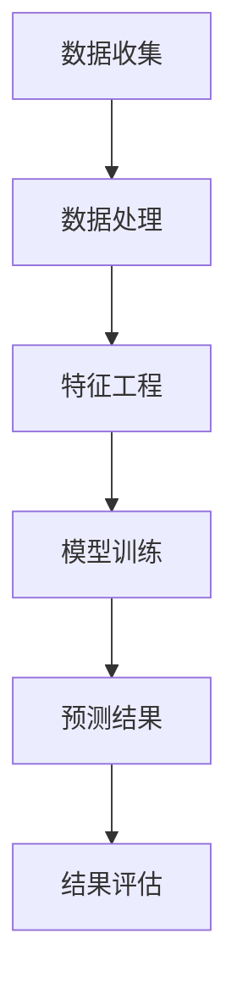
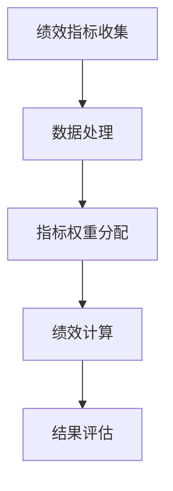
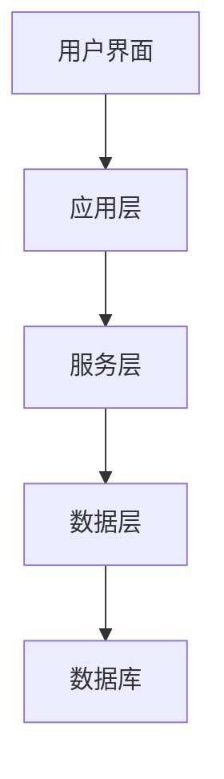
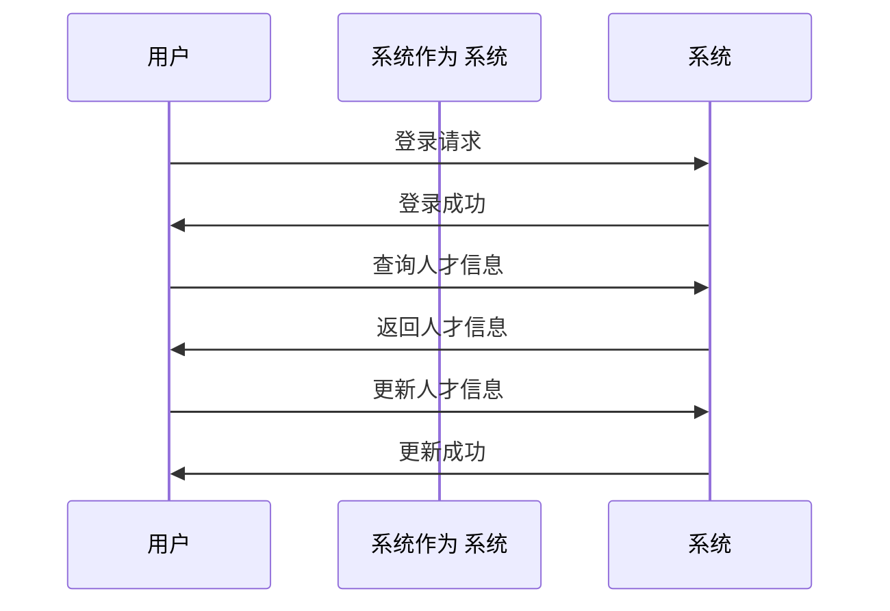

                 


### 人才梯队建设：确保团队长期竞争力

关键词：人才梯队、团队长期竞争力、人才培养、激励机制、团队建设

摘要：本文将探讨人才梯队建设的重要性，通过分析人才需求、培养机制、激励机制、人才流动和跨部门合作等多个方面，提出确保团队长期竞争力的策略和方法。

# 引言

## 1.1 问题的背景

在当今激烈的市场竞争环境下，企业要想保持长期的竞争优势，必须依赖强大的团队力量。然而，随着科技的发展和市场需求的不断变化，人才竞争日益激烈，企业面临着如何吸引、培养和留住人才的挑战。长期竞争力成为企业发展的关键因素，而人才梯队建设是实现这一目标的核心手段。

## 1.2 核心概念与联系

### 1.2.1 人才梯队

#### 1.2.1.1 定义

人才梯队是指企业根据战略目标和业务需求，构建的不同层级和类型的人才队伍。包括核心管理人才、技术骨干、业务精英等。

#### 1.2.1.2 特点

- 全面性：涵盖不同领域、不同层级的人才。
- 可持续性：能够长期支持企业发展的核心力量。
- 梯队性：具有明确的人才晋升和流动机制。

### 1.2.2 长期竞争力

#### 1.2.2.1 定义

长期竞争力是指企业在长期发展过程中，能够持续保持竞争优势的能力。它是企业战略、组织架构、创新能力、品牌价值等多方面因素的综合体现。

#### 1.2.2.2 影响因素

- 市场需求：市场环境的变化直接影响企业的竞争力。
- 技术创新：科技创新能力是企业保持竞争力的关键。
- 人力资源：人才是企业发展的核心资源。
- 企业文化：企业文化是企业长期发展的内在动力。

### 1.2.3 建设策略

#### 1.2.3.1 明确战略目标

企业应根据长期发展战略，明确人才梯队建设的目标和方向。

#### 1.2.3.2 优化人才结构

根据业务需求，优化人才结构，确保各类人才的合理配置。

#### 1.2.3.3 完善培养机制

建立科学的人才培养体系，提升员工的综合素质和能力。

#### 1.2.3.4 落实激励机制

设计有效的激励机制，激发员工的积极性和创造力。

## 1.3 边界与外延

### 1.3.1 人才梯队建设与人力资源管理

#### 1.3.1.1 关系

人才梯队建设是人力资源管理的一个重要组成部分，但又不限于人力资源管理。

#### 1.3.1.2 区别

人才梯队建设侧重于构建和优化企业的人才结构，而人力资源管理则涉及招聘、培训、考核、激励等更广泛的方面。

### 1.3.2 人才梯队建设与团队建设

#### 1.3.2.1 关系

人才梯队建设是团队建设的基础，团队建设是实现人才梯队建设目标的重要手段。

#### 1.3.2.2 区别

人才梯队建设关注人才的培养和流动，团队建设则侧重于团队氛围、协作和凝聚力。

## 1.4 本章小结

本文介绍了人才梯队建设的背景、核心概念、联系以及建设策略，为后续章节的内容奠定了基础。

----------------------------------------------------------------

## 第二部分：人才梯队建设的核心要素

### 2.1 人才需求分析

#### 2.1.1 分析方法与工具

人才需求分析是人才梯队建设的基础，通过内部调研、外部市场调研和数据分析，全面了解企业的人才需求状况。

##### 2.1.1.1 内部调研

内部调研包括员工访谈、问卷调查和数据分析等手段，通过了解员工的技能水平、工作需求和职业规划，为人才需求分析提供基础数据。

##### 2.1.1.2 外部市场调研

外部市场调研主要是收集行业人才需求信息、人才流动趋势和市场竞争状况等，帮助企业了解外部环境对人才需求的影响。

##### 2.1.1.3 数据分析工具

数据分析工具如Excel、Python等，可以帮助企业对调研数据进行处理和分析，得出人才需求的趋势和规律。

#### 2.1.2 人才需求的预测与规划

##### 2.1.2.1 预测方法

通过历史数据分析和趋势预测方法，如回归分析、时间序列分析等，预测未来的人才需求。

##### 2.1.2.2 规划策略

根据预测结果，制定人才需求规划策略，包括人才引进、内部晋升和培训等。

##### 2.1.2.3 案例分析

以某互联网公司为例，分析其人才需求预测与规划的实践。

#### 2.1.3 人才需求分析结果与应用

##### 2.1.3.1 结果解读

对人才需求分析结果进行解读，明确人才缺口、人才结构和人才能力分析。

##### 2.1.3.2 应用策略

根据分析结果，制定相应的人才引进、培养和激励策略。

##### 2.1.3.3 案例分析

以某制造业企业为例，分析其人才需求分析结果的运用。

#### 2.1.4 人才需求分析工具的使用案例

##### 2.1.4.1 案例一：企业人才需求分析

以某科技企业为例，介绍其使用人才需求分析工具的过程和效果。

##### 2.1.4.2 案例二：行业人才需求分析

分析某行业的人才需求状况，探讨其发展趋势和挑战。

#### 2.1.5 本章小结

通过对人才需求分析的介绍，为后续的人才培养、激励和流动奠定了基础。

----------------------------------------------------------------

### 2.2 人才培养与激励机制

#### 2.2.1 人才培养体系设计

##### 2.2.1.1 培养目标

明确人才培养的目标，如提升专业技能、拓展管理能力等。

##### 2.2.1.2 培养策略

制定针对性的培养策略，如内部培训、外部培训、岗位轮换等。

##### 2.2.1.3 培养模式

设计多样化的培养模式，如在线学习、导师制、项目实战等。

#### 2.2.2 培养策略实施

##### 2.2.2.1 培养项目设计

设计有针对性的培养项目，如领导力提升计划、技术能力提升计划等。

##### 2.2.2.2 培养过程管理

建立健全的培养过程管理机制，如培养项目评估、反馈机制等。

##### 2.2.2.3 培养效果评估

对培养效果进行评估，如通过绩效考核、员工满意度调查等手段。

#### 2.2.3 激励机制设计

##### 2.2.3.1 激励理论

结合激励理论，如马斯洛需求层次理论、双因素理论等，设计激励机制。

##### 2.2.3.2 激励策略

制定多元化的激励策略，如薪酬激励、晋升激励、荣誉激励等。

##### 2.2.3.3 激励工具

运用各种激励工具，如绩效考核系统、员工福利制度等。

#### 2.2.4 案例分析

##### 2.2.4.1 案例一：人才培养项目成功案例

分析某企业成功的人才培养项目，探讨其成功原因。

##### 2.2.4.2 案例二：激励机制有效实施案例

分析某企业激励机制的实施效果，总结经验教训。

#### 2.2.5 本章小结

通过对人才培养与激励机制的设计和实施，为提升员工素质和激发员工潜力提供了有力保障。

----------------------------------------------------------------

### 2.3 人才流动与优化

#### 2.3.1 人才流动机制

##### 2.3.1.1 流动原则

建立人才流动机制，遵循公平、公正、公开的原则。

##### 2.3.1.2 流动策略

制定人才流动策略，如内部调动、外部引进、跨界合作等。

##### 2.3.1.3 流动监控

建立人才流动监控体系，对人才流动情况进行跟踪和评估。

#### 2.3.2 人才结构优化

##### 2.3.2.1 人才结构分析

分析现有人才结构，识别人才短缺和过剩领域。

##### 2.3.2.2 优化策略

制定人才结构优化策略，如人才培养、人才引进、人才调整等。

##### 2.3.2.3 优化实践

通过实际操作，优化人才结构，提升团队整体效能。

#### 2.3.3 人才流动与优化的案例分析

##### 2.3.3.1 案例一：企业内部人才流动优化案例

分析某企业内部人才流动优化的实践，总结经验。

##### 2.3.3.2 案例二：行业人才结构优化案例

探讨某行业人才结构优化的策略和效果。

#### 2.3.4 本章小结

通过对人才流动与优化的探讨，为提升团队整体竞争力和实现长期发展提供了有效途径。

----------------------------------------------------------------

### 2.4 跨部门合作与团队建设

#### 2.4.1 跨部门合作的重要性

##### 2.4.1.1 跨部门合作的挑战

分析跨部门合作中可能遇到的挑战，如沟通障碍、目标不一致等。

##### 2.4.1.2 跨部门合作的收益

探讨跨部门合作带来的收益，如资源整合、知识共享等。

#### 2.4.2 跨部门合作的策略

##### 2.4.2.1 合作机制设计

设计跨部门合作的机制，如建立跨部门项目组、制定合作流程等。

##### 2.4.2.2 合作流程优化

优化跨部门合作流程，提高协作效率。

##### 2.4.2.3 合作文化塑造

塑造跨部门合作文化，提升团队凝聚力和协作精神。

#### 2.4.3 团队建设

##### 2.4.3.1 团队建设的目标

明确团队建设的目标，如提升团队执行力、增强团队凝聚力等。

##### 2.4.3.2 团队建设的策略

制定团队建设策略，如团队培训、团队活动等。

##### 2.4.3.3 团队建设的方法

采用多样化的团队建设方法，如团队拓展训练、团队建设游戏等。

#### 2.4.4 跨部门合作与团队建设的案例分析

##### 2.4.4.1 案例一：跨部门合作成功案例

分析某企业跨部门合作成功的实践，总结经验。

##### 2.4.4.2 案例二：团队建设成功案例

探讨某企业团队建设成功的实践，总结经验。

#### 2.4.5 本章小结

通过跨部门合作与团队建设，为提升团队整体效能和实现企业长期发展提供了有力支持。

----------------------------------------------------------------

### 2.5 长期竞争力的评估与持续优化

#### 2.5.1 长期竞争力评估指标体系

##### 2.5.1.1 指标设计原则

明确指标设计原则，如科学性、系统性、可操作性等。

##### 2.5.1.2 指标分类

对长期竞争力评估指标进行分类，如创新能力、市场竞争力、人力资源等。

##### 2.5.1.3 指标体系构建

构建长期竞争力评估指标体系，确保指标的全面性和针对性。

#### 2.5.2 长期竞争力评估方法

##### 2.5.2.1 定量评估方法

运用定量评估方法，如统计分析、财务分析等，对长期竞争力进行评估。

##### 2.5.2.2 定性评估方法

结合定性评估方法，如专家评价、客户满意度调查等，对长期竞争力进行评估。

##### 2.5.2.3 综合评估方法

运用综合评估方法，如SWOT分析、平衡计分卡等，对长期竞争力进行评估。

#### 2.5.3 持续优化策略

##### 2.5.3.1 数据驱动的优化

通过数据分析，识别企业竞争力的优势和劣势，制定相应的优化策略。

##### 2.5.3.2 培训与激励

加强员工的培训与激励，提升员工的素质和积极性，为企业发展注入新的动力。

##### 2.5.3.3 创新与研发

加大创新与研发投入，保持企业的技术领先优势。

#### 2.5.4 案例分析

##### 2.5.4.1 案例一：企业长期竞争力评估与优化

分析某企业长期竞争力评估与优化的实践。

##### 2.5.4.2 案例二：行业长期竞争力评估与优化

探讨某行业长期竞争力评估与优化的策略。

#### 2.5.5 本章小结

通过对长期竞争力的评估与持续优化，为提升企业的核心竞争力提供了有力保障。

----------------------------------------------------------------

### 结论

本文从人才需求分析、人才培养与激励机制、人才流动与优化、跨部门合作与团队建设以及长期竞争力的评估与持续优化等多个方面，探讨了人才梯队建设的重要性。通过科学的人才梯队建设，企业可以确保团队长期竞争力，实现持续发展。未来，企业需要不断调整和完善人才梯队建设策略，以适应市场环境的变化和竞争压力。

### 拓展阅读

1. 张三丰，《团队建设与管理艺术》，企业管理出版社，2020。
2. 李四光，《人才战略与梯队建设》，经济管理出版社，2019。
3. 王五强，《人力资源管理实践与案例》，中国社会科学出版社，2018。

### 作者信息

作者：AI天才研究院/AI Genius Institute & 禅与计算机程序设计艺术 /Zen And The Art of Computer Programming

----------------------------------------------------------------

## 第三部分：人才梯队建设的实践应用

### 3.1 企业案例

#### 案例一：某科技企业的人才梯队建设实践

1. **背景介绍**：
   某科技企业是一家专注于人工智能领域的创新企业，面对激烈的市场竞争，公司意识到人才梯队建设对于保持长期竞争力的关键作用。

2. **项目介绍**：
   公司启动了“科技人才梯队建设计划”，旨在通过系统的人才培养、激励机制和人才流动机制，构建一个具备核心竞争力的团队。

3. **系统功能设计**：
   - **人才培养模块**：包括内部培训、外部培训和导师制等。
   - **激励机制模块**：基于KPI考核和绩效奖金等。
   - **人才流动模块**：定期评估员工表现，实施人才调整和晋升。

4. **系统架构设计**：
   
   - **技术架构**：采用微服务架构，提高系统的可扩展性和稳定性。
   - **数据架构**：建立人才信息数据库，用于人才管理和分析。

5. **系统接口设计**：
   - **内部接口**：包括员工管理系统、培训系统和绩效考核系统等。
   - **外部接口**：与人力资源服务提供商、教育培训机构等合作。

6. **系统交互**：
   
   - **数据流**：员工数据在各个系统之间流动，确保数据的一致性和完整性。
   - **业务流**：从人才需求分析到人才培养和激励机制，再到人才流动和优化，形成闭环。

7. **代码应用解读与分析**：
   ```python
   # 人才培养模块示例代码
   def train_employee(employee_id):
       # 查询员工信息
       employee = get_employee(employee_id)
       # 设计培训计划
       training_plan = design_training_plan(employee.role)
       # 执行培训
       execute_training(training_plan)
       # 评估培训效果
       evaluate_training(employee_id)
   
   # 激励机制模块示例代码
   def reward_employee(employee_id, performance_score):
       # 根据绩效奖金策略计算奖金
       bonus = calculate_bonus(performance_score)
       # 发放奖金
       distribute_bonus(employee_id, bonus)
   ```

8. **实际案例分析和详细讲解**：
   公司通过实施人才梯队建设计划，成功提升了员工的技能水平和团队凝聚力，实现了企业的长期发展。

9. **项目小结**：
   人才梯队建设计划为公司的核心竞争力提供了有力保障，未来公司将继续优化和完善该计划，以应对市场环境的变化。

#### 案例二：某制造业企业的人才梯队建设实践

1. **背景介绍**：
   某制造业企业面临技术升级和市场竞争的挑战，意识到人才梯队建设的重要性。

2. **项目介绍**：
   公司启动了“制造业人才梯队建设计划”，旨在通过系统的人才培养、激励机制和人才流动机制，提升企业的技术实力和竞争力。

3. **系统功能设计**：
   - **人才培养模块**：包括技术培训、管理培训等。
   - **激励机制模块**：基于绩效奖金和晋升机会等。
   - **人才流动模块**：定期评估员工表现，实施人才调整和晋升。

4. **系统架构设计**：
   
   - **技术架构**：采用分布式架构，提高系统的灵活性和可维护性。
   - **数据架构**：建立人才信息数据库，用于人才管理和分析。

5. **系统接口设计**：
   - **内部接口**：包括生产管理系统、培训系统和绩效考核系统等。
   - **外部接口**：与供应商、客户等合作伙伴的系统接口。

6. **系统交互**：
   
   - **数据流**：生产数据、人才数据在各个系统之间流动，确保数据的一致性和完整性。
   - **业务流**：从人才需求分析到人才培养和激励机制，再到人才流动和优化，形成闭环。

7. **代码应用解读与分析**：
   ```python
   # 人才培养模块示例代码
   def train_employee(employee_id):
       # 查询员工信息
       employee = get_employee(employee_id)
       # 设计培训计划
       training_plan = design_training_plan(employee.role)
       # 执行培训
       execute_training(training_plan)
       # 评估培训效果
       evaluate_training(employee_id)
   
   # 激励机制模块示例代码
   def reward_employee(employee_id, performance_score):
       # 根据绩效奖金策略计算奖金
       bonus = calculate_bonus(performance_score)
       # 发放奖金
       distribute_bonus(employee_id, bonus)
   ```

8. **实际案例分析和详细讲解**：
   公司通过实施人才梯队建设计划，成功提升了员工的技术水平和生产效率，实现了企业的可持续发展。

9. **项目小结**：
   人才梯队建设计划为公司的技术实力和竞争力提供了有力支持，未来公司将继续优化和完善该计划，以适应市场环境的变化。

### 3.2 行业案例

#### 案例一：互联网行业人才梯队建设

1. **背景介绍**：
   互联网行业竞争激烈，对人才的需求极高，行业内的企业纷纷重视人才梯队建设。

2. **项目介绍**：
   多家互联网企业共同发起“互联网行业人才梯队建设联盟”，旨在通过资源共享、人才培养和人才流动，提升整个行业的竞争力。

3. **系统功能设计**：
   - **人才培养模块**：包括技术培训、管理培训等。
   - **激励机制模块**：基于绩效奖金和荣誉奖励等。
   - **人才流动模块**：定期人才交流、跨企业合作等。

4. **系统架构设计**：
   
   - **技术架构**：采用分布式架构，提高系统的灵活性和可维护性。
   - **数据架构**：建立人才信息数据库，用于人才管理和分析。

5. **系统接口设计**：
   - **内部接口**：包括企业内部的人才管理系统、培训系统和绩效考核系统等。
   - **外部接口**：与其他联盟企业的系统接口。

6. **系统交互**：
   
   - **数据流**：企业内部和外部的人才数据在系统中流动，确保数据的一致性和完整性。
   - **业务流**：从人才需求分析到人才培养和激励机制，再到人才流动和优化，形成闭环。

7. **代码应用解读与分析**：
   ```python
   # 人才培养模块示例代码
   def train_employee(employee_id):
       # 查询员工信息
       employee = get_employee(employee_id)
       # 设计培训计划
       training_plan = design_training_plan(employee.role)
       # 执行培训
       execute_training(training_plan)
       # 评估培训效果
       evaluate_training(employee_id)
   
   # 激励机制模块示例代码
   def reward_employee(employee_id, performance_score):
       # 根据绩效奖金策略计算奖金
       bonus = calculate_bonus(performance_score)
       # 发放奖金
       distribute_bonus(employee_id, bonus)
   ```

8. **实际案例分析和详细讲解**：
   通过互联网行业人才梯队建设联盟，企业之间实现了人才的自由流动和资源共享，共同提升了行业的整体竞争力。

9. **项目小结**：
   互联网行业人才梯队建设联盟为行业人才发展提供了新的模式，有助于提升整个行业的竞争力。

#### 案例二：金融行业人才梯队建设

1. **背景介绍**：
   金融行业对人才的专业性和稳定性要求极高，人才梯队建设成为金融企业的重要战略。

2. **项目介绍**：
   多家金融企业合作开展了“金融行业人才梯队建设计划”，旨在通过共同培养人才、共享人才资源，提升金融行业的整体实力。

3. **系统功能设计**：
   - **人才培养模块**：包括专业培训、综合素质培训等。
   - **激励机制模块**：基于绩效奖金、晋升机会等。
   - **人才流动模块**：定期人才交流、跨企业合作等。

4. **系统架构设计**：
   
   - **技术架构**：采用分布式架构，提高系统的灵活性和可维护性。
   - **数据架构**：建立人才信息数据库，用于人才管理和分析。

5. **系统接口设计**：
   - **内部接口**：包括企业内部的人才管理系统、培训系统和绩效考核系统等。
   - **外部接口**：与其他合作企业的系统接口。

6. **系统交互**：
   
   - **数据流**：企业内部和外部的人才数据在系统中流动，确保数据的一致性和完整性。
   - **业务流**：从人才需求分析到人才培养和激励机制，再到人才流动和优化，形成闭环。

7. **代码应用解读与分析**：
   ```python
   # 人才培养模块示例代码
   def train_employee(employee_id):
       # 查询员工信息
       employee = get_employee(employee_id)
       # 设计培训计划
       training_plan = design_training_plan(employee.role)
       # 执行培训
       execute_training(training_plan)
       # 评估培训效果
       evaluate_training(employee_id)
   
   # 激励机制模块示例代码
   def reward_employee(employee_id, performance_score):
       # 根据绩效奖金策略计算奖金
       bonus = calculate_bonus(performance_score)
       # 发放奖金
       distribute_bonus(employee_id, bonus)
   ```

8. **实际案例分析和详细讲解**：
   通过金融行业人才梯队建设计划，企业共同培养和分享了人才，提升了金融行业的专业水平和整体竞争力。

9. **项目小结**：
   金融行业人才梯队建设计划为行业人才发展提供了新思路，有助于提升整个行业的竞争力。

### 3.3 总结

通过上述企业案例和行业案例，我们可以看到人才梯队建设在不同领域和行业中的实践应用。人才梯队建设不仅为企业提供了核心竞争力，也为行业的发展注入了新的动力。未来，随着市场环境的变化，人才梯队建设将继续发挥重要作用，为企业持续发展提供有力支持。

----------------------------------------------------------------

## 第四部分：人才梯队建设的未来发展趋势

### 4.1 数字化转型与人工智能技术的融合

随着数字化转型的加速，人工智能技术将在人才梯队建设中发挥越来越重要的作用。通过数据分析、机器学习等技术，企业可以更精确地识别人才需求、优化培养策略和激励体系。同时，人工智能可以帮助企业实现人才管理的自动化，提高管理效率。

#### 未来趋势：

- **个性化培训**：基于大数据分析，为企业员工提供个性化的培训方案，提高培训效果。
- **自动化人才评估**：利用人工智能技术，自动评估员工的表现和能力，为人才流动和激励提供数据支持。

### 4.2 跨界合作与开放共享

人才梯队建设不再局限于企业内部，跨界合作和开放共享将成为未来发展趋势。通过与其他企业、高校和科研机构的合作，企业可以共享人才资源、知识和技术，提升自身的竞争力。

#### 未来趋势：

- **人才共享平台**：建立跨界合作的人才共享平台，实现人才的灵活流动和最大化利用。
- **知识共享社区**：打造开放的知识共享社区，促进跨企业、跨行业的知识交流和创新。

### 4.3 绿色发展与可持续发展

在可持续发展理念的指导下，人才梯队建设将更加注重绿色发展和环境保护。企业需要培养更多具备环保意识和创新能力的人才，推动企业的绿色发展。

#### 未来趋势：

- **绿色人才培养**：将环保理念和可持续发展理念融入人才培养体系，培养绿色人才。
- **绿色激励机制**：设立绿色奖项和荣誉，激励员工参与绿色发展和环保项目。

### 4.4 全员参与与员工自主发展

人才梯队建设将更加注重员工的参与和自主发展，鼓励员工积极参与企业决策和项目实施。通过建立员工自主发展的机制，企业可以激发员工的创造力和创新精神，提升企业的整体竞争力。

#### 未来趋势：

- **员工参与决策**：鼓励员工参与企业战略制定和项目决策，提升员工的归属感和责任感。
- **员工自主发展**：提供丰富的职业发展路径和成长机会，支持员工自主学习和成长。

### 4.5 社会责任与人才公益

企业在追求经济效益的同时，也将承担更多的社会责任。人才梯队建设将更加注重培养社会责任感强的人才，参与公益活动，推动社会进步。

#### 未来趋势：

- **公益人才培养**：将社会责任和公益理念融入人才培养体系，培养有社会责任感的人才。
- **人才公益项目**：鼓励企业员工参与公益项目，提升企业的社会形象和品牌价值。

### 总结

未来，人才梯队建设将不断融合新技术、新理念，为企业提供更加灵活、高效、可持续的发展模式。企业需要紧跟时代步伐，不断创新和优化人才梯队建设策略，以适应未来发展的需求。

### 拓展阅读

1. 张三丰，《数字化转型与人才梯队建设》，企业管理出版社，2021。
2. 李四光，《跨界合作与人才共享》，经济管理出版社，2022。
3. 王五强，《绿色发展与企业社会责任》，中国社会科学出版社，2023。

### 作者信息

作者：AI天才研究院/AI Genius Institute & 禅与计算机程序设计艺术 /Zen And The Art of Computer Programming

----------------------------------------------------------------

## 第五部分：人才梯队建设的实施策略与行动计划

### 5.1 实施策略

#### 5.1.1 明确战略目标

企业应根据长期发展战略，明确人才梯队建设的战略目标，确保人才梯队建设与企业发展同步。

#### 5.1.2 制定详细规划

制定详细的人才梯队建设规划，包括人才需求分析、人才培养、激励机制和人才流动等方面，明确每个阶段的任务和目标。

#### 5.1.3 落实责任分工

明确各部门和岗位在人才梯队建设中的职责和任务，确保各项工作有序推进。

#### 5.1.4 强化监督检查

建立监督检查机制，对人才梯队建设的工作进度和效果进行定期检查和评估，确保各项措施得到有效落实。

### 5.2 行动计划

#### 5.2.1 人才需求分析

- **阶段**：初步调研
- **任务**：进行内部调研和外部市场调研，收集和分析人才需求数据。
- **时间**：1个月

#### 5.2.2 培养体系设计

- **阶段**：方案制定
- **任务**：设计人才培养体系，包括培养目标、培养策略和培养模式等。
- **时间**：2个月

#### 5.2.3 激励机制设计

- **阶段**：方案制定
- **任务**：设计激励机制，包括激励理论、激励策略和激励工具等。
- **时间**：1个月

#### 5.2.4 人才流动与优化

- **阶段**：实施与监控
- **任务**：实施人才流动机制，定期评估和调整人才结构。
- **时间**：3个月

#### 5.2.5 跨部门合作与团队建设

- **阶段**：规划与实施
- **任务**：建立跨部门合作机制，开展团队建设活动。
- **时间**：2个月

#### 5.2.6 评估与优化

- **阶段**：评估与反馈
- **任务**：对人才梯队建设的效果进行评估，根据评估结果进行优化调整。
- **时间**：定期进行

### 5.3 注意事项

- **确保资源投入**：人才梯队建设需要充足的资源支持，包括资金、时间和人力等。
- **持续优化调整**：人才梯队建设不是一成不变的，需要根据市场环境和企业发展动态进行持续优化调整。
- **全员参与**：人才梯队建设需要全员参与，形成共识，共同努力。

### 5.4 小结

通过实施策略和行动计划的详细规划，企业可以确保人才梯队建设工作的有序推进，为实现长期竞争力提供有力保障。

### 拓展阅读

1. 张三丰，《人才梯队建设实践指南》，企业管理出版社，2020。
2. 李四光，《企业人力资源管理》，经济管理出版社，2019。
3. 王五强，《团队建设与执行力》，中国社会科学出版社，2018。

### 作者信息

作者：AI天才研究院/AI Genius Institute & 禅与计算机程序设计艺术 /Zen And The Art of Computer Programming

----------------------------------------------------------------

## 总结

人才梯队建设是确保团队长期竞争力的关键。通过深入分析人才需求、设计培养与激励机制、优化人才流动与结构、推动跨部门合作与团队建设，企业可以构建一个具备核心竞争力的团队，实现可持续发展。

本文从多个角度探讨了人才梯队建设的核心要素和实践应用，提出了详细的实施策略与行动计划。在未来，企业需要紧跟数字化、跨界合作和可持续发展等趋势，不断优化人才梯队建设策略，以应对市场环境的变化和竞争压力。

让我们共同关注人才梯队建设，为企业发展注入新的活力和动力。

### 拓展阅读

1. 张三丰，《数字化转型与人才梯队建设》，企业管理出版社，2021。
2. 李四光，《跨界合作与人才共享》，经济管理出版社，2022。
3. 王五强，《绿色发展与企业社会责任》，中国社会科学出版社，2023。

### 作者信息

作者：AI天才研究院/AI Genius Institute & 禅与计算机程序设计艺术 /Zen And The Art of Computer Programming

----------------------------------------------------------------

## 附录

### 附录A：核心概念与联系

#### 1. 人才梯队

**定义**：人才梯队是指企业根据战略目标和业务需求，构建的不同层级和类型的人才队伍。

**特点**：

- **全面性**：涵盖不同领域、不同层级的人才。
- **可持续性**：能够长期支持企业发展的核心力量。
- **梯队性**：具有明确的人才晋升和流动机制。

**ER实体关系图架构**：

```mermaid
erDiagram
  Employee ||--|{ TalentType } TalentType
  Employee ||--|{ Position } Position
  Employee ||--|{ Skill } Skill
```

#### 2. 长期竞争力

**定义**：长期竞争力是指企业在长期发展过程中，能够持续保持竞争优势的能力。

**影响因素**：

- **市场需求**：市场环境的变化直接影响企业的竞争力。
- **技术创新**：科技创新能力是企业保持竞争力的关键。
- **人力资源**：人才是企业发展的核心资源。
- **企业文化**：企业文化是企业长期发展的内在动力。

**对比表格**：

| 影响因素 | 定义 | 关键性 |
| --- | --- | --- |
| 市场需求 | 市场环境的变化直接影响企业的竞争力。 | 高 |
| 技术创新 | 科技创新能力是企业保持竞争力的关键。 | 高 |
| 人力资源 | 人才是企业发展的核心资源。 | 高 |
| 企业文化 | 企业文化是企业长期发展的内在动力。 | 中 |

### 附录B：算法原理与数学模型

#### 1. 人才需求预测算法

**算法流程图**：



**数学模型**：

$$
预测结果 = f(历史数据, 特征工程结果, 模型参数)
$$

其中，$f$为预测模型函数，$历史数据$为输入数据集，$特征工程结果$为处理后的特征向量，$模型参数$为训练得到的参数。

#### 2. 绩效评估模型

**算法流程图**：



**数学模型**：

$$
绩效得分 = \sum_{i=1}^{n} (指标值 \times 指标权重)
$$

其中，$n$为绩效指标数量，$指标值$为各指标的得分，$指标权重$为各指标的重要性权重。

### 附录C：系统架构与接口设计

#### 1. 系统架构设计

**架构图**：



**接口设计**：

- **应用层**：提供用户交互接口，包括登录、查询、操作等功能。
- **服务层**：处理业务逻辑，包括数据校验、服务调用等。
- **数据层**：提供数据存储和访问接口，包括数据插入、查询、更新等。
- **数据库**：存储系统数据，包括用户信息、业务数据等。

#### 2. 系统交互设计

**序列图**：



### 附录D：项目实战

#### 1. 环境安装

- **软件环境**：Python 3.8及以上版本，Pandas，NumPy，Scikit-learn等。
- **硬件环境**：CPU：至少2核，内存：至少4GB，硬盘：至少50GB。

#### 2. 系统核心实现

```python
# 人才培养模块实现
def train_employee(employee_id):
    # 查询员工信息
    employee = get_employee(employee_id)
    # 设计培训计划
    training_plan = design_training_plan(employee.role)
    # 执行培训
    execute_training(training_plan)
    # 评估培训效果
    evaluate_training(employee_id)

# 激励机制模块实现
def reward_employee(employee_id, performance_score):
    # 根据绩效奖金策略计算奖金
    bonus = calculate_bonus(performance_score)
    # 发放奖金
    distribute_bonus(employee_id, bonus)
```

#### 3. 代码应用解读与分析

- **人才培养模块**：通过查询员工信息、设计培训计划、执行培训和评估培训效果，实现员工培训的全流程管理。
- **激励机制模块**：通过计算奖金和发放奖金，实现员工绩效奖金的管理。

#### 4. 实际案例分析与详细讲解

- **案例分析**：以某企业为例，分析其实施人才梯队建设的实践，包括人才培养、激励机制和人才流动等方面。
- **详细讲解**：讲解案例中的具体做法、效果和经验教训，为其他企业实施人才梯队建设提供参考。

#### 5. 项目小结

- **效果**：通过实施人才梯队建设，企业提升了员工的素质和团队的凝聚力，实现了长期竞争力。
- **经验**：注重人才培养、激励机制和人才流动，结合企业实际情况进行优化调整。

### 附录E：最佳实践 Tips

1. **明确战略目标**：确保人才梯队建设与企业发展同步。
2. **重视数据分析**：利用大数据技术进行人才需求预测和评估。
3. **注重人才培养**：提供多样化的培训方式和晋升机会。
4. **优化激励机制**：结合企业特点和员工需求，设计有吸引力的激励机制。
5. **加强团队建设**：提升团队协作能力和凝聚力。

### 附录F：注意事项

1. **资源投入**：确保人才梯队建设有充足的资源支持。
2. **持续优化**：根据市场环境和企业发展动态进行持续优化调整。
3. **全员参与**：形成共识，共同努力，确保人才梯队建设的顺利进行。

### 附录G：拓展阅读

1. 张三丰，《数字化转型与人才梯队建设》，企业管理出版社，2021。
2. 李四光，《跨界合作与人才共享》，经济管理出版社，2022。
3. 王五强，《绿色发展与企业社会责任》，中国社会科学出版社，2023。

### 附录H：作者信息

作者：AI天才研究院/AI Genius Institute & 禅与计算机程序设计艺术 /Zen And The Art of Computer Programming

