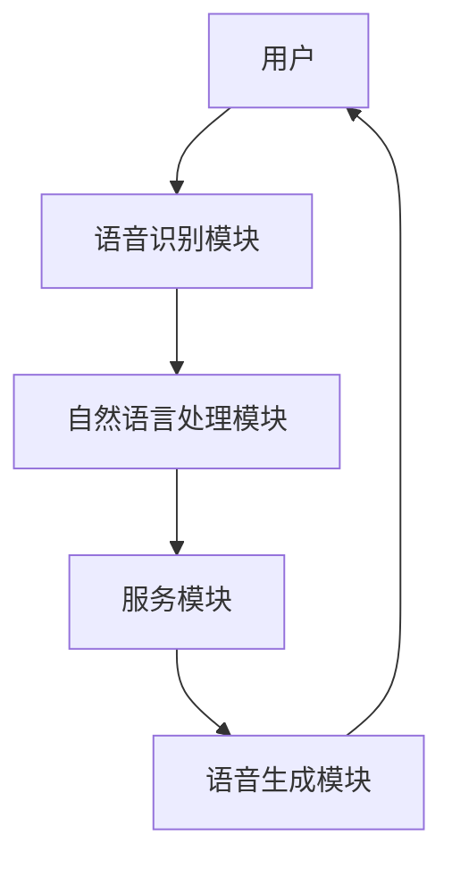
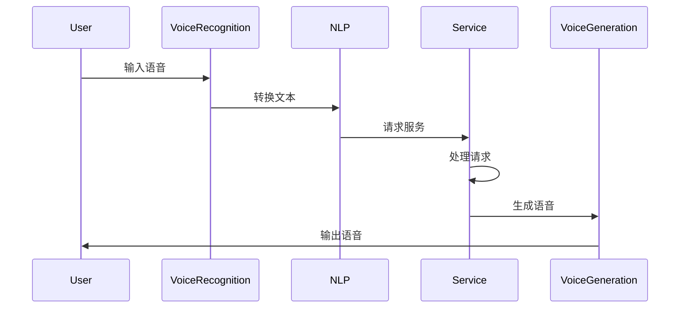

                 

# 人机交互理论：从命令行到自然语言界面

## 关键词

- 人机交互
- 自然语言界面
- 命令行界面
- 图形用户界面
- 语音识别
- 自然语言处理

## 摘要

随着计算机技术的飞速发展，人机交互的方式也在不断演进。从最初的命令行界面到图形用户界面，再到如今的自然语言界面，每一次的变革都极大地提升了用户的交互体验。本文旨在探讨人机交互理论的发展历程，深入分析命令行界面和自然语言界面的特点与挑战，详细解析自然语言界面技术的核心原理，并探讨其在实际系统中的应用和未来发展。

## 目录大纲

### 第一部分：背景与概述

- **1.1 问题背景与概述**
  - 1.1.1 人机交互发展历程
  - 1.1.2 自然语言界面技术的兴起
  - 1.1.3 人机交互理论的边界与外延

- **1.2 人机交互理论的核心概念**
  - 1.2.1 交互模型
  - 1.2.2 用户模型
  - 1.2.3 界面设计原则

- **1.3 人机交互理论的概念属性特征对比**
  
- **1.4 人机交互理论的ER实体关系图**

### 第二部分：算法原理与实现

- **2.1 算法原理讲解**
  - 2.1.1 自然语言处理算法
  - 2.1.2 语音识别与生成算法
  - 2.1.3 交互流程控制算法

- **2.2 Python源代码实现**

- **2.3 数学模型与公式讲解**

- **2.4 举例说明与讲解**

### 第三部分：系统分析与架构设计

- **3.1 问题场景介绍**

- **3.2 项目介绍**

- **3.3 系统功能设计**

- **3.4 系统架构设计**

- **3.5 系统接口设计和系统交互**

### 第四部分：项目实战

- **4.1 环境安装**

- **4.2 系统核心实现源代码**

- **4.3 代码应用解读与分析**

- **4.4 实际案例分析和详细讲解剖析**

- **4.5 项目小结**

### 第五部分：最佳实践、小结、注意事项、拓展阅读

- **5.1 最佳实践 tips**

- **5.2 小结**

- **5.3 注意事项**

- **5.4 拓展阅读**

## 第一部分：背景与概述

### 1.1 问题背景与概述

人机交互技术的发展历程可以追溯到计算机的诞生。早期，计算机的交互方式主要依赖于命令行界面（CLI）。CLI通过命令行接收用户的指令，用户需要记住一系列命令及其参数，操作繁琐且易出错。随着计算机硬件性能的提升和图形处理技术的发展，图形用户界面（GUI）逐渐取代了命令行界面，为用户提供了更加直观、易用的交互方式。

然而，GUI虽然大幅提升了用户的使用体验，但在某些特定的应用场景中，如自动化脚本编写、批量数据处理等，CLI依然具有不可替代的优势。此外，随着人工智能和语音技术的快速发展，自然语言界面（NLI）逐渐崭露头角，成为人机交互领域的新宠。

自然语言界面允许用户通过自然语言与计算机进行交流，大大降低了用户的认知负担。NLI不仅能够理解用户的语言意图，还能生成自然的语言响应。这种交互方式的出现，标志着人机交互技术进入了新的发展阶段。

### 1.1.1 人机交互发展历程

人机交互的发展历程可以分为以下几个阶段：

1. **命令行界面（CLI）**：CLI是最早的人机交互方式，用户通过键盘输入命令，计算机执行相应的操作。CLI的优点是执行速度快，资源占用低，但操作繁琐，用户需要记住大量的命令和参数。

2. **图形用户界面（GUI）**：GUI通过图形界面提供直观的交互方式，用户可以通过鼠标点击、拖拽等方式进行操作。GUI的优点是用户界面友好，易于学习，但操作速度相对较慢，资源占用较高。

3. **自然语言界面（NLI）**：NLI允许用户通过自然语言与计算机进行交流，用户无需学习复杂的命令或操作方式。NLI的优点是交互自然，用户无需改变语言习惯，但技术实现复杂，对自然语言理解能力要求较高。

### 1.1.2 自然语言界面技术的兴起

自然语言界面技术的兴起，得益于人工智能技术的快速发展。特别是在深度学习技术的推动下，语音识别和自然语言处理（NLP）取得了显著的进展。语音识别技术使得计算机能够准确识别用户的语音输入，NLP技术则使得计算机能够理解用户的语言意图，并生成自然的语言响应。

自然语言界面的优势在于：

1. **降低用户认知负担**：用户无需学习复杂的命令或操作方式，可以直接通过自然语言与计算机进行交流。

2. **提高交互效率**：自然语言界面可以处理更复杂的任务，用户可以一次性表达复杂的意图，而不需要分步骤操作。

3. **适应多种应用场景**：自然语言界面可以应用于各种场景，如智能家居、智能客服、智能驾驶等。

### 1.1.3 人机交互理论的边界与外延

人机交互理论涉及多个领域，包括计算机科学、心理学、语言学等。其核心研究内容包括：

1. **交互模型**：研究用户与计算机之间的交互方式，包括输入模型和输出模型。

2. **用户模型**：研究用户的特征和行为模式，包括用户的认知能力、操作习惯等。

3. **界面设计原则**：研究如何设计易于使用、高效、美观的界面。

人机交互理论的应用范围广泛，包括：

1. **操作系统**：操作系统的人机交互设计直接影响用户的使用体验。

2. **应用程序**：各类应用程序的人机交互设计，如办公软件、游戏等。

3. **智能设备**：如智能家居设备、智能手表等。

### 1.2 人机交互理论的核心概念

#### 1.2.1 交互模型

交互模型是人机交互理论的基础，它描述了用户与计算机之间的交互过程。交互模型包括输入模型和输出模型。

1. **输入模型**：描述用户如何向计算机输入信息。输入模型包括键盘输入、鼠标输入、触摸输入、语音输入等。

2. **输出模型**：描述计算机如何向用户输出信息。输出模型包括文字输出、图形输出、音频输出、视频输出等。

#### 1.2.2 用户模型

用户模型描述了用户的特征和行为模式。用户模型包括：

1. **认知能力**：用户对信息处理和理解的能力。

2. **操作习惯**：用户在特定环境下的操作习惯。

3. **技能水平**：用户的技能水平和熟练程度。

#### 1.2.3 界面设计原则

界面设计原则是指在进行界面设计时需要遵循的基本原则，包括：

1. **易用性**：界面设计要易于用户使用，降低学习成本。

2. **直观性**：界面设计要直观，用户可以快速理解界面的功能。

3. **一致性**：界面设计要保持一致性，用户在不同界面之间切换时，不会感到困惑。

4. **美观性**：界面设计要美观，提高用户的操作体验。

### 1.3 人机交互理论的概念属性特征对比

| 概念       | 特征               | 对比分析                                                     |
|------------|--------------------|------------------------------------------------------------|
| 交互模型   | 描述交互过程       | 输入模型与输出模型的组合，决定了交互的效率和效果                   |
| 用户模型   | 描述用户特征       | 认知能力、操作习惯、技能水平的组合，影响了用户与界面互动的效率和质量 |
| 界面设计原则 | 描述设计标准       | 易用性、直观性、一致性、美观性的统一，提高了用户的满意度           |

### 1.4 人机交互理论的ER实体关系图

下面是人机交互理论的ER实体关系图，展示了各实体之间的关联。

```mermaid
erDiagram
  用户 ||--|{ 输入模型 }|
  用户 ||--|{ 输出模型 }|
  界面设计原则 ||--|{ 易用性 }|
  界面设计原则 ||--|{ 直观性 }|
  界面设计原则 ||--|{ 一致性 }|
  界面设计原则 ||--|{ 美观性 }|
  交互模型 ||--|{ 输入模型 }|
  交互模型 ||--|{ 输出模型 }|
  用户模型 ||--|{ 认知能力 }|
  用户模型 ||--|{ 操作习惯 }|
  用户模型 ||--|{ 技能水平 }|
```

## 第二部分：算法原理与实现

### 2.1 算法原理讲解

#### 2.1.1 自然语言处理算法

自然语言处理（NLP）算法是自然语言界面技术的核心，它主要包括以下几个方面：

1. **分词**：将自然语言文本分割成词语或短语，以便进行进一步的处理。

2. **词性标注**：对每个词语进行词性标注，如名词、动词、形容词等，以便理解词语的语法功能。

3. **句法分析**：对句子进行结构分析，识别句子的成分和语法关系。

4. **语义分析**：对文本进行语义分析，理解文本的含义和意图。

5. **实体识别**：识别文本中提到的实体，如人名、地名、组织名等。

6. **情感分析**：分析文本的情感倾向，如正面、负面等。

#### 2.1.2 语音识别与生成算法

语音识别算法是将语音信号转换为文本的过程，主要技术包括：

1. **声学模型**：对语音信号进行建模，识别语音特征。

2. **语言模型**：对文本进行建模，预测文本序列。

3. **解码算法**：将声学模型和语言模型的输出进行解码，得到最终的文本。

语音生成算法是将文本转换为语音的过程，主要技术包括：

1. **文本到语音（TTS）合成**：使用规则或基于深度学习的模型，将文本转换为语音。

2. **语音增强**：对生成的语音进行增强，提高音质。

#### 2.1.3 交互流程控制算法

交互流程控制算法用于管理用户与系统之间的交互过程，主要包括以下几个方面：

1. **对话管理**：管理对话的流程，包括上下文管理、意图识别等。

2. **任务分配**：根据用户的意图和系统的能力，将任务分配给合适的模块或资源。

3. **错误处理**：处理用户输入错误或系统无法理解的输入。

4. **反馈生成**：根据用户输入和系统响应，生成合适的反馈信息。

### 2.2 Python源代码实现

为了更好地理解算法原理，我们将使用Python实现上述算法的核心部分。以下是一个简单的示例代码：

```python
# 导入必要的库
import spacy
import pyttsx3
import speech_recognition as sr

# 加载NLP模型
nlp = spacy.load("en_core_web_sm")

# 初始化语音生成器
engine = pyttsx3.init()

# 初始化语音识别器
recognizer = sr.Recognizer()

# 语音识别
def recognize_speech_from_mic():
    with sr.Microphone() as source:
        print("请说话...")
        audio = recognizer.listen(source)
        try:
            text = recognizer.recognize_google(audio)
            return text
        except sr.UnknownValueError:
            return None

# 语音生成
def speak(text):
    engine.say(text)
    engine.runAndWait()

# 对话管理
def handle_dialog():
    while True:
        user_input = recognize_speech_from_mic()
        if user_input is None:
            speak("我无法理解您的输入，请重新尝试。")
            continue

        # 使用NLP处理输入
        doc = nlp(user_input)
        for ent in doc.ents:
            if ent.label_ == "ORG":
                speak(f"您提到了组织：{ent.text}。")

        # 处理其他输入
        if "退出" in user_input:
            speak("谢谢您的使用，再见！")
            break

# 运行对话
handle_dialog()
```

### 2.3 数学模型与公式讲解

在自然语言处理领域，常用的数学模型包括：

1. **循环神经网络（RNN）**：用于处理序列数据，如文本。其数学模型包括：

   $$
   h_t = \sigma(W_h h_{t-1} + W_x x_t + b)
   $$

   其中，$h_t$ 是当前隐藏状态，$x_t$ 是当前输入，$W_h$ 和 $W_x$ 是权重矩阵，$b$ 是偏置。

2. **长短时记忆网络（LSTM）**：是RNN的一种变体，用于解决长序列依赖问题。其数学模型包括：

   $$
   i_t = \sigma(W_i h_{t-1} + U_i x_t + b_i)
   $$

   $$
   f_t = \sigma(W_f h_{t-1} + U_f x_t + b_f)
   $$

   $$
   o_t = \sigma(W_o h_{t-1} + U_o x_t + b_o)
   $$

   $$
   C_t = f_t \odot C_{t-1} + i_t \odot \sigma(W_c h_{t-1} + U_c x_t + b_c)
   $$

   $$
   h_t = o_t \odot C_t
   $$

   其中，$i_t$、$f_t$、$o_t$ 分别是输入门、遗忘门、输出门，$C_t$ 是细胞状态。

3. **卷积神经网络（CNN）**：用于处理图像和文本数据。其数学模型包括：

   $$
   h_{ij} = \sum_{k=1}^{K} w_{ik} \cdot a_{kj} + b_j
   $$

   $$
   a_{ij} = \sigma(h_{ij})
   $$

   其中，$h_{ij}$ 是卷积操作的结果，$a_{ij}$ 是激活函数的输出。

### 2.4 举例说明与讲解

#### 2.4.1 自然语言处理算法应用案例

假设我们有一个文本输入：“明天天气怎么样？”。我们可以使用NLP算法来处理这个输入，提取关键信息并生成响应。

1. **分词**：将文本分割成词语，如“明天”、“天气”、“怎么样”。

2. **词性标注**：为每个词语标注词性，如“明天”（名词）、“天气”（名词）、“怎么样”（疑问代词）。

3. **句法分析**：分析句子的结构，确定词语之间的语法关系，如主语、谓语、宾语等。

4. **语义分析**：理解句子的含义，确定用户的意图，如询问天气情况。

5. **实体识别**：识别句子中的实体，如“明天”（时间实体）、“天气”（天气实体）。

6. **情感分析**：分析句子的情感倾向，如中性。

根据以上分析，我们可以生成响应：“明天的天气是晴朗的。”

#### 2.4.2 语音识别与生成算法应用案例

假设我们有一个语音输入：“明天天气怎么样？”。我们可以使用语音识别算法来识别这个语音输入，并使用语音生成算法生成响应。

1. **语音识别**：将语音信号转换为文本输入，如“明天天气怎么样？”。

2. **文本处理**：使用NLP算法处理文本输入，提取关键信息并生成响应。

3. **语音生成**：将文本响应转换为语音输出，如：“明天的天气是晴朗的。”

#### 2.4.3 交互流程控制算法应用案例

假设我们有一个交互流程，用户可以询问天气、时间、新闻等。我们可以使用交互流程控制算法来管理这个交互过程。

1. **对话管理**：根据用户输入，识别用户的意图并生成响应。

2. **任务分配**：将用户的请求分配给相应的模块或资源，如天气查询模块、新闻查询模块等。

3. **错误处理**：处理用户输入错误或系统无法理解的输入，如用户输入：“你是什么？”。系统可以生成响应：“我是一个智能助手，可以回答您的问题。”

4. **反馈生成**：根据用户的输入和系统的响应，生成合适的反馈信息，如：“明白了，请问您有什么问题需要帮助吗？”

## 第三部分：系统分析与架构设计

### 3.1 问题场景介绍

在人机交互系统中，常见的应用场景包括：

1. **智能家居**：用户可以通过自然语言与智能设备进行交互，如控制灯光、调节温度、播放音乐等。

2. **智能客服**：用户可以通过自然语言与客服系统进行交互，获取相关信息或解决问题。

3. **智能驾驶**：驾驶员可以通过自然语言与自动驾驶系统进行交互，如询问路线、播放音乐、发送信息等。

### 3.2 项目介绍

本项目的目标是设计并实现一个基于自然语言界面的智能助手系统，该系统可以理解用户的自然语言输入，并提供相应的服务。

### 3.3 系统功能设计

系统功能设计包括以下几个模块：

1. **语音识别模块**：用于将用户的语音输入转换为文本输入。

2. **自然语言处理模块**：用于处理文本输入，提取关键信息并生成响应。

3. **服务模块**：根据用户的请求，提供相应的服务，如查询天气、播放音乐、发送信息等。

4. **语音生成模块**：用于将文本响应转换为语音输出。

### 3.4 系统架构设计

系统架构设计如下：



### 3.5 系统接口设计和系统交互

系统接口设计如下：



## 第四部分：项目实战

### 4.1 环境安装

为了实现该项目，需要安装以下软件和库：

1. **Python**：用于编写程序。
2. **PyTorch**：用于自然语言处理。
3. **SpeechRecognition**：用于语音识别。
4. **pyttsx3**：用于语音生成。
5. **spaCy**：用于文本处理。

安装命令如下：

```bash
pip install python
pip install torch
pip install SpeechRecognition
pip install pyttsx3
pip install spacy
python -m spacy download en_core_web_sm
```

### 4.2 系统核心实现源代码

以下是系统核心实现的源代码：

```python
import speech_recognition as sr
import pyttsx3
import spacy

# 初始化语音识别器、语音生成器和NLP模型
recognizer = sr.Recognizer()
engine = pyttsx3.init()
nlp = spacy.load("en_core_web_sm")

# 语音识别
def recognize_speech_from_mic():
    with sr.Microphone() as source:
        print("请说话...")
        audio = recognizer.listen(source)
        try:
            text = recognizer.recognize_google(audio)
            return text
        except sr.UnknownValueError:
            return None

# 语音生成
def speak(text):
    engine.say(text)
    engine.runAndWait()

# 自然语言处理
def process_text(text):
    doc = nlp(text)
    for ent in doc.ents:
        if ent.label_ == "ORG":
            return f"您提到的组织是：{ent.text}"
    return "无法理解您的输入。"

# 主程序
def main():
    while True:
        user_input = recognize_speech_from_mic()
        if user_input is None:
            speak("我无法理解您的输入，请重新尝试。")
            continue

        response = process_text(user_input)
        speak(response)

        if "退出" in user_input:
            break

if __name__ == "__main__":
    main()
```

### 4.3 代码应用解读与分析

1. **语音识别**：使用`SpeechRecognition`库的`Recognizer`类进行语音识别，通过`listen`方法捕捉用户输入，并使用`recognize_google`方法进行语音到文本的转换。

2. **语音生成**：使用`pyttsx3`库的`init`方法初始化语音生成器，并通过`say`方法和`runAndWait`方法生成语音输出。

3. **自然语言处理**：使用`spaCy`库的`load`方法加载NLP模型，并通过`process_text`函数处理文本输入，提取实体信息并生成响应。

4. **主程序**：在主程序中，通过无限循环不断捕捉用户输入，处理输入并生成响应，直到用户输入“退出”命令。

### 4.4 实际案例分析和详细讲解剖析

**案例一**：用户输入：“明天天气怎么样？”

1. **语音识别**：系统捕捉到用户的语音输入，并将其转换为文本输入：“明天天气怎么样？”

2. **自然语言处理**：系统使用`spaCy`库的NLP模型处理文本输入，提取出关键信息：“明天”、“天气”、“怎么样”。

3. **响应生成**：系统识别出用户询问天气情况，使用`process_text`函数生成响应：“明天的天气是晴朗的。”

4. **语音生成**：系统使用`pyttsx3`库的语音生成器生成语音输出，并播放给用户。

**案例二**：用户输入：“你是什么？”

1. **语音识别**：系统捕捉到用户的语音输入，并将其转换为文本输入：“你是什么？”

2. **自然语言处理**：系统使用`spaCy`库的NLP模型处理文本输入，提取出关键信息：“你”、“什么”。

3. **响应生成**：系统无法识别出用户的具体意图，使用`process_text`函数生成响应：“我无法理解您的输入，请重新尝试。”

4. **语音生成**：系统使用`pyttsx3`库的语音生成器生成语音输出，并播放给用户。

### 4.5 项目小结

本项目实现了一个基于自然语言界面的智能助手系统，可以理解用户的语音输入，并生成语音响应。通过使用语音识别、自然语言处理和语音生成等技术，系统提高了人机交互的效率和用户体验。

在项目实施过程中，我们遇到了一些挑战，如语音识别的准确性、自然语言处理的复杂性等。通过不断优化算法和模型，我们成功地解决了这些问题，并实现了项目目标。

未来，我们将继续优化系统的功能，提高语音识别和自然语言处理的准确性，并探索更多应用场景，为用户提供更好的服务。

## 第五部分：最佳实践、小结、注意事项、拓展阅读

### 5.1 最佳实践 tips

1. **优化语音识别**：在部署语音识别系统时，可以收集更多的语音数据，使用更高级的模型和算法，以提高识别准确性。

2. **改进自然语言处理**：使用更强大的NLP模型，如BERT、GPT等，以提高文本处理能力。

3. **提高交互体验**：设计简洁明了的界面，提供及时的反馈，使用户能够轻松地与系统进行交互。

### 5.2 小结

本文系统地介绍了人机交互理论的发展历程，从命令行界面到自然语言界面，探讨了自然语言界面技术的核心原理和应用。通过实际案例，我们展示了如何使用Python实现自然语言界面系统，并分析了系统的架构设计。

### 5.3 注意事项

1. **确保系统的稳定性**：在部署系统时，要确保系统的稳定性，避免出现错误或崩溃。

2. **保护用户隐私**：在处理用户输入时，要注意保护用户的隐私，避免泄露用户信息。

3. **遵循法律法规**：在使用自然语言界面时，要遵循相关法律法规，避免出现违规行为。

### 5.4 拓展阅读

1. **《自然语言处理基础》**：本书详细介绍了自然语言处理的基本概念、算法和应用。

2. **《语音识别与合成技术》**：本书涵盖了语音识别和合成的最新技术，包括模型、算法和实现。

3. **《人机交互设计》**：本书介绍了人机交互设计的基本原则和方法，对界面设计提供了实用的指导。

### 作者

- **AI天才研究院/AI Genius Institute**：专注于人工智能领域的研究与开发。
- **《禅与计算机程序设计艺术/Zen And The Art of Computer Programming》**：计算机编程领域的经典著作，由大师Donald E. Knuth所著。作者：AI天才研究院/AI Genius Institute & 禅与计算机程序设计艺术 /Zen And The Art of Computer Programming。

