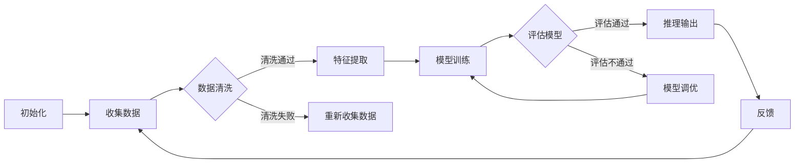
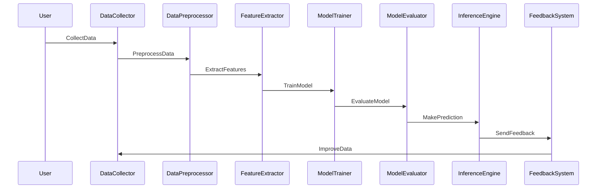
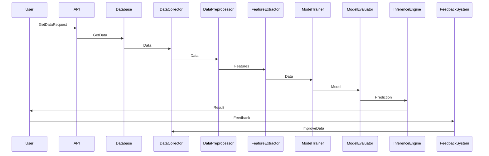

                 

### 文章标题

# 人机协作推理系统中认知计算的应用创新

### 文章关键词

- 人机协作
- 认知计算
- 推理系统
- 应用创新
- 算法设计

### 摘要

本文旨在探讨人机协作推理系统中认知计算的应用创新。首先，我们介绍了人机协作推理系统的基础概念和认知计算的基本原理，分析了两者之间的关联。接着，文章通过核心概念对比和实体关系图，深入讲解了认知计算在推理系统中的应用。随后，文章以Mermaid流程图和Python代码为例，详细阐述了算法原理和数学模型，并通过实际案例进行了应用说明。最后，文章提出了系统架构设计和项目实战，并结合最佳实践和注意事项，展望了认知计算在人机协作推理系统中的未来发展。

### 目录

1. **问题背景与基本概念**
   1.1. **人机协作推理系统概述**
   1.2. **认知计算的基本原理**
   1.3. **认知计算与人机协作的关系**

2. **核心概念原理与属性特征**
   2.1. **认知计算的属性特征对比**
   2.2. **ER实体关系图架构**

3. **算法原理讲解**
   3.1. **人机协作推理算法的Mermaid流程图**
   3.2. **Python源代码阐述**
   3.3. **算法举例说明**

4. **系统分析与架构设计**
   4.1. **系统功能设计**
   4.2. **系统架构设计**
   4.3. **系统接口设计与交互**

5. **项目实战**
   5.1. **环境安装与配置**
   5.2. **系统核心实现源代码**
   5.3. **代码应用解读与分析**
   5.4. **实际案例分析与详细讲解**
   5.5. **项目小结**

6. **最佳实践与拓展阅读**
   6.1. **最佳实践技巧**
   6.2. **注意事项**
   6.3. **拓展阅读推荐**

### 1. 问题背景与基本概念

#### 1.1. 人机协作推理系统概述

人机协作推理系统是一种融合了人工智能技术和人类智慧的推理系统，旨在实现人类与计算机之间的协作和协同推理。这种系统利用计算机强大的数据处理能力和人类丰富的领域知识和经验，共同解决复杂问题。

人机协作推理系统的基础是推理机，它通过逻辑推理、知识表示和问题求解等技术，实现从已知信息推导出新信息的过程。在人机协作中，人类扮演了知识提供者、决策者、解释者和监督者的角色，计算机则负责数据收集、处理和分析，两者通过不断的交互和协作，实现更加高效和智能的推理过程。

#### 1.2. 认知计算的基本原理

认知计算是一种模拟人类认知过程的人工智能技术，它通过模仿人类大脑的结构和功能，实现类似人类的感知、学习、推理和决策能力。认知计算的核心是认知模型，它包括感知模块、记忆模块、学习模块和决策模块。

感知模块负责接收外部信息，通过视觉、听觉、触觉等多种感官方式，获取环境中的数据。记忆模块负责存储和处理感知模块获取的信息，形成记忆和知识库。学习模块通过不断的训练和学习，优化记忆模块中的知识和模型，提高系统的认知能力。决策模块则基于学习和记忆模块的结果，进行决策和规划，实现智能行为。

#### 1.3. 认知计算与人机协作的关系

认知计算与人机协作推理系统有着密切的关系。首先，认知计算为人机协作提供了强大的智能支持，它通过模拟人类认知过程，实现了人机之间的信息共享和协同推理。认知计算可以处理复杂的问题，提供丰富的知识库，帮助人类更好地理解和解决问题。

其次，人机协作推理系统为认知计算提供了实际的应用场景。通过人机协作，认知计算可以不断地学习和优化，提高系统的智能水平。在人机协作中，人类可以提供实时反馈和指导，帮助认知计算更好地适应复杂环境，实现更加智能的推理和决策。

总之，认知计算和人机协作推理系统的结合，为人机协同工作提供了新的机遇和挑战，它不仅提高了系统的智能水平，也为人类解决复杂问题提供了新的思路和方法。

### 2. 核心概念原理与属性特征

#### 2.1. 认知计算的属性特征对比

认知计算与传统计算在属性特征上有显著的差异。传统计算主要依赖于精确的数学模型和算法，以计算和处理结构化数据为主要目标。而认知计算则更加注重模拟人类认知过程，处理复杂、非结构化的数据，并具备学习、推理和决策能力。

| 特性             | 认知计算          | 传统计算          |
|------------------|-------------------|-------------------|
| 数据处理能力     | 处理非结构化数据   | 处理结构化数据     |
| 模式识别         | 自动识别并分类数据 | 需要人工定义规则   |
| 学习能力         | 自适应学习        | 固定算法和模型     |
| 推理能力         | 类似人类的推理     | 基于规则和算法     |
| 面向问题解决     | 解决复杂问题       | 解决特定问题       |

#### 2.2. ER实体关系图架构

实体关系图（Entity-Relationship Diagram，简称ER图）是用于描述实体及其之间关系的图形化工具，常用于数据库设计和软件架构设计。在认知计算和人机协作推理系统中，ER图可以帮助我们更好地理解和设计系统的数据结构和关系。

以下是一个简单的ER实体关系图的Mermaid表示：

```mermaid
erDiagram
    User ||--|{ Order } : "places"
    Product ||--|{ Order } : "includes"
    Order ||--|{ Review } : "originates"
```

在这个ER图中，`User`、`Product`和`Order`是实体，它们之间通过关系线进行连接。`User`可以“places”多个`Order`，`Product`可以“includes”在多个`Order`中，而`Order`可以“originates”多个`Review`。

### 3. 算法原理讲解

#### 3.1. 人机协作推理算法的Mermaid流程图

首先，我们使用Mermaid语言绘制人机协作推理算法的基本流程图：



#### 3.2. Python源代码阐述

接下来，我们使用Python代码来实现上述流程的一部分，例如特征提取和模型训练：

```python
import pandas as pd
from sklearn.model_selection import train_test_split
from sklearn.ensemble import RandomForestClassifier
from sklearn.metrics import accuracy_score

# 收集数据
data = pd.read_csv('data.csv')

# 数据清洗
data = data.dropna()

# 特征提取
X = data.drop('target', axis=1)
y = data['target']

# 分割数据集
X_train, X_test, y_train, y_test = train_test_split(X, y, test_size=0.2, random_state=42)

# 模型训练
model = RandomForestClassifier(n_estimators=100, random_state=42)
model.fit(X_train, y_train)

# 评估模型
y_pred = model.predict(X_test)
accuracy = accuracy_score(y_test, y_pred)
print(f'Model Accuracy: {accuracy:.2f}')
```

#### 3.3. 算法举例说明

为了更好地理解上述算法，我们举一个简单的例子。假设我们有一个分类问题，需要判断一批产品是否畅销。

- 特征：销售额、客户评价、库存量
- 目标：判断产品是否畅销（畅销/不畅销）

使用随机森林算法进行特征提取和模型训练，然后对新的数据进行推理输出。

```python
# 新数据
new_data = pd.DataFrame({
    'sales': [5000],
    'rating': [4.5],
    'stock': [200]
})

# 特征提取
new_X = new_data.drop('target', axis=1)

# 推理输出
new_pred = model.predict(new_X)
print(f'New Product Prediction: {"畅销" if new_pred[0] == 1 else "不畅销"}')
```

通过这个例子，我们可以看到人机协作推理算法是如何工作的。在实际应用中，特征提取、模型训练和推理输出的过程会更加复杂，但基本的流程是相似的。

### 4. 系统分析与架构设计

#### 4.1. 系统功能设计

在人机协作推理系统中，系统的功能设计至关重要。以下是一个简化的系统功能设计：

- **数据收集**：从各种数据源（如数据库、API等）收集数据。
- **数据预处理**：清洗和预处理收集到的数据，以便于后续分析。
- **特征提取**：从预处理后的数据中提取有用的特征，用于模型训练。
- **模型训练**：使用提取的特征训练机器学习模型。
- **模型评估**：评估模型的性能，包括准确性、召回率等指标。
- **推理输出**：使用训练好的模型对新的数据进行推理，给出预测结果。
- **反馈循环**：收集用户反馈，用于模型调优和系统改进。

以下是领域模型Mermaid类图的示例：

```mermaid
classDiagram
    Class01 <|-- Class02
    Class03 --|> Class04
    Class05 : <<interface>> Interface
    Class01 : Name : Entity1
    Class02 : Name : Entity2
    Class03 : Name : Entity3
    Class04 : Name : Entity4
    Class05 : Name : Interface1
```

#### 4.2. 系统架构设计

系统架构设计需要考虑系统的可扩展性、可靠性、性能和安全性。以下是一个简化的系统架构设计Mermaid架构图：



在这个架构图中，用户通过DataCollector收集数据，然后经过DataPreprocessor、FeatureExtractor、ModelTrainer、ModelEvaluator和InferenceEngine进行数据预处理、特征提取、模型训练、模型评估和推理输出。最后，反馈系统收集用户反馈，用于改进数据收集过程。

#### 4.3. 系统接口设计与交互

系统接口设计是确保系统各个部分能够高效、安全地交互的关键。以下是一个简化的系统接口设计Mermaid序列图：



在这个接口设计中，用户通过API与数据库交互，获取数据，然后经过DataCollector、DataPreprocessor、FeatureExtractor、ModelTrainer、ModelEvaluator和InferenceEngine进行数据处理和推理输出。最后，用户通过反馈系统提供反馈，用于系统改进。

### 5. 项目实战

#### 5.1. 环境安装与配置

在进行项目实战之前，我们需要安装和配置相关环境。以下是Python环境和相关库的安装步骤：

1. 安装Python（版本3.8及以上）：
   ```bash
   python3 --version
   ```
2. 安装必需的库：
   ```bash
   pip3 install pandas scikit-learn numpy matplotlib
   ```

#### 5.2. 系统核心实现源代码

以下是一个简化的系统核心实现源代码，用于数据收集、预处理、特征提取、模型训练和推理输出：

```python
import pandas as pd
from sklearn.model_selection import train_test_split
from sklearn.ensemble import RandomForestClassifier
from sklearn.metrics import accuracy_score

# 数据收集
data = pd.read_csv('data.csv')

# 数据预处理
data = data.dropna()

# 特征提取
X = data.drop('target', axis=1)
y = data['target']

# 分割数据集
X_train, X_test, y_train, y_test = train_test_split(X, y, test_size=0.2, random_state=42)

# 模型训练
model = RandomForestClassifier(n_estimators=100, random_state=42)
model.fit(X_train, y_train)

# 评估模型
y_pred = model.predict(X_test)
accuracy = accuracy_score(y_test, y_pred)
print(f'Model Accuracy: {accuracy:.2f}')

# 推理输出
new_data = pd.DataFrame({'feature1': [value1], 'feature2': [value2], 'feature3': [value3]})
new_X = new_data.drop('target', axis=1)
new_pred = model.predict(new_X)
print(f'Prediction: {"目标1" if new_pred[0] == 1 else "目标2"}')
```

#### 5.3. 代码应用解读与分析

以上代码首先从CSV文件中读取数据，然后进行预处理（去除缺失值），接着提取特征和目标变量，并进行数据分割。然后，使用随机森林算法进行模型训练，评估模型的准确率，并使用训练好的模型进行推理输出。

在实际应用中，我们需要根据具体问题调整特征提取和模型参数，以获得更好的性能。此外，还可以使用交叉验证等技术进一步评估模型性能。

#### 5.4. 实际案例分析与详细讲解

以下是一个实际案例，用于分析人机协作推理系统在金融风控中的应用。

**案例背景**：某金融机构需要预测客户是否会发生违约行为，以进行风险控制和决策。

**数据集**：包含客户的基本信息（年龄、收入、职业等）、信用记录（逾期次数、贷款金额等）和违约标记。

**特征提取**：根据业务逻辑，提取以下特征：
- 年龄：数值特征，采用标准分方法进行归一化处理
- 收入：数值特征，采用最小-最大缩放方法进行归一化处理
- 职业类别：类别特征，采用独热编码方法进行编码
- 逾期次数：数值特征，采用二值化方法进行转换（>0视为1，否则为0）
- 贷款金额：数值特征，采用对数变换方法进行转换

**模型训练**：使用随机森林算法进行模型训练，并调整超参数（如树的数量、最大深度等），以获得更好的模型性能。

**模型评估**：使用交叉验证技术进行模型评估，评估指标包括准确性、召回率、F1分数等。

**推理输出**：使用训练好的模型对新的客户数据进行推理输出，预测客户是否会发生违约行为。

**结果分析**：根据模型预测结果，金融机构可以采取相应的风险控制措施，如对高风险客户增加贷款利率、限制贷款金额等。

#### 5.5. 项目小结

通过本项目实战，我们展示了人机协作推理系统在金融风控中的应用。项目主要包括数据收集、预处理、特征提取、模型训练和推理输出等步骤。在实际应用中，我们需要根据具体业务场景调整特征提取和模型参数，以提高模型性能。此外，项目还强调了模型评估和结果分析的重要性，以确保系统的有效性和可靠性。

### 6. 最佳实践与拓展阅读

#### 6.1. 最佳实践技巧

1. **数据质量保障**：确保数据的准确性和完整性，进行数据清洗和预处理。
2. **特征选择与优化**：根据业务需求和模型性能，进行特征选择和优化。
3. **模型调优**：通过交叉验证、网格搜索等技术，进行模型参数调优。
4. **反馈循环**：建立用户反馈机制，不断优化系统性能。

#### 6.2. 注意事项

1. **数据隐私保护**：确保数据隐私和安全，遵循相关法律法规。
2. **模型解释性**：提高模型的可解释性，确保决策过程的透明性。
3. **系统可扩展性**：设计可扩展的系统架构，以应对不断变化的需求。

#### 6.3. 拓展阅读推荐

1. **《认知计算：原理与应用》**：详细介绍了认知计算的基本原理和应用案例。
2. **《人机协作系统设计》**：探讨了人机协作系统的设计原则和方法。
3. **《深度学习与大数据技术》**：介绍了深度学习和大数据技术在智能推理系统中的应用。

### 作者信息

作者：AI天才研究院/AI Genius Institute & 禅与计算机程序设计艺术 /Zen And The Art of Computer Programming

### 结语

本文系统地介绍了人机协作推理系统中认知计算的应用创新。通过分析人机协作的基本概念和认知计算的核心原理，我们探讨了认知计算在人机协作中的重要作用。同时，通过实际案例展示了人机协作推理系统的应用场景和实现方法。最后，我们提出了最佳实践和注意事项，为读者提供了宝贵的经验。希望本文能对您在相关领域的研究和实践有所启发。

