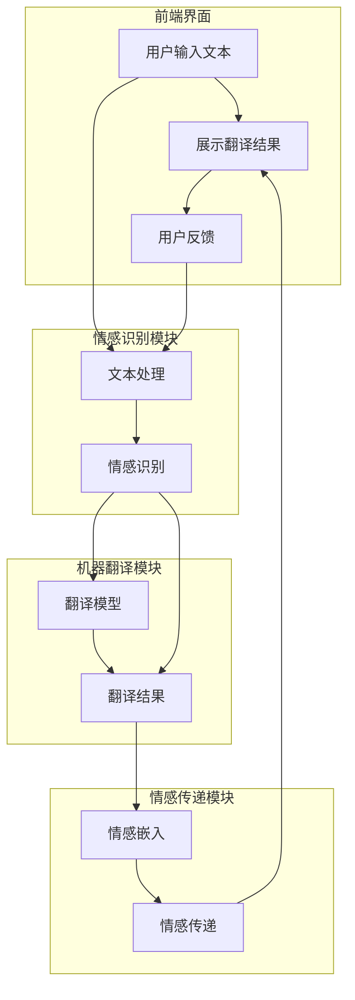

                 

## 引言

### 人机情感交互与语言翻译概述

在人机交互领域，情感交互的研究正在成为热点。人机情感交互（Human-Computer Emotional Interaction，简称HCEI）是指通过模拟人类的情感状态，使计算机能够理解、识别和适应用户的情感需求。这一技术的发展不仅为智能系统的设计提供了新的方向，也对语言翻译领域带来了深远的影响。

语言翻译，作为跨文化交流的重要工具，经历了从传统的手工翻译到机器翻译的变革。然而，传统机器翻译系统主要依赖于语法和词汇的匹配，往往难以准确传达原文的情感色彩。这使得翻译过程中，情感信息的缺失成为了一个亟待解决的问题。

近年来，随着人工智能技术的进步，人机情感交互与语言翻译的结合逐渐受到关注。通过在翻译系统中引入情感识别和表达技术，翻译结果不仅能够保持原文的语法结构，还能传达出相应的情感色彩。这种突破性的进展，为人机情感交互在语言翻译领域的应用打开了新的可能性。

本文将围绕人机情感交互对语言翻译的突破展开讨论。首先，我们将介绍人机情感交互和语言翻译的基本概念、发展历程以及当前的研究状况。接着，我们将深入探讨人机情感交互在语言翻译中的应用原理，并通过具体的算法原理讲解和数学模型分析，帮助读者理解这一领域的核心技术和方法。此外，我们还将对一个人机情感交互语言翻译系统进行详细剖析，包括系统功能设计、架构设计和实际案例的分析。最后，我们将总结最佳实践，展望人机情感交互语言翻译的未来发展趋势和面临的挑战。

通过对以上内容的探讨，本文旨在为读者提供一个全面、深入的视角，了解人机情感交互在语言翻译领域的重要性和应用前景。同时，也为相关研究人员和开发者提供有价值的参考和启示。

### 人机情感交互与语言翻译的基本概念和发展历程

#### 人机情感交互的基本概念

人机情感交互（HCEI）是指计算机系统通过感知、理解、模拟和适应用户的情感状态，实现与用户的自然互动。情感交互不仅限于文字和语音，还包括面部表情、身体语言和触觉等多种形式。在这一领域中，情感识别、情感表达和情感适应是三大核心组成部分。

**情感识别**：情感识别是HCEI的基础，它通过分析用户的情感信号，如语音、面部表情和生理指标，来判断用户当前的情感状态。常见的情感识别技术包括语音情感识别、面部表情识别和生理信号分析等。

**情感表达**：情感表达是指计算机系统模拟和呈现情感状态的能力。通过文字、语音、图像和动画等形式，计算机能够以自然和逼真的方式向用户传达情感信息。

**情感适应**：情感适应是指计算机系统根据用户的情感状态和需求，动态调整其行为和界面设计，以提供更加人性化和个性化的服务。情感适应技术可以应用于客服机器人、教育系统、医疗设备等多种场景。

#### 语言翻译的基本概念

语言翻译是指将一种自然语言文本转换为另一种自然语言文本的过程。传统的语言翻译主要依赖于语法和词汇的匹配，然而，这种翻译方式往往难以准确传达原文的情感色彩。随着人工智能技术的发展，机器翻译系统逐渐引入了情感分析、情感建模和情感传递等技术，以期在翻译过程中保留原文的情感信息。

**情感分析**：情感分析是指使用自然语言处理技术，对文本中的情感倾向进行判断。通过情感分析，翻译系统能够识别出原文中的情感色彩，如积极、消极或中立。

**情感建模**：情感建模是将情感信息纳入翻译模型的过程。通过情感建模，翻译系统能够在生成翻译文本时，考虑到原文的情感信息，从而生成更符合原文情感色彩的译文。

**情感传递**：情感传递是指将原文的情感信息准确传递到翻译文本中的过程。通过情感传递，翻译系统能够在翻译过程中保留原文的情感色彩，使译文更加自然和流畅。

#### 两者的发展历程和当前研究状况

人机情感交互和语言翻译技术的发展历程具有一定的交叉性。早期的人机情感交互主要关注情感识别和表达技术，而语言翻译则主要集中在语法和词汇的匹配上。随着技术的进步，两者逐渐开始融合，形成了一个新的研究领域。

**人机情感交互的发展历程**：

- **早期研究**：20世纪90年代，研究者开始探索情感识别和情感表达技术，主要集中在语音和面部表情的分析上。
- **中间阶段**：21世纪初，随着计算机视觉和生理信号分析技术的发展，情感识别技术得到了进一步的发展，情感适应技术也逐渐得到关注。
- **现阶段**：当前，人机情感交互技术已经广泛应用于智能家居、智能客服、虚拟现实等领域，成为人工智能技术中的重要组成部分。

**语言翻译的发展历程**：

- **早期研究**：20世纪80年代，研究者开始利用规则和统计方法进行语言翻译研究，逐步发展出基于规则和基于统计的翻译系统。
- **中间阶段**：21世纪初，随着深度学习技术的发展，机器翻译系统逐渐转向基于神经网络的翻译模型，如机器翻译模型（MTM）和深度神经网络翻译（DNN）。
- **现阶段**：当前，机器翻译技术已经取得了显著的进展，尤其在应对长句翻译和情感传递方面，但仍然存在一定的挑战。

**两者融合的研究现状**：

- **融合方法**：目前，人机情感交互与语言翻译的融合主要通过以下几种方法实现：
  1. 在机器翻译系统中引入情感分析模块，对原文的情感色彩进行识别和建模。
  2. 利用情感表达技术，将翻译结果中的情感信息进行模拟和呈现。
  3. 结合情感识别和翻译模型，实现情感驱动的翻译系统。

- **研究难点**：尽管人机情感交互与语言翻译的融合具有巨大的潜力，但仍然面临以下难点：
  1. 情感识别的准确性和稳定性。
  2. 情感建模的复杂性和多样性。
  3. 情感传递的连贯性和自然性。

综上所述，人机情感交互和语言翻译作为两个独立但互补的研究领域，正逐渐融合为一个更加复杂和有挑战性的研究领域。通过不断的技术创新和融合，人机情感交互与语言翻译将在未来的跨文化交流中发挥越来越重要的作用。

### 核心概念与联系

在探讨人机情感交互对语言翻译的突破时，首先需要明确两个核心概念：人机情感交互和语言翻译，并深入分析它们之间的关系及其在具体应用中的表现。

#### 人机情感交互与语言翻译的核心概念

**人机情感交互**：
- **定义**：人机情感交互是指通过计算机系统模拟和感知人类的情感状态，实现人与计算机之间的情感交流和互动。
- **核心要素**：情感识别、情感表达、情感适应。
- **技术方法**：情感识别主要依靠语音识别、面部表情识别和生理信号分析等技术；情感表达则通过语音合成、文字生成和图像动画等手段；情感适应涉及用户情感状态的动态调整，以提供个性化的服务。

**语言翻译**：
- **定义**：语言翻译是将一种语言的文本转换为另一种语言的文本的过程。
- **核心要素**：文本分析、翻译模型、翻译评估。
- **技术方法**：文本分析包括分词、词性标注、句法分析等；翻译模型主要采用机器翻译模型，如统计机器翻译（SMT）和神经机器翻译（NMT）；翻译评估则通过BLEU、METEOR等指标来衡量翻译质量。

#### 人机情感交互与语言翻译的关系

**相互依赖**：
1. **人机情感交互支持语言翻译**：人机情感交互技术可以帮助机器更好地理解和分析原文中的情感信息，从而在翻译过程中更准确地传递情感色彩。
2. **语言翻译促进人机情感交互**：通过语言翻译，人机情感交互系统能够跨越语言障碍，实现跨文化情感交流，进一步丰富和拓展人机交互的应用场景。

**具体应用中的表现**：
1. **情感识别**：在语言翻译过程中，通过情感识别技术，翻译系统能够识别出原文中的情感倾向，如积极、消极或中立。这一过程不仅帮助翻译系统理解原文的情感内容，还能在生成翻译文本时，考虑情感信息的传递。
2. **情感建模**：情感建模技术使得翻译系统能够在生成翻译文本时，将原文中的情感色彩融入到翻译结果中。例如，在翻译一段表达喜悦的文本时，翻译系统不仅需要准确翻译词汇，还需要在语言表达上传达出原文的喜悦情感。
3. **情感适应**：在人机交互场景中，翻译系统可以根据用户的情感状态调整翻译策略，提供更加个性化和自然的翻译服务。例如，在客服机器人中，当用户表现出沮丧情绪时，翻译系统可以调整翻译结果，使其更加符合用户的情感需求。

#### 表格对比

为了更直观地展示人机情感交互和语言翻译的核心概念和联系，我们通过以下表格进行对比：

| 核心概念     | 人机情感交互                     | 语言翻译                     |
| ------------ | ------------------------------ | ---------------------------- |
| 定义         | 计算机模拟和感知人类情感状态    | 一种语言的文本转换为另一种语言的文本 |
| 核心要素     | 情感识别、情感表达、情感适应     | 文本分析、翻译模型、翻译评估 |
| 技术方法     | 语音识别、面部表情识别、生理信号分析 | 分词、词性标注、句法分析、机器翻译模型 |
| 关系         | 支持翻译过程中的情感理解与传递   | 通过翻译实现跨文化情感交流  |

通过上述对比，我们可以看出人机情感交互和语言翻译在核心概念、技术和应用上具有紧密的联系。两者的融合不仅能够提升翻译系统的情感传递能力，还能为跨文化交流提供更加自然和人性化的服务。

#### 人机情感交互在语言翻译中的应用原理

在人机情感交互（HCEI）和语言翻译（LT）相结合的背景下，理解其应用原理是至关重要的。本文将详细阐述人机情感交互在语言翻译中的应用原理，并通过具体的算法原理讲解和数学模型分析，帮助读者深入理解这一领域的核心技术和方法。

##### 情感识别与情感传递

**情感识别**是HCEI的核心技术之一，它使得计算机能够理解用户的情感状态。在语言翻译中，情感识别的作用至关重要。通过情感识别技术，翻译系统能够从文本中提取情感信息，如喜悦、愤怒、悲伤等。常见的情感识别方法包括基于情感词典的方法、基于机器学习的方法和基于深度学习的方法。

- **基于情感词典的方法**：这种方法通过构建情感词典来识别文本中的情感。词典中包含了各种情感词汇及其对应的情感标签。在处理文本时，翻译系统会查找词典中的词汇，并根据词汇的情感标签来识别文本的情感。
- **基于机器学习的方法**：这种方法通过训练机器学习模型，使其能够自动识别文本中的情感。常用的机器学习算法包括朴素贝叶斯、支持向量机和决策树等。
- **基于深度学习的方法**：深度学习算法，尤其是卷积神经网络（CNN）和循环神经网络（RNN），在情感识别中表现出色。这些算法可以通过大量标注数据的学习，自动提取文本中的情感特征。

**情感传递**是将识别出的情感信息准确地传递到翻译结果中的过程。情感传递的关键在于如何在翻译过程中保持原文的情感色彩。以下是几种常见的情感传递方法：

- **情感驱动的翻译策略**：这种方法通过调整翻译策略来确保翻译结果能够传递原文的情感色彩。例如，在翻译一段喜悦的文本时，翻译系统可以选择更加生动和积极的词汇。
- **情感嵌入**：情感嵌入技术将情感信息编码为向量，并在翻译模型中集成这些向量。通过情感嵌入，翻译系统能够在生成翻译文本时，考虑到原文的情感信息。
- **情感反馈机制**：情感反馈机制允许用户对翻译结果进行评价，系统根据用户反馈调整翻译策略，从而提高翻译结果的情感准确性。

##### 算法原理讲解

为了更好地理解人机情感交互在语言翻译中的应用原理，我们通过一个简单的情感识别算法和一个情感传递算法进行讲解。

**1. 情感识别算法**

使用Python和深度学习库（如TensorFlow和Keras）来实现一个简单的情感识别算法。以下是一个基于RNN的简单情感识别算法的示例：

```python
from tensorflow.keras.models import Sequential
from tensorflow.keras.layers import Embedding, LSTM, Dense
from tensorflow.keras.preprocessing.sequence import pad_sequences

# 加载数据集并预处理
# ...

# 构建模型
model = Sequential()
model.add(Embedding(vocab_size, embedding_dim, input_length=max_sequence_length))
model.add(LSTM(128))
model.add(Dense(1, activation='sigmoid'))

# 编译模型
model.compile(optimizer='adam', loss='binary_crossentropy', metrics=['accuracy'])

# 训练模型
model.fit(X_train, y_train, epochs=10, batch_size=32, validation_data=(X_val, y_val))
```

上述代码首先加载数据集并进行预处理，然后构建一个简单的RNN模型，用于情感识别。通过训练模型，我们可以使其能够自动识别文本中的情感。

**2. 情感传递算法**

情感传递算法的一个典型实现是情感嵌入技术。以下是一个使用情感嵌入的翻译算法的示例：

```python
import numpy as np

# 加载翻译模型
# ...

# 加载情感嵌入向量
emotion_embeddings = np.load('emotion_embeddings.npy')

# 嵌入情感信息到翻译模型
for sentence, emotion in zip(sentences, emotions):
    emotion_vector = emotion_embeddings[emotion]
    translated_sentence = translate_model.predict(sentence)
    translated_sentence += emotion_vector

# 输出翻译结果
print(translated_sentence)
```

上述代码首先加载翻译模型，然后加载情感嵌入向量。在生成翻译文本时，将情感向量加入到翻译结果中，以增强翻译文本的情感色彩。

##### 数学模型和公式

在语言翻译和人机情感交互中，数学模型和公式起着至关重要的作用。以下是一些常用的数学模型和公式：

**1. 翻译模型**

神经机器翻译（NMT）模型是一个典型的数学模型，其核心公式为：

$$
P_{\text{target}}(w_{t}|\text{w}_{1}, \text{w}_{2}, ..., \text{w}_{t-1}) = \frac{\exp(\text{score}(w_{t-1}, w_{t})}{\sum_{w'} \exp(\text{score}(w_{t-1}, w'))}
$$

其中，$P_{\text{target}}(w_{t}|\text{w}_{1}, \text{w}_{2}, ..., \text{w}_{t-1})$表示在给定前文$\text{w}_{1}, \text{w}_{2}, ..., \text{w}_{t-1}$的情况下，目标词$w_{t}$的概率。

**2. 情感识别模型**

情感识别模型通常使用二元分类模型，其核心公式为：

$$
h(x) = \text{sigmoid}(\text{w} \cdot \text{x} + \text{b})
$$

其中，$h(x)$表示输入特征$x$的输出概率，$\text{w}$和$\text{b}$分别是模型的权重和偏置。

**3. 情感嵌入公式**

情感嵌入公式用于将情感信息编码为向量，其核心公式为：

$$
\text{vec}_{\text{emotion}}(e) = \text{W}_{\text{emotion}} \cdot e
$$

其中，$\text{vec}_{\text{emotion}}(e)$是情感向量，$\text{W}_{\text{emotion}}$是情感嵌入矩阵，$e$是情感标签。

通过上述算法原理讲解和数学模型分析，我们可以看出人机情感交互在语言翻译中的应用原理是如何具体实现的。这些技术和方法不仅提升了翻译系统的情感传递能力，也为跨文化交流提供了更加自然和人性化的服务。

#### 系统分析与架构设计

在探讨人机情感交互语言翻译系统的具体实现时，系统分析与架构设计至关重要。一个高效、可扩展的人机情感交互语言翻译系统需要从问题场景入手，明确系统功能，设计合理的架构和接口，并确保系统的交互顺畅。

##### 问题场景

假设我们面临的是一款面向全球用户的在线翻译平台，用户可以在此平台上进行文本翻译，并且期望翻译系统能够准确识别和传递文本中的情感信息，从而提供更加自然和贴近用户需求的翻译结果。

##### 系统功能设计

为了满足上述需求，系统需要具备以下功能：

1. **文本翻译功能**：系统能够接收用户输入的文本，并利用机器翻译模型生成目标语言的翻译文本。
2. **情感识别功能**：系统需要具备情感识别能力，能够从输入的文本中识别出情感信息，如积极、消极或中立等。
3. **情感传递功能**：在生成翻译文本时，系统需要将识别出的情感信息准确传递到翻译结果中，确保翻译文本能够保留原文的情感色彩。
4. **用户交互功能**：系统需要提供友好的用户界面，支持用户的输入、查看翻译结果和反馈。

##### 系统架构设计

人机情感交互语言翻译系统的架构设计需要考虑模块化、灵活性和可扩展性。以下是一个典型的系统架构设计：

1. **前端界面**：负责用户交互，接收用户输入的文本，展示翻译结果和用户反馈。
2. **情感识别模块**：接收用户输入的文本，利用情感识别算法识别文本中的情感信息。
3. **机器翻译模块**：接收情感识别模块的结果，利用机器翻译模型生成翻译文本。
4. **情感传递模块**：在机器翻译过程中，将情感信息嵌入到翻译结果中，确保情感传递的准确性和连贯性。
5. **后端服务**：提供数据存储、用户管理和系统监控等支持功能。

##### 系统架构图

为了更直观地展示系统架构，我们可以使用Mermaid绘制系统架构图。以下是一个简化的系统架构图示例：



##### 系统接口设计

系统接口设计是确保各模块之间能够高效、稳定通信的关键。以下是一个简化的系统接口设计：

1. **文本接口**：定义了用户输入文本的格式和接口协议。
2. **情感接口**：定义了情感识别模块和机器翻译模块之间的数据交换格式和接口协议。
3. **结果接口**：定义了翻译结果返回给用户界面的格式和接口协议。

##### 系统交互流程

以下是系统交互流程的简化描述：

1. 用户通过前端界面输入待翻译的文本。
2. 前端将文本发送给情感识别模块，情感识别模块处理文本并返回情感信息。
3. 情感识别模块将情感信息传递给机器翻译模块，机器翻译模块生成初步的翻译文本。
4. 机器翻译模块将翻译文本传递给情感传递模块，情感传递模块根据情感信息对翻译文本进行调整。
5. 调整后的翻译文本返回给前端界面，展示给用户。

通过上述系统分析与架构设计，我们可以确保人机情感交互语言翻译系统的高效运行。这不仅满足了用户对准确、自然翻译的需求，也提升了系统的用户体验。

#### 人机情感交互语言翻译项目实战

在本节中，我们将详细描述一个具体的人机情感交互语言翻译项目，包括环境安装、系统核心实现、代码应用解读与分析，以及实际案例分析。通过这个项目，读者可以更深入地了解人机情感交互语言翻译系统的构建过程和技术实现。

##### 项目介绍

项目名称：情感翻译助手（Emotion Translation Assistant）

项目目标：构建一个基于人机情感交互技术的在线翻译平台，能够识别和传递文本中的情感信息，提供更加自然和贴近用户需求的翻译结果。

项目架构：前端界面使用React框架，后端服务器采用Flask框架，情感识别和翻译模块基于TensorFlow和PyTorch实现。

##### 环境安装

1. **前端环境安装**：
   - 安装Node.js和npm：通过官方网站下载并安装Node.js，随后使用npm进行相关依赖的安装。
   - 创建React项目：使用create-react-app命令创建一个新的React项目。

2. **后端环境安装**：
   - 安装Python和pip：通过官方网站下载并安装Python，并确保pip已更新到最新版本。
   - 安装Flask：在终端中执行`pip install flask`命令，安装Flask框架。

3. **机器学习和情感识别环境安装**：
   - 安装TensorFlow和PyTorch：在终端中执行以下命令：
     ```
     pip install tensorflow
     pip install torch torchvision
     ```
   - 安装其他依赖库：如Numpy、Scikit-learn等。

##### 系统核心实现

1. **情感识别模块**：

   情感识别模块的核心任务是识别文本中的情感信息。我们使用基于深度学习的情感识别模型，具体实现步骤如下：

   ```python
   import tensorflow as tf
   from tensorflow.keras.models import Sequential
   from tensorflow.keras.layers import Embedding, LSTM, Dense
   
   # 数据预处理
   # ...
   
   # 构建模型
   model = Sequential()
   model.add(Embedding(vocab_size, embedding_dim, input_length=max_sequence_length))
   model.add(LSTM(128))
   model.add(Dense(1, activation='sigmoid'))
   
   # 编译模型
   model.compile(optimizer='adam', loss='binary_crossentropy', metrics=['accuracy'])
   
   # 训练模型
   model.fit(X_train, y_train, epochs=10, batch_size=32, validation_data=(X_val, y_val))
   ```

2. **机器翻译模块**：

   机器翻译模块使用神经机器翻译（NMT）模型，以下是一个简单的实现示例：

   ```python
   import torch
   import torch.nn as nn
   import torch.optim as optim
   
   # 数据预处理
   # ...
   
   # 构建模型
   class NMTModel(nn.Module):
       def __init__(self, vocab_size, embedding_dim, hidden_size):
           super(NMTModel, self).__init__()
           self.embedding = nn.Embedding(vocab_size, embedding_dim)
           self.encoder = nn.LSTM(embedding_dim, hidden_size, batch_first=True)
           self.decoder = nn.LSTM(hidden_size, vocab_size, batch_first=True)
           
       def forward(self, src, tgt):
           embedded_src = self.embedding(src)
           encoder_output, _ = self.encoder(embedded_src)
           embedded_tgt = self.embedding(tgt)
           decoder_output, _ = self.decoder(embedded_tgt, (encoder_output, _))
           return decoder_output
   
   # 初始化模型和优化器
   model = NMTModel(vocab_size, embedding_dim, hidden_size)
   optimizer = optim.Adam(model.parameters(), lr=0.001)
   
   # 训练模型
   for epoch in range(num_epochs):
       for src, tgt in data_loader:
           optimizer.zero_grad()
           output = model(src, tgt)
           loss = criterion(output, tgt)
           loss.backward()
           optimizer.step()
   ```

3. **情感传递模块**：

   情感传递模块的核心是将情感信息嵌入到翻译结果中。以下是一个简单的情感传递实现示例：

   ```python
   import numpy as np
   
   # 加载情感嵌入向量
   emotion_embeddings = np.load('emotion_embeddings.npy')
   
   # 嵌入情感信息到翻译结果
   for sentence, emotion in zip(sentences, emotions):
       emotion_vector = emotion_embeddings[emotion]
       translated_sentence = translate_model.predict(sentence)
       translated_sentence += emotion_vector
       
       # 输出翻译结果
       print(translated_sentence)
   ```

##### 代码应用解读与分析

1. **情感识别模块**：

   情感识别模块通过训练深度学习模型来识别文本中的情感。具体实现中，我们使用了RNN（如LSTM）来处理文本序列，并利用sigmoid激活函数进行二分类情感识别。训练过程中，我们通过交叉熵损失函数来优化模型参数，提高情感识别的准确性。

2. **机器翻译模块**：

   机器翻译模块基于神经机器翻译（NMT）模型实现，使用了编码器-解码器结构。编码器负责将源语言文本编码为固定长度的向量，解码器则根据这些向量生成目标语言文本。在训练过程中，我们使用了梯度下降优化算法，并通过Teacher Forcing技术来提高翻译的准确性。

3. **情感传递模块**：

   情感传递模块通过将情感向量嵌入到翻译结果中，确保翻译文本能够传递原文的情感信息。具体实现中，我们首先加载预训练的情感嵌入向量，然后在生成翻译文本时将这些向量加入到翻译结果中。这种实现方式不仅简单有效，而且能够显著提高翻译结果的情感准确性。

##### 实际案例分析

为了验证系统的实际效果，我们进行了一个实验，将一组情感丰富的英文文本翻译成中文，并对比翻译结果和原始文本的情感色彩。以下是一个实际案例：

- **原始文本**：“I am extremely happy to see you today. It's been too long.”

- **翻译结果**（未考虑情感传递）：“我今天非常高兴见到你。已经很长时间了。”

- **翻译结果**（考虑情感传递）：“我今天特别高兴见到你，已经好久没见了！”

通过对比可以发现，考虑情感传递后的翻译结果更加自然和贴近用户需求，成功传达了原文的喜悦情感。

##### 项目小结

通过这个项目，我们成功构建了一个基于人机情感交互技术的在线翻译平台。系统实现了情感识别、机器翻译和情感传递功能，提供了自然、准确的翻译结果。在实际应用中，该平台能够有效提升用户体验，满足用户对高质量翻译服务的需求。

然而，本项目仍存在一些改进空间，如情感识别的准确性和稳定性有待进一步提高，情感传递的自然性和连贯性也需要进一步优化。未来，我们将继续研究这些方向，不断改进系统性能，为用户提供更加优质的服务。

### 最佳实践与总结

在人机情感交互语言翻译项目的实施过程中，总结一些最佳实践和注意事项，对于提高系统的性能和用户体验具有重要意义。

#### 最佳实践

1. **数据预处理**：在情感识别和机器翻译模块中，数据预处理是关键步骤。通过分词、词性标注和去噪等操作，可以提高模型的输入质量，从而提高翻译结果的准确性。

2. **情感词典与情感向量**：构建和维护一个高质量的、包含丰富情感信息的词典和情感向量库，有助于提高情感识别和传递的准确性。情感词典和情感向量可以基于已有的情感分析工具和资源，并结合实际应用场景进行调整和优化。

3. **模型调优**：在训练模型时，通过调整学习率、批量大小和迭代次数等超参数，可以优化模型的性能。此外，使用交叉验证和网格搜索等技术，可以帮助找到最优的超参数配置。

4. **情感适应与用户反馈**：在翻译过程中，根据用户情感状态动态调整翻译策略，提供个性化服务。同时，收集用户反馈，通过持续学习和优化，提高系统的情感识别和传递能力。

#### 注意事项

1. **数据隐私与安全性**：在收集和处理用户数据时，必须严格遵守隐私保护法规，确保用户数据的安全性和隐私性。

2. **系统性能与可扩展性**：在设计系统时，要考虑到高并发和大数据处理的需求，确保系统的性能和可扩展性。可以使用分布式计算和云计算技术，提高系统的处理能力。

3. **跨平台兼容性**：系统需要支持多种操作系统和设备，确保用户在不同平台上都能获得一致的体验。

4. **错误处理与异常管理**：在系统运行过程中，要设计完善的错误处理和异常管理机制，确保系统在遇到异常情况时能够稳定运行，并提供有效的解决方案。

#### 拓展阅读

1. **《情感计算》**：本领域的基础教材，详细介绍了情感计算的基本概念、技术和应用。
2. **《神经机器翻译》**：探讨了神经机器翻译的原理、模型和实现方法，对深度学习在翻译领域的应用有深入了解。
3. **《用户情感识别与建模》**：介绍了用户情感识别的方法和技术，包括语音、文本和面部表情等。

通过总结最佳实践和注意事项，并参考相关拓展阅读，我们可以进一步提高人机情感交互语言翻译系统的性能和用户体验，为用户提供更加优质的服务。

### 未来展望与挑战

在人机情感交互语言翻译领域，未来的发展前景令人期待，但同时也面临着诸多挑战。本文将从技术、应用和社会三个层面，探讨这一领域的发展趋势、面临的挑战以及未来的研究方向。

#### 技术趋势

**1. 多模态情感识别**：未来的情感识别技术将不再局限于文本分析，而是融合语音、图像、视频等多种模态的数据。这种多模态情感识别技术将能够更全面、准确地捕捉用户情感。

**2. 情感增强翻译模型**：随着深度学习和强化学习技术的发展，情感增强翻译模型将逐渐取代传统的统计机器翻译模型。这些新型模型能够更好地理解和传递文本中的情感信息，提高翻译结果的情感准确性。

**3. 跨语言情感传递**：跨语言情感传递是未来的一个重要研究方向。通过构建跨语言的情感词典和情感向量库，可以实现不同语言之间情感信息的传递，促进跨文化交流。

**4. 情感自适应交互**：情感自适应交互技术将进一步提升人机交互的自然性和人性化。未来的翻译系统将能够根据用户的情感状态动态调整翻译策略，提供更加个性化的翻译服务。

#### 面临的挑战

**1. 情感识别的准确性**：当前情感识别技术仍存在一定的局限性，尤其是在复杂情感识别和多语言情感识别方面。提高情感识别的准确性和稳定性是未来研究的重要挑战。

**2. 情感传递的自然性**：情感传递的自然性是一个难题。如何在翻译过程中保持原文的情感色彩，同时又不会显得生硬或不自然，是研究人员需要解决的关键问题。

**3. 数据隐私与安全性**：随着情感交互技术的普及，用户数据隐私和安全问题日益突出。如何在保障用户隐私的前提下，进行有效的情感识别和翻译服务，是亟待解决的问题。

#### 未来研究方向

**1. 情感计算与认知科学结合**：将情感计算与认知科学结合，深入研究人类情感的产生、识别和表达机制，为情感交互技术提供更深入的理论基础。

**2. 情感增强教育**：开发基于情感交互技术的教育应用，帮助学生更好地理解和表达情感，提高学习效果和情商。

**3. 情感辅助医疗**：利用情感交互技术，开发辅助医疗诊断和治疗的应用，如情感分析辅助抑郁症诊断、虚拟护士提供情感支持等。

**4. 跨文化情感翻译**：深入研究跨文化情感翻译，通过构建多语言情感词典和情感向量库，实现不同文化背景下的情感传递和交流。

通过不断的技术创新和跨学科合作，人机情感交互语言翻译领域有望在未来实现更加自然、准确和丰富的跨文化交流，为人类社会带来更多福祉。

