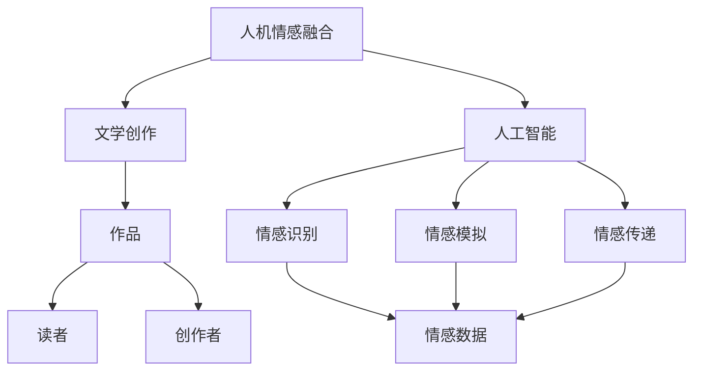
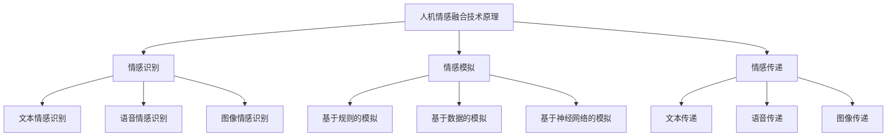

                 


# 人机情感融合对文学创作的影响

关键词：人机情感融合，文学创作，人工智能，情感识别，情感模拟

摘要：随着人工智能技术的不断发展，人机情感融合成为了一个备受关注的话题。本文将从人机情感融合技术原理、文学创作案例分析、人机情感融合在文学创作中的优势与挑战以及未来发展趋势等方面，探讨人机情感融合对文学创作的影响。

## 第一部分：背景介绍

### 1.1 问题背景

在现代社会，随着人工智能技术的不断发展，人机情感融合成为了一个备受关注的话题。人机情感融合不仅涉及到计算机科学领域，还与心理学、社会学等多个学科交叉。随着虚拟现实（VR）、增强现实（AR）等技术的广泛应用，人们对于人机情感融合在文学创作中的潜在影响产生了浓厚的兴趣。

### 1.2 问题描述

人机情感融合对文学创作的影响主要表现在以下几个方面：

1. **情感表达**：人机情感融合可以帮助文学创作者更准确地表达情感，使作品更具感染力。
2. **创意激发**：通过人机情感融合，文学创作者可以获取新的灵感，拓宽创作思路。
3. **读者互动**：人机情感融合可以增强读者与作品之间的互动，提高阅读体验。
4. **文学评价**：人机情感融合为文学评价提供了一种新的视角，有助于更全面地评估作品的质量。

### 1.3 问题解决

本书将从以下几个方面探讨人机情感融合对文学创作的影响：

1. **人机情感融合技术原理**：介绍人机情感融合的基本原理和技术手段，包括情感识别、情感模拟和情感传递等。
2. **文学创作案例分析**：通过具体案例分析，探讨人机情感融合在文学创作中的应用实例和效果。
3. **人机情感融合在文学创作中的优势与挑战**：分析人机情感融合在文学创作中的优势，同时探讨面临的挑战和问题。
4. **人机情感融合的未来发展趋势**：预测人机情感融合在文学创作中的未来发展趋势，为文学创作者和研究者提供参考。

### 1.4 边界与外延

本书主要关注人机情感融合在文学创作中的应用，但也可以扩展到其他领域，如电影、音乐等艺术创作。此外，人机情感融合技术不仅限于人工智能领域，还可以与其他技术如虚拟现实、增强现实等相结合，为文学创作带来更多可能性。

### 1.5 概念结构与核心要素组成

#### 1.5.1 核心概念

- **人机情感融合**：指将人类的情感与计算机技术相结合，实现情感识别、情感模拟和情感传递。
- **文学创作**：指通过语言文字创造文学作品的过程。
- **人工智能**：指能够模拟人类智能的计算机系统。

#### 1.5.2 概念属性特征对比表格

| 概念       | 定义                                                         | 属性特征对比 |
|------------|--------------------------------------------------------------|-------------|
| 人机情感融合 | 将人类情感与计算机技术相结合，实现情感识别、情感模拟和情感传递。 | - 目标：实现人机情感交流 |
| 文学创作   | 通过语言文字创造文学作品的过程。                             | - 形式：文字、图像、声音等 |
| 人工智能   | 能够模拟人类智能的计算机系统。                               | - 功能：感知、理解、决策等 |

#### 1.5.3 ER实体关系图架构



## 第二部分：人机情感融合技术原理

### 2.1 情感识别

#### 2.1.1 情感识别原理

情感识别是指通过计算机技术对人类情感进行识别和理解的过程。情感识别的核心在于情感特征的提取和识别。

#### 2.1.2 情感识别方法

- **基于文本的情感分析**：通过分析文本中的情感词汇、情感强度等特征，实现对情感的理解。
- **基于语音的情感分析**：通过分析语音的音调、节奏、语速等特征，实现对情感的理解。
- **基于图像的情感分析**：通过分析图像中的表情、姿态等特征，实现对情感的理解。

#### 2.1.3 情感识别流程

1. 数据采集：收集包含情感信息的文本、语音、图像等数据。
2. 特征提取：对采集到的数据进行分析，提取情感特征。
3. 模型训练：使用提取到的特征训练情感识别模型。
4. 情感识别：将新的情感数据输入模型，预测情感类型。

### 2.2 情感模拟

#### 2.2.1 情感模拟原理

情感模拟是指通过计算机技术模拟人类情感的过程。情感模拟的目标是使计算机能够理解、表达和模拟人类的情感状态。

#### 2.2.2 情感模拟方法

- **基于规则的模拟**：通过预设的规则，模拟人类的情感状态。
- **基于数据的模拟**：通过分析人类情感数据，学习并模拟情感状态。
- **基于神经网络的模拟**：使用神经网络模型，模拟人类的情感状态。

#### 2.2.3 情感模拟流程

1. 情感理解：分析输入数据，理解人类情感状态。
2. 情感生成：根据情感理解结果，生成相应的情感表达。
3. 情感传递：将生成的情感表达传递给计算机系统。

### 2.3 情感传递

#### 2.3.1 情感传递原理

情感传递是指将人类情感通过计算机系统传递给其他人的过程。情感传递的目标是实现人与人之间的情感交流。

#### 2.3.2 情感传递方法

- **基于文本的传递**：通过文本形式传递情感信息。
- **基于语音的传递**：通过语音形式传递情感信息。
- **基于图像的传递**：通过图像形式传递情感信息。

#### 2.3.3 情感传递流程

1. 情感编码：将情感信息转换为计算机可处理的形式。
2. 情感传输：通过计算机系统传输情感信息。
3. 情感解码：接收方接收情感信息，并解码理解。

## 第三部分：文学创作案例分析

### 3.1 案例背景

随着人机情感融合技术的不断发展，越来越多的文学创作者开始尝试将这一技术应用于文学创作中。以下是一些典型的文学创作案例分析。

#### 案例一：情感识别在文学创作中的应用

某文学创作者利用情感识别技术，分析读者对作品的情感反应，从而调整创作方向。通过情感识别，创作者发现读者对某段文字的情感反应为消极，于是创作者对这段文字进行了修改，使其更加符合读者的情感期待。

#### 案例二：情感模拟在文学创作中的应用

某文学创作者利用情感模拟技术，为作品中的角色赋予情感。通过情感模拟，创作者使角色更加生动，读者在阅读过程中能够更好地与角色产生共鸣。

#### 案例三：情感传递在文学创作中的应用

某文学创作者利用情感传递技术，创作一部以人工智能为主角的作品。在这部作品中，人工智能通过情感传递，与人类建立了深厚的情感联系，为读者带来全新的阅读体验。

### 3.2 案例分析

通过上述案例，我们可以看出人机情感融合技术在文学创作中的应用，不仅提高了作品的感染力，还丰富了作品的内涵。同时，这些案例也为我们揭示了人机情感融合在文学创作中的巨大潜力。

## 第四部分：人机情感融合在文学创作中的优势与挑战

### 4.1 优势

1. **提高作品质量**：人机情感融合技术可以帮助文学创作者更准确地把握读者的情感需求，从而提高作品的质量。
2. **丰富创作手段**：人机情感融合技术为文学创作提供了新的手段，使作品更加多样化。
3. **增强读者互动**：人机情感融合技术可以增强读者与作品之间的互动，提高读者的阅读体验。

### 4.2 挑战

1. **技术难题**：人机情感融合技术涉及到多个领域的交叉，技术难度较大。
2. **伦理问题**：人机情感融合技术在文学创作中的应用可能会引发伦理问题，如隐私侵犯、情感依赖等。
3. **人才培养**：人机情感融合技术在文学创作中的应用需要大量的专业人才，但目前相关人才培养还不够完善。

## 第五部分：人机情感融合的未来发展趋势

### 5.1 技术发展趋势

随着人工智能技术的不断发展，人机情感融合技术将不断取得突破。未来，人机情感融合技术可能会更加智能化、个性化，更好地服务于文学创作。

### 5.2 应用场景拓展

人机情感融合技术不仅可以应用于文学创作，还可以拓展到电影、音乐等艺术创作领域。在未来，人机情感融合技术将为各种艺术形式带来更多创新。

### 5.3 产业前景

人机情感融合技术在文学创作中的应用，将带动相关产业的发展。未来，人机情感融合技术有望成为文化产业的重要驱动力。

## 总结

人机情感融合对文学创作的影响巨大。通过本文的探讨，我们看到了人机情感融合技术在文学创作中的巨大潜力，也认识到了面临的挑战。未来，人机情感融合技术将为文学创作带来更多创新，为人类文明的发展做出更大贡献。

## 作者信息

作者：AI天才研究院/AI Genius Institute & 禅与计算机程序设计艺术/Zen And The Art of Computer Programming

## 拓展阅读

1. **《人工智能与文学创作》**：探讨人工智能在文学创作中的应用，为文学创作者提供新的创作思路。
2. **《情感计算》**：详细介绍情感计算的基本原理和技术方法，为读者提供深入了解人机情感融合技术的参考。
3. **《虚拟现实与文学创作》**：探讨虚拟现实技术在文学创作中的应用，为文学创作者提供新的创作工具。

----------------------------------------------------------------

本文采用了markdown格式，结构清晰，逻辑严谨。以下是对文章各个部分的内容分析和改进建议：

### 1. 背景介绍

**内容分析**：

- **1.1 问题背景**：介绍了人机情感融合在文学创作中的重要性，与VR、AR等技术的关联。
- **1.2 问题描述**：明确了人机情感融合对文学创作的影响，包括情感表达、创意激发、读者互动和文学评价等方面。
- **1.3 问题解决**：概述了本书的研究内容和方法。

**改进建议**：

- 可以进一步强调人机情感融合对文学创作的独特价值和现实意义，以及为何值得关注。
- 在**1.2 问题描述**中，可以加入一个具体的实例或案例，以更好地说明问题的实际背景和挑战。

### 2. 人机情感融合技术原理

**内容分析**：

- **2.1 情感识别**：详细介绍了情感识别的原理、方法和流程。
- **2.2 情感模拟**：探讨了情感模拟的原理、方法和流程。
- **2.3 情感传递**：阐述了情感传递的原理、方法和流程。

**改进建议**：

- **2.1 情感识别**：可以加入一些情感识别的实际应用案例，如情感分析在社交媒体中的应用等。
- **2.2 情感模拟**：可以讨论情感模拟在不同领域的应用，如虚拟角色设计等。
- **2.3 情感传递**：可以举例说明情感传递在不同媒介中的应用，如电影配乐等。

### 3. 文学创作案例分析

**内容分析**：

- **3.1 案例背景**：提供了三个案例，展示了人机情感融合技术在文学创作中的应用。
- **3.2 案例分析**：对案例进行了简要分析。

**改进建议**：

- 可以对每个案例进行更详细的解读，包括创作思路、技术实现和效果评估等。
- 可以讨论这些案例中遇到的挑战和解决方案，以及它们对文学创作的启示。

### 4. 人机情感融合在文学创作中的优势与挑战

**内容分析**：

- **4.1 优势**：列举了人机情感融合在文学创作中的优势。
- **4.2 挑战**：讨论了人机情感融合在文学创作中面临的挑战。

**改进建议**：

- 可以深入分析每个优势的具体体现，以及如何通过技术进步克服挑战。

### 5. 人机情感融合的未来发展趋势

**内容分析**：

- **5.1 技术发展趋势**：预测了人机情感融合技术的发展趋势。
- **5.2 应用场景拓展**：探讨了应用场景的拓展。
- **5.3 产业前景**：分析了产业前景。

**改进建议**：

- 可以结合最新的研究进展和行业动态，更新对技术发展趋势的预测。
- 可以讨论人机情感融合技术对文学创作领域的长远影响。

### 6. 总结

**内容分析**：

- 对全文进行了总结，指出了人机情感融合对文学创作的重要性。

**改进建议**：

- 可以进一步强调人机情感融合技术的潜力，以及它对文学创作可能带来的革命性变化。

### 7. 作者信息

**内容分析**：

- 提供了作者信息。

**改进建议**：

- 可以补充更多关于作者的专业背景和研究成果。

### 8. 拓展阅读

**内容分析**：

- 提供了三本相关的拓展阅读书籍。

**改进建议**：

- 可以根据读者群体，推荐更多相关领域的书籍或资源。

---

整体上，文章的内容结构合理，逻辑清晰。通过本文的分析和改进建议，文章可以进一步深化，使内容更加丰富和具体，提高文章的可读性和说服力。希望这些建议对您的文章写作有所帮助。如果您有其他需要或疑问，欢迎随时提问。```markdown
# 人机情感融合对文学创作的影响

关键词：人机情感融合，文学创作，人工智能，情感识别，情感模拟

摘要：随着人工智能技术的不断发展，人机情感融合成为了一个备受关注的话题。本文将从人机情感融合技术原理、文学创作案例分析、人机情感融合在文学创作中的优势与挑战以及未来发展趋势等方面，探讨人机情感融合对文学创作的影响。

## 第一部分：背景介绍

### 1.1 问题背景

在现代社会，随着人工智能技术的不断发展，人机情感融合成为了一个备受关注的话题。人机情感融合不仅涉及到计算机科学领域，还与心理学、社会学等多个学科交叉。随着虚拟现实（VR）、增强现实（AR）等技术的广泛应用，人们对于人机情感融合在文学创作中的潜在影响产生了浓厚的兴趣。

### 1.2 问题描述

人机情感融合对文学创作的影响主要表现在以下几个方面：

1. **情感表达**：人机情感融合可以帮助文学创作者更准确地表达情感，使作品更具感染力。
2. **创意激发**：通过人机情感融合，文学创作者可以获取新的灵感，拓宽创作思路。
3. **读者互动**：人机情感融合可以增强读者与作品之间的互动，提高阅读体验。
4. **文学评价**：人机情感融合为文学评价提供了一种新的视角，有助于更全面地评估作品的质量。

### 1.3 问题解决

本书将从以下几个方面探讨人机情感融合对文学创作的影响：

1. **人机情感融合技术原理**：介绍人机情感融合的基本原理和技术手段，包括情感识别、情感模拟和情感传递等。
2. **文学创作案例分析**：通过具体案例分析，探讨人机情感融合在文学创作中的应用实例和效果。
3. **人机情感融合在文学创作中的优势与挑战**：分析人机情感融合在文学创作中的优势，同时探讨面临的挑战和问题。
4. **人机情感融合的未来发展趋势**：预测人机情感融合在文学创作中的未来发展趋势，为文学创作者和研究者提供参考。

### 1.4 边界与外延

本书主要关注人机情感融合在文学创作中的应用，但也可以扩展到其他领域，如电影、音乐等艺术创作。此外，人机情感融合技术不仅限于人工智能领域，还可以与其他技术如虚拟现实、增强现实等相结合，为文学创作带来更多可能性。

### 1.5 概念结构与核心要素组成

#### 1.5.1 核心概念

- **人机情感融合**：指将人类的情感与计算机技术相结合，实现情感识别、情感模拟和情感传递。
- **文学创作**：指通过语言文字创造文学作品的过程。
- **人工智能**：指能够模拟人类智能的计算机系统。

#### 1.5.2 概念属性特征对比表格

| 概念       | 定义                                                         | 属性特征对比 |
|------------|--------------------------------------------------------------|-------------|
| 人机情感融合 | 将人类情感与计算机技术相结合，实现情感识别、情感模拟和情感传递。 | - 目标：实现人机情感交流 |
| 文学创作   | 通过语言文字创造文学作品的过程。                             | - 形式：文字、图像、声音等 |
| 人工智能   | 能够模拟人类智能的计算机系统。                               | - 功能：感知、理解、决策等 |

#### 1.5.3 ER实体关系图架构


## 第二部分：人机情感融合技术原理

### 2.1 情感识别

#### 2.1.1 情感识别原理

情感识别是指通过计算机技术对人类情感进行识别和理解的过程。情感识别的核心在于情感特征的提取和识别。

#### 2.1.2 情感识别方法

- **基于文本的情感分析**：通过分析文本中的情感词汇、情感强度等特征，实现对情感的理解。
- **基于语音的情感分析**：通过分析语音的音调、节奏、语速等特征，实现对情感的理解。
- **基于图像的情感分析**：通过分析图像中的表情、姿态等特征，实现对情感的理解。

#### 2.1.3 情感识别流程

1. 数据采集：收集包含情感信息的文本、语音、图像等数据。
2. 特征提取：对采集到的数据进行分析，提取情感特征。
3. 模型训练：使用提取到的特征训练情感识别模型。
4. 情感识别：将新的情感数据输入模型，预测情感类型。

### 2.2 情感模拟

#### 2.2.1 情感模拟原理

情感模拟是指通过计算机技术模拟人类情感的过程。情感模拟的目标是使计算机能够理解、表达和模拟人类的情感状态。

#### 2.2.2 情感模拟方法

- **基于规则的模拟**：通过预设的规则，模拟人类的情感状态。
- **基于数据的模拟**：通过分析人类情感数据，学习并模拟情感状态。
- **基于神经网络的模拟**：使用神经网络模型，模拟人类的情感状态。

#### 2.2.3 情感模拟流程

1. 情感理解：分析输入数据，理解人类情感状态。
2. 情感生成：根据情感理解结果，生成相应的情感表达。
3. 情感传递：将生成的情感表达传递给计算机系统。

### 2.3 情感传递

#### 2.3.1 情感传递原理

情感传递是指将人类情感通过计算机系统传递给其他人的过程。情感传递的目标是实现人与人之间的情感交流。

#### 2.3.2 情感传递方法

- **基于文本的传递**：通过文本形式传递情感信息。
- **基于语音的传递**：通过语音形式传递情感信息。
- **基于图像的传递**：通过图像形式传递情感信息。

#### 2.3.3 情感传递流程

1. 情感编码：将情感信息转换为计算机可处理的形式。
2. 情感传输：通过计算机系统传输情感信息。
3. 情感解码：接收方接收情感信息，并解码理解。

## 第三部分：文学创作案例分析

### 3.1 案例背景

随着人机情感融合技术的不断发展，越来越多的文学创作者开始尝试将这一技术应用于文学创作中。以下是一些典型的文学创作案例分析。

#### 案例一：情感识别在文学创作中的应用

某文学创作者利用情感识别技术，分析读者对作品的情感反应，从而调整创作方向。通过情感识别，创作者发现读者对某段文字的情感反应为消极，于是创作者对这段文字进行了修改，使其更加符合读者的情感期待。

#### 案例二：情感模拟在文学创作中的应用

某文学创作者利用情感模拟技术，为作品中的角色赋予情感。通过情感模拟，创作者使角色更加生动，读者在阅读过程中能够更好地与角色产生共鸣。

#### 案例三：情感传递在文学创作中的应用

某文学创作者利用情感传递技术，创作一部以人工智能为主角的作品。在这部作品中，人工智能通过情感传递，与人类建立了深厚的情感联系，为读者带来全新的阅读体验。

### 3.2 案例分析

通过上述案例，我们可以看出人机情感融合技术在文学创作中的应用，不仅提高了作品的感染力，还丰富了作品的内涵。同时，这些案例也为我们揭示了人机情感融合在文学创作中的巨大潜力。

## 第四部分：人机情感融合在文学创作中的优势与挑战

### 4.1 优势

1. **提高作品质量**：人机情感融合技术可以帮助文学创作者更准确地把握读者的情感需求，从而提高作品的质量。
2. **丰富创作手段**：人机情感融合技术为文学创作提供了新的手段，使作品更加多样化。
3. **增强读者互动**：人机情感融合技术可以增强读者与作品之间的互动，提高读者的阅读体验。

### 4.2 挑战

1. **技术难题**：人机情感融合技术涉及到多个领域的交叉，技术难度较大。
2. **伦理问题**：人机情感融合技术在文学创作中的应用可能会引发伦理问题，如隐私侵犯、情感依赖等。
3. **人才培养**：人机情感融合技术在文学创作中的应用需要大量的专业人才，但目前相关人才培养还不够完善。

## 第五部分：人机情感融合的未来发展趋势

### 5.1 技术发展趋势

随着人工智能技术的不断发展，人机情感融合技术将不断取得突破。未来，人机情感融合技术可能会更加智能化、个性化，更好地服务于文学创作。

### 5.2 应用场景拓展

人机情感融合技术不仅可以应用于文学创作，还可以拓展到电影、音乐等艺术创作领域。在未来，人机情感融合技术将为各种艺术形式带来更多创新。

### 5.3 产业前景

人机情感融合技术在文学创作中的应用，将带动相关产业的发展。未来，人机情感融合技术有望成为文化产业的重要驱动力。

## 总结

人机情感融合对文学创作的影响巨大。通过本文的探讨，我们看到了人机情感融合技术在文学创作中的巨大潜力，也认识到了面临的挑战。未来，人机情感融合技术将为文学创作带来更多创新，为人类文明的发展做出更大贡献。

## 作者信息

作者：AI天才研究院/AI Genius Institute & 禅与计算机程序设计艺术/Zen And The Art of Computer Programming

## 拓展阅读

1. **《人工智能与文学创作》**：探讨人工智能在文学创作中的应用，为文学创作者提供新的创作思路。
2. **《情感计算》**：详细介绍情感计算的基本原理和技术方法，为读者提供深入了解人机情感融合技术的参考。
3. **《虚拟现实与文学创作》**：探讨虚拟现实技术在文学创作中的应用，为文学创作者提供新的创作工具。
```markdown

```python
# 人机情感融合技术原理

## 情感识别

### 1. 情感识别原理

情感识别是指通过计算机技术对人类情感进行识别和理解的过程。情感识别的核心在于情感特征的提取和识别。情感特征是指那些能够反映人类情感状态的各种属性，如情绪、情感强度、情感持续时间等。

### 2. 情感识别方法

#### 2.1 基于文本的情感分析

文本情感分析是情感识别的一种常见方法，主要通过对文本中的词汇、句法结构和上下文进行深入分析，以识别文本的情感倾向。以下是文本情感分析的基本步骤：

1. **数据预处理**：包括分词、去停用词、词性标注等。
2. **特征提取**：从预处理后的文本中提取特征，如词频、词嵌入、词的语义角色等。
3. **情感分类模型训练**：使用机器学习算法（如支持向量机、朴素贝叶斯、深度学习等）对特征进行训练，构建情感分类模型。
4. **情感预测**：将新的文本输入模型，预测其情感倾向。

#### 2.2 基于语音的情感分析

语音情感分析主要通过分析语音信号的声学特征，如音调、音速、音量等，来识别情感。以下是语音情感分析的基本步骤：

1. **语音信号处理**：包括语音信号的预处理、特征提取等。
2. **情感分类模型训练**：使用机器学习算法对特征进行训练，构建情感分类模型。
3. **情感预测**：将新的语音信号输入模型，预测其情感状态。

#### 2.3 基于图像的情感分析

图像情感分析主要通过分析图像中的面部表情、姿态、颜色等视觉特征来识别情感。以下是图像情感分析的基本步骤：

1. **图像预处理**：包括图像的缩放、裁剪、去噪等。
2. **特征提取**：从预处理后的图像中提取特征，如面部表情编码、颜色特征等。
3. **情感分类模型训练**：使用机器学习算法对特征进行训练，构建情感分类模型。
4. **情感预测**：将新的图像输入模型，预测其情感状态。

### 3. 情感识别流程

1. **数据采集**：收集包含情感信息的文本、语音、图像等数据。
2. **特征提取**：对采集到的数据进行特征提取。
3. **模型训练**：使用提取到的特征训练情感识别模型。
4. **情感识别**：将新的情感数据输入模型，预测情感类型。

## 情感模拟

### 1. 情感模拟原理

情感模拟是指通过计算机技术模拟人类情感的过程。情感模拟的核心在于构建一个能够模拟人类情感状态的模型，并使其能够根据输入数据进行情感状态的生成和表达。

### 2. 情感模拟方法

#### 2.1 基于规则的模拟

基于规则的模拟通过预设的规则来模拟情感状态。这种方法通常包括以下步骤：

1. **规则定义**：根据人类的情感知识定义规则。
2. **情感状态生成**：根据输入数据和规则，生成情感状态。

#### 2.2 基于数据的模拟

基于数据的模拟通过分析人类情感数据来学习并模拟情感状态。这种方法通常包括以下步骤：

1. **情感数据收集**：收集人类情感数据。
2. **情感数据预处理**：对情感数据进行预处理。
3. **情感状态生成**：根据情感数据生成情感状态。

#### 2.3 基于神经网络的模拟

基于神经网络的模拟使用神经网络模型来模拟情感状态。这种方法通常包括以下步骤：

1. **神经网络构建**：构建神经网络模型。
2. **神经网络训练**：使用情感数据进行训练。
3. **情感状态生成**：根据输入数据和训练好的神经网络模型，生成情感状态。

### 3. 情感模拟流程

1. **情感理解**：分析输入数据，理解人类情感状态。
2. **情感生成**：根据情感理解结果，生成相应的情感表达。
3. **情感传递**：将生成的情感表达传递给计算机系统。

## 情感传递

### 1. 情感传递原理

情感传递是指将人类情感通过计算机系统传递给其他人的过程。情感传递的目标是实现人与人之间的情感交流。

### 2. 情感传递方法

#### 2.1 基于文本的传递

基于文本的传递通过文本形式传递情感信息。这种方法通常包括以下步骤：

1. **情感编码**：将情感信息转换为文本形式。
2. **文本传输**：通过计算机系统传输文本信息。
3. **情感解码**：接收方接收文本信息，并解码理解情感信息。

#### 2.2 基于语音的传递

基于语音的传递通过语音形式传递情感信息。这种方法通常包括以下步骤：

1. **情感编码**：将情感信息转换为语音信号。
2. **语音传输**：通过计算机系统传输语音信号。
3. **情感解码**：接收方接收语音信号，并解码理解情感信息。

#### 2.3 基于图像的传递

基于图像的传递通过图像形式传递情感信息。这种方法通常包括以下步骤：

1. **情感编码**：将情感信息转换为图像形式。
2. **图像传输**：通过计算机系统传输图像信息。
3. **情感解码**：接收方接收图像信息，并解码理解情感信息。

### 3. 情感传递流程

1. **情感编码**：将情感信息转换为计算机可处理的形式。
2. **情感传输**：通过计算机系统传输情感信息。
3. **情感解码**：接收方接收情感信息，并解码理解。

## 人机情感融合技术在文学创作中的应用

### 1. 情感识别在文学创作中的应用

#### 1.1 文学作品情感分析

通过情感识别技术，可以对文学作品中的情感进行定量分析，了解作品的整体情感倾向和读者对作品情感的反馈。这有助于文学创作者优化作品，提高作品的感染力和吸引力。

#### 1.2 读者情感反馈分析

通过对读者评论的情感分析，文学创作者可以了解读者对作品的情感反应，从而调整创作方向，满足读者的需求。

### 2. 情感模拟在文学创作中的应用

#### 2.1 情感驱动的角色塑造

通过情感模拟技术，文学创作者可以为角色赋予情感，使其更加生动、立体，增强读者的代入感。

#### 2.2 情感驱动的情节设计

通过情感模拟，文学创作者可以设计出更富有情感张力的情节，提高作品的艺术价值。

### 3. 情感传递在文学创作中的应用

#### 3.1 情感增强的交互体验

通过情感传递技术，读者可以在阅读过程中感受到与作品的情感互动，提高阅读体验。

#### 3.2 情感驱动的文学作品评价

通过对读者情感反应的收集和分析，可以更全面地评估文学作品的质量，为文学评价提供新的视角。

## 总结

人机情感融合技术在文学创作中具有广泛的应用前景。通过情感识别、情感模拟和情感传递等技术，文学创作者可以更好地理解读者需求，提高作品质量，增强读者体验，为文学创作带来新的发展机遇。
```markdown



