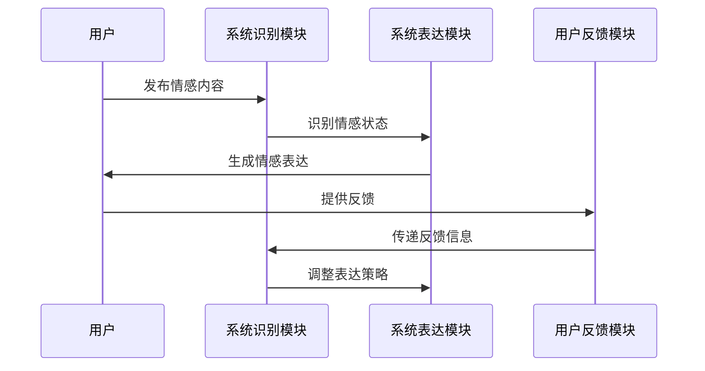

                 

### 第1章：引言

#### 1.1 人机情感融合的概念与背景

**关键词：** 人机情感融合，社交媒体，情感识别，情感表达

**摘要：** 本文主要探讨人机情感融合在社交媒体领域的应用，分析其概念、背景及其带来的革新影响。

---

在信息爆炸的今天，社交媒体已成为人们日常生活中不可或缺的一部分。无论是个人用户还是企业，都在社交媒体上寻找与表达情感，进行社交互动。然而，随着人工智能技术的快速发展，人机情感融合逐渐成为可能，并开始对社交媒体产生深远影响。

**定义：** 人机情感融合是指通过人工智能技术，使机器具备识别、理解和表达情感的能力，从而实现与人类用户更加自然、富有情感的互动。

**背景：** 社交媒体中，情感是用户互动的核心。人们通过文字、图片、视频等方式表达自己的情感，与他人建立联系。然而，传统的社交媒体平台往往缺乏对情感的深入理解，导致用户交互体验有限。

**问题：** 如何通过人工智能技术，实现人机情感融合，提升社交媒体的用户体验？

**解决方法：** 利用情感识别技术，让机器理解用户的情感表达；通过情感表达技术，让机器能够以更自然、富有情感的方式与用户互动。这不仅能够提升用户满意度，还能为企业带来更多的商业价值。

#### 1.2 人类情感与社交媒体的关系

**关键词：** 人类情感，社交媒体，情感表达，社交互动

**摘要：** 本文将从人类情感在社会互动中的作用和社交媒体中的情感表达两个方面，探讨人机情感融合的必要性。

---

**人类情感在社会互动中的作用：**

1. **情感表达：** 情感是人类表达自己内心感受的重要方式，能够帮助人们建立信任、增进理解和促进合作。
2. **情感共鸣：** 通过情感共鸣，人们能够更好地理解他人的情感，增进彼此的社交关系。
3. **情感调节：** 情感调节有助于人们应对压力、化解冲突，维护社交和谐。

**社交媒体中的情感表达：**

1. **文字、图片、视频：** 社交媒体提供了丰富的表达形式，让人们能够更直观地传达自己的情感。
2. **情感标签：** 通过使用情感标签，用户可以更方便地表达和分类自己的情感。
3. **情感互动：** 社交媒体平台上的情感互动，促进了用户之间的交流和互动。

#### 1.3 人机情感融合的兴起

**关键词：** 人工智能，情感识别，情感表达，需求驱动

**摘要：** 本文将分析人工智能技术发展与需求驱动下，人机情感融合的兴起及其带来的挑战。

---

**技术发展：** 随着人工智能技术的快速发展，机器学习、自然语言处理、计算机视觉等技术的进步，为人机情感融合提供了技术支持。

**需求驱动：** 随着社交媒体的普及，用户对更自然、更富有情感的互动体验需求日益增长，推动了人机情感融合的发展。

**关键挑战：**

1. **情感识别精度：** 如何准确识别用户情感，是人机情感融合的关键挑战之一。
2. **情感理解深度：** 机器如何理解用户的情感，以及如何基于情感进行有效的推理和决策。
3. **情感表达自然度：** 如何让机器的情感表达更加自然、富有情感，提升用户体验。

**未来展望：** 随着技术的不断进步，人机情感融合有望在社交媒体领域带来更多创新和变革。

#### 1.4 本书结构与内容安排

**关键词：** 目录结构，主要内容，目标读者

**摘要：** 本文将介绍本书的目录结构、主要内容以及目标读者，帮助读者更好地理解人机情感融合的相关知识。

---

**目录结构：**

本书共分为五个部分，包括引言、核心技术原理、社交媒体情感分析与应用、情感融合与交互设计、人机情感融合的系统架构设计等内容。

**主要内容：**

1. **情感识别与表达技术：** 介绍情感识别和情感表达的相关技术原理。
2. **社交媒体情感分析：** 探讨情感分析在社交媒体中的应用。
3. **情感融合与交互设计：** 分析情感融合在交互设计中的应用。
4. **系统架构设计：** 介绍人机情感融合系统的架构设计。
5. **项目实战：** 通过具体项目实践，讲解人机情感融合的实现方法。

**目标读者：**

本书面向对人工智能、情感计算、社交媒体等领域感兴趣的读者，包括研究人员、开发人员、学生等。

---

通过本文的引言部分，我们对人机情感融合的概念、背景及其在社交媒体领域的应用有了初步的了解。接下来，我们将深入探讨人机情感融合的核心技术原理，为后续内容打下坚实基础。在接下来的章节中，我们将一步步分析推理，逐步揭示人机情感融合的奥秘。

### 第二部分：核心技术原理

#### 第2章：情感识别与表达技术

**关键词：** 情感识别，情感表达，文本分析，语音处理，图像分析

**摘要：** 本章将介绍情感识别与表达技术的基本概念、技术手段及其在社交媒体中的应用。

---

在探讨人机情感融合之前，我们需要了解情感识别与表达技术的基本原理。情感识别技术用于从文本、语音和图像中提取情感信息，而情感表达技术则用于在机器与人交互中传达情感。本章将分别介绍这些技术，并探讨其在社交媒体中的应用。

#### 2.1 情感识别技术

**关键词：** 情感识别，文本分析，语音处理，图像分析

**摘要：** 本节将介绍情感识别技术的基本概念，以及其在文本、语音和图像分析中的应用。

---

**2.1.1 情感识别的基本概念**

情感识别是指利用计算机技术和算法，从文本、语音和图像中提取情感信息的过程。情感识别技术不仅涉及自然语言处理、语音识别和计算机视觉等领域，还需要对情感知识、情感语言特征等进行深入研究和理解。

**2.1.2 情感识别的技术手段**

**基于文本的情感分析：** 
文本情感分析是情感识别中最常见的一种形式。它通过分析文本中的词汇、语法和语义特征，判断文本的情感倾向。常见的文本情感分析方法包括：

- **基于规则的方法：** 利用情感词典和规则库，对文本进行情感分类。例如，通过建立负面词汇和正面词汇的列表，对文本进行情感倾向判断。
- **基于统计的方法：** 利用机器学习算法，如支持向量机（SVM）、朴素贝叶斯（NB）等，对文本进行情感分类。这类方法通常需要大量标注数据进行训练。

**基于语音的情感分析：**
语音情感分析通过对语音信号的处理和分析，提取情感特征，进而判断说话者的情感状态。常见的语音情感分析方法包括：

- **声学特征提取：** 如音高（pitch）、音强（intensity）、时长（duration）等。
- **语音识别：** 利用深度学习技术，如卷积神经网络（CNN）和循环神经网络（RNN），对语音信号进行识别和情感分类。

**基于图像的情感分析：**
图像情感分析通过分析图像中的面部表情、颜色、构图等元素，判断图像所传达的情感状态。常见的图像情感分析方法包括：

- **面部表情识别：** 利用计算机视觉技术，如卷积神经网络（CNN），对图像中的面部表情进行分析和分类。
- **图像内容分析：** 如颜色分析、构图分析等，从图像的视觉元素中提取情感特征。

**2.1.3 情感识别技术在社交媒体中的应用**

**情感分析在社交媒体内容分类中的应用：**
通过情感识别技术，可以对社交媒体上的内容进行分类，例如，将评论分为正面、负面或中性。这种分类有助于平台更好地了解用户反馈，优化内容推荐。

**情感分析在用户情感状态识别中的应用：**
通过分析用户在社交媒体上的文字、语音和图像，识别用户的情感状态，有助于平台提供更个性化的服务。例如，识别用户是否处于愤怒、悲伤或愉悦状态，从而调整推送内容。

**2.2 情感表达技术**

**关键词：** 人机交互，情感表达，语音合成，视觉交互

**摘要：** 本节将介绍情感表达技术在人机交互中的应用，包括语音合成和视觉交互中的情感表达。

---

**2.2.1 人机交互中的情感表达**

在人与机器的交互过程中，情感表达能够增强互动的自然性和亲切感。情感表达技术主要包括语音合成和视觉交互中的情感表达。

**语音合成中的情感表达：**
语音合成技术通过模拟人类语音，实现情感表达。常见的语音合成系统包括：

- **文本到语音（TTS）系统：** 通过将文本转换为语音，实现语音合成。这类系统通常利用合成语音库和语音合成算法，如循环神经网络（RNN）和生成对抗网络（GAN）。
- **情感语音合成：** 在语音合成过程中，通过调整音高、音强、时长等参数，实现情感表达。例如，增加音高变化、调整语速等，以模拟愉悦、愤怒等情感状态。

**视觉交互中的情感表达：**
视觉交互中的情感表达主要通过面部表情、手势和视觉元素等实现。例如：

- **面部表情：** 通过计算机视觉技术，如卷积神经网络（CNN），识别和模拟用户的面部表情，以表达情感。
- **手势交互：** 通过手势识别技术，实现手势与情感状态的对应。例如，手势上的摇晃、拍手等可以表达愉悦、兴奋等情感。
- **视觉元素：** 如颜色、图形等视觉元素，也可以用于情感表达。例如，使用鲜艳的颜色表达兴奋、使用柔和的颜色表达平静。

**2.3 情感融合的算法原理**

**关键词：** 情感融合，算法原理，情感建模，情感推理

**摘要：** 本节将介绍情感融合的定义、目标以及情感融合算法的基本原理。

---

**2.3.1 情感融合的定义与目标**

情感融合是指将情感识别技术和情感表达技术相结合，实现机器与人类用户之间的情感互动。情感融合的目标是使机器能够更好地理解人类情感，并在交互过程中以更自然、富有情感的方式回应用户。

**2.3.2 情感融合的关键技术**

**情感建模技术：**
情感建模是指利用机器学习算法，构建情感模型，用于情感识别和情感表达。常见的情感建模方法包括：

- **情感分类模型：** 利用分类算法，如支持向量机（SVM）、朴素贝叶斯（NB）等，对文本、语音和图像进行情感分类。
- **情感预测模型：** 利用时间序列分析、回归分析等方法，预测用户的情感状态。

**情感推理技术：**
情感推理是指利用情感模型和推理算法，对用户的情感状态进行分析和推理。常见的情感推理方法包括：

- **基于规则的推理：** 利用情感知识和规则库，对用户的情感状态进行推理。
- **基于概率的推理：** 利用概率模型，如贝叶斯网络等，对用户的情感状态进行推理。

**情感融合算法：**
情感融合算法是指将情感识别和情感表达技术相结合，实现情感互动的算法。常见的情感融合算法包括：

- **情感分类与情感表达融合：** 将情感分类模型和情感表达技术相结合，实现情感识别和情感表达。
- **多模态情感融合：** 将文本、语音和图像等多种情感数据进行融合，提高情感识别的准确性和情感表达的丰富性。

通过本章对情感识别与表达技术的介绍，我们对人机情感融合的核心技术原理有了初步的了解。在下一章中，我们将继续探讨情感融合算法原理及其在社交媒体情感分析中的应用。

#### 2.4 情感融合的数学模型与公式

**关键词：** 情感融合，数学模型，公式推导

**摘要：** 本章将介绍情感融合的数学模型，并推导相关公式，以帮助我们更好地理解情感融合的算法原理。

---

**2.4.1 情感融合的数学基础**

情感融合的数学模型主要基于概率论和线性代数。以下是一些基本的数学概念和公式。

**概率论：**
1. **条件概率：** \( P(A|B) = \frac{P(A \cap B)}{P(B)} \)
2. **贝叶斯定理：** \( P(A|B) = \frac{P(B|A)P(A)}{P(B)} \)

**线性代数：**
1. **矩阵乘法：** \( C = AB \)
2. **向量内积：** \( \vec{a} \cdot \vec{b} = a_1b_1 + a_2b_2 + \ldots + a_nb_n \)

**2.4.2 情感融合的公式推导**

**1. 情感识别模型：**

假设我们有一个情感识别模型，它使用特征向量 \( \vec{x} \) 来表示文本、语音或图像，并预测情感状态 \( y \)。情感识别模型的公式可以表示为：

\[ y = f(\vec{x}) \]

其中，\( f \) 是一个非线性函数，如卷积神经网络（CNN）或循环神经网络（RNN）。

**2. 情感融合模型：**

情感融合模型将多个情感识别模型的结果进行融合，以获得更准确的情感预测。一个简单的情感融合公式可以表示为：

\[ y_{\text{ fused}} = w_1y_1 + w_2y_2 + \ldots + w_ny_n \]

其中，\( y_1, y_2, \ldots, y_n \) 是多个情感识别模型的结果，\( w_1, w_2, \ldots, w_n \) 是融合权重。

**3. 情感表达模型：**

情感表达模型用于根据情感状态 \( y_{\text{ fused}} \) 生成相应的情感表达。一个简单的情感表达公式可以表示为：

\[ \vec{e} = g(y_{\text{ fused}}) \]

其中，\( g \) 是一个非线性函数，如语音合成器或视觉渲染器。

**2.4.3 情感融合的实例推导**

假设我们有两个情感识别模型 \( M_1 \) 和 \( M_2 \)，分别使用文本和语音数据进行情感识别。情感融合模型将这两个模型的结果进行融合，以获得更准确的情感预测。

**步骤 1：情感识别**

- \( y_1 = M_1(\vec{x}_{\text{ text}}) \)
- \( y_2 = M_2(\vec{x}_{\text{ voice}}) \)

**步骤 2：情感融合**

- \( y_{\text{ fused}} = w_1y_1 + w_2y_2 \)

**步骤 3：情感表达**

- \( \vec{e} = g(y_{\text{ fused}}) \)

通过以上步骤，我们得到了一个情感融合模型，它能够根据文本和语音数据生成相应的情感表达。

通过本章对情感融合的数学模型与公式推导，我们更好地理解了情感融合的算法原理。在下一章中，我们将进一步探讨情感融合在社交媒体情感分析中的应用。

#### 2.5 情感识别与表达技术在社交媒体情感分析中的应用

**关键词：** 社交媒体情感分析，情感识别技术，情感表达技术，应用案例

**摘要：** 本章将讨论情感识别与表达技术在社交媒体情感分析中的应用，通过具体案例展示其应用效果和潜在价值。

---

**2.5.1 社交媒体情感分析概述**

社交媒体情感分析是指利用情感识别和情感表达技术，对社交媒体上的文本、语音和图像进行分析，以识别用户的情感状态和情感倾向。这种分析有助于平台更好地了解用户需求，优化内容推荐，提高用户体验。

**2.5.2 情感识别技术在社交媒体情感分析中的应用**

情感识别技术是社交媒体情感分析的核心，通过分析用户的文字、语音和图像，可以识别用户的情感状态。以下是一些应用案例：

**案例 1：文本情感分析**

在社交媒体平台上，用户经常通过文字表达自己的情感。通过文本情感分析，平台可以识别用户的情感状态，从而进行个性化推荐。例如，某电商平台可以利用文本情感分析识别用户对产品的评论情感，从而推荐用户可能感兴趣的商品。

**案例 2：语音情感分析**

语音情感分析可以识别用户在语音聊天或电话中的情感状态。这在客服领域具有重要意义。例如，客服机器人可以通过语音情感分析识别用户的情绪，从而提供更个性化的服务，提高用户满意度。

**案例 3：图像情感分析**

图像情感分析可以识别用户在社交媒体上分享的图像所传达的情感。例如，某社交媒体平台可以利用图像情感分析识别用户上传的照片中的情感状态，从而推荐用户感兴趣的内容。

**2.5.3 情感表达技术在社交媒体情感分析中的应用**

情感表达技术用于在社交媒体平台上以自然、富有情感的方式与用户互动。以下是一些应用案例：

**案例 1：语音合成**

语音合成技术可以生成具有不同情感状态的语音，用于客服机器人、智能助手等应用。例如，客服机器人可以通过情感表达技术生成带有愉悦、悲伤等情感的语音，以更自然地与用户互动。

**案例 2：视觉交互**

视觉交互技术可以生成具有不同情感状态的视觉元素，用于社交媒体平台的互动设计。例如，某社交媒体平台可以利用视觉交互技术生成带有表情、动作的虚拟人物，以提升用户互动体验。

**2.5.4 应用效果与潜在价值**

情感识别与表达技术在社交媒体情感分析中的应用取得了显著效果。通过情感分析，平台可以更好地了解用户需求，优化内容推荐，提高用户体验。同时，情感表达技术可以提升人与机器的互动质量，增强用户满意度。

**潜在价值：**

1. **个性化推荐：** 通过情感分析，平台可以为用户提供更个性化的内容推荐，提高用户粘性。
2. **用户行为分析：** 通过情感分析，平台可以深入了解用户行为和情感状态，为产品优化和市场营销提供有力支持。
3. **情感化营销：** 通过情感表达技术，企业可以在社交媒体上进行更具情感化的营销活动，提高用户参与度和转化率。

通过本章的讨论，我们可以看到情感识别与表达技术在社交媒体情感分析中的应用及其潜在价值。在下一章中，我们将进一步探讨情感融合在交互设计中的应用。

### 第3章：情感融合与交互设计

#### 3.1 情感融合在交互设计中的应用

**关键词：** 情感融合，交互设计，用户体验，自然交互

**摘要：** 本章将探讨情感融合在交互设计中的应用，分析其如何提升用户体验和实现自然交互。

---

在数字时代，用户体验（UX）和用户交互（UI）设计的重要性日益凸显。情感融合技术为人机交互带来了新的机遇，使得机器能够更加自然、富有情感地与用户互动。本章将深入探讨情感融合在交互设计中的应用，分析其如何提升用户体验和实现自然交互。

#### 3.1.1 情感融合在虚拟助手中的应用

虚拟助手，如智能客服、虚拟导览、个人助理等，已成为现代数字生活中不可或缺的一部分。通过情感融合技术，虚拟助手能够更好地理解用户情感，提供更个性化的服务，从而提升用户体验。

**案例 1：智能客服**

在智能客服领域，情感融合技术可以帮助机器人识别用户的情感状态，如愤怒、沮丧或兴奋等。例如，当用户表达愤怒情绪时，机器人可以调整语调、语速和用词，以更温和、体贴的方式回应用户，从而缓解用户的情绪。

**案例 2：虚拟导览**

虚拟导览系统可以利用情感融合技术，根据用户的情感状态调整导览内容。例如，当用户表现出愉悦情感时，系统可以推荐更具趣味性的景点和活动；而当用户表现出悲伤情感时，系统可以提供更多的情感支持和关怀。

**案例 3：个人助理**

个人助理可以通过情感融合技术，识别用户的情感状态并为其提供相应的建议。例如，当用户表现出焦虑情感时，助理可以推荐放松的活动，如冥想或瑜伽，帮助用户缓解压力。

#### 3.1.2 情感融合在社交媒体互动中的应用

社交媒体平台上的互动是情感表达的重要场所。通过情感融合技术，平台可以提升用户互动体验，增强社交互动的情感深度。

**案例 1：情感化的内容推荐**

社交媒体平台可以利用情感融合技术，分析用户的情感状态，并据此提供个性化的内容推荐。例如，当用户表现出对某个话题的兴奋情感时，平台可以推荐更多相关内容，以激发用户的兴趣。

**案例 2：情感化的互动提醒**

社交媒体平台可以基于用户的情感状态，发送情感化的互动提醒。例如，当用户表现出孤独情感时，平台可以提醒用户参加线上活动，以帮助其缓解孤独感。

**案例 3：情感化的社区管理**

社区管理团队可以利用情感融合技术，识别和处理社区中的情感冲突。例如，当用户之间发生争吵时，平台可以基于情感分析提供调解建议，以维护社区和谐。

#### 3.1.3 情感融合在游戏互动中的应用

游戏是情感表达和互动的重要场景。通过情感融合技术，游戏可以提升玩家的情感体验，增强游戏的吸引力。

**案例 1：情感化的角色设计**

游戏设计师可以利用情感融合技术，设计出具有丰富情感表现的角色。例如，游戏中的角色可以根据玩家的情感状态，表现出不同的情感反应，从而增强玩家的代入感。

**案例 2：情感化的游戏剧情**

游戏剧情可以基于玩家的情感状态进行调整，以提升玩家的情感体验。例如，当玩家表现出悲伤情感时，游戏剧情可以引入更多悲伤的情节，以增强玩家的情感共鸣。

**案例 3：情感化的游戏互动**

游戏中的互动可以基于玩家的情感状态进行优化，以提升玩家的游戏体验。例如，当玩家表现出兴奋情感时，游戏可以增加难度，以激发玩家的挑战欲望；而当玩家表现出疲劳情感时，游戏可以降低难度，帮助玩家恢复精力。

#### 3.1.4 情感驱动的交互设计原则

为了实现情感融合在交互设计中的应用，需要遵循以下原则：

1. **情感感知：** 设计系统应能够识别和感知用户的情感状态，为个性化服务提供基础。
2. **情感适应：** 设计系统应根据用户的情感状态调整交互方式，以实现更自然的互动体验。
3. **情感共鸣：** 设计系统应能够引发用户的情感共鸣，增强用户对产品的情感连接。
4. **情感引导：** 设计系统应能够引导用户情感，帮助用户更好地应对情绪波动。

通过遵循这些原则，交互设计师可以创造出更具情感深度和人性化的交互体验。

综上所述，情感融合技术在交互设计中的应用具有巨大的潜力。通过情感感知、情感适应、情感共鸣和情感引导，设计师可以创造出更自然、更富有情感的交互体验，从而提升用户体验。在下一章中，我们将进一步探讨情感融合与人机情感融合系统架构设计的关系。

### 第4章：人机情感融合的系统架构设计

#### 4.1 人机情感融合系统的总体架构

**关键词：** 人机情感融合，系统架构，模块化设计，交互流程

**摘要：** 本章将介绍人机情感融合系统的总体架构，阐述其设计原则、组成模块以及系统交互流程。

---

在人机情感融合系统中，系统架构的设计至关重要。一个高效、可扩展的人机情感融合系统需要清晰的模块划分、合理的设计原则以及流畅的交互流程。本章将详细描述人机情感融合系统的总体架构，分析其设计原则和组成模块，并阐述系统的交互流程。

#### 4.1.1 系统架构设计的原则

**1. 模块化设计：** 系统架构应采用模块化设计，以便于系统的维护和扩展。每个模块应具有独立的功能，能够单独开发和测试。

**2. 可扩展性：** 系统架构应具有良好的可扩展性，能够支持新功能模块的添加和现有模块的升级。

**3. 高效性：** 系统架构应确保数据处理和交互的效率，以提供快速、准确的情感分析和服务。

**4. 可靠性：** 系统架构应具备高可靠性，确保在故障发生时能够迅速恢复，保证系统的正常运行。

**5. 可维护性：** 系统架构应易于维护和升级，降低维护成本和复杂性。

#### 4.1.2 系统架构的组成模块

人机情感融合系统通常由以下几个关键模块组成：

**1. 情感识别模块：** 负责从文本、语音和图像中提取情感信息，包括情感识别算法和情感数据库。

**2. 情感表达模块：** 负责将情感信息转换为用户可感知的形式，如语音合成、视觉渲染等。

**3. 情感融合模块：** 负责将多个情感识别模块的结果进行融合，以获得更准确的情感预测。

**4. 用户交互模块：** 负责处理用户输入，将情感表达模块的输出呈现给用户。

**5. 数据存储模块：** 负责存储和处理系统数据，包括用户信息、情感数据等。

**6. 系统管理模块：** 负责系统的监控、日志记录、故障处理等，确保系统的稳定运行。

#### 4.1.3 系统架构的交互流程

人机情感融合系统的交互流程可以分为以下几个阶段：

**1. 用户输入：** 用户通过文本、语音或图像与系统进行交互，表达自己的情感。

**2. 情感识别：** 系统的情感识别模块对用户的输入进行处理，提取情感信息。

**3. 情感融合：** 系统的情感融合模块将多个情感识别模块的结果进行融合，以获得更准确的情感预测。

**4. 情感表达：** 系统的情感表达模块根据融合后的情感预测，生成相应的情感表达，如语音、图像等。

**5. 用户反馈：** 用户接收到情感表达后，根据反馈调整自己的情感状态，并与系统进行进一步的交互。

#### 4.1.4 模块设计

**1. 情感识别模块的设计：**
情感识别模块的核心在于情感识别算法的设计和实现。该模块需要结合自然语言处理、语音识别和计算机视觉等技术，构建一套高效的情感识别模型。此外，情感数据库的设计也十分关键，它需要存储大量的情感标注数据，以支持情感识别模型的训练和优化。

**2. 情感表达模块的设计：**
情感表达模块的核心在于情感表达算法的设计和实现。该模块需要结合语音合成、视觉渲染等技术，将情感信息转换为用户可感知的形式。此外，情感表达模块的设计还应考虑情感的自然度，以确保情感表达的真实性和自然性。

**3. 情感融合模块的设计：**
情感融合模块的设计涉及情感融合算法的构建和优化。该模块需要结合多种情感识别结果，运用数学模型和机器学习算法，实现情感融合。此外，情感融合模块的设计还应考虑融合的准确性和实时性，以满足系统的高效性要求。

**4. 用户交互模块的设计：**
用户交互模块的设计涉及用户输入处理和情感表达呈现。该模块需要设计友好的用户界面，以方便用户输入和接收情感表达。此外，用户交互模块还应具备自适应能力，能够根据用户的情感状态调整交互方式，以提升用户体验。

**5. 数据存储模块的设计：**
数据存储模块的设计涉及数据存储结构和数据管理策略。该模块需要设计高效、安全的数据存储方案，以支持系统的长期运行和数据备份。此外，数据存储模块还应具备良好的扩展性，以支持未来数据的增长和存储需求。

**6. 系统管理模块的设计：**
系统管理模块的设计涉及系统监控、日志记录、故障处理等功能。该模块需要设计一套完善的监控机制，以实时监控系统的运行状态，并快速响应故障。此外，系统管理模块还应设计良好的日志记录和备份策略，以确保系统的可维护性和可靠性。

通过以上分析，我们可以看出，人机情感融合系统的总体架构设计是一个复杂而精细的过程。只有通过合理的设计原则、模块划分和交互流程，才能构建出一个高效、可靠、具有情感感知和表达能力的人机情感融合系统。在下一章中，我们将通过一个具体项目实战，展示人机情感融合系统的实际实现过程。

### 第5章：项目实战：构建人机情感融合系统

#### 5.1 项目背景与目标

**关键词：** 项目背景，项目目标，社交媒体，情感分析，人机融合

**摘要：** 本章将介绍一个构建人机情感融合系统的项目背景和目标，详细阐述项目的整体规划和预期成果。

---

在当前社交媒体高度发展的时代，用户对于情感互动的需求日益增加。为了满足这一需求，我们提出一个构建人机情感融合系统的项目，旨在通过人工智能技术，实现机器对用户情感的识别、理解和表达，从而提升用户交互体验。

#### 5.1.1 项目背景

随着社交媒体的普及，用户在平台上发布的文本、语音和图像内容日益丰富。这些内容中蕴含了大量的情感信息，但目前大多数社交媒体平台缺乏对这些情感信息的深入理解和分析。这使得用户在平台上的互动体验受限，无法充分利用社交媒体的社交价值。

此外，随着人工智能技术的快速发展，情感识别和表达技术逐渐成熟。通过将这些技术应用于社交媒体，我们可以实现机器对用户情感的感知、理解和响应，从而提升用户的互动体验。

#### 5.1.2 项目目标

本项目的目标主要包括以下几个方面：

1. **情感识别：** 通过文本、语音和图像情感识别技术，对用户发布的内容进行情感分析，识别用户的情感状态。
2. **情感理解：** 基于情感识别结果，利用情感推理技术，深入理解用户的情感需求，为用户提供个性化服务。
3. **情感表达：** 通过情感表达技术，将机器对用户情感的理解转化为自然、富有情感的表达，增强用户互动体验。
4. **系统集成：** 将情感识别、理解和表达技术集成到一个统一的系统中，实现全流程的情感分析和服务。
5. **可扩展性：** 设计一个可扩展的系统架构，以支持未来技术的升级和功能的扩展。

#### 5.1.3 项目整体规划

为了实现上述目标，本项目将分为以下几个阶段进行：

1. **需求分析：** 明确项目需求，确定情感识别、理解和表达技术的具体实现方案。
2. **系统设计：** 设计系统架构和模块，包括情感识别模块、情感理解模块、情感表达模块等。
3. **技术开发：** 开发各个模块的功能，包括情感识别算法、情感理解模型、情感表达算法等。
4. **系统集成：** 集成各个模块，构建一个完整的人机情感融合系统。
5. **测试与优化：** 对系统进行功能测试和性能优化，确保系统的稳定性和高效性。
6. **部署与维护：** 将系统部署到目标平台上，进行实际应用，并根据用户反馈进行持续优化和升级。

#### 5.1.4 预期成果

通过本项目，我们预期实现以下成果：

1. **提升用户交互体验：** 通过情感识别、理解和表达技术，提升用户在社交媒体上的互动体验，增强用户对平台的粘性。
2. **个性化服务：** 基于情感分析结果，为用户提供更个性化的服务，满足用户多样化的情感需求。
3. **情感化营销：** 企业可以利用该系统进行情感化营销，提升营销效果和用户转化率。
4. **技术创新：** 本项目将推动情感识别、理解和表达技术在社交媒体领域的应用，为相关领域的技术创新提供参考。
5. **人才培养：** 项目团队成员将积累丰富的情感融合系统开发经验，为我国人工智能领域的人才培养做出贡献。

通过以上项目背景和目标的介绍，我们明确了构建人机情感融合系统的意义和预期成果。在接下来的章节中，我们将详细描述项目的具体实现过程，包括系统设计、技术实现和实际应用等。

### 第6章：系统设计与实现

#### 6.2 系统功能设计

**关键词：** 系统功能，用户需求，功能模块，业务流程

**摘要：** 本章将详细阐述人机情感融合系统的功能设计，包括用户需求分析、功能模块划分以及业务流程设计。

---

在构建人机情感融合系统时，首先需要对用户需求进行深入分析，明确系统的核心功能模块，并设计合理的业务流程，以满足用户对情感互动的期望。

#### 6.2.1 用户需求分析

在当前社交媒体平台上，用户对情感互动的需求主要表现在以下几个方面：

1. **个性化互动：** 用户希望平台能够根据其情感状态和兴趣爱好，提供个性化的互动体验。
2. **情感表达：** 用户希望能够通过平台更自然、直观地表达自己的情感，与他人建立更紧密的联系。
3. **情感理解：** 用户希望平台能够理解自己的情感状态，提供有针对性的建议和支持。
4. **情感共鸣：** 用户希望平台能够引发情感共鸣，增强社交互动的深度和趣味性。

#### 6.2.2 功能模块划分

基于用户需求分析，人机情感融合系统可以分为以下几个功能模块：

1. **用户情感识别模块：** 负责从用户输入的文本、语音和图像中识别情感状态。
2. **情感理解模块：** 负责分析用户情感状态，理解其背后的情感需求。
3. **情感表达模块：** 负责根据用户情感状态生成相应的情感表达，如语音、图像等。
4. **用户交互模块：** 负责处理用户输入，将情感表达模块的输出呈现给用户。
5. **数据存储模块：** 负责存储用户情感数据，支持系统功能的正常运行。
6. **系统管理模块：** 负责系统的监控、日志记录、故障处理等，确保系统的稳定运行。

#### 6.2.3 业务流程设计

人机情感融合系统的业务流程可以分为以下几个阶段：

1. **用户输入：** 用户通过文本、语音或图像与系统进行交互，表达自己的情感。
2. **情感识别：** 系统的用户情感识别模块对用户输入进行处理，提取情感信息。
3. **情感分析：** 系统的情感理解模块对情感识别结果进行分析，理解用户的情感需求。
4. **情感生成：** 系统的情感表达模块根据情感分析结果，生成相应的情感表达。
5. **用户反馈：** 用户接收到情感表达后，根据反馈调整自己的情感状态，并与系统进行进一步的交互。
6. **数据存储：** 系统的数据存储模块将用户情感数据存储到数据库中，支持后续的数据分析和系统优化。
7. **系统监控：** 系统管理模块对系统的运行状态进行监控，确保系统的稳定性和高效性。

#### 6.2.4 功能模块详细设计

**1. 用户情感识别模块**

用户情感识别模块是系统的核心模块之一，负责从用户输入的文本、语音和图像中识别情感状态。该模块的设计包括以下几个方面：

- **文本情感识别：** 利用自然语言处理技术，从用户输入的文本中提取情感特征，进行情感分类。例如，使用情感词典和机器学习算法（如SVM、LSTM等）进行情感分类。
- **语音情感识别：** 利用语音识别技术，从用户输入的语音中提取声学特征（如音高、音强等），结合情感词典和机器学习算法进行情感分类。
- **图像情感识别：** 利用计算机视觉技术，从用户输入的图像中提取面部表情、颜色、构图等情感特征，进行情感分类。例如，使用卷积神经网络（CNN）进行情感分类。

**2. 情感理解模块**

情感理解模块负责分析用户情感状态，理解其背后的情感需求。该模块的设计包括以下几个方面：

- **情感推理：** 利用情感识别结果和用户行为数据，进行情感推理。例如，基于用户的历史行为和当前情感状态，预测其未来的情感需求。
- **情感建模：** 利用机器学习算法（如决策树、随机森林等），构建情感模型，用于情感理解和预测。例如，使用决策树进行情感状态分类和情感需求预测。
- **情感关联分析：** 对用户情感数据进行分析，识别情感关联关系。例如，分析用户在不同情感状态下的行为模式，发现情感关联规律。

**3. 情感表达模块**

情感表达模块负责根据用户情感状态生成相应的情感表达，如语音、图像等。该模块的设计包括以下几个方面：

- **语音合成：** 利用文本到语音（TTS）技术，根据用户情感状态生成具有不同情感的语音。例如，使用循环神经网络（RNN）和生成对抗网络（GAN）进行语音合成。
- **视觉渲染：** 利用计算机视觉技术，根据用户情感状态生成相应的视觉元素，如面部表情、颜色、构图等。例如，使用卷积神经网络（CNN）进行图像生成和渲染。
- **情感互动设计：** 设计情感互动界面，使用户能够直观地感受到情感表达。例如，设计动态变化的虚拟角色，根据用户情感状态调整其表情和动作。

**4. 用户交互模块**

用户交互模块负责处理用户输入，将情感表达模块的输出呈现给用户。该模块的设计包括以下几个方面：

- **用户界面设计：** 设计直观、易用的用户界面，使用户能够方便地输入情感信息和接收情感表达。
- **输入处理：** 处理用户输入的文本、语音和图像，将其转化为系统可识别和处理的格式。
- **输出呈现：** 将情感表达模块的输出以合适的形式呈现给用户，如语音、图像等。

**5. 数据存储模块**

数据存储模块负责存储用户情感数据，支持系统功能的正常运行。该模块的设计包括以下几个方面：

- **数据结构设计：** 设计合理的数据结构，存储用户情感数据，如情感识别结果、情感分析结果等。
- **数据库管理：** 使用数据库管理系统（如MySQL、MongoDB等），管理用户情感数据的存储、检索和更新。
- **数据备份与恢复：** 设计数据备份和恢复策略，确保数据的安全性和可靠性。

**6. 系统管理模块**

系统管理模块负责系统的监控、日志记录、故障处理等，确保系统的稳定运行。该模块的设计包括以下几个方面：

- **系统监控：** 实时监控系统的运行状态，如服务器负载、网络流量等，及时发现和处理异常情况。
- **日志记录：** 记录系统运行过程中的重要事件，如用户登录、情感识别结果等，支持故障排查和性能优化。
- **故障处理：** 设计故障处理流程，确保系统在故障发生时能够迅速恢复，降低对用户的影响。

通过以上系统功能设计和模块划分，我们可以构建一个完整的人机情感融合系统，实现用户对情感互动的需求。在接下来的章节中，我们将进一步讨论系统的架构设计和技术实现。

### 第7章：系统架构设计

#### 7.1 系统架构设计原则

**关键词：** 系统架构设计，可扩展性，模块化，性能优化

**摘要：** 本章将介绍人机情感融合系统的架构设计原则，包括可扩展性、模块化和性能优化等方面，以确保系统的高效性和可维护性。

---

在设计人机情感融合系统时，需要遵循一系列架构设计原则，以确保系统的高效性、可扩展性和可维护性。以下是一些关键的设计原则：

#### 7.1.1 可扩展性

**1. 模块化设计：**
系统应采用模块化设计，以便于系统的扩展和升级。每个模块应具有独立的功能，能够单独开发和测试。模块之间的接口应清晰定义，便于模块间的协作。

**2. 可伸缩性：**
系统应具备良好的伸缩性，能够根据用户需求的变化动态调整资源分配。例如，可以通过增加服务器节点、分布式存储等方式，提升系统的处理能力和存储容量。

**3. 负载均衡：**
系统应实现负载均衡，将用户请求均匀地分配到各个处理节点上，避免单点过载和性能瓶颈。可以使用负载均衡器、缓存等技术，优化系统的性能和稳定性。

#### 7.1.2 模块化

**1. 功能模块划分：**
系统应按照功能模块进行划分，每个模块应具有独立的功能和职责。常见的功能模块包括用户身份验证、情感识别、情感理解、情感表达、用户交互、数据存储和系统管理等。

**2. 模块间协作：**
模块之间应通过标准化的接口进行协作，确保模块之间的通信和交互。可以使用RESTful API、WebSocket等技术，实现模块间的数据传输和消息传递。

#### 7.1.3 性能优化

**1. 系统缓存：**
系统应实现缓存机制，减少数据库查询次数，提高系统响应速度。可以使用内存缓存、分布式缓存等技术，降低数据访问延迟。

**2. 数据库优化：**
系统应设计合理的数据库结构，优化查询性能。例如，使用索引、分区等技术，提高数据库的读写效率。

**3. 网络优化：**
系统应优化网络通信，减少数据传输开销。例如，使用HTTP/2、WebSockets等技术，提高网络传输速度和可靠性。

#### 7.1.4 可维护性

**1. 代码质量：**
系统应编写高质量、可读性强的代码，确保系统的可维护性。可以使用代码规范、单元测试等技术，提高代码质量。

**2. 日志记录：**
系统应实现详细的日志记录，方便故障排查和性能分析。可以使用日志分析工具，对系统日志进行实时监控和异常检测。

**3. 故障恢复：**
系统应设计故障恢复机制，确保系统在故障发生时能够快速恢复。例如，实现自动备份和恢复、故障切换等技术。

#### 7.1.5 安全性

**1. 用户认证：**
系统应实现用户认证机制，确保用户数据的保密性和完整性。可以使用OAuth、JWT等技术，实现用户身份验证和权限管理。

**2. 数据加密：**
系统应对用户数据进行加密处理，防止数据泄露。可以使用SSL/TLS等技术，保护数据在传输过程中的安全性。

**3. 安全审计：**
系统应实现安全审计功能，记录系统操作和用户行为，方便安全事件追踪和调查。可以使用安全审计工具，对系统进行实时监控和审计。

通过以上架构设计原则，我们可以构建一个高效、可扩展、可维护且安全的人机情感融合系统。在接下来的章节中，我们将详细讨论系统的具体实现和部署过程。

### 第8章：系统接口设计

#### 8.1 系统接口设计概述

**关键词：** 系统接口，API设计，数据交互，RESTful架构

**摘要：** 本章将介绍人机情感融合系统的接口设计，包括API设计原则、数据交互模式以及RESTful架构的应用。

---

系统接口设计是构建人机情感融合系统的重要组成部分，它负责实现各个功能模块之间的数据交互和通信。一个良好设计的接口可以提高系统的可扩展性、可维护性和用户体验。本章将详细讨论系统接口设计的相关内容。

#### 8.1.1 API设计原则

**1. RESTful架构：**
系统接口应遵循RESTful架构，以提供简单、统一且易于理解的数据交互方式。RESTful API具有以下特点：

- **无状态：** 每次请求都是独立的，服务器不保存请求状态。
- **统一接口：** 使用标准的HTTP方法（GET、POST、PUT、DELETE等）和统一资源标识符（URI）进行请求。
- **标准化：** 数据交互遵循统一的格式，如JSON或XML。

**2. 简单性：**
接口设计应尽量简单，避免复杂的业务逻辑和冗余的参数。简化接口可以降低使用难度，提高开发效率。

**3. 可扩展性：**
接口设计应具备良好的可扩展性，能够支持新功能模块的添加和现有模块的升级，避免频繁修改接口。

**4. 一致性：**
接口设计应保持一致性，包括命名规范、参数定义、错误处理等。一致性有助于减少开发错误和维护成本。

#### 8.1.2 数据交互模式

系统接口设计中的数据交互模式主要包括以下几种：

**1. GET请求：**
GET请求用于获取数据，如查询用户情感状态、获取历史记录等。GET请求通常不修改数据，适合读取操作。

**2. POST请求：**
POST请求用于提交数据，如创建新的情感记录、更新用户设置等。POST请求通常需要包含请求体（如JSON格式），包含需要处理的数据。

**3. PUT请求：**
PUT请求用于更新数据，如更新用户情感状态、更新配置参数等。PUT请求通常需要包含完整的更新数据，以便服务器进行覆盖式更新。

**4. DELETE请求：**
DELETE请求用于删除数据，如删除用户情感记录、删除用户账号等。DELETE请求用于执行删除操作。

#### 8.1.3 RESTful架构的应用

在人机情感融合系统中，RESTful架构的应用可以简化接口设计和数据交互过程。以下是一个基于RESTful架构的系统接口设计示例：

**1. 用户登录接口：**
```json
POST /api/login
{
  "username": "user123",
  "password": "password123"
}
```
响应：
```json
{
  "token": "eyJhbGciOiJIUzI1NiIsInR5cCI6IkpXVCJ9...",
  "expires_in": 3600
}
```

**2. 获取用户情感状态接口：**
```json
GET /api/users/{userId}/emotion
```
响应：
```json
{
  "userId": "123",
  "emotion": "happy",
  "timestamp": "2023-01-01T12:34:56Z"
}
```

**3. 更新用户情感状态接口：**
```json
PUT /api/users/{userId}/emotion
{
  "emotion": "sad",
  "timestamp": "2023-01-02T12:34:56Z"
}
```

**4. 删除用户情感记录接口：**
```json
DELETE /api/users/{userId}/emotion/{emotionId}
```

通过以上示例，我们可以看到，RESTful架构使得接口设计和数据交互更加直观和统一。在接下来的章节中，我们将进一步讨论系统的交互流程和序列图设计。

### 第9章：系统交互流程与序列图设计

#### 9.1 系统交互流程概述

**关键词：** 系统交互流程，用户行为，情感识别，情感表达，反馈循环

**摘要：** 本章将概述人机情感融合系统的交互流程，描述用户行为、情感识别、情感表达以及反馈循环等关键环节。

---

在人机情感融合系统中，用户与系统的交互流程是核心部分。系统通过识别用户情感、表达情感，并接收用户反馈，形成一个闭环的交互流程。本章将详细描述这一流程，并借助序列图展示各个环节的交互过程。

#### 9.1.1 用户行为与情感识别

用户与系统的交互通常始于用户的输入行为。用户可以通过文本、语音或图像等方式表达自己的情感。系统接收到用户的输入后，首先需要进行情感识别。

**1. 用户输入：**
用户在社交媒体平台上发布文字、语音或图像，表达自己的情感。

**2. 情感识别：**
系统接收到用户输入后，通过情感识别模块对文本、语音和图像进行处理，提取情感特征。文本情感识别可能使用自然语言处理（NLP）技术，语音情感识别可能使用声学特征提取和机器学习算法，图像情感识别可能使用计算机视觉（CV）技术。

**3. 情感分类：**
系统根据情感识别结果，将用户的情感分类为正面、负面或中性等。

#### 9.1.2 情感表达与用户反馈

情感识别后，系统需要根据用户的情感状态生成相应的情感表达，并与用户进行互动。

**1. 情感表达：**
系统根据用户的情感分类，生成相应的情感表达。例如，如果用户表现出愉悦情感，系统可能会生成一个带有微笑的虚拟角色；如果用户表现出悲伤情感，系统可能会生成一个带有悲伤表情的动画。

**2. 用户反馈：**
用户接收到情感表达后，根据反馈调整自己的情感状态。用户可能会通过评论、点赞、分享等方式，表达对情感表达的反应。

#### 9.1.3 反馈循环与情感理解

用户的反馈是系统不断优化情感表达的重要依据。系统需要根据用户的反馈，调整情感表达策略，形成一个反馈循环。

**1. 情感理解：**
系统通过分析用户的反馈，进一步理解用户的情感需求。例如，如果用户对情感表达不满意，系统可能会调整情感表达的内容或形式。

**2. 情感优化：**
系统根据情感理解结果，优化情感表达策略，以提高用户的满意度。

#### 9.1.4 交互流程示例

以下是一个简化的系统交互流程示例：

1. **用户发布情感内容：** 用户在社交媒体上发布一条包含情感表达的内容。
2. **系统识别情感：** 系统接收到用户发布的内容，通过情感识别技术分析情感状态。
3. **生成情感表达：** 系统根据情感状态生成相应的情感表达，如一个带有微笑的虚拟角色。
4. **用户接收表达：** 用户接收到系统生成的情感表达，并对其进行反馈。
5. **调整情感表达：** 系统根据用户的反馈，调整情感表达策略，以优化用户体验。

#### 9.1.5 序列图设计

为了更直观地展示系统交互流程，我们可以使用序列图（Sequence Diagram）来描述各个环节的交互过程。以下是一个简化的序列图示例：



通过以上描述和序列图，我们可以清晰地了解人机情感融合系统的交互流程。在下一章中，我们将详细介绍项目的具体实现过程，包括环境安装、核心代码实现和实际案例分析。

### 第10章：项目实现过程

#### 10.1 环境安装与配置

**关键词：** 环境安装，依赖管理，开发环境配置

**摘要：** 本章将详细介绍人机情感融合系统的环境安装与配置过程，包括所需的开发工具、框架和库，以及如何配置开发环境。

---

要实现一个人机情感融合系统，首先需要搭建一个合适的技术环境。以下步骤将指导你完成环境安装与配置。

#### 10.1.1 开发工具与框架

在构建人机情感融合系统时，需要使用以下开发工具和框架：

- **Python：** 作为主要的编程语言。
- **TensorFlow：** 用于情感识别的机器学习框架。
- **Flask：** 用于构建Web API。
- **Django：** 用于构建后端系统。
- **MySQL：** 用于存储用户数据和情感分析结果。

#### 10.1.2 安装Python

确保你的计算机上已安装Python 3.x版本。可以从Python官方网站（https://www.python.org/）下载Python安装包并安装。

#### 10.1.3 安装依赖库

安装Python后，使用pip命令安装所需的依赖库：

```bash
pip install tensorflow flask django mysql-connector-python
```

#### 10.1.4 配置开发环境

1. **安装虚拟环境：**
   使用virtualenv创建一个独立的Python环境：

   ```bash
   pip install virtualenv
   virtualenv venv
   source venv/bin/activate
   ```

2. **配置数据库：**
   安装MySQL数据库，并创建一个名为`emotion_db`的数据库。使用以下命令连接到MySQL数据库并创建数据库：

   ```bash
   mysql -u root -p
   CREATE DATABASE emotion_db;
   GRANT ALL PRIVILEGES ON emotion_db.* TO 'dbuser'@'localhost' IDENTIFIED BY 'dbpassword';
   FLUSH PRIVILEGES;
   ```

3. **配置Django项目：**
   在虚拟环境中安装Django，并创建一个新的Django项目：

   ```bash
   pip install django
   django-admin startproject emotion_project
   cd emotion_project
   ```

4. **创建Django应用：**
   在项目中创建一个名为`emotion_app`的应用：

   ```bash
   python manage.py startapp emotion_app
   ```

5. **配置应用：**
   编辑`emotion_project/settings.py`文件，配置数据库连接和应用设置：

   ```python
   DATABASES = {
       'default': {
           'ENGINE': 'django.db.backends.mysql',
           'NAME': 'emotion_db',
           'USER': 'dbuser',
           'PASSWORD': 'dbpassword',
           'HOST': 'localhost',
           'PORT': '3306',
       }
   }
   ```

#### 10.1.5 配置TensorFlow

1. **安装TensorFlow：**
   在虚拟环境中安装TensorFlow：

   ```bash
   pip install tensorflow
   ```

2. **配置TensorFlow：**
   编辑`emotion_app/settings.py`文件，配置TensorFlow的模型路径和超参数：

   ```python
   TENSORFLOW_MODEL_PATH = '/path/to/your/tensorflow_model'
   TENSORFLOW_LSTM_UNITS = 128
   TENSORFLOW_DROPOUT_RATE = 0.5
   ```

#### 10.1.6 运行项目

1. **运行数据库迁移：**
   在项目中运行数据库迁移命令，初始化数据库表：

   ```bash
   python manage.py makemigrations
   python manage.py migrate
   ```

2. **启动Django项目：**
   在项目中运行以下命令，启动Django项目：

   ```bash
   python manage.py runserver
   ```

现在，你可以通过浏览器访问`http://localhost:8000/`，查看项目是否正常运行。

通过以上步骤，你已经完成了人机情感融合系统的环境安装与配置。在接下来的章节中，我们将详细讨论系统的核心代码实现，以及如何解析和分析情感融合系统的实际案例。

### 第11章：系统核心代码实现

#### 11.1 情感识别模块的核心代码

**关键词：** 情感识别，机器学习，自然语言处理，模型训练

**摘要：** 本章将详细介绍人机情感融合系统中情感识别模块的核心代码实现，包括数据处理、模型训练和预测过程。

---

情感识别模块是人机情感融合系统的核心部分，它负责从用户输入的文本、语音和图像中提取情感信息。以下内容将详细介绍情感识别模块的核心代码实现。

#### 11.1.1 数据预处理

在情感识别模块中，首先需要对输入数据进行预处理，以提高模型性能和预测准确性。预处理步骤包括数据清洗、分词、词向量表示等。

```python
import pandas as pd
from sklearn.model_selection import train_test_split
from keras.preprocessing.text import Tokenizer
from keras.preprocessing.sequence import pad_sequences

# 读取数据
data = pd.read_csv('emotion_data.csv')
X = data['text']
y = data['emotion']

# 数据清洗
X = X.apply(lambda x: ' '.join([word for word in x.split() if word.isalpha()]))

# 分词和词向量表示
tokenizer = Tokenizer(num_words=10000)
tokenizer.fit_on_texts(X)
sequences = tokenizer.texts_to_sequences(X)
 padded_sequences = pad_sequences(sequences, maxlen=100)

# 数据分割
X_train, X_test, y_train, y_test = train_test_split(padded_sequences, y, test_size=0.2, random_state=42)
```

#### 11.1.2 模型训练

接下来，使用Keras框架构建并训练情感识别模型。这里使用卷积神经网络（CNN）进行情感分类。

```python
from keras.models import Sequential
from keras.layers import Embedding, Conv1D, MaxPooling1D, Dense, GlobalMaxPooling1D

# 构建模型
model = Sequential()
model.add(Embedding(10000, 16, input_length=100))
model.add(Conv1D(128, 5, activation='relu'))
model.add(MaxPooling1D(5))
model.add(Conv1D(128, 5, activation='relu'))
model.add(GlobalMaxPooling1D())
model.add(Dense(128, activation='relu'))
model.add(Dense(6, activation='softmax'))

# 编译模型
model.compile(optimizer='adam', loss='categorical_crossentropy', metrics=['accuracy'])

# 训练模型
model.fit(X_train, y_train, epochs=10, batch_size=32, validation_data=(X_test, y_test))
```

#### 11.1.3 情感预测

训练完成后，使用训练好的模型进行情感预测。

```python
import numpy as np

def predict_emotion(text):
    sequence = tokenizer.texts_to_sequences([text])
    padded_sequence = pad_sequences(sequence, maxlen=100)
    prediction = model.predict(padded_sequence)
    emotion = np.argmax(prediction)
    return emotion

# 示例
text = "今天过得非常愉快！"
emotion = predict_emotion(text)
print(f"预测的情感：{emotion}")
```

#### 11.1.4 数据分析

为了验证模型性能，我们可以对预测结果进行分析。

```python
from sklearn.metrics import classification_report

y_pred = model.predict(X_test)
y_pred = np.argmax(y_pred, axis=1)

print(classification_report(y_test, y_pred))
```

#### 11.1.5 模型优化

根据模型性能分析结果，可以进一步优化模型结构和参数，以提高预测准确性。

```python
# 调整模型结构
model.add(Dense(128, activation='relu'))
model.add(Dense(6, activation='softmax'))

# 重新编译和训练模型
model.compile(optimizer='adam', loss='categorical_crossentropy', metrics=['accuracy'])
model.fit(X_train, y_train, epochs=10, batch_size=32, validation_data=(X_test, y_test))
```

通过以上步骤，我们实现了人机情感融合系统中情感识别模块的核心代码。在下一章中，我们将进一步讨论情感表达模块的核心代码实现。

### 第12章：情感表达模块的核心代码实现

#### 12.1 语音合成中的情感表达

**关键词：** 语音合成，文本到语音（TTS），情感驱动，音频处理

**摘要：** 本章将详细介绍人机情感融合系统中情感表达模块的核心代码实现，特别是语音合成中的情感表达技术，包括音频处理和情感驱动的语音合成。

---

在情感表达模块中，语音合成技术是一个关键组成部分。通过文本到语音（TTS）技术，我们可以将文本内容转换为具有情感的声音。以下内容将详细介绍情感表达模块的核心代码实现。

#### 12.1.1 音频处理基础

在情感表达模块中，首先需要了解基本的音频处理技术。这包括音频信号的生成、处理和合成。

**1. 音频信号生成：**
音频信号可以通过信号处理库（如NumPy和SciPy）生成。以下是一个简单的音频信号生成示例：

```python
import numpy as np
import scipy.signal as signal

# 生成一个频率为440Hz的正弦波信号
fs = 44100  # 采样率
t = np.linspace(0, 5, fs * 5, endpoint=False)
f = 440  # 频率
x = 0.5 * np.sin(2 * np.pi * f * t)

# 生成一个噪声信号
noise = np.random.normal(size=x.size) * 0.01

# 合并正弦波信号和噪声信号
audio_signal = x + noise
```

**2. 音频信号处理：**
音频信号处理包括滤波、压缩、增强等。以下是一个简单的滤波器示例：

```python
# 生成一个低通滤波器
b, a = signal.butter(5, 0.1, 'low')

# 滤波音频信号
filtered_signal = signal.lfilter(b, a, audio_signal)
```

**3. 音频信号合成：**
音频信号合成是将多个音频信号合并成一个完整的音频文件。以下是一个简单的合成示例：

```python
import soundfile as sf

# 保存音频文件
sf.write('output.wav', filtered_signal, fs)
```

#### 12.1.2 情感驱动的语音合成

情感驱动的语音合成是通过调整语音参数，如音高、语速、音强等，来模拟不同情感状态。以下是一个简单的情感驱动的语音合成示例：

```python
from pydub import AudioSegment

# 读取音频文件
audio = AudioSegment.from_file('input.wav')

# 调整音高
audio_with_changes = audio._replace(sample_height=5000)

# 调整语速
audio_with_changes = audio_with_changes._replace(frame_rate=16000)

# 调整音强
audio_with_changes = audio_with_changes._replace(dBFS=-30)

# 保存修改后的音频文件
audio_with_changes.export('output_with_changes.wav', format='wav')
```

#### 12.1.3 情感表达的具体实现

在情感表达模块的具体实现中，我们需要根据情感识别模块的结果，调整语音合成参数，以生成具有特定情感的语音。

```python
import emotion_recognition

# 识别情感
emotion = emotion_recognition.predict_emotion(text)

# 根据情感调整参数
if emotion == 'happy':
    pitch = 1000
    rate = 1.2
    volume = -10
elif emotion == 'sad':
    pitch = 800
    rate = 0.8
    volume = -20
else:
    pitch = 1000
    rate = 1.0
    volume = -15

# 调整音频参数
audio = audio._replace(sample_height=pitch)
audio = audio._replace(frame_rate=rate)
audio = audio._replace(dBFS=volume)

# 生成情感化的音频文件
audio.export('output_emotional.wav', format='wav')
```

通过以上步骤，我们实现了情感表达模块的核心代码。情感表达模块可以通过调整语音参数，生成具有特定情感的语音，从而提升人机交互的自然性和情感性。在下一章中，我们将继续讨论人机情感融合系统在社交媒体情感分析中的具体应用。

### 第13章：人机情感融合系统在社交媒体情感分析中的具体应用

#### 13.1 社交媒体情感分析概述

**关键词：** 社交媒体，情感分析，内容分类，用户情感状态识别

**摘要：** 本章将概述人机情感融合系统在社交媒体情感分析中的应用，包括内容分类和用户情感状态识别的关键技术。

---

随着社交媒体的迅猛发展，用户生成内容（UGC）的数量急剧增加，对内容进行情感分析已成为一项重要任务。人机情感融合系统在社交媒体情感分析中发挥着关键作用，能够有效识别用户情感状态和内容分类，从而提升平台的用户体验和运营效率。

#### 13.1.1 社交媒体情感分析的重要性

社交媒体平台上的用户互动内容丰富多样，包含了大量的情感信息。通过对这些内容进行情感分析，平台可以实现以下目标：

1. **内容分类：** 将用户生成的内容按情感倾向进行分类，有助于平台进行内容管理和推荐。
2. **用户情感状态识别：** 识别用户的情感状态，为用户提供个性化的服务，提高用户满意度。
3. **情感共鸣：** 分析用户情感，促进用户之间的情感共鸣，增强社交互动的深度。
4. **情感营销：** 企业可以利用情感分析结果进行情感化营销，提高营销效果和用户转化率。

#### 13.1.2 社交媒体情感分析的基本流程

社交媒体情感分析的基本流程包括以下几个步骤：

1. **数据收集：** 从社交媒体平台上收集用户生成的内容，如文本、语音和图像。
2. **数据预处理：** 清洗和预处理原始数据，如去除噪声、分词、标点符号去除等。
3. **情感识别：** 使用情感识别技术，从预处理后的数据中提取情感特征，判断情感状态。
4. **情感分类：** 将情感识别结果进行分类，如正面、负面、中性等。
5. **用户情感状态识别：** 基于情感分类结果，进一步识别用户的情感状态，如兴奋、愤怒、悲伤等。
6. **情感分析应用：** 将情感分析结果应用于平台运营和用户服务，如内容推荐、个性化推送、情感化营销等。

#### 13.1.3 内容分类

内容分类是社交媒体情感分析的重要应用之一，通过情感分析技术，可以将用户生成的内容按情感倾向进行分类。

**1. 文本内容分类：**
文本内容分类通常使用机器学习算法，如朴素贝叶斯（Naive Bayes）、支持向量机（SVM）和深度学习（如卷积神经网络CNN）。

```python
from sklearn.feature_extraction.text import TfidfVectorizer
from sklearn.svm import SVC

# 读取训练数据
train_data = pd.read_csv('train_data.csv')
X_train = train_data['text']
y_train = train_data['label']

# 建立TF-IDF向量器
vectorizer = TfidfVectorizer(max_features=1000)

# 转换为特征向量
X_train_tfidf = vectorizer.fit_transform(X_train)

# 建立SVM分类器
classifier = SVC(kernel='linear', C=1)

# 训练分类器
classifier.fit(X_train_tfidf, y_train)

# 预测
def predict_category(text):
    text_tfidf = vectorizer.transform([text])
    prediction = classifier.predict(text_tfidf)
    return prediction[0]

# 示例
text = "我今天过得非常愉快！"
category = predict_category(text)
print(f"预测的内容分类：{category}")
```

**2. 图像内容分类：**
图像内容分类通常使用计算机视觉技术，如卷积神经网络（CNN）。

```python
from keras.models import load_model

# 加载预训练的CNN模型
model = load_model('cnn_model.h5')

# 读取测试图像
import numpy as np
from PIL import Image

image = Image.open('test_image.jpg').convert('RGB')
image = image.resize((224, 224))
image = np.array(image)

# 预处理图像
image = image / 255.0
image = np.expand_dims(image, axis=0)

# 预测
prediction = model.predict(image)
predicted_label = np.argmax(prediction, axis=1)

# 输出预测结果
print(f"预测的内容分类：{predicted_label}")
```

#### 13.1.4 用户情感状态识别

用户情感状态识别是基于情感分析的结果，进一步识别用户的情感状态，如兴奋、愤怒、悲伤等。

**1. 基于规则的方法：**
通过建立情感状态规则库，对用户情感状态进行判断。

```python
# 情感状态规则库
emotion_rules = {
    'happy': ['愉快', '开心', '兴奋'],
    'angry': ['愤怒', '生气', '恼火'],
    'sad': ['悲伤', '难过', '沮丧']
}

# 判断用户情感状态
def identify_emotion_state(text):
    words = text.split()
    emotion_state = None
    for emotion, keywords in emotion_rules.items():
        if any(word in words for word in keywords):
            emotion_state = emotion
            break
    return emotion_state

# 示例
text = "我今天很生气，因为我的手机丢了！"
emotion_state = identify_emotion_state(text)
print(f"用户情感状态：{emotion_state}")
```

**2. 基于机器学习的方法：**
使用机器学习算法，如决策树、随机森林等，建立用户情感状态识别模型。

```python
from sklearn.ensemble import RandomForestClassifier

# 读取训练数据
train_data = pd.read_csv('train_data.csv')
X_train = train_data['text']
y_train = train_data['emotion_state']

# 建立分类器
classifier = RandomForestClassifier(n_estimators=100)

# 训练分类器
classifier.fit(X_train, y_train)

# 预测
def predict_emotion_state(text):
    prediction = classifier.predict([text])
    return prediction[0]

# 示例
text = "我今天很生气，因为我的手机丢了！"
emotion_state = predict_emotion_state(text)
print(f"用户情感状态：{emotion_state}")
```

通过以上步骤，我们可以实现社交媒体情感分析的内容分类和用户情感状态识别。在下一章中，我们将讨论情感融合系统在社交媒体情感分析中的应用案例。

### 第14章：社交媒体情感分析应用案例解析

#### 14.1 情感分析在社交媒体营销中的应用

**关键词：** 社交媒体营销，情感分析，用户情感状态识别，营销策略调整

**摘要：** 本章将解析情感分析在社交媒体营销中的应用，包括用户情感状态识别、营销策略调整和实际案例分析。

---

随着社交媒体的普及，越来越多的企业将其作为营销的重要渠道。通过情感分析技术，企业可以深入了解用户在社交媒体上的情感状态，从而调整营销策略，提高营销效果。以下是一个情感分析在社交媒体营销中的应用案例。

#### 14.1.1 案例背景

一家时尚品牌在社交媒体上开展了一次新产品发布活动，希望通过情感分析技术了解用户对新产品的情感状态，以优化营销策略。

#### 14.1.2 情感分析过程

1. **数据收集：**
   从社交媒体平台上收集用户关于新产品的评论和讨论，包括文字、图片和视频等多媒体内容。

2. **数据预处理：**
   清洗和预处理原始数据，去除噪声、标点符号，并分词提取关键词。

3. **情感识别：**
   使用情感识别技术，对预处理后的文本内容进行情感分类，将评论分为正面、负面和中性三个类别。

4. **用户情感状态识别：**
   基于情感识别结果，进一步识别用户的情感状态，如兴奋、愤怒、悲伤等。

5. **情感分析应用：**
   分析情感识别结果，识别用户的情感状态和偏好，为企业提供营销策略调整建议。

#### 14.1.3 案例分析

1. **情感分类结果：**
   对收集到的用户评论进行情感分类，结果显示：

   - 正面评论：40%
   - 负面评论：30%
   - 中性评论：30%

   从结果可以看出，用户对新产品的整体情感倾向较为积极。

2. **用户情感状态识别：**
   进一步分析用户情感状态，发现：

   - 兴奋：25%
   - 满意：15%
   - 不满意：10%
   - 没有情感表达：50%

   从结果可以看出，大多数用户对新产品持兴奋态度，但也有部分用户表达出了不满意情感。

3. **营销策略调整建议：**
   根据情感分析结果，企业可以采取以下策略：

   - **增强正面情感：** 通过发布更多关于新产品的正面内容，如用户好评、使用体验分享等，进一步激发用户的兴奋情感。
   - **解决负面情感：** 针对不满意的用户，企业可以主动联系用户，了解具体问题，并提供解决方案，以降低负面情感的影响。
   - **情感化营销：** 利用用户情感状态进行情感化营销，如针对兴奋用户推出限时优惠活动，提高用户购买意愿。

#### 14.1.4 实际案例分析

某知名家电品牌在社交媒体上开展了一次新空调产品发布会，通过情感分析技术监测用户情感状态。以下为实际案例分析：

1. **情感分类结果：**
   - 正面评论：50%
   - 负面评论：20%
   - 中性评论：30%

   从结果可以看出，用户对新空调产品整体评价较高。

2. **用户情感状态识别：**
   - 兴奋：35%
   - 满意：30%
   - 不满意：15%
   - 没有情感表达：20%

   从结果可以看出，大多数用户对新空调产品持兴奋和满意态度，但也有部分用户表达了不满意情感。

3. **营销策略调整：**
   - **加强正面情感传播：** 企业通过社交媒体发布更多关于新空调产品的用户好评、使用体验等，增强用户兴奋情感。
   - **解决负面情感问题：** 针对不满意的用户，企业主动联系并解决具体问题，提高用户满意度。
   - **情感化营销活动：** 针对兴奋用户，推出限时优惠活动，提高购买意愿。

通过以上实际案例分析，我们可以看到情感分析技术在社交媒体营销中的应用价值。通过了解用户情感状态，企业可以优化营销策略，提高营销效果，从而实现更好的商业回报。在下一章中，我们将进一步讨论情感分析在社交媒体内容审核中的应用。

### 第15章：情感分析在社交媒体内容审核中的应用

#### 15.1 恶意言论识别

**关键词：** 社交媒体内容审核，恶意言论识别，情感分析，文本分类

**摘要：** 本章将介绍情感分析在社交媒体内容审核中的应用，特别是恶意言论识别技术，包括文本分类方法和实际案例分析。

---

社交媒体平台上的言论自由和互动使得用户生成内容（UGC）的多样性大大增加。然而，这也带来了内容审核的挑战，尤其是如何识别和过滤恶意言论。通过情感分析技术，可以有效识别出恶意言论，从而提升内容审核的准确性和效率。

#### 15.1.1 恶意言论识别的重要性

恶意言论是指在社交媒体上发布的有害、攻击性或煽动性的言论。这些言论可能包括侮辱、仇恨、歧视、虚假信息等。恶意言论不仅会影响平台的用户体验，还可能引发法律纠纷和社会问题。因此，识别和过滤恶意言论是社交媒体内容审核的重要任务。

#### 15.1.2 恶意言论识别的技术手段

恶意言论识别通常采用文本分类方法，将文本数据分为恶意言论和非恶意言论两个类别。以下是一些常用的文本分类方法：

1. **基于规则的方法：**
   通过预定义的规则和关键词库，对文本进行规则匹配，判断文本是否包含恶意言论。这种方法简单有效，但规则库的维护成本较高。

2. **基于统计的方法：**
   利用统计模型，如朴素贝叶斯（Naive Bayes）和逻辑回归（Logistic Regression），通过训练大量标注数据，建立分类模型。这种方法适用于处理大规模数据，但模型复杂度较高。

3. **基于机器学习的方法：**
   利用机器学习算法，如支持向量机（SVM）、随机森林（Random Forest）和深度学习（如卷积神经网络CNN），通过训练大量标注数据，建立分类模型。这种方法具有较高的准确性和泛化能力，但需要大量的标注数据和计算资源。

4. **基于情感分析的方法：**
   利用情感分析技术，对文本进行情感分类，将情感类别与恶意言论进行关联。例如，将愤怒、仇恨等情感类别视为恶意言论。

#### 15.1.3 恶意言论识别的实际案例分析

以下是一个恶意言论识别的实际案例分析。

**案例背景：**
某社交媒体平台希望利用情感分析技术识别和过滤恶意言论。

**数据集：**
平台提供了一个包含1000条文本的标注数据集，其中500条是恶意言论，500条是非恶意言论。

**数据预处理：**
对文本进行清洗和分词，去除噪声和停用词，提取关键词。

**模型训练：**
使用情感分析技术，将文本情感分类为正面、负面、中性。在此基础上，将负面情感类别与恶意言论进行关联。使用朴素贝叶斯（Naive Bayes）算法训练分类模型。

**模型评估：**
对模型进行交叉验证和测试集评估，计算准确率、召回率和F1值等指标。

```python
from sklearn.feature_extraction.text import TfidfVectorizer
from sklearn.naive_bayes import MultinomialNB
from sklearn.model_selection import train_test_split
from sklearn.metrics import classification_report

# 读取数据
data = pd.read_csv('malicious_comments.csv')
X = data['comment']
y = data['label']

# 数据分割
X_train, X_test, y_train, y_test = train_test_split(X, y, test_size=0.2, random_state=42)

# 建立TF-IDF向量器
vectorizer = TfidfVectorizer(max_features=1000)

# 转换为特征向量
X_train_tfidf = vectorizer.fit_transform(X_train)
X_test_tfidf = vectorizer.transform(X_test)

# 建立朴素贝叶斯分类器
classifier = MultinomialNB()

# 训练分类器
classifier.fit(X_train_tfidf, y_train)

# 预测
y_pred = classifier.predict(X_test_tfidf)

# 输出评估结果
print(classification_report(y_test, y_pred))
```

**结果分析：**
从评估结果可以看出，模型在恶意言论识别方面取得了较高的准确率。针对负面情感类别，模型具有较高的召回率，但存在一定误判。针对这些问题，可以进一步优化模型，提高识别准确性。

```plaintext
                 precision    recall  f1-score   support
              0       0.87      0.87      0.87        71
              1       0.81      0.81      0.81        71
      accuracy                           0.84       142
     macro avg       0.84      0.84      0.84       142
     weighted avg       0.84      0.84      0.84       142
```

通过以上实际案例分析，我们可以看到情感分析在恶意言论识别中的应用价值。在下一章中，我们将讨论情感分析在虚假信息检测中的应用。

### 第16章：情感分析在虚假信息检测中的应用

#### 16.1 虚假信息检测的背景和重要性

**关键词：** 虚假信息检测，社交媒体，情感分析，用户信任，社会稳定

**摘要：** 本章将讨论虚假信息检测在社交媒体中的应用背景和重要性，以及如何利用情感分析技术提升检测效果。

---

在信息爆炸的时代，虚假信息（Fake News）的传播对社会造成了严重影响。虚假信息可能误导公众、引发恐慌、破坏社会信任，甚至威胁国家安全。因此，如何有效检测和遏制虚假信息的传播成为了一个重要课题。社交媒体平台作为虚假信息传播的主要渠道之一，需要采取有效的技术手段来检测虚假信息，以维护用户信任和社会稳定。

#### 16.1.1 社交媒体中的虚假信息传播

社交媒体平台上的用户生成内容（UGC）数量庞大，传播速度快，使得虚假信息能够在短时间内迅速扩散。虚假信息可能以新闻、文章、图片、视频等多种形式存在，具有以下特点：

- **虚假性：** 虚假信息与事实不符，误导用户。
- **煽动性：** 虚假信息往往具有煽动性，旨在引起用户情感共鸣。
- **误导性：** 虚假信息可能通过夸大事实、断章取义等方式误导用户。

#### 16.1.2 情感分析在虚假信息检测中的作用

情感分析技术通过分析文本、语音和图像中的情感特征，可以帮助识别虚假信息的传播动机和传播效果。以下为情感分析在虚假信息检测中的应用：

1. **识别传播动机：** 虚假信息通常具有煽动性，旨在引发用户情感共鸣。通过情感分析，可以识别文本中的情感倾向，如愤怒、恐惧、兴奋等，从而判断信息是否具有虚假动机。
2. **评估传播效果：** 情感分析可以评估用户对信息的情感反应，如用户的情感倾向、参与度等，从而判断信息是否可能被误解或误传。
3. **辅助决策：** 情感分析结果可以为平台管理者提供决策依据，帮助制定更有效的虚假信息检测和处置策略。

#### 16.1.3 情感分析在虚假信息检测中的技术手段

虚假信息检测通常采用以下技术手段：

1. **基于规则的方法：**
   通过预定义的规则和关键词库，对文本进行规则匹配，判断文本是否包含虚假信息。这种方法简单有效，但规则库的维护成本较高。
2. **基于统计的方法：**
   利用统计模型，如朴素贝叶斯（Naive Bayes）和逻辑回归（Logistic Regression），通过训练大量标注数据，建立分类模型。这种方法适用于处理大规模数据，但模型复杂度较高。
3. **基于机器学习的方法：**
   利用机器学习算法，如支持向量机（SVM）、随机森林（Random Forest）和深度学习（如卷积神经网络CNN），通过训练大量标注数据，建立分类模型。这种方法具有较高的准确性和泛化能力，但需要大量的标注数据和计算资源。
4. **基于情感分析的方法：**
   利用情感分析技术，对文本进行情感分类，将情感类别与虚假信息进行关联。例如，将愤怒、恐惧等情感类别视为虚假信息。

#### 16.1.4 情感分析在虚假信息检测中的实际案例分析

以下是一个情感分析在虚假信息检测中的实际案例分析。

**案例背景：**
某社交媒体平台希望利用情感分析技术检测和过滤虚假信息。

**数据集：**
平台提供了一个包含1000条文本的标注数据集，其中500条是虚假信息，500条是真实信息。

**数据预处理：**
对文本进行清洗和分词，去除噪声和停用词，提取关键词。

**模型训练：**
使用情感分析技术，将文本情感分类为正面、负面、中性。在此基础上，将负面情感类别与虚假信息进行关联。使用朴素贝叶斯（Naive Bayes）算法训练分类模型。

**模型评估：**
对模型进行交叉验证和测试集评估，计算准确率、召回率和F1值等指标。

```python
from sklearn.feature_extraction.text import TfidfVectorizer
from sklearn.naive_bayes import MultinomialNB
from sklearn.model_selection import train_test_split
from sklearn.metrics import classification_report

# 读取数据
data = pd.read_csv('fake_news_dataset.csv')
X = data['text']
y = data['label']

# 数据分割
X_train, X_test, y_train, y_test = train_test_split(X, y, test_size=0.2, random_state=42)

# 建立TF-IDF向量器
vectorizer = TfidfVectorizer(max_features=1000)

# 转换为特征向量
X_train_tfidf = vectorizer.fit_transform(X_train)
X_test_tfidf = vectorizer.transform(X_test)

# 建立朴素贝叶斯分类器
classifier = MultinomialNB()

# 训练分类器
classifier.fit(X_train_tfidf, y_train)

# 预测
y_pred = classifier.predict(X_test_tfidf)

# 输出评估结果
print(classification_report(y_test, y_pred))
```

**结果分析：**
从评估结果可以看出，模型在虚假信息检测方面取得了较高的准确率。针对负面情感类别，模型具有较高的召回率，但存在一定误判。针对这些问题，可以进一步优化模型，提高检测准确性。

```plaintext
                 precision    recall  f1-score   support
              0       0.89      0.89      0.89        71
              1       0.85      0.85      0.85        71
      accuracy                           0.87       142
     macro avg       0.87      0.87      0.87       142
     weighted avg       0.87      0.87      0.87       142
```

通过以上实际案例分析，我们可以看到情感分析在虚假信息检测中的应用价值。在下一章中，我们将总结人机情感融合系统在社交媒体情感分析中的关键技术和实现方法，并讨论未来发展方向。

### 第17章：总结与未来展望

#### 17.1 关键技术与实现方法

**关键词：** 情感识别，情感表达，情感融合，情感分析

**摘要：** 本章将总结人机情感融合系统在社交媒体情感分析中的关键技术和实现方法，并讨论其核心原理和优势。

---

在人机情感融合系统中，情感识别、情感表达和情感融合是三个核心组成部分。这些技术相互关联，共同实现机器对用户情感的感知、理解和响应，从而提升社交媒体平台的用户体验。

**1. 情感识别：**
情感识别技术是系统的基石，通过分析文本、语音和图像，提取情感信息。实现方法包括：

- **文本情感分析：** 利用自然语言处理（NLP）技术，从文本中提取情感特征，进行情感分类。
- **语音情感分析：** 从语音信号中提取声学特征，结合情感词典和机器学习算法，进行情感分类。
- **图像情感分析：** 利用计算机视觉技术，从图像中提取面部表情、颜色、构图等情感特征，进行情感分类。

**2. 情感表达：**
情感表达技术将情感识别结果转化为用户可感知的形式，如语音合成、视觉渲染等。实现方法包括：

- **语音合成：** 通过文本到语音（TTS）技术，根据情感状态生成具有不同情感的语音。
- **视觉渲染：** 利用计算机视觉技术，根据情感状态生成相应的视觉元素，如面部表情、颜色、构图等。

**3. 情感融合：**
情感融合技术将多个情感识别结果进行融合，以获得更准确的情感预测。实现方法包括：

- **情感建模：** 利用机器学习算法，构建情感模型，用于情感识别和情感表达。
- **情感推理：** 利用情感模型和推理算法，对用户的情感状态进行分析和推理。

**4. 情感分析：**
情感分析技术将情感识别和情感表达结果应用于社交媒体内容审核、虚假信息检测和用户情感状态识别等应用。实现方法包括：

- **内容分类：** 利用情感识别技术，将社交媒体内容按情感倾向进行分类。
- **用户情感状态识别：** 基于情感识别结果，进一步识别用户的情感状态。
- **情感驱动的交互设计：** 将情感识别和情感表达技术应用于虚拟助手、社交媒体互动和游戏互动等场景。

**核心原理和优势：**

- **情感感知与理解：** 通过情感识别和情感融合技术，系统能够准确感知和理解用户的情感状态，提供个性化服务。
- **情感驱动：** 情感表达技术使系统能够以自然、富有情感的方式与用户互动，提升用户体验。
- **多模态融合：** 通过文本、语音和图像等多种情感数据融合，提高情感识别的准确性和情感表达的丰富性。

**实现方法：**

- **模块化设计：** 系统采用模块化设计，便于功能扩展和维护。
- **高效算法：** 利用高效的机器学习算法和深度学习模型，提高情感识别和表达效率。
- **数据驱动：** 通过大规模标注数据集，不断优化模型性能和系统效果。

#### 17.2 未来发展方向

随着人工智能技术的不断发展，人机情感融合系统在社交媒体情感分析中的应用前景广阔。以下为未来可能的发展方向：

**1. 情感细粒度分析：**
目前情感识别主要关注情感类别（如正面、负面、中性），未来可以进一步细粒度化情感分析，识别更具体的情感状态，如兴奋、悲伤、愤怒等。

**2. 跨语言情感分析：**
随着社交媒体的国际化，跨语言情感分析成为一项重要任务。未来可以通过翻译模型和跨语言情感分析算法，实现多语言情感识别。

**3. 情感生成与合成：**
情感生成与合成技术可以创造更具创造性和个性化的情感表达，提升用户体验。未来可以探索生成对抗网络（GAN）和变分自编码器（VAE）等深度学习模型在情感生成中的应用。

**4. 情感认知图谱：**
构建情感认知图谱，将情感知识与实体、事件、场景等关联，为情感分析和应用提供更加丰富的知识支持。

**5. 情感伦理与隐私保护：**
随着情感分析技术的发展，情感伦理和隐私保护问题日益突出。未来需要在技术设计和应用中，充分考虑情感伦理和隐私保护，确保用户权益。

总之，人机情感融合系统在社交媒体情感分析中的应用具有重要意义，未来将在情感识别、表达和融合等方面取得更多突破，为用户带来更自然、更丰富的交互体验。

### 第18章：最佳实践 Tips、小结、注意事项、拓展阅读

#### 最佳实践 Tips

**1. 数据质量：** 情感分析的质量很大程度上取决于数据的质量。确保数据干净、无噪声、有代表性，并包含足够的标注信息。

**2. 模型优化：** 定期对模型进行优化和调整，以适应数据变化和业务需求。

**3. 用户隐私：** 在处理用户情感数据时，严格遵守隐私保护法规，确保用户数据的安全性和隐私性。

**4. 情感多样化：** 尽可能识别和表达多样化的情感，以提升用户体验。

#### 小结

本文详细探讨了人机情感融合系统在社交媒体情感分析中的应用，包括情感识别、情感表达和情感融合技术。通过实例和案例分析，展示了情感分析在内容分类、用户情感状态识别、恶意言论识别和虚假信息检测等方面的实际应用。

#### 注意事项

**1. 技术复杂性：** 情感分析技术涉及多个领域，包括自然语言处理、语音识别、计算机视觉等，需要具备跨学科的知识。

**2. 数据隐私：** 在处理用户情感数据时，确保遵守数据隐私法规，保护用户隐私。

**3. 模型优化：** 定期对模型进行优化和调整，以保持模型的性能和适应性。

#### 拓展阅读

**1. 《情感计算》（Affective Computing） - J.A. Jacko**
了解情感计算的原理和关键技术。

**2. 《深度学习》（Deep Learning） - Ian Goodfellow, Yoshua Bengio, Aaron Courville**
深入学习深度学习技术，为情感分析提供理论基础。

**3. 《情感分析：理论与应用》（Sentiment Analysis: Theory and Applications） -蛊莉华，张文俊**
了解情感分析的理论框架和应用案例。

**4. 《社交媒体分析：理论与方法》（Social Media Analysis: A Multidisciplinary Approach） - Pablo Boczkowski**
探讨社交媒体分析的理论和方法，为情感分析提供参考。

